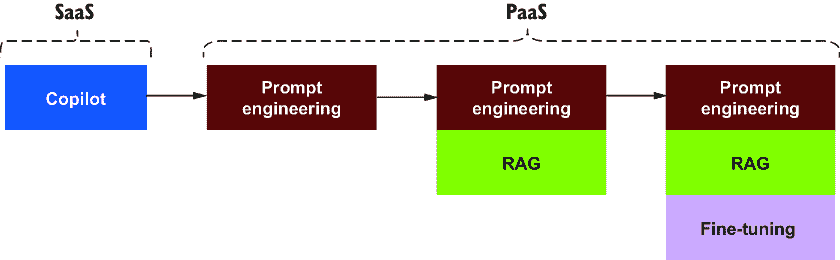
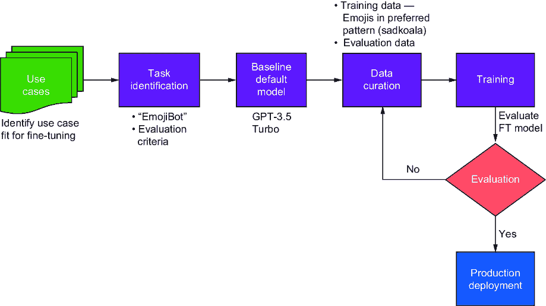
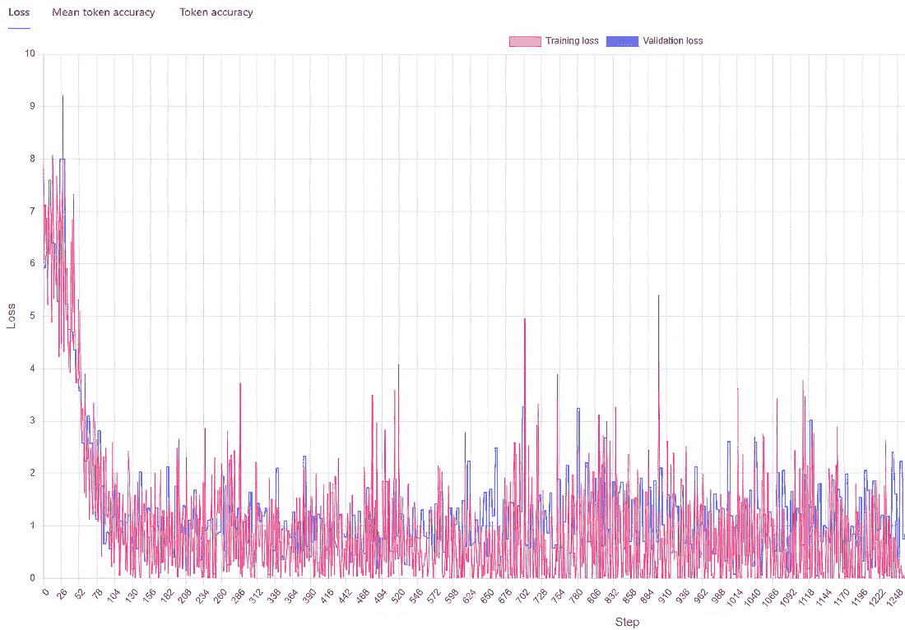
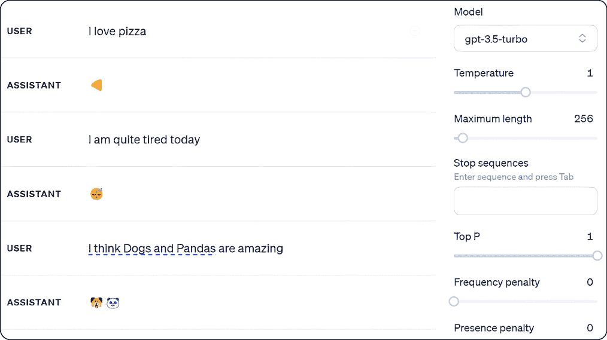
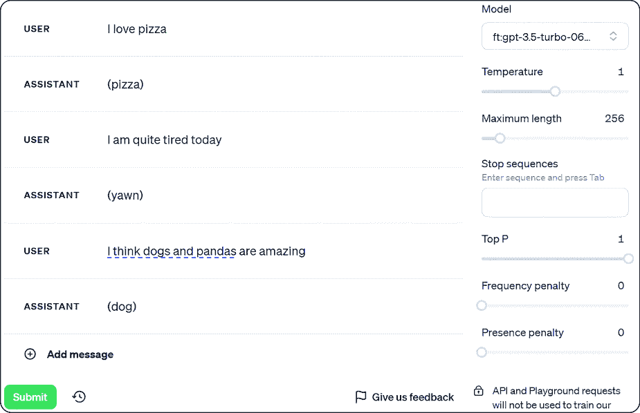
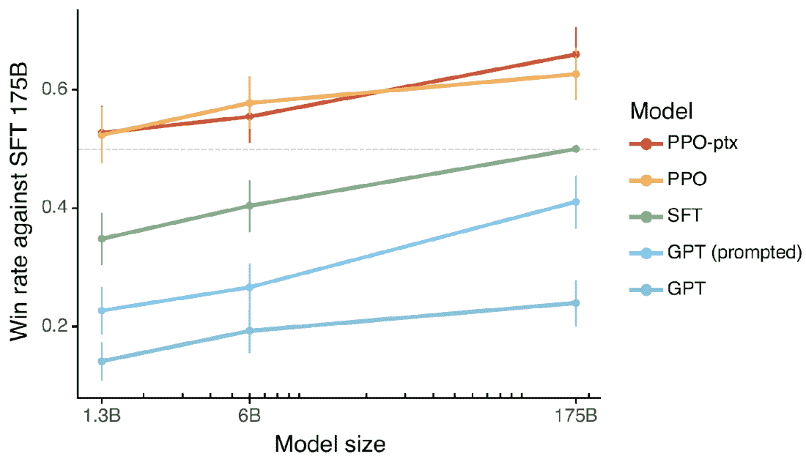

# 使用模型适应和微调定制模型

### 本章涵盖

+   模型适应的基础及其优势

+   如何训练 LLM

+   如何使用 SDK 和 GUI 微调 LLM

+   微调 LLMs 的评估标准和指标的最佳实践

+   如何部署微调模型进行推理

+   获得关键模型适应技术的见解

在探索大型语言模型（LLMs）错综复杂的世界的进程中，一个在实用人工智能（AI）部署的前沿关键概念是模型适应的概念。在 LLMs 的背景下，模型适应涉及修改预训练模型，如 GPT-3.5 Turbo，以增强其在特定任务或数据集上的性能。这个过程很重要，因为虽然预训练模型提供了对语言和上下文的广泛理解，但它们可能只有通过适应才能在特定任务上表现出色。

模型适应包括一系列技术，每种技术都旨在将模型广泛的一般知识定制到特定应用中。模型适应的道路不仅关乎性能的提升，而且关乎将通用人工智能模型转变为擅长处理企业解决方案复杂需求的专用工具。

对于企业来说，适应能力使得大型语言模型（LLMs）能够处理行业特定的术语，在某些情况下遵守监管标准，并与企业独特的运营环境保持一致。这种相关性对于部署能够为企业环境增加价值的 AI 解决方案至关重要。值得注意的是，大多数组织应避免直接跳到微调。我们需要将其视为一系列技术的连续体，相互叠加和补充；此外，它们并非相互排斥。我们已经在书中看到了许多这样的技术。对于大多数组织来说，如果他们在使用的应用程序中有一个如协同驾驶员之类的 SaaS 产品，那么这就是最好的起点。该应用程序使用 GenAI 实现的 SaaS 即用产品，并具有最大的投资回报率。

在 SaaS 解决方案既不可用也不合适，且更倾向于 PaaS 方法的情况下，建议从提示工程作为基础步骤开始，并在此基础上扩展。当我们需要使用我们的数据来定位模型生成时，我们将使用检索增强生成（RAG）与提示工程相结合，如图 9.1 所示。当使用 GPT-4 等高级前沿模型时，这种组合解决了 95%的企业业务案例。在这个连续体的某个点上，企业将达到需要针对特定要求微调模型的需求。即使我们进行了微调，这也不消除使用提示工程和 RAG 的需求。我们将在章节中看到这种情况，当我们微调和使用一个仍然需要提示工程来获得预期结果时。

本章概述了各种模型适应技术，帮助我们了解它们的挑战，了解企业如何采用应用，并最终在生产中微调和部署模型。让我们先了解什么是模型适应。



##### 图 9.1 模型适应技术进展

## 9.1 什么是模型适应？

模型适应是调整 LLM 以在特定领域中的特定任务上表现更好，这与迁移学习非常相似。这两种方法都涉及使用预训练模型作为起点。这些模型通常在大型数据集上训练，并发展了对各种特征和模式的稳健理解。模型适应和迁移学习的关键思想是，从一个任务上训练的模型中提取，并将其应用于不同但相关的任务。这节省了时间和资源，否则这些资源将用于从头开始训练模型。

如我们所知，LLM 是在大量通用文本数据上训练的，这使它们对语言有广泛的理解。然而，它们可能不适合需要专业知识或词汇的某些任务或领域。

模型适应背后的主要思想是，从原始任务中学到的知识可以帮助在新任务上的表现。在较高层次上，模型适应主要有两大类—领域和任务：

+   *领域适应*—如果你有一个在一个领域（例如，一般新闻文章）中训练的模型，并希望它在不同但相关的领域（例如，医学新闻文章）中表现良好，你将使用领域适应技术。

+   *任务适应*—如果你有一个针对一个任务（例如，情感分析）训练的模型，并且希望它执行一个新但相关的任务（例如，情绪检测），可以使用任务适应技术。

例如，在维基百科文章上训练的 LLM 可能在医学问题或法律文件上表现不佳。因此，需要模型适应来对 LLM 进行微调，使其在更小、任务特定或领域特定的数据集上学习，这有助于模型学习针对目标任务或领域的相关模式和特征。

### 9.1.1 模型适应基础

在 LLM 中的模型适应涉及对预训练模型进行微调，以更好地适应特定任务或数据。这个概念可以大致分为两大类：

+   *全微调*—这种方法更新所有 LLM 参数。它涉及在新的数据上对模型进行全面的重新训练，对其学习到的模式进行重大改变。

+   *低秩适应*—与全微调不同，低秩适应专注于修改模型参数的较小集合。这种方法在每个 LLM 层中引入可训练的矩阵，有效地减少了需要调整的参数数量。本节将主要关注这类模型适应。

让我们深入了解支撑模型适应的关键技术：

+   *迁移学习*——这种机器学习（ML）策略涉及将一个任务训练的模型应用于不同但相关的任务。例如，在英语文本上训练的模型可能被调整为处理法语文本。迁移学习是关于使用一个领域的知识来提高另一个领域的性能。

+   *微调*——微调继续在新的、通常较小且更专业的数据集上训练预训练模型。它微妙地调整模型的参数，以使模型的知识与新的任务或数据保持一致。

根据任务、数据和特定 LLM 的不同，可以应用不同的模型适应技术：

+   *特定任务的模块*——这种技术向 LLM（大型语言模型）添加一个模块（例如分类器或解码器），针对特定任务进行定制。然后，模块和 LLM 都将在特定任务数据上进行微调。这允许 LLM 学习特定任务的复杂性，同时保持其广泛的语用知识。

+   *低秩适应（LoRA）*——LoRA 对 LLM 应用低秩近似，并仅对这些组件进行微调。这种方法减少了需要调整的参数数量，同时保持模型的表现力和灵活性。

+   *联邦学习*——这种方法在多个分布式数据集上微调 LLM，允许模型从多样化的数据中学习，同时维护隐私。例如，联邦学习可以利用来自不同医院的医疗数据来适应 BERT 进行医学文本分析，从而产生一个专门的版本，如 Med-BERT。

没有任何单一的技术是普遍适用的——实验是关键。理解这些细微差别对于有效地使用模型适应和微调至关重要。这些方法体现了迁移学习原则，并提供了增强 AI 模型在不同场景下的性能和适用性的实用方法。

### 9.1.2 企业优势和挑战

模型适应在某些特定行业和场景中对企业越来越重要。它提供了显著的效率、竞争力和创新优势。通过使用适应的 AI 模型，企业可以在更短的时间内、使用更少的资源实现比从头开始开发模型更准确的结果。例如，在高度专业化的领域（例如医疗和制药），其中误差范围需要接近零，为特定任务微调模型是达到预期结果的一小部分方法。其他专业领域，如复杂的金融细节（例如欺诈检测）和遗留代码迁移（例如 Cobol 等），是企业希望考虑微调模型的高价值示例。

此外，企业还可以在特定任务上表现更好，并凭借用例获得竞争优势。这在企业处理独特数据集并需要模型理解其特定业务背景的情况下尤其如此。模型适应性允许定制，提高情感分析、市场趋势预测或个性化客户互动的准确性和相关性。通过使用针对其特定需求定制的模型，企业可以获得见解并提高效率，这将在其市场上提供竞争优势。

企业可以通过减少资源需求和需求来提高效率和节省成本。与从头开始训练模型相比，微调现有模型需要显著更少的计算能力和数据，这导致成本更低和部署时间更快。例如，训练 Llama 2 的 70B 参数模型花费了数月时间和 1,720,320 个 GPU 小时，而微调 GPT-3.5 Turbo 模型只需几个小时。

模型适应性伴随着挑战，必须考虑几个关键领域。首先，特定任务的数据至关重要。拥有足够的数据来微调一个大型语言模型（LLM）是必要的，确保这些数据是干净、一致且能代表特定任务的。根据任务和 LLM 的特性，这些数据可能需要预处理、增强或标注。确定用于微调的数据量是否足够可能是一个复杂的过程，因为它取决于多个因素；至少，它需要几百到几千个示例，具体取决于模型。

确定如 OpenAI 的 GPT-3.5 等模型的适当数据量取决于各种因素。任务的复杂性和特定性极大地影响了数据需求，更复杂的任务需要更多的数据。然而，数据质量至关重要，通常比数量更重要。更大的模型如 GPT-3.5 由于其广泛的能力，可以从更多的数据中受益，但它们也可以从较小的高质量数据集中有效地学习。组织通常从一个基线数据集开始，并根据模型的表现进行调整，模型的表现会持续监控以寻找过度拟合或欠拟合的迹象。实际约束，如计算资源和时间，也在确定数据集大小方面发挥作用。数据科学家的经验和专业知识通常指导决策。比较分析和持续评估涉及找到特定任务需求的数据数量和质量的最佳平衡。

另一个重大挑战与计算资源和成本相关。微调 LLM 可能需要大量资源且成本高昂，通常需要连接高速内存的大量处理能力（特别是 GPU）。为了管理这一点，可能需要利用云服务、投资专用硬件或采用分布式系统。此外，访问预训练 LLM 的成本可能因提供商和许可协议而异，这可能会增加总体费用。

性能和泛化也是关键考虑因素。评估微调 LLM 的性能是必不可少的；这涉及到将其与其他模型或已建立的基线进行比较，确保微调的 LLM 不会过度拟合训练数据，并且能够很好地泛化到新的或未见过的输入。我们将在本章后面介绍评估方法，有关基准和关联工具的更多细节将在第十二章介绍。

使用微调 LLM 的伦理和社会影响也必须得到解决。这包括理解潜在的风险和偏差，例如与数据隐私、模型公平性和社会影响相关的担忧。遵守适当的指南、标准或法规是确保微调 LLM 的道德和负责任使用所必需的。

最后，找到合适的人才至关重要。对专业人才和专业知识的需求是成功微调 LLM 的重要因素，这包括对机器学习（ML）、自然语言处理（NLP）和 LLM 的具体架构有深刻理解的个人。这些专家必须擅长多个领域，如数据准备、模型架构设计、训练策略和性能评估。对熟练人员的需求给本已复杂的 LLM 微调过程增加了另一层挑战。

## 9.2 何时微调一个 LLM

微调是一种提高模型在特定任务上性能的技术。然而，它应该是最后的选项，并且仅在应用其他技术（如提示工程和 RAG）之后使用。这些技术相互补充，应该堆叠以获得最佳输出，即使在使用微调模型时也是如此。正如我们在前面的章节中看到的，提示工程和 RAG 不是相互排斥的，而是互补的，即使在微调时也应该堆叠。这种堆叠方法即使在使用微调模型时也能提供最佳输出。

一旦我们决定微调模型，我们就准备用于训练的数据集，并开始微调过程，这个过程可能需要几个小时到几天。训练完成后，我们将评估微调模型与基模型和特定任务的基线。

让我们用一个例子来帮助我们微调和理解各个方面。假设我们想要调整一个模型以使用表情符号进行响应——一个能够理解我们提出的问题但只使用表情符号进行响应的机器人。我们将称之为 EmojiBot。我们想要微调 GPT-3.5 Turbo 并使其成为 EmojiBot。但为了表明这些表情符号是不同的，并且针对特定任务而专门设计的，我们不希望看到我们在聊天应用、社交媒体或我们的文本中期望看到的那种表情符号。相反，我们希望看到那些遵循 Microsoft Teams 使用的格式的表情符号。

图 9.2 展示了微调的高级流程。首先，我们确定一个可以从微调中受益的任务（例如 EmojiBot）。我们识别哪些特征不符合任务要求，并创建评估标准。然后，我们将默认模型的性能与我们的需求进行比较。如果表现良好，我们建立基线并整理微调所需的 dataset。数据的数量和格式取决于模型；我们将在后面详细说明。经过训练后，我们获得一个微调模型，这可能需要数小时或数天，具体取决于任务。接下来，我们必须使用定性和定量指标，将其与基模型和特定任务的基线进行比较。



##### 图 9.2 微调端到端流程

第一个微调模型通常会比默认模型差，这是相当常见且几乎可以预见的。通常，找到一个合适的部署模型需要 10-12 次训练迭代。每次迭代都需要调整训练数据以解决薄弱环节，这可能需要数小时到数天。这是一个耗时且费力的过程，应该是最后一步之一。

注意：微调可以增强模型在类似微调 dataset 中概述的任务上的性能。这个过程可能表现为提高准确性、更相关的响应或对特定领域语言的更好理解。在更便宜或更快的模型方面提高性能是一个附带优势，并不保证。一种实现方式是在特定任务上微调一个较小的模型，如 GPT-3.5 Turbo，而不是使用更昂贵、更强大的模型，如 GPT-4。

现在我们已经确定了一个有意义的微调任务——即一个 EmojiBot，我们想要以某种模式使用表情符号进行响应——让我们检查微调 LLM 如 GPT-3.5 Turbo 所需的步骤。

### 9.2.1 微调 LLM 的关键阶段

当我们想要针对一个已识别的任务微调模型时，如图 9.6 和 9.3.5 节所述，有五个关键阶段：

1.  *选择模型和微调方法*——为了微调语言模型，有必要选择适合任务和数据的基座模型。各种模型可供选择，例如 GPT、BERT 和 RoBERTa。考虑因素包括模型对任务的适用性、输入/输出大小、数据集大小和技术基础设施。微调方法可以根据任务和数据而变化，例如迁移学习、顺序微调或特定任务微调。

1.  *数据整理*——这一阶段涉及为微调准备特定任务的训练数据集，主要涉及准备和预处理数据集。这个过程通常包括数据清洗、文本归一化（例如，分词）以及将数据转换为与 LLM 输入要求兼容的格式（例如，数据标注）。确保数据代表任务和领域，并涵盖模型在生产中预期遇到的多种场景至关重要。

1.  *微调*——这一阶段是实际的微调过程，涉及在特定任务数据集上训练预训练的 LLM。训练过程包括优化模型的权重和参数，以最小化损失函数并提高其在任务上的性能。微调过程可能涉及在训练集上进行多轮训练，验证验证集，以及超参数调整以优化模型性能。

1.  *评估*——一旦微调过程完成，我们必须在测试数据集上评估模型的表现。这有助于确保模型在新数据上具有良好的泛化能力，并在特定任务上表现良好。常用的评估指标包括准确率、精确率、召回率、F1 分数、双语评估助手（BLEU）、基于召回的摘要评估助手（ROUGE）等等。这个主题将在 9.3.2 节中详细讨论。

1.  *部署（推理）*——一旦微调模型经过评估并且我们对它的性能感到满意，它就可以部署到生产环境中。部署过程可能涉及将模型集成到更大的系统中，设置必要的基础设施，并监控模型在实际场景中的性能。

现在我们已经了解了模型适应的基本概念以及何时进行微调，让我们看看如何进行微调。

## 9.3 微调 OpenAI 模型

在这里，我们将通过一个示例来微调 OpenAI 的 GPT-3.5 Turbo 模型。目前，对于 OpenAI，只有 GPT-4、GPT-3.5 Turbo、GPT-3 Babbage（Babbage-002）和 GPT-3（Davinci-002）可用于微调。一些开源 LLM，如 Meta 的 Llama 2 和 G42 的 Falcon，也可以进行微调。在我们的案例中，书籍的 GitHub 仓库（[`bit.ly/GenAIBook`](https://bit.ly/GenAIBook)）包含了我们使用和展示如何微调 OpenAI GPT-3.5 Turbo 的完整代码示例和截图。为了尽可能使组织感到真实，我们将通过使用 Azure OpenAI 和 OpenAI 来展示这个过程。

我们希望微调 GPT-3.5 Turbo 并使其成为 EmojiBot，其中模型只以表情符号回应。然而，正如我们之前概述的，我们希望表情符号遵循 Microsoft Teams 使用的格式。

在 Microsoft Teams 中，括号中的文本，如`(dog)`，会渲染相关的表情符号。我们将微调模型以响应此类文本，这代表我们希望模型改进的特定任务。要了解所有不同的选项和在 Teams 中的相应文本，请参阅[`bit.ly/TeamEmojis`](https://bit.ly/TeamEmojis)。鉴于我们有一个任务，让我们开始准备数据集。

### 9.3.1 准备微调数据集

现在我们已经到达了一个点，我们确定了一个适合微调的任务，我们需要创建一个用于微调的示例数据集。我们需要创建两组数据集：一组用于训练，另一组用于验证。验证数据集是用于评估微调模型在目标任务上性能的数据子集。它与训练数据集不同，训练数据集用于更新模型的参数，而测试数据集用于衡量模型的最终准确率。

验证数据集对于微调 LLMs 非常重要，因为它帮助我们避免过拟合，即模型学习训练数据的特定模式，但无法推广到新数据。使用验证数据集，您可以监控模型的进度并调整学习率、epoch 数量或其他超参数以优化模型性能。

这些示例应展示解决问题的不同方法以及每种方法的成果。我们还需要使用基础模型（如边缘案例上的不一致性能、无法在上下文窗口中足够地适应提示以引导模型、高延迟等）来识别不足之处。

强烈建议使用验证数据集来衡量微调的有效性。训练和验证数据集都是 JSONL 格式，每行包含一个具有文本键的 JSON 对象，用于输入文本，以及一个目标键，用于期望的输出文本。

微调模型与高质量的训练数据直接相关。不同的模型需要不同数量的训练数据。为了有效训练，我们需要数百到数千个精心挑选的数据示例。尽管 API 要求至少 10 个示例，但通常拥有更多示例更好。10 个示例不足以对 LLMs 如 GPT-3.5 Turbo 产生任何显著影响。

OpenAI 建议至少有 50 个好的示例来训练我们的模型。他们还建议比坏示例更多的好示例，因为那些示例可能会对模型产生负面影响。因此，建议只使用您内部数据中的最佳示例。以下列表显示了一个用于聊天数据的示例 JSONL 文件。

##### 列表 9.1 JSONL 示例

```py
{"messages": [{"role": "system", "content": "You're a chatbot that only responds with emojis!"}, {"role": "user", "content": "I heard the koala habitat was destroyed by the fire."}, {"role": "assistant", "content": "(sadkoala)" }]}

{"messages": [{"role": "system", "content": "You're a chatbot that only responds with emojis!"}, {"role": "user", "content": "I've been working nonstop and need a break."}, {"role": "assistant", "content": "(tired)" }]}

{"messages": [{"role": "system", "content": "You're a chatbot that only responds with emojis!"}, {"role": "user", "content": "I just finished reading an amazing book!"}, {"role": "assistant", "content": "(like)" }]}
```

如我们所见，模型正在被展示如何使用特定格式的表情符号来响应，例如 `(sadkoala)`、`(tired)` 和 `(like)`。

#### 基本检查

在微调之前，对训练数据进行基本检查非常重要，以避免浪费时间和资源。这些检查可以包括数据可读性、格式验证、缺失对的分析以及令牌长度。

我们通过使用`basic_checks()`函数加载和读取数据文件来验证数据文件。该函数接受一个文件名作为输入，并返回找到的消息数量。消息必须采用聊天完成格式，以便微调 GPT-3.5 Turbo。

##### 列表 9.2 数据集验证：基本检查

```py
# Basic checks to ensure the data file is valid
def basic_checks(data_file):
    try:
        with open(data_file, 'r', encoding='utf-8') as f:    #1
            dataset = [json.loads(line) for line in f]       #2

        print(f"Basic checks for file {data_file}:")
        print("Count of examples in training dataset:", len(dataset))
        print("First example:")                              #3
        for message in dataset[0]["messages"]:             #4
            print(message)
        return True
    except Exception as e:
        print(f"An error occurred in file {data_file}: {e}")
        return False
```

#1 以读取模式打开文件

#2 将文件的每一行加载为 JSON 对象，并将其存储在列表中

#3 打印数据集中的第一个示例，并帮助视觉检查事物是否直观上看起来正常

#4 遍历第一个示例中的消息并打印每个消息

#### 格式检查

在完成基本检查后，下一步是检查文件格式，并确保在进一步处理之前它被正确地结构化。这是一个重要的步骤，主要是因为即使格式不正确，我们在开始训练作业时也不会得到错误，但生成的模型将非常糟糕，我们只有在部署后才会意识到这一点。为了避免许多这样的麻烦，强烈建议我们检查格式。

列表 9.3 展示了 `format_checks()`，它检查聊天完成格式和配对，其两个参数是数据集和文件名。它捕获了大多数错误，但不是所有错误。该函数遍历数据集中的每个示例，并检查数据类型检查、消息列表的存在和消息键。它验证是否有相关的角色和内容验证。此函数还有助于调试数据相关的问题。

##### 列表 9.3 数据集验证：检查格式

```py
def format_checks(dataset, filename):
    # Initialize a dictionary used to track format errors
    format_errors = defaultdict(int)

    # Iterate over each example in the dataset
    for ex in dataset:
        # Check if the example is a dictionary, if not 
        # increment the corresponding error count
        if not isinstance(ex, dict):
            format_errors["data_type"] += 1
            continue

        # Check if the example has a "messages" key, 
        # if not increment the corresponding error count
        messages = ex.get("messages", None)
        if not messages:
            format_errors["missing_messages_list"] += 1
            continue

        # Iterate over each message
        for message in messages:
            # Check if the message has "role" and "content" keys,
            # if not increment the corresponding error count
            if "role" not in message or "content" not in message:
                format_errors["message_missing_key"] += 1

            # Check if the message has any unrecognized keys,
            # if so increment the corresponding error count
            if any(k not in ("role", "content", "name", 
                   ↪"function_call") for k in message):
                format_errors["message_unrecognized_key"] += 1

            # Check if the role of the message is one of the recognized
            # roles, if not increment the corresponding error count
            if message.get("role", None) not in (
                "system",
                "user",
                "assistant",
                "function",
            ):
                format_errors["unrecognized_role"] += 1

            # Check if the message has either content or a function call, 
            # and if the content is a string, if not increment the 
            # corresponding error count
            content = message.get("content", None)
            function_call = message.get("function_call", None)
            if (not content and not function_call) or not 
            ↪isinstance(content, str):
                format_errors["missing_content"] += 1

        # Check if there is at least one message with the role "assistant",
        # if not increment the corresponding error count
        if not any(message.get("role", None) == "assistant" 
        ↪for message in messages):
            format_errors["example_missing_assistant_message"] += 1

    # If there are any format errors, print them and return False
    if format_errors:
        print(f"Formatting errors found in file {filename}:")
        for k, v in format_errors.items():
            print(f"{k}: {v}")
        return False

    print(f"No formatting errors found in file {filename}")
    return True
```

最后，我们还应该了解数据集在简单数据分布、令牌计数和成本方面的表现。

注意：令牌计数很重要，不仅仅是因为成本。如果它超过了模型可以处理的令牌最大数量，它将被截断而不会发出警告。提前了解这一点非常有帮助。

下面的列表显示了我们可以如何完成对数据集的检查。

##### 列表 9.4 数据集验证：成本估算和基本分析

```py
# Pricing and default n_epochs estimate
MAX_TOKENS = 4096

TARGET_EPOCHS = 3
MIN_TARGET_EXAMPLES = 100
MAX_TARGET_EXAMPLES = 25000
MIN_DEFAULT_EPOCHS = 1
MAX_DEFAULT_EPOCHS = 25

def estimate_tokens(dataset, assistant_tokens):
    # Set the initial number of epochs to the target epochs
    n_epochs = TARGET_EPOCHS

    # Get the number of examples in the dataset
    n_train_examples = len(dataset)

    # If the examples total is less than the minimum target
    # adjust the epochs to ensure we have enough examples for
    # training
    if n_train_examples * TARGET_EPOCHS < MIN_TARGET_EXAMPLES:
        n_epochs = min(MAX_DEFAULT_EPOCHS, MIN_TARGET_EXAMPLES 
           ↪// n_train_examples)
    # If the  number of examples is more than the maximum target
    # adjust the  epochs to ensure we don't exceed the maximum 
    # for training
    elif n_train_examples * TARGET_EPOCHS > MAX_TARGET_EXAMPLES:
        n_epochs = max(MIN_DEFAULT_EPOCHS, MAX_TARGET_EXAMPLES 
          ↪// n_train_examples)

    # Calculate the total number of tokens in the dataset
    n_billing_tokens_in_dataset = sum(
        min(MAX_TOKENS, length) for length in assistant_tokens
    )

    # Print the total token count that will be charged during training
    print(
        f"Dataset has ~{n_billing_tokens_in_dataset} tokens that 
            ↪will be charged for during training"
    )

    # Print the default number of epochs for training
    print(f"You will train for {n_epochs} epochs on this dataset")

    # Print the total number of tokens that will be charged during training
    print(f"You will be charged for ~{n_epochs * 
                        ↪n_billing_tokens_in_dataset} tokens")

    # If the total token count exceeds the maximum tokens, print a warning 
    if n_billing_tokens_in_dataset > MAX_TOKENS:
        print(
            f"WARNING: Your dataset contains examples longer than 
                       ↪4K tokens by {n_billing_tokens_in_dataset – 
                       ↪MAX_TOKENS} tokens."
        )
        print(
            "You will be charged for the full length of these 
             ↪examples during training, but only the first
             ↪4K tokens will be used for training."
```

### 9.3.2 LLM 评估

评估 LLM 对于确保其质量、可靠性和公平性非常重要。然而，评估 LLM 是复杂的，因为它涉及多个维度和挑战。维护多样化的自动指标可以帮助在适应周期中有效地跟踪模型改进，同时减少昂贵的手动审查。指标应根据每个适应模型的使用案例和业务需求进行定制。从生产系统持续记录可以启用对随时间推移的实时性能的评估。

将微调后的 GPT 模型与基线进行基准测试是评估微调模型的一个重要步骤。这涉及到将微调模型的性能与预先建立的标准或基线模型进行比较。这个基线可能是微调前的模型性能或在不同任务中因其熟练度而知名的不同模型。这种比较的目的是量化微调带来的改进。例如，在语言翻译任务中，微调后的模型可能被与标准翻译模型进行基准测试，以评估翻译准确度或流畅性的改进。这个过程有助于了解微调的有效性，并确定模型改进或仍需增强的领域。

#### 评估标准

在准备微调数据集时，我们还应该定义评估标准。在微调过程中，评估过程首先通过建立明确的评估标准来开始，这些标准对于评估模型在其预期应用中的性能和有效性至关重要。这些标准通常包括相关性、连贯性、准确性和语言流畅性（表 9.1）。

##### 表 9.1 微调评估标准

| 评估标准 | 描述 |
| --- | --- |
| 相关性 | 衡量模型响应或输出与输入上下文和意图的匹配程度。这在聊天机器人等应用中尤为重要，在这些应用中，提供上下文适当的响应对于用户满意度至关重要。相关性通常通过检查模型是否能够保持主题并提供与查询或任务直接相关的信息或响应来评估。 |
| 连贯性 | 指的是模型输出的逻辑一致性。一个微调后的模型应该生成上下文相关、逻辑合理且连贯的文本。这意味着响应应该遵循逻辑结构和叙事流程，在对话或文本上下文中有意义。连贯性对于保持用户参与度和确保模型输出可理解且有意义至关重要。 |
| 准确性 | 这在模型用于涉及事实信息任务时尤其重要，例如教育工具、信息机器人或任何提供正确信息至关重要的应用。准确性是通过模型响应与事实正确性和客观真理的一致性来衡量的。 |
| 语言流畅性 | 涉及模型输出的语法和句法正确性。即使模型高度相关、连贯和准确，较差的语言流畅性也会显著影响用户体验。这包括正确的语法、标点符号和风格，确保生成的文本正确且对最终用户来说读起来自然。 |

使用这些标准评估微调后的 GPT 模型涉及自动指标、人工审查和用户反馈的结合，确保模型满足其特定应用所需的高标准。

#### 选择适当的指标

在微调模型时，选择合适的评估指标对于准确评估模型性能和改进至关重要 [1]。微调后，这些指标表明模型如何适应特定任务或领域。它们提供了对模型性能各个方面的见解，例如预测准确性、语言质量和特定任务的有效性。企业应尽可能寻找自动化的指标评估，并拥有一套定量和定性指标。

+   定量指标：

    +   几个指标有助于衡量模型输出与人类参考文本之间的重叠。下一节将概述其中的一些（BLEU、ROUGE、METEOR 等）。

    +   F1 分数评估了精确度和召回率之间的准确度权衡。

    +   困惑度评估生成文本的模型不确定性/信心。

    +   任务完成度用于目标导向的对话系统和成功任务解决的百分比。

+   定性指标：

    +   *流畅性*—评估输出的语法和可读性

    +   *连贯性*—逻辑一致性和叙事流畅性

    +   *简洁性*—避免重复和过多的文字

    +   *事实准确性*—避免客观错误

指标的选择应与模型的预期应用相一致，无论是翻译、摘要、分类还是创意内容生成。如困惑度、BLEU 分数、ROUGE、F1 分数和人工评估等指标各自提供了对模型能力的独特视角，有助于确保对微调模型性能的全面和平衡评估。让我们更详细地看看每个指标：

+   *困惑度*—这是语言模型中的标准指标，用于量化模型预测样本的能力。它衡量语言模型在预测序列中的下一个标记时的不确定性 [2]。较低的困惑度分数表明模型在预测方面更加自信和准确。这在微调中尤为重要，因为它可以反映模型对新风格或文本领域的适应程度。它是评估语言生成任务改进的关键指标。

+   *BLEU 分数（双语评估辅助研究）*—BLEU 分数通过将其与参考翻译进行比较来评估机器翻译质量。它计算匹配的词组并基于这些匹配计算分数。较高的 BLEU 分数表明翻译质量更好，但它有局限性，可能无法捕捉语义准确性或流畅性 [3]。

+   *ROUGE（基于回忆的摘要评估的辅助研究）*—ROUGE 是用于自动摘要评估的指标。它通过衡量计算机生成的输出与参考摘要之间的重叠来评估摘要的质量。ROUGE 的不同变体提供了对摘要质量方面的见解 [4]。

+   *F1 分数*——F1 分数在分类任务（如情感分析和主题分类）中很有用。它平衡了精确度和召回率之间的权衡，提供了一个衡量模型在分类或分类文本中的准确性的单一指标。

+   *人工评估*——尽管自动化指标很有用，但人类判断仍然至关重要，特别是对于需要主观评估的任务，如故事生成、创意写作和对话代理。人工评估者可以提供关于文本的自然性、适宜性、创造力和甚至幽默或讽刺的细微差别等方面的见解。这种定性评估补充了定量指标，为模型性能提供了一个更全面的视角。

任务特定评估对于衡量模型在预期应用中的性能至关重要。它涉及根据任务使用不同的指标和考虑因素。例如，摘要模型使用 ROUGE 分数和人工摘要的连贯性和信息性评估进行评估。同样，问答模型根据给定问题的准确性和相关性进行评估。这种评估确保模型在一般指标上表现良好，并且对于其特定用例来说既有效又可靠。

#### 错误分析

错误分析是评估过程中的一个关键组成部分，涉及对微调模型性能不佳的原因和地点的详细检查。这种分析有助于识别模型错误中的模式，这些模式可以按类别分解为语义错误、事实不准确或语言不一致。

例如，如果一个模型在理解某些类型的查询或生成包含事实错误的响应时持续出错，这将在错误分析中突出显示。理解这些错误模式对于进一步改进模型和进行有针对性的改进至关重要。它还有助于理解模型的局限性以及可能需要更多数据或更复杂的微调方法的领域。现在让我们进入微调阶段。

### 9.3.3 微调

现在我们已经准备好了并验证了数据集，我们可以启动微调过程。当我们需要微调时，有两个步骤要执行。首先，我们上传在前几节中工作的数据集。上传后，每个文件都会获得一个唯一的文件 ID，我们需要保存这个 ID。这个文件 ID 是我们传递给微调作业的一个参数之一，以便它知道使用哪个文件进行哪个微调作业。

我们可以使用 API 或 GUI 来完成这个任务。我们将通过 Python SDK 和 Azure AI Studio 展示如何实现这一点。我不会在 GUI 手册中展示所有步骤，但这些详细信息可以在配套的 GitHub 仓库[`bit.ly/GenAIBook`](https://bit.ly/GenAIBook)中找到。让我们先使用 SDK。

#### 使用 SDK 进行微调

以下列表显示了如何使用 SDK 和 `files.create()` 方法，传入文件名，并指定文件的目的（`fine-tune`）。

##### 列表 9.5 上传数据集进行微调

```py
import os
from openai import AzureOpenAI

API_VERSION = '2023-09-15-preview'                   #1

client = AzureOpenAI(
    api_key=os.getenv('AOAI_FT_KEY'),                #2
    api_version=API_VERSION,
    azure_endpoint = os.getenv('AOAI_FT_ENDPOINT'))  #2

TRAINING_FILENAME = 'data/emoji_FT_train.jsonl'       #3

# Upload the training dataset files
file = client.files.create(
    file=open(TRAINING_FILENAME, "rb"),
    purpose="fine-tune"
)

print("Training file ID:", file.id)
print("Training file name:", file.filename)
```

#1 此版本（或更高版本）是进行微调所必需的。

#2 包含连接详情的环境变量

#3 我们需要用于训练的数据集

当我们运行此代码片段时，我们获得以下输出，其中包含我们在运行第二步时需要了解的文件 ID：

```py
Response:
 Training file ID: file-ca4c57d7ad814211a2db49e0382c5a77
 Training file name: emoji_FT_train.jsonl
```

在上传我们的文件后，我们必须开始微调作业。当使用 SDK 时，这是通过 `fine_tunings.jobs.create()` 方法完成的。此函数需要来自之前步骤的训练数据集文件 ID 和要使用的模型。在我们的情况下，我们想要微调 GPT-3.5 Turbo，特别是 0613 模型。我们还指定了微调所需的 epoch 数。最后，`suffix` 参数是我们可以用来自助跟踪和管理微调模型的一个参数。

##### 列表 9.6 开始微调作业

```py
import os
from openai import AzureOpenAI

API_VERSION = '2023-09-15-preview'                        #1

# Connect to the servvice
client = AzureOpenAI(
    api_key=os.getenv('AOAI_FT_KEY'),                      #2
    api_version=API_VERSION,
    azure_endpoint = os.getenv('AOAI_FT_ENDPOINT'))        #2

# Begin by creating the fine-tuning job
ft = client.fine_tuning.jobs.create(
    training_file="file-ca4c57d7ad814211a2db49e0382c5a77",   #3
    model="gpt-35-turbo-0613",
    hyperparameters={
        "n_epochs":3
    },
    suffix="emoji"
)
print("Finetuning job ID:", ft.id)
```

#1 此版本（或更高版本）是进行微调所必需的。

#2 包含连接详情的环境变量

#3 您看到的文件 ID 将与此不同。

此代码片段提交了一个微调作业，该作业将被排队；根据特定区域和数据中心可用的容量，作业将被执行。提醒一下，使用 Azure OpenAI，您可以在多个区域进行微调。我们的示例显示了我们的 API 调用中的作业 ID：

```py
Finetuning job ID: ftjob-367ee1995af740a0bf24876221585f7a
```

根据数据集大小、我们想要微调的模型以及微调超参数，微调作业可能需要几个小时。微调作业 API 有一个名为 `list()` 的函数调用，我们可以使用它来查看我们已提交的所有微调作业。

##### 列表 9.7 列出所有微调作业

```py
import os
from openai import AzureOpenAI

API_VERSION = '2023-09-15-preview'

client = AzureOpenAI(
    api_key=os.getenv('AOAI_FT_KEY'),
    api_version=API_VERSION,
    azure_endpoint = os.getenv('AOAI_FT_ENDPOINT'))

# List all the FT jobs
ft_jobs = client.fine_tuning.jobs.list()

for ft_job in ft_jobs:
    print(ft_job.id, ft_job.status)
```

列表 9.8 中的输出是一个示例，我们看到我们已经完成了两个微调作业，如 `succeeded` 状态所示；一个作业目前处于 `running` 状态，这意味着有一个正在进行的活跃微调作业。我们刚刚提交的最后微调作业（`ftjob-367ee1995...`）处于 `pending` 状态，这意味着作业将在未来的某个时间排队运行。

##### 列表 9.8 微调作业列表输出

```py
ftjob-367ee1995af740a0bf24876221585f7a pending
ftjob-c41a9dc551834a1aa0be8befe788a22b running
ftjob-1a7faac8856d46e48a038c02555fe6e5 succeeded
ftjob-505d5a8bd321406dbf4605b636b0c0cd succeeded
```

对于一个特定的微调作业，我们还可以看到与该作业相关的各种事件。以下列表显示了此示例，再次使用我们新提交作业的 ID (`ftjob-367ee1995...`)。

##### 列表 9.9 从微调作业中列出事件

```py
import os
from openai import AzureOpenAI

API_VERSION = '2023-09-15-preview'

client = AzureOpenAI(
    api_key=os.getenv('AOAI_FT_KEY'),
    api_version=API_VERSION,
    azure_endpoint = os.getenv('AOAI_FT_ENDPOINT'))

#List all the FT events for the job from
#earier: ftjob-367ee1995af740a0bf24876221585f7a
ft_job_events = client.fine_tuning.jobs.list_events(
    fine_tuning_job_id="ftjob-367ee1995af740a0bf24876221585f7a ", 
    limit=2)

# Loop through the events and print the details
for ft_job_event in ft_job_events:
    print(ft_job_event.id, ft_job_event.message)
```

在这种情况下，输出如下

```py
ftevent-1e89dc7cc62046048bcea50de1cccbb9 Jobs ahead in queue: 1
ftevent-42649f5c7677472f83eaa6cd4cde0dba Job enqueued. 
↪Waiting for jobs ahead to complete.
```

我们还可以每隔几秒轮询检查作业状态，并使用此信息启动另一个工作流程。在这种情况下，此作业运行了大约两小时后完成。为此，我们需要 `IPython` 包，该包可以通过 conda 使用 `conda install ipython` 安装，或者如果使用 pip，则通过 `- pip install ipython` 安装。

##### 列表 9.10 检查微调作业状态

```py
# Define the API version
API_VERSION = '2023-09-15-preview'

# Create an instance of the AzureOpenAI client
client = AzureOpenAI(
    api_key=os.getenv('AOAI_FT_KEY'),
    api_version=API_VERSION,
    azure_endpoint = os.getenv('AOAI_FT_ENDPOINT'))

# Define the job ID of the fine-tuning job to track
JOB_ID = "ftjob-367ee1995af740a0bf24876221585f7a"

# Record the start time of the tracking
start_time = time.time()

# Get the status of the fine-tuning job
ft_job = client.fine_tuning.jobs.retrieve(JOB_ID)
status = ft_job.status

# If the job is not yet done, continue to poll its status every 30 seconds
while status not in ["succeeded", "failed"]:
    ft_job = client.fine_tuning.jobs.retrieve(JOB_ID)
    print(ft_job)

    # Update the status
    status = ft_job.status

    # Print the elapsed time since the start of tracking
    print("Elapsed time: {} minutes {} seconds".format( 
        ↪int((time.time() - start_time) // 60), 
        ↪int((time.time() - start_time) % 60)))

    # Print the current status
    print(f'Status: {status}')

    # Clear the output before displaying new output – prevents flickering
    clear_output(wait=True)

    # Wait for 30 seconds before the next poll
    time.sleep(30)

# Once the job is done, print its final status
print(f'Fine-tuning job {JOB_ID} finished with status: {status}')
```

根据模型和排程微调任务的队列长度，一个微调作业可能需要几个小时才能完成。在这段时间内，我们获得训练指标，帮助我们了解训练过程。

### 9.3.4 微调训练指标

如前所述，训练可能需要几个小时；对于更复杂和更大的模型，可能需要几天。这段时间内的训练不是一个黑盒；我们可以在过程中获取关键指标的具体细节，以获得对正在发生的事情的高级了解。我们有三个关键指标可以跟踪——训练损失、平均标记准确率和标记准确率。

#### 损失

损失有两个方面：训练损失和验证损失。训练损失衡量模型预测与实际结果之间的差异。损失值越低，意味着模型越准确，错误越少。较低的损失值表示模型性能更好，表明模型的预测更接近实际数据。

如果我们有验证数据集（强烈推荐），那么我们还有额外的指标，可以让我们衡量模型的表现。验证损失是一个衡量模型在验证集上误差的指标，验证集是从数据集中预留出来以评估模型在新或未见数据上的性能的部分。验证损失是通过使用与训练损失相同的成本函数，对验证集中的每个示例的错误进行求和来计算的。验证损失通常在每个 epoch 后测量，即对训练集的完整遍历。

图 9.3 展示了使用 Azure OpenAI 微调时的损失示例以及训练过程中的模型性能。图 9.3 中显示的微调训练结果的训练损失图说明了模型从训练数据中学习的效果。

我们可以看到每个训练步骤的损失值，一个训练示例的批次。*x*轴是步骤号，*y*轴是损失值。图表显示，随着模型在更多数据上训练，损失值下降，表明它在提高性能。然而，损失值不会达到零，这意味着模型仍然存在一些错误，无法完美地拟合数据。这是正常的，因为过度拟合数据可能导致对新数据的泛化能力差。



##### 图 9.3 微调 GPT-3.5 Turbo 时的训练损失

为了解释图表并确定模型是否表现良好，理想情况下，为了获得良好的拟合度，我们希望训练和验证损失都降低到稳定状态，两者之间的差距最小，这表明模型正在良好地学习和泛化。如果训练损失下降而验证损失上升，则模型可能过度拟合了训练数据，并且对新数据泛化不佳。最后，如果训练和验证损失都保持较高水平，则模型可能欠拟合，这意味着它没有足够好地学习数据中的潜在模式。必须考虑损失的规模和训练步骤的数量。如果损失仍然很高或验证损失尚未稳定，则模型可能需要更多的训练。对于那些有机器学习模型经验或背景的人来说，在训练和验证数据集之间划分的整体方法和解释这些指标是非常相似的。

一个有趣的行为是损失图中的数据波动，表明损失值可能因每个批次的样本而异。模型存在噪声是正常的；然而，在微调过程中，只要损失随时间下降，模型就会学习和提高其性能。

为了找到微调是否良好，我们通常会寻找接近训练损失的较低且稳定的验证损失。被认为是良好损失值的阈值是主观的，并且将根据任务的复杂性和数据的性质而变化。

#### 均值标记准确度

均值标记准确度衡量了一个微调模型正确预测模型在训练过程中生成的或预测的输出序列中的每个标记的程度。它以百分比的形式反映出来，即模型在数据集中正确预测的标记百分比。例如，如果均值标记准确度为 90%，则表示平均而言，模型正确预测了 90%的标记。这是通过将正确预测的标记数量除以输出中的总标记数量来计算的。

与均值标记准确度的损失类似，我们有两个指标：一个用于训练，另一个用于验证（假设已经提供了一个验证数据集）。图 9.4 显示了训练和验证的微调作业的均值标记准确度。训练均值标记准确度是模型在训练数据上的预测的平均准确度。它衡量模型从训练数据中学习并适应的程度。高训练均值标记准确度表明模型有效地从训练数据中学习。相比之下，验证均值标记准确度是模型在验证数据上的预测的平均准确度。它衡量模型对新数据的泛化能力。高验证均值标记准确度表明模型没有过度拟合训练数据，并且可以很好地泛化到新数据。


##### 图 9.4 训练平均标记准确率

两个指标之间的差异可以帮助识别模型是否过度拟合训练数据。如果训练平均标记准确率远高于验证平均标记准确率，那么这表明模型过度拟合了训练数据，并且对新数据泛化不佳。相反，如果验证平均标记准确率远低于训练平均标记准确率，那么这表明模型欠拟合训练数据，并且没有有效学习。

此指标用于评估微调模型在训练数据上的性能。良好的平均标记准确率可能是相对的，并取决于具体任务或应用。通常，较高的值（接近 1.0）表示更好的性能。然而，它并不反映模型对新或未见数据的泛化能力。

注意，这些指标的解读可能取决于具体任务或应用。因此，考虑其他指标和定性评估以全面了解模型性能至关重要。平均标记准确率的质量取决于任务的复杂性和文本的性质。对于简单任务或具有可预测模式的文本，预期准确率（接近 100%）会更高。对于更复杂任务或多样化的文本，较低的准确率可能仍然很好。

评估平均标记准确率是否良好的一种方法是将它与基线或其他模型在同一任务上的性能进行比较。如果你的模型准确率高于基线或类似模型，这是一个积极的信号。

现在我们已经了解了微调的基本结构和使用 CLI 或代码的方法，让我们看看如何使用 Azure OpenAI 和 GUI 来实现这一点。如前所述，我们将使用 Azure OpenAI 作为示例，但同样的过程也适用于 OpenAI。

### 9.3.5 使用 Azure OpenAI 进行微调

除了使用 SDK 和 CLI，我们还有一个可视化的界面可以用来达到相同的效果。通常，手动操作会比使用代码更有效。要在 Azure OpenAI 中启动微调作业，当登录到 Azure 门户并在 AI Studio 中时，在模型下选择创建自定义模型选项（图 9.5）。

我们通过向导选择上传训练和验证数据集，如图 9.6 所示。注意：如果这些数据集已经使用 SDK 上传，只要它们位于同一租户并且具有相同的端点部署，我们在这里就能找到它们。


##### 图 9.5 Azure AI Studio：创建自定义模型


##### 图 9.6 选择训练和验证数据集

图 9.7 显示了每个训练作业的状态和详情。


##### 图 9.7 训练作业详情

现在我们已经有一个微调好的模型，我们需要将其部署到测试环境中进行评估。

## 9.4 微调模型的部署

微调模型的部署相当简单。新的微调模型会出现在我们的 Azure 租户或 OpenAI 订阅中可供使用的另一个模型，如图 9.8 和 9.9 所示。


##### 图 9.8 部署微调模型进行推理

OpenAI 在游乐场中推出了一项功能，允许用户并排查看微调模型与基础模型的不同之处，这在视觉上可能很有用，但效率不高。


##### 图 9.9 OpenAI 微调模型部署

### 9.4.1 推理：微调模型

返回到我们的任务，我们现在有一个针对 EmojiBot 的微调模型，该模型使用微软团队使用的格式以表情符号的形式进行响应。图 9.10 显示了当要求使用表情符号进行响应时，即插即用的 GPT-3.5 Turbo 模型的表现；这是预期的，但不会与团队一起工作。



##### 图 9.10 使用 GPT-3.5 Turbo 进行表情符号响应

然而，使用我们微调的 EmojiBot 对相同问题的体验相当不同，如图 9.11 所示。在这里，对于之前相同的问题，我们得到了可以在团队中使用的响应格式。



##### 图 9.11 微调 EmojiBot 推理

然而，使用相同的参数设置和之前相同的问题，很容易得到完全错误的结果（图 9.12）。我们可以看到微调模型以表情符号的形式回答——`(Pizza)`和“(Feeling tired)”——但结果并不是我们预期的。


##### 图 9.12 微调 EmojiBot 结果不正确

为了解决这个问题，我们需要调整系统提示，引导模型尽可能使用表情符号进行响应，这是一个很好的方式，通过提醒提示工程、RAG 和微调（当任务需要时）的堆叠方法是几乎所有情况下的正确方法来结束。

现在我们已经看到了如何微调一个模型以及需要采取的步骤，让我们转换一下，看看一些使这项工作得以进行的技术的底层。严格来说，我们不需要这样做微调，但它将帮助我们理解一些细微差别，以实现更好的微调结果。我们将从了解我们如何训练 LLM 和，从高层次来看，涉及哪些步骤开始。

## 9.5 训练 LLM

检查对 LLM 进行完整训练的含义及其所需内容，有助于我们理解模型适应性和相关技术和它们的局限性。从高层次来看，如果我们进行完整训练并从头开始构建一个 LLM，那么这个训练将涉及四个主要阶段，如图 9.13 所示。


##### 图 9.13 LLM 的完整端到端训练 [5]

让我们更详细地了解每个阶段。

### 9.5.1 预训练

基础型大型语言模型（LLMs）在这个初始阶段被构建。我们在第二章中提到了基础型 LLMs。这些是原始的、在大量文本数据集上预训练的模型。它们可以根据在训练期间学到的模式生成文本。有些人也称它们为原始语言模型。

注意：虽然这些基础模型功能强大，但它们对于通用应用来说不太合适，因为它们可能需要将它们的响应与用户的特定意图或指令对齐。它们更像是为文本生成提供原始动力的引擎，缺乏理解并遵循用户提示细微差别的高级能力。基础模型不会回答问题，通常以更多问题作为回应。相比之下，指导者被设计得更加互动和用户友好，这使得它们更适合广泛的用途，从客户服务聊天机器人到教育工具，在这些应用中，准确理解和遵循指令至关重要。

### 9.5.2 监督式微调

监督式微调（SFT）是下一阶段。在这个阶段，基础模型通过高质量、特定领域的数据进行基础模型的精炼。这些数据集由提示-响应对组成，通常是手动创建的（通常由人类承包商创建），数量比前一阶段少，但质量更高。承包商遵循详细的文档来创建这些提示-响应对，确保相关性和质量。与最后的预训练阶段类似，SFT 模型被训练来预测这些对中的下一个标记，但在生成响应时，这些预测在准确性和上下文感知方面较差。

SFT 是一种优化 LLMs 在特定下游任务上的标签数据的技巧，例如情感分析、文本摘要或机器翻译。在本章的后面部分，我们将介绍 SFT 方法和方法的更多细节。

### 9.5.3 奖励建模

第三阶段是奖励建模，这是人类反馈强化学习（RLHF）过程的第一部分。在这个阶段的主要目标是开发一个能够根据其质量和相关性评估和排名响应的模型。为此，SFT 模型（来自前一阶段）针对一个提示生成多个响应，然后由人类承包商根据各种标准进行排名，如领域专业知识、事实核查和代码执行。这些排名训练了一个奖励模型，该模型学会像人类承包商一样评分响应。

### 9.5.4 强化学习

这是 RLHF 过程的第二部分，旨在通过迭代反馈增强语言模型生成高质量响应的能力。在这个最终阶段，奖励模型为许多提示评分了 SFT 模型生成的响应。这些评分被用来进一步训练 SFT 模型，最终导致 RLHF 模型的创建。RLHF 将 LLMs 与人类对特定任务或领域（如聊天、代码或创意写作）的偏好或期望相一致。关于 RLHF 方法的更多细节将在本章后面介绍。

### 9.5.5 直接策略优化

直接策略优化（DPO）[6]是另一种技术，它是一种在 RLHF 中用于微调 LLMs 以符合我们偏好的新型奖励模型参数化。它利用了奖励函数和最优策略之间的关系。只要人类反馈可以用二进制术语表达——即两种选项之间的选择，它就允许我们跳过之前概述的奖励建模步骤。DPO 可以在单个策略训练阶段解决具有约束的奖励最大化问题，本质上将其视为一个分类问题。PPO（见第 9.7 节）需要一个奖励模型和一个复杂的基于 RL 的优化过程；然而，DPO 绕过了奖励建模步骤，并直接在偏好数据上优化语言模型，这可能更简单、更高效。由于 DPO 消除了训练奖励模型的需要，而不是基于该模型训练并优化策略，我们可以直接优化策略。这一特性使得这种方法更快，并且使用的资源比 RLHF 中的 PPO 更少。

## 9.6 模型自适应技术

可用于模型自适应的技术有几种，每种技术都提供其独特的方法，并根据具体要求（即模型大小、可用的计算资源以及所需的适应水平）适用于不同的场景。广泛用于适应 LLMs 的主要技术之一是低自适应排名（LoRA），将在下一节中详细介绍。在 LoRA 中，不是更新模型中的所有权重，而是仅修改作为低秩矩阵引入的小部分参数。这种方法允许高效的训练和自适应，同时保留大多数预训练模型的结构和知识。

参数高效微调（PEFT）是机器学习中的一个概念，指的是适应和微调大型预训练模型（如 GPT-3.5）的方法，以最小化需要更新的参数数量。这种方法在处理大型模型时尤其有价值，因为它减少了计算需求，并可以缓解过拟合等问题。PEFT 技术旨在使微调更加易于访问和高效，特别是对于计算资源有限的用户——LoRA 是 PEFT 方法的一个例子。有关不同类型的 PEFT 技术和详细信息的更多详情，请参阅 Vladislav Lialin 撰写的论文“Scaling Down to Scale Up: A Guide to Parameter-Efficient Fine-Tuning” [7]。

灾难性遗忘是一种现象，即模型在在新任务上进行微调后，在先前任务上表现不佳 [8]。这可能会发生当模型用特定于任务的参数覆盖其原始参数时，从而忘记了从预训练中学到的通用知识。当实施 PEFT 以防止灾难性遗忘时，我们仅微调一小部分参数，同时保持大多数预训练参数固定。这样，模型可以保留其泛化能力，适应新任务而不会失去其先前性能。

监督微调（SFT）是另一种适应技术；它是一种特定的微调类型，其中模型在标记数据集上进行进一步训练。它是监督的，因为训练过程使用的数据集将输入数据与正确的输出（标签）配对。SFT 在分类等任务中特别常见，在这些任务中，模型必须学会将特定的输入与标记的输出关联起来。SFT 是更广泛微调过程的一个子集，专门针对有标记数据可用的场景。

当然，每种技术都有其独特的方法，并且根据具体要求（如模型大小、可用的计算资源以及所需的适应水平）适用于不同的场景。表 9.2 概述了除了 LoRA 之外的一些显著技术。

##### 表 9.2 模型自适应技术

| 技术 | 描述 |
| --- | --- |
| 提示调整 | 提示调整是一种通过提供特定提示或提示来适应 LLMS 以执行不同任务的技巧。它不需要重新训练模型或更新其权重，这使得它比微调更快、更便宜。对于只需要少量适应的任务特别有用。 |
| 适配器模块 | 适配器模型用于 LLM 微调，通过向预训练模型添加小型且特定于任务的模块（小型神经网络）并在特定于任务的数据上仅对这些模块进行训练。它们也是灵活和模块化的，因为可以轻松地为不同任务添加或删除，而不会影响预训练模型。 |
| 仅偏置（BitFit） | 仅偏置（BitFit）是一种通过仅修改模型或其子集的偏置项来微调大型语言模型的技术。它提供了一种简约的适应方法，比 LoRA 需要更少的可训练参数。BitFit 基于微调，主要暴露预训练学到的知识，而不是获取新的特定任务知识。 |
| 层冻结 | 层冻结是一种微调技术，它保持模型的一些层不变，只更新其余部分。这种方法允许对模型哪些方面被适应有更多控制，并可以减少训练时间。 |
| 知识蒸馏 | 涉及训练一个更小、更高效的模型（学生）来模仿一个更大的预训练模型（教师）的行为。这种方法对于在资源受限的环境中部署大型语言模型很有用。 |
| 元学习 | 专注于训练模型以用最少的数据快速学习新任务；通常涉及在多个任务上进行训练，以便模型可以更有效地适应新的、未见过的任务 |
| 差分隐私微调 | 在微调过程中结合隐私保护技术以保护敏感数据。这对于数据隐私和安全至关重要的应用至关重要。 |
| 从人类反馈中进行强化学习 (RLHF) | 涉及根据来自人类交互或评估的反馈或奖励对模型进行微调。这对于人类判断至关重要的任务很有用，例如内容审核。 |

每种技术都涉及计算资源需求、达到的专业化水平以及保留模型原始能力之间的权衡。技术选择取决于具体应用、部署环境的限制以及模型适应的目标。

现在你对各种技术更加熟悉了，让我们来探索 LoRA，这是微调大型模型如 GPT 的主要技术。

### 9.6.1 低秩适应

LoRA，代表低秩适应[9]，是一种专门为适应大型语言模型（LLM）设计的算法。它提供了一个高效的传统微调方法的替代方案，在微调大型模型可能资源密集且具有挑战性的场景中特别有用。

LoRA 基于对预训练模型进行最小但战略性的修改，而不改变其整个架构。它通过引入低秩矩阵的概念来实现这一点。LoRA 不是修改神经网络的所有权重矩阵，而是将小的低秩矩阵插入到模型中。这些矩阵在正向和反向传播过程中应用于模型的层（注意力和前馈），如图 9.14 所示。正如我们所见，LLMs 建立在由多层组成的深度学习架构之上，这些层旨在处理和理解人类语言。此外，LoRA 还仅对这些低秩矩阵进行选择性重新训练，而原始预训练权重保持冻结。这种选择性重新训练显著减少了所需的计算资源。


##### 图 9.14 LoRA 重新参数化—仅训练 A 和 B [9]

在图 9.14 中，位于图底部的输入(**X**)代表输入到具有预训练权重的层的数据。*A*和*B*是将在微调过程中更新的适应参数，而*W*是保持冻结的原始预训练权重。

当我们想要微调一个任务时，我们可以仅存储和加载与预训练模型一起的几个特定任务的参数。这种方法有助于提高运行时各种下游适应的效率。它为 LoRA 带来了几个优势，包括

+   *资源效率*—LoRA 比传统的全模型微调需要远少的计算能力，使其更适合适应大型模型。

+   *保持泛化能力*—LoRA 通过不改变原始预训练权重，保持了基础 LLM 的泛化能力，同时允许专业化。

+   *更快的适应*—由于更新的参数较少，过程更快，使得适应模型的快速部署成为可能。

+   *可扩展性*—LoRA 对于大型模型特别有效，因为由于资源限制，全模型微调可能不切实际。

LoRA 是一种成本效益高且效率高的语言模型方法，允许快速在任务之间切换。QLoRA 是 LoRA 的一个变体，通过量化低秩矩阵进一步减少了参数数量，可以实现高达 99%的参数减少（通过实现 8 位量化优化器），同时保持或提高模型性能。

#### 量化

量化是另一种通过使用更少的位数来表示参数，从而降低模型内存和计算需求的技巧。模型量化意味着将模型参数（如权重和偏差）的精度从高精度浮点数（32 位或 16 位）降低到低精度数（8 位或 4 位）。这可以减小模型大小并加快推理速度，但可能会影响模型精度。

量化对于具有数十亿参数且需要大量内存和计算的 LLM 特别有用。通过量化模型，模型的部署和推理可以更加高效和可扩展。例如，DistilBERT 是 BERT 的量化版本，BERT 是一种用于 NLP 的 LLM。它比 BERT 少 40% 的参数，但保留了 BERT 97% 的性能。

从表面上看，量化与 LoRA 类似，因为两者都旨在提高 LLM 的效率和可扩展性。然而，它们在方法和权衡上非常不同：

+   LoRA 通过冻结预训练模型权重并向每一层注入低秩矩阵来减少可训练参数的数量。这允许更快地进行微调和适应新任务。LoRA 还保留了模型权重的完整精度，这意味着它不会减少模型的内存占用或推理延迟。

+   量化通过用更少的位（如 INT4）表示参数来减少模型的内存和计算需求。这种特性允许模型尺寸更小，推理更快，但它也引入了量化误差和噪声，这可能会降低模型性能。量化还需要仔细校准和优化，以最大限度地减少精度和鲁棒性的损失。

+   量化 LoRA (QLoRA) 是另一种旨在提高微调 LLM 参数效率的技术。它通过在过程中添加量化来扩展 LoRA。这意味着 LoRA 适配器的权重被量化到更低的精度，例如 4 位，这大大缩小了模型的内存大小。QLoRA 的主要优点是它能够在性能和内存效率之间取得平衡，使其成为资源稀缺时的合适选择。尽管精度降低，但 QLoRA 已被证明在不同任务中保持了与未量化的版本 LoRA 相似的有效性。这使得 QLoRA 成为那些希望使用强大语言模型而不承担高计算成本的人的吸引人选择。

LoRA 和 QLoRA 之间的主要权衡与性能、内存效率和计算资源之间的平衡有关。LoRA 在性能和效率之间取得了良好的平衡，而 QLoRA 最大化内存节省，这在某些用例中可能至关重要。选择两者之间的哪一个将取决于任务的特定需求和部署环境的限制。实验对于确定哪种方法最适合您的需求非常重要。如果高精度非常重要且计算资源充足，那么 LoRA 可能是最佳选择。如果内存效率更重要，那么 QLoRA 会更好，尤其是在性能略有下降对应用可接受的情况下。

##### 使用微调来教授新知识

通常，有一种误解认为微调会教授模型新的知识（或信息）。这是不正确的。SFT 在传统意义上并不确切地教授模型新的知识。微调后的模型的知识仅限于其预训练数据中存在的知识，直到其最后更新。在微调过程中，它不会获得新的外部知识。相反，它通过精炼和调整模型现有的知识和能力，以在特定任务或特定领域上表现更好。所有 SFT 所做的只是如以下所述精炼现有知识：

+   *使用预训练知识*——在 SFT 中，模型已经在大量、多样化的数据集上进行了训练。这种初始训练提供了广泛的基础知识和语言理解。

+   *专注于特定任务*——在 SFT 过程中，模型的现有知识被精炼，以更有效地执行特定任务。例如，如果你在医学文本上微调一个语言模型，该模型将更擅长理解和生成与医学相关的语言。然而，它并不一定教授关于医学的新事实。

+   *调整相关性的权重*——微调有效地调整模型的内部参数（或权重），在预测或生成文本时使某些特征或模式更加突出。这个过程使得模型对特定数据的细微差别更加敏感。

SFT 调整模型现有的知识和能力，使其对特定应用更有效，而不是教授它新的外部知识。这个过程涉及调整模型的内部理解和响应生成机制，以更好地与微调数据的特征相一致。

## 9.7 RLHF 概述

人类反馈强化学习（RLHF）是一种复杂的机器学习方法，它结合了强化学习（RL）和监督学习。与传统的 RL 不同，传统的 RL 依赖于预定义的奖励函数，RLHF 通过让人类评估代理的行为并提供反馈（如评分、偏好或建议）将人类判断整合到学习过程中。这种反馈有助于代理提高其性能并与人类价值观或偏好保持一致。具体来说，它增加了生成内容的有用性和真实性，同时减轻了危害和偏见。OpenAI 的 Instruct 模型，现在是默认模型，是受 RLHF 驱动的模型实例，并且已大规模部署[10]。Anthropic，另一家由前 OpenAI 员工创立的 AI 初创公司，旨在构建像 Claude 这样的可靠、可解释和可引导的 LLMS。他们发布了他们的 RLHF 方法[11]，包括相关的人类偏好数据[12]。

当定义明确的奖励函数具有挑战性或人类偏好、主观判断和细微差别至关重要时，RLHF 特别有价值。它在需要主观质量的自然语言处理任务中，如对话和内容生成中应用。RLHF 通过理解特定上下文的细微差别来帮助社交媒体上的内容监管。个性化推荐系统有助于根据个人口味定制建议。它在符合社会接受和舒适度的机器人技术和人机交互行为中很有价值。道德决策引导 AI 与人类价值观保持一致。RLHF 提高了 AI 在复杂游戏、艺术和音乐等创造性事业以及个性化医疗决策中的表现。这些应用突出了 RLHF 在使 AI 与人类复杂和主观偏好和判断性质保持一致中的作用。

RLHF 可以提高 LLM 在各种任务上的性能、对齐和多样性，例如文本生成、摘要或对话。指令模型是使用 RLHF 方法微调的基础 LLM，如图 9.15 所示，它们在性能上显著优于基础 LLM [13]。



##### 图 9.15 RLHF 训练的模型（PPO 和 PPO-ptx）在性能上显著优于基础 LLM 模型。

注意：基础模型是未经特定价值观对齐的原始预训练模型，通常不适用于生产使用。有关 LLM 类别的更多信息，请参阅第二章第 2.4 节。

RLHF 框架教导模型以人类期望的方式执行任务，使用人类反馈作为指导。这种方法在期望输出具有主观性或高度上下文依赖性的领域特别相关，例如自然语言处理、内容生成和决策系统。RLHF 的关键阶段在图 9.16 中概述。


##### 图 9.16 RLHF 微调方法以对齐语言模型 [13]

这些组件协同工作，创建了一个强大的学习系统，模型可以在传统机器学习方法能力之外学习复杂的人本任务。整合人类反馈是弥合算法决策和人类判断之间差距的关键。让我们更详细地看看 RLHF 阶段：

+   *监督微调*—这一阶段涉及在人类生成示例的数据集上训练模型。这些示例展示了期望的结果或行为，为模型提供学习的基础。它帮助模型理解任务的上下文和细微差别，就像人类所理解的那样。

+   *奖励建模*—在这个步骤中，一个称为奖励模型的不同模型被训练来预测由主要模型生成的输出的质量。奖励模型使用人类判断进行训练，通常涉及对不同输出的评分或偏好。该模型有效地将主观的人类评估转化为主要模型可以用于学习的定量反馈。

+   *近端策略优化（PPO）*—PPO 是一种迭代改进主要模型策略（决策过程）的强化学习算法。该算法更新模型策略以最大化奖励模型预测的奖励。PPO 被选择用于其处理大型和复杂模型的稳定性和效率。

+   *人类反馈循环*—这个循环涉及到来自人类评估者的持续输入，他们评估模型输出的质量。这些反馈用于进一步训练奖励模型，创建一个动态的学习环境，其中模型适应不断变化的人类偏好和标准。该循环确保模型始终与人类期望保持一致，并能适应变化。

注意：PPO-ptx [13] 是针对微调 RLHF 定制的 PPO 算法的改编。它整合了对原始 LLM 的引用以保持性能，同时使模型输出与人类偏好保持一致。这种方法有助于减轻对齐税，确保 LLM 在训练后仍然在输出上保持有效和多样化。本质上，PPO-ptx 平衡了模型的预训练知识与新的反馈，创建了一个与人类价值观一致的高性能 LLM。

RLHF 在许多方面可能看起来像是银弹，但企业必须意识到一些挑战。让我们来探讨这些挑战。

### 9.7.1 RLHF 的挑战

RLHF 是一种强大的技术，用于教授模型复杂任务，但对于企业来说，它存在许多实际挑战和限制。一个 RLHF 系统需要大量的人类偏好数据，这很难获得，因为它涉及到其他不参与训练过程的人。RLHF 的工作效果取决于人类标注的好坏，例如，当他们在 InstructGPT 中调整初始 LLM 或对模型的不同输出进行评分时，人类可以编写的内容。

+   *技术复杂性*—实现 RLHF 需要高级的机器学习（ML）、强化学习（RL）和自然语言处理（NLP）技能和知识。它还涉及到复杂的设置和维护过程，例如配置模型架构、奖励系统和反馈机制。

+   *计算密集型*—RLHF 模型需要大量的计算资源，如 GPU 和服务器，这可能很昂贵。它们还依赖于人类反馈的质量和数量，这可能很难获得和处理。从实际观点来看，大量的人类反馈来自众包平台上的合同工（或零工工作者），在这些平台上，在某些领域找到合适的合格人员可能具有挑战性。此外，确保用于训练的多样化且无偏见的数据集可能具有挑战性，并且计算量很大。

+   *不可扩展*—RLHF 模型难以扩展到大规模应用，需要持续的人类反馈和不断增加的计算资源。它们也难以适应不同的领域或不断变化的数据环境，导致适应性和定制化有限。

+   *质量*—RLHF 模型容易受到偏见的影响，因为它们反映了人类反馈提供者的主观意见和潜在的偏见。确保道德使用和无偏见输出是一个主要关注点。保持一致的人类反馈质量可能很困难，因为人类判断可能存在差异，并影响模型的可靠性和性能。当试图构建一个避免伤害的有用模型时，这两个维度之间存在固有的紧张关系。提供过多的礼貌回应，如“抱歉，我是一个 AI 模型，我无法帮助您处理那件事”，或类似的内容，限制了模型的有用性。组织必须通过额外的指导、培训和其它机器学习技术来平衡和缓解这一点，在可能的情况下创建合成数据。

+   *成本*—RLHF 模型的实施和运营成本很高。成本包括基础设施、计算资源、数据获取和聘请熟练的专业人员。还有与数据管理、模型更新和持续反馈集成相关的持续运营成本。这些成本可能相当高，尤其是在大规模实施中。

+   *数据*—要生成回答特定提示的良好人类文本很困难，因为这通常意味着要支付兼职工人的工资（而不是产品用户或众包）。幸运的是，用于训练 RLHF 奖励模型的大部分用途所需的数据量（约 50k 个偏好标签）并不昂贵。然而，这仍然超过了学术实验室通常能负担的范围。目前只有一个关于通用语言模型的 RLHF 大型数据集（来自 Anthropic），以及一些针对特定任务的较小数据集（例如来自 OpenAI 的摘要数据）。RLHF 数据的另一个问题是，人类标注者可能存在很多分歧，这使得训练数据在没有真实答案的情况下非常嘈杂。

RLHF 在教授模型执行复杂任务方面提供了高级功能；然而，其在企业环境中的采用受到技术复杂性、资源需求、可扩展性挑战、伦理考量以及高成本的限制。

一方面，这些障碍使得许多组织在实际操作中实施和维持 RLHF 系统变得困难。另一方面，那些能够实施这一技术的，尤其是像 OpenAI 和 Anthropic 这样的技术公司，可以从中获得益处。让我们看看我们如何扩展 RLHF 的实施。

### 9.7.2 扩展 RLHF 的实施

扩展 LLM 的 RLHF 实施涉及一个多方面的方法，该方法在效率、多样性和质量控制之间取得平衡。首先，自动化数据收集和实施高效的反馈机制对于处理大量数据和反馈至关重要。自动化系统可以从各种来源收集数据，或通过为高效的人机交互设计的接口。

使用一个庞大且多样化的评估者群体对于捕捉广泛的观点至关重要，有助于模型更加稳健且偏见更少。为确保反馈信息丰富，可以使用智能抽样策略，如主动学习，来识别和优先考虑最有价值的评估实例。

在多个评估者之间并行化和分配任务可以显著加快反馈过程。系统可以使用可扩展的基础设施处理大规模数据处理和模型训练。

实施质量控制措施，例如评估者和算法之间的交叉验证，以检测偏差并保持反馈的质量和一致性。定期监控和评估模型的表现可以帮助你了解 RLHF 的影响并指导持续改进。

最后，伦理考量以及偏差缓解至关重要。确保反馈不会强化有害的刻板印象，并积极应对潜在的偏见对于开发公平和负责任的模式至关重要。总的来说，扩展 LLM 的 RLHF 需要一种综合方法，该方法整合了技术、物流和伦理策略，旨在构建一个能够有效将人类反馈融入模型学习过程的系统。

## 摘要

+   模型适应性应基于一系列用例，并且对于试图改进这些任务的企业来说，它应该是最后的手段。

+   提示工程和 RAG 必须与微调以堆叠的方式协同工作。

+   当正确执行时，微调可以从提高效率和可能的成本节约中获得很高的收益。

+   微调成本高昂，你应该意识到诸如需要特定任务数据、计算资源、性能评估和伦理考量等挑战。

+   微调应与评估相结合，通常需要多次迭代才能获得适合生产部署的模型。

+   评估微调模型的指标选择很大程度上取决于模型的具体应用和目标。

+   更为成本效益的主模型自适应技术包括监督微调（SFT）、参数高效微调（PEFT）和低秩自适应（LoRA）。
