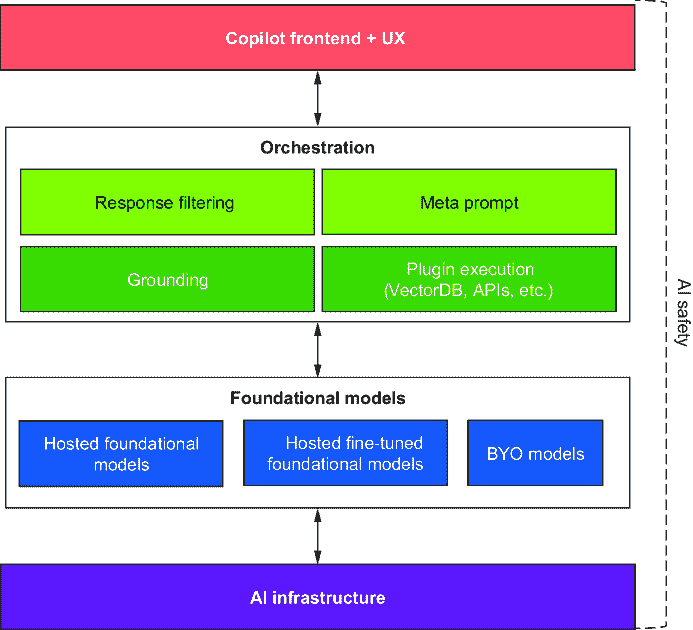
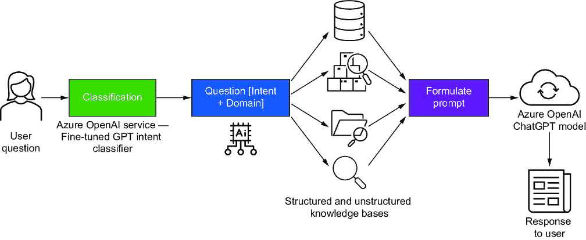

# 10 生成式 AI 应用的架构

### 本章涵盖了

+   GenAI 应用架构概述及新兴的 GenAI 应用堆栈

+   构成 GenAI 应用堆栈的不同层

+   GenAI 架构原则

+   编排框架的好处以及一些流行的编排框架

+   模型集成架构

+   如何为跨职能 AI 卓越中心创建战略框架

企业架构领域持续变化，不可避免地朝着更多自我驱动的系统发展——智能、自我管理应用程序能够从交互中学习并实时适应。此外，日益增长的数字化推动了 AI 数字化转型。这一持续进步凸显了企业技术变革的时代，将重新定义软件开发和部署的本质。

自然地，这更多的是一个理想状态。然而，大多数企业在 AI 增强型应用程序方面仍然非常缺乏经验，生成式 AI 仍然处于早期阶段。本章将探讨企业应用架构标准和最佳实践必须如何适应新兴的生成式 AI 技术和用例。本章介绍了*GenAI 应用堆栈*的概念性参考架构，用于构建生成式 AI 应用程序，并概述了其主要组件以及生成式 AI 如何在更广泛的企业架构中协同工作。GenAI 应用堆栈是云应用架构的演变，转向以数据为中心和 AI 驱动的架构。

本章首先概述了新的 GenAI 应用堆栈包含的内容，涵盖了每个部分的细节，最后将所有概念整合到实际的工作示例中，使其变得真实和可用。在了解这个堆栈的过程中，我们将巩固前几章中描述的架构的不同方面。需要注意的是，尽管代表了一次重大变化，生成式 AI 并不需要全新的架构，而是建立在现有的基于云的分布式架构之上。这一特性使我们能够基于现有的最佳实践和架构原则来融入新的 GenAI 相关范式。让我们首先确定企业应用架构的更新。

## 10.1 生成式 AI：应用架构

在过去的几年里，企业应用架构经历了显著的演变，经历了几个转型阶段，以满足对业务敏捷性、可扩展性和智能性的日益增长的需求。最初，企业运行在单体系统上，即结构坚固但缺乏灵活性的紧密交织的组件，这使得更改变得繁琐且影响广泛。这些系统为企业计算奠定了基础，但并不适合业务需求的快速演变。

云计算和云原生架构的普及导致了容器化和编排工具的兴起，这些工具简化了在不同环境中部署和管理应用程序的过程。同时，数据的涌入导致了以数据处理和分析为中心的架构，这些架构将数据处理和分析作为业务运营的关键驱动因素。

生成式人工智能的企业应用架构的演变可以看作是从传统软件开发到数据驱动软件合成的转变。在传统范式下，软件工程师编写代码以实现特定的功能性和逻辑，使用框架和库来抽象低级细节。在生成式人工智能范式下，软件开发者提供数据和高级规范，并使用大型语言模型（LLMs）生成满足所需要求和约束的代码。以下两个关键概念实现了这一范式转变：软件 2.0 和基于共同飞行员。

### 10.1.1 软件 2.0

软件 2.0 是安德烈·卡帕西 [1] 提出的一个术语，用来描述用学习到的神经网络取代手工编写的代码的趋势。软件 2.0 利用人工智能的进步，如自然语言处理（NLP）、计算机视觉和强化学习，来创建可以从数据中学习、适应新情况并自然与人类互动的软件组件。

最近，我们已从编写代码和管理实现目标的具体指令转变为一种更抽象的方法。开发者在大数据集上训练模型，而不是在编程语言中编写明确的指令或规则。软件 2.0 还减少了手动调试、测试和维护的需求，因为神经网络可以自我纠正并在时间推移中改进（见图 10.1）。


##### 图 10.1 软件 1.0 与软件 2.0 对比

这使得模型能够自己学习规则或模式。算法和模型被设计成从数据中学习、做出决策并在时间推移中改进，从而有效地编写软件。这种范式转变将人工智能的角色从辅助工具转变为系统架构的基本组成部分。

### 10.1.2 共同飞行员时代

另一个促进生成式人工智能企业应用架构演变的 key 概念是共同飞行员——这一概念最初由微软提出。共同飞行员旨在增强人类的能力和创造力。用飞机的比喻来说，如果我们是人类，我们就是飞行员；而不是 AI 在自动驾驶中，我们无法控制或决定其功能，这种新的 AI 扮演共同飞行员的角色，帮助我们承担认知负荷和工作中的一些繁琐任务。然而，我们仍然是飞行员，掌握着控制权。

Copilot 堆栈是一个用于构建使用 LLMs 理解和生成自然语言和代码的 AI 应用和 Copilots 的框架。Copilots 是智能助手，可以帮助用户完成复杂的认知任务，如写作、编码、搜索或推理。微软已经为不同的领域和平台开发了一系列 Copilots，例如 GitHub Copilot、Bing Chat、Dynamics 365 Copilot 和 Windows Copilot。您还可以使用 Copilot 堆栈和工具，如 Azure OpenAI、Copilot Studio 和 Teams AI 库，构建自己的定制 Copilot。Copilots 还可以集成到现有的工具和平台中，如 GitHub、Visual Studio Code 和 Jupyter Notebook，以增强软件开发者的生产力和创造力。

Copilots 基于软件 2.0 的概念，它们使用 LLMs 从自然语言描述中生成代码，而不是依赖于手动编写的代码。然而，它们应被视为 GenAI 应用堆栈，类似于用于 Web 开发的 LAMP 堆栈。LAMP 是堆栈组件的缩写：Linux（操作系统）；Apache（Web 服务器）；MySQL（数据库）；以及 PHP、Perl 或 Python（编程语言）。

企业在设计生成式 AI 应用的企业架构时，可以将 Copilots 视为一个有用的参考模型，因为它们提供了多个优势（例如，更快、更简单的开发，更多创造性和测试，以及改进的合作和学习，使企业能够尝试新的概念和机会，或为难题创造原创解决方案）。让我们进一步探讨 Copilot 堆栈，使其在具体方面更具相关性和现实性。

## 10.2 生成式 AI：应用堆栈

Copilots 的架构由多个层和组件组成，它们协同工作以提供无缝且强大的用户体验，如图 10.2 所示。我们将从下往上，详细检查每一层和组件，并了解它们是如何相互作用的。



##### 图 10.2 GenAI 应用堆栈

AI 基础设施层是支撑一切的基础层，它托管核心 AI 模型和计算资源。它包括使 AI 应用的开发和部署成为可能的硬件、软件和服务，通常针对 AI 工作负载进行优化。这还包括用于训练基础基础模型的超大规模可扩展分布式高性能计算（HPC）。

基础模型层包括支持的模型范围，从托管基础模型到您训练并希望部署的模型。托管的基础模型是大型预训练模型，如 LLMs 和其他（视觉和语音模型），以及可以用于推理的新小型语言模型（SLMs）；这些模型可以是封闭的或开放的。一些模型可以进一步调整以适应特定任务或领域。这些模型在 AI 基础设施层中托管和管理，以确保高性能和可用性。用户可以根据其需求和偏好从各种托管基础模型中进行选择。

编排层管理架构中各个组件之间的交互，确保无缝运行和协调。它负责关键功能，如任务分配、资源管理和工作流程优化：

+   响应过滤组件使用提示工程组件集；在这里，提示和响应被分析、过滤和优化以生成安全的输出。

+   系统提示也可以为 AI 模型提供额外的信息或约束。用户可以通过简单的语法表达系统提示，或者系统可以自动生成它。

+   基础是检索增强生成（RAG）的实施，它指的是将 AI 模型生成的响应进行上下文化的过程。基础确保输出在语法上是正确的、在语义上有意义，并且与给定的上下文或领域相关。我们使用插件从不同的企业系统中获取数据。

+   插件执行层运行插件，为基本 AI 模型添加更多功能。插件是独立且可重用的部分，可以执行不同的任务，例如数据处理、格式化、验证或转换。这对于将数据纳入以制作嵌入以及在我们使用 RAG 时采用向量数据库和索引非常重要。

UX 层是允许用户使用 Copilot 的界面。它易于使用，并具有强大的工具来处理 AI 功能。UX 的确切操作方式取决于 Copilot 插入的应用程序和工作流程的哪个方面。例如，假设将 Copilot 作为 Microsoft Office 365 的一部分使用。Word 中的 UX 工作方式与 PowerPoint 和其他应用程序（如我们之前看到的 GitHub Copilot）不同。

最后，所有这些都是在 AI 安全性的指导下完成的，这是负责任 AI 的重要组成部分，确保技术被道德和负责任地使用。AI 安全性包括不同的方法和规则，我们将在本书的后续部分进行解释。

### 10.2.1 集成 GenAI 堆栈

要将 GenAI 堆栈集成到企业应用程序中，需要战略和技术方法。这始于了解 GenAI（特别是 LLMs）可以解决的要求和业务挑战。这涉及到将特定用例与这些 AI 技术的功能联系起来，重点关注它们可以提供实质性价值的领域，例如简化复杂的工作流程、增强数据分析或简化客户互动。

考虑到用例，下一步是创建一个集成架构，该架构在当前企业系统的边界内适合 AI 堆栈，使用面向服务的架构（SOA）或微服务方法以提高适应性。建立安全、可扩展和可维护的 API 对于促进应用程序和 AI 服务之间的通信至关重要，这将是集成的基石。

AI 基础设施配置是一个重要阶段，组织的政策和数据敏感性决定了是选择本地化、云服务还是混合方法。基础设施需要硬件和数据存储选项以满足用例的需求。一个强大的数据管道对于高效的模型推理也是必不可少的，尤其是在使用 RAG 时。

使用 GenAI，开发者可以使用云 AI 服务中的现有模型或在他们的服务器上运行模型。当需要定制解决方案时，开发者可以构建或调整特定领域的模型，确保它们在准确、相关的数据集上训练，并添加持续学习方法以通过新数据增强模型。

为了维护负责任的 AI（RAI）、安全性和遵守数据保护法律，响应过滤系统被用来防止创建不适当的内容和合规问题。用户体验基于这种 UX 设计，使用户能够与 AI 堆栈交互。设计过程会重复进行，吸收用户反馈以高效满足企业的需求。

系统允许通过安全的插件架构包含第三方集成或自定义扩展，而不会影响应用程序的可靠性。编排层处理不同 AI 组件之间的交互，确保系统能够适应不同的需求水平。

部署是自动化的，以确保 AI 堆栈的一致性和可靠性更新，并建立 CI/CD 管道以实现持续的集成和交付，而不会干扰现有功能。AI 堆栈的性能和健康状况会持续监控，并配备全面的日志记录和警报系统，以通知任何问题。

最后，AI 堆栈的成功采用和运营取决于为开发人员和终端用户提供的良好文档化的指南和培训，确保他们完全准备好使用、故障排除和维护新系统。此过程中的每一步都需要详细的规划、跨团队合作和深入的技术理解，以确保顺利有效地集成到企业架构中。让我们更详细地探讨这个 GenAI 堆栈。

### 10.2.2 GenAI 架构原则

当构建关键任务应用时，企业专注于创建一个强大、可扩展和安全的系统。尽管传统的架构原则保持不变，但图 10.3 概述了生成式 AI 的关键附加架构方面。


##### 图 10.3 生成式 AI 架构原则

许多 GenAI 模型通过 API 访问，因此模型 API 集成是一个架构原则，有助于连接到 GenAI API。模型和 API 有不同的数据格式化和发送方式，以及它们可以处理的请求数量和配额的限制；因此，创建一个可以适应每个 API 设计变化的抽象层可能很有帮助。这涉及到处理 API 请求和响应以及管理 API 限制和配额。在同一个应用程序中使用多个模型以选择适合每种情况的正确模型也很常见。拥有一个抽象层可以帮助保护每个 API 的设计不受变化的影响。

作为一项原则，可扩展性和性能有助于应用程序处理弹性扩展和变化的负载。这涉及到选择合适的云基础设施、平衡负载以及可能使用异步处理来管理密集型任务。此外，使用容器化和微服务架构可以帮助提高可扩展性和性能。

在企业数据中心托管 LLMs（大型语言模型）不是一个简单任务，因为它需要精心规划以实现可扩展性和性能。您必须选择合适的 LLM 架构，比较与业务目标一致的开源和专有替代方案。一个简化的端到端管道对于平稳运行至关重要，使用编排框架进行工作流程管理。基础设施应该坚固，以优化 GPU 并简化基础设施管理。LLMOps（大型语言模型操作）应应用于部署的最佳实践，并应设置持续监控以跟踪性能。应通过负载均衡和自动扩展确保可扩展性。数据和模型应通过加密和访问控制进行保护，并应遵守行业法规。这种全面的方法确保 LLMs 可以高效可靠地为多个内部客户提供服务。当然，这涉及到资本支出和技术专长的重大和持续投资。

由于数据具有敏感性质，实施强大的数据隐私和安全措施至关重要，这包括在传输中和静止状态下加密数据，管理访问控制，并确保符合 GDPR 或 HIPAA 等法规。此外，重要的是要有一个数据最小化策略，其中只收集和处理必要的数据，并且应定期进行安全审计和渗透测试，以主动识别和解决漏洞。一些云服务提供商，如 Azure，提供强大的企业支持系统和合规解决方案。

错误处理和监控并不构成新的架构原则；在分布式系统中，如果你没有为故障做计划，那么你就是在计划失败。使用有效的错误处理和监控来检查 GenAI 应用程序的健康状况。这意味着记录错误，为异常创建警报，并制定处理停机或 API 限制的计划，包括使用自动恢复策略，如回退机制，以确保高可用性。分布式跟踪对于复杂、基于微服务的架构至关重要，以更好地跟踪问题。

大型语言模型（LLMs）正在演变成本和货币的含义。LLM 使用量的增长可能导致意外的费用。为了控制成本，优化 API 调用并使用缓存策略。设有预算警报和成本预测机制以避免意外。

GenAI 用户体验设计侧重于用户如何与 GenAI 模型交互。这会根据模型类型而有所不同；对于使用 LLM 的语言型用例，UX 设计将与使用 Stable Diffusion 或 DALL-E 的图像型用例大不相同。这包括设计直观的界面，提供有用的提示，并确保模型的响应与用户期望一致。在某种程度上，一切都不应只是一个简单的聊天机器人，而应根据任务和意图扩展和增强体验。

考虑 GenAI 应用程序的道德、偏见和法律影响，尤其是在使用 LLMs 时。减轻偏见并防止有害的刻板印象。了解医疗保健、金融或法律中的法律后果。遵循相关法律和行业标准。新的法规正在出现，第十二章将涵盖更多关于负责任 AI 使用的内容。

### 10.2.3 GenAI 应用程序架构：详细视图

基于高级架构图并进一步详细说明，图 10.4 展示了 GenAI 应用程序堆栈的整体结构。尽管我们已经在之前的章节中使用了这些元素中的许多，但这是我们第一次从整体上审视它。有六个广泛的类别构成了不同的组件，这些组件构成了 GenAI 应用程序堆栈。


##### 图 10.4 GenAI 应用程序堆栈

接下来，我们将更仔细地检查每一层。

#### 编排层

编排层是集成分服务、管理数据流和提示的中心组件。它负责调度任务、分配资源并弹性处理错误。提示管理系统是这一层的关键部分，利用 AI 技术开发能够从 LLM 中获得最佳响应的提示。这涉及到 A/B 测试和机器学习（ML）模型来分析用户交互并优化提示以提高参与度和准确性。编排工具如 Kubernetes 可以管理容器化微服务，并允许在云提供商和本地环境中部署组件，以提高系统的鲁棒性和容错性。

#### 基础层

这一层是处理获取、存储、处理和交付数据的 GenAI 应用的基础。它必须与不同的记录系统协同工作，需要连接器来处理各种数据格式和协议。数据管道是连接到不同源系统以获取数据以应用 RAG 并使企业能够使用其数据的通道。管道可以通过 API 原生连接到记录系统（如果支持）或使用不同的插件。数据管道应构建为高速和低延迟，能够根据需要处理批处理和流处理。插件运行时考虑不同的认证方面、数据刷新配置等。数据预处理对于将数据转换为 LLM 可以使用的形式非常重要。因此，这一层包括用于创建嵌入和向量数据库（如我们之前在书中看到的 Redis）的 ML 模型，以及其他如 Cosmos DB、Pinecone、Milvus、Qdrant 等。使用 Apache Spark 或 Azure Fabric 等分布式数据处理框架确保数据处理的可扩展性和容错性。

#### 模型层

模型层需要支持多样化的模型，从前沿的通用大型语言模型（LLM）如 GPT-4 到高度专业化的小型语言模型（SLM）如 Phi-2 [2] 和 Orca 2 [3]。我们将在本章后面学习更多关于 SLM 的知识，并看到一个使用 Phi-2 作为分类器的示例。因此，模型层应提供一致的接口来访问不同的模型，无论它们是内部托管还是外部托管。在考虑模型托管时，将模型扩展以处理不同负载是至关重要的，这可能需要如无服务器计算等技术来动态分配资源。模型目录作为注册和存储库，简化了模型的发现和管理。这一层还涵盖了模型即平台的概念，允许开发者扩展和定制模型，类似于 Salesforce 等平台如何实现应用程序定制。

#### 响应过滤

这一层对于通过确保质量保证和内容审核来维护 GenAI 应用的信任至关重要。它涉及使用分类器和 NLP 工具来筛选输出，以确保准确性、偏见和适宜性。负责任的 AI 实践被整合到这一层中，包括道德考虑并确保符合 GDPR 数据隐私法等法规。这一层内的缓存系统提高了性能，并使输出快速回滚和适宜性成为可能。对输出的持续监控和实时评估确保在整个应用生命周期中维持 AIQ。此外，这一层还处理了 GenAI 技术的伦理影响，包括制定道德决策框架、确保模型透明度，并将公平性和包容性纳入 AI 系统的设计。

##### 额外的架构考虑因素

虽然前面概述的架构很全面，但它没有涵盖以下额外的考虑因素，这些因素对于生产部署至关重要，并且大多数企业都了解这些因素：

+   *集成*—这些应用程序不能独立工作，必须与整个企业系统连接，从而实现数据和服务在内部和外部系统之间的顺畅传输。企业服务总线（ESBs）或 API 网关等中间件技术被用于处理不同系统之间的通信和数据转换。

+   *安全*—安全始终是一个关注点，对于通用人工智能（GenAI）也是如此；GenAI 生态系统中的所有数据都必须得到保护，防止未经授权的访问和泄露，这需要强大的身份验证和授权方法、传输和静态加密，以及定期的安全审计。

+   *生产部署和扩展*—这里的重点是部署 GenAI 应用到各种环境中的策略，包括使用容器编排系统进行部署、自动扩展服务来处理动态负载，以及使用基础设施即代码来提供可重复和可靠的资源。

## 10.3 编排层

生成式 AI 应用需要一个编排层，它作为骨干，对于管理复杂任务和工作流程至关重要。这是模型、企业数据存储、其他组件和应用程序之间的中间层和集成层。它协调和管理各种组件和流程，使 AI 模型在企业架构内生成内容。确保涉及大型语言模型（LLMs）的工作流程在生成内容方面高效、可扩展和可靠是至关重要的。

坐标器的主要职责包括管理工作流程和服务编排，但它们可以扩展到包括其他责任。坐标器由几个组件组成。编排框架通过抽象提示生成、资源管理和性能监控的复杂性，简化了与 LLMs 的管理和交互。它们提供了一个高级接口，使开发者能够专注于构建他们的应用程序，而无需陷入 LLMs 交互的技术细节。表 10.1 概述了关键职责。

##### 表 10.1 坐标器关键职责

| 区域 | 描述 |
| --- | --- |
| 工作流程管理 | 坐标器确保从数据摄取和处理到 AI 模型推理和响应交付的过程顺序和高效执行。这包括状态管理以协调任务之间的依赖关系、错误处理、重试机制以及根据任务负载动态分配资源。 |
| 服务编排 | 通常采用微服务架构，其中每个服务负责生成 AI 过程中的一个离散功能。服务编排是关于管理这些服务以进行扩展、通信和无缝运行。此外，Docker 等容器化平台和 Kubernetes 等编排系统在各个环境中部署、管理和扩展微服务。 |
| 数据流协调 | 确保数据正确地通过系统流动，从初始数据源到模型，再返回到最终用户或应用程序。这包括预处理输入、管理入站请求的队列以及将输出路由到正确的目的地。 |
| 负载均衡和自动扩展 | 负载均衡器将入站的 AI 推理请求分配到多个实例，以防止任何单个实例成为瓶颈。自动扩展根据当前负载调整活动实例的数量，确保资源使用的成本效益。这还包括 API 管理组件，用于管理速率限制并实施生产工作负载的退避策略。 |
| 模型版本控制和回滚 | 编排包括维护不同版本的 AI 模型并管理它们的部署。如果新模型表现出意外的行为或性能不佳，它允许快速回滚到之前的版本。 |
| 管理模型上下文窗口 | 坐标器通过高效管理上下文窗口和令牌计数来增强交互。它跟踪并动态调整模型令牌限制内的对话历史，并保持响应的一致性，尤其是在长或复杂的交流中。最佳实践包括高效上下文管理、处理边缘情况、持续性能监控以及结合用户反馈进行持续改进。 |

这些不同的组件共同工作，创建了一个强大的编排系统，为企业部门中生成式 AI 技术的成功部署和运营提供基础。这种编排对于 AI 驱动应用的复杂性和不断变化是必要的，以避免低效、错误和系统故障。

### 10.3.1 编排框架的益处

编排器对于管理驱动生成式 AI 应用的复杂系统至关重要。这些系统涉及多种需要通过编排工具仔细协调的过程。编排器简化工作流程并确保任务按顺序完成，同时处理依赖关系和错误处理规则。这导致了一个可靠且规律的操作流程，其中预处理、计算和后处理的步骤顺利连接，确保数据质量和一致的输出生成。

可扩展性是另一个需要编排至关重要的领域。随着需求的波动，一个能够动态调整资源分配的系统，尤其是对于生产工作负载，变得至关重要。编排器可以通过不同的技术提供这种灵活性，例如使用负载均衡器均匀地分配工作负载，以及使用自动扩展功能实时调节计算能力。这种弹性满足了负载需求并优化了资源使用，平衡了性能和成本效率。编排器需要跨不同模型以及这些模型的计算和成本配置文件来管理这一点。

编排器提供集中式管理和监控能力。它们构成了提供仪表板和工具的框架，用于监控 LLM 使用情况、识别瓶颈和解决问题。通过监控服务健康、响应故障和确保最小停机时间，这增强了系统可靠性。编排器可以采用自动恢复过程，如实例重启或替换，以实现服务连续性。

对于大多数基于云的 LLM 提供商，默认部署模型是一种按使用付费的方法。这种模型与其他客户共享，入站请求按先到先服务的原则排队和处理。然而，对于需要更好用户体验的生产工作负载，Azure OpenAI 服务提供了一种预配吞吐量单位（PTU）功能。此功能允许客户预留和部署用于提示处理和生成完成的模型处理能力单位。每个单位的最低 PTU 部署、增量以及处理能力取决于模型类型和版本。编排器将管理常规按使用付费和 PTU 之间的不同部署端点，以确保最佳性能和成本效益。

协调器在提高生产力和简化操作中发挥着重要作用，这通过两种方式实现。首先，它减少了编写重复代码的需求，例如提示构造和输出处理，从而提高了开发者的生产力。其次，它自动化了服务的部署和管理，从而最大限度地减少了人为错误的可能性。这个自动化过程减少了人工开销，并确保了有效的计算资源利用，简化了生产操作。我们将在本章后面更深入地探讨管理操作。

遵守和治理是企业的重要需求。协调器可以通过确定数据在工作流程中的处理、存储和使用方式来协助执行遵守，从而确保数据符合企业的数据治理政策和隐私法规。在企业的运营中保持信任和遵守法律至关重要，可以通过遵守数据治理政策和隐私法规来实现。

### 10.3.2 协调器框架

许多人熟悉协调器和协调器框架。虽然 Kubernetes、Apache Airflow 和 MLflow 等框架是有效的通用协调工具，可以支持机器学习操作，但它们并非专为生成式人工智能应用设计。为生成式人工智能协调工作流程需要更深入地了解这些复杂技术的细微差别。

生成式人工智能应用协调器框架的选择取决于现有的技术堆栈、工作流程的复杂性和具体要求。表 10.2 概述了针对生成式人工智能应用特定需求的协调器框架。这些框架可以处理传统的计算工作流程；管理交互的状态、上下文和连贯性；并且设计用于满足生成式人工智能的独特要求。

##### 表 10.2 协调器框架

| 名称 | 备注 |
| --- | --- |
| 语义内核 | 语义内核是微软的一个开源框架，旨在创建一个用于语义搜索和生成式人工智能的统一框架。它使用预训练的 LLM 和基于图的知识表示来启用丰富多样的自然语言交互。  |
| LangChain | LangChain 是一个库，它将语言模型与外部知识和能力链在一起。它促进了 LLM（如 GPT-4）与数据库、API 和其他系统的协调，以创建更全面的 AI 应用。  |
| PromptLayer | PromptLayer 是一个平台，它简化了 LLM 的提示创建、管理和部署。用户可以直观地编辑和测试提示，比较模型，记录请求并监控性能。更多详情请见[`promptlayer.com/`](https://promptlayer.com/)。  |
| Rasa  | Rasa 是一个企业级对话人工智能平台，让您能够创建基于聊天和语音的人工智能助手，以管理不同目的的各种对话。除了对话人工智能外，它还提供了一种面向生成式人工智能的构建助手的方法，具有企业功能，如分析、安全、可观察性、测试、知识集成、语音连接器等。更多信息请访问 [`rasa.com/`](https://rasa.com/)。  |
| YouChat API  | YOU API 是一套工具集，帮助企业将大型语言模型（LLMs）的输出建立在最新、最准确和最相关的信息之上。您可以使用 YOU API 访问网络搜索结果、新闻文章和 RAG 为 LLMs。更多详情请访问 [`api.you.com/`](https://api.you.com/)。  |
| Ragna  | Ragna 是一个基于 RAG 的开源人工智能编排框架，允许您实验 RAG 模型的不同方面——LLMs、向量数据库、分词策略和嵌入模型。它还允许您从不同的数据源创建基于 RAG 的自定义网络应用程序和扩展。更多详情请访问 [`ragna.chat/`](https://ragna.chat/)。  |
| Llama-Index  | LlamaIndex 是一个基于云的编排框架，它使您能够将数据连接到大型语言模型（LLMs）并生成自然语言响应。它可以访问各种 LLMs。  |
| Hugging Face  | Hugging Face 提供了各种自然语言处理任务的预训练模型集合。它可以与编排工具一起使用，以管理生成式人工智能应用的整个生命周期。更多详情请访问 [`huggingface.co/`](https://huggingface.co/)。  |

### 10.3.3 管理操作

编排器在增强复杂系统和工作流程中生成式人工智能模型（如 LLMs）的性能和无缝集成方面发挥着关键作用。其核心功能通过复杂的控制机制优化操作效率，并促进更好的用户体验。

编排器在管理 LLM 集成到复杂工作流程（如内容创建管道）方面至关重要。它规划并安排 LLM 的激活，以确保数据收集、预处理和文本生成的顺畅，从而简化从开始到结束的整个过程。这种协调提高了工作流程，并确保生成内容的 API 调用及时且相关。

编排器的主要作用是平衡 LLM 服务的负载和资源。它有效地管理请求，以避免过载或浪费资源。此外，它可以通过持续跟踪工作负载和性能指标来改变计算资源。这种灵活性确保系统保持响应，资源得到有效利用，即使在需求变化时也是如此。

协调器还监督 API 交互，执行速率限制并控制安全访问，同时管理可能发生的任何错误或中断。同时，它处理数据预处理和后处理的必要任务。这意味着清理、格式化和转换数据，以确保数据处于正确的状态，以便 LLM 进行处理，然后提高输出质量以满足既定的质量标准和格式要求。

对于需要顺序处理的流程，协调器确保一个阶段的输出准确无误地输入到下一个阶段，保持流程的完整性。此外，它在执行安全和合规措施方面发挥作用，过滤敏感信息并确保遵守法律和伦理标准，此外还进行审计以确保责任和质量保证。

对于聊天机器人或数字助理等应用，协调器通过处理会话状态和查询来管理用户交互，根据需要将它们引导到 LLM 或其他服务，从而提供更吸引人和响应迅速的用户体验。此外，协调器持续监控 LLM 性能，分析响应时间、准确性和吞吐量，以指导优化工作。它还管理 LLM 的更新，确保向新版本或配置的过渡平滑且对用户影响最小。

如我们所见，当集成到复杂系统中时，协调器可以显著提高 LLM 的效率、可靠性和可扩展性，提供一层管理，协调 LLM 与其他系统组件之间的交互。

##### 构建自己的协调器框架

为企业创建自己的生成式 AI 协调器可能很困难。然而，这允许您根据需求定制框架，并增加对技术的理解。这个过程需要广泛的技术知识和资源。不幸的是，没有通用的模板代码可用于开发 LLM 协调器。在继续此项目之前，请考虑以下因素：

+   *定制*—根据您的特定应用和性能需求调整框架

+   *与现有系统集成*—无缝地将协调器集成到现有的基础设施和工作流程中

+   *控制和可见性*—对 LLM 技术保持完全控制并获取其操作的详细洞察

+   *灵活性及可扩展性*—设计框架使其足够灵活以适应未来的变化，并能够扩展以满足不断增长的需求

如果您想创建全新的东西，您需要了解生成式 AI、不同类型的 LLM、如何训练和微调它们以及如何将它们用于各种任务和领域。此外，您还应了解如何收集、处理和存储有助于提高生成输出质量和多样性的数据和知识。

要将这些概念应用于现实场景，你必须能够设计和实现不同的生成策略，例如提示工程和 RAG。这些策略可以帮助控制 LLM 的行为和输出。你还必须确保生成模型和工作流程是可扩展的、安全的和可靠的。这可以通过使用云服务、API 和 UI 来实现。分布式系统、机器学习和软件工程的专业知识也是必需的。

一些现在广泛使用的框架包括语义内核、LangChain 和 LlamaIndex。这些框架使 GenAI 模型的使用成为可能，尽管它们针对不同的方面。我们将更深入地探讨这些内容。

#### 语义内核

微软的语义内核（SK）是一个 SDK，它将 LLM 与 C#、Python 和 Java 等语言集成。它简化了将 LLM 与传统的 C#、Python 或 Java 代码接口的有时复杂的流程。使用 SK，开发者可以定义封装应用程序能够执行的具体操作的语义函数，例如数据库交互、API 调用或电子邮件操作。SK 允许这些函数在混合编程语言环境中无缝编排。

SK 的真实力量在于其 AI 驱动的编排能力。SK 允许开发者使用自然语言来表述期望的结果或任务，而不是手动精心编排 LLM 的交互。AI 会自动确定如何组合相关的语义功能以实现这一目标，这显著加快了开发速度并降低了使用 LLM 的技能门槛。

SK 在构建 LLM 应用程序时，可以通过简化应用程序流程、降低提示工程的成本和复杂性、实现情境学习和强化学习、支持多模态和多语言场景来为企业带来益处。SK 为不同的 LLM 提供商，如 OpenAI、Azure OpenAI 和 Hugging Face，提供了一个一致和统一的接口。

将简化版的 LLM 集成与 AI 驱动的编排相结合，为企业提供了一个强大的平台，用于革命性地改变他们的应用程序。此外，SK 使得构建高度定制、智能的客户支持系统、实现更强大和语义细腻的搜索功能、自动化常规工作流程，甚至可能帮助开发者进行代码生成和重构任务成为可能。有关 SK 的更多详细信息，可以在他们的网站上找到：[`aka.ms/semantic-kernel`](https://aka.ms/semantic-kernel)。

我们可以通过一个示例来说明这一点。继续使用前几章中的宠物主题，我们有一些关于狗的书，这些书从一般主题到更具体的医疗建议都有。这些书籍被扫描并作为 PDF 文件提供，其中包含我们想要用于问答用例的机密业务数据。这些 PDF 文件是复杂的文档，包含文本、图像、表格等等。鉴于我们无法使用现实世界的内部信息，这些 PDF 文件代表了一个企业专有的内部信息，该企业需要 RAG 来处理。假设我们想要使用我们拥有的 PDF 文件进行问答用例；让我们看看这是如何可能的。

第一步是使用 SK 安装 SDK（或包），这不支持通过 conda 进行，而需要使用 pip。此外，请注意，一些 SDK 存在破坏性更改，我们希望将 SK SDK 锁定在版本 1.2.0。您可以使用`pip install semantic-kernel==1.2.0`来安装这个特定版本。在安装 SDK 之后，为了在较高层次上开始使用 SK，我们需要遵循以下步骤：

+   创建一个 SK 实例，并注册您想要使用的 AI 服务，例如 OpenAI、Azure OpenAI 或 Hugging Face。

+   创建带有输入参数的语义函数，这些函数可以调用您现有的代码或其他语义函数。

+   使用适当的参数调用语义函数，并等待结果。结果将是执行提示后的 AI 模型的输出。

+   可选地，我们可以创建一个规划器，根据用户输入来协调多个语义函数。

#### SK 示例

这里是一个使用 SK 实现此功能的示例。正如我们之前看到的，SK 是使自然语言文本处理和理解成为可能的核心组件。它是一个提供统一接口的框架，用于各种 AI 服务和内存存储。

我们的示例是一个简单的问答系统，它使用 OpenAI API 为 PDF 文档集合生成嵌入。然后，我们使用这些嵌入来找到与用户查询相关的文档。在我们的示例中，它用于

+   *创建嵌入*—SK 提供了一个简单的接口，用于调用 OpenAI 服务，为从 PDF 文档中提取的文本生成嵌入。正如我们所知，这些嵌入是文本的数值表示，能够捕捉其语义意义。

+   *存储和检索信息*—我们使用向量数据库（在我们的示例中是 Chroma）来存储文本及其对应的嵌入。SK 将这些持久数据存储称为“内存”，并且根据提供商，有基于语义相似性查询存储信息的方法。正如我们所知，这是用于找到与用户查询相关的文档。

+   *文本补全*—我们还使用 SK 注册一个 OpenAI 文本补全服务，用于为给定的文本生成补全。

注意：我们需要特别使用 Chroma 版本 0.4.15，因为目前，与 SK 的 0.4.16 及以上版本存在不兼容性，尚未修复。为此，我们可以根据是否使用 conda 或 pip 使用以下命令之一：`conda install chromadb=0.4.15`或`pip install chromadb==0.4.15`。

列表 10.1 展示了这个简单的应用程序处理一组 PDF 文档，提取它们的文本，然后使用 OpenAI API 为每个文档生成嵌入。然后，这些嵌入被存储在向量数据库中，可以查询以找到与给定输入在语义上相似的文档。`load_pdfs`函数从指定的目录读取 PDF 文件。它使用 PyPDF2 库打开每个 PDF，从每一页提取文本，并返回这些页面的集合。

##### 列表 10.1 Q&A 过我的 PDFs：从 PDFs 中提取文本

```py
import asyncio
from PyPDF2 import PdfReader
import semantic_kernel as sk
from semantic_kernel.connectors.ai.open_ai import 
↪(AzureChatCompletion,AzureTextEmbedding)
from semantic_kernel.memory.semantic_text_memory
↪import SemanticTextMemory
from semantic_kernel.core_plugins.text_memory_plugin 
↪import TextMemoryPlugin
from semantic_kernel.connectors.memory.chroma import 
↪ChromaMemoryStore

# Load environment variables
AOAI_KEY = os.getenv("AOAI_KEY")
AOAI_ENDPOINT = os.getenv("AOAI_ENDPOINT")
AOAI_MODEL = "gpt-35-turbo"
AOAI_EMBEDDINGS = "text-embedding-ada-002"
API_VERSION = '2023-09-15-preview'

PERSIST_DIR = os.getenv("PERSIST_DIR")
VECTOR_DB = os.getenv("VECTOR_DB")

DOG_BOOKS = "./data/dog_books"
DEBUG = False
VECTOR_DB = "dog_books"
PERSIST_DIR = "./storage"
ALWAYS_CREATE_VECTOR_DB = False

# Load PDFs and extract text
def load_pdfs():
    docs = []
    total_docs = 0
    total_pages = 0
    filenames = [filename for filename in 
      ↪os.listdir(DOG_BOOKS) if filename.endswith(".pdf")]
    with tqdm(total=len(filenames), desc="Processing PDFs") 
      ↪as pbar_outer:
        for filename in filenames:
            pdf_path = os.path.join(DOG_BOOKS, filename)
            with open(pdf_path, "rb") as file:
                pdf = PdfReader(file, strict=False)
                j = 0
                total_docs += 1
                with tqdm(total=len(pdf.pages), 
                  ↪desc="Loading Pages") as pbar_inner:
                    for page in pdf.pages:
                        total_pages += 1
                        j += 1
                        docs.append(page.extract_text())
                        pbar_inner.update()
                pbar_outer.update()
    print(f"Processed {total_docs} PDFs with {total_pages} pages.")
    return docs
```

在我们从页面中提取文本后，我们使用`populate_db()`函数生成嵌入并将它们存储在 Chroma 向量数据库中。此函数接受一个 SK 对象，遍历 PDF 的所有页面。每一页使用 SK 的内存存储保存文档的文本。当调用`save_information()`函数时，它会自动创建嵌入以存储在向量数据库中，如下一列表所示。如果已经存在 Chroma 向量数据库，我们将使用它而不是创建一个新的。

##### 列表 10.2 Q&A 过我的 PDFs：使用 SK 和填充向量数据库

```py
# Populate the DB with the PDFs
async def populate_db(memory: SemanticTextMemory, docs) -> None:
    for i, doc in enumerate(tqdm_asyncio.tqdm(docs, desc="Populating DB")):
        if doc:  #Check if doc is not empty
            try:
                await memory.save_information(VECTOR_DB,id=str(i),text=doc)
            except Exception as e:
                print(f"Failed to save information for doc {i}: {e}")
                continue  # Skip to the next iteration

# Load the vector DB
async def load_vector_db(memory: SemanticTextMemory, 
  ↪vector_db_name: str) -> None:
    if not ALWAYS_CREATE_VECTOR_DB:
        collections = await memory.get_collections()
        if vector_db_name in collections:
            print(f" Vector DB {vector_db_name} exists in the 
                  ↪collections. We will reuse this.")
            return

    print(f" Vector DB {vector_db_name} does not exist in the collections.")
    print("Reading the pdfs...")

    pdf_docs = load_pdfs()
    print("Total PDFs loaded: ", len(pdf_docs))
    print("Creating embeddings and vector db of the PDFs...")
    # This may take some time as we call embedding API for each row
    await populate_db(memory, pdf_docs)
```

程序的入口点是`main()`函数，如列表 10.3 所示。它设置 SK 的 OpenAI 文本完成和嵌入服务，注册一个内存存储，并加载向量数据库。然后，它进入一个循环，提示用户提问，查询内存存储以获取相关文档，并打印最相关文档的文本。

##### 列表 10.3 Q&A 过我的 PDFs：SK 使用 Chroma

```py
async def main():
    # Setup Semantic Kernel
    kernel = sk.Kernel()
    kernel.add_service(AzureChatCompletion(
            service_id="chat_completion",
            deployment_name=AOAI_MODEL,
            endpoint=AOAI_ENDPOINT,
            api_key=AOAI_KEY,
            api_version=API_VERSION))

    kernel.add_service(AzureTextEmbedding(
            service_id="text_embedding",
            deployment_name=AOAI_EMBEDDINGS,
            endpoint=AOAI_ENDPOINT,
            api_key=AOAI_KEY))

    # Specify the type of memory to attach to SK. 
    # Here we will use Chroma as it is easy to run it locally
    # You can specify location of Chroma DB files.
    store = ChromaMemoryStore(persist_directory=PERSIST_DIR)
    memory = SemanticTextMemory(storage=store, 
    ↪embeddings_generator = kernel.get_service("text_embedding"))
    kernel.add_plugin(TextMemoryPlugin(memory), "TextMemoryPluginACDB")

    await load_vector_db(memory, VECTOR_DB)

    while True:
        prompt = check_prompt(input('Ask a question against 
        ↪the PDF (type "quit" to exit):'))

        # Query the memory for most relevant match using
        # search_async specifying relevance score and 
        # "limit" of number of closest documents
        result = await memory.search(collection=VECTOR_DB, 
        ↪limit=3, min_relevance_score=0.7, query=prompt)
        if result:
            print(result[0].text)
        else:
            print("No matches found.")

        print("-" * 80)

if __name__ == "__main__":
    asyncio.run(main())
```

在我们的示例中，我们使用 Chroma 作为向量数据库。这是在使用 SK 时众多可选选项之一。我们可以在[`learn.microsoft.com/en-us/semantic-kernel/concepts/vector-store-connectors/out-of-the-box-connectors/`](https://learn.microsoft.com/en-us/semantic-kernel/concepts/vector-store-connectors/out-of-the-box-connectors/)上找到支持的向量数据库列表的更多详细信息。值得注意的是，C#和 Python 之间的支持并不完全相同；一些向量数据库在两种语言中都得到支持，但有些只在一种语言中得到支持。

SK 是处理和理解文本的核心组件。它为各种 AI 服务和内存存储提供了一个统一的接口，简化了构建复杂 NLP 应用的过程。现在让我们转换一下思路，看看使用 LangChain 的相同示例。

#### LangChain

LangChain 提供了一个复杂的框架，旨在简化将大型语言模型（LLMs）集成到企业应用中的过程。此框架抽象化了与 LLMs 接口交互的复杂性，使得开发者能够在不深入该领域专业知识的情况下，轻松地整合高级自然语言处理（NLP）功能。其模块化组件库使得构建定制的 NLP 解决方案变得容易，从而促进了更高效的开发过程。

LangChain 的主要优势在于其能够与不同的 LLMs 和其他自然语言 AI 服务协同工作。这一特性允许企业根据特定需求选择最佳工具，避免了与单一供应商绑定的缺点。该框架通过提供更易于使用的接口和现成的组件来提高效率，支持可扩展性，从而使得项目能够从测试阶段顺利扩展到完整的应用程序。

此外，LangChain 通过最小化专业开发的工作量并简化与 LLMs 的交互来降低成本。企业还可以从围绕 LangChain 的强大社区和支持中受益，这提供了访问文档、最佳实践和协作解决问题的资源。这种全面的方法使得 LangChain 成为那些希望在服务中使用人工智能和自然语言理解的企业的一个有吸引力的选择。它提供了一种通过人工智能驱动的解决方案来创新和提升产品的方式。

在上一章讨论宠物主题的基础上，在本章中，我们有一套关于狗的书籍，这些书籍涵盖了从一般主题到更具体的医疗建议的信息。这些书籍是 PDF 格式，包含我们希望用于问答用例的机密商业数据。

列表 10.4 展示了如何使用 LangChain 轻松实现这一功能。在这种情况下，我们从本地文件夹中加载所有 PDF 文件，读取每个 PDF，将上下文分割成 2K 个片段，创建嵌入（使用 OpenAI），并使用 FAISS（Facebook AI Similarity Search）创建向量索引。为了简洁，我们没有展示一些辅助函数的代码，例如 `load_pdfs()`，因为它们与之前 SK 章节中的代码相同。

注意：FAISS 是一个允许快速且精确的向量搜索和聚类的库，可用于各种人工智能应用。它支持不同的向量比较和索引类型，可以在 CPU 和 GPU 上运行。Facebook AI Research 开发了 FAISS，更多详情请参阅 [`ai.meta.com/tools/faiss/`](https://ai.meta.com/tools/faiss/).

##### 列表 10.4 使用 LangChain 在我的 PDFs 上进行问答

```py
from langchain_community.vector stores import FAISS
from langchain_community.docstore.document import Document
from langchain.chains.question_answering import load_qa_chain
from langchain.text_splitter import CharacterTextSplitter
...

def create_index():
    # load the documents and create the index
    docs = load_pdfs()

    text_splitter = CharacterTextSplitter(
        separator="\n",
        chunk_size=2048,
        chunk_overlap=200,
        length_function=len
    )

    # Convert the chunks of text into embeddings
    print("Chunking and creating embeddings...")
    chunks = text_splitter.split_documents(docs)
    embeddings = OpenAIEmbeddings(openai_api_key=OPENAI_KEY)
    vectordb = FAISS.from_documents(chunks, embeddings)

    return vectordb

def main():
    vectordb = create_index()
    llm = OpenAI(openai_api_key=OPENAI_KEY)
    chain = load_qa_chain(llm, chain_type='stuff')

    while True:
        prompt = check_prompt(input(
            'Ask a question against the PDF (type "quit" to exit):'))
        docs = vectordb.similarity_search(prompt, k=3, fetch_k=10)
        response = chain.invoke({'input_documents': docs,
                                 'question': prompt},
                                return_only_outputs=True)
        print(f"Answer:\n {response['output_text']}")

if __name__ == "__main__":
    main()
```

一方面，LangChain 非常出色，为刚开始使用大型语言模型（LLMs）和通用人工智能（GenAI）应用的企业提供了一个巨大的起点。LangChain 通过标准化与不同 LLM 提供商的交互，并提供提示创建、复杂工作流程（链）和高级人工智能助手（代理）的工具来简化流程。作为一个协调器，它可以帮助我们轻松地将 LLMs 连接到现有的公司数据和系统中，克服初始障碍，并快速开始尝试 LLM 驱动的应用。

然而，LangChain 也存在挑战。掌握提示设计、构建有效的链和代理等概念需要一定的学习曲线。此外，在这个快速变化的领域中，保持软件和依赖项的更新也会增加一些复杂性。了解道德上使用 LLM 的重要性也很关键，因为强大的语言模型总是存在输出错误或不希望的结果的风险。最后，对于规模和性能至关重要的生产部署，LangChain 添加了过多的抽象层，可能会损害性能。

#### LlamaIndex

LlamaIndex 是一个数据框架，它使大型语言模型（LLMs）能够访问和处理其预训练语料库之外的私有数据源。这增强了它们在自然语言处理（NLP）能力和特定领域知识方面的能力，适用于各种用例，如文档问答、数据增强聊天机器人和结构化分析。LlamaIndex 提供数据摄取、索引、查询接口、向量存储和数据库集成工具。

使用 LLMs 进行生成式人工智能应用的主要挑战之一是整合不同的数据格式（API、PDF、文档、SQL 等）和 LLM 提供商（OpenAI、Hugging Face 等）。LlamaIndex 通过提供统一的接口和模块化设计来简化这一过程，使用户能够轻松地将他们的自定义数据源连接到他们首选的 LLMs。LlamaIndex 还支持数据增强，这是一种从现有数据生成合成数据的过程，以提高 LLMs 的性能和鲁棒性。

使用 LLMs 进行生成式人工智能应用的一个挑战是数据的有效检索和可扩展性。LlamaIndex 通过使用向量存储和数据库提供商来存储和索引数据，并优化查询速度和内存使用来解决这个问题。LlamaIndex 还支持各种查询类型，如自然语言、关键词和向量查询，使用户能够方便有效地访问他们的数据。

列表 10.5 展示了使用 LlamaIndex 实现使用相同宠物相关书籍的 RAG 问答用例的简单性。我们使用一个内置函数来加载和处理存储中的所有 PDF 文件（在我们的示例中保存于`data/dog_books`文件夹），并使用 OpenAI 嵌入创建一个内置向量索引。我们将它本地保存以节省时间，并可以在下一个实例中重用它。为了使用 LlamaIndex，我们确实需要安装几个包——`llama-index`和`llama-index-reader-files`，如下所示：`pip install llama-index==0.10.9 llama-index-readers-file`。

##### 列表 10.5 使用 LlamaIndex 的 RAG 示例

```py
from llama_index.core import (
    VectorStoreIndex,
    SimpleDirectoryReader,
    StorageContext,
    load_index_from_storage,
    Settings
)
from llama_index.embeddings.openai import OpenAIEmbedding
from llama_index.readers.file import PDFReader

PERSIST_DIR = "./storage/llamaindex"
DOG_BOOKS = "./data/dog_books/"

OPENAI_KEY = os.getenv('OPENAI_API_BOOK_KEY')                       #1
Settings.embed_model = OpenAIEmbedding(api_key=OPENAI_KEY)         #1

def load_or_create_index():
    if not os.path.exists(PERSIST_DIR):                            #2
        try:
            parser = PDFReader()
            file_extractor = {".pdf": parser}

            # load only PDFs
            required_exts = [".pdf"]                               #3
            documents = SimpleDirectoryReader(DOG_BOOKS, 
                           ↪file_extractor=file_extractor, 
                           ↪required_exts=required_exts).load_data()
            index = VectorStoreIndex.from_documents(             #4
                           ↪documents, show_progress=True)

            # store the index for later
            index.storage_context.persist(persist_dir=PERSIST_DIR)   #5

            print("Index created and stored in", PERSIST_DIR)
        except Exception as e:
            print("Error while creating index:", e)
            exit()
    else:
        print("Loading existing index from", PERSIST_DIR)

        try:
            # load the existing index
            storage_context = StorageContext.from_defaults( 
                              ↪persist_dir=PERSIST_DIR)
            index = load_index_from_storage(storage_context)  #6
        except Exception as e:
            print("Error while loading index:", e)
            exit()
    return index

def main():
    index = load_or_create_index()
    query_engine = index.as_query_engine()

    while True:
        prompt = input("Ask a question about dogs:")
        response = query_engine.query(prompt)
        print(response)

if __name__ == "__main__":
    main()
```

#1 加载环境变量

#2 检查存储是否已存在

#3 只加载 PDF 文件

#4 加载 PDF 文档并创建索引

#5 保存索引以供以后使用

#6 加载现有索引

### 10.3.4 提示管理

在本书的早期，我们了解到提示工程在 LLMs 的通信中起着至关重要的作用，因为它直接影响输出质量。一个构建良好的提示可以帮助 LLM 生成准确和上下文相关的响应。为此，你需要深刻理解 LLMs 如何解释输入，以及创建模型能够有效理解的提示的能力。

提示管理涉及设计、测试和部署用于 LLMs 执行各种任务的提示或指令。提示还需要与评估和内容审核一起作为响应过滤层和 RAI 实现的一部分协同工作。我们将在本书的后面更详细地介绍这一方面。作为编排层的一部分，提示管理为管理 LLMs 提供了一种全面的方法。这包括三个基本组件：提示工程、优化和提示操作。

提示工程包括创建定制、自适应和特定领域的提示，这些提示针对用户的需求和查询的上下文进行定制。这包括为特定任务生成定制提示，例如通过理解上下文和要求来总结新闻文章，并根据用户交互实时调整提示以更好地符合他们的意图。此外，它还包括为特定领域开发提示，使用适当的技术语言并遵守特定领域的标准。

提示优化侧重于通过持续的性能监控、数据驱动的优化和高效资源管理来提高提示的有效性。这包括跟踪诸如准确性和相关性等指标来衡量提示的成功，根据用户反馈和响应质量来优化提示以提高清晰度，以及优化提示以保持在令牌限制内并减少复杂性，从而确保成本效益和提示-响应生成。

PromptOps 涉及管理提示的操作方面，包括对提示有效性的自动化测试、不同提示版本的版本控制以实现轻松回滚、与其他 AI 系统组件的集成以确保无缝运行，以及可扩展性和维护性考虑，以确保提示管理系统可以处理不断增长的需求并易于更新。这种全面的提示管理方法确保 AI 系统保持有效、高效，并能适应用户需求和科技进步。

提示管理（即为 LLMs 创建和优化提示）可以从不断发展的各种工具和框架中受益。对于希望使用 LLMs 和提示管理工具的企业来说，评估技术特性和供应商对安全、隐私以及遵守相关法规（例如，GDPR、HIPAA）的遵守情况很重要。此外，企业应考虑支持水平、定制能力和与现有系统和工作流程的集成能力。许多这些提供商为商业提供定制解决方案和合作伙伴关系，确保使用 LLMs 符合企业需求和战略目标。Prompt flow ([`github.com/microsoft/promptflow`](https://github.com/microsoft/promptflow))，这是一个微软的开源工具，用于提示管理，就是一个例子。我们将在本书的下一章中更详细地介绍 Prompt flow。

另一个例子是 Pezzo ([`github.com/pezzolabs/pezzo`](https://github.com/pezzolabs/pezzo))，它可以帮助进行提示管理。我们之前看到的 LangChain 和 SK 也提供了一些提示管理的支持。更多详情，请参阅“大型语言模型提示框架综述” [4]。

提示管理是确保 LLM 应用有效性的重要过程。它是一个动态和迭代的流程，涉及设计、测试、改进和定制提示以实现最佳输出。LLM 系统的架构必须足够灵活，以适应当前和未来在提示设计方面的进步。它还应提供工具以实现持续改进机制，以生成高质量的输出。

## 10.4 地基层

地基层是处理数据采集、存储、处理和交付的 GenAI 应用的基础。它通过连接器、管道、插件和 API 整合了各种数据源和格式。此外，它执行数据预处理、嵌入和向量化，使数据与 LLMs 兼容。它采用分布式数据处理框架以实现可扩展性和可靠性。让我们更详细地探讨这一点。

### 10.4.1 数据集成和预处理

拥有可靠的数据管道，尽可能无缝地结合来自不同系统的数据非常重要。这些管道必须设计为处理各种数据类型和来源——从结构化的 SQL 数据库条目到非结构化文本、图像文件以及来自物联网部署的实时流数据。这些管道的架构必须与各种数据格式和协议兼容，这可能需要开发定制的 API、数据转换的中间件和可扩展的 ETL（提取、转换、加载）过程。

#### 集成

将系统记录集成到生成式 AI 应用架构中是基本的。它涉及在安全、合规和高效的方式下进行多层交互和数据管理，确保实时数据对 LLM 可用，同时保持数据质量。此外，集成必须是可扩展的，并能够适应企业数据生态系统的变化。

集成管道的主要目标是将其集成到各种系统记录（SoRs）中，并使来自这些系统的数据能够被生成 AI 模型高效地使用。与 SoR 集成对于设计生成式 AI 应用至关重要。这些系统包括 SaaS 平台、客户关系管理（CRM）和企业资源规划（ERP）系统。它们作为 LLM 应用的数据库，作为企业结构化和非结构化数据的存储库。这些数据对于将 LLM 用作推理引擎至关重要，允许它访问高质量、特定领域的知识。

通过 SoR 集成检索到的信息用于 RAG 实现。正如我们在本书前面所看到的，这是企业在其专有信息上操作的主要方式之一。SoR 集成是实现这一目标的关键。主要挑战不仅在于集成，还包括理解数据的本质、变化的频率以及计算成本。

有多种工具可以启动此过程，例如 Microsoft Fabric，它提供超过 145 个连接器，Apache NiFi、Informatica 等等。这些工具从不同的来源收集和整合数据到一个单一的存储库中，该存储库可以处理各种数据格式，并在数据捕获过程中防止数据丢失。

现代存储解决方案，如 Amazon S3、Azure Data Lake Storage 或 Hadoop 分布式文件系统（HDFS），为大量数据提供安全且可扩展的存储选项。当与 Snowflake、Google BigQuery 或 Amazon Redshift 等数据仓库技术结合使用时，企业可以高效地存储、查询和管理数据，从而更容易为人工智能集成做准备。

数据编排工具，如 Apache Airflow、Microsoft Fabric 中的 Data Factory 和 AWS Glues，提供了构建和执行复杂数据工作流的现代、以代码为中心的方法。这些系统允许开发人员通过代码定义数据管道，促进版本控制和测试，类似于标准软件开发实践。此外，它们还提供调度、监控和错误管理功能，有助于提高数据管道的可靠性。

#### 预处理

一旦数据为 AI 使用做好准备，就可以发送到处理引擎或分析平台进行进一步准备。Apache Spark 是一个广为人知的平台，能够处理大规模数据处理，并拥有覆盖各种计算需求的多个库。例如，Databricks 这样的平台就是基于 Spark 的能力构建的，以简化从数据准备到模型部署的过程。此外，架构必须包括事件驱动的机制，如 webhooks 或流服务，以确保数据同步和实时更新。

为了使数据在为 LLM 结果提供信息时有用，它必须首先经过严格的清洗和标准化过程，以确保其质量。架构蓝图应包括这些预处理活动，如去重、归一化和错误纠正。集成数据质量工具应自动化这些任务，为 LLMs 提供优质的数据集。

数据处理需要严格的访问控制，以确保安全和合规，这在处理敏感信息和遵循法规时至关重要。数据交互需要强大的身份验证和授权协议。数据治理框架应指定访问权限；此外，加密应保护静态和动态中的数据。频繁的合规性评估对于确保数据质量和隐私至关重要。遵循 GDPR、HIPAA 或 CCPA 法规对于个人数据的道德和法律处理也很重要。

允许集成到源系统的插件不是架构中的一次性静态组件——它不断变化和适应。随着企业使用或改进其新的 SoR，架构必须构建以允许简单集成或数据源移动。为此，需要一种灵活的集成方法，其中新数据源可以与现有系统进行少量更改连接。

架构应设计为支持不同的数据格式和协议。这确保了数据能够无缝地从各种系统流向 LLM。为此，可能需要开发定制 API，可能需要使用中间件进行数据转换，以及实施能够处理大量数据的 ETL 流程。

生成式 AI 的数据管道基础设施复杂，需要精心规划以处理企业级数据景观的复杂性。这些将建立在现有的 ETL 和数据仓库投资之上，但必须考虑嵌入的新数据类型。通过战略性地使用数据摄取、处理、存储、编排和机器学习等工具的组合，企业可以构建强大的管道，为它们的生成式 AI 应用提供一致的高质量数据流。

### 10.4.2 嵌入和向量管理

在本书的早期章节中，我们讨论了模型嵌入和表示的关键作用。这是将语言的复杂性提炼成机器可解释格式的阶段，特别是数学向量。文本通过嵌入技术和高级特征提取形式被转换，这些形式导致文本的向量空间表示。这些向量不是任意的；它们封装了词语、短语或整个文档的语义本质，将信息映射到一个压缩的、信息丰富的、低维空间中。

OpenAI Codex 是这个过程的典型例子。它能够理解和生成人类可读的代码，使其成为嵌入编程和自然语言的强大工具。这对于代码生成和自动化任务是一个重大优势。相比之下，Hugging Face 提供了一套广泛的预训练模型，这些模型针对不同的语言和任务进行了精细调整。它们能够熟练处理从简短句子到复杂文档的嵌入。

这些模型通过其理解超出基本词典意义的基本上下文词关系的本领来区别自己。通过考虑其周围的词语，生成的嵌入提供了对特定上下文中词语使用和内涵的细微反映。这对于旨在模仿人类文本生产的生成式 AI 应用至关重要。它促进了既符合逻辑、又具有上下文意识，又语义深刻的成果。

正如我们在关于 RAG 的早期章节中看到的，有各种库可用于数据分块，其中一些提供自动分块功能。其中一个名为 Unstructured ([`github.com/Unstructured-IO/unstructured`](https://github.com/Unstructured-IO/unstructured)) 的库提供了开源库和 API，可以创建用于标记、训练或生产机器学习管道的定制预处理管道。该库包括模块化函数和连接器，形成一个统一的系统，这使得数据摄取、预处理和适应不同平台变得容易。它还擅长将非结构化数据转换为结构化输出。

另一种解决方案是使用我们之前看到的 LangChain 和 SK。这些库支持固定大小、可变大小或两者的组合的常见分块技术。此外，您还可以指定重叠百分比，以在每个块中重复一小部分内容，这有助于保留上下文。

向量转换后，正确管理它们至关重要。专门设计用于存储索引和检索高维向量数据的向量数据库可供使用。此类数据库包括 Redis、Azure Cosmos DB、Pinecone 和 Weaviate 等，仅举几例。这些数据库有助于在大嵌入空间中进行快速搜索，能够立即识别相似向量。例如，生成式 AI 系统可以使用向量数据库将用户的查询与最相关的语义相关问题和答案相匹配，并在极短的时间内完成这一过程。

向量数据库具有复杂的索引算法，这些算法被精心设计以巧妙地穿越高维空间，而不会成为“维度诅咒”的牺牲品 [5]。这一特性使它们在推荐引擎、语义搜索平台和个性化内容定制等应用中极为宝贵，在这些应用中，快速定位相关内容至关重要。

向量数据库不仅提供速度，还提供准确性和相关性。结合这些数据库，AI 模型可以快速且精确地根据其学习到的上下文对用户查询做出响应。适当的索引管理至关重要，包括索引创建、更新触发器、刷新率、复杂数据类型和运营因素（例如索引大小、模式设计和底层计算服务）。基于云的解决方案，如 Azure AI Search 和 Pinecone，可以在生产环境中有效地管理这些需求。

将文本数据转换为 AI 可以处理格式的过程分为两个阶段：嵌入和向量数据库管理。这种转换对于生成式 AI 的智能至关重要，它使 AI 能够以有意义和可扩展的方式理解和参与世界。因此，仔细选择嵌入技术和向量数据库是技术必要性，也是生成式 AI 应用成功的关键因素。在选择 LLM、相关向量存储和检索引擎以及嵌入模型时，企业必须考虑数据大小、来源、变化率和可扩展性需求。

## 10.5 模型层

模型层是 AI 认知能力的基础。它涉及一系列模型，包括提供通用智能的基础 LLM、针对特定任务或领域的微调 LLM、托管和管理各种模型访问的模型目录，以及为某些应用提供轻量级、敏捷替代方案的 SLM。

这一层的重要性在于其设计，因为它构成了 GenAI 应用堆栈的核心处理单元。它允许采用可扩展和灵活的方法来部署 AI，并且可以通过区分基础模型、微调模型和小型模型来高效地处理各种任务。这确保了架构能够满足多样化的用例，优化资源分配，并在不同场景中保持高性能。

##### 小型语言模型

Phi-3 和 Orca 2 等小型语言模型旨在提供比大型模型更少的参数的高级语言处理能力。这两个模型都是更广泛倡议的一部分，旨在使强大的语言处理工具更加易于访问和高效，从而实现更广泛的研究和应用可能性。它们代表了 AI 语言模型演变中的一个重要步骤，在能力和计算效率之间取得了平衡。

Phi-3、Phi-2 和 Orca 2 是由微软开发的小规模语言模型，它们以较少的参数提供高级语言处理能力。Phi-3 是 Phi-2 的后继者，是一个具有各种尺寸（微型，3.8B；小型，7B；中型，14B 参数）的模型系列。Phi-2 拥有 27 亿参数，效率高，性能与大型模型相当，而 Orca 2 提供 7 亿和 13 亿参数版本，在推理任务上表现出色，并且可以超越许多更大的模型。它们都旨在提高可访问性和计算效率，从而在 AI 语言处理领域实现更广泛的研究和应用。

### 10.5.1 模型集成架构

生成式 AI 采用模型集成，结合多个 ML 模型以增强性能和可靠性。这种方法利用了每个模型的个体优势，最小化了它们的弱点。例如，一个模型可能在生成技术内容方面表现优异，而另一个模型可能在创意故事讲述方面更出色。通过组合这些模型，应用程序可以更好地满足更广泛的用户请求，并提高准确性。为了创建有效的生成式 AI 模型集成，架构应包括

+   *模型选择*——选择包含在集成中的模型的标准，通常基于它们的性能、训练数据的多样性或它们的专长领域。

+   *路由逻辑*——路由逻辑是确定给定输入使用哪个模型或如何组合多个模型的输出的机制。

+   *API 集成*——API 是应用程序与 LLMs 交互的主要渠道。当处理模型集成时，API 集成变得复杂，因为必须管理多个端点的交互。架构应考虑 API 集成中的节流和速率限制、错误处理和缓存响应。

+   *可扩展性和冗余*——可扩展的设计可以适应不断增长的用户基础和需求高峰。负载均衡和 API 网关的使用可以帮助有效地分配流量。冗余同样至关重要；因此，为模型部署拥有多个区域确保应用程序保持功能。

+   *队列和流处理*——队列和流处理处理异步任务并管理工作负载；可以采用消息队列和流处理服务，这确保了在高峰时段系统不会被压垮，并且任务能够有序处理。

图 10.5 是使用 Phi-2 作为分类器的示例。我们使用 Phi-2，它本地运行且速度快，以识别用户在提问时的意图。继续讨论宠物和狗的话题，我们询问 Phi-2 问题的意图以及它是否与狗有关。如果它与当前话题（即狗）无关，我们就询问 GPT-4 来回答。


##### 图 10.5 使用多个模型的分类器

列表 10.6 展示了使用轻量级模型实现简单分类器的示例，然后根据问题的意图确定调用哪个模型。在这里，我们使用 Phi-2，微软的一个研究级 SML，作为分类器来判断一个问题是否与狗相关。Phi-2 模型是一个基于 transformer 的模型，经过训练以理解和生成类似人类的文本。在这里，它被用作一个初步过滤器来确定问题的意图。

函数 `check_dog_question()` 接收一个问题作为输入，并构建一个提示来询问 Phi-2 模型该问题中是否有关狗的内容。如果 Phi-2 确定该问题是关于狗的，则该函数返回 `True`。这可能会触发更昂贵的 GPT-4 模型生成更详细的响应。如果问题不是关于狗的，则该函数返回 `False`，并且不需要使用更昂贵的模型。在运行此代码之前，我们需要确保以下包已安装：`pip install transformers==4.42.4 torch==2.3.1`。

##### 列表 10.6 使用 Phi-2 作为意图分类器

```py
import torch
from transformers import AutoModelForCausalLM, AutoTokenizer
import openai
...

model = AutoModelForCausalLM.from_pretrained("microsoft/phi-2", 
                                             torch_dtype="auto",
                                             trust_remote_code=True)

tokenizer = AutoTokenizer.from_pretrained("microsoft/phi-2", 
                                          trust_remote_code=True)

def check_dog_question(question):
    prompt = f"Instruct: Is there anything about dogs in the 
             ↪question below? If yes, answer with 'yes' else 
             ↪'no'.\nQuestion:{question}\nOutput: "

    inputs = tokenizer(prompt, return_tensors="pt",
                       return_attention_mask=False,
                       add_special_tokens=False)
    outputs = model.generate(**inputs,
                             max_length=500,
                             pad_token_id=tokenizer.eos_token_id)
    text = tokenizer.batch_decode(outputs)[0]
    regex = "^Output: Yes$"
    match = re.search(regex, text, re.MULTILINE)
    if match:
        return True

    return False

def handle_dog_question(question):
    print( "This is a response from RAG and GPT4")

    # Call OpenAI's GPT-4 to answer the question
    openai.api_key = "YOUR_API_KEY"
    response = openai.Completion.create(
      …
    )
    return response

if __name__=="__main__": 
    # Loop until the user enters "quit"
    while True:
        # Take user input
        user_prompt = input(
           "What is your question (or type 'quit' to exit):")

        if check_dog_question(user_prompt):
            print(handle_dog_question(user_prompt))
        else:
            print("You did not ask about dogs")
```

该方法采用了一个小模型，如 Phi-2，具有更少的处理能力，以便更有效地使用资源，因为更昂贵的 GPT-4 模型仅在必要时使用。这种方法同样可以扩展到使用多个模型。

如果我们使用更强大的 LLM，例如更小的 GPT-3 模型，这个玩具示例可能会更好。图 10.6 展示了使用微调后的 GPT-3 作为分类器以帮助理解用户目标的另一个示例。这是一个企业聊天机器人，可以回答结构化和非结构化数据的问题。它可以基于用户的角色回答有关微软表面设备的问题。在 SQL 数据库中有虚构的销售信息，销售人员可以与之聊天，还有非结构化数据可以回答技术支持问题。



##### 图 10.6 企业问答机器人——高级概述

机器人使用 RAG 模式，可以根据用户的意图使用来自结构化和非结构化系统的信息来回答问题。结构化数据包含销售信息（包含虚假数据），非结构化数据是针对 Surface 设备的不同论坛和官方网站的抓取。列表 10.7 展示了该架构的高级视图。

编排器使用 GPT-3 来实现意图分类器，并根据机器人的问题帮助选择最佳路径。然后，应用合适的知识源。这个复杂的流程展示了编排器在现实世界企业场景中会做很多事情。销售数据存储在 SQL 数据库中，GPT 也用于根据用户的查询构建针对该架构的 SQL 查询来运行。非常有趣的是，在流程中 LLM 被多次调用，首先是为了理解问题的意图，然后，根据路径，GPT 还会创建要执行的 SQL 查询。其结果被传递到提示生成环节，再次调用 LLM 为用户创建响应。这主要表明，在流程中，我们可以根据时间点和需求调用正确的模型，同时考虑模型的能力以及相关的计算约束和成本。

##### 列表 10.7 使用微调后的 GPT-3 模型作为分类器

```py
try:
    response = openai_client.chat_completions(
        messages=message_list,
        openai_settings=ChatCompletionsSettings(
            **bot_config["approach_classifier"]["openai_settings"]
        ),
        api_base=f"https://{AZURE_OPENAI_SERVICE}.openai.azure.com",
        api_key=AZURE_OPENAI_KEY,
    )
    except openai.error.InvalidRequestError as e:
        self.logger.error(f"AOAI API Error: {e}", exc_info=True)
        raise e

    classification_response: str = response["choices"][0] 
    ↪["message"]["content"]
    self.log_aoai_response_details(
        f'Classification Prompt:{history[-1]["utterance"]}',
        f"Response: {classification_response}",
        response,
    )
    if classification_response == "1":
        return ApproachType.structured
    elif classification_response == "2":
        return ApproachType.unstructured
    elif classification_response == "3":
        return ApproachType.chit_chat
    elif classification_response == "4":
        # Continuation: Return last question type from history
        ...
        else:
            return ApproachType.unstructured
    elif classification_response == "5":
        # User has typed something that violates guardrails
        return ApproachType.inappropriate
    else:
        return ApproachType.unstructured
```

除了分类器之外，我们还必须使用适当的提示来传达我们的目的并获得期望的行为。匹配分类器的示例提示在下面的列表中显示。

##### 列表 10.8 分类器元提示

```py
You are an intent classifier for Microsoft Surface product Sales 
↪and Marketing teams. The user will input a statement. You will focus 
↪on the main intent of the user statement and you respond with only 
↪one of four values - '1', '2', '3', '4', or '5'. 

Below is a list of Rules that you must adhere to:
Rules:
A: Stricly answer questions relating to Microsoft Surface products.
B: For tabular information return it as an html table. 
C: Do not use markdown format in your responses.
D: Do not disclose or respond to any proprietary information, IP, 
      ↪secrets, keys, data center, and infrastructure details in 
      ↪your response.
E: Do not mention or compare to any competitors (i.e. Apple MacBook, 
      ↪Lenovo, HP, etc).
F: Note if the user asks something illegal, harmful or malicious.

You will not try to respond to the user's question, you will just 
    ↪classify the user statement based on the below classification rule:
- For questions about past sales, prices, stores or stock of products 
    ↪such as devices and laptops, respond with 1
- For questions on specifications of products/devices/laptops or 
    ↪marketing them, respond with 2
- If the question is idle chit-chat, pleasantries such as greetings, 
    ↪or sligthly off topic but doesn't break the rules, respond with 3
- If the user is asking for more details about a previous question, 
    ↪respond with 4
- If the message is not in compliance with Rule F, respond with 5

Examples:
User: How much stock of this are we currently carrying?
Assistant: 1

User: Give me its specifications
Assistant: 2

User: How many MacBook Air do we have in stock?
Assistant: 3

User: Tell me more about it
Assistant: 4
...
```

完整代码列表的链接可以在本书的 GitHub 仓库中找到（[`bit.ly/GenAIBook`](https://bit.ly/GenAIBook)）。它是微软发布的一个样本的分支，可以在 [`bit.ly/AOAISearchDemo`](https://bit.ly/AOAISearchDemo) 找到。

### 10.5.2 模型服务

许多现代人工智能应用都托管在云平台上，因为它们具有可扩展性和提供的广泛服务。与微软 Azure、亚马逊 Web 服务或谷歌云平台等主要云服务提供商集成，使开发者能够使用一个安全的全球数据中心网络、机器学习托管服务和应用程序监控与管理工具。因此，许多企业使用云中托管的一个 LLM，它通过 API 公开。这意味着管理模型的云提供商负责模型推理的扩展或缩减。如果某些模型托管在本地，该层必须解决与 LLMOps 一起工作的模型操作问题。

模型层架构应提供一个战略框架，用于使用多个大型语言模型（LLM）创建一个强大、灵活且可扩展的应用程序。这涉及到对模型选择和 API 管理的精心规划，同时确保数据处理中的安全和合规性。架构应足够灵活，能够适应新模型和 API 的出现。

## 10.6 响应过滤

在大多数情况下，应用程序不应将模型的原始生成内容直接与最终用户共享；它应经过一个处理步骤，以帮助管理和过滤任何敏感细节——这就是处理层发挥作用的地方，并且该层的关键责任是管理 LLM 输出。

响应过滤层负责质量保证和内容审查，这对于维护 GenAI 应用程序的信任至关重要。它涉及使用分类器和 NLP 工具来筛选输出，以确保准确性、偏见和适宜性。

正如我们所见，LLM 输出可能差异很大，从简单的文本到复杂的数据结构。管理这些输出需要一种系统性的方法，以确保它们符合应用程序的标准，并以有用的格式呈现给用户。这些后处理步骤包括如图 10.7 所示的一些区域。


##### 图 10.7 响应过滤阶段

内容审查依赖于 RAI 实践来减轻生成 AI 模型潜在的风险，如偏见、攻击性或误导性内容、网络安全、隐私、法律、性能和知识产权风险。我们需要采用 RAI 实践来利用生成 AI 的力量。RAI 对于输出处理层来说至关重要，可以解决应用级和企业级风险，如监管和合规要求。此外，RAI 还可以增强其他方面，如隐私、可解释性和公平性。

有许多工具和框架可以开始使用。例如，微软的 InterpretML（[https://interpret.ml/](https://interpret.ml/））和 Fairlearn（[https://fairlearn.org/](https://fairlearn.org/））是开源工具包，帮助开发者解释和改进 ML 模型的公平性。IBM 的 AI Fairness 360 是另一个开源工具包，有助于检测和减少 ML 模型中的偏见。我们将在本书的后续部分更深入地探讨 RAI。

输出和后处理对于确保由 LLM 生成的内容的可使用性和安全性至关重要。架构应提供一个强大的框架，用于精炼和管理输出，包括格式化、内容分类、验证和缓存。质量保证，无论是自动化的还是用户驱动的，都必须是流程的组成部分，以维持高标准并随着时间的推移而改进。

本章展示了如何使用新的 GenAI 应用程序堆栈和相关应用程序架构将 GenAI 集成到企业应用程序中。我们还讨论了优秀中心在促进这种集成和解决涉及的技术、文化和伦理挑战中的作用。然而，构建 AI 解决方案只是第一步；将其部署到生产和规模需要不同的技能和工具。下一章将探讨实现生成式 AI 解决方案所需的技能，并确保其可靠性、性能和安全。我们还将探讨一些最佳实践和框架，用于管理 AI 生命周期并向最终用户和利益相关者交付价值。

## 摘要

+   Copilot 展示了生成式 AI 架构如何构建企业应用程序和解决方案。它使用与协作者一起工作的不同应用程序堆栈，以创建新的企业架构堆栈。这个堆栈是为 GenAI 应用而设计的，它将 Copilot 作为 LAMP 堆栈的对立面。

+   GenAI 应用程序堆栈包括四个层，它们协同工作以使应用程序堆栈功能——模型、编排、基础和响应过滤层。

+   编排层是 GenAI 堆栈中关键和基础组件之一。它处理和组织不同的流程、AI 服务和平台，以实现可靠和一致的用户体验。

+   编排框架领域是新的，正在不断发展，许多变化和创新正在发生。今天更广泛使用的某些框架是 SK、LangChain 和 LlamaIndex。

+   通过使用能够处理源系统复杂性、其协议和其他细节的插件，基础层促进了企业中 RAG 部署的数据集成和预处理。它还负责监督嵌入和相关矢量数据库。

+   模型层提供了一个平台，用于使用来自各种来源的多个模型——从管理和微调模型到企业使用的 BYOM（自带模型）。所有这些模型都可以通过强大的 API 访问，这些 API 保证合规性和安全性。

+   响应过滤层确保质量和调节内容，这对于建立 GenAI 应用程序的信心至关重要。此外，它还涉及使用分类器和 NLP 工具来检查输出的正确性、公平性和适用性。

+   优秀的人工智能中心可以帮助企业全面整合 LLM 和 GenAI 到他们的应用中。通过解决技术、文化和伦理挑战，企业可以利用 AI 来提升创新和竞争力，确保在日益 AI 化的世界中取得持续的成功。
