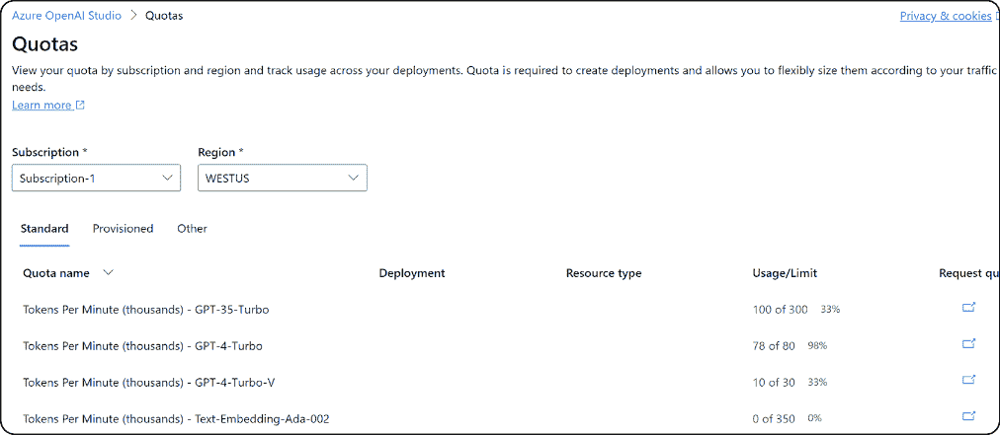
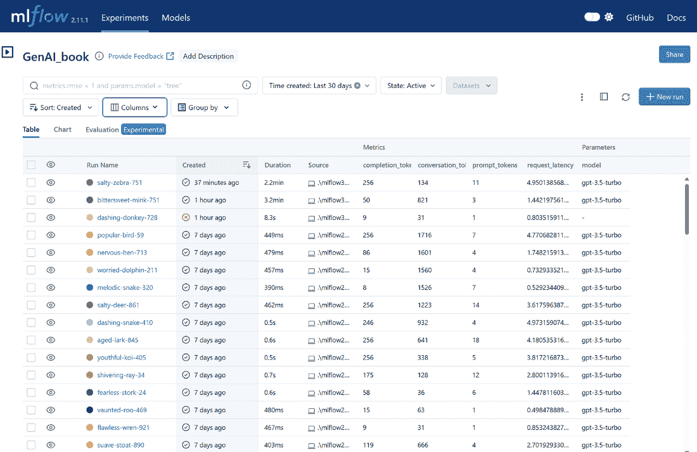
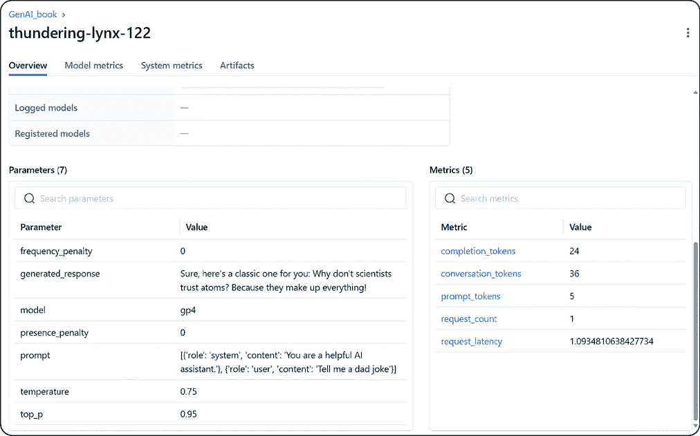
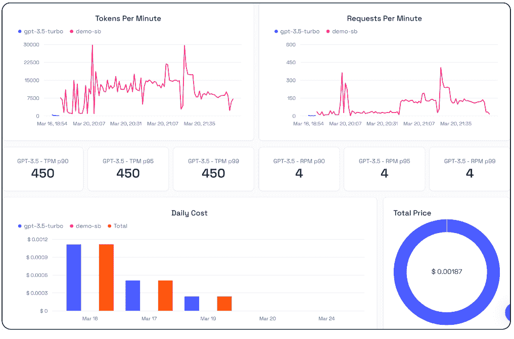
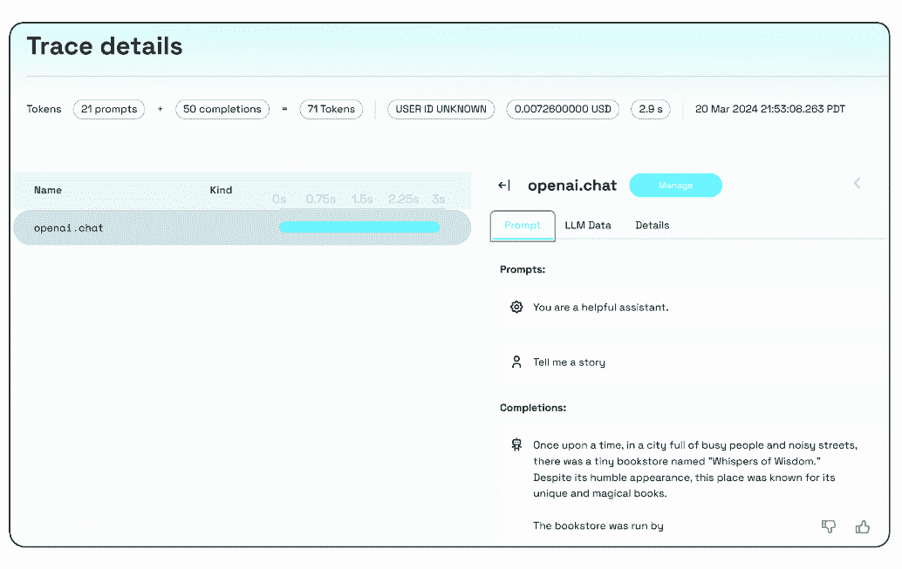
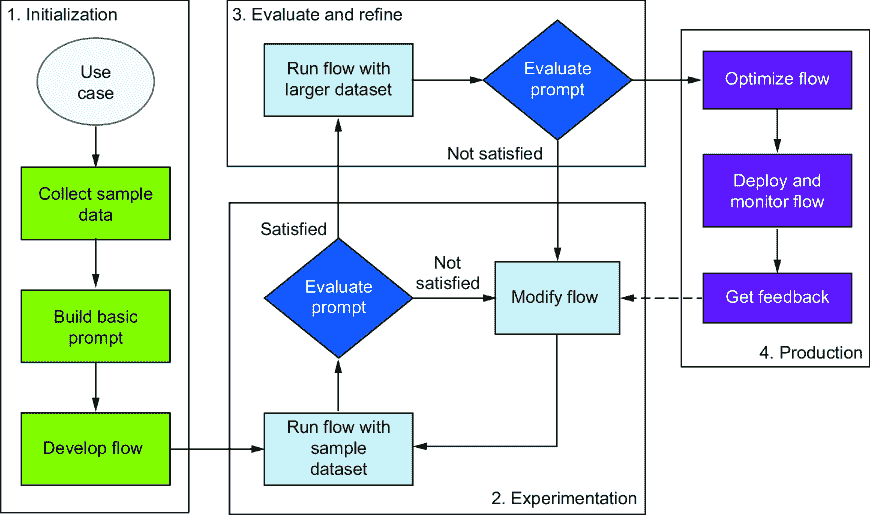

# 11 扩展：生产部署的最佳实践

### 本章涵盖

+   为准备生产的应用程序考虑的挑战和部署选项

+   涵盖可扩展性、延迟、缓存和管理身份的生产最佳实践

+   LLM 应用的可观察性，以及一些实际示例

+   LLMOps 及其如何补充 MLOps

当组织准备将他们的生成式 AI 模型从概念验证（PoC）领域带入现实世界的生产时，他们开始了一段需要仔细考虑关键方面的旅程。本章将讨论部署和扩展选项，分享使生成式 AI 解决方案可操作、可靠、高效和安全的最佳实践。

在生产环境中部署和扩展生成式 AI 模型是一项复杂的任务，需要仔细考虑各种因素。虽然构建原型可以是一种令人兴奋的测试想法可行性的方式，但将其推向生产则引入了一个全新的操作、技术和商业考虑的领域。

本章将重点讨论开发者在生产环境中部署和扩展生成式 AI 模型时必须考虑的关键方面。我们将讨论对监控系统健康至关重要的操作标准、部署选项，以及确保可靠性、性能和安全的最佳实践。

我们还将深入探讨大型语言模型操作（LLMOps）和机器学习操作（MLOps）的概念，这对于管理生产中生成式 AI 模型的生命周期至关重要。此外，本章还将强调成本管理和预算对于在生产中部署的模型的重要性，并提供一些关于在生产环境中成功部署和扩展生成式 AI 模型的启发性案例研究。

在本章结束时，您将经历一次变革性的旅程，了解将生成式 AI 模型部署到生产的关键考虑因素和最佳实践。让我们通过探讨企业在将 GenAI 应用程序部署到生产时面临的一些挑战，来深入这个激动人心的知识世界。

## 11.1 生产部署的挑战

企业生产环境中的生成式 AI 应用程序面临的具体挑战与传统的机器学习（ML）不同。然而，一些挑战仍然存在。例如，开发者必须处理计算资源需求、数据质量标准、性能目标、输出可变性的可能性以及这些强大模型周围不断变化的安全状况的复杂关系。

在部署生成式 AI 模型时，其主要挑战之一是它们的复杂性。即使考虑到今天的云规模基础设施和计算能力，这些模型在计算上可能非常密集，需要大量的资源来训练和部署。因此，将模型扩展以处理大量请求或在资源受限的环境中部署可能很困难。开发者必须仔细考虑模型的硬件和软件要求，以及支持它们的所需基础设施，以确保它们可以有效地部署和扩展。

在部署生成式 AI 模型时，另一个挑战是确保数据的质量和可用性。数据质量的关键方面还包括了解数据的来源以及它是否是一个权威或真实的来源，这一点非常重要。这些模型高度依赖于数据质量和可用性，任何数据问题都可能显著影响模型的性能和准确性。开发者必须实施稳健的数据验证和质量控制流程，并监控用于训练和部署模型的来源和管道，以确保数据准确、相关且最新。这可以通过使用预测性能指标来衡量准确性，通过特定任务的评估来衡量相关性，以及通过跟踪数据新鲜度来衡量时效性。企业应实施稳健的监控系统并记录数据血缘，以维持高数据完整性标准。第十二章更详细地介绍了评估和基准测试。

当部署生成式 AI 模型时，模型性能和准确性也是关键考虑因素。开发者必须仔细监控模型的性能和准确性，并实施定期的测试和验证流程，以确保模型按预期运行。在理想的世界里，这需要深入了解模型的底层算法和架构，以及诊断和解决可能出现的任何问题的能力。然而，在现实世界中，大多数企业将有一个跨职能的开发者、数据科学家和业务专家团队，他们将共同帮助理解、指导和考虑模型架构和部署问题。

在部署生成式 AI 模型时，可靠性和可用性也是关键考虑因素。这些模型必须可靠且可用以满足业务需求，这需要仔细考虑冗余、故障转移和灾难恢复等因素。开发者必须实施强大的监控和维护流程，以确保模型按预期运行，并准备好迅速应对任何问题。当然，大多数企业依赖他们使用的超大规模云服务提供商来提供大部分此类服务。这些服务的底层可靠性和可用性与这些提供商紧密相关。随着小型语言模型（SLMs）也加入其中并与大型语言模型（LLMs）一起使用，可靠性和规模考虑因素不同，尤其是在考虑 SLMs 的边缘部署时。

安全性和合规性也是关键考虑因素。这些模型可以处理敏感数据，这些数据必须得到保护，防止未经授权的访问、盗窃或滥用。企业必须确保模型符合相关法规和标准，如 GDPR、HIPAA 或 PCI-DSS，并实施强大的安全控制措施来保护数据和模型本身。

公司必须首先了解每项法规的要求，以便遵守这些数据保护法规。这包括管理同意、保护敏感信息和处理数据泄露。他们应跟踪和控制 LLM 使用的个人数据，采取强有力的安全措施，并在系统设计之初就考虑隐私问题。定期的合规审计、员工培训和供应商管理对于维持标准至关重要。良好的数据泄露事件响应计划和细致的记录保存将有助于合规。此外，利用云服务的内置合规功能可以帮助满足这些要求。通过跟上合规标准并采取这些步骤，企业可以使用 LLM 来匹配法律和监管义务。

成本管理也是另一个重要考虑因素。模型的部署和维护可能很昂贵，尤其是在计算、存储和网络资源方面。开发者必须仔细管理与部署和扩展模型相关的成本，并准备好在必要时在成本和性能之间做出权衡。

在部署生成式 AI 模型时，集成现有系统和流程也是关键。这些模型通常必须与现有系统和工作流程集成，这可能很复杂且耗时。开发者必须确保模型与现有系统兼容，并且可以轻松集成到现有工作流程中。他们还必须准备好与其他团队和利益相关者紧密合作，以确保平稳部署。

人类在回路考量是另一个重要因素。这些模型通常需要人类干预或监督，尤其是在它们被用于做出关键决策或生成需要人类审查的内容时。开发者必须确保模型的设计考虑了人类在回路，并实施稳健的过程来管理和监控人类干预。

道德考量是部署生成式 AI 模型的最终重要因素。这些模型可能具有重大的道德影响，尤其是关于偏见、公平性和透明度。因此，开发者必须确保模型的设计和部署符合道德标准，并准备好解决道德问题。第十三章深入探讨了这一主题。

通过理解这些挑战和考量，开发者可以设计和部署可扩展、可靠且安全的生成式 AI 模型，以满足生产环境中的业务需求。在部署生成式 AI 模型到生产环境中时，必须解决几个挑战和考量以确保成功实施。以下关键点突出了这些关键方面：

+   *生成式 AI 模型的复杂性*—训练和部署需要高计算需求和大量资源。考虑硬件、软件和基础设施以实现有效扩展。

+   *数据质量和可用性*—这对于模型性能和准确性至关重要。实施稳健的数据验证和质量控制流程，并监控数据源。

+   *模型性能和准确性*—需要定期测试和验证。跨职能团队能够帮助理解和解决这些问题。

+   *可靠性及可用性*—实施冗余、故障转移和灾难恢复。使用稳健的监控和维护流程。对超规模扩展器的服务可靠性有依赖。

+   *安全和合规性*—保护敏感数据免受未经授权的访问。确保符合 GDPR、HIPAA 和 PCI-DSS 等法规。实施安全控制，并有效管理数据保护。

+   *成本管理*—这涉及对计算、存储和网络成本的谨慎管理，平衡成本和性能。

+   *与现有系统集成*—确保与当前系统和工作流程的兼容性和平滑集成。与其他团队和利益相关者合作。

+   *人类在回路考量*—为关键决策设计具有人类监督的模型。实施管理人类干预的流程。

+   *道德考量*—解决偏见、公平性和透明度问题。确保模型的设计和部署符合道德标准。

## 11.2 部署选项

在部署生成式 AI 应用时，有多种选择，最佳选择取决于模型大小和复杂性、所需的可扩展性和可用性、以及可用的基础设施和资源等因素。

云部署提供了诸如可扩展性、多样化的计算选项和便于部署的托管服务等优势。然而，请考虑潜在的持续成本、供应商锁定和数据隐私问题。本地部署提供更大的控制权、性能优化和数据安全性，但需要大量的前期投资和内部专业知识，可能涉及较慢的扩展。混合方法结合了两种优势，允许敏感数据保留在本地，同时使用云的可扩展性和引入管理复杂性。

无论选择哪种部署路径，一些核心技术都促进了这个过程。容器化确保模型在不同环境中的执行一致性，而无服务器函数适用于动态工作负载。API 网关为其他应用程序提供结构化访问以利用模型，而专门的 GenAI 平台可以简化 LLM 的部署和管理。

由于其可扩展性和灵活性，云部署很受欢迎，尤其是在微软 Azure、亚马逊网络服务（AWS）和谷歌云平台（GCP）等提供商中。根据他们的需求，开发者可以选择虚拟机、容器或无服务器函数。然而，仔细评估所需的底层基础设施和资源至关重要，包括 GPU、内存、存储和网络带宽。实施负载均衡和冗余策略确保可扩展性和可用性，而强大的监控和自动化测试对于维护性能和健康至关重要。

通过仔细考虑这些因素，开发者可以确保无论选择哪种环境，都能可靠、可扩展且成本效益地部署生成式 AI 应用。

## 11.3 通过 API 的托管 LLM

除了之前讨论的部署选项之外，重要的是要注意，一些 LLM 仅通过托管在在线 API 中提供。这通常是 AI 研究组织或大型科技公司开发的尖端模型的情况。正如我们所知，GenAI 模型需要大量的计算资源，这使得它们难以在本地或混合模式下运行。表 11.1 概述了托管 LLM 的一些优势。

##### 表 11.1 托管 LLM 的优势

| 优势 | 描述 |
| --- | --- |
| 易用性 | 通过 API 的托管 LLM 通常易于使用。开发者可以向 API 发送请求并接收响应，无需担心底层基础设施或模型复杂性。 |
| 持续更新 | 这些托管 LLM 的提供商通常会持续更新和改进他们的模型。API 允许您利用这些改进，而无需手动更新您的模型。 |
| 可扩展性 | 通过 API 的托管 LLM 可以处理大量请求，并根据需求自动扩展，类似于其他基于云的服务。 |
| 模型复杂性 | LLM 是极其复杂的机器学习模型，对企业来说可能带来一些挑战，尤其是那些在 AI 和 ML 方面没有丰富经验的企业。托管服务将这种复杂性转嫁给提供商，通过 API 提供推理。 |

在使用通过 API 的托管 LLM 时，也需要考虑一些约束和挑战，如表 11.2 所述。

##### 表 11.2 使用托管 LLM 的考虑因素

| 考虑因素 | 描述 |
| --- | --- |
| 成本 | 通过 API 使用托管 LLM 的成本可能会因使用情况而显著变化。虽然一些提供商提供免费层，但更广泛的使用可能会产生重大成本。 |
| 依赖性 | 通过 API 使用托管 LLM，您依赖于提供商提供的模型和基础设施。如果提供商出现停机或停止服务，这可能会影响您的应用程序。 |
| 数据隐私 | 使用通过 API 的托管 LLM 将数据发送到提供商的服务器进行处理，这可能会引起隐私问题，尤其是关于敏感数据。 |
| 有限的定制化 | 虽然通过 API 的托管 LLM 提供了易用性，但它们通常提供有限的定制选项。您受限于 API 提供的功能和配置，无法修改底层模型。 |

总结来说，虽然通过 API 的托管 LLM 提供了多项好处，但也伴随着某些考虑因素。它们是否是您 GenAI 应用程序的正确选择取决于您的需求和限制。如果您需要高度定制化、有严格的数据隐私要求或需要离线运行模型，那么本地或混合部署可能更合适。然而，如果您重视易用性、持续更新和自动扩展，那么通过 API 的托管 LLM 可能是一个不错的选择。

## 11.4 生产部署的最佳实践

要使用 GenAI 应用程序，需要一种全面的方法，涉及周密的规划和执行，以确保可扩展性、可靠性和安全性。当在您的应用程序中使用 LLM 时，您需要考虑 LLMOps、可观察性和工具等方面，以有效地处理应用程序的生命周期。此外，您还需要考虑其他方面，如模型托管和管理、可靠性和性能考虑、以及安全和合规性考虑。这些领域对于确保应用程序按预期工作并遵循高可靠性、安全和合规性标准至关重要。

在本节中，您将了解许多这些方面，例如 LLM 推理的度量标准、如何衡量和理解 LLM 的延迟、可扩展性、LLM 的推理选项、配额和速率限制，以及可观察性。它将为您提供一份完整的指南，帮助您在生产中扩展 GenAI 应用程序。

### 11.4.1 LLM 推理的度量标准

从生产部署的角度来看，最重要的指标之一与 LLM 推理相关。这是我们所有人都在开发 GenAI 应用时共同努力和解决的问题。正如我们所见，LLM 通过两个步骤生成文本：提示，其中一次性处理输入标记，解码，其中逐个顺序地创建文本。每个创建的标记都会添加到输入中，并由模型再次使用以创建下一个标记。生成在 LLM 生成一个特殊的停止标记或满足用户定义的条件（例如，已生成最大数量的标记）时结束。

理解和管理与 LLM 推理相关的关键操作指标变得至关重要。许多这些指标都是新的，对于大多数用户来说还太早，但以下四个指标尤其重要：第一个标记的时间、每个输出标记的时间、延迟和吞吐量。表 11.3 概述了这些操作标准的定义和重要性。在本章的后面部分，您将看到如何在我们 LLM 部署上测量这些指标。

##### 表 11.3 LLM 推理指标

| 指标 | 定义 |
| --- | --- |
| Time to first token (TTFT)  | 衡量模型在用户查询后生成第一个标记所需的时间。较低的 TTFT 意味着更快的用户体验。TTFT 受处理提示和生成第一个输出标记所需的时间的影响。  |
| Time-per-output token (TPOT)  | 计算模型为特定查询生成一个标记所需的时间。较低的 TPOT 意味着更快的文本生成。模型大小、硬件配置和解码算法影响 TPOT。  |
| Latency  | 此指标衡量数据从起点到目的地的移动时间。在 LLM 的情况下，这是模型生成对用户响应的时间。模型和生成的标记影响 LLM 的延迟。通常，大部分时间都花在生成完整的标记上，这些标记是一次性生成的。生成时间越长，延迟越高。  |
| Throughput  | 测量单位时间内可以传输的数据量。在这种情况下，部署单元每秒可以处理的输出标记数量可以服务于所有请求。  |
| Request per second (RPS)  | RPS 衡量 LLM 在生产中的吞吐量，并指示 LLM 每秒可以处理的请求数量。这个指标对于理解 LLM 在现实世界应用中部署的可扩展性和效率至关重要。  |

注意：在性能指标方面，RPS 和吞吐量经常被互换使用，但它们可能有细微的差别。本质上，RPS 是关于传入负载，而吞吐量是关于服务器的输出或成功处理该负载。高吞吐量和高 RPS 指示服务器性能良好，而低吞吐量和高 RPS 可能表明服务器难以跟上需求。

### 11.4.2 延迟

延迟是几乎每个人都使用的常见指标，但在生成式 AI 中它并不明确，需要重新审视。通常的延迟定义并不适用，因为这些 API 只返回了一个结果，而不是多个流式响应。因为输出生成很大程度上取决于输入，所以 GenAI 有不同的延迟点需要考虑。例如，一个延迟是第一个令牌延迟；另一个是在所有生成完成后完整的端到端延迟。

我们不能仅仅依赖于端到端延迟的第二次测量，因为我们现在知道提示大小和输出令牌数量是关键影响因素。生成内容会随着查询（即提示）的变化而变化——除非我们比较相似的令牌，否则这不是一个有用的指标。例如，以下两个例子即使输入令牌数量大致相同，所需的计算量和时间也不同：

+   *示例 1*—生成一首关于为什么狗很棒的三节诗。

+   *示例 2*—生成一篇关于为什么狗很棒的三页诗。

第一个例子有 11 个令牌，第二个例子在使用 `cl100kbase` 令牌化器（由较新的 GPT 模型使用）时有 10 个令牌。然而，生成的令牌非常不同。此外，如前所述，每输出令牌时间（TPOT）没有考虑输入提示。对于许多任务（如摘要）来说，输入提示也很大，因为这些任务使用了检索增强生成（RAG）来获取上下文信息。因此，使用 TPOT 作为测量延迟的方法并不精确。

模型大小也会影响资源使用；较小的模型通常更高效，使用的资源更少，而较大的模型功能更强大，但需要更多的时间。让我们用一个例子来展示如何测量这一点。

以下列表展示了一种测量 Azure OpenAI 聊天 API 延迟的简单方法。与之前使用软件开发工具包（SDK）的例子不同，这个例子使用的是 REST API，因此我们必须构建有效负载并调用 POST 方法。我们选择要模拟的请求数量，并有一个主函数，它使用 `ThreadPoolExecutor` 同时发送多个 API 请求。它将 `call_api_and_measure_latency()` 函数传递给执行器，为每个模拟请求收集延迟，计算平均延迟，并显示它。

##### 列表 11.1 测量延迟

```py
import os
...

AZURE_ENDPOINT = os.getenv("AOAI_ENDPOINT")       #1
AOAI_API_KEY = os.getenv("AOAI_KEY")             #1
MODEL = "gpt35"                                  #1
API_VERSION = "2024-02-15-preview"               #1

headers = {
    "api-key": AOAI_API_KEY,
    "Content-Type": "application/json"
}

def get_payload():                                      #2
    return {
        "model": MODEL,
        "max_tokens": 50,
        "messages": [{"role": "system", "content": 
                     ↪"You are a helpful assistant."}, 
                     {"role": "user", "content": "Hello, world!"}],
        "temperature": 0.95,
        "stream": True                                  #3
    }

def call_api_and_measure_latency():                    #4
    payload = get_payload()
    start_time = time.time()         #5
    response = requests.post(AZURE_ENDPOINT,
                             headers=headers,
                             json=payload, timeout=20)
    latency = time.time() - start_time                   #6
    return latency, response.status_code

num_requests = 50                                   #7

def main():
    with ThreadPoolExecutor(max_workers=20) as executor:   #8
        futures = [executor.submit(call_api_and_measure_latency)
                   ↪for _ in range(num_requests)]
        latencies = []
        for future in tqdm(as_completed(futures), total=num_requests):
            latency, status_code = future.result()
            print(f"Latency: {latency}s, Status Code: {status_code}")
            latencies.append(latency)

    average_latency = sum(latencies) / len(latencies)      #9
    print(f"Average Latency: {average_latency}s")

if __name__ == "__main__":
    main()
```

#1 设置 Azure OpenAI 聊天 API 端点和 API 密钥

#2 定义有效负载，包括要使用的模型细节

#3 我们流式传输响应，以便我们可以更快地开始获取响应。

#4 调用 Azure OpenAI 聊天 API 并测量延迟的函数

#5 用于计算延迟的起始时间

#6 用于计算延迟的结束时间

#7 模拟请求的数量

#8 模拟并发 API 调用

#9 计算并打印延迟度量

图 11.1 展示了使用 50 次迭代和平均延迟 11.35 秒在按量付费（PAYGO）实例上执行的输出示例。这是客户端到服务的往返调用，而不是服务本身的延迟。这并不理想，对于大多数生产工作负载，我们需要查看预留容量，我们将在下一节中介绍。


##### 图 11.1 Azure OpenAI 延迟示例

如图 11.2 所示，在这个示例中，我们可以使用 Azure 的内置功能来获取服务度量，如延迟。使用默认的度量选项，我们看到这个 PAYGO 实例的平均延迟为 95.37 毫秒。


##### 图 11.2 Azure 请求和延迟平均值

注意：我们之前看到的代码是一个基本示例，展示了如何测量延迟以及从生产角度的视图；它不是负载测试延迟的良好实现，尤其是如果您不使用 PAYGO。更好的方法是使用带有 OSS 工具（如 Apache JMeter [`jmeter.apache.org`](https://jmeter.apache.org)）或 Locust [`locust.io`](https://locust.io) 的脚本。

### 11.4.3 可扩展性

企业在部署使用 LLM（如 Azure OpenAI）的生产应用程序时应考虑的主要扩展选项之一是预置吞吐量单元（PTU）。Azure OpenAI 的 PTU 是模型处理容量的单位，您可以预留并部署用于处理提示和生成完成。它们体现了一种标准化的方式来表示部署的吞吐量，每个模型-版本对在部署和每个 PTU 的吞吐量方面都需要不同的数量。每个 PTU 的吞吐量可能因模型类型和版本而异，了解这一点对于良好地扩展您的应用程序很重要。

PTU（预置单元）本质上与 Azure 其他服务中的预留实例相同，但它仅是 Azure OpenAI 服务的功能。当应用程序需要扩展并使用多个 AI 服务时，必须考虑所有这些服务的预留实例容量，因为没有一种通用服务为特定应用程序或订阅预留容量。

要在 Azure OpenAI 中使用 PTU 部署模型，我们必须选择“预置管理”部署类型，并指明工作负载所需的 PTU 数量，如图 11.3 所示。我们还需要计算我们特定工作负载形状的大小，您可以使用 Azure OpenAI 容量计算器来完成此操作。此计算有助于确定部署所需的正确 PTU 数量。


##### 图 11.3 Azure OpenAI 上的 PTU 部署选项

除了 PTUs 之外，企业可以利用按需使用的 PAYGO 模型，该模型使用每分钟消耗的令牌（TPM）。此模型可以与 PTUs 结合使用，以优化利用率和成本。此外，API 管理（APIM）可以与 Azure OpenAI 一起使用，以管理和实施排队、速率限制、错误处理和使用配额的政策。

通过在 PTU 实例上对 PAYGO 进行的相同延迟测试进行轻微修改，我们得到了以下结果，无论是使用 GPT-4 还是相同模型版本。我们在每种情况下随机从列表中选择一个提示进行调用，并循环 100 次。在 PTUs 上平均 2.9 秒的端到端延迟相当不错，与 PAYGO 上的 6.3 秒相比，这不算太坏，但也不算太好：

```py
Starting PTU test...
Median Latency: 1.582270622253418s
Average Latency: 2.947581880092621s
Min Latency: 0.7084167003631592s
Max Latency: 11.790298700332642s

Starting PAYGO test...
Median Latency: 2.391003727912903s
Average Latency: 6.372000885009766s
Min Latency: 0.4583735466003418s
Max Latency: 89.96037220954895s
```

列表 11.2 中的代码显示了差异。此函数遍历两个 OpenAI 客户端及其相应的模型。为每个客户端-模型对创建一个具有 20 个工作者的`ThreadPoolExecutor`，并提交任务。每个任务是对`call_completion_api()`函数（Azure OpenAI 完成 API 的包装）的调用，该调用使用从测试输入中随机选择的输入。它收集所有任务的延迟，计算中位数、平均值、最小值和最大延迟，并打印这些指标。

##### 列表 11.2 测量 PAYGO 和 PTU 之间的延迟

```py
test_inputs = ["Hello", "How are you?", 
     ↪"What's the capital of Hawaii?", "Tell me a dad joke", 
     ↪"Tell me a story", "What's your favorite movie?", 
     ↪"What's the meaning of life?", "What's the capital of India?",
     ↪"What's the square root of 1976?", "What's the largest mammal?",
     ↪"Write a story about a Panda F1 driver in less 
        ↪than {MAX_TOKENS} words"]

def main():
    for client, model, test_name in [(ptu_client, 
      ↪PTU_MODEL, "PTU"), (paygo_client, PAYGO_MODEL, "PAYGO")]:
        print(f"Starting {test_name} test...")
        with ThreadPoolExecutor(max_workers=20) as executor:
            latencies = []
            futures = [executor.submit(call_completion_api, 
                       ↪client, model, input) for input in 
                       ↪random.choices(test_inputs, k=NUM_INTERATION)]
            for future in tqdm(as_completed(futures), 
            ↪total=NUM_INTERATION):
                latency, token_count = future.result()
                if latency is not None and token_count is not None:
                    logging.info(f"Latency: {latency}s, 
                    ↪Token Count: {token_count}")
                    latencies.append(latency)

        # Calculate and print metrics
        average_latency = sum(latencies) / len(latencies)
        ↪if latencies else None
        min_latency = min(latencies) if latencies else None
        max_latency = max(latencies) if latencies else None
        median_latency = statistics.median(latencies) 
        ↪if latencies else None

        print(f"Median Latency: {median_latency}s")
        print(f"Average Latency: {average_latency}s")
        print(f"Min Latency: {min_latency}s")
        print(f"Max Latency: {max_latency}s")
```

### 11.4.4 PAYGO

带有 TPM 的 PAYGO 模型是一种灵活的支付方式，让您只为使用的资源付费。对于具有变化的使用模式且不需要恒定处理能力的应用程序，此方法特别有用。它是大多数提供商和大多数客户的标准。TPM 是模型处理能力的衡量标准。当您向模型发送请求时，它根据提示和响应的复杂性和长度使用一定数量的令牌。我们按每个消耗的令牌计费，因此随着使用量的增加，您支付的更多，如果减少，则支付的更少。

大多数基于云的 LLM 都具有配额管理功能，允许您将速率限制分配到您的部署，最高可达全局限制。同样，部署和速率限制与模型部署相关联。我们还可以将特定的 TPM 分配给特定的部署；当我们这样做时，该模型的可用配额将减少相应数量。

PAYGO 模型在扩展方面具有优势，因为它允许您在订阅和区域内全局分配 TPM，提供在您的订阅内管理部署之间速率限制分配的灵活性。此模型非常适合具有高峰时段高使用量随后是低或无使用量的应用程序，因为它确保您只为使用付费。

### 11.4.5 配额和速率限制

配额和速率限制是云服务中用于管理和控制资源使用的两种机制。配额是指用户或服务在指定期间（如一天或一个月）可以消耗的资源总量。它们作为使用上限，防止资源过度消耗并确保用户之间公平分配。

与之相反，速率限制控制对服务的请求频率。它们通常定义为每秒或每分钟可以发出的请求数量。通过限制用户可以发出请求的速率，速率限制有助于管理负载并避免系统过载。

从本质上讲，配额指的是您可以使用的资源数量，而速率限制指的是访问这些资源的频率。理解这两者对于有效的 API 管理和避免企业服务中断至关重要。通过遵守速率限制，企业可以确保其应用程序不会发送超过服务在特定时间内可以处理的请求数量，这有助于保持性能和稳定性。同时，通过保持在配额内，它们可以控制成本并防止意外超支。

OpenAI 服务的配额，尤其是 Azure OpenAI 的配额，定义为用户或组织可以消耗的资源或计算能力的限制。这些配额通常以 TPM（每秒事务数）衡量，并按区域和模型分配。配额确保服务可以为所有用户提供一致和可预测的性能。

企业应将这些配额视为一种有效管理使用和成本的方式。他们必须监控他们的消费，以避免超过这些限制，这可能导致额外费用或服务中断。对于企业来说，了解与其部署相关的速率限制并据此规划也同样重要。

例如，如果一家企业在某个区域的一个特定模型上有 240,000 TPM 的配额，它可以创建一个 240K TPM 的部署，两个各 120K TPM 的部署，或者在该区域创建多个总计少于 240K TPM 的部署。例如，图 11.4 概述了特定 Azure OpenAI 端点和部署的各种模型的配额设置。



##### 图 11.4 Azure OpenAI 模型配额设置

OpenAI 有其配额系统，但它们的结构不同。OpenAI 的配额通常与基于用户提供的计费信息设定的使用限制相关。一旦输入计费信息，用户每月将有一个批准的使用限额（默认为 100 美元），随着平台使用量的增长，这个限额可以自动增加。用户会从一个使用层级移动到另一个层级，如图 11.5 所示。用户可以在“限制”页面下的账户设置中查看他们当前的限额。


##### 图 11.5 OpenAI 配额层级

这些配额旨在帮助管理和预测成本以及防止资源过度使用。企业应密切监控其使用情况，以确保它们保持在这些限制内，并了解这些限制如何随着使用量的增加而扩展。

### 11.4.6 管理配额

有效地管理配额对于保持一致和可预测的应用程序性能至关重要。以下是一些值得考虑的最佳实践：

+   *了解您的限制*。熟悉适用于模型的基本配额和限制，因为每个模型和区域都可以有不同的默认配额限制。

+   *监控您的使用情况*。实施监控策略以跟踪您的使用情况与分配配额之间的关系。这将帮助您避免意外的限制并确保良好的客户体验。

+   *实现重试逻辑*。在您的应用程序中包含重试逻辑以处理速率限制错误。这将允许您的应用程序在短暂的暂停后等待并重试请求，而不是直接失败。这样做的一种简单方法是使用`Tenacity`库（一个开源库）：

```py
from tenacity import (
    retry,
    stop_after_attempt,
    wait_random_exponential,
)
@retry(wait=wait_random_exponential(min=1, max=60), stop=stop_after_attempt(6))
def completion_backoff(conversation):
    response = client.chat.completions.create(
        model=MODEL,
        messages=conversation,
        temperature=TEMPERATURE,
        max_tokens=MAX_TOKENS,
    )
    return response
```

+   *避免工作负载的急剧变化*。逐渐增加您的负载以防止突然的峰值，这可能导致限制。测试不同的负载增加模式以找到最适合您应用程序的最有效方法。请注意，限制会故意减慢或限制应用程序或服务在一定时期内可以处理的请求。服务器或服务提供商通常执行此操作以防止系统过载，确保公平使用并维护服务质量。正如我们所知，限制是 API 管理和基于云的服务中管理资源效率并保护系统免受潜在滥用或拒绝服务（DoS）攻击的常见做法。它还用于防止单个用户或服务消耗所有可用资源并影响其他用户或服务的性能。

+   *管理 TPM 分配*。使用配额管理功能在流量高的部署中增加 TPM，在需求有限的部署中减少 TPM。这有助于平衡负载并优化资源利用率。

+   *请求配额增加*。如果您持续超出配额限制，请考虑通过 Azure 门户或联系 Microsoft 支持或非 Azure 云服务提供商来请求增加配额。

+   *均匀分配请求*。为了避免达到每分钟请求次数（RPM）的限制，请将您的请求均匀地分配到一段时间内。包括 Azure OpenAI 在内的许多云服务提供商都会在短时间内评估传入请求的速率，如果超过 RPM 限制，可能会进行限制。

注意：使用 Azure OpenAI，您可以结合 PAYGO 和 PTUs 来满足您的负载。这种混合方法让您可以使用 PAYGO 的灵活性来处理可变负载，同时拥有 PTUs 的可靠性和一致性，适用于稳定负载。当您这样做时，PTUs 对于具有稳定性能需求的负载很有用，因为它们在提前预留固定数量的吞吐量容量，从而确保低延迟变化。此外，PAYGO 非常适合处理不确定的负载，其中使用量可能会变化。您根据每分钟的令牌使用量付费，这意味着当您的使用量高时，您需要支付更多，而当使用量低时，您需要支付更少。

通过积极管理配额和速率限制，企业可以确保它们有足够的容量来满足其应用程序的需求，同时控制成本并保持服务可用性。

### 11.4.7 可观测性

LLM 应用的可观测性指的是监控、日志记录和跟踪，以确保应用程序按预期工作，并在出现问题时进行修复。让我们更详细地考察每一个方面：

+   *监控*—衡量关键性能指标（KPIs），如响应时间、吞吐量、错误率和资源利用率。这些数据对于了解应用程序的状态和做出关于扩展和优化的明智选择至关重要。

+   *日志记录*—详细的日志应记录请求和响应，包括输入提示和模型的输出。这些信息对于调试、理解模型行为和提升用户体验是无价的。

+   *跟踪*—使用跟踪来追踪请求通过应用程序的路径。这对于具有复杂架构或多个模型和服务的应用程序尤为重要。跟踪有助于定位瓶颈和优化区域。

在接下来的章节中，我们将使用 MLflow、Traceloop 和 Prompt flow 向您展示如何实现这一点。让我们从 MLflow 开始。

#### MLFlow

MLflow 是一个开源平台，旨在管理机器学习（ML）的生命周期，包括实验、可重复性和部署。它通过提供跟踪实验、打包代码和管理模型的工具，帮助从业者简化他们的 MLflow 工作。MLflow 的主要组件包括跟踪、模型注册和用于部署模型的服务器，这有助于促进机器学习项目中的团队合作和创新。

MLflow 通过提供简化部署和监控过程的工具，增强了 LLM 的可观测性。它提供了一个统一的界面，用于与不同的 LLM 提供商交互，简化了模型集成和管理。MLflow 平台无关的特性也促进了跨各种云平台的无缝集成和部署，进一步有助于 LLM 的可观测性和管理。

如列表 11.3 所示，我们使用 MLflow 实现这一点。这个基本的控制台聊天应用程序使用 Azure OpenAI，并随机使用列表 `text_inputs` 中的几个提示。我们可以通过多个线程设置重复次数。当我们调用聊天完成 API 时，我们记录各种特征以展示 MLflow 的应用方式。

我们要求 MLflow 和 Prometheus ([`prometheus.io`](https://prometheus.io)) 在一个端点安装并运行才能执行此操作。在我们的例子中，我们在端口 5000 的 Docker 容器中本地运行。下面的列表显示了 docker-compose 文件。本书的 GitHub 仓库 ([`bit.ly/GenAIBook`](https://bit.ly/GenAIBook)) 也包含了所有代码。

##### 列表 11.3 MLflow 的 docker-cmpose 文件

```py
services:
  mlflow:
    image: ghcr.io/mlflow/mlflow:latest
    command: mlflow server --backend-store-uri /mlflow/mlruns 
    ↪--default-artifact-root /mlflow/artifacts --host 0.0.0.0
    ports:
      - "5000:5000"
    volumes:
      - ./mlflow/mlruns:/mlflow/mlruns
      - ./mlflow/artifacts:/mlflow/artifacts

  prometheus:
    image: prom/prometheus:latest
    command: --config.file=/etc/prometheus/prometheus.yml
    ports:
      - "9090:9090"
    volumes:
      - ./prometheus.yml:/etc/prometheus/prometheus.yml
      - ./prometheus/data:/prometheus/data
    depends_on:
      - mlflow
```

我们首先使用 docker compose 命令运行 Docker 容器，如下所示：`docker compose up -d`。`-d` 参数以分离模式运行，这很有帮助，可以在后台运行。如列表 11.4 所述，我们首先指定 MLflow 的跟踪 URI (`http://localhost:5000`)；这是 MLflow 将存储我们记录的数据的位置，同时也为实验分配一个名称（`GenAI_book`）以便我们可以将其与其他内容区分开来。当然，我们是这个示例的唯一用户，因为它是在本地运行的。此外，我们还需要安装以下两个依赖项才能使其工作：`– mlflow` 和 `colorama`。使用 conda，可以使用 `conda install -c conda-forge mlflow colorama` 安装，或者使用 pip 使用 `pip install mlflow colorama`。

我们测量诸如令牌计数、提示、对话等特征。我们还计算接收响应所需的时间并将其存储。我们使用 `mlflow.log_metrics()` 函数存储所有这些指标。我们还使用 `mlflow.log_params()` 函数存储 API 请求中使用的参数。

##### 列表 11.4 MLflow 可观测性示例

```py
import prometheus_client as prom
import mlflow
...

# Set OpenAI API key
API_KEY = os.getenv("OPENAI_API_BOOK_KEY")
MODEL = "gpt-3.5-turbo"
MLFLOW_URI = "http://localhost:5000"
...

# Initialize OpenAI client
client = OpenAI(api_key=API_KEY)

# Set MLflow tracking URI
mlflow.set_tracking_uri(MLFLOW_URI)
mlflow.set_experiment("GenAI_book")

def generate_text(conversation, max_tokens=100)->str:
    start_time = time.time()
    response = client.chat.completions.create(
        model=MODEL,
        messages=conversation,
    )
    latency = time.time() - start_time
    message_response = response.choices[0].message.content

    # Count tokens in the prompt, and the completion
    prompt_tokens = count_tokens(conversation[-1]['content'])
    conversation_tokens = count_tokens(str(conversation))
    completion_tokens = count_tokens(message_response)

    # Log metrics using MLflow
    with mlflow.start_run():
        mlflow.log_metrics({
            "request_count": 1,
            "request_latency": latency,
            "prompt_tokens": prompt_tokens,
            "completion_tokens": completion_tokens,
            "conversation_tokens": conversation_tokens
            })
        mlflow.log_params({
            "model": MODEL,
            "temperature": TEMPERATURE,
            "top_p": TOP_P,
            "frequency_penalty": FREQUENCY_PENALTY,
            "presence_penalty": PRESENCE_PENALTY
            })        

    return message_response

if __name__ == "__main__":
    conversation = [{"role": "system", "content": 
                   ↪"You are a helpful assistant."}]

    while True:
        user_input = input(f"You: ")
        conversation.append({"role": "user", "content": user_input})
        output = generate_text(conversation, 256)
        print_ai_output(output)
        conversation.append({"role": "assistant", "content": output})
```

记录这些数据允许您比较不同的运行，检查您模型的性能，并使用 MLflow UI 看到参数变化如何影响输出。图 11.6 展示了当我们运行多个实验并可以对比它们时的信息。



##### 图 11.6 MLFlow 实验仪表板

图 11.7 展示了一些我们一直在监控的指标：`completion_tokens` 以及当 `request_latency` 绘图时它们与请求延迟的关系。


##### 图 11.7 MLflow 模型指标示例

图 11.8 阐述了我们可以如何记录一些提示细节和生成的响应，这对于可观测性非常有用。当然，这应该谨慎进行，取决于谁可以访问此遥测的隐私和法律影响。



##### 图 11.8 MLflow 提示和响应细节

#### Traceloop 和 OpenLLMetry

Traceloop ([`www.traceloop.com/`](https://www.traceloop.com/)) 是一个用于监控 LLM 应用的可观测性工具。它提供实时警报和执行跟踪等功能，以确保质量部署。基于 OpenTelemetry 构建的 OpenLLMetry 是一个由 Traceloop 维护的开源扩展，它增强了 LLM 的可观测性。它集成了 Traceloop 的工具，并增加了针对 LLM 的特定监控能力，便于开发者进行 LLM 可观测性工作，同时与 OpenTelemetry 标准保持一致。

OpenLLMetry 扩展了 OpenTelemetry 的功能，以涵盖通用操作，如数据库和 API 交互，以及针对 LLM 特定操作的定制扩展。这包括对 OpenAI 或 Anthropic 等 LLM 提供商的调用，以及与 Chroma 或 Pinecone 等向量数据库的交互。换句话说，OpenLLMetry 为 LLM 应用程序提供了一套专业工具包，使开发者更容易在这个领域开始可观测性，同时仍然生成与现有可观测性堆栈兼容的标准 OpenTelemetry 数据。

将其与现有应用程序集成相当简单。我们需要安装 Traceloop SDK (`pip install traceloop-sdk`)。接下来，我们在 [`app.traceloop.com/`](https://app.traceloop.com/) 创建登录并获取 API 密钥。使用 `Traceloop.init()` 初始化它非常简单，它会自动进行仪表化。

##### 列表 11.5 使用 Traceloop

```py
import os
from traceloop.sdk import Traceloop
...

LOAD_TEST_ITERATIONS = 50

# Set OpenAI
API_KEY = os.getenv("AOAI_PTU_KEY")
ENDPOINT = os.getenv("AOAI_PTU_ENDPOINT")
...

# Initialize Traceloop
TRACELOOP_API_KEY = os.getenv("TRACELOOP_API_KEY")
Traceloop.init(api_key=TRACELOOP_API_KEY)

client = AzureOpenAI(
    azure_endpoint = ENDPOINT,
    api_key=API_KEY,
    api_version="2024-02-15-preview"
)

# Define the conversation as a list of messages
conversation = [
    {"role": "system", "content": "You are a helpful assistant."},
]

# Define a list of test inputs
test_inputs = ["Hello", "How are you?", "What's the weather like?", 
     ↪"Tell me a joke", "Tell me a story", "What's your favorite movie?",
     ↪"What's the meaning of life?", "What's the capital of France?", 
     ↪"What's the square root of 144?", "What's the largest mammal?"]

print("Starting load test...")
for _ in tqdm(range(LOAD_TEST_ITERATIONS)):
    # Generate a random user input
    user_input = random.choice(test_inputs)

    # Add user input to the conversation
    conversation.append({"role": "user", "content": user_input})

    # Make the API call
    response = client.chat.completions.create(
        model=MODEL,
        messages=conversation,
        temperature=TEMPERATURE,
        max_tokens=MAX_TOKENS,
    )

print("Load test complete.")
```

Traceloop 还与其他系统和各种 LLM API 有多个集成点。更多详情请见 [`mng.bz/gAJx`](https://mng.bz/gAJx)。为了我们的示例，我们将使用默认仪表板，如图 11.9 所示。



##### 图 11.9 Traceloop 可观测性

由于我们可以从可观测性的角度深入挖掘各种跟踪，我们得到了许多 API 调用的详细信息（图 11.10）。在这个例子中，我们可以看到系统提示、用户提示、完成情况以及其他仪表，例如令牌使用情况。这可以是一个非常强大的功能，适用于许多企业应用程序。

#### 提示流

提示流是来自微软的开源工具和功能集。它改善了 AI 应用程序的创建过程，特别是那些使用 LLM 的应用程序。它帮助设计、评估和实施 AI 应用程序，为开发者提供了一个简单的界面来与 LLM 一起工作。



##### 图 11.10 Traceloop 可观测性示例

对于想要在企业应用程序中使用 LLM 的开发者来说，提示流是一个关键特性，因为它帮助处理可观测性和 LLMOps 方面。它允许开发者构建结合 LLM、提示和 Python 工具的可执行工作流程。这使得开发者能够更容易地查找和修复错误，并改进流程，同时额外提供团队协作功能的优势。开发者可以创建不同的提示选项，评估其有效性，并根据需要调整 LLM 的性能。

提示流由四个阶段组成，如图 11.11 所示。第一阶段，初始化，涉及选择一个业务用例，收集较小的数据集，并构建基本的提示和流程。接下来，实验阶段需要测试和修改初始提示，直到达到良好的结果。第三阶段，评估和改进，涉及在更大的数据集上测量提示的质量和流程的性能，进行更多调整和改进以达到预期的输出。最后，生产阶段涉及将流程投入生产使用，跟踪使用情况、反馈以及可能出现在生产环境中的任何问题。



##### 图 11.11 提示流生命周期

当应用程序从开发阶段过渡到生产阶段时，提示流提供了许多好处。它有助于应用程序与现有的 CI/CD 管道良好地工作，并为扩展 LLM 应用程序提供强大的版本控制和协作工具。这个完整的环境使开发者能够更有信心地部署由 LLM 驱动的应用程序，并支持在实时环境中跟踪和理解模型的行为。因此，提示流是部署策略的关键部分，确保使用 LLM 的应用程序强大、可靠，并准备好满足企业级的生产需求。更多详细信息，包括易于开始的示例，可以在提示流的 GitHub 仓库[`github.com/microsoft/promptflow`](https://github.com/microsoft/promptflow)中找到。

注意：模型服务涉及将训练好的模型部署到使用新数据进行预测。它是应用程序响应性和可扩展性的关键组件。然而，它需要在大数据中心、运营成本和如具有 InfiniBand 连接的 GPU 等专用硬件方面的重大投资。对于考虑模型服务的组织，开源软件库如 vLLM 可能有益。高效的模型取决于可扩展的基础设施，它可以调整资源以满足需求，并确保可用性和成本效益。缓存策略和负载均衡是减少延迟和均匀分配请求的关键。采用蓝绿部署的稳健更新策略确保模型平稳过渡，最小化停机时间。有关 vLLM 的更多详细信息，请参阅[`www.vllm.ai/`](https://www.vllm.ai/)。

### 11.4.8 安全性和合规性考虑

安全性和合规性至关重要，尤其是在处理用户数据和可能敏感信息时。遵循最佳实践有助于保护您的用户，并确保您的应用程序符合相关法律和法规。

+   *数据加密*—对静态和传输中的敏感数据进行加密，以防止未经授权的访问。对于传输中的数据，使用如 TLS 等安全协议；对于静态数据，利用云提供商提供的加密功能。

+   *访问控制*—实施严格的访问控制，以确保只有授权人员才能访问生产数据和基础设施。使用基于角色的访问控制（RBAC）和最小权限原则（PoLP）来最小化数据泄露的风险。

+   *合规性审计*—定期审计您的应用程序及其基础设施，以确保符合相关法规和标准，例如根据您的应用程序领域和地理范围，GDPR、HIPAA 或 CCPA。这可能涉及进行安全评估、漏洞扫描和合规性检查。

+   *异常检测*—部署异常检测系统以监控可能表明安全漏洞或系统滥用的异常活动。这包括监控异常使用模式或未经授权的访问尝试，以便对潜在威胁做出快速响应。

Azure OpenAI 服务将许多这些功能作为标准提供，以满足企业就绪和合规性需求。正如大多数企业所要求的那样，其他云服务提供商如 AWS 和 GCP 也提供了一些这些控制版本的版本。

## 11.5 通用人工智能操作注意事项

通用人工智能应用程序的操作方面，尤其是那些使用 GPT-4 等大型语言模型的应用程序，对于确保这些系统的平稳和高效运行至关重要。理解和管理关键操作指标，如令牌、延迟、每秒请求数（RPS）和首次字节到达时间（TTFB），对于优化性能、用户体验和成本至关重要。让我们来探讨这些操作标准的定义，更好地理解它们的重要性，并探讨如何有效地测量和管理它们。

### 11.5.1 可靠性和性能注意事项

任何生产系统，包括通用人工智能应用程序，都必须可靠且性能良好，以满足用户的需求和期望。这意味着您的系统应该能够应对不同的故障和场景。API 管理或代理系统可以帮助您处理许多这些方面，我们将在下一部分讨论：

+   *监控工具*—利用监控工具和服务持续测量这些操作指标。例如，Prometheus ([`prometheus.io`](https://prometheus.io)) 用于指标收集，Grafana ([`grafana.com`](https://grafana.com)) 用于可视化，可以提供对应用程序性能的实时洞察。云服务提供商还提供原生监控解决方案，可以加以利用。

+   *性能测试*—定期进行性能测试以模拟各种负载条件并测量应用程序的响应。例如，Apache JMeter ([`jmeter.apache.org`](https://jmeter.apache.org)) 或 Locust ([`locust.io`](https://locust.io)) 可以模拟多个用户与您的应用程序交互，以评估其在压力下的吞吐量和延迟。

+   *优化技术*—实施有效的优化技术对于整体应用程序性能、资源利用率和用户体验至关重要：

    +   *令牌管理*——通过优化输入提示和响应来优化令牌的使用。这可能包括修剪不必要的文本、使用更有效的编码技术或定制模型以生成更短、更简洁的输出，同时不牺牲质量。

    +   *缓存*——为频繁请求的信息实现缓存策略以减少延迟并降低系统计算负载。这对于静态或很少变化的数据特别有效。

    +   *负载均衡和自动扩展*——使用负载均衡器在您的基础设施中均匀分配流量，并实现自动扩展以根据需求动态调整资源。这有助于通过确保系统可以处理流量峰值而无需手动干预，从而保持低延迟和高每秒请求数（RPS）。

+   *成本管理*——监控和管理与操作指标相关的成本，特别是令牌使用，因为这直接影响使用 LLM API 的成本。如有必要，实施配额系统或速率限制以防止使用量意外激增。

通过关注这些操作方面，并基于实际数据持续监控和优化，开发者可以确保他们的生成式 AI 应用程序不仅功能齐全，而且高效、可扩展且成本效益高。这种对操作管理的整体方法对于任何利用 LLM 力量的应用程序的成功至关重要。

### 11.5.2 管理标识

Azure OpenAI 在使用托管标识进行认证方面比 OpenAI 或其他 LLM 提供商具有关键优势。这种方法遵循企业生产部署的最佳实践，提高了安全性并简化了凭证管理。托管标识避免了直接处理密钥的需要，降低了密钥泄露的风险，并简化了更改凭证的过程。它们还提供了一种自动方式，使用 Azure Active Directory（AAD）进行身份管理（也称为 Entra ID）来认证在 Azure 上运行的服务与其他 Azure 资源。

当使用 Azure OpenAI 的托管标识时，企业有几种认证方法可供选择——基于角色的访问控制（RBAC）和 Entra ID。前者允许更复杂的网络安全场景，涉及分配角色（例如，用户或贡献者）以启用基于 API 的调用而不需要基于密钥的认证。相反，后者用于使用通过 Azure CLI 获得的令牌来认证我们的 OpenAI 资源。它需要一个自定义子域名，适用于在 Azure 服务（如 VM、函数应用和 VM 扩展集）上运行的应用程序。

与传统的基于密钥的认证方法相比，托管标识提供了几个优势，尤其是在安全和管理的方面。一些关键优势包括

+   *无需管理凭证*——托管标识消除了开发者管理用于在服务之间安全通信的秘密、凭证、证书和密钥的需要。

+   *自动凭据轮换*——系统分配的托管标识与 Azure 资源的生命周期相关联，Azure 自动处理凭据的生命周期，包括其轮换。

+   *增强安全性*——由于凭据没有存储在代码中，因此降低了凭据泄露的风险。托管标识还使用 AAD 进行身份验证，这比在您的应用程序中存储和管理密钥更安全。

+   *简化访问管理*——托管标识可以授予访问支持 Azure AD 身份验证的其他 Azure 资源的权限，从而简化了访问管理。此外，用户分配的托管标识可以被多个资源使用，这对于需要扩展的复杂环境和应用程序特别有用。

这些好处有助于创建一个更安全和高效的环境来管理对 Azure 资源的访问，使托管标识成为许多企业场景的首选选择。以下列表展示了使用 Azure OpenAI 实现托管标识的简单示例。请注意，这可能需要安装 Azure Identity 包，可以通过 pip`:` `pip` `install azure-identity`来完成。

##### 列表 11.6 使用 Azure OpenAI 的托管标识

```py
import os
from openai import AzureOpenAI
from azure.identity import DefaultAzureCredential, 
↪get_bearer_token_provider

AZURE_ENDPOINT = os.getenv("AOAI_ENDPOINT")
API_VERSION = "2024-02-15-preview"

token_provider = get_bearer_token_provider(
    DefaultAzureCredential(),
    "https://cognitiveservices.azure.com/.default"
)

client = AzureOpenAI(
    api_version=API_VERSION,
    azure_endpoint=AZURE_ENDPOINT,
    azure_ad_token_provider=token_provider,
)
```

### 11.5.3 缓存

在生产应用程序中使用 OpenAI 的 LLM 实现缓存是一种战略性的举措，旨在提高性能和成本效率。缓存将频繁请求的数据存储在快速访问的存储系统中，从而减少了延迟，因为重复查询可以迅速提供。这改善了用户体验并减少了运营成本，通过减少必要的 API 调用次数，这些调用通常与费用相关。

此外，服务通常设置速率限制以防止过度使用，而缓存有助于我们遵守这些限制，同时保持服务的响应性。关于使用 Redis 进行缓存的最佳实践，设计唯一表示每个请求及其上下文的缓存键至关重要。一种有效的失效策略，例如为键设置生存时间（TTL），确保缓存不会提供过时信息。

缓存旁路模式是一种推荐的方法，其中应用程序首先检查缓存，如果发生未命中，则从源检索数据，更新缓存，然后返回响应。监控您缓存的命中率性能指标对于评估其有效性和进行必要的优化至关重要。优雅地处理缓存未命中并确保应用程序即使在暂时不可用的情况下也能正确运行是很重要的。

我们可以说明缓存 LLM 生成如何从成本和体验方面极大地提高应用程序的效益。然而，我们不应在没有明确理由的情况下缓存任何内容，希望它能改善事情，而应将其放在用例和相关生成类型的背景下考虑。

在我们的缓存示例中，我们将使用 Redis，并在第八章早期我们的 RAG 实现的基础上构建。使用相同的 Docker 容器，我们将使用 RedisVL 库，这是一个为语义搜索和实时 RAG 管道等任务设计的 Python 库。它提供了一个易于使用的接口，用于基于向量的搜索和索引管理。RedisVL 建立在`redis-py`客户端之上，并帮助将 Redis 的能力集成到 AI 驱动的应用中。我们首先通过 pip 安装：`pip install redisvl`。

我们继续列出 Redis 数据库中的所有索引，其中只有一个索引`posts`，这是从第八章早期我们的 RAG 实现中得到的。

要查看所有索引的`rvl index listall`命令如下：

```py
11:33:52 [RedisVL] INFO   Indices:
11:33:52 [RedisVL] INFO   1\. Posts
```

接下来，我们初始化缓存，如果缓存不存在，则会创建它。缓存初始化需要一些参数——名称（区分大小写）、散列条目的前缀、连接字符串（在我们的案例中是本地的，因为我们是在本地 Docker 中运行的），以及距离阈值。距离阈值可能取决于嵌入代码和用例，并且可以实时更改。

我们的功能`answer_question()`接受一个问题，并在`llmcache`实例上使用`check()`方法在缓存中搜索该问题。如果缓存有结果，它将返回响应。如果缓存为空，它将调用`generate_response`函数从 OpenAI 客户端获取响应，然后将响应存储在缓存中。请注意，为了简化，一些代码被省略了。以下列表显示了整个流程。

##### 列表 11.7 使用 Redis 缓存存储 OpenAI 响应

```py
from openai import AzureOpenAI
from redisvl.extensions.llmcache import SemanticCache
import numpy as np
...
# Set your OpenAI API key
AOAI_API_KEY = os.getenv("AOAI_KEY")
...

def initialize_cache():
    # Initialize the semantic cache
    llmcache = SemanticCache(
        name="GenAIBookCache",             #1
        prefix="bookcache",                   #2
        redis_url="redis://localhost:6379",   #3
        distance_threshold=0.1            #4
    )
    return llmcache

# Define a list of questions
input_questions = ["What is the capital of UK?", ... 
                   "What is the capital of Japan?"]

def generate_response(conversation, max_tokens=25)->str:
    response = client.chat.completions.create(
        ...
    )
    return response.choices[0].message.content

def answer_question(question: str) -> str:
    conversation = [{"role": "assistant", "content": question}]

    results = llmcache.check(prompt=question)
    if results:
        answer = results[0]["response"]
    else:
        answer = generate_response(conversation)
        llmcache.store(prompt=question, response=answer)
    return answer

if __name__ == "__main__":
    llmcache = initialize_cache()

    times_without_cache = []
    times_with_cache = []

    for question in input_questions:
        # Without caching
        start_time = time.time()
        answer = generate_response([{"role": "assistant",
                   ↪"content": question}])
        end_time = time.time()
        times_without_cache.append(end_time-start_time)

        # With caching
        start_time = time.time()
        answer = answer_question(question)
        end_time = time.time()
        times_with_cache.append(end_time-start_time)

    avg_time_without_cache = np.mean(times_without_cache)
    avg_time_with_cache = np.mean(times_with_cache)

    print(f"Avg time taken without cache: {avg_time_without_cache}")
    print(f"Avg time taken with LLM cache enabled: {avg_time_with_cache}")
    print(f"Percentage of time saved: {round((avg_time_without_cache – 
            ↪avg_time_with_cache) / avg_time_without_cache * 100, 2)}%")
```

#1 索引名称

#2 Redis 散列条目键前缀

#3 Redis 连接 URL 字符串

#4 语义缓存距离阈值

当我们运行这个时，一个示例输出是

```py
11:16:17 redisvl.index.index INFO   Index already exists, not overwriting.
Cache hit for prompt: What is the capital of UK?, answer: London
...
Cache miss for prompt: What is the capital of India?, added to 
↪cache with response: The capital of India is New Delhi.
Avg time taken without cache: 0.7652951717376709
Avg time taken with LLM cache enabled: 0.23438820838928223
Percentage of time saved: 69.37%
```

TTL 机制决定了数据在缓存中存储多长时间后被认为是过时的，可以被删除。在 Redis 中，一旦 TTL 过期，

缓存数据会自动删除，确保不会向用户提供过时信息。这有助于保持应用程序访问的数据的新鲜度。这可以设置如下：`llmcache.set_ttl(5)` `# 5` `seconds`。


##### 图 11.12 `GenAIBookCache`的 Redis 缓存统计信息

我们可以使用`rvl stats`命令，将缓存名称作为参数来查看缓存详情。图 11.12 显示了此命令的输出：`rvl stats —i GenAIBookCache`。

我们已经看到了在构建可扩展和可操作的 GenAI 应用时必须考虑的组件。还有一个主题需要讨论：LLMOps 和 MLOps。这些不仅仅是让 AI 应用工作；它们是为了以可维护、道德和可扩展的方式进行。这就是为什么它们被视为任何希望有效使用 AI 技术的企业的关键。让我们更深入地探讨它们。

## 11.6 LLMOps 和 MLOps

机器学习操作（MLOps）将 DevOps 原则和最佳实践应用于开发、部署和管理 ML 模型和应用。MLOps 的目标是简化 ML 生命周期，从数据准备和实验到模型训练和服务的整个过程，同时确保质量、可靠性和可扩展性。

LLMOps 是 MLOps 中的一个专业领域，专注于 LLMs 的运营方面。LLMs 是深度学习模型，可以根据输入生成自然语言文本并执行各种自然语言处理（NLP）任务。LLMs 的例子包括 GPT-4、BERT 以及类似的先进 AI 系统。

LLMOps 引入了工具和最佳实践，帮助管理 LLMs 和 LLM 驱动的应用程序的生命周期，例如提示工程、微调、部署、监控和治理。LLMOps 还解决了与 LLMs 相关的独特挑战和风险，例如偏差、幻觉、提示注入和伦理问题。

LLMOps 和 MLOps 有一些共同的目标和挑战，例如自动化和编排机器学习（ML）管道；确保数据、代码、模型和实验的可重复性、可追溯性和版本控制；监控和优化生产中模型和应用的性能、可用性和资源利用率；实施安全、隐私和合规措施以保护数据和模型免受未经授权的访问和滥用；以及通过反馈循环和持续改进周期根据不断变化的需求和用户行为更新和改进模型和应用。

然而，LLMOps 和 MLOps 也有一些明显的区别，从 MLOps 切换到 LLMOps 是一种范式转变——特别是在生成上下文中的数据、模型复杂度（包括大小）和模型输出方面：

+   *数据*——LLMs 在大量文本数据集上进行预训练，例如 Common Crawl 语料库，可以使用提示工程和微调技术针对特定用例进行适配。这减少了大量数据收集和标注的需求，但也引入了从预训练数据中数据泄露和污染的风险。

+   *计算资源*——生成 AI 模型，如 LLMs，非常大且复杂，通常包含数十亿个参数，需要专门的硬件和基础设施进行训练和运行，例如高端 GPU、内存等。这对模型存储、分发、推理、成本和能效提出了重大挑战。当我们想要扩展到许多用户以处理传入请求而不影响性能时，这一挑战进一步加剧。

+   *模型生成*—LLMs 被设计为生成连贯且上下文适当的文本，而不是遵循事实准确性。这导致各种风险，如偏差放大、幻觉、提示注入和道德关注。这些风险需要仔细评估和缓解策略，例如负责任的 AI 框架、人工监督和可解释性工具。

表 11.4 概述了从 MLOps 转向 LLMOps 的关键差异。

##### 表 11.4 MLOps 和 LLMOps 之间的差异

| 区域 | 传统 MLOps | LLMOps |
| --- | --- | --- |
| 目标受众 | ML 工程师、数据科学家 | 应用开发者、ML 工程和数据科学家 |
| 组件 | 模型、数据、推理环境、特征 | LLMs、提示、标记、生成、APIs、嵌入、向量数据库 |
| 指标 | 准确度（F1 分数、精确率、召回率等） | 质量（相似度）、扎根性（准确性）、成本（标记）、延迟、评估（困惑度、BLEU、ROUGE 等） |
| 模型 | 通常从头开始构建 | 通常预先构建，通过 API 进行推理，同时在生产中同时拥有多个版本 |
| 道德关注点 | 训练数据中的偏差 | 滥用和生成有害、虚假和有偏见的输出 |

#### 为什么需要 LLMOps 和 MLOps？

LLMOps 和 MLOps 是负责和高效部署 LLMs 和 ML 模型的关键，确保道德和性能标准。它们解决诸如开发缓慢、模型质量不一致和高成本等问题，同时提供诸如速度、一致性和风险管理等优势。LLMOps 涵盖了管理 LLMs 的工具和实践，包括提示工程、微调和治理，从而实现更快的发展、更好的质量、成本降低和风险控制。

由于其复杂性，有效的管理对于生成 AI 模型的表现和成本效率至关重要。LLMOps 中的重要因素包括模型选择、部署策略和版本控制。正确的模型大小和配置至关重要，可能需要针对特定数据进行定制。在云服务和私有基础设施之间进行选择，以平衡便利性和数据安全。版本控制和自动化管道支持平滑的更新和回滚，实现持续集成和部署。采用 LLMOps 确保生成 AI 的成功、道德使用，最大化利益并最小化风险。

LLMOps 和 MLOps 对于 AI 应用的量产部署至关重要。它们提供了必要的基础设施，以确保 AI 应用是可操作的、可持续的、负责任的，并且能够根据用户需求进行扩展。对于开发人员和技术人员来说，这些框架提供了一种保持质量保证、遵循合规和道德标准以及以成本效益管理 AI 应用的方法。在可靠性和可扩展性至关重要的企业环境中，LLMOps 和 MLOps 对于成功整合 AI 技术至关重要。

#### 监控和遥测系统

尽管能够产生高价值的业务成果，但强大的 LLMs 需要仔细的监控和管理，以确保最佳性能、准确性、安全性和用户体验。监控是 LLMOps 和 MLOps 的重要组成部分，因为它显示了模型和应用程序在生产中的工作情况。对于许多生产系统来说，持续监控至关重要，因为它有助于 LLMOps 团队快速解决问题，确保系统快速可靠。监控包括性能指标，如响应时间、吞吐量和资源利用率，如果出现延迟或性能下降，可以快速干预。遥测跟踪在这个过程中至关重要，它提供了关于模型行为的宝贵见解，并使持续改进成为可能。

此外，伦理人工智能部署必须检查偏见或有害输出。使用公平性感知监控方法，LLMOps 团队确保 LLMs 以伦理方式工作，最小化不希望的偏见并增加用户信任。频繁的模型更新和维护，由自动化管道支持，确保 LLM 与最新的发展和数据趋势保持同步，确保持续的有效性和适应性。

## 11.7 生产部署清单

我们在本章中讨论了许多主题。在我们结束之前，让我们将一些建议总结成一个简单的清单，这可以作为参考指南，在将应用程序部署到生产中时很有用。以下类别与本章前面描述的相同。当然，与大多数建议一样，这并不完整，应作为更广泛责任集的一部分使用：

+   扩展和部署

    +   *评估计算资源*—确定您的生成式 AI 模型的硬件和软件需求，并确保基础设施能够有效地支持它们。

    +   *数据和可用性质量*—实施稳健的数据验证、质量控制流程和持续监控，以确保数据准确性和相关性。

    +   *模型性能和可靠性*—建立定期的测试和验证流程来监控模型的性能。计划冗余、故障转移和灾难恢复以确保高可用性。

    +   *安全和合规性*—应用加密、访问控制和定期的合规性审计。确保您的模型遵守 GDPR 或 HIPAA 等规定。

    +   *成本管理*—密切监控和管理部署和维护模型的成本。准备好在成本和性能之间做出权衡。

    +   *系统集成*—确保生成式 AI 模型可以轻松集成到现有系统和工作流程中。

    +   *人工介入*—设计模型以包括必要时的人工监督和干预。

    +   *伦理考量*—在部署模型时，考虑伦理影响，例如偏见和公平性。

+   生产部署的最佳实践

    +   *LLM 推理的指标*—关注关键指标，如首次标记时间（TTFT）、每输出标记时间（TPOT）、延迟和吞吐量。使用 MLflow 等工具来跟踪这些指标。

    +   *管理延迟*—了解不同的延迟点，并准确测量它们。考虑提示大小和模型大小对延迟的影响。

    +   *可扩展性*—利用 PTUs 和 PAYGO 模型有效地扩展您的应用程序。使用 API 管理进行排队、速率限制和管理使用配额。

    +   *配额和速率限制*—实施有效管理配额和速率限制的策略，包括了解您的限制、监控使用情况并实施重试逻辑。

    +   *可观察性*—使用 MLflow、Traceloop 和 Prompt flow 等工具来监控、记录和跟踪您的应用程序，以改善性能和用户体验。

    +   *安全和合规性*—加密数据、控制访问、进行合规性审计并部署异常检测系统。

+   LLMOps 和 MLOps

    +   *采用 LLMOps 和 MLOps 框架*—确保您的应用程序遵循 LLMOps 和 MLOps 的最佳实践，以实现可维护的、道德的且可扩展的 AI 解决方案。

    +   *监控和遥测系统*—使用公平感知的监控方法和遥测跟踪来确保道德 AI 部署和模型持续改进。

## 摘要

+   生成式 AI 模型复杂且资源密集，需要仔细考虑数据质量、性能、安全性、成本和道德影响。

+   对于任何生产部署，我们必须遵循以下最佳实践：监控关键指标、优化延迟、确保可扩展性、实施可观察性工具、优先考虑安全和合规性，以及使用托管身份和缓存。

+   为了可观察性，我们实施了监控、记录和跟踪工具，如 MLflow、Traceloop 和 Prompt flow，以了解模型行为、诊断问题并改善用户体验。

+   LLMOps 是 MLOps 中的一个专业领域，专注于管理 LLMs 的独特挑战和风险。两者都共享共同的目标，如自动化、可重复性、监控和安全，但在数据需求、模型复杂性和输出特征上有所不同。LLMOps 解决与 LLMs 相关的独特挑战，如偏差、幻觉和道德问题。
