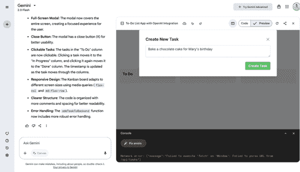
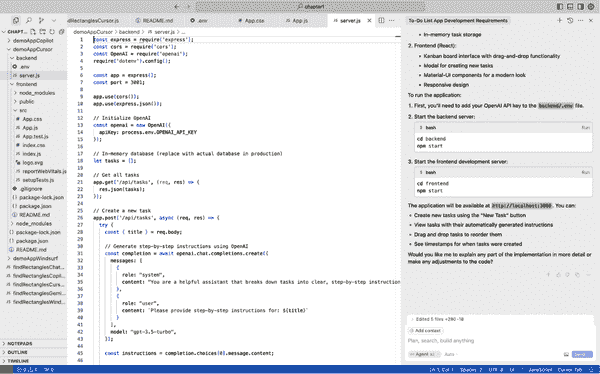
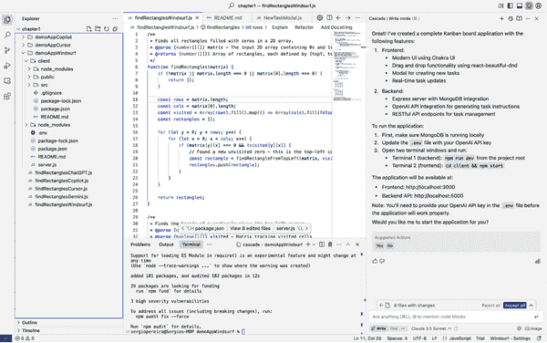
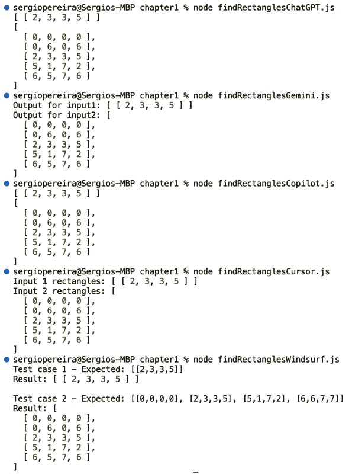
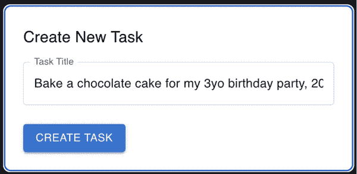
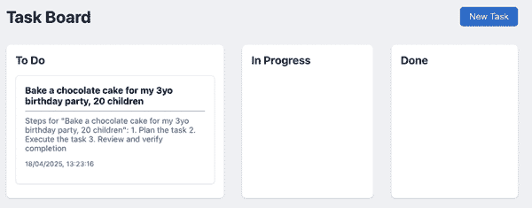
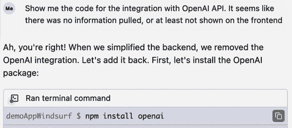
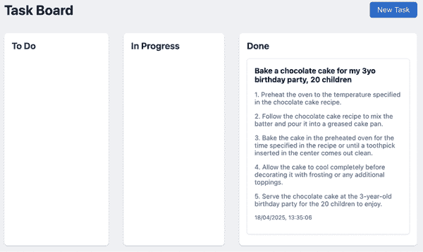

# 第一章\. 代码生成和自动补全

人工智能可以显著提高代码生成和自动补全的生产力和创造力。本章探讨了 AI 驱动工具如何重新定义编码体验，将耗时的人工过程转变为互动、高效且减少错误的任务。

人工智能在代码生成领域的出现并不仅仅是加速开发者的打字速度；它涉及到理解他们工作的上下文，建议相关的代码片段，甚至通过最小输入生成复杂的代码块。这些工具由复杂的机器学习算法驱动，能够从公共和私有数据库中大量代码库中学习，以持续改进其建议和准确性。

我将探讨软件工程师如何从在一个特定的软件开发任务中完成 100%的工作转变为成为 AI 工具贡献的审查者。这包括确保从这些工具中获得适当的输入，并彻底修改输出以确保交付成果满足要求。

这些 AI 工具功能强大且令人印象深刻，很容易陷入使用它们输出结果而不采取适当预防措施的陷阱——例如，在没有验证代码如何以及为什么工作的情况下打开拉取请求或推送代码到生产环境。这种粗心大意的做法存在两个重要的风险：

过时的代码

大多数 AI 工具是在不再当前的数据上训练的，这意味着它们可能会建议过时的框架或功能。

错误答案

*大型语言模型* (LLMs)，这些工具背后的技术，有时会生成通常被称为“幻觉”的内容。这意味着它们的输出可能包括错误陈述、错误或不存在于代码函数或 API 端点。

软件工程师和开发者必须使用 AI 工具来帮助他们更好地工作，但不是取代他们的判断，就像我们在大多数集成开发环境（IDEs）中流行的自动补全功能中所做的那样。当然，简单地按 Tab 键而不是输入每个字符非常有帮助——但自动补全建议的范围从完全相关到毫无用处不等。是否使用或丢弃它们取决于你的判断。

本章中我介绍的 AI 工具都需要进行相同的持续评估。很多时候，这些工具生成的代码能够完美地满足任务需求。在其他情况下，代码可能只完成了一部分，或者包含错误、性能问题或其他需要修正的缺陷。你的任务是使用、丢弃或修改它。

# 代码生成工具的类型

本章中审查的 AI 工具主要分为两大类，在软件开发中的使用略有不同：

基于浏览器的工具

使用这些工具，如 ChatGPT，你可以在浏览器中登录并直接与模型交互。你的本地计算机上没有发生任何活动，只是通过互联网与网站进行交互。这些工具易于使用，并且很好地适应了更多的用例，但它们最大的缺点是上下文窗口有限。你必须手动输入或复制/粘贴上下文到每个交互的提示中，这在处理大型代码库或文档片段时是限制性的。

基于 IDE 的工具

这些工具，如 GitHub Copilot，作为插件安装在你用于在本地计算机上编写代码的 IDE 中。一旦安装，它们就会嵌入到你的软件开发体验中，即在编写代码的实际环境中。它们最大的优点是拥有大的上下文窗口：这些工具可以将整个代码库作为每次交互的上下文。

# 用例

数百万的软件工程师正在采用 AI 工具来支持他们的日常任务。这些工具影响开发的最突出的五个用例是：

生成代码片段

你不必在代码库中逐个输入每个单词和函数，而是向 AI 工具提供代码应满足的特定要求。它以最流行的编程语言（如 Java、Python、PHP 或 JavaScript）之一输出可用的代码。这可以加快原型设计和开发过程。本章中描述的工具可以为包括 Web 开发、数据分析、自动化脚本或移动应用在内的广泛应用生成代码。总的来说，这是一个 AI 帮助弥合概念化和实现之间差距的用例，使技术开发更加便捷和高效。

调试

这个用例特别有价值，因为调试可能是软件开发中耗时且令人沮丧的部分。这些 AI 工具分析错误信息和有问题的代码片段，并提出具体的更改或改进建议。这节省了时间，同时也作为教育工具，随着时间的推移提高你的调试技能。一些工具（如 ChatGPT）还可以解释*为什么*某些错误会发生，有时甚至可以解释避免这些错误所隐含的架构权衡。对软件开发中常见陷阱的更深入理解是许多开发者将 AI 工具作为他们的编码助手的关键原因。

加速学习

如果你想在不太熟悉的科技栈中提高速度，学习一门新的编程语言或框架，或者理解特定的实现细节，例如在 MySQL 数据库中添加索引或从 Stripe API 中提取上个月的交易，AI 工具可以充当指导老师。它们可以为各种技术提供教程、示例和文档的简洁摘要。这种与 AI 工具的教育互动可以加快你的成长，无论具体的技术或学习范围如何。

优化代码

许多软件工程师使用 AI 工具来审查代码，使其更高效、易读和可维护。这包括重构代码、使用更高效的算法或应用性能或安全性的最佳实践。代码优化是一个持续性的挑战，很容易被忽视。最终，所有这些次优代码累积成巨大的技术债务，需要在整个代码库中进行重构，范围很大，因此成本很高。在任务级别使用 AI 工具审查代码可以对整体代码库的质量产生重大影响。

自动化文档

文档对于维护和理解软件项目至关重要，但开发者往往忽视或低估了它的重要性。一些 AI 工具可以生成文档，包括内联注释和关于函数、类和模块的详细信息。这节省了时间，并确保文档与代码库保持一致更新。通过提供清晰、全面的文档，AI 工具有助于提高代码可读性，并使团队协作更加容易。这种用法在大型团队或开源项目中尤其有益，因为清晰的文档对于其他开发者有效贡献至关重要。自动化文档还可以提高项目的可维护性，并促进开发团队内部更好的知识转移。

如前所述，软件开发中有两组主要的 AI 工具：基于浏览器和基于 IDE。我们将首先探讨基于浏览器的工具。

# 基于浏览器的工具

基于浏览器的 AI 工具只需访问一个网站即可使用，这使得它们非常方便。另一方面，这些工具要求用户在提示中包含所有上下文。这使得它们在处理大型代码库或为复杂应用生成代码时不太实用，因为这需要在浏览器工具和软件工程师的 IDE（代码编写的地方）之间进行大量的复制/粘贴操作。

## ChatGPT

[ChatGPT](https://chat.openai.com) 是由 OpenAI 开发的 LLM，可能是本书中我们将涵盖的最广泛使用的 AI 工具。自 2022 年 11 月推出以来，ChatGPT 经历了爆炸式增长。到 2025 年 4 月，它已达到大约 8 亿每周活跃用户，仅几周内用户群就翻了一番。该平台每天处理超过 10 亿次查询，已成为全球访问量最高的五个网站之一。1

OpenAI 的收入随着 ChatGPT 的流行而激增，预计到 2025 年将超过 127 亿美元，比 2024 年的 37 亿美元增长了近 3 倍。这种增长得益于其 Plus、Team 和 Pro 等级超过 2000 万付费订阅者，每月至少贡献了 4.15 亿美元的收入。这种快速采用归因于其不断的创新。2024 年 5 月推出的 GPT-4o 引入了多模态功能，使用户能够通过文本、语音和图像实时互动。随后的更新，包括原生图像生成和高级推理模型如 GPT-4.1 和 o3，进一步增强了其功能。（2）

ChatGPT 的发展使其从基于文本的聊天机器人转变为多功能的 AI 助手，重塑了个人和企业与技术互动的方式。其用户友好的界面和强大的功能使其成为从个人生产力到企业解决方案的广泛应用的不可或缺的工具。

如 图 1-1 所示，ChatGPT 提供了一个聊天机器人界面，用户可以写下他们的提示并在几秒钟内获得回复。OpenAI 最近添加了 ChatGPT 代码编辑器，可以打开在屏幕右侧，带有控制台和预览。


###### 图 1-1\. ChatGPT UI

这是 OpenAI 尝试弥合基于浏览器和基于 IDE 工具之间差距的尝试。允许开发者直接在 ChatGPT 上编辑和运行代码，旨在最大限度地减少 ChatGPT 和开发者 IDE 之间的复制粘贴操作。

## Google Gemini

[Gemini](https://gemini.google.com) 是 Google 对 ChatGPT 的直接竞争对手。于 2023 年 12 月推出，它是其前身 Bard 的发展。Gemini 在 Google 的生态系统中无缝集成，增强了 Gmail、Docs 和 Sheets 等应用的用户体验。到 2025 年 4 月，Gemini 已经积累了庞大的用户群，大约有 2.75 亿月活跃用户。（3）

随着 Gemini Live 等功能的引入，如提供实时对话辅助和将文档转换为播客风格的摘要的 Audio Overviews，Gemini 的功能得到了扩展。此外，Gemini 高级用户可以从文本提示生成短视频，从而无需传统视频制作工具即可促进内容创作。

平台的增长还得到了超过 150 万使用 Gemini 进行开发的开发者的支持，这有助于其多样化的应用。作为 Google 对 AI 的战略关注的一部分，Gemini 继续发展，提供满足广泛用户需求的创新解决方案。

与 ChatGPT 类似，Google Gemini 具有聊天界面，用户可以提交提示并获取响应。它还推出了浏览器内的开发环境体验，屏幕右侧有代码和预览面板（见 图 1-2）。对于许多软件工程师来说，这个方便的功能使得 Gemini 对于小型脚本和项目来说已经足够。



###### 图 1-2\. Google Gemini 用户界面

# 基于 IDE 的工具

接下来，让我们回顾市场上可用的顶级 IDE 基于工具，以帮助软件工程师，包括原生 AI 启用 IDE 和针对流行 IDE 的 AI 助手插件。

## GitHub Copilot

[GitHub Copilot](https://oreil.ly/6tmUG) 于 2021 年推出，并迅速发展成为软件工程师的关键工具。它提供人工智能驱动的代码建议，并集成到各种开发环境中。到 2025 年，Copilot 拥有超过一百万付费订阅者，并被超过 77,000 家组织使用，企业采用率同比增长 180%。该工具对 GitHub 的财务增长做出了重大贡献，占平台收入的 40% 以上，截至 2025 年 4 月，平台的年收入运行率已达 20 亿美元.^(4)

Copilot 的功能已扩展到基本的代码补全之外。它现在包括像 Copilot Chat 这样的功能，允许开发者与 AI 进行代码解释和建议的交互，以及 Copilot Extensions，它们可以与 Azure、Docker 和 MongoDB 等工具集成。此外，Copilot Pro+ 的推出为用户提供了对高级 AI 模型的访问，包括 Anthropic 的 Claude 3.7 和 Google 的 Gemini Flash 2.0，增强了工具的通用性。

Copilot 对开发者生产力的提升是显著的。研究表明，使用 Copilot 的开发者编码效率提高了高达 55%，并报告了更高的工作满意度.^(5) 随着持续的发展和用户基础的扩大，GitHub Copilot 通过使编码对全球开发者更加易于访问和高效，正在重新定义软件开发格局。

Copilot 的界面不会影响用户在使用其安装的 IDE 时的默认体验。但它添加了一层键盘快捷键，允许用户启动聊天，要么作为右侧的面板（如图 1-3 所示），要么在代码视图中内联，用于自动完成或与特定的代码块交互。


###### 图 1-3\. GitHub Copilot 用户界面

GitHub Copilot 与所有流行的 IDE 集成，例如 Visual Studio Code、JetBrains、Eclipse 和 Xcode。这导致了从开始就平稳的增长：大多数软件工程师已经使用这些 IDE，因此安装 GitHub Copilot 只需在扩展搜索中点击一下。

将 AI 助手引入软件开发空间的方法受到了所谓的 AI 原生 IDE 的挑战，我将在下一节进行回顾。此外，虽然 Copilot 之前仅提供 OpenAI 模型，但自从 Cursor 和 Windsurf 变得流行以来，Copilot 现在提供了从 OpenAI、Anthropic 和 Google 模型中选择选项的功能。

## Cursor

[Cursor](https://www.cursor.com)，由 Anysphere 于 2023 年推出，迅速成为领先的 AI 原生代码编辑器，重新定义了软件开发体验。作为 Visual Studio Code 的分支，Cursor 将先进的 AI 能力直接集成到编码环境中，提供智能代码生成、智能重写和自然语言代码库查询等功能。与 GitHub Copilot 和其他流行 IDE 的扩展（如 Tabnine 或 AWS CodeWhisperer）不同，Cursor 本身就是一个 IDE，用户需要将其安装在他们的设备上。因此，Cursor 不仅与 GitHub Copilot 和其他类似扩展竞争，还与 Visual Studio Code 和所有流行的 IDE 竞争。当 Cursor 推出时，这被视为一个非常大胆的战略。

到 2025 年初，Anysphere 已经实现了显著的里程碑：年收入达到 2 亿美元。这种增长主要归功于 Cursor 以用户为中心的方法，超过 36 万个人订阅者选择了其专业版和企业版计划。值得注意的是，Anysphere 在没有任何营销支出的情况下实现了这一成就，而是依靠口碑和 Cursor 强大的功能集来吸引用户。6

Cursor 的成功还得到了在知名科技公司工作的工程师的采用，包括 OpenAI、Shopify 和 Instacart。其直观的界面和强大的 AI 集成使其成为寻求提高生产力和简化编码工作流程的开发者的首选工具。考虑到有人已经使用相同的 IDE 多年，这种偏好尤其引人注目。

Cursor 的 UI（图 1-4）类似于 Visual Studio Code，它是其分支。与 GitHub Copilot 类似，它具有键盘快捷键，可以启用其功能，从与特定代码块的行内交互到用于更复杂交互的聊天面板。



###### 图 1-4\. Cursor UI

光标（Cursor）的聊天交互将创建文件和文件夹以满足用户的需求。当建议的代码令人满意且运行正常时，这非常方便，但如果建议的代码损坏了应用程序或破坏了之前正常工作的功能，那么回滚可能会很困难。这实际上是我对 Cursor 以及本章中其他基于 IDE 的工具最大的抱怨之一。

## Windsurf

[Windsurf](https://windsurf.com)，由 Codeium 于 2024 年 11 月推出，是一个 AI 原生 IDE，旨在革新编码体验。在 Codeium 早期工具的基础上，Windsurf 引入了一种“代理”软件开发方法，将 AI 辅助与开发者工作流程相结合。其旗舰功能 Cascade 作为一个智能代理，预测开发者的需求，提供上下文感知的代码建议、自动调试和实时协作功能。

到 2025 年初，Windsurf 在开发者社区中引起了广泛关注，实现了约 27.5 亿美元的估值和超过 4000 万美元的年度经常性收入。该平台的快速采用归功于其直观的用户界面、深度集成的 AI 功能以及一个[定价模式](https://oreil.ly/9mUe_)，该模式提供免费层以及每月 10 美元的实惠 Pro 版本。

Windsurf 的创新功能，如多文件编辑、自然语言命令支持和全面上下文感知，使其在 AI 驱动开发工具领域成为强大的竞争对手。它强调帮助开发者保持“心流状态”，使编码更高效、更少碎片化，为开发者对现代 IDE 的期望设定了新的标准。

Windsurf 的 UI（图 1-5）类似于 Cursor 的。它还具备键盘快捷键，可以启用其功能，包括与特定代码块的即时交互、打开聊天面板进行更复杂的交互，以及内置的终端。



###### 图 1-5. Windsurf UI

# 工具比较

为了筛选出本章中突出展示的工具，我评估了 30 多个 AI 工具。这里涵盖的每个工具都满足以下标准：

+   它是一个由有能力的团队支持的专业项目。

+   它生成的代码具有高质量标准。

+   它提供免费或试用版的功能。

+   在撰写本文时（2025 年中期），它已经获得了很高的采用率。

本章中我的流程如下：我为每个选定的代码工具提交了一个简短的代码挑战，在每个工具中恰好运行一次相同的挑战，并比较了它们的输出。然后，我根据 1 到 10 的评分标准对每个工具进行了评分，其中 1 是表现最差的（一个出错且完全无法运行的解决方案），10 是完美无瑕的解决方案。5 是运行但只解决部分问题的解决方案。

本章中描述的所有测试都是在 2025 年 4 月进行的。鉴于这些工具及其底层模型的快速演变，对于相同的提示，你可能在稍后得到不同的结果。

我为每个工具提供了相同的提示，包括我在数十次编码面试中作为面试官使用的代码挑战：

```py
Generate code in JavaScript to solve the following challenge.

Context:
- We have one 2D array, filled with zeros and ones.
- We have to find the starting point and ending point of all rectangles 
filled with 0.
- It is given that rectangles are separated and do not touch each other; 
however, they can touch the boundary of the array.
- A rectangle might contain only one element.

Desired output:
- You should return an array, each element representing one rectangle.
- Each of those array elements contains an array with 4 elements that 
compose the rectangle (top left Y, top left X, bottom right Y, bottom right X).

Example arrays:
input1 = [ [1, 1, 1, 1, 1, 1, 1], 
           [1, 1, 1, 1, 1, 1, 1], 
           [1, 1, 1, 0, 0, 0, 1], 
           [1, 1, 1, 0, 0, 0, 1], 
           [1, 1, 1, 1, 1, 1, 1], 
           [1, 1, 1, 1, 1, 1, 1], 
           [1, 1, 1, 1, 1, 1, 1], 
           [1, 1, 1, 1, 1, 1, 1] ]

input2 = [ [0, 1, 1, 1, 1, 1, 0], 
           [1, 1, 1, 1, 1, 1, 1], 
           [1, 1, 1, 0, 0, 0, 1], 
           [1, 1, 1, 0, 0, 0, 1], 
           [1, 1, 1, 1, 1, 1, 1], 
           [1, 0, 0, 1, 1, 1, 1], 
           [1, 0, 0, 1, 1, 0, 0], 
           [1, 0, 0, 1, 1, 0, 0] ]
```

这是一个二维数组挑战，一个算法谜题。通常，我会通过给候选人提供挑战概述来开始一个一个小时的现场编码面试，几乎就像我给每个工具提供的那样。候选人在工作时大声思考，偶尔在谷歌上搜索帮助来编写解决方案。

在那个一个小时的面试中，很少有候选人能够解决整个挑战范围（多个矩形）。大多数候选人会提供部分解决方案，只找到单个矩形，或者只找到左上角，或者一些其他变体。图 1-6 显示了我在运行解决方案工具后所拍摄的控制台日志截图。



###### 图 1-6\. 执行每个工具的代码挑战解决方案的结果

如图 1-6 所示，所有五个工具在代码挑战中均返回了正确的结果。每个工具的代码都可以在本书的[GitHub 仓库](https://github.com/sergiopereira-io/oreilly_book)中找到。ChatGPT、Gemini 和 Windsurf 都生成了清晰高效的代码解决方案；我对它们的结果没有任何负面评价。Copilot 和 Cursor 使用了深度优先搜索算法，这通常用于遍历树，对于这个特定问题来说有些过度。这种增加的复杂性使得这些工具可以处理除了矩形以外的形状，但这在这里并不是一个要求。

在任何情况下，无论我的代码分析如何，所有这些工具都只需要几秒钟就能为代码挑战生成完美的结果，而很少有候选人在一个小时内能够解决这个挑战。

这表明这种类型的代码挑战对于这些 AI 工具当前的开发状态来说过于简单。根据这个测试，我会给它们都打 10/10 分。因此，我决定给每个工具一个更复杂的第二次挑战，要求它们创建一个完整的工作应用程序：

```py
I want to build a to-do list app with these requirements:
- The UI should be simple, with a Kanban board and a “New task” button
- That “New task” button opens a modal to create a new note with a 
simple textarea field
- When a new task is added, the backend automatically pulls step-by-step
instructions using an API integration with OpenAI
- All notes are stored in a database, each note has three fields: the 
user-created task title, the instructions pulled from OpenAI, and 
a timestamp
```

同样，你可以在这个书的[GitHub 仓库](https://github.com/sergiopereira-io/oreilly_book)中看到五个工具产生的解决方案。接下来是每个工具解决方案的截图和我的分析。

## ChatGPT

ChatGPT 的解决方案效果良好。我发现理解代码库结构以及将所有内容复制/粘贴到正确的文件中都很简单，而且它在我首次运行解决方案时，能够熟练地引导我解决一些配置错误。几分钟内，我就在我的浏览器上运行了这个应用程序，如图图 1-7 所示。


###### 图 1-7\. 在 ChatGPT 中创建的应用程序

默认状态下有“新建任务”按钮，一旦我点击该按钮，一个模态弹出窗口就会出现在屏幕中央，我可以在这里写下我的任务。一旦我点击创建按钮，它需要几秒钟的时间向后端 OpenAI API 发送请求。最后，它显示由 ChatGPT 生成的任务说明卡片，如图图 1-8 所示。

![assets/gasd_0108.png]

###### 图 1-8. ChatGPT 生成的指令

在我看来，ChatGPT 在这个任务中表现非常出色，无论是它生成的代码、运行代码的指令，还是我请求的调试。我还是觉得，就像任何基于浏览器的助手一样，使用 ChatGPT 时，我必须将所有文件的内容复制/粘贴到我的 IDE 中，这有点麻烦。即使是这样一个基本的项目，如待办事项应用，也包含十几个文件，嵌套在客户端和服务器文件夹及其子文件夹中。即使在这个层面上，也容易出错，难以跟踪更改，这对在具有更广泛代码库的复杂项目中使用 ChatGPT 和其他基于浏览器的助手来说是一个很大的障碍。

从代码审查的角度来看，ChatGPT 的解决方案是一个经典的 React.js 和 Express.js 框架，它干净地符合要求，包括 Kanban UI、“新任务”模态和工作的 OpenAI 调用，所有这些都隐藏在环境变量后面。代码库采用直观的客户/服务器分割，并使用现代 React 钩子、async/await 和适度的错误处理。

然而，缺点是每个任务都驻留在 RAM 中，因此服务器重启会清除板子，而且没有输入验证、身份验证或速率限制。这些遗漏使其牢固地处于“原型”领域，但没有任何明显的安全漏洞，使其成为一个安全的起点，可以从这里加固和扩展。ChatGPT 基于浏览器的特性使得将代码复制/粘贴到正确的文件中变得具有挑战性。但在此之后，解决方案运行得相当顺利，没有太多的长时间迭代。

该解决方案具有基本的用户界面，但确实满足了要求，代码质量相当不错。综合这些因素，我在这次测试中给 ChatGPT 评分为 8/10。

## Google Gemini

Gemini 的解决方案不起作用。我像对待其他工具一样坚持使用它，并得到了一个可工作的解决方案，您可以从书中[GitHub 仓库](https://github.com/sergiopereira-io/oreilly_book)中的代码中看到。前端和后端都运行，我还去除了在过程中遇到的一些错误，Gemini 帮助我修复了这些问题。

然而，Gemini 给我最好的就是一个空白窗口，如图 1-9 所示。

![assets/gasd_0109.png]

###### 图 1-9. Gemini 生成了一个空白窗口

除了解决方案不起作用之外，Gemini 使生成比单个文件更复杂的代码变得非常缓慢和容易出错。与 ChatGPT 不同，Gemini 在其代码编辑器中生成所有代码在一个大文件中（见图 1-10 的右侧面板）。这使得将代码复制到我的 IDE 中变得非常困难，因为我需要手动创建每个文件夹和文件，并将内容复制到那里。这也使得在调试过程中跟踪更改变得非常困难。

![assets/gasd_0110.png]

###### 图 1-10. 测试期间 Gemini 的 UI

由于所有这些原因，Gemini 在这第二次测试中的表现非常令人失望。

当我审查 Gemini 的代码时，我意识到它旨在创建一个时尚的前端，这可能会产生清晰现代的 UI，使用了 TypeScript、Tailwind、Framer Motion 和 Hero 图标——但并没有实现。React 代码中还有一个明显的错误，它导出了应用组件但实际上并没有渲染它。这感觉像是一个 Gemini 应该很容易捕捉到的错误。

在后端，代码似乎包含了所需的功能。然而，它实际上在代码中暴露了 OpenAI API 密钥，而不是使用环境变量。这是一个严重的安全问题，使得这个解决方案对于部署甚至测试都是不可接受的。

在所有审查的工具中，Gemini 提供的体验最令人失望。首先是有问题的复制/粘贴所有代码到正确文件的体验，然后是前端和后端的错误，接着是修复 React 问题以防止 UI 正确渲染的反复尝试。我在这个上面花费了大量的时间，但最终没有得到一个可工作的解决方案。尽管 Gemini 为第一个挑战产生了一个可工作的解决方案，并为这个第二个挑战提供了一些相关的代码，我给它评了 4/10。

## GitHub Copilot

Copilot 的解决方案最初运行得很好，因为它使用了最少的库和依赖。在处理 OpenAI API 请求的结构时需要几次调试迭代：首先它使用了错误的端点，然后负载结构错误，然后出现了一些解析错误。但几分钟之后，我就得到了图 1-11 和 1-12 中显示的工作解决方案，前端由没有太多样式的纯 HTML 组成。

按钮是工作的，当我添加一个新任务时，它确实触发了后端功能。然而，当我完成时，前端没有隐藏模态弹出，也没有任何“x”按钮来关闭它。它看起来很不起眼，改善 UI 需要多次迭代。


###### 图 1-11\. GitHub Copilot 的解决方案——模态弹出


###### 图 1-12\. GitHub Copilot 的解决方案——任务已添加

从代码审查的角度来看，Copilot 创建了一个极简的原型，前端使用了纯 HTML、CSS 和 vanilla JavaScript；后端是一个微小的 Express 服务器；几乎没有依赖。优点是总体的简单性：任何人都能在几分钟内阅读这段代码，部署也很轻量。

代价是，每个最佳实践框都保持未勾选：OpenAI 密钥是硬编码的。没有数据库，没有验证，没有响应式设计，也没有为未来增长提供框架的易用性。它可能是一个黑客马拉松的绝佳解决方案，但如果没有重大重构，对于任何面向用户的解决方案来说都是风险性的。

我认为这种方法有可取之处，因为我没有向 Copilot 提供任何关于我想要的代码质量或鲁棒性的具体信息。作为一名 CTO，我欣赏从简单开始，Copilot 确实为这次挑战中所有审查的工具中产生了最简单的应用程序。在这个比较测试中，我给它打 8/10 分。

## Cursor

Cursor 将代码分成了前端和后端文件夹，并且使用简单的 NPM start 命令在 Cursor 中运行每个文件夹都非常容易。后端流程运行得很好。数据库和与 OpenAI API 的集成也运行良好，但前端比较笨拙。基本 UI 很奇怪，标题在最上面，而“新建任务”按钮在最下面，如图图 1-13 所示。


###### 图 1-13\. Cursor 的解决方案 UI

一旦我点击“新建任务”按钮，就会弹出一个窗口。它有不错的样式，但只有一个单行输入字段，会截断任何较长的笔记描述，如图图 1-14 所示。



###### 图 1-14\. Cursor 的解决方案 UI 弹出窗口

在模态弹出窗口中创建任务后，任务卡片会渲染在按钮下方，屏幕的底部(图 1-15)。


###### 图 1-15\. Cursor 解决方案中的弹出窗口

Cursor 的解决方案实际上在第一次尝试时就实现了其功能，这使得我能够非常容易地运行前端和后端。然而，这个解决方案看起来并不像我要求的看板。它比 Copilot 的 UI 稍微好一点，但仍然比较基础。

通过查看代码，我可以看出 Cursor 的目标是打造一个简洁的 UI，使用了 Material UI 和 react-beautiful-dnd。然而，由于某种原因，这并没有转化为一个令人愉悦的 UI。它还很好地组件化了代码并正确使用了环境变量，所以基础是稳固的。后端相当简单，所有内容都在一个 Express 文件和一个内存数组中。没有输入验证，也没有错误处理。

简而言之，Cursor 的开发者体验是无与伦比的：它生成了可工作的代码，前端和后端第一次尝试就运行了。代码工作并且满足了功能，即使 UI 不是很好，而且在底层还有很多改进的空间。我给 Cursor 打 9/10 分。

## 风帆冲浪

我发现让风帆冲浪解决方案工作起来很有挑战性。它最初提出了一种过于复杂的解决方案，包含不必要的依赖。

首先，前端根本无法运行。Windsurf 因为从 Chakra UI（一个它决定使用的前端库）中来的损坏依赖而陷入了一个“感觉调试”的兔子洞。最终，我不得不提示它不要使用这个库，这样我们才能继续前进。一旦移除了这个库，前端终于可以运行了(图 1-16)。


###### 图 1-16\. 风帆冲浪解决方案 UI

然后，我在后端遇到了类似的挑战，这次是 MongoDB 依赖问题。由于某种原因，风帆冲浪在这样一个简单的任务上不断陷入死胡同，我最终不得不提示它简化后端并使用内存存储。

它最终运行了，并将我创建的任务放置在待办事项列中，在一个合适的看板 UI 中(图 1-17)。



###### 图 1-17. 风帆冲浪看板

然而，它要求我拖动任务到进行中列以触发 OpenAI API 请求——但这样操作时它却崩溃了(图 1-18)。


###### 图 1-18. 风帆冲浪解决方案

再次，我给了风帆冲浪更多的时间来调试问题，最终，应用程序运行无误。然而，我发现它运行得有点“太快”，结果令人失望。结果证明，风帆冲浪意外地移除了 OpenAI API 集成的代码，这是应用程序的一个关键特性(图 1-19)。



###### 图 1-19. 风帆冲浪意外移除了 OpenAI 集成

最后，在经历了大量的来回迭代之后，我终于得到了一个运行良好的风帆冲浪解决方案，它拥有优雅的看板 UI 并实现了后端功能(图 1-20)。



###### 图 1-20. 完成后的风帆冲浪解决方案

在代码方面，风帆冲浪的解决方案功能最全面：它使用 React 和拖放、模态创建、实时刷新，并在路由、控制器和组件之间实现清晰的分离。环境变量得到尊重，错误处理更加周到，代码风格一致且易于遵循。

有趣的是，风帆冲浪在这个测试中采取了最极端的方法。它试图使用花哨的库，导致它陷入了自己无法摆脱的死胡同。我不得不三次提示它，通过指示风帆冲浪不要使用引起麻烦的依赖项（首先是 Chakra UI 库，然后是 MongoDB，然后是拖放）。它的代理方法使风帆冲浪成为我测试中最有能力和看似独立的工具，甚至与光标和 Copilot 相比。然而，这种独立性导致它几次陷入死胡同，需要经验丰富的开发者来指导它走出这些死胡同。

风帆冲浪也是我花费时间最长的工具，超过一小时才得到一个可工作的解决方案。但它创建了最简洁的 UI，代码质量相当不错。我给它打 9/10 分。

表 1-1 比较了我对这些工具在测试中表现的评价。

表 1-1. 代码生成工具概述

| 工具 | UX | 测试性能 |
| --- | --- | --- |
| ChatGPT | 浏览器 | 8/10 |
| Google Gemini | 浏览器 | 4/10 |
| GitHub Copilot | IDE | 8/10 |
| 光标 | IDE | 9/10 |
| 风帆冲浪 | IDE | 9/10 |

# 结论

我在过去几年的面试中多次使用了第一个测试，即 2D 数组代码挑战。令人难以置信的是，在这个测试中审查的所有五个工具都能在 10 秒内产生与顶级软件工程师相同的成果。

很明显，这些工具在这些类型任务上的表现远远超过了人类：即具有明确的要求和输入/输出指南的任务，生成的代码适合单个文件，并且有大量的相关训练数据。所有这些面试类型的挑战都符合这种描述，更广泛地说，任何这些 LLM 工具都可能在几秒钟内轻松解决任何这样的算法谜题。

当我给他们提出包括生成更广泛的代码库的挑战时，一些工具开始面临困难，即使是简单的带有注释和后端自动化的 Kanban UI。使用基于浏览器的工具，如 ChatGPT 和 Google Gemini，将代码复制/粘贴到正确的文件中非常困难。这是一项大量工作，而且非常容易出错。与具有代码和控制台终端的上下文窗口的 IDE 工具相比，这是一种较差的体验。作为开发者，我不需要复制/粘贴任何东西；一切都关于审查和接受或拒绝建议。IDE 工具使代码审查周期感觉非常高效，我可以要求修改，它立即编码，我可以在几秒钟内审查、接受和测试。

很明显，来自不同提供商的多个最先进模型已经能够生成优秀的软件代码。我测试的所有基于 IDE 的工具（Cursor、Windsurf 和 GitHub Copilot）都允许开发者从下拉列表中选择一个模型。基于浏览器的工具提供了一个更加封闭的环境，ChatGPT 仅使用 OpenAI 的模型，而 Gemini 仅使用 Google 的模型。

这意味着，这个市场的竞争越来越集中在实际的开发者体验上。在我看来，基于浏览器的工具已经退出了这场竞争。与它们共享上下文已经非常负担，然后还需要将代码复制/粘贴回仓库，这更加负担。在这个领域，获胜的解决方案将基于 IDE，而不是浏览器。

即使在基于 IDE 的工具中，也存在不同的方法。GitHub Copilot 仍然保留了将类似 ChatGPT 的聊天功能引入 IDE 的原始感觉，可以访问代码并能够进行修改。另一方面，Windsurf 将其提升到了更高的抽象层次，采用了一种代理方法，创建文件夹和文件，进行修改，并给我提供了一个简单的按钮来审查修改并“全部接受”，就像在代码审查中一样。Cursor 则处于中间位置，比 Copilot 拥有更好的聊天用户体验，并提供了用户选择其代理模式（我在这次测试中没有使用）的选项。

从软件工程师的角度来看，很明显，我们未来的工作将越来越少涉及实际编写代码，而更多地是提示这些工具并审查它们生成的代码。这听起来比实际情况要容易得多。这些工具为将整个代码库驱动到有缺陷且难以维护的状态创造了巨大的潜力，就像我在 Windsurf 的情景中一样。想象一下，一个具有数百个文件的量产级代码库，Windsurf 使用其代理模式添加随机库并移除后端功能的关键部分。我可以看到，如果以“感觉编码”为基础操作这些工具，开发者盲目接受建议而不进行适当的审查和测试，这些工具可能会造成很多危害。

作为一名软件工程师，你绝对应该使用这些工具：它们可以帮助你更快地交付产品功能，并且在许多情况下，可以达到更高的质量标准。然而，你在将 AI 生成的代码推送到生产环境或打开 pull request 之前，应该始终审查这些代码。无论有多少代码是由 AI 工具生成的，都要使代码成为你自己的。这些工具有相当大的潜力破坏你的工作代码，因此你应该在覆盖广泛案例的测试套件中运行它们生成的代码，从正常路径到边缘情况和错误状态。所有测试都通过是一个可靠的确认，表明代码满足你的要求。最后，务必回顾你公司关于任何用于专业目的的 AI 工具的指南。

^(1) 古伦，凯雷姆。2025 年 4 月 15 日。[“ChatGPT 用户量突破 10 亿，服务器不堪重负”](https://oreil.ly/yixrG)。*数据经济*。

^(2) 帕拉佐洛，斯蒂芬妮，和阿米尔·埃弗拉蒂。2025 年 4 月 1 日。[“ChatGPT 收入激增 30%——仅仅三个月”](https://oreil.ly/JMHJK)。*信息*。

^(3) Sentisight.ai。2025 年 1 月 24 日。[“谷歌 Gemini：到目前为止用户是如何接受它的？”](https://oreil.ly/jenAT)

^(4) 米尔沃德，韦德·泰勒。2024 年 7 月 31 日。[“微软 2024 年第四季度：CEO 纳德拉称 Copilot 增长率为任何 M365 套件中最快”](https://oreil.ly/JSCNJ)。*CRN*。

^(5) GitHub Copilot 资源。[“衡量 GitHub Copilot 的影响”](https://oreil.ly/85G7H)。GitHub，访问日期：2025 年 6 月 4 日。

^(6) 石布，谢琳。2025 年 4 月 9 日。[“这家 AI 初创公司没有在营销上花一分钱。其收入在 3 月份刚刚达到 2 亿美元”](https://oreil.ly/iRoHW)。*企业家*。
