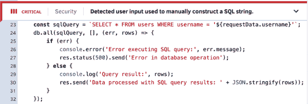
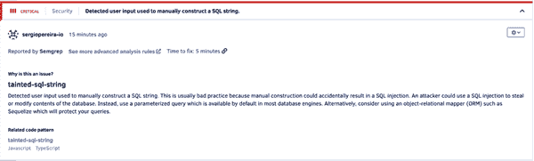
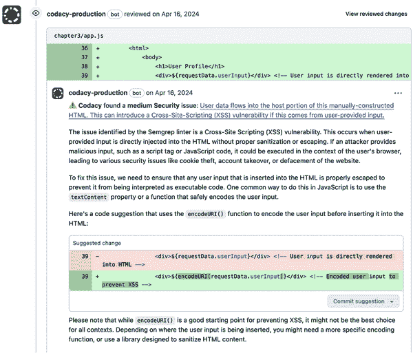
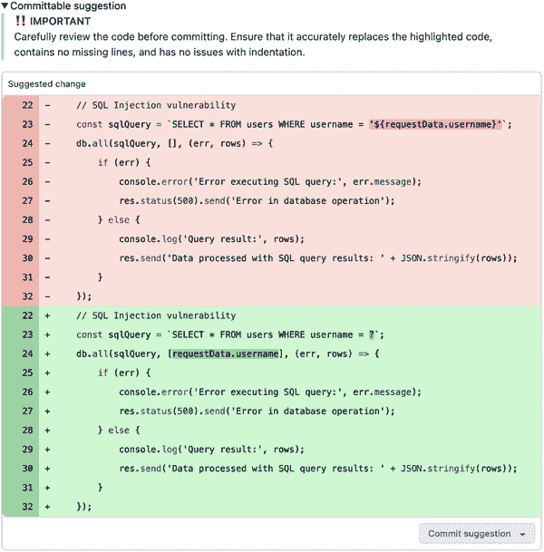
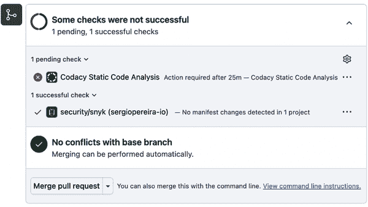

# 第三章\. 错误检测和代码审查

想象一下，为了开发一个将负责公司收入的产品，支付公司最高薪酬给软件工程师，结果却因为生产中的昂贵错误而损失了这笔收入。这是任何企业主最可怕的噩梦，而且遗憾的是，这种情况每天都在发生。软件已经自动化了整个行业，取代了耗时的手动流程，并创造了以前不可能完成的事情的新方法。然而，当错误影响了底层产品的关键功能时，自动化就变得无效。

为了缓解这种基本担忧，多年来已经创建了几个职位来确保适当的质量保证（QA），例如 QA 工程师、QA 分析师和测试工程师。同时，也开发了在部署到生产之前检测错误的过程。这些过程归结为两大类：

代码审查

这个过程是在开发期间进行的，它包括在代码被认为可以上线之前，团队成员相互审查代码。一些团队要求必须有一定数量的团队成员审查和批准拉取请求（PR），然后才能合并。

质量保证

这个过程是在开发之后进行的，是代码推向生产前的最后一个“守门人”。它包括在接近生产环境的测试环境中进行的手动或自动化测试。这些测试旨在模拟用户行为，以捕捉任何可能逃过代码审查的错误。

当任一过程发现任何错误、性能问题、安全漏洞或其他故障时，代码可以被*回滚；*也就是说，它将返回给开发它的软件工程师，并附有包含必须纠正的具体缺陷的注释。

这些过程对于任何软件开发团队来说都至关重要，但它们通常非常耗时且非确定性，在防止生产中出现错误方面并未完全实现预期效果，反而引入了瓶颈。因此，随着人工智能工具的出现，该行业对自动化代码审查和使检测错误的过程更快、更确定性的关注大大增加。成千上万的软件工程团队已经使用基于人工智能的自动化代码审查工具。

# 人工智能代码审查工具的类型

本章审查的人工智能工具主要分为三个主要类别，在软件开发中的使用略有不同。一些审查的工具提供不止一种功能。

基于 IDE 的工具

基于 IDE 的工具直接集成到工程师编写代码时使用的软件开发环境中，例如 Visual Studio Code、IntelliJ IDEA 或 Eclipse。这些工具在开发者编写代码时提供实时反馈：突出显示错误、建议改进，并在 IDE 中直接提供文档链接。在这三种描述的工具中，这是唯一一种在代码本地保存时提供反馈的工具。这种即时的反馈循环有助于开发者立即识别和修复问题，提高代码质量并减少后期进行广泛审查的需求。

基于 Git 的工具

基于 Git 的工具与版本控制系统（如 GitHub、GitLab 或 Bitbucket）集成，并在 Git 工作流程中运行。与基于 IDE 的工具不同，基于 Git 的工具不能由文件的本地保存触发，只能由 Git 工作流程中的操作触发。您可以设置它们在您将更改推送到存储库或创建或合并 PR 时自动审查代码。这些工具将代码与预定义的规则和指南进行比较，并可以在代码库的所有分支上强制执行编码标准。它们通常以 PR 中的注释或持续集成管道中的报告的形式提供反馈，有助于在将更改合并到主分支之前确保代码质量。

基于浏览器的工具

这些工具可以通过网络浏览器访问，通常与在线版本控制平台如 GitHub、GitLab 和 Bitbucket 集成。与基于 Git 的工具类似，它们只能由 Git 工作流程中的更改触发，而不是本地更改。您可以使用这些基于浏览器的工具在线自动审查您的 PR 或代码合并。当您提交 PR 时，该工具会审查代码中的错误、样式违规和安全漏洞，然后通过浏览器中的 Web 界面提供对该 PR 的反馈。我发现这是这里介绍的这三种工具中最不方便的，因为它要求您使用除您已经熟悉的 IDE 和版本控制工具之外的另一个平台。

还很重要的一点是要区分 linters、静态分析工具和 AI 驱动的代码分析工具：

Linters

这些是最简单的工具，主要专注于强制执行编码标准和样式。它们扫描代码以识别语法错误、样式不一致和基本的编程错误。像[ESLint for JavaScript](https://eslint.org)和[Pylint for Python](https://oreil.ly/-wu0d)这样的 linters 被集成到开发环境中，提供实时反馈以纠正诸如缩进、括号放置和行长度等问题。

静态分析工具

这些工具深入分析代码，而不执行它，以检测潜在的错误、安全漏洞和性能问题。静态分析工具，如[SonarQube](https://oreil.ly/wrZII)，理解控制流、数据流和变量作用域，能够识别复杂的错误，如内存泄漏和并发问题。它们通常集成到 CI/CD 管道中，帮助维护项目间的代码健康。

AI 驱动的代码分析

这些工具使用机器学习分析多个项目中的编码模式，识别复杂问题并提出改进建议。AI 分析工具，如 DeepCode 和 Codacy，提供上下文感知的建议，并可以预测代码更改的影响，提供从大量数据集中学习到的优化技巧。

由于本书的范围，我将只介绍最后一种工具，即 AI 驱动的代码分析。

# 用例

已经使用 AI 工具进行自动化代码审查和错误检测的数百万软件工程师发现，它们在一系列日常用例中带来了明显的益处。这包括：

培训软件工程师

自动化代码审查工具为软件工程师，尤其是更年轻的工程师，提供了一个全天候的配对程序员，它能指出错误、提供建议，最重要的是为其建议提供上下文和推理。这是一个磨练技能的绝佳工具。与团队成员的正常代码审查相比，自动化工具的反馈循环更加频繁，增加了关于所讨论的语言、框架或算法的学习机会。这对初级开发人员和转向新技术栈或首次使用框架的工程师特别有益，因为缺乏经验使得错误更加常见。在代码审查中，错误可以通过帮助开发者理解错误并避免下次再犯的消息进行回归。

提高软件开发速度

自动化代码审查减少了 PR 回归的数量。它还极大地减少了代码编写和审查识别需要修复的问题之间的时间。每次更改时的自动代码审查都可以指出漏洞和改进，以便开发者可以立即修复它们。这消除了仅推送有缺陷的代码，而其他团队成员发现并回归它的循环——这是一个多回归循环的周期，浪费了个人开发者的时间，并延迟了将功能部署到生产中。

减少技术债务

很多次，代码审查忽略了安全漏洞和性能问题，因为它们通常不会影响功能，而功能是任何代码审查客观上最大的关注点。即使它们被检测到，也通常不会被视为回归的原因。相反，它们通常会被归入“最好有”的备注中，实际上是将漏洞或问题添加到技术债务的堆中。这个堆通常积累很长时间，直到它变得不可持续，需要大量重构代码库。

为代码审查增加深度

本章提到的大多数代码审查工具都专注于安全漏洞，并且经常指出代码中 OWASP Top 10 漏洞的发生，并提供了解决建议。团队代码审查很少达到这种深度；这种漏洞通常只有在专业安全审计或渗透测试报告中（如果有的话）才被检测到。使用这些工具可以让团队更早地发现安全漏洞。

# 保持人工审查

自动化代码审查工具的一个常见批评是它们会阻碍（人工）团队成员及时进行代码审查。公平地说，在 AI 工具出现之前，代码审查在很多团队中就已经是一个令人讨厌的活动。软件工程师经常忘记审查他们的同事的拉取请求，或者只留下一个积极的审查信息“lgtm”（即“看起来不错”）来解除功能部署的阻塞。

AI 工具为代码审查过程增添了极大的即时性。这使软件工程师确信他们的代码达到了高标准，但它也让他们感到不那么迫切地审查同事的代码，认为 AI 工具已经为他们完成了这项工作。

我认为这是一个非常公正的批评。*AI 代码审查不能取代人工代码审查*，尤其是那些由既了解技术又了解业务和用例的高级工程师进行的审查。这是 AI 代码审查明显缺乏的角度。AI 工具错过了正在审查的代码背后的*上下文*和某些代码段背后的意图。这可能导致它提出不相关的建议或未能识别出对人类审查员来说可能显而易见的具体上下文问题。这是你应该*永远不要跳过人工代码审查*的关键原因，即使你也在使用自动代码审查。

值得注意的是，用于宣传这些自动代码审查工具的语言与上一章中审查的代码生成工具所使用的语言相当不同。本章讨论的工具中很少有在营销文案中提及 AI（或根本不提），尽管这些产品确实使用了 AI 算法（例如，Codacy）。

有两个原因。这些工具中的许多在 AI 近期流行之前已经在市场上存在多年。然而，许多将自己定位为 AI 生成代码中问题的后备方案。[Sonar](https://oreil.ly/ODAHw) 例如，承诺最小化风险，确保代码质量，并从 AI 和人类创建的代码中获得更多价值。正如网站文案所述：“为了最大化编码中生成 AI 的优势，开发团队需要强大的 DevOps 流程、报告和指标，这些流程、报告和指标专注于代码质量、安全性和可靠性。”

# 评估过程

为了缩小范围，我评估了超过 20 个自动代码审查工具，以便突出本章中提到的工具。这里涵盖的每个工具都符合以下标准：

+   它是一个由有能力的团队支持的专业项目。

+   它生成的代码具有高质量标准。

+   它提供了一定程度的免费或试用版功能。

+   在撰写本文时（2025 年中），它具有很高的采用率。

为了选择和比较本章的 AI 工具，我创建了一个简单的 JavaScript 程序，并在代码中引入了四个问题。您可以在书的 [GitHub 仓库](https://github.com/sergiopereira-io/oreilly_book) 中查看完整的代码，在名为 “第三章” 的文件夹内。示例 3-1 提供了最相关的代码片段，每个问题都有注释以供清晰理解。我使用本章讨论的每个工具运行了完全相同的代码，讨论了每个工具提供的结果。

##### 示例 3-1\. 代码审查工具测试代码片段

```py
app.post('/submit', (req, res) => {
   const requestData = req.body;

   // 1\. SQL Injection vulnerability
   const sqlQuery = `SELECT * FROM users 
 WHERE username = '${requestData.username}'`;
   db.all(sqlQuery, [], (err, rows) => {
       if (err) {
           console.error('Error executing SQL query:', err.message);
           res.status(500).send('Error in database operation');
       } else {
           console.log('Query result:', rows);
           res.send('Data processed with SQL query results: ' 
           + JSON.stringify(rows));
       }
   });

   // 2\. Cross-Site Scripting (XSS) vulnerability
   const responseHtml = `
 <html>
 <body>
 <h1>User Profile</h1>
 <div>${requestData.userInput}</div> <!-- User input is 
directly rendered into HTML -->
 </body>
 </html>
 `;
   console.log('Generated HTML for user:', responseHtml);

   // 3\. Potential memory leak in event listeners
   const listeners = [];
   for (let i = 0; i < 100; i++) {
       listeners.push(() => console.log('Event listener', i));
   }
   console.log('Number of listeners created:', listeners.length);

   // 4\. Inefficient loop
   let sum = 0;
   for (let i = 0; i < 100000; i++) {
       sum += i;
   }
   console.log('Sum of 0 to 99999:', sum);
});

```

在我们深入探讨之前，这里是对我引入的每个错误及其为何在代码审查中捕捉到它们很重要的简要说明：

SQL 注入漏洞

这种漏洞源于在没有任何形式的验证或清理的情况下，直接将用户输入合并到 SQL 查询中。在提供的代码中，变量 `requestData.username` 直接连接到 SQL 查询字符串。这种方法允许攻击者构建用户输入，以操纵 SQL 查询执行未经授权的操作，如访问、修改或删除数据。例如，攻击者可以提供一个用户名输入如 `' OR '1'='1`，这可能会改变查询逻辑以返回系统中的所有用户，从而侵犯数据隐私。

跨站脚本

*跨站脚本* (XSS) 发生在应用程序在其网页内容中包含未经信任的数据时，通常来自用户输入，而没有进行适当的验证或转义。在脚本中，`requestData.userInput` 直接包含在发送回客户端的 HTML 响应结构中。如果这个用户输入包含恶意 JavaScript 代码，浏览器可能会执行这个未经授权的脚本，导致会话劫持、个人数据盗窃或恶意重定向。

内存泄漏

在网络应用程序中，当不再需要的内存未释放回系统时，可能会发生*内存泄漏*。在示例中，在循环内创建了大量的事件监听器，但从未被移除。每个监听器保留了一个闭包作用域，可能会消耗更多内存。随着时间的推移，尤其是在像服务器这样的长时间运行的应用程序中，这些监听器会积累，占用越来越多的内存。这可能会耗尽可用资源，导致性能下降或崩溃。

不高效的循环

示例代码中的循环以低效的方式执行了大量的迭代，以计算从 0 到 99,999 的所有整数的总和。每次迭代都涉及执行算术运算和更新局部变量。尽管这些操作相对简单，但它们被不必要地重复多次。这不仅消耗了 CPU 周期，还可能在 Node.js 环境中阻塞事件循环，导致处理其他传入请求或操作的延迟。

现在，让我们深入了解我尝试过的表现最佳的 AI 代码审查工具。

## Codacy

[Codacy](https://www.codacy.com) 是一家位于葡萄牙的初创公司，于 2012 年推出了一款自动代码审查工具。该产品在多年中经历了显著的发展，现在已成为市场上领先的解决方案，它利用人工智能来“帮助开发者识别和修复代码中的问题，提高代码质量并减少技术债务，支持超过 40 种编程语言，并与 GitHub、Bitbucket 和 GitLab 无缝集成，”正如其网站上的说明。

Codacy 的 AI 工具分析代码以查找潜在的错误、样式违规、安全漏洞和性能问题，并为软件工程师提供改进建议。该工具旨在从过去的审查中学习，适应每个开发团队的特定标准和实践。

通过自动化代码审查流程，Codacy 帮助开发者更多地专注于构建功能，而不是修复问题，从而加快开发周期并提高代码的可维护性。

### 实际示例

我使用我的 GitHub 账户在 Codacy 上创建了一个账户，并在本章前面显示的代码上运行了该工具（您可以在本书的 [GitHub 仓库](https://github.com/sergiopereira-io/oreilly_book) 中完整查看）。

Codacy 正确识别了问题编号 1，即 SQL 注入漏洞，并将其严重性标记为“关键”，这是其排名中的最高级别，如 图 3-1 所示。



###### 图 3-1\. Codacy 识别了 SQL 注入漏洞

Codacy 提供了一个可展开的部分，其中解释了错误是什么，为什么它危险，以及如何解决它（图 3-2）。



###### 图 3-2\. Codacy 解释了 SQL 注入漏洞

Codacy 还正确地识别了 2 号问题，即跨站脚本（XSS）漏洞，并将其标记为“中等”严重性（见图 3-3 和 3-4)）。


###### 图 3-3\. Codacy 识别了 XSS 漏洞

如图 3-4 所示，Codacy 清楚地解释了这种 XSS 漏洞。


###### 图 3-4\. Codacy 解释了 XSS 漏洞

Codacy 的分析没有识别出 3 和 4 号问题，这些问题更多地与性能相关，而不是与安全相关。

所有这些反馈都是在我将 GitHub 账户连接并选择要分析的仓库后立即在 Codacy 网站上提供的。然而，在我为该仓库打开一个 PR 之后，Codacy 直接在仓库中进行了第二次级别的分析。

它识别的大多数错误重复了之前分析中发现的错误，这是预期的，因为代码是相同的。然而，在 GitHub 上，Codacy 还为每个问题提供了一个“提交建议”，包括简短的说明，这使得软件工程师可以简单地接受建议，并一键合并 PR（见图 3-5)）。



###### 图 3-5\. Codacy 为其发现的问题提出了修复方案

由于所有这些原因，我给 Codacy 的工具打 8/10 分。它找到了两个安全漏洞中的两个，但没有找到两个性能问题中的任何一个。对于它找到的问题，它提供了非常全面的解释，并提出了可以在实际仓库中一键接受的修复方案。

## DeepCode（由 Snyk 提供）

[DeepCode](https://oreil.ly/VBZWA)最初是一家位于瑞士苏黎世的独立初创公司，作为苏黎世联邦理工学院（ETH Zurich University）的衍生公司。1 它于 2020 年 9 月被网络安全巨头 Snyk 收购。2 从那时起，该产品最初被市场推广为“Snyk 的 DeepCode”，后来更改为“DeepCode AI”，并已集成到 Snyk 更广泛的产品和服务套件中。

如 Snyk 在 2020 年[描述的](https://oreil.ly/jdWJl)那样，DeepCode 包括“复杂的可解释机器学习语义代码分析。该技术扫描代码的速度比替代方案快 10-50 倍，使开发过程中的实时工作流程成为可能，并使用能够快速从大量代码中学习的自定义机器学习平台，大大减少了误报和漏报。”

DeepCode 使用机器学习算法从数百万个公开可用的开源软件开发仓库中学习。这个庞大的数据集使得 DeepCode 能够提供高度准确的建议，并找到人类审阅者可能忽略的潜在问题。

DeepCode 可以在 IDE 中使用，也可以直接在 Git 仓库中使用。它会在 IDE 工具提示中或作为仓库中拉取请求的注释指出安全漏洞。正如公司的[网站](https://oreil.ly/VBZWA)所说：

> 它结合了符号和生成式 AI、多种机器学习方法和顶级安全研究人员的专业知识，以提供准确的安全漏洞检测和技术债务管理。DeepCode AI 专为安全而设计，支持 11 种语言和超过 2500 万个数据流案例，以高效地查找和修复漏洞。这项 AI 技术通过提供一键安全修复和全面的 APP 覆盖，同时确保 AI 的可靠性，通过来自数百万开源项目的训练数据来提高开发者的生产力。DeepCode AI 因其使用多个模型和安全特定训练集的混合方法而脱颖而出，有效地保护应用程序。

### 实践示例

就像我为 Codacy 创建账户一样，我使用 GitHub 账户为 Snyk/DeepCode 创建了一个账户，并在本书的仓库中的示例 3-1 代码上运行了它。

DeepCode 正确识别了问题 1，即 SQL 注入漏洞，并用“H”（高）标记，这是其评级系统中的最高级别。它甚至提供了一个分数（图 3-6），尽管我找不到关于这个分数具体含义的具体信息。这个问题得分为 830，是我代码收到的最高分。


###### 图 3-6\. DeepCode 识别了 SQL 注入漏洞

Snyk/DeepCode 为每个错误提供两个可展开的部分。一个提供了对问题的更深入解释，类似于在浏览器 UI 中渲染的堆栈跟踪（图 3-7）。


###### 图 3-7\. DeepCode 解释了 SQL 注入漏洞

第二个可展开部分建议对问题进行修复（图 3-8），并提供了避免使用直接从用户输入参数存储的连接 SQL 语句作为字符串的指导。这是防御性编程中的最佳实践。


###### 图 3-8\. DeepCode 建议修复 SQL 注入漏洞

这些建议是从训练数据集中的开源仓库“原样”提供的。这在透明度方面非常好，因为软件工程师总是想知道代码的来源。然而，在解决问题方面，它增加了一些额外的认知负担，因为这只是帮助软件开发者修复问题的建议方案，而不是一个实际的建议方案，可以一键采用。

尽管对问题 1 有如此深入的细节，但 DeepCode 没有发现问题 2、3 或 4。它在我的某些库中（在`node_modules`内部）发现了一些低严重性的问题，这些问题与本书的练习无关。

我给 DeepCode 打 6/10 分。它发现了一个安全问题的两个中之一，但没有发现任何性能问题。对于它发现的问题，它提供了非常全面的解释；然而，与 Codacy 和 CodeRabbit 提供的帮助相比，它提供的帮助还不足。DeepCode 提供了关于问题的信息，但它不提供易于一键采用的解决方案。

## CodeRabbit

[CodeRabbit](https://coderabbit.ai) 是一个在 2023 年 9 月推出的自动化代码审查平台，正值生成式 AI 的热潮。它迅速获得了巨大的知名度，尤其是在 Twitter/X 上，一些技术影响者对该产品进行了彻底的审查，并在他们的网络中推广了它（这里有一个[例子](https://oreil.ly/m9rjn)）。截至写作时（2025 年中），CodeRabbit 的用户数量尚未公开披露。

CodeRabbit 利用 AI 能力来提高代码审查的质量、性能和效率。它通过存储库中的注释提供代码建议。

### 实际例子

就像我对其他工具所做的那样，我为 CodeRabbit 创建了一个账户，允许它访问我的 GitHub 账户，并选择了我想让它访问的存储库。与 Codacy 和 DeepCode 不同，CodeRabbit 不会静态分析存储库中已有的代码。相反，我需要打开一个拉取请求；CodeRabbit 随后在该 PR 上发布评论，包括其代码审查项目和建议。CodeRabbit 将其宣传为一个更具互动性的工具，旨在模仿 GitHub 上 PR 刚打开后团队成员立即评论的情况。然而，我在 CodeRabbit 网站上的体验远不如分析中提到的竞争对手。

CodeRabbit 正确地识别了问题 1，即 SQL 注入漏洞（图 3-9）。它没有提供任何严重程度的指示：它报告的所有问题在这方面看起来都一样。它很好地指出了有问题的代码片段，并简要解释了为什么它包含漏洞。我相信大多数软件工程师都会喜欢这种简单的 UI，因为它正是他们从审查他们 PR 的人类同事那里获得的交互类型。


###### 图 3-9\. CodeRabbit 识别的 SQL 注入漏洞

除了解释之外，CodeRabbit 还提供了一个可扩展的部分，称为“可提交的建议”部分，其中包含对问题的建议修复（图 3-10）。虽然 CodeRabbit 会显示一个明显的警告，提醒用户仔细审查提供的解决方案，但提交它只需点击一下即可。



###### 图 3-10\. CodeRabbit 建议的修复

CodeRabbit 还检测到问题 2，即 XSS 漏洞（图 3-11），但与其他分析的工具一样，CodeRabbit 没有发现性能问题 3 和 4。


###### 图 3-11\. CodeRabbit 识别了 XSS 漏洞

因此，我给 CodeRabbit 评分为 7/10。它发现了安全问题，但没有发现性能问题。它还为其发现的问题之一提出了解决方案，但没有为另一个问题提出解决方案。然而，与其他两个工具相比，它对问题的解释非常肤浅。最后，它缺乏一个网站界面，用户可以更深入地研究问题，并提供代码库上所做的更改和改进的历史视角，而其他工具都有这些功能。

# 工具比较

这三个 AI 代码审查工具在阻止我的拉取请求合并方面采取了不同的方法，如图图 3-12 所示：

+   Codacy 会阻止 PR 合并，直到我修复它识别出的问题（公平地说，我可以使用它建议的修复方法来完成）。

+   Snyk/DeepCode 尽管发现了问题，但不会阻止 PR 合并。

+   CodeRabbit 只发布评论；它不会运行实际的检查，因此无论它发现什么问题，都不会阻止 PR 合并。



###### 图 3-12\. Codacy 和 Snyk/DeepCode 出现在 PR 合并的检查部分

如果我必须选择一个工具，Codacy 将是我首选的工具。正如表 3-1 所示，它得分最高。

表 3-1\. AI 代码审查工具概述

| 工具 | UX | 测试性能 |
| --- | --- | --- |
| Codacy | 浏览器 + 仓库 | 8/10 |
| Snyk/DeepCode | 浏览器 + 仓库 | 6/10 |
| CodeRabbit | 仓库 | 7/10 |

# 结论

在过去的几年中，代码审查一直是我软件开发团队最大的挫折之一。人们自然更倾向于接受分配给他们的新任务，而不是停止自己的工作流程去审查同事的 PR。这种默认行为导致了功能无法及时转移到质量保证(QA)并最终上线。这也导致了我们在代码审查水平不尽如人意的情况下，快速推进一些紧急功能，结果在生产中出现了错误。总的来说，这些常见的代码审查挫折的最大受害者是团队士气，团队成员感觉他们总是在不断切换上下文，失去焦点。

在最近的生成式 AI 热潮之前，我就开始在团队中使用多种形式的自动代码审查，如 linters、静态代码分析和测试覆盖率仪表板。任何拥有稳健工程标准的团队可能都做了类似的事情。

然而，在行业里 15 年的经验告诉我，最近的一波进化给这些工具增加了更多的深度——特别是它们无缝集成到你的软件开发工作流程中的方式，以及一键接受建议修复的选项。拥有一个能够全天候提供对代码问题深思熟虑的反馈的非常能干的代码审查员，对任何人来说都是极大的帮助。这是我作为软件工程师开始时只能梦想的事情。

然而，我相信软件工程师应该首先将这些工具视为学习的机会。他们可能会犯错，正如工具本身在非常明显的警告中提到的，我只想强调这一点。*始终*让人类审查和测试建议的修复。与代码生成工具一样，我建议在审查这些工具建议的任何代码或修复时保持高度谨慎。在提交 PR 或合并到主分支之前，请确保将其变为自己的代码。

^(1) 本书作者在 Snyk 收购公司之前曾是 DeepCode 团队的一员，但在撰写本书时，与 DeepCode 没有任何合同关系、股权或其他利益。

^(2) 麦克雷，彼得。2020 年 9 月 23 日。[“通过 DeepCode 加速我们的开发者优先愿景”](https://oreil.ly/jdWJl)。*Snyk*（博客）。
