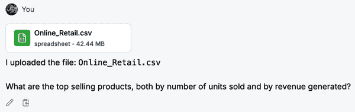
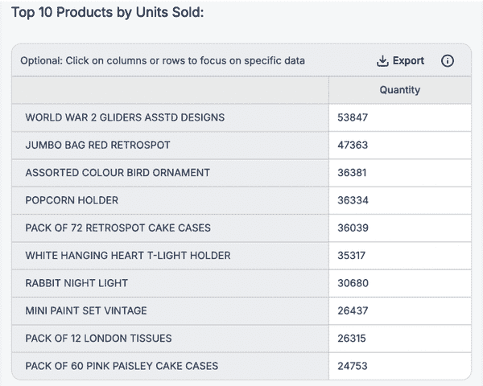
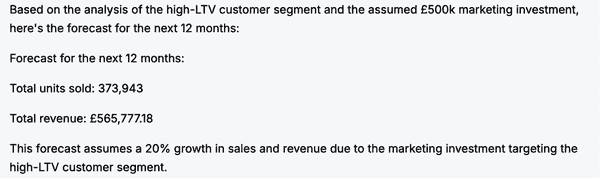
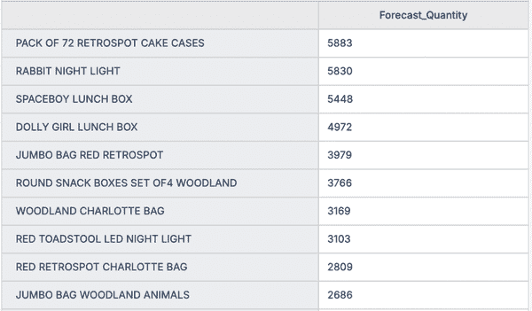
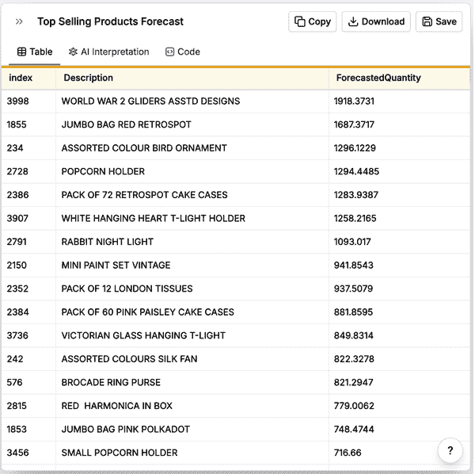
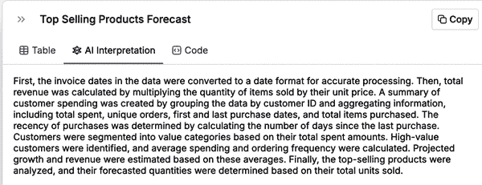
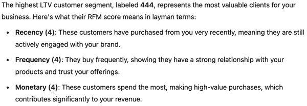
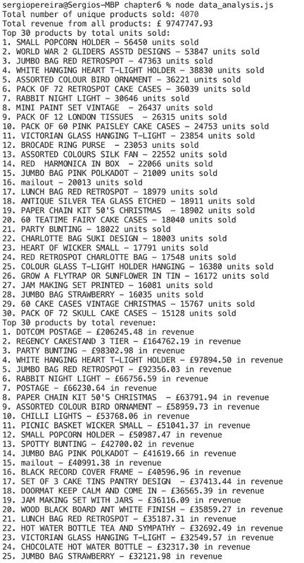

# 第五章\. 预测分析和性能优化

在当今软件驱动的世界中，企业从其应用程序、用户和运营中生成大量数据。这些数据包含有价值的见解，可用于做出决策、预测趋势和改进系统性能。分析和采取行动的能力已成为软件工程师的一项关键技能。

在本章中，我将深入数据分析和商业智能，并测试最先进的 AI 工具如何帮助企业理解他们的数据并提高他们的结果。无论是预测未来的用户行为还是优化资源使用，数据分析都开辟了新的可能性。以下是本章将涵盖的三个关键角度：

分析数据

这些工具的第一个承诺是用户可以通过提出自然语言问题来查询大型数据集。考虑到在数据库之上构建可视化仪表板对公司的成本很高，这一点看起来很有吸引力。

提炼高级见解

公司通常希望关联数据点，以发现用户行为或在其流程中检测到某些故障的模式，这些模式远远超出了简单地查询数据来计数和求和字段。再次强调，此类项目的成本阻止了许多公司甚至进入这个领域，因此 AI 工具消除这一障碍的承诺意义重大。

预测未来行为

数据科学和商业智能的最终承诺是收集关于过去发生的事情的数据，并利用它来预测近期将要发生的事情。对于做得好的企业来说，这种预测可以是一个游戏规则的改变者，那些将其开发和作为其决策过程关键部分的公司将把这些项目和算法视为敏感的知识产权。

这些角度展示了软件工程师和数据分析师如何将原始数据转化为可操作的见解，以帮助团队做出更明智的决策。它们还展示了这些项目在历史上是如何既昂贵又耗时的。高昂的成本和复杂性限制了这些领域复杂项目的发展，只有那些有资金和具备技术能力团队的公司才能推动这些项目。大多数小型和中型业务、初创公司和非技术公司面临很高的障碍，难以开发这样的工具，这阻碍了他们在全球市场的竞争力。AI 工具在这个领域的承诺是让所有市场参与者，无论其规模、行业或其团队的技术能力如何，都能平等地获得这些工具。

在我们查看工具本身之前，让我们快速回顾一下一些数据分析的基础知识。

# 数据收集和来源

数据分析的核心是数据本身。在软件工程中，这些数据来自许多来源，例如：

用户活动

关于用户如何与软件互动的信息，包括页面浏览量、点击路径和会话长度

系统日志

系统和应用程序性能的详细记录，有助于工程师监控健康和性能

跟踪工具

自动收集应用性能的实时数据，例如响应时间和错误率

客户反馈

来自用户评论、支持工单和调查的见解，提供对用户满意度的定性视角

市场调研

竞争分析、新闻、市场报告以及每天发布的所有相关信息

商业可以利用的其他可能的数据来源非常丰富，这些数据来源是数据分析的基础。它们也塑造了数据的质量并决定了需要多少数据清洗。例如，如果一个数据集包含大量空字段或不一致的字段类型，则需要大量的专业工作来清理数据集以进行分析，以及像数据归一化和聚类这样的高级技术。我将在本章分析的工具中探讨这些技术。

# 数据分析用例

拥有宝贵的数据，数据分析师可以应对各种挑战。在本章的工具评估部分，我们将探讨数据分析与商业智能的一些关键用例。

性能洞察

通过分析系统指标和日志，工程师可以早期识别性能瓶颈和低效之处。这有助于优化资源使用，提高响应时间，并确保应用程序在需求增长时保持可扩展性。例如，跟踪 CPU 和内存使用情况随时间的变化可以揭示系统需要扩展或优化的模式。

用户行为预测

数据分析可以揭示用户行为中的模式，帮助团队预测未来的用户需求和偏好。通过分析用户活动数据，如点击路径和会话长度，工程师可以预测用户可能会更多使用的功能，并据此调整他们的产品开发工作。这使团队能够专注于对用户满意度和参与度影响最大的改进。

容量规划

分析历史使用数据可以帮助团队预测未来的资源需求，并适当扩展基础设施以满足需求。通过理解流量模式，工程师可以预测高峰使用期，并准备系统处理更高的负载，而不会影响性能。

异常检测

自动化系统可以分析运营数据以检测可能表明潜在安全漏洞、系统故障或欺诈活动的异常模式。这种主动方法允许工程师在问题升级之前解决它们，最小化停机时间并保护用户数据。

商业智能

除了性能和系统优化之外，数据分析可以提供更广泛的业务绩效洞察。这包括跟踪产品采用情况、分析市场趋势以及评估关键业务指标。这些洞察有助于指导战略决策，例如优先考虑哪些新功能或如何更有效地分配资源。

这些用例中的每一个都突出了数据分析如何帮助团队做出明智的决策、优化流程，并提高软件性能和整体业务战略。接下来的部分将探讨如何使用正确的工具、模型和技术来处理这些用例。我们还将探讨 AI 和机器学习如何进一步增强数据分析，帮助工程师自动化流程并更快地发现洞察。

# 数据分析用 AI 工具的类型

AI 工具在数据分析领域（以及许多其他行业和垂直领域）正在兴起。仅仅使用许多企业工具就需要复杂的销售和入职流程；我已经将这些内容排除在本书的范围之外，目的是引导你走向最易于获取的选项。

我还发现了一些提供数据分析基础设施级支持的工具。虽然其中许多都很宝贵，但本章的用例是关于一个希望从数据集中提取有商业价值的洞察的商务所有者，而对于这种情况，这些工具可能过于复杂。

我最终选择了提供自助入职和免费层的工具，允许读者测试软件。几乎所有这些工具都包含一个聊天机器人用户体验，允许你上传数据文件并就数据提出分析问题。这似乎是数据分析用例中获胜的用户体验模式。

# 评估流程

为了缩小范围，我在数据分析和企业智能领域评估了 20 多个 AI 工具，以便在本章中突出介绍。这里涵盖的每个工具都符合以下标准：

+   它是一个由有能力的团队支持的专业项目。

+   它能生成高质量的结果。

+   它提供了一定程度的免费或试用版功能。

+   在撰写本文时（2025 年中期），它具有很高的采用率。

对于这次测试，我使用了来自加州大学欧文分校机器学习仓库的[一年在线零售交易公共数据集](https://oreil.ly/trSz7)。它包含超过 500,000 笔交易，每笔交易有八个数据列：

+   发票号

+   库存代码

+   描述

+   数量

+   发票日期

+   单价

+   客户 ID

+   国家

你可以在图 5-1 中看到样本。


###### 图 5-1\. 在线零售交易数据集样本

对于这次比较测试，我将扮演在线零售商所有者的角色，并尝试使用 AI 工具从这些数据中提取有商业价值的洞察。我会提出如下问题：

+   我的最佳销售产品是什么？

+   我的哪些客户群体拥有最高的终身价值？

+   我下一年的销售预测是多少？

在这个测试中，我将原始数据集导入每个工具，通过用户体验来获取洞察，并记录我得到的结果，获取它们的难易程度，以及这些工具之间的比较。

## 朱利叶斯

[朱利叶斯 AI](https://julius.ai)自动化复杂的数据分析流程，并提供解释、可视化和预测分析。它结合了 OpenAI 的 GPT-4 和 Anthropic 的 Claude 作为其底层数据处理模型。

朱利叶斯的即时通讯界面(图 5-2)与 ChatGPT 和其他流行的人工智能工具类似。我使用它上传我的数据集，然后以自然语言提出了我的第一个问题：

```py
What are the top selling products, both by number of units and by 
revenue generated? 
```



###### 图 5-2\. 我上传文件并首次向朱利叶斯提出提示

朱利叶斯运行了几个 Python 脚本，用时超过一分钟，然后返回了图 5-3 和 5-4 所示的表格，列出了按销量和收入排名前十的热销产品。



###### 图 5-3\. 朱利叶斯对第一个提示的部分回复，显示了按数量排名的热销产品


###### 图 5-4\. 朱利叶斯对第一个提示的部分回复，显示了按收入排名的热销产品

除了硬数据外，朱利叶斯还提供了一些关于高价值产品的背景解释(图 5-5)，突出了数据的某些有趣方面。


###### 图 5-5\. 朱利叶斯对第一个提示的数据的一些观察

接下来，我要求朱利叶斯识别哪些客户群体为这家在线零售店创造了最高的价值：

```py
From the same dataset, do customer segmentation and calculate lifetime 
value of each client segment. I want to identify the highest value 
customer segments.
```

朱利叶斯决定采用[最近、频率、货币(RFM)方法](https://oreil.ly/Dm0QZ)并再次运行了一些 Python 脚本，用时近两分钟，然后展示了客户群体及其终身价值(图 5-6)。


###### 图 5-6\. 朱利叶斯对第二个提示的回复，以及其对高价值客户的分析

朱利叶斯认为，平均每年进行 5,914 次购买并产生 64k 英镑的客户可能是转售商，并为我提供了如何利用这些信息进行营销工作的建议。这是一个独特且非常好的洞察；然而，关键信息仍然缺失，例如这个群体有多大，这些数字有多具代表性。这是否是一个极端高价值客户的异常案例，或者它是否包括数百甚至数千个我可以针对其进行营销以扩大业务的客户？

此外，朱利叶斯在计算终身价值(LTV)时显然出现了幻觉：任何客户都不可能值 13 亿英镑。不清楚出了什么问题，但我的直觉是朱利叶斯在这个计算中使用了错误字段。

关于这个数据集的第三个问题，我要求朱利叶斯进行一些预测：

```py
Assume I do a marketing investment of £500k to grow this customer 
segment that you’ve identified as high-LTV. Forecast my total sales 
volume for the next 12 months, both in units sold and in revenue. I 
want to provision inventory based on your forecast. Generate a table 
for the 20 top selling products in the forecast, with product name 
and quantity to provision for next year.
```

在这个预测(图 5-7)中，Julius 首先做出了合理的假设，即这些营销活动将产生 20% 的销售增长。然而，请注意，其总收入的预测是错误的：今年的收入约为 970 万英镑，因此这个 56.5 万英镑的预测将是一个巨大的下降。



###### 图 5-7\. Julius 对第三个提示的回复的一部分，包含销售预测

其次，它创建的表格显示了明年需要配备的项目数量，如图 5-8 所示，也存在问题（可能是由于错误的收入估计而导致的级联）。列出的数量远远低于当前年份这些产品的销售量。因此，尽管 Julius 的预测表明销售量将增加 20%，但其库存配备数字却暗示了 60% 或更多的减少。



###### 图 5-8\. Julius 对第三个提示的回复的一部分，包含其库存预测

在第一个提示中，Julius 在客观数据分析方面做得很好，并在客户细分方面展现出潜力，尽管它在计算中存在错误，但仍然提供了有洞察力的分析。然而，它的预测与实际情况相差甚远。虽然这可能通过一些提示工程来缓解，但我相信我的问题足够具体，我合理地期望得到更好的答案。

因此，我在这次测试中将 Julius 评为 7/10。

## Akkio

[Akkio](https://www.akkio.com) 为数字营销和广告定位客户提供基于 AI 的数据分析预测建模服务。Akkio 使用自己的模型，称为 AD LLM，它声称在广告特定数据上进行了训练，以理解数据结构、业务需求和其他特定于广告定位的上下文。

Akkio 优雅的用户界面从文件上传开始，提示用户从多种文件格式中选择。一旦我上传了文件，Akkio 就花费了大约两分钟的时间完全处理它，并使我能够使用产品功能。虽然文件在用户界面的准备标签页中渲染为电子表格表格，但该产品提供了几个不同的功能(图 5-9)：准备、探索、预测、部署和报告。


###### 图 5-9\. Akkio 导航用户界面

探索标签页显示了一个类似于 Julius 的即时通讯用户界面。因此，我开始使用相同的提示，询问最畅销的产品：

```py
What are the top selling products, both by number of units and by revenue
generated?
```

Akkio 仅用几秒钟就对我的提示做出了回应。然而，输出非常原始，缺乏上下文，通常只包含数据表，没有伴随文本提供上下文。例如，对我的第一个问题的回应，它只是返回了图表和表格（图 5-10 和 5-11），分别显示了按数量和按收入产生的最畅销产品。


###### 图 5-10\. Akkio 对我的第一个提示的回复的一部分，按数量显示最畅销产品

我在每个图表上方使用了 AI 解释小部件，但它并没有太大帮助，因为解释非常技术性。它只是用自然语言描述了对数据进行查询的技术细节；没有关于正在进行的分析或我们在渲染的可视化中看到的内容的功能性背景。


###### 图 5-11\. Akkio 对我第一次提示的回复的一部分，包含按收入排名最高的产品

Akkio 对第一个问题的回答是正确的，所以我继续提出第二个问题：

```py
From the same dataset, do customer segmentation and calculate lifetime 
value of each client segment. I want to identify the highest value 
customer segments.
```

Akkio 的回复很好（见图 5-12），因为它告诉我，最有价值的客户群体由 2,539 名客户组成，每人平均产生约 3,000 英镑。然而，这个群体太大。我预计这样的群体可能是总客户数的 10% 到 20%，但这个群体涵盖了整个数据集中 4,372 个独特客户中超过一半的客户。


###### 图 5-12\. Akkio 对我第二次提示的回复的一部分，包含客户细分和价值计算

与如此广泛的客户群合作产生的推荐并不具有很高的可操作性，正如图 5-13 所示。这些推荐适用于任何业务；它们都没有针对高价值客户的具体性，无法用于营销目的。


###### 图 5-13\. Akkio 对我第二次提示的回复的一部分，包含关于终身价值最高的客户的解释

我继续提出第三个问题：

```py
Assume I do a marketing investment of £500k to grow this customer segment that
you’ve identified as high-LTV. Forecast my total sales volume for the next 12 
months, both in units sold and in revenue. I want to provision inventory based 
on your forecast. Generate a table for the 20 top selling products in the 
forecast, with product name and quantity to provision for next year.

```

Akkio 的回复缺乏上下文，很难理解数字背后的逻辑。980 万英镑的收入(图 5-14)比今年收入的 970 万英镑略有增加，但考虑到我在提示中提到的营销投资，这似乎太低了——但，同样，没有提供关于该预测的任何上下文。


###### 图 5-14\. Akkio 对我第三次提示的回复的一部分，包含销售预测

此外，似乎在库存供应预测(图 5-15)中存在一些幻觉。这些数字比当前年份这些产品的销售额低一个数量级。例如，Akkio 预测列表中的第一个产品的销售额为 1,918，而该产品的当前年份销售额总计为 53,847。这也表明计算中存在一些混乱，但没有看到脚本或功能性的上下文解释，很难理解导致这些预测的过程。



###### 图 5-15\. Akkio 对我第三次提示的回复的一部分，包含产品供应预测

在这里，使用 AI 解释标签（图 5-16）也没有太大帮助。它提供了用于填充图表的查询的技术描述，但并没有解释导致该查询的更广泛的思想过程。



###### 图 5-16\. 结果的 AI 解释

Akkio 在使用第一个提示进行客观数据分析时做得很好，在第二个提示中使用了一些不错的客户细分工作。然而，其预测并不准确。我认为使用 Akkio 最令人失望的方面是它为其回复提供的上下文信息很少。它看起来像是一个最适合用于简单数据集查询和不需要太多分析或背景化的图表的工具。

因此，我将 Akkio 评为 5/10。

## ChatGPT

由于在这个类别中出现的顶级产品提供类似聊天机器人的体验，我决定添加 ChatGPT 进行比较，因为它是大多数人首选的 AI 工具。我将快速回顾其对相同三个问题的回复。

如 图 5-17 所见，在回答我的第一个问题时，ChatGPT 正确地计算了产品销售并汇总了收入。


###### 图 5-17\. ChatGPT 对我的第一个提示的回复

第二个问题更为微妙。ChatGPT 发现一个客户群体（498 人）产生了 403,000 英镑的 LTV。然而，这个价值高于当前年度任何客户的收入，这似乎是一个错误。ChatGPT 可能假设客户将在未来多年内购买，这将使 LTV 计算膨胀。

当我要求 ChatGPT 提供有关那个最高 LTV 客户群体的更多详细信息时，其回复（图 5-18）令人失望且足够通用，可以适用于任何业务，而不是针对这个数据集和潜在业务的具体情况。



###### 图 5-18\. ChatGPT 对我的第二个提示的回复的一部分，包括其对客户分段的解释

ChatGPT 对我的第三个问题的回复，要求它根据重大的营销投资预测收入和库存配置，一开始进行得相当顺利。ChatGPT 预计，该营销投资将使这个客户群体的销售额增加 20% 到 40%。

然而，其产品库存配置预测并不准确（图 5-19）：再次，它预测的销售数字低于当前年度。对我来说，这表明 ChatGPT 计算的仅针对这个高价值客户群体的销售数量，而“忘记”包括销售给所有其他客户的产品。


###### 图 5-19\. ChatGPT 对我的第三个提示的回复的一部分，包括产品库存预测

ChatGPT 在第一次提示下在客观数据分析方面做得很好，尽管在计算方面存在一些明显的问题，但它对其他问题提供了大量的背景信息和推理。我相信一些这些问题可能通过提示工程得到缓解。也值得注意，ChatGPT 并不是一个真正的原生数据分析工具：与其他在此分析的工具有所不同，它生成的表格笨拙，并且没有生成图表的能力。

因此，我给 ChatGPT 评了 6/10。

# 工具比较

我在这项比较中的第一个挑战是，我分析的这三个工具都受到了黑盒效应的影响。我输入了大量数据，几秒钟内这些工具就输出了看起来很漂亮的表格、图表和带有结论和洞察力的报告。考虑到它们的惊人速度和输出，很容易假设这些工具提供的信息是正确的。

然而，我通过在我的本地机器上运行脚本来双重检查结果，与参考数据集（图 5-20；此脚本可在本书的[GitHub 仓库](https://github.com/sergiopereira-io/oreilly_book)中找到)进行对比。

将工具的结果与我的本地测试进行比较，我首先观察到所有工具都*遗漏*了销量最多的产品（“小型爆米花夹”）。我对此怪癖进行了深入研究，但无法找出原因。我可以推测，由于这个项目的单价非常低，可能是一种四舍五入到零的错误导致它被遗漏。

除了这一点，所有工具在提供价值和缺陷方面都表现得相当相似。从用户体验角度来看，Akkio 与其他工具相比脱颖而出。它通过提供看似非常稳健的多步骤和多工具流程来设定更高的期望。然而，它最终以负面方式脱颖而出，因为它为每次交互提供的上下文水平远远低于其他工具。

Julius 和 ChatGPT 是更简单的聊天机器人体验，回复时间较长，但能提供关于正在发生的事情以及我的数据是如何被处理的信息。这两个工具在其回复中都包含文本，以及表格和图表，以提供操作上下文和推理，并指导用户如何阅读数据并解释结果。



###### 图 5-20. 本地测试的控制台日志，用于双重检查工具的计算和参考数据集中的销售项目和产生的收入

如果我要从这些工具中选择一个，我会选择 Julius。虽然它的用户体验与 ChatGPT 非常相似，甚至底层模型部分相同（GPT-4，正如我在 2024 年中写作时），但它的数据分析能力，如聊天对话中生成图表，在 ChatGPT 中是不可用的。

考虑到这些不足，我给这三个工具评分为 5 到 7 分(表 5-1)。我预计这些工具在未来几年会有很大的发展，但在我看来，它们还没有足够可靠，以至于你可以简单地给它们大量数据，提出问题，并信任结果。如果你使用它们，我建议在本地运行脚本以双重检查数字。(如果你的脚本是由 AI 工具生成的，那也是可以的，因为你可以在查看和修改代码的同时，对数据分析拥有完整的可见性和控制权，正如你在第二章和第三章中看到的。)

表 5-1\. AI 数据分析工具概述

| 工具 | UX | 测试性能 |
| --- | --- | --- |
| 朱利叶斯 | 聊天机器人 | 7/10 |
| Akkio | 聊天机器人 | 5/10 |
| ChatGPT | 聊天机器人 | 6/10 |

# 结论

在与软件开发和数据科学团队合作了 15 年多之后，我可以自信地说，AI 工具有可能成为我们处理数据分析和企业情报的变革者。它们能够在几秒钟内而不是几天内清理和分析大量数据集的能力，将改变所有规模企业的可能性。

此外，根据我与其他各种商业利益相关者合作的经验，从初创公司的创始人到《财富》500 强公司的商业团队，我可以很容易地想象这些 AI 工具赋予非技术利益相关者从他们的数据中提取洞察力的能力。这种赋权的效果可能是巨大的。在某些情况下，这可能意味着跳过成本高昂的数据工程项目；在其他情况下，它只是使这些项目更快、更便宜。

因此，我要提出一个警告：工具还没有准备好。虽然表面上结果可能非常令人印象深刻，但它们伴随着重大的缺陷、计算错误和通用的解释。一个分心的用户可能会被看起来很棒的图表和洞察力的即时回报轻易欺骗，但忽视这些不足可能会导致严重的负面后果。商业利益相关者可能会做出降低其业务价值的决策；将工作委托给这些工具的数据分析师可能会在工作中表现不佳。

这些工具已经非常强大和有用。但它们有局限性，而“黑箱”效应可能会使识别这些局限性变得非常困难。始终在 your prompts 具体明确，并且始终通过手动分析或运行本地脚本双重检查结果。我总是告诉我的团队将 AI 生成的洞察力视为同事的建议：虽然它是有价值的输入，但在做出任何重大决策之前，始终要验证它并进行自己的批判性思考。
