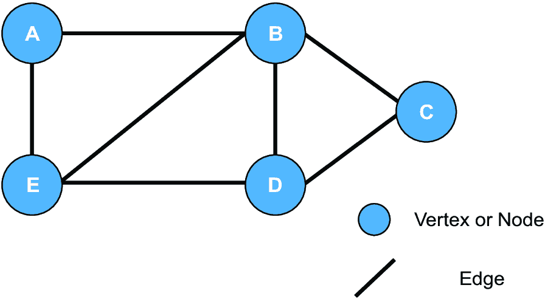
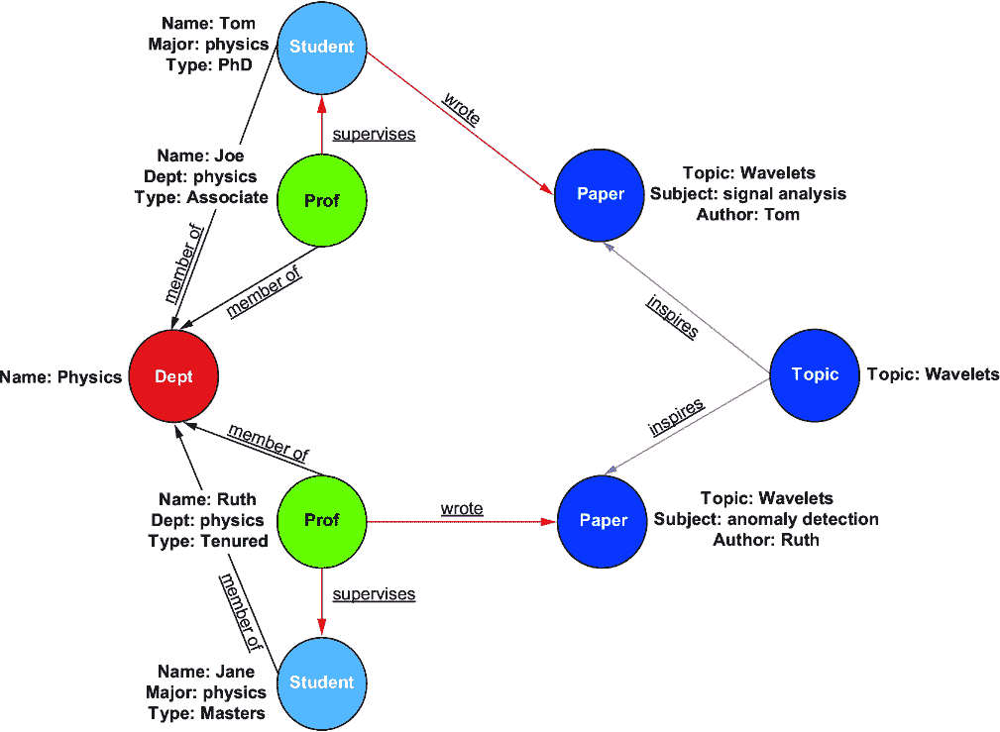
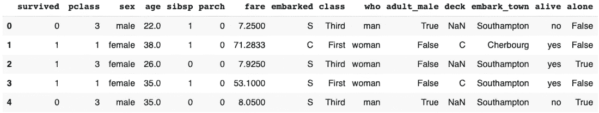
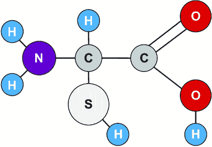

# 1 发现图神经网络

### 本章涵盖

+   定义图和图神经网络

+   理解为什么人们对图神经网络感到兴奋

+   认识到何时使用图神经网络

+   从宏观角度审视使用图神经网络解决问题

对于数据从业者来说，机器学习和数据科学领域最初之所以令人兴奋，是因为从数据中提取非直观且有用的见解的潜力。特别是，机器学习和深度学习的见解有望增强我们对世界的理解。对于工作的工程师来说，这些工具承诺以前所未有的方式创造商业价值。

经验与这一理想有所偏差。现实世界的数据通常杂乱无章、污秽且存在偏见。此外，统计方法和学习系统都带有自己的局限性。实践者的一个基本作用是理解这些局限性，弥合真实数据与可行解决方案之间的差距。例如，我们可能想要预测银行的欺诈活动，但首先需要确保我们的训练数据已被正确标记。更重要的是，我们还需要检查我们的模型不会错误地将欺诈活动分配给正常行为，这可能是由于数据中的一些隐藏混杂因素。

对于图数据，直到最近，弥合这一差距一直特别具有挑战性。图是一种信息丰富的数据结构，特别擅长捕捉数据中关系所扮演的关键角色。图无处不在，关系数据以不同的形式出现，如分子中的原子（自然）、社交网络（社会），甚至互联网上网页之间的连接模型（技术）[1]。需要注意的是，这里的“关系”一词并不指代“关系数据库”，而是指关系中具有显著意义的数据。

以前，如果你想在深度学习模型中整合图中的关系特征，必须以间接的方式进行，使用不同的模型来处理、分析和然后使用图数据。这些独立的模型通常难以扩展，并且难以考虑到图数据的所有节点和边属性。为了充分利用这种丰富且普遍存在的数据类型进行机器学习，我们需要一种专门为图的独特品质和关系数据设计的机器学习技术。这正是图神经网络（GNNs）填补的差距。

深度学习领域常常围绕新技术和方法存在很多炒作。然而，GNNs 被广泛认为是基于图学习的一个真正的飞跃[2]。这并不意味着 GNNs 是一劳永逸的解决方案。应该仔细比较 GNNs 得出的预测结果与其他机器学习和深度学习方法。

需要记住的关键点是，如果你的数据科学问题涉及可以结构化为图的数据——也就是说，数据是连接的或相关的——那么 GNNs 可以提供一种有价值的解决方案，即使你还没有意识到你的方法中缺少了什么。GNNs 可以设计来处理非常大的数据，进行扩展，并适应不同大小和形状的图。这可以使处理以关系为中心的数据更加容易和高效，同时产生更丰富的结果。

GNNs 的突出优势是为什么数据科学家和工程师越来越认识到掌握它们的重要性。GNNs 能够从关系数据中揭示独特的见解——从识别新的药物候选者到优化 Google Maps 应用中的 ETA 预测准确性——作为发现和创新的催化剂，并赋予专业人士推动传统数据分析边界的力量。它们的广泛应用跨越各个领域，为专业人士提供了一种多功能的工具，在电子商务（例如，推荐引擎）和生物信息学（例如，药物毒性预测）中同样相关。GNNs 的熟练掌握使数据专业人士能够进行增强、准确和创新的图数据分析。

由于所有这些原因，图神经网络（GNNs）现在已成为推荐引擎、分析社交网络、检测欺诈、理解生物分子行为以及本书中我们将遇到的其他许多实际应用的流行选择。

## 1.1 本书的目标

《图神经网络实战》（Graph Neural Networks in Action）旨在帮助实践者开始部署 GNNs 来解决实际问题。这可能是一个不熟悉图数据结构的机器学习工程师，一个尚未尝试 GNNs 的数据科学家，甚至可能是一个可能对两者都不熟悉的软件工程师。在本书中，我们将从图的基本知识一直覆盖到更复杂的 GNN 模型。我们将逐步构建 GNN 的架构。这包括 GNN 的整体架构和消息传递的关键方面。然后我们继续添加不同的功能和扩展到这些基本方面，例如引入卷积和采样、注意力机制、生成模型以及在动态图上操作。在构建我们的 GNNs 时，我们将使用 Python 和一些标准库。GNN 库要么是独立的，要么使用 TensorFlow 或 PyTorch 作为后端。在本文本中，重点将放在 PyTorch Geometric（PyG）上。其他流行的库包括深度图库（Deep Graph Library，DGL，一个独立的库）和 Spektral（它使用 Keras 和 TensorFlow 作为后端）。还有 Jraph，适用于 JAX 用户。

本书的目标是使你能够

+   评估 GNN 解决方案对你问题的适用性。

+   了解何时传统的神经网络在处理图结构数据时不如 GNN 表现得好，以及何时 GNN 可能不是表格数据的最佳工具。

+   设计和实现一个 GNN 架构来解决你特有的问题。

+   明确 GNNs 的限制。

本书侧重于使用编程实现。我们也花了一些时间在必要理论和概念上，以确保所涵盖的技术能够被充分理解。这些内容在大多数章节的“内部机制”部分进行介绍，以区分技术原因和实际实现。本书基于我们在书中介绍的关键概念，有许多不同的模型和包。因此，本书不应被视为对所有 GNN 方法和模型的全面回顾，这可能需要数千页，而应被视为好奇和渴望学习的实践者的起点。

本书分为三个部分。第一部分涵盖了 GNNs 的基础知识，特别是它们与其他神经网络（如*消息传递*和*嵌入*）的不同之处，这些对于 GNNs 具有特定的含义。第二部分，本书的核心内容，介绍了模型本身，其中我们涵盖了几个关键模型类型。然后，在第三部分，我们将对一些更复杂的模型和概念进行更详细的探讨，包括如何扩展图以及处理时间数据。

《图神经网络实战》旨在帮助人们快速进入这个新领域并开始构建应用。本书的目标是通过填补空白和回答关键开发问题来减少实现新技术的摩擦，这些问题可能不容易找到或根本未在其他地方涉及。每种方法都是通过一个示例应用来介绍的，这样你可以了解 GNNs 在实际中的应用。我们强烈建议你在过程中亲自尝试代码。

### 1.1.1 补充图的基本知识

是的，在理解 GNNs 之前，你需要了解图的基本知识。然而，本书的目标是教授 GNNs 给深度学习实践者和传统神经网络的构建者，他们可能对图知之甚少。同时，我们也认识到本书的读者在图的知识上可能存在巨大差异。如何解决这些差异并确保每个人都能充分利用本书？在本章中，我们提供了对理解 GNNs 最基本图概念的介绍。如果你对图非常熟悉，你可以选择跳过这一部分，尽管我们建议快速浏览，因为我们涵盖了一些对理解本书剩余部分有帮助的特定术语和用例。对于那些对图有更多疑问的人，我们在附录 A 中也包含了一个关于基本图概念和术语的完整教程。这个入门指南也应当作为查找特定概念的参考。

在回顾了图和图学习中的关键概念之后，我们将探讨几个领域中的案例研究，在这些领域中 GNN 正在成功应用。然后，我们将分析这些特定案例，看看是什么使得 GNN 成为一种好的应用案例，以及如何知道你手头是否有 GNN 问题。在本章末尾，我们将介绍 GNN 的机制，这是本书其余部分将添加的骨架。

## 1.2 基于图的学习

本节定义了图、基于图的学习和 GNN 的某些基本原理，包括图的基本结构和不同类型图的分类。然后，我们将回顾基于图的学习，将 GNN 与其他学习方法联系起来。最后，我们将解释图的价值，并以泰坦尼克号数据集的数据为例。

### 1.2.1 什么是图？

图是包含元素的数据结构，用 *节点或顶点* 表示，元素之间的关系用 *边或链接* 表示，如图 1.1 所示。图中的所有节点都将有额外的 *特征数据*。这是节点特定的数据，与社交网络中个人的姓名或年龄等相关。链接是关系数据力量的关键，因为它们使我们能够了解系统，为数据分析提供新的工具，并从中预测新的属性。这与数据库表、数据框或电子表格等表格数据形成对比，其中数据固定在行和列中。

##### 图 1.1 一个图。图中由字母 A 到 E 表示的各个元素是节点，也称为顶点，它们之间的关系由边描述，也称为链接。

为了描述和从节点之间的边中学习，我们需要一种方法来记录它们。这可以通过明确声明 A 节点连接到 B 和 E，以及 B 节点连接到 A、C、D 和 E 来完成。很快，我们可以看到以这种方式描述事物变得难以管理，我们可能会重复冗余信息（A 连接到 B 和 B 连接到 A）。幸运的是，有许多数学形式用于描述图中的关系。其中最常见的一种是描述 *邻接矩阵*，我们在表 1.1 中将其列出。请注意，邻接矩阵在对角线两侧是对称的，并且所有值都是 1 或 0。

##### 表 1.1 图 1.1 中简单图的邻接矩阵

|  | A | B | C | D | E |
| --- | --- | --- | --- | --- | --- |
| **A**  | 0  | 1  | 0  | 0  | 1  |
| **B**  | 1  | 0  | 1  | 1  | 1  |
| **C**  | 0  | 1  | 0  | 1  | 0  |
| **D**  | 0  | 1  | 1  | 0  | 1  |
| **E**  | 1  | 1  | 0  | 1  | 0  |

图的邻接矩阵是一个重要的概念，它使得在一个表格中观察图的所有连接变得容易[3]。在这里，我们假设我们的图没有方向性；也就是说，如果 0 连接到 1，那么 1 也连接到 0。这被称为*无向图*。无向图可以从邻接矩阵中轻松推断出来，因为在这种情况下，矩阵在对角线上是对称的（例如，在表 1.1 中，右上角被反射到左下角）。

我们还假设节点之间的关系都是相同的。如果我们想让节点 B-E 的关系比节点 B-A 的关系更重要，我们可以增加这条边的权重。这相当于增加邻接矩阵中的值，例如，使表 1.1 中 B-A 边的条目等于 10 而不是 1。

所有关系都同等重要的图称为*无权图*，并且可以从邻接矩阵中轻松观察到，因为所有图条目要么是 1，要么是 0。具有多个值的边的图称为*加权图*。

如果图中任何节点都没有连接到自身的边，那么这些节点在其邻接矩阵中的值也将是 0（对角线上的 0）。这意味着图中没有自环。当一个节点有一个连接到同一节点的边时，就发生了*自环*。要添加自环，我们只需将该节点在对角线上的值设置为非零。

在实践中，邻接矩阵只是描述图中关系的许多方法之一。其他包括邻接表、边列表或关联矩阵。充分理解这些数据结构对于基于图的学习至关重要。如果您不熟悉这些术语或需要复习，我们建议查阅附录 A，其中包含更多细节和解释。

### 1.2.2 不同类型的图

了解许多不同类型的图可以帮助我们确定使用哪些方法来分析和转换图，以及应用哪些机器学习方法。以下，我们给出了一些最常见的图属性的快速概述。和之前一样，我们建议您查阅附录 A 以获取更多信息。

#### 同质图和异质图

最基本的图是*同质图*，由一种类型的节点和一种类型的边组成。考虑一个描述招聘网络的同质图。在这种类型的图中，节点将代表求职者，边将代表候选人之间的关系。

如果我们想要扩展我们图的能力来描述我们的招聘网络，我们可以给它更多的节点和边类型，使其成为一个**异质图**。通过这种扩展，一些节点可能是候选人，而其他节点可能是公司。边现在可以由候选人与公司当前或过去的就业关系组成。参见图 1.2 中同质图（所有节点或边具有相同的阴影）与异质图（节点和边具有各种阴影）的比较。

##### 图 1.2 同质图和异质图。在此，节点或边的阴影代表其类型或类别。对于同质图，所有节点都是同一类型，所有边也都是同一类型。对于异质图，节点和边有多种类型。

#### 二部图

与异质图类似，**二部图**也可以被分离或划分为不同的子集。然而，二部图（图 1.3）具有一个非常特定的网络结构，即每个子集中的节点连接到其子集之外的节点，而不是内部的节点。稍后，我们将讨论推荐系统和 Pinterest 图。这个图是二部图，因为一组节点（图钉）连接另一组节点（版面），但不是它们自己组内的节点（图钉）。

##### 图 1.3 二部图。有两种类型的节点（两种阴影的圆圈）。在二部图中，节点不能连接到同一类型的节点。这也是一个异质图的例子。

#### 循环图、无环图和有向无环图

如果一个图是**循环的**，那么你可以从一个节点开始，沿着其边旅行，不重复任何步骤，返回到起始节点，在图中创建一个环形路径。相比之下，在一个**无环**图中，无论从任何起始节点选择哪条路径，你都不能不回溯就返回到起始点。这些图，如图 1.4 所示，通常类似于树状结构或没有回环的路径。

虽然有向图和无向图都可以是有向的或无向的，但**有向无环图（DAG**）是一种特定的无环图，它仅限于有向。在有向无环图中，所有边都有方向，不允许有环。DAGs 代表单向关系，你不能跟随箭头并最终回到起点。这种特性使得 DAGs 在因果分析中至关重要，因为它们反映了假设因果是单向的因果结构。例如，A 可以导致 B，但 B 不能同时导致 A。这种单向性质与 DAGs 的结构完美契合，使它们成为建模各种领域中的工作流程过程、依赖链和因果关系的理想选择。

##### 图 1.4 展示了循环图（左）、无环图（右）和 DAG（底部）。在循环图中，通过连接节点 A-E-D-C-B-A 的箭头（有向边）显示了循环。请注意，节点 G 和 F 是图的一部分，但不是其定义循环的一部分。无环图由无向边组成，不可能存在循环。在 DAG 中，所有有向边都流向一个方向，从 A 到 F。

#### 知识图谱

*知识图谱*是一种特殊类型的异构图，它通过丰富的语义意义来表示数据，不仅捕捉不同实体之间的关系，还捕捉这些关系的上下文和本质。与主要强调结构和连接性的传统图不同，知识图谱结合了元数据和遵循特定模式，以提供更深入的上下文信息。这允许进行高级推理和查询功能，例如识别模式、揭示特定类型的连接或推断新的关系。

在大学学术研究网络的例子中，知识图谱可能表示各种实体，如教授、学生、论文和研究主题，并明确定义它们之间的关系。例如，教授和学生可以通过作者关系与论文相关联，而教授也可能指导学生。此外，图将反映层级结构，如教授和学生被归类在系别下。您可以在图 1.5 中看到这个知识图谱的表示。

##### 图 1.5 表示大学物理系内部学术研究网络的图谱。该图谱展示了层级关系，例如教授和学生作为系成员，以及行为关系，例如教授指导学生和撰写论文。实体如教授、学生、论文和主题通过语义上有意义的关系（指导、撰写、启发）相互连接（Supervises, Wrote, Inspires）。实体还具有详细特征（姓名、系别、类型），提供更多上下文。语义连接和特征使得对复杂的学术互动进行高级查询和分析成为可能。

知识图谱的一个关键特征是它们提供明确上下文的能力。与传统的异构图不同，传统的异构图显示不同类型的实体及其基本连接，但没有详细的语义意义，知识图谱通过定义特定类型和关系的具体类型和意义更进一步。例如，虽然传统的图可能显示教授与系部相连或学生与论文相链接，但知识图谱会具体说明教授监督学生或学生和教授共同撰写论文。这一层额外的意义使得查询和分析更加强大，使得知识图谱在自然语言处理、推荐系统和学术研究分析等领域特别有价值。

#### 超图

在所有需要处理的图中，超图是较为复杂和困难的一种。*超图*是指单条边可以连接多个不同节点的图。对于不是超图的图，边用于连接恰好两个节点（或节点自身形成自环）。如图 1.6 所示，超图中的边可以连接任意数量的节点。超图的复杂性体现在其邻接数据上。对于典型图，网络连通性由二维邻接矩阵表示。对于超图，邻接矩阵扩展到更高维的张量，称为*关联张量*。这个张量是 N 维的，其中 N 是单条边连接的最大节点数。一个超图的例子可能是一个允许进行群聊以及单个人对话的通信平台。在普通图中，边只会连接两个人。在超图中，一个超边可以连接多个人，表示一个群聊。

##### 图 1.6 一种无向超图，以两种方式展示。在左侧，我们有一个图，其边由阴影区域表示，用字母标记，其顶点由点表示，用数字标记。在右侧，我们有一个图，其边线（用字母标记）连接最多 3 个节点（用数字标记的圆圈）。节点 8 没有边。节点 7 有一个自环。

### 1.2.3 基于图的学习

正如我们将在本章的其余部分看到的那样，图在我们的日常生活中无处不在。*基于图的学习*将图作为输入数据来构建模型，以洞察关于这些数据的问题。在本章的后面部分，我们将探讨不同的图数据示例，以及我们可以使用基于图的学习来回答的问题和任务。

基于图的学习使用各种机器学习方法来构建图的*表示*。这些表示随后用于下游任务，如节点或链接预测或图分类。在第二章中，你将了解基于图学习中的一个基本工具，即构建嵌入。简而言之，嵌入是*低维*向量表示。我们可以构建不同节点、边或整个图的嵌入，并且有几种不同的方法可以实现这一点，例如 Node2Vec (N2V)或 DeepWalk 算法。

图数据上的分析方法已经存在很长时间了，至少早在 20 世纪 50 年代，当*团方法*使用图的某些特征来识别图数据中的子集或社区时[4]。

最著名的基于图的算法之一是 PageRank，它由拉里·佩奇和谢尔盖·布林在 1996 年开发，并成为谷歌搜索算法的基础。有些人认为这个算法是公司在随后的几年中迅速崛起的关键因素。这突显了成功的基于图的学习算法可以产生巨大的影响。

这些方法只是基于图的学习和分析技术的一个小子集。其他包括信念传播[5]、图核方法[6]、标签传播[7]和等距映射[8]。然而，在这本书中，我们将重点关注基于图的学习技术家族中最新且最激动人心的补充之一：GNN。

### 1.2.4 什么是 GNN？

GNN 结合了基于图的学习和深度学习。这意味着神经网络被用来构建嵌入并处理关系数据。GNN 内部工作原理的概述如图 1.7 所示。

GNN 允许你表示和学习图，包括它们的构成节点、边和特征。特别是，许多 GNN 方法专门设计用来有效地扩展到图的大小和复杂性。这意味着 GNN 可以在非常大的图上运行，正如我们将讨论的。在这方面，GNN 为关系数据提供了与卷积神经网络为基于图像的数据和计算机视觉所提供的类似的优势。

##### 图 1.7 GNN 工作原理概述。一个输入图被传递给 GNN。然后 GNN 使用神经网络通过称为消息传递的过程将图特征（如节点或边）转换为非线性嵌入。然后使用训练数据对这些嵌入进行调整，以适应特定的未知属性。GNN 训练完成后，它可以预测图的未知特征。

历史上，将传统的机器学习方法应用于图数据结构一直具有挑战性，因为当图数据以网格状格式和数据结构表示时，可能会导致数据的大量重复。为了解决这个问题，基于图的学习专注于**排列不变性**的方法。这意味着机器学习方法不受图表示顺序的影响。具体来说，这意味着我们可以随意打乱邻接矩阵的行和列，而不会影响算法的性能。每当我们在处理包含关系数据的数据时，也就是说，具有邻接矩阵的数据时，我们希望使用排列不变的机器学习方法，使我们的方法更加通用和高效。尽管 GNNs 可以应用于所有图数据，但 GNNs 特别有用，因为它们可以处理巨大的图数据集，并且通常比其他机器学习方法表现更好。

排列不变性是一种**归纳偏差**，或算法的学习偏差，是设计机器学习算法的强大工具 [1]。对排列不变性方法的需求是近年来基于图的学习增加受欢迎程度的核心原因之一。

设计用于排列不变性数据带来了一些缺点，同时也带来了优点。GNNs 并不适合其他数据，如图像或表格。虽然这看起来可能很明显，但图像和表格**不是**排列不变的，因此不适合 GNNs。如果我们打乱图像的行和列，那么就会打乱输入。相反，图像的机器学习算法寻求**平移不变性**，这意味着我们可以平移（移动）图像中的对象，而不会影响算法的性能。其他神经网络，如卷积神经网络（CNNs），通常在图像上表现更好。

### 1.2.5 表格数据和图数据之间的差异

图数据包括所有具有某种关系内容的数据，使其成为表示复杂连接的有力方式。虽然图数据最初可能看起来与传统表格数据不同，但许多通常以表格形式表示的数据集可以通过一些数据工程和想象力重新创建为图。让我们更仔细地看看泰坦尼克号数据集，它是机器学习中的一个经典例子，并探讨它如何从表格格式转换为图格式。

泰坦尼克号数据集描述了泰坦尼克号上的乘客，这艘船因与冰山相撞而著名地遭遇了不幸的结局。历史上，这个数据集一直是用表格格式分析的，包含每名乘客的行，列代表年龄、性别、票价、等级和生存状态等特征。然而，该数据集还包含丰富的、在表格格式中不立即可见的关系，如图 1.8 所示。

##### 图 1.8 泰坦尼克号数据集通常以表格格式显示和分析。

#### 将泰坦尼克号数据集重新构造成图

要将泰坦尼克号数据集转换为图，我们需要考虑如何将乘客之间的基本关系表示为节点和边：

+   *节点*——在图中，每个乘客都可以表示为一个节点。我们还可以为其他实体引入节点，例如客舱、家庭，甚至如“三等乘客”这样的群体。

+   *边*——边代表这些节点之间的关系或连接。例如：

    +   根据可用数据，是家庭成员（兄弟姐妹、配偶、父母或子女）的乘客

    +   共享同一客舱或曾一同旅行的乘客

    +   可能从共享的票号、姓氏或其他识别特征中推断出的社会或商业关系

要构建这个图，我们需要使用表格中的现有信息，并可能通过次要数据源或假设（例如，将姓氏链接以创建家庭群体）来丰富它。这个过程将表格数据转换为基于图的架构，如图 1.9 所示，其中每个边和节点封装了有意义的关联数据。

##### 图 1.9 泰坦尼克号数据集，展示了泰坦尼克号上人们的家庭关系，以图的形式可视化（来源：Matt Hagy）。在这里，我们可以看到存在丰富的社交网络以及许多具有未知家庭联系的乘客。

#### 图数据如何增加深度和意义

一旦数据集被表示为图，它就提供了对乘客之间社会和家庭联系的更深入视角。例如：

+   *家庭关系*——图清楚地显示了某些乘客之间的关系（例如，作为父母、子女或兄弟姐妹）。这有助于我们理解生存模式，因为家庭成员在危机中可能的行为与独自旅行的个体可能不同。

+   *社交网络*——除了家庭之外，图可能揭示更广泛的社会网络（例如，友谊或商业联系），这些可能是分析行为和结果的重要因素。

+   *社区洞察*——图结构还允许社区检测算法识别相关或连接的乘客集群，这可能揭示关于生存率、救援模式或其他行为的新的见解。

图表示通过指定在表格格式中可能不明显的关系来增加深度。例如，了解谁曾一同旅行、谁共享了客舱，或者谁有社会或家庭联系，可以提供更多关于生存率和乘客行为的背景信息。这对于诸如节点预测等任务至关重要，在这些任务中，我们希望根据图中表示的关系来预测属性或结果。

通过创建邻接矩阵或根据数据集中的关系定义图中的边和节点，我们可以从简单的数据分析过渡到更复杂的基于图的学习方法。

## 1.3 GNN 应用：案例研究

正如我们所见，GNN 是设计用于处理关系数据的神经网络。它们通过比以前的基于图的学习方法更容易扩展和更准确，为关系数据的转换和处理提供了新的方法。在以下内容中，我们将讨论一些 GNN 的激动人心的应用，从高层次上了解这类模型是如何解决现实世界问题的。如果您想了解更多关于这些特定项目的详细信息，可以在本书末尾找到相关论文的链接。

### 1.3.1 推荐引擎

企业图可以超过数十亿个节点和数十亿条边。另一方面，许多 GNN 在包含不到一百万个节点的数据集上进行基准测试。当将 GNN 应用于大型图时，必须调整训练和推理算法以及存储技术。（您可以在第七章中了解更多关于扩展 GNN 的具体细节。）

GNN 最著名的行业应用之一是它们作为推荐引擎的使用。例如，Pinterest 是一个用于寻找和分享图像和想法的社会媒体平台。对于 Pinterest 的用户有两个主要概念：称为*版面*的想法集合或类别（就像公告板一样）；以及用户想要书签的对象，称为*图钉*。图钉包括图像、视频和网站 URL。一个专注于狗的用户版面可能包括宠物照片、小狗视频或与狗相关的网站链接。版面的图钉并不局限于它；如图 1.10 所示，一个被图钉到狗版面的宠物画也可能被图钉到小狗版面。

##### 图 1.10 一个类似于 Pinterest 图的二分图。本例中的节点是图钉和版面。

到目前为止，Pinterest 有 4 亿活跃用户，他们可能每人已经图钉了数十甚至数百个物品。Pinterest 的一个紧迫任务是帮助他们通过推荐找到感兴趣的内容。这样的推荐不仅应该考虑图像数据和用户标签，还应该从图钉和版面之间的关系中汲取见解。

解释图钉和版面之间关系的一种方式是将其视为*二分图*，这是我们之前讨论过的。对于 Pinterest 图，所有图钉都与版面相连，但没有图钉与另一个图钉相连，也没有版面与另一个版面相连。图钉和版面是两种节点类别。这些类别的成员可以与其他类别的成员相连接，但不能与同一类别的成员相连接。据报道，Pinterest 图有 30 亿个节点和 180 亿条边。

PinSage，一种图卷积网络（GCN），是第一个在企业系统中记录的高规模 GNN 之一[9]。它在 Pinterest 的推荐系统中被用来克服将图学习模型应用于大规模图的传统挑战。与基线方法相比，该系统的测试表明，它提高了用户参与度 30%。具体来说，PinSage 被用来预测应推荐给用户包含在其图中的哪些对象。然而，GNNs 也可以用来预测一个对象是什么，例如它是否包含狗或山，基于图中其余节点及其连接方式。我们将在第三章中深入探讨 GCNs，其中 PinSage 是其扩展。

### 1.3.2 药物发现与分子科学

在化学和分子科学中，一个突出的问题是以通用、与应用无关的方式表示分子，并推断分子之间（如蛋白质）的可能界面。对于分子表示，我们可以看到在高中化学课堂上常见的分子结构图与图结构相似，由节点（原子）和边（原子键）组成，如图 1.11 所示。

##### 图 1.11 在这个分子中，我们可以将单个原子视为节点，将原子键视为边。

在某些情况下，将 GNNs 应用于这些结构可以优于传统的“指纹”方法，以确定分子的属性。这些传统方法涉及领域专家创建特征来捕捉分子的属性，例如解释某些分子或原子的存在与否[10]。GNNs 学习新的数据驱动特征，可以以新的和意想不到的方式将某些分子分组在一起，甚至可以提出新的分子用于合成。这对于预测化学物质是否有毒性或是否安全使用，或者它是否有可能影响疾病进展的下游效应至关重要。因此，GNNs 在药物发现领域已被证明是非常有用的。

药物发现，特别是对于图神经网络（GNNs），可以理解为图预测问题。*图预测*任务是需要学习和预测整个图属性的任务。对于药物发现，目标是预测诸如毒性或治疗有效性（判别性）等属性，或者提出应合成和测试的全新图（生成性）。为了提出这些新图，药物发现方法通常将 GNNs 与其他生成模型（如变分图自动编码器（VGAEs））相结合，例如图 1.12 所示。我们将在第五章中更详细地描述 VGAEs，并展示如何使用这些模型来预测分子。

##### 图 1.12 展示了用于预测新分子的 GNN 系统 [11]。这里的流程从左边的分子作为图的表示开始。在图的中部部分，这个图表示通过 GNN 转换为潜在表示。然后，潜在表示被转换回分子，以确保潜在空间可以被解码（右图）。

### 1.3.3 机械推理

我们在非常年轻的时候，甚至在没有任何正式训练的情况下，就发展了对周围世界力学和物理的初步直觉。我们不需要写下一系列方程式就能知道如何接住弹跳的球。我们甚至不需要一个实际的球。给定一系列弹跳球的快照，我们能够合理地预测球最终会落在何处。

虽然这些问题对我们来说可能看似微不足道，但对于许多物理行业，包括制造业和自动驾驶，它们是至关重要的。例如，自动驾驶系统需要预测由许多移动物体组成的交通场景中会发生什么。直到最近，这项任务通常被视为计算机视觉问题。然而，最近的方法已经开始使用 GNN [12]。这些基于 GNN 的方法表明，包括关系信息，如肢体如何连接，可以使算法以更高的准确性和更少的数据开发出关于人或动物如何移动的物理直觉。

在图 1.13 中，我们给出了一个例子，说明一个物体可以被看作是一个“机械”图。这些物理推理系统的输入图具有反映问题的元素。例如，当推理关于人或动物的身体时，图可以由表示身体上肢体连接点的节点组成。对于自由体系统，图的节点可以是单个物体，如弹跳球。图的边代表节点之间的物理关系（例如，重力、弹性弹簧或刚性连接）。给定这些输入，GNN 学习预测一组物体的未来状态，而不需要明确调用物理/力学定律 [13]。这些方法是一种*边预测*形式；也就是说，它们预测节点随时间如何连接。此外，这些模型必须是动态的，以解释系统的时态演变。我们将在第六章详细讨论这些问题。

##### 图 1.13 展示了机械体的图形表示，摘自 Sanchez-Gonzalez [13]。该物体的各个部分被表示为节点，而将它们连接在一起的机械力则表示为边。

## 1.4 何时使用 GNN？

既然我们已经探讨了图神经网络（GNNs）在现实世界中的应用，让我们来识别一些使问题适合基于图解决方案的潜在特征。虽然上一节中的案例明显涉及自然建模为图的数据，但认识到 GNNs 也可以有效地应用于图形性质可能并不立即明显的问题至关重要。

因此，本节将帮助您识别数据中的模式和关系，即使这些关系并不立即明显，这些模式和关系也可能从基于图的建模中受益。本质上，识别 GNN 问题的有三个标准：隐含关系和相互依赖性；高维度和稀疏性；以及复杂的非局部交互。

### 1.4.1 隐含关系和相互依赖性

图是灵活的数据结构，可以模拟广泛的关系。即使问题最初看起来不是图形化的，即使你的数据集是表格的，探索是否存在可能明确表示的隐含关系或相互依赖性也是有益的。隐含关系是那些在数据中未立即记录或明显的连接，但仍然在理解潜在的模式和行为的理解中扮演着重要角色。

#### 关键指标

要确定你的问题是否可能从使用图来建模隐含关系中获得益处，考虑一下在你的数据集中是否存在实体之间的隐藏或间接联系。例如，在客户行为分析中，客户可能看起来在包含他们的购买、人口统计和其他细节的表格数据集中是独立的实体。然而，他们可能通过社交媒体影响、同伴推荐或共享的购买模式相互连接，形成一个潜在的交互网络。

另一个指标是存在共享共同属性或活动但没有直接或记录关系的实体。例如，在投资者的情况下，两个或更多的投资者可能没有任何正式的联系，但在类似条件下可能会频繁共同投资于同一公司。这种共同投资模式可能表明共享策略或影响。在这种情况下，可以创建一个图表示，其中节点代表个别投资者，当两个或更多投资者共同投资于同一公司时，节点之间形成边。可以添加到节点或边上的附加属性，如投资规模、时间或投资的公司类型，从而使 GNNs 能够识别模式、趋势，甚至潜在的合作机会。

此外，考虑数据是否涉及通过共享引用或共现模式相互连接的实体。文档和文本数据可能不会立即表明图结构，但如果文档相互引用或共享共同的主题或作者，它们可以表示为图中的节点，边反映了这些关系。同样，文档中的术语可以形成共现网络，这对于诸如关键词提取、文档分类或主题建模等任务是有用的。

通过识别你数据中的这些关键指标，你可以揭示可以通过图明确表示的隐藏或隐含关系。这种表示允许使用 GNNs 进行更高级的分析，这些 GNNs 可以有效地捕捉和建模这些关系，从而实现更准确的预测并更深入地了解数据。

### 1.4.2 高维性和稀疏性

基于图模型在处理高维数据方面特别有效，在这些数据中，许多特征可能是稀疏或缺失的。这些模型在存在连接稀疏实体的潜在结构的情况下表现出色，这允许进行更有意义的分析并提高性能。

#### 关键指标

要确定你的问题是否涉及适合 GNNs 的高维和稀疏数据，考虑你的数据集是否包含大量具有有限直接交互或关系的实体。例如，在推荐系统中，用户-项目交互数据可能看起来是表格形式的，但它是固有的稀疏的——大多数用户只与可用项目的一小部分进行交互。通过将用户和项目表示为节点，并将它们的交互（例如，购买或点击）表示为边，GNNs 可以利用网络效应来做出更准确的推荐。这些模型还可以通过揭示显性和隐性的关系来解决冷启动问题，从而在向用户推荐新项目或与现有项目吸引新用户方面表现出更好的性能。

另一个表明你的问题可能适合基于图模型的指标是，当数据表示的是稀疏连接但具有显著特征的实体时。例如，在药物发现中，分子被表示为图，原子作为节点，化学键作为边。这种表示捕捉了分子结构的固有稀疏性，其中大多数原子只形成少数键，分子的大部分部分在图中可能相距甚远。由于这种稀疏性，传统的机器学习方法往往难以预测新分子的属性，因为它们没有考虑到完整的结构背景。

基于图的模型，尤其是 GNNs，通过捕捉局部原子环境和全局分子结构来克服这些挑战。GNNs 从细粒度原子交互中学习层次特征，以更广泛的分子属性，并且它们对原子顺序的不变性确保了一致的预测。通过使用分子的图结构，GNNs 可以从稀疏、连接的数据中做出准确的预测，从而加速药物发现过程。

通过识别数据中的这些关键指标，你可以确定哪些情况下基于图模型可以有效地处理高维和稀疏数据集。将这些数据表示为图，允许 GNNs 捕捉和使用底层结构，从而在各种应用中实现更准确的预测和更深入的洞察。

### 1.4.3 复杂、非局部交互

某些问题需要理解数据集中遥远元素之间是如何相互影响的。在这些情况下，GNNs 提供了一个框架来捕捉这些复杂的交互，其中特定数据点的预测值或标签不仅取决于其直接邻居的特征，还取决于其他相关数据点的特征。这种能力在关系超越了直接连接，涉及多个层级或分离度时特别有用。

然而，一些主要依赖于局部消息传递的标准 GNNs 可能难以有效地捕捉长距离依赖。通过结合全局注意力、非局部聚合或分层消息传递等高级架构或修改，可以更好地解决这些挑战 [14]。

#### 关键指标

要确定你的问题是否涉及适合 GNNs 的复杂、非局部交互，考虑一个实体的结果或行为是否依赖于与其没有直接连接但可能通过其他实体间接连接的实体的属性或行为。例如，在供应链优化中，一个供应商的延误不仅可能影响其直接下游客户，还可能通过网络的多个层级级联，影响分销商和最终消费者。

另一个指标是问题是否涉及信息、影响或效应随时间通过网络传播的场景。例如，在医疗保健和流行病学中，疾病爆发可能通过患者与共享医疗保健提供者、共同环境或重叠的社会网络的互动从一个小的患者群传播开来。这种传播需要一种能够捕捉信息或效应间接传播途径的方法。

在结束本节之前，在确定你的问题是否适合 GNN 时，请自问以下问题：

+   我的数据中是否存在我可以建模的隐含关系或相互依赖？

+   实体之间的交互是否表现出超越直接连接的复杂、非局部依赖？

+   数据是否是高维且稀疏的，需要捕捉潜在的关联结构？

如果这些问题的答案中的任何一个为是，考虑将你的问题构建为图，并应用 GNN 来解锁新的见解和预测能力。

## 1.5 理解 GNN 的工作原理

在本节中，我们将探讨 GNN 的工作原理，从最初收集原始数据到最终部署训练好的模型。我们将检查每个步骤，突出数据处理、模型构建以及将 GNN 区别于传统深度学习模型的独特消息传递技术。

### 1.5.1 训练 GNN 的思维模型

我们的思维模型涵盖了数据来源、图表示、预处理和模型开发工作流程。我们从原始数据开始，最终得到一个训练好的 GNN 模型及其输出。图 1.14 说明了与这些阶段相关的话题，并标注了这些话题出现在哪些章节中。

##### 图 1.14 GNN 项目的思维模型。我们从原始数据开始，将其转换为可以存储在图数据库中或用于图处理系统的图数据模型。从图处理系统（以及一些图数据库）中，可以进行探索性数据分析和可视化。最后，为了进行图机器学习，数据需要预处理成可以提交进行训练的形式。

虽然并非所有工作流程都包括这个过程的每个步骤或阶段，但大多数都会包含至少一些元素。在模型开发项目的不同阶段，通常将使用这个过程中的不同部分。例如，当*训练*模型时，可能需要进行数据分析可视化以做出设计决策，但当*部署*模型时，可能只需要流式传输原始数据并快速预处理它以便将其摄入模型。尽管本书涉及了这个思维模型中的早期阶段，但本书的大部分内容集中在如何训练不同类型的 GNN。当讨论其他主题时，它们服务于支持这个主要焦点。

思维模型展示了将 GNN 应用到机器学习问题中的核心任务，我们将在本书的其余部分反复回到这个过程。让我们从头到尾检查这个图。

训练 GNN 的第一步是将这些原始数据结构化为图格式，如果它还不是的话。这需要决定在数据中哪些实体应表示为节点和边，以及确定要分配给它们的特征。还必须做出关于数据存储的决定——是使用图数据库、处理系统还是其他格式。

对于机器学习，数据必须在训练和推理前进行预处理，包括采样、批处理以及将数据分割成训练集、验证集和测试集等任务。在这本书中，我们使用 PyTorch Geometric（PyG），它提供了用于预处理和数据分割的专用类，同时保留图的架构。预处理在大多数章节中都有涉及，更深入的解释可以在附录 B 中找到。

在处理完数据后，我们就可以继续进行模型训练。在这本书中，我们涵盖了几个架构和训练类型：

+   第二章和第三章讨论了卷积 GNN，我们首先使用 GCN 层来生成图嵌入（第二章），然后在第三章中训练完整的 GCN 和 GraphSAGE 模型。

+   第四章解释了图注意力网络（GATs），它为我们的 GNN 添加了注意力。

+   第五章介绍了用于无监督和生成问题的 GNN，其中我们训练并使用变分图自动编码器（VGAE）。

+   第六章接着探讨了时空 GNN 的高级概念，基于随时间演变的图。我们训练了一个神经关系推理（NRI）模型，该模型结合了自动编码器结构和循环神经网络。

到目前为止，提供的 GNN 示例大多数都是通过代码示例来展示的，这些示例使用的是可以适应笔记本电脑或台式计算机内存的小规模图。

+   在第七章中，我们深入探讨了处理超出单机处理能力的数据的策略。

+   在第八章中，我们总结了关于图和 GNN 项目的考虑因素，例如与图数据一起工作的实际方面，以及如何将非图数据转换为图格式。

### 1.5.2 GNN 模型独特的机制

尽管此时有各种各样的 GNN 架构，但它们都解决相同的问题，即以排列不变的方式处理图数据。它们通过在学习过程中对图结构进行编码和交换信息来实现这一点。

在传统的神经网络中，我们首先需要初始化一组参数和函数。这包括层数、层的大小、学习率、损失函数、批大小以及其他超参数。（这些在其他关于深度学习的书籍中都有详细讨论，所以我们假设你熟悉这些术语。）一旦我们定义了这些特性，我们就通过迭代更新网络的权重来训练我们的网络，如图 1.15 所示。

##### 图 1.15 训练 GNN 的过程，这与训练大多数其他深度学习模型类似

明确地说，我们执行以下步骤：

1.  输入我们的数据。

1.  将数据通过神经网络层传递，这些层根据层的参数和激活规则转换数据。

1.  从网络的最后一层输出一个表示。

1.  反向传播错误，并相应地调整参数。

1.  重复这些步骤固定数量的**epoch**（数据正向和反向传递以训练神经网络的流程）。

对于表格数据，这些步骤与列表中列出的完全一致，如图 1.16 所示。对于基于图或关系的数据，这些步骤类似，但每个 epoch 对应于一次消息传递迭代，这将在下一小节中描述。

##### 图 1.16 比较了（简单的）非 GNN（上方）和 GNN（下方）。GNN 有一个层，它在其顶点之间分配数据。

### 1.5.3 消息传递

本书多次提到的**消息传递**是 GNN 中的一个核心机制，它使得节点能够在图中进行通信和共享信息[15]。这个过程允许 GNN 学习丰富的、信息丰富的图结构数据的表示，这对于节点分类、链接预测和图级预测等任务至关重要。图 1.17 说明了典型消息传递层中涉及的步骤。

##### 图 1.17 展示了我们的消息传递层的元素。每个消息传递层由聚合、转换和更新步骤组成。

消息传递过程从初始图的输入（步骤 1）开始，其中每个节点和边都有自己的特征。在收集步骤（步骤 2）中，每个节点从其直接邻居那里收集信息——这些信息被称为“消息”。这一步骤确保每个节点都能访问其邻居的特征，这对于理解局部图结构至关重要。

接下来，在聚合步骤（步骤 3）中，使用不变函数（如求和、平均值或最大值）将来自邻居节点的收集到的消息组合起来。这种聚合将来自节点邻域的信息合并成一个向量，捕捉其局部环境中最相关的细节。

在转换步骤（步骤 4）中，聚合的消息通过神经网络进行处理，为每个节点生成一个新的表示。这种转换允许 GNN 通过将非线性函数应用于聚合信息来学习图中的复杂交互和模式。

最后，在更新步骤（步骤 5）中，图中每个节点的特征被用这些新的表示替换或更新。这完成了一轮消息传递，结合了来自邻居节点的信息以细化每个节点的特征。

GNN 中的每一层消息传递层都允许节点从图中更远的节点或更多“跳数”的节点那里收集信息。通过在多层上重复这些步骤，GNN 能够捕捉到图中的更复杂依赖关系和长距离相互作用。

通过使用消息传递，图神经网络（GNNs）有效地将图结构和数据编码成对各种下游任务有用的表示。高级架构，如那些结合全局注意力或分层消息传递的架构，进一步增强了模型捕捉图中长距离依赖关系的能力，从而在多样化的应用中实现更稳健的性能。

## 摘要

+   图神经网络（GNNs）是专门用于处理关系型或以关系为中心的数据的工具，尤其是在传统神经网络因图结构的复杂性和多样性而难以处理的情况下。

+   GNNs 在推荐引擎、药物发现和机械推理等领域找到了显著的应用，展示了它们在处理大型和复杂关系数据以增强洞察力和预测方面的多功能性。

+   特定的 GNN 任务包括节点预测、边预测、图预测以及通过嵌入技术进行图表示。

+   当数据以图的形式表示，表明对数据点之间关系和连接的强烈关注时，GNNs 的使用最为理想。它们不适用于关系信息不重要的单个、独立的数据条目。

+   当决定 GNN 解决方案是否适合你的问题时，考虑具有隐含关系、高维度、稀疏性和复杂非局部交互等特征的案例。通过理解这些基本原理，从业者可以评估 GNNs 对其特定问题的适用性，有效地实施它们，并在实际应用中认识到它们的权衡和限制。

+   消息传递是 GNNs 的核心机制，它使它们能够在图结构中编码和交换信息，从而允许进行有意义的节点、边和图级别预测。GNN 的每一层代表消息传递的一个步骤，使用各种聚合函数有效地组合消息，为机器学习任务提供洞察力和表示。
