# 第三章：图卷积网络和 GraphSAGE

### 本章涵盖

+   介绍 GraphSAGE 和图卷积网络

+   将卷积图神经网络应用于从 Amazon 生成产品捆绑

+   图卷积网络和 GraphSAGE 的关键参数和设置

+   包括卷积和消息传递在内的更多理论见解

在本书的前两章中，我们探讨了与图和图表示学习相关的根本概念。所有这些都为我们设置了第二部分的基础，我们将探索不同类型的图神经网络（GNN）架构，包括卷积 GNNs、图注意力网络（GATs）和图自动编码器（GAEs）。

在本章中，我们的目标是理解和应用图卷积网络（GCNs）和 GraphSAGE [1, 2]。这两个架构是更大类别的 GNNs 的一部分，通过在图数据上应用卷积来接近深度学习。

卷积操作在深度学习模型中相对常见，尤其是在依赖于卷积神经网络（CNNs）的图像任务中。要了解更多关于 CNNs 以及其在计算机视觉中的应用，我们建议查阅 *使用 Python 进行深度学习*（Manning, 2024）或 *使用 PyTorch 进行深度学习*（Manning, 2023）。

我们将在本章后面提供关于卷积的简要介绍，但基本上，卷积操作可以理解为在实体上执行空间或局部平均。例如，在图像中，CNN 层在递增更大的像素子域中形成表示。对于 GCNs，我们将应用相同的局部平均概念，但使用节点的邻域。

在本章中，您将学习如何将卷积 GNNs 应用于节点预测问题，GCN 和 GraphSAGE 的关键参数和设置，以及优化卷积 GNNs 性能的方法，以及相关的理论主题，包括图卷积和消息传递。此外，我们将探索 Amazon 产品数据集。本章的结构如下：首先，我们跳转到产品类别预测问题并创建基线模型（第 3.1 节）；然后，我们使用邻域聚合调整我们的模型（第 3.2 节）；接下来，我们使用通用深度学习方法优化我们的模型（第 3.3 节）；随后，我们更详细地解释相关理论（第 3.4 节）；最后，我们深入探讨本章以及书中后续章节使用的 Amazon 产品数据集（第 3.5 节）。

本章旨在让您立即沉浸在卷积图神经网络（convolutional GNNs）的应用中，为您提供部署这些模型所需的基本知识。最初的部分为您提供了在实践中对卷积 GNNs 有功能理解的最小工具集。

然而，面对具有挑战性的建模问题，更深入的理解变得极为宝贵。本章的后半部分涵盖了之前引入的层、设置和参数的底层原理。它们旨在增强你的概念理解，确保你的实践技能与彻底的理论理解相辅相成。这种整体方法旨在不仅使你能够应用 GNN，而且能够创新和适应现实世界问题的细微需求。

注意：虽然*GraphSAGE*指的是一个特定的个体架构，但可能会令人困惑的是*GCN*也指代一个特定的架构，而不是基于卷积的整个 GNN 类。因此，在本章中，我们将使用*卷积 GNN*来指代这一整个 GNN 类，包括 GraphSAGE 和 GCN。我们将使用*GCN*来指代由 Thomas Kipf 和 Max Welling [1]引入的个体架构。

注意：本章的代码以笔记本形式存储在 GitHub 仓库中（[`mng.bz/wJMW`](https://mng.bz/wJMW)）。本章的 Colab 链接和数据可以在相同的位置访问。

## 3.1 预测消费者产品类别

让我们以使用 Amazon Products 数据集（见表 3.1）的产品管理问题开始我们对卷积 GNN 的探索。想象一下，你是一位产品经理，旨在通过识别和推广产品捆绑中的新兴趋势来提高销售额。你有一个来自亚马逊产品共购买网络的数据库，其中包含基于客户购买行为的丰富产品关系。你的任务是利用对产品类别和共购买模式的认识，揭示与客户产生共鸣的隐藏且吸引人的产品捆绑。

##### 表 3.1 Amazon Products 数据集概述

| 按产品类别组织的亚马逊共购买 |  |
| --- | --- |
| 节点数量（产品） | ~2,500,000 |
| 节点特征 | 100 |
| 节点类别 | 47 |
| 边的总数 | ~61,900,000 |

为了应对这一问题，我们引入了 GCN 和 GraphSAGE——两种卷积 GNN 架构。本节将指导你如何在 Amazon Products 数据集上训练这些模型。我们将关注两个任务：通过分析训练模型产生的产品嵌入之间的相似性来识别产品的类别和找到产品捆绑的集合。

注意：如果您想深入了解 GCN 和 GraphSAGE 背后的理论，请参阅第 3.4 节。有关 Amazon Products 数据集的详细信息，请参阅第 3.5 节。

在我们的模型训练过程之后，在本节中，我们将执行以下操作：

+   *预处理我们的数据集*——我们将使用 Amazon Products 数据集并将其大小缩减，以便在资源最少的情况下工作。

+   *构建我们的模型类*——我们将关注两种卷积 GNN：GCN 和 GraphSAGE。我们最初将创建模型类，并用默认参数实例化它们。

+   *编写训练和验证循环的代码*—我们将为每个 epoch 设置一个验证步骤来训练模型。为了比较两个模型，我们将使用相同的批次同时训练它们。

+   *评估模型性能*—我们将查看训练曲线。然后，我们将使用传统的分类指标来观察模型预测特定类别的能力。

我们当前的目标是开发我们训练模型的初步版本。因此，在这个阶段，重点不在于性能优化，而在于覆盖使基线模型工作的基本步骤。随后的章节将细化这些方法，提高性能和效率。

### 3.1.1 加载数据和处理

我们首先从开放图基准（OGB）网站（[`ogb.stanford.edu/`](https://ogb.stanford.edu/)）下载亚马逊产品数据集。这个数据集对于一个单机来说很大，占用了 1.3 GB 的空间。它包括 250 万个节点（产品）和 6190 万个边（共同购买）。

为了使具有较小内存容量和较不强大的处理器的系统能够处理这些数据，我们将减小其大小。我们简单地取原始图中前 10,000 个节点索引的节点，并基于这些节点创建一个子图。根据你的问题，还有其他创建子图的战略。在第八章中，我们将更深入地探讨创建子图的方法。

在创建子图时，通常需要进行一些记录工作，以确保我们的节点子集具有一致性和逻辑顺序，并且与正确的标签和特征连接。我们还必须过滤掉连接到子集外节点的边。最后，我们还想确保在需要回溯有用信息时可以回溯子集的原始索引；例如，对于亚马逊产品数据集，我们可以使用原始索引访问每个节点的 SKU（亚马逊标准识别号，ASIN）编号和产品类别。

因此，我们以一致的顺序重新标记节点。然后，我们将相应的节点特征和标签重新分配以对应新的索引。尽管我们选择了前 10,000 个索引的节点，但这在任何特定情况下可能并不适用。以下是我们将如何通过四个步骤精炼和准备数据以进行建模的方法：

1.  *初始化子图*—我们创建一个新的图对象，将存储我们的数据子集。这个图将包含原始图中索引为 0–9,999 的节点的边、特征和标签。

1.  *重新标记节点索引*—为了确保一致性和避免索引不匹配，我们在子图内部重新标记节点索引。这种重新标记至关重要，因为 GNN 中的操作在很大程度上依赖于索引来处理节点和边信息。

1.  *特征和标签分配*—我们将节点特征（x）和标签（y）分配给我们的新图对象。这些特征和标签是从原始数据集中切分出来的，对应于我们指定的子集索引。

1.  *边缘掩码利用* —在子图提取期间使用的 `return_edge_mask` 选项使我们能够识别在子图创建过程中选择的哪些边。这对于追踪到原始图的结构或进行后续所需的任何结构分析都很有用。

通过这种方式重新组织数据，我们不仅使其易于管理，而且专门针对后续基于图的机器学习任务的高效处理进行了定制。这种设置是我们接下来在以下章节中构建和评估我们的 GNN 模型的基础。以下列表显示了实现该过程的代码。

##### 列表 3.1 读取数据并创建子图

```py
dataset = PygNodePropPredDataset(name='ogbn-products',\
 root=root)   #1
data = dataset[0]   #2

subset_indices = torch.arange(0, 10000)   #3

subset_edge_index, edge_attr, edge_mask = \
subgraph(subset_indices, data.edge_index, \
None, relabel_nodes=True, num_nodes=\
data.num_nodes, return_edge_mask=True)   #4

subset_features = data.x[subset_indices]   #5
subset_labels = data.y[subset_indices]   #6

subset_graph = data.__class__()   #7
subset_graph.edge_index = subset_edge_index   #8
subset_graph.x = subset_features   #9
subset_graph.y = subset_labels   #10
```

#1 从指定的根目录加载数据集，并指定 ogbn-products 以指示正在加载哪个数据集

#2 从数据集中选择第一个图对象进行处理。

#3 创建一个包含前 10,000 个节点索引的数组，这定义了我们的实验子集

#4 使用 subset_indices 调用子图函数以提取与这些索引相关的边和属性。节点被重新标记以保持在新图中的零基索引的一致性。

#5 根据 subset_indices 从原始数据中索引节点特征，以确保只将相关特征转移到新图中

#6 类似地，索引节点标签以保持与子集特征的一致性

#7 创建一个新的数据类实例以存储我们的子集图

#8 将在子图提取期间创建的边缘索引数组分配给新图

#9 将子集特征分配给新图的节点特征矩阵

#10 将子集对应的节点标签分配给新图

### 3.1.2 创建我们的模型类

在设置我们的数据集并准备一个可管理的子图后，我们转向图机器学习管道的核心：定义模型。在本节中，我们关注 PyTorch Geometric (PyG) 库提供的两种流行的 GNN 类型：GCN 和 GraphSAGE。

#### 理解我们的模型架构

PyG 通过模块化层对象简化了 GNN 的构建，每个层封装了一种特定的图卷积类型。这些层可以堆叠并与其他 PyTorch 模块集成，以构建针对各种基于图的任务的复杂架构。

#### GCN 模型

GCN 模型使用 `GCNConv` 层，该层实现了 Kipf 和 Welling 在其开创性论文 [1] 中描述的图卷积操作。它利用图的谱性质来促进节点之间的信息流动，使模型能够学习嵌入局部图结构和节点特征的表示。

在列表 3.2 中，GCN 类设置了一个两层模型。每一层都由 `GCNConv` 模块表示，该模块通过应用直接使用图结构的卷积操作来处理图数据。

总结其工作原理，从输入的节点特征集和图结构（`edge_index`），网络将通过聚合每个相应节点的邻域信息来更新节点特征。在第一层之后，我们应用一个修正线性单元（ReLU）激活函数，这为模型添加了非线性。第二层进一步细化这些特征。

如果我们想直接查看节点嵌入——例如，为了可视化或用于其他分析——我们可以在第二层之后直接返回它们。否则，我们应用另一个激活函数——在这种情况下，softmax 函数——以对分类问题的输出进行归一化。

##### 列表 3.2 GCN 类

```py
class GCN(torch.nn.Module):
    def __init__(self, in_channels, hidden_channels, out_channels):
    super(GCN, self).__init__()
    self.conv1 = GCNConv(in_channels, hidden_channels)  #1
    self.conv2 = GCNConv(hidden_channels, out_channels)

    def forward(self, x, edge_index, \
return_embeds=False):  #2
        x = self.conv1(x, edge_index)
        x = torch.relu(x)  #3
        x = self.conv2(x, edge_index)
        if return_embeds:  #4
             return x

    return torch.log_softmax(x, dim=1)  #5
```

#1 初始化第一个图卷积层，将输入特征（in_channels）转换为隐藏特征（hidden_channels）

#2 前向方法，规定了数据从输入到输出的流动方式

#3 在第一次卷积后应用 ReLU 激活函数，以向模型添加非线性

#4 可选地返回网络的原始嵌入，这对于需要原始节点表示而不进行分类的任务很有用，例如可视化或进一步处理

#5 对最终层的输出应用 log softmax 激活函数

#### GraphSAGE 模型

与 GCN 模型类似，我们代码中的 GraphSAGE 模型类也设置了一个两层网络，但使用的是`SAGEConv`层。虽然在代码结构上相似，但 GraphSAGE 在理论上对 GCN 是一个重大的转变。与 GCN 完全依赖整个图的邻接矩阵不同，GraphSAGE 旨在从随机采样的邻域数据中学习，这使得它特别适合大型图。这种采样方法允许 GraphSAGE 通过关注图的局部区域来有效地进行扩展。

GraphSAGE 使用`SAGEConv`层，该层支持各种聚合函数——平均、池化和长短期记忆（LSTM），在节点特征聚合方面提供了灵活性。在每个`SAGEConv`层之后，类似于 GCN 模型，应用一个非线性函数。如果需要直接将节点嵌入用于任务，如可视化或进一步分析，它们可以在第二层之后立即返回。否则，应用 softmax 函数对输出进行归一化，以用于分类任务。

PyG 对这些模型实现的显著差异在于它们的效率和在大数据集上的可扩展性。这两个模型都学习节点表示，但 GraphSAGE 在涉及非常大型图的实用应用中提供了显著的优点。与 GCN 不同，GCN 可以在稀疏数据表示上操作，但仍然处理整个图结构的信息，GraphSAGE 不需要整个邻接矩阵。相反，它采样局部邻域，这使得它能够有效地处理大型网络，而不会因为需要加载整个图表示而耗尽内存资源。

##### 列表 3.3 GraphSAGE 类

```py
class GraphSAGE(torch.nn.Module):
    def __init__(self, in_channels, hidden_channels, out_channels):
    super(GraphSAGE, self).__init__()
    self.conv1 = SAGEConv(in_channels, \
    hidden_channels)  #1
    self.conv2 = SAGEConv(hidden_channels, out_channels)

    def forward(self, x, edge_index, \
    return_embeds=False):  #2
        x = self.conv1(x, edge_index)
        x = torch.relu(x)  #3
        x = self.conv2(x, edge_index)
        if return_embeds:  #4
            return x

     return torch.log_softmax(x, dim=1)  #5
```

#1 初始化第一个图卷积层，该层将输入特征（in_channels）转换为隐藏特征（hidden_channels）

#2 前向方法，它决定了数据从输入到输出的流动方式

#3 在第一次卷积后应用 ReLU 激活函数以向模型添加非线性

#4 可选地返回网络中的原始嵌入，这对于需要原始节点表示而不进行分类的任务很有用，例如可视化或进一步处理

#5 将 log softmax 激活函数应用于最终层的输出

#### 集成和定制

尽管在这个入门示例中我们使用默认设置，但这两个模型都是高度可定制的。可以调整诸如层数、隐藏维度和聚合函数类型（对于 GraphSAGE）等参数，以优化特定数据集或任务的性能。接下来，我们将在我们的子图上训练这些模型并评估它们的性能，以展示它们的实际应用和有效性。

### 3.1.3 模型训练

数据准备就绪，模型设置完毕，让我们进入训练过程。训练相对简单，因为它遵循典型的机器学习流程，但应用于图数据。我们将通过在每个 epoch 向它们提供相同的数据来同时训练两个模型—GCN 和 GraphSAGE。这种并行训练使我们能够在相同条件下直接比较这两种模型类型的性能和效率。以下是训练循环的简要概述：

+   *初始化优化器*—设置学习率为 0.01 的 Adam 优化器。这有助于我们在训练期间有效地微调模型权重。

+   *训练和验证循环*—对于每个 epoch，运行训练函数，该函数通过模型处理数据以计算损失并更新权重。同时，在未见过的数据上验证模型，以监控过拟合并相应地调整训练策略。

+   *跟踪进度*—记录训练和验证阶段的损失，以便可视化学习曲线并在需要时调整参数。

+   *以测试结束*—在训练后，模型将在单独的测试集上评估，以衡量它们的泛化能力。

通过为两个模型保持一致的训练计划，我们确保任何性能差异都可以归因于模型架构的差异，而不是不同的训练条件。以下列表包含我们训练逻辑的注释代码。

##### 列表 3.4 训练循环

```py
gcn_model = GCN(in_channels=dataset.num_features,\
 hidden_channels=64, out_channels=\
dataset.num_classes)  #1
graphsage_model = GraphSAGE(in_channels=d\
ataset.num_features, hidden_channels=64, \
out_channels=dataset.num_classes)  #2

optimizer_gcn = torch.optim.Adam\
(gcn_model.parameters(), lr=0.01)   #3
optimizer_sage = torch.optim.Adam(\
graphsage_model.parameters(), lr=0.01)   #4
criterion = torch.nn.CrossEntropyLoss()   #5

def train(model, optimizer, data):  #6
    model.train()  
    optimizer.zero_grad() 
    out = model(data.x, data.edge_index)  
    loss = criterion(out[data.train_mask], data.y[data.train_mask].squeeze()) 
    loss.backward()  
    optimizer.step()  
    return loss.item()  

def validate(model, data):  #7
    model.eval()  
    with torch.no_grad():  
        out = model(data.x, data.edge_index)  
        val_loss = criterion(out[data.val_mask], data.y[data.val_mask].squeeze())  
    return val_loss.item()  

train_loss_gcn = []   #8
val_loss_gcn = []  
train_loss_sage = []  
val_loss_sage = []  

for epoch in range(200):  #9
    loss_gcn = train(gcn_model, optimizer_gcn, subset_graph)  
    train_loss_gcn.append(loss_gcn)  
    val_loss_gcn.append(validate(gcn_model, subset_graph))  

    loss_sage = train(graphsage_model, optimizer_sage, subset_graph)  
    train_loss_sage.append(loss_sage)  
    val_loss_sage.append(validate(graphsage_model, subset_graph))  

    if epoch % 10 == 0:  
        print(f'Epoch {epoch}, GCN Loss: \
{loss_gcn:.4f}, GraphSAGE Loss: \
{loss_sage:.4f}, GCN Val Loss: \
{val_loss_gcn[-1]:.4f}, GraphSAGE \
Val Loss: {val_loss_sage[-1]:.4f}')
```

#1 初始化 GCN 和 GraphSAGE 模型

#2 初始化 GCN 和 GraphSAGE 模型

#3 为 GCN 和 GraphSAGE 模型设置优化器

#4 为 GCN 和 GraphSAGE 模型设置优化器

#5 为分类任务初始化交叉熵损失函数

#6 每个 epoch 使用的训练函数

#7 每个 epoch 使用的验证函数

#8 设置数组以捕获每个模型的损失

#9 训练和验证循环

现在我们已经设置了模型并进行了训练，是时候看看它们的性能如何了。下一节将分析训练和验证损失曲线，以了解模型随时间的学习情况。它将检查关键指标，如准确率、精确率、召回率和 F1 分数，以评估我们的模型根据我们的图数据预测产品类别的能力。所有这些都是为了理解我们的模型，并在后面的章节中找出我们可以改进的地方。

### 3.1.4 模型性能分析

在下一节中，我们将查看 GCN 和 GraphSAGE 模型的模型性能。我们首先检查训练曲线，并指出我们将在下一章中改进过拟合问题。然后，我们将查看 F1 分数和对数损失分数，接着检查产品类别的准确率。

#### 训练曲线

在训练过程中，我们为每个模型在每个时代保存了损失。*损失*是衡量我们的模型能够做出正确预测的能力的指标，数值越低越好。

使用 `Matplotlib`，我们使用这些数据绘制训练损失和验证损失曲线，如图 3.1 所示。此类曲线跟踪模型在训练过程中在训练和验证数据集上的性能。理想情况下，两个损失都应随时间下降。然而，在我们的曲线中，我们看到从第 20 个时代开始出现偏差。验证损失曲线达到最低点后开始上升。同时，训练损失继续下降。我们的模型在训练数据上的性能继续提高，但在某个最佳点之后在验证数据上的性能下降。这是经典的过拟合问题，我们将在本章后面解决。

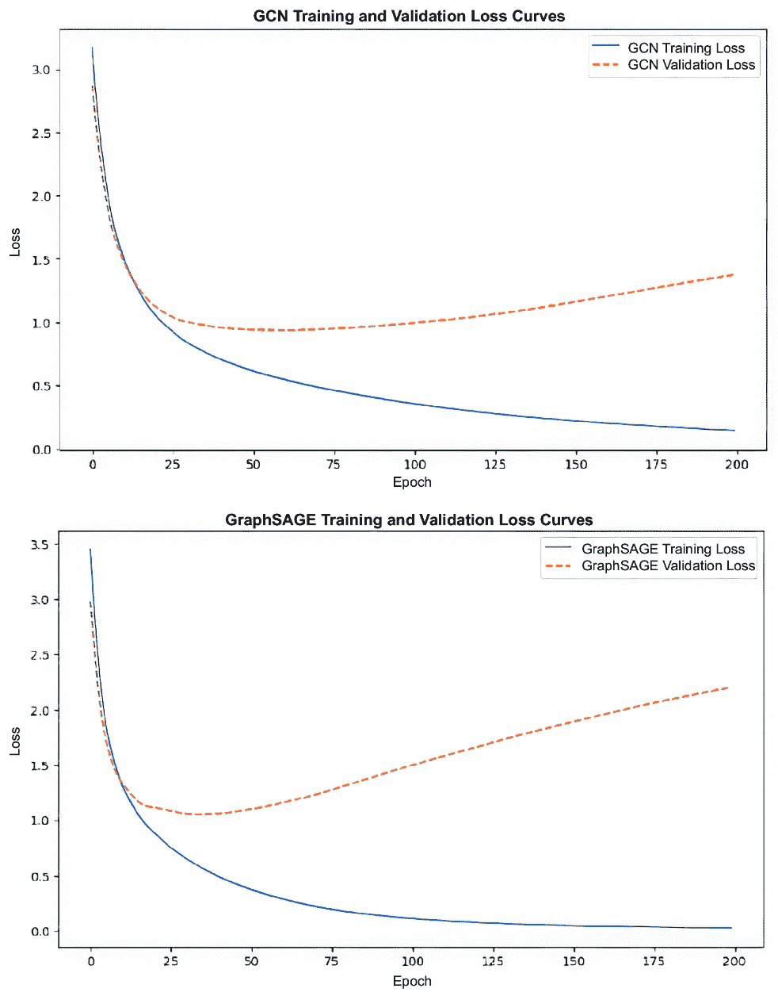

##### 图 3.1 本节训练的 GCN 模型（左）和 GraphSAGE 模型（右）的训练和验证损失曲线。验证损失与训练曲线的偏差表明过拟合，即模型在训练数据上学习得太好，而以泛化到新数据为代价。

在我们的训练过程中，我们保存了表现最佳模型的实例，即具有最低验证损失的那个实例。接下来，我们查看两个分类指标以评估性能：对数损失和 F1 分数。

#### 分类性能：F1 分数和对数损失

鉴于前面显示的过拟合问题，我们转向我们的模型分类性能，以建立改进努力的基准。我们使用验证集来建立 F1 分数和对数损失分数，如表 3.2 所示。（F1 分数是加权的，它分别衡量每个类的 F1 分数，然后取平均值，每个类按其在总数据中的比例进行加权。）

中等的分数表明模型有很大的改进空间。我们的 F1 分数没有超过 80%，而对数损失分数不低于 1.25。

##### 表 3.2 模型按 F1 分数和对数损失的分类性能

|  | F1 分数 | 对数损失 |
| --- | --- | --- |
| GCN  | 0.781  | 1.25  |
| GraphSAGE  | 0.733  | 1.88  |

在这种情况下，GCN 在两个指标上都表现得更好。为了提高多类问题的这些分数，我们可以更深入地研究模型预测单个类别的能力，并检查其在不平衡类别上的表现。

#### 模型在类别层面的性能

亚马逊产品数据集附带两个有用的文件，分别将每个节点与其类别以及每个节点与其单独的亚马逊产品编号（ASIN）映射。为了按类别评估我们基线模型的表现，我们取节点类别信息并创建一个表格，如图 3.2 所示，总结包含最多项目的 25 个类别的预测准确率。

除了准确率之外，在这个表格中，我们还检查了每个类别的最大误判。从这个信息中，让我们做一些高级观察：

+   *按类别性能*—两个模型在不同产品类别上的预测准确率都有所变化。书籍类别和 CD 与黑胶类别具有很高的准确率。这可能是由于它们的相对样本数量较多。这也可能表明这些类别更加独特或定义良好，使得模型更容易区分它们。第一个因素，样本数量，很容易调整，因为我们使用了 10,000 个产品节点，并可以从我们的数据集中提取数百万个。您可以通过调整提供的代码中子集的大小来尝试一下。

为了改进不那么独特的类别，我们需要更深入地探索节点特征，以确定这些类别相对于彼此的独特性，并头脑风暴如何增强这些特征以突出其新颖性。

+   *按模型性能*—查看所有类别后，GraphSAGE 在大多数类别中似乎比 GCN 表现得更好，正如更高的正确预测百分比所示。这表明 GraphSAGE 从节点的邻域聚合特征的方法可能更适用于这个数据集。

+   *误分类*—常见的误分类往往发生在可能具有相似特征或经常一起购买的类别之间。例如，书籍与电影和电视或电子产品与手机及配件之间的误分类表明，这些类别中的项目可能具有重叠的特征，或者经常被相似的客户群体购买。

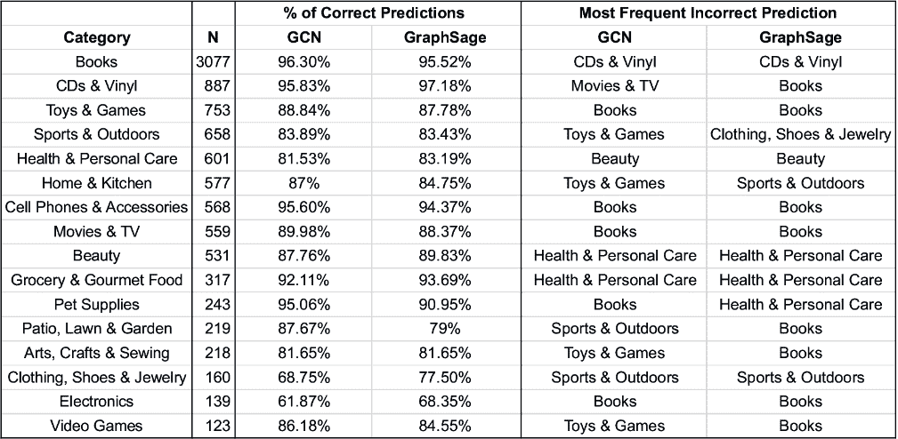

##### 图 3.2 按产品类别分类性能（准确率），比较 GCN 和 GraphSAGE

虽然我们通常不希望出现误分类，但观察最有可能被误认为是另一个类别的类别，可能会告诉我们关于常见客户对产品类别的感知或混淆的信息，突出潜在的市场营销和产品定位策略。

下两个部分将通过利用我们的 GNNs（第 3.2 节）和采用已知的深度学习方法（第 3.3 节）来提高模型性能，从而从这些基线结果中提升。为了结束本节，让我们使用我们的模型为我们的产品经理提出一个产品组合。

### 3.1.5 我们的第一个产品组合

在本节的开始，我们讨论了我们的产品经理使用案例，他希望通过引入产品组合来提高销售额。让我们使用我们新训练的一个模型为给定产品提出一个组合。我们将把与所选节点嵌入最相似的节点分组在一起，根据它们的相似性形成一个组合。在章节的后面，当我们改进模型时，我们将回到这个练习。

注意：在此处不会对代码进行详细审查，但可以在存储库中找到。

#### 节点 ID 到产品编号

亚马逊产品数据集中提供的一个关键文件是一个逗号分隔值（CSV）文件，将节点索引映射到亚马逊产品 ID（ASIN）。在存储库中，这被用来创建一个 Python 字典，将节点 ID（键）映射到 ASIN（值）。使用一个节点的 ASIN，我们可以通过以下格式的 URL 访问有关产品的信息：www.amazon.com/dp/{ASIN}。（鉴于数据集的年龄，一些 ASIN 目前没有网页，但在撰写本文时，我们测试的大多数都有。）

要创建一个产品组合，我们与节点嵌入一起工作。我们选择一个单独的产品节点，然后找到与它最相似的六个产品。这需要四个步骤：

1.  通过运行我们的节点通过我们的训练好的 GNN 来产生节点嵌入。

1.  使用节点嵌入创建一个相似度矩阵。

1.  按相似度对所选产品的顶级嵌入进行排序。

1.  将这些顶级嵌入的节点索引转换为产品 ID。

可以设置一个种子以确保可重复性。否则，每次运行程序的结果都会不同。

#### 产生节点嵌入

与第二章类似，我们通过模型运行我们的节点以产生嵌入而不是预测。与第二章不同，我们有一个为此目的训练好的模型，它已经从我们的数据集的节点特征和共同购买关系中学到了知识。为了完成这个任务，我们将我们的模型置于评估模式（`eval()`），禁用支持反向传播的梯度计算（`no_grad()`），然后通过模型运行图数据的正向传递。在定义模型类的时候，我们启用了一个选项来返回嵌入或预测（`return_embeds`）：

```py
gcn_model.eval()

with torch.no_grad():
     gcn_embeddings = gcn_model(subset_graph.x, \
subset_graph.edge_index, return_embeds=True)
```

#### 创建一个相似度矩阵

相似度矩阵是一组数据，通常以表格形式呈现，包含集合中所有项目对之间的相似性。在我们的案例中，我们使用余弦相似性，并比较我们集合中所有节点的嵌入。SciKit Learn 的`cosine_similarity`函数实现了这一点：

```py
gcn_similarity_matrix = cosine_similarity(gcn_embeddings.cpu().numpy())
```

#### 列出与所选节点最相似的条目

为了识别与特定节点最相似的物品，我们首先选择一个节点——用其索引`product_idx`来指代。使用余弦相似度矩阵，我们通过降序排列相似度来检查每个节点与所选节点的紧密程度。排序中的前几项（具体来说，前六项，其中`top_k`设置为`6`）代表了与所选节点最相似的节点。值得注意的是，这个列表中包括了所选节点本身，因此，出于实用目的，我们考虑接下来的五个节点来有效地创建一个相似物品的捆绑包：

```py
product_idx = 123 
top_k = 6
top_k_similar_indices_gcn = np.argsort(-
gcn_similarity_matrix[product_idx])[:top_k]
```

#### 将节点索引转换为产品 ID

从这里，使用索引到 ASIN 字典，我们可以根据节点索引识别产品捆绑包。完成此操作后，让我们随机选择一个产品节点并围绕它生成一个产品捆绑包。

#### 产品捆绑包演示

随机选择节点#123。使用我们的索引到 ASIN 字典，我们得到 ASIN：B00BV1P6GK。这个 ASIN 属于图 3.3 中所示的产品 Funko POP 电视：*冒险时间*马塞尔琳乙烯基人偶。该产品的类别是玩具与游戏。


##### 图 3.3 我们所选的产品，Funko POP 电视：*冒险时间*马塞尔琳乙烯基人偶。在本节中，将为该产品生成一个产品捆绑包。

马塞尔琳，这位数百岁的吸血鬼女王，是流行动画电视剧《*冒险时间*》中的主要角色之一。马塞尔琳以其摇滚明星形象、对音乐的热爱以及弹奏她的贝斯吉他而闻名，这在她的出场中经常成为焦点。她的形象在雕像中得到了体现，雕像面带微笑，姿势放松但自信。

《*冒险时间*》是一部动画系列，讲述了名叫芬恩的男孩和他的魔法狗杰克在神秘的土地奥兹的奇幻和史诗般的冒险故事，这里充满了公主、吸血鬼、冰王和许多其他奇怪的角色。

对于基于《*冒险时间*》系列的收藏，人们可能会期待一系列代表该节目多元角色阵容的乙烯基人偶。让我们看看我们的系统会生成什么。

使用前面概述的过程，生成了图 3.4 所示的捆绑包。其中包含一个*冒险时间*乙烯基人偶。乍一看，其余的选择似乎无关，但也许这个套装是一个非直观的捆绑包。让我们仔细看看：

+   *排名第一的相似度：Funko POP 电视：*冒险时间*芬恩带配件*——芬恩是《*冒险时间*》的中心角色，这是我们预期的推荐。这表明，马塞尔琳的粉丝可能也会欣赏或收集与该节目其他主要角色相关的商品。

+   *第二相似度排名：Funko My Little Pony：DJ Pon-3 乙烯基人偶*——这个物品乍一看可能显得与上下文不符，但它可能表明对动画系列的跨界兴趣。来自《我的小马驹》的 DJ Pon-3，或称乙烯基 Scratch，是一个像马塞尔琳一样的音乐角色，吸引那些喜欢与音乐相关的角色。

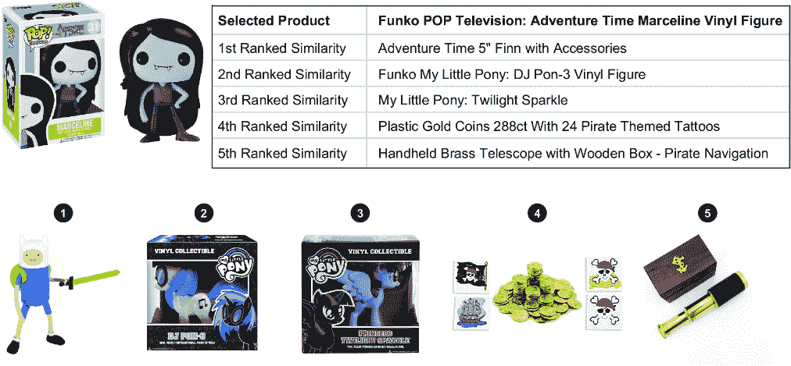

##### 图 3.4 以 Marceline 产品为中心的产品组合。推荐的产品属于玩具与游戏类别。这些产品的主题与所选产品有松散的联系。

+   *第三位相似度：Funko 小马宝莉：暮光闪闪乙烯基人偶*—与 DJ Pon-3 一样，来自 *小马宝莉* 的暮光闪闪代表着与一部流行动画系列的另一种联系。这种包含可能会吸引那些喜欢奇幻主题和强大女性角色的收藏家。

+   *第四和第五位相似度：海盗主题配饰（金币、纹身、手持黄铜望远镜带木盒）*—这些物品与“冒险时间”或“小马宝莉”的直接关联较少，但它们增强了探险和探索的主题，这是这两部系列的重要元素。

总的来说，这是我们基线模型中不错的产品组合！总结本节关于模型训练和评估的介绍，我们现在已经为理解和使用 GNN 建立了一个坚实的基础。这种理解对于我们进入 3.2 节至关重要，在那里我们将更深入地探讨邻域聚合，这是一种有效的工具，可以增强性能。然后，在 3.3 节中，我们将借鉴通用的深度学习方法来进一步优化模型的性能。

## 3.2 聚合方法

在本节中，我们扩展了上一节的产品类别分析，并深入研究了影响 GNN 在产品分类等任务上性能的特征。具体来说，我们探讨了聚合方法，这些方法对卷积 GNN 的性能有重大影响。邻域聚合允许节点从其局部节点邻域收集和整合特征信息，捕捉更大网络中的上下文相关性。

我们从简单的聚合方法开始，包括均值、总和和最大值，这些方法应用于模型的所有层。然后，我们在 PyG 中调查了几种更高级的实现：每层应用的独特聚合、列表聚合、聚合函数以及称为跳跃知识网络（JK-Nets）的层内聚合。最后，我们提供了一些应用这些方法的指导方针。

### 3.2.1 邻域聚合

图数据结构的一种不同之处在于节点通过边相互连接，形成一个节点可以直接链接或由几个度数分隔的网络。这种空间排列意味着任何给定的节点可能与其他某些节点非常接近，形成我们所说的其 *邻域*。节点邻域的概念至关重要，因为它通常包含关于节点特征和整个图的关键见解。

在卷积图神经网络（GNN）中，节点邻域通过称为*邻域聚合*的过程来使用。这项技术涉及收集和组合节点直接邻居的特征信息，以捕捉它们的个体和集体属性。通过这样做，节点的表示被其周围环境提供的上下文信息丰富，这增强了模型在图中学习更复杂和细微模式的能力。

邻域聚合基于这样一个前提：彼此靠近的节点可能比距离较远的节点更可能相互影响。这在节点之间的关系和交互可以预测其行为或属性的任务中特别有利。

#### PyG 中的邻域聚合

在 PyG 层 GCN（`GCNconv`）和 GraphSAGE（`SAGEConv`）中，邻域聚合以不同的方式实现。在 GCN 中，加权平均聚合内置到层中；如果你想要调整它，你必须创建这个层的自定义版本。在本节中，我们将主要关注 GraphSAGE，它允许你通过参数设置聚合。下一节将检查 GCN 中使用的层级聚合。

在`SAGEConv`中，`aggr`参数指定了聚合的类型。选项包括但不限于以下内容：

+   *求和聚合*——一种简单的聚合，将所有邻居节点的特征求和。

+   *均值聚合*——计算邻居节点特征的均值。这通常因其简单性和在平均特征信息方面的有效性而得到应用，有助于平滑数据中的异常值。

+   *最大值聚合*——对于每个特征维度，从所有邻居中取最大特征值。当最显著的特征比平均特征更有信息量时，这有助于捕捉来自邻居的最重要信号。

+   *LSTM 聚合*——一种相对计算和内存密集的方法，使用 LSTM 网络处理邻居节点有序序列的特征。它考虑了节点的序列，这在节点处理顺序影响结果的任务中可能至关重要。因此，必须特别注意安排数据集的节点和边以进行训练。

在这些类型中选择将取决于给定图的特性和预测目标。如果你对哪种方法对你的图和用例更有效没有很好的感觉，可以通过试错来选择聚合方法。此外，虽然一些聚合选项可以即插即用，但其他一些选项——例如依赖于训练好的 LSTM 网络的 LSTM 聚合——在数据准备上需要一些思考。

为了看到不同聚合的效果，我们在模型类中添加了 `aggr` 参数，然后继续按照第 3.1 节中的步骤进行训练，用均值、求和和最大聚合替换。需要注意的是，均值聚合是 `SAGEConv` 层的默认值，因此它与我们的 GraphSAGE 基线模型等效。创建具有聚合的 *GraphSAGE* 类的示例如下。

##### 列表 3.5 带聚合参数的 GraphSAGE 类

```py
class GraphSAGE(torch.nn.Module):
    def __init__(self, in_channels, \
hidden_channels, out_channels, agg_func='mean'):  #1
        super(GraphSAGE, self).__init__()
        self.conv1 = SAGEConv(in_channels, \
hidden_channels, aggr=agg_func)   #2
        self.conv2 = SAGEConv(hidden_channels, \
out_channels, aggr=agg_func)   #3

    def forward(self, x, edge_index):
         x = self.conv1(x, edge_index)
         x = F.relu(x)
         x = self.conv2(x, edge_index)

    return F.log_softmax(x, dim=1)
```

#1 设置聚合的关键字参数

#2 指定聚合的第一层 GraphSAGE

#3 指定聚合的第二层 GraphSAGE

#### 使用均值、最大值和求和聚合的结果

表 3.3 比较了使用 F1 分数和对数损失作为性能指标的不同模型。表中显示，使用最大聚合的模型在两个指标下都是最好的。使用最大聚合的模型结果显示 F1 分数最高为 0.7449，对数损失最低为 2.1039，这表明最大聚合在识别和使用预测任务中最具影响力的特征方面略胜一筹。使用均值聚合的模型等同于第 3.1 节中训练的模型。我们观察到最大聚合优于其他两种聚合。总体而言，使用不同聚合的性能与我们的基线 GraphSAGE 模型非常相似。

##### 表 3.3 不同邻域聚合设置下 GraphSAGE 模型的分类性能

| 聚合类型 | F1 分数 | 对数损失 |
| --- | --- | --- |
| 均值（默认） | 0.7406 | 2.1214 |
| 求和 | 0.7384 | 2.2496 |
| 最大值 | 0.7449 | 2.1039 |

如果单独的模型在 F1 分数和对数损失上都有最高分，应该选择哪个模型？例如，如果最大聚合模型在 F1 分数上得分最高，而均值聚合模型在对数损失上得分最高，这将取决于你应用的上下文、预测的要求以及潜在错误的后果。

在医疗保健情况下，例如预测患者出院后 30 天内的再入院，模型的选择可以显著影响患者结果和资源分配。具有高 F1 分数的模型将具有更平衡的精确度和召回率，在漏诊再入院可能代价高昂或危险的情况下表现更好。它预计会识别出更多处于风险中的患者，从而允许及时干预。然而，这也可能导致更高的假阳性，导致不必要的治疗和成本增加。

另一方面，具有低对数损失的模型对其预测有很高的信心，它优先考虑每个预测的准确性，而不是检测到的阳性案例数量。这种模型在资源分配需要精确或治疗方案有显著副作用时非常有用。

回到我们的产品经理，他正在决定将营销资金分配给哪些产品和产品组合，更可靠的预测将有助于防止营销努力的浪费。降低假阳性的可能性有助于高效地使用资源，但同时也存在因保守预测而错过一些能带来收入的组合配置的风险。

在本节中，我们使用了简单的字符串参数`aggr`。然而，PyG 有一套广泛的工具，可以将各种聚合方法纳入你的模型。我们将在下一节中探讨这些工具。

### 3.2.2 高级聚合工具

本节探讨了 PyG 中更高级的聚合工具。我们首先将不同的聚合方法分配给多层架构中的不同层。接下来，我们探索了在单个层中组合各种聚合策略——如`'mean'`、`'max'`和`'sum'`——的可能性。最后，我们回顾 GCNs 以检查跳跃知识（JK）方法。

#### 在层间使用多个聚合

在多层 GraphSAGE 模型中，你当然可以在每个层独立地调整聚合函数。例如，你可能会在第一层使用平均聚合来平滑特征，但在后续层切换到最大聚合以突出显示最显著的邻居特征。

作为探索的第一步，让我们将几种聚合排列应用于两层，看看这些配置是否优于我们之前的结果。我们使用之前的代码，将`aggr`设置从`conv1`和`conv2`中替换出来。对于一种模型，我们在第一层使用`mean`，在第二层使用`max`。对于另一种模型，我们在第一层使用`sum`，在第二层使用`max`。表 3.4 总结了结果。

##### 表 3.4 不同邻域聚合设置下的 GraphSAGE 模型分类性能

| 聚合类型 | F1 分数 | 对数损失 |
| --- | --- | --- |
| 平均值（默认） | 0.7406 | 2.1214 |
| 求和 | 0.7384 | 2.2496 |
| 最大值 | 0.7449 | 2.1039 |
| 层次化：平均值 → 最大值 | 0.7316 | 2.2041 |
| 层次化：求和 → 最大值 | 0.7344 | 2.345 |

对于我们的数据集，我们的结果最多是中等。只有最大聚合的模型优于新模型。让我们继续为每个层组合多个聚合。

#### 列表聚合和聚合函数

在 PyG 中，使用列表指定聚合函数的概念允许你同时使用多种聚合策略来定制你的模型。这个特性很重要，因为它使模型能够使用图数据的各个方面，通过捕捉图的多种属性来提高模型性能。从某种意义上说，你是在聚合你的聚合。例如，你可以在单个层中结合`'mean'`、`'max'`和`'sum'`聚合，以捕捉邻域的平均、最显著和总和的结构属性。

这在 PyG 中通过将聚合函数的列表（可以是字符串或`Aggregation`模块实例）传递给`MessagePassing`类来实现。PyG 将这些字符串与预定义的聚合函数集进行解析，或者可以直接将聚合函数作为`aggr`参数使用。例如，使用关键字`'mean'`将调用`MeanAggregation()`函数。

有无数种组合可以尝试，但让我们尝试两个示例来演示，混合熟悉的聚合，`'max'`，`'sum'`和`'mean'`；以及一组更奇特的聚合，`SoftmaxAggregation`和`StdAggregation`[3]。它们可以应用于我们的`conv1`层，如下所示（表 3.5 比较了这些结果与之前的结果）：

```py
       self.conv1 = SAGEConv(in_channels,\
 hidden_channels, aggr=['max', 'sum', 'mean'])

       self.conv1 = SAGEConv(in_channels,\
 hidden_channels, aggr=[SoftmaxAggregation(),\
 StdAggregation() ])
```

##### 表 3.5 添加列表聚合的 GraphSAGE 模型的分类性能

| 聚合类型 | F1 分数 | 对数损失 |
| --- | --- | --- |
| 平均（默认） | 0.7406  | 2.1214  |
| 求和  | 0.7384  | 2.2496  |
| 最大值  | 0.7449  | 2.1039  |
| 层次：平均→最大值  | 0.7316  | 2.2041  |
| 层次：求和→最大值 | 0.7344  | 2.345  |
| 列（标准） | 0.7484  | 2.622  |
| 列（奇特） | 0.745  | 2.156  |

图 3.5 可视化了表 3.5 中的性能比较。虽然 F1 分数非常相似，但“标准”列表聚合在 F1 分数上略有提升，尽管代价是更高的对数损失。


##### 图 3.5 从表 3.5 中可视化的性能比较。虽然 F1 分数非常相似，但标准列表聚合在对数损失方面表现略好。

给定我们对这些聚合方法应用于 GraphSAGE 层的快速调查结果，你可能会得出结论，坚持默认设置通常是最佳选择。然而，通过定制聚合策略提高性能的潜力表明，进一步的探索可能是有益的。

在即将到来的 3.2.3 节中，我们将回顾应用这些聚合方法时的一些考虑因素。在那之前，我们将回到 GCN 层来检查 JK 聚合方法。

#### 跳跃知识网络

*跳跃知识*（JK）是一种在图上进行节点表示学习的新方法，它解决了现有模型（如 GCNs 和 GraphSAGE）的局限性[4]。它专注于克服邻域聚合模型的问题，即模型对图结构敏感，导致不同图部分的学习质量不一致。

跳跃知识网络（JK-Nets）允许对每个节点灵活地使用不同的邻域范围，从而适应局部邻域属性和特定任务的要求。这种适应通过使模型能够根据节点和子图上下文有选择地使用不同邻域深度的信息，从而提高了节点表示。JK 已在 PyG 的 GCN 层中实现，如列表 3.6 所示。

它的主要参数`mode`指定了用于组合不同层输出的聚合方案。选项如下：

+   `'cat'`—沿着特征维度连接所有层的输出。这种方法保留了每一层的所有信息，但增加了输出的维度性。

+   `'max'`—在层输出上应用最大池化。这种方法对每个特征在所有层中取最大值，这有助于从图中捕获最重要的特征，同时对于不太有信息性的信号具有鲁棒性。

+   `'lstm'`—使用双向 LSTM 为每一层的输出学习注意力分数。然后根据这些学习到的注意力权重进行输出组合，允许模型根据输入图结构动态地关注最相关的层。

##### 列表 3.6 带有`JumpingKnowledge`层的 GCN 类

```py
class CustomGCN(torch.nn.Module):
   def __init__(self, in_channels, hidden_channels, out_channels):
       super(CustomGCN, self).__init__()
       self.conv1 = GCNConv(in_channels, hidden_channels)
       self.conv2 = GCNConv(hidden_channels, out_channels)

       self.jk = JumpingKnowledge(mode='cat')  #1

   def forward(self, x, edge_index):
       layer_outputs = []  #2

       x1 = self.conv1(x, edge_index)
       x1 = F.relu(x1)
       layer_outputs.append(x1)  #3

       x2 = self.conv2(x1, edge_index)
       layer_outputs.append(x2) 

       x = self.jk(layer_outputs)  #4

       return x
```

#1 使用连接模式初始化 JK

#2 列表用于保存 JK 的每一层输出

#3 将层输出列表附加到

#4 对收集到的层输出应用 JK 聚合

在列表中，对于初始化，`JumpingKnowledge`层被初始化为模式设置为`'cat'`（连接），表示每一层的特征将被连接以形成最终的节点表示。

在前向传递中，`layer_outputs`被初始化为一个空列表，用于存储每个卷积层的输出。这个列表将被`JumpingKnowledge`层使用。

+   第一个卷积层处理输入`x`和图结构`edge_index`，并应用 ReLU 激活函数以引入非线性。

+   首层的输出（`x1`）随后被添加到`layer_outputs`列表中。

+   在第二个卷积层之后，第二个输出（`x2`）也被添加到`layer_outputs`列表中。

+   然后，`JumpingKnowledge`层接受所有先前层的输出列表，并根据指定的模式（`'cat'`）进行聚合。在连接模式下，每个层的特征向量沿着特征维度进行连接。

表 3.6 比较了 GCN 模型的分类性能。第 3.1 节中的基线 GCN 模型与使用`JumpingKnowledge`聚合方法的版本进行比较。基线模型具有更好的 F1 分数，而 JK 模型在 log 损失方面表现更优。

##### 表 3.6 GCN 模型的分类性能

| 模型 | F1 分数 | Log 损失 |
| --- | --- | --- |
| 基线 GCN  | 0.781  | 1.42  |
| JK (GCN)  | 0.699  | 1.36  |

结果显示，在基线版本和 JK 版本之间进行选择涉及在更高的召回率/精确度和更高的预测确定性之间进行权衡。这种权衡应根据任务的具体要求和目标仔细考虑。第 3.2.3 节将进一步探索有效应用这些聚合方法的考虑因素。

### 3.2.3 应用聚合的实际考虑因素

选择合适的聚合方法是一个技术决策，应基于手头数据集的具体特征和需求以及用例。对于局部邻域结构至关重要的数据集，使用平均或求和聚合可能会模糊关键特征。相比之下，最大聚合可以帮助突出关键属性。例如，在一个关键人物检测至关重要的社交网络图中，最大聚合可能更有效。另一方面，如果我们想要表示典型特征，最大聚合可能会过分强调异常值。在一个我们想要了解典型用户行为的金融交易数据集中，最大聚合可能会扭曲常见的用户行为特征，以有利于一两个大但不太常见的交易。

任务本身可以决定聚合方法的选择。需要捕捉最有影响力特征的任务可能从最大聚合中受益，而需要一般表示的任务可能发现平均聚合足够。在一个产品推荐系统中，最大聚合可以帮助识别驱动购买的最重要产品特征。此外，图拓扑的性质应指导聚合方法。密集连接的图可能需要与稀疏连接的图不同的策略，以避免过度平滑或节点特征的欠表示。例如，具有不同节点连接性的交通网络图可能在不同层需要不同的聚合。

由于数据集的复杂性，对不同的聚合方法进行实证测试是必不可少的。实验可以帮助确定哪些方法最能捕捉数据集的关系动态和特征分布。这对于更复杂的聚合方法尤为重要，在这些方法中，仅凭直觉可能不足以确定其有效性。所选聚合方法的可扩展性，以高效处理数百万个节点和边，也是至关重要的。在实时应用（如推荐系统）中，平衡计算效率与方法复杂性尤为重要。

在考虑其他模型增强方法（如特征工程、节点嵌入技术和正则化策略以解决过拟合和改善模型泛化）的同时，应考虑聚合方法。例如，将有效的聚合方法与高级嵌入技术（例如 Node2Vec）相结合或引入 dropout 进行正则化，可以显著提高模型性能。

虽然没有一种适合所有情况的聚合方法，但经过实证验证的深思熟虑的技术组合可以显著提高模型性能和适用性。这种战略方法不仅有助于准确的产品分类，还有助于构建有效的推荐系统，这在电子商务环境中至关重要。

本节探讨了并应用了不同的聚合方法到我们的模型中。下一节将通过应用正则化和调整我们模型的深度来完善我们对卷积 GNNs 的探索。我们将把我们的改进整合到一个最终模型中，然后基于 Marceline 小雕像生成另一个产品捆绑，以查看是否有改进。

## 3.3 进一步优化和改进

到目前为止，GCN 和 GraphSAGE 层是通过产品管理示例引入的。我们在 3.1 节中使用了默认设置建立了基线。在 3.2 节中，我们考察了使用邻域和层聚合的方法。在本节中，我们将考虑其他我们可以用来改进和优化我们的模型的方法。在前几小节中，我们将介绍两种其他调整：使用 dropout 和模型深度。Dropout 是一种众所周知的正则化技术，可以减少过拟合，而模型深度是对 GNNs 具有独特意义的调整。

在 3.3.3 节中，我们综合这些见解来开发一个包含多个改进的模型，并观察累积的性能提升。最后，在 3.3.4 节中，我们重新审视我们的产品捆绑问题。我们使用 3.3.3 节中精炼的模型创建一个新的产品捆绑，并将其性能与 3.1 节中创建的捆绑进行比较。

### 3.3.1 Dropout

*Dropout* 是一种正则化技术，通过在训练过程中随机丢弃单元来防止神经网络过拟合。这有助于模型更好地泛化，因为它减少了模型对特定神经元的依赖。

在 PyG 中，`dropout`函数的工作方式与标准的 PyTorch dropout 相似，这意味着在训练过程中，它会随机将输入张量和隐藏层激活的一些元素设置为`0`。在训练过程中的每次前向传递中，根据指定的 dropout 率，输入和激活被设置为`0`。这有助于通过确保模型不会过度依赖任何特定的输入或激活来防止过拟合。

图的结构，包括其顶点（节点）和边，在 dropout 过程中保持不变。图的拓扑结构得到保留，只有神经网络的激活受到影响。这种区别至关重要，因为它在仍然使用 dropout 来提高模型鲁棒性的同时，保持了图的完整性。PyG 确实有函数可以在训练过程中删除节点或边，但内置在`GCNConv`和`SAGEConv`中的 dropout 指的是传统的深度学习 dropout。

在 PyG 中，GraphSAGE 和 GCN 层都使用 `dropout` 率作为参数，默认值为 0。图 3.6 展示了具有不同 dropout 率（0%、50% 和 85%）的 GCN 模型的性能。如图所示，更高的 dropout 率可以帮助减轻过拟合，这可以从训练损失和验证损失之间的差距减小中看出。对于 85% 的情况，更高的 dropout 率可能会导致模型收敛速度变慢，或者这可能是一个过拟合的迹象。需要进行更多测试来确定。

接下来，让我们来探讨模型深度及其在卷积图神经网络（GNNs）中的实现方式。

### 3.3.2 模型深度

在 GNNs 中，*层* 指的是跳跃或消息传递步骤的数量。每一层允许节点从其直接邻居中聚合信息，有效地通过每一层增加一个跳跃的感知场。例如，一个三层模型会查询每个节点三个跳跃之外的邻域。因此，GNN 的 *深度* 指的是网络中的层数，类似于传统深度学习模型中的深度，但由于图结构数据的关键差异而有所不同。

如果一个 GNN 层数过少，它可能无法从图中捕获足够的信息，导致较差的表示学习，因为每个节点只能从有限的邻域中聚合信息。相反，增加层数可能导致 *过度平滑*，节点特征变得过于相似，难以区分不同的节点。随着每增加一层，节点从更大的邻域中聚合信息，稀释了单个节点的独特特征。已经提出了各种指标和方法来衡量和减轻这种影响。


##### 图 3.6 三种不同 dropout 水平的模型训练曲线比较。左侧的 dropout 为 0%，中间为 50%，右侧为 85%。对于我们的模型和数据集，添加 dropout 确实改善了过拟合。具有 85% dropout 的模型可能显示出欠拟合或收敛缓慢的迹象，需要更多的实验。

不同深度的 GNNs 的性能可能会有显著差异。通常，具有 2 或 3 层的 GNNs 在许多任务上表现竞争力，在满足足够邻域信息需求的同时，不会导致过度平滑。虽然更深层的 GNNs 从理论上可以捕捉更复杂的模式，但它们通常会受到过度平滑和计算复杂度增加的影响。非常深的 GNNs，例如具有 50 层或更多层的，可能会导致更高的验证损失，这表明过拟合和/或过度平滑。

图 3.7 比较了不同深度 GNN 的性能（例如，2 层、10 层和 50 层）。我们看到 2 层模型在训练和验证损失之间取得了良好的平衡。在 10 层 GNN 中，我们看到了训练损失的改进，但也出现了来自更高验证损失的过平滑迹象。50 层模型显示训练和验证损失下降，这表明存在严重的过平滑或过拟合。

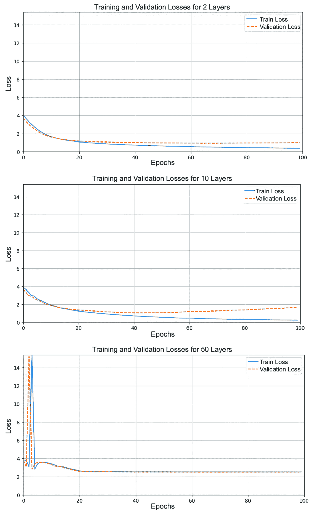

##### 图 3.7 不同深度训练模型的训练曲线：2 层（顶部），10 层（中间），50 层（底部）。2 层模型具有最佳性能，没有过拟合或性能下降的迹象。

在 GNN 中实现最佳性能的关键在于平衡模型的深度。层数过少可能导致弱表示学习，而层数过多可能导致过平滑，节点特征变得难以区分。在下一节中，我们将应用本章中关于调整模型所学到的东西，从而得到一个优于基线的优化模型。

### 3.3.3 提高基线模型的性能

在本章获得的所有洞察的基础上，让我们训练合成这些学习的模型，并将它们与基线进行比较。以下是我们将在此处包含的一些关键要点：

+   *模型深度*—我们将将其保持在较低水平，即两层。

+   *邻域聚合*—我们将使用最大聚合并尝试两种列表聚合。相同的聚合将应用于两层。

+   *Dropout*—我们将对两层都使用 50% dropout。

下面的列表显示了一个具有可调整 dropout、层深度和聚合的 GraphSAGE 类。

##### 列 3.7 GraphSAGE 类

```py
class GraphSAGEWithCustomDropout(torch.nn.Module):
   def __init__(self, in_channels, \
hidden_channels, out_channels, num_layers, \
dropout_rate=0.5, aggr='mean'):  #1
       super(GraphSAGEWithCustomDropout, self).__init__()
       self.layers = torch.nn.ModuleList\
([SAGEConv(in_channels, hidden_channels, aggr=aggr)])
       for _ in range(1, num_layers-1):  #2
           self.layers.append(SAGEConv\
(hidden_channels, hidden_channels, aggr=aggr))
       self.layers.append(SAGEConv\
(hidden_channels, out_channels, aggr=aggr))
       self.dropout_rate = dropout_rate

   def forward(self, x, edge_index):
       for layer in self.layers[:-1]:
           x = F.relu(layer(x, edge_index))
           x = F.dropout(x, p=self.dropout_rate, training=self.training)
       x = self.layers-1
       return F.log_softmax(x, dim=1)
```

#1 层初始化时使用层数、dropout 率和聚合类型。

#2 循环将聚合应用于每一层。

我们使用前面的类训练了三个模型：

```py
model_1 = GraphSAGEWithCustomDropout\
(subset_graph.num_features, 64, \
dataset.num_classes, 2, dropout_rate=.5, \
aggr= ‘max’).to(device)

model_2 = GraphSAGEWithCustomDropout\
(subset_graph.num_features, 64, \
dataset.num_classes, 2, dropout_rate=0.5, \
aggr=['max', 'sum', 'mean']).to(device)

model_3 = GraphSAGEWithCustomDropout\
(subset_graph.num_features, 64, \
dataset.num_classes, 2, dropout_rate=0.50,\
 aggr=[SoftmaxAggregation(), \
StdAggregation() ] ).to(device)
```

表 3.7 总结了不同聚合方法和默认平均值聚合的 GraphSAGE 模型的性能。结果表明，所有改进的模型在 F1 分数和 log loss 方面都优于基线。值得注意的是，使用 `'max'`、`'sum'` 和 `'mean'` 聚合组合的模型 2 实现了最高的 F1 分数 0.8828。模型 3 使用 `SoftmaxAggregation()` 和 `StdAggregation()` 的组合，在 0.5764 的最佳 log loss 下表现最佳，这表明它在测试配置中具有最高的预测确定性。

##### 表 3.7 使用 50% dropout 和不同聚合类型的两层 GraphSAGE 模型

| GraphSAGE 模型 | 聚合类型 | F1 分数 | Log Loss |
| --- | --- | --- | --- |
| 模型 1  | `'max'`  | 0.8674  | 0.594  |
| 模型 2  | `['max', 'sum', 'mean']`  | 0.8876  | 0.660  |
| 模型 3  | `[SoftmaxAggregation(), StdAggregation()]`  | 0.8829  | 0.574  |
| 基线模型 | 平均值（默认） | 0.7406  | 2.1214  |

图 3.8 中的混淆矩阵可视化了使用最大聚合的模型 1 的分类性能。大多数值都在对角线上，表明模型正确分类了大多数实例。然而，也存在非对角线元素，代表错误分类，例如，将类别 0 的实例错误分类为类别 1 或反之亦然。这些错误分类的频率和分布突出了模型在哪些方面存在困难。此外，使用侧边栏上的条形图表示每个类别的成员数量，混淆矩阵显示了这些不同类别的分布情况。有些类别的计数较高，而其他类别的计数则显著较低，这表明数据集中存在类别不平衡。

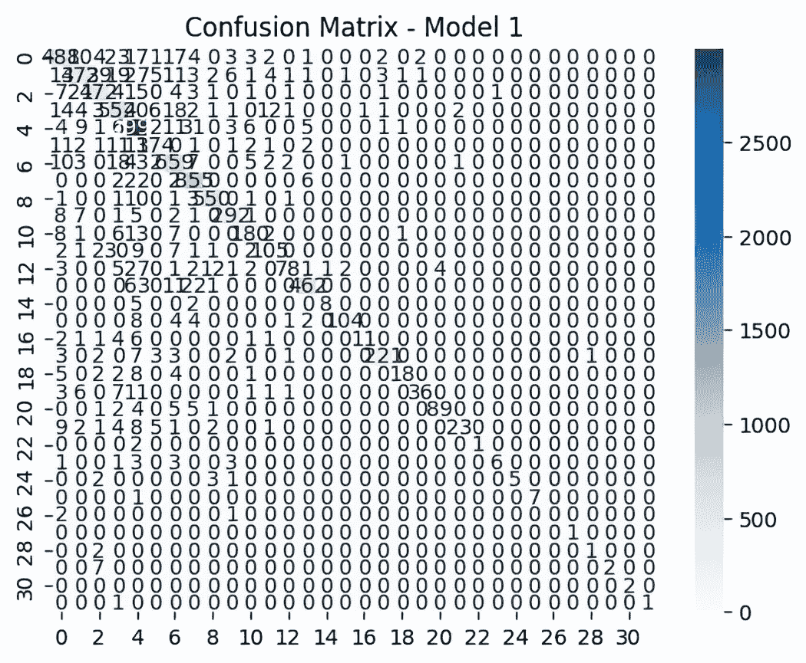

##### 图 3.8 展示了具有 50%丢弃率和最大聚合的两层 GraphSAGE 模型的混淆矩阵。强烈的对角线模式表明分类性能良好。侧边栏给出了类别的分布，突出了类别不平衡。

注意，在这整个过程中，我们只使用了数据集节点中不到 1%的部分，这些节点是任意按照索引顺序选择的。增加节点的数量将提高我们模型的表现。此外，在保持节点数量不变的同时，以更有意义的方式选择子图也可以提高性能。

虽然当前的模型显示出显著的改进，但还可以考虑其他几种策略来进一步提高性能。通过使用更大的子集来增加数据集的大小可以提供更多的训练数据，从而可能提高模型的泛化能力。根据领域知识细化子图选择或使用图采样技术可以确保使用更有意义的数据进行训练。使用 Hyperopt 等工具系统地调整超参数可以帮助找到模型的最佳设置。Hyperopt 允许使用贝叶斯优化等算法高效地搜索超参数空间。探索更复杂的聚合函数或针对数据集特定特征的定制聚合也可以带来改进。此外，实现正则化方法，如 L2 正则化或梯度裁剪，可以稳定训练并防止过拟合。图预处理技术，如归一化、特征工程和图特征的降维，可以提高输入数据的质量，进一步提升模型性能。接下来，我们将选择在日志损失上表现最高的模型来生成另一个产品包。

### 3.3.4 重访 Marcelina 产品包

模型在 3.1 节中的基线模型上有了显著改进。让我们重新审视产品捆绑问题，并根据前面章节中改进的 GraphSAGE 模型为我们的产品经理推荐一个方案。使用 3.1.5 节中的过程得到的捆绑方案如图 3.9 所示，并与原始捆绑方案进行了比较。

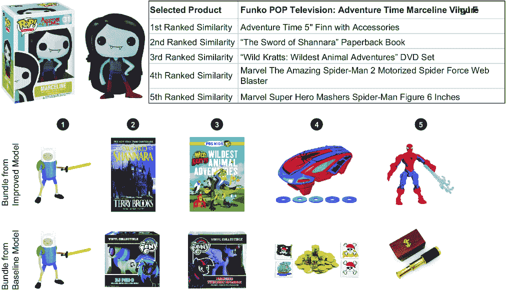

##### 图 3.9 以 Marceline 产品为中心的产品捆绑。上面的捆绑方案来自 3.3.3 节的改进模型，而下面的捆绑方案来自 3.1.5 节的基线模型。新的推荐方案是玩具与游戏、书籍和电影与电视类别的成员。

您对这款新套餐有何看法？这是否是一个改进，也就是说，比之前的套餐更有可能推动购买？这个新套餐包含了玩具与游戏、书籍和电影与电视类别的商品，这是一个多样化的产品选择。在冒险书籍《沙纳拉之剑》和动作人偶的旁边引入《野生克鲁特：最野的动物冒险》DVD，反映了向更家庭化和儿童友好的产品组合的转变。

这个新套餐推动购买的可能性基于对客户购买行为和偏好的更新模型所捕捉到的更深入的理解。这个套餐似乎非常适合送礼目的，既满足了流行文化纪念品收藏者（例如 Marceline 人偶和相关收藏品）的需求，也满足了年轻奇幻和冒险叙事粉丝的需求。

从更通用的玩具集合转向一个专注的、主题导向的捆绑方案可能会增加其作为购买吸引力的可能性。除了收藏品（如 Marceline 人偶和相关收藏品）之外，还包括娱乐（《野生克鲁特：最野的动物冒险》DVD）和文学（《沙纳拉之剑》）元素，提供了一个围绕流行的冒险和探索主题的更全面的娱乐体验。这可能吸引那些寻找有吸引力和主题礼物，同时也提供教育价值的父母，例如《野生克鲁特》中关于动物和自然的内容。

考虑到一个精心策划的套餐的心理效应是至关重要的。通过将产品与已识别的客户兴趣和交叉销售模式更紧密地对齐，这个套餐不仅满足了现有需求，而且通过增强捆绑商品之间的互补性，提高了感知价值，从而鼓励了额外的购买。

最终，关于这个新捆绑包是否比原始版本有所改进的决定，应该通过客户反馈和销售数据进行验证。跟踪两个捆绑包（以及由人类产品经理建议的捆绑包）的销售表现，并通过调查或 A/B 测试收集直接客户洞察，将有助于定量评估哪个捆绑包在销售和客户满意度方面表现更好。这种数据驱动的方法将证实新捆绑包创建中使用的先进建模技术的理论优势。

通过这一点，我们结束了本章的动手产品示例。接下来的两个部分是可选的，因为它们深入探讨了卷积 GNN 的理论，并更详细地研究了 Amazon 产品数据集。

## 3.4 内部机制

现在我们已经创建并改进了一个工作的卷积 GNN，让我们更深入地研究 GNN 的元素，以更好地理解它们是如何工作的。这种知识有助于我们在设计新的 GNN 或调试 GNN 时。

在第二章中，我们介绍了使用 GNN 层通过消息传递来生成预测或创建嵌入的想法。这是那个架构图再次呈现，如图 3.10 所示。

让我们深入到 GNN 层的表面之下，检查其元素。然后，我们将将其与聚合函数的概念联系起来。

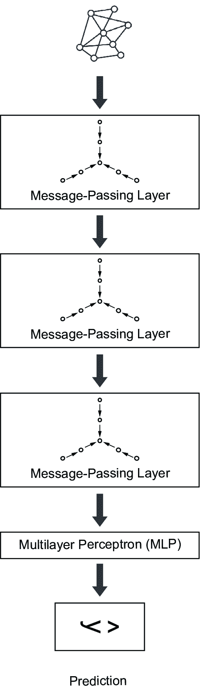

##### 图 3.10 来自第二章的节点嵌入架构图

### 3.4.1 卷积方法

让我们首先考虑深度学习中最受欢迎的架构之一，卷积神经网络（CNN）。CNN 通常用于计算机视觉任务，如分割或分类。可以将 CNN 层视为对输入数据应用一系列操作的序列：

层：滤波器 → 激活函数 → 池化

每个整个层的输出是一些经过变换的数据，这使得某些下游任务更容易或更成功。这些变换操作包括以下内容：

+   *滤波器（或核操作）*——一种变换输入数据的过程。滤波器用于突出输入数据的一些特定特征，并包含通过目标或损失函数优化的可学习权重。

+   *激活函数*——应用于滤波器输出的非线性变换。

+   *池化*——一种减少后续学习任务中滤波器输出大小的操作。

CNNs 和许多 GNNs 有一个共同的基础：卷积的概念。当讨论 CNN 中使用的三个操作时，你了解了卷积的概念。在 CNNs 和 GNNs 中，卷积都是通过在数据中建立*局部模式的层次结构*来学习的。对于 CNNs，这可以用于图像分类，而卷积 GNN，如 GCN，可能使用卷积来预测节点的特征。为了强调这一点，CNNs 将卷积应用于固定像素网格以识别网格中的模式。GCN 模型将卷积应用于节点图以识别图中的模式。

我在上一个段落中提到了卷积的概念，因为卷积可以以不同的方式实现。从理论上讲，卷积与数学上的卷积算子相关，我们将在稍后更详细地讨论这一点。对于 GNNs，卷积可以分为空间和频谱方法[1, 5, 6]：

+   *空间*—在图上滑动一个窗口（过滤器）。

+   *频谱*—使用频谱方法过滤图信号。

#### 空间方法

在传统的深度学习中，卷积过程通过将一个称为*卷积核*的特殊过滤器应用于输入数据来学习数据表示。这个内核的大小小于输入数据，并且通过在其上移动来应用。这如图 3.11 所示，我们应用我们的卷积核（中间的矩阵）到一只狮子的图像上。由于我们的卷积核的所有非中心元素都有负值，结果图像已经被反转。我们可以看到一些特征被强调，例如狮子的轮廓。这突出了卷积的过滤方面。


##### 图 3.11 输入图像的卷积（左侧）。内核（中间）在动物图像上移动，从而得到输入图像的特定表示（右侧）。在深度学习过程中，过滤器的参数（矩阵中的数字）是学习参数。

这种卷积网络的使用在计算机视觉领域尤为常见。例如，当在 2D 图像上学习时，我们可以应用几层的简单 CNN。在每一层中，我们通过每个图像传递一个 2D 过滤器（内核）。3 × 3 的过滤器在一个比其大得多的图像上多次工作。通过这种方式，我们可以通过连续的层产生输入图像的学习表示。

对于图，我们希望应用这种在数据上移动窗口的相同想法，但现在我们需要调整以考虑我们数据的关联和非欧几里得拓扑。对于图像，我们处理的是刚性的二维网格；对于图，我们处理的是没有固定形状或顺序的数据。在没有预定义图节点顺序的情况下，我们使用*邻域*的概念，包括一个起始节点及其所有一跳邻居（即从中心节点出发的一跳范围内的所有节点）。然后，我们的滑动窗口通过移动节点的邻域在图上移动。

在图 3.12 中，我们看到一个比较卷积应用于网格数据和应用于图数据的插图。在网格情况下，像素值在围绕中心像素（用灰色点标记）的九个像素周围被过滤。然而，对于图，节点属性是基于可以通过一条边连接的所有节点进行过滤的。一旦我们确定了将要考虑的节点，我们然后需要对节点执行某些操作。这被称为*聚合操作*；例如，一个邻域中所有节点权重可能被平均或求和，或者我们可能取最大值。对于图来说，重要的是这个操作是*置换不变的*。节点的顺序不应该很重要。

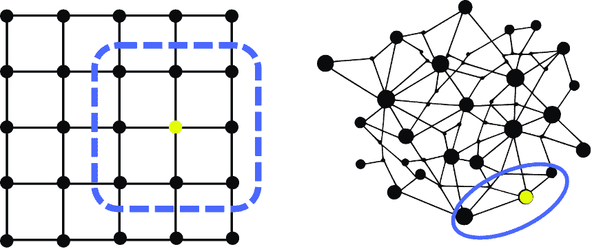

##### 图 3.12 在网格数据（左；例如，二维图像）和图（右）上应用卷积的比较。

#### 频谱方法

为了介绍卷积的第二种方法，让我们考察图信号[6]的概念。在信息处理领域，*信号*是可以考察时间或频率域的序列。当在时间域研究信号时，我们考虑其动态性，即它是如何随时间变化的。从频率域来看，我们考虑信号中有多少位于每个频率带内。

我们也可以以类似的方式研究图的信号。为此，我们定义图信号为节点特征的向量。因此，对于给定的图，其节点权重集可以用来构建其信号。作为一个视觉示例，在图 3.13 中，我们有一个与每个节点相关联的值的图，其中每个相应的条的高度代表某些节点特征。


##### 图 3.13 图的顶点上的随机正图信号。每个垂直条的高度代表条形起始节点的信号值。

要操作这个图信号，我们将图信号表示为一个矩阵，其中每一行是与特定节点相关联的一组特征。然后，我们可以在图矩阵上应用信号处理操作。一个关键操作是傅里叶变换。傅里叶变换可以将图信号及其节点特征集表示为频率表示。相反，逆傅里叶变换将频率表示转换回图信号。

#### 除此之外：传统深度学习方法在图上的局限性

为什么我们不能直接将 CNN 应用于图结构？原因是图表示具有图像表示所不具备的歧义。CNN 以及传统的深度学习工具通常无法解决这种歧义。能够处理这种歧义的神经网络被称为**排列等变**或**排列不变**。

让我们通过考虑之前展示的狮子图像来阐述图与图像之间的歧义。这个像素集的简单表示是一个二维矩阵（具有高度和宽度的维度）。这种表示将是唯一的：如果我们交换图像的两行或两列，我们不会得到一个等效的图像。同样，如果我们交换图像矩阵表示中的两列或两行（如图 3.14 所示），我们也不会得到一个等效的矩阵。


##### 图 3.14 狮子的图像是唯一的（左）。如果我们交换两列（右），我们最终得到一个与原始图像不同的独特照片。

对于图来说，情况并非如此。图可以通过邻接矩阵（在第一章和附录 A 中描述）来表示，其中每一行和每一列的元素代表两个节点之间的关系。如果一个元素非零，这意味着行节点和列节点是相连的。给定这样一个矩阵，我们可以重复我们之前的实验，并像处理图像那样交换两行。与图像的情况不同，我们最终得到一个代表我们最初图的矩阵。我们可以进行任意数量的排列或交换行和列，并得到一个代表相同图的矩阵。

回到卷积操作，为了成功地将卷积滤波器或 CNN 应用于图的矩阵表示，这样的操作或层必须无论邻接矩阵的顺序如何都能得到相同的结果（因为每种顺序都描述了相同的事物）。CNN 在这方面失败了。

找到可以应用于图的卷积滤波器已经以多种方式解决了。在本章中，我们考察了两种实现方式：空间方法和频谱方法。（对于卷积滤波器应用于图的更深入讨论和推导，请参见[7]。）

### 3.4.2 消息传递

空间和频谱方法都描述了我们可以如何将我们的图上的数据结合起来。空间方法关注图的结构，并在空间邻域间组合数据。频谱方法关注图信号，并使用信号处理方法，例如傅里叶变换，来在图上组合数据。这两种方法都隐含了消息传递的概念。

在第三章中，我们介绍了消息传递作为一种从我们的图中提取更多信息的方法。让我们一步一步地考虑消息传递做了什么。首先，从每个节点或边收集消息。其次，我们将这些消息转换为特征向量来编码数据。最后，我们将节点或边数据更新以包含这些消息。结果是，每个节点或边最终包含个别数据以及图中其他部分的数据。编码在这些节点中的数据量反映了跳数或消息传递步骤的数量。这与 GNN 中的层数相同。在图 3.15 中，我们展示了消息传递的心理模型。


##### 图 3.15 消息传递层的元素。每个消息传递层由一个聚合步骤、一个转换步骤和一个更新步骤组成。

每个消息传递层的输出是一组嵌入或特征。在聚合步骤中，我们从图邻域收集消息。在转换步骤中，我们将神经网络应用于聚合消息。最后，在更新步骤中，我们改变节点或边的特征以包含消息传递数据。

以这种方式，一个 GNN 层类似于一个 CNN 层。它可以被解释为一系列应用于输入数据的操作：

层：聚合 → 转换 → 更新

在我们探索本书中的不同 GNN 时，我们将回到这一组操作，因为大多数类型的 GNN 都可以被视为这些元素的修改。例如，在本章中，你正在学习 GCN 作为一种特定的聚合类型。在下一章中，你将学习 GATs，它通过学习如何使用注意力机制聚合消息来结合转换和聚合步骤。

要构建这个消息传递步骤，让我们逐步分析前面的过程，并添加更多细节。前两个步骤可以理解为一种过滤器，类似于传统神经网络的第一个步骤。首先，我们使用我们的**聚合算子**对节点或边数据进行聚合。例如，我们可能对特征求和、平均特征或选择最大值。最重要的是，节点的顺序对于最终表示不应该很重要。顺序不应该很重要的原因是，我们希望我们的模型是排列等变的，这意味着减法或除法可能不合适。

一旦我们从所有节点或收集了所有消息，我们就通过传递新的消息通过神经网络和激活函数将它们转换成**嵌入**。一旦我们有了这些转换后的嵌入，我们就应用激活函数，然后将它们与节点或边数据和之前的嵌入结合起来。

激活函数是对转换和聚合消息应用的非线性变换。我们需要函数是非线性的；否则，无论有多少层，模型都会是线性的，类似于线性（或在我们的情况下是逻辑回归）模型。这些是在人工神经网络中使用的标准激活函数，例如 ReLU，它是零和输入值之间的最大值。池化步骤随后减少了任何图级学习任务中滤波器输出的总体大小。对于节点预测，这可以省略，我们在这里就是这样做的。

我们可以将前面的描述组合成一个消息传递操作的单一表达式。首先，让我们假设我们正在使用节点嵌入，正如我们将在本章中所做的那样。我们希望将节点 *n* 的数据转换成节点嵌入。我们可以使用以下公式来完成：

##### (3.1)

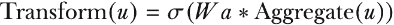

在这里，*u* 代表节点。可学习的权重由 *W*[a] 给出，这些权重将根据损失函数进行调整，而 *σ* 是激活函数。为了构建嵌入，我们需要将所有节点数据组合成一个单一的向量。这就是聚合函数发挥作用的地方。对于 GCN，聚合操作符是求和。因此，

##### (3.2)

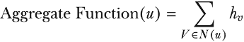

其中，对于节点 *u*，*h*[v]是节点 *u* 邻域中节点 *v* 的数据，*N(u)*。结合这两个方程，我们可以构建一个构建节点嵌入的一般公式：

##### (3.3)

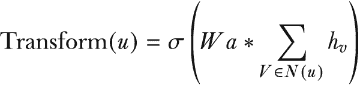

对于前面的公式，我们看到节点及其邻域起着核心作用。确实，这是 GNN 证明非常成功的主要原因之一。我们还看到，我们需要在激活函数和聚合函数上做出选择。最后，这些更新包括每个节点上的先前数据：

##### (3.4)

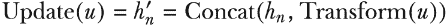

在这里，我们将消息连接在一起。也可以使用其他方法来更新消息信息，选择取决于所使用的架构。

这个更新方程是消息传递的本质。对于每一层，我们使用包含所有 *聚合* 消息的 *转换* 数据来 *更新* 所有节点数据。如果我们只有一个层，我们只执行一次这个操作，我们正在从起始节点的一跳邻居中聚合信息。如果我们运行多次迭代这些操作，我们将中央节点两跳内的节点聚合到节点特征数据中。因此，GNN 层的数量直接关联到我们用模型询问的邻域大小。

这些是消息传递步骤中执行的操作的基本原则。聚合或激活函数等事物的变化突出了 GNN 架构中的关键差异。

### 3.4.3 GCN 聚合函数

GCN 与 GraphSAGE 之间的关键区别在于它们执行不同的聚合操作。GCN 是一种基于谱的 GNN，而 GraphSAGE 是一种空间方法。为了更好地理解这两种方法之间的区别，让我们看看如何实现它们。

首先，我们需要了解如何将卷积应用于图。从数学上讲，卷积操作可以表示为两个函数的组合，产生第三个函数

##### (3.5)

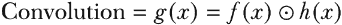

其中 *f*(*x*) 和 *h*(*x*) 是函数，运算符表示逐元素乘法。在 CNN 的上下文中，图像和核矩阵是方程 3.6 中的函数：

##### (3.6)


这种数学运算被解释为核在图像上滑动，就像滑动窗口方法一样。我们可以将前面的描述转换为描述我们数据的矩阵或张量。为了将方程 3.7 的卷积应用于图，我们使用以下成分：

+   图的矩阵表示：

    +   向量 **x** 作为图信号

    +   邻接矩阵 **A**

    +   拉普拉斯矩阵 **L**

    +   拉普拉斯算子的特征向量矩阵 **U**

+   权重的参数化矩阵 **H**

+   基于矩阵操作的傅里叶变换：**U**^T**x**

这导致了在图上的频谱卷积的表达式：

##### (3.7)


因为这个操作不是简单的逐元素乘法，所以我们使用符号 *[G] 来表达这个操作。几个基于卷积的 GNN 基于方程 3.8；接下来，我们将检查 GCN 版本。

GCN 对卷积方程（3.8）进行了修改，以简化操作并降低计算成本。这些修改包括使用基于多项式的滤波器而不是一组矩阵，并限制跳数为一跳。这将从二次复杂度降低到线性复杂度，这是一个显著的改进。然而，需要注意的是，GCN 更新了我们之前描述的聚合函数。这仍然使用求和，但包括一个归一化项。

之前，聚合算子是求和。这可能导致节点度数变化大的图中的问题。如果一个图中包含度数高的节点，这些节点将占主导地位。为了解决这个问题，一种方法是用平均值代替求和。聚合函数随后表示为

##### (3.8)


因此，对于 GCN 消息传递，我们有

##### (3.9)


其中

+   *h* 是更新的节点嵌入。

+   sigma, *σ*, 是应用于每个元素的非线性（即激活函数）。

+   W 是一个训练好的权重矩阵。

+   |*N*| 表示图节点集合中元素的数量

求和因子，

##### (3.10)


是一种特殊的正则化，称为**对称正则化**。此外，GCN 包括自环，使得节点嵌入包含邻域数据和起始节点的数据。因此，要实现 GCN，必须发生以下操作：

+   调整图节点以包含自环

+   训练权重矩阵和节点嵌入的矩阵乘法

+   正则化操作是对称正则化项的总和

在图 3.16 中，我们详细解释了消息传递步骤中使用的每个术语。

到目前为止，这些都是理论上的。接下来，让我们看看如何在 PyG 中实现这些操作。

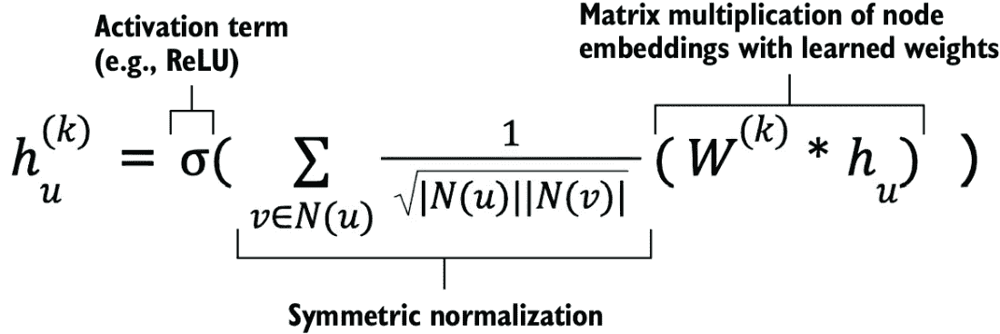

##### 图 3.16 GCN 嵌入公式中关键计算操作的映射

### 3.4.4 PyTorch Geometric 中的 GCN

在 PyG 文档中，您可以找到实现 GCN 层的源代码，以及 GCN 层的简化实现。以下，我们将指出源代码如何实现前面的关键操作。

在表 3.8 中，我们将 GCN 嵌入计算中的关键步骤分解，并将其与源代码中的函数关联。这些操作通过类和函数实现：

+   函数`gcn_norm`执行正则化和向图中添加自环。

+   类`GCNConv`实例化 GNN 层并执行矩阵操作。

##### 表 3.8 GCN 嵌入公式中的关键计算操作映射

| 操作 | 函数/方法 |
| --- | --- |
| 向节点添加自环 | `gcn_norm()`，列表 3.8 中的注释 |
| 乘以权重和嵌入 *W*^(^(*k*)^)*h*[u] | `GCNConv.__init__`; `GCNConv.forward` |
| 对称正则化 | `gcn_norm()`，列表 3.8 中的注释 |

在列表 3.8 中，我们详细展示了`gcn_norm`函数和类的代码，并使用注释突出关键操作。这个正则化函数是 GCN 架构的关键方面。`gcn_norm`的参数如下：

+   `edge_index`—节点表示以张量或稀疏张量形式存在。

+   `edge_weight`—一个可选的一维边权重数组。

+   `num_nodes`—这是输入图的维度。

+   `improved`—这引入了从 Graph U-Nets 论文[8]中引入的添加自环的替代方法。

+   `Add_self_loops`—添加自环是默认操作，但它是可选的。

##### 列表 3.8 `gcn_norm`函数

```py
def gcn_norm(edge_index, edge_weight=None, num_nodes=None, improved=False,
             add_self_loops=True, dtype=None):  #1

   fill_value = 2\. **if** improved **else** 1\.  #2

   **if** isinstance(edge_index, SparseTensor):  #3
       adj_t = edge_index
       **if** not adj_t.has_value():
           adj_t = adj_t.fill_value(1., dtype=dtype)
       **if** add_self_loops:
           adj_t = fill_diag(adj_t, fill_value)
       deg = sparsesum(adj_t, dim=1)
       deg_inv_sqrt = deg.pow_(-0.5) 
       deg_inv_sqrt.masked_fill_(deg_inv_sqrt == float('inf'), 0.)
       adj_t = mul(adj_t, deg_inv_sqrt.view(-1, 1))
       adj_t = mul(adj_t, deg_inv_sqrt.view(1, -1))
       **return** adj_t

   **else**: 
       num_nodes = maybe_num_nodes(edge_index, num_nodes)

       **if** edge_weight is None:
           edge_weight = torch.ones((edge_index.size(1), ), dtype=dtype,
                                    device=edge_index.device)

       **if** add_self_loops:
           edge_index, tmp_edge_weight = add_remaining_self_loops(
               edge_index, edge_weight, fill_value, num_nodes)
           **assert** tmp_edge_weight is not None
           edge_weight = tmp_edge_weight

       row, col = edge_index[0], edge_index[1]
       deg = scatter_add(edge_weight, col, dim=0, dim_size=num_nodes)
       deg_inv_sqrt = deg.pow_(-0.5)
       deg_inv_sqrt.masked_fill_(deg_inv_sqrt == float('inf'), 0)
       **return** edge_index, deg_inv_sqrt[row] * edge_weight * deg_inv_sqrt[col]
```

#1 对输入图执行对称正则化，并在输入图中添加自环

#2 fill_value 参数用于替代自环操作。

#3 如果图输入是稀疏张量，则 if 语句中的第一块代码将应用。否则，将应用第二块。

在实践中，我们可以通过使用 PyTorch 和 PyG 的一些函数来显著简化归一化的实现。在列表 3.9 中，我们展示了归一化邻接矩阵的简短版本。首先，我们计算每个节点的入度，然后计算逆平方根。然后我们使用这个逆平方根来创建新的边权重，并将基于度数的逆平方根应用于这个权重。最后，我们创建一个表示邻接矩阵的稀疏张量，并将其分配给我们的数据。

##### 列表 3.9 使用 PyTorch 和 PyG 进行归一化

```py
    edge_index = data.edge_index
    num_nodes = edge_index.max().item() + 1  #1

    deg = torch.zeros(num_nodes, \
    dtype=torch.float).to(edge_index.device)       #2
    deg.scatter_add_(0, edge_index[1],            
                 torch.ones(edge_index.size(1))\
.to(edge_index.device))                           

    deg_inv_sqrt = deg.pow(-0.5)  #3
    deg_inv_sqrt[deg_inv_sqrt == float('inf')] = 0   #3

    edge_weight = torch.ones(edge_index.size(1))\
    .to(edge_index.devic)  #4
    edge_weight = deg_inv_sqrt[edge_index[0]]*edge_weight*\
    deg_inv_sqrt[edge_index[1]]  #5

    num_nodes = edge_index.max().item() + 1   #6

    adj_t = torch.sparse_coo_tensor(indices=edge_index,\
    values=edge_weight, size=(num_nodes, num_nodes))      #7
    data.adj_t = adj_t.coalesce()                         #7
```

#1 假设节点索引从 0 开始

#2 计算每个节点的入度

#3 计算基于度的逆平方

#4 创建一个新的边权重张量

#5 将逆平方根应用于边权重

#6 假设节点索引从 0 开始

#7 创建一个稀疏张量并将其分配给数据

在下面的列表中，我们提供了 `GCNConv` 类的摘录，该类调用了 `gcn_norm` 函数以及矩阵操作。

##### 列表 3.10 `GCNConv` 类

```py
class GCNConv(MessagePassing):    

    def __init__(self, in_channels: int, out_channels: int,
improved: bool = False, cached: bool = False,
        add_self_loops: bool = True, normalize: bool = True,
        bias: bool = True, **kwargs):    

        self.lin = Linear(in_channels, out_channels, bias=False,
                         weight_initializer='glorot')
    def forward(self, x: Tensor, edge_index: Adj,
                edge_weight: OptTensor = None) -> Tensor:

if self.normalize:  #1
    if isinstance(edge_index, Tensor):
        cache = self._cached_edge_index
            if cache is None:
                edge_index, edge_weight = gcn_norm( 
                edge_index, edge_weight, x.size(self.node_dim),
                self.improved, self.add_self_loops)
                if self.cached:
                    self._cached_edge_index = (edge_index, edge_weight)
                else:
                    edge_index, edge_weight = cache[0], cache[1]

        x = self.lin(x)  #2

        out = self.propagate(edge_index, x=x,\
 edge_weight=edge_weight, size=None)  #3

        **if** self.bias is not None:  #4
            out += self.bias

        **return** out
```

#1 前向传播函数执行对称归一化，给定两种选择之一：输入图是一个张量或稀疏张量。这里包含了张量输入的源代码。

#2 节点特征矩阵的线性变换

#3 消息传播

#4 输出可选的加性偏置。

### 3.4.5 光谱卷积与空间卷积

在上一节中，我们讨论了两种解释卷积的方式：(1) 通过在由链接节点局部邻域组成的图的一部分上滑动窗口滤波器的思维实验，以及(2) 通过滤波器处理图信号数据。我们还讨论了这两种解释如何突出了卷积 GNN 的两个分支：空间方法和光谱方法。滑动窗口和其他空间方法依赖于图的几何结构来执行卷积。相反，光谱方法使用图信号滤波器。

光谱方法和空间方法之间没有明确的界限，通常一种类型可以解释为另一种类型。例如，GCN 的一个贡献是证明了其光谱推导可以以空间方式解释。然而，在撰写本文时，空间方法更受欢迎，因为它们有更少的限制，并且通常具有更低的计算复杂度。我们在表 3.9 中突出了光谱和空间方法的附加方面。

##### 表 3.9 光谱卷积与空间卷积方法的比较

| 光谱 | 空间 |
| --- | --- |
| 操作：使用图的特征值进行卷积 | 操作：在节点邻域中聚合节点特征 |

| • 必须是无向的 • 操作依赖于节点特征

• 通常计算效率更低

| • 不需要是无向的 • 操作不依赖于节点特征

• 通常计算效率更高

|

### 3.4.6 GraphSAGE 聚合函数

GraphSAGE 通过限制聚合操作中使用的邻居节点数量来改进 GCN 的计算成本。相反，GraphSAGE 从邻居的随机样本中进行聚合。聚合算子更加灵活（例如，可以是求和或平均值），但现在考虑的消息只是所有消息的一个子集。从数学上讲，我们可以将其表示为

##### (3.11)

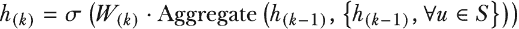

其中 Ɐ*u* ϵ *S* 表示邻居是从总邻居的随机样本 *S* 中选择的。从 GraphSAGE 论文[2]中，我们有通用的嵌入更新过程，该过程在论文中作为算法 1 介绍，此处以图 3.17 的形式重现。


##### 图 3.17 算法 1，GraphSAGE 嵌入生成算法，来自 GraphSAGE 论文[2]

该算法的基本原理可以描述如下：

1.  对于每一层/迭代以及每个节点：

    1.  聚合邻居的嵌入。

    1.  将邻居嵌入与中心节点连接起来。

    1.  将该连接与权重矩阵相乘。

    1.  将该结果与激活函数相乘。

    1.  应用归一化。

1.  使用节点嵌入 h 更新节点特征 z。

让我们更详细地看看这将对消息传递步骤意味着什么。我们已将 GraphSAGE 的消息传递定义为如下：

##### (3.12)

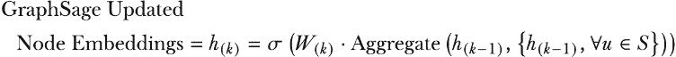

如果我们选择平均值作为聚合函数，则变为

##### (3.13)

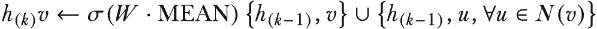

对于实现，我们可以进一步将其简化为

##### (3.14)

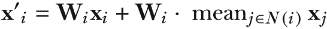

其中 *x'*[i] 表示生成的中心节点嵌入，而 *x*[i] 和 *x*[j] 分别是中心节点和邻居节点的输入特征。权重矩阵应用于中心节点和邻居节点，如图 3.18 所示，但只有邻居节点具有聚合算子（在这种情况下，平均值）。


##### 图 3.18 GraphSAGE 嵌入公式中的关键计算操作映射

我们现在已经看到了 GraphSAGE 算法的所有主要特性。接下来，让我们看看如何在 PyG 中实现它。

### 3.4.7 PyTorch Geometric 中的 GraphSAGE

在表 3.10 中，我们分解了 PyG 的 GraphSAGE 类中的关键操作及其发生的位置。关键操作包括邻居嵌入的聚合、节点邻居嵌入与节点嵌入的连接、权重与连接的乘法以及激活函数的应用。

##### 表 3.10 GCN 嵌入公式中的关键计算操作映射

| 操作 | 函数/方法 |
| --- | --- |
| 聚合邻居的嵌入（求和、平均值或其他）。 | `SAGEConv.message_and_aggregate` |
| 将邻居嵌入与中心节点的嵌入连接起来。 | `SAGEConv.forward` |
| 将该连接与权重矩阵相乘。 | `SAGEConv.message_and_aggregate` |
| 应用激活函数。  | 如果`project`参数设置为`True`，则在`SAGEConv.forward`中完成  |
| 应用归一化。  | `SAGEConv.forward`  |

对于 GraphSAGE，PyG 还提供了在`SAGEConv`类中实现此层的源代码，以下列出其中的一些摘录。

##### 列表 3.11 GraphSAGE 类

```py
class SAGEConv(MessagePassing):
…
   def forward(self, x, edge_index, size):

        if isinstance(x, Tensor):
            x: OptPairTensor = (x, x)

       if self.project and hasattr(self, 'lin'):  #1
           x = (self.lin(x[0]).relu(), x[1])

       out = self.propagate(edge_index, x=x, size=size)  #2
       out = self.lin_l(out)  #2
       x_r = x[1]  #3

       **if** self.root_weight and x_r is not None:  #4
           out += self.lin_r(x_r)  #4

       **if** self.normalize:  #5
           out = F.normalize(out, p=2., dim=-1)  #5
       **return** out

   **def** message(self, x_j):
       **return** x_j

   **def** message_and_aggregate(self, adj_t, x):
       adj_t = adj_t.set_value(None, layout=None)  #6
       **return** matmul(adj_t, x[0], reduce=self.aggr)  #6
…
```

#1 如果 project 参数设置为 True，则将对邻居节点应用带有激活函数（在这种情况下为 ReLU）的线性变换。

#2 传播消息并应用线性变换

#3 将根节点分配给一个变量

#4 如果 root_weight 参数设置为 True 且存在根节点，则将转换后的根节点特征添加（连接）到输出中。

#5 如果 normalize 参数设置为 True，则将对输出特征应用 L2 归一化。

#6 使用聚合的矩阵乘法。设置 aggr 参数建立聚合方案（例如，平均值、最大值、lstm；默认为 add）。adj_t 是输入的稀疏矩阵表示；使用这种表示可以加快计算速度。

## 3.5 亚马逊产品数据集

在本章和第五章中，我们使用亚马逊产品数据集[9]。该数据集探讨了产品关系，特别是共同购买，即在同一交易中购买的产品。这种共同购买数据是预测节点和边的方法的基准数据集。在本节中，我们提供了关于数据集的一些更多信息。

为了说明共同购买的概念，在图 3.19 中，我们展示了六个在线客户的共同购买示例图像。对于每个产品，我们包括一张图片、一个纯文本产品标签和一个粗体文本类别标签。

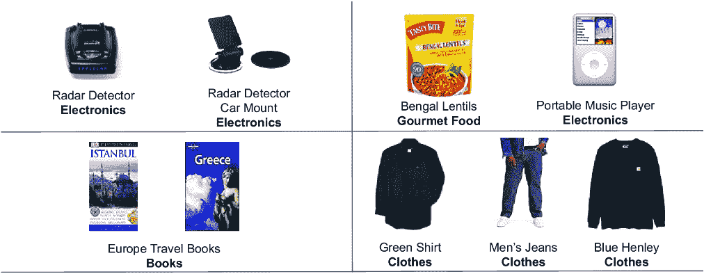

##### 图 3.19 亚马逊.com 上的共同购买示例。每个产品由一张图片、一个纯文本产品标题和一个粗体文本产品类别表示。我们看到一些共同购买的产品是彼此的明显互补，而其他分组则不那么明显。

其中一些共同购买组似乎很好地结合在一起，例如书籍购买或服装购买。其他共同购买则不太容易解释，例如购买苹果 iPod 与即食餐食一起，或者购买豆类与无线扬声器一起。在这些不太明显的分组中，可能存在一些潜在的产品关系，或者可能只是纯粹的巧合。在规模上检查数据可以提供线索。

为了展示共同购买图在小规模上的外观，图 3.20 取了前一个图中的一个图像，并将产品表示为节点，它们之间的边代表每次共同购买。对于一个客户和一次购买，这是一个小图，只有四个节点和六条边。但对于同一个客户随着时间的推移，对于有相同口味的一组客户，甚至所有客户，很容易想象这个图如何随着更多产品和产品连接从这些少数产品中分支出来而扩展。

构建这个数据集本身就是一个漫长的旅程，这对于图构建以及为了得到一个有意义和有用的数据集所必须做出的决策非常感兴趣。简单来说，这个数据集是从亚马逊的购买日志数据中提取的，这些数据直接显示了共同购买的情况，以及从产品评论中的文本数据，这些数据被用来间接展示产品关系。（关于详细的故事，参见[8]）。

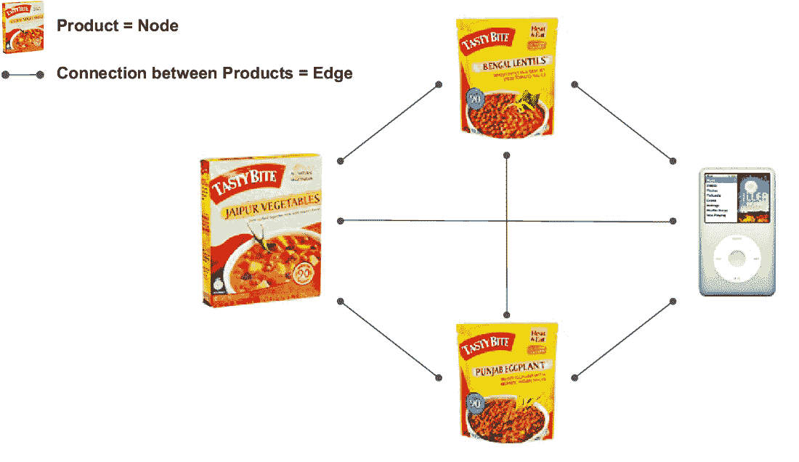

##### 图 3.20 图 3.19 中一次共同购买的一个图表示。每个产品的图片是一个节点，共同购买是产品之间的边（以线条表示）。对于这里显示的四个产品，这个图只是单个客户的共同购买图。如果我们展示亚马逊所有客户的对应图，产品节点和共同购买边的数量可能达到数万个产品节点和数百万条共同购买边。

为了探索产品关系，我们可以使用亚马逊产品共同购买图，这是一个包含在同一交易中一起购买的产品数据集（定义为共同购买）。在这个数据集中，产品由节点表示，这些节点既有购买的产品类型，即分类标签，还有一些特征信息。特征信息首先将产品描述应用自然语言处理（NLP）方法，即词袋算法，将字符串转换为数值。然后，为了将其转换为相同的固定长度，数据集的创建者使用了主成分分析（PCA）将其转换为长度为 100 的向量。

同时，共同购买由边表示，这指的是一起购买的两个产品。总的来说，`ogbn-products`数据集包含 250 万个节点（产品）和 6190 万个边（共同购买）。这个数据集是通过本章开头提到的开放图基准（OGB）数据集提供的，并获得了亚马逊的使用许可。每个节点有 100 个特征。有 47 个类别被用作分类任务的目标。我们注意到这里的边是无向和无权的。

在图 3.21 中，我们看到节点数量最多的类别是书籍（668,950 个节点）、CD 和黑胶（172,199 个节点）以及玩具和游戏（158,771 个节点）。最少的类别是家具和装饰（9 个节点）、数字音乐（6 个节点）以及一个未知类别（#508510）有 1 个节点。

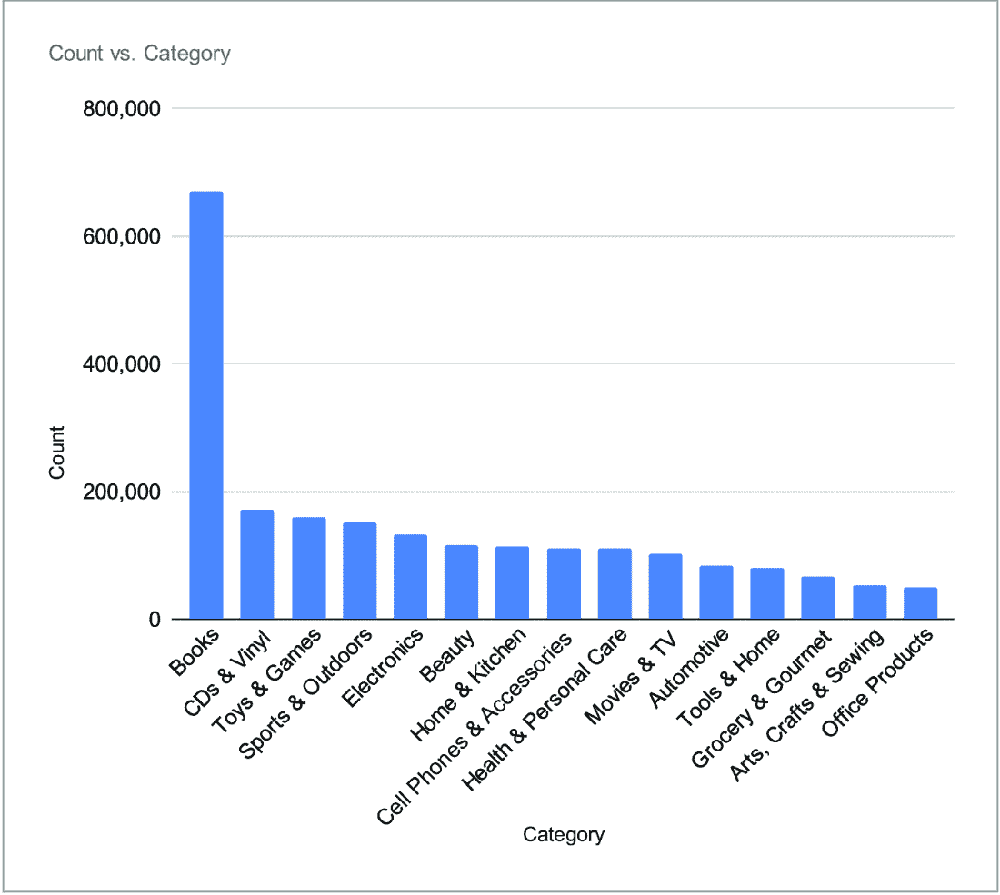

##### 图 3.21 亚马逊产品数据集中节点标签的分布

我们还观察到，在数据集中许多类别的比例非常低。每个标签/类别的节点平均计数为 52,107；中位数为 3,653。这突显出我们的数据集中存在强烈的类别不平衡。这可能会对典型的表格结果构成挑战。

在本章中，我们探讨了图卷积网络（GCNs）和 GraphSAGE 的基本原理，这两种强大的架构用于在图结构数据上学习。我们使用亚马逊产品数据集将这些模型应用于实际的产品分类问题，展示了如何实现、训练和优化 GNNs。我们还深入研究了这些模型的理论基础，考察了诸如邻域聚合、消息传递以及频谱和空间卷积方法之间的区别。通过将实际操作与理论洞察相结合，本章为理解并应用卷积 GNNs 到现实世界的图学习任务提供了一个全面的基石。在下一章中，我们将研究一种特殊的卷积 GNN，它使用注意力机制，即图注意力网络（GAT）。

## 摘要

+   GCNs 和 GraphSAGE 是使用卷积的 GNNs，分别通过空间和频谱方法进行。

+   这些 GNNs 可以用于监督学习和半监督学习问题。我们将它们应用于预测产品类别的半监督问题。

+   亚马逊产品数据集`ogbn-products`由一组产品（节点）组成，这些产品通过同一交易中的购买（共同购买）相互连接。每个产品节点都有一个特征集，包括其产品类别。这个数据集是图分类问题的流行基准。我们还可以研究它是如何构建的，以获得关于图创建方法的见解。

+   根据领域知识选择子图或使用图采样技术可以确保使用更有意义的数据进行训练。这可以通过关注图的关联部分来提高模型的性能。

+   不同的聚合方法，如平均值、最大值和总和，对模型性能有不同的影响。通过实验多种聚合策略可以帮助捕捉图数据的各种属性，从而可能提高模型性能。

+   探索更复杂的聚合函数或针对数据集特定特征的定制聚合可以带来性能提升。例如包括`SoftmaxAggregation`和`StdAggregation`。

+   在图神经网络（GNNs）中，深度与跳跃次数或消息传递步骤的数量相当。虽然更深层次的模型在理论上可以捕捉更复杂的模式，但它们通常会受到过度平滑的影响，节点特征变得过于相似，这使得区分不同节点变得困难。

+   对不同的聚合方法和模型配置进行实证测试是至关重要的。实验有助于确定哪些方法最能捕捉数据集的关系动态和特征分布。
