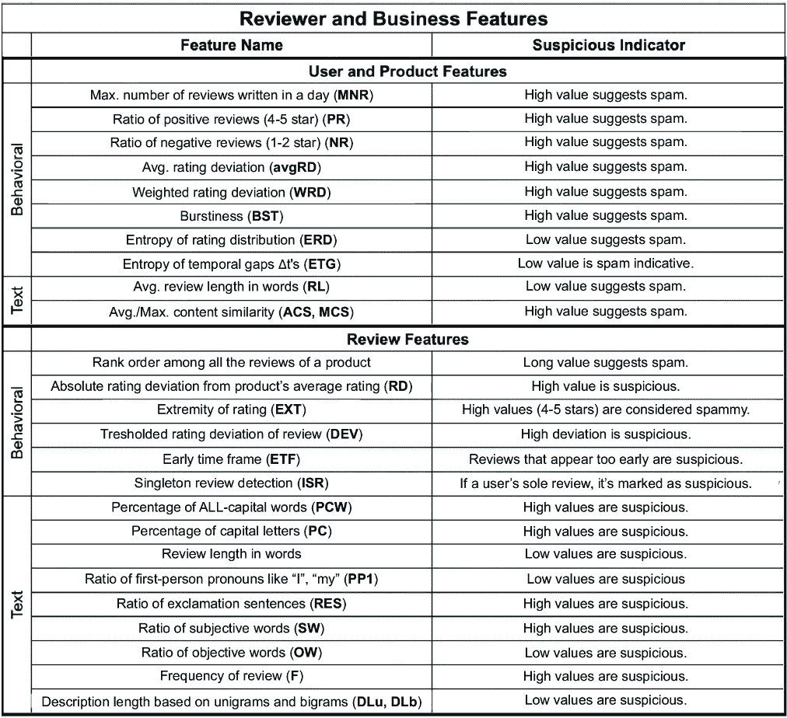
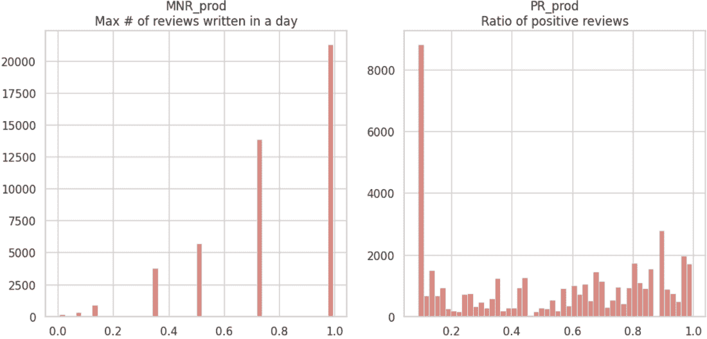
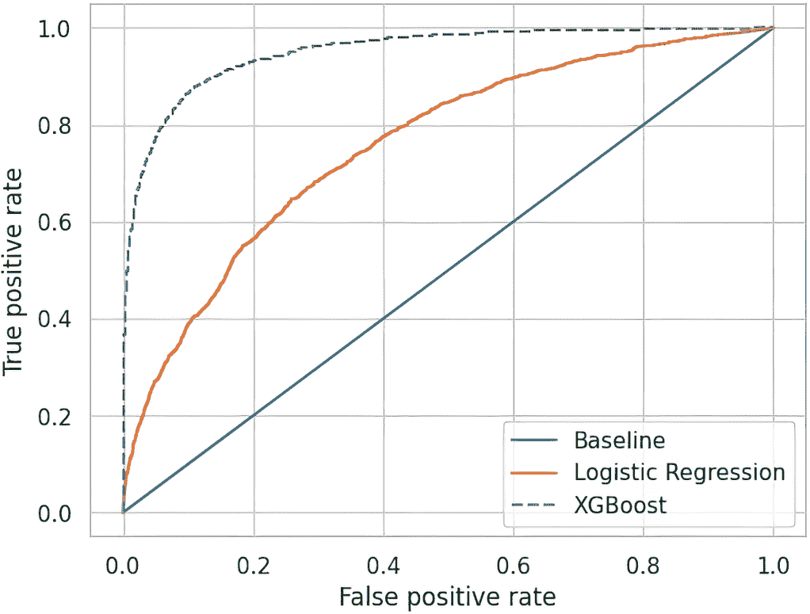
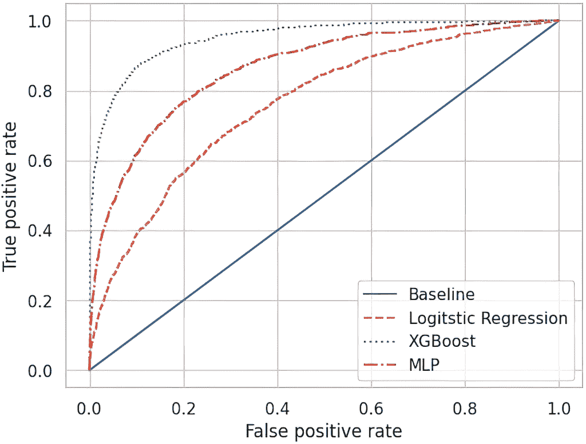
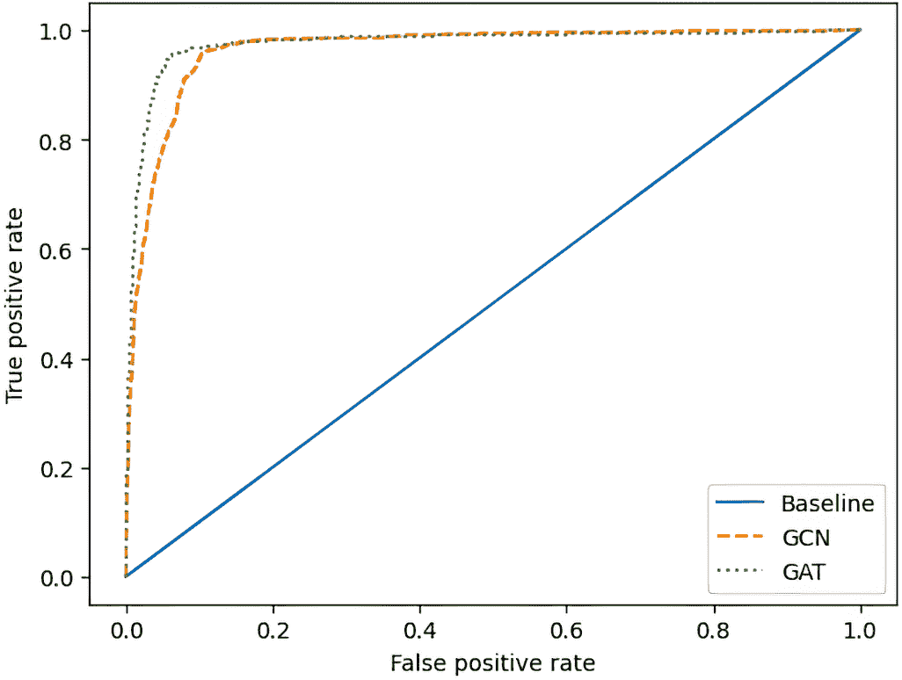
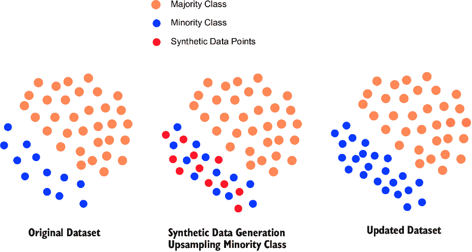
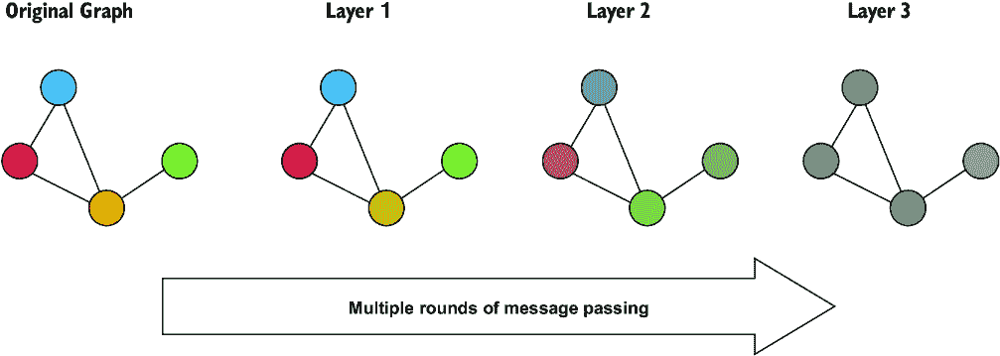
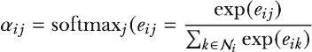
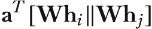
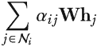

# 第四章：图注意力网络

### 本章涵盖

+   理解注意力及其在图注意力网络中的应用

+   了解何时在 PyTorch Geometric 中使用 GAT 和 GATv2 层

+   通过`NeighborLoader`类使用小批量处理

+   在垃圾邮件检测问题中实现和应用图注意力网络层

在本章中，我们通过查看这种模型的特殊变体，即图注意力网络（GAT），扩展了我们关于卷积图神经网络（卷积 GNN）架构的讨论。虽然这些 GNNs 使用的是前一章中介绍的卷积，但它们通过引入*注意力机制*来扩展这一想法，以突出学习过程中的重要节点[1, 2]。与传统的卷积 GNN 不同，它对所有节点给予相同的权重，注意力机制允许 GAT 学习在训练中额外强调哪些方面。

与卷积一样，*注意力*是深度学习（除了 GNNs 之外）中广泛使用的机制。依赖于注意力的架构（尤其是*变换器*）在解决自然语言问题方面取得了如此大的成功，以至于它们现在主导了该领域。在图世界中，注意力是否会产生类似的影响还有待观察。

当处理某些节点比图结构显示的重要性更大时，GATs 表现出色。有时在图中，可能存在一个高度节点，其对整个图的重要性超出了其度数，而传统的消息传递（在前一章中介绍）可能会因为节点的许多邻居而捕捉到其重要性。然而，有时一个节点即使与其他节点的度数相似，也可能产生很大的影响。一些例子包括社交网络，其中网络的一些成员对生成或传播信息和新闻有更大的影响力；欺诈检测，其中一小部分行为者和交易推动了欺骗；以及异常检测，其中一小部分人、行为或事件将超出常规[3–5]。GATs 特别适合这类问题。

在本章中，我们将应用 GATs 到欺诈检测领域。在我们的问题中，我们检测 Yelp 网站上的虚假客户评论。为此，我们使用一个由包含芝加哥地区酒店和餐厅 Yelp 评论的数据集派生出的用户评论网络[6, 7]。

在介绍问题和数据集之后，我们首先在没有图结构的情况下训练一个基线模型，然后再应用两种版本的 GAT 模型来解决这个问题。最后，我们讨论类别不平衡以及一些解决方法。

将使用代码片段来解释过程，但大部分代码和注释可以在存储库中找到。与前面的章节一样，我们在章节末尾的 4.5 节提供了对理论的深入探讨。

注意：本章的代码以笔记本形式存储在 GitHub 仓库中（[`mng.bz/JYoP`](https://mng.bz/JYoP)）。本章的 Colab 链接和数据可以在同一位置访问。

## 4.1 检测垃圾邮件和欺诈性评论

在以消费者为导向的网站和电子商务平台，如 Yelp、Amazon 和 Google 商业评论中，用户生成的评论和评分通常伴随着产品或服务的展示和描述。在美国，超过 90%的成年人信任并依赖这些评论和评分来做出购买决策[3]。同时，许多这些评论都是虚假的。Capital One 估计，到 2024 年，30%的在线评论不是真实的[5]。在本章中，我们将训练我们的模型来检测虚假评论。

垃圾邮件或欺诈性评论检测一直是机器学习和自然语言处理（NLP）中的一个热门领域。因此，从主要消费者网站和平台中可以找到几个数据集。在本章中，我们将使用 Yelp.com 的评论数据，这是一个专注于消费者服务的用户评论和评分平台。在 Yelp.com 上，用户可以查找他们附近的本地企业，并浏览有关企业及其用户书面反馈的基本信息。Yelp 使用内部开发的工具和模型根据其可信度过滤评论。我们将使用图 4.1 所示的过程来处理这个问题。


##### 图 4.1 我们将使用非图和图数据来解决欺诈性用户评论分类问题。

首先，我们将使用非 GNN 模型和表格数据建立基线：逻辑回归、XGBoost 和 scikit-learn 的多层感知器（MLP）。然后，我们将应用图卷积网络（GCN）和 GAT 来解决这个问题，引入图结构数据。

这个欺诈性评论问题可以作为一个节点分类问题来解决。我们将使用 GAT 对 Yelp 评论进行节点分类，从合法评论中筛选出欺诈性评论。这种分类是二元的：“垃圾邮件”或“非垃圾邮件”。

我们预期图结构数据和注意力机制将使基于注意力的 GNN 模型更具优势。在本章中，我们将遵循以下过程：

+   加载数据集并进行预处理

+   定义基线模型和结果

+   实现 GAT 解决方案并与基线结果进行比较

## 4.2 探索评论垃圾邮件数据集

从更广泛的电影评论数据集中提取，我们的数据专注于芝加哥的酒店和餐厅评论。它也已经过预处理，以便数据具有图形结构。这意味着我们将使用 Yelp Multirelational 数据集的专用版本，该版本以其图形结构和其专注于许多芝加哥酒店和餐厅的消费者评论而著称。Yelp Multirelational 数据集是从 Yelp Review 数据集派生出来的，并处理成图形。此数据集包含以下内容（数据集的最终版本总结在表 4.1 中）：

+   *45,954 个节点* —每个节点代表一条单独的评论，其中 14.5%被标记为可能欺诈，并由机器人创建以歪曲评论。

+   *预处理节点特征* —我们的节点带有 32 个特征，这些特征已经被归一化，以方便机器学习算法。

+   *3,892,933 条边* —边连接具有共同作者或评论共同业务的评论。虽然原始数据集有多种类型的关联边，但我们使用具有同质边的边以简化分析。

+   *无用户或业务 ID* —区分 ID 已被删除。

##### 表 4.1 Yelp Multirelational 数据集概述

| 将芝加哥的 Yelp Review 数据集处理成图形，节点特征基于评论文本和用户数据 |  |
| --- | --- |
| 节点数（评论）  | 45,954  |
| 过滤（欺诈）节点  | 14.5%  |
| 节点特征  | 32  |
| 总边数（在我们的分析中假设边是同质的）  | 3,846,979  |
| 具有共同作者的评论  | 49,315  |
| 同一月份在同一业务中撰写的评论  | 73,616  |
| 具有相同评分的同一业务的评论  | 3,402,743  |

接下来，表 4.2 显示了此数据集中的文本评论示例，按星级评分系统排序。

##### 表 4.2 YelpChi 数据集中一家餐厅的评论抽样，按评分降序排列（5 分是最高分）

| 评分（1-5） | 日期 | 评论* |
| --- | --- | --- |
| 5  | 7/7/08  | 完美。Snack 已经成为我最喜欢的晚午餐/早晚餐地点。一定要尝试黄油豆！！！  |
| 4  | 7/1/13  | 上周五从 Snack 订购了 15 份午餐。准时送达，没有遗漏，食物很棒。我已经将它添加到常规公司午餐名单中，因为每个人都喜欢他们的餐点。  |
| 3  | 12/8/14  | Snack 的食物是希腊流行菜肴的选择。开胃小吃盘和希腊沙拉都很好。我们对主菜不太满意。这里有 4-5 张桌子，所以有时很难找到座位。  |
| 2  | 9/10/13  | 一直想尝试这个地方，一个朋友强烈推荐。点了金枪鱼三明治……很好，但之后感觉非常不舒服。还有，迷迭香茶也很不错。  |
| 1  | 8/12/12  | 服务平淡，菠菜派湿漉漉的，不热，黄瓜沙拉已经两天了。还是去 Local 吧！  |
| *这些评论中的拼写、语法和标点符号未经校正。  |  |  |

### 4.2.1 解释节点特征

本数据集的亮点是其节点特征。这些特征是从可用的元数据中提取的，例如评分、时间戳和评论文本。它们分为以下几类：

+   文本评论的特征

+   评论者的特征

+   被评论商业的特征

这些特征随后进一步分为行为和文本特征：

+   行为特征突出显示评论者的行为和行动模式。

+   文本特征基于评论中找到的文本。

计算这些特征的过程是由 Rayana 和 Akoglu [7] 以及 Dou [9] 开发的。Dou 在此例中预处理并标准化了我们从 Rayana 和 Akoglu 那里得到的特征数据。特征摘要如图 4.2 所示。（有关定义及其计算方法的更多详细信息，请参阅原始论文 [8]。）以下是对节点特征的总结：

+   评论者和商业特征：

*行为：*

+   +   *每天撰写的最大评论数 (MNR)* — 高值表示垃圾邮件。

    +   *正面评论比率 (4-5 星) (PR)* — 高值表示垃圾邮件。

    +   *负面评论比率 (1-2 星) (NR)* — 高值表示垃圾邮件。

    +   *平均评分偏差 (avgRD)* — 高值表示垃圾邮件。

    +   *加权评分偏差 (WRD)* — 高值表示垃圾邮件。

    +   *爆发性 (BST)* — 特指用户首次和最后一次评论之间的时间段。高值表示垃圾邮件。

    +   *熵值分布熵 (ERD)* — 低值表示垃圾邮件。

    +   *时间间隔熵 (ETG)* — 低值表示垃圾邮件。

*文本：*

+   +   *平均评论长度（单词数）(RL)* — 低值表示垃圾邮件。

    +   *平均/最大内容相似度* — *使用余弦相似度和双词袋方法测量 (ACS, MCS)* — 高值表示垃圾邮件。

+   评论特征：

*行为：*

+   +   *产品所有评论中的排名顺序* — 低值表示垃圾邮件。

    +   *产品平均评分的绝对评分偏差 (RD)* — 高值可疑。

    +   *评分极端性 (EXT)* — 高值 (4-5 星) 被视为垃圾邮件。

    +   *评论评分偏差的阈值 (DEV)* — 高偏差可疑。

    +   *早期时间段 (ETF)* — 出现过早的评论可疑。

    +   *单一评论者检测 (ISR)* — 如果评论是用户的唯一评论，则标记为可疑。

*文本：*

+   +   *全大写单词百分比 (PCW)* — 高值可疑。

    +   *大写字母百分比 (PC)* — 高值可疑。

    +   *评论长度（单词数）* — 低值可疑。

    +   *第一人称代词如“我”、“我的” (PP1)* — 低值可疑。

    +   *感叹句比率 (RES)* — 高值可疑。

    +   *主观词比率* — *由 sentiWordNet 检测 (SW)* — 高值可疑。

    +   *客观词比率* — *由 sentiWordNet 检测 (OW)* — 低值可疑。

    +   *评论频率* — *使用局部敏感哈希 (F) 近似* — 高值可疑。

    +   *基于单词和双词的描述长度（DLu, DLb）* — 低值可疑。

图 4.2 给出了特征集的总结。



##### 图 4.2 展示了示例中使用的节点特征的总结定义。高标签表示数据的高值表明了垃圾邮件的倾向性。同样，低标签表示数据低值表明了垃圾邮件的倾向性。（关于这些特征的推导细节，请参阅[7]）

这种特征组合需要不同程度的直觉来解释。这些特征不仅有助于理解评论者的行为，还有助于推断评论的上下文和本质。很明显，某些特征，如单评论者检测或评论长度（以单词计），可以提供直接的洞察，而其他特征，如时间间隔的熵 Dt，则需要更深入的理解。接下来，让我们检查数据中这些特征的分部。

### 4.2.2 探索性数据分析

在本节中，我们下载并探索数据集，重点关注节点特征。节点特征将作为我们非图基线模型中的主要表格特征。

数据可以从 Yingtong Dou 的 GitHub 仓库下载（[`mng.bz/Pdyg`](https://mng.bz/Pdyg)），压缩在一个 zip 文件中。解压后的文件将是 MATLAB 格式。使用`scipy`库中的`loadmat`函数和 Dou 仓库中的实用函数，我们可以生成开始所需的对象（参见列表 4.1）：

+   一个包含节点特征的`features`对象

+   一个包含节点标签的`labels`对象

+   一个邻接表对象

##### 列表 4.1 加载数据

```py
prefix = 'PATH_TO_MATLAB_FILE/'

data_file = loadmat(prefix +  'YelpChi.mat')   #1

labels = data_file['label'].flatten()          #2
features = data_file['features'].todense().A   #2

yelp_homo = data_file['homo']            #3
sparse_to_adjlist(yelp_homo, prefix +\
 'yelp_homo_adjlists.pickle')
```

#1 `loadmat`是 scipy 库中的一个函数，用于加载 MATLAB 文件。

#2 分别获取节点标签和特征

#3 获取并序列化邻接表。“Homo”表示这个邻接表将基于同质边集；也就是说，我们消除了边的多关系性质。

一旦提取并序列化邻接表，就可以在未来通过以下方式调用它

```py
with open(prefix + 'yelp_homo_adjlists.pickle', 'rb') as file:
    homogenous = pickle.load(file)
```

数据加载完成后，我们现在可以执行一些探索性数据分析（EDA），以分析图结构和节点特征。

### 4.2.3 探索图结构

为了更好地理解数据集中的欺诈行为，我们探索了底层图结构。通过分析连通分量和各种图度量，我们可以了解网络的拓扑概览。这种理解将揭示数据固有的特性，并确保没有潜在的阻碍有效 GNN 训练的因素。我们详细分析了连通分量、密度、聚类系数和其他关键指标。

为了执行这种结构化 EDA，我们使用我们的邻接表，通过 `NetworkX` 库来检查我们图的结构的性质。在下面的代码片段中，我们加载邻接表对象，将其转换为 `NetworkX` 图对象，然后查询此图对象的基本属性。更长的代码可以在存储库中找到：

```py
with open(prefix + 'yelp_homo_adjlists.pickle', 'rb') as file:
homogenous = pickle.load(file)
g = nx.Graph(homogenous)
print(f'Number of nodes: {g.number_of_nodes()}')
print(f'Number of edges: {g.number_of_edges()}')
print(f'Average node degree: {len(g.edges) / len(g.nodes):.2f}')
```

通过 EDA，我们获得了表 4.3 中列出的属性。

##### 表 4.3 图属性

| 属性 | 值/详情 |
| --- | --- |
| 节点数量 | 45,954 |
| 边数量 | 3,892,933 |
| 平均节点度数 | 84.71 |
| 密度 | ~0.00 |
| 连通性 | 图不连通 |
| 平均聚类系数 | 0.77 |
| 连接组件数量 | 26 |
| 度分布（前 10 个节点） | [4, 4, 4, 3, 4, 5, 5, 6, 5, 19] |

让我们深入探讨这些属性。该图相对较大，有 45,954 个节点和 3,892,933 条边。这意味着图具有相当复杂度，可能包含复杂的关系。平均节点度数为 84.71，表明在图中，节点平均连接到大约 85 个其他节点。这表明图中的节点连接得相当好，它们之间可能存在丰富的信息流。图的密度接近 0.00，这表明它相当稀疏。换句话说，实际连接（边）的数量远低于可能连接的数量。图的密度是其边数除以总可能边数。

图不完全连通，由 26 个独立的连接组件组成。多个连接组件的存在可能在建模时需要特别考虑，尤其是如果不同的组件代表不同的数据集群或现象。平均聚类系数为 0.77，相对较高。这个指标给出了图“紧密性”的概念。高值意味着节点倾向于聚集在一起，形成紧密的群体。这可能表明数据中的局部社区或集群，这在理解模式或异常，尤其是在欺诈检测中至关重要。

由于我们有 26 个不同的组件，检查它们对于模型训练计划很重要。我们想知道这些组件的大小是否大致相同，是否是大小混合，或者有一个或两个组件占主导地位。这些单独图的属性有显著差异吗？我们对 26 个组件进行类似的分析，并在表 4.4 中总结属性，组件按节点数量降序排列。第一列包含组件的标识符。从这张表中，我们可以观察到有一个大型组件主导了数据集。

##### 表 4.4 26 个图组件的属性，按节点数量降序排列

| 组件 ID | 节点数量 | 边数量 | 平均节点度数 | 密度 | 平均聚类系数 |
| --- | --- | --- | --- | --- | --- |
| 3  | 45,900  | 38,92810  | 169.62  | 0  | 0.77  |
| 4  | 13  | 60  | 9.23  | 0.77  | 0.77  |
| 2  | 6  | 14  | 4.67  | 0.93  | 0.58  |
| 1, 22  | 3  | 6  | 4  | 2  | 1  |
| 5–9, 14, 17, 24, 26  | 2  | 3  | 3  | 3  | 0  |
| 7–21, 23, 25  | 1  | 1  | 2  | 0  | 0  |
| 在底部三行中，几个组件具有相同的属性，因此被放在同一行以节省空间。 |

我们在这里看到，组件 3 是主导组件，其次是 25 个相对较小的组件。这些较小的组件可能对我们的模型影响不大，因此我们将重点关注组件 3。让我们将这个组件与表 4.5 中找到的整体图进行对比，这个组件的许多属性都非常相似或相同，唯一的例外是平均节点度，组件 3 是这个数值的两倍。

##### 表 4.5 比较图的最大组件组件 3 与整体图

| 属性 | 组件编号 3 | 整体图 | 启示/对比 |
| --- | --- | --- | --- |
| 节点数量  | 45,900  | 45,954  | 组件 3 几乎包含了整个图的所有节点。  |
| 边的数量  | 3,892,810  | 3,892,933  | 组件 3 几乎贡献了整个图的所有边。  |
| 平均节点度  | 169.62  | 84.71  | 组件 3 中的节点比整体图中的节点连接得更密集。  |
| 密度  | 0.00  | 0.00  | 组件和整个图都是稀疏的；这种属性主要是由组件 3 驱动的。  |
| 平均聚类系数  | 0.77  | 0.77  | 组件 3 在聚类方面与整体图相匹配，表明它在定义图结构方面的主导地位。  |

对于我们的 GNN 建模目的，我们应该从这次结构分析中得到什么？主要的是，组件 3 在节点和边方面的压倒性主导地位强调了它在我们的数据集中的重要性；整个图的结构几乎都包含在这个单一组件中。这表明，组件 3 中的模式、关系和异常将严重影响模型的训练和结果。与整体图相比，组件 3 的平均节点度更高，这表明更丰富的相互连接，强调了有效捕捉这些密集连接的重要性。此外，组件 3 与整个图在密度和聚类系数值上的相同性突显出，这个组件高度代表了数据集的整体结构属性。我们有两种选择：

1.  假设其他组件将对模型产生轻微的影响，并且在不做任何调整的情况下进行训练。

1.  仅对组件 3 本身进行建模，完全将较小组件的数据排除在训练和测试数据之外。

我们研究了图数据的结构特性，以了解图的特征，并获得了指导 GNN 模型设计和训练以理解潜在欺诈模式的宝贵见解。接下来，我们将深入探讨节点特征。

### 4.2.4 探索节点特征

在探索了我们的图的结构的性质之后，我们转向节点特征。在本节开头代码中，我们从数据文件中提取了节点特征：

```py
features = data_file['features'].todense().A
```

注意：如前所述，这些特征定义是由 Rayana 和其他人手工制作的[7, 8]。在特征生成过程的指导下，Dou 等人[8]进行了非平凡的进一步处理 Yelp 评论数据集的工作，以创建一组归一化的节点特征。

通过一些额外的工作，如代码库中所示，我们在为每个特征创建图表分布之前，也为特征添加了一些标签和描述（示例图见 4.3 至 4.5 图）。每一组图对应于描述评论文本、评论者和企业的特征。我们希望使用这些图来检查节点特征是否可以在区分欺诈中发挥作用。图 4.3 显示了从评论的特征中导出的两个特征的分布。


##### 图 4.3 显示了基于评论的 15 个归一化节点特征中的 2 个特征的分布图（参见 4.2.1 节中的特征定义）

图 4.4 显示了从评论者的特征中导出的两个特征分布。


##### 图 4.4 显示了基于评论者的 9 个归一化节点特征中的两个特征的分布图（参见 4.2.1 节中的特征定义）

最后，图 4.5 显示了从被评论的餐厅或酒店的特征中导出的两个特征分布。



##### 图 4.5 显示了基于被评论的企业的 8 个归一化节点特征中的两个特征的分布图（参见 4.2.1 节中的特征定义）

通过检查 32 个节点特征的直方图，我们可以得出几个观察结果。首先，许多特征都存在明显的偏态。具体来说，如排名（Rank）、RD 和 EXT 等特征倾向于右偏态分布。这表明大多数数据点落在直方图的左侧，但少数高值点将直方图拉伸到右侧。相反，如 MNR_user、PR_user 和 NR_user 等其他特征显示左偏态分布。在这些情况下，大多数数据点集中在直方图的右侧，少数低值点将直方图拉伸到左侧。

一些特征也表现出双峰分布，这意味着数据中存在两个不同的峰值或组。这表明对数据进行分段并为每个组创建单独的模型可能是一种有用的策略。

最后，几个直方图中的长尾表明存在一些异常值。鉴于某些模型，如线性回归，对极端值非常敏感，解决这些异常值可能对我们的模型优化和改进至关重要。这可能意味着选择抗异常值模型，制定减轻其影响的策略，甚至完全删除它们。

在那些一般见解的基础上，让我们更仔细地检查一个特征图。PP1 是评论中第一人称代词（即我、我们、我们的等）与第二人称代词（你、你的等）的比例。这个特征是由于观察到垃圾邮件通常包含更多的第二人称代词而开发的。从 PP1 的分布图中，我们观察到分布是偏左的，尾部在低值处达到峰值。因此，如果低比例是垃圾邮件的指标，这个特征将很好地区分垃圾邮件。

为了总结我们对节点特征的探索，这些数据表现出多种特性，为模型训练提供了许多机会。进一步的前处理，可能包括异常值处理、偏斜特征转换、数据分段和特征缩放，可能对优化模型的预测性能至关重要。

我们对评论垃圾邮件数据集的探索揭示了某些模式、异常和见解。从数据集的复杂结构特征来看，主要由主要成分 3 表示，到提供区分真实和欺诈评论的潜在指示的节点特征，我们已经为我们的模型训练奠定了基础。

在第 4.3 节中，我们将开始训练我们的基线模型。这些初始模型作为基础，帮助我们评估基本模型性能的有效性。通过这些模型，我们将利用数据的图结构和节点特征来区分欺诈和垃圾邮件与真实评论。

## 4.3 训练基线模型

考虑到我们的数据集，我们将首先开发三个基线模型：逻辑回归、XGBoost 和一个 MLP。请注意，对于这些模型，数据将以表格格式呈现，节点特征作为我们的列特征。我们的图数据集的每个节点将有一个行或观察值。接下来，我们将通过训练一个 GCN 来开发一个额外的 GNN 基线，以评估引入图结构数据到我们问题中的影响。

我们现在将我们的表格数据分为测试集和训练集，并应用三个基线模型。首先，进行测试/训练分割：

```py
from sklearn.model_selection import train_test_split 
split = 0.2
xtrain, xtest, ytrain, ytest = train_test_split\
(features, labels, test_size = \
split, stratify=labels, random_state = 99)   #1

print(f'Required shape is {int(len(features)*(1-split))}')   #2
print(f'xtrain shape = {xtrain.shape}, \
xtest shape = {xtest.shape}')                               
print(f'Correct split = {int(len(features)*(1-split))\
 == xtrain.shape[0]}')
```

#1 将数据分为测试集和训练集，比例为 80/20

#2 两次检查对象形状

我们可以使用这些分割数据为三个模型中的每一个。对于这次训练，我们只使用节点特征和标签。没有使用图数据结构或几何形状。对于基线模型和 GNN，我们将主要依靠受试者工作特征（ROC）和曲线下面积（AUC）来衡量性能，并比较我们的 GAT 模型的性能。

### 4.3.1 非图神经网络（GNN）基线

我们首先使用 scikit-learn 的实现和默认超参数的逻辑回归模型：

```py
from sklearn.linear_model import LogisticRegression
from sklearn.metrics import accuracy_score
from sklearn.metrics import roc_auc_score, f1_score

clf = LogisticRegression(random_state=0)\
.fit(xtrain, ytrain)   #1
ypred = clf.predict_proba(xtest)[:,1]
acc = roc_auc_score(ytest,ypred)   #2

print(f"Model accuracy (logression) = {100*acc:.2f}%")
```

#1 实例化和训练逻辑回归模型

#2 准确度得分

该模型产生了 76.12% 的 AUC。对于 ROC 性能，我们还将使用 scikit-learn 中的一个函数。我们还将回收真实阳性率（`tpr`）和假阳性率（`fpr`）来与我们的其他基线模型进行比较：

```py
from sklearn.metrics import roc_curve 
fpr, tpr, _ = roc_curve(ytest,ypred)   #1

plt.figure(1)
plt.plot([0, 1], [0, 1])
plt.plot(fpr, tpr)
plt.xlabel('False positive rate')
plt.ylabel('True positive rate')
plt.show()
```

#1 计算 ROC 曲线，得到假阳性率（fpr）和真阳性率（tpr）

在图 4.6 中，我们看到 ROC 曲线。我们发现曲线在假阳性和假阴性之间相对平衡，但考虑到它接近对角线，整体特异性相当差。


##### 图 4.6 显示了逻辑回归基线模型（橙色线）和机会线（蓝色对角线）。76% 的 AUC 表明模型还有改进的空间。

#### XGBoost

XGBoost 基线遵循逻辑回归，如列表 4.2 所示。我们使用了一个裸机模型，具有相同的训练和测试集。为了比较，我们区分了生成的预测名称（命名为 `pred2`）、真实阳性率（`tpr2`）和假阳性率（`fpr2`）。

##### 列表 4.2 XGBoost 基线和绘图

```py
import xgboost as xgb
xgb_classifier = xgb.XGBClassifier()

xgb_classifier.fit(xtrain,ytrain)
ypred2 = xgb_classifier.predict_proba(xtest)[:,1]   #1
acc = roc_auc_score(ytest,ypred2)

print(f"Model accuracy (XGBoost) = {100*acc:.2f}%")

fpr2, tpr2, _ = roc_curve(ytest,ypred2)   #2

plt.figure(1)
plt.plot([0, 1], [0, 1])
plt.plot(fpr, tpr)
plt.plot(fpr2, tpr2)                     
plt.xlabel('False positive rate')
plt.ylabel('True positive rate')
plt.show()
```

#1 为了比较，我们将 XGBoost 预测命名为“ypred2”。

#2 为了比较，我们区分了 XGBoost 的 tpr 和 fpr，并将它们与逻辑回归结果并排绘制。

图 4.7 显示了 XGBoost 和逻辑回归的 ROC 曲线。很明显，XGBoost 在这个指标上具有优越的性能。



##### 图 4.7 显示了 XGBoost（虚线）和逻辑回归曲线（实线）。我们看到 XGBoost 曲线比逻辑回归曲线表现更好。对角线是机会线。

XGBoost 在此数据上比逻辑回归表现更好，产生了 94% 的 AUC，并具有更优越的 ROC 曲线。这表明即使是简单的模型也可能适用于某些问题，检查性能始终是一个好主意。

#### 多层感知器

对于 MLP 基线，我们使用 PyTorch 构建了一个简单、三层模型，如列表 4.3 所示。与 PyTorch 类似，我们通过一个类来建立模型，定义层和前向传递。在 MLP 中，我们使用二元交叉熵（BCE）作为损失函数，这在二元分类问题中是常用的。

##### 列表 4.3 MLP 基线模型和绘图

```py
import torch   #1
import torch.nn as nn
import torch.nn.functional as F

class MLP(nn.Module):   #2
    def __init__(self, in_channels, out_channels, hidden_channels=[128,256]):
        super(MLP, self).__init__()
        self.lin1 = nn.Linear(in_channels,hidden_channels[0])
        self.lin2 = nn.Linear(hidden_channels[0],hidden_channels[1])
        self.lin3 = nn.Linear(hidden_channels[1],out_channels)

    def forward(self, x):
        x = self.lin1(x)
        x = F.relu(x)
        x = self.lin2(x)
        x = F.relu(x)
        x = self.lin3(x)
        x = torch.sigmoid(x)

        return x

model = MLP(in_channels = features.shape[1],\
 out_channels = 1)   #3

epochs = 100   #4
lr = 0.001
wd = 5e-4
n_classes = 2
n_samples = len(ytrain)

w= ytrain.sum()/(n_samples - ytrain.sum())   #5

optimizer = torch.optim.Adam(model.parameters()\
,lr=lr,weight_decay=wd)   #6
criterion = torch.nn.BCELoss()   #7

xtrain = torch.tensor(xtrain).float()   #8
ytrain = torch.tensor(ytrain)

losses = []

for epoch in range(epochs):  #9
    model.train()
    optimizer.zero_grad()
    output = model(xtrain)
    loss = criterion(output, ytrain.reshape(-1,1).float())
    loss.backward()
    losses.append(loss.item())

    ypred3 = model(torch.tensor(xtest,dtype=torch.float32))

    acc = roc_auc_score(ytest,ypred3.detach().numpy())
    print(f'Epoch {epoch} | Loss {loss.item():6.2f}\
    | Accuracy = {100*acc:6.3f}% | # True\ Labels = \
    {ypred3.detach().numpy().round().sum()}', end='\r')

    optimizer.step()

fpr, tpr, _ = roc_curve(ytest,ypred)
fpr3, tpr3, _ = roc_curve(ytest,ypred3.detach().numpy())   #10

plt.figure(1)   #11
plt.plot([0, 1], [0, 1])
plt.plot(fpr, tpr)
plt.plot(fpr2, tpr2)
plt.plot(fpr3, tpr3)
plt.xlabel('False positive rate')
plt.ylabel('True positive rate')
plt.show()
```

#1 导入本节所需的包

#2 使用类定义 MLP 架构

#3 实例化定义的模型

#4 设置关键超参数

#5 考虑到类别不平衡

#6 定义了优化器和训练标准

#7 使用 BCE 损失作为损失函数

#8 将训练数据转换为 torch 数据类型：torch 张量

#9 训练循环。在这个例子中，我们指定了 100 个 epoch。

#10 区分 tpr 和 fpr 进行比较

#11 绘制所有三个 ROC 曲线

图 4.8 显示了逻辑回归、XGBoost 和 MLP 的 ROC 结果。



##### 图 4.8 展示了所有三个基线模型的 ROC 曲线。逻辑回归和 MLP 的曲线重叠。XGBoost 模型在此指标上表现出最佳性能。对角线是机会线。

MLP 运行 100 个 epoch，在基线中达到 85.9%的准确率。其 ROC 曲线仅略优于逻辑回归模型。这些结果总结在表 4.6 中。

##### 表 4.6 三种基线模型的日志损失和 ROC AUC

| 模型 | 日志损失 | ROC AUC |
| --- | --- | --- |
| 逻辑回归 | 0.357 | 75.90% |
| XGBoost | 0.178 | 94.17% |
| 多层感知器 | 0.295 | 85.93% |

总结本节，我们运行了三个基线模型作为我们的 GNN 模型的基准。这些基线没有使用结构化图数据，只使用了一组从节点特征派生出的表格特征。我们没有尝试优化这些模型，XGBoost 最终以 89.25%的准确率表现最佳。接下来，我们将使用 GCN 训练另一个基线，然后应用 GAT。

### 4.3.2 GCN 基线

在本节中，我们将应用 GNN 到我们的问题上，从第三章中的 GCN 开始，然后转向 GAT 模型。我们预计我们的 GNN 模型将由于图结构数据而优于其他基线，并且具有注意力机制的模型将表现最佳。对于 GNN 模型，我们需要对我们的管道进行一些修改。这其中的很多都与数据预处理和数据加载有关。

#### 数据预处理

第一个关键步骤是为我们的 GNN 准备数据。这遵循了第二章和第三章中已经介绍的一些内容。这段代码在列表 4.4 中提供，我们采取以下步骤：

+   *建立训练/测试分割。* 我们使用之前相同的`test_train_split`函数，稍作调整以生成索引，并且我们只保留生成的索引。

+   *将我们的数据集转换为 PyG 张量。* 为此，我们从一个早期部分生成的同构邻接列表开始。使用 NetworkX，我们将其转换为 NetworkX `graph`对象。从那里，我们使用 PyG 的`from_networkx`函数将其转换为 PyG `data`对象。

+   *将训练/测试分割应用于转换后的数据对象。* 为此，我们使用第一步中的索引。

我们希望展示多种安排训练数据以供摄入的方式。因此，对于 GCN，我们将整个数据集通过模型运行，而在 GAT 示例中，我们将训练数据进行分批。

##### 列表 4.4 转换训练数据的数据类型

```py
from torch_geometric.transforms import NormalizeFeatures

split = 0.2                                        #1
indices = np.arange(len(features))                 #1
xtrain, xtest, ytrain, ytest, idxtrain, idxtest\
 = train_test_split(features labels,indices, \
stratify=labels, test_size = split, \
random_state = 99)                                 #2

g = nx.Graph(homogenous)                                            #3
print(f'Number of nodes: {g.number_of_nodes()}')
print(f'Number of edges: {g.number_of_edges()}')
print(f'Average node degree: {len(g.edges) / len(g.nodes):.2f}')
data = from_networkx(g)                                            
data.x = torch.tensor(features).float()                            
data.y = torch.tensor(labels)                                      
data.num_node_features = data.x.shape[-1]                          
data.num_classes = 1 #binary classification                        

A = set(range(len(labels)))                                  #4
data.train_mask = torch.tensor([x in idxtrain for x in A])   #4
data.test_mask = torch.tensor([x in idxtest for x in A])     #4
```

#1 建立训练/测试分割。我们将只使用索引变量。

#2 建立训练/测试分割。我们将只使用索引变量。

#3 将邻接表转换为 PyG 数据对象

#4 在数据对象中建立训练/测试分割

预处理完成后，我们准备应用 GCN 和 GAT 解决方案。我们在第三章详细介绍了 GCN 架构。在列表 4.5 中，我们建立了一个两层 GCN，在 1,000 个 epoch 上训练。我们选择两层是因为第三章的见解，一般来说，低模型深度可以提高性能并防止过平滑。

##### 列表 4.5 GCN 定义和训练

```py
class GCN(torch.nn.Module):       #1
    def __init__(self, hidden_layers = 64):
        super().__init__()
        torch.manual_seed(2022)
        self.conv1 = GCNConv(data.num_node_features, hidden_layers)
        self.conv2 = GCNConv(hidden_layers, 1)
    def forward(self, data):
        x, edge_index = data.x, data.edge_index

        x = self.conv1(x, edge_index)
        x = F.relu(x)
        x = F.dropout(x, training=self.training)
        x = self.conv2(x, edge_index)

        return torch.sigmoid(x)

device = torch.device("cuda"\
 if torch.cuda.is_available() \
else "cpu")              #2
print(device)
model = GCN()
model.to(device)
data.to(device)

lr = 0.01
epochs = 1000

optimizer = torch.optim.Adam(model.parameters(), lr=lr, weight_decay=5e-4)
criterion = torch.nn.BCELoss()

losses = []
for e in range(epochs):      #3
    model.train()
    optimizer.zero_grad()
    out = model(data)                          #4

    loss = criterion(out[data.train_mask], \
    data.y[data.train_mask].\
    reshape(-1,1).float())                    
    loss.backward()
    losses.append(loss.item())

    optimizer.step()

    ypred = model(data).clone().cpu()
    pred = data.y[data.test_mask].clone().cpu().detach().numpy()
    true = ypred[data.test_mask].detach().numpy()
    acc = roc_auc_score(pred,true)

    print(f'Epoch {e} | Loss {loss:6.2f} \
    | Accuracy = {100*acc:6.3f}% \
    | # True Labels =\ {ypred.round().sum()}')
fpr, tpr, _ = roc_curve(pred,true)      #5
```

#1 定义了两层 GCN 架构

#2 实例化模型并将模型和数据放在 GPU 上

#3 训练循环

#4 对于每个 epoch，我们将整个数据对象通过模型，然后使用训练掩码来计算损失。

#5 计算假阳性率（fpr）和真阳性率（tpr）

#### 应用解决方案

值得注意的是我们训练中使用了掩码。虽然我们使用训练掩码中的节点来建立损失，但在前向传播时，我们必须将整个图通过模型传递。为什么是这样？与在独立数据点（例如表格数据集的行）上工作的传统机器学习模型不同，GNNs 在图结构数据上操作，其中节点之间的关系至关重要。在训练 GCN 时，每个节点的嵌入是基于其邻居的信息更新的。因为这个消息传递过程涉及到从节点的局部邻域中聚合信息，所以模型需要访问整个图结构，以便它可以正确准确地计算这些聚合并有效地执行此过程。

因此，在训练过程中，尽管我们只对某些节点的预测感兴趣（那些在训练集中的节点），但通过将整个图通过模型传递确保了考虑了所有必要上下文。如果只将图的一部分通过模型传递，网络将缺乏传播消息和有效更新节点表示所需的所有完整信息。

GCN 的 100 个 epoch 的训练会得到 94.37%的准确率。通过引入图数据，我们看到了与 XGBoost 模型相比的渐进改进。表 4.7 比较了模型性能水平。

##### 表 4.7 四个基线模型的 AUC

| 模型 | AUC |
| --- | --- |
| 逻辑回归 | 75.90% |
| XGBoost | 94.17% |
| 多层感知器 | 85.93% |
| GCN | 94.37% |

总结来说，我们已看到，使用 GNN 模型包含图结构信息与仅基于特征或表格模型相比，略微提高了性能。很明显，XGBoost 模型即使没有使用图结构也展示了令人印象深刻的成果。然而，GCN 模型略微更好的性能凸显了 GNN 在利用图数据中嵌入的关系信息方面的潜力。

在我们研究的下一阶段，我们的注意力将转向图注意力网络（GATs）。GATs 具有专门针对在消息传递步骤中如何权衡邻居重要性进行学习的注意力机制。这可能会提供更好的模型性能。在下一节中，我们将深入了解训练 GAT 模型的细节，并将它们的成果与我们已经建立的基线进行比较。让我们继续进行 GAT 模型的训练。

## 4.4 训练 GAT 模型

为了训练我们的 GAT 模型，我们将应用两种 PyG 实现（GAT 和 GATv2）[2]。在本节中，我们将直接进入模型的训练过程，而不讨论对于机器学习模型来说注意力意味着什么以及为什么它是有帮助的。然而，关于注意力及其为何可能就是你所需要的简要概述，请参阅第 4.5 节。

我们将训练两种不同的 GAT 模型。这两个模型都遵循相同的基本思想——我们将用注意力机制替换我们的 GCN 中的聚合操作，以学习模型应该最关注哪些消息（节点特征）。第一个——GATConv——是对第三章中 GCN 的简单扩展，加入了注意力机制。第二个是对此模型稍作修改的 GATv2Conv。这个模型与 GATConv 相同，除了它解决了原始实现中的一个限制，即注意力机制在单个 GNN 层上是静态的。相反，对于 GATv2Conv，注意力机制在层之间是动态的。

再次强调，原始的 GAT 模型仅在每次训练循环中通过使用单个节点和邻域特征来计算注意力权重一次，并且这些权重在所有层中都是静态的。在 GATv2 中，注意力权重是在节点特征通过层变换时计算的。这允许 GATv2 更具表现力，学习在整个训练模型中强调节点邻域的影响。

由于引入了注意力机制，这两个模型引入了显著的计算开销。为了解决这个问题，我们在训练循环中引入了小批量处理。

### 4.4.1 邻域加载器和 GAT 模型

从实现的角度来看，先前研究的卷积模型和我们的 GAT 模型之间有一个关键的区别，那就是 GAT 模型的内存需求要大得多 [9]。这是因为 GAT 需要对每个注意力头和每条边进行注意力分数的计算。这反过来又需要 PyTorch 的 `autograd` 方法在内存中保留可以显著扩展的张量，这取决于边的数量、头的数量和（两倍）节点特征的数量。

为了解决这个问题，我们可以将我们的图分成批次，并将这些批次加载到训练循环中。这与我们之前对 GCN 模型的做法形成对比，我们当时在一个单独的批次（整个图）上训练。PyG 的 `NeighborLoader`（在其 `dataloader` 模块中）允许这种小批量训练，我们在这个列表 4.6 中提供了相应的实现代码。（PyG 函数 `NeighborLoader` 基于“在大型图上的归纳表示学习”论文 [10]。）`NeighborLoader` 的关键输入参数是

+   `num_neighbors`——将被采样的邻居节点数量，乘以迭代次数（即 GNN 层）。在我们的例子中，我们指定在两次迭代中采样 1,000 个节点。

+   `batch_size`——每个批次选择的节点数量。在我们的例子中，我们将批量大小设置为 `128`。

##### 列表 4.6 为 GAT 设置 `NeighborLoader`

```py
from torch_geometric.loader import NeighborLoader

batch_size = 128
loader = NeighborLoader(
    data,
    num_neighbors=[1000]*2,   #1
    batch_size=batch_size,   #2
    input_nodes=data.train_mask)

sampled_data = next(iter(loader))
print(f'Checking that batch size is \
{batch_size}: {batch_size == \
sampled_data.batch_size}')
print(f'Percentage fraud in batch: \
{100*sampled_data.y.sum()/\
len(sampled_data.y):.4f}%')
sampled_data
```

#1 在两次迭代中为每个节点采样 1,000 个邻居

#2 使用批量大小来采样训练节点

在创建我们的 GAT 模型时，相对于我们的 GCN 类别，有两个关键的改变。首先，因为我们是在批量训练，所以我们想应用一个批量归一化层。批量归一化是一种用于将神经网络中每一层的输入归一化到均值为 0 和标准差为 1 的技术。这有助于通过减少内部协变量偏移来稳定和加速训练过程，允许使用更高的学习率，并提高模型的总体性能。

其次，我们注意到我们的 GAT 层有一个额外的输入参数——`heads`——它表示多头注意力的数量。在我们的例子中，我们的第一个 `GATConv` 层有两个头，如列表 4.7 所指定。

第二个 `GATConv` 层，即输出层，有一个头。在这个 GAT 模型中，因为我们希望最终层对每个节点都有一个单一的表现形式来完成我们的任务，所以我们使用一个头。多个头会导致输出混乱，出现多个节点表现形式。

##### 列表 4.7 基于 GAT 的架构

```py
class GAT(torch.nn.Module):
    def __init__(self, hidden_layers=32, heads=1, dropout_p=0.0):
        super().__init__()
        torch.manual_seed(2022)
        self.conv1 = GATConv(data.num_node_features,\
 hidden_layers, heads, dropout=dropout_p)                            #1
        self.bn1 = nn.BatchNorm1d(hidden_layers*heads)     #2
        self.conv2 = GATConv(hidden_layers * heads, \
1, dropout=dropout_p)                                               

    def forward(self, data, dropout_p=0.0):
        x, edge_index = data.x, data.edge_index
        x = self.conv1(x, edge_index)
        x = self.bn1(x)                                   
        x = F.relu(x)
        x = F.dropout(x, training=self.training)
        x = self.conv2(x, edge_index)

        return torch.sigmoid(x)
```

#1 GAT 层有一个 `heads` 参数，它决定了每一层中的注意力机制数量。在这个实现中，第一层（conv1）使用多个头进行更丰富的特征提取，而最终的输出层（conv2）使用一个头将学习到的信息聚合为每个节点的单一输出。

#2 因为正在执行小批量训练，所以添加了一个批量归一化层。

我们对 GAT 的训练程序与单批次的 GCN 相似，我们将在以下列表中提供，但现在我们需要为每个批次进行嵌套循环。

##### 列表 4.8 GAT 的训练循环

```py
lr = 0.01
epochs = 1000

model = GAT(hidden_layers = 64,heads=2)
model.to(device)

optimizer = torch.optim.Adam(model.parameters(), lr=lr,weight_decay=5e-4)
criterion = torch.nn.BCELoss()

losses = []
for e in range(epochs):    
    epoch_loss = 0.
    for i, sampled_data in enumerate(loader):  #1
        sampled_data.to(device)
        model.train()
        optimizer.zero_grad()
        out = model(sampled_data)
        loss = criterion(out[sampled_data.train_mask],\ 
sampled_data.y[sampled_data.train_mask].\
reshape(-1,1).float())
loss.backward()
epoch_loss += loss.item()

        optimizer.step()

        ypred = model(sampled_data).clone().cpu()
        pred = sampled_data.y[sampled_data.test_mask]\
.clone().cpu().detach().numpy()
        true = ypred[sampled_data.test_mask].detach().numpy()
        acc = roc_auc_score(pred,true)    
    losses.append(epoch_loss/batch_size)

    print(f'Epoch {e} | Loss {epoch_loss:6.2f}\
    | Accuracy = {100*acc:6.3f}% | 
    # True Labels = {ypred.round().sum()}')
```

#1 用于迷你批次的嵌套循环。这里的每次迭代都是通过 NeighborLoader 加载的节点批次。

之前概述的步骤对 GATv2Conv 相同，可以在我们的存储库中找到。训练 GATConv 和 GATv2Conv 分别产生 95.65%和 95.10%的准确率。如表 4.8 所示，我们的 GAT 模型优于基线模型和 GCN。图 4.9 显示了 GCN 和 GAT 模型的 ROC 结果。图 4.10 显示了 GCN、GAT 和 GATv2 模型的 ROC 结果。

##### 表 4.8 模型的 ROC AUC

| 模型 | ROC AUC (%) |
| --- | --- |
| 逻辑回归 | 75.90  |
| XGBoost  | 94.17  |
| 多层感知器 | 85.93  |
| GCN  | 94.37  |
| GAT  | 95.65  |
| GATv2  | 95.10  |



##### 图 4.9 GCN 和 GATConv 的 ROC 曲线。GATConv 模型在此指标上表现出最佳性能，因为它具有更高的 AUC，并且其假阳性率明显较低。对角线是机会线。


##### 图 4.10 GCN、GATConv 和 GATv2 的 ROC 曲线。GAT 模型都优于 GCN。GATv2 具有与 GAT 相同的更高的假阳性特征，但具有相似的真实阳性率。

在观察 ROC 曲线时，我们看到 GAT 模型都优于 GCN。我们还看到两者都有更好的假阳性率。这对于欺诈/垃圾邮件检测至关重要，因为假阳性可能导致真正的交易/用户被错误标记，造成不便和信任损失。对于 GATv2，我们注意到在真正阳性率方面，其性能与 GCN 和 GAT 相同。这表明，虽然它在避免将真实交易错误标记为欺诈方面比较保守，但它可能错过一些实际的欺诈行为。这些见解可以导致改进模型或做出决策的路径。尽管 AUC 曲线和得分很有利，但我们必须解决影响我们 GAT 模型可用性的一个最终问题：类别不平衡。

### 4.4.2 解决模型性能中的类别不平衡问题

类别不平衡是 GNN 问题中的一个关键挑战，其中少数类（通常代表罕见但重要的实例，例如欺诈活动）与多数类相比代表性显著不足。在我们的数据集中，只有 14.5%的节点被标记为欺诈，这使得模型难以从这些稀疏数据中有效学习。虽然高 AUC 分数可能表明整体性能良好，但它们可能是误导性的，掩盖了对少数类的性能不足，而少数类对于平衡评估至关重要。更深入的分析揭示了一个关键疏忽：类别不平衡严重影响了我们的精确度和 F1 分数。

为了应对这一挑战，已经开发出针对 GNN 的几种专门方法来解决类别不平衡问题。传统的技术，如合成少数类过采样技术（SMOTE），已被改编为创建特定于图的图 SMOTE 方法，该方法生成合成节点和边以平衡类别分布，同时不破坏图结构。其他方法包括重采样技术（包括过采样和欠采样）、成本敏感学习、架构修改以及关注少数类特征的注意力机制 [11, 12]。

虽然这些方法有助于提高模型性能，但它们也带来了独特的挑战，例如保留图的拓扑结构、维护节点依赖性以及确保可扩展性。最近的发展，如图图神经网络（G2GNN），已被开发出来更有效地处理这些问题。通过理解和应用这些策略，我们可以增强 GNN 模型在实际应用中的鲁棒性和公平性，在这些应用中，类别不平衡是一个常见问题。以上一节中的 GATv2 模型为例，我们在表 4.9 中比较了其 F1、召回率和精度与 XGBoost 的比较。XGBoost 具有优越的性能，而 GATv2 在处理不平衡数据方面存在困难。

##### 表 4.9 比较本章训练的 GATv2 和 XGBoost 模型的 F1、召回率和精度

| 指标 | GATv2 | XGBoost |
| --- | --- | --- |
| F1 分数 | 0.254  | 0.734  |
| 精确度 | 0.145  | 0.855  |
| 召回率 | 1  | 0.643  |

GATv2 模型的性能反映了在具有显著类别不平衡的场景中面临的常见挑战。由于少数类仅占数据的 14.5%，该模型强调最大化召回率，实现了完美的召回率分数 1.000。这表明模型正确识别了所有少数类的实例，避免了任何可能至关重要的案例的遗漏检测。然而，这以牺牲精度为代价，精度显著低至 0.145。这表明虽然 GAT 在检测所有真阳性方面有效，但它也将许多负例错误地分类为阳性，导致大量假阳性。因此，反映精确度和召回率的 F1 分数低至 0.254，突显了模型在平衡检测与准确性方面的低效。

为了缓解这一问题，我们实施了两种旨在减轻类别不平衡的策略：图 4.11 中所示的 SMOTE 和图 4.12 中所示的定制洗牌方法。



##### 图 4.11 SMOTE 的示意图，它通过上采样少数类来寻求提供更平衡的数据集。在左侧，我们从原始数据集开始。在中间，SMOTE 在少数类中创建合成数据。在右侧，将合成数据添加到少数类后，数据集更加平衡。

使用 SMOTE 生成合成节点，反映原始数据集的平均度特征，并人为增强少数类的表示。重排方法采取了不同的方法，通过避免生成合成数据。相反，它通过在批次之间重新分配多数类数据来确保每个训练批次中类别的平衡表示。这是通过使用 `BalancedNodeSampler` 类来实现的，该类保证每个批次都有来自多数类和少数类的节点数量相等。对于每个批次，采样器随机选择一个平衡的节点集，提取相应的子图，并重新索引节点以保持一致性。图 4.12 中展示了这个过程的一个典型批次重新分配。该类在列表 4.9 中显示。


##### 图 4.12 使用 100 个数据点的示例说明重排方法，其中多数类有 76 个，少数类有 24 个。在创建训练批次时，每个批次都包含多数类和少数类相等的部分。

##### 列表 4.9 `BalancedNodeSampler` 类

```py
class BalancedNodeSampler(BaseSampler): 
    def __init__(self, data, num_samples=None):
        super().__init__()
        self.data = data  
        self.num_samples = num_samples    #1

    def sample_from_nodes(self, index, **kwargs):
        majority_indices = torch.\
where(self.data.y == 0)[0]    #2
        minority_indices = torch.\
where(self.data.y == 1)[0]    #3

        if self.num_samples is None:
            batch_size = min(len(majority_indices),\
 len(minority_indices))    #4
        else:
            batch_size = self.num_samples // 2 

        majority_sample = majority_indices[torch.randperm\
(len(majority_indices))[:batch_size]]                        #5
        minority_sample = minority_indices[torch.randint\
(len(minority_indices), (batch_size,))]                     
        batch_indices = torch.cat\
((majority_sample, minority_sample))   #6

        mask = torch.zeros(self.data.num_nodes, dtype=torch.bool)
        mask[batch_indices] = True    #7
        row, col = self.data.edge_index 
        mask_edges = mask[row] & mask[col]    #8
        sub_row = row[mask_edges] 
        sub_col = col[mask_edges] 

        new_index = torch.full((self.data.num_nodes,), -1, dtype=torch.long)
        new_index[batch_indices] = \
torch.arange(batch_indices.size(0))    #9
        sub_row = new_index[sub_row] 
        sub_col = new_index[sub_col] 

        return SamplerOutput(
            node=batch_indices,
            row=sub_row,
            col=sub_col,
            edge=None,  
            num_sampled_nodes=[len(batch_indices)],  
            metadata=(batch_indices, None)
        )
```

#1 可选：为每个类别定义固定的采样大小

#2 多数类的索引

#3 少数类的索引

#4 确定平衡的批量大小

#5 随机选择两个类别的节点

#6 将两个类别的样本合并到一个批次中

#7 为采样节点创建掩码

#8 过滤采样节点之间的边

#9 重新索引采样节点

在这种情况下，SMOTE 没有带来性能提升。因此，我们将关注应用重排方法的结果。表 4.10 中的指标表明，我们的干预不仅提高了模型的公平性，而且通过更好地捕捉少数类而不会牺牲整体精度，增强了模型的鲁棒性。虽然重排方法的 AUC 不超过 XGBoost（94.17%），但它以优越的 F1、精确率和召回率很好地处理了类别不平衡。

##### 表 4.10 使用类重排方法训练的 GATv2 模型的 F1、精确率、召回率和 AUC 对比

| 指标 | 值 |
| --- | --- |
| 平均验证 F1 分数 | 0.809  |
| 平均验证精确率 | 0.878  |
| 平均验证召回率 | 0.781  |
| 平均验证 AUC | 0.914  |

### 4.4.3 *决定使用 GAT 还是 XGBoost*

在使用 XGBoost 和 GATs 之间的选择应该根据具体的用例需求和约束来决定。XGBoost 提供了效率和速度，这对于计算资源有限的项目或需要快速模型训练的项目来说是有利的。然而，GATs 提供了深度集成节点关系数据的额外好处，这对于节点关系对于理解复杂数据模式至关重要的项目是必不可少的。

GATs 特别有价值，因为它们能够集成到更广泛的深度学习框架中，提供封装了丰富上下文信息的节点嵌入，因此适合复杂的关系数据集。

我们对解决类别不平衡的方法的探索，极大地丰富了我们对模型在实际场景中性能的理解。这些见解对于开发稳健且有效的模型至关重要，特别是在精度和召回率需要平衡的关键领域。在下一节（可选）中，我们将更深入地探讨 GATs 背后的概念。

## 4.5 内部机制

在本节中，我们讨论了关于注意力和 GATs 的一些附加细节。这是为那些想要了解内部机制的人提供的，但如果你更感兴趣于学习如何应用模型，你可以安全地跳过这一节。我们深入到 GAT 论文[8]中的方程，并从更直观的角度解释注意力。

### 4.5.1 解释注意力和 GAT 模型

在本节中，我们提供了一个关于注意力机制的概述。解释了注意力、自注意力和多头注意力等概念。然后，将 GATs 定位为卷积 GNNs 的扩展。

#### 概念 1：各种注意力机制类型

注意力是过去十年中引入深度学习中最重要概念之一。它是现在著名的、由注意力机制驱动的转换器模型的基础，该模型推动了诸如大型语言模型（LLMs）等生成模型中的许多突破。注意力是模型学习在其训练中哪些方面需要额外重视的机制[13, 14]。模型中有哪些不同类型的注意力？

#### 注意力

想象你正在阅读一部小说，其情节不是线性的，而是跳跃式的，连接着各种人物、事件，甚至平行故事线。在阅读关于特定角色的章节时，你会回忆并考虑书中其他部分，该角色曾出现或被提及的地方。在任何给定时刻，你对这个角色的理解都会受到这些不同部分的影响。

在深度学习和图神经网络（GNNs）中，注意力机制发挥着类似的作用。在处理自然语言处理（NLP）问题中的句子时，注意力意味着模型可以学习邻近词语的重要性。对于一个考虑图中特定节点的 GNN，模型使用注意力来权衡邻近节点的重要性。这有助于模型在尝试理解当前节点时决定哪些邻近节点最为相关，类似于你如何通过记住书中相关的部分来更好地理解一个角色。

#### 自注意力

想象一下在小说中阅读一句话，这句话提到了多个角色和事件，其中一些以复杂的方式相互关联。要完全理解这句话，你必须回忆起每个角色和事件是如何相互关联的，所有这些都在这句话的范围内。你可能会发现自己更多地关注那些对理解你正在阅读的句子的上下文至关重要的角色或事件。

对于使用自注意力的 GNN，图中的每个节点不仅考虑其直接邻居，还考虑其自身的特征和在图中的位置。通过这样做，每个节点都会接收到一个新的表示，该表示受其自身和其他节点的加权上下文的影响，这有助于需要理解复杂图中节点之间关系的任务。

#### 多头注意力

假设你是读书俱乐部的一员，俱乐部正在阅读小说，每个成员都被要求关注小说的不同方面——一个关注人物发展，另一个关注情节转折，还有一个关注主题元素。当你们聚在一起讨论时，你们对这本书的理解就变得多方面了。

类似地，在 GNN 中，多头注意力允许模型具有多个“头”或注意力机制，关注邻居节点的各个方面或特征。这些不同的头可以学习图中的不同模式或关系，它们的输出通常被聚合，以形成一个更完整的理解，了解每个节点在更大图中的作用。

#### 概念 2：GATs 作为卷积 GNN 的变体

GATs 通过结合注意力机制扩展了卷积 GNN。在传统的卷积 GNN，如 GCNs 中，在消息传递步骤中，所有邻居的贡献在聚合时是等权重的。然而，GATs 在聚合函数中添加了注意力分数来权衡这些贡献。这仍然是排列不变的（按设计），但比 GCNs 中的求和操作更具描述性。

#### PyG 实现

PyG 提供了两种 GAT 层的版本。这两种版本的区别在于使用的注意力和注意力分数的计算：

+   `GATConv`—基于 Veličković的论文[1]，这一层在整个图上使用自注意力来计算注意力分数。它还可以配置为使用多头注意力，从而使用多个“头”来关注输入节点的各个方面。

+   `GATv2Conv`—这一层通过引入*动态注意力*对 GATConv 进行了改进。在这里，节点特定的上下文中，在层之间重新计算自注意力分数，使得模型在如何学习在每个 GNN 层的消息传递步骤中构建节点表示的权重方面更具表现力。与`GATConv`一样，它支持多头注意力，以更有效地捕捉各种特征或方面。

#### 与其他卷积 GNN 的权衡

在 PyG 中实现时，由于使用了注意力，GAT 层具有优势。然而，需要考虑性能权衡。需要考虑的关键因素是：

+   *性能*——GATs 通常比标准的卷积 GNNs 有更高的性能，因为它们可以关注最相关的特征。

+   *训练时间*——由于计算注意力机制的增加复杂性，提高性能需要更多的时间来训练模型。

+   *可扩展性*——计算成本也影响了可扩展性，使得 GATs 不太适合非常大的或密集的图。

### 4.5.2 过度平滑

你已经学会了如何更改消息传递步骤中使用的聚合操作，以包括更复杂的方法，例如注意力机制。然而，在应用多轮消息传递时，总是存在性能退化的风险。这种效应被称为 *过度平滑*，因为它在经过多轮消息传递 [15] 后，更新的特征可能会收敛到相似值。这种效应的示例如图 4.13 所示。



##### 图 4.13 基于改变节点特征的过度平滑示例

如我们所知，消息传递发生在 GNN 的每一层。事实上，具有许多层的 GNN 比具有较少层的 GNN 更容易受到过度平滑的影响。这是 GNN 通常比传统深度学习模型更浅的一个原因。

另一个导致过度平滑的原因是，当问题有一个需要解决的显著长距离（从跳数的角度来看）任务时。例如，一个节点可能受到一个遥远节点的 影响。这也被称为拥有较大的“问题半径”。每当我们在一个图中，节点可以非常大地影响其他节点，尽管它们相隔多个跳数时，那么问题半径应该被认为是大的。例如，如果某些个体，如名人，尽管与他们的联系遥远，但仍能影响其他个体，那么社交媒体网络可能有一个很大的问题半径。通常，这种情况发生在图足够大，以至于有遥远连接的节点时。

通常，如果你认为一个问题可能存在过度平滑的风险，那么在引入 GNN 的层数时要小心，也就是说，要使其深度适中。然而，请注意，某些架构比其他架构更不容易出现过度平滑。例如，GraphSAGE 采样固定数量的邻居并聚合它们的信息。这种采样可以减轻过度平滑。另一方面，GCNs 更容易受到过度平滑的影响，因为它们没有这种采样过程，尽管注意力机制部分降低了风险，但 GATs 也可能受到过度平滑的影响，因为聚合仍然是局部的。

### 4.5.3 关键 GAT 方程概述

在本节中，我们将简要介绍 Veličković 等人在 GAT 论文中给出的关键方程 [1]，并将它们与我们关于 GAT 的概念联系起来。GAT 使用注意力机制来学习在更新节点特征时哪些邻居节点更重要。它们通过计算注意力分数（方程 1–3）来实现，然后使用这些分数来权衡和组合邻居节点的特征（方程 4–6）。使用多头注意力增强了模型的表达能力和鲁棒性，使其能够从多个角度同时学习。这种方法在计算上可能很昂贵，但通常可以提高 GNN 在各种任务（如节点分类和链接预测）上的性能。

#### 注意力系数计算（方程 4.1–4.3）

使用 GAT 的第一步是计算每对连接节点的注意力分数或系数。这些系数表示节点应给予其邻居多少“注意力”或重要性。原始注意力分数 [1] 计算如下：

##### (4.1)


在这里，*e*[ij] 代表从节点 iii 到其邻居 *j* 的原始注意力分数：

+   **h**[*i*] 和 **h**[*j*] 是节点 *i* 和 *j* 的特征向量（表示）。

+   **W** 是一个可学习的权重矩阵，它将每个节点的特征线性变换到更高维的空间。

+   *α* 是一个注意力机制（通常是神经网络），它计算每个节点对的重要性分数。

理念是评估节点 *i* 应从节点 *j* 考虑多少信息。归一化注意力系数 [1] 计算如下：

##### (4.2)



一旦我们有了原始分数 *e*[ij]，我们使用 softmax 函数对其进行归一化：

+   *α*[*ij*] 代表归一化注意力系数，它量化了节点 *j* 的特征对节点 *i* 的重要性。

+   Softmax 确保给定节点的所有注意力系数之和为 1，使它们在不同节点之间具有可比性。

以下是注意力系数 [1] 的详细计算：

##### (4.3)


在这里，注意力机制 *α* 使用具有参数 **a** 的单层前馈神经网络实现。项  涉及连接节点 *i* 和 *j* 的转换特征向量的拼接，然后应用线性变换后跟非线性激活（漏斗形修正线性单元 [leaky ReLU]）。

#### 节点表示更新（方程 4.4–4.6）

计算注意力系数后，下一步是使用它们从邻居处聚合信息，并使用注意力 [1] 更新节点表示：

##### (4.4)


此方程计算节点 *i* 的新表示 **h**[*i*]*'：

+   术语表示相邻节点特征的加权求和，其中每个特征向量由其相应的注意力系数 *α*[*ij*] 加权。

+   *σ* 是一个非线性激活函数（如 ReLU 或 sigmoid），它将非线性引入模型，帮助其学习复杂模式。

多头部注意力机制[1]的计算如下：

##### (4.5)


为了稳定学习过程，GATs 使用多头部注意力，如前所述：

+   在这里，*K* 个注意力头部独立计算不同集合的注意力系数和相应的加权求和。

+   所有头部的结果被拼接起来，形成一个更丰富、更具表现力的节点表示。

下图显示了最终层中多头部注意力的平均值[1]：

##### (4.6)


在网络的最终预测层中，我们不是将不同头部的输出进行拼接，而是取它们的平均值。这降低了最终输出的维度，并简化了模型的预测过程。

## 摘要

+   图注意力网络（GAT）是一种特殊的图神经网络（GNN），它结合了注意力机制，在学习过程中关注最相关的节点。

+   GATs 在节点具有不成比例重要性的领域表现出色，例如社交网络、欺诈检测和异常检测。

+   本章使用从 Yelp 评论中提取的数据集，专注于检测芝加哥的酒店和餐厅的虚假评论。评论被表示为节点，边表示共享特征（例如，共同作者或企业）。

+   GATs 被应用于此数据集，将节点（评论）分类为欺诈或合法。GAT 模型在基线模型（如逻辑回归、XGBoost 和图卷积网络（GCNs））上显示出改进。

+   由于需要计算所有边的注意力分数，GATs 内存密集。为了处理这个问题，使用了 PyTorch Geometric（PyG）中的`NeighborLoader`类的 mini-batching。

+   PyG 中的 GAT 层，如`GATConv`和`GATv2Conv`，将不同类型的注意力应用于图学习问题。

+   可以采用如 SMOTE 和类别重排等策略来解决类别不平衡问题。在我们的案例中，类别重排显著提高了模型性能。
