# 第六章：动态图：时空 GNN

### 本章涵盖

+   将记忆引入你的深度学习模型

+   理解使用图神经网络建模时序关系的不同方法

+   实现动态图神经网络

+   评估你的时序图神经网络模型

到目前为止，我们所有的模型和数据都只是时间上的单一快照。在实践中，世界是动态的，并且处于不断变化之中。物体可以物理移动，在我们眼前沿着轨迹移动，我们能够根据这些观察到的轨迹预测它们的未来位置。交通流量、天气模式和疾病在人群网络中的传播都是当使用时空图而不是静态图建模时可以获取更多信息的情况。

我们今天构建的模型，一旦部署到现实世界中，可能会迅速失去性能和准确性。这些问题是任何深度学习（以及机器学习）模型固有的，被称为*分布外（OOD）泛化*问题，即模型对完全未见过的数据的泛化能力如何。

在本章中，我们考虑如何构建适合动态事件的模型。虽然这并不意味着它们可以处理 OOD 数据，但我们的动态模型将能够利用最近过去的数据对未来未见的事件进行预测。

为了构建我们的基于动态图的 学习模型，我们将考虑姿态估计的问题。*姿态估计*与那些预测身体（人类、动物或机器人）随时间移动的类问题相关。在本章中，我们将考虑一个行走的人体，并构建几个模型来学习如何从一系列视频帧中预测下一步。为此，我们首先将更详细地解释这个问题，以及如何将其理解为一个关系问题，然后再深入探讨基于图的学习方法是如何处理这个问题的。与本书的其他部分一样，更详细的技术细节留到本章末尾的 6.5 节。

我们将使用本书中已经覆盖的大部分材料。如果你已经跳到了这一章，请确保你对“建立在所学知识的基础上”侧边栏中描述的概念有很好的理解。

备注：本章的代码以笔记本形式可在 GitHub 仓库（[`mng.bz/4a8D`](https://mng.bz/4a8D)）中找到。

##### 建立在所学知识的基础上

要将时序更新引入我们的 GNN，我们可以基于之前章节中学到的某些概念。作为一个快速回顾，我们已经总结了每个章节的一些主要重要特性：

+   *消息传递*——在第二章中，你了解到 GNN（图神经网络）从关系数据中学习的主要方法是结合消息传递与人工神经网络。GNN 的每一层都可以理解为消息传递的一个步骤。

+   **图卷积网络（GCNs）**—在第三章中，你看到消息传递本身可以理解为卷积算子的关系形式（如卷积神经网络 [CNNs] 中的那样），这是 GCNs 背后的核心思想。消息也可以通过仅采样最近邻的子集来在邻域内平均。这用于 GraphSAGE，并且可以显著减少所需的总体计算量。

+   **注意**—在第四章中，我们展示了消息传递的聚合函数不需要仅限于求和、平均或最大操作（尽管操作必须是排列不变的）。注意力机制允许在训练过程中学习权重，从而为消息传递聚合函数提供更大的灵活性。使用图注意力网络（GAT）是向消息传递添加注意力的基本形式。

+   **生成模型**—虽然判别模型试图学习数据类之间的分离，但生成模型试图学习底层的数据生成过程。自动编码器是设计生成模型中最受欢迎的框架之一，其中数据通过神经网络瓶颈传递以创建数据的低维表示，也称为潜在空间。这些通常作为图自动编码器（GAEs）或变分图自动编码器（VGAEs）在图中实现，正如我们在第五章中讨论的那样。

## 6.1 时间模型：通过时间的关系

几乎每个数据问题在某种程度上也会是一个动态问题。在许多情况下，我们可以忽略时间的变化，并构建适合我们所收集的数据快照的模型。例如，图像分割方法很少考虑视频素材来训练模型。

在第三章中，我们使用 GCN 根据客户购买网络上的数据预测向客户推荐的产品。我们使用了一个跨越数年的玩具数据集。然而，在现实中，我们通常会拥有持续的数据流，并希望做出最新的预测，这些预测要考虑到客户和文化习惯的变化。同样，当我们将 GAT 应用于欺诈检测问题时，我们所使用的数据是在数年内收集的金融记录的单一快照。然而，我们没有在我们的模型中考虑到金融行为随时间的变化。再次，我们可能会希望使用这些信息来预测个人的消费行为突然改变的位置，以帮助我们检测欺诈活动。

这些只是我们每天面临的大量不同动态问题中的一小部分（见图 6.1）。GNN 的独特之处在于它们可以模拟动态和关系变化。这一点非常重要，因为围绕我们的许多网络也在随时间移动。以社交网络为例。我们的友谊会变化、成熟，并且不幸地（或者幸运地！）会减弱。我们可能会与工作同事或朋友的朋友变得更亲密，而与家乡的朋友见面的频率会降低。对社交网络进行预测需要考虑到这一点。

作为另一个例子，我们经常根据我们对道路、交通模式和我们的紧迫感的了解来预测我们将走向何方以及我们何时可能到达。动态 GNN 也可以用来帮助利用这些数据，通过将道路网络视为图，并对该网络如何变化进行时间预测。最后，我们可以考虑预测两个或更多物体如何一起移动，即通过估计它们的未来轨迹。虽然这可能不如交朋友或按时到达工作地点有用，但预测相互作用物体的轨迹，如分子、细胞、物体甚至恒星，对于许多科学以及机器人规划都是至关重要的。同样，动态 GNN 可以帮助我们预测这些轨迹并推断解释它们的新的方程或规则。


##### 图 6.1 不同动态问题的示例

这些例子只是我们需要对时间变化进行建模的应用的冰山一角。实际上，我们确信你们可以想到很多其他的例子。鉴于了解如何结合关系学习和时间学习的重要性，我们将介绍三种构建动态模型的不同方法，其中两种使用 GNN：一个循环神经网络（RNN）模型，一个 GAT 模型，以及一个神经关系推理（NRI）模型。我们将通过估计人类姿态随时间的变化来构建“学习走路”的机器学习模型。这些模型通常被部署在例如医疗咨询、远程家庭安全服务和电影制作中。这些模型也是我们在能够奔跑之前学习走路的绝佳玩具问题。本着这种精神，让我们首先更多地了解数据并构建我们的第一个基准模型。

## 6.2 问题定义：姿态估计

在本章中，我们将使用一组数据解决一个“动态关系”问题：一个行走身体的预处理分割。这是一个探索这些技术的有用数据集，因为移动的身体是相互作用系统的教科书式例子：我们的脚移动是因为膝盖移动，因为腿移动，而我们的手臂和躯干也会移动。这意味着我们的问题有一个时间成分。

简而言之，我们的姿态估计问题关乎路径预测。更精确地说，我们想要知道，例如，在跟随身体其他部分经过一定数量的前一时间步之后，一只脚会移动到哪个位置。这种类型的对象跟踪是我们每天都会做的事情，例如，当我们运动、接住掉落的东西或观看电视节目时。我们在儿童时期就学会了这项技能，并且常常认为这是理所当然的。然而，正如你将看到的，直到时空图神经网络（spatiotemporal GNNs）的出现，教机器执行这种对象跟踪是一个重大的挑战。

我们将用于路径预测的技能对于许多其他任务都很重要。当我们想要预测客户的下一次购买或根据地理空间数据了解天气模式如何变化时，预测未来的事件是有用的。

我们将使用卡内基梅隆大学（CMU）动作捕捉数据库（[`mocap.cs.cmu.edu/`](http://mocap.cs.cmu.edu/)），其中包含许多不同动态姿态的示例，包括行走、跑步、跳跃以及进行体育动作，以及多人互动[1]。在本章中，我们将使用受试者#35 行走的相同数据集。在每一个时间步，受试者有 41 个传感器，每个传感器跟踪一个单一的关节，从脚趾到颈部。这个数据库中的数据示例如图 6.2 所示。这些传感器跟踪身体部分在运动快照中的移动。在本章中，我们不会跟踪整个运动，而只考虑运动的小部分。我们将使用前 49 帧作为我们的训练和验证数据集，以及 99 帧作为我们的测试集。总共有 31 个不同的人体受试者行走示例。我们将在下一节中讨论我们数据的结构。

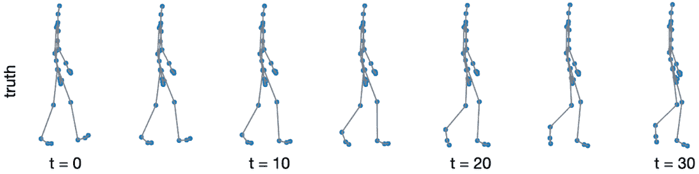

##### 图 6.2 展示了一个人体受试者行走的时间快照（t = 秒）。这些点代表放置在人体关键关节上的传感器。这些快照跨越了 30 秒。为了将这些图像表示为图，传感器的放置（关节）可以表示为节点，而身体关节之间的连接是边。

### 6.2.1 设置问题

我们的目标是预测所有单个关节的动态。显然，我们可以将其构建为一个图，因为所有关节都通过边连接，如图 6.2 所示。因此，使用图神经网络（GNNs）来解决这个问题是有意义的。然而，我们首先将比较另一种方法，这种方法没有考虑图数据，以作为我们 GNN 模型的基准。

#### 下载数据

我们在我们的代码仓库中包含了下载和预处理数据的步骤。数据包含在一个 zip 文件中，其中每个不同的试验都保存为高级系统格式(.asf)文件。这些.asf 文件基本上只是包含每个传感器在每个时间步的标签及其 xyz 坐标的文本文件。在下面的列表中，我们展示了一段文本的片段。

##### 列表 6.1 传感器数据文本文件示例

```py
   1
   root 4.40047 17.8934 -21.0986 -0.943965 -8.37963 -7.42612
   lowerback 11.505 1.60479 4.40928
   upperback 0.47251 2.84449 2.26157
   thorax -5.8636 1.30424 -0.569129
   lowerneck -15.9456 -3.55911 -2.36067
   upperneck 19.9076 -4.57025 1.03589
```

在这里，第一个数字是帧号，`root`是特定于传感器的，可以忽略。`lowerback`、`upperback`、`thorax`、`lowerneck`和`upperneck`表示传感器的位置。总共有 31 个传感器映射一个行走的人的运动。为了将这个传感器数据转换为轨迹，我们需要计算每个传感器的位置变化。这变成了一项相当复杂的工作，因为我们需要考虑每个帧之间各种传感器的平移运动和角旋转。在这里，我们将使用与 NRI 论文[2]中相同的数据文件。我们可以使用这些文件在 x、y 和 z 方向上绘制每个单个传感器的轨迹，或者观察传感器在二维空间中的运动，以了解整个身体的运动。图 6.3 中的例子展示了这一点，我们关注脚传感器的 x、y 和 z 方向的运动，以及随着时间的推移身体的整体运动（传感器以实心黑色星号表示）。

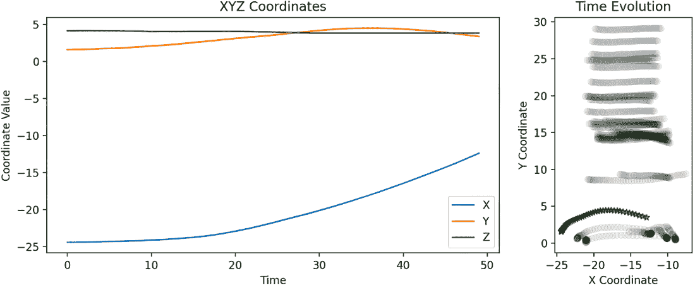

##### 图 6.3 传感器的预构建空间轨迹

除了空间数据，我们还可以计算速度数据。这些数据以每个电影帧的单独文件提供。速度数据变化的一个例子如图 6.4 所示。如图所示，速度数据在一个较小的范围内变化。空间和速度数据都将作为我们机器学习问题中的特征。在这里，我们现在有 31 个传感器和 33 个不同试验的每个传感器的 50 帧，共有六个特征。我们可以将此视为一个多元时间序列问题。我们试图预测一个六维（三个空间和三个速度）对象（每个传感器）的未来演化。我们的第一个方法将它们视为独立的，试图根据过去的传感器数据预测未来的位置和速度。然后我们将转向将其视为一个图，其中我们可以将所有传感器耦合在一起。

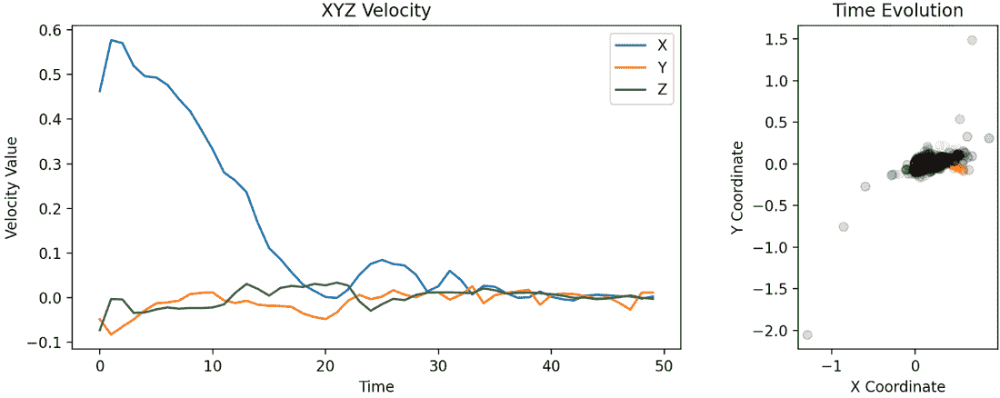

##### 图 6.4 传感器的预构建速度数据

目前，这是一个关系问题，但我们只考虑节点数据，而不是边数据。当存在节点数据而没有边数据时，我们必须小心不要做出太多的假设。例如，如果我们选择根据节点之间的距离来连接节点，那么我们可能会得到一个非常奇怪的骨架，如图 6.5 所示。幸运的是，我们还有边数据，这些数据是使用 CMU 数据集构建的，并包含在提供的数据中。这是一个警示故事，说明 GNN 的强大程度取决于它们训练的图，我们必须小心确保图结构正确。然而，如果边数据完全缺失，那么我们可以尝试从节点数据本身推断边数据。虽然我们在这里不会这样做，但请注意，我们将使用的 NRI 模型具有这种能力。


##### 图 6.5 显示错误推断图结构的传感器网络。节点是人体骨骼连接。左图显示了一个具有从节点邻近性推断的边（最近的节点相互连接）的网络。此图并不反映真实的人体骨骼。真正的边集在右图中显示。

我们现在已经加载了所有数据。总共有三个数据集（训练、验证、测试），每个数据集包含 31 个单个传感器位置。每个传感器包含六个特征（空间坐标），并通过一个随时间恒定的邻接矩阵连接。传感器图是无向的，边是无权的。训练和验证集包含 49 帧，测试集包含 99 帧。

### 6.2.2 带有记忆的模型构建

现在我们已经定义了问题并加载了数据，让我们考虑如何处理预测关节动态的问题。首先，我们需要思考基本目标是什么。本质上，我们将参与序列预测，就像手机上的自动完成或搜索工具一样。这类问题通常使用网络（如 transformers）来解决，我们在第四章中使用了注意力机制。然而，在基于注意力的网络之前，许多深度学习从业者通过在模型中引入记忆来处理序列预测任务[3]。这从直觉上是有意义的：如果我们想要预测未来，我们需要记住过去。

让我们构建一个简单的模型，该模型使用过去的事件预测所有单个传感器的下一个位置。本质上，这意味着我们将构建一个模型来预测没有边数据的节点位置。我们将尝试的示例如图 6.6 所示。在这里，我们将首先进行预处理和准备数据，以便传递给可以预测数据随时间演变的模型。这使我们能够根据几个输入帧预测姿态的变化。

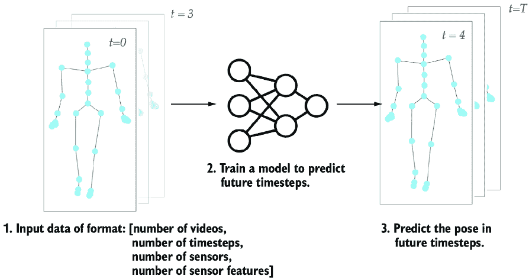

##### 图 6.6 仅使用传感器数据预测未来位置

为了将记忆引入我们的神经网络，我们首先考虑循环神经网络（RNN）。与卷积和注意力神经网络类似，RNN 是一类广泛的架构，是研究人员和实践者共同的基本工具。有关 RNN 的更多信息，请参阅例如《用 TensorFlow 进行机器学习》（Manning，2020 年，[`mng.bz/VVOW`](https://mng.bz/VVOW)）。RNN 可以被视为多个相互连接的独立网络。这些重复的子网络允许“记住”过去的信息，以及过去数据对未来预测的影响。初始化后，每个子网络都会接收输入数据以及最后一个子网络的输出，并使用这些信息进行新的预测。换句话说，每个子网络都会接收来自最近过去的信息和输入，以构建关于数据的推理。然而，普通的 RNN 只会记住前一步。它们的记忆非常短暂。为了增强过去对未来影响的效果，我们需要更强大的东西。

长短期记忆（LSTM）网络是另一种用于建模和预测时间或序列信息的极受欢迎的神经网络架构。这些网络是 RNN 的特殊情况，类似于将多个子网络链接在一起。不同之处在于，LSTMs 在子网络结构中引入了更复杂的依赖关系。LSTMs 对于序列数据特别有用，因为它们解决了 RNN 中观察到的梯度消失问题。简单来说，*梯度消失*指的是我们使用梯度下降法训练神经网络时，梯度变为零的情况。当我们训练具有许多层的 RNN 时，这种情况尤其可能发生。（我们在这里不会深入探讨其原因，但如果您对此感兴趣，请阅读《用 Python 进行深度学习》（Manning，2024 年，[`mng.bz/xKag`](https://mng.bz/xKag)）以获取更多信息。）

门控循环单元网络（GRUs）通过允许将关于最近过去的新信息添加到记忆存储中，解决了梯度消失的问题。这是通过一个门控结构实现的，模型架构中的门控帮助控制信息的流动。这些门控还为我们构建和调整神经网络添加了一个新的设计元素。在这里我们不会考虑 LSTM，因为它超出了本书的范围，但再次建议您查阅《用 Python 进行深度学习》（Manning，2024 年，[`mng.bz/xKag`](https://mng.bz/xKag)）以获取更多信息。

#### 构建循环神经网络

现在我们来看看如何使用 RNN 来预测随时间变化的身体传感器的轨迹，这将成为我们未来性能提升的基准之一。我们不会深入探讨 RNN 和 GRU 架构的细节，但有关信息可在本章 6.5 节末尾找到。

这个模型的想法是我们的 RNN 将预测传感器的未来位置，而不考虑关系数据。当我们开始介绍我们的图模型时，我们将看到如何改进这一点。

我们将使用与图 6.7 所示相同的深度学习标准训练循环。一旦我们定义了我们的模型并定义了训练和测试循环，我们就使用这些循环来训练和测试模型。一如既往，我们将训练数据和测试数据完全分开，并包括一个验证数据集，以确保我们的模型在训练过程中不会过拟合。

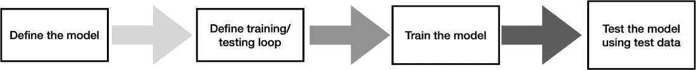

##### 图 6.7 本章我们将遵循的深度学习模型的标准训练流程

这里使用的训练循环相当标准，所以我们首先描述它。在列表 6.2 中显示的训练循环定义中，我们遵循与之前章节相同的惯例，通过固定数量的时代在模型预测和损失更新之间循环。在这里，我们的损失将包含在我们的标准函数中，我们将其定义为简单的均方误差（MSE）损失。我们将使用学习率调度器，该调度器将在验证损失开始平台期后降低学习率参数。我们将最佳损失初始化为无穷大，并在验证损失小于最佳损失`N`步之后降低学习率。

##### 列表 6.2 训练循环

```py
   num_epochs = 200  
   train_losses = []
   valid_losses = []

   pbar = tqdm(range(num_epochs))

   for epoch in pbar:

        train_loss = 0.0  #1
        valid_loss = 0.0  #1

        modelRNN.train()  #2
        for i, (inputs, labels) in enumerate(trainloader):
             inputs = inputs.to(device)
             labels = labels.to(device)

        optimizer.zero_grad()  #3

        outputs = modelRNN(inputs)  #4
        loss = criterion(outputs, labels)  #4
        loss.backward()  #4
        optimizer.step()  #4

        train_loss += loss.item() * inputs.size(0)  #5

        modelRNN.eval()   #6
        with torch.no_grad():
             for i, (inputs, labels) in enumerate(validloader):
                  inputs = inputs.to(device)
                  labels = labels.to(device)

                  outputs = modelRNN(inputs) 
                  loss = criterion(outputs, labels)
                  valid_loss += loss.item() * inputs.size(0)

         if valid_loss < best_loss:  #7
              best_loss = valid_loss
              counter = 0
         else:
              counter += 1

         scheduler.step(best_loss)  #8

         if counter == early_stop:
         print(f"\n\nEarly stopping \
initiated, no change \
after {early_stop} steps")
         break

        train_loss = train_loss/len(trainloader.dataset)  #9
        valid_loss = valid_loss/len(validloader.dataset)  #9

        train_losses.append(train_loss)  #9
        valid_losses.append(valid_loss)  #9
```

#1 初始化损失和准确率变量

#2 开始训练循环

#3 将参数梯度置零

#4 前向 + 反向 + 优化

#5 更新训练损失，乘以当前小批次的样本数

#6 开始验证循环

#7 检查早期停止

#8 步进调度器

#9 计算并存储损失

两个层都针对特定任务进行训练（使用列表 6.3 中的训练循环）。对于 RNN 和 GRU，数据的格式将是单独的试验或视频，帧时间戳，传感器数量和传感器的特征。通过提供分割成单独时间快照的数据，模型能够利用时间方面进行学习。在这里，我们使用 RNN 根据 40 个之前的帧预测每个单独传感器的未来位置。对于所有的计算，我们将基于节点特征（位置和速度）使用最小-最大缩放来归一化数据。

在我们完成训练循环后，我们测试我们的网络。一如既往，我们不希望更新网络的参数，因此我们确保没有反向传播的梯度（通过选择`torch.no_grad()`）。请注意，我们选择 40 个序列长度，以便我们的测试循环能够看到前 40 帧，然后尝试推断最后的 10 帧。

##### 列表 6.3 测试循环

```py
   model.eval()   #1
   predictions = [] 
   test_losses = [] 
   seq_len = 40 

   with torch.no_grad():
        for i, (inputs, targets) in enumerate(testloader):
             inputs = inputs.to(device)
             targets = targets.to(device)

             preds = []
             for _ in range(seq_len):
                  output = model(inputs)
                  preds.append(output)

             inputs = torch.cat([inputs[:, 1:]\
, output.unsqueeze(1)], dim=1) \ #2

        preds = torch.cat(preds, dim=1)  #3
           loss = criterion(preds, targets)  #3
           test_losses.append(loss.item())  #3

           predictions.append(preds.detach().cpu().numpy())

    predictions = np.concatenate(predictions, axis=0)  #4
   test_loss = np.mean(test_losses)  #5
```

#1 将模型设置为评估模式

#2 更新下一次预测的输入

#3 计算此序列的损失

#4 将预测转换为 NumPy 数组以便更容易操作

#5 计算平均测试损失

一旦我们的模型被定义，我们就可以使用列表 6.3 中给出的训练循环来训练我们的模型。在这个阶段，你可能想知道我们如何修改训练循环以正确地考虑反向传播时的时序元素。好消息是，PyTorch 会自动处理这个问题。我们发现，RNN 模型能够以 70%的准确率预测验证数据的未来位置，以及 60%的准确率预测测试数据的未来位置。

我们还尝试了一个 GRU 模型来预测未来的步骤，并发现这个模型使用验证数据能够达到 75%的准确率。这相当低，但考虑到模型的简单性和我们传递给它的信息量很小，这并不低。然而，当我们测试模型在测试数据上的性能时，我们可以看到性能下降到 65%。我们的模型的一些示例输出显示在图 6.8 中。显然，模型很快就会退化，估计的姿态位置开始大幅变化。为了获得更高的准确率，我们需要在姿态数据中使用一些关系归纳偏见。

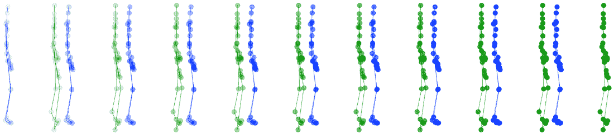

##### 图 6.8 使用 RNN 预测未来运动。在这里，左边的图表示真实数据，右边的图表示预测数据。

## 6.3 动态图神经网络

为了预测图的未来演化，我们需要重新结构我们的数据以考虑时序数据。具体来说，动态 GNN 连接图演化的不同连续快照，并学习预测未来的演化[4–6]。实现这一目标的一种方法是将它们组合成一个单一的图。这个时序图现在包含了每一步的数据以及作为具有时序边的节点编码的时序连接。我们将首先通过采用对图演化建模的朴素方法来处理姿态估计的任务。我们将探讨如何将我们的时序数据组合成一个大型图，然后通过屏蔽感兴趣的节点来预测未来的演化。我们将使用与第三章中看到相同的 GAT 网络。然后，在第 6.4 节中，我们将展示另一种通过编码每个图的快照并使用变分自编码器（VAEs）和 RNNs 的组合来预测演化的方法，即 NRI 方法[2]。

### 6.3.1 动态图上的图注意力网络

我们将探讨如何将我们的姿态估计问题转换为基于图的问题。为此，我们需要构建一个考虑时间信息的邻接矩阵。首先，我们需要将我们的数据作为 PyTorch Geometric（PyG）数据对象加载进来。我们将使用与训练我们的 RNN 相同的地点和速度数据。这里的区别在于，我们将构建一个包含所有数据的单个图。列表 6.4 中的代码片段展示了我们如何初始化我们的数据集。我们传递位置和速度数据以及边缘数据所在的路径。我们还传递是否需要转换我们的数据以及我们将预测的掩码和窗口大小。

##### 列表 6.4 以图形式加载数据

```py
   class PoseDataset(Dataset):
        def __init__(self, loc_path, 
                          vel_path, 
                          edge_path, 
                          mask_path, 
                          mask_size, 
                          transform=True):

       self.locations = np.load(loc_path)  #1
        self.velocities = np.load(vel_path)  #1
        self.edges = np.load(edge_path)

        self.transform=transform
        self.mask_size = mask_size  #2
        self.window_size = self.locations\
.shape[1] - self.mask_size  #3
```

#1 从.npy 文件加载数据

#2 确定掩码大小

#3 确定窗口大小

对于我们所有的数据集对象，我们需要在类中实现一个`get`方法来描述如何检索这些数据，这将在列表 6.5 中展示。此方法将位置和速度数据组合成节点特征。我们还提供了一个选项，可以使用`normalize_array`函数转换数据。

##### 列表 6.5 使用位置和速度数据设置节点特征

```py
   def __getitem__(self, idx):
        nodes = np.concatenate((self.locations[idx], 
   self.velocities[idx]), axis=2)  #1
        nodes = nodes.reshape(-1, nodes.shape[-1])  #2

        if self.transform:  #3
             nodes, node_min, node_max\
    = normalize_array(nodes) 

        total_timesteps = self.window_size + self.mask_size  #4
        edge_index = np.repeat(self.\
edges[None, :], total_timesteps, axis=0) 

         N_dims = self.locations.shape[2]
        shift = np.arange(total_\
   timesteps)[:, None, None]*N_dims  #5
         edge_index += shift
         edge_index = edge_index.reshape(2, -1)   #6

         x = torch.tensor(nodes, dtype=torch.float)  #7
         edge_index = torch.tensor\
(edge_index, dtype=torch.long) 
          mask_indices = np.arange(         #8
               self.window_size * self.\
locations.shape[2],                        
               total_timesteps * \
self.locations.shape[2]                    
                    )                      
           mask_indices = torch.tensor(mask_indices, dtype=torch.long)

           if self.transform:
                  trnsfm_data = [node_min, node_max]
                  return Data(x=x, 
                       edge_index=edge_index, 
                       mask_indices=mask_indices,  
                       trnsfm=trnsfm_data
                        )
            return Data(x=x, edge_index=\
edge_index, mask_indices=mask_indices)
```

#1 将每个节点的位置和速度数据连接起来

#2 确定掩码大小

#3 如果转换为 True，则应用归一化

#4 对总时间步数（过去+未来）重复边缘

#5 将平移应用于边缘索引

#6 将边缘索引展平到二维

#7 将所有内容转换为 PyTorch 张量

#8 计算掩码节点的索引

接下来，我们希望将不同时间步长的所有节点组合成一个包含所有单独帧的大型图。这给出一个覆盖所有不同时间步长的邻接矩阵。（关于时间邻接矩阵概念的进一步细节，请参阅本章末尾的 6.5 节。）为了对我们的姿态估计数据进行此操作，我们首先构建每个时间步长的邻接矩阵，如列表 6.6 所示，并包含在列表 6.5 中。

如图 6.9 所示，过程从表示跨越多个时间步长的图数据开始，其中每个时间步长被视为一个独立的层（步骤 1）。所有节点都有节点特征数据（图中未显示）。对于我们的应用，节点特征数据由位置和速度信息组成。

在同一时间步长内的节点通过时间步长内边缘相互连接，即同一时间步长层（步骤 2）之间的节点连接。这些边缘确保特定时间步长的每个图在内部是一致的。节点尚未在不同时间步长之间连接。

为了纳入时间关系，添加了时间步长间边缘（即不同时间步长层之间的节点连接），以连接相邻时间步长中的对应节点（步骤 3）。这些边缘允许不同时间步长的节点之间传递信息，从而实现图数据的时序建模。

为了预测未来的值，最后时间步的节点被掩码以表示未知数据（步骤 4）。这些掩码节点被视为预测任务的靶标。它们的值是未知的，但可以通过利用早期时间步中未掩码节点的特征和关系来推断。

推理过程（步骤 5）涉及使用来自先前时间步（t = 0 和 t = 1）的未掩码节点的已知特征来预测 t = 2 中掩码节点的特征。虚线箭头说明了信息如何从未掩码节点流向掩码节点，显示了预测对早期图数据的依赖性。这把任务转换成了一个节点预测问题，其目标是根据未掩码节点的关联和特征来估计掩码节点的特征。

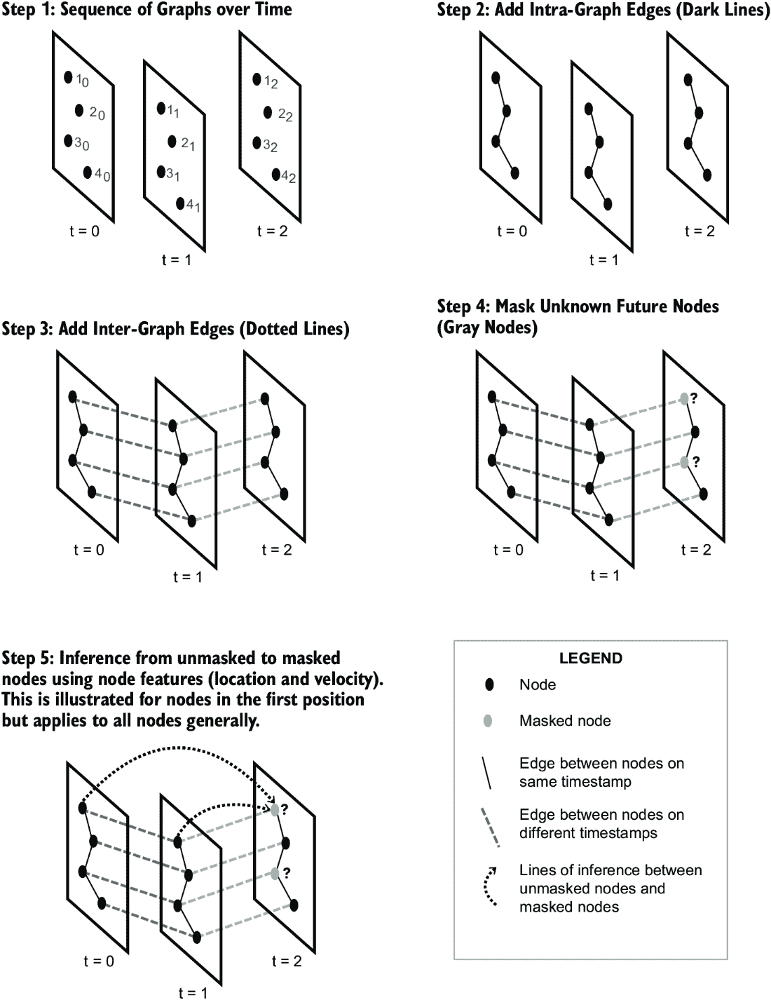

##### 图 6.9 时空图构建和推理过程的示意图。步骤 1 显示了时间步之间的图序列，每个时间步的节点代表实体。步骤 2 突出了同一图层内节点之间的时间步内边（实线）。步骤 3 引入了时间步间边（虚线），通过连接相邻时间步中相应的节点来编码时间依赖性。在步骤 4 中，最终时间步的节点被掩码（灰色）以表示预测的未知值。步骤 5 展示了推理过程（虚线箭头），其中使用早期时间步中未掩码节点的信息来估计掩码节点的特征。图例说明了在图表示中使用的节点和边的类型。

##### 列表 6.6 构建邻接矩阵

```py
       total_timesteps = self.\
window_size + self.mask_size  #1
       edge_index = np.repeat(self.edges[None, :],\
 total_timesteps, axis=0) 

       shift = np.arange(total_timesteps)[:, None, \
None] * num_nodes_per_timestep  #2
       edge_index += shift  #3
       edge_index = edge_index.reshape(2, -1)  #4
```

#1 重复边以匹配总时间步数（过去 + 未来）

#2 为每个时间步创建一个偏移

#3 将偏移应用于边索引

#4 将边索引展平到二维

现在我们有了邻接矩阵，下一步是构建一个可以预测未来时间步的模型。在这里，我们将使用第四章中介绍的 GAT 模型 [7]。我们选择这个 GNN 是因为它可以比其他 GNN 更具表现力，我们想要一个能够考虑不同时间和空间信息的模型。模型架构在列表 6.7 中提供。

##### 列表 6.7 定义 GAT 模型

```py
  class GAT(torch.nn.Module):
        def __init__(self, n_feat,
                      hidden_size=32,
                      num_layers=3,
                      num_heads=1,
                      dropout=0.2,
                      mask_size=10):
             super(GAT, self).__init__()

             self.num_layers = num_layers
             self.heads = num_heads
             self.n_feat = n_feat
             self.hidden_size = hidden_size
             self.gat_layers = torch.nn.ModuleList()
             self.batch_norms = torch.nn.ModuleList()
             self.dropout = nn.Dropout(dropout)
             self.mask_size = mask_size

             gat_layer = GATv2Conv(self.n_feat,\
 self.hidden_size, heads=num_heads)  #1
             self.gat_layers.append(gat_layer)  #1
             middle_size = self.hidden_size*num_heads 
             batch_layer = nn.BatchNorm1d\
(num_features=middle_size)  #2
             self.batch_norms.append(batch_layer) #2

             for _ in range(num_layers-2):  #3
                  gat_layer = GATv2Conv(input_size,\
 self.hidden_size, heads=num_heads) 
                  self.gat_layers.append(gat_layer) 
                  batch_layer = nn.BatchNorm1d(num_features\
=middle_size)                                           #4
                  self.batch_norms.append(batch_layer) 

             gat_layer = GATv2Conv(middle_size, self.n_feat)
             self.gat_layers.append(gat_layer)  #5

        def forward(self, data):
             x, edge_index = data.x, data.edge_index
             for i in range(self.num_layers):
                  x = self.gat_layersi
                  if i < self.num_layers - 1:  #6
                       x = self.batch_normsi  #6
                       x = torch.relu(x)  #6
                       x = self.dropout(x)  #6

             n_nodes = edge_index.max().item() + 1  #7
             x = x.view(-1, n_nodes, self.n_feat)
             return x[-self.mask_size:].view(-1, self.n_feat)
```

#1 第一个 GAT 层

#2 第一个 GAT 层的 BatchNorm 层

#3 中间 GAT 层

#4 中间 GAT 层的 BatchNorm 层

#5 最后一个 GAT 层

#6 不要将批归一化和 dropout 应用于最后一个 GAT 层的输出。

#7 仅输出最后一帧

此模型遵循第四章中概述的基本结构。我们定义了模型的层数和头数，以及相关的输入大小，这取决于我们预测的特征数量。我们每个 GAT 层都有一个隐藏大小，并包括 dropout 和批量归一化来提高性能。然后我们遍历模型中的层数，确保维度正确以匹配我们的目标输出。我们还定义了我们的前向函数，该函数预测掩码节点的节点特征。通过将每个时间步展开到更大的图中，我们开始引入时序效应，作为模型可以学习的额外网络结构。

在定义了模型和数据集之后，让我们开始训练我们的模型并看看它的表现如何。回想一下，RNN 和 GRU 在测试准确率上分别达到了 60%和 65%。在列表 6.8 中，我们展示了 GAT 模型的训练循环。这个训练循环遵循了之前章节中使用的相同结构。我们使用均方误差（MSE）作为损失函数，并将学习率设置为 0.0005。我们使用 GAT 计算掩码节点的节点特征，并将其与存储在`data`中的真实数据进行比较。我们首先训练我们的模型，然后使用验证集比较模型预测。请注意，由于我们现在预测了多个图序列，这个训练循环比之前的模型花费了更多的时间。在 Google Colab 的 V100 GPU 上，这需要不到一个小时来训练。

##### 列表 6.8 GAT 训练循环

```py
   lr = 0.001
   criterion = torch.nn.MSELoss()                            #1
   optimizer = torch.optim.Adam(model.parameters(), lr=lr)  

   for epoch in tqdm(range(epochs), ncols=300):
        model.train()
        train_loss = 0.0
        for data in train_dataset:
             optimizer.zero_grad()
             out = model(data)  #2

        loss = criterion(out, \
data.y.reshape(out.shape[0], -1))  #3
        loss.backward() 
        optimizer.step()
        train_loss += loss.item()

        model.eval()  #4
        val_loss = 0.0  #4
        with torch.no_grad():  #4
             for val_data in val_dataset:  #4
               val_out = model(val_data)  #5
                  val_loss += criterion(out, \
data.y.reshape(out.shape[0],\
 -1)).item()  #6

        val_loss /= len(val_dataset)
        train_loss /= len(train_dataset)
```

#1 初始化损失和优化器，设置学习率

#2 生成模型对输入的预测

#3 计算输出和目标之间的损失

#4 验证循环

#5 生成模型对输入的预测

#6 计算输出和目标之间的损失

最后，我们使用以下列表中所示的训练集和代码测试我们的训练好的模型。

##### 列表 6.9 GAT 测试循环

```py
   test_loss = 0
   for test_data in test_dataset:
        test_out = model(test_data)  #1
        test_loss += criterion(out,\
 data.y.reshape(out.shape[0], -1)).item()  #2
```

#1 生成模型对输入的预测

#2 计算输出和目标之间的损失

我们发现这种朴素的方法无法预测姿态。我们的整体测试准确率为 55%，预测的图表与我们对姿态外观的预期大相径庭。这是由于我们在单个图中存储了大量的数据。我们将节点特征和时序数据压缩到一个图中，并且在定义我们的模型时没有强调时序属性。有方法可以改进这一点，例如使用时序编码来提取未使用的边数据，就像在时序 GAT（TGAT）模型中那样。TGAT 将边视为动态的而不是静态的，这样每条边也编码了一个时间戳。

然而，没有这些时间数据，我们的模型变得过于表达，以至于姿态的整体结构已经与原始结构显著偏离，如图 6.10 中的预测姿态所示。接下来，我们将研究如何将两种方法中的优点结合起来，形成一个使用基于 RNN 预测的 GNN，通过在每个图快照上进行学习来实现。

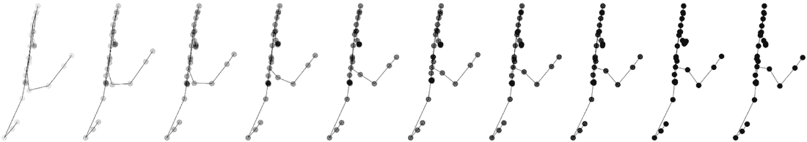

##### 图 6.10 GAT 模型的输出

## 6.4 神经关系推理

我们的研究中的 RNN 模型完全关注于时间数据，但忽略了底层的关系数据。这导致了一个模型，它在平均方向上能够移动，但并没有很好地改变各个传感器的位置。另一方面，我们的 GAT 模型通过将所有个体时间图编码成一个单一图，并尝试在未知未来图上进行节点预测，从而忽略了时间数据。这个模型导致传感器大幅移动，我们得到的图与我们所期望的人类移动方式非常不同。

如前所述，神经关系推理（NRI）是一种稍微不同的方法，它使用更复杂的编码框架来结合 RNN 和 GNNs 的最佳之处[2]。该模型的架构如图 6.11 所示。具体来说，NRI 使用自动编码器结构在每个时间步嵌入信息。因此，嵌入架构以类似于我们在第五章中讨论的 GAE 的方式应用于整个图。然后使用 RNN 更新编码的图数据。一个关键点是 NRI 会演化嵌入的潜在表示。


##### 图 6.11 NRI 的示意图（来源：Kipf 等人[2]）。该模型由一个编码器和解码器层以及几个消息传递步骤组成。然而，在这里，消息是从节点传递到边，然后从边传递回节点，再从节点传递回边。对于解码器，消息是从节点传递到边，然后从边传递回节点。最后一步使用潜在表示来预测身体时间演变的下一步。

让我们探索这个模型如何应用于我们的姿态估计问题，以便我们最好地理解模型中的不同组件。我们将在训练期间对一些数据进行掩码，然后在测试日识别这些掩码节点。回想一下，这相当于推断我们的视频中的未来帧。然而，我们现在需要改变模型架构和损失。我们需要改变模型架构以考虑新的自动编码器结构，并且需要调整损失以包括最小化重建损失以及 Kullback-Leibler 散度（KL 散度）。有关 NRI 模型和相关更改的更多信息，请参阅本章末尾的 6.5 节。

NRI 模型基类的代码在列表 6.10 中提供。从代码中可以看出，当我们调用这个类时，需要定义一个编码器和一个解码器。除了编码器和解码器之外，还有一些其他特定于模型的具体细节我们需要注意。首先，我们需要定义变量的数量。这关系到我们图中的节点数量，而不是每个节点的特征数量。在我们的情况下，这将对应于 31 个，对应于跟踪关节位置的每个不同传感器。我们还需要定义节点之间的不同类型边。这将表示为 1 或 0，表示是否存在边。

我们将假设节点或传感器的连接方式不会改变，也就是说，图结构是静态的。请注意，此模型还允许动态图，其中连接性随时间变化，例如，当不同的球员在篮球场周围移动时。球员的总数是固定的，但可以传球的球员数量会变化。实际上，此模型也被用来预测 NBA 球员如何传球。

最后，这个模型需要设置一些超参数，包括 Gumbel 温度和先验方差。*Gumbel 温度*控制在进行离散采样时探索和利用之间的权衡。在这里，我们需要使用一个离散概率分布来预测边类型。我们将在第 6.5 节中更详细地讨论这个问题。*先验方差*反映了我们在开始之前对图连接性的不确定性。我们需要设置这个参数，因为模型假设我们*不知道*连接性。实际上，模型学习的是最能帮助它改进预测的连接性。这正是我们在调用`_initialize_log_prior`函数时所做的设置。我们告诉模型我们对可能连接模式的最佳猜测。例如，如果我们将此模型应用于一个运动队，我们可能会使用高均值的高斯分布来表示经常互相传球或甚至同一队球员之间的边。

为了展示我们的模型，我们将假设一个均匀先验，这意味着所有边与其他边一样可能，或者用日常用语来说，“我们不知道。”先验方差为每个边设置我们的不确定性界限。在下面的列表中，我们将其设置为 5 × 10^(–5)，以保持数值稳定性，但鉴于我们的先验是均匀的，它不应有太大影响。

##### 列表 6.10 NRI 模型基类

```py
   class BaseNRI(nn.Module):
        def __init__(self, num_vars, encoder, decoder,
                num_edge_types=2,
                gumbel_temp=0.5, 
                prior_variance=5e-5):
           super(BaseNRI, self).__init__()
           self.num_vars = num_vars  #1
           self.encoder = encoder  #2
           self.decoder = decoder  #3
           self.num_edge_types = num_edge_types 
           self.gumbel_temp = gumbel_temp  #4
           self.prior_variance = prior_variance  #5

           self.log_prior = self._initialize_log_prior()

        def _initialize_log_prior(self): 
             prior = torch.zeros(self.num_edge_types)
             prior.fill_(1.0 / self.num_edge_types)  #6
             log_prior = torch.log(prior)\
   .unsqueeze(0).unsqueeze(0)  #7
             return log_prior.cuda(non_blocking=True)
```

#1 模式中的变量数量

#2 编码器神经网络

#3 解码器神经网络

#4 用于采样分类变量的 Gumbel 温度

#5 先验方差

#6 用均匀概率填充先验张量

#7 对数并添加两个单例维度

正如我们在第五章中发现的，VAEs 有两个组成部分的损失——重建误差和表示数据分布特性的误差——由 KL 散度捕捉。总损失函数在列表 6.11 中给出。

我们的编码器接收边缘嵌入，然后输出边缘类型的对数概率。Gumbel-Softmax 函数将这些离散的 logits 转换为可微的连续分布。解码器接收这个分布和边缘表示，然后将这些转换回节点数据。在这个时候，我们就可以使用 VAE 的标准损失机制了，所以我们计算重建损失为均方误差 (MSE) 和 KL 散度。对于 VAE 损失和 KL 散度如何计算的进一步了解，请回顾第五章。

##### 列表 6.11 NRI 模型的损失

```py
   def calculate_loss(self, inputs,
       is_train=False,
       teacher_forcing=True,
       return_edges=False,
       return_logits=False):

       encoder_results = self.encoder(inputs)
       logits = encoder_results['logits']
       hard_sample = not is_train
       edges = F.gumbel_softmax\
               (logits.view(-1, self.num_edge_types),
               tau=self.gumbel_temp,
               hard=hard_sample).view\
                       (logits.shape)  #1

       output = self.decoder(inputs[:, :-1], edges)

       if len(inputs.shape) == 3: \
target = inputs[:, 1:] 
       else:
           Target = inputs[:, 1:, :, :]

       loss_nll = F.mse_loss(\
output, target) / (2 * \
self.prior_variance)  #2

       probs = F.softmax(logits, dim=-1)
       log_probs = torch.log(probs + 1e-16)  #3
       loss_kl = (probs * \
(log_probs - torch.log(\
torch.tensor(1.0 /  #4
       self.num_edge_types)))).\
sum(-1).mean() 

        loss = loss_nll + loss_kl

        return loss, loss_nll, loss_kl, logits, output
```

#1 使用 PyTorch 的功能 API 计算 Gumbel-Softmax，在代码中导入为 F

#2 高斯分布的负对数似然 (NLL)

#3 添加一个小的常数以避免取零的对数

#4 与均匀分类分布的 KL 散度

最后，我们需要我们的模型能够预测传感器的未来轨迹。预测图未来状态的代码在列表 6.12 中给出。一旦我们的编码器和解码器被训练，这是一个相对简单的函数。我们传递当前图给编码器，这返回一个表示是否存在边缘的潜在表示。然后我们使用 Gumbel-Softmax 将这些概率转换为合适的分布，并将其传递给解码器。解码器的输出是我们的预测。我们可以直接获取预测，或者获取预测和是否存在边缘。

##### 列表 6.12 预测未来

```py
   def predict_future(self, inputs, prediction_steps, 
      return_edges=False, 
      return_everything=False): #1
       encoder_dict = self.encoder(inputs) #1
       logits = encoder_dict['logits'] 
       edges = nn.functional.gumbel_softmax(  #2
           logits.view(-1, \
           self.num_edge_types),  
           tau=self.gumbel_temp,\
           hard=True).view(logits.shape\ 
           ) 
       tmp_predictions, decoder_state =\
          self.decoder(  #3
          inputs[:, :-1],  #3
          edges,  #3
          return_state=True  #3
       )  #3
       predictions = self.decoder(  #4
          inputs[:, -1].unsqueeze(1),   #4
          edges,   #4
          prediction_steps=prediction_steps,   #4
          teacher_forcing=False,  #4
          state=decoder_state  #4
          ) #4
       if return_everything:  #5
           predictions = torch.cat([\  #4
              tmp_predictions,\  #5
              Predictions\  #5
              ], dim=1)  #5

       return (predictions, edges)\
          if return_edges else predictions  #6
```

#1 运行编码器以获取边缘类型的 logits

#2 将 Gumbel-Softmax 应用到边缘上

#3 运行解码器以获取初始预测和解码器状态

#4 使用最后一个输入和解码器状态来预测未来步骤

#5 如有必要，则连接初始和未来预测

#6 如果指定，则返回预测和边缘

这是 NRI 模型的基础。我们有一个编码器，它将我们的初始节点数据转换为边缘概率。边缘概率传递给我们的解码器，解码器根据最可能的图表示预测条件下的未来轨迹。我们的编码器将是一个简单的多层感知器 (MLP)，它处理图数据。我们的解码器需要能够做出未来预测，因此我们将使用 RNN 来实现这一点，具体是我们在第 6.2.2 节中讨论的相同的 GRU 模型。接下来，让我们认识一下编码器和解码器网络，这样我们就可以将模型应用于数据并查看其性能。

### 6.4.1 编码姿态数据

现在我们已经了解了我们 NRI 模型的不同部分，让我们定义我们的编码器。这个编码器将作为瓶颈来简化我们的问题。编码后，我们将剩下边数据的低维表示，所以我们在这个阶段不需要担心时间数据。然而，通过一起提供我们的时间数据，我们将时间结构转移到我们的潜在空间中。具体来说，编码器从输入数据中提取时间模式和关系，并在压缩的低维表示中保留这些信息。这使得解码更容易，使我们的姿态预测问题更容易解决。

实现编码器有几个子集。首先，我们传递输入数据，它由不同帧、不同实验中的不同传感器组成。然后，编码器将此数据，*x*，执行消息传递步骤，将边数据转换为节点数据，然后再转换回边数据。然后，边数据再次转换为节点数据，在潜在空间中进行编码。这相当于三个消息传递步骤，从边到节点，从边到边，然后再从边到节点。重复的转换对于通过重复消息传递进行信息聚合和捕获图中的高阶交互是有用的。通过在节点和边之间重复转换，模型能够意识到局部和全局结构信息。

在整本书中，我们探讨了如何使用消息传递将节点或边特征转换为节点或边的复杂表示。这些是所有 GNN 方法的核心。NRI 模型与我们之前探索的方法略有不同，因为消息是在节点和边之间传递，而不是节点到节点或边到边。为了明确这些步骤的作用，我们将从 PyG 转向，并用纯 PyTorch 编写我们的模型。

在列表 6.13 中，我们展示了我们编码器的基类，它需要几个关键特性。首先，请注意，我们还没有描述将要用于编码数据的实际神经网络。我们将很快介绍这一点。相反，我们有两个消息传递函数，`edge2node`和`node2edge`，以及一个编码函数，`one_hot_recv`。

##### 列表 6.13 编码器基类

```py
   class BaseEncoder(nn.Module):
       def __init__(self, num_vars):
           super(BaseEncoder, self).__init__()
           self.num_vars = num_vars
           edges = torch.ones(num_vars)\
 - torch.eye(num_vars)  #1
           self.send_edges, self.\
recv_edges = torch.where(edges)  #2

           one_hot_recv = torch.nn.functional.one_hot(  #3
              self.recv_edges,  #3
              num_classes=num_vars  #3
                                                ) #3
           self.edge2node_mat = \
nn.Parameter(one_hot_recv.\
float().T, requires_grad=False)  #4

       def node2edge(self, node_embeddings):
           send_embed = \
node_embeddings[:, self.send_edges]  #5
           recv_embed = \
node_embeddings[:, self.recv_edges] 
           return torch.\
cat([send_embed, recv_embed], dim=2)  #6

       def edge2node(self, edge_embeddings):
           incoming = torch.\
matmul(self.edge2node_mat, edge_embeddings)  #7
           return incoming / (self.num_vars - 1)  #8
```

#1 创建表示变量之间边的矩阵

#2 查找存在边的索引

#3 创建接收边的 one-hot 表示

#4 创建边到节点转换的参数张量

#5 提取发送者和接收者的嵌入

#6 连接发送者和接收者的嵌入

#7 将边嵌入与边到节点矩阵相乘

#8 正则化传入的嵌入

我们编码器类的第一步是构建一个邻接矩阵。在这里，我们假设图是完全连接的，这意味着所有节点都与其他所有节点相连，但与自己不相连。`node2edge`函数接受节点嵌入数据并识别这些消息发送的方向。图 6.12 展示了我们构建邻接矩阵的一个示例。


##### 图 6.12 展示了为具有三个节点的完全连接图创建邻接矩阵的示例。左边的矩阵代表一个完全连接的图，中间的矩阵代表单位矩阵，右边的矩阵显示了减去单位矩阵后的最终邻接矩阵。这导致一个每个节点都与其他每个节点相连但没有自环的图。

下一个函数调用通过返回包含连接节点行和列的两个向量来确定哪些节点正在发送或接收数据。回想一下，在邻接矩阵中，行代表接收节点，列代表发送节点。输出结果是

```py
send_edges = tensor([0, 0, 1, 1, 2, 2])
recv_edges = tensor([1, 2, 0, 2, 0, 1])
```

我们可以理解为，行 0 的节点向列 1 和 2 的节点发送数据，依此类推。这使我们能够提取节点之间的边。一旦我们构建了节点嵌入，我们就使用发送和接收数据将节点数据转换为边。这就是`node2edge`函数的原理。

我们需要的下一个函数是如何根据我们的`edge_embeddings`构建`edge2node`。我们首先构建一个`edge2node`矩阵。在这里，我们使用一种 one-hot 编码方法，将接收到的边转换为 one-hot 编码表示。具体来说，我们创建一个矩阵，其中每一行表示该类别（接收节点）是否存在。对于我们的简单三个节点案例，接收边的 one-hot 编码方法如图 6.13 所示。

然后，我们将这个矩阵转置以交换行和列，这样维度将是（节点数，边数），并将其转换为 PyTorch 参数，以便我们可以对其进行微分。一旦我们有了`edge2node`矩阵，我们就将其与边嵌入相乘。我们的边嵌入将是形状为（边数，嵌入大小）的对象，这样将`edge2node`矩阵与边嵌入相乘就给我们一个形状为（节点数，嵌入大小）的对象。这些就是我们的新节点嵌入！最后，我们通过可能的节点数来归一化这个矩阵，以确保数值稳定性。

这一部分是理解模型中消息传递步骤的关键。（关于消息传递的更多信息，请回顾第二章和第三章。）正如所讨论的，一旦我们有一种在节点、边或两者的组合之间传递消息的原则性方法，我们就将这些嵌入应用于神经网络以获得非线性表示。为此，我们需要定义我们的嵌入架构。完整的编码器代码在列表 6.14 中给出。

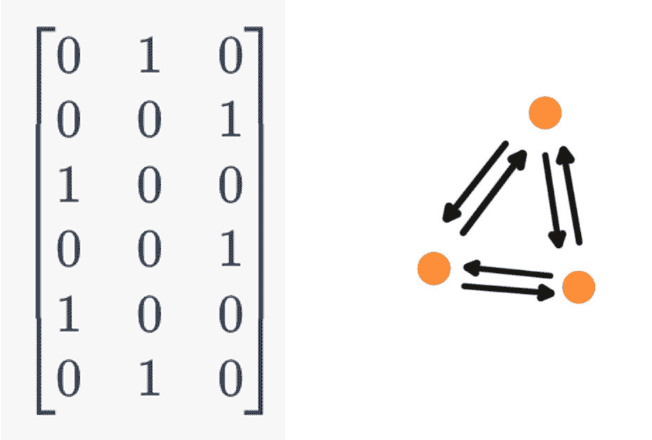

##### 图 6.13 展示了在具有三个节点的全连接图中，每个节点 incoming edges 的一热编码矩阵，位于左侧。每一行对应一条边，每一列对应一个节点。位置（i, j）处的 1 表示边 i 指向节点 j。这个矩阵用于在编码器基类的`edge2node`函数中将边嵌入转换为节点嵌入，使模型能够为每个节点聚合来自 incoming edges 的信息。在这个图结构中，节点 0、1 和 2 各自向其他两个节点发送消息，从而产生总共六个有向边。三个节点图的示意图位于右侧。

`RefMLPEncoder`在列表 6.14 中展示。这个编码器使用四个 MLP 进行消息处理，每个 MLP 都具备指数线性单元（ELU）激活和批归一化（在`RefNRIMLP`中定义，本章代码库中展示）。

备注：指数线性单元（ELU）是一种有用的激活函数，可用于平滑多层输出并防止梯度消失。与 ReLU 不同，ELU 在负输入时内置了更平滑的梯度，并允许有负输出。

网络的最后一部分（`self.fc_out`）是一系列带有 ELU 激活的线性层，以输出所需嵌入或预测的线性层结束。这个序列的最后一层是一个全连接层。

##### 列表 6.14 NRI MLP 编码器

```py
   class RefMLPEncoder(BaseEncoder):
       def __init__(self, 
               num_vars=31, 
               input_size=6, 
               input_time_steps=50, 
               encoder_mlp_hidden=256, 
               encoder_hidden=256, 
               num_edge_types=2, 
               encoder_dropout=0.):
           super(RefMLPEncoder, self).__init__(num_vars)
           inp_size = input_size * input_time_steps
           hidden_size = encoder_hidden
           num_layers = 3
           self.input_time_steps = input_time_steps

           self.mlp1 = RefNRIMLP\
(inp_size, hidden_size, \
hidden_size, encoder_dropout)  #1
           self.mlp2 = RefNRIMLP\
(hidden_size*2, hidden_size,\
 hidden_size, encoder_dropout) 
           self.mlp3 = RefNRIMLP\
(hidden_size, hidden_size,\
 hidden_size, encoder_dropout) 
           mlp4_inp_size = hidden_size * 2
           self.mlp4 = RefNRIMLP\
(mlp4_inp_size, hidden_size,\
 hidden_size, encoder_dropout)

           layers = [nn.Linear\
(hidden_size, encoder_mlp_hidden), \
nn.ELU(inplace=True)]  #2
           layers += [nn.Linear\
(encoder_mlp_hidden, \
encoder_mlp_hidden),\ 
   nn.ELU(inplace=True)] \
   * (num_layers - 2) 
           layers.append(nn.\
Linear(encoder_mlp_hidden, \
num_edge_types)) 
           self.fc_out = nn.Sequential(*layers) 
           self.init_weights()
```

#1 定义了 MLP 层。RefNRIMLP 是一个 2 层全连接 ELU 网络，带有批归一化。

#2 定义了最终的完全连接层

在这里，我们定义与编码器相关的架构细节。如前所述，我们使用`num_vars`变量表示 31 个传感器。特征数量为 6，这是网络的`input_size`。我们的训练和验证集的时间步数为 50，编码器网络的大小将为 256。`edge_types`的数量为 2，我们假设权重没有 dropout。然后我们初始化我们的网络，这些是典型的 MLP，在共享的代码库中描述。网络包括一个批归一化层和两个全连接层。一旦定义了网络，我们也预先初始化权重，如列表 6.15 所示。在这里，我们遍历所有不同的层，然后使用 Xavier 初始化方法初始化权重。这确保了层中的梯度都大致处于相似的比例，从而降低了损失迅速发散的风险——即爆炸。当我们像这里这样组合具有不同架构的多个网络时，这是一个重要的步骤。我们还设置了初始偏置为 0.1，这有助于提高训练的稳定性。

##### 列表 6.15 权重初始化

```py
    def init_weights(self):
        for m in self.modules():
            if isinstance(m, nn.Linear):  #1
                nn.init.xavier_normal_(m.weight.data)  #2
                m.bias.data.fill_(0.1)  #3
```

#1 仅适用于线性层

#2 使用 Xavier 正态初始化权重

#3 将偏置设置为 0.1

最后，我们需要定义我们的前向传递方法，如列表 6.16 所示。这就是我们的消息传递步骤发生的地方。

##### 列表 6.16 编码器前向传递

```py
   def forward(self, inputs, state=None, return_state=False):
       if inputs.size(1) > self.input_time_steps:
           inputs = inputs[:, -self.input_time_steps:]
       elif inputs.size(1) < self.input_time_steps:
           begin_inp = inputs[:, 0:1].expand(
           -1, 
           self.input_time_steps-inputs.size(1),
           -1, -1
           )
           inputs = torch.cat([begin_inp, inputs], dim=1) #1

       x = inputs.transpose(1, 2).contiguous()  #1
       x = x.view(inputs.size(0), inputs.size(2), -1) 

       x = self.mlp1(x)  #2
       x = self.node2edge(x)  #3
       x = self.mlp2(x)  #4

       x = self.edge2node(x)  #5
       x = self.mlp3(x)

       x = self.node2edge(x)  #6
       x = self.mlp4(x)

       result =  self.fc_out(x)  #7
       result_dict = {
          'logits': result,
          'state': inputs,
           }
       return result_dict
```

#1 新形状：[num_sims, num_atoms, num_timesteps*num_dims]

#2 通过第一个 MLP 层（每个节点两个 ELU 网络层）

#3 将节点嵌入转换为边嵌入

#4 通过第二个 MLP 层

#5 将边嵌入转换回节点嵌入

#6 再次将节点嵌入转换为边嵌入

#7 最终的全连接层以获取 logits

我们的编码器允许我们的模型将我们的传感器图的帧集转换为边概率的潜在表示。接下来，让我们探索如何构建一个解码器，该解码器使用最近的传感器数据将潜在边概率转换为轨迹。

### 6.4.2 使用 GRU 解码姿态数据

为了将潜在表示转换为未来帧，我们需要考虑轨迹的时间演化。为此，我们训练一个解码器网络。在这里，我们将遵循 NRI 论文[2]的原始结构，并使用 GRU 作为我们的 RNN。

我们在 6.2.2 节中介绍了 GRU 的概念。为了快速回顾，门控循环单元（GRU）是一种使用门控过程来允许 RNN 捕获数据中长期行为的 RNN 类型。它们由两种类型的门组成——重置门和更新门。

对于 NRI 模型，我们将 GRU 应用于我们的边，而不是整个图。更新门将用于确定根据接收到的数据，应该更新节点隐藏状态的多少，而重置门决定应该删除或“忘记”多少。换句话说，我们将使用 GRU 根据编码器网络中的边类型概率预测节点的未来状态。

让我们一步一步地看看我们是如何构建这个步骤的。我们的解码器初始化代码在列表 6.17 中给出。首先，我们注意到传递给这个网络的一些变量。我们再次定义我们图中变量或节点的数量，31 个，以及输入特征的个数，6 个。我们假设权重没有 dropout，并且每层的隐藏大小为 64。再次明确，我们的解码器应该预测两种不同类型的边。在预测时，我们也会跳过第一种边类型，因为这表示没有边。

一旦我们定义了输入参数，我们就可以引入网络架构。第一层是一个简单的线性网络，需要具有两倍的输入维度，以考虑由编码器提供的均值和方差，并且我们为每种边类型定义了这个网络。然后我们定义第二层以进一步提高我们网络的表达能力。这两个线性层的输出传递给我们的 RNN，即 GRU。在这里，我们必须使用自定义 GRU 来考虑节点数据和边数据。GRU 的输出传递给三个更多的神经网络层以提供未来预测。最后，我们需要定义我们的`edge2node`矩阵以及发送和接收节点，就像我们处理编码器时那样。

##### 列表 6.17 RNN 解码器

```py
   class GraphRNNDecoder(nn.Module):
       def __init__(self, 
           num_vars=31, 
           input_size=6, 
           decoder_dropout=0., 
           decoder_hidden=64, 
           num_edge_types=2, 
           skip_first=True):
           super(GraphRNNDecoder, self).__init__()
           self.num_vars = num_vars
           self.msg_out_shape = decoder_hidden
           self.skip_first_edge_type = skip_first
           self.dropout_prob = decoder_dropout
           self.edge_types = num_edge_types

           self.msg_fc1 = nn.ModuleList\
([nn.Linear(2 * decoder_hidden,\
 decoder_hidden) for _ in \
range(self.edge_types)])  #1
           self.msg_fc2 = nn.ModuleList\
([nn.Linear(decoder_hidden, decoder_hidden)\
 for _ in range(self.edge_types)])

           self.custom_gru = CustomGRU\
(input_size, decoder_hidden)  #2

           self.out_fc1 = nn.Linear\
(decoder_hidden, decoder_hidden)  #3
           self.out_fc2 = nn.Linear(decoder_hidden, decoder_hidden)
           self.out_fc3 = nn.Linear(decoder_hidden, input_size)

           self.num_vars = num_vars
           edges = np.ones(num_vars) - np.eye(num_vars)
           self.send_edges = np.where(edges)[0]
           self.recv_edges = np.where(edges)[1]
           self.edge2node_mat = \
                torch.FloatTensor\
                (encode_onehot(self.recv_edges))
           self.edge2node_mat = self.edge2node_mat.cuda(non_blocking=True)
```

#1 与边相关的层

#2 GRU 层

#3 全连接层

在列表 6.18 中，我们提供了我们的 GRU 架构。这个网络的整体架构与典型的 GRU 结构相同。我们定义了三个隐藏层，这些层代表了由`hidden_r`和`input_r`定义的重置门，由`hidden_i`和`input_i`定义的更新门，以及由`hidden_h`和`input_h`定义的激活网络。然而，正向网络需要考虑来自编码器消息传递输出的聚合消息。这可以在正向传递中看到。我们将`agg_msgs`中的边概率以及输入节点数据传递，这些数据结合起来返回未来预测。这可以在我们的基础 NRI 类中的`predict_future`代码中看到：

```py
      predictions = self.decoder(inputs[:, -1].unsqueeze(1), edges,
      prediction_steps=prediction_steps, teacher_forcing=False, 
      state=decoder_state)
```

我们的解码器接收我们图的最后一个时间帧。从编码器输出的边数据也传递给解码器。

##### 列表 6.18 自定义 GRU 网络

```py
   class CustomGRU(nn.Module):
       def __init__(self,input_size, n_hid,num_vars=31):
           super(CustomGRU, self).__init__()
           self.num_vars = num_vars
           self.hidden_r = nn.Linear
(n_hid, n_hid, bias=False)  #1
           self.hidden_i = nn.Linear\
(n_hid, n_hid, bias=False) 
           self.hidden_h = nn.Linear\
(n_hid, n_hid, bias=False) 

           self.input_r = nn.Linear\
(input_size, n_hid, bias=True)  #2
           self.input_i = nn.Linear(\
input_size, n_hid, bias=True) 
           self.input_n = nn.Linear\
(input_size, n_hid, bias=True) 

       def forward(self, inputs, agg_msgs, hidden):
           inp_r = self.input_r(inputs)\
.view(inputs.size(0), self.num_vars, -1)
           inp_i = self.input_i(inputs)\
.view(inputs.size(0), self.num_vars, -1)
           inp_n = self.input_n(inputs)\
.view(inputs.size(0), self.num_vars, -1)

           r = torch.sigmoid(inp_r + \
self.hidden_r(agg_msgs))  #3
           i = torch.sigmoid(inp_i + \
self.hidden_i(agg_msgs))  #4
           n = torch.tanh(inp_n + \
r*self.hidden_h(agg_msgs))  #5
           hidden = (1 - i)*n + i*hidden  #6

           return hidden
```

#1 定义重置、输入和新门的隐藏层变换

#2 定义重置、输入和新门的输入层变换

#3 计算重置门激活

#4 计算输入门激活

#5 计算新门激活

#6 隐藏状态更新

解码器网络的输出是未来的预测时间步。为了更好地理解这一点，让我们看看解码器的正向传递方法，如列表 6.19 所示。我们的正向传递接收输入和采样边来构建预测。还有四个额外的参数有助于控制行为。首先，我们定义一个`teacher_forcing`变量。教学强制是一种在训练序列模型时常用的典型方法，例如 RNN。如果这是真的，我们使用真实值（真实图）来预测下一个时间帧。当这是假的时，我们使用模型上一个时间步的输出。这确保了模型在训练期间不会被错误的预测所误导。接下来，我们包括一个`return_state`变量，它允许我们访问解码器网络提供的隐藏表示。当我们预测未来图演化时，我们使用这个变量，如这里所示：

```py
     tmp_predictions, decoder_state = \
        self.decoder(inputs[:, :-1], edges, 
        return_state=True)
     predictions = self.decoder\
        (inputs[:, -1].unsqueeze(1), edges, 
        prediction_steps=prediction_steps, \
        teacher_forcing=False, state=decoder_state)
```

现在我们来讨论预测过程。首先，我们预测一个临时预测集。然后，我们使用隐藏表示来预测所需的所有未来步骤。当我们想要预测多个时间步时，这特别有用，正如我们在该模型的测试阶段所展示的。这由`prediction_steps`变量控制，它告诉我们 RNN 要循环多少次，即我们想要预测多少未来的时间步。最后，我们有一个`state`变量，用于控制传递给解码器的信息。当它为空时，我们初始化一个零张量，以便没有信息被传递。否则，我们将使用之前时间步的信息。

##### 列表 6.19 解码器正向传递

```py
     def forward(self, inputs, sampled_edges,
         teacher_forcing=False,
         return_state=False,
         prediction_steps=-1,
         state=None):

         batch_size, time_steps, num_vars, num_feats = inputs.size()
         pred_steps = prediction_steps if \
            prediction_steps > 0 else time_steps  #1

         if len(sampled_edges.shape) == 3:  #2
             sampled_edges = sampled_edges.unsqueeze(1) 
             sampled_edges = sampled_edges.expand\
                (batch_size, pred_steps, -1, -1) 

         if state is None:  #3
             hidden = torch.zeros(batch_size,  #3
                Num_vars,  #3
                Self.msg_out_shape,  #3
                device=inputs.device)  #3
         else:  #3
             hidden = state  #3
             teacher_forcing_steps = time_steps  #4

         pred_all = []
         for step in range(pred_steps):  #5
         if step == 0 or (teacher_forcing \
            and step < teacher_forcing_steps): 
             ins = inputs[:, step, :] 
         else: 
             ins = pred_all[-1] 

         pred, hidden = self.single_step_forward(  #6
              ins,   #6
              sampled_edges[:, step, :],   #6
              hidden  #6
              )  #6
              pred_all.append(pred)

         preds = torch.stack(pred_all, dim=1)

         return (preds, hidden) if return_state else preds  #7
```

#1 确定预测步骤的数量

#2 如有必要扩展 sampled_edges 张量

#3 如果未提供，初始化隐藏状态

#4 确定应用教师强制的步骤数量

#5 根据教师强制决定这一步的输入

#6 使用从输入或 pred_all 计算出的 ins 执行单个正向步骤（见上一条注释）

#7 返回预测和隐藏状态

为了预测未来的时间步，我们进行一个基于单个时间步的额外正向传递，如第 6.20 列所示。这是我们的网络执行额外消息传递步骤的地方。我们取我们的接收节点和发送节点，这些节点是从编码器的边概率中定义的。我们忽略第一个边，因为这些是无连接的节点，然后网络遍历不同类型的边，从网络中获取所有与边相关的消息。这是使我们的预测依赖于图数据的临界步骤。我们的 GRU 随后从连接节点接收消息，以告知其对轨迹的预测。在这一步，我们正在学习如何根据我们对身体连接的了解来预测身体的行走方式。输出包括身体上传感器的预测轨迹以及为什么做出这些预测的网络数据，这些数据编码在隐藏权重中。这完成了估计姿态的 NRI 模型。

##### 列表 6.20 解码器单步正向

```py
     def single_step_forward(self, inputs, rel_type, hidden):
         receivers = hidden[:, self.recv_edges, :]  #1
         senders = hidden[:, self.send_edges, :]  #1

         pre_msg = torch.cat([receivers, senders], dim=-1)  #2

         all_msgs = torch.zeros(
             pre_msg.size(0), 
             pre_msg.size(1), 
             self.msg_out_shape, 
             device=inputs.device
             )

         start_idx = 1 if self.skip_first_edge_type else 0
         norm = float(len(self.msg_fc2) - start_idx)

         for i in range(start_idx, len(self.msg_fc2)):  #3
             msg = torch.tanh(self.msg_fc1i)  #3
             msg = F.dropout(msg, p=self.dropout_prob)  #3
             msg = torch.tanh(self.msg_fc2i)  #3
             msg = msg * rel_type[:, :, i:i+1]  #3
             all_msgs += msg / norm  #3

         agg_msgs = all_msgs.transpose(-2, -1)  #4
         agg_msgs = agg_msgs.matmul(self.edge2node_mat) 
         agg_msgs = agg_msgs.transpose\
            (-2, -1) / (self.num_vars - 1) 

         hidden = self.custom_gru(inputs, agg_msgs, hidden)  #5

         pred = F.dropout(F.relu\
           (self.out_fc1(hidden)), \
           p=self.dropout_prob)  #6
         pred = F.dropout(F.relu\
         (self.out_fc2(pred)), \
         p=self.dropout_prob) 
         pred = self.out_fc3(pred) 

         pred = inputs + pred   
         return pred, hidden
```

#1 节点到边步骤

#2 消息大小：[batch, num_edges, 2*msg_out]

#3 为每种边类型运行一个单独的 MLP

#4 对每个节点求所有消息的总和

#5 GRU 风格的门控聚合

#6 构建输出多层感知器（MLP）

### 6.4.3 训练 NRI 模型

现在我们已经定义了模型的各个部分，让我们训练模型并看看它的表现。为了训练我们的模型，我们将采取以下步骤：

1.  训练一个编码器，将传感器数据转换为边概率的表示，指示传感器是否连接到另一个。

1.  训练一个解码器，根据不同传感器之间存在边的概率来预测未来的轨迹。

1.  运行解码器，使用 GRU 预测未来轨迹，GRU 接收到的边缘概率。

1.  基于重建姿态减少损失。这种损失有两个组成部分：重建损失和 KL 散度。

1.  重复步骤 1 至 4，直到训练收敛。

这也在图 6.14 中显示，训练循环在列表 6.21 中给出。


##### 图 6.14 NRI 模型的流程

##### 列表 6.21 NRI 训练循环

```py
   pbar = tqdm(range(start_epoch, num_epochs + 1), desc='Epochs')
   for epoch in pbar:
       model.train()  #1
       model.train_percent = epoch / num_epochs
       total_training_loss = 0
       for batch in train_data_loader:
           inputs = batch['inputs'].cuda(non_blocking=True)
           loss, _, _, _, _ = model.\
              calculate_loss(inputs, 
              is_train=True, 
              return_logits=True)
           loss.backward()  #2
           optimizer.step() 
           optimizer.zero_grad()  #3
           total_training_loss += loss.item()

      if training_scheduler is not None:
          training_scheduler.step()

      total_nll, total_kl = 0, 0
      for batch in val_data_loader:
          inputs = batch['inputs'].cuda(non_blocking=True)
            , loss_nll, loss_kl, _, _ = model.calculate_loss(inputs,
            is_train=False, 
            teacher_forcing=True, 
            return_logits=True)
          total_kl += loss_kl.sum().item()
          total_nll += loss_nll.sum().item()

          total_kl /= len(val_data)
          total_nll /= len(val_data)
          total_loss = total_kl + total_nll
          tuning_loss = total_nll 

      if tuning_loss < best_val_result:
          best_val_epoch, best_val_result = epoch, tuning_loss
```

#1 训练循环

#2 更新权重。

#3 验证过程中的梯度为零

我们将使用学习率为 0.0005，学习率调度器在 500 次正向传递后减少学习率因子为 0.5，批大小为 8 进行 50 个 epoch 的训练。大部分训练基于我们之前在列表 6.14 中定义的`calculate_loss`方法调用。我们发现我们的模型损失随着验证损失下降，基于负对数似然(`nll`)达到验证损失 1.21。这看起来不错，但让我们看看它在测试数据上的表现，它需要预测未来的多个步骤。为此，我们需要定义一个新的函数，如下面的列表所示。

##### 列表 6.22 评估未来预测

```py
def eval_forward_prediction(model, 
  dataset, 
  burn_in, 
  forward_steps, 
  gpu=True, batch_size=8, 
  return_total_errors=False):

  dataset.return_edges = False

  data_loader = DataLoader\
    (dataset, batch_size=\
    batch_size, pin_memory=gpu)
  model.eval()
  total_se = 0
  batch_count = 0
  all_errors = []

  for batch_ind, batch in enumerate(data_loader):
    inputs = batch['inputs']
    with torch.no_grad():
      model_inputs = inputs[:, :burn_in]
      gt_predictions = inputs[:, burn_in:burn_in+forward_steps]
      model_inputs = model_inputs.cuda(non_blocking=True)
      model_preds = model.predict_future(
          model_inputs,
          forward_pred_steps
          ).cpu()
      batch_count += 1
      if return_total_errors:
          all_errors.append(
            F.mse_loss(
              model_preds, 
              gt_predictions,
              reduction='none'
             ).view(
               model_preds.size(0), 
               model_preds.size(1), -1
             ).mean(dim=-1)
          )
      else:
          total_se += F.mse_loss(
            model_preds, 
            gt_predictions,
            reduction='none'
          ).view(
            model_preds.size(0),
            model_preds.size(1),
            -1
          ).mean(dim=-1).sum(dim=0)

  if return_total_errors:
         return torch.cat(all_errors, dim=0)
     else:
            return total_se / len(dataset)
```

此函数加载我们的测试数据，然后根据不同的时间范围计算我们的预测的均方误差(MSE)。当我们测试我们的模型时，我们发现它能够以均方误差 0.00008 预测下一个时间步。更好的是，它能够以 94%的准确度预测 40 个时间步的未来。这显著优于我们的 LSTM 和 GAT 模型，分别达到了 65%和 55%。未来时间步的准确度降低如图 6.15 所示，示例输出如图 6.16 所示。

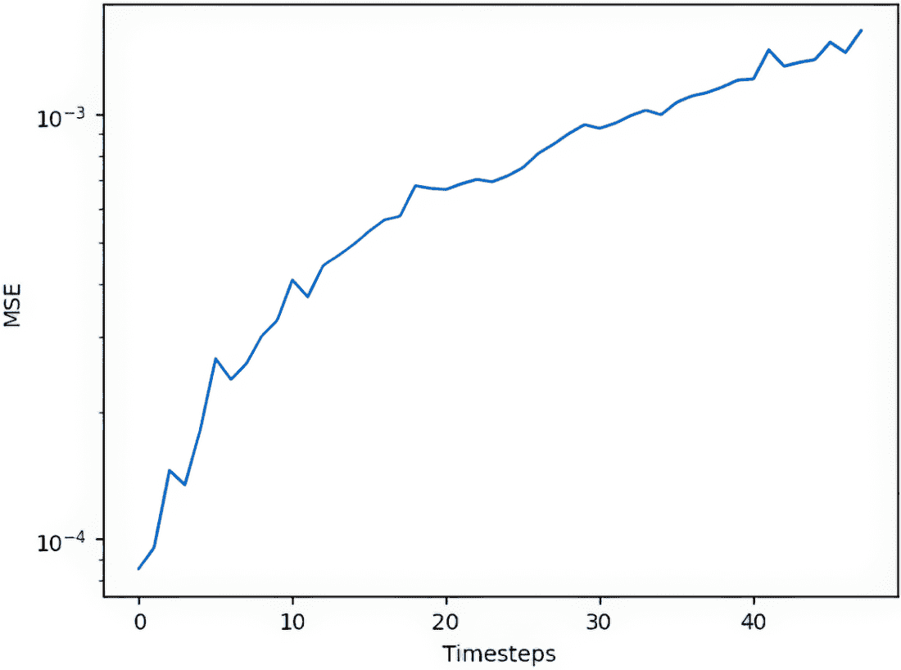

##### 图 6.15 预测未来时准确度的降低

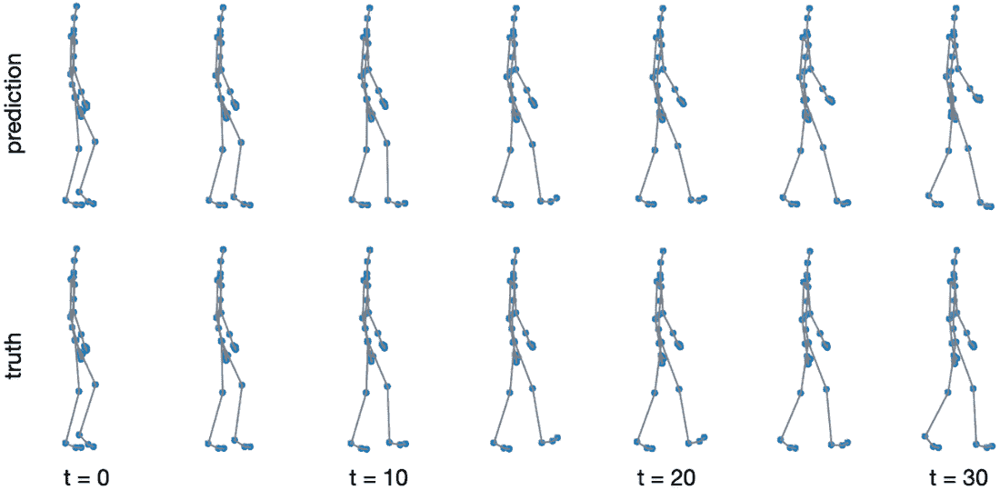

##### 图 6.16 NRI 模型的示例输出

我们已经涵盖了 NRI 模型的所有核心组件，完整的可工作代码已提供在 GitHub 仓库([`mng.bz/4a8D`](https://mng.bz/4a8D))中。准确度令人印象深刻，突出了结合生成和基于图的方法与时间模型的强大功能。这如图 6.15 所示，我们看到预测姿态和结果估计姿态之间有很好的吻合。

此外，这种方法不仅能够预测图，而且在所有图数据不可用的情况下，也能学习底层结构，因此非常稳健。在这个问题中，我们知道预期的交互网络。然而，有许多情况下我们并不知道交互网络。一个例子是处于封闭空间中运动的粒子。当它们在某个交互半径内时，它们会相互影响，但当它们距离更远时则不会。这种情况适用于从细胞到运动员的所有生物体。事实上，世界上大多数情况都涉及具有秘密交互网络的交互代理。NRI 模型不仅提供了一种预测这些代理的行为和运动的方法，还能了解它们与其他代理的交互模式。确实，原始的 NRI 论文通过篮球比赛的视频跟踪数据展示了这一点，并表明该模型可以学习球、球手、挡拆者和不同球员之间的典型模式。（更多信息，请参阅 Kipf 等人[2]的研究。）

## 6.5 内部机制

在本章中，我们展示了如何处理时间或动态问题。在这里，我们更详细地讨论了我们使用的一些关键模型组件。

### 6.5.1 循环神经网络

在图 6.16 中，我们展示了 RNN 模型的示意图。与我们所见过的所有其他模型相比，RNN 模型的主要区别在于模型可以处理序列数据。这意味着每个时间步都有一个隐藏层，并且从该隐藏层输出的结果会在后续时间步与新的输入相结合。在图 6.17 中，这以两种方式展示。首先，在左侧，我们展示时间更新作为一个单独的自我循环，用 Whh 表示。为了更好地理解这个自我循环的作用，我们已经“展开”了模型在时间上的表现，以便我们可以明确地看到我们的模型是如何更新的。在这里，我们将我们的输入、输出和隐藏层（x, y, h）更改为时间变量（xt, yt, ht）。在我们的初始步骤 t，我们使用 xt 的数据和从我们之前的隐藏层 ht–1 的权重来更新我们的当前隐藏层，然后使用这个来输出 yt。然后，ht 的权重会传递给 ht+1，并伴随着新的输入 xt+1 来推断 yt+1。

该模型的一个关键特性是，当我们反向传播以更新我们的权重时，我们需要进行时间反向传播（BPTT）。这是所有 RNN 的一个特定特性。然而，大多数现代深度学习包都使这一过程变得非常简单，并隐藏了所有复杂的计算细节，以便于实践者使用。

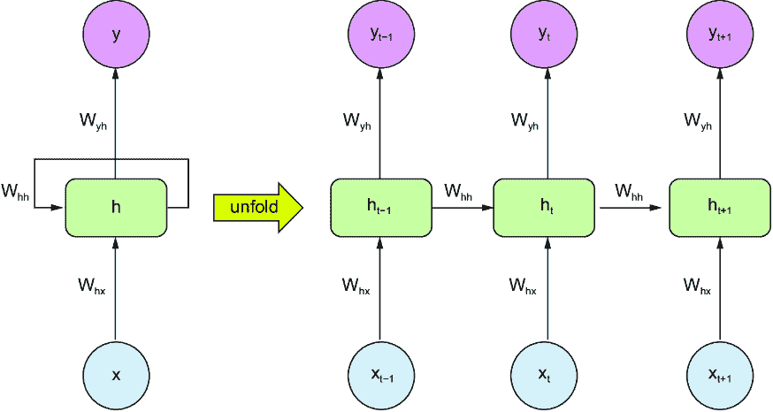

##### 图 6.17 RNN 的结构。时间更新作为一个单环自我循环，由 Whh 表示（左侧）。展开的时间模型显示了模型更新（右侧）。在这里，我们将输入、输出和隐藏层（x、y、h）更改为时间变量（x[t]、y[t]、h[t]）。在初始步骤 t，我们使用来自 x[t] 的输入数据和来自先前隐藏层 h[t–1] 的权重来更新当前隐藏层，然后使用它来输出 y[t]。然后，ht 的权重与新的输入 x[t+1] 一起传递到 h[t+1]，以推断 y[t+1]。

让我们看看如何使用 PyTorch 实现一个 RNN。这就像定义一个神经网络类，然后在网络中引入特定的 RNN 层一样简单。例如，在列表 6.23 中，我们展示了定义具有单个 RNN 层的网络的代码。这是一个非常基本的 RNN 定义，因为只有一个隐藏层。然而，看到这个例子对于了解模型如何训练有一些直观的帮助。对于每个时间步，我们的输入都传递到隐藏层和输出。当我们执行前向传递时，输出返回到输出和隐藏层。最后，我们需要用某物初始化我们的隐藏层，所以我们使用全连接层。

##### 列表 6.23 定义 RNN

```py
   class PoseEstimationRNN(nn.Module):
       def __init__(self, input_size, hidden_size, output_size, num_layers):
           super(PoseEstimationRNN, self).__init__()

           self.hidden_size = hidden_size
           self.num_layers = num_layers

           self.rnn = nn.RNN\
(input_size, hidden_size, \
num_layers, batch_first=True)  #1
           self.fc = nn.Linear(hidden_size, output_size)  #2

       def forward(self, x):    
           h0 = torch.zeros(self.num_layers,\ #3
             x.size(0), self.hidden_size)  #3
           H0 = h0.to(x.device) 

           out, _ = self.rnn(x, h0)  #4
           out = self.fc(out[:, -10:, :]) #5
           return out
```

#1 RNN 层

#2 全连接层

#3 设置初始隐藏和细胞状态

#4 前向传播 RNN

#5 将最后一个时间步的输出传递到全连接层

在实践中，我们经常想要使用更复杂的 RNN。这包括 RNN 的扩展，如 LSTM 网络或 GRU 网络。我们甚至可以使用我们选择的深度学习库将 RNN、LSTMs 和 GRUs 堆叠起来。GRU 与 RNN 类似，因为它对数据序列很有用。它们被特别设计来解决 RNN 的一个关键缺点，即梯度消失问题。它使用两个门，这些门决定了保留多少过去信息（更新门）以及忘记或丢弃多少（重置门）。我们在图 6.18 中展示了 GRU 的一个示例设计。在这里，*z**[t]* 表示更新门，r*[t]* 表示重置门。*~h**[t]* 术语被称为候选激活，反映了表示的新状态的候选，而 *h**[t]* 术语是实际的隐藏状态。

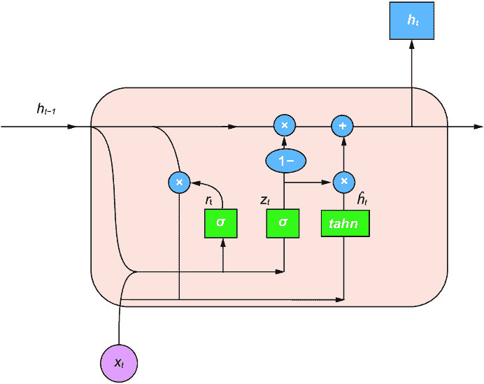

##### 图 6.18 GRU 层的设计，其中 r*[t]* 表示重置门，z*[t]* 是更新门，~h*[t]* 是候选函数，h*[t]* 是最终的实际隐藏状态

在列表 6.24 中，我们展示了如何使用 GRU 层构建模型。在这里，大多数实现由 PyTorch 处理，其中层是从标准 PyTorch 库导入的。模型定义的其余部分是典型的神经网络。

##### 列表 6.24 GRU

```py
   class PoseEstimationGRU(nn.Module):
       def __init__(self, input_size, hidden_size, output_size, num_layers):
           super(PoseEstimationGRU, self).__init__()
           self.hidden_size = hidden_size
           self.num_layers = num_layers
           self.gru = nn.GRU\
(input_size, hidden_size, \
num_layers, batch_first=True)  #1
           self.fc = nn.Linear(hidden_size, output_size)  #2

        def forward(self, x):

            h0 = torch.zeros\
(self.num_layers, \
x.size(0), self.hidden_size)  #3
            h0 = h0.to(x.device)  #3
            out, _ = self.gru(x, h0)  #4
            out = self.fc(out[:, -10:, :])  #5
            return out
```

#1 GRU 层

#2 全连接层

#3 设置初始隐藏状态

#4 前向传播 GRU

#5 将最后一个时间步的输出传递到全连接层

### 6.5.2 时间邻接矩阵

当考虑时间图时，我们可能从一个由一条边连接的两个节点开始，然后在每个后续的时间步长中，再添加一些节点和/或边。这导致出现几个不同的图，每个图都有一个不同大小的邻接矩阵。

这在设计我们的 GNN 时可能会带来困难。首先，每个时间步长都有不同大小的图。这意味着我们无法使用节点嵌入，因为节点数量将在输入数据中不断变化。一种方法是使用每个时间步长的图嵌入来存储整个图作为一个低维度的表示。这种方法是许多时间方法的核心，在这些方法中，图嵌入随时间演变，而不是实际的图。我们甚至可以在我们的图上使用更复杂的变换，例如使用我们的 NRI 模型中的自动编码器模型。

或者，我们可以通过创建时间邻接矩阵将每个时间步长的所有单个图转换成一个更大的图。这涉及到将每个时间步长包裹成一个单一的图，该图跨越了每个时间步长的数据以及动态时间数据。如果图很小，我们只对未来的几个时间步长感兴趣，时间邻接矩阵可能很有用。然而，它们通常变得非常大且难以处理。另一方面，使用时间嵌入方法通常涉及多个复杂的子组件，并且变得难以训练。不幸的是，没有一种适用于所有时间图的通用方法，最佳方法几乎总是特定于问题的。

### 6.5.3 将自动编码器与 RNN 结合

在本节中，为了对 NRI 模型建立直观理解，我们将总结其组件并说明其在预测图结构和节点轨迹中的应用。首先，在图 6.19 中，我们重复了 NRI 模型的示意图。


##### 图 6.19 NRI 的示意图（来源：Kipf 等人[2]）。该模型由编码器和解码器层以及几个消息传递步骤组成。然而，在这里，消息是从节点传递到边，然后从边传递回节点，然后再从节点传递回边。对于解码器，消息是从节点传递到边，然后从边传递回节点。最后一步使用潜在表示，并用于预测身体时间演变的下一步。

在这个模型中，有两个关键组件。首先，我们训练一个编码器将每个帧的图编码到潜在空间中。具体来说，我们使用编码器来预测给定初始图（x）的潜在交互（z）的概率分布 qj。一旦我们训练了编码器，我们就使用解码器将这个概率分布的样本转换为轨迹，使用潜在编码以及之前的时间步长。在实践中，我们使用编码器-解码器结构来推断具有不同交互类型（或边）的节点的轨迹。

在本章中，我们只考虑了两种边类型：传感器之间是否存在物理连接。然而，这种方法可以扩展到考虑许多不同的连接，所有这些连接都会随时间变化。此外，解码器模型需要一个 RNN 来有效地捕获我们图中的时间数据。为了对 NRI 模型有一个直观的了解，让我们再次重复这个过程。

1.  *输入*—节点数据。

1.  *编码*—

    1.  编码器接收节点数据。

    1.  编码器将节点数据转换为边数据。

    1.  编码器在潜在空间中表示边数据。

1.  *潜在空间*—潜在空间表示不同边类型的概率。在这里，我们有两种边类型（连接和不连接），尽管对于更复杂的关系，可能存在多种边类型。我们始终需要包括至少两种类型，否则模型会假设所有节点都是连接的，或者更糟糕的是，没有任何节点是连接的。

1.  *解码*—

    1.  解码器从潜在空间中获取边类型概率。

    1.  解码器学习根据这些概率重建未来的图状态。

1.  *预测*—模型通过学习预测图连通性来预测未来的轨迹。

注意，这个模型同时给出了图和轨迹预测！虽然这可能对我们的问题没有帮助，但对于我们不知道底层图结构的情况，例如社交媒体网络或体育队伍，这可以提供发现系统中新交互模式的方法。

### 6.5.4 Gumbel-Softmax

在 NRI 模型中，在计算这两个损失之前有一个额外的步骤，即使用 Gumbel-Softmax 计算边的概率。我们需要引入 Gumbel-Softmax 的关键原因是我们的自动编码器正在学习预测表示我们边的邻接矩阵，即网络连通性，而不是节点及其特征。因此，自动编码器的最终预测必须是离散的。然而，我们也在推断一个概率。当需要将概率数据离散化时，Gumbel-Softmax 是一种流行的方法。

在这里，我们有两种离散的边类型，即某物是否连接。这意味着我们的数据是*分类的*——每条边要么属于类别 0（未连接），要么属于类别 1（连接）。Gumbel-Softmax 用于从分类分布中抽取和评分样本。在实践中，Gumbel-Softmax 将逼近来自我们的编码器的输出，这种输出以对数概率或*logits*的形式出现，作为一个 Gumbel 分布，它是一种极值分布。这将近似我们的数据的连续分布为一个离散的分布（边类型），并允许我们随后对分布应用损失函数。

Gumbel 分布的温度，作为我们的超参数之一，反映了分布的“尖锐度”，类似于方差如何控制高斯分布的尖锐度。在本章中，我们使用了 0.5 的温度，这大约是中等尖锐度。我们还指定`Hard`作为超参数，表示是否存在一个或多个类别。如前所述，我们希望在训练时有两个类别来表示是否存在边。这允许我们将分布近似为连续的，然后我们可以将其作为损失通过我们的网络进行反向传播。然而，在测试时，我们可以将`Hard`设置为`True`，这意味着只有一个类别。这使得分布完全离散，意味着我们无法使用损失进行优化，因为离散变量在定义上是非可微的。这是一个有用的控制，以确保我们的测试循环不会传播任何梯度。

## 摘要

+   虽然一些系统可以使用单一数据快照进行预测，但其他系统需要考虑时间的变化以避免错误或漏洞。

+   空间时间 GNNs 考虑之前的时刻来模拟图随时间演变的方式。

+   空间时间 GNNs 可以解决姿态估计问题，其中我们根据身体在最近过去的位置数据预测身体的下一个位置。在这种情况下，节点代表放置在身体关节上的传感器，边代表关节之间的身体连接。

+   邻接矩阵可以通过沿对角线连接不同的邻接矩阵来调整，以考虑时间信息。

+   记忆可以被引入模型中，包括图神经网络（GNNs），例如通过使用循环神经网络（RNN）或门控循环单元网络（GRU）。

+   神经关系推理（NRI）模型结合了循环网络，如 GRU，与自动编码器 GNNs。这些模型可以推断时间模式，即使相邻信息未知。
