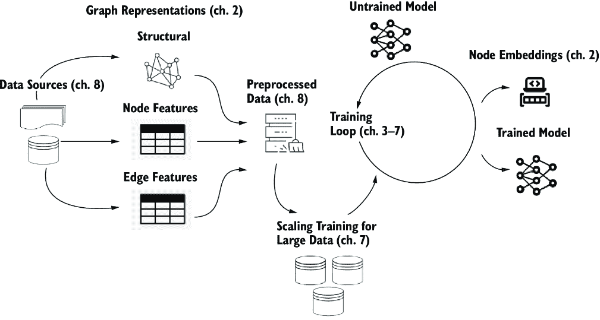
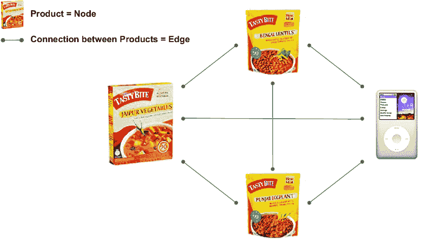
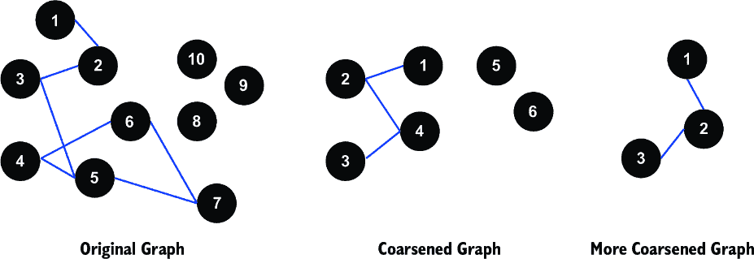

# 7 规模化的学习和推理

### 本章涵盖

+   处理小型系统中数据过载的策略

+   识别需要扩展资源的图神经网络问题

+   七种减轻大数据问题影响的稳健技术

+   使用 PyTorch Geometric 扩展图神经网络并解决可扩展性挑战

在我们大部分关于图神经网络（GNNs）的旅程中，我们已经解释了关键架构和方法，但我们将示例限制在相对较小的规模问题上。我们这样做的原因是让您能够轻松地访问示例代码和数据。

然而，在现实世界的深度学习中，问题往往并不如此整洁地打包。在现实场景中，一个主要挑战是在数据集足够大以至于可以放入内存或压倒处理器时训练 GNN 模型[1]。

在探索可扩展性的挑战时，拥有一个清晰的 GNN 训练过程的心理模型至关重要。图 7.1 回顾了我们对这一过程的熟悉可视化。其核心是，GNN 的训练围绕着从源获取数据，处理这些数据以提取相关的节点和边特征，然后使用这些特征来训练模型。随着数据量的增长，这些步骤中的每一个都可能变得更加资源密集，因此需要我们在本章中探讨的可扩展策略。



##### **图 7.1 GNN 训练过程的心理模型。在本章中，我们将关注为大数据扩展我们的系统。**

在深度学习开发项目中，在训练和部署中考虑大量或扩展数据可以决定一个项目是成功还是失败。在紧迫的截止日期和有要求的利益相关者面前工作的机器学习工程师没有时间花费数周进行长时间的训练或纠正由处理器过载引起的错误。通过提前规划来避免规模问题可以防止这种时间浪费。

在本章中，您将学习如何处理当数据对于小型系统来说太大而无法处理时出现的问题。为了描述规模问题，我们关注三个指标：处理或训练过程中的内存使用量、训练一个 epoch 所需的时间以及问题收敛所需的时间。我们解释了这些指标，并指出如何在 Python 或 PyTorch Geometric（PyG）环境中计算它们。

在本章中，重点是从不起眼的开端进行扩展，从单一机器进行优化。虽然本书的主要焦点不是数据工程或构建大规模解决方案，但这里讨论的一些概念可能在这些背景下相关。为了解决规模问题，解释了七种可以协同使用或单独使用的方法：

+   选择和配置处理器（第 7.4 节）

+   使用数据集的稀疏表示与密集表示（第 7.5 节）

+   选择 GNN 算法（第 7.6 节）

+   根据从您的数据中抽取的样本进行批量训练（第 7.7 节）

+   使用并行或分布式计算（第 7.8 节）

+   使用远程后端（第 7.9 节）

+   粗化您的图（第 7.10 节）

为了说明在实践中如何决定这些方法，提供了示例或迷你案例。虚构公司 GeoGrid Inc.（以下简称 GeoGrid）在各种案例中跟随，该公司处理与大数据相关的问题。

此外，您在第三章中遇到的亚马逊产品数据集，其中使用了图卷积网络（GCN）和 GraphSAGE 进行节点分类，也用于演示各种方法。对于相关方法，可以在本书的 GitHub 仓库中找到示例代码。

本章与之前的章节有所不同。而之前的章节专注于一个或两个示例来阐述一系列概念，而规模问题的独特性质意味着将探索各种方法，每种方法都伴随着简短的示例。因此，本章的章节可以在 7.3 节之后以任何顺序阅读。

我们将首先回顾第三章的亚马逊产品数据集并介绍 GeoGrid。然后，我们将讨论如何表征和衡量规模，重点关注三个指标。最后，我们将更详细地介绍每种方法，并在适当的地方提供代码。

注意：本章的代码可以在 GitHub 仓库的笔记本形式中找到（[`mng.bz/QDER`](https://mng.bz/QDER)）。本章的 Colab 链接和数据也可以在相同的位置访问。

## 7.1 本章的示例

在本章中，我们使用两个案例来阐述各种概念。我们使用第三章的亚马逊产品数据集。我们将使用这个数据集来演示代码示例，这些示例可以在 GitHub 仓库中找到。其次，我们将使用一个名为 GeoGrid 的虚构公司的迷你案例来阐明指南和运用所提出的方法的实践。

### 7.1.1 亚马逊产品数据集

本小节将重新介绍第三章中的数据集及其训练。首先，回顾数据集，然后介绍用于训练它的硬件配置。最后，作为后续章节的序言，我们突出介绍在第三章中应用的一些方法，以适应数据集的大小。这个数据集将在后续章节的 GitHub 代码示例中广泛使用。

在第三章中，我们使用两个卷积 GNN：GCN 和 GraphSAGE，研究了节点分类问题。为此，我们使用了包含共购买信息的 Amazon Products 数据集，该数据集常用于说明和基准测试节点分类[2]。这个数据集（也称为*ogbn-products*）由一组通过同一交易购买而相互连接的产品节点组成，如图 7.2 所示。每个产品节点都有一组特征，包括其产品类别。ogbn-products 数据集包含 250 万个节点和 6190 万个边。关于此数据集的更多信息总结在表 7.1 中。



##### 图 7.2 第三章中使用 Amazon Products 数据集的一个共购买示例的图表示。每个产品的图片是一个节点，共购买是产品之间的边（以线条表示）。对于这里显示的四个产品，这个图只是单个客户的共购买图。如果我们显示所有亚马逊客户的相应图，产品节点和共购买边的数量可能达到数万个产品节点和数百万共购买边。

备注：有关此数据集及其来源，以及 GCN 和 GraphSAGE 的更多详细信息，请参阅第三章。

##### 表 7.1 ogbn-products 数据集的总结特征

| 节点 | 边 | 平均节点度 | 类别标签数量 | 节点特征维度数量 | 压缩数据大小（GB） |
| --- | --- | --- | --- | --- | --- |
| 2.5 百万 | 6190 万 | 51 | 47 | 100 | 1.38 |

对于第三章中实现的代码，我们使用了一个具有以下配置的 Colab 实例：

+   存储：56 GB HDD

+   两块 CPU：2 核 Xeon 2.2GHz

+   CPU RAM: 13 GB

+   一块 GPU：Tesla T4

+   GPU RAM: 16 GB

虽然我们将在后面讨论细节，但我们已经确定了三个可能因数据过多而引起问题的因素。第一个因素显然是数据集本身的大小——不仅包括存储中的原始、未解压的大小，还包括其表示形式，这会影响在应用处理和训练时的工作大小（在 7.5 节中详细说明）。第二个因素是硬件的存储和内存容量（7.4 节）。最后，GNN 训练算法的选择——例如 GraphSAGE——将显著影响计算需求，尤其是在时间和内存限制方面（7.6 节）。

在我们实现第三章的示例时，我们确实遇到了问题，其根本原因是数据集的大小。在第三章中，我们的重点是展示算法，因此我们没有指出这一点，并默默地使用了一种方法来减轻这个问题。具体来说，我们使用了数据集的最佳表示（稀疏而不是密集）。

### 7.1.2 GeoGrid

在您浏览本章内容时，我们将借鉴一个虚构但具有代表性的科技公司——GeoGrid——在处理该领域挑战和机遇的例子。GeoGrid 是一家地理空间数据分析建模公司。利用 GNN 等先进技术，该公司为从交通预测到气候变化规划等问题的解决方案提供支持。作为一个在竞争激烈的领域中的初创公司，GeoGrid 经常面临可能决定公司成败的关键技术决策，尤其是在与大规模政府项目竞争时。

GeoGrid 将被用来探讨与规模问题相关的各种概念和技术决策。无论团队是在讨论不同机器学习架构的利弊，考虑在多个 GPU 上使用分布式数据并行（DDP）训练，还是制定如何将算法扩展到大规模数据集的战略，公司的故事为本章讨论的理论和方法提供了现实世界的背景。

在下一节中，我们将提供一个框架来评估和描述规模问题。然后，我们将总结解决此类问题的方法。最后，我们将详细调查这些方法。

## 7.2 规模问题的框架

在我们深入解决方案之前，让我们定义一下规模带来的挑战。本节概述了数据大小问题的根本原因及其症状。然后，它强调了在识别、诊断和解决此类问题中至关重要的关键指标 [1, 3]。

从机器资源的角度来看，发展过程被分解为三个阶段。在以下三个阶段中，本章将重点关注预处理和训练：

+   *预处理* — 将原始数据集转换为适合训练的格式

+   *训练* — 通过将训练算法应用于预处理后的数据集来创建 GNN 模型

+   *推理* — 从训练好的模型中创建预测或其他输出

### 7.2.1 根本原因

简而言之，当训练数据变得太大以至于无法适应我们的系统时，就会产生规模问题。确定数据大小何时成为问题很复杂，并取决于多个因素，包括硬件能力、图的大小以及时间和空间上的限制。

#### 硬件速度和容量

一个合适的系统必须能够通过其内存容量和处理速度来支持预处理和训练过程。内存不仅要支持图的大小本身，还要容纳实现转换和训练算法所需的数据。处理速度应该足够快，能在合理的时间内完成训练。

我们编写这本书时假设您有权访问免费的云资源，例如 Google 的 Colab 和 Kaggle 上找到的资源，或者至少有一个 GPU 处理器的适度本地资源。当这些资源不足时，如果存在资源，升级硬件配置可能是一个选择。对于训练最大的企业图，使用计算集群是不可避免的。我们将在第 7.4 节中更详细地探讨计算硬件。

#### 图的大小

基本上，我们可以通过节点和边的数量来大致了解规模及其可能对我们训练解决方案的影响。了解这些特征可以帮助我们判断算法处理图所需的时间。此外，持有结构信息的表示形式将影响数据的大小。

除了结构信息之外，节点和边可以包含包含一个或多个维度的特征。通常，节点和边特征的大小可能大于图的结构信息。

为 GNNs 定义小、中、大型图的精确大小具有一定的情境性。这取决于具体的问题领域、硬件和可用的计算资源。在撰写本文时，以下是一个通用的分类：

+   *小型图* — 这些可能包括具有数百到数千个节点和边的图。它们通常可以在标准硬件上处理，无需专用资源。

+   *中等规模的图* — 这个类别可能包括具有数万个节点和边的图。中等规模图中的复杂性可能需要更复杂的算法或硬件，例如 GPU，以有效地处理。

+   *大型图* — 大型图可以包括数十万到数百万（甚至数十亿）个节点和边。处理此类图通常需要分布式计算和专为可扩展性设计的专用算法。

+   *算法的时间和空间复杂度* — 时间和空间复杂度指向运行算法所需的计算和内存资源。这些直接影响到处理速度、内存使用和效率。了解这些复杂度有助于在算法选择和资源分配方面做出明智的决定。高时间复杂度可能导致运行时间变慢，影响您的模型训练计划。高空间复杂度可能限制 GNN 可以处理的数据集的大小，影响您处理大型、复杂图的能力。我们将在第 7.6 节中进一步探讨这一点。

### 7.2.2 症状

可扩展性问题的根本原因以多种方式表现出来。一个常见问题是 *处理时间长*，这可能会发生在需要更多计算能力和时间来处理的大型数据集时。较慢的算法会增加训练模型所需的时间，使得快速迭代和改进模型变得困难。然而，被视为太长的时间将取决于具体问题。对于需要每周提供的结果，几个小时可能没问题，但如果模型需要在一天内重新训练，时间可能会过长。同样，如果处理时间长，计算成本可能会迅速增加，特别是如果需要大型机器来运行模型。

另一个问题是在或超过容量时的 *内存使用*，这可能会发生在大型数据集消耗大量内存的情况下。如果数据集太大，无法适应您的系统内存，可能会导致系统变慢或甚至崩溃。

最后，当您的算法和系统设置无法处理数据大小的 *增加* 时，可能会出现无法扩展到更大数据集的情况。确保时间和空间效率对于您的系统保持有效和可扩展至关重要。

### 7.2.3 关键指标

为了理解可扩展性的见解，对关键性能指标进行实证分析是有帮助的。这些指标包括内存、每轮时间、FLOPs 和收敛速度，如本处所述：

+   *内存使用* — 内存使用（单位为千兆字节），特别是可用的 RAM 或处理器内存量，在确定您可以训练的模型的大小和复杂性方面起着重要作用 [4, 5]。这是因为 GNN 需要在内存中存储节点特征、边特征和邻接矩阵。如果您的图很大或节点和边特征是高维的，您的模型将需要更多的内存。

PyTorch 和 Python 中有几个模块可以进行内存分析。PyTorch 内置了一个分析器，可以单独使用，也可以与 PyTorch Profiler Tensorboard 插件 [4] 结合使用。还有一个 `torch_geometric.profile` 模块。此外，托管在 Colab 和 Kaggle 上的云笔记本提供了每个处理器的内存使用实时可视化。

在我们仓库的代码示例中，我们使用两个库来监控系统资源：`psutil`（Python 系统和进程实用程序库）和 `pynvml`（NVIDIA 管理库的 Python 绑定）。`psutil` 是一个跨平台实用程序，它提供了一个接口来检索有关系统利用率（CPU、内存、磁盘、网络、传感器）、正在运行的过程和系统运行时间的详细信息。它特别适用于系统监控、分析和实时限制进程资源。以下是如何在代码中使用 `psutil` 的一个片段：

```py
import psutil 

def get_cpu_memory_usage(): 
process = psutil.Process(os.getpid()) 
return process.memory_info().rss
```

在这个片段中，`psutil.Process(os.getpid())` 用于获取当前进程，而 `memory_info().rss` 获取常驻集大小，即进程内存中保留在 RAM 中的部分。

除了`psutil`之外，`pynvml`是一个用于与 NVIDIA GPU 交互的 Python 库。它提供了关于 GPU 状态的详细信息，包括使用情况、温度和内存。`pynvml`允许用户以编程方式检索 GPU 统计信息，使其成为管理监控机器学习和其他 GPU 加速应用中 GPU 资源的必备工具。以下是如何在代码中使用`pynvml`的示例：

```py
import pynvml 

pynvml.nvmlInit() 
def get_gpu_memory_usage(): 
   handle = pynvml.nvmlDeviceGetHandleByIndex(0) 
  info = pynvml.nvmlDeviceGetMemoryInfo(handle) 
  return info.used
```

在这里，`pynvml.nvmlInit()`初始化 NVIDIA 管理库，`pynvml.nvmlDeviceGetHandleByIndex(0)`检索索引为`0`的 GPU 句柄，而`pynvml.nvmlDeviceGetMemoryInfo(handle)`提供了关于 GPU 内存使用的详细信息。

在我们的示例中，`psutil`和`pynvml`都用于提供对预处理和训练过程性能特征的洞察，提供了对系统和 GPU 资源利用的详细视图。

+   *每个 epoch 的时间* — 每个 epoch 的时间（也称为“每个 epoch 的秒数”，因为这个指标的计量单位通常是秒）指的是完成整个训练数据集的一次遍历所需的时间。这个因素受你的 GNN 的大小和复杂性、图的大小、批处理大小以及可用的计算资源的影响。具有较低每个 epoch 时间的模型更可取，因为它允许更多的迭代和更快的实验。PyTorch 或 PyG 证明的剖析器也可以用于此类测量。

在提供的代码中，每个 epoch 的时间是通过计算 epoch 的开始和结束时间之间的差异来测量的。在每个 epoch 的开始，使用`start_time` `=` `time.time()`捕获当前时间。然后对模型进行 1 个 epoch 的训练，完成之后，再次使用`end_time` `=` `time.time()`捕获当前时间。epoch 时间，即完成 1 个 epoch 训练所需的时间，随后计算为结束时间和开始时间之间的差异（`epoch_time` `=` `end_time` `-` `start_time`）。这给出了模型训练 1 个 epoch 所需时间的精确测量，包括训练过程中涉及的所有步骤，如前向传递、损失计算、反向传递和模型参数更新。

+   *FLOPs* — 浮点运算（不要与每秒浮点运算数 FLOP/s[6, 7]混淆）计算训练模型所需的浮点运算次数。这可能包括矩阵乘法、加法和激活等操作。就我们的目的而言，FLOPs 的总数给出了训练 GNN 的计算成本的估计。

FLOPs 在执行时间上并不完全相同。这种可变性源于几个因素。首先，涉及的运算类型可以极大地影响计算成本：如加法和减法等简单运算通常更快，而如除法或平方根计算等更复杂的运算通常需要更长的时间。其次，FLOPs 的执行时间会根据所使用的硬件而显著变化。一些处理器针对特定类型的运算进行了优化，而像 GPU 这样的专用硬件可能比 CPU 更有效地处理某些运算。此外，算法的结构会影响 FLOPs 的执行效率；可以并行化的运算可能在多核系统上处理得更快，而依赖于先前结果的顺序运算可能总体上需要更长的时间。尽管执行时间存在这些变化，但给定算法所需的 FLOPs 总数保持不变。

在撰写本文时，尽管有一些外部模块可以分析 PyTorch 操作，但这些与 PyG 模型和层不兼容。文献中看到的一些努力依赖于自定义编程。

在我们的 GitHub 代码示例中，我们经常使用`thop`库来估算神经网络训练过程中每个 epoch 相关的 FLOPs。以下是一个计算 FLOPs 的简要片段：

```py
from thop import profile   #1

input = torch.randn(1, 3, 224, 224) 
macs, params = profile(model, inputs=(input, )) 
print(f"FLOPs: {macs}")
```

#1 异构 GCN

调用`thop`库的配置函数，将模型和样本输入批次作为参数传递。它返回正向传递的总 FLOPs 和参数。在此上下文中，FLOPs 衡量的是操作的总数，而不是每秒的操作数。

FLOPs 是一个有用的指标，可以用来对模型的计算需求和复杂性有一个大致的了解，当与其他指标一起使用时，可以全面理解性能。

+   *收敛速度* — 收敛速度（单位为秒或分钟）是指模型在训练过程中学习或达到最佳状态的速度。收敛速度受模型复杂度、学习率、使用的优化器以及训练数据质量等因素的影响。通常希望收敛速度更快，因为这意味着模型需要更少的迭代次数才能达到其最佳状态，从而节省时间和计算资源。

与内存和时间-per-epoch 分析一样，PyTorch 和 PyG 分析器可以用来测量收敛所需的时间。

在我们的代码示例中，收敛时间是通过测量在指定数量的周期内完成模型训练所需的时间间隔来计算的。在训练过程开始时，使用 `time.time()` 记录 `convergence_start_time`，标记训练的开始。然后，模型通过几个周期进行训练，每个周期涉及正向传播、损失计算、反向传播和参数更新等步骤。所有周期完成后，再次捕获当前时间，通过从最终时间戳中减去 `convergence_start_time` 来计算 `convergence_time`。这个 `convergence_time` 给出了模型在所有周期中完成训练所需的总时间，为模型在时间效率方面的性能和效率提供了见解。收敛时间越短，模型学习速度越快，达到令人满意的性能水平，前提是保持学习质量。

这四个因素之间的正确平衡取决于具体项目的约束条件，例如可用的计算资源、项目时间表以及数据集的复杂性和大小。对于这些指标的某些实际基准测试，Chiang [8] 在使用这些指标对其提出的 GNN、ClusterGCN 和基准 GNNs 进行比较分析方面做得非常出色。鉴于我们对构成规模问题的构成以及如何基准测试和测量此类问题的了解，我们现在转向可以缓解这些挑战的方法。

## 7.3 应对规模问题的技术

正如我们在上一节中概述的，当数据变得庞大时，我们必须处理与内存限制、处理时间和效率相关的问题。为了应对这些挑战，拥有一系列策略工具箱变得至关重要。在接下来的章节中，我们介绍了一系列旨在提供训练过程灵活性和控制的方法。这些策略从硬件配置到算法优化，针对不同的场景和需求进行了定制。这些方法源自学术界和工业界在深度学习和图深度学习中的最佳实践。

### 7.3.1 七种技术

首先，我们考虑三个可以在项目开始前规划并在项目过程中重新配置的基本选择。为了准备，为您的项目选择以下内容：

+   *硬件配置* — 这些选择包括处理器类型、处理器的内存配置，以及是否使用单个机器/处理器或多个处理器。

+   *数据集表示* — PyG 支持稠密和稀疏张量。在处理大型图时，从稠密到稀疏的转换可能会显著减少内存占用。您可以使用 PyG 的 `torch_geometric .utils.to_sparse` 函数将稠密邻接矩阵或节点特征矩阵转换为稀疏表示。

+   *GNN 架构* — 某些 GNN 架构被设计为计算效率高且可扩展性适用于大型图。选择一个扩展性好的算法可以显著减轻大小问题。

考虑到这些三种选择类别，如果问题超出了我们的系统，那么以下是我们可以使用的技术来减轻问题：

+   *采样* — 在整个大型图上进行训练而不是，你可以为每个训练迭代采样节点或子图的子集。通过增加采样和批处理例程的复杂性，可以在内存效率的收益中得到补偿。为了执行节点或图的采样，PyG 提供了来自其`torch_geometric.sampler`和`torch_geometric.loader`模块的功能。

+   *并行和分布式计算* — 你可以使用多个处理器或机器集群，通过在训练期间将数据集从一台机器分散到多台机器来减少训练时间。根据你这样做的方式，可能需要一些开发和配置开销。

+   *使用远程后端* — 而不是将训练图数据集存储在内存中，它可以完全存储在后端数据库中，并在需要时拉取小批量数据。这种情况的最简单例子是将数据存储在本地硬盘上，并从那里迭代地读取小批量数据。在 PyG 中，这种方法被称为*远程后端*。这是 PyG 中相对较新的方法，有一些示例，但不多。在撰写本文时，两家数据库公司已经为 PyG 的远程后端功能开发了一些支持。这种方法需要最多的开发和维护开销，但在缓解大数据问题方面最有回报。

+   *图粗化* — 图粗化技术用于在（希望）保留其基本结构的同时减小图的大小。这些技术通过聚合节点和边，创建原始图的粗化版本。PyG 为此提供了图聚类和池化操作。缺点是必须小心确保粗化图真正代表原始图，并且在监督学习中，你必须决定如何合并目标。

训练 GNN 时规模的多方面问题需要深思熟虑的方法。通过应用各种杠杆，如硬件选择、优化技术、内存管理和架构决策，你可以调整过程以适应特定的需求和约束。

### 7.3.2 一般步骤

在本节中，我们提供了一些关于规划和评估考虑规模的项目的通用指南。一般步骤如下：

1.  *规划阶段*

    +   *预测硬件需求* — 提前熟悉可用的硬件选项。许多在线和本地系统已发布配置。

    +   *理解你的数据* — 对于机器学习生命周期的每个阶段，对你的数据集大小有一个清晰的认识。

    +   *内存与数据比率* — 作为经验法则，您的内存容量应理想地介于数据集大小的 4 到 10 倍之间。

1.  *基准测试阶段*

    +   *建立基线* — 使用代表性数据集对这些指标进行基准测试。这些初始数据可以随后作为预测项目训练和实验时间线的基石。

        +   *训练指标* — 监控和测量关键指标，如内存利用率、每个 epoch 的时间、每秒浮点运算次数（FLOP/s）以及收敛时间。

1.  *故障排除* — 如果您遇到挑战且缺乏硬件升级的资源，请考虑实施本章中详细说明的策略来绕过硬件限制。

现在我们已经了解了规模问题、衡量它们的指标以及一系列缓解这些问题的技术，让我们更深入地探讨这些个别方法。

## 7.4 硬件配置的选择

本节探讨了选择和调整硬件配置以解决规模问题。首先，我们将回顾硬件配置的一般选择，然后对相关的系统和处理器选择进行广泛概述。为这些选项提供了指南和建议。本节最后以第一个 GeoGrid 迷你案例研究结束。

### 7.4.1 硬件选择的类型

可用于训练图神经网络（GNNs）的硬件配置多种多样。每种配置都针对不同的需求进行了定制，以优化性能：

+   *处理器类型* — PyTorch 提供了在多种处理器上运行的灵活性，包括中央处理器（CPUs）、图形处理器（GPUs）、神经处理器（NPUs）、张量处理器（TPUs）和智能处理器（IPUs）。虽然 CPU 无处不在，可以处理大多数通用任务，但配备了并行处理能力的 GPU 专门设计用于密集计算，因此它们非常适合训练大规模神经网络模型。TPU 是针对机器学习任务的定制加速器。它们可以提供更大的计算能力，但它们的可用性可能受到限制。更多细节将在下一小节中给出。两种其他加速器，神经处理器（NPUs，专门设计在手机、笔记本电脑和边缘设备上运行神经网络工作负载的处理器）和智能处理器（IPUs，设计用于需要大规模数据处理的极高并行工作负载），是重要的处理器类别。PyTorch 目前仅支持 Graphcore IPUs。

+   *内存大小* — 每种处理器类型都配备其相应的 RAM。这种 RAM 的大小在确定系统可以处理的工作负载规模中起着关键作用。充足的 RAM 确保模型训练顺畅，特别是对于需要处理大量数据或具有复杂架构的网络。

+   *单 GPU 或 TPU 与多 GPU 或 TPU 的选择* — 对于有幸能够访问多个 GPU 或 TPU 的用户来说，它们可以显著缩短训练时间。PyTorch 提供了 `DistributedDataParallel` 模块，它利用多个 GPU 或 TPU 的力量并行训练模型。这意味着您可以将计算负载分配到多个设备上，从而实现更快的迭代和模型收敛。

+   *单机与计算集群* — 除了单机的范围之外，有时训练需求可能需要扩展到整个集群。在这个上下文中，集群指的是由机器组成的集合，每台机器都配备了其独特的计算、内存和存储资源。如果您能够访问这样的资源，PyTorch 的 `DistributedDataParallel` 模块再次成为首选工具，至少在小型集群方面是这样。在这种情况下，它允许您将训练过程扩展到整个集群，这对于处理特别大的模型或大量数据集非常有价值。

随着你在硬件能力方面的提升——从单个处理器到多个设备，再到整个集群——规划、设置和管理复杂性也会增加。根据任务的要求和可用资源做出明智的决策可以使这一过程更加顺畅和高效。正如引言中提到的，在本章中，我们将重点关注单机优化。

### 7.4.2 处理器和内存大小的选择

当我们转向硬件考虑的话题时，了解训练 GNN 的主要选项（CPU、GPU、NPU、IPU 和 TPU）非常重要。在本节中，我们提供了每种硬件类型的简要概述，并提供了它们应用的指南。这些关键点总结在表 7.2 中。

+   *中央处理器 (CPUs)* — CPU 在通用计算任务中表现出色，从数据预处理到模型训练。然而，它们并不是针对专门的深度学习任务进行优化的，这可能会影响它们的速度和效率。另一方面，与其它硬件选项相比，CPU 通常更具成本效益，这使得它们对更广泛的用户群体来说更加可访问。

+   *图形处理单元 (GPUs)* — GPU 是为需要并行计算能力的任务而设计的。到目前为止，通过阅读这本书，你知道它们经常被用作 PyTorch 环境中训练 GNN 的首选硬件，尤其是在使用旨在充分利用 GPU 并行性的库（例如，PyG）时。本书中的大多数示例都是在 Colab 平台上可用的 NVIDIA GPU 上运行的，包括 Tesla T4、A100 和 V100。

+   *张量处理单元（TPUs）* — TPUs 是一种专门的选择，由 Google 构建以提升机器学习计算。它们提供快速的计算速度，并且可能具有成本效益。然而，它们的范围可能有限，因为它们是一种专有技术，主要与 Google Cloud 和 TensorFlow 兼容，并且可能不完全兼容 PyTorch。

+   *神经处理单元（NPUs）* — AMD 和 Intel 都有 NPU 产品线，并配有可以与 PyTorch 集成的加速库。NPUs 是用于并行处理的专用硬件，类似于 TPUs。虽然 GPU 最初是为处理图形而设计的，但它们通常包含专门用于机器学习任务的电路。NPUs 将这些电路转化为专用单元，提高了效率和性能。苹果通常在其大多数笔记本电脑和计算机中提供类似的专用单元（称为 Apple Neural Engine [ANE]）。

+   *智能处理单元（IPUs）* — 这些是专门设计的电路芯片，考虑到深度学习任务进行设计和优化。IPUs 由 Graphcore 开发，擅长基于图计算。它们非常适合基于 GNN 的模型，因为它们允许在消息传递过程中根据需要并行化独立任务。IPUs 与 PyTorch 和 PyG 兼容，但需要重写某些任务。其他设计非常大型和强大专用芯片的公司包括 Cerebras 和 Groq。

+   *配置考虑因素* — 在选择硬件时，考虑到内存限制至关重要，因为 GNN 通常由于图数据的独特结构而数据密集。硬件的选择也可能影响训练和推理的速度。因此，权衡成本和性能之间的权衡，以适应您项目的具体需求是至关重要的。

在 PyTorch 中选择用于 GNN 训练的硬件时需要考虑的主要因素包括处理器类型（例如，CPU、GPU 或 TPU）、可用内存以及您的预算限制。这些考虑因素在表 7.2 中组织，以便快速参考。

##### 表 7.2 处理器选择的优缺点

| 硬件 | 推荐工作负载 | 优点 | 缺点 |
| --- | --- | --- | --- |

| CPU | 预处理 | 适用于数据收集和预处理，比 GPU 和 TPU 便宜

| 由于缺乏加速并行处理而训练较慢 |
| --- |

| GPU | 训练 | 由于并行处理，非常适合训练 | 比 CPU 贵，在深度学习任务上被 TPU 超越

|

| TPU | 预处理和训练 | 对于深度学习任务，计算时间快且成本效益高 | 需要特定的软件基础设施

仅限于 Google 平台

|

| NPU  | 训练  | 优化用于深度学习，尤其是在设备端 AI 应用中表现优异，减少对云服务的依赖  | 限制于特定的 AI 工作负载，主要是基于神经网络的任务  |
| --- | --- | --- | --- |
| IPU  | 训练  | 特别适合基于图的任务，如 GNNs  | 与 NPUs 相比，编程和优化可能更复杂  |

需要考虑的最后一点是，某些处理器类型在机器学习生命周期的特定步骤中表现突出：

+   *数据收集和预处理* — CPU 通常足以完成这些步骤。通常，它们可以高效地处理各种任务，而无需专用硬件。然而，根据我们的经验，对于一些内存密集型、长预处理步骤，如果可用，TPU 的表现会更好。

+   *模型训练* — 通常，这是生命周期中最计算密集的部分，GPU 通常是最佳选择。它们设计用于并行处理，这加速了神经网络的训练。GNNs 尤其受益于此，因为它们通常涉及图中的多个节点和边的计算。当可用时，TPU 可能提供性能优势。

+   *模型评估和推理* — 对于评估和推理，CPU 和 GPU 的选择取决于具体的使用场景。如果成本效益更重要，CPU 可能更受欢迎。TPU 凭借其高计算速度和成本效益，对于大规模部署来说可能是一个不错的选择，但与 CPU 和 GPU 相比，其使用范围更有限。

注意，最佳处理器选择可能取决于项目的具体要求，例如模型复杂性、数据集大小、使用的平台和可用的预算。我们以我们虚构的 GeoGrid 公司的一个例子结束本节。

#### 示例

史密斯博士在 GeoGrid 公司工作，这是一家领先的地图公司，她正在进行一个涉及 GNNs 以分析不同城市间传染病传播的研究项目。她的数据集包含来自 10,000 个相连城镇（节点）的数据，每个城镇大约有 1,000 个节点特征。这个数据集的大小为 10 GB。以下概述了在准备使用 GNN 进行分析的项目时所需的一些不同步骤：

1.  *规划阶段*

    +   *预测硬件需求* — 史密斯博士审查了她所在大学的计算资源，发现他们可以访问 GPU 和 CPU，但 TPU 目前供应有限。

    +   *理解您的数据* — 史密斯博士估计她的数据集总大小约为 10 GB。通过探索性数据分析，她确定她的数据是稀疏的。

    +   *内存与数据比率* — 考虑到保留 4 到 10 倍数据大小的容量这一经验法则，她推断她理想情况下希望访问至少拥有 40 GB 到 100 GB RAM 的机器。

1.  *基准测试阶段* — 使用她数据的一个子集，史密斯博士在 GPU 和 CPU 上对数据预处理时间和模型训练时间进行了基准测试。正如预期的那样，当使用 GPU 进行模型训练时，她注意到速度显著提高，但 CPU 在数据预处理方面表现相对较好。她决定使用 CPU 设备进行预处理，使用 GPU 进行模型训练。

1.  *故障排除* — 通过调查频繁的系统崩溃和内存错误的根本原因，史密斯博士意识到她当前的 GPU 没有足够的内存来处理更大的图。鉴于当时内存更大的设备（短缺）无法申请，她决定使用子图采样方法，这是一种在第 7.7 节中详细描述的技术，以便使她的数据更适合当前硬件。

通过这个例子，我们看到了理解你的数据集和可用资源的重要性，基准测试以设定期望，以及故障排除以在限制内找到解决方案。接下来，我们将检查如何表示我们的数据的选择。

## 7.5 数据表示的选择

根据你的输入图（组）的特性，你在 PyG 中如何存储和表示它们将对时间和空间限制产生影响。在 PyG 中，主要的数据类 `torch_geometric.data.Data` 和 `torch_geometric.data.HeteroData` 可以用两种格式表示，以稀疏或密集格式表示图。在 PyG 中，密集表示和稀疏表示之间的区别在于图邻接矩阵和节点特征在内存中的存储方式。密集表示具有以下特点：

+   整个邻接矩阵以大小为 *N* × *N* 的二维张量形式存储在内存中，其中 *N* 是节点的数量。

+   节点特征存储在大小为 *N* × *F* 的密集二维张量中，其中 *F* 是每个节点的特征数量。

+   这种表示方式内存密集，但在图密集时允许更快的计算，这意味着图的大部分顶点相互连接；也就是说，其邻接矩阵有很高的非零元素百分比，如附录 A 中所述。

相反，稀疏表示具有以下特点：

+   邻接矩阵以稀疏格式存储，例如 COO（坐标）格式，它只存储非零元素的索引及其值。

+   节点特征可以存储在稀疏二维张量中，或者是一个将节点索引映射到其特征向量的字典。

+   这种表示方式在图稀疏时内存效率更高，意味着图中很少的顶点相互连接；也就是说，其邻接矩阵有很低的非零元素百分比，如附录 A 中所述。然而，与密集表示相比，它可能在特定任务中导致计算速度较慢。

注意 — 要了解稀疏或密集格式之间的区别以及图 *是否* 稀疏或密集的特点，请参阅附录 A，第 A.2 节。

在 PyG 中，可以将密集数据集转换为稀疏表示的两种方法是使用内置函数或手动执行转换：

+   `torch_geometric.transforms.ToSparseTensor` — PyG 中的这种转换可以用来将密集邻接矩阵或边索引转换为稀疏张量表示。它使用 COO（坐标）格式构建稀疏邻接矩阵。您可以将此转换应用于您的数据集，将密集表示转换为稀疏表示：

```py
torch_geometric.transforms import ToSparseTensor

dataset = YourDataset(transform=ToSparseTensor())
```

+   *手动转换* — 您可以使用 PyTorch 或 SciPy 稀疏张量功能手动将密集邻接矩阵或边索引转换为稀疏表示。您可以创建一个`torch_sparse.SparseTensor`或`scipy.sparse`矩阵，并从密集表示中构建它：

```py
from torch_sparse import SparseTensor

dense_adj = ...    #1
sparse_adj = SparseTensor.from_dense(dense_adj)
```

#1 密集邻接矩阵

通常，使用稀疏张量的主要动机是节省内存，尤其是在处理大规模图或零百分比很高的矩阵时。但是，如果您的数据零元素非常少，密集张量在内存访问和计算速度方面可能略有优势，因为与索引和访问稀疏张量相关的开销可能超过了节省的空间。请注意，将您的图数据集从一种表示转换为另一种表示本身可能会对您的内存和处理能力造成压力。

#### 示例

一个学区雇佣了 GeoGrid 来研究其多个校园中优秀学生的关系。这项工作的一个方面是一个社交网络，其中学生是节点，学生之间的关联是边。巴克博士正在研究学生的社交网络图，希望确定友谊形成的模式：

+   *初步分析* — 巴克博士发现，在这个小社区中，几乎每个人都认识其他人。从原始数据来看，有 1,000 名学生（节点）和大约 450,000 个友谊（边）。巴克博士将现有的边与总可能连接数进行比较：*n(n-1)/2*，其中 n 是节点的数量；这等于 499,500。因为现有的边（450,000）几乎等于边的总数（499,500），他确定他正在处理一个密集图。

+   *密集表示* — 考虑到图的密度：

    +   邻接矩阵的大小为 1,000 × 1,000。

    +   如果每个学生都有一个包含 10 个属性的特征向量（例如，成绩、参加的社团数量等），节点特征存储在一个大小为 1,000 × 10 的张量中。

由于图的高度密集性，邻接矩阵中非零元素的数量很高，因此巴克博士首先考虑使用密集表示来进行更有效的计算：

+   *内存考虑* — 然而，随着巴克博士研究的进展，他计划将更多学校纳入他的数据集，预计图将变得更大，但不一定是更密集的。他预计随着规模的增加，密集表示可能会变得内存密集。

+   *稀疏表示*—为了处理这个潜在的问题，他决定尝试使用稀疏表示。他使用`torch_geometric.transforms.ToSparseTensor`转换将他的当前密集图数据集转换为稀疏张量表示。

+   *结果*—在转换后，他观察到稀疏表示可以节省足够的内存，足以选择它，特别是考虑到他的未来计划。尽管计算时间略有增加，但内存节省使得稀疏格式更适合他的不断扩大的数据集。

## 7.6 GNN 算法的选择

选择合适的 GNN 算法对于确保你的机器学习任务的扩展性和效率至关重要，尤其是在处理大规模图和有限的计算资源时。除了预测性能和任务适用性之外，考虑时间和空间复杂度以及评估一些关键指标是选择具有扩展性的 GNN 算法的两种方法。

### 7.6.1 时间和空间复杂度

我们通过使用*Big O 表示法*来评估时间和空间复杂度，这是一种数学简写，用于解释函数随着输入大小的变化而增长或减少的速度。它就像函数或算法的速度计，告诉你当输入变得非常大或趋向于特定值时它们会如何表现。这在机器学习工程和开发中特别有用，可以用来衡量算法的效率。

注意：对于 Big O 表示法的更全面解释，请参阅 Goodrich 等人[9]。此外，任何关于算法的入门文本都应该涵盖这个主题。

我们还在附录中讨论了与图和图算法相关的时间和空间复杂度，但这里有一些关于时间复杂度的 Big O 表示法的例子，按升序排列：

+   *常数时间复杂度，O(1)*—这是最佳情况，算法总是花费相同的时间，无论输入大小如何。一个例子是通过索引访问数组元素。

+   *线性时间复杂度，O(n)*—算法的运行时间随着输入大小的增加而线性增长。一个例子是在数组中查找特定值。

+   *对数时间复杂度，O(log n)*—运行时间随着输入大小的增加而对数增长。具有这种时间复杂度的算法非常高效。一个例子是二分搜索。

+   *二次时间复杂度，O(n²)*—算法的运行时间与输入大小的平方成正比。一个例子是冒泡排序。

当你理解了如何评估 Big O 的基本方法后，你可以使用 GNN 算法作者提供的信息来评估这一点。通常在算法的出版物中，作者会提供算法本身的步骤，这可以用来进行 Big O 分析。此外，作者还会经常提供他们自己的复杂度分析。

现在我们已经介绍了 Big O 的好处，我们将列出一些其注意事项。由于以下原因，对 GNN 算法进行独立或比较复杂度分析可能具有挑战性：

+   *多样化操作* — GNN 算法涉及各种操作，如矩阵乘法、非线性变换和池化。每个操作具有不同的复杂度，这使得提供一个单一的度量标准变得困难。此外，并非所有 GNN 都采用相同的操作，因此并排比较可能有限。在文献中，当比较 GNN 时，通常比较一个主要操作而不是整个算法。

+   *实现细节* — GNN 算法的实际实现，如使用特定库、硬件优化或并行计算策略，也会影响复杂度。

例如，表 7.3 比较了 Bronstein 等人 [10] 中发现的 GCN 与 GraphSAGE 的复杂度。这种比较特别关注一种操作（正向传播中的卷积类似操作）在一种输入图（稀疏图）上的操作。具体来说，Bronstein 等人比较了操作 *Y* = ReLU(*A* × *W*) 的时间和空间复杂度。分解来看，这个操作包括两个主要阶段：

+   *矩阵乘法（A* × *W）* — 这意味着我们在矩阵 A（可能是我们的输入数据）上乘以矩阵 X（我们的权重或算法试图优化的参数），然后乘以矩阵 W。矩阵乘法是一种转换我们的数据的方式。

+   *激活（ReLU）* — 矩形线性单元（ReLU）是一种用于将非线性引入我们模型的激活函数。本质上，ReLU 取矩阵乘法的结果，对于每个元素，如果值小于 0，则将其设置为 0。如果值大于 0，ReLU 保持不变。

##### 表 7.3 两种图算法（GCN 和 GraphSAGE）的可扩展性因素。

| 算法 | 时间复杂度 | 空间复杂度 | 内存/Epoch 时间/收敛速度 | 备注 |
| --- | --- | --- | --- | --- |

| GCN  | *O*( *Lnd*²)  | *O*( *Lnd* + *Ld*²)  | 内存：差 Epoch 时间：好

收敛速度：差

| 优点：光谱卷积：高效且适用于大规模图

通用性：适用于各种与图相关的问题

节点特征学习：丰富的特征学习，能够捕捉图的拓扑结构

Con:

由于需要存储整个邻接矩阵和节点特征，导致高内存和时间复杂度

|

| GraphSAGE  | *O*( *Lbd*² *k* ^L)  | *O*( *bk* ^L)  | 内存：好 Epoch 时间：差

收敛速度：好

| 优点：通过使用邻域采样和批量处理解决了 GCN 的可扩展性问题

Cons:

当采样节点在邻域中出现多次时，可能会引入冗余计算

每个批次保留 *O*( *bk* ^L) 个节点在内存中，但只在其中的 b 个上计算损失

|

| *n* = 图中的节点数量 *d* = 节点特征表示的维度

*L* = 算法中的消息传递迭代次数或层数

*k* = 每跳采样的邻居数量

*b* = 小批量中的节点数量

|

从这次比较中得出的一个启示是，虽然 GCN 的复杂性依赖于输入图中整个节点数量，但 GraphSAGE 的复杂性与此无关，在空间和时间性能上都有很大的改进。GraphSAGE 通过采用邻域采样和小批量处理来实现这一点。

#### 示例

GeoGrid 的任务是根据各种城市因素预测一个区域进行开发的可能性。图中的节点代表地理区域，而边可能代表便利设施、道路网络或已经开发的其他区域：

+   *团队分析* — 虽然当前项目只包含一个都市区，GeoMap 希望未来逐步扩展系统，实现全国覆盖，包括包含数百万地理节点和数十亿边的数据库。每个节点都有一个特征向量，可能包括诸如土地价值、距离公共交通的远近和分区法规等属性。

由于当前图的大小、扩展计划以及对及时预测的需求，GeoGrid 的数据科学团队必须仔细选择一个合适的 GNN 架构。

+   *GCN* — GCN 易于解释，但它们的时间复杂度 O(*Lnd*)在图规模扩大时可能带来挑战。然而，使用 PyG 的小批量方法，团队可以在不需要存储整个邻接矩阵的情况下管理图，使 GCN 成为一个合理的候选方案。

+   *GraphSAGE* — GraphSAGE 提供了 O(*Lbdk*)的时间复杂度，由于其内存效率和可扩展性而具有吸引力。它允许调整小批量大小*b*和采样邻居数量*k*，从而在性能调整方面提供灵活性。

+   *GAT* — 图注意力网络（GATs）通过注意力机制提供细微洞察的潜力，但它们带来了额外的计算成本。虽然大 O 复杂度可能与 GCN 相似，但注意力机制可能会引入额外的计算开销。

#### 算法比较

虽然 GCN 看起来比 GraphSAGE 简单，但随着图的增长，其依赖于节点数量*n*可能会出现问题。GraphSAGE 由于其依赖于*b*和*k*而提供可扩展性。尽管 GAT 可能更准确，但其注意力机制带来了计算复杂性。

使用 PyG 进行小批量处理使得 GCN 更易于管理。然而，团队也喜欢 GraphSAGE，因为它固有的可扩展性优势。尽管 GAT 可能具有更高的准确性，但对于这个应用来说可能过于资源密集。

+   *决策* — 经过彻底评估后，GeoGrid 团队决定 GraphSAGE 提供了最平衡的方法，在计算效率和预测准确性之间进行优化。

+   *结论* — 他们计划在受控环境中试验 GAT，以评估其增加的计算需求是否真正产生了更准确的城市发展预测。在进入生产之前，他们将以明确的指标开始用户接受度测试。

前三个部分已经涵盖了在考虑规模问题时计划训练 GNN 时需要做出的基本选择。在接下来的五个部分中，我们将回顾可以解决规模问题的方法，包括深度学习优化、采样、分布式处理、使用远程后端和图粗化。

## 7.7 使用采样方法进行批量处理

在本节中，我们探讨了如何将大量数据分成由采样方法选择的批次。我们将一般性地解释这一点，然后分析 PyG 包中的一些实现。我们以 GeoGrid 案例结束，强调使用这些方法的实际选择和影响。

##### 采样：文献与实现

在文献中，有许多关于设计到 GNN 算法中的各种类型采样技术（通常分为节点采样、层采样和图采样）的讨论，但在这个部分，我们将专注于 PyG 包中的采样实现。许多这些技术源自文献，但它们的目的仍然是推广采样以支持各种 GNN 算法和训练操作。为了本部分的目的，我们使用这些采样实现来支持小批量处理。

GCN（图卷积网络）为这一点提供了一个很好的说明。虽然按照其标准形式所设计的 GCN 模型确实不涉及采样，但 PyG 的`NeighborSampler`函数仍然可以与`GCNConv`层一起使用。这是可能的，因为`NeighborSampler`本质上是一个数据加载器，它从更大的图中返回一批子图。

在这种情况下，子图被用来近似完整的图卷积操作。明显的优势是我们可以处理可能使算法或我们的机器内存不堪重负的大图。一个缺点是，由于这种近似，使用`NeighborSampler`的`GCNConv`的准确性可能不如完整批次训练那么高。

### 7.7.1 两个概念：小批量处理和采样

两种不同的方法——批量处理和采样——通常可以合并为一个函数。*批量处理*（在 PyG 中由*加载器*执行）是将大型数据集分成节点或边的子集，以便在训练过程中运行。但我们如何确定要包含在较小组中的节点或边的子集？*采样*是我们用来选择子集的具体机制。这些子集可以是连接的子图的形式，但它们不一定是。以这种方式进行的批量处理将减轻内存负载。在一个 epoch 期间，我们不必将整个图存储在内存中，我们可以一次存储它的一小部分。

带有采样的批处理可能存在缺点。一个担忧是丢失关键信息。例如，如果我们考虑消息传递过程，每个节点及其邻域对于更新节点信息都是关键的。采样可能会错过重要的节点，从而影响模型的性能。这可以比作在消息传递框架中省略关键消息。此外，采样过程可能会引入偏差，影响模型的泛化能力。这相当于在消息传递框架中有一个偏差的聚合操作。

#### PyG 中的批处理实现

批处理方法可以在`loader`和`sampler`模块中找到。其中大多数结合了采样方法以及将采样数据批量提供给模型训练过程的函数。有通用类允许您编写自定义采样器（`baseloader`，`basesampler`），以及具有预定义采样机制的加载器[11, 12]。

#### 选择合适的采样器

选择理想的采样方法可能相当复杂，并且取决于图的性质和训练目标。不同的采样器会产生不同的 epoch 时间和收敛时间。没有普遍的规则来确定最佳采样器；最好是实验性地使用有限的数据集来查看哪种方法最有效。实现采样为 GNN 架构增加了另一层复杂性，就像消息传递需要精心编排的聚合和更新步骤一样。

### 7.7.2 概览 PyG 中显著的采样器

正如我们所见，GNNs 通过聚合局部邻域来工作。然而，对于非常大的图，考虑聚合操作中的所有节点或边可能是不切实际的，因此通常使用采样器。以下列出了一些 PyG 库默认支持的常用采样器：

+   `NeighborLoader`—非常适合捕捉局部邻域动态，常用于社交网络分析。

+   `ImbalancedSampler`—专为不平衡数据集设计，例如在欺诈检测场景中。

+   `GraphSAINT` `Variants`—旨在最小化梯度噪声，使其适用于大规模训练[9]。

+   `ShaDowKHopSampler`—适用于采样较大的邻域，捕捉更广泛的结构信息。

+   `DynamicBatchSampler`—旨在按邻域计数分组节点，优化批处理计算一致性。

+   `LinkNeighborLoader`—一种使用类似于`neighborloader`的方法采样边的加载器。

注意：此概述并不全面，功能可能根据使用的 PyG 版本而有所不同。如需深入了解，请参阅官方 PyG 文档（[`mng.bz/DMBa`](https://mng.bz/DMBa)）。

让我们看看使用`Neighborloader`加载器的代码片段。完整代码在 GitHub 仓库中，我们在这里将查看代码片段。该代码使用采样器运行一个 GNN 的训练循环。对于每个批次，它将节点特征、标签和邻接信息移动到设备上，即 GPU。然后清除先前的梯度，通过模型进行正向和反向传递以计算损失，并相应地更新模型参数。要在你的代码中添加使用`NeighborSampler`的邻居批处理，你可以按照以下步骤操作：

1.  导入所需的模块：

```py
from torch_geometric.loader import NeighborLoader
```

1.  2. 定义迷你批次大小和要采样的层数：

```py
batch_size = 128    #1
num_neighbors = 2    #2
```

#1 设置所需的迷你批次大小

#2 设置每个节点要采样的层数

1.  3. 创建用于迷你批次训练期间在邻域中采样的`NeighborLoader`实例：

```py
loader = NeighborLoader(data, input_nodes = train_mask, batch_size=batch_size\
   num_neighbors=*num_neighbors)
```

在这里，`data`是输入图，`input_nodes`包含训练节点的索引，`num_neighbors`指定每个层要采样的邻居数量。

1.  4. 修改你的训练循环，使用采样器遍历迷你批次，如下所示。

##### 列表 7.1 使用`NeighborSampler`的训练循环

```py
for batch_size, n_id, adjs in sampler:    #1
  x = data.x[n_id].to(device)        #2
  y = data.y[n_id].squeeze(1).to(device)   #3
  adjs = [adj.to(device) for adj in adjs]  #4

  optimizer.zero_grad()              #5
  out = model(x, adjs)             #6
  loss = F.nll_loss(out, y)         #7
  loss.backward()               #8
. optimizer.step()     #9
```

#1 初始化训练循环，使用 NeighborSampler 遍历批次。batch_size 是批次的大小，n_id 包含节点 ID，adjs 存储采样子图的邻接信息。

#2 获取当前批次中节点的特征（x），并将它们移动到目标设备（通常是 GPU）。这与在消息传递范式下获取嵌入相似。

#3 获取当前批次中节点的对应标签（y），删除任何单例维度，并将它们移动到设备上。

#4 将采样子图的邻接信息移动到设备上。

#5 将所有优化变量的梯度设置为零。这在反向传播期间正确计算梯度是必不可少的。

#6 通过 GNN 模型进行正向传递以计算预测。模型接收节点特征和邻接信息作为输入。

#7 使用负对数似然损失计算模型输出和真实标签之间的损失

#8 反向传递以根据损失计算梯度

#9 根据计算出的梯度更新模型参数

为了完善这一部分，我们将探讨 GeoGrid 团队在项目中必须从三个批处理器中选择的情况。

#### 示例

让我们回到 GeoGrid，一家领先的地图公司。一个团队正在开发整个美国道路系统的基于图的表示，交叉路口作为节点，道路段作为边。这个项目的规模巨大，带来了计算和内存挑战。

经过彻底调查后，团队筛选出了三种突出的批处理技术，我们将在这里评估每种技术的权衡：

+   `GraphSAINTSampler` 在其噪声减少能力方面具有优势，提供更准确的梯度估计，并且可扩展——非常适合像美国道路网络这样的大型系统。然而，其实现可能复杂，存在过度表示高度连接节点的风险。

+   `NeighborSampler` 是一种内存高效的采样器，专注于关键道路段，并强调局部邻域连接，为重要交叉口提供见解。然而，它可能会遗漏较少旅行路线上的关键数据，并且可能偏向于密集连接的节点。

+   `ShaDowKHopSampler` 有效地采样 *k*-跳子图，捕捉更大的邻域，其深度可调节以适应各种道路系统的复杂性。然而，某些 *k* 值可能会使其计算成本高昂，广泛的捕获可能会引入过多且不立即相关的数据。

在以下内容中，我们将展示不同采样器在实际中的应用，以 GeoGrid 公司作为案例研究：

+   *决策* — 经过广泛讨论，团队倾向于选择 `ShaDowKHopSampler`。该方法能够捕捉更广泛的邻域而无需局限于直接邻居，这似乎非常适合美国道路系统的多样化复杂性。他们相信，通过实验确定正确的 *k* 值，他们可以在深度和计算效率之间取得平衡。

为了对抗潜在的信息过载并确保相关性，GeoGrid 计划将结果与实际交通数据进行对比，确保采样图保持实用和准确。

+   *结论* — GeoGrid 采用 `ShaDowKHopSampler` 的决定源于对每种技术优缺点的深入分析。通过将采样方法与实际数据相结合，他们旨在在图表示的粒度和相关性之间取得平衡。

现在我们已经掌握了批处理的概念，我们可以检查两种与采样协同工作的技术：并行处理和使用远程后端。

## 7.8 并行和分布式处理

批处理非常适合于接下来的两种方法，并行处理和使用远程后端，因为这些方法在数据分割时效果最佳。并行处理是一种通过在多个计算节点或多台机器上分散计算任务来训练机器学习模型的方法。在本节中，我们专注于在单台机器上的多个 GPU 之间分散模型训练 [13–17]。我们将使用 PyTorch 的 `DistributedDataParallel` 来实现这一点。

##### DataParallel 和 DistributedDataParallel

在 PyTorch 领域，你将遇到两种并行化神经网络模型的主要选项：`DataParallel` 和 `DistributedDataParallel`。每种方法都有其优点和局限性，这对于做出明智的决定至关重要。

`DataParallel`是为单台机器上的多 GPU 设置量身定制的，但也有一些注意事项，例如在每个前向传递期间模型的复制会带来额外的计算成本。随着你的模型和数据规模的扩大，这些限制变得更加明显。

另一方面，`DistributedDataParallel`可以跨多台机器和 GPU 进行扩展。它通过为 GPU 间通信分配专用的 Compute Unified Device Architecture (CUDA) 缓冲区，并且通常产生更少的开销，从而优于`DataParallel`。这使得它非常适合大规模数据和复杂模型。

`DataParallel`和`DistributedDataParallel`都为在 PyTorch 中并行化你的模型提供了途径。了解它们各自的优势和劣势，使你能够选择最适合你特定机器学习挑战的技术。鉴于其在可扩展性和效率方面的优势，尤其是在复杂或大规模项目中，我们选择了`DistributedDataParallel`作为我们模型并行化的首选选项。

### 7.8.1 使用分布式数据并行

用简单的话说，分布式数据并行（DDP）是一种同时使用多个图形卡（GPU）训练机器学习模型的方法。想法是将数据和模型分布在不同的 GPU 上，执行计算，然后将结果汇总在一起。为了使这成为可能，你首先需要设置一个*进程组*，这仅仅是一种组织你使用的 GPU 的方式。与一些其他方法不同，DDP 不会自动分割你的数据；你必须自己完成这部分工作。

当你准备训练时，DDP 通过在所有 GPU 之间同步对模型所做的更新来提供帮助。这是通过共享梯度来完成的。因为所有 GPU 都获得了这些更新，它们都在帮助改进同一个模型，尽管它们正在处理不同的数据。

与在单个 GPU 上运行或使用更简单的并行方法相比，这种方法特别快速且高效。然而，有一些技术细节需要记住，例如如果你使用多台机器，确保你正确地加载和保存你的模型。训练的一般步骤如下：

+   *模型实例化* — 初始化用于训练的 GNN 模型。

+   *分布式模型设置* — 使用 PyTorch 的`DistributedDataParallel`包装模型，以准备分布式训练。

+   *训练循环* — 实现一个包含前向传播、计算损失、反向传播和更新模型参数的训练循环。

+   *进程同步* — 使用 PyTorch 的分布式通信包来同步所有进程，确保在进入下一步之前所有进程都已完成训练。这可以通过在移动到下一个 epoch 之前使用`dist.barrier()`来实现。一旦所有 epoch 都完成，它将销毁进程组。

+   *入口点守卫* — 使用 `if` `__name__` `==` `'__main__':` 来指定数据集并启动分布式训练。这确保了只有在脚本直接运行时才会执行训练代码，而不是当它作为模块导入时。

使用分布式处理需要仔细处理同步点，以确保模型被正确训练。你还必须确保你的机器或集群有足够的资源来处理并行计算。

`Torch.distributed` 支持分布式计算的多种后端。以下是最推荐的两种：

+   NVIDIA 集体通信库（`NCCL`）—Nvidia 的 NCCL 用于基于 GPU 的分布式训练。它为集体通信提供了优化的原语。

+   `Gloo` — Gloo 是由 Facebook 开发的集体通信库，提供广播、全归约等各种操作。这个库用于 CPU 训练。

### 7.8.2 DDP 代码示例

下面是使用 PyTorch 进行分布式训练的示例。为了简单起见，我们使用修改后的国家标准与技术研究院（MNIST）数据集训练一个简单的神经网络。在 GitHub 仓库中可以找到一个使用 GCN 在 Amazon 产品数据集上的示例。在那个例子中，我们不是使用 Google Colab 来运行代码，而是使用 Kaggle 笔记本，它具有双 GPU 系统。GCN 示例中的另一个区别是我们使用了 `NeighborLoader` 数据加载器，它使用 `NeighborSampler` 样本器。

让我们分解一下这段代码中发生的事情。GCN 版本基本上遵循同样的逻辑。

#### 分布式训练设置

脚本导入必要的模块，如 `torch`、`torch.distributed` 等。它使用 `dist.init_process_group` 初始化 DDP 环境。它使用 NCCL 设置通信，并指定本地主机地址和端口（tcp://localhost:23456）用于同步。

#### 准备模型和数据

代码定义了一个简单的 `Flatten` 层，这是神经网络的一部分，用于重塑其输入。数据转换和加载步骤使用 PyTorch 的 DataLoader 和 torchvision 数据集进行设置。加载的数据是 MNIST。

#### 训练函数

`train` 是负责训练模型的函数。它遍历数据批次，执行正向和反向传递，并更新模型参数。

#### 主函数

在 `main()` 函数内部，每个进程（在本例中代表单个 GPU）设置其随机种子和设备（基于进程的排名的 CUDA 设备）。神经网络模型被定义为具有 `Flatten` 层和 `Linear` 层的顺序模型。然后使用 `DistributedDataParallel` 进行包装。定义了损失函数（`CrossEntropyLoss`）和优化器（`SGD`）。

#### 多进程启动

最后，脚本使用`mp.spawn`函数启动分布式训练。它在`world_size`数量的进程（基本上是两个 GPU）上运行`main()`。每个进程将在其数据子集上训练模型。

#### 运行训练

每个进程使用其数据子集训练模型，但梯度会在所有进程（GPU）之间同步，以确保处理器正在更新相同的全局模型。这个过程总结在图 7.3 中。


##### 图 7.3 使用多个处理器设备启动和运行训练的过程图

以下列表使用`DistributedDataParallel`模块训练神经网络。

##### 列表 7.2 使用 DDP 进行训练

```py
import torch 
import torch.distributed as dist 
import torch.multiprocessing as mp 
import torch.nn as nn 
from torch.nn.parallel import DistributedDataParallel    #1
from torch.utils.data import DataLoader    #2
from torchvision import datasets, transforms 

class Flatten(nn.Module): 
  def forward(self, input): 
    return input.view(input.size(0), -1) 

def train(model, trainloader, 
                 criterion, 
                 optimizer,
                 device):   #3
    model.train() 
    for batch_idx, (data, target) in enumerate(trainloader): 
      print(f'Process {device}, Batch {batch_idx}') 
       data, target = data.to(device), target.to(device) 
       optimizer.zero_grad() 
       output = model(data) 
       loss = criterion(output, target) 
       loss.backward() 
       optimizer.step() 

def main(rank, world_size):    #4
    filepath = '~/.pytorch/MNIST_data/'
    dist.init_process_group(   #5
    backend='nccl', 
    init_method='tcp://localhost:23456', 
    rank=rank,
    world_size=world_size    #6
    )

    torch.manual_seed(0)   #7
    device = torch.device(f'cuda:{rank}')    #8

    transform = transforms.Compose(
                        [transforms.ToTensor(),
                        transforms.Normalize((0.5,),
                        (0.5,))]
                        )

    trainset = datasets.MNIST(filepath ,                #9
                                download=True,          #9
                                train=True,             #9
                                transform=transform)    #9
    train_loader = DataLoader(trainset,           #10
                                batch_size=64,    #10
                                shuffle=True,     #10
                                num_workers=2)    #10

    model = nn.Sequential(Flatten(), nn.Linear(784, 10)).to(device) 
    model = DistributedDataParallel(model, device_ids=[rank])   #11

    criterion = nn.CrossEntropyLoss() 
    optimizer = torch.optim.SGD(model.parameters(), lr=0.01) 

    train(model, train_loader, criterion, optimizer, device)    #12
```

#1 导入分布式训练的 DistributedDataParallel 类

#2 导入数据加载器实用工具

#3 定义主要训练函数

#4 定义分布式训练设置的主要函数

#5 初始化分布式进程组

#6 指定参与进程的总数

#7 设置随机种子以确保可重复性

#8 根据进程排名设置设备

#9 加载和转换 MNIST 数据集

#10 为训练数据创建数据加载器

#11 包装模型以进行分布式训练

#12 调用训练函数以启动训练过程

我们以 GeoGrid 的朋友们的另一个例子结束本节。

#### 示例

GeoGrid 有机会提交一个政府项目的概念验证，该项目旨在使用 GNN 进行复杂的环境建模。赢得这个合同可能使他们成为该领域的领导者，但他们面临着激烈的竞争。政府设定了一个紧张的截止日期来审查概念验证演示，这使得 GeoGrid 的情况变得紧张，因为它仍处于开发初期。

在一次团队会议上，焦点转向了一个关键的技术决策和一个重要的困境：在多个 GPU 上使用 DDP 训练的潜在用途。首席数据科学家看到了 DDP 加快训练时间的吸引力，这为政府项目提供了一个可能令人印象深刻的效率展示和准备情况。

另一方面，团队中的一位经验丰富的工程师心存担忧。尽管 DDP 有其优势，但它可能会引入问题，例如在 GPU 之间同步梯度时产生的计算开销。另一层复杂性来自其他团队成员，他们指出，他们的专用 GNN 算法尚未与 DDP 进行过测试。他们表达了对数据如何在 GPU 之间分配以及可能出现的不平衡和低效的担忧。其他担忧集中在开发和测试代码所需的时间上。

团队仔细权衡了这些因素。快速且按时完成演示将是理想的选择。然而，将 DDP 应用于他们特定的 GNN 模型可能带来的复杂性和未知因素可能会带来意外的延误和成本，可能使他们错过提交截止日期。

对模型开发的迭代性质进行了进一步考虑。在概念验证阶段，为了性能优化进行快速迭代至关重要。将 DDP 加入其中可能会使调试复杂化并延长开发周期：

+   *决策* — 最终，团队选择了一种谨慎的方法。他们决定进行为期一周的可行性研究，严格评估使用 DDP 对他们的 GNN 架构的影响。这将使他们能够根据经验数据做出明智的决定，这些数据跟踪了收敛时间和每个 epoch 的平均时间。将咨询 IT 部门以确保必要的计算资源仅用于这项关键研究。

+   *结论* — 推出 GNN 的决定通常高度依赖于数据、时间表和计算需求。可行性研究是决策过程中的重要部分，尤其是在确定计算需求时。

在下一节中，我们将探讨另一种基于采样的技术，该技术通过直接从远程存储系统中抽取数据来进行训练。

## 7.9 使用远程存储进行训练

本书在数据处理管道方面的一个突出方法是从数据存储系统中获取数据，然后通过将其转换为 GNN 平台使用的形式来预处理这些数据。在训练过程中，这些预处理好的数据被存储在内存中。

相比之下，当数据变得太大而无法放入内存时，一种方法是将预处理集成到训练过程中。我们不必预处理整个数据集，将其放入内存，然后进行训练，我们基本上可以直接从初始数据存储系统进行采样和批处理。通过我们 GNN 平台和数据源之间的接口，我们可以处理直接从数据源抽取的每个批次[18]。在 PyG 中，这被称为*远程后端*，并且设计为对所使用的特定后端无感知[19–22]。

好处在于，我们现在数据集的大小仅受我们数据库容量的限制。权衡如下：

+   我们需要做一些工作来设置远程后端，具体细节在本节中详细说明。

+   从远程后端抽取数据将引入 I/O 延迟。

+   集成远程后端会增加训练设置的复杂性。基本上，可能出现更多问题，并且需要调试的项目也会更多。

在 PyG 中，远程后端是通过存储和从图的两个方面进行采样实现的：使用`GraphStore`对结构信息（即，边）进行采样，以及使用`FeatureStore`对节点特征进行采样（在撰写本文时，边特征尚未支持）。对于存储图结构，PyG 团队建议使用图数据库作为后端，例如 Neo4J、TigerGraph、Kùzu 和 ArangoDB。同样，对于节点特征，PyG 团队建议使用键值数据库，例如 Memcached、LevelDB 和 RocksDB。实现远程后端的关键要素如下：

+   *远程数据源* — 存储您的图结构和节点特征的数据库。这个选择可能仅仅是您目前用来存储图的数据库系统。

+   *图存储对象* — `torch_geometric.data.GraphStore` 对象存储图的边索引，从而实现节点采样。您自定义类的主要组件必须是与您数据库的连接，以及 CRUD（创建、读取、更新、删除）函数，包括 `put_edge_index()`、`get_edge_index()` 和 `remove_edge_index()`。

+   *特征存储对象* — `torch_geometric.data.FeatureStore` 管理图节点的特征。在图学习应用中，节点特征的大小被认为是一个主要的存储问题。与 `GraphStore` 类似，自定义实现包括连接到远程数据库和 CRUD 函数。

+   *采样器* — 一个与 `GraphStore` 链接的图采样器，通过 `torch_geometric.sampler.BaseSampler` 接口使用采样算法从输入节点生成子图。PyG 的默认采样器拉取边索引，将它们转换为压缩稀疏列 (CSC) 格式，并使用内存中的采样例程。自定义采样器可以通过实现 `BaseSampler` 类的 `sample_from_nodes()` 和 `sample_from_edges()` 方法来使用专门的 `GraphStore` 方法。这涉及到节点级和链接级采样。

+   *数据加载器* — 数据加载器的工作方式与前面章节中介绍的方式类似。这里的区别在于数据加载器使用 `GraphStore`、`FeatureStore` 和 `sampler` 对象，而不是通常的 PyG 数据对象。PyG 文档中的一个示例将在下一列表中展示。

##### 列表 7.3 使用远程后端的加载器对象

```py
loader = NodeLoader(
    data=(feature_store, graph_store),
    node_sampler=node_sampler,
    batch_size=20,
    input_nodes='paper',
)

for batch in loader:
    <training loop>
```

虽然可以开发自定义类和功能，但鼓励使用数据库供应商制作的工具。目前，KuzuDB 和 ArangoDB 为 PyG 的远程后端提供了实现[14, 18–20, 23]。我们以另一个以 GeoGrid 为例的迷你案例结束本节。

### 7.9.1 示例

GeoGrid 有一个如此大的图，以至于它无法适应可用硬件的内存。他们想使用 GNN 分析这个大图，预测交通拥堵和路线受欢迎程度等特征。但是，如何在连内存都装不下图的图上训练 GNN 呢？以下是一些与大型 GNN 一起工作的具体示例：

+   *采用 PyG 的远程后端* — GeoGrid 使用 PyG 的远程后端功能，这与公司处理大规模图的需求完美契合。他们使用 Neo4J 作为存储图结构的图数据库，使用 RocksDB 存储节点特征，如位置类型、历史交通数据等。

+   *远程数据源* — GeoGrid 选择了 Neo4J 和 RocksDB 作为他们的数据存储系统。第一个任务是编写将大量图数据加载到这些数据库中的脚本。这涉及到数据验证，以确保加载的数据是正确和一致的。

+   `GraphStore` *对象* — GeoGrid 的开发团队花费了大量时间来实现`GraphStore`对象。他们需要建立到 Neo4J 数据库的安全和可靠连接。一旦建立了连接，他们实现了 CRUD 操作。

+   `FeatureStore` *对象* — 类似地，为 RocksDB 实现`FeatureStore`对象也不是一件简单的事情。主要挑战是处理节点特征的变量大小和类型，这需要彻底测试以确保效率和正确性。

+   *采样器* — 开发定制的采样策略本身就是一个项目。采样器需要既有效又高效，在满足性能标准之前，它经历了多次迭代。

+   *数据加载器* — `NodeLoader`是最后一部分，将所有前面的元素组合成一个连贯的流水线，用于训练。开发团队必须确保`NodeLoader`在速度上进行了优化，以最小化 I/O 延迟。

#### 测试和故障排除

正如所有软件开发、机器学习或 AI 项目一样，测试是工作流程中的关键部分。以下列出了一些在项目工作中典型的测试和质量保证（QA）步骤：

+   *单元测试* — 每个组件都经历了严格的单元测试。这至关重要，可以早期捕捉到错误，并确保系统每个部分在独立工作时都能按预期工作。

+   *集成测试* — 在单元测试之后，团队进行了集成测试，其中他们从加载数据批次到运行 GNN 模型的全流程进行了测试。他们发现了一些瓶颈和错误，特别是采样器和数据库连接方面，这些问题需要相当多的时间来排查和解决。

+   *I/O 延迟* — 公司遇到的一个重大问题是，从 Neo4J 和 RocksDB 中拉取数据时的 I/O 延迟。GeoGrid 优化了其查询，并使用了一些缓存机制来减轻这一问题。

+   *调试* — 在开发和测试阶段，团队遇到了各种错误和问题，从数据不一致到采样过程中的意外行为。每个问题都必须仔细调试，这增加了整体开发时间。

尽管存在这些挑战，GeoGrid 仍然能够成功实施了一个可扩展的解决方案，用于在庞大的地理图上训练 GNN。这个项目耗时且复杂，但可扩展性和在内存外图上训练的能力是无价的收益，这些收益证明了付出的努力是值得的。

## 7.10 图细化

*图粗化* 是一种在保留图的基本特征的同时减小图大小的技术。该技术通过创建原始图的粗化版本来减少图的大小和复杂性。图粗化减少了节点和边的数量，使它们更容易管理和分析。它涉及聚合或合并节点和边，以形成原始图的简化表示，同时试图保留其结构和关系信息。

图粗化的一种方法是从输入图 *G* 和其标签 *Y* 开始，然后使用以下步骤[23]生成粗化图 *G’*：

1.  在 *G* 上应用图粗化算法，生成归一化的划分矩阵（即节点簇集合）*P*。

1.  使用这个划分矩阵来完成以下操作：

    1.  构建粗化图，*G’*。

    1.  计算 G’的特征矩阵。

    1.  计算 G’的标签。

1.  使用粗化图进行训练，生成可以在原始图上测试的权重矩阵。

虽然我们可以通过减少顶点和边来使用图粗化来减小大型图的大小，但它有缺点。它可能导致信息丢失，因为原始图的关键细节可能被删除，从而复杂化后续分析。它也可能引入不准确之处，未能完全代表原始图的结构。最后，没有通用的图粗化方法，导致结果各异和可能的偏差。在 PyG 中，图粗化涉及两个步骤：

1.  *聚类* — 这涉及将相似节点分组在一起形成超节点。每个超节点代表原始图中的节点簇。聚类算法根据某些标准确定哪些节点是相似的。在 PyG 中，有各种聚类算法可用，如`graclus()`和`voxel_grid()`。

1.  *池化* — 一旦形成簇或超节点，就使用池化从原始图创建更粗的图。池化将每个簇中的节点信息合并为粗化图中的一个单个节点。PyG 中的`max_pool()`和`avg_pool()`函数是池化操作，它们从第一步输入簇。

如果反复使用，聚类和池化的组合允许我们创建一个图层次结构，每个图都比上一个简单，如图 7.4 所示。



##### 图 7.4 图粗化过程：原始图（左侧）通过粗化逐步简化。第一阶段（中间）合并附近的节点以创建粗化图，而第二阶段（右侧）进一步降低图的复杂性，突出显示高效处理的基本结构。

如果用于监督或半监督学习，必须为新节点集生成标签。此生成必须仔细处理，以尽可能保留新标签与原始标签的相似性。实现此目的的简单方法包括使用新的分配标签的中心性统计量，例如聚类中标签的众数或平均值。

在列表 7.4 中，通过使用 Graclus 算法实现图粗化，该算法递归地对图中的节点应用聚类过程，将它们分组为大小大致相等的聚类。然后将这些聚类合并到一个新的图中，该图比原始图更粗。这是一种在图边索引上操作的层次聚类。函数`graclus(edge_index)`根据图的结构将图中的节点聚在一起。结果`cluster`张量将每个节点映射到它所属的聚类。

然后将`max_pool`函数应用于这些聚类数据。此操作本质上粗化了图，根据 Graclus 形成的聚类减少了节点数量。每个聚类中最有影响力的节点（基于某些标准，例如边权重）成为粗化图中该聚类的代表。

##### 列表 7.4 使用`graclus`和`Max_Pool`进行图粗化

```py
import torch
from torch_geometric.data import Data
from torch_geometric.nn import graclus, max_pool
from torch_geometric.utils import to_undirected
from torch_geometric.datasets import KarateClub

dataset = KarateClub()
data = dataset[0]  # Get the first graph

edge_index = to_undirected(data.edge_index)  #1

batch = torch.zeros(data.num_nodes, dtype=torch.long)   #2

cluster = graclus(edge_index)   #3

data_coarse = max_pool(cluster, data)   #4
```

#1 将图转换为无向图以供 graclus 函数使用

#2 为 max_pool 创建批向量

#3 应用 Graclus 聚类

#4 设置早期停止标准

此代码对图数据进行两项主要操作，这改变了其结构和属性。结果是原始图的粗化版本。由于最大池化操作，节点数量从 34 减少到 22。同时，由于图变得更加紧凑，边数也从 156 减少到 98。这总结在表 7.4 中。

##### 表 7.4 列表 7.4 中的输入和输出图

| 输入 | 输出 |
| --- | --- |
| `Data(x=[34, 34], edge_index=[2, 156], y=[34], train_mask=[34])` | `DataBatch(x=[22, 34], edge_index=[2, 98])` |
| 节点：34 边：156 | 节点：22 边：98 |

此表概述了列表 7.4 中描述的输入和输出图的结构和特征。输入图表示为数据，具有 34 个节点，每个节点有 34 个特征，如`x=[34,` `34]`所示。它包含 156 条边，由边索引张量`edge_index=[2,` `156]`描述。此外，输入图还包括一个标签张量`y=[34]`，表示每个节点一个标签，以及一个训练掩码`train_mask=[34]`，指定哪些节点是训练集的一部分。

输出图，经过处理并以`DataBatch`表示，显示出大小的减少。现在它包含 22 个节点，每个节点保留原始的 34 个特征（`x=[22,` `34]`）。边的数量也减少到 98，如`edge_index=[2,` `98]`所示。这种转换展示了典型的图简化过程，简化了图以适应下游任务。

### 7.10.1 示例

GeoGrid 面临一项艰巨的任务：分析美国道路系统的庞大图，以实现其雄心勃勃的交通管理解决方案。初始数据集包含 50,000 个节点和 200,000 条边，计算成本令人畏惧。在初始探索中，当 GeoGrid 考虑计算负载时，图粗化似乎是一个诱人的策略。但担忧很高。初始担忧包括标签保留和方法偏差周围的复杂性导致的损失关键信息和引入误差。

GeoGrid 决定谨慎地进行试验运行，使用 Graclus 算法和`max_pool`在整个图上进行池化。试验运行证实了公司的担忧。图的大小显著减少，但代价是在高流量区域失去了细节。为聚类节点生成的新标签没有反映原始的最佳状态，影响了机器学习模型的表现。

由于试验结果不尽如人意，GeoGrid 探索了其他优化方案。GeoGrid 的突破性想法是一个多层分析框架，如下所示：

+   *国家级别* — 一个广泛的、高级别的层，其中每个节点代表一个州或主要地区

+   *状态级别* — 代表城市或县的中间层

+   *城市级别* — 最细粒度的层，专注于单个交叉口和路段

团队推测，在中间层应用图粗化可能有助于缓解一些初始担忧。状态级别成为公司粗化的目标，这保证了计算效率和数据完整性的平衡。考虑到这种新的方法，GeoGrid 重新评估了图粗化的不利因素：

+   *粒度信息丢失* — 虽然仍然是一个担忧，但由于粗化是在中间层进行的，因此损害似乎已经最小化，因为保留了城市级别的细节。

+   *引入误差* — GeoGrid 理论认为，其他层可以作为在状态级别引入的任何误差的补偿机制。

+   *标签保留* — 在状态级别进行粗化似乎在标签协调方面风险较低，因为它们可以参考国家和城市级别进行修正。

他们继续使用相同的 Graclus 算法和`max_pool`技术对状态级别进行粗化。随后的评估发现，对于这个特定层，粒度损失是可以接受的，并且引入的任何误差主要被城市和国家级别所平衡。

尽管公司最初回避了图粗化，但 GeoGrid 找到了一种有意义地将它纳入更复杂、多层系统的方法。这种妥协使得 GeoGrid 能够在不严重损害模型准确性的情况下节省计算资源。然而，他们仍然保持谨慎，并致力于持续研究以全面理解所涉及的权衡。

表 7.5 总结了图粗化的权衡。图粗化在计算效率和数据保真度之间提供了一个平衡。从积极的一面来看，它使得实时处理更快，简化了高级分析，并提供了可扩展性。其灵活性允许选择性地应用于分层图的特定层，正如 GeoGrid 仅将其状态层应用于粗化时所展示的那样。

##### 表 7.5 使用图粗化的权衡，以及 GeoGrid 案例的见解

| 类别 | 洞察 | GeoGrid 的应用场景 |
| --- | --- | --- |
| 计算效率 | 对于有限的计算资源来说，是实时处理的理想选择 | 在状态层实现了更快的分析，减少了计算负担 |
| 简化分析 | 适用于高级概述以获得初步理解或宏观层面的决策 | 国家层面的层提供了广泛的视角，为较低层级的更详细分析提供了基础 |
| 可扩展性 | 允许处理可能因计算不可行而无法处理的更大图 | 如果需要，多层方法可以进一步扩展以包括额外的分层层 |
| 灵活性 | 可以应用于图的选择层或段，而不是整个图 | 仅将粗化应用于状态层，在减轻一些不利因素的同时，仍然获得了计算上的好处 |
| 信息粒度损失 | 不适用于需要精确、详细数据的任务 | 由于交叉层面的关键细节丢失，最初回避了粗化 |
| 不准确性的可能性 | 需要来自更详细层或额外数据的验证来减轻不准确 | 市级和国家级作为对粗化状态层的检查 |
| 标签保留挑战 | 需要额外的步骤来生成或映射新标签，这可能会引入错误 | 发现当粗化应用于中间层时，更容易协调标签 |
| 方法偏差 | 选择粗化算法可能会影响结果并引入偏差 | 被确定为持续研究的一个领域，以更好地理解其影响 |

随着本节的结束，很明显，对于使用 GNN 的个人来说，能够扩展到庞大的数据集是至关重要的。处理大规模数据问题需要谨慎的策略，本节已经提供了一系列详细的方法来克服这些障碍。从选择理想的处理器到决定使用稀疏表示还是密集表示，从批量处理策略到分布式计算——扩展优化的选项众多。

随着你继续前进，我们仓库中提供的代码可以用作有用的基准，确保这里提到的不仅仅是高级想法，而是可执行的计划。

在 GNN 的广阔领域中导航需要战略远见和实际操作的结合。无论您数据的大小或复杂性如何，关键在于规划、优化和迭代。让我们提供的见解成为您的指南针，引导您自信地通过各种规模挑战。

## 摘要

+   当在非常大的数据集上进行训练时，时间和尺度优化方法是至关重要的。我们可以通过原始的顶点数和边数、边的特征和节点的特征大小，或者处理和训练我们数据集所使用的算法的时间和空间复杂度来描述一个大图。

+   存在一些著名的技巧可以管理规模问题，这些技巧可以单独使用或结合使用：

    +   您选择的处理器及其配置

    +   使用数据集的稀疏表示与密集表示

    +   您选择的 GNN 算法

    +   根据从您的数据中采样进行批量训练

    +   使用并行或分布式计算

    +   使用远程后端

    +   粗化您的图

+   对训练中图数据的表示进行选择性选择可能会影响性能。PyTorch Geometric (PyG) 提供了对稀疏和密集表示的支持。

+   训练算法的选择可能会影响训练的时间性能和内存的空间需求。使用大 O 符号和基准测试关键指标可以帮助您选择最佳的 GNN 架构。

+   节点或图批量可以通过在训练中使用数据的一部分而不是整个数据集来提高时间和空间复杂度。

+   并行化，将训练工作分配到一台机器上的多个处理器节点或机器集群中，可以提高执行速度，但需要设置和配置额外设备的开销。

+   远程后端在训练期间直接从您的外部数据源（图数据库和键/值存储）拉取到小批量。这可以减轻内存问题，但需要额外的工作来设置和配置。

+   图粗化可以通过用自身的一个更小版本替换图来减少内存需求。这个更小的版本是通过合并节点创建的。这种方法的一个缺点是粗化后的图将与原始图的表示有所偏差。图粗化是在计算效率和数据保真度之间的权衡。当谨慎应用并作为更大、分层的分析策略的一部分时，它最为有效。应用于中间层可以缓解一些缺点。
