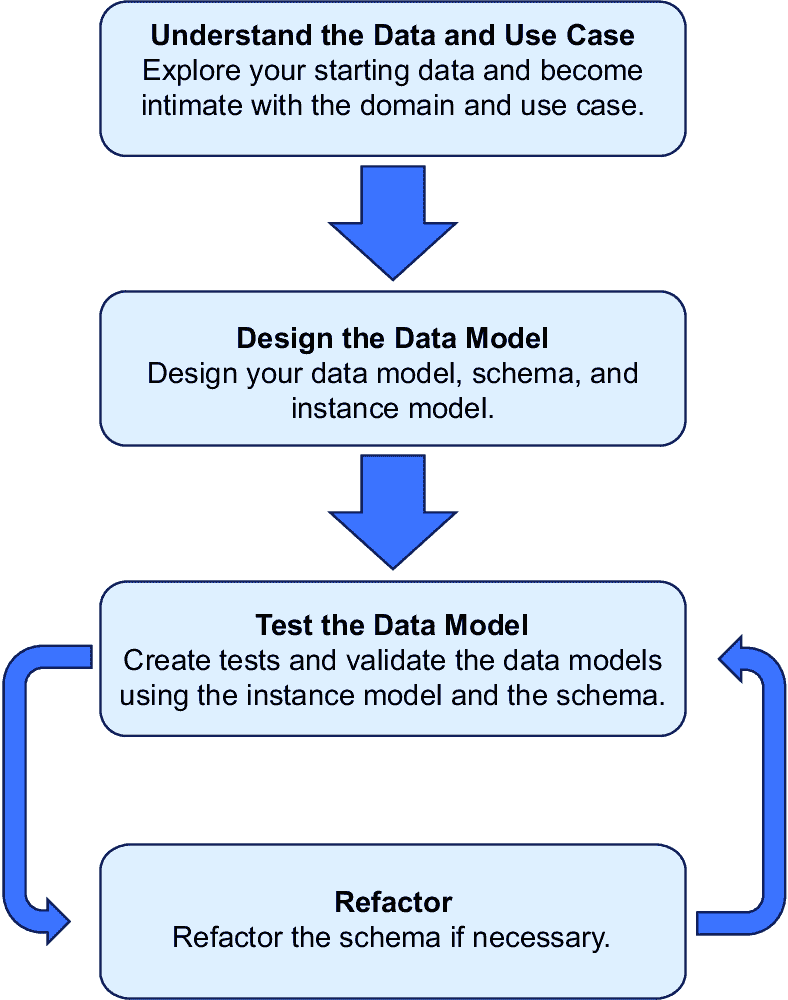
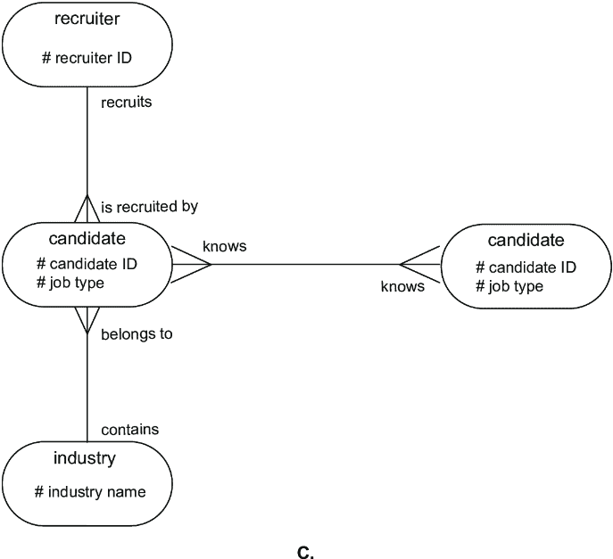
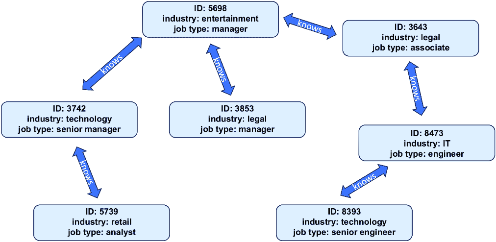
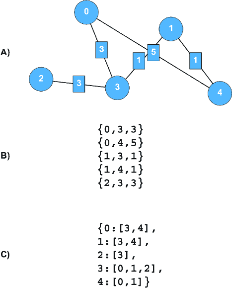
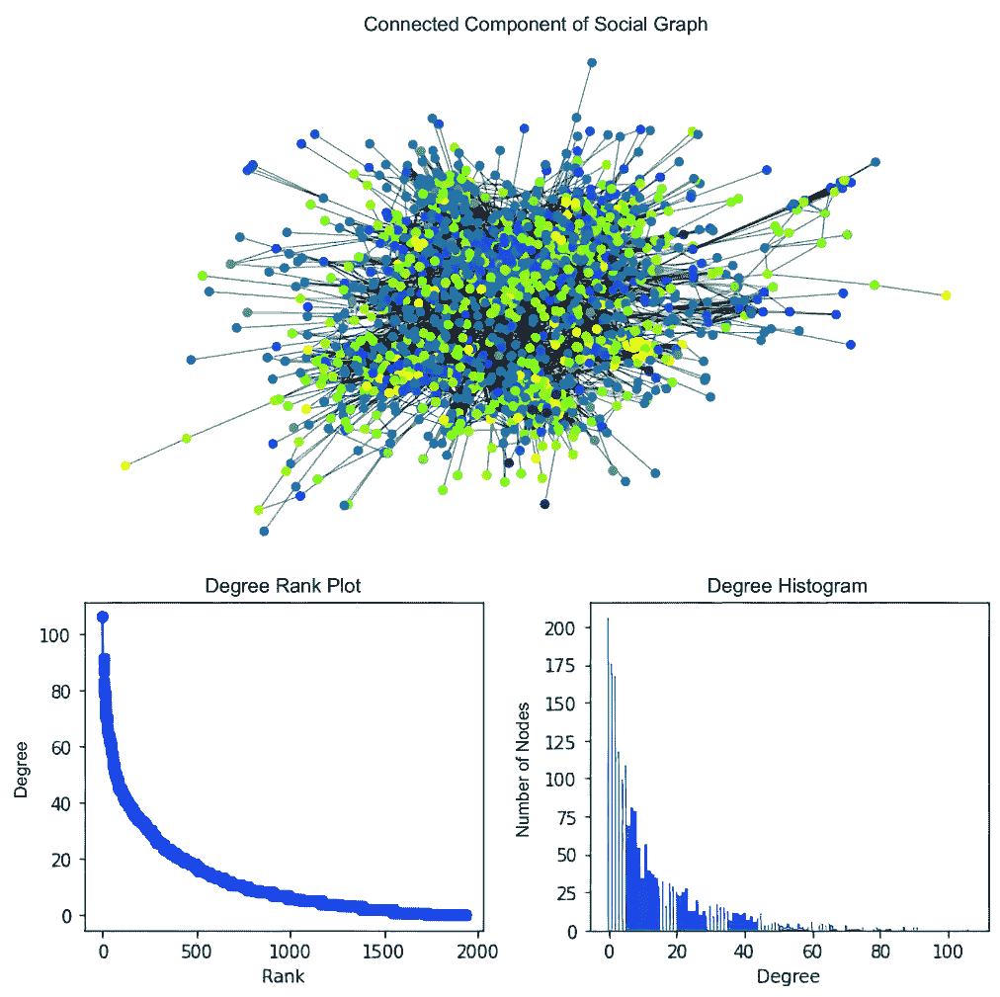
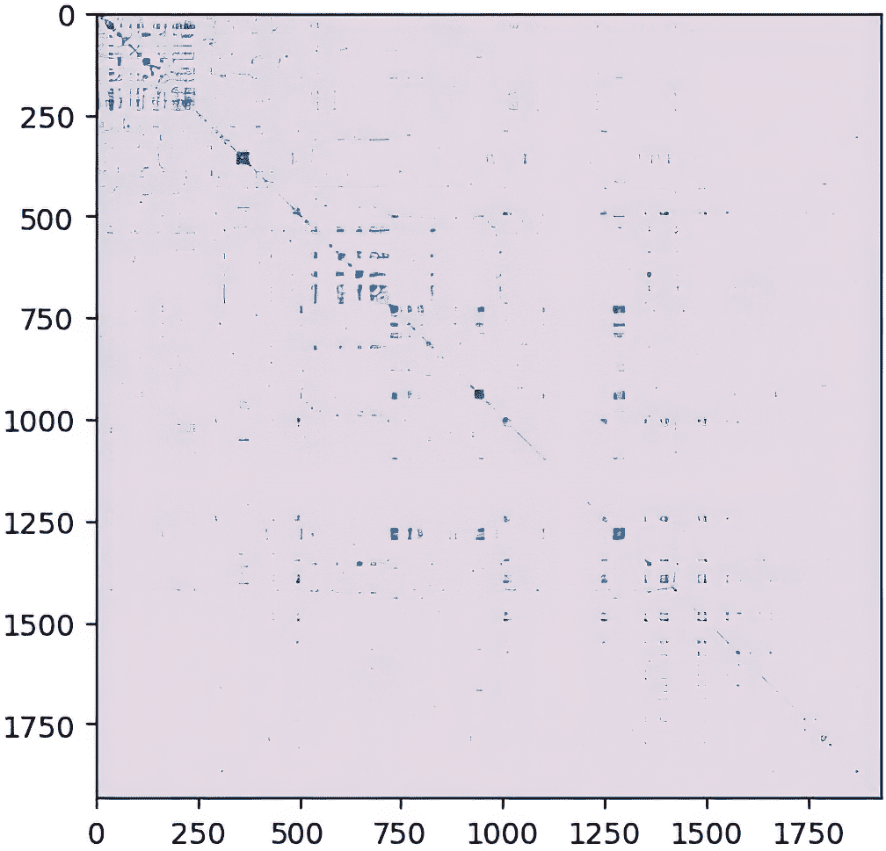
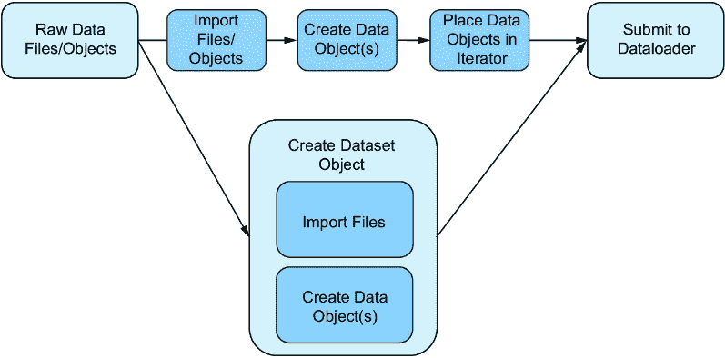

# 8 GNN 项目的考虑因素

### 本章涵盖

+   从非图数据创建图数据模型

+   从原始数据源提取、转换、加载和预处理

+   使用 PyTorch Geometric 创建数据集和数据加载器

在本章中，我们将描述与图数据一起工作的实际方面，以及如何将非图数据转换为图格式。我们将解释将数据从原始状态转换为预处理格式所涉及的一些考虑因素。这包括将表格或其他非图数据转换为图，并对其进行预处理，以便用于基于图的机器学习包。在我们的思维模型中，如图 8.1 所示，我们处于图的一半左侧。


##### 图 8.1 图训练过程的心理模型。我们处于过程的开始阶段，其中我们为训练准备数据。

我们将按以下步骤进行。在第 8.1 节中，我们将介绍一个可能需要图神经网络（GNN）的示例问题以及如何处理这个项目。第 8.2 节将更详细地介绍如何在图模型中使用非图数据。然后，在第 8.3 节中，我们将通过将数据集从原始文件转换为预处理数据，为训练做好准备，将这些想法付诸实践。最后，在第 8.4 节中，我们将给出寻找更多图数据集的建议。

在本章中，我们将考虑如何将 GNN 应用于由招聘公司创建的社会图。在我们的例子中，节点是求职候选人，边代表求职候选人之间的关系。我们生成图数据，以边列表和邻接列表的形式，然后使用这些数据在图处理框架（`NetworkX`）和 GNN 库（PyTorch Geometric [PyG]）中。这些数据中的节点包括候选人的*ID*、*工作类型*（会计、工程师等）和*行业*（银行、零售、科技等）。

我们将候选人的目标视为一个基于图的挑战，详细说明将他们的数据转换为图学习步骤。我们的目标是绘制数据工作流程图，从原始数据开始，将其转换为图格式，然后为本书中使用的 GNN 训练做准备。

备注：本章的代码以笔记本形式可在 GitHub 仓库中找到（[`mng.bz/Xxn1`](https://mng.bz/Xxn1)）。本章的 Colab 链接和数据可以在相同的位置访问。

## 8.1 数据准备和项目规划

考虑一个假设的招聘公司 Whole Staffing 的案例。Whole Staffing 为多个行业搜寻员工，并维护一个包含候选人档案的数据库，其中包括他们与公司的互动历史和其他候选人的信息。一些候选人通过其他候选人的推荐被介绍到公司。

### 8.1.1 项目定义

Whole Staffing 希望从其数据库中获得最大价值。他们对收集到的求职候选人有以下一些初步问题：

1.  一些档案缺少数据。在不打扰候选人的情况下，是否有可能填补这些缺失的数据？

1.  历史表明，过去在类似项目上工作过的候选人可以在未来的工作中很好地合作。是否有可能找出哪些候选人可以很好地合作？

Whole Staffing 委派你探索数据以回答这些问题。在众多分析和机器学习方法中，你认为有可能将数据表示为图，并使用 GNN 来回答客户的问题。

你的想法是将推荐集合转化为一个社交网络，其中求职者是节点，候选人之间的推荐是边。为了简化问题，你可以忽略推荐的方向，以便图可以是无向的。你还可以忽略重复的推荐，以便候选人之间的关系保持无权重。

我们将逐步介绍准备数据和建立数据管道以将数据传递到 GNN 模型的步骤。首先，让我们考虑项目规划阶段。

### 8.1.2 项目目标和范围

对于任何问题，拥有明确的目标、需求和范围将作为指南，引导所有后续行动和决策。从规划和模式创建到工具选择，每个方面都应遵循核心目标和范围。让我们考虑我们问题的每个方面。

#### 项目目标

Whole Staffing 希望优化其候选人数据库的使用。首先，项目应通过填补候选人档案中的缺失信息来提高数据质量，减少对直接候选人参与的需求。其次，接下来的工作应便于提出有根据的候选人建议，预测哪些团队将利用候选人的历史成功表现而合作得很好。

#### 项目需求和范围

几个关键需求将直接影响你的项目。让我们快速浏览几个，并指出它们对我们客户行业的意义。然后，我们将对当前项目得出一些结论。需求包括以下内容：

+   *数据大小和速度* — 数据的大小从项目数量、字节大小还是节点数量来衡量是多少？如果有的话，新信息添加到数据中的速度有多快？数据是否预期从实时流或每日更新的数据湖上传？

计划的图可能会随着数据的增加而增长，影响所需的计算资源和算法的效率。准确评估数据大小和速度可以确保系统可以处理预期的负载，可以提供实时洞察，并且可以扩展以适应未来的增长。

+   *推理速度* — 应用程序和底层机器学习模型需要有多快？有些应用可能需要亚秒级响应，而其他应用则没有时间限制。

响应时间在提供及时的建议和洞察方面尤为重要。对于招聘公司来说，将候选人与合适的职位空缺匹配是时间敏感的，机会很快就会消失。

+   *数据隐私* — 关于个人身份信息（PII）的政策和法规是什么，这会如何涉及数据转换和预处理？

当处理敏感信息，如候选人档案、联系详情和就业历史时，数据隐私成为一个巨大的关注点。在图和 GNN 设置中，确保节点和边不泄露 PII 是至关重要的。遵守如通用数据保护条例（GDPR）或加利福尼亚消费者隐私法案（CCPA）等法规是强制性的，以避免法律纠纷。图数据应以尊重隐私规范的方式处理、存储和处理。可能需要匿名化和加密技术来保护个人隐私，同时仍然允许有效的数据分析。在项目规划早期理解这些要求，确保系统架构和数据处理管道的设计考虑到隐私保护。

+   *可解释性* — 响应应该有多高的可解释性？直接答案是否足够，或者是否应该有额外的数据来阐明为什么做出了推荐或预测？

在招聘领域，可解释性和透明度至关重要。它们通过确保人才选拔过程中的公平性和清晰性，在候选人和雇主之间建立信任。维护道德标准，并应减轻无意中的偏见。这些要素不仅是道德上的要求，而且往往是法律上的约束。

根据目标和范围，对于 Whole Staffing，可交付成果可能是一个执行以下操作的系统：

1.  每两周扫描一次候选人数据，查找缺失项。缺失项可以被推断、建议或填充。

1.  通过使用链接预测和/或节点分类来预测将很好地一起工作的候选人。与第一个可交付成果不同，这里的响应时间应该很快。

以下列出了一些先前要求的具体规格：

+   *数据大小* — 这被保守地设定为足够容纳 10 万个候选人和他们的属性，估计为 1 GB 的数据。

+   *推理速度* — 应用程序将每两周运行一次，可以在一夜间完成，因此我们没有明显的速度限制。

+   *数据隐私* — 不能使用直接识别候选人的个人信息。然而，招聘公司已知的数据，例如员工是否在相同的雇主处成功安置，可以用来改善公司的运营，前提是这些数据不共享。

+   *可解释性* — 结果必须有一定的可解释性。

目标和要求将指导系统设计、数据模型以及通常 GNN 架构的决策。上述内容给出了在开始或界定基于图的项目时所需考虑的类型示例。

## 8.2 设计图模型

在给定适当的工作范围后，下一步是构建图模型。对于大多数机器学习问题，数据将以标准方式组织。例如，当处理表格数据时，行被视为观察值，列被视为特征。我们可以通过使用索引和键来连接此类数据表。此框架灵活且相对明确。我们可能会对包含哪些观察值和特征有所争议，但我们知道它们的位置在哪里。

当我们想要用图来表示我们的数据时，在除最简单场景之外的所有情况下，我们都会有几个选择来决定使用哪种结构。使用图时，并不总是直观地知道将感兴趣的实体放在哪里。正是这种不确定性推动了在图数据中使用系统方法的必要性，但尽早做对可以成为下游机器学习任务的基础[1]。

在本节中，我们开始将 Whole Staffing 的招聘数据转换为基于图的数据，以支持我们的下游流程。我们首先考虑领域和用例，这是理解数据的关键步骤。接下来，我们创建和细化一个模式，这对于组织和解释复杂数据集至关重要。通过严格测试模式，我们可以确保其健壮性和可靠性。任何必要的改进都应进行以优化性能和准确性。这种方法确保我们的未来分析系统，即摄入基于图的数据，可以精确可靠地回答关于求职者的复杂查询。以下是遵循的过程，图 8.2 提供了视觉说明：

1.  理解数据和用例。

1.  创建数据模型、模式和实例模型。

1.  使用模式和实例模型测试您的模型。

1.  如有必要，进行重构。



##### 图 8.2 从非图数据创建健壮的图数据模型的过程

### 8.2.1 熟悉领域和用例

与大多数数据项目一样，为了有效，我们必须掌握数据集和上下文。对于我们创建模型的直接目标，了解原始格式的推荐数据并深入了解招聘行业的复杂性可以提供关键见解。这些知识也为我们提供了在部署期间为模型设计测试的基础。例如，对原始数据的初步分析为我们提供了表 8.1 中的信息。

##### 表 8.1 数据集特征

| 候选人数 | 1,933 |
| --- | --- |
| 推荐人数 | 12,239 |

从原始数据中可以看出，存在许多关系，这为候选人的推荐提供了潜在的见解。与候选人数量相比，大量的推荐表明了一个相互关联的网络。我们的模型需要足够大，才能将这种结构转化为招聘问题空间内的结果。

转向领域知识，除了客户的直接需求之外，我们还应该提出巩固我们对行业理解的问题。在设定我们的数据模型的要求时，我们应该考虑行业的关键问题和挑战。对于招聘问题，我们可能会问如何优化推荐流程或是什么底层结构和模式支配着候选人的推荐。通过解决这类问题，我们可以使我们的模型与领域专业知识相一致，这可能会提高其相关性和有效性。

### 8.2.2 构建图数据集和模式

接下来，我们将讨论如何设计我们的数据库。术语*图数据集*表示使用图的元素和结构（节点、边、节点特征和边特征）描述数据的一般努力。为了实现这一点，我们需要一个*模式*和一个*实例*。这些明确指定了我们的图的结构和规则，并允许我们的图数据集被测试和改进。本节内容来源于几篇参考文献，列在书末供进一步阅读。

通过提前处理我们的图数据集的细节，我们可以避免技术债务，并更容易地测试我们数据的一致性。我们还可以更系统地实验不同的数据结构。此外，当我们明确设计我们的图的结构和规则时，它增加了我们参数化这些规则并在我们的 GNN 管道中实验它们的便利性。

图数据集可以是简单的，只包含一种类型的节点和一种类型的边。或者它们可以是复杂的，涉及许多类型的节点和边、元数据，在知识图中还包括本体论。

##### 关键术语

以下是在本节中使用的术语（有关图数据模型和图类型的更多详细信息，请参阅附录 A）：

+   *二部图（或二分图）*—具有两组节点的图。同一组内的节点之间没有边。

+   *实体-关系图（ER 图）*—显示图中的实体、关系和约束的图形。

+   *图数据集*—节点、边及其关系的表示。

+   *异构/同构图*—同构图只有一种类型的节点或边。异构图可以有多种不同类型的节点或边。

+   *实例模型*—基于模式且包含实际数据子集的模型。

+   *本体论*—描述特定知识领域中的概念和关系的一种方式，例如，在语义网（文学作品网）中不同实体（作家）之间的联系。本体论是定义这些作家及其文学作品的角色、属性和相互关系的结构化框架。

+   *属性图*—使用元数据（标签、标识符、属性/属性）来定义图元素的模型。

+   *资源描述框架图（RDF 图，又称三元组存储）*—遵循主语-谓语-宾语模式的模型，其中节点是主语和宾语，边是谓语。

+   *模式*—一个蓝图，定义了图元素的组织方式以及将用于这些元素的具体规则和约束。

+   *概念模式*—一种与任何特定数据库或处理系统无关的模式。

+   *系统模式*—针对特定图数据库或处理系统设计的模式。

+   *技术债务*—优先考虑快速交付而非高质量代码的后果，这后来需要重构。

图数据集擅长提供快速且易于他人理解的图的概念描述。例如，对于理解属性图或 RDF 图的人来说，告诉他们一个图是在属性图上实现的二分图，可以揭示你数据设计（属性图和 RDF 图在附录 A 中解释）的很多信息。

*模式*是一个蓝图，定义了数据在数据存储系统（如数据库）中的组织方式。图模式是图数据集的具体实现，详细说明了在特定用例中数据如何在真实系统中表示。模式可以由图表和书面文档组成。模式可以使用查询语言在图数据库中实现，也可以使用编程语言在处理系统中实现。模式应该回答以下问题：

+   元素（节点、边、属性）是什么？它们代表了哪些现实世界的实体和关系？

+   图是否包含多种类型的节点和边？

+   关于节点表示的约束是什么？

+   关系的约束是什么？某些节点是否有关于相邻和发生的限制？某些关系有计数限制吗？

+   如何处理描述符和元数据？这些数据有哪些约束？

根据您数据和使用系统的复杂性，您可能需要使用多个但一致的方案。一个*概念模式*概述了图元素、规则和约束，但并不绑定到任何系统。一个*系统模式*反映了概念模式的规则，但仅针对特定系统，例如选择的数据库。系统模式还可以从概念模式中省略不必要的元素。以下是创建模式的方法：

1.  *识别主要实体和关系*。例如，在我们的社交网络示例中，实体可以是候选人、招聘人员、推荐人、招聘活动，以及关系。

1.  *定义节点和边标签*。这些标签作为图中实体类型及其相互关系的标识符。

1.  *指定属性和约束*。每个顶点和边标签都与特定的属性和约束相关联，分别用于存储和限制信息。

1.  *定义索引（可选，针对面向数据库的模式）*。基于属性或其组合的索引可以增强图数据的查询速度。

1.  *将图模式应用于数据库（可选，针对面向数据库的模式）*。根据特定的图数据库，使用命令或代码来创建图模式，并指定其静态或动态性质。

根据图数据集的复杂性和用例，可能需要调用一个或多个模式。在存在多个模式的情况下，通过映射实现模式之间的兼容性也是必需的。

对于具有少量元素的数据库，一个简单的带有注释的图表就足以传达足够的信息，以便其他开发者能够用查询语言或代码实现。对于更复杂的网络设计，ER 图和相关语法有助于以视觉和可读的方式说明网络模式。

##### 实体-关系图（ER 图）

ER 图具有说明图节点、边和属性以及控制图的规则和约束的元素 [2, 3]。以下图（左）显示了可以用来说明边和关系约束的一些连接器符号。图（右）显示了一个模式图示例，传达了在我们的招聘示例（招聘人员和候选人）中可能表示的两个节点类型，以及两种边类型（了解和招聘/被招聘）。该图传达了隐含和显式约束。


##### 在左侧是 ER 图的关系命名法。在右侧是一个使用 ER 图的概念模式示例。

一些显式约束包括一个员工可以推荐许多其他员工，以及一个推荐人可以被许多员工推荐。另一个显式约束是，一个人只能被一家企业全职雇佣，但一家企业可能有多个员工。一个隐式约束是，对于这个图模型，企业和推荐之间不能存在关系。

转到我们的示例，为了为我们的示例数据集设计概念和系统模式，我们应该考虑以下因素：

+   我们数据中的实体和关系

+   可能的规则和约束

+   操作约束，例如我们可用的数据库和库

+   我们希望从应用程序中获得的结果

我们的数据将包括候选人及其个人资料数据（例如，行业、工作类型、公司等），以及招聘人员。属性也可以被视为实体；例如，医疗行业可以被视为一个节点。关系可以是候选人了解候选人、候选人推荐候选人，或者招聘人员招聘候选人。如前所述，图数据在实体表示方面可以非常灵活。

在这些选择的基础上，我们展示了几个概念模式选项。选项 A 在图 8.3 中展示。


##### 图 8.3 一个节点类型和一个边类型的模式

如您所见，示例 A 由一个节点类型（候选人）通过一个无向边类型（了解）连接。节点属性是候选人的行业和他们的工作类型。关系没有限制，因为任何候选人都可以了解 0 到*n*-1 个其他候选人，其中*n*是候选人的数量。第二个概念模式如图 8.4 所示。


##### 图 8.4 两个节点类型和一个边类型的模式

示例 B 由两个节点类型（候选人、招聘人员）通过一个无向边类型（了解）连接。候选人之间的关系没有限制。候选人与招聘人员之间的关系有一个约束：候选人只能链接到一个招聘人员，而招聘人员可以链接到多个候选人。

第三个模式如图 8.5 所示。它有多个节点和关系类型。在示例 C 中，类型包括候选人、招聘人员和行业。关系类型包括候选人了解候选人、招聘人员招聘候选人、候选人属于行业。请注意，我们将行业作为一个单独的实体，而不是候选人的属性。这类图被称为*异构图*，因为它们包含许多不同类型的节点和边。从某种意义上说，我们可以想象这些图是叠加在一起的多个图。当我们只有一种类型的节点和边时，这些图被称为*同构图*。示例 C 的一些约束包括以下内容：

+   候选人只能有一个招聘人员和一个行业。

+   招聘人员不链接到行业。



##### 图 8.5 三个节点类型和三个边类型的模式

根据查询和机器学习模型的目标，我们可以在开发应用程序的过程中选择一个模式或尝试所有三个模式。让我们坚持第一个模式，它可以作为我们探索和实验的简单结构。

### 8.2.3 创建实例模型

*实例模型*通过根据模式提供可触摸的、具体的示例数据，与图数据集的抽象性质形成对比。这样的示例用于验证和测试模式。以下是为创建实例模型所遵循的步骤：

1.  *识别模式*。首先，确定你的实例将基于的一般模型或模式。确保类定义、属性和方法都已确立。

1.  *选择数据子集*。选择一个特定的数据子集来表示，并遵循已建立的图形模式。

1.  *创建节点*。为数据子集中的每个实体开发节点，确保每个节点都有一个标签、唯一的标识符和相关的属性。

1.  *创建边*。为每个关系开发链接，分配标签和属性，并指定边方向和多重性。

1.  *遵守您模式中的规则和约束*。在构建实例模型时，请确保遵循模式的规则和约束。

1.  *可视化*。使用可视化工具以图形方式表示实例模型。

1.  *实例化*。使用图数据库或图处理系统实现实例模型。这将允许进行查询以测试和验证它。

图 8.6 显示了从前讨论的方案中派生出的实例模型的示例。节点和边填充了候选人的实际数据，而不是占位符。



##### 图 8.6 示例：一个节点填充了招聘示例中实际数据的实例模型。实际的实例模型可能包含更多的数据。

### 8.2.4 测试和重构

*技术债务*可能发生在我们必须更改和演进我们的数据或代码，但我们尚未在我们的模型中计划向后或向前兼容性时。它也可能发生在我们的建模选择不适合我们的数据库和软件选择时，这可能导致昂贵的（在时间或金钱上）的解决方案或替代方案。

在我们的数据和模型上定义明确的规则和约束为我们提供了测试管道的明确方法。例如，如果我们知道我们的节点最多只能有两个度数，我们可以设计简单的函数或查询来处理和测试每个节点是否符合这一标准。

测试和重构是迭代过程，对于扩展优化的图模式和实例模型至关重要[4, 5]。它将涉及执行查询、分析结果、进行必要的调整，并对照指标进行验证。在 Whole Staffing 的招聘数据背景下，这项实践将确保模型能够捕捉现实世界的关系和稳健的新数据流。以下是测试和重构的一些示例：

1.  *将实例模型映射到系统中*。将模型存储在您选择的图数据库或处理系统中。

1.  *创建测试和运行查询*。根据具体要求，起草查询以测试您模型的完整性。使用 Cypher 或 SPARQL 等查询语言在图数据库上执行查询。例如，Python 等编程语言也可以用于查询图处理系统（如 NetworkX）内的图。

对于我们示例的简单模式，以下是一些可能的测试：

+   +   *节点属性验证* —应检查每个节点，以确认它具有所需的属性，特别是候选人的行业和职位类型，以及这些属性具有非空值。

    +   *边类型验证* —应验证所有候选人间的关系，以确认它们是 Knows 类型，确保关系标签的一致性。

    +   *关系验证* —检查关系的平均数量，以确保它与平均推荐数量的平均数量一致。

    +   *唯一标识符* — 应检查每个候选节点是否有唯一标识符，以防止数据重复并确保数据完整性。

    +   *属性数据类型* — 应验证`industry`和`jobType`属性的数据类型，以确保所有候选节点的一致性。

    +   *网络结构* — 应验证网络结构以确保其为无向的，确认候选节点之间 Knows 关系的双向性质。

    +   *边缘情况* — 确定边缘情况并查询这些情况。在我们的案例中，未连接的节点可能存在问题。使用查询来了解未连接节点的范围及其对分析的影响，将推动重构决策。另一个边缘情况可能是一组孤立候选人，他们的关系形成一个循环。确保数据模型和分析工具能够处理这种复杂或异常的数据模式，并仍然产生有效答案，这将是重要的。

1.  3. *验证和评估性能* — 根据测试结果，确定您的模型和用例是否存在逻辑问题，或者数据属性存在问题。

1.  4. *重构* — 根据需要调整标签、属性、关系或约束，以最大限度地减少错误。

1.  5. *重复* — 重复前面的步骤，根据评估结果精炼模型，并确保与项目需求和约束一致。

1.  6. *最终评估* — 评估最终模型是否符合标准和最佳实践，以确保其适用于复杂查询和机器学习应用。

通过这种测试和重构的迭代过程，我们精炼 Whole Staffing 招聘数据和使用案例的数据集。对细节的关注确保模型准备好支持对招聘数据中隐藏的复杂、细微关系的评估。

当我们过渡到下一节时，我们的重点转向这些概念的实际实施。我们将探讨在 PyG 中创建数据管道，展示如何将数据从其初始原始形式转换为预处理状态，以便输入到其他下游模型训练和测试程序。

## 8.3 数据管道示例

在确定模式后，让我们通过一个数据管道的示例。在本节中，我们假设我们的目标是创建一个简单的数据工作流程，它从原始状态的数据开始，并以可以传递给 GNN 的预处理数据集结束。这些步骤在图 8.7 中进行了总结。

注意，虽然显示的总体步骤可以从一个问题到另一个问题保持一致，但每个步骤的实现细节可能因问题、其数据以及选择的数据存储、处理和模型训练选项而独特。


##### 图 8.7 本节中数据管道处理步骤的总结

##### 关键术语

以下是在本节中使用的关键术语（有关图数据模型和图类型的更多详细信息，请参阅附录 A）：

+   *邻接表*—图数据的基本表示。在这种格式中，每个条目包含一个节点及其相邻节点的列表。

+   *邻接矩阵*—图数据的基本表示。在一个矩阵中，每一行和每一列对应一个节点。这些行和列交叉的单元格表示节点之间存在边。非零值的单元格表示节点之间存在边，而零值表示没有连接。

+   *度*—节点的度是其相邻节点的数量。

+   *边列表*—图的基本表示。它是一个包含图中所有边的数组；数组中的每个条目包含一对连接的节点。

+   *掩码*—一个布尔数组（或 PyTorch 中的张量），用于选择特定的数据子集。掩码通常用于将数据集分割成不同的部分，如训练集、验证集和测试集。

+   *排名*—在我们的上下文中，排名指的是每个节点度在排序列表中的位置。因此，度最高的节点排名为 1，下一个最高的排名为 2，依此类推。

+   *原始数据*—最未加工的数据形式。

+   *序列化*—将数据放入易于存储或导出的格式。

+   *子图*—子图是较大图节点和边的子集。

### 8.3.1 原始数据

*原始数据*指的是最未加工状态的数据；此类数据是管道的起点。这些数据可以存储在各种数据库中，以某种方式序列化，或生成。

在应用程序的开发阶段，了解所使用的原始数据与生产中使用的实时数据之间的匹配程度非常重要。一种方法是通过对数据存档进行抽样。

如第 8.1 节所述，我们的示例问题至少有两个来源：包含推荐日志和候选者资料的关联数据库表。为了使我们的示例保持简洁，我们假设一位有助的工程师已经查询了日志数据并将其转换为 JSON 格式，其中键是推荐候选者，值是推荐的候选者。从我们的资料数据中，我们还有两个其他字段：*行业*和*工作类型*。对于这两个数据源，我们的工程师已经使用散列来保护 PII，我们可以将其视为候选者的唯一标识符。在本节中，我们将使用 JSON 数据，其中示例片段如图 8.8 所示。数据以两种方式显示：带有散列和不带散列。

#### 数据编码和序列化

在构建管道时，一个关键的考虑因素是选择在从一个系统导入和导出数据到另一个系统时使用的数据格式。为了将图数据传输到另一个系统或通过互联网发送，通常使用*编码*或*序列化*。这些术语指的是将数据放入易于传输的形式[6, 7]。在选择编码格式之前，你必须决定以下内容：

+   *数据模型*—简单模型、属性图或其他？

+   *模式* — 你的数据中的哪些实体是节点、边和属性？

+   *数据结构* — 数据是如何存储的：在邻接矩阵、邻接列表或边列表中？

+   *接收系统* — 接收系统（在我们的案例中，是 GNN 库和图处理系统）如何接受数据？首选的编码和数据结构是什么？导入的数据是否自动识别，或者是否需要自定义编程来读取数据？


##### 图 8.8 原始数据视图：JSON 文件。左边的图是键/值格式。键是成员，值是它们已知的关联。右边的图显示了未散列的值，展示了这些个人的示例名称。

这里有一些你可能会遇到的编码选择：

+   *语言和系统无关的编码格式* — 这些格式因其极端灵活性和跨多个系统和语言的适用性而最受欢迎。然而，数据排列可能仍然因系统而异。因此，CSV 文件中的边列表，带有特定的标题集，可能在不同的系统之间不被接受或以相同的方式解释。以下是一些该格式的示例：

    +   *JSON* — 在从 API 读取或输入到 JavaScript 应用程序时具有优势。图可视化库 `Cytoscape.js` 接受 JSON 格式的数据。

    +   *CSV* — 被许多处理系统和数据库接受。然而，数据排列和标签的要求因系统而异。

    +   *XML* — 图交换 XML (GEXF) 格式当然是一种 XML 格式。

+   *语言特定* — Python、Java 和其他语言有内置的编码格式。

+   *Pickle* — Python 的格式。一些系统接受 Pickle 编码的文件。尽管如此，除非你的数据管道或工作流程广泛受 Python 管理，否则应谨慎使用 Pickle。其他语言特定的编码也适用同样的原则。

+   *系统驱动* — 特定软件、系统和库有自己的编码格式。尽管这些格式在系统间的可用性可能有限，但一个优点是这些格式的模式是一致的。拥有自己编码格式的软件和系统包括斯坦福网络分析平台 (SNAP)、NetworkX 和 Gephi。

+   *大数据* — 除了之前列出的语言无关格式外，还有其他用于更大数据量的编码格式。

+   *Avro* — 这种编码在 Hadoop 工作流程中被广泛使用

+   *基于矩阵* — 因为图可以用矩阵表示，所以有一些基于这种数据结构的格式。对于稀疏图，以下格式提供了大量的内存节省和计算优势（对于查找和矩阵/向量乘法）：

    +   稀疏列矩阵 (.csc 文件类型)

    +   稀疏行矩阵 (.csr 文件类型)

    +   矩阵市场格式 (.mtx 文件类型)

### 8.3.2 ETL 步骤

在选择模式和建立数据源后，*ETL*（*提取、转换、加载*）步骤包括从其来源提取原始数据，然后生成符合模式且准备进行预处理或训练的数据。对于我们的数据，这包括编写一系列操作，从各种数据库中提取数据，然后根据需要将它们连接起来。

我们需要最终以特定格式结束的数据，我们可以将其输入到预处理步骤中。这可以是 JSON 格式或边列表。对于 JSON 示例或边列表示例，我们的模式得到满足；我们将有节点（个人）和边（这些人之间的关系）。

对于我们的招聘示例，我们希望将我们的原始数据转换为编码在 CSV 中的图数据结构。这是为了方便用 Python 进行操作。然后，我们可以将此文件加载到我们的图处理系统 NetworkX 或 PyG 等 GNN 包中。为了总结下一步，我们将执行以下操作：

1.  按照您选择的图数据模型将原始数据文件转换为图格式。在我们的情况下，我们将原始数据转换为边列表和邻接表。然后我们将其保存为 CSV 文件。

1.  将 CSV 文件加载到 NetworkX 中进行探索性数据分析（EDA）和可视化。

1.  加载到 PyG 并进行预处理。

#### 将原始数据转换为邻接表和边列表

从我们的 CSV 和 JSON 文件开始，我们接下来将数据转换为两个关键数据模型：边列表和邻接列表，我们在附录 A 中定义了它们。邻接表和边列表都是与图一起使用的两种基本数据表示。边列表是一个列表，其中该结构中的每个条目都包含一个节点及其相邻节点的列表。这些表示在图 8.9 中说明。



##### 图 8.9 一个带有节点和边标记的图（顶部）。边列表表示（中间）；每个条目包含边号和连接的节点对。字典中的邻接列表表示（底部）；每个键是一个节点，其值是该节点的相邻节点。

首先，使用`json`模块，我们将数据从 JSON 文件加载到 Python 字典中。Python 字典的结构与 JSON 相同，成员哈希作为键，其关系作为值。

#### 创建邻接表

接下来，我们从该字典创建一个邻接表。此列表将存储为文本文件。文件的每一行将包含成员哈希，后跟该成员关系的哈希。创建邻接表的过程在图 8.10 中说明。

此函数将我们的原始数据转换为邻接表，我们将将其应用于我们的招聘示例。我们将有以下*输入*：

+   一个字典，其中包含候选人的推荐，键是推荐其他候选人的成员，值是被推荐的人的列表

+   要附加到文件名上的后缀


##### 图 8.10 流程图说明了将关系字典转换为结构良好的邻接表的过程，该邻接表存储在文本文件中，同时确保无向图中连接的对称性。

我们将得到以下内容的 *输出*：

+   txt 文件中的编码邻接表

+   找到的节点 ID 列表

这在下面的列表中显示。

##### 列表 8.1 从关系字典创建邻接表

```py
def create_adjacency_list(data_dict, suffix=''):
   list_of_nodes = []

   for source_node in list(data_dict.keys()):  #1

       if source_node not in list_of_nodes:
           list_of_nodes.append(source_node)

       for y in data_dict[source_node]:               #2
           if y not in list_of_nodes:                 #2
               list_of_nodes.append(y)                #2
           if y not in data_dict.keys():              #2
               data_dict[y]=[source_node]             #2
           Else:                                      #2
               if source_node not in data_dict[y]:    #2
                   data_dict[y].append(source_node)   #2
               else: continue                         #2

   g= open("adjacency_list_{}.txt".format(suffix),"w+")  #3
   for source_node in list(data_dict.keys()):  #4
       dt = ' '.join(data_dict[source_node])   #5
       print("{} {}".format(source_node, dt))  #6
       g.write("{} {} \n".format(source_node, dt))   #7

   g.close
   return list_of_nodes
```

#1 遍历输入数据字典中的每个节点

#2 因为这是一个无向图，所以值之间必须存在对称性；也就是说，一个键中的每个值都必须包含该键在其自己的条目中。例如，对于条目 F，如果 G 是一个值，那么对于条目 G，F 必须也是一个值。这些行检查这些条件是否存在，并在这些条件不存在时修复字典。

#3 创建一个将存储邻接表的文本文件

#4 对于字典中的每个键

#5 从字典值的列表中创建一个字符串。这个值是成员 ID 的字符串，由空格分隔。

#6 可选打印

#7 将一行写入文本文件。这一行将包含成员哈希，然后是一个关系哈希的字符串。

#### 创建边列表

接下来，我们展示创建边列表的过程。与邻接表一样，我们转换数据以考虑节点对对称性。请注意，这两种格式都可以用于此项目。对于您自己的项目，另一种格式也可能是必要的。图 8.11 说明了这个过程。


##### 图 8.11 列表 8.2 中编程创建边列表文件的过程

与邻接表函数一样，边列表函数说明了原始数据到边列表的转换，并且具有与上一个函数相同的输入。输出包括以下内容：

+   .txt 文件中的边列表

+   找到的节点 ID 列表和生成的边列表

根据定义，边列表中的每个条目都必须是唯一的，因此我们必须确保我们生成的边列表是相同的。以下是创建从关系字典到边列表的代码。

##### 列表 8.2 从关系字典创建边列表

```py
def create_edge_list(data_dict, suffix=''):
    edge_list_file = open("edge_list_{}.txt".format(suffix),"w+")
    edges = []    
    nodes_all = []

    for source in list(data_dict.keys()):
        if source not in list_of_nodes_all:
            nodes_all.append(source)
        connections = data_dict[source]

        for destination in connections:   #1
            if destination not in nodes_all:
                nodes_all.append(destination)

           if {source, destination} not in edges:   #2
               print(f"{source} {destination}")
               out_string =  f"{source} {destination}\n”
               edge_list_file.write(out_string)   #3
               edges.append({source, destination })

           else: continue

       edge_list_file.close
       return list_of_edges, list_of_nodes_all
```

#1 每个成员字典的值是一个关系列表。对于每个键，我们遍历每个值。

#2 因为这个图是无向的，我们不希望创建重复的边。例如，因为 {F,G} 与 {G,F} 相同，我们只需要其中一个。这一行检查节点对是否已经存在。我们使用集合对象，因为节点顺序不重要。

#3 将一行写入文本文件。这一行将包含节点对。

在接下来的几节中，我们将使用邻接表将我们的图加载到 NetworkX 中。关于使用邻接表与边列表加载图之间的区别，有一点需要注意，那就是边列表无法考虑单个未连接的节点。结果发现，Whole Staffing 的许多候选人都没有推荐任何人，也没有与他们相关的边。这些节点在数据边列表表示中将是不可见的。

### 8.3.3 数据探索和可视化

接下来，我们希望将我们的网络数据加载到图处理框架中。我们选择了 NetworkX，但根据您的任务和语言偏好，还有许多其他选择。我们选择 NetworkX 是因为我们的图很小，我们还想做一些轻量级的 EDA 和可视化。

使用我们新创建的邻接表，我们可以通过调用`read_edgelist`或`read_adjlist`方法来创建一个 NetworkX 图对象。接下来，我们可以加载属性`industry`和`job type`。在这个例子中，这些属性作为字典加载，其中节点 ID 作为键。

在我们的图加载后，我们可以探索和检查我们的数据，以确保它与我们的假设一致。首先，节点和边的数量应该与我们的成员数量相匹配，以及我们在边列表中创建的边的数量，如下所示。

##### 列表 8.3 从关系字典创建边列表

```py
social_graph = nx.read_adjlist('adjacency_list_candidates.txt')
nx.set_node_attributes(social_graph, attribute_dict)
print(social_graph.number_of_nodes(), social_graph.number_of_edges())
>> 1933 12239
```

我们想检查我们的图有多少个连通分量：

```py
len(list((c for c in nx.connected_components(social_graph))))
>>> 219
```

`connected_components`方法生成图的连通分量；可视化如图 8.12 所示，并使用 NetworkX 生成。有数百个分量，但当我们检查这些数据时，我们发现有一个由 1,698 个节点组成的大分量，其余的由不到 4 个节点组成。大多数断开连接的分量是单节点（从未推荐任何人的候选人）。有关图分量的更多信息，我们在附录 A 中给出了定义和细节。


##### 图 8.12 完整的图，其中包含中间的大连通分量，周围环绕着许多较小的分量。在我们的例子中，我们将只使用大连通分量中的节点。

我们对这个大连通分量感兴趣，并将继续使用它。`subgraph`方法可以帮助我们隔离这个大分量。

最后，我们使用 NetworkX 来可视化我们的图。为此，我们将使用分析图的标准配方，该配方也可以在 NetworkX 文档中找到。

让我们逐一介绍不同的步骤（每个步骤的完整代码示例也存放在仓库中，标记为“可视化社交图并显示度统计的函数”）：

1.  *创建图对象*。从给定的图中选择最大的连通分量，生成一个独特的图对象。在只有一个连通分量的情况下，这一步可能是不必要的，但确保选择了主要分量。

```py
connected_component = nx.connected_components(social_graph
Gcc = social_graph.subgraph(sorted(connected ), 
                            key=len, 
                            reverse=True)[0]
                            )
```

1.  2. *确定布局*。决定节点和边的可视化位置。选择合适的布局算法；例如，Spring Layout 将边建模为弹簧，节点为排斥质量：

```py
pos = nx.spring_layout(Gcc, seed=10396953)
```

1.  3. *绘制节点和边*。使用所选布局在可视化中绘制节点。调整节点大小等视觉参数以增强图形的清晰度。根据所选布局绘制边。通过调整透明度等外观设置以实现所需的视觉效果。

```py
nx.draw_networkx_nodes(Gcc, pos, ax=ax0, node_size=20)
nx.draw_networkx_edges(Gcc, pos, ax=ax0, alpha=0.4)
ax0.set_title("Connected component of Social Graph")
ax0.set_axis_off()
```

1.  4. *生成和绘制节点度数*。在图对象上使用度数方法创建一个包含各自度数的节点可迭代对象，并按从高到低的顺序排序。在图上可视化排序后的节点度数列表，以分析各种节点的分布和突出度。使用 NumPy 的`unique`方法与`return_counts`参数来绘制一个直方图，显示节点的度数及其计数，从而深入了解图的结构和复杂性：

```py
degree_sequence = sorted([d for n, d in social_graph.degree()], reverse=True)

ax1 = fig.add_subplot(axgrid[3:, :2])
ax1.plot(degree_sequence, "b-", marker="o")
ax1.set_title("Degree Rank Plot")
ax1.set_ylabel("Degree")
ax1.set_xlabel("Rank")

ax2 = fig.add_subplot(axgrid[3:, 2:])
ax2.bar(*np.unique(degree_sequence, return_counts=True))
ax2.set_title("Degree histogram")
ax2.set_xlabel("Degree")
ax2.set_ylabel("# of Nodes")
```

这些图示显示在图 8.13 中。



##### 图 8.13 展示了社交图及其大型连通组件的视觉化和统计数据。使用 NetworkX 默认设置进行网络可视化（顶部）。整个图节点度的排名图（左下角）。我们看到大约四分之三的节点相邻节点少于 20 个。度数的直方图（右下角）。

最后，我们可以使用以下命令可视化我们图的邻接矩阵，如图 8.14 所示：

```py
plt.imshow(nx.to_numpy_matrix(social_graph), aspect='equal',cmap='twilight')
```



##### 图 8.14 展示了我们的社交图的视觉邻接矩阵。垂直和水平值分别指代相应的节点。

与数值邻接矩阵一样，对于我们的无向图，这个视觉邻接矩阵在对角线处具有对称性。所有无向图都将具有对称的邻接矩阵。对于有向图，这可能发生，但并不保证。

### 8.3.4 预处理和将数据加载到 PyG 中

对于本书，*预处理*包括将我们的数据及其属性、标签或其他元数据放入适合下游机器学习模型的格式。特征工程也可以是这个过程的一个步骤。对于特征工程，我们通常会使用图算法来计算节点、边或子图的性质。

节点特征的例子是介数中心性。如果我们的模式允许，我们可以计算并将此类属性附加到数据中节点实体。为此，我们取 ETL 步骤的输出，比如说一个边列表，并将其导入到图处理框架中，以计算每个节点的介数中心性。一旦获得这个量，我们可以使用以节点 ID 为键的字典来存储它，然后稍后将其用作节点特征。

##### 介数中心性

*中介中心性* 是衡量节点重要性的关键指标，它量化了节点位于源节点到目标节点最短路径中的趋势。给定一个包含 *n* 个节点的图，你可以确定图中每对唯一节点之间的最短路径。我们可以取这组最短路径，并查找特定节点的存在。如果一个节点出现在所有或大多数这些路径中，它就具有高中介中心性，并且被认为是高度有影响力的。相反，如果一个节点在 shortest paths 集合中只出现几次（或只出现一次），它将具有低中介中心性，并且影响力低。

现在我们有了数据，我们希望使其准备好在我们的所选 GNN 框架中使用。在这本书中，我们使用 PyG，因为它拥有强大的工具套件和灵活处理复杂图数据的能力。然而，大多数标准 GNN 软件包都有导入自定义数据到其框架的机制。对于本节，我们将关注 PyG 中的三个模块：

+   `数据` *模块* (`torch_geometric.data`) — 允许检查、操作和创建 PyG 环境中使用的数据对象。

+   `Utils` *模块* (`torch_geometric.utils`) — 许多有用的方法。在本节中，允许快速导入和导出图数据的方法很有帮助。

+   `数据集` *模块* (`torch_geometric.datasets`) — 预加载的数据集，包括基准数据集和该领域有影响力的论文中的数据集。

让我们从 `Datasets` 模块开始。此模块包含已经预处理的并可以由 PyG 的方法直接使用的数据集。当你开始使用 PyG 时，拥有这些数据集可以让你轻松地进行实验，无需担心创建数据管道。同样，通过研究这些数据集背后的代码库，我们也可以学习如何创建我们自己的自定义数据集。

在上一节的结尾，我们将原始数据转换为标准格式，并将我们的新图加载到图处理框架中。现在，我们希望将数据加载到 PyG 环境中。PyG 中的预处理有几个目标：

+   从节点和边级别到子图和图级别的多个属性的数据对象创建

+   将不同的数据源组合成一个对象或一组相关对象

+   将数据转换为可以使用 GPU 处理的对象

+   允许分割训练/测试/验证数据

+   允许数据批处理以进行训练

这些目标通过 `Data` 模块中的类层次结构来实现：

+   `数据` *类* — 创建图对象。这些对象可以具有可选的内置和自定义属性。

+   `Dataset` *和* `InMemoryDataset` *类* — 创建可重复的数据预处理管道。你可以从原始数据文件开始，并添加自定义过滤器转换以实现你的预处理 *数据* 对象。`Dataset` 对象比内存大，而 `InMemoryDataset` 对象适合内存。

+   `Dataloader` *类* —为模型训练批量数据对象。

这在图 8.15 中显示，包括不同的数据和数据集类如何连接到 dataloader。



##### 图 8.15 PyG 中预处理数据的步骤。从原始文件中，有两条基本路径用于为 PyG 算法准备数据。第一条路径，如这里所示，直接创建数据实例的迭代器，该迭代器由 dataloader 使用。第二条路径模仿第一条路径，但在 dataloader 类内部执行此过程。

预处理数据有两种途径，一种使用 `dataset` 类，另一种则不使用。使用 `dataset` 类的优势在于它允许我们保存生成的数据集，并保留过滤和转换的细节。数据集对象是灵活的，可以修改以输出数据集的不同变体。另一方面，如果你的自定义数据集很简单或即时生成，并且你不需要保存数据或长期处理，绕过数据集对象可能对你很有帮助。因此，总的来说，我们有以下不同的数据相关类：

+   `数据集` *对象* —用于基准测试或测试算法或架构的预处理数据集（不要与 `Dataset`—结尾没有“s”的对象混淆）。

+   `数据` *对象转换为迭代器* —即时生成或无需保存的图对象。

+   `Dataset` *对象* —对于应该保留的图对象，包括数据管道、过滤和转换、输入原始数据文件和输出处理后的数据文件。不要与 `Datasets`（结尾有“s”）对象混淆。

在掌握这些基础知识后，让我们预处理我们的社交图数据。我们将涵盖以下情况：

+   *将数据转换为* `数据实例` *使用 NetworkX.* 快速将 NetworkX 转换为 PyG，非常适合临时处理或使用 NetworkX 的功能。

+   *使用输入文件* 将数据转换为 `数据实例`。这提供了对数据导入过程的控制，非常适合原始数据和定制预处理需求。

+   *转换为* `数据集` *实例*。对于系统化、可扩展和可重复的数据预处理和管理，特别是对于复杂或可重复使用的数据集。

+   *将数据对象转换为* `dataloader` *使用，不使用* `dataset` *类*。对于优先考虑简单性和速度，而不是系统化数据管理和预处理的场景，或者对于即时和合成数据。

首先，我们将导入 PyG 中所需的模块，如下所示。

##### 列表 8.4 必要的导入，包括数据对象创建

```py
import torch
from torch_geometric.data import Data
from torch_geometric.data import InMemoryDataset
from torch_geometric import utils
```

#### 情况 A：使用 NetworkX 对象创建 PyG 数据对象

在前面的章节中，我们探讨了以 NetworkX `graph` 对象表示的图。PyG 的 `util` 模块有一个方法可以直接从 NetworkX `graph` 对象创建 PyG `data` 对象：

```py
data = utils.from_networkx(social_graph)
```

`from_networkx` 方法保留了节点、边及其属性，但应检查以确保从一个模块到另一个模块的转换顺利进行。

#### 情况 B：使用原始文件创建 PyG 数据对象

为了更好地控制数据导入 PyG，我们可以从原始文件或 ETL 流程的任何阶段的文件开始。在我们的社交图案例中，我们可以从之前创建的边列表文件开始。

现在，让我们回顾一个示例，其中我们使用代码将我们的社交图从边列表文本文件处理并转换为适合在 PyG 中训练 GNN 模型的格式。我们为 PyG 环境准备节点特征、标签、边和训练/测试集。

#### 第一部分：导入和准备图数据

这部分包括从文件中读取边列表以创建一个 NetworkX 图，提取节点列表，创建从节点名称到索引的映射，反之亦然：

```py
social_graph = nx.read_edgelist('edge_list2.txt')   #1

list_of_nodes = list(set(list(social_graph)))   #2
indices_of_nodes = [list_of_nodes.index(x)\
 for x in list_of_nodes]    #3

node_to_index = dict(zip(list_of_nodes, indices_of_nodes))   #4
index_to_node = dict(zip(indices_of_nodes, list_of_nodes))
```

#1 从文本文件中读取边列表并用于创建一个 NetworkX 图。

#2 然后从图中提取并列出所有唯一的节点。

#3 为每个节点生成索引。

#4 创建了两个字典，以便于节点名称与其相应索引之间的转换，从而便于处理和操作图数据。

#### 第二部分：处理边和节点特征

这部分专注于将边和节点属性转换为可以轻松用于 PyTorch 机器学习任务的格式：

```py
list_edges = nx.convert.to_edgelist(social_graph)   #1
list_edges = list(list_edges)
named_edge_list_0 = [x[0] for x in list_edges]   #2
named_edge_list_1 = [x[1] for x in list_edges]

indexed_edge_list_0 = [node_to_index[x]\
 for x in named_edge_list_0]   #3
indexed_edge_list_1 = [node_to_index[x] for x in named_edge_list_1]

x = torch.FloatTensor([[1] for x in\ 
range(len(list_of_nodes))])  #4
y = torch.FloatTensor([1]*974 + [0]*973)   #5
y = y.long()
```

#1 创建了一个 NetworkX 边列表对象。

#2 然后将其转换为两个单独的列表，分别表示每条边的源节点和目标节点。

#3 这些列表随后使用先前创建的节点到索引映射进行索引。

#4 使用 PyTorch 张量对象准备节点特征和标签，假设所有节点具有相同的单个特征。

#5 使用 PyTorch 张量对象准备节点特征和标签，假设所有节点具有相同的单个特征。

#### 第三部分：准备训练和测试数据

在这部分，通过创建数据拆分的掩码并将所有处理过的数据组合成一个单一的 PyTorch 数据对象，为训练和测试准备数据集：

```py
edge_index = torch.tensor([indexed_edge_list_0,\
 indexed_edge_list_1])    #1

train_mask = torch.zeros(len(list_of_nodes),\
 dtype=torch.uint8)   #2
train_mask[:int(0.8 * len(list_of_nodes))] = 1 #train only on the 80% nodes
test_mask = torch.zeros(len(list_of_nodes),\
 dtype=torch.uint8) #test on 20 % nodes 
test_mask[- int(0.2 * len(list_of_nodes)):] = 1
train_mask = train_mask.bool()
test_mask = test_mask.bool()

data = Data(x=x, y=y, edge_index=edge_index,\
 train_mask=train_mask, test_mask=test_mask)    #3
```

#1 在第二部分中创建的边索引被转换为 PyTorch 张量。

#2 通过将节点分成两个独立的组来创建训练和测试数据集的掩码，确保数据的具体部分用于训练和测试。

#3 将所有处理过的组件，包括节点特征、标签、边索引和数据掩码，然后组合成一个单一的 PyTorch 数据对象，为后续的机器学习任务准备数据。

我们已从 `edgelist` 文件创建了一个 `data` 对象。这样的对象可以使用 PyG 命令进行检查，尽管与图处理库相比，命令集有限。这样的 `data` 对象还可以进一步准备，以便可以通过 `dataloader` 访问，我们将在下一部分介绍。

#### 情况 C：使用自定义类和输入文件创建 PyG 数据集对象

如果前面的列表适合我们的用途，并且我们希望重复使用它，一个更好的选择是创建一个永久的类，我们可以将其包含在我们的管道中。这就是`dataset`类的作用。

接下来，让我们创建一个`dataset`对象，如列表 8.5 所示。在这个例子中，我们命名我们的`dataset`为`MyOwnDataset`，并让它继承自`InMemoryDataset`，因为我们的社交图足够小，可以放在内存中。如前所述，对于更大的图，可以通过让`dataset`对象继承自`Dataset`而不是`InMemoryDataset`从磁盘访问数据。

代码的这一部分初始化自定义的`dataset`类，继承自`InMemoryDataset`类。构造函数初始化数据集，加载处理后的数据，并定义原始和处理的文件名属性。由于这个例子不需要它们，所以原始文件被保留为空，处理后的数据从指定的路径获取。

##### 列表 8.5 创建数据集对象类（第一部分）

```py
class MyOwnDataset(InMemoryDataset):
    def __init__(self, root, \
    transform=None, pre_transform=None):\    #1
        super(MyOwnDataset, self).__init__(root,
    @property transform, pre_transform)
        self.data, self.slices = torch.load(self.processed_paths[0])

    def raw_file_names(self):  #2
        return []
    @property
    def processed_file_names(self):   #3
        return ['../test.dataset']
```

#1 初始化数据集类。这个类继承自 InMemoryDataset 类。这个 init 方法创建数据和切片对象，在处理方法中更新。

#2 一个可选的方法，用于指定处理所需的原始文件的位置。在我们的更基础的例子中，我们没有使用这个方法，但为了完整性，我们包括了它。在后面的章节中，我们将使用这个方法，因为我们的数据集变得稍微复杂一些。

#3 这个方法将我们生成的数据集保存到磁盘。

这段代码用于数据下载和处理。它从一个文本文件中读取边列表并将其转换为 NetworkX 图。然后，图的节点和边被索引并转换为适合机器学习任务的张量。下载的方法被保留作为占位符，以防将来需要下载原始数据。

##### 列表 8.6 创建数据集对象类（第二部分）

```py
    def download(self):   #1
        # Download to `self.raw_dir`.
        pass

    def process(self):   #2
        # Read data into `Data` list.
        data_list = []

        eg = nx.read_edgelist('edge_list2.txt') 

        list_of_nodes = list(set(list(eg)))
        indices_of_nodes = [list_of_nodes.index(x) for x in list_of_nodes]

        node_to_index = dict(zip(list_of_nodes, indices_of_nodes))
        index_to_node = dict(zip(indices_of_nodes, list_of_nodes))

        list_edges = nx.convert.to_edgelist(eg)
        list_edges = list(list_edges)
        named_edge_list_0 = [x[0] for x in list_edges]
        named_edge_list_1 = [x[1] for x in list_edges]

        indexed_edge_list_0 = [node_to_index[x] for x in named_edge_list_0]
        indexed_edge_list_1 = [node_to_index[x] for x in named_edge_list_1]
```

#1 允许将原始数据下载到本地磁盘。

#2 处理方法包含创建我们的数据对象的预处理步骤，然后进行额外的步骤来分区我们的数据以便加载。

代码的这一部分专注于准备和保存数据以供机器学习模型使用。它创建了特征和标签张量，准备了边索引，并生成训练和测试掩码以分割数据集。然后，数据被整理并保存在处理路径中，以便在模型训练期间方便检索。

##### 列表 8.7 创建数据集对象类（第三部分）

```py
        x = torch.FloatTensor([[1] for x in range(len(list_of_nodes))])#
  [[] for x in xrange(n)]
        y = torch.FloatTensor([1]*974 + [0]*973)
        y = y.long()

        edge_index = torch.tensor([indexed_edge_list_0, indexed_edge_list_1])

        train_mask = torch.zeros(len(list_of_nodes), dtype=torch.uint8)
        train_mask[:int(0.8 * len(list_of_nodes))]\
 = 1 #train only on the 80% nodes
        test_mask = torch.zeros(len(list_of_nodes), \
dtype=torch.uint8) #test on 20 % nodes 
        test_mask[- int(0.2 * len(list_of_nodes)):] = 1

        train_mask = train_mask.bool()
        test_mask = test_mask.bool()

        data_example = Data(x=x, y=y, edge_index=edge_index, \
train_mask=train_mask, test_mask=test_mask)

        data_list.append(data_example)           #1

        data, slices = self.collate(data_list)  
        torch.save((data, slices),\
 self.processed_paths[0])    #2
```

#1 在这个使用数据集类的第一个简单例子中，我们使用了一个小数据集。在实践中，我们会处理更大的数据集，并且不会一次性完成。我们会创建数据示例，然后将它们追加到一个列表中。对于我们的目的（在这个数据集上进行训练），从列表对象中提取数据会很慢，所以我们取这个可迭代对象，并使用 collate 将数据示例组合成一个数据对象。collate 方法还会创建一个名为 slices 的字典，用于从这个数据对象中提取单个样本。

#2 将我们的预处理数据保存到磁盘

#### 情况 D：创建用于 dataloader 的 PyG 数据对象，而不使用 dataset 对象

最后，我们解释了如何绕过`dataset`对象创建，并让`dataloader`直接与你的`data`对象一起工作，如图 8.15 所示。在 PyG 文档中，有一个部分概述了如何做到这一点。

正如在常规 PyTorch 中一样，当你想要即时创建合成数据而不将其明确保存到磁盘时，你不必使用数据集。在这种情况下，只需传递一个包含`torch_geometric.data.Data`对象的常规 Python 列表，并将它们传递给`torch_geometric.data.DataLoader`：

```py
from torch_geometric.data import Data, DataLoader

data_list = [Data(...), ..., Data(...)]
loader = DataLoader(data_list, batch_size=32)
```

在本章中，我们介绍了从项目概述到将原始数据转换为 GNN 准备格式的步骤。在结束本节时，值得注意的是，每个数据集都是不同的。本讨论中概述的程序提供了一个结构框架，作为起点，而不是一个通用的解决方案。在最后一节中，我们将转向数据来源的主题，以支持数据项目。

## 8.4 哪里可以找到图数据

为了在开发针对你的问题的图数据模型和模式时不必从头开始，有几种已发布的模型和模式来源。它们包括行业标准数据模型、已发布的数据集、已发布的语义模型（包括知识图谱）和学术论文。表 8.2 提供了一个示例来源集。

##### 获取图数据

详细介绍了可用于 GNN 项目的基于图的数据的不同来源。

+   *从非图数据*—在本章中，我们假设数据位于非图源，并且必须使用 ETL 和预处理将其转换为图格式。拥有模式可以帮助指导这种转换，并使其为后续分析做好准备。

+   *现有的图数据集—*可自由获取的图数据集的数量正在增长。本书中我们使用的两个 GNN 库，Deep Graph Library (DGL) 和 PyG，都附带了一些预装的基准数据集。许多这样的数据集来自有影响力的学术论文。然而，这些数据集规模较小，这限制了结果的复现性，并且其性能不一定适用于大型数据集。

+   Open Graph Benchmark（OGB）是寻求减轻该领域早期基准数据集问题的数据来源。这一倡议提供了各种不同规模的真实世界数据集。OGB 还通过学习任务发布性能基准。表 8.2 列出了几个图数据集存储库。

+   *从生成*——许多图处理框架和图数据库允许使用多种算法生成随机图。虽然随机，但根据生成算法的不同，生成的图将具有可预测的特征。

##### 表 8.2 图数据集和语义模型

| 来源 | 类型 | 问题领域 | URL |
| --- | --- | --- | --- |
| 开放图基准（OGB） | 图数据集和基准 | 社交网络、药物发现 | [`ogb.stanford.edu/`](https://ogb.stanford.edu/) |
| GraphChallenge 数据集 | 图数据集 | 网络科学、生物学 | [`graphchallenge.mit.edu/data-sets`](https://graphchallenge.mit.edu/data-sets) |
| 网络存储库 | 图数据集 | 网络科学、生物信息学、机器学习、数据挖掘、物理学和社会科学 | [`networkrepository.com/`](http://networkrepository.com/) |
| SNAP 数据集 | 图数据集 | 社交网络、网络科学、道路网络、商业网络、金融 | [`snap.stanford.edu/data/`](http://snap.stanford.edu/data/) |
| Schema.org | 语义数据模型 | 互联网网页 | [`schema.org/`](https://schema.org/) |
| 维基数据 | 语义数据模型 | 维基百科页面 | [www.wikidata.org/](http://www.wikidata.org/) |
| 金融行业业务本体 | 语义数据模型 | 金融 | [`github.com/edmcouncil/fibo`](https://github.com/edmcouncil/fibo) |
| 生物门户 | 医学语义模型列表 | 医学 | [`bioportal.bioontology.org/ontologies/`](https://bioportal.bioontology.org/ontologies/) |

公共图数据集也存在于几个地方。已发布的数据集具有可访问的数据和总结统计信息。然而，通常它们缺乏明确的模式，无论是概念上的还是其他方面的。为了推导数据集的实体、关系、规则和约束，查询数据变得必要。

对于基于属性、RDF 和其他数据模型的语义模型，有一些通用数据集，还有一些针对特定行业和垂直领域。这样的参考很少使用以图为中心的术语（例如，*节点*、*顶点*和*边*），但会使用与语义和本体相关的术语（例如，*实体*、*关系*、*链接*）。与图数据集不同，语义模型提供数据框架，而不是数据本身。

参考论文和已发布的模式可以提供想法和模板，有助于开发您的模式。有几个针对行业垂直领域的用例，这些用例既使用图来表示情况，又使用图算法（包括 GNN）来解决相关问题。金融机构的交易欺诈、化学工程中的分子指纹识别和社交网络中的页面排名是一些例子。查阅这些现有工作可以推动开发工作。另一方面，这种已发布的工作往往是出于学术目的，而不是行业目标。为了证明学术观点或进行经验观察而开发的网络可能不具备适合维护和使用在脏数据和动态数据上的企业系统所需的特性。

## 摘要

+   计划一个图学习项目比传统机器学习项目涉及更多步骤。目标和需求将影响系统的设计、数据模型和 GNN 架构。项目包括创建健壮的图数据模型、理解和转换原始数据，并确保模型能够有效地表示招聘领域的复杂关系。

+   一个重要的步骤是为您的数据创建数据模型和模式。这些过程对于避免技术债务至关重要。这包括设计元素、关系和约束；运行查询；分析结果；进行调整；并验证是否符合标准，以确保模型能够为复杂查询和机器学习应用做好准备。图数据模型将通过迭代测试和重构来细化，以确保它能够有效地支持招聘数据中复杂关系的分析。

+   存储数据在内存或原始文件中有很多编码和序列化选项，包括 JSON、CSV 和 XML 等语言和系统无关的格式。还提到了特定语言的格式，如 Python 的 Pickle，以及来自特定软件和库的系统驱动格式，例如 SNAP、NetworkX 和 Gephi。对于大数据，Avro 和基于矩阵的格式（稀疏列矩阵、稀疏行矩阵和矩阵市场格式）被突出显示为处理大型数据集的高效选项。

+   数据管道可以从经过探索性分析和预处理以供 GNN 库如 PyG 使用的原始数据开始。原始数据被转换为标准格式，如边列表或邻接矩阵，确保了不同问题的一致性和可用性。

+   网络 X 等图处理框架用于轻量级的探索性数据分析（EDA）和可视化。将邻接和边列表等图对象加载到 NetworkX 中。通过统计分析，如节点数、边数和连通分量，得出视觉表示和结构复杂性，以理解图的结构和复杂性。

+   PyG 库用于预处理，涉及将数据转换为易于操作和训练的格式。数据对象以多个属性在各个级别上创建，使 GPU 处理成为可能，并便于将训练、测试和验证数据分开。是否使用数据集对象或绕过它们取决于保存数据的需求和数据集的复杂性。

+   存在着许多包含各种领域（如社交网络和药物发现）的现成图数据集和语义模型的存储库。然而，尽管这些数据集对于学习和基准测试很有用，但它们通常规模较小，可能不适用于大型、现实世界的问题。

+   虽然公共图数据集和语义模型提供了一个起点，但它们通常缺乏明确的模式，需要额外的工作来推导实体、关系和约束。此外，虽然学术论文提供了开发模式的模板，但它们通常是为学术目的设计的，可能无法直接应用于具有动态和脏数据的现实世界、行业特定应用。
