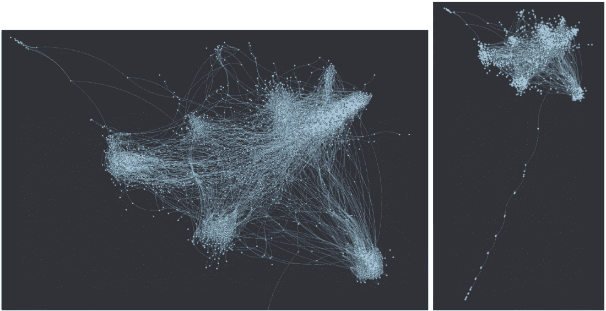
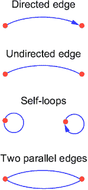
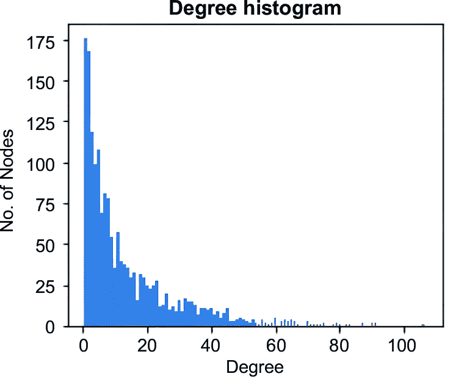
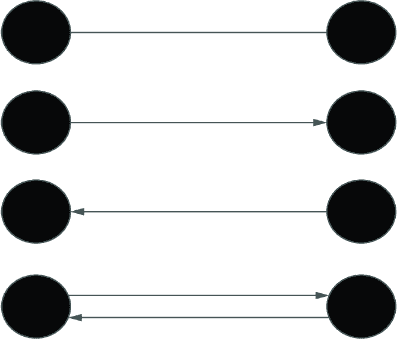
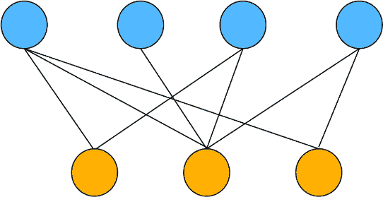
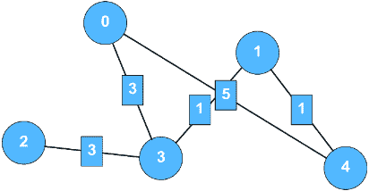
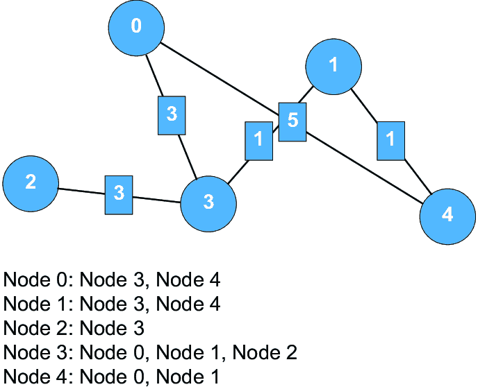
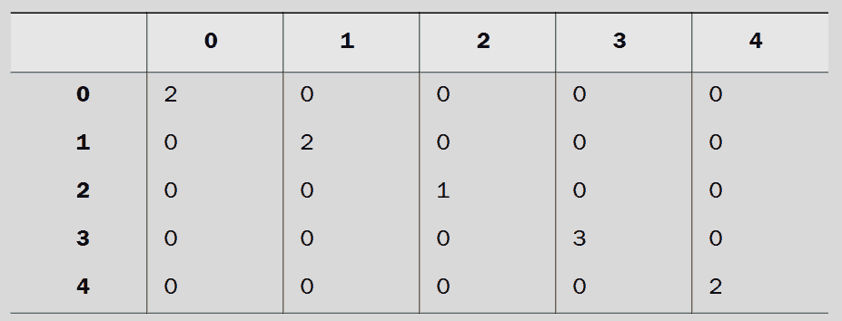
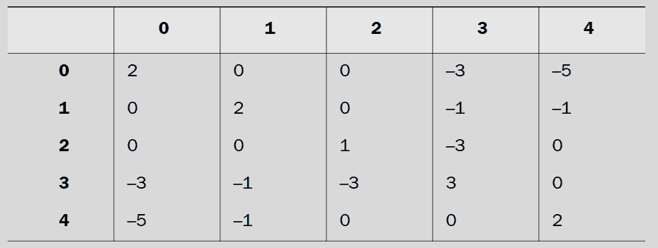
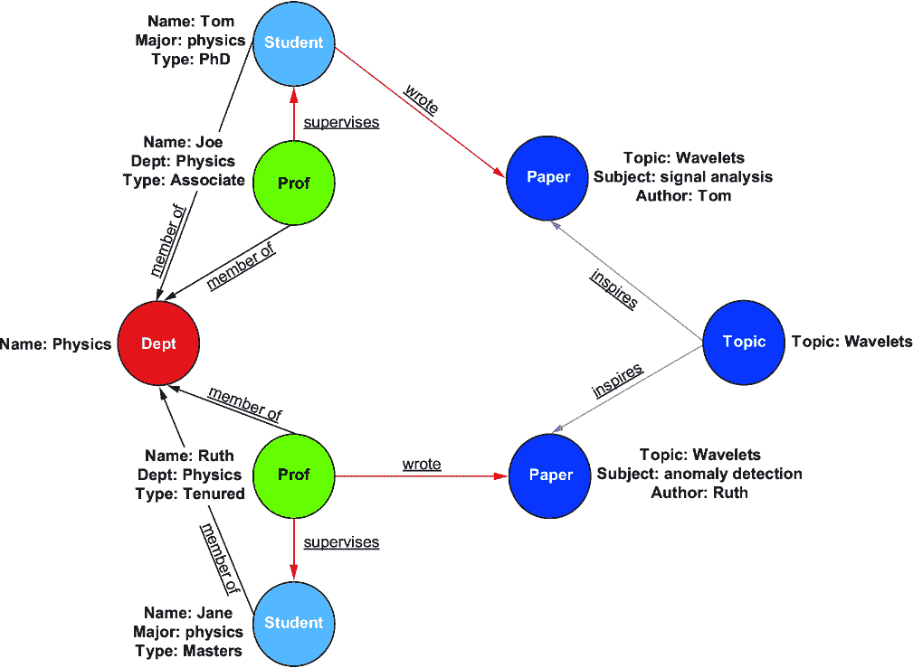

# 附录 A 发现图

在这个附录中，我们探讨了与本书中涵盖的 GNNs 最相关的图理论和实现。目标是帮助那些不太熟悉图的人学习足够的知识来跟随本书（如果你熟悉图，可以跳过这个附录）。我们建立了基本定义、概念和命名法，然后概述了理论如何在现实系统中实现。这个基础不仅对于跟随本书中的材料是必要的，而且对于构建使构建定制系统和错误排除更容易的见解也是必要的。

此外，在一个快速发展的领域，快速吸收新的学术和技术文献的能力对于跟上最前沿的状态至关重要。我们还提供了基本背景，以便抓住相关已发表论文的精髓。在这个附录中，我们将使用一个社交网络数据集的运行示例来展示这些概念。这是一个包含 1900 多名专业人士及其行业关系的数据库。图 A.1 可视化了这个图（使用 Graphistry 生成）。



##### **图 A.1 示例社交网络的风格化可视化，包括行业专业人士及其关系。节点（点）是专业人士，边（线）表示人与人之间的关系。在这个使用 Graphistry 创建的可视化中，左图显示一条边从框架中发散出来（右下角）。右图是整个图，显示了截断的边和节点。**

## A.1 图的基本概念

让我们从一些定义开始，然后我们将看到这些概念是如何工作的。

##### 关键术语

*图*—由节点和边组成的数据类型。

*节点*—也称为*顶点*或*点*，节点是图中的一个端点。它们通过边连接。

*边*—也称为*链接*或*关系*，边连接节点。它们可以是定向的或非定向的。



##### 环和三种类型的边

*有向边*—有向边，通常用箭头表示，表示从一个节点到另一个节点的一个方向关系或流动。

*无向边*—无向边没有方向。在这样的边中，关系或流动可以朝两个方向进行。

*相邻*—两个节点通过边直接连接的性质。这样的节点被称为*连接*。

*自环*—连接到节点的边。这样的边可以是定向的或非定向的。

*并行边*—连接相同两个节点的多条边。

*权重*—边的一个重要属性是权重，它是一个分配给边的数值。这样的属性可以描述连接的强度，或者某些其他现实世界的值，例如长度（如果图是按照道路地图模拟城市）。

这些概念为我们提供了创建最简单图的工具。通过从这些概念创建简单图，我们可以推导出下节中解释的网络属性。

虽然现实世界的图很复杂，但简单的图往往可以有效地代表它们，用于各种目的。例如，尽管我们的社交图数据包含节点特征（在 A.1.2 节中介绍），但要创建图 A.1 中的可视化，我们只使用了节点和边的信息。

### A.1.1 图属性

在以下小节中，我们将讨论图的一些更重要的属性。图生态系统中的许多软件程序和数据库（在 A.3 节中描述）应该能够计算这些属性的一些或全部。

#### 大小/阶数

我们通常对图中节点和边的总数感兴趣。这些属性的正式名称是 *大小*（边的数量）和 *阶数*（节点的数量）。在我们的社交图中，节点的数量是 1,933，边的数量是 12,239。

#### 度分布

度分布简单来说就是图中所有节点的度的分布。这可以表示为直方图，如图 A.2 所示。

节点的 *度* 是无向图中相邻节点的数量。对于有向图，一个节点可以有三种类型的度：指向该节点的边的 *入度* 和从节点向外延伸的边的 *出度*。在计算度时，自环通常被计为 2。如果边有权重，则 *加权度* 也可以考虑这些权重。



##### 图 A.2 展示了我们社交图度分布的直方图

与度的概念相关的是节点的邻域。对于给定的节点，其相邻节点也称为其 *邻居*。所有邻居的集合称为其 *邻域*。节点邻域中的顶点数等于该节点的度。

#### 连通性

图是由节点和边组成的集合。然而，通常没有条件说明对于无向图，同一网络中的每个节点都可以被任何其他节点到达。可能发生的情况是，在同一图中，节点集完全相互分离；也就是说，没有边将它们连接起来。

任何节点都可以到达任何其他节点的无向图称为 *连通图*。这似乎很明显，所有图都必须是连通的，但这种情况通常并不成立。具有不连续性（节点或节点集未与其他图的其他部分连接）的图称为 *不连通图*。另一种思考方式是，在连通图中，存在一条路径或行进方式，使得每个节点都可以到达图中的其他节点。对于不连通图，每个不连通的部分称为 *组件*。对于有向图，如果不可能从任何节点到达任何其他节点，则 *强连通图* 是每个节点都可以到达其他节点的图。

例如，如果我们把每一个个体人类视为一个节点，把我们的通信渠道视为边，那么人类人口可以被视为一个断开的社交图。虽然大多数人口可以通过现代通信渠道连接起来，但还有一些隐士选择脱离电网生活，以及拒绝与世界其他地区接触的孤立狩猎采集部落。在其他用例中，网络及其数据通常存在不连续性。

检查我们的社交图，我们看到它是断开的，有一个包含大多数节点的大的分量。图 A.3 和 A.4 显示了整个图和大的连通分量。如果我们专注于大的连通分量，我们会发现节点数是 1,698，边数是 12,222。


##### 图 A.3 我们整个社交图，它是断开的。（本图使用`NetworkX`生成。）我们观察到中心有一个大的连通分量，周围是断开的节点和由两到三个节点组成的小分量。


##### 图 A.4 社交图的连通分量。（本图使用 NetworkX 生成。）与图 A.1 进行比较，图 A.1 是使用 Graphistry 可视化的相同图。算法中使用的参数以及视觉特征的不同，导致了这两个图的不同之处。

#### 图遍历

在一个图中，我们可以想象从一个给定的节点*a*到第二个节点*b*的旅行。这样的旅行可能只需要通过一条边，或者通过几条边和节点。这样的旅行被称为*遍历*，或者*游走*，还有其他名称。从一个节点到另一个节点的遍历有时被称为*跳跃*。跨越一系列节点被称为*跳数*。一个游走可以是*开放的*或*封闭的*。开放的游走有一个与起始节点不同的结束节点。封闭的游走以相同的节点开始和结束。

*路径*是一种没有节点被多次遇到的游走。*环*是一个封闭的路径（除了起始节点也是结束节点，没有节点被遇到两次）。*迹*是一种没有边被多次遇到的游走，而*回路*是一个封闭的迹。这些不同类型路径的例子在图 A.5 中给出。注意不同类型的路径之间步数（或跳跃数）的变化。

想象一下，对于一对给定的节点，我们可以在它们之间找到游走和路径。在我们能导航的路径中，将会有最短的一条（或者可能有超过一条路径长度相同）。这条路径的长度被称为*距离*或*最短路径长度*。


##### 图 A.5 五种类型的路径

如果我们放大并检查整个图及其节点对，我们可以列出所有最短路径长度。其中之一将是最长（或者可能多个距离并列最长）。最大的距离是图的*直径*。直径常用于描述和比较图。

如果我们将我们的距离列表取平均值，我们将生成图的*平均路径长度*。平均路径长度是图的重要度量之一。平均路径长度和直径都给出了图密度的指示。这些度量指标的高值意味着更多的连接，这反过来又允许有更多种类的路径，无论是更长还是更短。

对于我们的社交图，我们最大组件的直径是 10。整个图的直径是未定义的，因为它是不连通的。

#### 子图

考虑一个由节点和边组成的图。*子图*是这些节点和边的子集。当图中这些邻域具有与其他图中的其他位置不同的属性时，子图就很重要。子图出现在连通图和断开图之中。断开图的组件就是一个子图。

#### 聚类系数

一个节点可能具有高度，但它的邻域连接得有多好呢？我们可以想象一个公寓楼，每个人都知道房东，但没有人知道他们的邻居（多么悲哀的地方啊！）房东的聚类系数将是 0。在另一个极端，我们可能有一个公寓，房东知道所有租户，每个租户也知道其他租户。那么，房东的聚类系数将是 1（所有网络中的节点都相互连接的情况称为*完全图*或*全连接图*）。当然，也会有中间情况，只有一些租户相互认识，这些情况将具有介于 0 和 1 之间的系数。

##### 图的维度

在机器学习和工程的一般应用中，*维度*被以几种方式使用。这个术语可能会令人困惑。

即使在图的主题内部，这个术语在文章和学术文献中也有几种用法。然而，这个术语通常并没有明确定义或阐明。因此，在以下列表中，我们试图分解这个术语的含义：

+   *数据集的大小/形状*——在这种情况下，维度指的是数据集中特征的数量。低维数据集意味着足够小，可以可视化（即，两个或三个特征）或足够小，可以计算可行。

+   *数学定义*——在数学中，图的维度有更严格的定义。在线性代数中，图可以在向量空间中表示，维度是这些向量空间的属性[1]。

+   *几何定义*—也存在图的维度的几何定义。这个定义将图的维度与允许图边为单位大小 1 的最小欧几里得维度相关联[1]。

### A.1.2 节点和边的特征

在最基本的图类型中，我们有一组节点和边，没有并行边或自环。对于这个基本图，我们只有一个几何结构。虽然即使这个基本的图结构也是有用的，但通常还需要更多的复杂性来正确地模拟现实世界问题和用例。例如，我们可以做以下事情：

1.  减少前面讨论的几何限制。具体来说，这些限制如下：

    +   每条边都与两个节点相关联，一个在边的每一端。

    +   在两个节点之间，只能存在一条边。

    +   不使用自环。

在放宽这些限制后，我们能够以更复杂的图代价来模拟更多的情况。

1.  2. 向我们的图元素（节点、边、图本身）添加*属性*。属性或特征是与特定元素相关的数据。根据上下文，可以使用*标签*、*属性*和*装饰器*等术语来代替*属性*。

在本节和下一节中，我们将讨论节点、边以及整个图的特征和变体。

#### 节点属性

在以下列表中，我们概述了节点可能包含的一些不同属性。这些属性在许多数据科学或 GNN 任务中成为特征：

+   *名称、ID 和唯一标识符*—名称或 ID 是一个唯一标识符。许多图系统要么将索引等标识符分配给节点，要么允许用户指定 ID。在我们的社交图中，每个节点都有一个唯一的字母数字 ID。

+   *标签*—在图中，节点可能属于某些类别或组。例如，模拟社交网络的图可能根据居住国（美国、中国、尼日利亚）或网络内的活动水平（频繁用户、偶尔用户）对人们进行分组。这样，与前面解释的唯一标识符不同，我们预计几个节点将共享相同的标签。

+   *属性/属性/特征*—不是 ID 或标签的属性通常被称为属性或特征。虽然这样的属性不必对节点是唯一的，但它们也不描述节点类。属性可以基于结构或非结构特性。

+   *结构/拓扑属性*—节点的内在特性与节点的拓扑属性以及节点附近的图几何结构相关。以下列出了两个例子：

    +   节点的度，正如我们所学的，是它拥有的入边数量。

    +   节点的中心性，这是一个衡量节点相对于其邻域中节点重要性的度量。

通过使用图分析方法（在第 A.4 节中描述）可以识别节点相对于其局部环境的特征。这些特征可以作为某些 GNN 问题中的特征。例如，由归纳方法（第二章）生成的节点嵌入是基于图局部结构的另一个属性示例。

+   *非结构属性*—这些通常基于现实世界的属性。以我们的社交图为例，我们有两个分类属性：一个人的职业类别（例如，科学家、营销人员、管理员）以及他们工作的公司类型（例如，医疗、交通、咨询）。这些示例是分类属性。还可能有数值属性，例如 *工作经验年数* 或 *平均直接下属人数* 在所有当前和过去的角色中。

+   *边属性*—边的属性与节点的属性相似。最常用且重要的边属性是边权重，这在前面已经描述过。

#### 边的变化

与节点不同，边有一些几何变体可以用来使图模型更具描述性。

+   *平行边*—指两个节点 *u* 和 *v* 之间有多于一条边。

+   *方向性*—边可以没有方向或一个方向。因为节点 *u* 和 *v* 可以通过平行边连接，所以可能有两个方向相反的边或多个具有某些方向组合或无方向的边。

+   *双向性*—在两个节点之间，两个方向都在各自的边中表示出来。在实践中，这个术语有几种用法：

    +   要描述非定向边，或简单边。

    +   要描述两个方向相反的边（如图 A.6 所示）。



##### 图 A.6 从上到下，两个节点之间，一个无向边、一个从左到右的有向边、一个从右到左的有向边，以及两个双向的有向边（双向性）

+   +   要描述每个端点都有方向的边。这种用法在文献中很流行，但在写作时，在实际系统中相当罕见。

+   *自环*—之前已讨论，自环或环是指边的两端都连接到同一个节点。在现实世界中，在哪里会遇到自环？对于我们的社交图，让我们保留所有节点，并考虑一个边将是一个从一位专业人士发送给另一位专业人士的电子邮件的情况。有时，人们会给自己发送电子邮件（作为提醒）。在这种情况下，给自己发送的电子邮件可以建模为自环。

### A.1.3 图的类别

不同类别的图取决于我们刚刚描述的节点和边特征。以下是一些图类别：

+   *简单图*—边的边不能是平行边或自环的图。简单图可以是连通的或断开的，也可以是有向的。

+   *加权图*—使用权重的图。我们的社交图没有权重；另一种表达没有权重的说法是将所有权重设置为 1 或 0。

+   *多重图*—允许任何两个节点之间有多个边和任何单个节点有多个自环的图。如果我们在一个可以添加更多边和自环的问题中工作，一个简单图可以是多重图的一个特例。

+   *有向图*—有向图的另一种说法。

+   *K 部图*—在许多图中，我们可能有两个或更多节点组的情况，其中边只允许在组之间，而不是在同一组内的节点之间。 “Partite”指的是节点组的分区，“k”指的是这些分区的数量。

+   *单部图*—只有一个节点组和一条边组的图。一个单部社交图可能只包含“德克萨斯人”节点和“工作同事”边。例如，在社交图中，节点可以属于“纽约人”或“德克萨斯人”组，关系可以属于“朋友”或“工作同事”组。

+   *双部图（或双图）*—在图中有两个节点分区的图。一个组的节点只能连接到第二类型的节点，而不能连接到它们自己的组内的节点。在我们的社交图示例中，节点可以属于“纽约人”或“德克萨斯人”组，关系可以属于“朋友”或“工作同事”组。在这个图中，没有纽约人会与另一个纽约人相邻，德克萨斯人也是如此。这如图 A.7 所示。



##### 图 A.7 双部图。有两种类型的节点（圆圈的上下行）。在双部图中，节点不能连接到同一类型的节点（同一行的节点）。这也是一个异构图的例子。

对于超过三个分区，相邻节点不能是同一类型的要求仍然成立。在实践中，*k* 可以是一个很大的数。

+   *树*—树是机器学习中研究得很好的数据结构，是图的一个特例。它是一个无环的连通图。另一种描述无环图的方式是*无环的*。在数据科学和深度学习领域，一个著名的例子是用于设计和治理数据工作流的定向无环图（DAG）。

+   *超图*—到目前为止，我们的图由连接两个节点或一个节点（自环）的边组成。对于超图，一条边可以与超过两个节点相关。这些数据结构有各种应用，包括涉及使用 GNNs 的应用。这如图 A.8 所示。

+   *异构图*—异构图有多个节点和边类型，而多关系图有多个边类型。


##### 图 A.8 两种方式展示的一个无向超图。在左边，我们有一个图，其边由阴影区域表示，并用字母标记，其顶点由点表示，并用数字标记。在右边，我们有一个图，其边线（用字母标记）连接最多三个节点（用数字标记的圆圈）。节点 8 没有边。节点 7 有一个自环。

## A.2 图表示

现在我们对图的概念有了基本的了解，我们将继续探讨如何与它们一起工作。首先，我们关注与构建图算法和存储图数据最相关的数据结构。我们将看到，其中一些结构，尤其是邻接矩阵，在我们这本书的大部分内容中研究的 GNN 算法中起着突出的作用。

接下来，我们将考察几种图数据模型。这些在设计和管理数据库以及其他数据系统如何处理网络数据方面非常重要。最后，我们将简要地看看图数据是如何通过 API 和查询语言暴露给分析师和工程师的。

### A.2.1 基本图数据结构

有几种重要的图表示方法可以移植到计算环境中：

+   *邻接矩阵*—节点到节点的矩阵。

+   *关联矩阵*—边到节点的矩阵。

+   *边列表*—按节点列出的边列表。

+   *邻接表*—每个节点的相邻节点列表。

+   *度矩阵*—节点到节点的度值矩阵。

+   *拉普拉斯矩阵*—度矩阵减去邻接矩阵（**D**-**A**）。这在谱理论中很有用。

这些绝不是表示图的唯一方式，但从文献、软件、存储格式和库的调查来看，这些是最普遍的。在实践中，图可能不会永久存储为这些结构之一，但为了执行所需的操作，图或子图可能需要从一种表示转换为另一种表示。

使用的表示取决于许多应该被考虑在计划中的因素。以下是一些因素：

+   *图的规模*—图包含多少个顶点和边，以及这些预计会扩展到多大？

+   *图的密度*—图是稀疏的还是密集的？我们将在下一小节中涉及这些术语。

+   *图结构的复杂性*—图更接近于简单图，还是使用之前讨论的变体之一？

+   *要使用的算法*—对于给定的算法，与其它数据结构相比，一个给定的数据结构可能表现相对较弱或较强。在以下小节中，对于每个结构，我们将简要介绍两个简单的算法进行比较。

+   *执行 CRUD（创建、读取、更新、删除）操作的成本*—在你的操作过程中，你将如何修改你的图（包括创建、读取、更新或删除节点、边及其属性），以及你将多久进行一次这样的操作？

在许多数据项目中，从一个数据结构转换到另一个数据结构以适应特定操作是常见的。因此，在项目中使用前面提到的两个或多个数据结构是正常的。在这种情况下，理解执行转换的计算工作量是关键。对于最流行的结构，图库允许进行无缝转换的方法，但考虑到前面列出的因素，执行这些转换可能需要意想不到的时间或成本。

在接下来的讨论中，我们将讨论如何使用这些数据结构来存储关于图拓扑信息。我们将考虑的唯一属性是节点 ID 和边权重。为了说明这些概念，让我们使用包含五个节点的加权图，如图 A.9 所示。圆圈表示具有其 ID 的节点；矩形是边权重。



##### 图 A.9 一个具有不同加权边和标记节点（从 0 到 4）的示例图

让我们现在深入探讨这六种流行的表示图的方法，以便它们可以在计算中使用。

#### 邻接矩阵

对于具有*n*个节点的图，一个邻接矩阵以*N* × *N*矩阵格式表示图，其中每一行或每一列描述两个节点之间的边。对于前面在图 A.9 中显示的示例图，我们有五列和五行。这些行和列为每个节点进行了标记。矩阵的单元格表示相邻性。

邻接矩阵可用于简单的有向和无向图。它们也可以用于具有自环的图。在无权图中，每个单元格要么是 0（无相邻性）要么是 1（相邻性）。对于加权图，单元格中的值是边权重。对于无权并行边，单元格的值是边的数量。

对于我们的示例，一个加权无向图，相应的邻接矩阵如表 A.1 所示。因为我们的图是无向的，所以邻接矩阵是对称的。对于有向图，对称是可能的，但不是保证的。

##### 表 A.1 图 A.9 中图的邻接矩阵

|  | **0** | **1** | **2** | **3** | **4** |
| --- | --- | --- | --- | --- | --- |
| **0**  | 0  | 0  | 0  | 3  | 5  |
| **1**  | 0  | 0  | 0  | 1  | 1  |
| **2**  | 0  | 0  | 0  | 3  | 0  |
| **3**  | 3  | 1  | 3  | 0  | 0  |
| **4**  | 5  | 1  | 0  | 0  | 0  |

通过检查这个矩阵，我们可以快速直观地了解矩阵的特性。例如，我们可以看到节点 1 有多少度，并大致了解度的分布。我们还看到空格（值为 0 的单元格）比边多。使用矩阵为小图绘制快速洞察的这种便利性是邻接矩阵的一个优点。即使对于大型图，绘制邻接矩阵也可以指示某些子图结构。

邻接矩阵，以及一般的矩阵表示，允许你通过使用线性代数来分析图。一个相关的例子是谱图理论（它是几个 GNN 算法的基础）。

邻接矩阵在 Python 中实现起来非常简单。我们示例中的矩阵可以使用列表的列表或 NumPy 数组来创建：

```py
>>import numpy as np
>>arr = np.array([[0, 0, 0, 3, 3],
                    [0, 0, 0, 1, 1],
                    [0, 0, 0, 3, 0], 
                    [3, 1, 3, 0, 0],
                    [5, 1, 0, 0, 0]])
```

以我们的邻接矩阵作为 NumPy 数组，让我们来探索我们图的一个另一些特性。从我们对矩阵的视觉检查中，我们注意到零值比非零值多得多。这使得它成为一个稀疏矩阵。*稀疏矩阵*，即具有大量零值的矩阵，可能会占用不必要的存储或内存空间，并增加计算时间。*稠密矩阵*，相反，包含大量非零矩阵。以下确定了我们矩阵的稀疏性：

```py
>>sparsity = 1.0 - ( np.count_nonzero(arr) / arr.size )
>>print(sparsity)
>> 0.6
```

因此，我们的矩阵稀疏度为 0.6，这意味着这个矩阵中有 60%的值是零。

##### 使用节点度数的稀疏性

另一种从节点度数的角度来考虑稀疏性的方法是，让我们从节点度数的角度推导出刚才显示的稀疏值。

对于一个由*n*个节点组成的简单无向图，每个节点最多可以建立*n-1*个连接，因此具有最大度数*n-1*。边的最大数量可以使用组合数学来计算：因为每条边代表一对节点，对于*n*个节点的集合，边的最大数量是“*n*选 2”，即*(n C 2)*或*n*(*n* – 1)/2。然而，对于我们的小矩阵，我们有一个有向图，这很清楚，因为邻接矩阵不是对称的。这意味着两个方向都要单独计算，并需要乘以 2。因此，对于我们的小矩阵，可能的最大边数是 5(5 – 1) = 20。图的密度定义为实际边数*e*与所有可能边数之比，然后稀疏性可以定义为 1 – 密度。在我们的例子中，这导致了一个与仅使用矩阵计算出的值不一致的数量，即(1 – 10/20) = 0.5，这与前面代码片段中的 0.6 不相等。这是因为我们没有考虑自环，这在图论中是标准做法。如果我们包括自环，我们就会有五个额外的可能边（或 5²），结果为(1 – 10/25)，即 0.6，与早期代码中的值相匹配。这表明在报告图的稀疏性时需要格外小心。

现在，想象一个有不是五个，而是数百万或数十亿个节点的图。这样的图在现实世界中确实存在，而且稀疏性往往比 0.6 低几个数量级。对于无向简单图，邻接矩阵是对称的，因此只需要一半的存储空间。大部分包含邻接矩阵的内存或存储空间将用于零值。因此，这种数据结构的高稀疏性导致了内存效率低下。

在复杂性方面，对于简单图，空间复杂度为**O**(*n*²)，对于无向简单图。对于无向图，由于对称性，空间复杂度为**O**(*n*(*n*–1)/2)。

对于时间复杂度，这当然取决于任务或算法。让我们看看两个基本任务，我们也会针对邻接表和边表进行讨论：

+   检查特定节点对之间是否存在边

+   查找节点的邻居

对于第一个任务，我们只需检查对应节点的行和列。这将花费**O**(1)时间。对于第二个任务，我们需要检查该节点行中的每个项目；这将花费**O**(deg(*n*))时间，其中 deg(*n*)是节点的度。

总结来说，邻接矩阵的优点是它们可以快速检查节点之间的连接，并且易于视觉解释。缺点是它们对于稀疏矩阵来说空间效率较低。计算权衡取决于你的算法。它们在具有小型和密集图的场景中表现突出。

#### 关联矩阵

虽然邻接矩阵为每个节点都有一个行和列，但*关联矩阵*将每条边表示为一列，将每个节点表示为一行。使用之前在图 A.9 中展示的相同图，我们可以构建一个关联矩阵，如表 A.2 所示。

##### 表 A.2 图 A.9 中示例图的关联矩阵

|  | **0** | **1** | **2** | **3** | **4** |
| --- | --- | --- | --- | --- | --- |
| **0**  | 0  | 3  | 5  | 0  | 0  |
| **1**  | 0  | 0  | 0  | 1  | 1  |
| **2**  | 3  | 0  | 0  | 0  | 0  |
| **3**  | 3  | 3  | 0  | 1  | 0  |
| **4**  | 0  | 0  | 5  | 0  | 1  |

关联矩阵可以表示比邻接矩阵更广泛的图类型。使用这种数据结构可以直观地表达多重图和超图。

关联矩阵在空间和时间复杂度方面表现如何？为了存储简单图的数据，关联矩阵的空间复杂度为**O**(*|E|* * *|V|*)，其中*|V|*是节点数（*V*表示顶点），*|E|*是边数。因此，对于边数少于节点的图，包括稀疏矩阵，它优于邻接矩阵。

为了了解时间复杂度，我们转向两个简单任务：检查边和查找节点的邻居。要检查边的存在，关联矩阵的时间复杂度为**O**(*|E|* * *|V|*)，远慢于邻接矩阵，后者可以在常数时间内完成这项任务。要查找节点的邻居，关联矩阵也需**O**(*|E|* * *|V|*)。

总体而言，当与稀疏矩阵一起使用时，关联矩阵具有空间优势。在时间性能方面，它们在简单任务上的表现较慢。使用关联矩阵的整体优势在于明确表示复杂图，例如多重图和超图。

#### 邻接表

在*邻接表*中，目标是显示每个节点与哪些顶点相邻。因此，对于*n*个节点，我们为每个节点有*n*个邻居列表。根据用于列表的数据结构，摘要中也可能包括属性。在我们的例子中，简单的邻接表如图 A.10 所示。



##### 图 A.10 我们的示例图及其邻接表

使用字典，其中每个节点作为键，相邻节点的列表作为值，可以在 Python 中实现这样的邻接表：

```py
{ 0 : [ 3, 4],
1 : [3, 4],
2 : [3],
3 : [0, 1, 2],
4 : [0, 1] }
```

我们可以改进字典值，以便包括邻居的权重：

```py
{ 0 : [ (3, 3), (4, 5)],
1 : [(3, 1), (4, 1)],
2 : [(3, 3)],
3 : [(0, 3), (1, 1), (2, 3)],
4 : [(0, 5) , (1, 1)] }
```

对于无向图，节点的集合不需要排序。因为邻接表不会为非邻居的节点对分配空间，所以我们看到邻接表没有邻接矩阵的稀疏性问题。因此，为了存储这种数据结构，我们有一个空间复杂度为**O**(n + v)，其中*n*是节点的数量，*v*是边的数量。

回到两个计算任务，检查边的存在（任务 1）将需要**O**(deg(node))时间，其中 deg(node)是任一节点的度。为此，我们只需检查该节点列表中的每个项目，在最坏的情况下，我们可能需要检查所有项目。对于任务 2，找到节点的邻居也需要**O**(deg(node))时间，因为我们必须检查该节点列表中的每个项目，其长度等于节点的度。

让我们总结一下邻接表的权衡。优点是它们在存储方面相对高效，因为只存储边关系。这意味着稀疏矩阵作为邻接表存储比作为邻接矩阵存储占用的空间更少。在计算上，权衡取决于你运行的算法以及你用作输入数据的图类型。

#### 边列表

与前两种表示相比，*边列表*相对简单。它们由一组双数（两个节点）或三数（两个节点和一个边权重）组成。这些以此方式标识唯一的边：

+   节点，节点（边权重），对于无向图

+   源节点，目标节点（边权重），对于有向图

边列表可以表示单个、未连接的节点。对于我们的示例图，边列表如下：

```py
{ 0, 3, 3 }
{ 0, 4, 5 }
{ 1, 3, 1 }
{ 1, 4, 1 }
{ 2, 3, 3 }
```

在 Python 中，我们可以将其创建为一组元组：

```py
>> edge_list = {( 0, 3, 3 ), ( 0, 4, 5 ), \
( 1, 3, 1 ), ( 1, 4, 1 ), ( 2, 3, 3 ) }
```

在性能方面，对于存储，边列表的空间复杂度为 O(*e*)，其中*e*是边的数量。关于我们之前显示的两个任务，要建立特定边的存在，假设是无序边列表，其时间复杂度为**O**(*e*)。要发现一个节点的所有邻居，**O**(*e*)是空间复杂度。在每种情况下，我们必须逐个遍历列表中的边来检查边或节点的邻居。因此，从计算性能的角度来看，边列表与其他两种数据结构相比有劣势，尤其是在执行更复杂的算法时。

然而，边列表的另一个优点是它们比邻接列表或邻接矩阵更紧凑。此外，它们易于创建和解释。例如，我们可以将边列表存储为文本文件，其中每行只包含两个由空格分隔的标识符。对于许多系统和数据库，CSV 或文本文件中的边列表是序列化数据的默认选项。

##### 拉普拉斯矩阵

如前所述，图的一种非常有价值的数据表示是拉普拉斯矩阵。这个矩阵是图谱理论发展的关键，而图谱理论又是基于谱的 GNN 方法发展的关键。

要生成拉普拉斯矩阵，我们需要从度矩阵中减去邻接矩阵（D - A）。度矩阵是一个节点到节点的矩阵，其值是特定节点的度。我们示例图的度矩阵在第一张表中给出，拉普拉斯矩阵随后给出。



##### 我们示例图的度矩阵



##### 我们示例图的拉普拉斯矩阵

在实践中，拉普拉斯矩阵不像本节中介绍的其他数据结构那样用于存储或作为图操作的依据。它们的优点在于谱分析。我们将在第三章讨论谱图分析。

### A.2.2 关系数据库

我们正稳步地从理论走向实践。在前一节中，我们回顾了用于表示图及其权衡的常见数据结构。您可以使用首选的编程语言从零开始在这些结构中实现图，并且这些结构也已在流行的图处理库中得到实现。

使用列出的数据结构，我们有多种方式来实现图中的结构信息。但是，图及其元素通常带有有用的属性和元数据。

*关系数据库*是一种有组织地表示图的结构信息、属性和元数据的方式。这与*模式*的概念密切相关，模式是一个框架，它明确地定义了构成图（即，节点的种类和边，属性等）的元素，并明确地定义了这些元素如何协同工作。

数据模型和模式是设计图系统（如图数据库和图处理系统）所使用的脚手架的关键部分，并且它们通常建立在上一节中审查的数据结构之上。我们将审查三种此类模型，并提供它们在实际系统中使用的示例。

#### 最简图数据模型

最简单的关系数据库仅使用节点、边和权重。它可以用于有向图或无向图。如果使用权重，可以使用查找表检索。

Pregel，谷歌的图处理框架，其他流行框架（包括 Facebook 使用的 Apache Giraph 和 Apache Spark GraphX）都基于此有向图。在那里，边和节点都有一个标识符和一个单一的数值，这可以解释为权重或属性。

#### RDF 图数据模型

资源描述框架（RDF；又称三元组存储）模型遵循主语-谓语-宾语模式，其中节点是主语和宾语，边是谓语。节点和边有一个主要属性，可以是唯一的资源标识符（URI）或字面量。本质上，URI 标识了所描述节点或边的类型。字面量的例子可以是特定的时间戳或日期。谓语代表关系。这样的三元组（主语-谓语-宾语）代表在这个上下文中称为*事实*的内容。通常，事实是有向的，并从主语流向宾语。

使用 RDF 模型的流行图数据库包括亚马逊的 Neptune（Neptune 还允许使用标签属性图[LPGs]），Virtuoso 和 Stardog。

#### 属性图数据模型

在属性图（又称 LPGs）中，允许为节点和边赋予各种元数据。此类元数据包括以下内容：

+   *标识符* — 区分单个节点和边。

+   *标签* — 描述节点或边的类别（或子集）。

+   *属性或属性* — 描述单个节点或边。

节点有一个 ID 和一组键/值对，可以用来提供额外的属性（也称为属性）。同样，边也有一个 ID 和一组键/值对用于属性。

你可以将属性图视为通过添加标签并取消对属性类型和数量的限制来扩展的最简图。图 A.11 提供了查看属性图及其等效的 RDF 图的机会。使用基于属性图模型的流行图数据库包括 Neo4j、Azure Cosmos 和 TigerGraph。


##### 图 A.11 属性图及其等效的 RDF 图示例

#### 非图数据模型

有许多数据库和系统既不使用 RDF 也不使用 LPG。这些数据库和系统在其他存储框架中存储或表达节点、边和属性，例如文档存储、键值存储，甚至在关系数据库框架内。

#### 知识图谱

尽管该术语在学术界、商业界和实践者圈子中被广泛使用，但并没有一个统一的定义。对于 GNNs 来说，最相关的是，我们将*知识图谱*定义为将知识离散化为事实的表示，如之前定义的。换句话说，知识图谱是一个多图集，它被映射到一个特定的*主题-关系-对象*模式上。

知识图谱可以用 RDF 模式表示，但还有其他数据模型和图模型可以容纳知识图谱。GNN 方法用于在节点和边中嵌入数据，建立事实的质量，并发现新的实体和关系。一个知识图谱的例子在图 A.12 中展示。



##### 图 A.12 一个知识图谱示例，表示大学物理系内的学术研究网络。该图展示了层级关系，例如教授和学生是该系的成员，以及行为关系，例如教授指导学生和撰写论文。实体如教授、学生、论文和主题通过语义上有意义的关系（例如，监督、撰写和启发）相连。实体还具有详细特征（例如，姓名、系别和类型），以提供更多上下文。语义连接和特征使得对复杂的学术互动进行高级查询和分析成为可能。

#### 节点和边类型

在具有模式（包括知识图谱）的图中，边和节点可以被分配一个*类型*。*类型*是定义模式的一部分，因此，它们决定了数据元素如何相互作用以及它们如何被数据系统解释。它们通常也具有描述性。为了区分*类型*和*属性*，考虑一下，虽然类型有助于定义数据元素如何一起工作以及它们如何被数据系统解释的规则，但属性仅具有描述性。

为了说明类型，我们可以使用一个路线图类比，其中城镇是节点，它们之间的通道是边。我们的边可能包括高速公路、小径、运河或自行车道。每一种都是一个类型。由于地理原因，城镇可能被沼泽包围，位于山顶上，或者有其他障碍和阻碍，使得一条通道相对于另一条通道难以通行。对于被沙漠隔开的城镇，通道只能通过高速公路。对于其他城镇，通道可以通过多种通道类型。在这个类比中，我们注意到我们的城镇节点也由它们邻近的地理特征定义了类型：沼泽城镇、沙漠城镇、岛屿城镇、山谷城镇。

### A.2.3 如何展示图

我们已经讨论了关系数据结构和关系数据库，以了解图是如何构建和存储的。然而，在现实生活中，我们中的大多数人不会从头开始或从底层构建图。在构建和分析图时，我们和原始数据之间将有一个抽象层。那么，图以何种方式暴露给数据科学家或工程师呢？接下来，我们将简要解释以下两种方式，然后讨论图生态系统：

+   *APIs*—使用图库或数据处理系统

+   *查询语言*—通过专用查询语言查询图数据库

#### APIs：图系统中的图对象

当使用图库或处理软件时，我们通常希望我们工作的图具有某些属性并且能够在图上执行操作。从这个角度来看，将图视为可以由软件函数操作的软件对象是有帮助的。

在 Python 中，实现这些的一个有效方法是拥有一个图类，其中一些操作作为图类的方法或作为独立的函数实现。节点和边可以是图类的属性，或者它们可以有自己的节点和边类。以这种方式实现的图属性可以是相应类的属性。

例如，`NetworkX`是一个基于 Python 的图处理库。`NetworkX`实现了一个图类。节点可以是任何可哈希的对象；节点对象的例子包括整数、字符串、文件，甚至是函数。边是它们各自节点的元组对象。节点和边都可以有作为 Python 字典实现的属性。以下是在库和系统中找到的图类的典型方法和属性的两个简短列表。

##### 图对象的基本方法

在以下列表中，我们概述了一些可以应用于图对象的方法：

+   `Graph_Creation`—一个构造函数，用于创建新的图对象

+   `Add_Node`, `Add_Edge`—添加节点或边，以及它们的属性和标签（如果有）

+   `Get_Node`, `Get_Edge`—检索存储的节点或边，带有指定的属性和标签

+   `Update_Node`, `Updage_Edge`, `Update_Graph`—更新节点、边和图对象的属性和属性

+   `Delete_Node`, `Delete_Edge`—删除指定的节点或边

##### 图对象的基本属性

在以下列表中，我们概述了一些图对象的属性：

+   `Number_of_Nodes`, `Number_of_Edges`—一个构造函数，用于创建新的图对象

+   `Node_Neighbors`—检索节点的相邻节点或相关边

+   `Node_List`, `Edge_List`—添加节点或边及其属性和标签（如果有）

+   `Connected_Graph`—检索存储的节点或边，带有指定的属性和标签

+   `Graph_State`—检索图的全局属性、标签和属性

+   `Directed_Graph`—删除指定的节点或边

#### 图查询语言

在图数据库中处理图时，使用查询语言。对于大多数关系数据库，SQL 的某个变体被用作标准语言。在图数据库领域，没有标准查询语言。以下是当前突出的语言：

+   *Gremlin*——一种可以声明性或命令性编写的语言，专为数据库或处理系统查询设计。由 Apache TinkerPop 项目开发，Gremlin 被用于多个数据库（Titan、OrientDB）和处理系统（Giraph、Hadoop、Spark）。

+   *Cypher*——一种基于属性图数据库查询的声明性语言。由 Neo4j 开发，Cypher 被 Neo4j 和其他几个数据库使用。

+   *SPARQL*——一种基于 RDF 数据库查询的声明性查询语言。SPARQL 被 Amazon Neptune、AllegroGraph 等使用。

## A.3 图系统

我们已经介绍了允许我们在编程语言中实现图的基本构建块。在实践中，你很少从头创建图，因为你将使用库或 API 将数据加载到内存或数据库中。图库、数据库和商业软件领域广泛且发展迅速。确定要使用什么的一个好方法是先从你的用例和需求开始，然后根据这些选择你的开发和部署架构。本节将简要概述这一领域，以帮助你。我们在这里开发的分类法绝不是绝对的，但应作为有用的指南。

在撰写本文时，商业和开源的图分析、机器学习建模、可视化和存储工具正在相对快速地扩展。由于工具和功能之间存在大量重叠，以及许多混合工具无法完美地归入任何类别，因此没有清晰的细分。鉴于此，我们只突出基本方法，并专注于以下各段中最受欢迎的工具：

+   图数据库

+   图计算引擎（或图框架）

+   可视化库

+   GNN 库

### A.3.1 图数据库

从功能角度来看，图数据库是传统关系数据库的图类似物。这类数据库是为了处理以在线事务处理（OLTP）为中心的交易而设计的。它们允许 CRUD 事务，并且通常遵循 ACID（原子性、一致性、隔离性和持久性）原则，以确保数据的完整性。这类图数据库与关系数据库的不同之处在于，它们使用图数据模型和模式来存储数据。在撰写本文时，最受欢迎的图数据库包括 Neo4j、Microsoft Cosmos DB、OrientDB 和 ArangoDB。除了 Neo4j 之外，这些数据库支持多种模型，包括属性图。Neo4j 仅支持属性图。支持 RDF 模型的最受欢迎的数据库是 Virtuoso 和 Amazon Neptune。

除了属性图和 RDF 数据库之外，其他类型的非图数据库也用于存储图数据。文档存储、关系数据库和键值存储是例子。要使用此类非图数据库与图数据模型一起使用，必须仔细定义现有模式如何映射到图元素及其属性。

### A.3.2 图计算引擎（或图框架）

图计算引擎旨在使用数据批次进行查询。此类查询可以输出汇总统计信息或输出特定于图的项，例如聚类识别和找到最短路径。这些数据系统通常遵循在线应用处理（OLAP）模型。此类系统与图数据库紧密合作，提供用于分析查询所需的数据批次，并不罕见。此类系统的例子包括 Apache Spark 的 GraphX、Giraph 和斯坦福网络分析平台（SNAP）。

### A.3.3 可视化库

图可视化工具与图计算引擎具有相似的特征，因为它们旨在进行数据分析而非事务性查询和计算。然而，此类工具的设计目的是创建美观且实用的网络分析图像。在最佳可视化工具中，这些图像是交互式和动态的。可视化系统的输出可以优化用于网页展示或以高分辨率打印的格式。此类工具的例子包括 Gephi、Cytoscape 和 Tulip。

### A.3.4 GNN 库

图工具的最后一段是本书的核心主题。在这里，我们将创建图嵌入的软件工具与使用图数据进行模型训练的工具分组。在撰写本文时，有许多解决方案可供选择。图表示工具的范围从专门的独立库（PyTorch BigGraph [PBG]）到具有嵌入功能的图系统（Neo4j 作为数据库和 SNAP 作为计算框架）。

GNN 库既可以作为独立的库，也可以作为使用 TensorFlow 或 PyTorch 作为后端的库。在本文中，我们将重点关注 PyTorch Geometric（PyG）。其他流行的库包括 Deep Graph Library（DGL；一个独立的库）和 Spektral，后者使用 Kera 和 TensorFlow 作为后端。最好的库不仅实现了多种深度学习层，还包括可用的基准数据集。

## A.4 图算法

由于图论领域已经存在一段时间了，不同的图算法数量庞大。深入了解常用的图算法可以为思考神经网络中使用的算法提供有价值的背景。图算法还可以作为 GNN 的节点、边或图特征的来源。最后，与所有机器学习方法一样，有时统计模型并不是最佳解决方案。了解分析景观有助于在决定是否使用 GNN 解决方案时做出选择。

在本节中，我们回顾两种图算法类型，*搜索算法*和*最短路径*。我们提供了一般描述，解释了为什么它们很重要。对于这个主题的深入探讨，请参阅本书末尾附录的参考文献，特别是[1-3]。

### A.4.1 遍历和搜索算法

在 A.1.1 节中，我们讨论了行走的概念和路径的概念。在这些基本概念中，我们通过遍历节点和它们之间的边从图中的一个节点到达另一个节点。

对于具有许多非唯一路径和节点对之间路径的大图，我们如何决定选择哪条路径？同样，对于尚未探索且没有地图的图，最好的创建地图的方法是什么？这些问题中包含的问题是在特定节点遍历图时选择哪个方向。对于度为 1 的节点，这个答案很简单；对于度为 100 的节点，答案就不那么简单了。

遍历算法提供了一种系统地遍历图的方法。对于此类算法，我们从节点开始，遵循一组规则，决定跳转到下一个节点。通常，在我们进行遍历时，我们会记录遇到的节点和边。对于某些算法，如果我们概述所采取的路径，我们最终可能会得到一个树结构。这里给出了三种著名的遍历策略：

+   *广度优先搜索* — 广度优先遍历倾向于在探索节点的所有直接邻居之后再探索更远的节点。这也被称为广度优先搜索（BFS）。

+   *深度优先搜索* — 使用深度优先搜索（DFS），我们不是首先探索每个直接邻居，而是不考虑当前节点与新的节点之间的关系，跟随每个新节点。这样做的方式是每个节点至少被遇到一次，每条边恰好被遇到一次。

对于有向图也有 DFS 和 BFS 的版本。

+   *随机* — 与 BFS 和 DFS 不同，在随机遍历中，遍历受一组规则控制，到下一个节点的遍历是随机的。在一个具有 4 度起始节点的随机遍历中，每个相邻节点被选中的概率都是 25%。这种方法在 DeepWalk 和 Node2Vec 等算法（在第二章中介绍）中使用。

### A.4.2 最短路径

与图高度相关的持久性问题之一是最短路径问题。解决这个问题的兴趣已经存在了几十年（早在 1969 年就发表了一篇关于最短路径方法的优秀综述论文[4]），存在几种不同的算法。现代最短路径方法的应用包括导航应用，如找到到达目的地的最快路线。此类算法的变体包括以下内容：

+   两个节点之间的最短路径

    +   两个节点

    +   包含指定节点的路径上的两个节点

    +   所有节点

    +   一个节点到所有其他节点

+   排序最短路径（即，第二短路径、第三短路径等）

这些算法也可以考虑图中的权重。在这些情况下，最短路径算法也被称为最低成本算法。

一种备受赞誉的最低成本确定算法是迪杰斯特拉算法。给定一个节点，它找到到每个其他节点或指定节点的最短路径。随着算法的进行，它遍历图，同时跟踪每个遇到的节点（到起始节点）的距离和连接节点。它优先考虑遇到的节点，这些节点通过最短（或最低成本）路径到达起始节点。随着算法的遍历，它优先考虑低成本路径。

## A.5 如何阅读 GNN 文献

GNNs 是一个快速发展的主题。在很短的时间内提出了新的方法和技术。尽管这本书侧重于图的实际和商业应用，但该领域的许多最先进的技术都披露在学术期刊和会议上。了解如何有效地研究这些来源的出版物对于跟上该领域的发展并遇到可以实施在代码中的有价值的想法至关重要。

在本节中，我们列出了一些常用的符号来描述技术出版物中的图，以及一些针对实践者的阅读学术文献的技巧。这些技巧尤其适用于那些对在论文中使用该方法但受时间限制的人：

+   为了有效地从论文中提取价值，要选择性地关注出版物中的哪些部分。清楚地理解问题陈述和解决方案对于将其转换为代码至关重要。这听起来可能很显然，但许多论文包括一些对于实践者来说最多只能分散注意力的部分。数学证明和冗长的历史注释是很好的例子。

+   一个积极的趋势是越来越多的研究论文中包含代码和数据，以增强可重复性。然而，由于模型特定的优化或硬件限制等因素，复制结果可能仍然具有挑战性。如果你遇到困难，联系作者通常可以提供有价值的澄清。

+   仔细观察问题和解决方案的应用范围指标。一个令人兴奋的发展可能不适用于你的问题，而且可能并不立即明显。同样，不要将所有关于最先进成果的声明都视为理所当然。学术界竞争非常激烈，声称的最先进成果可能并不成立，尤其是如果论文尚未经过同行评审。

### A.5.1 常见图符号

在数学符号中，图被描述为一组节点和边：

(A.1) *G* = (*V*, *E*)

其中 *V* 和 *E* 分别是顶点（节点）和边的集合或集合。当我们想要表达这些集合中元素的数量时，我们使用 *|V|* 和 *|E|*。在以下列表中，我们概述了一些图数学的典型命名法：

+   对于有向图，有时但并不总是使用带重音的 G (**)。

+   单个节点和边分别用小写字母 *v* 和 *e* 表示。

+   当提到一对相邻节点时，我们使用 *u* 和 *v*。因此，一条边也可以表示为 {*u*, *v*} 或 *uv*。

+   在处理带权图时，特定边的权重表示为 *w*(*e*)。就边的节点而言，我们可以将权重包括在内，表示为 {*u*, *v*, *w*}。

+   为了表达图或其元素的特征，当特征以向量或矩阵的形式表示时，我们使用符号 *x* 或 **x**。

+   对于图表示，因为许多这样的表示是矩阵，所以使用粗体字母来表示它们：**A** 表示邻接矩阵，**L** 表示拉普拉斯矩阵，等等。
