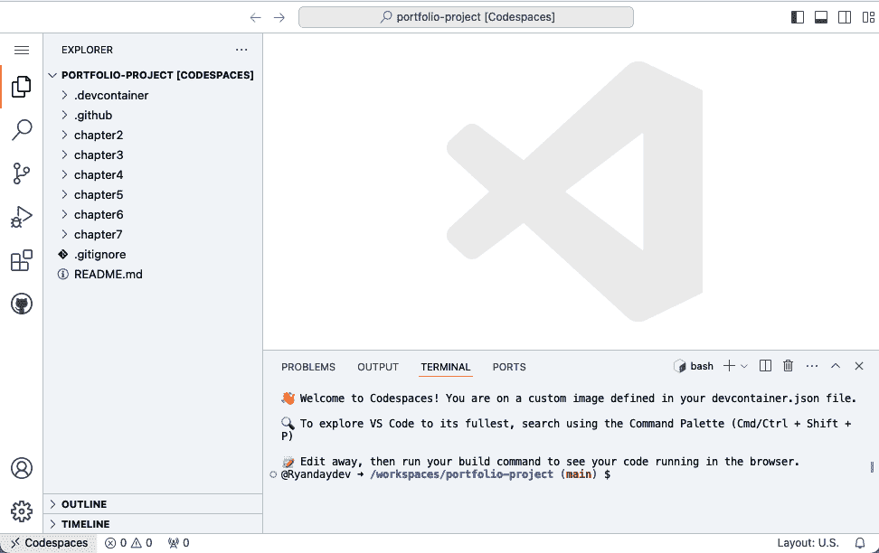
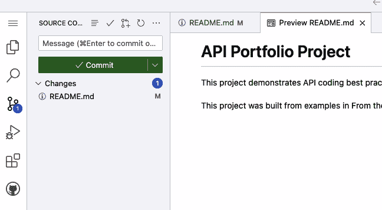

# 第二章：选择你的 API 架构

> 快乐的城镇是那些拥有架构的城镇。
> 
> 勒·柯布西耶，《走向新建筑》（多佛出版社，1965 年）

在 第一章 中，你通过了解用户需求和选择用例来开始你的项目组合，以满足这些需求。这项初步工作是确保你构建出满足真实客户需求的产品至关重要。在本章中，你将开始开发你将用于构建第一个 API 的架构。

# API 架构风格

需要作出的最重要的决定之一是选择你将要使用的 API 架构风格。由于你正在使用以消费者为中心的设计流程，因此可以推断，你的首要目标之一将是使用一种被潜在消费者广泛支持和理解的风格。《Postman 2023 API 状态报告》（https://oreil.ly/x25Zw）发现这六大 API 架构风格是最受欢迎的：

+   *REST*: 86%

+   *Webhooks*: 36%

+   *GraphQL*: 29%

+   *简单对象访问协议 (SOAP)*: 26%

+   *WebSockets*: 25%

+   *gRPC*: 11%

在调查中发现的 REST 的压倒性流行与你在探索大多数公共 API 时将经历的情况一致。REST 目前是典型的 API 风格。例如，我找到的所有针对现实世界幻想足球联赛主办方的 API 都使用 REST。

有几种其他的 API 架构风格值得审查，因为它们在数据科学和人工智能相关情况下也有意义。让我们更详细地看看 REST、GraphQL 和 gRPC。

## 表现性状态转移 (REST)

REST 由 Roy Fielding 的博士论文正式定义，论文题目为[“架构风格和网络化软件架构设计”](https://oreil.ly/cLpNu)。在实践中，你会发现并非所有 REST 风格的 API 都完全符合这一格式定义。

这种架构风格的有用实现有时被称为 *实用 REST* 或 *RESTful*。以下是一系列正式定义和一些实用实践的混合：

+   API 提供者通过单个地址提供资源（例如，*/customers*、*/products* 等）。消费者使用标准的 HTTP 动词对这些资源发出请求。生产者提供响应。这是客户端/服务器模型。

+   响应由生产者定义。每个消费者的响应标准结构是相同的。

+   REST 响应通常是 JSON 格式，有时是 XML 格式，这两种都是标准的基于文本的数据传输格式。

+   交互是无状态的，这意味着每条来回的信息都独立存在。因此，在多个请求和响应的对话中，每个请求都必须提供来自先前响应的信息或 *上下文*。例如，消费者可能会检索玩家列表，然后提供一个玩家的 ID 以请求更多详细信息。

+   越来越多的 REST API 是通过[OpenAPI 规范文件](https://oreil.ly/d7xYG)定义的，尽管多年来已经使用了各种其他选项。

+   使用 API 版本来保护现有消费者免受更改是一种最佳实践。

## 图查询语言（GraphQL）

[GraphQL](https://oreil.ly/gphql)既是 API 的查询语言，也是查询运行时引擎。GraphQL 由 Facebook 开发，并于 2015 年开源。以下是 GraphQL API 的一些属性，与 REST 的比较：

+   通信使用客户端/服务器模型（类似于 RESTful API）。

+   通信是无状态的（类似于 RESTful API）。

+   响应通常以 JSON 格式（类似于 RESTful API）返回。

+   与仅使用 HTTP 动词不同，消费者使用 GraphQL 查询语言。

+   消费者可以指定响应的内容，以及查询选项。（在 REST 中，生产者定义响应内容。）

+   生产者将 API 放在单个地址上（例如，*/graphql*），消费者通过 HTTP POST 动词向其传递查询。

+   不推荐使用版本控制，因为消费者定义了他们请求的内容。

与 RESTful API 相比，GraphQL 的一个大优势是消费者获取所需信息所需的 API 调用更少。这需要更少的网络流量。

## gRPC

与 GraphQL 一样，[gRPC](https://oreil.ly/iJFdv)是由一家商业公司（Google）开发的，并于 2015 年开源。gRPC 是为了在微服务之间实现非常快速、高效的通信而开发的。gRPC 通常用于与 REST 不同的问题集，并且有许多不同之处：

+   与共享资源不同，gRPC 提供远程过程调用，这更类似于传统的代码函数。

+   gRPC 不仅可以限于无状态的请求-响应模式，还可以用于连续流。

+   与返回基于文本的格式如 JSON 的数据不同，它使用[协议缓冲区](https://protobuf.dev)，这是一种比 JSON 或 XML 更小、更快的序列化数据格式。

+   与使用 OpenAPI 规范文件不同，它使用协议缓冲区作为*.proto*文件中的规范。

gRPC 不太可能成为您在组合项目中创建的 API 的候选者。然而，在讨论与数据科学相关的 API 架构风格时，有一个重要原因值得提及：*大型语言模型*（LLMs）。这些机器学习模型是 Gemini 和 ChatGPT 等生成式 AI 服务的引擎。这些是非常大的模型，需要尽可能多的性能，在某些情况下，它们使用 gRPC 来实现这一点。

## 您的选择：REST

对于您公司的需求，REST 是合适的选择。它是行业标准，适用于为您的用户故事提供基于资源的 API。它还得到了广泛技术的支持，因此您的客户应该没有问题使用 RESTful API。

GraphQL 也是一个很好的选择，用于用户查询你的足球数据，你应该在未来关注它。但是，你可以等到用户请求它时再考虑。

在深入 Python 编码你的 API 之前，让我们讨论一下这本书将如何使用一些关键术语。对于这本书，我们将考虑一个*RESTful API*是一组所有端点都与同一数据源相关的端点。从这个角度来看，你的 SWC 网站将从单个 API 开始：SWC 幻想足球 API。

一个*API 版本*是一组在一段时间内保持一致的端点，以便消费者可以依赖它们。

一个*API 端点*（也称为*操作*）是两个基本构建块的组合：一个 HTTP 动词和一个 URL 路径。

这些术语的整体结构如下：

```py
api
└── version
    └── endpoint
```

让我们通过一个通用的 Acme 小部件公司（表 2-1）的几个例子来看看。我们假设该公司的 API 位于*[*https://api.acme.com*](https://api.acme.com)子域下。

表 2-1\. Acme API 版本 1 中的示例端点

| 端点描述 | HTTP 动词 | URL | 消息体 |
| --- | --- | --- | --- |
| 读取产品列表 | GET | *api.acme.com/v1/products/* | 空值 |
| 读取单个产品 | GET | *api.acme.com/v1/products/{product_id}/* | 空值 |
| 创建新产品 | POST | *api.acme.com/v1/products/* | 包含新产品信息 |
| 更新现有产品 | PUT | *api.acme.com/v1/products/{product_id}/* | 包含更新后的产品信息 |
| 删除现有产品 | DELETE | *api.acme.com/v1/products/{product_id}*/ | 可变 |

你可以看到 URL 被用于多个端点。例如，读取产品列表端点使用带有`GET`动词的 URL *api.acme.com/v1/products*。`GET`动词读取产品记录。创建新产品端点使用相同的 URL，但带有`POST`动词。`POST`创建一个新记录。

但是，通过将 HTTP 动词与 URL 结合，当调用此资源时，将执行特定的操作。这种 HTTP 动词加 URL 组合只能使用一次。对于你的项目，你将开发一组端点来满足你选择的用户案例。

###### 小贴士

关于所有 HTTP 动词的更多信息，请参阅“HTTP 基础知识”。

# 技术架构

SWC 联赛主办方网站是一个使用关系型数据库的 Web 应用程序。幻想经理们通过他们的网络浏览器访问该网站。尽管托管这个大型网站需要大量的技术，但图 2-1 展示了当前状态的应用程序架构。


###### 图 2-1\. 当前状态应用程序架构

该架构包含以下组件：

幻想经理

Sportsworldcentral.com 的当前网络用户

网络应用程序

现有的联赛主办方网站（假设它已经存在于你的项目中）

网站数据库

用于网络应用的数据库关系型数据库（假设它已经存在并包含你的项目数据）

在决定 API 架构时，有许多选择。当网络应用已经存在时，一个选项是将 API 作为网络应用的一部分来创建。许多网络应用将 API 作为其设计的一部分，因此在这种情况下这可能是最简单的方法。另一个选项是创建一个独立的 API 应用程序，但允许 API 直接从网站数据库读取。这有一个优点，即 API 的数据将始终与网络应用保持最新，但如果对 API 发起了大量请求，这可能会潜在地减慢网络应用的性能。

你将创建一个独立的 API 应用程序，并从 *读取副本数据库* 中提取 API 的数据。这是一个只读的网站数据库副本，它从网站数据库接收快速更新，但在物理上是独立的，这样 API 流量就不会影响网站的性能。由于你的 API 将是只读的，读取副本是一个好的选择。

图 2-2 显示了你将实施的未来状态应用程序架构。


###### 图 2-2\. 未来状态应用程序架构

这些是你项目的新组件：

梦想建议网站

将将导入你的联赛数据到他们的建议网站。

数据科学用户

将调用你的 API 来创建他们的分析产品。

读取副本数据库

你将创建的网站数据库的单独只读副本。

API

你将创建的新 API 应用程序。请注意，它将使用基础网址 *api.sportsworldcentral.com* 以保持与主网站分离。

API 的技术架构是一个深奥且非常有趣的话题，组件的潜在变化几乎是无穷无尽的。要记住的一件事是，软件架构会随着时间的推移而变化，所以你做出的决定不是永久的。我强烈推荐 James Gough、Daniel Bryant 和 Matthew Auburn 著的《精通 API 架构：设计、运营和演进基于 API 的系统》（O’Reilly，2022）这本书，以建立这个主题的基础知识。

# 本章使用的软件

由于你将创建一个新的 API 应用程序和独立数据库，请查看你将使用的工具和服务，如表 2-2 所示。

表 2-2\. 本章使用的新工具或服务

| 软件名称 | 版本 | 用途 |
| --- | --- | --- |
| Python | 3.10 | 编程语言 |
| GitHub | NA | 源代码控制，开发环境 |

## Python

在第一部分的所有 API 代码中，你将使用 Python 编程语言。你还将使用它来在第二部分中创建分析产品、数据管道和交互式数据应用。你将在第三部分中用它来构建一个生成式 AI 应用。根据[Anaconda 2022 数据科学报告](https://oreil.ly/fD4u7)，Python 几乎可以用于数据科学中的任何工作，并且是数据科学家最常使用的语言。

Python 的开源生态系统非常强大且深入，几乎为任何你想要执行的任务提供了高质量的框架和库。在这本书中，你将使用各种流行的 Python 库，如下所示。

近年来，Python 在各种软件开发任务中的采用速度加快。[2023 Stack Overflow 开发者调查](https://oreil.ly/pvfEB)发现，Python 在开发者最想使用的语言中竞争激烈，当时排名第三。Python 非常灵活，在各种情况下都得到使用。它是任何开发者工具箱中的伟大工具。

对于这本书，你将使用 Python 3.10 或更高版本。

## GitHub

GitHub 是一个在软件开发中扮演重要角色的网站。在其核心，GitHub 是一个源代码控制软件的云托管服务，但多年来它增加了额外的功能。这些功能通常是免费或低成本的。许多著名的开源项目使用 GitHub 来托管他们的源代码，并允许开发者为项目做出贡献。

在这本书中，你将以多种方式使用 GitHub。在开发过程中，你将把所有的程序代码存储在仓库中。你将使用 GitHub Codespaces 作为你的 Python 开发环境。你将使用 GitHub Pages 来发布你的开发者门户。

这本书使用了 GitHub 的许多工具，因为它们简化了环境管理，并且协同工作得很好。结果将是一个看起来专业的 API 和数据科学组合，展示了你所取得的成就。大部分工作也可以在你的本地机器或另一个虚拟环境中完成，而无需使用 GitHub。然而，说明将假设你正在使用 GitHub。

# 开始使用您的 GitHub Codespace

GitHub Codespaces 将作为本书第一部分中你开发的全部 API 代码的开发环境。你可以把 Codespace 想象成一个在浏览器中运行 VS Code 的开发环境。使用 Codespaces 将允许你以最小的干扰运行我从 GitHub 仓库分享给你的代码。

## 创建您的 GitHub 账户

在开始使用 Codespaces 之前，你需要一个 GitHub 账户。[按照说明创建一个免费的 GitHub 个人账户](https://oreil.ly/7j595)。免费账户将为你提供足够的 Codespace 存储和核心小时数来完成这本书。在本书的编写过程中，我经常因为运行多个 Codespaces 而超出免费配额，但费用通常只有几美元。请确保启用双因素认证以保护您的账户。

## 克隆第一部分仓库

当您使用另一个仓库并希望保留所做的编辑时，有两种方法可以实现：分叉或克隆。当您*分叉*仓库时，您在您的账户中创建了一个副本，该副本仍然与原始仓库保持链接。当您需要将更改提交回原始仓库以进行更新时，这很有用。*克隆*仓库将在您的 GitHub 账户中创建一个独立的副本。对于这本书，我建议您克隆仓库，这样您的项目组合就可以独立展示您已完成的工作。

要克隆仓库，请登录到 GitHub 并转到[GitHub 导入库页面](https://github.com/new/import)。在此页面的字段中输入以下信息：

+   *您的源代码库的 URL*：**`[*https://github.com/handsonapibook/api-book-part-one*](https://github.com/handsonapibook/api-book-part-one)`**

+   *您的源代码库的用户名*：留空。

+   *您的源代码库的访问令牌或密码*：留空。

+   *仓库名称*：**`portfolio-project`**

+   *公开*：选择这个选项，这样您就可以分享您正在进行的工作的结果。

点击“开始导入”。导入过程将开始，并显示消息“准备您的新的仓库”。几分钟后，您将收到一封电子邮件通知您导入已完成。点击链接访问您的新克隆仓库。

在您启动 GitHub Codespace 之后，我会向您介绍更多关于这个仓库的内容。

## 启动您的 GitHub Codespace

启动一个 Codespace 来与此仓库一起工作很简单。在此仓库上，点击“代码”按钮并选择“Codespaces”标签。点击“在 main 上创建 Codespace”。您应该会看到一个状态为“设置您的 Codespace”的页面。在设置过程中，您的 Codespace 窗口将打开。当设置完成后，您的显示将类似于图 2-3。



###### 图 2-3\. 新的 GitHub Codespace

您的 Codespace 现在已通过克隆的仓库创建。这是您将用于本书第一部分剩余部分的环境。在四处查看之前，花一分钟时间打开[GitHub Codespaces 页面](https://github.com/codespaces)并进行一些更新。滚动到页面底部找到这个新的 Codespace，点击名称右侧的省略号，选择重命名。输入名称**`Portfolio project codespace`**并点击保存。您应该看到消息“您的 codespace *Portfolio project codespace* 已更新。”再次点击省略号，然后点击“自动删除 Codespace”旁边的彩带以关闭自动删除功能。

## 探索您的新 Codespace

返回到打开您的 Codespace 的标签页，它看起来像图 2-3。此页面的 URL 是一个自动生成的地址，例如*happy-circus-1234.github.dev*。这将是你返回此 Codespace 时使用的 URL。如果您喜欢，可以将其添加到书签中。我通常去[GitHub Codespaces 页面](https://github.com/codespaces)并从那里启动我的 Codespace。

您在 Codespaces 中看到的显示是 VS Code，这是一个流行的开源 IDE。在 Codespaces 中工作将类似于通过浏览器使用 VS Code。请记住，您所做的所有工作都在云上运行的远程容器中执行。如果您想了解更多关于它是如何工作的信息，请查看[GitHub Codespaces 概述](https://oreil.ly/cdesps)。

屏幕左侧是资源管理器，它显示了您的 Codespace 的目录结构。这个结构从克隆的仓库的结构开始。为书中每个有代码的章节都有一个单独的子文件夹。例如，*chapter2*文件夹是您将为本章进行编码的地方。在每个章节文件夹内部有一个*\complete*子文件夹，其中包含本章完成代码的工作副本。

###### 小贴士

我建议您跟随章节内容并亲自输入文件。您将在执行工作的过程中了解文件的目的。如果您遇到任何问题，*\complete*中的文件可供您检查工作。如果您想按顺序完成章节，您也可以使用前几章的完成文件作为起点。

在窗口底部，您将看到选中的终端窗口。这是您 CodeSpaces 运行的 Linux 容器命令行界面。在整个第一部分中，您将在终端窗口中输入命令。

您的 Codespace 已经预装了您需要的 Python 版本。通过在终端命令行中输入**`python3 --version`**来验证这一点。您应该看到 Python 版本 3.10 或更高版本，如下所示：

```py
$ python3 --version
Python 3.10.13
```

通过点击窗口左下角并从对话框窗口中选择**`停止当前 codespace`**来停止 Codespace。这将减少您在 Codespaces 中工作所使用的免费小时数。

恭喜！这就是你将用于你的第一部分项目组合的仓库和 Codespace。

## 进行第一次提交

从[GitHub Codespaces 页面](https://github.com/codespaces)重新启动你的 Codespace。在你工作在这个环境中时，有一件事需要注意。你的新 Codespace 以与 GitHub.com 上你的仓库相同的目录结构开始。然而，你添加或创建在 Codespace 中的文件最初仅存储在 Codespace 中——它们不会自动更新到你的仓库中。当你完成这本书中的代码并开发你的项目时，你应该定期将你的更改提交到 GitHub，这样可以保存你的更改并添加关于更改目的的消息。频繁的提交确保了如果发生什么问题导致你的 Codespace 损坏，你不会丢失更改，并且如果你破坏了某些东西，你可以回到一个工作副本。随着时间的推移，一致的提交显示了你在 GitHub 个人资料中的活动，这对于查看你的 GitHub 历史的人来说是一个可信的标志。

你不希望将 Codespace 中的所有内容都提交到你的仓库中。将有一些文件被生成，你不需要在 GitHub 中保存。这就是*.gitignore*文件发挥作用的地方。现在打开这个文件并查看它。

*.gitignore*文件包含了你本地 Codespace 中所有应该从你的仓库中排除的文件的模式或特定名称。其中许多是由你使用的库生成的本地配置文件。一些是敏感文件，不应该发布在你的仓库中。

###### 小贴士

至少，你应在完成一个工作会话后始终提交你的工作。我每小时提交几次代码，当我完成了一块相关的工作时。例如，如果我正在修改多个文件以向 API 添加一个新的评分字段，我会修改每个文件，然后提交一个带有注释“添加评分字段”的提交。（在注释中声明你更改的文件不是必要的，因为 GitHub 会跟踪这些信息。）

接下来，你将更新根目录中的*README.md*文件。每个 GitHub 仓库都有一个 README 文件，它提供了关于仓库目的和内容的信息。它使用的是*Markdown*，这是一种轻量级的格式化语言。在你的 Codespace 中，点击资源管理器中的*README.md*文件。按照这里所示修改这个文件的文本，然后保存它：

```py
# API Portfolio Project
This project demonstrates API coding best practices using Python and FastAPI.

This project was built from examples from the book
[Hands-On APIs For API and Data Science](https://hands-on-api-book.com).
```

为了预览此文件在 GitHub 上的外观，右键单击 *README.md* 文件并选择打开预览。您将看到您所做的更新。从窗口左上角的汉堡菜单中选择文件，然后保存。现在您已经保存了此文件，内置的版本控制已经标记了此文件。首先，您会看到资源管理器中的 *README.md* 文件已更改颜色。在该文件旁边，您会看到一个 M，代表已修改。在左侧侧边栏中，源控制图标有一个带数字 1 的彩色圆圈。这意味着有一个更改可以提交到源控制。单击该源控制图标，您将看到源控制选项卡，如图图 2-4 所示。



###### 图 2-4\. 带有更改标记的源控制

更新您的仓库需要几个步骤：

1.  添加提交信息：您添加的消息将是 GitHub 上提交的主题。

1.  阶段性提交更改：识别要包含在提交中的更改文件。

1.  将更改提交到本地仓库：您的 Codespace 预先加载了 Git 仓库，并且您的更改首先提交到那里。

1.  将本地仓库的更改同步到 GitHub：将您的更改推送到 GitHub.com 上的仓库，并拉取网站上直接发生的任何更改。

为了节省时间，我将向您介绍一个快捷方式，这样在您未来的提交中可以节省几个步骤。对于步骤 1，在框中添加此消息：**`个性化项目标题。`** 然后，点击提交按钮。将显示一个对话框，上面写着：“没有已暂存的更改要提交。您想要暂存所有更改并直接提交吗？” 点击始终。

通过选择始终暂存所有更改并提交，您正在合并步骤 2 和 3。对于步骤 4，点击同步更改以将更新发送到 GitHub 上的仓库，这是文件的 *origin* 或源。当显示对话框说“此操作将从 origin/main 拉取和推送提交”时，点击确定，不再显示。最后，将显示一个对话框说“您想要 Visual Studio Code 定期运行 git fetch 吗？” 点击是。

在另一个标签页中，前往 GitHub.com 并打开 *portfolio-project* 仓库，它应该看起来像图 2-5。


###### 图 2-5\. 显示首次提交的仓库

在目录上方，点击链接文本“个性化项目标题”。这是您刚刚提交的提交记录。您可以看到您更改的文件。当您想要继续提交更改时，您只需添加一个标题并点击提交，然后点击同步更改以将您的代码提交到 GitHub。

这是出色的进展。您已经完成了首次提交，并且正在 Codespace 环境中工作。现在是时候开始处理您的源数据了。

# 其他资源

要了解 API 的技术架构，我推荐 James Gough、Daniel Bryant 和 Matthew Auburn 合著的《Mastering API Architecture: Design, Operate, and Evolve API-Based Systems》（O’Reilly，2022 年）。

关于 RESTful API 设计的技巧，请阅读[Steve McDougall 的《The Ten REST Commandments》](https://oreil.ly/_97zo)。

# 摘要

在本章中，您开始创建一个 API 来满足您在第一章中确定的用户需求。到目前为止，您已经取得了以下成就：

+   您定义了完成用户故事所需的 API 端点。

+   您使用 GitHub Codespaces 设置了您的开发环境。

在第三章中，您将使用 SQLite 创建网站数据库，编写 Python 代码使用 SQLAlchemy 读取数据库，并使用 pytest 进行单元测试。
