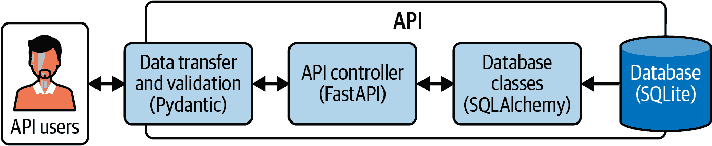

# 第三章\. 创建您的数据库

> “您似乎没有太多考虑手头的事情，”我最后说，打断霍尔斯的音乐论述。
> 
> “还没有数据，”他回答。“在没有所有证据之前就下结论是一个严重的错误。它会偏见判断。”
> 
> “您很快就会有数据了，”我说。
> 
> 亚瑟·柯南·道尔爵士，《血字的研究》（Ward Lock & Co.，1887 年）

在第二章中，您设计了 API 架构并设置了您的 GitHub Codespace 环境。在本章中，您将创建数据库以及从它读取的 Python 代码。

由于您正在创建数据 API，本章很重要。它将指导您设计数据库结构的过程，在 SQLite 数据库中创建它们，创建读取数据库的 Python 代码，以及创建单元测试以验证所有这些组件是否协同工作。

如果您急于看到代码是如何工作的，您可以使用*chapter3/complete*文件夹中的文件，稍后再回来按步骤执行指令。

# 您的 API 组件

在上一章中，图 2-2 显示了您正在实施的应用程序架构。该图中的 API 由几个组件组成。图 3-1 显示了这些组件以及您将用于实现它们的软件。



###### 图 3-1\. API 组件

API 有四个主要子组件。数据传输和验证组件用于确保 API 请求和响应具有有效数据并符合其定义。您将使用 Pydantic 创建这些组件。您将使用 FastAPI 创建 API 控制器。它处理 API 的所有处理以及其他您将学习的功能。您将使用 SQLAlchemy 创建数据库类。这些类处理查询数据库以及在 Python 类中存储数据。由于 SQLite 是一个基于文件的数据库，并且您将与其 API 代码一起部署，因此图中将其显示为 API 的第四个组件。

# 本章使用的软件

本章介绍的软件将专注于数据库：创建数据库、从数据库中读取数据以及测试它们（见表 3-1）。

表 3-1\. 本章使用的新工具或服务

| 软件名称 | 版本 | 用途 |
| --- | --- | --- |
| pytest | 8 | 单元测试库 |
| SQLAlchemy | 2 | 连接 Python 到 SQLite 的对象关系映射（ORM）库 |
| SQLite | 3 | 存储 API 使用的数据库数据 |

## SQLite

如图 3-1 所示，API 使用的是只读副本数据库，这是网站数据库的只读副本，它从网站数据库中快速接收更新。SWC 网站包含大量关于梦幻球队、NFL 球员、经理、得分以及许多其他由梦幻足球联赛主办方使用的数据点。

对于您的项目，您将使用 SQLite 创建一个压缩数据库来模拟。SQLite 非常适合学习项目，因为它基于文件，整个数据库可以轻松存储在 Git 仓库中，就像您将要使用的那样。

虽然被认为是轻量级数据库，但 SQLite 支持您将使用的所有 SQL 命令，并且完全由 SQLAlchemy 支持，您将使用它进行 Python 数据库工作。它是开始项目原型设计的绝佳选择。随着应用程序或 API 的发展，您可能会用像 PostgreSQL 或 MySQL 这样的传统数据库来替换它。但 SQLite 也被用于许多生产应用程序中。

您的项目将使用 SQLite 3。

## SQLAlchemy

SQLAlchemy 是一个流行的 Python 数据库工具包和 ORM。它与 FastAPI 配合良好，将在第三章中介绍。以下是 SQLAlchemy 为 Python 开发者所做的一些工作：

+   它提供使用 Python 查询数据库的访问，而不使用 SQL。

+   它在不需要任何数据类型转换的情况下，使用源数据库中的数据填充 Python 对象。

+   它支持多种数据库。

+   它允许使用相同的 Python 代码与不同的底层数据库一起使用。

+   它创建查询作为预编译语句，这有助于抵御 SQL 注入攻击。

###### 警告

*SQL 注入*是任何接受用户输入并使用它查询数据库的软件的严重漏洞，包括 Web 应用程序和 API。当恶意行为者将恶意代码插入旨在用于数据值的输入时，就会发生这种情况。

使用 *预编译语句*（也称为参数化语句）而不是原始 SQL 查询是减少 SQL 注入风险的一种技术。更多信息，请参考[OWASP 关于 SQL 注入的文章](https://oreil.ly/24SAy)。

您的项目将使用 SQLAlchemy 2。

## pytest

您将在第一部分中使用 pytest，这是一个 Python 测试库，为所编写的 Python 代码创建测试。您将创建 *单元测试* 来验证代码的各个部分是否按预期工作。您还将使用它来 *回归测试* 代码，当您进行更改或更新库时。

您的项目将使用 pytest 8。

# 创建您的 SQLite 数据库

切换到 *第三章* 并使用新数据库打开 SQLite：

```py
.../portfolio-project (main) $ cd chapter3
.../chapter3 (main) $ sqlite3 fantasy_data.db
SQLite version 3.45.3 2024-04-15 13:34:05
Enter ".help" for usage hints.
sqlite>
```

SQLite 的版本可能与显示的不同，因为它自动包含在您的 Codespace 中。

###### 注意

为了节省屏幕空间，我已经在我的 Codespace 的终端提示符中剪短了目录列表。您可以通过编辑 VS Code 中的*/home/codespace/.bashrc*文件来配置此设置。找到`export PROMPT_DIRTRIM`语句并将其设置为`export PROMPT_DIRTRIM=1`。然后，执行此终端命令：**`source ~/.bashrc`**。

## 创建数据库表

对于这个项目，您将创建几个表并将数据加载到它们中。图 3-2 显示了您将创建的表的结构。

您将通过执行结构化查询语言（SQL）语句来创建这些表。如前所述，SQL 是数据科学家经常使用的一种语言。本书不教授 SQL 的语法，但使用的脚本相当基础。要了解更多关于 SQL 的信息，我推荐 Alan Beaulieu 所著的《Learning SQL: Generate, Manipulate, and Retrieve Data, 3rd Edition》（O’Reilly，2020 年）。


###### 图 3-2\. 数据库表结构

确保您仍然处于`sqlite`提示符下，并逐个执行以下 SQL 语句，一个接一个：

```py
CREATE TABLE player (
        player_id INTEGER NOT NULL, 
        gsis_id VARCHAR, 
        first_name VARCHAR NOT NULL, 
        last_name VARCHAR NOT NULL, 
        position VARCHAR NOT NULL,
        last_changed_date DATE NOT NULL, 
        PRIMARY KEY (player_id)
);

CREATE TABLE performance (
        performance_id INTEGER NOT NULL, 
        week_number VARCHAR NOT NULL, 
        fantasy_points FLOAT NOT NULL, 
        player_id INTEGER NOT NULL, 
        last_changed_date DATE NOT NULL,
        PRIMARY KEY (performance_id), 
        FOREIGN KEY(player_id) REFERENCES player (player_id)
);

CREATE TABLE league (
        league_id INTEGER NOT NULL, 
        league_name VARCHAR NOT NULL, 
        scoring_type VARCHAR NOT NULL,
        last_changed_date DATE NOT NULL,  
        PRIMARY KEY (league_id)
);

CREATE TABLE team (
        team_id INTEGER NOT NULL, 
        team_name VARCHAR NOT NULL, 
        league_id INTEGER NOT NULL, 
        last_changed_date DATE NOT NULL, 
        PRIMARY KEY (team_id), 
        FOREIGN KEY(league_id) REFERENCES league (league_id)
);

CREATE TABLE team_player (
        team_id INTEGER NOT NULL, 
        player_id INTEGER NOT NULL, 
        last_changed_date DATE NOT NULL, 
        PRIMARY KEY (team_id, player_id), 
        FOREIGN KEY(team_id) REFERENCES team (team_id), 
        FOREIGN KEY(player_id) REFERENCES player (player_id)
);
```

这里是对其中一个语句的分解：

```py
CREATE TABLE player ( 
        player_id INTEGER NOT NULL, 
        gsis_id VARCHAR,
        first_name VARCHAR NOT NULL,
        last_name VARCHAR NOT NULL,
        position VARCHAR NOT NULL,
        last_changed_date DATE NOT NULL,
        PRIMARY KEY (player_id) 
);
```


`CREATE TABLE`是标准的 SQL 语法，`player`是此表的名称。


`player_id`是一个名为单列的名称，其数据类型为`INTEGER`，是必填字段。如果您在此表中插入具有此值的行，将发生错误。


在定义了所有列之后，将`player_id`值定义为*主键*，这是在此表中始终唯一的值，可以用来与其他表连接。

要验证是否已创建了所有五个表，请输入**`.tables`**，结果如下：

```py
sqlite> .tables
league       performance  player       team         team_player
sqlite>
```

## 理解表结构

关于表的第一件事要注意的是，每个列都有一个数据类型定义。使用的数据类型是`INTEGER`用于标识值，`VARCHAR`用于名称和文本字段，`DATE`用于日期字段，`FLOAT`用于有小数的评分值字段。所有字段都有`NOT NULL`语句，因为它们是必需的。每个表在其标识字段上都有一个`PRIMARY KEY()`约束。这确保了这些值在每个表中都是唯一的。

在“为数据科学家设计 API”中，我建议 API 支持按最后更改日期进行查询。这使得他们可以在数据管道中使用 API，并且只检索自某个时间点以来已更改的记录。（这是一个节省大量时间的方法。）您将通过在每个表中填充`last_changed_date`列来启用此功能。

如图 3-2 所示，每个表都与至少另一个表相关联。这是通过在子表中使用`FOREIGN KEY`语句来实现的，它引用父表中的主键。例如，查看`team`表的定义：

```py
CREATE TABLE team (
        team_id INTEGER NOT NULL,
        team_name VARCHAR NOT NULL,
        league_id INTEGER NOT NULL,
        last_changed_date DATE NOT NULL,
        PRIMARY KEY (team_id),
        FOREIGN KEY(league_id) REFERENCES league (league_id)
);
```

`FOREIGN KEY`语句在子表（`team`）中插入一个名为`league_id`的列，将其与父表（`league`）中的匹配记录链接起来。

`team_player`是唯一一个有两个外键的表，如下所示：

```py
CREATE TABLE team_player (
        team_id INTEGER NOT NULL,
        player_id INTEGER NOT NULL,
        last_changed_date DATE NOT NULL,
        PRIMARY KEY (team_id, player_id),
        FOREIGN KEY(team_id) REFERENCES team (team_id),
        FOREIGN KEY(player_id) REFERENCES player (player_id)
);
```

它有两个外键，因为它是一个 *关联表*，它作为关联两个单独父表的子表。在您的数据库中，一个球员可以属于多个梦幻球队，一个球队可以有多个梦幻球员。`team_player` 表实现了这种 *多对多关系*。稍后，这种关系将在映射到这些表的 Python 类中得到反映。

其余的表遵循类似的设计，数据字段服务于存储的数据的目的。您已准备好将数据加载到表中。

## 加载数据

现在表已经创建，您将使用足球数据填充它们。您将使用 SQLite 的 `.import` 工具来加载 CSV 格式的数据文件。您可以在本章的 */data* 目录中找到数据文件。

在执行导入之前，您需要配置 SQLite 以强制执行外键。这意味着如果您尝试向子表（包含 `FOREIGN KEY` 语句的表）插入一个记录，该记录与父表（外键 `REFERENCES` 中命名的表）中的记录不匹配，将发生错误，并且记录不会被导入。例如，当强制执行外键时，您不能在 `performance` 表中插入一个使用不在 `player` 表中的 `player_id` 值的记录。

使用以下语句启用外键约束：

```py
sqlite> PRAGMA foreign_keys = ON;
```

使用以下命令准备导入语句以识别 CSV 格式：

```py
sqlite> .mode csv
```

从 `sqlite` 提示符运行以下命令来加载数据。按照此处显示的顺序运行它们：

```py
sqlite> PRAGMA foreign_keys = ON;
sqlite> .mode csv
sqlite> .import --skip 1 data/player_data.csv player
sqlite> .import --skip 1 data/performance_data.csv performance
sqlite> .import --skip 1 data/league_data.csv league
sqlite> .import --skip 1 data/team_data.csv team
sqlite> .import --skip 1 data/team_player_data.csv team_player
sqlite>
```

使用以下命令验证每个表是否加载了正确数量的记录。`performance` 表已使用两个不同的 `last_changed_date` 值加载了记录，以便您可以验证日期搜索功能是否正常工作：

```py
sqlite> select count(*) from player;
1018
sqlite> select count(*) from performance;
17306
sqlite> select count(*) from performance where last_changed_date > '2024-04-01';
2711
sqlite> select count(*) from league;
5
sqlite> select count(*) from team;
20
sqlite> select count(*) from team_player;
140
```

要退出 SQLite 应用程序，请输入 **`.exit`**：

```py
sqlite> .exit
$
```

您已在数据库中加载了示例数据，它代表了 SWC 网站数据。现在您将开始使用 Python 来使用它。

# 使用 Python 访问您的数据

在 Python 中访问这些数据有几种方法。例如，您可以创建到数据库的连接并直接执行 SQL 查询。这听起来很简单，但您会迅速遇到几个问题，例如将 SQLite 数据类型映射到 Python 对象。您还需要采取措施来避免在从 API 用户接受输入时发生 SQL 注入攻击。

为了避免这项手动工作，您将使用 ORM，它处理从数据库表读取并从中创建 Python 对象的过程。您将使用一个非常常见的 Python ORM：SQLAlchemy。

## 在您的环境中安装 SQLAlchemy

SQLAlchemy 是您需要直接在 Codespace 中安装的第一个 Python 库。您需要确保安装的 SQLAlchemy 版本正确，因此首先在包含您的 Python 代码的目录中创建一个 `pip` 需求文件。

在你的编辑器中，创建一个包含以下内容的文件，并将其命名为 *requirements.txt*，然后保存该文件：

```py
SQLAlchemy>=2.0.0
```

此文件将用于从 `pip` Python 软件包管理器安装库。这些库存储在互联网上，`pip` 将自动将它们下载到你的 Codespace。

在整本书中，你将在你的 Codespace 中添加额外的 Python 库。使用需求文件是安装多个库并确保库版本之间兼容的便捷方式。

要安装库，请执行以下命令：

```py
pip3 install -r requirements.txt
```

你应该会看到一个消息，表明 SQLAlchemy 2.0 或更高版本已成功安装或“已满足”。要验证安装，请输入 **`pip3 show SQLAlchemy`**，你将收到类似于以下内容的确认：

```py
Name: SQLAlchemy
Version: 2.0.29
Summary: Database Abstraction Library
Home-page: https://www.sqlalchemy.org
Author: Mike Bayer
Author-email: mike_mp@zzzcomputing.com
License: MIT
```

## 为数据库访问创建 Python 文件

现在，你将创建使用 Python 查询数据库所需的文件。表 3-2 解释了当你完成本章时将拥有的所有文件的用途。

表 3-2\. 第三章文件的用途

| 文件名 | 用途 |
| --- | --- |
| *crud.py* | 查询数据库的辅助函数 |
| *database.py* | 配置 SQLAlchemy 使用 SQLite 数据库 |
| *models.py* | 定义与数据库表相关的 SQLAlchemy 类 |
| *requirements.txt* | 用于使用 `pip` 软件包管理器安装特定版本的库 |
| test_crud.py | 用于单元测试你的 SQLAlchemy 文件 pytest 文件 |

命名为 *models.py* 的文件将包含数据的 Python 表示形式。该文件中的类将在你使用 Python 查询数据库时使用。

在此文件中，你需要执行的两个任务是：

+   定义 SQLAlchemy 类以存储数据库表中的信息。

+   描述这些表之间的关系，以便 Python 代码可以访问相关表。

###### 小贴士

在本书中，“模型”一词被用于许多不同的方式，这是不可避免的，但可能会造成混淆。在这种情况下，SQLAlchemy 模型是 SQLite 数据库中数据的 Python 表示形式。

创建一个包含以下内容的文件，并将其命名为 *models.py*：

```py
"""SQLAlchemy models"""
from sqlalchemy import Column, ForeignKey, Integer, String, Float, Date
from sqlalchemy.orm import relationship

from database import Base

class Player(Base):
    __tablename__ = "player"

    player_id = Column(Integer, primary_key=True, index=True)
    gsis_id = Column(String, nullable=True)
    first_name = Column(String, nullable=False)
    last_name = Column(String, nullable=False)
    position = Column(String, nullable=False)
    last_changed_date = Column(Date, nullable=False)

    performances = relationship("Performance", back_populates="player")

    # Many-to-many relationship between Player and Team tables
   teams = relationship("Team", secondary="team_player",
                        back_populates="players")   

class Performance(Base):
    __tablename__ = "performance"

    performance_id = Column(Integer, primary_key=True, index=True)
    week_number = Column(String, nullable=False)
    fantasy_points = Column(Float, nullable=False)
    last_changed_date = Column(Date, nullable=False)

    player_id = Column(Integer, ForeignKey("player.player_id"))

    player = relationship("Player", back_populates="performances")

class League(Base):
    __tablename__ = "league"

    league_id = Column(Integer, primary_key=True, index=True)
    league_name = Column(String, nullable=False)
    scoring_type = Column(String, nullable=False)
    last_changed_date = Column(Date, nullable=False)

    teams = relationship("Team", back_populates="league")

class Team(Base):
    __tablename__ = "team"

    team_id = Column(Integer, primary_key=True, index=True)
    team_name = Column(String, nullable=False)
    last_changed_date = Column(Date, nullable=False)    

    league_id = Column(Integer, ForeignKey("league.league_id"))

    league = relationship("League", back_populates="teams")

   players = relationship("Player", secondary="team_player",
                          back_populates="teams")

class TeamPlayer(Base):
    __tablename__ = "team_player"

   team_id = Column(Integer, ForeignKey("team.team_id"),
                    primary_key=True, index=True)
   player_id = Column(Integer, ForeignKey("player.player_id"),
                      primary_key=True, index=True)    
last_changed_date = Column(Date, nullable=False)
```

逐个查看 *models.py* 文件。在大多数 Python 文件的顶部，你会找到 `import` 语句。Python 生态系统的强大之处在于你可以使用的各种外部库。本书中你将使用的过程是使用 `pip` 软件包管理器安装库，然后在代码中使用导入语句引用它们：

```py
from sqlalchemy import Column, ForeignKey, Integer, String, Float, Date 
from sqlalchemy.orm import relationship 

from database import Base 
```


因为此文件将创建数据库表的 Python 表示形式，所以你首先需要导入 SQLAlchemy 将用于数据库字段的类型。有关 SQLAlchemy 数据类型的更多信息，请参考 [SQLAlchemy 类型层次](https://oreil.ly/Z1jfo)。


接下来，您导入 SQLAlchemy 的关系功能，它允许表之间建立外键关系。


`database` 导入指的是包含 SQLAlchemy 配置的 *database.py* 文件。您正在使用 `Base` 类，这是一个标准模板，您将在 *models.py* 文件中的类中使用。

现在是开始定义 `Player` 类的时候了，这是您将用于存储 SQLite `player` 表数据的 Python 类。您使用 `class` 语句来完成此操作，指定类的名称，并说明它将是来自 *database.py* 文件的 `Base` 模板的子类。使用魔法命令 `*tablename*` 来告诉 SQLAlchemy 引用 `player` 表。因为这个语句，当您要求 SQLAlchemy 查询 `Player` 时，它会在幕后知道访问数据库中的 `player` 表。这是 ORM 的一个关键好处——自动将 Python 代码映射到底层数据库：

```py
class Player(Base):
    __tablename__ = "player"
```

`Player` 类的其余定义映射了数据库表的更多详细信息。每个语句都使用 SQLAlchemy 提供的 `Column` 方法在类中定义一个属性：

```py
    player_id = Column(Integer, primary_key=True, index=True)
    gsis_id = Column(String, nullable=True)
    first_name = Column(String, nullable=False)
    last_name = Column(String, nullable=False)
    position = Column(String, nullable=False)
    last_changed_date = Column(Date, nullable=False)
```

在定义中需要注意以下几点：

+   属性名称会自动匹配到数据库中的列名称。

+   使用的数据类型（例如，`String`，`Integer`）是 SQLAlchemy 数据类型，您在文件开头 `import` 语句中指定的。

+   `primary_key` 定义提供了 SQLAlchemy 的几个好处，如查询优化、强制唯一性和在类之间启用关系。

除了定义表之外，您还使用 `relationship()` 函数定义表之间的外键关系。这导致一个 `Player.performances` 属性，它将为 `player` 表中的每一行返回 `performance` 表中相关的所有行：

```py
    performances = relationship("Performance", back_populates="player")
```

另一种关系类型，它使用 `team_player` 关联表将 `player` 连接到 `team`。通过定义 `secondary="team_player"`，这种关系允许 `Player` 记录有一个名为 `Player.teams` 的属性。这是在创建数据库表时讨论的许多多关系之一：

```py
   players = relationship("Player", secondary="team_player",
                          back_populates="teams")
```

接下来是 `Performance` 类的定义：

```py
class Performance(Base):
    __tablename__ = "performance"

    performance_id = Column(Integer, primary_key=True, index=True)
    week_number = Column(String, nullable=False)
    fantasy_points = Column(Float, nullable=False)
    last_changed_date = Column(Date, nullable=False)

    player_id = Column(Integer, ForeignKey("player.player_id"))

    player = relationship("Player", back_populates="performances")
```

这个类有一个 `player` 关系，它是 `player` 表中 `performances` 关系的镜像。当您一起查看这两个关系时，您可以看到一个关系中的 `back_populates` 语句引用了另一个中的变量。这些共同允许父（`player`）和子（`performance`）之间的双向关系。

接下来是 `League` 类：

```py
class League(Base):
    __tablename__ = "league"

    league_id = Column(Integer, primary_key=True, index=True)
    league_name = Column(String, nullable=False)
    scoring_type = Column(String, nullable=False)
    last_changed_date = Column(Date, nullable=False)

    teams = relationship("Team", back_populates="league")
```

`League` 将成为你代码中最顶层的父类，正如 图 3-2 所反映的那样。`teams` 关系将用于在这个类中启用 `League.teams`，并在 `Team` 类中有一个匹配的关系。

看一下下一个代码块，它定义了 `Team` 类：

```py
class Team(Base):
    __tablename__ = "team"

    team_id = Column(Integer, primary_key=True, index=True)
    team_name = Column(String, nullable=False)

    league_id = Column(Integer, ForeignKey("league.league_id"))

    league = relationship("League", back_populates="teams")

   players = relationship("Player", secondary="team_player",
                          back_populates="teams")
```

注意，这个文件有匹配的关系来连接到 `league` 表，并间接连接到 `player` 表。

最后一个类定义是为 `team-player` 表：

```py
class TeamPlayer(Base):
    __tablename__ = "team_player"

 team_id = Column(Integer, ForeignKey("team.team_id"),
                    primary_key=True, index=True)
 player_id = Column(Integer, ForeignKey("player.player_id"),
                      primary_key=True, index=True
```

`TeamPlayer` 类在没有任何关系的情况下创建，因为这些关系是在 `Team` 和 `Player` 类中定义的。你现在已经定义了所有为新的数据库表和必要的数据库配置文件所需的 SQLAlchemy 模型。进展非常出色！

## 创建数据库配置文件

接下来，将创建一个名为 *database.py* 的文件，该文件将设置 SQLAlchemy 配置以连接到 SQLite 数据库，以及一些你将用于数据库工作的其他 Python 对象。你需要在这个文件中完成的任务如下：

+   创建一个指向 SQLite 数据库并具有正确设置的数据库连接。

+   创建一个父类，你将使用它来定义 Python 表类：

创建一个包含以下内容的文件，并将其命名为 *database.py*：

```py
"""Database configuration"""
from sqlalchemy import create_engine
from sqlalchemy.orm import declarative_base
from sqlalchemy.orm import sessionmaker

SQLALCHEMY_DATABASE_URL = "sqlite:///./fantasy_data.db"

engine = create_engine(
    SQLALCHEMY_DATABASE_URL, connect_args={"check_same_thread": False}
)
SessionLocal = sessionmaker(autocommit=False, autoflush=False, bind=engine)

Base = declarative_base()
```

逐个查看这个文件。从 SQLAlchemy 库中导入了三个特定的函数。虽然可以一次性导入整个 SQLAlchemy 库，但最好导入特定的函数以限制多个库中重复函数可能产生的冲突：

```py
from sqlalchemy import create_engine
from sqlalchemy.orm import declarative_base
from sqlalchemy.orm import sessionmaker
```

下面的三个步骤共同工作以获取 *session*，这是一个 SQLAlchemy 对象，用于管理与数据库的对话。创建一个数据库 URL，告诉 SQLAlchemy 你将使用哪种类型的数据库（SQLite）以及在哪里可以找到该文件（与该文件在同一文件夹中，文件名为 *fantasy_data.db*）：

```py
SQLALCHEMY_DATABASE_URL = "sqlite:///./fantasy_data.db"
```

使用这个数据库 URL，创建一个 `engine` 对象，其中一个配置设置允许对该数据库进行多次连接而不会抛出错误：

```py
engine = create_engine(
    SQLALCHEMY_DATABASE_URL, connect_args={"check_same_thread": False}
)
```

然后，使用 `engine` 对象创建一个名为 `SessionLocal` 的会话，该会话指向该引擎并添加了一些额外的配置设置：

```py
SessionLocal = sessionmaker(autocommit=False, autoflush=False, bind=engine)
```

这个文件中的最后一个命令创建了一个 `Base` 类。这是 SQLAlchemy 为你在 *models.py* 文件中创建的模型提供的一个标准模板：

```py
Base = declarative_base()
```

## 创建 SQLAlchemy 辅助函数

到目前为止创建的文件为你提供了与数据库和表示数据库表的类的连接。接下来，你将创建一个名为 *crud.py* 的文件，该文件包含查询函数。这个听起来有些奇怪的名称代表创建（Create）、读取（Read）、更新（Update）、删除（Delete）（CRUD）。

创建一个包含以下内容的文件，并将其命名为 *crud.py*：

```py
"""SQLAlchemy Query Functions"""
from sqlalchemy.orm import Session
from sqlalchemy.orm import joinedload
from datetime import date

import models

def get_player(db: Session, player_id: int):
   return db.query(models.Player).filter(
       models.Player.player_id == player_id).first()

def get_players(db: Session, skip: int = 0, limit: int = 100,
               min_last_changed_date: date = None,
               last_name : str = None, first_name : str = None, ):
   query = db.query(models.Player)
   if min_last_changed_date:
       query = query.filter(
           models.Player.last_changed_date >= min_last_changed_date)
   if first_name:
       query = query.filter(models.Player.first_name == first_name)
   if last_name:
       query = query.filter(models.Player.last_name == last_name)
   return query.offset(skip).limit(limit).all()

def get_performances(db: Session, skip: int = 0, limit: int = 100,
                    min_last_changed_date: date = None):
   query = db.query(models.Performance)
   if min_last_changed_date:
       query = query.filter(
           models.Performance.last_changed_date >= min_last_changed_date)
   return query.offset(skip).limit(limit).all()

def get_league(db: Session, league_id: int = None):
   return db.query(models.League).filter(
       models.League.league_id == league_id).first()

def get_leagues(db: Session, skip: int = 0, limit: int = 100,
                min_last_changed_date: date = None,league_name: str = None):
   query = db.query(models.League
                   ).options(joinedload(models.League.teams))
   if min_last_changed_date:
       query = query.filter(
           models.League.last_changed_date >= min_last_changed_date)                             
   if league_name:
       query = query.filter(models.League.league_name == league_name)    
   return query.offset(skip).limit(limit).all()

def get_teams(db: Session, skip: int = 0, limit: int = 100,
             min_last_changed_date: date = None,
             team_name: str = None, league_id: int = None):
   query = db.query(models.Team)
   if min_last_changed_date:
       query = query.filter(
           models.Team.last_changed_date >= min_last_changed_date)
   if team_name:
       query = query.filter(models.Team.team_name == team_name)
   if league_id:
       query = query.filter(models.Team.league_id == league_id)
   return query.offset(skip).limit(limit).all()   

#analytics queries
def get_player_count(db: Session):
   query = db.query(models.Player)
   return query.count()

def get_team_count(db: Session):
   query = db.query(models.Team)
   return query.count()

def get_league_count(db: Session):
   query = db.query(models.League)
   return query.count()
```

让我们看看 *crud.py* 中的导入语句：

```py
from sqlalchemy.orm import Session 
from sqlalchemy.orm import joinedload
from datetime import date 

import models 
```

[#co_creating_your_database_CO3-1]

`Session` 和 `joinedload` 在查询函数中被使用。

[#co_creating_your_database_CO3-2]

`date`将是一个重要的数据类型，允许您按日期进行筛选。


此导入允许您引用您创建的模型文件。这些函数引用您在`models.py`中创建的类，并使用 SQLAlchemy 内置函数通过预定义 SQL 语句检索数据。

看看第一个查询：

```py
def get_player(db: Session, player_id: int):
   return db.query(models.Player).filter(
       models.Player.player_id == player_id).first()
```

此函数中的参数包括数据库会话，该函数将使用它来连接到数据库，以及特定的`player_id`值。通过使用`filter(models.Player.player_id == player_id).first()`，此函数查找特定的`Player.player_id`值并返回第一个匹配的实例。因为您在`models.py`文件和 SQLite 数据库中将`player_id`定义为主键，所以此查询将返回单个结果。

下一个函数的签名向`.query()`语句添加了几个新参数：

```py
def get_players(db: Session, skip: int = 0, limit: int = 100,
               min_last_changed_date: date = None,
               last_name : str = None, first_name : str = None, ):
```

`skip`和`limit`参数将用于*分页*，允许用户指定记录的集合而不是完整列表。`min_last_changed_date`参数将用于排除早于指定日期的记录。

`skip`参数上的`int = 0`设置了默认值为零。如果在这个函数的调用中没有发送此参数，`skip`将默认为零。`limit`的默认值为 100。对于`min_last_changed_date`、`first_name`和`last_name`没有给出默认值，因此它们默认为 null。

函数体使用查询来筛选结果：

```py
query = db.query(models.Player)
   if min_last_changed_date:
       query = query.filter(
           models.Player.last_changed_date >= min_last_changed_date)
   if first_name:
       query = query.filter(models.Player.first_name == first_name)
   if last_name:
       query = query.filter(models.Player.last_name == last_name)
```

最后一条语句应用了`skip`和`limit`参数：

```py
    return query.offset(skip).limit(limit).all()
```

该语句将`skip`和`limit`参数应用于查询结果中抓取特定记录块。`skip`指示查询从结果开始处跳过一定数量的记录，而`limit`指示查询只返回一定数量的记录。例如，用户可能从跳过零并限制 20 开始。这将返回前 20 条记录。他们可以再次调用它，这次跳过 20 并限制 20。这将抓取下 20 条记录。

`get_leagues`函数使用了一个新语句，因此值得仔细看看：

```py
def get_leagues(db: Session, skip: int = 0, limit: int = 100,
                min_last_changed_date: date = None,league_name: str = None):
   query = db.query(models.League
                   ).options(joinedload(models.League.teams))
   if min_last_changed_date:
       query = query.filter(
           models.League.last_changed_date >= min_last_changed_date)
   if league_name:
       query = query.filter(models.League.league_name == league_name)
   return query.offset(skip).limit(limit).all()
```

此函数使用`.options(joinedload(models.League.teams))`语句。这是一种*懒加载*类型，导致 SQLAlchemy 在检索`league`数据时检索关联的`team`数据。

最后的查询集旨在支持人工智能和大型语言模型，基于提供单独端点用于分析问题的建议。您将创建提供用户、联赛和球队计数的端点。这将帮助人工智能使用分页功能，并回答有关记录数量的查询，而无需进行大型 API 调用：

```py
#analytics queries
def get_player_count(db: Session):
    query = db.query(models.Player)
    return query.count()

def get_team_count(db: Session):
    query = db.query(models.Team)
    return query.count()

def get_league_count(db: Session):
    query = db.query(models.League)
    return query.count()
```

您已创建了所有 SQLAlchemy 类和辅助函数。由于 *crud.py* 中的所有函数都是读取（查询）数据，您只实现了 CRUD 中的“r”。这是合适的，因为您的所有用户故事都需要只读功能。如果您正在开发允许创建、更新或删除记录的 API，则此文件可以扩展以包含额外的函数。现在，是时候使用 pytest 对这些查询进行单元测试了。

## 在您的环境中安装 pytest

现在所有数据库代码都已编写，您已准备好对其进行测试。您将使用 pytest 库来完成此任务。首先，在 *requirements.txt* 文件中添加 pytest 条目。更新后的文件应如下所示：

```py
SQLAlchemy>=2.0.0
Pytest>=8.1.0
```

要安装 pytest，再次执行以下命令：

```py
pip3 install -r requirements.txt
```

您应该看到一个消息，表明 pytest 8.1.0 或更高版本已成功安装或“已满足”。要验证安装，请键入 **`pip3 show Pytest`**，您将收到类似于以下内容的确认：

```py
$ pip3 show Pytest
Name: pytest
Version: 8.1.1
Summary: pytest: simple powerful testing with Python
Home-page:
Author: Holger Krekel, Bruno Oliveira, Ronny Pfannschmidt, Floris Bruynooghe,
Brianna Laugher, Florian Bruhin, Others (See AUTHORS)
Author-email:
License: MIT
```

## 测试您的 SQLAlchemy 代码

如库的总结所述，pytest 易于使用。pytest 期望一些命名约定。任何包含测试的文件都将有一个以 *test* 开头，后跟下划线或以下划线结尾后跟 *test* 的文件名。在测试文件中，pytest 将执行任何以 *test* 开头的函数名。

在测试函数内部，您将包含一个 `assert` 语句。如果它返回 true，则流程继续。如果测试中的所有断言都评估为 true，则测试以成功状态返回。如果断言评估为 false，则代码引发一个 `AssertionError`，并且测试评估为 false。

您的单元测试将非常基础：它们将检查从您的 SQLAlchemy 类返回的行数是否与您在之前的 SQL 查询中检查的值匹配。

创建一个名为 *test_crud.py* 的文件，内容如下：

```py
"""Testing SQLAlchemy Helper Functions"""
import pytest
from datetime import date

import crud
from database import SessionLocal

# use a test date of 4/1/2024 to test the min_last_changed_date.
test_date = date(2024,4,1)

@pytest.fixture(scope="function")
def db_session():
    """This starts a database session and closes it when done"""
    session = SessionLocal()
    yield session
    session.close()

def test_get_player(db_session):
    """Tests you can get the first player"""
    player = crud.get_player(db_session, player_id = 1001)
    assert player.player_id == 1001

def test_get_players(db_session):
    """Tests that the count of players in the database is what is expected"""
   players = crud.get_players(db_session, skip=0, limit=10000,
                               min_last_changed_date=test_date)
    assert len(players) == 1018

def test_get_players_by_name(db_session):
    """Tests that the count of players in the database is what is expected"""
    players = crud.get_players(db_session, first_name="Bryce", last_name="Young")
    assert len(players) == 1
    assert players[0].player_id == 2009

def test_get_all_performances(db_session):
 """Tests that the count of performances in the database is
   what is expected - all the performances"""
    performances = crud.get_performances(db_session, skip=0, limit=18000)
    assert len(performances) == 17306

def test_get_new_performances(db_session):
"""Tests that the count of performances in the database is
   what is expected"""
   performances = crud.get_performances(db_session, skip=0, limit=18000,
                                        min_last_changed_date=test_date)

#test the count functions
def test_get_player_count(db_session):
    player_count = crud.get_player_count(db_session)
    assert player_count == 1018
```

首先，看看这个文件是如何遵循 pytest 期望的约定的。文件被命名为 *test_crud.py*，因此它将被自动识别为测试文件。文件包含以 *test_* 开头的六个函数名。这些函数将在文件运行时被执行。这些测试函数每个都以一个 `assert` 语句结束。

第一个函数需要一些解释。在函数上方是装饰器 `@pytest.fixture(scope="function")`。在 *arrange* 阶段，即准备测试设置时，会使用到 fixture。此 fixture 使用 session 范围，这意味着它将为每个函数运行一次：

```py
@pytest.fixture(scope="function")
```

`db_session()` 函数的主体创建了一个数据库会话，在测试函数使用会话（通过 `yield` 语句）时暂停，并在测试完成后关闭会话：

```py
def db_session():
    """This starts a database session and closes it when done"""
    session = SessionLocal()
    yield session
    session.close()
```

为了验证基于日期的查询是否正常工作，`performance` 查询首先检查完整结果，然后使用 `last_changed_date` 限制的结果。首先记住，在之前的 SQL 查询中，你得到了以下 `performance` 表的结果：

```py
sqlite> select count(*) from performance;
17306
sqlite> select count(*) from performance where last_changed_date > '2024-04-01';
2711
```

要使用 pytest 验证第一个结果，这个函数不包括数据参数：

```py
def test_get_all_performances(db_session):
   """Tests that the count of performances in the database is
   what is expected - all the performances"""
    performances = crud.get_performances(db_session, skip=0, limit=18000)
    assert len(performances) == 17306
```

为了验证第二个结果，下一个函数使用了一个 `last_changed_date` 值为 `2024_04_01`，这个值设置在测试代码顶部的 `test_date` 变量中。这个日期比所有记录都要早 2,711 条：

```py
 """Tests that the count of performances in the database is
   what is expected"""
   performances = crud.get_performances(db_session, skip=0, limit=10000,
                                        min_last_changed_date=test_date)
    assert len(performances) == 2711
```

最后一个测试验证了一个分析查询：

```py
def test_get_player_count(db_session):
    player_count = crud.get_player_count(db_session)
    assert player_count == 1018
```

要执行测试，请输入 **`pytest test_crud.py`** 命令，你应该会看到一个类似以下输出的结果：

```py
$ pytest test_crud.py
================== test session starts ===========================
platform linux -- Python 3.10.13, pytest-8.1.2, pluggy-1.5.0
rootdir: /workspaces/adding-more-data/chapter3
plugins: anyio-4.4.0
collected 5 items

test_crud.py                                              [100%]

=================== 5 passed in 0.22s ============================
```

你已经验证了你的 SQLAlchemy 类和一些辅助函数工作正常——做得好！数据库工作已完成。

# 其他资源

SQL 是数据专业人士必备的一项基本技能。可用的资源数量无限，但以下是一些开始的地方：

+   《*学习 SQL，第 3 版*》，由艾伦·博利厄（O’Reilly，2020 年）

+   《*SQL 实用指南，第 4 版*》，由爱丽丝·赵（O’Reilly，2021 年）

要了解更多关于 SQLAlchemy 的信息，请查看 [官方 SQLAlchemy 2 文档](https://oreil.ly/PhsUf)。

# 摘要

在本章中，你创建了数据库和用于读取的 SQLAlchemy 代码。以下是本章你取得的成就：

+   你设计了数据库表及其关系。

+   你使用 SQLite 创建了一个数据库，并使用 SQL 命令创建了所有表。

+   你从 CSV 文件中导入数据以加载数据表。

+   你创建了 Python 模型文件和数据库配置文件。

+   你创建了查询数据库的辅助函数。

+   你使用 pytest 对端到端数据库功能进行了单元测试。

在 第四章，你将创建 FastAPI 代码来使用这些数据并将其发布为 REST API。
