# 第五章。记录您的 API

> 文档是开发者了解您的 API 的地方。无论您是提供一个简单的 README 文件还是为开发者开发一个完整的网站，清楚地记录他们如何最有效地使用您的 API 至关重要。
> 
> 布伦达·金、萨乌拉布·沙尼和阿米尔·谢瓦特，《设计 Web API》（O'Reilly，2018）

在第四章中，您创建了第一个 API 来满足第一章中确定的用户故事。您为这些主要用户开发的是数据科学用户和咨询网站提供商。该 API 将使他们能够使用 SportsWorldCentral (SWC)的幻想数据创建分析产品，如仪表板、图表和模型。现在您将创建文档来帮助他们使用您的 API。文档和如软件开发工具包（SDK）等特性可以改善您的技术用户的*开发者体验*（DX）。

# 发送信任信号

您的 API 文档的重要任务是向潜在的 API 消费者传达信任信号。如果他们不信任您，他们就不会使用您的 API。如果 API 消费者将要多次调用您的 API，他们将会构建一个*集成*，这基本上是反复调用您的代码的代码。对于 SWC API 来说，这可能是一个将 SWC 添加到其支持网站列表的幻想咨询网站。另一个例子是一个数据科学用户，他将安排一个提取、转换、加载（ETL）过程，以每周获取最新的统计数据。

这些重复用户在考虑使用您的 API 时会问以下问题：我能依赖您吗？我的 API 一个月后、一年后还会可用吗？

许多公共 API 网站给人一种尘封、被忽视的感觉。它们有几年前的博客文章，留言板上的帖子无人回应，或者过时的功能路线图。如果您的文档像一座空城，潜在的用户会去别处。

您可以通过确保您的反馈机制是最新的，并且任何问题都能得到快速响应，向这些用户传达信任信号。当前的发布历史和清晰的版本策略也是生命力的良好迹象。

数据科学用户可能正在寻找一次性数据加载，对长期支持的兴趣较少。他们可能会问不同的问题：我能信任您的数据吗？定义与内容是否匹配？您的数据质量水平如何？通过说明您数据的质量信息，并给出具体的更新频率承诺，向这些用户传达信任信号。

# 制作优秀的 API 文档

当您开始为新 API 编写文档时，可以从本节讨论的核心功能开始。这些功能为用户提供完成任务所需的内容。随着您的 API 成熟，继续改进文档并添加使您的 API 与众不同的特性。

## 核心功能

所有 API 文档都应该包含一些核心功能。没有这些基本功能，API 不太可能被许多消费者使用。它们使用户能够理解 API 的价值，获取地址和任何必要的授权信息，并轻松测试 API。服务条款和反馈机制确保用户适当使用 API，并知道在哪里寻求帮助。以下是一些期望用户使用 API 的核心功能：

入门指南

这是一个概述或介绍，解释了 API 的目的以及消费者如何与之互动。它还提供了 API 的地址、安全要求以及请求用户 ID 或 API 密钥的说明。

端点定义

这些解释了每个端点的目的，以及请求、响应和任何错误的格式。端点是 API 用户将进行调用的完整地址和资源名称。例如，[*https://api.sportsworldcentral.com/v0/players*](https://api.sportsworldcentral.com/v0/players) 是一个返回玩家列表的端点。

OAS 文件

OpenAPI 规范（OAS）文件是一个机器可读文件，它定义了连接指令和端点定义。

服务条款

这些解释了 API 的允许使用方式以及适用的任何速率限制或限制。

反馈机制

为了让人们使用您的 API，他们需要有一种方法来联系并提问。一些常见的方法包括支持电子邮件地址、联系表单和 GitHub 问题跟踪器。

SDKs

通过在流行的编程语言中创建 SDKs（软件开发工具包），API 提供商可以使消费者使用 API 的过程更加容易。这些可以帮助强制执行 API 的负责任使用，减少一些常见问题，如过度使用。如果 API 的主要用户是数据科学家，这将大大简化使用您的 API 的过程。您将在第七章中为您的 API 创建 SDK。

## 额外功能

除了基本功能外，还有一些其他项目通过简化使用 API 的过程或使其更容易尝试来提高 API 的 DX（开发者体验）：

示例程序代码

这些是流行软件语言中的代码示例片段，展示了如何正确使用 API。

交互式文档

交互式文档允许用户向开发环境提交样本 API 调用，以获得使用 API 的实践经验。Swagger UI 用于为 FastAPI 项目生成交互式文档。

沙盒环境

超越交互式文档，一个功能齐全的沙盒环境将使开发者能够在保存样本数据的环境中提交多个 API 调用。例如，他们可能通过一个 API 调用创建一个订单，然后通过另一个 API 调用检索订单的结果。

额外功能

API 提供商还提供各种其他额外功能。其中之一是越来越受欢迎的创建 *Postman 收集*，它包括可以与 Postman API 测试工具一起运行的示例请求和测试。

其中一些需要投入时间和资源来创建，并且随着 API 的变化而保持最新。这通常是专门负责开发者关系（devrel）的员工的工作。API 提供商在投资这些资源之前必须考虑 API 的商业提案。

###### 注意

高级功能可以显著减少消费者使用 API 面临的摩擦，并快速启动。有时这被称为减少 *时间到 Hello World*（TTHW）。潜在消费者能够更快地使用你的 API 制作基本原型，他们使用它的可能性就越大。

# 检查 API 文档的示例

对一些现实世界 API 文档的浏览将展示之前提到的功能。这些示例说明了核心功能和额外功能。

## Sleeper App

Sleeper 应用程序是一个现实生活中的幻想足球联赛主办方，就像你想象中的 SportsWorldCentral。它的 [API 文档](https://docs.sleeper.com) 展示了文档的几个基本功能（图 5-1）。

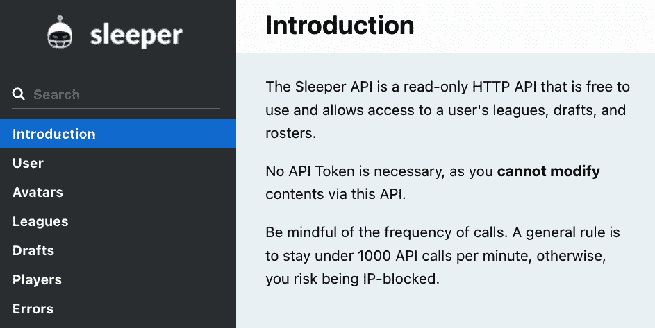

###### 图 5-1\. 核心功能：入门页面

登录页面提供了有关使用 API 的一些基本信息，包括身份验证要求（无需身份验证）和一般使用限制（每分钟少于 1,000 个 API 调用）。文档提供了搜索功能和显示主要端点和错误的导航栏。图 5-2 展示了 Drafts 端点可用的更详细的信息。

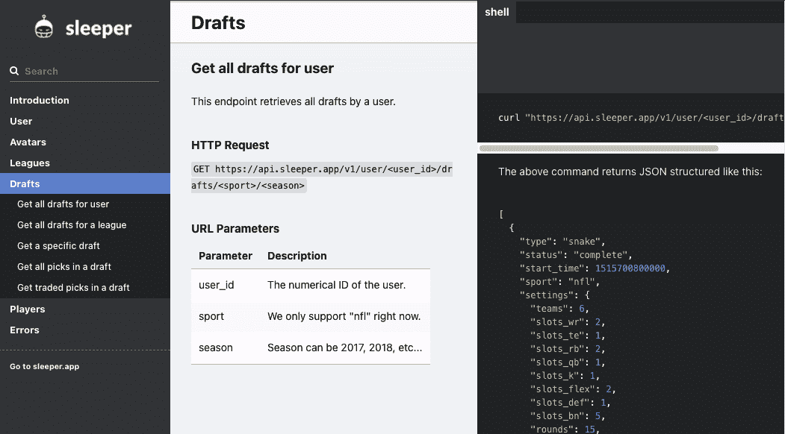

###### 图 5-2\. 核心功能：端点定义

此页面包括生产 API URL、HTTP 动词和所需参数。右侧列展示了示例 API 调用和 API 调用的 JSON 格式输出。

## MyFantasyLeague

MyFantasyLeague 是一个幻想联赛主办方，提供 [功能齐全的开发者门户](https://oreil.ly/t7tSf)，并且以其为开发者提供高质量支持而闻名。

欢迎页面从关注 API 版本的发布说明开始（图 5-3）。它提供了请求参考页面和示例代码的链接，然后突出显示了使用 API 的服务条款。

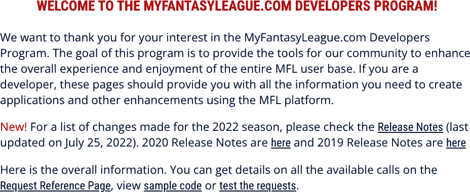

###### 图 5-3\. MyFantasyLeague 欢迎页面

从欢迎页面上的“测试请求”链接进入将带你到交互式 API 文档（图 5-4）。交互式 API 文档和沙盒环境之间有什么区别？交互式文档支持测试 API 调用，但不会在测试调用之间存储结果。沙盒环境跟踪之前的 API 调用，以便你可以一起测试多个任务。

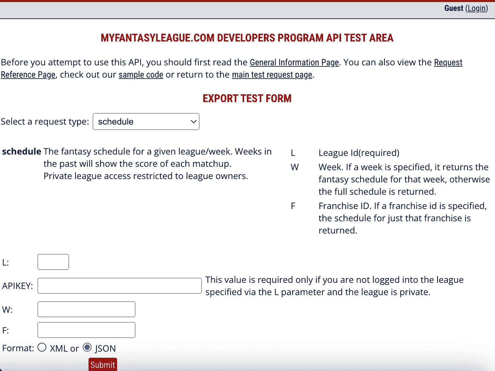

###### 图 5-4\. 额外功能：交互式文档

## Yahoo! 梦幻足球

Yahoo! 是另一个提供详细 [API 文档](https://oreil.ly/4YIxy) 的梦幻足球联赛主办方。Yahoo! 提供了访问其 API 的示例 PHP 代码。此示例代码提供了详细的认证说明，这可能特别棘手（图 5-5）。

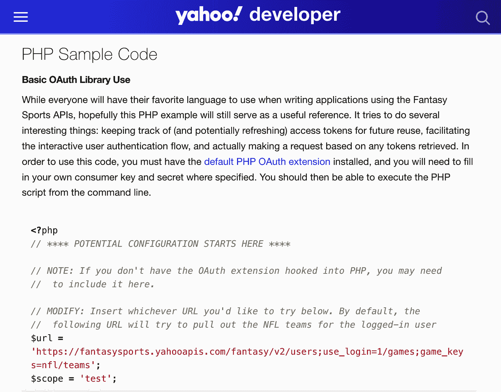

###### 图 5-5\. 额外功能：示例程序代码

# 查看你的 API 内置文档

在 第四章 中，你构建了一个 API，其端点用于满足你的最高优先级用例。在本章中，你将查看 API 的内置文档。你还将对 API 代码进行一些更新，以改进文档。

## 从第四章复制文件

要继续你在上一章中停止的你的项目组合，请将目录更改为 *chapter5*，然后将上一章的文件复制到其中。以下显示了命令和预期输出：

```py
.../portfolio-project (main) $ cd chapter5
.../chapter5 (main) $ cp ../chapter4/*.py .
.../chapter5 (main) $ ../chapter4/fantasy_data.db
.../chapter5 (main) $ cp ../chapter4/requirements.txt .
.../chapter5 (main) $ ls *.*
crud.py  database.py  fantasy_data.db  main.py  models.py  readme.md
requirements.txt  schemas.py  test_crud.py  test_main.py
```

现在请使用 `fastapi dev` 而不是 `fastapi run` 启动你的 API，就像你在上一章中所做的那样。这告诉 FastAPI 每次你对程序代码进行任何更改时自动重新加载应用程序：

```py
.../chapter5 (main) $ fastapi dev main.py
INFO:     Will watch for changes in these directories:
          ['/workspaces/portfolio-project/chapter5']
INFO:     Uvicorn running on http://127.0.0.1:8000 (Press CTRL+C to quit)
INFO:     Started reloader process [9999] using WatchFiles
INFO:     Started server process [9999]
INFO:     Waiting for application startup.
INFO:     Application startup complete.
```

你将看到一个对话框，显示“你的运行在端口 8000 的应用程序可用”，如图 图 5-6 所示。

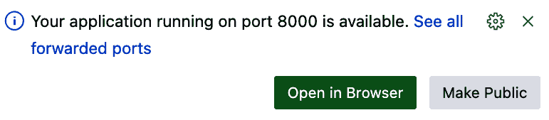

###### 图 5-6\. Codespaces 浏览器窗口弹出

点击“在浏览器中打开”以在 Codespaces 外部打开一个浏览器标签页。此浏览器将显示一个以 *app.github.dev* 结尾的基本 URL，其中包含在 Codespaces 上运行的 API 的响应。你应该在你的网页浏览器中看到以下健康检查信息：

```py
{"message":"API health check successful"}
```

## 文档选项 1：Swagger UI

我将对 Swagger UI 文档的说明比 Redoc 文档更详细，因为前者允许你测试你的 API。要查看你的 API 的 Swagger UI 交互式 API 文档，请在浏览器中基本 URL 的末尾复制并粘贴以下内容：***/docs***。例如，浏览器中的完整 URL 可能是 *[*https://happy-pine-tree-1234-8000.app.github.dev/docs*](https://happy-pine-tree-1234-8000.app.github.dev/docs)*。你应该看到如图 图 5-7 所示的文档。

您可能已经从上一章的 表 4-1 中认出了这个端点列表。您可以看到，您在 API 中实现的所有端点都列在这里。您可以点击任何一个端点来展开特定于该端点的部分，并与它交互。

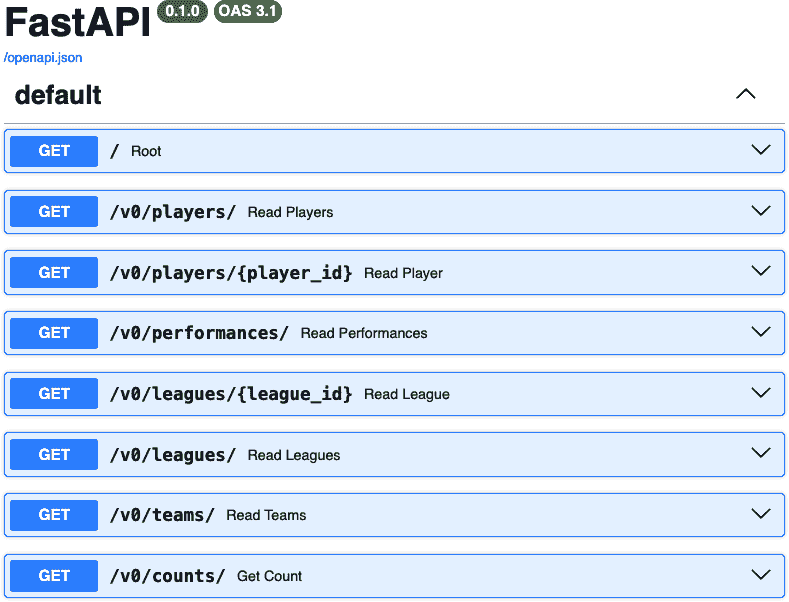

###### 图 5-7\. 初始 Swagger UI 交互式文档

点击显示“Get /v0/players/{player_id}”的栏位，然后点击“Try it out”按钮。此按钮将变为“取消”，如图 图 5-8 所示。

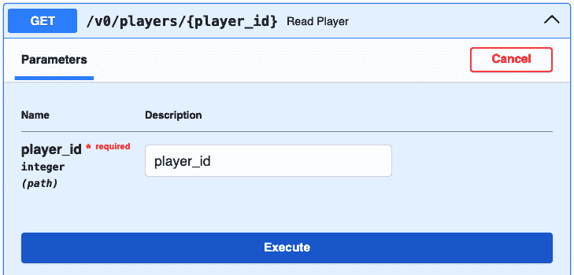

###### 图 5-8\. 展开的端点部分，上半部分

参数部分包括为此端点定义的 `player_id` 参数。此参数是必需的，其数据类型为整数，它是一个路径参数，这意味着当调用此 API 时，URL 路径将包含 `player_id` 值，如图端点定义所示。图 5-9 显示了此端点部分的下半部分。

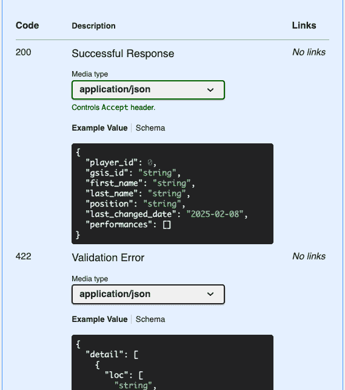

###### 图 5-9\. 展开的端点部分，下半部分

本节描述了消费者应该准备的两种预期响应。如果对端点的请求成功，将返回 HTTP 状态码 200（成功响应），并且响应体将采用以下格式：

```py
{
  "player_id": 0,
  "gsis_id": "string",
  "first_name": "string",
  "last_name": "string",
  "position": "string",
  "last_changed_date": "2024-04-27",
  "performances": []
}
```

然而，如果请求无效，消费者将收到一个包含 HTTP 状态码 422（不可处理的内容）的错误信息的响应：

```py
{
  "detail": [
    {
      "loc": [
        "string",
        0
      ],
      "msg": "string",
      "type": "string"
    }
  ]
}
```

要与交互式文档交互，请点击执行按钮。您应该看到错误结果显示在 图 5-10，或类似的内容。


###### 图 5-10\. 玩家端点错误信息

文档强制执行所需的 `player_id` 参数，并显示消息“必需字段未提供。”在 `player_id` 字段中输入 **`1385`** 的值，然后再次点击执行。此请求应该成功，并且网页的响应部分应该类似于 图 5-11。


###### 图 5-11\. 成功的玩家响应

页面的这部分显示了有关由文档构建的 HTTP 请求和您的 API 发送回的 HTTP 响应的有用信息。

首先，查看响应。在 `curl` 部分，文档显示了可以用来调用此 API 的命令行语句。这有助于理解您之前输入的参数构建的确切 HTTP 请求。（cURL 是一种常用的命令行工具，用于向 Web 应用程序和 API 发送 HTTP 请求。）您可以将该 URL 复制到浏览器地址栏中，直接进行相同的 API 调用。

记住，端点是 HTTP 动词和 URL 的组合。在 图 5-11 中，HTTP 动词是 `GET`，正如文档中显示的那样。URL 指向 Codespaces 生成的地址。

在请求 URL 部分，您可以看到没有 HTTP 动词的 URL。请注意，URL 的结尾是 *v0/players/1385*。这与程序代码和早期文档中预期的 */v0/players/{player_id}* 匹配。由于 `player_id` 是路径参数，它被添加到 URL 的末尾。

现在让我们看看响应。在“服务器响应”下，您可以看到收到的响应是 HTTP 200，这是一个成功的响应。“响应体”显示了 API 返回的 JSON 数据。它与 `Player` 对象的格式相匹配，并包含了 `player_id` 1385 的数据，这是您在路径参数中输入的内容。它还包括与该 `Player` 相关的 `Performance` 记录。

“响应头”部分显示了 HTTP 头部，这是 API 与响应体一起发送的附加元数据。如果您直接在浏览器中调用 API，您将看不到这些信息。

正如您所看到的，这个交互式 API 文档非常强大。它与本章中展示的任何真实世界幻想联赛主机上的 API 文档功能相媲美。由于您没有自己创建此代码，它从哪里来？此文档是由 [Swagger UI](https://oreil.ly/r6P--) 生成的，这是一个由 SmartBear 软件领导的开源项目。Swagger UI 多年来在 API 文档中得到了广泛的应用。很多时候，当人们使用术语 *API 文档* 时，他们指的是 Swagger UI。说这个开源项目为扩大 REST API 作为 IT 行业核心技术的影响力做出了巨大贡献，并不夸张。

Swagger UI 包含在 FastAPI 代码中。它自动从名为 *openapi.json* 的 OpenAPI 规范 (OAS) 文件生成此文档，该文件位于本页标题下方。FastAPI 自动从 *main.py* 代码生成此 OAS 文件。

如果您查看您在 第四章 中开发的 *main.py* 端点定义，您将看到以下内容：

```py
@app.get("/v0/players/{player_id}", response_model=schemas.Player)
```

再次查看 图 5-8，您可以看到 HTTP 动词、URL 和路径参数是从 `@app.get("/v0/players/{player_id}"` 生成的。

查看 图 5-9，您可以看到成功响应定义是由您在 *schemas.py* 中定义的 Pydantic 架构 `Player` 生成的。您花费在定义每段 Python 代码上的时间，在这精心制作的 API 中继续得到回报。

## 文档选项 2：Redoc

除了 Swagger UI，FastAPI 还包括第二个 API 文档选项：Redoc。[Redoc](https://oreil.ly/redoc) 是一个由 Redocly 领导的开源 API 文档产品。

要查看您的 API 的 Redoc API 文档，请在浏览器中基 URL 的末尾复制并粘贴以下内容：***/redoc***。例如，完整的 URL 可能是 *[*https://happy-pine-tree-1234-8000.app.github.dev/redoc*](https://happy-pine-tree-1234-8000.app.github.dev/redoc)*。在左侧导航窗格中单击“阅读器”。您应该会看到如图 5-12 所示的文档。图 5-12。

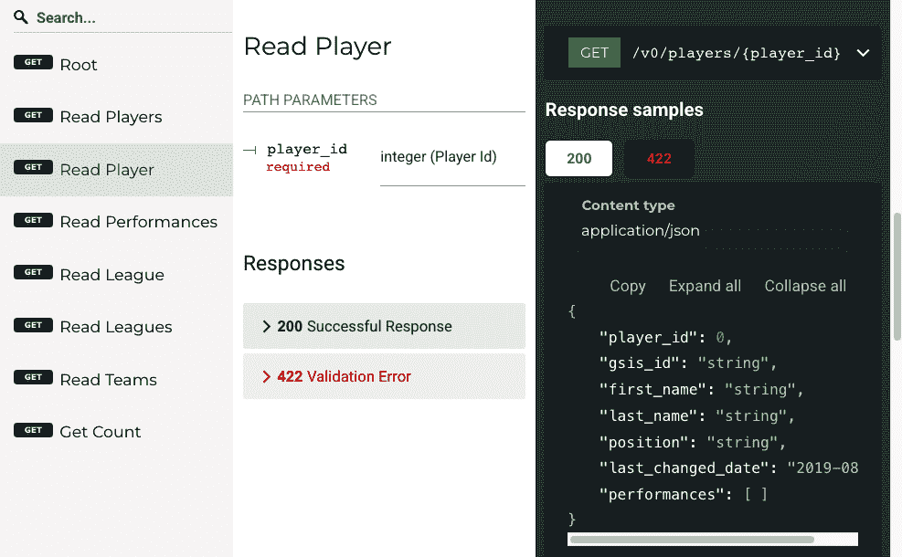

###### 图 5-12\. Redoc 文档页面

如您所见，Redoc 文档具有吸引人的三列布局，左侧导航栏中包含 API 端点，以及搜索功能。中间列包含关于端点的详细信息，包括参数、响应和错误。右侧列显示成功（200）和错误（422）响应的示例响应体。

通常，文档的内容与 Swagger UI 非常相似，因为两者都是从相同的 OAS 文件生成的。这两个包含的文档选项在功能上的最大区别是，FastAPI 中包含的 Redoc 库不提供提交 API 请求的方法。因此，它不是一个交互式选项。

Redoc 相比 Swagger UI 有哪些优势？在我看来，Redoc 的移动浏览器布局比 Swagger UI 更吸引人。虽然我通常不认为移动功能对于像 API 文档这样的技术参考页面很重要，但这可能对某些组织很重要。此外，Redoc 的布局和外观可能更受欢迎。

# 使用您的 OpenAPI 规范文件

虽然这些文档页面相当令人印象深刻，但没有 OAS 文件就毫无价值。这字面意义上是真的，因为 FastAPI 和 Pydantic 在 */openapi.json* 路径生成 OAS 文件，而 Redoc 和 Swagger UI 则从该文件生成其文档。

但 OAS 文件不仅仅是生成文档的一种方式：它是一个强大的 API 定义标准，允许许多其他工具与您的 API 交互。一个快速的例子是，在 第三部分 中，您将创建一个自定义操作，使 ChatGPT 能够使用您的 API 数据来回答问题。它需要哪些信息来完成这个任务？您的 OAS 文件。这只是 OAS 文件用途的一小部分。OpenApi.Tools（https://openapi.tools）网站列出了代码生成器、数据验证器、SDK 生成器、模拟服务器以及使用 OAS 文件的十二类其他工具。

多年来，软件开发行业在竞争的供应商特定 API 规范和响应格式之间分裂。Swagger 规范在 2015 年由 Swagger 开源，2017 年，几家公司和团体在 API 策略和实践会议上联合起来，推广 OAS 作为 REST API 规范的既定标准。（巧合的是，我参加了那次会议，并目睹了事件的发展。）当时，[比尔·多尔夫菲尔德](https://oreil.ly/m6XNK)通过总结说数据格式战争已经结束。您将在第十三章（ch13.html#chapter_13）中了解更多关于多尔夫菲尔德的内容。

[OAS 格式](https://oreil.ly/J9v0i)相当广泛，因此本章将重点介绍在 FastAPI 中实现的项目。要查看您 API 的原始 OAS 文件，请在浏览器中基 URL 的末尾复制并粘贴以下内容：***/openapi.json***。例如，完整的 URL 可能是浏览器中的*[*https://happy-pine-tree-1234-8000.app.github.dev/openapi.json*](https://happy-pine-tree-1234-8000.app.github.dev/openapi.json)*。您应该看到原始的 JSON 文件，它以`{"openapi":"3.1.0","info":{"title":"Fas⁠t​API","version":"0.1.0"},"paths":`开始。

###### 小贴士

OAS 文件定义了一个单一的 API，但 OpenAPI 倡议正在制定一个新的规范，称为[Arazzo](https://oreil.ly/arazzo)，该规范将定义涉及一系列 API 调用的工作流程。该规范的潜在用例之一是帮助基于*大型语言模型*（LLMs）的生成式 AI 应用。有关这些应用的更多信息，请参阅本书的第三部分（part03.html#part_3）。

要理解这个文件的结构，您需要在某个地方查看该文件，以便以更易于阅读的格式格式化 JSON。两种方便的方法是安装一个 JSON 格式化浏览器扩展或在该 IDE 中打开文件。如果您保存文件并在 VS Code 中打开，您可以从上下文菜单中选择“格式化文档”来查看格式化的 JSON。使用浏览器扩展格式化 JSON 有一个优点：当您对 API 进行更改以修改 JSON 文件时，它们可以刷新并查看，而无需您反复下载文件。我通常安装一个浏览器扩展来方便地查看 API 响应。查看*openapi.json*文件的前两级结构：

```py
{
    "openapi": "3.1.0", 
    "info": { 
        "title": "FastAPI",
        "version": "0.1.0"
    },
    "paths": { 
        "/": {},
        "/v0/players/": {},
        "/v0/players/{player_id}": {},
        "/v0/performances/": {},
        "/v0/leagues/{league_id}": {},
        "/v0/leagues/": {},
        "/v0/teams/": {},
        "/v0/counts/": {}
    },
    "components": { 
        "schemas": {
            "Counts": {},
            "HTTPValidationError": {},
            "League": {},
            "Performance": {},
            "Player": {},
            "PlayerBase": {},
            "Team": {},
            "TeamBase": {},
            "ValidationError": {}
        }
    }
}
```

(#co_documenting_your_api_CO1-1)

这是一个包含 OpenAPI 规范版本的`string`。对于您的 API，版本是 3.1.0，该版本于 2021 年发布。

(#co_documenting_your_api_CO1-2)

此字段是一个`Info`对象，它提供了有关 API 的元数据。API 的`title`和`version`是必填字段，并在本例中进行了填充。可选字段包括`summary`、`description`、`termsOfService`、`contact`和`license`。

(#co_documenting_your_api_CO1-3)

此字段包含 `paths` 列表，这些是 API 端点的相对 URL。您可能会注意到，此列表不包含 HTTP 动词，它们构成了 API 端点的另一半。动词和附加细节包含在 `path` 对象的一级之下。


此字段可以包含各种可重复使用的项目，这些项目可以在 OAS 的其它部分引用。在这个例子中，它包含架构，这些是 API 使用的数据结构。

要查看一个 `path` 的详细信息，展开 */v0/players/{player_id}* 项。此 `path` 对象只有一个字段：`get`，它是一个操作对象。展开 `get`，您应该看到以下内容：

```py
"/v0/players/{player_id}": {   
    "get": {
        "summary": "Read Player",
        "operationId": "read_player_v0_players__player_id__get", 
        "parameters": [
            {
                "name": "player_id",
                "in": "path",
                "required": true,
                "schema": {
                    "type": "integer",
                    "title": "Player Id"
                }
            }
        ],
        "responses": {
            "200": {
                "description": "Successful Response",
                "content": {
                    "application/json": {
                        "schema": {
                            "$ref": "#/components/schemas/Player" 
                        }
                    }
                }
            },
            "422": {
                "description": "Validation Error",
                "content": {
                    "application/json": {
                        "schema": {
                            "$ref": "#/components/schemas/HTTPValidationError"
                        }
                    }
                }
            }
        }
    }
},
```


您将认识到这一部分包含在 图 5-9 中显示的 Swagger UI 中的信息。Swagger UI 从 OAS 文件的这一部分生成了它。


这是一个操作标识符。在 Swagger UI 中没有显示，但一些工具在处理 OAS 时会使用它。这对于将处理文件的可生成 AI 应用程序也很有用。


这是 `Components` 部分中定义的 `Player` 架构的引用。这些引用允许在 OAS 中一次定义数据结构，并在文件的其它部分引用它们。

# 继续您的项目组合

虽然在 OAS 文件中生成的默认信息非常强大，但您可以通过更新生成它的 FastAPI 代码来使其更加完整。

表 5-1 总结了您通过修改项目中的 *main.py* 文件对 OAS 文件进行的增强。

表 5-1\. OAS 文件更新

| 更新内容 | *main.py* 中的更改 | 受影响的 OAS 字段 |
| --- | --- | --- |
| 添加 API 标题、版本、描述 | 向 `FastAPI()` 构造函数添加元素 | `info` |
| 添加路径摘要 | 向路径函数装饰器添加参数 | paths |
| 添加详细的路径描述 | 向路径函数装饰器添加参数 | `paths` |
| 向 Swagger UI 中的端点分组添加路径标签 | 向路径函数装饰器添加参数 | `paths` |
| 添加唯一的路径操作 ID | 更新内置的操作 ID | `paths` |
| 为查询参数添加描述 | 更新 FastAPI 函数中的参数 | `parameters` |

## 向 OAS 信息对象添加详细信息

OAS `info` 字段包含有关整个 API 的信息。当前 OAS 文件中的默认信息非常通用。您将添加帮助 API 消费者了解其目的的内容。这涉及到对 `FastAPI()` 构造函数函数的更改。

打开 *main.py* 文件，并对初始应用程序构造函数进行以下更新：

```py
api_description = """ 
This API provides read-only access to info from the SportsWorldCentral
(SWC) Fantasy Football API.
The endpoints are grouped into the following categories:

## Analytics
Get information about the health of the API and counts of leagues, teams,
and players.

## Player
You can get a list of NFL players, or search for an individual player by
player_id.

## Scoring
You can get a list of NFL player performances, including the fantasy points
they scored using SWC league scoring.

## Membership
Get information about all the SWC fantasy football leagues and the teams in them.
"""

#FastAPI constructor with additional details added for OpenAPI Specification
app = FastAPI(
    description=api_description, 
    title="Sports World Central (SWC) Fantasy Football API", 
    version="0.1" 
)
```

注意以下您所做的更改：


第一条新语句是创建 `api_description` 变量，其中包含 API 的描述。三个引号用于包含多行字符串。


您正在将 `api_description` 传递给应用程序构造函数。


您还给了应用程序一个 `标题`。


您还给了应用程序一个 `版本`。注意您正在使用版本 0.1。主版本 0 表示仍然可能发生破坏性更改，并且与 API URL 中的 *V0* 保持一致。我通常用零版本开始所有新的 API 项目。次版本 1 表示这是此 API 的第一个发布版本。

## 为您的路径添加标签以进行分类

现在您将转向每个单独端点的更改，这些更改由 OAS 文件中的 `path` 对象描述。路径的第一个更改是添加 *标签*，这些是通用属性，可用于各种目的。在这种情况下，添加它们的原因是 Swagger UI 使用它们将 API 路径分组在一起。当 API 有几十个端点时，这对消费者来说非常有帮助。为了进行此更改，您将向路径函数装饰器添加另一个元素。

这里是 `@app.get("/v0/players/{player_id}")` 装饰器在 *main.py* 中的更改外观。对此装饰器进行以下更改：

```py
@app.get("/v0/players/{player_id}",
        response_model=schemas.Player,
        tags=["player"]) 
```


此标签将用于将端点分组到类别中。

您已更新了一个端点。现在使用 表 5-2 中的 `tag` 值来更新 *main.py* 中的端点。

表 5-2\. main.py 中端点的标签

| 端点 | 标签 |
| --- | --- |
| */* | `analytics` |
| */v0/players/* | `player` |
| */v0/players/{player_id}* | `player` |
| */v0/performances/* | `scoring` |
| */v0/leagues/* | `membership` |
| */v0/leagues/{league_id}* | `membership` |
| */v0/teams/* | `membership` |
| */v0/counts/* | `analytics` |

## 为单个端点添加更多详细信息

接下来，您将添加有关单个端点的信息。在 OAS 文件中，这些信息包含在 `paths` 字段中。要更新，您将修改每个路径函数装饰器。以下是每个路径将进行的更改：

添加摘要

这总结了路径，并将由 Swagger UI 显示在操作标题上。

添加描述

这提供了关于路径的额外详细信息，并将由 Swagger UI 显示在标题下方。

为 200 响应添加描述

这将替换默认的“成功响应”，并使用更清晰的描述。它将在 HTTP 200 成功消息发生时使用。

修改 `operationID`

这将标准化 `operationID` 值，该值将由使用 OAS 文件的各种工具使用。

下面是*main.py*中`@app.get("/v0/players/{player_id}"`装饰器的更改将看起来如何：

```py
@app.get("/v0/players/{player_id}",
        response_model=schemas.Player,
        summary="Get one player using the Player ID, which is internal to SWC",
        description="If you have an SWC Player ID of a player from another API
        call such as v0_get_players, you can call this API
        using the player ID", 
        response_description="One NFL player", 
        operation_id="v0_get_players_by_player_id", 
        tags=["player"])
```

(#co_documenting_your_api_CO5-1)

改进端点摘要。

(#co_documenting_your_api_CO5-2)

非常详细的描述，以帮助开发人员和 AI 正确使用。

(#co_documenting_your_api_CO5-3)

改进响应描述。请保持描述在 300 个字符以下，以使 ChatGPT 满意。

(#co_documenting_your_api_CO5-4)

自定义操作 ID 以替换自动生成的 ID。

将这些更改应用到*main.py*中的其余端点。

## 添加参数描述

另一项推荐 AI 使用 API 的建议是添加用于调用 API 的参数描述。您将使用`Query()`语句和描述替换参数的默认值。

`read_players`函数位于您更新的装饰器下方。要为参数添加描述，现在更新该函数：

```py
def read_players(skip: int = Query(0, description="The number of items to
skip at the beginning of API call."),
  limit: int = Query(100, description="The number of records to return
  after the skipped records."),
  minimum_last_changed_date: date = Query(None, description="The minimum date of
  change that you want to return records. Exclude any records changed before
  this."),
  first_name: str = Query(None, description="The first name of the players
  to return"),
  last_name: str = Query(None, description="The last name of the players
  to return"),
    db: Session = Depends(get_db)):
```

您已修改了`read_players`函数。更新其余的 API 端点，为所有查询参数添加描述。

## 在 Swagger UI 中查看更改

在对 OAS 文件进行所有这些更改后，Swagger UI 比之前拥有更多信息。打开*/docs*端点，您首先会注意到添加到`info`字段的详细信息在文档顶部突出显示，如图图 5-13 所示。

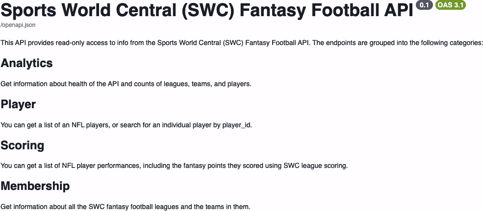

###### 图 5-13\. 更新的 Swagger UI 信息部分

滚动到下方，您将看到`tags`属性和端点`summary`值对 Swagger UI 的影响，如图图 5-14 所示。端点现在按类别排列，并显示其摘要以解释其目的。


###### 图 5-14\. 用于分组端点的标签

###### 注意

在本章中进行的所有更改后，*main.py*文件太长，无法在此显示。您可以在*chapter5/complete*文件夹中查看更新的*main.py*文件。

## 回归测试您的 API

在您的 API 代码中进行了所有这些更改后，您应该进行*回归测试*您的代码，即运行现有测试以确保没有破坏任何内容。回归测试对于您做出的编码更改和更新到您代码中使用的软件库非常有帮助。

在终端窗口中，按 Ctrl-C 停止 API 并显示命令提示符。输入**`pytest test_main.py`**命令，你应该会看到类似以下输出的内容：

```py
$ pytest test_main.py
================== test session starts ===========================
platform linux -- Python 3.10.13, pytest-8.1.2, pluggy-1.5.0
rootdir: /workspaces/portfolio-project/chapter5
plugins: anyio-4.4.0
collected 11 items

collected 11 items

test_main.py                                              [100%]

=================== 11 passed in 1.01s ============================
```

# 更新您的 README.md

通过你对内置 Swagger 文档所做的更新，你正朝着提供良好的开发者体验的道路上迈进。但还有一些 API 文档功能你尚未提供，包括入门指南、服务条款和示例代码。你需要更新你的*README.md*文件来填补文档的空白。

使用以下内容更新*README.md*文件：

```py
# SportsWorldCentral (SWC) Fantasy Football API Documentation

Thanks for using the SportsWorldCentral API. This is your one-stop shop for
accessing data from our fantasy football website, www.sportsworldcentral.com.

## Table of Contents

- Public API
- Getting Started
  - Analytics
  - Player
  - Scoring
  - Membership
- Terms of Service
- Example Code
- Software Development Kit (SDK)

## Public API
*Coming Soon*

We'll be deploying our application soon. Check back for the public API address.

## Getting Started

Since all of the data is public, the SWC API doesn't require any authentication. 
All of the the following data is available using GET endpoints that return 
JSON data.

### Analytics

Get information about the health of the API and counts of leagues, teams, 
and players.

### Player
You can get a list of all NFL players, or search for an individual player 
by player_id.

### Scoring

You can get a list of NFL player performances, including the fantasy points they 
scored using SWC league scoring.

### Membership
Get information about all the SWC fantasy football leagues and the teams in them.

## Terms of Service

By using the API, you agree to the following terms of service:

- **Usage Limits**: You are allowed up to 2000 requests per day. Exceeding this 
                    limit may result in your API key being suspended.
- **No Warranty**: We don't provide any warranty of the API or its operation.

## Example Code

Here is some Python example code for accessing the health check endpoint:

```

import httpx

HEALTH_CHECK_ENDPOINT = "/"

with httpx.Client(base_url=self.swc_base_url) as client:

    response = client.get(self.HEALTH_CHECK_ENDPOINT)

    print(response.json())

```py

## Software Development Kit (SDK)
*Coming Soon*

Check back for the Python SDK for our API.
```

# 其他资源

关于 API 文档和开发者门户在 API 努力中所起的作用的全面讨论，请阅读詹姆斯·希金博瑟姆（James Higginbotham）的《Web API 设计原则：使用 API 和微服务创造价值》第七章（Addison-Wesley，2021 年）。

对于 API 设计概念的简要概述，我推荐布伦达·金（Brenda Jin）、萨乌拉布·沙尼（Saurabh Sahni）和阿米尔·谢瓦特（Amir Shevat）合著的《设计 Web API》（O’Reilly，2018 年）。

[NordicAPIs.com 博客](https://oreil.ly/pyatT)发布了关于[开发者体验](https://oreil.ly/YGseq)和[API 文档](https://oreil.ly/xpcUd)的文章，其中包含大量有用的信息。

关于 DX 指标的信息，请阅读“开发者体验：最重要的指标”（https://oreil.ly/id-00）。

要查看个人发布关于使用未记录 API 的提示或工具的示例，请查看[史蒂文·莫尔斯的博客](https://oreil.ly/stmorse)和[乔伊·格雷科的 Leeger 应用](https://oreil.ly/leeger)。

关于使用 Swagger UI 网站的信息，请查看[Swagger UI 安装说明](https://oreil.ly/cSPsX)。

关于使用 OAS 的建议，请阅读[Speakeasy 的 OpenAPI 指南](https://oreil.ly/beRNI)。

# 摘要

在本章中，你通过提供 API 文档来关注你的消费者：

+   你了解了 FastAPI 提供的内置 API 文档，包括 Swagger UI 和 Redoc。

+   你了解了 FastAPI 生成的 OpenAPI 规范及其对用户的价值。

+   你了解了优秀 API 文档的组成部分。

在第六章中，你将专注于将你的应用程序部署到云端，那里真实世界的消费者可以使用它。
