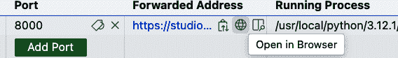
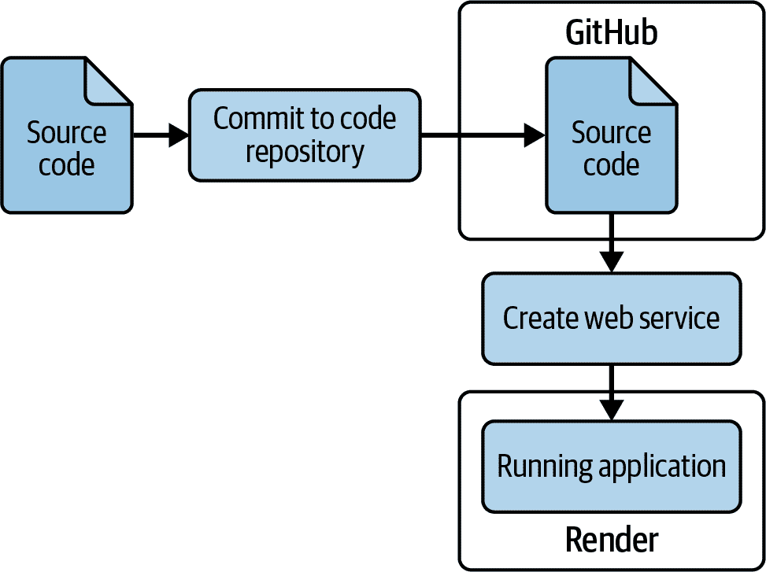
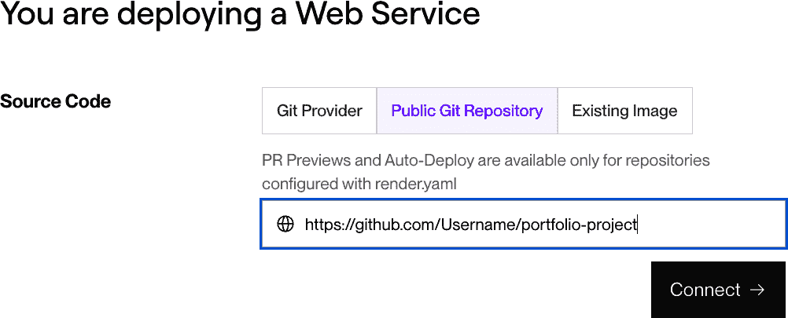
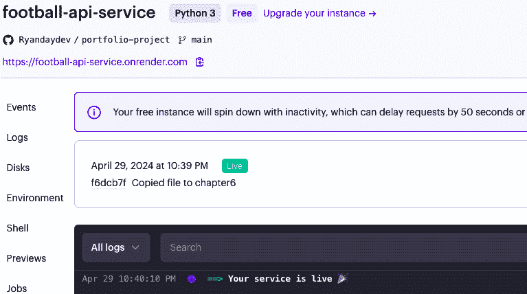
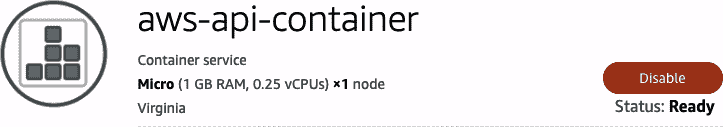
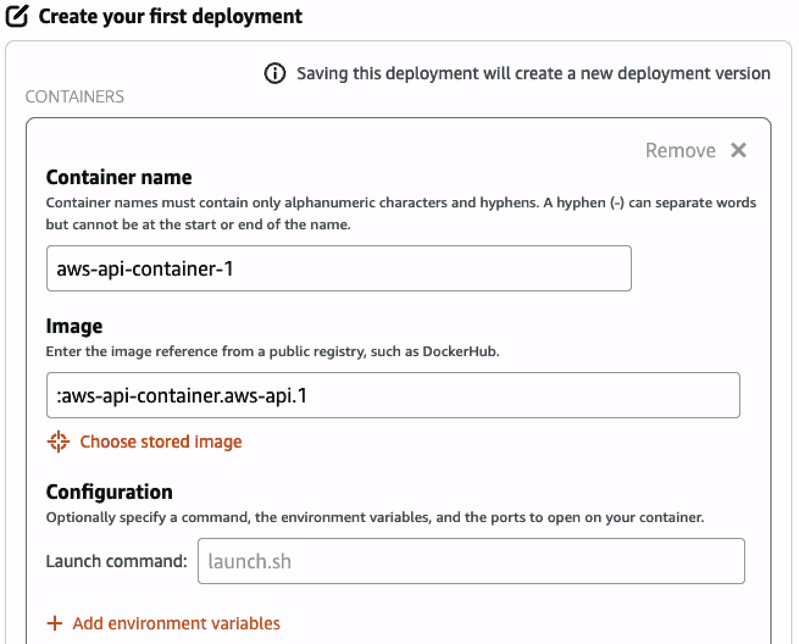
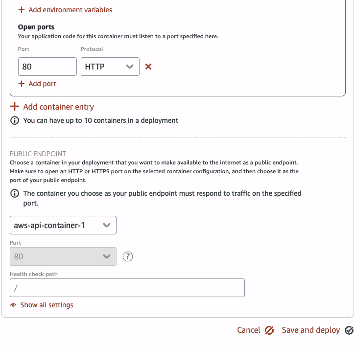
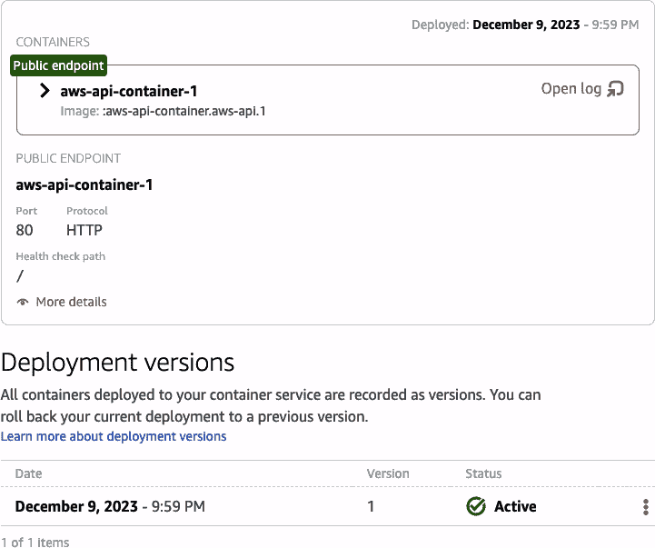

# 第六章\. 将您的 API 部署到云中

> 听起来可能有些极端，但在这个时代，如果你的作品不上线，它就不存在。
> 
> 奥斯汀·克莱恩，《展示你的工作！10 种分享你的创造力和被发现的方法》（Workman，2014）

您在您的第一个 API 上取得了巨大进步。您为您的用户选择了最重要的品质，开发了多个 API 端点，并创建了用户友好的文档。在本章中，您将把您的 API 发布到云中，消费者可以访问它。这是分享您一直在努力工作的另一个机会。

# 云部署的益处和责任

*云*是一个非正式术语，指的是构成公共互联网的计算机服务器和连接基础设施的集合。对于开发人员或数据科学家来说，通过公共云主机部署原型和个人项目是一个很好的方式。在这些服务可用之前，运行副项目的流程是费时的，而且功能相当有限。作为一个简单的例子，在云主机对开发人员可用之前，在服务器上托管您的软件需要购买物理服务器。当您完成项目后，您仍然有那个服务器闲置在那里。有了云，您可以通过几个命令启动一个虚拟服务器，当您完成时，您可以删除它。现在您有了一个绝佳的机会，将您的作品部署到具有所有您能想象（或至少负担得起）的联网和应用程序托管能力的公共云主机上。

## 益处

云平台为本书中的项目提供了几个绝佳的机会：

+   您可以通过您开发的项目学习云开发的端到端流程、部署和运营。

+   您可以将它作为您的作品集项目的一部分与他人分享。这个快速的反馈循环使您能够更快地学习和改进。

+   通过发布的 API，您可以使用面向互联网的工具和产品从用户的角度进行探索。这是本书第二部分的重点。

+   您可以使用生成式 AI 服务来消费 API。这是本书第三部分的重点。

我发现将应用程序部署到网络上，使其以一种在开发环境中运行时不可能实现的方式变得真实。

## 责任

你应该意识到将内容部署到互联网也伴随着一些责任，其中首要的是成本。云服务提供商提供付费服务，并且通常根据托管应用程序的使用量收取可变费用。尽管本章中使用的某些云服务提供商提供免费层服务或入门信用额度，但它们将要求添加借记卡或信用卡到账户中。当你在一个云主机上开发项目时，月底收到几美元的意外账单并不罕见。也有关于人们最终收到数百或数千美元意外账单的恐怖故事。我将分享一些关于成本管理的技巧，但你应该小心不要注册任何你负担不起的服务。（当在本章中部署示例应用程序时，我在所有服务上花费不到 1 美元，将它们托管了几周。但你的费用可能会更高。）

###### 警告

另一个责任是安全性。使用短语“暴露你的 API 端点”可以给你这个责任的提示——当你将你的工作公之于众时，恶意行为者可以访问它。如果你的项目组合包含幻想体育数据，你不会将任何个人信息置于风险之中。然而，如果你对用于连接云服务的凭证粗心大意，你可能会公开用户名、密码和 API 密钥。这可能会让欺诈者使用你的账户进行加密货币挖掘或创建机器人军队来攻击网站。

在使用云主机时，有几种控制成本的方法：

+   在使用服务之前审查其成本。通常，编码项目中涉及多个服务。如果可用，请使用成本计算器。

+   使用提供免费层和免费试用期的服务。

+   制定月度预算并设置电子邮件通知，以便在接近预算金额时通知你。

+   使用完毕后关闭或删除资源。

+   当你完成与云主机的合作后，清理资源并移除你的支付方式。

+   严格控制你的登录凭证。

+   使用短期访问密钥。

+   只激活你正在使用的特定服务的权限，完成后将其禁用。

+   不要将任何凭证提交到源代码控制存储库。

+   如果任何凭证被暴露，请将其停用或删除。如有必要，请联系云主机的支持。

# 为你的项目选择云主机

我已经使用过各种云主机来部署原型和项目组合，它们的性能和定价模式会随时间变化。当我决定使用哪个主机时，我首先决定当时的主要关注点。如果我只是专注于将我的应用程序推向世界，我会选择部署最简单的云主机。如果我想了解特定的云主机或其底层的一些技术服务，我更愿意投入时间（并且通常在托管费用上支付一些费用）来学习该主机的部署过程。当我尝试练习某些部署或操作技术，如持续集成（CI）或容器化时，我会选择支持该特定方法的云主机，并使用它来部署我的应用程序。

本章包括部署到两个云主机的说明，我鼓励您尝试使用它们，以了解每个云主机的优缺点。您将首先使用 Render，它部署起来相对简单。然后，您将安装和配置 Docker 容器化工具，您将使用它来部署到亚马逊网络服务（AWS）。

表 6-1 显示了您在本章中将使用的新工具或服务。

表 6-1\. 本章中使用的新工具或服务

| 软件或服务名称 | 版本 | 用途 |
| --- | --- | --- |
| Amazon Lightsail | NA | AWS 虚拟云服务器 |
| AWS CLI | 2.15 | AWS 服务的命令行界面 |
| Docker | 24.0 | 在容器中打包和运行您的应用程序 |
| Render | NA | 云托管提供商 |

# 设置您的项目目录

要继续在上一章结束的地方继续您的项目，请将目录更改为*chapter6*，然后将上一章的文件复制到其中。以下显示了命令和预期输出：

```py
.../portfolio-project (main) $ cd chapter6
.../chapter6 (main) $ cp ../chapter5/*.py .
.../chapter6 (main) $ cp ../chapter5/fantasy_data.db .
.../chapter6 (main) $ cp ../chapter5/requirements.txt .
.../chapter6 (main) $ cp ../chapter5/readme.md .
.../chapter6 (main) $ ls *.*
crud.py  database.py  fantasy_data.db  main.py  models.py  readme.md
requirements.txt  schemas.py  test_crud.py  test_main.py
```

# 使用 GitHub Codespaces 作为云主机

对于间歇性云托管，GitHub Codespaces 可能足够使用。它仅在您的 Codespace 运行时才可用，但这对于使用外部工具进行测试或与他人共享以供审查可能很有用。

当您第一次在您的 Codespace 中运行 API 时，您将看到一个对话框，显示“您的应用程序正在端口 8000 上运行”，如图图 6-1 所示。点击“公开”。


###### 图 6-1\. 使 API 公开

API 现在在 Codespaces 中运行，并公开了端口。要在浏览器中查看 API，请在终端中点击端口，并将鼠标悬停在如图图 6-2 所示的端口 8000 上。



###### 图 6-2\. 在公开地址上打开 API

点击地球图标，浏览器应打开到您的 API 健康检查端点。如果您查看浏览器中的地址，您应该看到一个以 *app.github.dev* 结尾的基本 URL。浏览器页面应显示在 Codespaces 上运行的您的 API 的响应。您应该在您的网络浏览器中看到以下健康检查消息：

```py
{"message":"API health check successful"}
```

您的 API 正在云中公开运行。

# 部署到 Render

Render 自称为“一个统一的云平台，用于构建和运行所有您的应用程序和网站。”在撰写本文时，Render 的定价计划包括免费的 Python 主机服务，但每月存储费用除外。您将一般遵循 [部署 FastAPI 应用](https://oreil.ly/nmdaK) 的说明。

将应用程序部署到 Render 的过程仅涉及几个步骤，如图 图 6-3 所示。



###### 图 6-3\. 将您的 API 部署到 Render

## 注册 Render

第一步是 [注册 Render 账户](https://oreil.ly/rend)。您可以创建一个新账户或使用现有的服务之一，例如 GitHub 或 Google。两种方式都应相同。当您创建了账户并提供了所需的信息后，您应该看到没有服务的 Render 仪表板。

## 创建新的 Web 服务

从“新建”菜单中选择“Web 服务”。

在“新建 Web 服务”页面，选择“公共 Git 仓库”，输入您的 GitHub 仓库的 URL，如图 图 6-4 所示，然后点击“连接”。



###### 图 6-4\. 选择如何部署 Web 服务

下一个页面应显示“您正在部署 Web 服务”，如图 图 6-5 所示。


###### 图 6-5\. Render Web 服务设置

在此页面上输入以下设置：

+   *名称*：输入一个可用的唯一名称。

+   *项目*：不要创建项目。

+   *语言*：**`Python 3`**

+   *分支*：**`main`**

+   *区域*：选择离您最近的位置。

+   *根目录*：**`chapter6`**

+   *构建命令*：**`pip install -r requirements.txt`**

+   *启动命令*：**`uvicorn main:app --host 0.0.0.0 --port $PORT`**

+   *实例类型*：**`免费`**

注意，启动命令没有使用您在命令行上使用的 `fastapi run`。对于 Web 部署，您直接使用 Uvicorn Web 服务器运行 API，而不使用 fastapi-cli 库。

滚动到页面底部，并选择“部署 Web 服务”。应显示一个包含部署日志的页面。在您观看的过程中，您应该看到云主机从您的 *requirements.txt* 文件中安装软件并启动您的应用程序实例。当过程成功完成时，您应该看到“您的服务已上线”的声明，如图 图 6-6 所示。



###### 图 6-6\. 在 Render 上成功部署

复制窗口顶部附近显示的您的网络服务的 URL。 (在本例中，地址是 *[*https://football-api-service.onrender.com*](https://football-api-service.onrender.com)*)。 将此 URL 粘贴到另一个浏览器窗口中。你应该能看到您的 API 的健康检查信息。如果你访问 */docs* 端点，你可以使用 Swagger UI 检查其他端点是否返回数据。恭喜！你已经将你的 API 部署到了第一个云主机！

###### 小贴士

如果你在部署过程中收到错误，请验证在部署之前你是否已将 第六章 的代码提交到你的仓库。

## 自动部署你的 API 的更改

默认情况下，Render 设置为自动部署你对仓库的 *chapter6* 文件夹中的文件所做的任何更改。通过以下消息修改 *main.py* 中的健康检查端点来测试这一点：

```py
async def root():
    return {"message": "This is an API health check: status successful"}
```

将这些更改提交到你的 GitHub 仓库。

从 [Render 控制台](https://dashboard.render.com) 打开你的网络服务并选择事件。最近的操作应该是一个新的部署。几分钟后，当你通过浏览器访问网络服务时，你应该能看到更新的健康检查文本。

在下一节中，你将配置你的应用程序在 Docker 上运行，这将由 AWS Lightsail 使用。

# 在 Docker 容器中传输你的应用程序

与 Render 从源代码仓库（GitHub）部署你的应用程序不同，AWS 将使用名为 Docker 的应用程序。Docker 是一个非常有用的工具，用于在 *容器* 中传输应用程序。就像货物在运输集装箱中运输一样，应用程序在软件容器中传输。

[Docker 术语表](https://oreil.ly/TyStu) 解释了你将使用的一些关键术语。*Dockerfile* 是“一个包含所有你通常手动执行的命令以构建 Docker 镜像的文本文件。”*容器镜像*，或 Docker 镜像，“是一个有序的根文件系统更改和相应的执行参数的集合，用于在容器运行时中使用。”*仓库*是一组 Docker 镜像。*容器运行时*是使用镜像创建容器的软件，它是容器镜像的运行时实例。你将使用 Docker 作为你的容器运行时。

你将首先学习使用 Docker 在本地运行你的应用程序的过程，然后在此基础上构建知识以部署到 AWS Lightsail。

如果所有这些信息现在还不明白，请不要担心。随着你通过在三个不同的环境中部署应用程序的过程，你将开始看到这些任务的目的。

表 6-2 总结了你将在本章中使用的 Docker 命令。完整的命令列表可在 [Docker 技巧表](https://oreil.ly/Prc1P) 中找到。

表 6-2\. Docker 命令

| 命令 | 目的 |
| --- | --- |
| `docker --version` | 验证已安装的库版本。 |
| `docker build -t` | 从 Dockerfile 构建一个镜像。 |
| `docker images` | 列出您环境中的本地镜像。 |
| `docker run` | 从本地镜像运行容器。 |

## 验证 Docker 安装

如果您使用 GitHub Codespaces，Docker 应已预装。否则，按照 [Get Docker 页面](https://oreil.ly/jUGKm) 上的说明安装适合您开发环境的相应版本。

通过执行命令 **`docker --version`** 来验证 Docker 是否已安装，它应返回版本和构建号，如下所示：

```py
$ docker --version
$ Docker version 24.0.9-1, build 1234
```

您将执行几个相当简单的步骤：

+   创建一个 Dockerfile。

+   从此 Dockerfile 构建容器镜像。

+   基于此镜像运行容器。

让我们开始吧。

## 创建 Dockerfile

*Dockerfile* 包含 Docker 将用于创建容器镜像的指令。请记住，这些语句将在您将启动的 `docker build` 步骤中执行。创建一个名为 *chapter6/Dockerfile* 的文件：

```py
.../chapter6 (main) $ touch Dockerfile
```

使用以下内容更新 *chapter6/Dockerfile*：

```py
# Dockerfile for Chapter 6
# Start with the slim parent image
FROM python:3.10-slim 

# set the Docker working directory
WORKDIR /code 

# copy from the build context directory to the Docker working directory 
COPY requirements.txt /code/ 

# Install the Python libraries listed in the requirements file 
RUN pip3 install --no-cache-dir --upgrade -r requirements.txt 

# Copy the code files and database from the build context directory
COPY *.py /code/ 
COPY *.db /code/

# Launch the Uvicorn web server and run the application
CMD ["uvicorn", "main:app", "--host", "0.0.0.0", "--port", "80"] 
```


这选择 *父镜像*，在本例中是官方 Python 3.10 slim Docker 镜像。此镜像已经包含您运行应用程序所需的大部分内容。这使您能够专注于添加您的代码和任何自定义库。


此语句设置容器镜像内部的工作目录。除非另有指定，否则剩余的命令将在该工作目录中执行。


这将 *requirements.txt* 文件从 *context* 复制到其中，*context* 是您在执行构建语句时指定的位置的文件集。（剧透：在本章中，您将使用 *chapter6* 目录作为上下文，因此上下文包括此文件夹中的所有文件。）


这使用 `pip` 将您的 *requirements.txt* 文件中指定的库安装到 Docker 镜像的新层中。Docker 容器镜像就像一个全新的虚拟服务器：您对其包含的库和版本有完全的控制权，以确保您的应用程序能够正确运行。


这两个语句将您的 Python 程序文件和 SQLite 数据库从上下文目录复制到您的 Docker 工作目录。


在步骤 1 到 5 构建容器镜像之后，此步骤设置默认命令，该命令将在使用 `docker run` 命令从该镜像启动容器时执行。就像你在 Render 部署中所做的那样，你直接调用 Uvicorn 来运行 API。

这些就是您需要定义容器镜像的所有指令。下一步将在您的本地仓库中构建容器镜像。

## 创建一个.dockerignore 文件

就像*.gitignore*排除版本控制中的文件一样，您希望排除目录中的一些文件，使其不在 Docker 镜像中。创建一个名为*.dockerignore*的文件，并包含以下内容：

```py
# This is the .dockerignore file for Chapter 6
.gitignore

README.md

*.DS_Store/

**/__pycache__
```

## 构建容器镜像

要使用此 Dockerfile，请在命令行中输入以下命令：

```py
.../chapter6 (main) $ docker build -t apicontainerimage .
```

这告诉 Docker 使用当前目录中的 Dockerfile 构建一个镜像（`apicontainerimage`）。容器镜像将存储在您的本地 Docker 仓库中。

您应该看到多个步骤正在执行。第一次运行此命令时，这可能需要几分钟。未来的构建将花费更少的时间，因为 Docker 可以缓存未更改的项目。完成时，您应该看到类似以下内容：

```py
[+] Building 12.2s (11/11) FINISHED
 => [internal] load build definition from Dockerfile
 => => transferring dockerfile: 670B
 => [internal] load .dockerignore
 => => transferring context: 92B
 => [internal] load metadata for docker.io/library/python:3.10-slim
 => [1/6] FROM docker.io/library/python:3.10-slim@sha256:xxxx
 => [internal] load build context
 => => transferring context: 217B
 => CACHED [2/6] WORKDIR /code
 => [3/6] COPY requirements.txt .
 => [4/6] RUN pip install --no-cache-dir --upgrade -r requirements.txt
 => [5/6] COPY *.py .
 => [6/6] COPY *.db .
 => exporting to image
 => => exporting layers
 => => writing image sha256:xxxx
 => => naming to docker.io/library/apicontainerimage
```

为了验证镜像创建成功，请输入命令 **`docker images`** 来查看您仓库中的镜像。您应该看到类似以下内容：

```py
.../chapter6 (main) $ docker images
REPOSITORY            TAG       IMAGE ID       CREATED          SIZE
apicontainerimage     latest    x9999        1 minute ago     159MB
```

## 在本地运行容器镜像

您使用`docker run`命令基于此镜像运行一个容器。这里有几个选项需要注意。`--publish 80:80`语句将 Docker 容器内部的端口 80（第二个 80）映射到您的本地环境中的端口 80（第一个 80）。`--name apicontainer1`语句设置了您将要使用的容器的名称。这是一个方便的方式来引用正在运行的容器（Docker 也会分配一个镜像 ID）。最后，`apicontainerimage`传递了您在上一步骤中构建的镜像名称。记住，镜像用于运行容器。

执行以下命令：

```py
.../chapter6 (main) $ docker run --publish 80:80 --name apicontainer1
apicontainerimage+
```

您应该看到以下内容：

```py
INFO:     Started server process [1]
INFO:     Waiting for application startup.
INFO:     Application startup complete.
INFO:     Uvicorn running on http://0.0.0.0:80 (Press CTRL+C to quit)
```

您将看到消息“您的应用程序在端口 80 上运行可用。”选择“在浏览器中打开”以在 Web 浏览器中运行 API。您应该在窗口中看到健康检查消息，这与您从命令行运行 API 时完全一样。

现在，如果您回到终端窗口，您将看到对 API 的第一个请求的日志消息：

```py
INFO:     1.1.0.1:12345 - "GET / HTTP/1.1" 200 OK
```

恭喜！您的应用程序正在由 Docker 在您定义的容器中运行。要停止应用程序，请按 Ctrl-C。

# 部署到 AWS

AWS 部署将利用您创建的 Docker 容器。您将使用 Amazon Lightsail 服务运行您的应用程序，这是 AWS 中启动起来相对简单的服务之一。

首先，[创建一个新的 AWS 账户](https://oreil.ly/09mZ7) 并安全地存储您的登录凭证。对于这个项目，使用*root 用户*账户是可以接受的，它是通过电子邮件地址识别的账户的全权所有者。然而，您应该启用多因素认证（MFA），按照[AWS 身份和访问管理用户指南](https://oreil.ly/N5Q7e)中的说明操作。

如果您继续使用 AWS，一个最佳实践是创建一个单独的管理账户，并使用它进行常规工作，而不是使用 root 用户。

## 创建一个 Lightsail 容器服务

当你登录到 AWS 控制台后，从搜索栏中选择 Lightsail，然后从左侧菜单中选择容器。你应该会看到一个类似于图 6-7 的页面。点击“创建容器服务”。


###### 图 6-7\. Lightsail 的起始页面

你将被要求完成第一个 Lightsail 服务的相关信息：

+   *区域*：选择离你最近的一个区域以获得最佳性能。

+   *功率*：选择 Nano 或 Micro。

+   *规模*：选择 1。

+   *标识你的服务*：为你的容器选择一个名称。本例中使用 `aws-api-container`。

点击“创建容器服务”。创建容器可能需要几分钟时间。完成时，你应该会看到一个状态页面，类似于图 6-8 中的页面。



###### 图 6-8\. Lightsail 容器服务创建完成

## 安装 AWS CLI

为了与 AWS 交互，你将使用 AWS CLI。按照 AWS 的说明[安装或更新 AWS CLI 的最新版本](https://oreil.ly/r8tTp)。

运行以下命令以验证安装：

```py
.../chapter6 (main) $ aws --version
aws-cli/2.15.8 Python/3.11.6 Linux/6.2.0-1018-azure exe/x86_64.ubuntu.20
prompt/off
```

## 安装 Amazon Lightsail 容器服务插件

对于 Lightsail，还需要进行额外的安装。按照[安装 Amazon Lightsail 容器服务插件](https://oreil.ly/xMzkI)的说明进行操作。

## 配置您的登录凭证

为了将 AWS CLI 连接到你的 AWS 账户，你需要配置你的身份验证和访问凭证。有多种方法可以做到这一点，正确设置可能需要一些时间。正如本章多次提到的，你应该非常小心地处理云服务中的凭证，确保它们永远不会被提交到源代码仓库。按照[“AWS CLI 的身份验证和访问凭证”](https://oreil.ly/HAXYD)中的说明来配置你的 AWS CLI。

一旦你完成了配置凭证的说明，请通过输入以下命令来验证它们：

```py
.../chapter6 (main) $ aws sts get-caller-identity
```

你应该会收到以下格式的响应：

```py
{
    "UserId": "99999",
    "Account": "999",
    "Arn": "arn:aws:iam::1234:user/username"
}
```

## 将你的容器镜像推送到 Lightsail

接下来，你将使用 AWS CLI 将容器镜像推送到 Lightsail。如果在执行这些说明时遇到任何问题，可以在[“推送、查看和删除 Lightsail 容器服务的容器镜像”页面](https://oreil.ly/lJ0wX)找到更多信息。

为了验证你的 Docker 镜像是否仍然在你之前章节中构建的本地仓库中，请输入以下命令：

```py
.../chapter6 (main) $ docker images
REPOSITORY           TAG       IMAGE ID       CREATED        SIZE
apicontainerimage    latest    aa0366008bec   2 hours ago   159MB
```

你将从本地的 Docker 仓库推送一个镜像到 Lightsail。花点时间理解你将要填写的一些值：

`区域`

这是你设置 Lightsail 服务的 AWS 区域。

`容器服务名称`

如果你在前面的步骤中正确设置了 Lightsail 服务，这应该是 `aws-api-container`。

`LocalContainerImageName:ImageTag`

这是你的本地存储库中的名称和标签。在前面的示例中，值将是`apicontainerimage:latest`。

在终端中输入以下命令，用括号中的值替换你的信息：

```py
lightsail push-container-image --region <*Region*>
--service-name <*ContainerServiceName*> --label aws-api --image
<*LocalContainerImageName*>:<*ImageTag*>

```

###### 注意

这些命令可能会在这本书中换行，但你将在终端的单行中输入它们。

这里是一个完整填写命令的示例：

```py
.../chapter6 (main) $ aws lightsail push-container-image --region us-west-2
--service-name aws-api-container --label aws-api --image apicontainerimage:latest
```

几分钟后，你应该看到以下内容：

```py
1234: Pushed
12345: Pushed
Digest: sha256:xxxxx
Image "apicontainerimage:latest" registered.
Refer to this image as ":aws-api-container.aws-api.1" in deployments.
```

返回 Lightsail 控制台登录并查看`aws-api-container`上的镜像选项卡。你应该看到类似于图 6-9 的内容。


###### 图 6-9\. Lightsail 存储的镜像页面

## 创建 Lightsail 部署

在`aws-api-container`服务的部署选项卡上，选择“创建你的第一个部署”。输入以下值，如图 6-10 图 6-10 所示：

+   *容器名称*：选择一个唯一的容器名称。此示例使用`aws-api-container-1`。

+   *镜像*：选择之前步骤中推送的存储镜像。



###### 图 6-10\. 部署选项（页面顶部）

点击“+ 添加开放端口”并在端口中输入 80。在公共端点部分，点击下拉框并选择你创建的容器。

在这些步骤之后，完成后的选项应如图 6-11 图 6-11 所示。



###### 图 6-11\. 部署选项（页面底部）

点击“保存并部署”。Lightsail 将开始部署。几分钟后，你应该看到活动状态，如图 6-12 图 6-12 所示。



###### 图 6-12\. Lightsail 部署成功

你的容器将有一个运行状态，并生成一个“公共域”（在图 6-12 中未显示）。这是 API 的基础 URL。为了验证你的 API 正在运行，从“公共域”中复制值并将其粘贴到浏览器栏中。你应该看到你的 API 的健康检查页面。恭喜你，你已经使用 AWS Lightsail 部署了你的 API！

# 更新你的 API 文档

在第五章中，你创建了*README.md*文件作为 API 的文档，但你还没有 API 地址。按照以下方式更新*README.md*文件的公共 API 地址部分，将`[*API URL*]`替换为你的部署应用的地址，无论你在哪里找到它：

```py
## Public API

Our API is hosted at [API URL]/([API URL]/). 

You can access the interactive documentation at [[API URL]/docs]([API URL]/docs).

You can view the OpenAPI Specification (OAS) file at
[[API URL]/openapi.json]([API URL]/openapi.json).
```

# 其他资源

[Docker 网站](https://oreil.ly/6AyzJ)提供了关于 Docker 容器概念的深入探讨。

对于 Python 容器化的最佳实践，请参阅 Snyk.io 的“使用 Docker 容器化 Python 应用程序的最佳实践”。

# 摘要

在本章中，你学习了使用云托管平台部署 API 的好处和责任。你现在有几种不同方式部署应用程序的经验：

+   在本地开发环境或 GitHub Codespaces 环境中

+   在本地开发环境或 GitHub Codespaces 环境中的 Docker 容器内

+   在 Render 云主机上

+   在 AWS 上使用 Amazon Lightsail 和 Docker

在第七章，你将创建一个 SDK，使 Python 开发者更容易使用你的 API。
