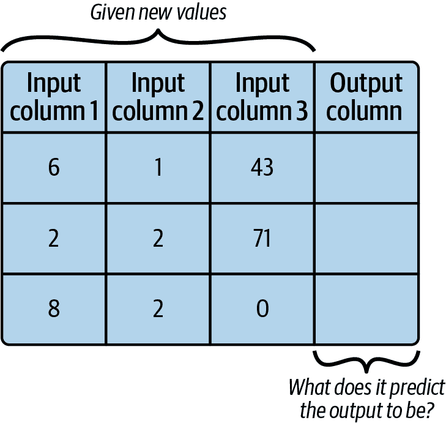
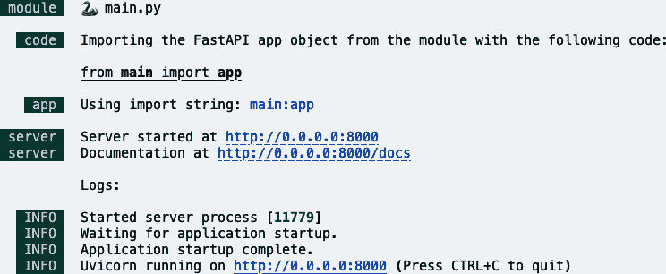
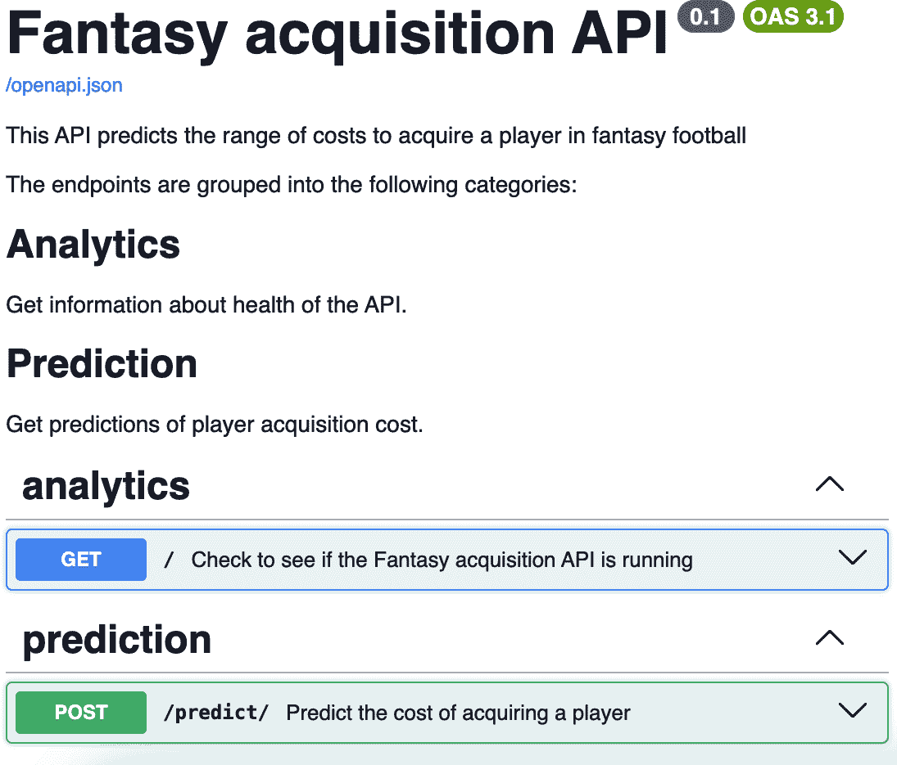
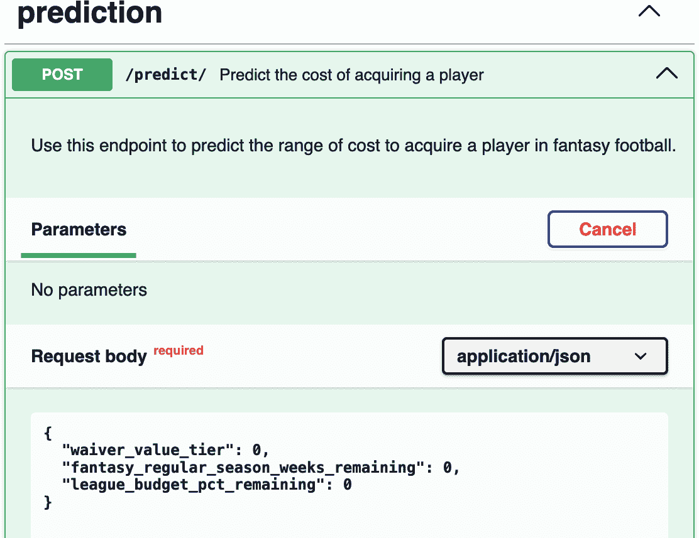
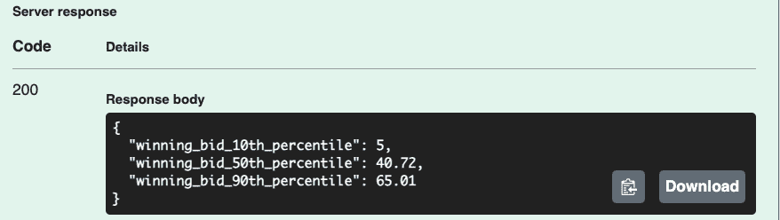

# 第十三章\. 部署机器学习 API

> 未来永远在运动之中。
> 
> 约达，《星球大战》系列电影中的《帝国反击战》

梦幻足球经理们大部分时间都在试图预测未来，并基于这些预测制定策略。在赛季开始之前，经理们想要了解 NFL 球员在即将到来的赛季中的表现，以便他们能组建最佳球队。在他们的梦幻选秀中，经理们想要知道其他经理会挑选哪个球员，以便他们能超越竞争对手。每周，经理们想要知道哪些球员将会得分最多，以便他们能据此调整阵容。

许多梦幻足球网站和平台为这些经理提供预测。平台可用的工具之一是机器学习（ML）模型，你已在第十二章（ch12.html#chapter_12）中了解过。这些平台训练各种模型，并使用它们为经理做出预测，或进行*推理*。如果一个模型一次处理整个预测组，则称为*批量推理*。一些梦幻足球问题适合批量推理，例如一次性做出一周的球员预测。批量推理可以通过预定脚本或作业来完成。但如果预测每分钟都在变化——比如对一场比赛的实时得分预测——则需要实时推理。*实时推理*是指立即调用模型以获取单个预测。这就是将模型作为 API 部署最有价值的地方。

在本章中，你将创建一个机器学习模型，并通过 API 部署它以进行实时推理。随着你通过本章，以下是一些你将遇到的术语：

分类

一种预测值将落入哪个类别的模型类型。例如，分类模型可能会预测一名球员是否会被选中或未被选中。执行分类的模型被称为*分类器*。

决策树

一种创建递归树结构以执行分类或回归的机器学习算法类型。

评估模型

将模型的预测与测试数据比较，以查看其预测过去事件的能力如何。

梯度提升

一种将多个模型结合在一起以创建比单个模型更有效的模型的机器学习技术。

回归

一种预测连续数值的模型类型。例如，回归模型可能会预测一名球员将得多少分。执行回归的模型被称为*回归器*。

训练模型

使用历史数据的训练部分来创建一个可以基于新数据进行推理的模型。

# 训练机器学习模型

*监督学习*是通过处理已知预期值的现有数据来创建模型的方法。例如，一个金融欺诈检测模型可能通过处理大量已被*标记*或分类为欺诈或非欺诈的银行交易来训练。通过这个过程，模型可以识别出未来可能存在欺诈的记录。通过这种监督学习方法，可以创建出可以针对各种数据格式进行预测的机器学习模型，包括表格数据、图像、音频文件等。

图 13-1 展示了这种类型的训练。


###### 图 13-1\. 机器学习训练模型

该图显示了一组历史数据行。在这种情况下，机器学习模型的目的是预测输出列的未来值。训练过程将涉及使用软件读取历史数据中的输入列，并寻找它们与输出列之间关系的模式。

当模型训练完成后，它可以用来读取新数据行中的输入列，并预测输出列的值。这是*推理*过程，如图 13-2 所示。



###### 图 13-2\. 机器学习推理模型

本章节中你将创建的是一个监督学习机器学习模型。

# 本章节中使用的新的软件

表 13-1 列出了你将在本章节开始使用的几个新的软件组件。

表 13-1\. 本章节使用的软件

| 软件名称 | 用途 |
| --- | --- |
| ONNX Runtime | 一个跨平台的工具，用于使用来自各种不同框架的模型。 |
| scikit-learn | 一个用于训练模型的机器学习框架。你将使用这个库中的`GradientBoostingRegressor`。 |
| sklearn-onnx | 一个将 scikit-learn 模型转换为 ONNX 格式的库。 |

## ONNX Runtime

开放神经网络交换（ONNX）是机器学习模型的一个开放标准。由于制作机器学习模型使用了各种各样的编程语言和库，因此部署和运行多个不同的模型可能会很复杂。ONNX 是一个标准格式，不同编程语言和不同框架的模型可以转换为这种格式并以标准方式运行。

这使得更大的互操作性成为可能，因为当不同编程语言和框架的模型转换为 ONNX 格式后，它们可以更容易地使用标准的 ONNX Runtime 进行部署。ONNX Runtime 还包括可以提升模型推理性能的加速功能。

在你使用 scikit-learn 开发完模型后，你将将其转换为 ONNX 格式，然后在你的 API 中使用[ONNX Runtime](https://oreil.ly/IGEBD)进行预测（推理）。

## scikit-learn

scikit-learn 库是一个 Python 框架，允许你创建用于分类、回归、聚类和其他各种任务的模型。这是 Python 中更受欢迎的 ML 库之一，与 PyTorch、TensorFlow 和 XGBoost 并列。

## sklearn-onnx

由于你使用 scikit-learn 创建模型，因此你将使用 sklearn-onnx 库将你的模型转换为 ONNX 格式。这将是模型训练过程的最后一步。

# 在你的 Codespace 中安装新库

打开你在第十二章中创建的第三部分 GitHub Codespace。为了安装本章所需的库，创建一个名为 *chapter13/requirements.txt* 的文件：

```py
.../ai-project (main) $ cd chapter13
.../chapter13 (main) $ touch requirements.txt
```

将以下内容更新到 *chapter13/requirements.txt*：

```py
#model training
scikit-learn 
numpy 
pandas 
skl2onnx 
pydantic>=2.4.0
fastapi[standard]>=0.115.0
uvicorn>=0.23.0 
onnxruntime 
```


将使用 scikit-learn 库创建 ML 模型。


numpy 库将用于格式化数字。


pandas 库将用于处理输入数据文件。


将使用 skl2onnx 库将 scikit-learn 模型保存为 ONNX 格式。


Uvicorn 是用于托管 FastAPI 的 Web 服务器。


onnxruntime 库用于使用保存的 ONNX 模型文件进行推理。

执行以下命令以在你的 Codespace 中安装新库：

```py
.../chapter13 (main) $ pip3 install -r requirements.txt
```

你应该看到一个消息，表明这些库已成功安装。

# 使用 CRISP-DM 流程

ML 项目有许多步骤，需要具有大量专业技能的人员。组织 ML 建模项目的一个有用方法是跨行业数据挖掘标准流程（Shearer，2000）。这个模型在数据科学社区中得到广泛应用。

以下是对 CRISP-DM 中各阶段定义的说明：

业务理解

在这个阶段，团队将确定业务目标并评估可用的工具和技术。

数据理解

收集可用于解决问题、探索和验证数据质量的数据。

数据准备

在这个阶段，数据科学家会选择特定的数据元素用于使用，格式化它们，并与任何需要的额外来源合并。

建模

选择建模技术并构建一个回答你业务问题的模型。

评估

审查模型解决问题的能力及其投入生产的准备情况。

部署

模型被部署在客户可以消费的环境中。监控和维护模型。

在继续本章内容的过程中，你将遵循此流程。主要关注部署阶段，因此我将只简要介绍其他阶段的一些内容。

# 业务理解

过程的第一阶段是建立对您试图解决的问题的商业理解。您正在创建一个模型来服务于在联盟中拥有自己球队的幻想足球经理。他们在每个赛季每周需要回答的问题是“在转会中收购这位球员需要花费多少？”

幻想经理可以通过 *waiver request* 将新球员添加到他们的阵容中。在许多联盟中，进行一次盲拍竞标来决定谁可以得到最好的可用球员。经理决定他们想要竞标的球员，并放入他们想要花费的金额，这个金额对其他经理是隐藏的。当每周的二或三号处理竞标时，最高出价者以全价获得球员。出价较低的竞标者将错过（但也不会损失他们的钱）。

每位经理都有一定数量的资金可以在赛季中使用，例如 $100。这些不是现实世界的美元，而是幻想美元。这有时被称为*自由球员收购预算*（FAAB）。经理希望出价足够高以赢得竞标，但不要超支。最佳情况是在较低的金额下赢得竞标——得到一笔划算的交易。

为了帮助经理出价足够高以赢得他们想要的球员而不超支，您将给经理一个预测范围：低端成本（第 10 个百分位数）、中端成本（第 50 个百分位数）和高端成本（第 90 个百分位数）。

# 数据理解

在这个阶段，您将收集和探索您项目可用的数据。在项目存储库中，您将找到文件 *player_training_data_full.csv*。它包含以下列的历史幻想足球交易数据：

剩余的幻想常规赛周数

剩余的常规赛周数有多少。例如，在一个 14 周赛季的第 2 周，这将占 12 周。

剩余的联盟预算百分比

总可用美元在联盟中的百分比。例如，如果联盟原始的 $1,200 中还剩下 $900，这将占 75%。

球员赛季编号

该球员在联盟中的赛季数。新秀的价值为 1。

位置

被收购的球员的幻想足球位置。

转会价值等级

评估单个球员价值的定性指标。每周，一些球员是“顶级”的选秀目标，他们将得到 1 分。没有什么特别的球员将得到 5 分。这是一个分类特征，因为将球员放入等级是定性判断。（您可以从幻想网站上获取这些信息或自行分配。）

要开始审查数据和选择你想要在模型中使用的数据字段，请在终端窗口中运行以下命令以创建一个 Jupyter Notebook：

```py
.../ai-project (main) $ cd chapter13
.../chapter13 (main) $ touch player_acquisition_model.ipynb
```

打开 *player_acquisition_model.ipynb* 文件。正如您在 第九章 中所做的那样，选择 Python 内核并启用 Python 和 Jupyter 扩展，然后选择推荐的 Python 环境。

在 Markdown 单元格中输入以下标题并运行它：

```py
# Player Acquisition Models
*This notebook is used to train a machine learning model using scikit-learn
and save it in ONNX format.*
```

现在，你将导入所需的 Python 库。创建并运行以下 Markdown 单元格：

```py
## Library imports
```

添加并运行一个新的 Python 单元格，以下代码：

```py
import logging
import numpy as np
import pandas as pd
from sklearn.model_selection import train_test_split 
from sklearn.ensemble import GradientBoostingRegressor 

from skl2onnx import to_onnx
import onnxruntime as rt
```

(#co_deploying_a_machine_learning_api_CO2-1)

这个函数用于将数据文件分割成训练集和测试集。

(#co_deploying_a_machine_learning_api_CO2-2)

你的模型将使用`GradientBoostingRegressor`算法。

添加另一个 Markdown 单元格，内容如下：

```py
## Configure logging
```

添加并运行以下 Python 代码单元格：

```py
for handler in logging.root.handlers[:]: 
    logging.root.removeHandler(handler)

logging.basicConfig(
    filename='player_acquisition_notebook.log',
    level=logging.INFO,  
)
```

(#co_deploying_a_machine_learning_api_CO3-1)

这条语句移除了 CodeSpaces 配置的任何现有日志处理程序。

(#co_deploying_a_machine_learning_api_CO3-2)

这将设置日志级别以记录到日志中。

要开始加载你的训练数据，添加另一个 Markdown 单元格，内容如下：

```py
## Load data
```

添加并运行以下 Python 代码单元格：

```py
dataset=pd.read_csv("player_training_data_full.csv")
```

# 数据准备

接下来，你将选择要包含在模型中的数据。而不仅仅是尝试所有可能的变量，你应该考虑每个变量为何或为何理论会为你的模型做出贡献。以下是你将包含的三列，以及每列背后的理论：

联盟预算剩余百分比

你的直觉是剩余预算越高，出价就越高。这会使它成为一个*线性*特征，其中输出变量会以一致的速度随着该值的变化而上升或下降。

剩余的梦幻赛季周数

这里的理论是球员在不同赛季阶段的花费更高。这可能不是一个严格的线性值。历史表明，一些最高的出价出现在赛季初，当时首发阵容被公布，但其他高峰出价发生在赛季中受伤球员和赛季结束时经理们有“用或失”的情况。

免签价值层级

从高层次来看，这是简单的：价值更高的球员花费更多。但多高？每个层级又是如何受影响的？这些问题更为复杂，你希望模型能够在训练数据中检测到。

# 建模

现在，你将开始建模阶段，首先选择用于模型的算法和机器学习框架。这个决定是技术限制和建模因素的组合。

你的技术限制是想要使用 Python 框架，并且想要将模型转换为 ONNX 格式进行推理。你还想要预测第 10、50 和 90 百分位数，因此你需要使用满足这些技术标准的算法。

需要考虑的两个建模因素是输出类型和选定的特征。你的输出将是数值美元值，因此你将使用回归模型（回归器）。如果你的输入特征都是线性的（随着输入的增加或减少，预测也增加或减少），你可以使用线性回归器。但你的选定特征包括预算剩余（一个线性特征）、价值层级（一个分类特征）和剩余周数（一个稍微复杂一些的特征）。由于这些特征的复杂性，某种类型的决策树回归器更为合适。

根据这些技术和建模因素，你将使用 scikit-learn 中的 `GradientBoostingRegressor` 算法。梯度提升算法是将多个决策树组合成一个集成模型的方法，该模型比单独使用单个决策树更具预测性。它还支持你想要使用的按百分位数进行的多次预测。此算法还支持你将模型保存为 ONNX 格式。

要开始建模过程，你首先将数据分成多个变量用于训练（80% 的行）和测试（20% 的行）。存在变量命名的惯例，你将遵循这些惯例，以便其他数据科学家能理解你的代码。表 13-2 解释了这些变量名的作用。

表 13-2\. 训练模型的常规变量名

| 变量名 | 目的 | 包含的列 | 包含的数据 |
| --- | --- | --- | --- |
| X (大写) | 全数据的输入列 | 输入 | 所有 |
| y (小写) | 全数据的输出列 | 输出 | 所有 |
| X_train | 训练数据的输入列 | 输入 | 训练数据（80%） |
| y_train | 训练数据的输出列 | 输出 | 训练数据（80%） |
| X_test | 测试数据的输入列 | 输入 | 测试数据（20%） |
| y_test | 测试数据的输出列 | 输出 | 测试数据（20%） |

添加另一个包含以下文本的 Markdown 单元：

```py
## Prepare and split data
```

添加并运行以下 Python 代码单元：

```py
X = dataset[['waiver_value_tier','fantasy_regular_season_weeks_remaining',
            'league_budget_pct_remaining']] 
y = dataset['winning_bid_dollars'] 
X_train, X_test, y_train, y_test = train_test_split(X, 
                                                    y,
                                                    test_size = 0.20, 
                                                    random_state = 0) 
```


你正在选择 X 的三个输入列。


创建 y 时，你只包括输出列。


`train_test_split` 函数读取 X 和 y 变量，然后输出 表 13-2 中解释的变量。


此参数确定测试集中将有 20% 的数据，而训练集中将有 80% 的数据。


如果你每次调用此方法时都使用相同的 `random_state` 值，你将在训练和测试变量中获得相同的行。

现在你已经分割了数据，你准备好构建模型了。因为你想要给出一系列预测，所以你会创建三个独立的模型。当你创建 API 时，你将把这些模型的预测结果合并成一个单独的 API 调用。

训练你的模型的流程被称为*拟合*，其中库会取一个通用算法并将其*拟合*或应用到你的训练数据上，以创建一个专门的模型。

添加另一个 Markdown 单元格，内容如下：

```py
## Creating and fitting models
```

添加并运行一个 Python 代码单元格，内容如下：

```py
model_10th_percentile = GradientBoostingRegressor(loss="quantile", alpha=0.1) 
model_50th_percentile = GradientBoostingRegressor(loss="quantile", alpha=0.5)
model_90th_percentile = GradientBoostingRegressor(loss="quantile", alpha=0.9)

model_10th_percentile.fit(X_train, y_train) 
model_50th_percentile.fit(X_train, y_train)
model_90th_percentile.fit(X_train, y_train)
```


这个命令创建一个`GradientBoostingRegressor`模型，试图预测第 10 百分位数的值。在这种情况下，这意味着一个金额将小于 90%的出价。接下来的两个语句与此类似，只是有不同的百分位数。


这个语句使用`fit()`方法准备这个模型，使其能够根据你提供的训练数据进行预测。接下来的两行对其他两个模型做同样的操作。

在这一点上，你的模型处于 scikit_learn 格式，并且仅在此 Jupyter Notebook 中可用。为了准备这些模型以进行部署并使它们更跨平台兼容，你将使用 ONNX 格式保存你的模型。在这样做之前，你需要将 X 变量中的特征合并到转换器所需的二维数组格式中。添加另一个 Markdown 单元格，内容如下：

```py
## Convert and save these models in ONNX format
```

添加并运行一个 Python 代码单元格，内容如下：

```py
X_array = np.column_stack((X['waiver_value_tier'],  
                           X['fantasy_regular_season_weeks_remaining'],
                           X['league_budget_pct_remaining']))

onx = to_onnx(model_10th_percentile, X_array[:1]) 
with open("acquisition_model_10.onnx", "wb") as f:
    f.write(onx.SerializeToString())

onx = to_onnx(model_50th_percentile, X_array[:1])
with open("acquisition_model_50.onnx", "wb") as f:
    f.write(onx.SerializeToString())

onx = to_onnx(model_90th_percentile, X_array[:1])
with open("acquisition_model_90.onnx", "wb") as f:
    f.write(onx.SerializeToString())
```


这个语句将 X 变量中的特征合并到转换器所需的二维数组格式中。


这个语句将第一个模型转换为 ONNX 格式。它通过读取包含元素名称的`X_array`的第一行来设置模型中输入和输出属性的名字。


这个语句在本地文件系统中创建一个文件，并将模型以 ONNX 格式保存。

# 评估

规划和训练模型是一个迭代的过程，所以这个阶段的模型可能需要改进。在一个完整的项目中，你会使用正式的度量标准（如准确性、公平性等）来迭代评估模型，以使模型适合生产。在那个阶段，你可能会决定尝试不同的特征组合，并以不同的方式调整你的模型。

由于本章的重点是部署模型，你将不会执行这些步骤。有关模型评估的更多信息，请阅读 Chip Huyen 所著的《设计机器学习系统》（O’Reilly，2022 年）。

# 部署

你现在可以部署模型进行实时推理，一个 API 调用就可以返回结合了所有三个模型的预测。

图 13-3 展示了创建此 API 所使用的组件。如果您将其与本书第一部分的 API 组件进行比较，您将看到许多相似之处。FastAPI 仍然用作控制器，Pydantic 仍然用于数据传输和数据验证。然而，与第一部分的 API 从数据库中检索数据不同，此 API 将使用 ONNX Runtime 从您训练并保存的模型中进行推理。


###### 图 13-3\. 模型服务 API 组件

首先，创建一个名为 *schemas.py* 的 Pydantic 文件来定义 API 的输入和输出。FastAPI 将使用这些模式生成 OAS 文件：

```py
.../chapter13 (main) $ touch schemas.py
```

将以下内容添加到此文件中：

```py
"""Pydantic schemas"""
from pydantic import BaseModel 

class FantasyAcquisitionFeatures(BaseModel): 
    waiver_value_tier: int
    fantasy_regular_season_weeks_remaining: int
    league_budget_pct_remaining: int

class PredictionOutput(BaseModel): 
    winning_bid_10th_percentile: float
    winning_bid_50th_percentile: float
    winning_bid_90th_percentile: float
```

(#co_deploying_a_machine_learning_api_CO7-1)

Pydantic 库包含一个包含验证逻辑的 `BaseModel` 对象。

(#co_deploying_a_machine_learning_api_CO7-2)

此类定义了用户将发送以从模型获取预测的输入值。

(#co_deploying_a_machine_learning_api_CO7-3)

此类定义了模型将返回的输出。它包含三个值——来自您在上一节中训练的每个模型的值。

接下来，创建 *main.py* 文件，其中将包含 API 的其余代码：

```py
.../chapter13 (main) $ touch main.py
```

在此文件的顶部，添加导入和 API 描述。这些将在 OAS 文件中使用，然后显示在 FastAPI 生成的 Swagger UI 文档中。添加以下 Python 代码：

```py
"""Fantasy acquisition API"""

from fastapi import FastAPI
import onnxruntime as rt 
import numpy as np
from schemas import FantasyAcquisitionFeatures, PredictionOutput  

api_description = """
This API predicts the range of costs to acquire a player in fantasy football

The endpoints are grouped into the following categories:

## Analytics
Get information about health of the API.

## Prediction
Get predictions of player acquisition cost.
"""
```

(#co_deploying_a_machine_learning_api_CO8-1)

此库用于从文件中加载模型并在 API 中提供推理服务。

(#co_deploying_a_machine_learning_api_CO8-2)

此处导入 Pydantic 模式，这些模式将用于定义 API 的输入和输出。

接下来，您将添加使用 ONNX Runtime 为三个模型中的每一个加载推理会话对象的代码。然后，这些会话用于获取此模型所需的输入和输出标签。您在 scikit-learn 中创建模型时定义了三个期望的输入和一个输出，然后将它转换为 ONNX 格式。

将以下代码添加到 *main.py* 文件的底部：

```py
# Load the ONNX model
sess_10 = rt.InferenceSession("acquisition_model_10.onnx",
                             providers=["CPUExecutionProvider"]) 
sess_50 = rt.InferenceSession("acquisition_model_50.onnx",
                             providers=["CPUExecutionProvider"])
sess_90 = rt.InferenceSession("acquisition_model_90.onnx",
                             providers=["CPUExecutionProvider"])

# Get the input and output names of the model
input_name_10 = sess_10.get_inputs()[0].name 
label_name_10 = sess_10.get_outputs()[0].name 
input_name_50 = sess_50.get_inputs()[0].name
label_name_50 = sess_50.get_outputs()[0].name
input_name_90 = sess_90.get_inputs()[0].name
label_name_90 = sess_90.get_outputs()[0].name
```

(#co_deploying_a_machine_learning_api_CO9-1)

此处从文件中加载第一个 ONNX 模型并创建一个会话对象，该对象可用于进行推理。接下来的两行对其他模型文件执行相同的操作。

(#co_deploying_a_machine_learning_api_CO9-2)

此语句从会话对象中获取输入特征名称。这些将在进行推理时使用。

(#co_deploying_a_machine_learning_api_CO9-3)

此语句从会话对象中获取输出特征名称。这些将在进行推理时使用。

由于你将此代码放置在函数定义之外，它将在 API 启动时运行一次。

如果你在第一部分创建了 API，那么接下来的 FastAPI 代码段将对你来说很熟悉。第一条语句使用你之前添加的 API 描述创建 FastAPI `app` 对象。然后，`@app.get()` 方法创建健康检查。这是一个有用的最佳实践，允许用户在执行其他 API 调用之前检查 API 的状态。

将以下代码添加到 *main.py* 文件的底部：

```py
app = FastAPI( 
    description=api_description,
    title="Fantasy acquisition API",
    version="0.1",
)

@app.get( 
    "/",
    summary="Check to see if the Fantasy acquisition API is running",
    description="""Use this endpoint to check if the API is running. You can 
    also check it first before making other calls to be sure it's running.""",
    response_description="A JSON record with a message in it. If the API is
    running the message will say successful.",
    operation_id="v0_health_check",
    tags=["analytics"],
)
def root(): 
    return {"message": "API health check successful"} 
```

[#co_deploying_a_machine_learning_api_CO10-1]

这使用之前定义的 `api_description` 创建主要的 FastAPI `app` 对象。

[#co_deploying_a_machine_learning_api_CO10-2]

这是定义根地址的 `GET` 端点的 FastAPI 装饰器。

[#co_deploying_a_machine_learning_api_CO10-3]

这是当调用此端点时将执行的函数。它返回一个单独的 Python 语句以表明 API 正在运行。

剩余的代码定义了提供用户预测功能的 API 端点。它以一个 Python 装饰器开始，该装饰器提供最终将出现在 OAS 文件（和文档）中的信息。然后，它有 `predict()` 方法，该方法使用 ONNX Runtime 调用每个模型并将它们的输出放入 API 响应中。

将以下代码添加到 *main.py* 文件的底部：

```py
# Define the prediction route
@app.post("/predict/",  
          response_model=PredictionOutput,
          summary="Predict the cost of acquiring a player",
          description="""Use this endpoint to predict the range of cost to 
          acquire a player in fantasy football.""",
          response_description="""A JSON record three predicted amounts. 
          Together they give a possible range of acquisition costs for a 
          player.""",
          operation_id="v0_predict",
          tags=["prediction"],
)
def predict(features: FantasyAcquisitionFeatures): 
   # Convert Pydantic model to NumPy array
   input_data = np.array([features.waiver_value_tier, ![4
                           features.fantasy_regular_season_weeks_remaining,
                           features.league_budget_pct_remaining]],
                           dtype=np.int64)

    pred_onx_10 = sess_10.run([label_name_10], {input_name_10: input_data})[0] 
    pred_onx_50 = sess_50.run([label_name_50], {input_name_50: input_data})[0]
    pred_onx_90 = sess_90.run([label_name_90], {input_name_90: input_data})[0]

    # Return prediction as a Pydantic response model
   return PredictionOutput(winning_bid_10th_percentile=round(
                               float(pred_onx_10[0]),2), 
                           winning_bid_50th_percentile=round(
                               float(pred_onx_50[0]),2),
                           winning_bid_90th_percentile=round(
                               float(pred_onx_90[0]), 2))
```

[#co_deploying_a_machine_learning_api_CO11-1]

这个装饰器在 */predict* 地址创建一个 `POST` 端点。它将用于执行推理。

[#co_deploying_a_machine_learning_api_CO11-2]

`ResponseModel` 语句由 FastAPI 用于定义此端点的返回类型。这将用于生成 OAS 文件。

[#co_deploying_a_machine_learning_api_CO11-3]

这是将在该端点调用的函数。

[#co_deploying_a_machine_learning_api_CO11-4]

这条语句将输入变量重新格式化为 NumPy 数组，这是 ONNX Runtime 调用模型所期望的。

[#co_deploying_a_machine_learning_api_CO11-5]

这条语句调用 ONNX Runtime 并使用 API 调用的输入获取第 10 百分位模型的推理。接下来的两个语句使用相同的输入调用其他两个模型。

[#co_deploying_a_machine_learning_api_CO11-6]

这条语句创建一个包含推理值的 `PredictionOutput` 对象，并在 API 调用中返回它。为了展示，它将值四舍五入到两位小数。

在完成所有 API 代码后，你就可以运行 API 并测试 ML 模型了。从命令行输入以下命令：

```py
.../chapter13 (main) $ fastapi run main.py
```

你将看到应用程序启动，如图 13-4 所示。



###### 图 13-4\. ML 模型 API 运行

在 Codespaces 中，你也会看到一个如图 13-5 所示的弹出窗口。


###### 图 13-5\. Codespaces 浏览器窗口弹出

点击“在浏览器中打开”以在您的 Codespaces 之外打开一个浏览器标签页。此浏览器将显示一个以*app.github.dev*结尾的基本 URL，其中包含在 Codespaces 上运行的 API 的响应。你应该在你的网页浏览器中看到以下健康检查消息：

```py
{"message":"API health check successful"}
```

这确认了您的 API 正在运行。要查看 API 的交互式 API 文档，请在浏览器中基本 URL 的末尾复制并粘贴以下内容：**`/docs`**。例如，完整的 URL 可能是浏览器中的*[*https://happy-pine-tree-1234-8000.app.github.dev/docs*](https://happy-pine-tree-1234-8000.app.github.dev/docs)。你应该会看到如图 13-6 所示的文档。



###### 图 13-6\. ML API 文档

要调用 ML API，选择`POST` */predict/* 端点以打开该部分，然后选择“尝试”，之后你应该会看到一个如图 13-7 所示的显示。



###### 图 13-7\. 尝试/predict

与第一部分中创建的 API 相比，这里有一个很大的不同：你使用的是`POST`端点而不是`GET`。要调用`POST`端点，你需要提供一个 JSON 格式的 HTTP 请求体。这是用户提供要发送到 API 的输入值的地方。这些值是根据你在上一节中定义的`FantasyAcquisitionFeatures` Pydantic 类自动生成的。使用以下值更新请求体：

```py
{
  "waiver_value_tier": 1,
  "fantasy_regular_season_weeks_remaining": 12,
  "league_budget_pct_remaining": 88
}
```

点击“执行”以将这些值发送到 API。向下滚动，你应该会看到一个服务器响应，其代码值为 200，这表示成功。预测值将在 HTTP 响应体中返回，这与`PredictionOutput` Pydantic 类的定义相匹配。你应该会看到一个类似于图 13-8 的输出，尽管预测值可能不同。



###### 图 13-8\. API 预测响应

要查看项目的最终结构，执行以下`tree`命令：

```py
.../chapter13 (main) $ tree --prune -I 'build|*.egg-info|__pycache__'
.
├── acquisition_model_10.onnx
├── acquisition_model_50.onnx
├── acquisition_model_90.onnx
├── main.py
├── player_acquisition_model.ipynb
├── player_acquisition_notebook.log
├── player_training_data_full.csv
├── requirements.txt
└── schemas.py

0 directories, 9 files
```

恭喜！你已经创建了机器学习模型的第一稿，并通过 REST API 提供服务。

# 其他资源

要了解更多关于数据科学项目的信息，请阅读 Nathan George（Packt Publishing，2021 年）所著的《Python 实用数据科学》。

要获得更多使用 scikit-learn 和其他机器学习库的经验，请阅读 Aurélien Géron（O’Reilly，2022 年）所著的《使用 Scikit-Learn、Keras 和 Tensorflow 动手机器学习》。

要了解更多关于部署预测模型的信息，请阅读 Chip Huyen（O’Reilly，2022 年）所著的《设计机器学习系统》。

# 摘要

在本章中，你学习了机器学习生命周期，并使用 scikit-learn 创建了一个机器学习模型。然后，你将模型转换为 ONNX 格式，使其与更多框架兼容。最后，你使用 FastAPI 部署了你的模型，并用于实时推理。

在第十四章中，你将使用生成式 AI 通过 LangChain 调用 API。
