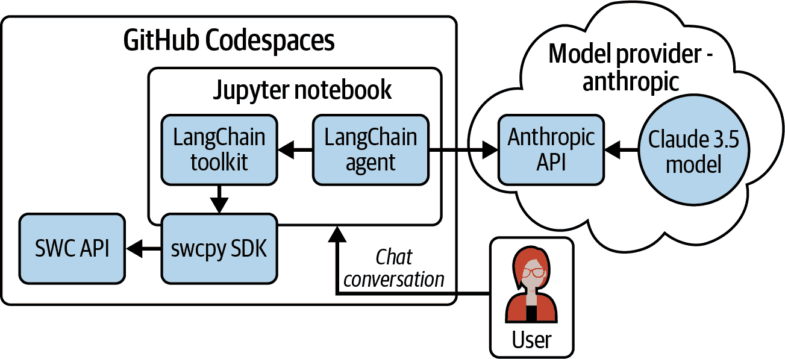
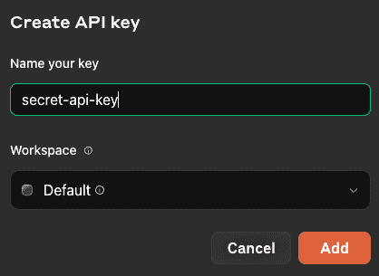
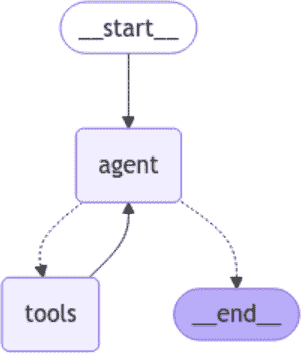

# 第十四章\. 使用 LangChain 与 API 一起使用

> 一个系统越“具有代理性”，LLM 决定系统如何行为的情况就越多。
> 
> 哈里森·蔡斯，LangChain 创建者

AI 应用程序使用 LLM 作为与用户的自然语言界面，研究人员正在探索使用 LLM 来执行多步任务的方法。本章将探讨两种重要的方法，API 和 LLM 如何结合使用来创建 AI 应用程序。首先，您将查看使用 API 调用 LLM，然后您将反转角色并使用 LLM 调用 API。您将使用 LangChain 来完成这两个任务。

LangChain 及其相关项目 LangGraph 是用于创建 *具有代理性* 应用程序的开放源代码框架——这些应用程序使用 LLM 来控制系统行为。尽管许多开发者通过直接调用 LLM API 并执行自定义编码来与它们交互来构建这些应用程序，但 LangChain 和 LangGraph 标准化了所需的大部分任务。您可以将它们视为位于 API 或模型之上的框架。

这里有一些新术语：

代理

哈里森·蔡斯将代理定义为“一个使用 LLM 来决定应用程序控制流的系统。”代理不是预先编程的，就像传统软件一样——它们使用模型进行推理并决定对话的流程。它们可以执行由函数调用模型建议的工具调用。

函数调用模型

这是一种特殊的模型，它考虑可用的 *函数* 或 *工具* 并建议何时使用它们。尽管名称如此，这些模型并不直接调用工具；它们将建议提供给 *代理*，由代理进行调用。

模型

这些是 LangChain 用户调用的 AI 模型。LangChain 可以使用本地下载的模型或通过模型提供商提供的 Web API 调用的模型。

模型系列

这些是具有相同名称和架构的多个模型。

工具包

这是一个集合，包含代理将用于执行任务的多个工具。

工具或函数

这是为代理提供额外技能的代码。一个简单的 Python 函数可能执行数学运算。您将创建一个调用 SWC API 的工具。

本章中介绍的应用软件将专注于使用 LangChain 生态系统与 API 一起使用。表 14-1 显示了您将使用的新工具。

表 14-1\. 本章使用的工具

| 软件名称 | 版本 | 用途 |
| --- | --- | --- |
| LangChain | 0.3 | 用于创建工具和工具包的 Python 库，允许代理使用您的 API |
| LangGraph | 0.2 | 用于创建代理的 Python 库 |
| Anthropic Claude | 3.5 Sonnet | 用于向 LangGraph 代理提供推理的模型 |
| Pydantic | 2 | 用于在您的工具包中执行验证的 Python 库 |
| swcpy | NA | SDK 创建于 第七章 用于您的 API |

# 通过 LangChain 使用 API 调用 AI

图 14-1 展示了您在本章中创建的项目的高级架构。

要了解 LangChain 正在利用的能力，查看 LangChain 交互的 API 很有帮助。LangChain 的“聊天模型”页面[“Chat Models”](https://oreil.ly/2elFn)列出了 60 多个聊天模型提供者。列表还显示了哪些模型可以进行函数调用，这在本章中非常重要，因为它们能够使用工具调用 API。



###### 图 14-1\. 高级架构

如果你查看这些模型提供者的文档，它们通常会提供其 API 的文档，并允许你注册 API 密钥（可能需要付费）。这些公司遵循了第六章中的许多最佳实践：交互式 API 文档、Python 和其他语言的 SDK、联系支持的方法以及许多其他功能。对于这些提供者来说，API 不是一项副业——*它是业务的核心*。

###### 警告

虽然专注于 LLM（大型语言模型）的潜力很有吸引力，但模型提供者也发布了一些令人清醒的警告。提供者通常会提供一份*模型卡*或*系统卡*，描述其模型的使用意图和限制。在撰写本文时，这些主要 LLM 的卡片列出了风险，如偏见、幻觉、错误和有害内容。例如，Anthropic 在其文章[“The Claude 3 Model Family: Opus, Sonnet, Haiku”](https://oreil.ly/vq7FK)中提到：“这些模型不应在高风险情况下单独使用”。

在本章中，你将使用一个只读的幻想足球 API，风险较低。

# 创建 LangGraph 代理

> 让 LLM 决定应用程序的控制流程（即我们所说的代理）很有吸引力，因为它们可以解锁以前无法自动化的各种任务。然而，在实践中，构建能够可靠执行这些任务的系统极其困难。
> 
> LangChain 博客文章，[“Announcing LangGraph v0.1 & LangGraph Cloud: Running agents at scale, reliably”](https://oreil.ly/KoxAw)，2024 年 6 月

LangGraph 是一个与 LangChain 相关的项目，专注于创建一个或多个代理协同工作的应用程序。LangChain 有使用代理的方法，这些方法在撰写本文时被标记为*遗留方法*。LangGraph 旨在通过提供更多开发者控制和支持多代理应用程序来改进这些方法。

LangGraph 使用了一些来自数学图论的专业术语（参见“使用 Apache Airflow 编排数据管道”）。LangGraph 代理的逻辑流程由*节点*表示，这些节点是更新应用程序*状态*的过程。节点通过*边*连接，这些边是节点之间的一向流。与 Airflow 中的*无环*图不同，它从起始节点开始，单向流向结束节点，LangGraph 允许*循环*图，其中节点和边可以多次循环。例如，一个循环可能允许用户在得到最终答案之前向模型提出多个问题。

图 14-2 显示了包含循环的有向循环图中节点和边之间的关系。


###### 图 14-2\. 有向循环图

在本章中，您将创建一个可以用有向循环图表示的代理。

## 注册 Anthropic

您将使用 Anthropic 的一个模型，因此您需要在[“使用 Claude 构建”网页](https://console.anthropic.com/login)上注册一个 Anthropic 账户。

要使用 Anthropic API，您需要将您的初始账户升级到构建计划，并向您的账户添加资金。为了限制潜在的过度支出，我建议最初添加 5 美元并禁用自动重新加载。这意味着即使您的 API 密钥被误用，您最多也只能花费 5 美元。

接下来，导航到[Anthropic API 密钥页面](https://oreil.ly/fcaYA)并选择创建密钥。给密钥起一个像**`secret-api-key`**这样的名字，并选择默认工作区。您的显示应该看起来像图 14-3。



###### 图 14-3\. 创建 Anthropic API 密钥

点击添加。您将被提示“保存您的 API 密钥”。这是唯一一次密钥会被显示。请将此密钥存储在安全的位置。

###### 注意

如果您丢失了 Anthropic API 密钥或认为它可能已被泄露，请从密钥页面删除它并创建一个新的。这被称为*轮换*凭证，这是一种降低 API 密钥被滥用的风险的便捷方式。

## 启动您的 GitHub Codespace

在您启动本章的 GitHub Codespace 之前，您想在您的 Codespace 中添加 Anthropic API 密钥作为秘密。这将允许您使用 LangGraph 与 Anthropic 模型。

按照说明进行[“添加一个秘密”](https://oreil.ly/VGSJ3)并使用以下信息创建一个新的秘密：

+   *名称*：`ANTHROPIC_API_KEY`

+   *值*：使用上一节中创建的 Anthropic API 密钥的值。

+   *仓库访问*：选择`ai-project`仓库。

完成后，您应该会看到密钥已保存，如图图 14-4 所示。


###### 图 14-4\. Codespaces 秘密

# 在您的 Codespace 中安装新库

现在启动你的 Codespace。你将使用你在 “克隆第三部分仓库” 中创建的 Part III GitHub Codespace。如果你还没有创建你的 Part III Codespace，你现在可以完成该部分。要安装本章所需的库，创建一个名为 *chapter14/requirements.txt* 的文件：

```py
.../analytics-project (main) $ cd chapter14
.../chapter14 (main) $ touch requirements.txt
```

使用以下内容更新 *chapter14/requirements.txt*：

```py
langchain_core>=0.3.0,<0.4.0 
langchain_anthropic>=0.2.0,<0.3.0 
langgraph>=0.2.0,<0.3.0  
```


这将安装基础 LangChain 库及其依赖项。


这个库用于本章中你使用的特定模型。


这是用于定义你的代理的 LangGraph 库。

执行以下命令以在你的 Codespace 中安装新库，并确保升级到最新版本：

```py
.../chapter14 (main) $ pip3 install --upgrade -r requirements.txt
```

你应该会看到一个消息，表明这些库已成功安装。

# 创建您的 Jupyter Notebook

你将使用 Jupyter Notebook 来实现一个基于 [LangChain GitHub 仓库](https://oreil.ly/U-TJF)示例的对话聊天代理。

要开始，请在终端窗口中运行以下命令以创建新目录和本章中你将使用的 Jupyter Notebook：

```py
.../chapter14 (main) $ touch langgraph_notebook.ipynb
```

点击 *langgraph_notebook.ipynb* 文件以打开它。在文件右上角，点击选择内核。Codespaces 应会提示你“安装/启用建议的扩展 Python + Jupyter”——选择此选项。如果提示，点击安装按钮。这将安装一些 VS Code 的扩展。

安装完成后，窗口标题将更改为选择另一个内核。选择 Python 环境。窗口标题将更改为选择 Python 环境。应该列出一个带有星号的 Python 版本——选择此 Python 版本。

点击“+ Markdown”以创建一个新的 Markdown 单元格。在 Markdown 单元格中输入以下标题：

```py
# LangGraph Agent
## Without tools
```

通过点击单元格左侧的播放图标或按 Shift-Enter 运行此单元格。你应该看到你的消息格式化为标题。

创建另一个 Markdown 单元格，并使用以下内容运行它：

```py
## Library Imports
```

将鼠标悬停在下面的单元格下方并点击“+ Code”以创建一个新的 Python 单元格。在 Python 单元格中输入以下代码：

```py
from langchain_core.messages import HumanMessage 
from langchain_anthropic import ChatAnthropic 
from langgraph.checkpoint.memory import MemorySaver 
from langgraph.graph import END, START, StateGraph, MessagesState
import logging
from IPython.display import Image, Markdown, display 
from langchain_core.runnables.graph import CurveStyle,
MermaidDrawMethod, NodeStyles 
```


这个导入定义了你将用于与代理通信的消息。


这是用于使用 Anthropic 模型的库。


以下库使 LangGraph 框架的不同部分得以实现。


这将用于格式化代理返回的消息。


这将用于显示图形的视觉视图。

将所有导入放在笔记本的顶部有助于跟踪你正在使用的库。这些导入将适用于此 Jupyter Notebook 中的所有单元格。

添加另一个 Markdown 单元格，内容如下：

```py
## Configure logging
```

添加并运行以下 Python 代码单元格：

```py
for handler in logging.root.handlers[:]: 
    logging.root.removeHandler(handler)

logging.basicConfig(
    filename='langgraph_notebook.log',
    level=logging.INFO,  
)
```


此语句删除由 Codespaces 配置的任何现有日志处理程序。


这将设置日志级别以记录到日志中。请参阅表 7-1 以获取有关 Python 日志的更多详细信息。

添加另一个 Markdown 单元格，内容如下：

```py
## Configure Agent and Model
```

添加并运行以下 Python 代码单元格：

```py
model = ChatAnthropic(model="claude-3-5-sonnet-20240620", temperature=0) 

def call_model(state: MessagesState): 
    messages = state['messages']
    response = model.invoke(messages)
    return {"messages": [response]}

workflow = StateGraph(MessagesState) 

workflow.add_node("agent", call_model) 

workflow.add_edge(START, "agent") 

checkpointer = MemorySaver()

app = workflow.compile(checkpointer=checkpointer) 
```


这初始化了 Anthropic 模型。`temperature`设置响应的创造力。数值越低，创造力越低，可预测性越高。


此函数用于使用`state`对象向模型发送消息。


`workflow`用于定义代理可用的任务。


`agent`节点将使用上面定义的`call_model`函数。


这定义了图的开始，它将直接调用`agent`节点。


此语句将图编译成一个名为`app`的 LangChain `Runnable`对象。（有关更多信息，请参阅[Runnable 接口的文档](https://oreil.ly/UJJzq)。）`app`对象将充当代理。

查看图的视觉表示将帮助你看到在此代码中创建的节点和边，以及你创建的代理的流程。添加另一个 Markdown 单元格，内容如下：

```py
## Visualize the Graph
```

添加并运行以下 Python 代码单元格：

```py
display(
    Image(
        app.get_graph().draw_mermaid_png(
            draw_method=MermaidDrawMethod.API,
        )
    )
)
```

显示图的图像展示了你的代理的流程。你应该看到一个与图 14-5 匹配的图像。这表明图将开始，并将向代理发送消息，而不引用任何其他节点。


###### 图 14-5。基本代理的图

# 与 LangGraph 代理聊天

你现在可以与创建的代理进行对话了。你将通过使用`app.invoke()`方法和`messages`对象来完成此操作。对`invoke()`方法的调用还包括一个包含`thread_id`值的`config`对象。`thread_id`允许代理记住对话中的先前消息。

添加另一个 Markdown 单元格，内容如下：

```py
## Chat with the Agent
```

添加并运行以下 Python 代码单元格：

```py
final_state = app.invoke(
    {"messages": [HumanMessage(content="What teams did Joe Montana play for?")]},
    config={"configurable": {"thread_id": 99}}
)
display(Markdown(final_state["messages"][-1].content))
```

这就是你将与你的代理进行聊天的方式。`app.invoke` 命令发送 `messages` 对象，并将一个问题作为 `HumanMessage` 添加。`config` 对象传递一个 `thread_id`，以便代理知道你处于同一个对话中。当你使用这个 `thread_id` 时，代理将记住同一对话中的先前消息。在每个 `invoke()` 语句之后，`final_state` 对象包含模型和人类之间的消息列表。

要获取对话中最新的消息，你将显示 `final_state["messages"][-1].content`。这些消息将具有 Markdown 格式，因此你可以使用 `display(Markdown())` 语句来正确地格式化它们。

记住，模型是 *非确定性的*，即使温度设置为零也是如此。这意味着每次交互可能略有不同。但如果你对图的成功调用，你应该看到一条类似以下的消息：

```py
Joe Montana played for two NFL teams during his professional career:

1\. San Francisco 49ers (1979-1992)
2\. Kansas City Chiefs (1993-1994)
He spent the majority of his career with the 49ers, where he achieved his
greatest success, before finishing his career with two seasons in Kansas City.
```

###### 注意

如果你在这一步遇到与 API 密钥相关的错误，请检查你是否已经向你的 Anthropic 账户充值，创建了一个 API 密钥，并将其设置在你的 Codespaces 机密中。如果这些步骤中的任何一个被跳过了，你将无法使用本例中的 Anthropic 模型。

看起来 Anthropic 模型已经用关于 NFL 的历史信息进行了训练。让我们看看当我们询问关于 SportsWorldCentral 应用的问题时，它的表现如何。添加并运行一个具有以下内容的 Python 代码单元：

```py
final_state = app.invoke(
    {"messages": [HumanMessage(content="What are the leagues in the
    SportsWorldCentral fantasy football platform?")]},
    config={"configurable": {"thread_id": 99}}
)
display(Markdown(final_state["messages"][-1].content))
```

你将收到一条类似以下的消息：

```py
I apologize, but I don't have any specific information about leagues in a
platform called "SportsWorldCentral" for fantasy football. Fantasy football
platforms can vary widely in their league structures and offerings, and I'm not
familiar with this particular one. If this is a real platform, you might
need to check their website or contact their customer support
for accurate information about their league types and structures.
If you have more general questions about fantasy football leagues,
I'd be happy to help with those.
```

模型显然怀疑 SportsWorldCentral 可能不是一个“真正的平台”，但对于像 Sleeper 或 MyFantasyLeague.com 这样的现实世界平台，模型中也不包含关于特定联盟和球队的信息。

为了解决这个知识差距，你将创建一个工具包，该工具包提供对 SportsWorldCentral API 的访问权限。

# 在本地运行 SportsWorldCentral (SWC) API

SWC API 的代码和数据库文件位于你的 Codespace 的 */api* 文件夹中。在终端中启动第二个会话，并按照以下所示在你的 Codespace 中安装 API 所需的库，使用提供的 *requirements.txt* 文件：

```py
.../ai-project (main) $ cd api
.../api (main) $ pip3 install -r requirements.txt
```

现在从命令行启动 API，如下所示：

```py
.../api (main) $ fastapi run main.py
```

你将看到来自 FastAPI CLI 的几条消息，最后以以下内容结束：

```py
INFO:     Started server process [19192]
INFO:     Waiting for application startup.
INFO:     Application startup complete.
INFO:     Uvicorn running on http://0.0.0.0:8000 (Press CTRL+C to quit)
```

API 现在正在 Codespaces 中运行。复制终端中显示的 URL（在本例中为 `[*http://0.0.0.0:8000*](http://0.0.0.0:8000)`，它可能也适用于你的情况）。

在主终端会话中，在基本项目目录中创建一个名为 *.env* 的文件，如下所示：

```py
chapter14 (main) $ touch ../.env
```

使用以下内容更新此文件：

```py
SWC_API_BASE_URL=[URL from previous step]
```

这将在你稍后创建的 Jupyter Notebook 中使用。

# 安装 swcpy 软件开发工具包 (SDK)

要构建用于使用您的 API 的工具包，您首先需要安装您在第七章中创建的 swcpy SDK。如果您已经完成了该项目，您可以将该代码复制到这个存储库中，并在 */sdk* 目录中使用 `pip3 install -e` 本地安装它。如果您还没有完成，请执行以下命令从 Part I GitHub 存储库安装 SDK：

```py
.../api (main) $ pip install swcpy@git+https://github.com/handsonapibook/
api-book-part-one#subdirectory=chapter7/complete/sdk
```

如果安装成功，您应该看到以下内容：

```py
Successfully built swcpy
Installing collected packages: pyarrow, backoff, swcpy
Successfully installed backoff-2.2.1 pyarrow-16.1.0 swcpy-0.0.2
```

###### 注意

您将创建一个使用 swcpy SDK 的工具，这是与您的 API 交互最稳健的方式。您还可以使用其他方法与您的 API 交互。例如，您也可以构建一个基于您在第九章中创建的简单 API 客户端的工具。或者，您可以直接使用 httpx 或 requests 调用单个 API 端点。您可能想尝试不同的方法，看看您更喜欢哪种。

# 创建 LangChain 工具包

LangChain 工具包包含多个工具。LangChain 提供了多种创建工具的方法，如[“如何创建工具”](https://oreil.ly/V8tBi)中所示。您将通过继承 `BaseTool` 类来创建工具。根据文档，此方法“提供了对工具定义的最大控制。”

创建一个名为 *swc_toolkit.py* 的 Python 文件，如下所示：

```py
chapter14 (main) $ touch swc_toolkit.py
```

在您的工具包文件顶部，您将添加您的导入并加载 Codespace 密钥。将以下内容添加到 *swc_toolkit.py*：

```py
import os
from typing import Optional, Type, List

from pydantic import BaseModel, Field

from langchain_core.callbacks import CallbackManagerForToolRun 
from langchain_core.tools import BaseTool, BaseToolkit

try: 
            from swcpy import SWCClient
            from swcpy import SWCConfig
            from swcpy.swc_client import League, Team
except ImportError:
    raise ImportError(
        "swcpy is not installed. Please install it."
    )

config = SWCConfig(backoff=False) 
local_swc_client = SWCClient(config)
```


这些导入使用 LangChain 库来定义工具和工具包。


此语句检查 swcpy SDK 是否已安装到环境中。如果没有，将生成错误。


这将实例化 SDK。有关此功能如何工作的更多信息，请参阅第七章。

swcpy SDK 具有多种功能，以不同的方式调用 API 端点。对于您为代理提供的每个 SDK 函数，创建一个 Pydantic `BasesModel` 类的实例用于输入值，并创建一个 LangChain `BaseTool` 类的实例来调用 SDK。您将创建以下工具：

+   `HealthCheckTool`：允许代理检查 API 是否正常运行

+   `ListLeaguesTool`：允许代理获取联赛列表

+   `ListTeamsTool`：允许代理获取团队列表

将以下内容添加到 *swc_toolkit.py* 的底部，添加 `HealthCheckTool` 和 `ListLeaguesTool`：

```py
class HealthCheckInput(BaseModel): 
    pass

class HealthCheckTool(BaseTool): 
    name: str = "HealthCheck"
   description: str = (
         "useful to check if the API is running before you make other calls"
    args_schema: Type[HealthCheckInput] = HealthCheckInput 
    return_direct: bool = False

    def _run(
        self, run_manager: Optional[CallbackManagerForToolRun] = None
    ) -> str:
        """Use the tool to check if the API is running."""
        health_check_response = local_swc_client.get_health_check() 
        return health_check_response.text

class LeaguesInput(BaseModel): 
   league_name: Optional[str] = Field(
        default=None,
        description="league name. Leave blank or None to get all leagues.")

class ListLeaguesTool(BaseTool): 
   name: str = "ListLeagues"
   description: str = (
       "get a list of leagues from SportsWorldCentral. "
       "Leagues contain teams if they are present."
    args_schema: Type[LeaguesInput] = LeaguesInput
    return_direct: bool = False

   def _run(
       self, league_name: Optional[str] = None,
       run_manager: Optional[CallbackManagerForToolRun] = None
   ) -> List[League]:
        """Use the tool to get a list of leagues from SportsWorldCentral."""
        # Call the API with league_name, which could be None
        list_leagues_response = local_swc_client.list_leagues(
                                league_name=league_name)
        return list_leagues_response
```


对于每个工具，您将定义一个输入对象，它是 Pydantic `BaseModel` 的子类。此工具不接受参数，因此您正在创建一个空对象。


这是健康检查工具的定义，它是 LangChain `BaseTool` 的子类。你在此部分提供的信息将被模型用来决定如何以及何时使用此工具。


`args_schema` 定义了预期的输入，模型将使用它向工具发送输入。


这是动作发生的地方。它调用 SDK 的 `get_health_check()` 方法。


这是为 `ListLeaguesTool` 定义的输入。它包含该工具使用的参数。


这是将调用 SDK 的 `list_leagues()` 函数的工具。

现在，你将添加 `ListTeamsTool` 并创建一个 `BaseToolkit` 对象，该对象代表你将提供给代理的所有工具。将以下内容添加到 *swc_toolkit.py* 的底部：

```py
class TeamsInput(BaseModel): 
   team_name: Optional[str] = Field(
        default=None,
        description="Name of the team to search for. 
        Leave blank or None to get all teams.")
   league_id: Optional[int] = Field(
        default=None,
        description=(
             "League ID from a league. You must provide a numerical League ID. "
             "Leave blank or None to get teams from all leagues."
             ))

class ListTeamsTool(BaseTool): 
   name: str = "ListTeams"
   description: str = (
        "Get a list of teams from SportsWorldCentral. Teams contain players "
        "if they are present. Optionally provide a numerical League ID to "
        "filter teams from a specific league.")
   args_schema: Type[TeamsInput] = TeamsInput
   return_direct: bool = False

   def _run(
       self, team_name: Optional[str] = None,
       league_id: Optional[int] = None,
       run_manager: Optional[CallbackManagerForToolRun] = None
   ) -> List[Team]:
       """Use the tool to get a list of teams from SportsWorldCentral."""
       list_teams_response = local_swc_client.list_teams(
            team_name=team_name, league_id= league_id)
       return list_teams_response

class SportsWorldCentralToolkit(BaseToolkit): 
    def get_tools(self) -> List[BaseTool]: 
        """Return the list of tools in the toolkit."""
        return [HealthCheckTool(), ListLeaguesTool(), ListTeamsTool()] 
```


这是为 `ListTeamsTool` 定义的输入。它包含该工具使用的参数。


这是将调用 SDK 的 `list_teams()` 函数的工具。


工具包是从 LangChain 的 `BaseToolkit` 类派生的。


`get_tools()` 方法返回工具包中的工具列表。


这个语句实例化了工具并将它们以列表的形式返回。

# 使用 AI 调用 API（与 LangGraph 一起）

在 *langgraph_notebook.ipynb* 笔记本中，你创建了一个能够聊天的代理，但该代理无法回答来自 SWC API 的问题。现在，你将创建一个改进版本，该版本可以使用工具调用 SWC API。首先，使用以下命令复制包含以下内容的 Jupyter Notebook：

```py
.../chapter14 (main) $ cp langgraph_notebook.ipynb \
langgraph_notebook_with_toolkit.ipynb
```

打开 *langgraph_notebook_with_toolkit.ipynb* 并选择你之前使用的 Python 内核。更新第一个 Markdown 单元，以便更清晰地显示以下文本：

```py
# LangGraph Agent
## _With_ tools
```

将以下内容添加到包含 `import` 语句的第一个 Python 单元中，并重新运行它：

```py
from swc_toolkit import SportsWorldCentralToolkit 
from langchain_core.tools import tool 
from langgraph.prebuilt import ToolNode 
from typing import Literal
```


这是为你创建的工具包的 `import` 语句。


这个 `import` 提供了 LangChain 工具功能。


这个 `import` 为工具包添加了 LangGraph 支持。

在用于配置日志的 Python 单元下方，添加以下 Markdown 单元：

```py
## Create toolkit
```

现在，你将引用你之前创建和导入的工具包。要实例化你的工具包，添加以下 Python 单元并运行它：

```py
swc_toolkit = SportsWorldCentralToolkit()
tools = swc_toolkit.get_tools()
```

这些语句创建了一个工具包类的实例，然后从其中检索所有工具并将它们放入 `tools` 对象中。

对于你的代理的主体，将会有很多变化。你将*绑定*工具到你的模型，这意味着让模型意识到它可以访问的工具。然后，你将为工具创建一个节点，并更新代理的流程，以便在需要回答问题时使用工具。

定位到标题“配置代理和模型”之后的 Python 单元格。将整个内容替换为以下内容，并运行它：

```py
tool_node = ToolNode(tools)

model = ChatAnthropic(model="claude-3-5-sonnet-20240620",
                     temperature=0).bind_tools(tools) 

def should_continue(state: MessagesState) -> Literal["tools", END]: 
    messages = state['messages']
    last_message = messages[-1]
    if last_message.tool_calls:
        return "tools"
    return END

def call_model(state: MessagesState):
    messages = state['messages']
    response = model.invoke(messages)
    return {"messages": [response]}

workflow = StateGraph(MessagesState)

workflow.add_node("agent", call_model)
workflow.add_node("tools", tool_node) 

workflow.add_edge(START, "agent")

workflow.add_conditional_edges( 
    "agent",
    should_continue,
)

workflow.add_edge("tools", 'agent')

checkpointer = MemorySaver()

app = workflow.compile(checkpointer=checkpointer)
```


这将`bind_tools()`函数添加到模型初始化中，以便模型可以使用你创建的工具包。


这将被用作一个*条件边*，这是一个根据结果决定如何进行的流程。如果模型建议调用工具，则返回字面意义上的“工具”。


这将在图中添加一个新的节点，用于使用新的工具包进行工具调用。


这添加了使用之前定义的`should_continue`函数的条件边。

要查看流程是如何更新的以添加工具节点，请重新运行“可视化图”标题下的 Python 单元格。

你应该看到一个与图 14-6 相匹配的图像。这显示了代理和可用工具之间的循环。



###### 图 14-6\. 带有工具的代理图

代理将决定需要使用工具多少次来回答问题。根据提出的问题和代理的推理，这可能涉及一次 API 调用、多次 API 调用，或者根本不进行 API 调用。

# 与你的代理聊天（带有工具）

现在是时候看看你为代理提供工具的努力是否提高了其回答关于 SportsWorldCentral 问题的能力。让我们从之前使它陷入困境的问题开始。在一个新的 Python 单元格中输入以下内容并运行它：

```py
final_state = app.invoke(
    {"messages": [HumanMessage(content="What are the leagues in the
    SportsWorldCentral fantasy football platform? Keep the response simple.")]},
    config={"configurable": {"thread_id": 99}}
)
display(Markdown(final_state["messages"][-1].content))
```

你将收到类似以下的消息：

```py
Here's a simple list of the leagues in the SportsWorldCentral fantasy
football platform:

1\. Pigskin Prodigal Fantasy League
2\. Recurring Champions League
3\. AHAHFZZFFFL
4\. Gridiron Gurus Fantasy League
5\. Best League Ever

These are the five leagues currently available in the platform.
```

如果你查看终端窗口，你应该看到以下内容，这表明代理使用了工具包中的`ListLeaguesTool`：

```py
INFO: 0.0.0.0:8000 - "GET /v0/leagues/?skip=0&limit=100 HTTP/1.1" 200 OK
```

恭喜！你已经创建了一个 LangGraph 代理，并为其提供了一个可以调用的自定义 API 工具包。

花时间尝试一些问题，以鼓励代理使用`HealthCheckTool`和`ListTeamsTool`。查看终端输出或日志文件以查看生成的 API 调用。你如何影响其工具使用？你如何引导它使用工具来回答更难的问题？你如何使其陷入困境？

# 其他资源

LangChain 是一个较新的框架，因此发布的资源很难跟上。当你查看在线资源和演示时，请检查所讨论库的版本，因为在本写作时，一些资源包含了已过时的代码。

有这个前提，最新的资源是[官方 LangChain 文档页面](https://oreil.ly/jyC-I)。

LangGraph 甚至比 LangChain 更新；[LangGraph 文档](https://oreil.ly/WBOXF)包含了最详细的信息。

要了解 Anthropic 关于代理的建议，包括几个推荐的流程，请阅读“构建有效的代理”（https://oreil.ly/QvAKC）。

Google 发布了一份[代理白皮书](https://oreil.ly/M5hV_)，其中解释了功能齐全的代理的关键组件。它强调代理如何使用工具，其中包括 API。

# 摘要

在本章中，你使用了 LangChain 和 LangGraph 框架来创建一个与 AI 模型和你的 SWC API 交互的智能代理。这让你能够在 Jupyter Notebook 中使用自然语言提出关于 SWC 数据的问题。这些都是使用 API 与 AI 应用结合的初步步骤。

在第十五章中，你将使用 ChatGPT，这是一个功能齐全的应用程序，它使用 LLMs 并且可以调用 API，就像你在本章中所做的那样。你将创建一个自定义操作和自定义 GPT，它们可以与 SWC API 交互。
