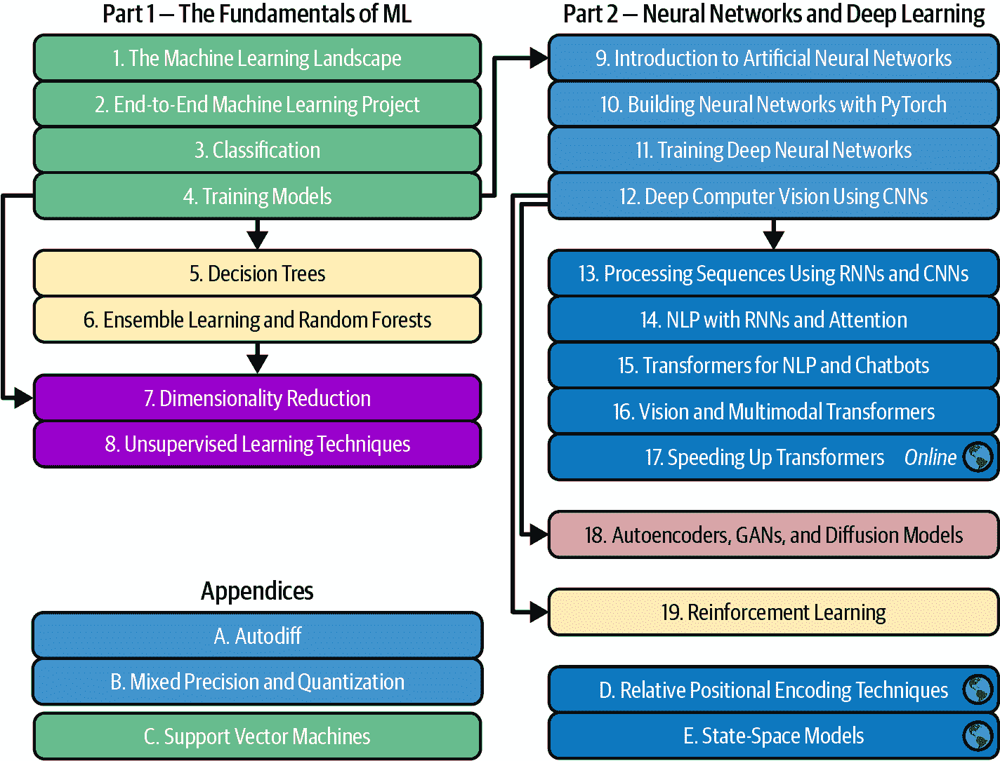

# 前言

在 2006 年，Geoffrey Hinton 等人发表了一篇[论文](https://homl.info/hinton2006)⁠⁠^(1)，展示了如何训练一个能够以最先进的精度（>98%）识别手写数字的深度神经网络。他们将这项技术命名为“深度学习”。深度神经网络是我们大脑皮层（一个非常简化的模型）的堆叠层，由人工神经元层组成。当时，训练深度神经网络被认为是无法实现的，⁠^(2)，大多数研究人员在 20 世纪 90 年代末放弃了这个想法。这篇论文重新激发了科学界的兴趣，不久之后，许多新的论文证明了深度学习不仅可行，而且能够实现令人惊叹的成就，这是其他机器学习（ML）技术所无法比拟的（借助巨大的计算能力和大量的数据）。这种热情很快扩展到了机器学习的许多其他领域。

十年后，机器学习已经征服了许多行业，包括排名网页结果、推荐观看的视频和购买的产品、在生产线上排序物品，有时甚至驾驶汽车。机器学习经常成为头条新闻，例如 DeepMind 的 AlphaFold 机器学习系统解决了困扰研究人员数十年的蛋白质折叠问题。但大多数时候，机器学习只是在后台默默地工作。然而，十年后，AI 助手开始兴起：从 2022 年的 ChatGPT，到 2023 年的 Gemini、Claude 和 Grok，以及此后出现的许多其他 AI 助手。AI 现在真正起飞了，它正在迅速改变每一个行业：曾经是科幻的东西现在变得非常真实。⁠^(3)

# 在你的项目中应用机器学习

因此，你自然会对手动学习感到兴奋，并希望加入这个行列！也许你想要给你的自制机器人一个自己的大脑？让它能识别人脸？或者学会四处走动？

或者，也许你的公司拥有大量的数据（用户日志、财务数据、生产数据、机器传感器数据、热线统计数据、人力资源报告等），如果你知道该往哪里看，很可能你会挖掘到一些隐藏的宝藏。利用机器学习，你可以完成以下任务[以及更多](https://homl.info/usecases)：

+   将客户细分并找到适合每个群体的最佳营销策略。

+   根据类似客户购买的产品向每位客户推荐产品。

+   识别哪些交易可能存在欺诈。

+   预测明年的收入。

+   预测峰值工作负载并建议最佳人员配置水平。

+   建立聊天机器人以协助你的客户。

无论出于什么原因，你已经决定学习机器学习并将其应用于你的项目中。这是一个伟大的想法！

# 目标和方法

本书假设你对机器学习几乎一无所知。其目标是为你提供实现能够从数据中学习的程序所需的概念、工具和直觉。

我们将涵盖大量技术，从最简单和最常用的（如线性回归）到一些经常赢得比赛的深度学习技术。为此，我们将使用 Python——数据科学和机器学习的领先语言，以及开源和现成的 Python 框架：

+   [Scikit-Learn](https://scikit-learn.org) 非常易于使用，但它的效率高，实现了许多机器学习算法，因此是学习机器学习的绝佳起点。它由 David Cournapeau 于 2007 年创建，后来由法国计算机科学和自动化研究所（Inria）的研究团队领导，最近由 Probabl.ai 领导。

+   [PyTorch](https://pytorch.org) 是一个功能强大且灵活的深度学习库。它使得训练和运行各种神经网络变得高效，并且可以将计算分布到多个 GPU（图形处理单元）上。PyTorch（PT）由 Facebook 的人工智能研究实验室（FAIR）开发，并于 2016 年首次发布。它源自一个名为 Torch 的较老框架，该框架是用 Lua 编写的。到 2022 年，PyTorch 已过渡到 Linux 基金会下的 PyTorch 基金会，以促进社区驱动的开发。

我们还将使用以下开源机器学习库：

+   [XGBoost](https://xgboost.readthedocs.io) 在第六章中实现一种称为*梯度提升*的强大技术。

+   [Hugging Face](https://huggingface.co) 库在第十三章和 15 章中用于下载数据集和预训练模型，包括转换器模型。转换器非常强大且多功能，它们是今天几乎所有 AI 助手的主体构建块。

+   [Gymnasium](https://gymnasium.farama.org) 在第十九章中用于强化学习（即训练自主代理）。

本书倾向于实践方法，通过具体的实际例子和一点点理论来培养对机器学习的直观理解。

###### 小贴士

虽然你可以不拿起笔记本电脑阅读这本书，但我强烈建议你尝试代码示例。

# 代码示例

本书中的所有代码示例都是开源的，可在[*https://github.com/ageron/handson-mlp*](https://github.com/ageron/handson-mlp)上在线获取，作为 Jupyter 笔记本。这些是包含文本、图像和可执行代码片段（在我们的情况下是 Python）的交互式文档。开始的最简单和最快的方式是使用 Google Colab 运行这些笔记本：这是一个免费服务，允许你直接在线运行任何 Jupyter 笔记本，而无需在您的机器上安装任何东西。你只需要一个网络浏览器和一个 Google 账户。

###### 注意

在本书中，我将假设你正在使用 Google Colab，但我已经测试了其他在线平台上的笔记本，例如 Kaggle 和 Binder，所以如果你更喜欢这些，你也可以使用它们。或者，你可以安装所需的库和工具（或本书的 Docker 镜像）并在自己的机器上直接运行笔记本。请参阅[*https://homl.info/install-p*](https://homl.info/install-p)中的说明。

这本书旨在帮助你完成工作。如果你希望使用超出代码示例的额外内容，并且这种使用超出了合理使用指南的范围（例如，销售或分发 O’Reilly 书籍的内容，或者将本书的大量内容纳入你的产品文档中），请联系 O’Reilly 获取许可，邮箱为*permissions@oreilly.com*。

我们感谢，但通常不需要署名。署名通常包括标题、作者、出版社和 ISBN。例如：“*《使用 Scikit-Learn 和 PyTorch 动手学习机器学习》* 作者：Aurélien Geron。版权所有 2026 年 Aurélien Geron，979-8-341-60798-9。”

# 前置条件

本书假设你有一些 Python 编程经验。如果你还不了解 Python，[*https://learnpython.org*](https://learnpython.org)是一个很好的起点。Python.org 上的官方教程[Python.org](https://docs.python.org/3/tutorial)也非常不错。

本书还假设你熟悉 Python 的主要科学库——特别是[NumPy](https://numpy.org)、[pandas](https://pandas.pydata.org)和[Matplotlib](https://matplotlib.org)。如果你从未使用过这些库，不要担心；它们很容易学习，我为每个库都创建了一个教程。你可以在[*https://homl.info/tutorials-p*](https://homl.info/tutorials-p)在线访问它们。

此外，如果你想全面理解机器学习算法是如何工作的（而不仅仅是如何使用它们），那么你应该至少对几个数学概念有基本的了解，特别是线性代数。具体来说，你应该知道什么是向量矩阵，以及如何执行一些简单的操作，比如向量相加，或者矩阵转置和乘法。如果你需要快速了解线性代数（这真的不是火箭科学！），我在[*https://homl.info/tutorials-p*](https://homl.info/tutorials-p)提供了一个教程。你还会找到一个关于微分学的教程，这可能有助于理解神经网络是如何训练的，但这不是掌握重要概念所必需的。本书偶尔也会使用其他数学概念，例如指数和对数，一点概率理论，以及一些基本的统计学概念，但都不是太高级。如果你需要这方面的帮助，请查看[*https://khanacademy.org*](https://khanacademy.org)，它提供了许多优秀且免费的在线数学课程。

# 路线图

本书分为两部分。第一部分，“机器学习基础”，涵盖了以下主题：

+   机器学习是什么，它试图解决什么问题，以及其系统的主要类别和基本概念

+   典型机器学习项目的步骤

+   通过拟合模型到数据中学习

+   最小化损失函数（即预测误差的度量）

+   处理、清洗和准备数据

+   选择和工程化特征（即数据字段）

+   使用交叉验证选择模型和调整超参数（例如，训练许多模型变体，并选择在训练数据中表现最佳的模型）

+   机器学习的挑战，特别是欠拟合和过拟合（偏差/方差权衡）

+   最常见的学习算法：线性回归和多项式回归、逻辑回归、*k*最近邻、决策树、随机森林和集成方法

+   将训练数据的维度降低以对抗“维度诅咒”

+   其他无监督学习技术，包括聚类、密度估计和异常检测

第二部分，“神经网络与深度学习”，涵盖了以下主题：

+   神经网络是什么，它们有什么优点

+   使用 PyTorch 构建和训练深度神经网络

+   最重要的神经网络架构：用于表格数据的前馈神经网络；用于计算机视觉的卷积神经网络；用于序列处理的循环神经网络和长短期记忆（LSTM）网络；用于自然语言处理、视觉等领域的编码器-解码器、转换器、状态空间模型（SSM）和混合架构；用于生成学习的自编码器、生成对抗网络（GAN）和扩散模型

+   如何构建一个通过试错学习良好策略的智能体（例如，游戏中的人工智能机器人），使用强化学习

+   高效地加载和预处理大量数据

第一部分主要基于 Scikit-Learn；第二部分主要使用 PyTorch。

###### 谨慎

不要急于跳入深水区：深度学习无疑是机器学习中最激动人心的领域之一，但你应该首先掌握基础知识。此外，许多问题可以使用更简单的技术（如随机森林和集成方法）得到很好的解决（在第一部分中讨论）。深度学习最适合解决复杂问题，如图像识别、语音识别或自然语言处理，并且通常需要大量数据、计算能力和耐心（除非你能利用预训练的神经网络，正如你将看到的）。

如果你特别感兴趣于某个主题，并希望尽快达到，图 P-1 将显示你必须首先阅读的章节，以及你可以安全跳过的章节。

###### 图 P-1. 章节依赖关系

# TensorFlow 和 PyTorch 版本之间的变化

我为这本书写了三个 TensorFlow（TF）版本，分别由 O’Reilly 在 2017 年、2019 年和 2022 年出版。TF 多年来一直是领先的深度学习库，由谷歌内部使用，因此针对大规模生产进行了优化。但 PyTorch 逐渐取得了领先地位，这得益于其简单性、灵活性和开放性：它现在主导着研究论文和开源项目，这意味着大多数新模型首先在 PyTorch 中可用。因此，行业也逐步转向 PyTorch。

近年来，谷歌减少了在 TensorFlow 上的投资，并更多地关注 JAX，这是一个优秀的深度学习库，它结合了研究生产和质量。然而，与 PyTorch 相比，其采用率仍然较低。

这就是为什么这次我选择使用 PyTorch 的原因！O’Reilly 和我决定将其作为新 PyTorch 系列的第一个版本，而不是原始系列的第四个版本。这为 JAX 系列或 TF 系列的全新版本留下了空间（时间将证明是否需要这些）。

如果你已经阅读了这本书的最新 TensorFlow 版本，以下是你在本书中会发现的主要变化（更多详细信息请参阅[*https://homl.info/changes-p*](https://homl.info/changes-p)）： 

+   书中的所有代码都已更新到最近的库版本。

+   第二部分中的所有代码都已从 TensorFlow 和 Keras 迁移到 PyTorch。这些章节都发生了重大变化。

+   删除了 TensorFlow 特定的内容，包括以前的第十二章和第十三章，以及以前的附录 C 和 D。

+   第十章现在介绍了 PyTorch。

+   我还增加了三个关于转换器的新章节：

    +   第十五章涵盖了自然语言处理中的转换器，包括如何构建聊天机器人。

    +   第十六章介绍了视觉转换器和多模态转换器。

    +   第十七章，可在[*https://homl.info/*](https://homl.info/)在线查看，讨论了几个用于加速和扩展转换器的先进技术。这包括 FlashAttention、专家混合（MoE）、低秩适应（LoRA）等。

+   此外，还增加了三个新的附录：附录 B 解释了如何缩小模型以便它们可以运行得更快并适应更小的设备，“相对位置编码”讨论了转换器的先进位置编码技术，“状态空间模型（SSMs）”介绍了状态空间模型。

+   为了为新内容腾出空间，关于支持向量机（SVMs）的章节已被[移至线上](https://homl.info)并更名为“支持向量机”；最后两个附录也位于同一网址，部署章节部分合并到了第十章。

这本书的 TensorFlow/Keras 版本有三个版本，分别被称为 homl1、homl2 和 homl3。这是 PyTorch 版本的第一个版本，被称为 homlp。试着连续说三次。

###### 注意

与最新版本的 TensorFlow 相比，大部分变化都在书的第二部分。如果你已经阅读了 homl3，那么不要期待书中第一部分有大的变化：自 2022 年以来，机器学习的基本概念没有变化。

# 其他资源

有许多优秀的资源可以学习机器学习。例如，安德鲁·吴在 Coursera 上的[ML 课程](https://homl.info/ngcourse)非常出色，尽管它需要大量的时间投入。

还有许多关于机器学习的有趣网站，包括 Scikit-Learn 的杰出[用户指南](https://homl.info/skdoc)。你也许也会喜欢[Dataquest](https://dataquest.io)，它提供了非常棒的交互式教程，以及无数的机器学习博客和 YouTube 频道。

有许多关于机器学习的入门书籍。特别是：

+   乔尔·格鲁斯的[*《从零开始的数据科学》*](https://homl.info/grusbook)，第 2 版（O'Reilly），介绍了机器学习的基础知识，并使用纯 Python（从头开始，正如书名所示）实现了一些主要算法。

+   史蒂芬·马尔斯兰德的*《机器学习：算法视角》*，第 2 版（Chapman & Hall），是机器学习的优秀入门书籍，深入探讨了广泛的主题，并使用 Python（也是从头开始，但使用 NumPy）提供了代码示例。

+   塞巴斯蒂安·拉斯奇卡的*《使用 PyTorch 和 Scikit-Learn 进行机器学习》*，第 1 版（Packt Publishing），也是使用 Scikit-Learn 和 PyTorch 进行机器学习的优秀入门书籍。

+   弗朗索瓦·肖莱特的*《用 Python 进行深度学习》*，第 3 版（Manning），是一本非常实用的书籍，以清晰简洁的方式涵盖了广泛的主题，正如你从优秀的 Keras 库的作者那里所期望的那样。它更倾向于代码示例而不是数学理论。

+   安德烈·布尔科夫的[*《百页机器学习书》*](https://themlbook.com)（自出版）非常简短，但涵盖了令人印象深刻的主题范围，以易于理解的方式介绍了这些主题，并没有回避数学方程式。

+   亚瑟·S·阿布-穆斯塔法、马利克·马戈德-伊斯拉伊尔和许安-天林的*《从数据中学习》*（AMLBook）是 ML 的一种更理论的方法，提供了深刻的见解，特别是在偏差/方差权衡方面（见第四章）。

+   Stuart Russell 和 Peter Norvig 的 *《人工智能：现代方法》* 第四版 (Pearson) 是一本涵盖大量主题（包括机器学习）的伟大（且庞大）的书籍。它有助于将机器学习置于正确的视角。

+   Jeremy Howard 和 Sylvain Gugger 的 [*《使用 fastai 和 PyTorch 的编码者深度学习》*](https://learning.oreilly.com/library/view/deep-learning-for/9781492045519/) (O’Reilly) 提供了一个清晰且实用的深度学习入门介绍，使用了 fastai 和 PyTorch 库。

+   Andrew Ng 的 *《机器学习求索》* 是一本免费的电子书，深入思考了机器学习，重点关注构建和部署模型的实际考虑因素，包括数据质量和长期维护。

+   Lewis Tunstall、Leandro von Werra 和 Thomas Wolf 的 [*《使用 Hugging Face 的 Transformer 自然语言处理：构建语言应用》*](https://learning.oreilly.com/library/view/natural-language-processing/9781098136789/) (O’Reilly) 是一个关于使用 Hugging Face 流行库的 Transformer 的实用深入探讨。

+   Jay Alammar 和 Maarten Grootendorst 的 *《动手学习大型语言模型》* 是一本关于 LLM 的精美插图书籍，涵盖了理解、训练、微调和使用 LLM 在各种任务中的所有必要知识。

最后，加入像 [Kaggle.com](https://kaggle.com) 这样的机器学习竞赛网站，将允许你在真实世界的问题上练习你的技能，并获得一些最好的机器学习专业人士的帮助和见解。

# 本书使用的约定

本书使用的排版约定：

*斜体*

表示新术语、URL、电子邮件地址、文件名和文件扩展名。

`常宽`

用于程序列表，以及段落中引用程序元素，如变量或函数名称、数据库、数据类型、环境变量、语句和关键字。

**`常宽粗体`**

显示用户应逐字输入的命令或其他文本。

*`常宽斜体`*

显示应替换为用户提供的值或由上下文确定的值的文本。

标点符号

为了避免任何混淆，本书中所有引号外的标点符号都位于引号之外。对那些讲究的人士表示歉意。

###### 提示

此元素表示提示或建议。

###### 注释

此元素表示一般注释。

###### 警告

此元素表示警告或注意事项。

# O’Reilly 在线学习

###### 注释

超过 40 年来，[*O’Reilly 媒体*](https://oreilly.com) 为公司提供技术培训和业务培训、知识和见解，以帮助公司成功。

我们独特的专家和创新者网络通过书籍、文章和我们的在线学习平台分享他们的知识和专业知识。O’Reilly 的在线学习平台为您提供按需访问实时培训课程、深入的学习路径、交互式编码环境以及来自 O’Reilly 和 200 多家其他出版商的大量文本和视频。更多信息，请访问[*https://oreilly.com*](https://oreilly.com)。

# 如何联系我们

请将有关本书的评论和问题寄给出版社：

+   O’Reilly Media, Inc.

+   141 Stony Circle, Suite 195

+   Santa Rosa, CA 95401

+   800-889-8969（在美国或加拿大）

+   707-827-7019（国际或本地）

+   707-829-0104（传真）

+   *support@oreilly.com*

+   [*https://oreilly.com/about/contact.html*](https://oreilly.com/about/contact.html)

我们为这本书有一个网页，上面列出了勘误、示例和任何其他附加信息。您可以通过[*https://oreil.ly/hands-on-machine-learning*](https://oreil.ly/hands-on-machine-learning)访问此页面。

想了解我们书籍和课程的新闻和信息，请访问[*https://oreilly.com*](https://oreilly.com)。

在 LinkedIn 上找到我们：[*https://linkedin.com/company/oreilly-media*](https://linkedin.com/company/oreilly-media)

在 YouTube 上关注我们：[*https://youtube.com/oreillymedia*](https://youtube.com/oreillymedia)

# 致谢

在我梦寐以求的时刻，我也没想到这本书的三个 TensorFlow 版本能吸引如此庞大的读者群。我收到了许多读者的消息，许多人提问，有些人友好地指出错误，大多数人给我送来了鼓励的话语。我无法表达我对所有这些读者巨大支持的感激之情。非常感谢大家！如果您在代码示例中找到错误（或只是想提问），请毫不犹豫地[在 GitHub 上提交问题](https://homl.info/issues-p)，或者如果您在文本中找到错误，请提交[勘误](https://homl.info/errata-p)。一些读者还分享了这本书如何帮助他们找到第一份工作，或者如何帮助他们解决他们正在工作的具体问题。我发现这样的反馈非常鼓舞人心。如果您觉得这本书有用，我非常希望您能与我分享您的经历，无论是私下（例如，通过[LinkedIn](https://linkedin.com/in/aurelien-geron)）还是公开（例如，在@aureliengeron 上发推文或写[Amazon 评论](https://homl.info/amazon-p))）。

此外，还要感谢所有慷慨的人们，他们抽出时间和专业知识来审阅这本书，纠正错误并提出了无数建议。他们使这本书变得如此出色：Jeremy Howard、Haesun Park、Omar Sanseviero、Lewis Tunstall、Leandro Von Werra 和 Sam Witteveen 审阅了目录，并帮助我精炼了本书的范围。Hesam Hassani、Ashu Jha、Meetu Malhotra 和 Ammar Mohanna 审阅了第一部分，而 Ulf Bissbort、Louis-Francois Bouchard、Luba Elliot、Thomas Lacombe、Tarun Narayanan、Marco Tabor 以及我的亲爱的兄弟 Sylvain 审阅了第二部分。特别感谢 Haesun Park，她审阅了每一章。你们都是如此出色！

当然，没有 O’Reilly 的出色员工，这本书就不会存在。我特别感激 Michele Cronin，她审阅了每一章，并在整个一年中每周都支持我。我也非常感谢 Nicole Butterfield 领导了这个项目，并帮助精炼了本书的范围，以及制作团队——特别是 Beth Kelly 和 Kristen Brown——他们完成了非凡的工作。我想感谢 Sonia Saruba，她进行了无数细致的校对，Kate Dullea 使我的图表变得更加美观，以及 Susan Thompson 为封面上的美丽猩猩所做的贡献。

最后但同样重要的是，我对我的挚爱妻子，Emmanuelle，以及我们的三个可爱的孩子——Alexandre、Rémi 和 Gabrielle——表示无限的感激，因为他们鼓励我如此努力地完成这本书。他们永不满足的好奇心是无价的：向我的妻子和孩子解释这本书中的一些最困难的概念，帮助我澄清了自己的想法，并直接改进了其中的许多部分。此外，他们还不断地给我带来饼干和咖啡。还有什么比这更好的呢？

^(1) Geoffrey E. Hinton 等人，“用于深度信念网的快速学习算法”，*神经计算* 18 (2006): 1527–1554。

^(2) 尽管 Yann LeCun 的深度卷积神经网络自 1990 年代以来在图像识别方面表现良好，尽管它们并不像通用性那么强。

^(3) 乔治·H·霍顿（Geoffrey Hinton）因在 20 世纪 80 年代早期对神经网络的研究工作而获得了 2018 年图灵奖（与 Yann LeCun 和 Yoshua Bengio 共同获得）和 2024 年诺贝尔物理学奖（与 John Hopfield 共同获得）。DeepMind 的创始人兼首席执行官 Demis Hassabis 和导演 John Jumper 因他们在 AlphaFold 上的工作而获得了 2024 年诺贝尔化学奖。他们与另一位蛋白质研究员 David Baker 分享了这一诺贝尔奖。
