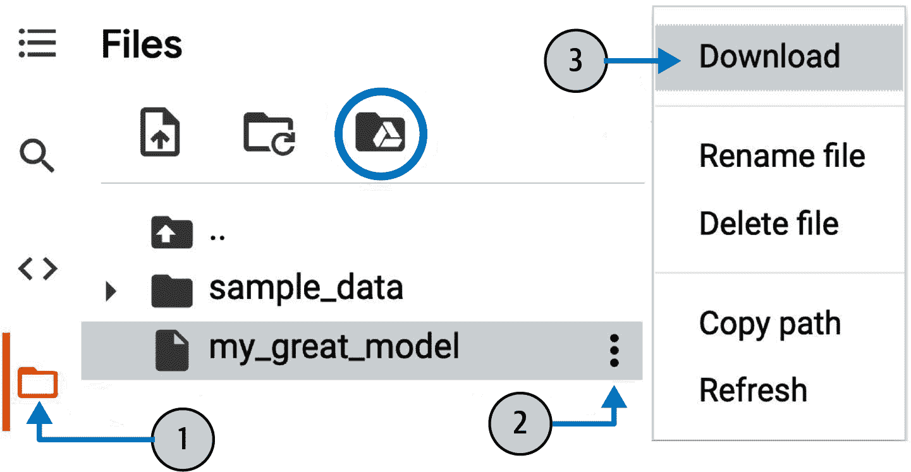
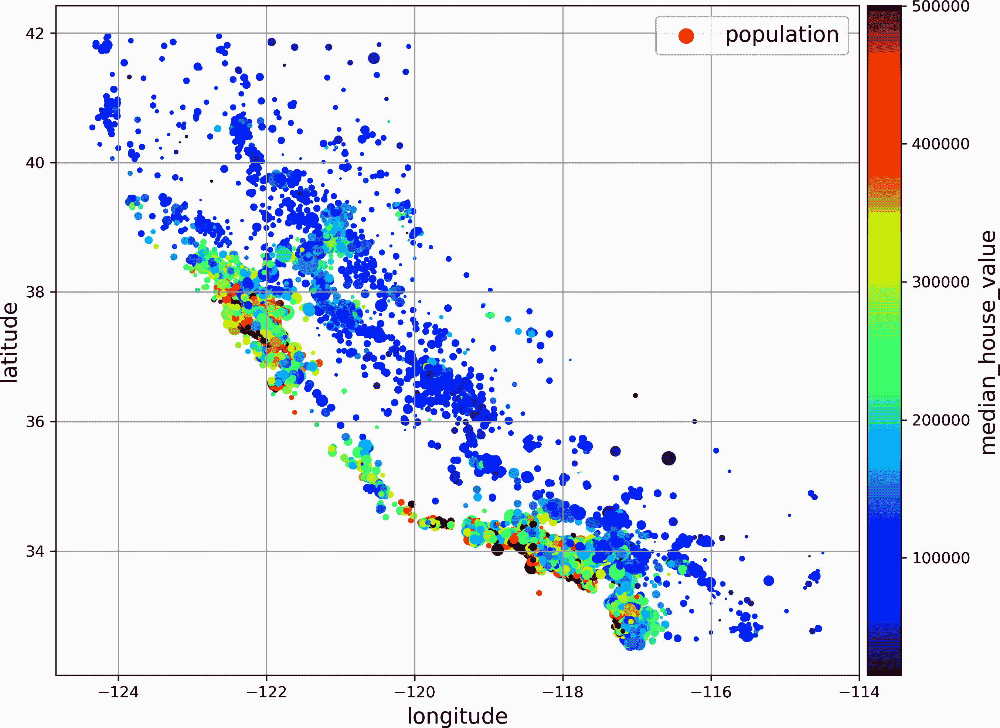
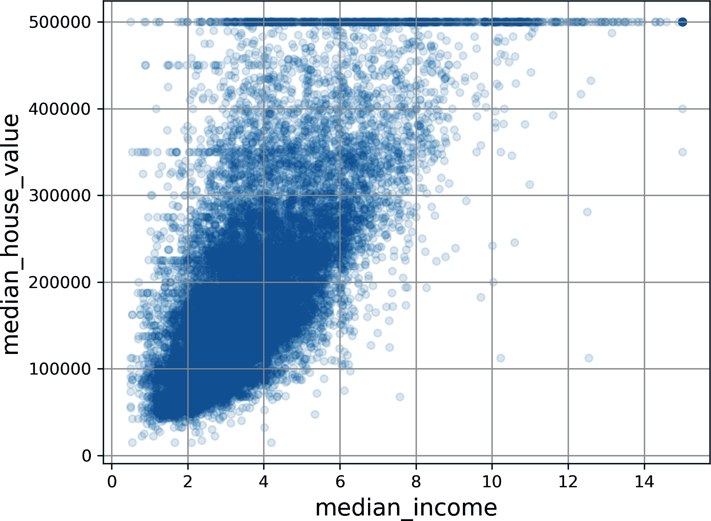
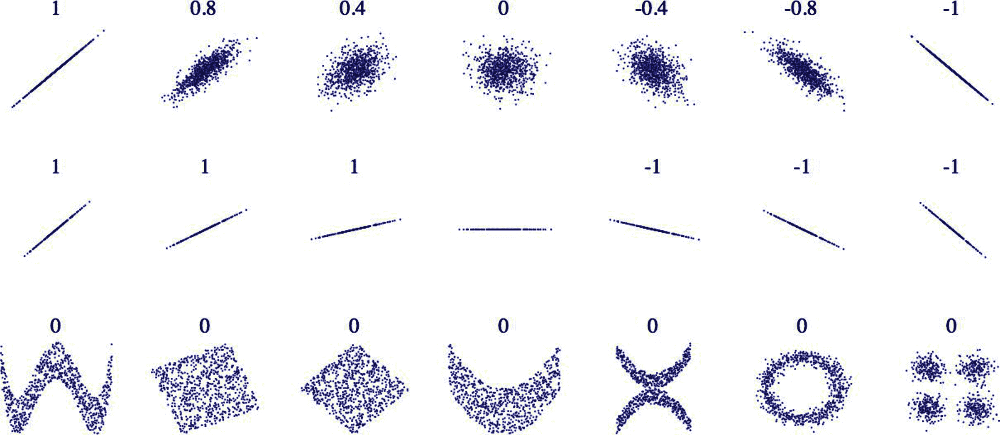
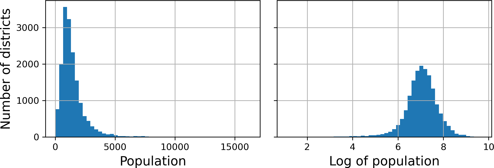
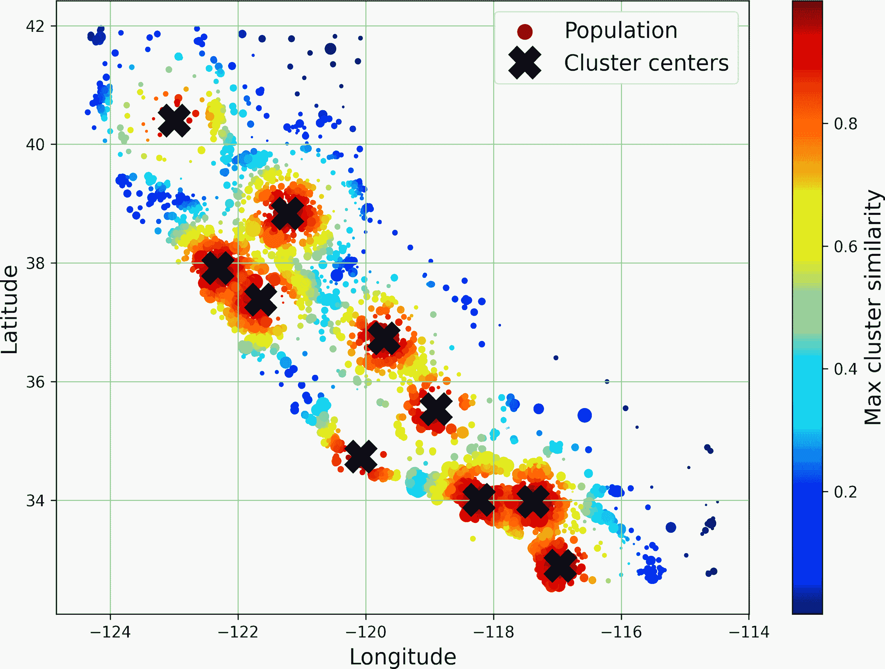

# 第二章\. 端到端机器学习项目

在本章中，你将从头到尾完成一个示例项目，假装你是一家房地产公司新聘请的数据科学家。这个例子是虚构的；目的是说明机器学习项目的关键步骤，而不是学习有关房地产业务的知识。以下是我们将要经历的步骤：

1.  看清大局。

1.  获取数据。

1.  探索和可视化数据以获得洞察。

1.  为机器学习算法准备数据。

1.  选择一个模型并对其进行训练。

1.  微调你的模型。

1.  展示你的解决方案。

1.  启动、监控和维护你的系统。

# 处理真实数据

当你学习机器学习时，最好是使用真实世界的数据进行实验，而不是人工数据集。幸运的是，有数千个开放数据集可供选择，涵盖各种领域。以下是一些你可以用来获取数据的流行开放数据存储库：

+   [Google 数据集搜索](https://datasetsearch.research.google.com)

+   [Hugging Face 数据集](https://huggingface.co/docs/datasets)

+   [OpenML.org](https://openml.org)

+   [Kaggle.com](https://kaggle.com/datasets)

+   [UC Irvine 机器学习存储库](https://archive.ics.uci.edu)

+   [斯坦福大学大型网络数据集收藏](https://snap.stanford.edu/data)

+   [Amazon 的 AWS 数据集](https://registry.opendata.aws)

+   [美国政府的开放数据](https://data.gov)

+   [DataPortals.org](https://dataportals.org)

+   [维基百科的机器学习数据集列表](https://homl.info/9)

在本章中，我们将使用来自 StatLib 存储库的加利福尼亚房价数据集（见图 2-1）。这个数据集基于 1990 年加利福尼亚的人口普查数据。它并不完全是最新的（当时旧金山湾区的房子仍然负担得起），但它具有许多学习特性，所以我们将假装它是最新数据。为了教学目的，我添加了一个分类属性并删除了一些特征。


###### 图 2-1\. 加利福尼亚房价

# 看清大局

欢迎来到机器学习住房公司！你的第一个任务是使用加利福尼亚人口普查数据来构建该州房价的模型。这些数据包括加利福尼亚每个街区组的指标，如人口、平均收入和平均房价。街区组是美国人口普查局发布样本数据的最小地理单位（街区组通常有 600 到 3000 人）。我将简称为“地区”。

你的模型应该从这些数据中学习，并能够预测任何地区的平均房价，给定所有其他指标。

###### 小贴士

由于您是一位组织有序的数据科学家，您应该做的第一件事是拿出您的机器学习项目清单。您可以从[*https://homl.info/checklist*](https://homl.info/checklist)上的清单开始；它应该对大多数机器学习项目都适用，但请确保根据您的需求进行调整。在本章中，我们将讨论许多清单项，但也会跳过一些，要么是因为它们是自我解释的，要么是因为它们将在后面的章节中讨论。

## 明确问题

您首先需要问您的老板业务目标是什么。构建模型可能不是最终目标。公司期望如何使用和从该模型中获益？了解目标是重要的，因为它将决定您如何明确问题，您将选择哪些算法，您将使用哪些性能指标来评估您的模型，以及您将投入多少精力来调整它。

您的老板回答说，您的模型输出（一个对某个地区中位数房价的预测）对于确定是否值得在该地区投资至关重要。更具体地说，您的模型输出将被输入到另一个机器学习系统中（见图 2-2），以及其他一些信号。⁠^(2) 因此，使我们的房价模型尽可能准确是很重要的。

接下来您需要问您的老板当前解决方案（如果有的话）是什么样子。当前情况通常会为您提供性能的参考，以及如何解决问题的见解。您的老板回答说，目前地区房价是由专家手动估算的：一个团队收集关于某个地区的最新信息，当他们无法获得中位数房价时，他们会使用复杂的规则进行估算。


###### 图 2-2\. 房地产投资的机器学习流程

这既昂贵又耗时，他们的估算并不理想；在那些他们设法找到实际中位数房价的情况下，他们常常发现他们的估算误差超过 30%。这就是为什么公司认为，训练一个模型来预测某个地区的中位数房价，给定该地区的其他数据，将是有用的。人口普查数据看起来是一个很好的数据集，可以用于此目的，因为它包括了数千个地区的中位数房价以及其他数据。

在获得所有这些信息后，你现在可以开始设计你的系统了。首先，确定模型需要的训练监督类型：是监督学习、无监督学习、半监督学习、自监督学习还是强化学习任务？它是分类任务、回归任务还是其他任务？你应该使用批处理学习还是在线学习技术？在你继续阅读之前，暂停一下，试着为自己回答这些问题。

你找到答案了吗？让我们看看。这显然是一个典型的监督学习任务，因为模型可以用*标记*的例子进行训练（每个实例都带有预期的输出，即该地区的平均房价）。它是一个典型的回归任务，因为模型将被要求预测一个值。更具体地说，这是一个*多元回归*问题，因为系统将使用多个特征进行预测（地区的总人口，平均收入等）。它也是一个*单变量回归*问题，因为我们只尝试预测每个地区的单个值。如果我们试图为每个地区预测多个值，那么它将是一个*多元回归*问题。最后，系统中没有连续的数据流进入，没有特别需要快速调整数据的需求，而且数据量足够小，可以放入内存中，所以普通的批处理学习应该就足够了。

###### 小贴士

如果数据量巨大，你可以选择将批处理学习工作分散到多个服务器上（使用 MapReduce 技术）或者使用在线学习技术。

## 选择性能指标

你的下一步是选择一个性能指标。回归问题的典型性能指标是*均方根误差*（RMSE）。它给出了系统在预测中通常犯多少错误的估计，对大误差给予更高的权重。方程式 2-1 显示了计算 RMSE 的数学公式。

##### 方程式 2-1\. 均方根误差 (RMSE)

$RMSE\left(\boldsymbol{X}, \boldsymbol{y}, h\right) = \sqrt{\frac{1}{m} \sum_{i=1}^{m} \left(h\left(\boldsymbol{x}^{(i)}\right) - \boldsymbol{y}^{(i)}\right)²}$

虽然 RMSE 通常是回归任务的首选性能指标，但在某些情况下，你可能更愿意使用另一个函数，尤其是在数据中存在许多异常值时，因为 RMSE 对它们相当敏感。在这种情况下，你可能考虑使用*均值绝对误差*（MAE，也称为*平均绝对偏差*），如方程式 2-2 所示：

##### 方程式 2-2\. 均值绝对误差 (MAE)

$MAE left-parenthesis bold upper X comma bold y comma h right-parenthesis equals StartFraction 1 Over m EndFraction sigma-summation Underscript i equals 1 Overscript m Endscripts StartAbsoluteValue h left-parenthesis bold x Superscript left-parenthesis i right-parenthesis Baseline right-parenthesis minus y Superscript left-parenthesis i right-parenthesis Baseline EndAbsoluteValue$

RMSE 和 MAE 都是衡量两个向量之间距离的方法：预测向量和目标值向量。可能的距离度量或 *范数* 有很多：

+   计算平方和的平方根（RMSE）对应于 *欧几里得范数*：这是我们所有人都熟悉的距离概念。它也被称为 ℓ[2] *范数*，表示为 ∥ · ∥[2]（或简称 ∥ · ∥）。

+   计算绝对值之和（MAE）对应于 ℓ[1] *范数*，表示为 ∥ · ∥[1]。这有时被称为 *曼哈顿范数*，因为它衡量了在只能沿正交城市街区行走的条件下，两个点之间的距离。

+   更一般地，包含 *n* 个元素的向量 **v** 的 ℓ[*k*] *范数* 定义为 ∥**v**∥[*k*] = (|*v*[1]|^(*k*) + |*v*[2]|^(*k*) + ... + |*v*[*n*]|^(*k*))^(1/*k*). ℓ[0] 表示向量中非零元素的数量，而 ℓ[∞] 表示向量中的最大绝对值。

范数指数越高，它就越关注大值而忽略小值。这就是为什么 RMSE 比 MAE 更敏感于异常值。但当异常值指数级罕见（如钟形曲线中）时，RMSE 表现得非常好，并且通常更受欢迎。

## 检查假设

最后，列出并验证到目前为止（由你或他人）所做出的假设是一个好的实践；这可以帮助你及早发现严重问题。例如，你的系统输出的区域价格将被输入到下游机器学习系统中，你假设这些价格将被用作此类。但如果是下游系统将价格转换为类别（例如，“便宜”、“中等”或“昂贵”）然后使用这些类别而不是价格本身呢？在这种情况下，价格完全正确并不重要；你的系统只需要正确分类。如果真是这样，那么问题应该被界定为分类任务，而不是回归任务。你不想在为回归系统工作了数月之后才发现这一点。

幸运的是，在与负责下游系统的团队交谈后，你确信他们确实需要实际的价格，而不仅仅是类别。太好了！一切准备就绪，绿灯亮起，你现在可以开始编码了！

# 获取数据

是时候动手实践了。不要犹豫，拿起您的笔记本电脑，浏览代码示例。正如我在前言中提到的，本书中的所有代码示例都是开源的，并以 Jupyter 笔记本的形式[在线](https://github.com/ageron/handson-mlp)提供，这些是包含文本、图像和可执行代码片段（在我们的案例中是 Python）的交互式文档。在这本书中，我将假设您正在 Google Colab 上运行这些笔记本，这是一个免费服务，允许您直接在线运行任何 Jupyter 笔记本，而无需在您的机器上安装任何东西。如果您想使用其他在线平台（例如 Kaggle）或如果您想在您的机器上本地安装所有内容，请参阅本书 GitHub 页面上的说明。

## 使用 Google Colab 运行代码示例

首先，打开一个网页浏览器并访问[*https://homl.info/colab-p*](https://homl.info/colab-p)：这将带您进入 Google Colab，并显示本书的 Jupyter 笔记本列表（见图 2-3）。您将找到每个章节的一个笔记本，以及一些额外的 NumPy、Matplotlib、Pandas、线性代数和微分计算的笔记本和教程。例如，如果您点击*02_end_to_end_machine_learning_project.ipynb*，来自第二章的笔记本将在 Google Colab 中打开（见图 2-4）。

Jupyter 笔记本由一系列单元格组成。每个单元格包含可执行代码或文本。尝试双击第一个文本单元格（包含句子“欢迎来到机器学习住房公司！”）。这将打开单元格以进行编辑。请注意，Jupyter 笔记本使用 Markdown 语法进行格式化（例如，`**粗体**`，`*斜体*`，`# 标题`，`url`等）。尝试修改此文本，然后按 Shift-Enter 查看结果。


###### 图 2-3\. Google Colab 中的笔记本列表


###### 图 2-4\. 您在 Google Colab 中的笔记本

接下来，通过选择菜单中的“插入”→“代码单元格”来创建一个新的代码单元格。或者，您也可以点击工具栏上的+代码按钮，或者将鼠标悬停在单元格底部直到出现+代码和+文本，然后点击+代码。在新的代码单元格中，输入一些 Python 代码，例如`print("Hello World")`，然后按 Shift-Enter 运行此代码（或点击单元格左侧的▷按钮）。

如果您尚未登录到您的 Google 账户，您现在将被要求登录（如果您还没有 Google 账户，您需要创建一个）。一旦您登录，当您尝试运行代码时，您将看到一个安全警告，告诉您这个笔记本不是由 Google 编写的。恶意的人可能会创建一个试图诱骗您输入您的 Google 凭据的笔记本，以便他们可以访问您的个人数据，因此在运行笔记本之前，请始终确保您信任其作者（或者运行之前双重检查每个代码单元格将执行的操作）。假设您信任我（或者您计划检查每个代码单元格），现在您可以点击“继续运行”。

然后 Colab 将为您分配一个新的 *运行时*：这是一个位于 Google 服务器上的免费虚拟机，其中包含许多工具和 Python 库，包括您在大多数章节中所需的所有内容（在某些章节中，您需要运行命令来安装额外的库）。这需要几秒钟。接下来，Colab 将自动连接到这个运行时并使用它来执行您的新代码单元格。重要的是，代码是在运行时上运行的，*而不是* 在您的机器上。代码的输出将显示在单元格下方。恭喜，您已经在 Colab 上运行了一些 Python 代码！

###### 小贴士

要插入一个新的代码单元格，您也可以输入 Ctrl-M（或在 macOS 上为 Cmd-M）后跟 A（在活动单元格上方插入）或 B（在活动单元格下方插入）。还有许多其他的快捷键可用：您可以通过输入 Ctrl-M（或在 macOS 上为 Cmd-M）然后 H 来查看和编辑它们。如果您选择在 Kaggle 或在自己的机器上使用 JupyterLab 或带有 Jupyter 扩展的 IDE（如 Visual Studio Code）运行笔记本，您将看到一些细微的差异——运行时被称为 *kernels*，用户界面和快捷键略有不同等——但从一种 Jupyter 环境切换到另一种并不太难。

## 保存代码更改和您的数据

您可以对 Colab 笔记本进行修改，并且只要您保持浏览器标签页打开，这些修改就会持续存在。但一旦您关闭它，修改就会丢失。为了避免这种情况，请确保通过选择“文件”→“在 Drive 中保存副本”来将笔记本的副本保存到您的 Google Drive。或者，您也可以通过选择“文件”→“下载”→“下载 .ipynb”将笔记本下载到您的电脑上。然后您可以在稍后访问[*https://colab.research.google.com*](https://colab.research.google.com)并再次打开笔记本（无论是从 Google Drive 还是上传到您的电脑）。

###### 警告

Google Colab 仅适用于交互式使用：您可以在笔记本中随意操作并按需调整代码，但您不能让笔记本长时间无人看管，否则运行时将被关闭，所有数据都将丢失。

如果笔记本生成了你关心的数据，确保在运行时关闭之前下载这些数据。为此，点击文件图标（见图 2-5 中的步骤 1），找到你想要下载的文件，点击它旁边的垂直点（步骤 2），然后点击下载（步骤 3）。或者，你可以在运行时挂载你的 Google Drive，允许笔记本直接将文件读写到 Google Drive，就像它是本地目录一样。为此，点击文件图标（步骤 1），然后点击图 2-5 中圈出的 Google Drive 图标，并按照屏幕上的说明操作。



###### 图 2-5\. 从 Google Colab 运行时下载文件（步骤 1 到 3），或挂载你的 Google Drive（圈出的图标）

默认情况下，你的 Google Drive 将挂载在*/content/drive/MyDrive*。如果你想备份一个数据文件，只需通过运行`!cp [.keep-together]#/content/my_great_model /content/drive/MyDrive`将其复制到这个目录。# 任何以感叹号（`!`）开头的命令都被视为 shell 命令，而不是 Python 代码：`cp`是 Linux shell 命令，用于将文件从一个路径复制到另一个路径。请注意，Colab 运行时在 Linux 上运行（具体来说，是 Ubuntu）。

## 交互式功能的强大与危险

Jupyter 笔记本是交互式的，这是一个非常好的特性：你可以逐个运行每个单元格，在任何地方停止，插入一个单元格，玩弄代码，返回并再次运行相同的单元格，等等，我强烈鼓励你这样做。如果你只是逐个运行单元格而不进行任何操作，你学得不会那么快。然而，这种灵活性是有代价的：很容易以错误的顺序运行单元格，或者忘记运行某个单元格。如果发生这种情况，后续的代码单元格很可能会失败。例如，每个笔记本中的第一个代码单元格包含设置代码（例如导入），所以请确保你首先运行它，否则什么都不会工作。

###### 小贴士

如果你遇到任何奇怪的错误，尝试重新启动运行时（通过从菜单中选择“运行时”→“重新启动运行时”），然后从笔记本的开头重新运行所有单元格。这通常可以解决问题。如果不行，很可能是你做的某个更改破坏了笔记本：只需恢复到原始笔记本并再次尝试。如果仍然失败，请在 GitHub 上提交一个问题。

## 书本代码与笔记本代码

你有时可能会注意到这本书中的代码和笔记本中的代码之间有一些小小的差异。这可能由几个原因造成：

+   当你阅读这些行时，库可能已经略有变化，或者也许尽管我尽了最大努力，但在书中我可能犯了一个错误。遗憾的是，我无法神奇地修复你这本书中的代码（除非你正在阅读电子版，并且可以下载最新版本），但我*可以*修复笔记本。所以，如果你从这本书中复制代码后遇到错误，请查找笔记本中的修复代码：我将努力确保它们没有错误，并且与最新库版本保持更新。

+   笔记本中包含一些额外的代码，用于美化图形（添加标签、设置字体大小等），并将它们以高分辨率保存到这本书中。如果你想忽略这些额外的代码，可以安全地忽略它们。

我优化了代码的可读性和简洁性：我使其尽可能线性和平坦，定义了非常少的函数或类。目标是确保你运行的代码通常就在你面前，而不是嵌套在几层抽象中，你需要搜索。这也使得你可以更容易地玩转代码。为了简单起见，错误处理有限，我将一些不太常见的导入放在了它们需要的位置（而不是像 PEP 8 Python 风格指南推荐的那样放在文件顶部）。话虽如此，你的生产代码不会有很大不同：只是稍微模块化一些，并增加了额外的测试和错误处理。

好的！一旦你对 Colab 感到舒适，你就可以下载数据了。

## 下载数据

在典型的环境中，你的数据将存储在关系数据库或其他常见的数据存储中，并分布在多个表/文档/文件中。要访问它，你首先需要获取你的凭证和访问授权，并熟悉数据模式。⁠^(4) 然而，在这个项目中，事情要简单得多：你只需下载一个单个的压缩文件，*housing.tgz*，它包含一个名为*housing.csv*的逗号分隔值（CSV）文件，其中包含所有数据。

与手动下载和解压缩数据相比，通常更可取的是编写一个为你完成这些操作的函数。特别是如果数据经常变化，这很有用：你可以编写一个小脚本，使用该函数获取最新数据（或者你可以设置一个计划任务，定期自动执行该操作）。如果需要将数据集安装到多台机器上，自动化获取数据的过程也很有用。

这里是获取和加载数据的函数：

```py
from pathlib import Path
import pandas as pd
import tarfile
import urllib.request

def load_housing_data():
    tarball_path = Path("datasets/housing.tgz")
    if not tarball_path.is_file():
        Path("datasets").mkdir(parents=True, exist_ok=True)
        url = "https://github.com/ageron/data/raw/main/housing.tgz"
        urllib.request.urlretrieve(url, tarball_path)
        with tarfile.open(tarball_path) as housing_tarball:
            housing_tarball.extractall(path="datasets", filter="data")
    return pd.read_csv(Path("datasets/housing/housing.csv"))

housing_full = load_housing_data()
```

###### 注意

如果你遇到 SSL `CERTIFICATE_VERIFY_FAILED`错误，那么你很可能是需要安装`certifi`包，如[*https://homl.info/sslerror*](https://homl.info/sslerror)中所述。

当调用 `load_housing_data()` 时，它会寻找 *datasets/housing.tgz* 文件。如果找不到，它将在当前目录（在 Colab 中默认为 */content*）内创建 *datasets* 目录，从 *ageron/data* GitHub 仓库下载 *housing.tgz* 文件，并将其内容提取到 *datasets* 目录中；这将在 *datasets*/*housing* 目录中创建一个包含 *housing.csv* 文件的目录。最后，该函数将这个 CSV 文件加载到一个包含所有数据的 Pandas DataFrame 对象中，并返回它。

###### 注意

如果你正在使用 Python 3.12 或 3.13，你应该在 `extractall()` 方法的参数中添加 `filter='data'`：这限制了提取算法可以执行的操作并提高了安全性（更多详情请参阅文档）。

## 快速查看数据结构

你首先使用 DataFrame 的 `head()` 方法查看数据的前五行（见 图 2-6）。


###### 图 2-6\. 数据集的前五行

每行代表一个区域。有 10 个属性（它们并非都在截图显示）：`longitude`、`latitude`、`housing_median_age`、`total_rooms`、`total_bedrooms`、`population`、`households`、`median_income`、`median_house_value` 和 `ocean_proximity`。

`info()` 方法很有用，可以快速获取数据的描述，特别是总行数、每个属性的类型以及非空值的数量：

```py
>>> housing_full.info()
<class 'pandas.core.frame.DataFrame'>
RangeIndex: 20640 entries, 0 to 20639
Data columns (total 10 columns):
 #   Column              Non-Null Count  Dtype
---  ------              --------------  -----
 0   longitude           20640 non-null  float64
 1   latitude            20640 non-null  float64
 2   housing_median_age  20640 non-null  float64
 3   total_rooms         20640 non-null  float64
 4   total_bedrooms      20433 non-null  float64
 5   population          20640 non-null  float64
 6   households          20640 non-null  float64
 7   median_income       20640 non-null  float64
 8   median_house_value  20640 non-null  float64
 9   ocean_proximity     20640 non-null  object
dtypes: float64(9), object(1)
memory usage: 1.6+ MB
```

###### 注意

在这本书中，当代码示例包含代码和输出的混合时，就像这里一样，它将被格式化为 Python 解释器中的格式，以便更好地阅读：代码行以 `>>>`（或缩进块的 `...`）为前缀，而输出没有前缀。

数据集中有 20,640 个实例，这意味着按照机器学习标准来看，它相当小，但非常适合入门。你可能会注意到 `total_bedrooms` 属性只有 20,433 个非空值，这意味着有 207 个区域缺少这个特征。你需要在稍后处理这个问题。

所有属性都是数值型，除了 `ocean_proximity`。它的类型是 `object`，所以它可以包含任何类型的 Python 对象。但既然你从 CSV 文件中加载了这些数据，你就知道它必须是一个文本属性。当你查看前五行时，你可能会注意到 `ocean_proximity` 列中的值是重复的，这意味着它可能是一个分类属性。你可以使用 `value_counts()` 方法找出存在的分类以及每个分类包含多少个区域：

```py
>>> housing_full["ocean_proximity"].value_counts()
ocean_proximity
<1H OCEAN     9136
INLAND        6551
NEAR OCEAN    2658
NEAR BAY      2290
ISLAND           5
Name: count, dtype: int64
```

让我们看看其他字段。`describe()` 方法显示了数值属性的摘要（图 2-7）。


###### 图 2-7。每个数值属性的摘要

`count`、`mean`、`min`和`max`行具有自解释性。请注意，空值被忽略（例如，`total_bedrooms`的`count`为 20,433，而不是 20,640）。`std`行显示的是*标准差*，它衡量值如何分散。⁠^(5) `25%`、`50%`和`75%`行显示相应的*百分位数*：百分位数表示在观察组中，给定百分比的数据点低于该值。例如，25%的区域`housing_median_age`低于 18 岁，而 50%低于 29 岁，75%低于 37 岁。这些通常被称为第 25 百分位数（或第一*四分位数*）、中位数和第 75 百分位数（或第三四分位数）。

另一种快速了解你正在处理的数据类型的方法是为每个数值属性绘制直方图。直方图显示了具有给定值范围（在水平轴上）的实例数（在垂直轴上）。你可以一次绘制一个属性，或者可以在整个数据集上调用`hist()`方法（如下面的代码示例所示），它将为每个数值属性绘制直方图（参见图 2-8）。


###### 图 2-8。每个数值属性的直方图

可以使用`bins`参数调整值范围的数目（尝试调整它以查看它如何影响直方图）：

```py
import matplotlib.pyplot as plt

housing_full.hist(bins=50, figsize=(12, 8))
plt.show()
```

观察这些直方图，你会注意到一些事情：

+   首先，中位收入属性看起来不像是以美元（USD）表示的。在与收集数据的团队确认后，你被告知数据已被缩放并限制在 15（实际上是 15.0001）以上，对于较低的中位收入限制在 0.5（实际上是 0.4999）。这些数字代表大约数万美元（例如，3 实际上意味着大约 30,000 美元）。在机器学习中使用预处理属性很常见，这并不一定是问题，但你应该尝试理解数据是如何计算的。

+   住房中位数年龄和中位数房价也被限制。后者可能是一个严重的问题，因为它是你目标属性（你的标签）。你的机器学习算法可能会学习到价格永远不会超过那个限制。你需要与你的客户团队（将使用你的系统输出的团队）确认，看看这是否是一个问题。如果他们告诉你，他们需要精确预测甚至超过 500,000 美元，那么你有两个选择：

    +   收集那些标签被截断的区域的正确标签。

    +   从训练集（以及测试集，因为如果你的系统预测的值超过 $500,000$，那么它应该不会表现得太差）中移除那些区域。

+   这些属性具有非常不同的尺度。我们将在本章后面讨论特征缩放时再讨论这个问题。

+   最后，许多直方图是*右偏的*：它们在均值右侧延伸得比左侧远得多。这可能会让某些机器学习算法检测模式变得有点困难。稍后，你将尝试将这些属性转换成更对称和钟形分布。

你现在应该对你要处理的数据类型有了更好的理解。

## 创建测试集

在你进一步查看数据之前，你需要创建一个测试集，将其放在一边，并且永远不要再看它。在这个阶段自愿将数据的一部分放在一边似乎很奇怪。毕竟，你只是快速浏览了一下数据，在你决定使用哪些算法之前，你当然应该更多地了解它，对吧？这是真的，但你的大脑是一个惊人的模式检测系统，这也意味着它非常容易过拟合：如果你查看测试集，你可能会在测试数据中发现一些看似有趣的模式，这会让你选择特定的机器学习模型。当你使用测试集估计泛化误差时，你的估计将过于乐观，你将启动一个表现不如预期的系统。这被称为*数据窥探*偏差。

创建测试集在理论上很简单；随机选择一些实例，通常是数据集的 20%（如果数据集非常大，则更少），并将它们放在一边：

```py
import numpy as np

def shuffle_and_split_data(data, test_ratio, rng):
    shuffled_indices = rng.permutation(len(data))
    test_set_size = int(len(data) * test_ratio)
    test_indices = shuffled_indices[:test_set_size]
    train_indices = shuffled_indices[test_set_size:]
    return data.iloc[train_indices], data.iloc[test_indices]
```

你可以使用这个函数如下：

```py
>>> rng = np.random.default_rng()  # default random number generator
>>> train_set, test_set = shuffle_and_split_data(housing_full, 0.2, rng)
>>> len(train_set)
16512
>>> len(test_set)
4128
```

嗯，这行得通，但并不完美：如果你再次运行程序，它将生成不同的测试集！随着时间的推移，你（或你的机器学习算法）将看到整个数据集，这正是你想要避免的。

一种解决方案是在第一次运行时保存测试集，然后在后续运行中加载它。另一个选项是设置随机数生成器的种子（例如，通过将 `seed=42` 传递给 `default_rng()` 函数）⁠^(6)，以确保每次运行程序时都生成相同的随机数序列。

然而，这两种解决方案在下次获取更新后的数据集时都会失效。为了在更新数据集后仍然有一个稳定的训练/测试分割，一个常见的解决方案是使用每个实例的标识符来决定它是否应该进入测试集（假设实例具有唯一且不可变的标识符）。例如，你可以计算每个实例标识符的哈希值，并将该实例放入测试集，如果哈希值小于或等于最大哈希值的 20%。这确保了测试集在多次运行中保持一致性，即使你刷新了数据集。新的测试集将包含 20%的新实例，但不会包含任何之前在训练集中的实例。

这里是一个可能的实现：

```py
from zlib import crc32

def is_id_in_test_set(identifier, test_ratio):
    return crc32(np.int64(identifier)) < test_ratio * 2**32

def split_data_with_id_hash(data, test_ratio, id_column):
    ids = data[id_column]
    in_test_set = ids.apply(lambda id_: is_id_in_test_set(id_, test_ratio))
    return data.loc[~in_test_set], data.loc[in_test_set]
```

不幸的是，住房数据集没有标识符列。最简单的解决方案是使用行索引作为 ID：

```py
housing_with_id = housing_full.reset_index()  # adds an `index` column
train_set, test_set = split_data_with_id_hash(housing_with_id, 0.2, "index")
```

如果你使用行索引作为唯一标识符，你需要确保新数据被追加到数据集的末尾，并且永远不会删除任何行。如果这不可能实现，那么你可以尝试使用最稳定的特征来构建一个唯一标识符。例如，一个地区的纬度和经度在几百万年内是保证稳定的，因此你可以将它们组合成一个 ID，如下所示：⁠^(7)

```py
housing_with_id["id"] = (housing_full["longitude"] * 1000
                         + housing_full["latitude"])
train_set, test_set = split_data_with_id_hash(housing_with_id, 0.2, "id")
```

Scikit-Learn 提供了一些函数，可以将数据集以多种方式分割成多个子集。最简单的函数是`train_test_split()`，它几乎与我们在前面定义的`shuffle_and_split_data()`函数做的是同样的事情，但增加了一些额外的功能。首先，有一个`random_state`参数，允许你设置随机生成器的种子。其次，你可以传递多个具有相同行数的数据集，并且它将在相同的索引上分割它们（这在某些情况下非常有用，例如，如果你有一个单独的 DataFrame 用于标签）：

```py
from sklearn.model_selection import train_test_split

train_set, test_set = train_test_split(housing_full, test_size=0.2,
                                       random_state=42)
```

到目前为止，我们考虑了纯随机抽样方法。如果你的数据集足够大（尤其是相对于属性数量），这通常是可行的，但如果不这样，你可能会引入显著的抽样偏差。当调查公司的员工决定给 1000 人打电话，问他们一些问题时，他们不会在电话簿中随机挑选 1000 人。他们试图确保这 1000 人能代表整个群体，针对他们想要询问的问题。例如，根据美国人口普查局的数据，51.6%的投票年龄公民是女性，而 48.4%是男性，因此在美国进行的一项良好调查会试图在样本中保持这一比例：516 名女性和 484 名男性（至少如果答案可能因性别而异的话）。这被称为*分层抽样*：人口被划分为同质子群体，称为*层*，并从每个层中抽取适当数量的实例，以确保测试集能代表整体人口。如果进行调查的人使用纯随机抽样，那么抽取一个女性比例低于 49%或高于 54%的测试集的概率会超过 10%。无论如何，调查结果可能会非常偏颇。

假设你已经和一些专家交谈过，他们告诉你中位数收入是预测中位数房价的一个重要属性。你可能想确保测试集能代表整个数据集中各种收入类别。由于中位数收入是一个连续的数值属性，你首先需要创建一个收入类别属性。让我们更仔细地看看中位数收入直方图（回到图 2-8）：大多数中位数收入值集中在 1.5 到 6 之间（即，$15,000–$60,000），但有些中位数收入远远超过 6。在你的数据集中为每个层有足够数量的实例是很重要的，否则对层重要性的估计可能会偏颇。这意味着你不应该有太多的层，并且每个层应该足够大。以下代码使用`pd.cut()`函数创建了一个有五个类别（从 1 到 5 标记）的收入类别属性；类别 1 的范围是 0 到 1.5（即，低于$15,000），类别 2 从 1.5 到 3，依此类推：

```py
housing_full["income_cat"] = pd.cut(housing_full["median_income"],
                                    bins=[0., 1.5, 3.0, 4.5, 6., np.inf],
                                    labels=[1, 2, 3, 4, 5])
```

这些收入类别在图 2-9 中表示：

```py
cat_counts = housing_full["income_cat"].value_counts().sort_index()
cat_counts.plot.bar(rot=0, grid=True)
plt.xlabel("Income category")
plt.ylabel("Number of districts")
plt.show()
```

现在你可以根据收入类别进行分层抽样了。Scikit-Learn 在`sklearn.model_selection`包中提供了一些分割器类，它们实现了将数据集分割为训练集和测试集的各种策略。每个分割器都有一个`split()`方法，它返回对相同数据的不同训练/测试分割的迭代器。


###### 图 2-9. 收入类别直方图

为了更精确，`split()`方法返回的是训练和测试*索引*，而不是数据本身。如果你想要更好地估计模型的性能，多个分割可能会有用，正如我们在本章后面讨论交叉验证时将看到的。例如，以下代码生成了 10 个不同的分层分割的相同数据集：

```py
from sklearn.model_selection import StratifiedShuffleSplit

splitter = StratifiedShuffleSplit(n_splits=10, test_size=0.2, random_state=42)
strat_splits = []
for train_index, test_index in splitter.split(housing_full,
                                              housing_full["income_cat"]):
    strat_train_set_n = housing_full.iloc[train_index]
    strat_test_set_n = housing_full.iloc[test_index]
    strat_splits.append([strat_train_set_n, strat_test_set_n])
```

目前，你可以只使用第一个分割：

```py
strat_train_set, strat_test_set = strat_splits[0]
```

或者，由于分层抽样相当常见，你可以使用带有`stratify`参数的`train_test_split()`函数来通过更短的方式获得单个分割：

```py
strat_train_set, strat_test_set = train_test_split(
    housing_full, test_size=0.2, stratify=housing_full["income_cat"],
    random_state=42)
```

让我们看看这是否如预期那样工作。你可以从查看测试集中的收入类别比例开始：

```py
>>> strat_test_set["income_cat"].value_counts() / len(strat_test_set)
income_cat
3    0.350533
2    0.318798
4    0.176357
5    0.114341
1    0.039971
Name: count, dtype: float64
```

使用类似的代码，你可以测量整个数据集中收入类别的比例。图 2-10 比较了整体数据集、使用分层抽样生成的测试集以及使用纯随机抽样生成的测试集中的收入类别比例。如图所示，使用分层抽样生成的测试集的收入类别比例几乎与整个数据集中的比例相同，而使用纯随机抽样生成的测试集则存在偏差。


###### 图 2-10. 分层抽样与纯随机抽样的采样偏差比较

你将不再使用`income_cat`列，所以你可以将其删除，将数据恢复到其原始状态：

```py
for set_ in (strat_train_set, strat_test_set):
    set_.drop("income_cat", axis=1, inplace=True)
```

我们在测试集生成上花费了大量时间，这是有充分理由的：这是机器学习项目中经常被忽视但至关重要的一个部分。此外，许多这些想法将在我们后面讨论交叉验证时变得有用。现在，是时候进入下一阶段：探索数据。

# 探索和可视化数据以获得洞察

到目前为止，你只是快速浏览了数据，以获得对所处理数据类型的一般了解。现在目标是深入一些。

首先，确保你已经将测试集放在一边，并且你只探索训练集。此外，如果训练集非常大，你可能想要采样一个探索集，以便在探索阶段轻松快速地进行操作。在这种情况下，训练集相当小，所以你可以直接在完整集上工作。由于你将要对整个训练集的各种转换进行实验，你应该制作一个原始副本，以便之后可以恢复：

```py
housing = strat_train_set.copy()
```

## 可视化地理数据

由于数据集包括地理信息（纬度和经度），创建所有地区的散点图以可视化数据是个好主意（图 2-11）：

```py
housing.plot(kind="scatter", x="longitude", y="latitude", grid=True)
plt.show()
```


###### 图 2-11. 数据的地理散点图

这看起来确实像加利福尼亚，但除此之外，很难看出任何特定的模式。将`alpha`选项设置为`0.2`使得可视化数据点密集的地方变得容易多了（图 2-12）：

```py
housing.plot(kind="scatter", x="longitude", y="latitude", grid=True, alpha=0.2)
plt.show()
```

现在好多了：你可以清楚地看到高密度区域，即旧金山湾区以及洛杉矶和圣地亚哥周围，以及中央谷地中一条相当高密度区域的漫长线条（特别是在萨克拉门托和弗雷斯诺周围）。

我们的大脑在图片中寻找模式方面非常擅长，但你可能需要调整可视化参数以使模式更加突出。


###### 图 2-12. 更好的可视化，突出显示高密度区域

接下来，你查看房价（图 2-13）。每个圆的半径代表该地区的总人口（选项`s`），颜色代表价格（选项`c`）。在这里，你使用一个预定义的颜色映射（选项`cmap`）称为`jet`，范围从蓝色（低值）到红色（高价）：⁠^(8)

```py
housing.plot(kind="scatter", x="longitude", y="latitude", grid=True,
             s=housing["population"] / 100, label="population",
             c="median_house_value", cmap="jet", colorbar=True,
             legend=True, sharex=False, figsize=(10, 7))
plt.show()
```

这张图片告诉你，房价与位置（例如，靠近海洋）和人口密度有很大关系，你可能已经知道了。聚类算法应该有助于检测主要簇并添加测量簇中心接近度的特征。海洋接近度属性也可能很有用，尽管在加利福尼亚北部，沿海地区的房价并不太高，因此这不是一个简单的规则。



###### 图 2-13. 加利福尼亚房价：红色表示昂贵，蓝色表示便宜，较大的圆圈表示人口较多的地区

## 寻找相关性

由于数据集不是很大，你可以轻松地使用`corr()`方法计算每对数值属性之间的*标准相关系数*（也称为*皮尔逊相关系数*）：

```py
corr_matrix = housing.corr(numeric_only=True)
```

现在，你可以查看每个属性与中值房价的相关程度：

```py
>>> corr_matrix["median_house_value"].sort_values(ascending=False)
median_house_value    1.000000
median_income         0.688380
total_rooms           0.137455
housing_median_age    0.102175
households            0.071426
total_bedrooms        0.054635
population           -0.020153
longitude            -0.050859
latitude             -0.139584
Name: median_house_value, dtype: float64
```

相关系数范围从-1 到 1。当它接近 1 时，表示存在强烈的正相关；例如，当中等收入上升时，中等房价往往会上升。当系数接近-1 时，表示存在强烈的负相关；你可以看到纬度与中等房价之间存在轻微的负相关（即，价格有轻微的下降趋势，当你向北走时）。最后，接近 0 的系数表示没有线性相关性。

检查属性之间的相关性还有另一种方法，即使用 Pandas 的`scatter_matrix()`函数，该函数将每个数值属性与每个其他数值属性进行绘图。由于现在有 9 个数值属性，你会得到 81 个绘图，这不会适合在一页纸上显示——因此你决定专注于几个似乎与中等住房价值最相关的有希望的属性（图 2-14）：

```py
from pandas.plotting import scatter_matrix

attributes = ["median_house_value", "median_income", "total_rooms",
              "housing_median_age"]
scatter_matrix(housing[attributes], figsize=(12, 8))
plt.show()
```


###### 图 2-14\. 这个散点矩阵将每个数值属性与每个其他数值属性进行对比，同时在主对角线上（从左上角到底右角）显示每个数值属性的值直方图

如果 Pandas 将每个变量与其自身进行绘图，主对角线将充满直线，这不会很有用。因此，Pandas 显示每个属性的直方图（其他选项也可用；有关更多详细信息，请参阅 Pandas 文档）。

观察相关性散点图，似乎预测中等房价最有希望的属性是中等收入，因此你放大了该散点图（图 2-15）：

```py
housing.plot(kind="scatter", x="median_income", y="median_house_value",
             alpha=0.1, grid=True)
plt.show()
```



###### 图 2-15\. 中等收入与中等房价对比

此图揭示了一些事情。首先，相关性确实相当强；你可以清楚地看到上升趋势，尽管数据有噪声。其次，你之前注意到的价格上限在$500,000 处清楚地显示为一条水平线。但该图还揭示了其他不太明显的直线：大约在$450,000 处的一条水平线，另一条大约在$350,000 处，可能还有一条大约在$280,000 处，以及一些更低的。你可能想要尝试删除相应的区域，以防止你的算法学习到这些数据异常。

注意，相关系数仅衡量线性相关性（“当*x*增加时，*y*通常增加/减少”）。它可能完全忽略非线性关系（例如，“当*x*接近 0 时，*y*通常增加”）。图 2-16 显示了各种数据集及其相关系数。注意，底部所有图表的相关系数都等于 0，尽管它们的轴显然*不是*独立的：这些都是非线性关系的例子。此外，第二行显示了相关系数等于 1 或-1 的例子；请注意，这与斜率无关。例如，你的英寸身高与你的英尺身高或纳米身高有 1 的相关系数。



###### 图 2-16\. 各种数据集的标准相关系数（来源：维基百科；公有领域图片）

## 尝试属性组合

希望前几节能给你一些启发，让你了解一些探索数据并获取洞察的方法。你识别出了一些可能需要清理的数据异常，在将数据输入机器学习算法之前，你发现了属性之间的有趣相关性，特别是与目标属性的相关性。你还注意到一些属性具有偏右分布，因此你可能想要对它们进行转换（例如，通过计算它们的对数或平方根）。当然，每个项目的里程数可能会有很大差异，但总体思路是相似的。

在准备数据用于机器学习算法之前，你可能还想尝试各种属性组合。例如，如果你不知道该地区有多少家庭，那么该地区总房间数并不是很有用。你真正想要的是每户家庭的房间数。同样，仅凭卧室总数本身也不是很有用：你可能想将其与总房间数进行比较。而且，每户家庭的人口数也是一个有趣的属性组合。你可以按照以下方式创建这些新属性：

```py
housing["rooms_per_house"] = housing["total_rooms"] / housing["households"]
housing["bedrooms_ratio"] = housing["total_bedrooms"] / housing["total_rooms"]
housing["people_per_house"] = housing["population"] / housing["households"]
```

然后你再次查看相关矩阵：

```py
>>> corr_matrix = housing.corr(numeric_only=True)
>>> corr_matrix["median_house_value"].sort_values(ascending=False)
median_house_value    1.000000
median_income         0.688380
rooms_per_house       0.143663
total_rooms           0.137455
housing_median_age    0.102175
households            0.071426
total_bedrooms        0.054635
population           -0.020153
people_per_house     -0.038224
longitude            -0.050859
latitude             -0.139584
bedrooms_ratio       -0.256397
Name: median_house_value, dtype: float64
```

嘿，不错！新的`bedrooms_ratio`属性与总房间数或卧室总数相比，与中位数房价的相关性要强得多。这是一个强烈的负相关，所以看起来卧室/房间比例较低的房屋往往更贵。每户家庭的房间数也比该地区总房间数更有信息量——显然，房屋越大，价格越高。

###### 警告

在创建新的组合特征时，确保它们与现有特征不是过于线性相关的：*共线性*可能会导致某些模型（如线性回归）出现问题。特别是，避免简单地将现有特征的加权总和。

这轮探索不必绝对彻底；目的是从正确的起点开始，快速获得有助于您获得第一个合理良好的原型的洞察力。但这是一个迭代过程：一旦原型运行起来，您可以通过分析其输出获得更多洞察力，并返回到这一探索步骤。

# 准备数据以供机器学习算法使用

是时候为您的机器学习算法准备数据了。而不是手动进行，您应该为此编写函数，有以下几个很好的理由：

+   这将使您能够轻松地在任何数据集（例如，下次您获得新的数据集时）上重现这些转换。

+   您将逐步构建一个可以重复用于未来项目的转换函数库。

+   您可以在您的实时系统中使用这些函数，在将新数据输入到算法之前对其进行转换。

+   这将使您能够轻松尝试各种转换，并查看哪种转换组合效果最佳。

但首先，恢复到一个干净的训练集（通过再次复制 `strat_train_set`）。您还应该分离预测值和标签，因为您不一定想对预测值和目标值应用相同的转换（注意 `drop()` 会创建数据的副本，不会影响 `strat_train_set`）：

```py
housing = strat_train_set.drop("median_house_value", axis=1)
housing_labels = strat_train_set["median_house_value"].copy()
```

## 清理数据

大多数机器学习算法无法处理缺失特征，因此您需要处理这些问题。例如，您之前注意到 `total_bedrooms` 属性有一些缺失值。您有三个选项来修复这个问题：

1.  删除相应的区域。

1.  删除整个属性。

1.  将缺失值设置为某个值（零、平均值、中间值等）。这被称为 *填充*。

您可以使用 Pandas DataFrame 的 `dropna()`、`drop()` 和 `fillna()` 方法轻松完成这些操作：

```py
housing.dropna(subset=["total_bedrooms"], inplace=True)  # option 1

housing.drop("total_bedrooms", axis=1, inplace=True)  # option 2

median = housing["total_bedrooms"].median()  # option 3
housing["total_bedrooms"] = housing["total_bedrooms"].fillna(median)
```

您决定选择选项 3，因为它破坏性最小，但您将使用一个方便的 Scikit-Learn 类：`SimpleImputer`。其好处是它会存储每个特征的中间值：这将使得在训练集、验证集、测试集以及任何新数据输入到模型中时，都可以进行缺失值的填充。要使用它，首先您需要创建一个 `SimpleImputer` 实例，指定您想要用该属性的中间值替换每个属性的缺失值：

```py
from sklearn.impute import SimpleImputer

imputer = SimpleImputer(strategy="median")
```

由于中间值只能在数值属性上计算，因此您需要创建一个只包含数值属性的数据副本（这将排除文本属性 `ocean_proximity`）：

```py
housing_num = housing.select_dtypes(include=[np.number])
```

现在，您可以使用 `fit()` 方法将 `imputer` 实例拟合到训练数据：

```py
imputer.fit(housing_num)
```

`imputer` 简单地计算了每个属性的均值并将结果存储在其 `statistics_` 实例变量中。只有 `total_bedrooms` 属性有缺失值，但您不能确定系统上线后新数据中不会有任何缺失值，因此将 `imputer` 应用于所有数值属性更安全：

```py
>>> imputer.statistics_
array([-118.51 , 34.26 , 29\. , 2125\. , 434\. , 1167\. , 408\. , 3.5385])
>>> housing_num.median().values
array([-118.51 , 34.26 , 29\. , 2125\. , 434\. , 1167\. , 408\. , 3.5385])
```

现在，您可以使用这个“训练好的”`imputer`通过用学习到的中位数替换缺失值来转换训练集：

```py
X = imputer.transform(housing_num)
```

缺失值也可以用平均值（`strategy="mean"`）替换，或者用最频繁出现的值（`strategy="most_frequent"`）替换，或者用常数值（`strategy="constant", fill_value=`…​）替换。后两种策略支持非数值数据。

###### 小贴士

在 `sklearn.impute` 包中还有更多强大的填充器可用（仅适用于数值特征）：

+   `KNNImputer` 将每个缺失值替换为该特征的 *k*-近邻值的平均值。距离基于所有可用特征。

+   `IterativeImputer` 为每个特征训练一个回归模型来预测基于所有其他可用特征的缺失值。然后它在更新后的数据上再次训练模型，并重复此过程多次，每次迭代都改进模型和替换值。

Scikit-Learn 转换器输出 NumPy 数组（有时是 SciPy 稀疏矩阵），即使它们以 Pandas DataFrame 作为输入。⁠^(11) 因此，`imputer.transform(housing_num)` 的输出是一个 NumPy 数组：`X` 没有列名也没有索引。幸运的是，将 `X` 包装在 DataFrame 中并从 `housing_num` 中恢复列名和索引并不太难：

```py
housing_tr = pd.DataFrame(X, columns=housing_num.columns,
                          index=housing_num.index)
```

## 处理文本和分类属性

到目前为止，我们只处理了数值属性，但您的数据可能还包含文本属性。在这个数据集中，只有一个：`ocean_proximity` 属性。让我们看看前几个实例的值：

```py
>>> housing_cat = housing[["ocean_proximity"]]
>>> housing_cat.head(8)
 ocean_proximity
13096        NEAR BAY
14973       <1H OCEAN
3785           INLAND
14689          INLAND
20507      NEAR OCEAN
1286           INLAND
18078       <1H OCEAN
4396         NEAR BAY
```

这不是任意文本：可能的值数量有限，每个值代表一个类别。因此，这个属性是分类属性。大多数机器学习算法更喜欢使用数字，所以让我们将这些类别从文本转换为数字。为此，我们可以使用 Scikit-Learn 的 `OrdinalEncoder` 类：

```py
from sklearn.preprocessing import OrdinalEncoder

ordinal_encoder = OrdinalEncoder()
housing_cat_encoded = ordinal_encoder.fit_transform(housing_cat)
```

下面是 `housing_cat_encoded` 中编码的前几个值的样子：

```py
>>> housing_cat_encoded[:8]
array([[3.],
 [0.],
 [1.],
 [1.],
 [4.],
 [1.],
 [0.],
 [3.]])
```

您可以使用 `categories_` 实例变量获取类别列表。它是一个包含每个分类属性（在这种情况下，由于只有一个分类属性，所以是一个包含单个数组的列表）的类别的一维数组：

```py
>>> ordinal_encoder.categories_
[array(['<1H OCEAN', 'INLAND', 'ISLAND', 'NEAR BAY', 'NEAR OCEAN'],
 dtype=object)]
```

这种表示方法的一个问题是，机器学习算法会假设两个相邻的值比两个遥远的值更相似。在某些情况下（例如，对于有序类别，如“差”，“平均”，“好”和“优秀”），这可能没问题，但对于 `ocean_proximity` 列（例如，类别 0 和 4 明显比类别 0 和 1 更相似），这显然不是情况。为了解决这个问题，一个常见的解决方案是为每个类别创建一个二进制属性：一个属性等于 1 当类别是 `"<1H OCEAN"`（否则为 0），另一个属性等于 1 当类别是 `"INLAND"`（否则为 0），依此类推。这被称为 *独热编码*，因为只有一个属性将等于 1（热），而其他属性将为 0（冷）。这些新属性有时被称为 *虚拟* 属性。Scikit-Learn 提供了一个 `OneHotEncoder` 类来将分类值转换为独热向量：

```py
from sklearn.preprocessing import OneHotEncoder

cat_encoder = OneHotEncoder()
housing_cat_1hot = cat_encoder.fit_transform(housing_cat)
```

默认情况下，`OneHotEncoder` 的输出是一个 SciPy 稀疏矩阵，而不是 NumPy 数组：

```py
>>> housing_cat_1hot
<Compressed Sparse Row sparse matrix of dtype 'float64'
 with 16512 stored elements and shape (16512, 5)>
```

稀疏矩阵是表示包含大量零的矩阵的一种非常高效的方式。实际上，它只存储非零值及其位置。当一个分类属性有数百或数千个类别时，将其独热编码会导致一个非常大的矩阵，除了每行只有一个 1 以外，其余都是 0。在这种情况下，稀疏矩阵正是你所需要的：它将节省大量内存并加快计算速度。你可以像使用正常的二维数组一样使用稀疏矩阵，⁠^(12) 但如果你想将其转换为（密集）NumPy 数组，只需调用 `toarray()` 方法：

```py
>>> housing_cat_1hot.toarray()
array([[0., 0., 0., 1., 0.],
 [1., 0., 0., 0., 0.],
 [0., 1., 0., 0., 0.],
 ...,
 [0., 0., 0., 0., 1.],
 [1., 0., 0., 0., 0.],
 [0., 0., 0., 0., 1.]], shape=(16512, 5))
```

或者，你可以在创建 `OneHotEncoder` 时设置 `sparse_output=False`，在这种情况下，`transform()` 方法将直接返回一个常规（密集）的 NumPy 数组：

```py
cat_encoder = OneHotEncoder(sparse_output=False)
housing_cat_1hot = cat_encoder.fit_transform(housing_cat)  # now a dense array
```

与 `OrdinalEncoder` 一样，你可以使用编码器的 `categories_` 实例变量来获取类别列表：

```py
>>> cat_encoder.categories_
[array(['<1H OCEAN', 'INLAND', 'ISLAND', 'NEAR BAY', 'NEAR OCEAN'],
 dtype=object)]
```

Pandas 有一个名为 `get_dummies()` 的函数，它也会将每个分类特征转换为独热表示，每个类别一个二进制特征：

```py
>>> df_test = pd.DataFrame({"ocean_proximity": ["INLAND", "NEAR BAY"]})
>>> pd.get_dummies(df_test)
ocean_proximity_INLAND  ocean_proximity_NEAR      BAY
0                       True                      False
1                       False                     True
```

它看起来既美观又简单，那么为什么不使用它来代替 `OneHotEncoder` 呢？嗯，`OneHotEncoder` 的优势在于它能记住它训练过的哪些类别。这一点非常重要，因为一旦你的模型投入生产，它应该接收与训练期间完全相同的特征：不多也不少。看看我们的训练好的 `cat_encoder` 在我们让它转换相同的 `df_test` 时（使用 `transform()` 而不是 `fit_transform()`）输出的结果：

```py
>>> cat_encoder.transform(df_test)
array([[0., 1., 0., 0., 0.],
 [0., 0., 0., 1., 0.]])
```

看到了区别吗？`get_dummies()` 只看到了两个类别，因此它输出了两列，而 `OneHotEncoder` 按照学习到的类别顺序输出每一列。此外，如果你给 `get_dummies()` 提供一个包含未知类别（例如，`"<2H OCEAN"`）的 DataFrame，它将愉快地为其生成一列：

```py
>>> df_test_unknown = pd.DataFrame({"ocean_proximity": ["<2H OCEAN", "ISLAND"]})
>>> pd.get_dummies(df_test_unknown)
 ocean_proximity_<2H OCEAN  ocean_proximity_ISLAND
0                       True                   False
1                      False                    True
```

但`OneHotEncoder`更智能：它会检测未知类别并引发异常。如果你愿意，可以将`handle_unknown`超参数设置为`"ignore"`，在这种情况下，它将仅用零表示未知类别：

```py
>>> cat_encoder.handle_unknown = "ignore"
>>> cat_encoder.transform(df_test_unknown)
array([[0., 0., 0., 0., 0.],
 [0., 0., 1., 0., 0.]])
```

###### 小贴士

如果一个分类属性有大量的可能类别（例如，国家代码、职业、物种），那么独热编码将导致大量的输入特征。这可能会减慢训练速度并降低性能。如果出现这种情况，你可能想用与类别相关的有用数值特征替换分类输入：例如，你可以用距离海洋的距离替换`ocean_proximity`特征（同样，国家代码可以用国家的人口和人均 GDP 来替换）。或者，当处理神经网络时，你可以用可学习的低维向量（称为*嵌入*）替换每个类别（参见第十四章）。这是一个*表示学习*的例子（我们将在第十八章中看到更多例子）。

当你使用 DataFrame 拟合任何 Scikit-Learn 估计器时，估计器会将列名存储在`feature_names_in_`属性中。Scikit-Learn 然后确保任何在此之后馈送到此估计器的 DataFrame（例如，用于`transform()`或`predict()`）具有相同的列名。转换器还提供了一个`get_feature_names_out()`方法，你可以使用它来构建围绕转换器输出的 DataFrame：

```py
>>> cat_encoder.feature_names_in_
array(['ocean_proximity'], dtype=object)
>>> cat_encoder.get_feature_names_out()
array(['ocean_proximity_<1H OCEAN', 'ocean_proximity_INLAND',
 'ocean_proximity_ISLAND', 'ocean_proximity_NEAR BAY',
 'ocean_proximity_NEAR OCEAN'], dtype=object)
>>> df_output = pd.DataFrame(cat_encoder.transform(df_test_unknown),
...                          columns=cat_encoder.get_feature_names_out(),
...                          index=df_test_unknown.index)
...
```

这个功能有助于避免列不匹配，而且在调试时也非常有用。

## 特征缩放和转换

你需要应用到你数据上的最重要的转换之一是*特征缩放*。在少数例外的情况下，机器学习算法在输入数值属性尺度差异很大时表现不佳。这种情况适用于住房数据：房间总数从大约 6 到 39,320 不等，而中位数收入仅从 0 到 15 不等。如果没有缩放，大多数模型都会偏向于忽略中位数收入，而更多地关注房间数量。

有两种常见的方法可以使所有属性具有相同的尺度：*最小-最大缩放*和*标准化*。

###### 警告

与所有估计器一样，重要的是只将缩放器拟合到训练数据：永远不要为训练集以外的任何内容使用`fit()`或`fit_transform()`。一旦你有了训练好的缩放器，你就可以用它来`transform()`任何其他集合，包括验证集、测试集和新数据。请注意，虽然训练集的值将始终缩放到指定的范围，但如果新数据包含异常值，这些值可能最终会缩放到范围之外。如果你想避免这种情况，只需将`clip`超参数设置为`True`。

最小-最大缩放（许多人称之为*归一化*）是最简单的：对于每个属性，值被移动并重新缩放，以便它们最终的范围从 0 到 1。这是通过从所有值中减去最小值，然后除以最小值和最大值之间的差来完成的。Scikit-Learn 提供了一个名为`MinMaxScaler`的转换器用于此。它有一个`feature_range`超参数，允许你更改范围，如果你出于某种原因不想用 0–1（例如，神经网络在零均值输入上表现最佳，因此-1 到 1 的范围更可取）。它非常容易使用：

```py
from sklearn.preprocessing import MinMaxScaler

min_max_scaler = MinMaxScaler(feature_range=(-1, 1))
housing_num_min_max_scaled = min_max_scaler.fit_transform(housing_num)
```

标准化则不同：首先它减去平均值（因此标准化值具有零均值），然后它将结果除以标准差（因此标准化值具有标准差等于 1）。与最小-最大缩放不同，标准化不限制值到特定范围。然而，标准化受异常值的影响要小得多。例如，假设一个区的中位数收入等于 100（错误地），而不是通常的 0–15。将最小-最大缩放到 0–1 范围会将这个异常值映射到 1，并且会将所有其他值压缩到 0–0.15，而标准化则不会受到太大影响。Scikit-Learn 提供了一个名为`StandardScaler`的转换器用于标准化：

```py
from sklearn.preprocessing import StandardScaler

std_scaler = StandardScaler()
housing_num_std_scaled = std_scaler.fit_transform(housing_num)
```

###### 小贴士

如果你想要缩放一个稀疏矩阵而不先将其转换为密集矩阵，你可以使用一个`StandardScaler`，并将其`with_mean`超参数设置为`False`：它将只除以标准差，而不减去均值（因为这会破坏稀疏性）。

当一个特征的分布具有*重尾*（即，当远离均值的值不是指数级稀有的情况），最小-最大缩放和标准化都会将大多数值压缩到一个小范围内。机器学习模型通常非常不喜欢这种情况，正如你在第四章中将会看到的。因此，在*缩放特征之前*，你应该首先将其转换以缩小重尾，如果可能的话，使其分布大致对称。例如，对于具有右侧重尾的正特征，一种常见的做法是用其平方根（或将其提升到 0 到 1 之间的幂）来替换特征。如果特征具有非常长且重的尾，例如*幂律分布*，那么用其对数来替换特征可能有所帮助。例如，`population`特征大致遵循幂律：有 10,000 居民的区只有比有 1,000 居民的区少 10 倍，而不是指数级少。图 2-17 显示了当你计算其对数时，这个特征看起来有多好：它非常接近高斯分布（即，钟形）。



###### 图 2-17\. 将特征转换为更接近高斯分布

处理重尾特征的另一种方法是对特征进行**桶化**。这意味着将其分布切割成大致相等大小的桶，并将每个特征值替换为它所属桶的索引，就像我们创建`income_cat`特征时做的那样（尽管我们只用它进行分层抽样）。例如，你可以用每个值的百分位数来替换。使用等大小桶进行桶化会导致一个几乎均匀分布的特征，因此不需要进一步缩放，或者你可以简单地除以桶的数量来强制将值限制在 0-1 范围内。

当一个特征具有多模态分布（即有两个或更多清晰的峰值，称为**模式**）时，例如`housing_median_age`特征，对其进行桶化也可能很有帮助，但这次将桶 ID 视为类别，而不是数值。这意味着桶索引必须进行编码，例如使用`OneHotEncoder`（因此通常不想使用太多的桶）。这种方法将允许回归模型更容易地学习不同范围的特征值的不同规则。例如，也许大约 35 年前建造的房屋有一种独特的风格，这种风格已经过时，因此它们的价格比仅仅根据其年龄要便宜。

另一种转换多模态分布的方法是为每个模式（至少是主要模式）添加一个特征，表示住房中位数年龄与该特定模式之间的相似性。相似性度量通常使用**径向基函数**（RBF）来计算——任何只依赖于输入值与固定点之间距离的函数。最常用的 RBF 是高斯 RBF，其输出值随着输入值远离固定点而指数衰减。例如，住房年龄*x*与 35 之间的高斯 RBF 相似度由方程 exp(–*γ*(*x* – 35)²)给出。超参数*γ*（伽马）决定了相似性度量随*x*远离 35 时的衰减速度。使用 Scikit-Learn 的`rbf_kernel()`函数，你可以创建一个新的高斯 RBF 特征，测量住房中位数年龄与 35 之间的相似性：

```py
from sklearn.metrics.pairwise import rbf_kernel

age_simil_35 = rbf_kernel(housing[["housing_median_age"]], [[35]], gamma=0.1)
```

图 2-18 显示了这一新特征作为住房中位年龄（实线）的函数。它还显示了如果你使用较小的`gamma`值时该特征会是什么样子。如图表所示，新的年龄相似性特征在 35 岁时达到峰值，正好在住房中位年龄分布的峰值附近：如果这个特定的年龄组与较低的价格高度相关，那么这个新特征很可能会有所帮助。


###### 图 2-18\. 测量住房中位年龄与 35 之间相似性的高斯径向基函数特征

到目前为止，我们只看了输入特征，但目标值可能也需要进行转换。例如，如果目标分布有一个重尾，你可能会选择用其对数来替换目标。但如果你这样做，回归模型现在将预测中位房屋价值的*对数*，而不是中位房屋价值本身。如果你想得到预测的中位房屋价值，你需要计算模型预测的指数。

幸运的是，Scikit-Learn 的大多数转换器都有一个`inverse_transform()`方法，这使得计算其变换的逆变得容易。例如，以下代码示例展示了如何使用`StandardScaler`（就像我们对输入所做的那样）缩放标签，然后在缩放后的标签上训练一个简单的线性回归模型，并使用它对新数据进行预测，我们使用训练好的缩放器的`inverse_transform()`方法将数据转换回原始尺度。请注意，我们将标签从 Pandas Series 转换为 DataFrame，因为`StandardScaler`期望 2D 输入。此外，在这个例子中，我们为了简单起见，只在一个原始输入特征（中位收入）上训练模型：

```py
from sklearn.linear_model import LinearRegression

target_scaler = StandardScaler()
scaled_labels = target_scaler.fit_transform(housing_labels.to_frame())

model = LinearRegression()
model.fit(housing[["median_income"]], scaled_labels)
some_new_data = housing[["median_income"]].iloc[:5]  # pretend this is new data

scaled_predictions = model.predict(some_new_data)
predictions = target_scaler.inverse_transform(scaled_predictions)
```

这样做是可行的，但使用`TransformedTargetRegressor`会更简单且错误更少，可以避免潜在的缩放不匹配问题。我们只需要构建它，给它回归模型和标签转换器，然后在训练集上拟合，使用原始未缩放的标签。它将自动使用转换器缩放标签，并在缩放后的标签上训练回归模型，就像我们之前做的那样。然后，当我们想要进行预测时，它将调用回归模型的`predict()`方法，并使用缩放器的`inverse_transform()`方法来生成预测：

```py
from sklearn.compose import TransformedTargetRegressor

model = TransformedTargetRegressor(LinearRegression(),
                                   transformer=StandardScaler())
model.fit(housing[["median_income"]], housing_labels)
predictions = model.predict(some_new_data)
```

## 自定义转换器

虽然 Scikit-Learn 提供了许多有用的转换器，但你偶尔需要编写自己的转换器来完成诸如自定义转换、清理操作或组合特定属性等任务。

对于不需要任何训练的转换，您可以简单地编写一个函数，该函数接受 NumPy 数组作为输入并输出转换后的数组。例如，如前所述，通常将具有重尾分布的特征通过替换为它们的对数（假设特征是正的，尾部在右边）进行转换是个好主意。让我们创建一个对数转换器并将其应用于`population`特征：

```py
from sklearn.preprocessing import FunctionTransformer

log_transformer = FunctionTransformer(np.log, inverse_func=np.exp)
log_pop = log_transformer.transform(housing[["population"]])
```

`inverse_func`参数是可选的。它允许您指定一个逆转换函数，例如，如果您计划在`TransformedTargetRegressor`中使用您的转换器。

您的转换函数可以接受超参数作为额外的参数。例如，以下是如何创建一个转换器，它计算与之前相同的 Gaussian RBF 相似度度量：

```py
rbf_transformer = FunctionTransformer(rbf_kernel,
                                      kw_args=dict(Y=[[35.]], gamma=0.1))
age_simil_35 = rbf_transformer.transform(housing[["housing_median_age"]])
```

注意，RBF 核没有逆函数，因为在给定距离的固定点处始终有两个值（除了距离 0）。另外注意，`rbf_kernel()`不单独处理特征。如果您传递一个包含两个特征的数组，它将测量 2D 距离（欧几里得）来测量相似性。例如，以下是如何添加一个将测量每个地区与旧金山之间地理相似度的特征：

```py
sf_coords = 37.7749, -122.41
sf_transformer = FunctionTransformer(rbf_kernel,
                                     kw_args=dict(Y=[sf_coords], gamma=0.1))
sf_simil = sf_transformer.transform(housing[["latitude", "longitude"]])
```

自定义转换器也有助于合并特征。例如，以下是一个计算输入特征 0 和 1 之间比率的`FunctionTransformer`：

```py
>>> ratio_transformer = FunctionTransformer(lambda X: X[:, [0]] / X[:, [1]])
>>> ratio_transformer.transform(np.array([[1., 2.], [3., 4.]]))
array([[0.5 ],
 [0.75]])
```

`FunctionTransformer`非常方便，但如果您希望您的转换器是可训练的，在`fit()`方法中学习一些参数并在`transform()`方法中使用它们，该怎么办？为此，您需要编写一个自定义类。

###### 注意

本节的其余部分展示了如何定义自定义转换器类。特别是，它定义了一个自定义转换器，该转换器将地区分组到 10 个地理集群中，然后测量每个地区与每个集群中心的距离，并将 10 个相应的 RBF 相似度特征添加到数据中。由于定义自定义转换器类相对较复杂，请随时跳到下一节，并在需要时返回。

Scikit-Learn 依赖于鸭子类型，⁠^(13) 因此自定义转换器类不需要继承任何特定的基类。它们只需要三个方法：`fit()`（必须返回`self`），`transform()`和`fit_transform()`。只需将`TransformerMixin`作为基类即可免费获得`fit_transform()`：默认实现将只是调用`fit()`然后`transform()`。如果您将`BaseEstimator`作为基类（并在构造函数中避免使用`*args`和`**kwargs`），您还将获得两个额外的方法：`get_params()`和`set_params()`。这些将有助于自动超参数调整。

例如，这里有一个自定义的转换器，其行为与`StandardScaler`非常相似：

```py
from sklearn.base import BaseEstimator, TransformerMixin
from sklearn.utils.validation import check_array, check_is_fitted

class StandardScalerClone(BaseEstimator, TransformerMixin):
    def __init__(self, with_mean=True):  # no *args or **kwargs!
        self.with_mean = with_mean

    def fit(self, X, y=None):  # y is required even though we don't use it
        X = check_array(X)  # checks that X is an array with finite float values
        self.mean_ = X.mean(axis=0)
        self.scale_ = X.std(axis=0)
        self.n_features_in_ = X.shape[1]  # every estimator stores this in fit()
        return self  # always return self!

    def transform(self, X):
        check_is_fitted(self)  # looks for learned attributes (with trailing _)
        X = check_array(X)
        assert self.n_features_in_ == X.shape[1]
        if self.with_mean:
            X = X - self.mean_
        return X / self.scale_
```

这里有一些需要注意的事项：

+   `sklearn.utils.validation`包包含我们可以使用的几个函数来验证输入。为了简单起见，我们将跳过本书其余部分中的此类测试，但生产代码应该包含它们。

+   Scikit-Learn 的管道需要`fit()`方法有两个参数`X`和`y`，这就是为什么即使我们不使用`y`，我们也需要`y=None`参数的原因。

+   所有 Scikit-Learn 估计器在`fit()`方法中设置`n_features_in_`，并确保传递给`transform()`或`predict()`的数据具有此数量的特征。

+   `fit()`方法必须返回`self`。

+   此实现并非 100%完整：所有估计器在接收到 DataFrame 时，应在`fit()`方法中设置`feature_​names_in_`。此外，所有转换器应提供`get_feature_names_out()`方法，以及当它们的转换可以反转时，还应提供`inverse_transform()`方法。有关更多详细信息，请参阅本章末尾的最后练习。

自定义转换器可以在其实现中使用其他估计器（并且通常确实如此）。例如，以下代码演示了一个自定义转换器，它使用`KMeans`聚类器在`fit()`方法中识别训练数据中的主要聚类，然后在`transform()`方法中使用`rbf_kernel()`来衡量每个样本与每个聚类中心的相似程度：

```py
from sklearn.cluster import KMeans

class ClusterSimilarity(BaseEstimator, TransformerMixin):
    def __init__(self, n_clusters=10, gamma=1.0, random_state=None):
        self.n_clusters = n_clusters
        self.gamma = gamma
        self.random_state = random_state

    def fit(self, X, y=None, sample_weight=None):
        self.kmeans_ = KMeans(self.n_clusters, random_state=self.random_state)
        self.kmeans_.fit(X, sample_weight=sample_weight)
        return self  # always return self!

    def transform(self, X):
        return rbf_kernel(X, self.kmeans_.cluster_centers_, gamma=self.gamma)

    def get_feature_names_out(self, names=None):
        return [f"Cluster {i} similarity" for i in range(self.n_clusters)]
```

###### 小贴士

您可以通过将实例传递给`sklearn.utils.estimator_checks`包中的`check_estimator()`来检查您的自定义估计器是否遵守 Scikit-Learn 的 API。有关完整 API，请访问[*https://scikit-learn.org/stable/developers*](https://scikit-learn.org/stable/developers)。

正如您将在第八章中看到的那样，*k*-means 是一种聚类算法，它可以在数据中定位聚类。例如，我们可以用它来找到加利福尼亚州人口最多的地区。*k*-means 搜索的聚类数量由`n_clusters`超参数控制。`KMeans`的`fit()`方法支持一个可选的`sample_weight`参数，允许用户指定样本的相对权重。例如，如果我们想使聚类偏向富裕地区，我们可以传递中位数收入。训练后，聚类中心可通过`cluster_centers_`属性访问。*k*-means 是一个随机算法，这意味着它依赖于随机性来定位聚类，因此如果您想得到可重复的结果，您必须设置`random_state`参数。如您所见，尽管任务复杂，但代码相当简单。现在让我们使用这个自定义转换器：

```py
cluster_simil = ClusterSimilarity(n_clusters=10, gamma=1., random_state=42)
similarities = cluster_simil.fit_transform(housing[["latitude", "longitude"]])
```

此代码创建了一个 `ClusterSimilarity` 转换器，将簇的数量设置为 10。然后它使用训练集中每个地区的纬度和经度调用 `fit_transform()`（您可以尝试通过每个地区的中位数收入来加权每个地区，看看这如何影响簇）。转换器使用 *k*-means 定位簇，然后测量每个地区与所有 10 个簇中心的 Gaussian RBF 相似性。结果是一个矩阵，每行代表一个地区，每列代表一个簇。让我们看看前三个行，四舍五入到两位小数：

```py
>>> similarities[:3].round(2)
array([[0.46, 0\.  , 0.08, 0\.  , 0\.  , 0\.  , 0\.  , 0.98, 0\.  , 0\.  ],
 [0\.  , 0.96, 0\.  , 0.03, 0.04, 0\.  , 0\.  , 0\.  , 0.11, 0.35],
 [0.34, 0\.  , 0.45, 0\.  , 0\.  , 0\.  , 0.01, 0.73, 0\.  , 0\.  ]])
```

图 2-19 显示了由 *k*-means 找到的 10 个簇中心。地区根据其与最近簇中心的地理相似性着色。请注意，大多数簇都位于高人口密度区域。



###### 图 2-19\. 到最近簇中心的 Gaussian RBF 相似性

## 转换器管道

如您所见，有许多需要按正确顺序执行的数据转换步骤。幸运的是，Scikit-Learn 提供了 `Pipeline` 类来帮助处理这样的转换序列。以下是一个用于数值属性的简单管道示例，它将首先填充缺失值然后缩放输入特征：

```py
from sklearn.pipeline import Pipeline

num_pipeline = Pipeline([
    ("impute", SimpleImputer(strategy="median")),
    ("standardize", StandardScaler()),
])
```

`Pipeline` 构造函数接受一个定义步骤序列的名称/估计器对（2-元组）列表。名称可以是任何您喜欢的，只要它们是唯一的并且不包含双下划线（`__`）。它们将在我们讨论超参数调整时很有用。估计器必须全部是转换器（即它们必须有 `fit_transform()` 方法），除了最后一个，可以是任何东西：一个转换器、一个预测器或任何其他类型的估计器。

###### 小贴士

在 Jupyter 笔记本中，如果你 `import` `sklearn` 并运行 `sklearn.​set_config(display="diagram")`，所有 Scikit-Learn 估计器都将被渲染为交互式图表。这对于可视化管道特别有用。要可视化 `num_pipeline`，请运行一个以 `num_pipeline` 为最后一行的单元格。点击估计器将显示更多详细信息。

如果你不想命名转换器，可以使用方便的 `make_pipeline()` 函数代替；它接受转换器作为位置参数，并使用转换器类的名称创建一个 `Pipeline`，名称为小写且不带下划线（例如，`"simpleimputer"`）：

```py
from sklearn.pipeline import make_pipeline

num_pipeline = make_pipeline(SimpleImputer(strategy="median"), StandardScaler())
```

如果多个转换器具有相同的名称，则会在其名称后附加一个索引（例如，`"foo-1"`，`"foo-2"` 等）。

当你调用管道的 `fit()` 方法时，它将对所有转换器依次调用 `fit_transform()`，将每个调用的输出作为下一个调用的参数，直到它达到最终的估计器，对于这个估计器，它只调用 `fit()` 方法。

管道公开了与最终估计器相同的方法。在这个例子中，最后一个估计器是一个`StandardScaler`，它是一个转换器，因此管道也像转换器一样工作。如果你调用管道的`transform()`方法，它将按顺序应用所有转换到数据上。如果最后一个估计器是一个预测器而不是转换器，那么管道将有一个`predict()`方法而不是`transform()`方法。调用它将按顺序应用所有转换到数据上，并将结果传递给预测器的`predict()`方法。

让我们调用管道的`fit_transform()`方法，并查看输出前两行，结果四舍五入到小数点后两位：

```py
>>> housing_num_prepared = num_pipeline.fit_transform(housing_num)
>>> housing_num_prepared[:2].round(2)
array([[-1.42,  1.01,  1.86,  0.31,  1.37,  0.14,  1.39, -0.94],
 [ 0.6 , -0.7 ,  0.91, -0.31, -0.44, -0.69, -0.37,  1.17]])
```

如你之前所见，如果你想恢复一个漂亮的 DataFrame，你可以使用管道的`get_feature_names_out()`方法：

```py
df_housing_num_prepared = pd.DataFrame(
    housing_num_prepared, columns=num_pipeline.get_feature_names_out(),
    index=housing_num.index)
```

管道支持索引；例如，`pipeline[1]`返回管道中的第二个估计器，而`pipeline[:-1]`返回一个不包含最后一个估计器的`Pipeline`对象。你也可以通过`steps`属性访问估计器，它是一个包含名称/估计器对的列表，或者通过`named_steps`字典属性访问，它将名称映射到估计器。例如，`num_pipeline["simpleimputer"]`返回名为`"simpleimputer"`的估计器。

到目前为止，我们已经分别处理了分类列和数值列。如果有一个能够处理所有列的单个转换器，并且对每个列应用适当的转换，将会更方便。为此，你可以使用`ColumnTransformer`。例如，以下`ColumnTransformer`将应用我们刚刚定义的`num_pipeline`到数值属性，并将`cat_pipeline`应用到分类属性：

```py
from sklearn.compose import ColumnTransformer

num_attribs = ["longitude", "latitude", "housing_median_age", "total_rooms",
               "total_bedrooms", "population", "households", "median_income"]
cat_attribs = ["ocean_proximity"]

cat_pipeline = make_pipeline(
    SimpleImputer(strategy="most_frequent"),
    OneHotEncoder(handle_unknown="ignore"))

preprocessing = ColumnTransformer([
    ("num", num_pipeline, num_attribs),
    ("cat", cat_pipeline, cat_attribs),
])
```

首先，我们导入`ColumnTransformer`类，然后定义数值和分类列名的列表，并为分类属性构建一个简单的管道。最后，我们构建一个`ColumnTransformer`。其构造函数需要一个包含三元组（3-tuples）的列表，每个三元组包含一个名称（必须是唯一的，且不能包含双下划线）、一个转换器和应用于转换器的列名（或索引）列表。

###### 小贴士

如果你不想使用转换器，你可以指定字符串`"drop"`来删除列，或者如果你想保持列不变，可以指定`"passthrough"`。默认情况下，剩余的列（即未列出的列）将被删除，但你可以将`remainder`超参数设置为任何转换器（或设置为`"passthrough"`)，如果你希望这些列以不同的方式处理。

由于列出所有列名不太方便，Scikit-Learn 提供了一个`make_column_selector`类，你可以使用它来自动选择给定类型的所有特征，例如数值或分类。你可以将选择器传递给`ColumnTransformer`而不是列名或索引。此外，如果你不关心命名转换器，你可以使用`make_column_transformer()`，它将为你选择名称，就像`make_pipeline()`做的那样。例如，以下代码创建了一个与之前相同的`ColumnTransformer`，但转换器的名称自动命名为`"pipeline-1"`和`"pipeline-2"`而不是`"num"`和`"cat"`：

```py
from sklearn.compose import make_column_selector, make_column_transformer

preprocessing = make_column_transformer(
    (num_pipeline, make_column_selector(dtype_include=np.number)),
    (cat_pipeline, make_column_selector(dtype_include=object)),
)
```

现在我们已经准备好将这个`ColumnTransformer`应用到住房数据上了：

```py
housing_prepared = preprocessing.fit_transform(housing)
```

太好了！我们有一个预处理管道，它接受整个训练数据集，并将每个转换器应用于适当的列，然后水平地连接转换后的列（转换器绝不能改变行数）。再次强调，这返回一个 NumPy 数组，但你可以使用`preprocessing.get_feature_names_out()`来获取列名，并将数据包裹在一个漂亮的 DataFrame 中，就像我们之前做的那样。

###### 注意

`OneHotEncoder`返回一个稀疏矩阵，而`num_pipeline`返回一个密集矩阵。当存在这种稀疏和密集矩阵的混合时，`ColumnTransformer`会估计最终矩阵的密度（即非零单元格的比例），如果密度低于给定的阈值（默认为`sparse_threshold=0.3`），则返回一个稀疏矩阵。在这个例子中，它返回一个密集矩阵。

你的项目进展得非常顺利，你几乎准备好训练一些模型了！你现在想要创建一个单一的管道，该管道将执行你迄今为止实验过的所有转换。让我们回顾一下管道将做什么以及为什么：

+   数值特征中的缺失值将通过用中位数替换它们来填充，因为大多数机器学习算法不期望存在缺失值。在分类特征中，缺失值将被最频繁出现的类别所替换。

+   分类特征将被进行独热编码，因为大多数机器学习算法只接受数值输入。

+   将计算并添加一些比率特征：`bedrooms_ratio`、`rooms_per_house`和`people_per_house`。希望这些特征能更好地与中位数房价相关联，从而帮助机器学习模型。

+   将添加一些聚类相似度特征。这些特征可能比经纬度对模型更有用。

+   尾部较长的特征将被它们的对数所替代，因为大多数模型更喜欢具有大致均匀或高斯分布的特征。

+   所有数值特征都将进行标准化，因为大多数机器学习算法更喜欢所有特征具有大致相同的尺度。

构建执行所有这些操作的管道的代码现在应该对你来说很熟悉了：

```py
def column_ratio(X):
    return X[:, [0]] / X[:, [1]]

def ratio_name(function_transformer, feature_names_in):
    return ["ratio"]  # feature names out

def ratio_pipeline():
    return make_pipeline(
        SimpleImputer(strategy="median"),
        FunctionTransformer(column_ratio, feature_names_out=ratio_name),
        StandardScaler())

log_pipeline = make_pipeline(
    SimpleImputer(strategy="median"),
    FunctionTransformer(np.log, feature_names_out="one-to-one"),
    StandardScaler())
cluster_simil = ClusterSimilarity(n_clusters=10, gamma=1., random_state=42)
default_num_pipeline = make_pipeline(SimpleImputer(strategy="median"),
                                     StandardScaler())
preprocessing = ColumnTransformer([
        ("bedrooms", ratio_pipeline(), ["total_bedrooms", "total_rooms"]),
        ("rooms_per_house", ratio_pipeline(), ["total_rooms", "households"]),
        ("people_per_house", ratio_pipeline(), ["population", "households"]),
        ("log", log_pipeline, ["total_bedrooms", "total_rooms", "population",
                               "households", "median_income"]),
        ("geo", cluster_simil, ["latitude", "longitude"]),
        ("cat", cat_pipeline, make_column_selector(dtype_include=object)),
    ],
    remainder=default_num_pipeline)  # one column remaining: housing_median_age
```

如果你运行这个`ColumnTransformer`，它将执行所有转换，并输出一个包含 24 个特征的 NumPy 数组：

```py
>>> housing_prepared = preprocessing.fit_transform(housing)
>>> housing_prepared.shape
(16512, 24)
>>> preprocessing.get_feature_names_out()
array(['bedrooms__ratio', 'rooms_per_house__ratio',
 'people_per_house__ratio', 'log__total_bedrooms',
 'log__total_rooms', 'log__population', 'log__households',
 'log__median_income', 'geo__Cluster 0 similarity', [...],
 'geo__Cluster 9 similarity', 'cat__ocean_proximity_<1H OCEAN',
 'cat__ocean_proximity_INLAND', 'cat__ocean_proximity_ISLAND',
 'cat__ocean_proximity_NEAR BAY', 'cat__ocean_proximity_NEAR OCEAN',
 'remainder__housing_median_age'], dtype=object)
```

# 选择和训练模型

终于！你已经定义了问题，获取了数据并对其进行了探索，你采样了一个训练集和一个测试集，并编写了一个预处理管道来自动清理和准备你的数据以供机器学习算法使用。你现在准备好选择和训练一个机器学习模型了。

## 在训练集上训练和评估

好消息是，由于所有这些之前的步骤，现在事情将会变得简单！你决定从一个非常基础的线性回归模型开始训练：

```py
from sklearn.linear_model import LinearRegression

lin_reg = make_pipeline(preprocessing, LinearRegression())
lin_reg.fit(housing, housing_labels)
```

完成了！你现在有一个正在工作的线性回归模型。你尝试在训练集上使用它，查看前五个预测并将其与标签进行比较：

```py
>>> housing_predictions = lin_reg.predict(housing)
>>> housing_predictions[:5].round(-2)  # -2 = rounded to the nearest hundred
array([246000., 372700., 135700.,  91400., 330900.])
>>> housing_labels.iloc[:5].values
array([458300., 483800., 101700.,  96100., 361800.])
```

嗯，它确实有效，但并不总是如此：第一次预测偏差很大（超过$200,000！），而其他预测则更好：两个偏差大约为 25%，另外两个偏差小于 10%。记住，你选择使用 RMSE 作为性能指标，所以你想使用 Scikit-Learn 的`root_mean_squared_error()`函数在整个训练集上测量这个回归模型的 RMSE：

```py
>>> from sklearn.metrics import root_mean_squared_error
>>> lin_rmse = root_mean_squared_error(housing_labels, housing_predictions)
>>> lin_rmse
68972.88910758484
```

###### 小贴士

我们在这里不使用`score()`方法，因为它返回的是*R²决定系数*而不是 RMSE。这个系数表示模型可以解释的数据方差的比例：越接近 1（这是最大值），越好。如果模型始终简单地预测平均值，它不能解释任何方差的部分，因此模型的 R²分数是 0。如果模型的表现甚至更差，那么它的 R²分数可以是负数，实际上可以是任意低。

这比没有好，但显然不是一个很好的分数：大多数地区的`median_housing_values`介于$120,000 和$265,000 之间，所以典型的预测误差$68,973 实际上并不令人满意。这是一个模型欠拟合训练数据的例子。当这种情况发生时，这可能意味着特征没有提供足够的信息来做出好的预测，或者模型本身不够强大。正如我们在上一章中看到的，解决欠拟合的主要方法是有选择地选择一个更强大的模型，向训练算法提供更好的特征，或者减少对模型的约束。这个模型没有正则化，这排除了最后一个选项。你可以尝试添加更多特征，但首先你想要尝试一个更复杂的模型来看看它的表现如何。

你决定尝试一个`DecisionTreeRegressor`，因为这个模型相当强大，能够找到数据中的复杂非线性关系（决策树在第五章中有更详细的介绍）：

```py
from sklearn.tree import DecisionTreeRegressor

tree_reg = make_pipeline(preprocessing, DecisionTreeRegressor(random_state=42))
tree_reg.fit(housing, housing_labels)
```

现在模型已经训练好了，你在训练集上对其进行评估：

```py
>>> housing_predictions = tree_reg.predict(housing)
>>> tree_rmse = root_mean_squared_error(housing_labels, housing_predictions)
>>> tree_rmse
0.0
```

等等，什么？完全没有错误？这个模型真的绝对完美吗？当然，模型严重过拟合数据的可能性要大得多。你怎么能确定呢？正如你之前看到的，你不想在准备好一个你确信的模型之前触摸测试集，所以你需要使用训练集的一部分进行训练，另一部分用于模型验证。

## 使用交叉验证进行更好的评估

评估决策树模型的一种方法是将训练集使用`train_​test_split()`函数分成较小的训练集和验证集，然后针对较小的训练集训练模型，并对其使用验证集进行评估。这需要一点努力，但并不太难，而且效果相当不错。

一个很好的替代方案是使用 Scikit-Learn 的**k 折交叉验证**功能。你将训练集分成**k**个非重叠的子集，称为**折**，然后你训练和评估你的模型**k**次，每次评估时选择不同的折进行评估（即验证折），而使用其他**k** - 1 个折进行训练。这个过程会产生**k**个评估分数（见图 2-20）。


###### 图 2-20\. **k**-折交叉验证，其中**k** = 10

Scikit-Learn 提供了一个方便的`cross_val_score()`函数，它正是这样做的，并返回一个包含**k**个评估分数的数组。例如，让我们使用它来评估我们的树回归器，使用**k** = 10：

```py
from sklearn.model_selection import cross_val_score

tree_rmses = -cross_val_score(tree_reg, housing, housing_labels,
                              scoring="neg_root_mean_squared_error", cv=10)
```

###### 警告

Scikit-Learn 的交叉验证功能期望一个效用函数（越大越好）而不是成本函数（越小越好），所以评分函数实际上是 RMSE 的相反。它是一个负值，所以你需要切换输出的符号以获得 RMSE 分数。

让我们看看结果：

```py
>>> pd.Series(tree_rmses).describe()
count       10.000000
mean     66573.734600
std       1103.402323
min      64607.896046
25%      66204.731788
50%      66388.272499
75%      66826.257468
max      68532.210664
dtype: float64
```

现在决策树看起来没有之前那么好了。实际上，它的表现似乎和线性回归模型几乎一样差！请注意，交叉验证不仅允许你得到你模型性能的估计，还可以衡量这个估计的精确度（即其标准差）。决策树有大约 66,574 的 RMSE，标准差大约为 1,103。如果你只使用一个验证集，你将不会得到这些信息。但是，交叉验证的代价是多次训练模型，所以它并不总是可行的。

如果你为线性回归模型计算相同的指标，你会发现平均 RMSE 为 70,003，标准差为 4,182。所以决策树模型似乎比线性模型表现略好，但由于严重的过拟合，差异很小。我们知道存在过拟合问题，因为训练错误率低（实际上为零），而验证错误率高。

现在让我们尝试最后一个模型：`RandomForestRegressor`。正如你将在第六章中看到的那样，随机森林通过在特征随机子集上训练许多决策树，然后平均它们的预测来工作。由许多其他模型组成的这种模型被称为*集成*：如果底层模型非常多样化，那么它们的误差将不会非常相关，因此平均预测将平滑误差，减少过拟合，并提高整体性能。代码与之前大致相同：

```py
from sklearn.ensemble import RandomForestRegressor

forest_reg = make_pipeline(preprocessing,
                           RandomForestRegressor(random_state=42))
forest_rmses = -cross_val_score(forest_reg, housing, housing_labels,
                                scoring="neg_root_mean_squared_error", cv=10)
```

让我们来看看分数：

```py
>>> pd.Series(forest_rmses).describe()
count       10.000000
mean     47038.092799
std       1021.491757
min      45495.976649
25%      46510.418013
50%      47118.719249
75%      47480.519175
max      49140.832210
dtype: float64
```

哇，这好多了：随机森林在这个任务上看起来非常有希望！然而，如果你训练一个`RandomForestRegressor`并在训练集上测量 RMSE，你会发现大约 17,551：这要低得多，这意味着仍然有相当多的过拟合。可能的解决方案是简化模型，约束它（即正则化它），或者获取更多的训练数据。然而，在你深入研究随机森林之前，你应该尝试许多来自各种机器学习算法类别的其他模型（例如，几个具有不同核的支持向量机，以及可能的一个神经网络），而不要花太多时间调整超参数。目标是筛选出几个（两到五个）有希望的模型。

# 微调你的模型

假设你现在有一份有希望的模型短名单。你现在需要微调它们。让我们看看你可以这样做的一些方法。

## 网格搜索

一个选择是手动调整超参数，直到你找到一个很好的超参数值组合。这将是一项非常繁琐的工作，你可能没有时间探索许多组合。

相反，你可以使用 Scikit-Learn 的`GridSearchCV`类来帮你搜索。你需要做的就是告诉它你想让它实验哪些超参数以及尝试哪些值，然后它会使用交叉验证来评估所有可能超参数值的组合。例如，以下代码搜索`RandomForestRegressor`的最佳超参数值组合：

```py
from sklearn.model_selection import GridSearchCV

full_pipeline = Pipeline([
    ("preprocessing", preprocessing),
    ("random_forest", RandomForestRegressor(random_state=42)),
])
param_grid = [
    {'preprocessing__geo__n_clusters': [5, 8, 10],
     'random_forest__max_features': [4, 6, 8]},
    {'preprocessing__geo__n_clusters': [10, 15],
     'random_forest__max_features': [6, 8, 10]},
]
grid_search = GridSearchCV(full_pipeline, param_grid, cv=3,
                           scoring='neg_root_mean_squared_error')
grid_search.fit(housing, housing_labels)
```

注意，您可以在管道中的任何估计器的任何超参数中引用，即使这个估计器嵌套在几个管道和列转换器中。例如，当 Scikit-Learn 看到字符串 `"preprocessing__geo__n_clusters"` 时，它会将这个字符串在双下划线处分割，然后它在管道中查找名为 `"preprocessing"` 的估计器并找到预处理 `ColumnTransformer`。接下来，它在 `ColumnTransformer` 中查找名为 `"geo"` 的转换器并找到我们在经纬度属性上使用的 `ClusterSimilarity` 转换器。然后它找到这个转换器的 `n_clusters` 超参数。同样，`random_forest__max_features` 指的是名为 `"random_forest"` 的估计器的 `max_features` 超参数，当然这是 `RandomForestRegressor` 模型（`max_features` 超参数将在 第六章 中解释）。

###### 小贴士

将预处理步骤包装在 Scikit-Learn 管道中允许您同时调整预处理超参数和模型超参数。这是一件好事，因为它们通常相互作用。例如，可能需要增加 `n_clusters` 以提高 `max_features`。如果拟合管道转换器的计算成本很高，可以将管道的 `memory` 参数设置为缓存目录的路径：当您第一次拟合管道时，Scikit-Learn 将将拟合的转换器保存到该目录。如果您随后使用相同的超参数再次拟合管道，Scikit-Learn 将仅加载缓存的转换器。

在这个 `param_grid` 中有两个字典，所以 `GridSearchCV` 将首先评估第一个 `dict` 中指定的 `n_clusters` 和 `max_features` 超参数值的所有 3 × 3 = 9 种组合，然后它将尝试第二个 `dict` 中所有 2 × 3 = 6 种超参数值的组合。因此，网格搜索将探索 9 + 6 = 15 种超参数值的组合，并且我们将为每种组合训练管道 3 次，因为我们使用的是 3 折交叉验证。这意味着总共将有 15 × 3 = 45 轮训练！这可能需要一些时间，但完成之后，您可以像这样获得最佳参数组合：

```py
>>> grid_search.best_params_
{'preprocessing__geo__n_clusters': 15, 'random_forest__max_features': 6}
```

在这个例子中，通过将 `n_clusters` 设置为 15 并将 `max_features` 设置为 6 来获得最佳模型。

###### 小贴士

由于 `n_clusters` 评估的最大值是 15，您可能需要尝试使用更高的值再次搜索；分数可能会继续提高。

您可以使用 `grid_search.best_estimator_` 访问最佳估计器。如果 `GridSearchCV` 使用 `refit=True`（这是默认值）初始化，那么一旦它使用交叉验证找到最佳估计器，它就会在整个训练集上重新训练它。这通常是一个好主意，因为提供更多数据可能会提高其性能。

使用`grid_search.cv_results_`可以获取评估分数。这是一个字典，但如果你将其包装在一个 DataFrame 中，你会得到一个所有测试分数的列表，包括每个超参数组合和每个交叉验证分割的测试分数，以及所有分割的平均测试分数：

```py
>>> cv_res = pd.DataFrame(grid_search.cv_results_)
>>> cv_res.sort_values(by="mean_test_score", ascending=False, inplace=True)
>>> [...]  # change column names to fit on this page, and show rmse = -score
>>> cv_res.head()  # note: the 1st column is the row ID
 n_clusters  max_features  split0  split1  split2  mean_test_rmse
12          15             6   42725   43708   44335           43590
13          15             8   43486   43820   44900           44069
6           10             4   43798   44036   44961           44265
9           10             6   43710   44163   44967           44280
7           10             6   43710   44163   44967           44280
```

最佳模型的平均测试 RMSE 分数为 43,590，这比之前使用默认超参数值得到的分数（47,038）要好。恭喜你，你已经成功微调了你的最佳模型！

## 随机搜索

当你探索相对较少的组合时，例如在之前的例子中，网格搜索方法是可以接受的，但通常`RandomizedSearchCV`更可取，尤其是在超参数搜索空间较大时。这个类可以像`GridSearchCV`类一样使用，但它不是尝试所有可能的组合，而是在每次迭代中评估固定数量的组合，为每个超参数选择一个随机值。这听起来可能有些令人惊讶，但这种方法有几个优点：

+   如果你的某些超参数是连续的（或者离散但有许多可能的值），并且你让随机搜索运行，比如说，1,000 次迭代，那么它将为这些超参数中的每一个探索 1,000 个不同的值，而网格搜索只会探索你为每个超参数列出的少数几个值。

+   假设一个超参数实际上并没有太大的影响，但你还没有意识到这一点。如果它有 10 个可能的值，并且你将其添加到你的网格搜索中，那么训练将需要更长的时间。但如果将其添加到随机搜索中，它将不会产生任何影响。

+   如果有 6 个超参数需要探索，每个有 10 个可能的值，那么网格搜索除了训练模型一百万次外，没有其他选择，而随机搜索可以运行任何你选择的迭代次数。

对于每个超参数，你必须提供一个可能的值列表，或者一个概率分布：

```py
from sklearn.model_selection import RandomizedSearchCV
from scipy.stats import randint

param_distribs = {'preprocessing__geo__n_clusters': randint(low=3, high=50),
                  'random_forest__max_features': randint(low=2, high=20)}

rnd_search = RandomizedSearchCV(
    full_pipeline, param_distributions=param_distribs, n_iter=10, cv=3,
    scoring='neg_root_mean_squared_error', random_state=42)

rnd_search.fit(housing, housing_labels)
```

Scikit-Learn 还提供了 `HalvingRandomSearchCV` 和 `HalvingGridSearchCV` 超参数搜索类。它们的目标是更有效地使用计算资源，要么是为了更快地训练，要么是为了探索更大的超参数空间。以下是它们的工作原理：在第一轮中，使用网格方法或随机方法生成许多超参数组合（称为“候选人”）。然后，使用这些候选人来训练模型，并像往常一样使用交叉验证来评估这些模型。然而，训练使用有限的资源，这大大加快了第一轮的速度。默认情况下，“有限资源”意味着模型是在训练集的小部分上训练的。然而，其他限制也是可能的，例如，如果模型有一个需要设置的超参数，可以减少训练迭代次数。一旦评估了所有候选人，只有最好的候选人才会进入第二轮，在那里它们可以获得更多的资源来竞争。经过几轮后，最终候选人将使用全部资源进行评估。这可能会节省您一些调整超参数的时间。

## 集成方法

另一种微调您系统的方法是尝试组合表现最好的模型。通常，组（或“集成”）的表现会比单个最佳模型更好——就像随机森林的表现比它们依赖的个别决策树更好一样——特别是如果个别模型犯下非常不同类型的错误。例如，您可以训练和微调一个 *k*-最近邻模型，然后创建一个集成模型，该模型仅预测随机森林预测和该模型预测的均值。我们将在第六章中更详细地介绍这个主题。

## 分析最佳模型及其错误

通过检查最佳模型，您通常可以从问题中获得很好的见解。例如，`RandomForestRegressor` 可以指示每个属性对准确预测的相对重要性：

```py
>>> final_model = rnd_search.best_estimator_  # includes preprocessing
>>> feature_importances = final_model["random_forest"].feature_importances_
>>> feature_importances.round(2)
array([0.07, 0.05, 0.05, 0.01, 0.01, 0.01, 0.01, 0.19, [...], 0\.  , 0.01])
```

让我们将这些重要性分数按降序排列，并在它们对应的属性名称旁边显示：

```py
>>> sorted(zip(feature_importances,
...            final_model["preprocessing"].get_feature_names_out()),
...        reverse=True)
...
[(np.float64(0.18599734460509476), 'log__median_income'),
 (np.float64(0.07338850855844489), 'cat__ocean_proximity_INLAND'),
 (np.float64(0.06556941990883976), 'bedrooms__ratio'),
 (np.float64(0.053648710076725316), 'rooms_per_house__ratio'),
 (np.float64(0.04598870861894749), 'people_per_house__ratio'),
 (np.float64(0.04175269214442519), 'geo__Cluster 30 similarity'),
 (np.float64(0.025976797232869678), 'geo__Cluster 25 similarity'),
 (np.float64(0.023595895886342255), 'geo__Cluster 36 similarity'),
 [...]
 (np.float64(0.0004325970342247361), 'cat__ocean_proximity_NEAR BAY'),
 (np.float64(3.0190221102670295e-05), 'cat__ocean_proximity_ISLAND')]
```

根据这些信息，您可能想要尝试删除一些不太有用的特征（例如，显然只有一个 `ocean_proximity` 类别真正有用，因此您可以尝试删除其他类别）。

###### 小贴士

`sklearn.feature_selection.SelectFromModel` 转换器可以自动为您删除最不实用的特征：当您将其拟合时，它会训练一个模型（通常是随机森林），查看其 `feature_importances_` 属性，并选择最实用的特征。然后当您调用 `transform()` 时，它会删除其他特征。

您还应该查看您的系统犯的具体错误，然后尝试理解为什么它会犯这些错误以及什么可以修复问题：添加额外特征或去除无信息特征，清理异常值等。

现在也是检查*模型公平性*的好时机：它不仅应该在平均意义上表现良好，还应该在各种类型的地区上表现良好，无论是农村还是城市，富裕还是贫穷，北方还是南方，少数民族还是不是，等等。这需要详细的*偏差分析*：为每个类别创建你的验证集的子集，并分析你的模型在这些子集上的性能。这是一项大量工作，但非常重要：如果你的模型在某个地区的整个类别上表现不佳，那么在问题解决之前，它可能不应该部署，或者至少不应该用于该类别的预测，因为它可能会造成比好处更大的伤害。

## 在测试集上评估你的系统

在调整你的模型一段时间后，你最终拥有了一个表现足够好的系统。你现在可以准备在测试集上评估最终模型。这个过程没有什么特别之处；只需从你的测试集中获取预测器和标签，运行你的`final_model`来转换数据并做出预测，然后评估这些预测：

```py
X_test = strat_test_set.drop("median_house_value", axis=1)
y_test = strat_test_set["median_house_value"].copy()

final_predictions = final_model.predict(X_test)

final_rmse = root_mean_squared_error(y_test, final_predictions)
print(final_rmse)  # prints 41445.533268606625
```

在某些情况下，这样的泛化误差的点估计可能不足以让你决定发布：如果它只是比当前生产中的模型好 0.1%，你会怎么做？你可能想了解这个估计的精确度。为此，你可以使用`scipy.stats.bootstrap()`计算泛化误差的 95%*置信区间*。你得到一个相当大的区间，从 39,521 到 43,702，而你之前的点估计 41,445 大致位于这个区间的中间：

```py
from scipy import stats

def rmse(squared_errors):
    return np.sqrt(np.mean(squared_errors))

confidence = 0.95
squared_errors = (final_predictions - y_test) ** 2
boot_result = stats.bootstrap([squared_errors], rmse,
                              confidence_level=confidence, random_state=42)
rmse_lower, rmse_upper = boot_result.confidence_interval
```

如果你做了很多超参数调整，性能通常会略低于你使用交叉验证测量的性能。这是因为你的系统最终会微调以在验证数据上表现良好，并且可能不会在未知数据集上表现得一样好。在这个例子中，测试 RMSE 低于验证 RMSE，但这并不是这种情况；当这种情况发生时，你必须抵制调整超参数以使测试集上的数字看起来更好的诱惑；这种改进不太可能推广到新数据。

现在是项目预发布阶段。有效地展示你的解决方案是区分优秀数据科学家和良好数据科学家的关键。你应该创建简洁的报告（Markdown，PDFs，幻灯片），可视化关键见解（例如，使用 Matplotlib 或其他工具如 SeaBorn 或 Tableau），并根据受众调整你的信息：对同行使用技术性语言，对利益相关者使用高级语言。提供有影响力和易于记忆的陈述（例如，“中位数收入是房价的第一大预测因素”）。强调你学到了什么，什么有效，什么无效，做了哪些假设，以及你系统的局限性是什么。

您的结果应该是可复制的（尽可能多）：使代码对您的团队可访问（例如，通过 GitHub），添加一个结构化的*README*文件来指导技术人员完成安装步骤。提供清晰的笔记本（例如，Jupyter）带有代码、解释和结果，编写干净、注释良好的代码。定义一个*requirements.txt*或*environment.yml*文件，包含所有必需的库及其精确版本（或创建一个 Docker 镜像）。为随机生成器设置种子，并移除任何其他变异来源。

在这个加利福尼亚住房示例中，系统的最终性能并不比专家的价格估计好多少，专家的估计通常误差高达 30%，但仍然可能是一个好主意来推出它，特别是如果这可以为专家节省一些时间，让他们可以从事更有趣和更有生产力的任务。

# 启动、监控和维护您的系统

完美，您获得了批准来启动！现在您需要为您的解决方案准备生产环境（例如，完善代码、编写文档和测试等）。然后您可以将模型部署到您的生产环境。最基本的方法是只是保存您训练的最佳模型，将文件转移到您的生产环境，并加载它。要保存模型，您可以使用`joblib`库，如下所示：

```py
import joblib

joblib.dump(final_model, "my_california_housing_model.pkl")
```

###### 小贴士

保存您实验过的每个模型通常是一个好主意，这样您可以轻松地回到任何您想要的模型。您还可以保存交叉验证分数，也许还有验证集上的实际预测。这将允许您轻松地比较不同模型类型的分数，并比较它们犯的错误类型。

一旦您的模型转移到生产环境，您就可以加载它并使用它。为此，您必须首先导入模型所依赖的任何自定义类和函数（这意味着将代码转移到生产环境），然后使用`joblib`加载模型并使用它进行预测：

```py
import joblib
[...]  # import KMeans, BaseEstimator, TransformerMixin, rbf_kernel, etc.

def column_ratio(X): [...]
def ratio_name(function_transformer, feature_names_in): [...]
class ClusterSimilarity(BaseEstimator, TransformerMixin): [...]

final_model_reloaded = joblib.load("my_california_housing_model.pkl")

new_data = [...]  # some new districts to make predictions for
predictions = final_model_reloaded.predict(new_data)
```

例如，模型可能被用于网站内部：用户将输入关于新区域的一些数据，然后点击“估算价格”按钮。这将发送包含数据的查询到网络服务器，服务器再将它转发到您的网络应用，最后您的代码将简单地调用模型的`predict()`方法（您希望在服务器启动时加载模型，而不是每次使用模型时都加载）。或者，您可以将模型封装在一个专用的网络服务中，您的网络应用可以通过 REST API 查询这个服务⁠^(14)（参见图 2-21）。这使得在不中断主应用的情况下升级模型到新版本变得更加容易。它还简化了扩展，因为您可以根据需要启动尽可能多的网络服务，并将来自您的网络应用的网络服务请求进行负载均衡。此外，它还允许您的网络应用使用任何编程语言，而不仅仅是 Python。


###### 图 2-21. 作为网络服务部署的模型及其被网页应用程序使用的场景

另一种流行的策略是将您的模型部署到云端，例如在 Google 的 Vertex AI（以前称为 Google Cloud AI Platform 和 Google Cloud ML Engine）上：只需使用`joblib`保存您的模型并将其上传到 Google Cloud Storage（GCS），然后转到 Vertex AI 并创建一个新的模型版本，将其指向 GCS 文件。就这样！这为您提供了一个简单的网络服务，它会为您处理负载均衡和扩展。它接受包含输入数据的 JSON 请求（例如，某个地区的输入数据），并返回包含预测结果的 JSON 响应。然后您可以在您的网站（或您正在使用的任何生产环境中）使用此网络服务。

但部署并不是故事的结束。您还需要编写监控代码，定期检查系统的实时性能，并在性能下降时触发警报。它可能下降得非常快，例如，如果您的基础设施中的某个组件损坏，但请注意，它也可能非常缓慢地衰减，这可能会长时间不被注意。这种情况很常见，因为数据漂移：如果模型是用去年的数据训练的，那么它可能无法适应今天的数据。

因此，您需要监控模型的实时性能。但您如何做到这一点呢？嗯，这取决于情况。在某些情况下，模型的表现可以从下游指标中推断出来。例如，如果您的模型是推荐系统的一部分，并且它建议用户可能感兴趣的产品，那么监控每天销售的建议产品数量很容易。如果这个数字下降了（与非推荐产品相比），那么首要嫌疑人就是模型。这可能是因为数据管道损坏，或者可能需要用新鲜数据重新训练模型（我们将在稍后讨论）。

然而，您可能还需要人工分析来评估模型的表现。例如，假设您训练了一个图像分类模型（我们将在第三章中探讨这些内容）来检测生产线上的各种产品缺陷。在数千个有缺陷的产品被发送到您的客户之前，您如何获得模型性能下降的警报？一个解决方案是将模型分类的所有图片样本（特别是模型不太确定的图片）发送给人工评分员。根据任务的不同，评分员可能是专家，也可能是非专业人士，例如众包平台（例如，Amazon Mechanical Turk）上的工人。在某些应用中，他们甚至可以是用户本人，例如通过调查或重新设计的验证码进行响应。⁠^(15)

无论哪种方式，你都需要建立一个监控系统（无论是否有人类评分员来评估实时模型），以及所有相关流程来定义在出现故障时应该做什么以及如何准备。不幸的是，这可能是一项大量工作。事实上，这通常比构建和训练模型的工作量要大得多。

如果数据持续演变，你需要定期更新你的数据集并重新训练你的模型。你很可能需要尽可能自动化整个过程。以下是一些你可以自动化的内容：

+   定期收集新鲜数据并对其进行标记（例如，使用人类评分员）。

+   编写一个脚本来训练模型并自动微调超参数。这个脚本可以自动运行，例如每天或每周，具体取决于你的需求。

+   编写另一个脚本来评估新模型和旧模型在更新的测试集上的表现，如果性能没有下降（如果下降了，确保你调查原因），则将模型部署到生产环境中。这个脚本可能需要测试你的模型在测试集的各个子集上的性能，例如贫困或富裕地区，农村或城市地区等。

你还应该确保评估模型输入数据的质量。有时性能会因为信号质量差（例如，一个故障的传感器发送随机值，或另一个团队的输出变得过时）而略有下降，但可能需要一段时间，你的系统性能才会下降到足以触发警报的程度。如果你监控模型的输入，你可能可以更早地捕捉到这一点。例如，你可以触发一个警报，如果越来越多的输入缺失一个特征，或者均值或标准差偏离训练集太远，或者一个分类特征开始包含新的类别。

最后，确保你为每个创建的模型都保留备份，并确保有流程和工具可以快速回滚到旧模型，以防新模型由于某种原因开始严重失败。有备份也可以让你轻松比较新旧模型。同样，你应该为数据集的每个版本都保留备份，以便在新的数据集被损坏时（例如，如果添加到其中的新鲜数据结果是一堆异常值）可以回滚到旧数据集。保留数据集的备份还允许你评估任何模型与任何旧数据集。

如你所见，机器学习涉及相当多的基础设施。这是一个非常广泛的话题，被称为*机器学习操作*（MLOps），它值得有自己的书籍。所以，如果你的第一个 ML 项目需要大量的努力和时间来构建和部署到生产环境，请不要感到惊讶。幸运的是，一旦所有基础设施都到位，从想法到生产的过程将会快得多。

# 尝试一下！

希望这一章能给你一个关于机器学习项目外观的好想法，同时向你展示一些你可以用来训练优秀系统的工具。正如你所看到的，大部分工作都在数据准备步骤：构建监控工具，设置人工评估管道，以及自动化常规模型训练。机器学习算法当然很重要，但可能更可取的是对整个过程感到舒适，并且对三四个算法有很好的了解，而不是把所有时间都花在探索高级算法上。

因此，如果你还没有这样做，现在是一个好时机去挑选一台笔记本电脑，选择一个你感兴趣的数据库集，并尝试从头到尾完成整个过程。一个好的开始地方是在一个竞赛网站上，比如[Kaggle](https://kaggle.com)：你将有一个可以玩耍的数据集，一个明确的目标，以及可以分享经验的人。祝你好玩！

# 练习

以下练习基于本章的住房数据集：

1.  尝试使用具有各种超参数的支持向量机回归器（`sklearn.svm.SVR`），例如`kernel="linear"`（`C`超参数的多个值）或`kernel="rbf"`（`C`和`gamma`超参数的多个值）。请注意，支持向量机在大数据集上扩展性不好，因此你可能在训练集的前 5,000 个实例上训练模型，并仅使用 3 折交叉验证，否则可能需要数小时。现在不用担心超参数的含义；这些在 SVMs 的在线章节中有解释[*https://homl.info/*](https://homl.info/)。最佳的`SVR`预测器表现如何？

1.  尝试将`GridSearchCV`替换为`RandomizedSearchCV`。

1.  尝试在准备管道中添加一个`SelectFromModel`转换器，以仅选择最重要的属性。

1.  尝试创建一个自定义转换器，该转换器在其`fit()`方法中训练一个**k**-最近邻回归器（`sklearn.neighbors.KNeighborsRegressor`），并在其`transform()`方法中输出模型的预测结果。KNN 回归器应仅使用纬度和经度作为输入，并预测中位数收入。接下来，将这个新的转换器添加到预处理管道中。这将添加一个表示附近地区平滑中位数收入的特征。

1.  使用`RandomizedSearchCV`自动探索一些准备选项。

1.  再次从头开始实现 `StandardScalerClone` 类，然后添加对 `inverse_transform()` 方法的支持：执行 `scaler.inverse_transform(scaler.fit_transform(X))` 应该返回一个与 `X` 非常接近的数组。然后添加对特征名称的支持：如果输入是 DataFrame，则在 `fit()` 方法中设置 `feature_names_in_`。这个属性应该是一个包含列名称的 NumPy 数组。最后，实现 `get_feature_names_out()` 方法：它应该有一个可选的 `input_features=None` 参数。如果传递了参数，方法应该检查其长度是否与 `n_features_in_` 匹配，如果已定义，则应与 `feature_names_in_` 匹配；然后返回 `input_features`。如果 `input_features` 是 `None`，则方法应该返回 `feature_names_in_`（如果已定义）或 `np.array(["x0", "x1", ...])`，其长度为 `n_features_in_`。

1.  通过遵循本章学到的过程，解决你选择的回归任务。例如，你可以尝试解决[车辆数据集](https://homl.info/usedcars)，目标是根据车辆年龄、行驶公里数、制造商和型号等预测二手车售价。另一个值得尝试的数据集是[共享单车数据集](https://homl.info/bikes)：目标是预测一段时间内租借自行车的数量（列 `cnt`），基于星期几、时间和天气状况。

这些练习的解答可在本章笔记本的末尾找到，在[*https://homl.info/colab-p*](https://homl.info/colab-p)。

^(1) 原始数据集出现在 R. Kelley Pace 和 Ronald Barry 的文章中，“稀疏空间自回归”，*统计学与概率通讯* 33，第 3 期（1997 年）：291–297。

^(2) 机器学习系统中输入的信息通常被称为 *信号*，这是参考克劳德·香农的信息理论，他在贝尔实验室开发这一理论以改善电信技术。他的理论是：你希望信号与噪声的比值高。

^(3) 回想一下，转置操作将列向量翻转成行向量（反之亦然）。

^(4) 你可能还需要检查法律约束，例如那些不应复制到不安全数据存储的私有字段。

^(5) 标准差通常用 *σ*（希腊字母西格玛）表示，它是 *方差* 的平方根，而方差是平均的平方偏差。当一个特征具有钟形 *正态分布*（也称为 *高斯分布*），这在现实中非常常见时，适用“68-95-99.7”规则：大约 68%的值在平均值加减 1*σ*的范围内，95%在加减 2*σ*的范围内，99.7%在加减 3*σ*的范围内。

^(6) 你经常会看到人们将随机种子设置为 42。这个数字没有特殊属性，除了它是生命、宇宙和万物的终极问题的答案。

^(7) 位置信息实际上相当粗糙，因此许多区域将具有完全相同的 ID，因此它们将最终位于同一个集合（测试或训练）中。这引入了一些不幸的采样偏差。

^(8) 如果你正在以灰度模式阅读，拿一支红笔在从湾区到圣地亚哥的大部分海岸线处涂鸦（正如你所预期的那样）。你还可以在萨克拉门托周围添加一块黄色。

^(9) 关于设计原则的更多细节，请参阅 Lars Buitinck 等人撰写的“机器学习软件的 API 设计：Scikit-Learn 项目的经验”，arXiv 预印本 arXiv:1309.0238（2013）。

^(10) 一些预测器还提供了测量其预测置信度的方法。

^(11) 如果你运行`sklearn.set_config(transform_output="pandas")`，所有转换器在接收到 DataFrame 作为输入时都会输出 Pandas DataFrame：Pandas 输入，Pandas 输出。

^(12) 更多细节请参阅 SciPy 的文档。

^(13) 使用鸭子类型，一个对象的方法和行为才是重要的，而不是它的类型：“如果它看起来像鸭子，叫起来也像鸭子，那么它一定是一只鸭子”。

^(14) 简而言之，REST（或 RESTful）API 是一个基于 HTTP 的 API，它遵循一些约定，例如使用标准的 HTTP 动词来读取、更新、创建或删除资源（GET、POST、PUT 和 DELETE），并使用 JSON 作为输入和输出。

^(15) 验证码是一种测试，以确保用户不是机器人。这些测试通常被用作标记训练数据的廉价方式。
