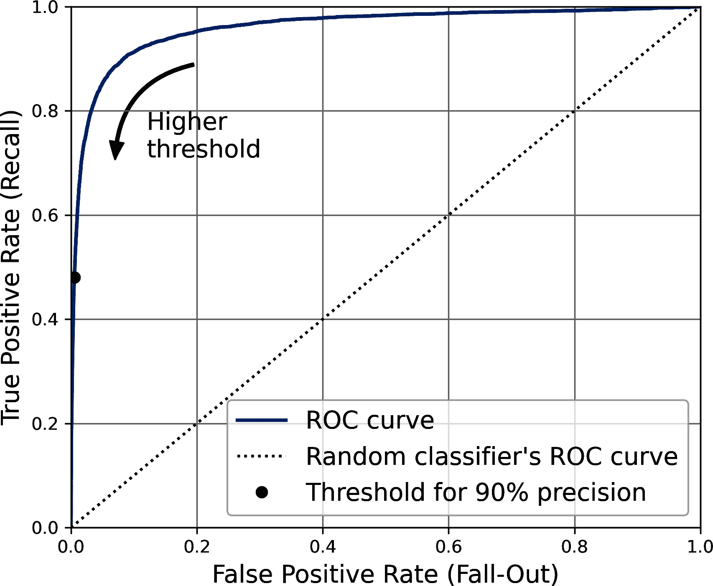
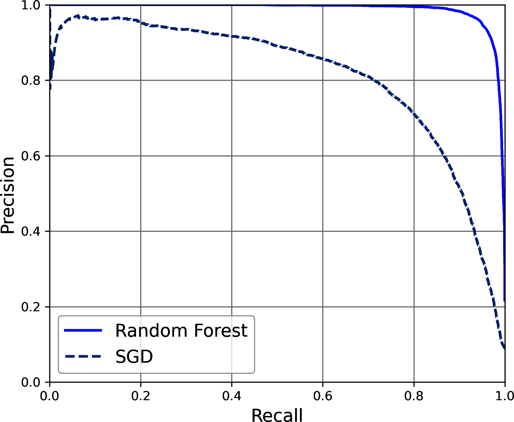
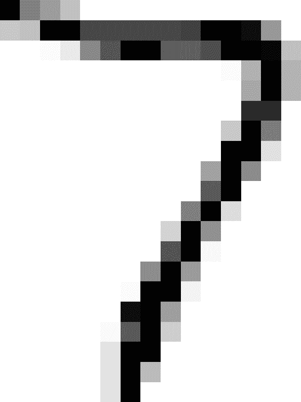

# 第三章\. 分类

在 第一章 中，我提到了最常见的监督学习任务：回归（预测值）和分类（预测类别）。在 第二章 中，我们探讨了回归任务，即使用各种算法预测房价，如线性回归、决策树和随机森林（这些将在后续章节中详细解释）。现在，我们将把注意力转向分类系统。

# MNIST

在本章中，我们将使用 MNIST 数据集，这是一个由高中生和美国人口普查局员工手写的 70,000 张小数字图片的集合。每张图片都标有它所代表的数字。这个集合已经被研究得如此之多，以至于它经常被称为机器学习的“hello world”：每当人们提出一个新的分类算法时，他们都会好奇它在 MNIST 上的表现如何，任何学习机器学习的人迟早都会处理这个数据集。

Scikit-Learn 提供了许多辅助函数来下载流行的数据集。MNIST 是其中之一。以下代码从 OpenML.org 获取 MNIST 数据集：⁠^(1)

```py
from sklearn.datasets import fetch_openml

mnist = fetch_openml('mnist_784', as_frame=False)
```

`sklearn.datasets` 包主要包含三种类型的函数：`fetch_*` 函数，例如 `fetch_openml()` 用于下载真实数据集，`load_*` 函数用于加载 Scikit-Learn 随带的小型玩具数据集（因此不需要从互联网上下载），以及 `make_*` 函数用于生成假数据集，这对于测试很有用。生成的数据集通常以 `(X, y)` 元组的形式返回，包含输入数据和目标，两者均为 NumPy 数组。其他数据集以 `sklearn.utils.Bunch` 对象的形式返回，这些对象是字典，其条目也可以作为属性访问。它们通常包含以下条目：

`"DESCR"`

数据集的描述

`"data"`

输入数据，通常是一个 2D NumPy 数组

`"target"`

标签，通常是一个 1D NumPy 数组

`fetch_openml()` 函数有点不寻常，因为它默认返回输入作为 Pandas DataFrame，标签作为 Pandas Series（除非数据集是稀疏的）。但是 MNIST 数据集包含图像，DataFrame 并不理想，因此最好设置 `as_frame=False` 以获取 NumPy 数组形式的数据。让我们看看这些数组：

```py
>>> X, y = mnist.data, mnist.target
>>> X
array([[0, 0, 0, ..., 0, 0, 0],
 [0, 0, 0, ..., 0, 0, 0],
 [0, 0, 0, ..., 0, 0, 0],
 ...,
 [0, 0, 0, ..., 0, 0, 0],
 [0, 0, 0, ..., 0, 0, 0],
 [0, 0, 0, ..., 0, 0, 0]])
>>> X.shape
(70000, 784)
>>> y
array(['5', '0', '4', ..., '4', '5', '6'], dtype=object)
>>> y.shape
(70000,)
```

有 70,000 张图片，每张图片有 784 个特征。这是因为每张图片是 28 × 28 像素，每个特征简单地代表一个像素的强度，从 0（白色）到 255（黑色）。让我们看一下数据集中的一个数字（图 3-1）。我们只需要获取一个实例的特征向量，将其重塑为 28 × 28 的数组，并使用 Matplotlib 的 `imshow()` 函数显示它。我们使用 `cmap="binary"` 来获取一个灰度色图，其中 0 是白色，255 是黑色：

```py
import matplotlib.pyplot as plt

def plot_digit(image_data):
    image = image_data.reshape(28, 28)
    plt.imshow(image, cmap="binary")
    plt.axis("off")

some_digit = X[0]
plot_digit(some_digit)
plt.show()
```


###### 图 3-1\. MNIST 图像的示例

这看起来像 5，确实标签也告诉我们是这样的：

```py
>>> y[0]
'5'
```

为了让你对分类任务的复杂性有一个感觉，图 3-2 显示了 MNIST 数据集的更多图像。数字形状的多样性相当大。话虽如此，图像是干净的，居中的，旋转不太，数字大小大致相同：这个数据集不需要太多的预处理（现实世界的数据集通常不会那么友好）。

但等等！在仔细检查数据之前，你应该始终创建一个测试集并将其放在一边。`fetch_openml()`返回的 MNIST 数据集实际上已经被分割成一个训练集（前 60,000 个图像）和一个测试集（最后 10,000 个图像）：^(2)

```py
X_train, X_test, y_train, y_test = X[:60000], X[60000:], y[:60000], y[60000:]
```

训练集已经被我们打乱了，这是好事，因为这保证了所有交叉验证的折都会相似（我们不希望某个折缺少一些数字）。此外，一些学习算法对训练实例的顺序敏感，如果它们连续得到许多相似的实例，它们的表现会很差。打乱数据集确保了这种情况不会发生。⁠^(3)


###### 图 3-2\. MNIST 数据集中的数字

# 训练二元分类器

让我们先简化问题，现在只尝试识别一个数字——例如，数字 5。这个“5 检测器”将是一个**二元分类器**的例子，能够区分仅两个类别，即 5 和非 5。首先，我们将为这个分类任务创建目标向量：

```py
y_train_5 = (y_train == '5')  # True for all 5s, False for all other digits
y_test_5 = (y_test == '5')
```

现在让我们选择一个分类器并对其进行训练。一个好的起点是使用**随机梯度下降**（SGD，或随机 GD）分类器，使用 Scikit-Learn 的`SGDClassifier`类。这个分类器能够高效地处理非常大的数据集。这在一定程度上是因为 SGD 独立处理训练实例，一次一个，这也使得 SGD 非常适合在线学习，你将在后面看到。让我们创建一个`SGDClassifier`并在整个训练集上对其进行训练：

```py
from sklearn.linear_model import SGDClassifier

sgd_clf = SGDClassifier(random_state=42)
sgd_clf.fit(X_train, y_train_5)
```

现在我们可以用它来检测数字 5 的图像：

```py
>>> sgd_clf.predict([some_digit])
array([ True])
```

分类器猜测这个图像代表的是 5（`True`）。看起来在这个特定情况下它猜对了！现在，让我们评估这个模型的表现。

# 性能指标

评估分类器通常比评估回归器要复杂得多，所以我们将在本章的大部分内容上花费大量时间讨论这个主题。有大量的性能指标可用，所以再拿一杯咖啡，准备好学习一大堆新概念和缩写词！

## 使用交叉验证测量准确度

评估模型的一个好方法是使用交叉验证，就像你在第二章中所做的那样。让我们使用`cross_val_score()`函数来评估我们的`SGDClassifier`模型，使用*k*-折交叉验证，分为三折。记住*k*-折交叉验证意味着将训练集分成*k*折（在这种情况下，三折），然后训练模型*k*次，每次保留一个不同的折用于评估（参见第二章）：

```py
>>> from sklearn.model_selection import cross_val_score
>>> cross_val_score(sgd_clf, X_train, y_train_5, cv=3, scoring="accuracy")
array([0.95035, 0.96035, 0.9604 ])
```

哇！所有交叉验证折上的准确率（正确预测的比率）都超过 95%？这看起来很棒，不是吗？好吧，在你过于兴奋之前，让我们看看一个简单的分类器，它只是将每个图像分类为最频繁的类别，在这种情况下是负类别（即*非*5）：

```py
from sklearn.dummy import DummyClassifier

dummy_clf = DummyClassifier()
dummy_clf.fit(X_train, y_train_5)
print(any(dummy_clf.predict(X_train)))  # prints False: no 5s detected
```

你能猜出这个模型的准确率吗？让我们来看看：

```py
>>> cross_val_score(dummy_clf, X_train, y_train_5, cv=3, scoring="accuracy")
array([0.90965, 0.90965, 0.90965])
```

没错，它的准确率超过 90%！这仅仅是因为只有大约 10%的图像是 5 秒的，所以如果你总是猜测一个图像不是 5 秒，你将有 90%的时间猜对。这比诺斯特拉达穆斯还厉害。

这说明了为什么准确率通常不是分类器的首选性能指标，尤其是当你处理*倾斜数据集*（即某些类别比其他类别频繁得多）时。评估分类器性能的更好方法是查看*混淆矩阵*（CM）。

## 混淆矩阵

混淆矩阵的一般思想是计算类别 A 的实例被分类为类别 B 的次数，对于所有 A/B 对。例如，要知道分类器混淆 8 和 0 的图像的次数，你将查看混淆矩阵的第 8 行，第 0 列。

要计算混淆矩阵，你首先需要有一组预测，以便可以将它们与实际目标进行比较。你可以在测试集上做出预测，但现在最好是保持测试集不变（记住你只想在项目的最后阶段使用测试集，一旦你有一个准备发布的分类器）。相反，你可以使用`cross_val_predict()`函数：

```py
from sklearn.model_selection import cross_val_predict

y_train_pred = cross_val_predict(sgd_clf, X_train, y_train_5, cv=3)
```

就像`cross_val_score()`函数一样，`cross_val_predict()`函数执行*k*-折交叉验证，但它不是返回评估分数，而是返回对每个测试折的预测。这意味着你为训练集中的每个实例都得到了一个干净的预测（这里的“干净”是指“样本外”：模型在训练期间从未看到过这些数据）。

现在你已经准备好使用`confusion_matrix()`函数来获取混淆矩阵。只需传入目标类别（`y_train_5`）和预测类别（`y_train_pred`）：

```py
>>> from sklearn.metrics import confusion_matrix
>>> cm = confusion_matrix(y_train_5, y_train_pred)
>>> cm
array([[53892,   687],
 [ 1891,  3530]])
```

混淆矩阵中的每一行代表一个 *实际类别*，而每一列代表一个 *预测类别*。这个矩阵的第一行考虑非 5 的图像（*负类别*）：53,892 个被正确分类为非 5（它们被称为 *真实负例*），而剩下的 687 个被错误地分类为 5（*假正例*，也称为 *I 型错误*）。第二行考虑 5 的图像（*正类别*）：1,891 个被错误地分类为非 5（*假负例*，也称为 *II 型错误*），而剩下的 3,530 个被正确分类为 5（*真实正例*）。一个完美的分类器只会拥有真实正例和真实负例，因此它的混淆矩阵只在主对角线（左上角到右下角）上有非零值：

```py
>>> y_train_perfect_predictions = y_train_5  # pretend we reached perfection
>>> confusion_matrix(y_train_5, y_train_perfect_predictions)
array([[54579,     0],
 [    0,  5421]])
```

混淆矩阵提供了大量信息，但有时你可能更喜欢一个更简洁的指标。一个值得关注的指标是积极预测的准确率；这被称为分类器的 *精确率*（方程 3-1）。

##### 方程 3-1\. 精确率

$精确率等于\frac{TP}{TP + FP}$

*TP* 是真实正例的数量，而 *FP* 是假正例的数量。

现在考虑一个模型，当它非常自信时才会做出积极的预测。让我们将这一点推向极端，并假设它总是做出负面的预测，除了在它最自信的实例上做出一个积极的预测。如果这个预测是正确的，那么分类器就有 100%的精确率（精确率 = 1/1 = 100%）。显然，这样的分类器不会很有用，因为它会忽略除了一个积极的实例之外的所有实例。因此，通常将精确率与另一个名为 *召回率* 的指标一起使用，也称为 *灵敏度* 或 *真正例率*（TPR）：这是分类器正确检测到的积极实例的比例（方程 3-2）。

##### 方程 3-2\. 召回率

$召回率等于\frac{TP}{TP + FN}$

*FN* 当然是假负例的数量。

如果你对混淆矩阵感到困惑，图 3-3 可能会帮到你。


###### 图 3-3\. 一个混淆矩阵的插图，展示了真实负例（左上角）、假正例（右上角）、假负例（左下角）和真实正例（右下角）

## 精确率和召回率

Scikit-Learn 提供了几个函数来计算分类器指标，包括精确率和召回率：

```py
>>> from sklearn.metrics import precision_score, recall_score
>>> precision_score(y_train_5, y_train_pred)  # == 3530 / (687 + 3530)
np.float64(0.8370879772350012)
>>> recall_score(y_train_5, y_train_pred)  # == 3530 / (1891 + 3530)
np.float64(0.6511713705958311)
```

现在我们 5 个探测器的光泽度不如我们检查其准确性时那么亮。当它声称一个图像代表 5 时，它只有 83.7%的时间是正确的。此外，它只检测到 65.1%的 5。

将精确度和召回率合并成一个单一指标，称为 *F[1] 分数*，通常很方便，尤其是在你需要一个单一指标来比较两个分类器时。F[1] 分数是精确度和召回率的 *调和平均数* (方程 3-3)。与常规平均数将所有值视为相等不同，调和平均数给低值赋予更多的权重。因此，只有当召回率和精确度都很高时，分类器才能获得高的 F[1] 分数。

##### 方程 3-3\. F[1] 分数

$upper F 1 等于 StartStartFraction 2 OverOver StartFraction 1 Over 精确度 EndFraction 加上 StartFraction 1 Over 召回率 EndFraction EndEndFraction 等于 2 乘以 StartFraction 精确度 乘以 召回率 Over 精确度 加上 召回率 EndFraction 等于 StartStartFraction upper T upper P OverOver upper T upper P 加上 StartFraction upper F upper N 加上 upper F upper P Over 2 EndFraction EndEndFraction$

要计算 F[1] 分数，只需调用 `f1_score()` 函数：

```py
>>> from sklearn.metrics import f1_score
>>> f1_score(y_train_5, y_train_pred)
0.7325171197343846
```

F[1] 分数倾向于那些具有相似精确度和召回率的分类器。这并不总是你想要的：在某些情况下，你更关心精确度，而在其他情况下，你真正关心的是召回率。例如，如果你训练了一个分类器来检测适合儿童观看的视频，你可能更倾向于一个拒绝许多好视频（低召回率）但只保留安全视频（高精确度）的分类器，而不是一个召回率很高但允许一些非常糟糕的视频出现在你的产品中的分类器（在这种情况下，你可能甚至想要添加一个人工流程来检查分类器的视频选择）。另一方面，假设你训练了一个分类器来检测监控图像中的扒手：如果你的分类器只有 30% 的精确度，只要它有 99% 的召回率，这可能是可以接受的。当然，保安可能会收到一些误报，但几乎所有的扒手都会被抓住。同样，医学诊断通常需要高召回率以避免遗漏任何重要信息。可以通过后续的医学检查排除假阳性。

不幸的是，你不能两者兼得：提高精确度会降低召回率，反之亦然。这被称为 *精确度/召回率权衡*。

## 精确度/召回率权衡

为了理解这个权衡，让我们看看`SGDClassifier`是如何做出分类决定的。对于每个实例，它根据一个*决策函数*计算一个分数。如果这个分数大于阈值，它将实例分配到正类；否则，它将实例分配到负类。图 3-4 显示了从左到右最低分数到最高分数的一些数字。假设*决策阈值*位于中央箭头（两个 5 之间）：你会在该阈值右侧找到 4 个真正的正例（实际的 5），和 1 个假正例（实际上是 6）。因此，使用这个阈值，精确度为 80%（5 个中的 4 个）。但是，在 6 个实际的 5 中，分类器只检测到 4 个，所以召回率为 67%（6 个中的 4 个）。如果你提高阈值（将其移动到右边的箭头），假正例（6）变成真负例，从而提高精确度（在本例中达到 100%），但一个真正的正例变成假负例，召回率下降到 50%。相反，降低阈值会增加召回率并降低精确度。


###### 图 3-4。精度/召回权衡：图像按其分类器分数排序，高于所选决策阈值的被视为正例；阈值越高，召回率越低，但（通常）精确度越高

你可以调用分类器的`decision_function()`方法而不是调用其`predict()`方法，该方法为每个实例返回一个分数。然后你可以使用任何你想要的阈值来根据这些分数做出预测：

```py
>>> y_scores = sgd_clf.decision_function([some_digit])
>>> y_scores
array([2164.22030239])
>>> threshold = 0
>>> y_some_digit_pred = (y_scores > threshold)
>>> y_some_digit_pred
array([ True])
```

`SGDClassifier`使用阈值为 0，因此前面的代码返回的结果与`predict()`方法相同（即`True`）。让我们提高阈值：

```py
>>> threshold = 3000
>>> y_some_digit_pred = (y_scores > threshold)
>>> y_some_digit_pred
array([False])
```

这证实了提高阈值会降低召回率。图像实际上代表一个 5，当阈值是 0 时，分类器检测到它，但当阈值增加到 3,000 时，它就错过了它。

你如何决定使用哪个阈值？一个选择是使用`cross_val_predict()`函数来获取训练集中所有实例的分数，但这次指定你想要返回决策分数而不是预测：

```py
y_scores = cross_val_predict(sgd_clf, X_train, y_train_5, cv=3,
                             method="decision_function")
```

使用这些分数，使用`precision_recall_curve()`函数计算所有可能阈值下的精确度和召回率（该函数添加一个最后的精确度为 1 和一个最后的召回率为 0，对应于无限大的阈值）：

```py
from sklearn.metrics import precision_recall_curve

precisions, recalls, thresholds = precision_recall_curve(y_train_5, y_scores)
```

最后，使用 Matplotlib 将精确度和召回率作为阈值值的函数绘制出来（图 3-5）。让我们展示我们选择的 3,000 个阈值的阈值：

```py
plt.plot(thresholds, precisions[:-1], "b--", label="Precision", linewidth=2)
plt.plot(thresholds, recalls[:-1], "g-", label="Recall", linewidth=2)
plt.vlines(threshold, 0, 1.0, "k", "dotted", label="threshold")
[...]  # beautify the figure: add grid, legend, axis, labels, and circles
plt.show()
```


###### 图 3-5\. 精确度和召回率与决策阈值的关系

###### 注意

你可能会想知道为什么 图 3-5 中的精确度曲线比召回率曲线更崎岖。原因是当提高阈值时，精确度有时会下降（尽管总体上会上升）。要理解为什么，回顾 图 3-4 并注意当你从中心阈值开始并向右移动一个数字时会发生什么：精确度从 4/5（80%）下降到 3/4（75%）。另一方面，召回率只有在增加阈值时才会下降，这解释了为什么其曲线看起来很平滑。

在这个阈值值下，精确度接近 90%，召回率大约为 50%。另一种选择良好的精确度/召回率权衡的方法是将精确度直接与召回率绘制在一起，如图 图 3-6 所示（显示相同的阈值）：

```py
plt.plot(recalls, precisions, linewidth=2, label="Precision/Recall curve")
[...]  # beautify the figure: add labels, grid, legend, arrow, and text
plt.show()
```


###### 图 3-6\. 精确度与召回率

你可以看到，精确度确实在召回率大约为 80% 时开始急剧下降。你可能想在下降之前选择一个精确度/召回率的权衡——例如，在召回率大约为 60% 时。但当然，选择取决于你的项目。

假设你决定将目标设定为 90% 的精确度。你可以使用第一个图表来找到所需的阈值，但这并不非常精确。或者，你可以寻找至少提供 90% 精确度的最低阈值。为此，你可以使用 NumPy 数组的 `argmax()` 方法。这个方法返回最大值的第一个索引，在这个情况下意味着第一个 `True` 值：

```py
>>> idx_for_90_precision = (precisions >= 0.90).argmax()
>>> threshold_for_90_precision = thresholds[idx_for_90_precision]
>>> threshold_for_90_precision
np.float64(3370.0194991439557)
```

要进行预测（目前是在训练集上），而不是调用分类器的 `predict()` 方法，你可以运行以下代码：

```py
y_train_pred_90 = (y_scores >= threshold_for_90_precision)
```

让我们检查这些预测的精确度和召回率：

```py
>>> precision_score(y_train_5, y_train_pred_90)
0.9000345901072293
>>> recall_at_90_precision = recall_score(y_train_5, y_train_pred_90)
>>> recall_at_90_precision
0.4799852425751706
```

太好了，你有一个 90% 精确度的分类器！正如你所见，创建一个具有几乎任何所需精确度的分类器相当容易：只需设置一个足够高的阈值，就完成了。但是等等，不要这么快：如果其召回率太低，一个高精确度的分类器并不很有用！对于许多应用来说，48% 的召回率根本不会很好。

###### 小贴士

如果有人说，“让我们达到 99% 的精确度”，你应该问，“在什么召回率下？”

自从 Scikit-Learn 1.5 版本以来，有两个新的类可以帮助你更容易地调整决策阈值：

+   `FixedThresholdClassifier` 类允许你包装一个二元分类器并手动设置所需的阈值。如果底层分类器有 `predict_proba()` 方法，那么阈值应该是一个介于 0 和 1 之间的值（默认是 0.5）。否则，它应该是一个决策分数，与模型 `decision_function()` 的输出相当（默认是 0）。

+   `TunedThresholdClassifierCV`类使用*k*-折交叉验证自动找到给定指标的优化阈值。默认情况下，它试图找到最大化模型**平衡精度**的阈值：这是每个类召回率的平均值。然而，你可以选择另一个指标进行优化（请参阅文档以获取完整选项列表）。

## ROC 曲线

接收者操作特征（ROC）曲线是另一种与二元分类器一起使用的常用工具。它与精确度/召回率曲线非常相似，但不是绘制精确度与召回率的对比图，而是 ROC 曲线绘制了**真正例率**（召回率的另一种名称）与**假正例率**（FPR）的对比图。FPR（也称为*漏报*）是错误地被分类为正的负实例的比例。它等于 1 – **真正例率**（TNR），即正确地将负实例分类为负的比例。TNR 也称为*特异性*。因此，ROC 曲线绘制了*灵敏度*（召回率）与 1 – *特异性*的对比图。

要绘制 ROC 曲线，你首先使用`roc_curve()`函数计算各种阈值值下的 TPR 和 FPR：

```py
from sklearn.metrics import roc_curve

fpr, tpr, thresholds = roc_curve(y_train_5, y_scores)
```

然后，你可以使用 Matplotlib 绘制 FPR 与 TPR 的对比图。以下代码生成了图 3-7 中的图表。为了找到对应于 90%精度的点，我们需要查找所需阈值的索引。由于在这种情况下阈值按递减顺序列出，我们在第一行使用`<=`而不是`>=`：

```py
idx_for_threshold_at_90 = (thresholds <= threshold_for_90_precision).argmax()
tpr_90, fpr_90 = tpr[idx_for_threshold_at_90], fpr[idx_for_threshold_at_90]

plt.plot(fpr, tpr, linewidth=2, label="ROC curve")
plt.plot([0, 1], [0, 1], 'k:', label="Random classifier's ROC curve")
plt.plot([fpr_90], [tpr_90], "ko", label="Threshold for 90% precision")
[...]  # beautify the figure: add labels, grid, legend, arrow, and text
plt.show()
```

再次，这里有一个权衡：召回率（TPR）越高，分类器产生的假阳性（FPR）就越多。虚线表示纯随机分类器的 ROC 曲线；一个好的分类器应尽可能地远离这条线（朝向左上角）。

比较分类器的一种方法是通过测量曲线下的面积（AUC）。一个完美的分类器将具有等于 1 的 ROC AUC，而一个纯随机分类器将具有等于 0.5 的 ROC AUC。Scikit-Learn 提供了一个函数来估计 ROC AUC：

```py
>>> from sklearn.metrics import roc_auc_score
>>> roc_auc_score(y_train_5, y_scores)
np.float64(0.9604938554008616)
```



###### 图 3-7\. 绘制所有可能阈值下假正例率与真正例率的 ROC 曲线；黑色圆圈突出显示所选比率（在 90%精度和 48%召回率处）

###### 小贴士

由于 ROC 曲线与精度/召回（PR）曲线非常相似，你可能会想知道如何决定使用哪一个。一般来说，当正类很少或你更关心假阳性而不是假阴性时，你应该更喜欢 PR 曲线。否则，使用 ROC 曲线。例如，查看之前的 ROC 曲线（以及 ROC AUC 分数），你可能会认为分类器非常好。但这主要是因为正例（5s）与负例（非-5s）相比很少。相比之下，PR 曲线清楚地表明分类器还有改进的空间：曲线实际上可以更接近右上角（再次查看图 3-6）。

现在我们创建一个`RandomForestClassifier`，我们可以将其 PR 曲线和 F[1]分数与`SGDClassifier`的进行比较：

```py
from sklearn.ensemble import RandomForestClassifier

forest_clf = RandomForestClassifier(random_state=42)
```

`precision_recall_curve()`函数需要每个实例的标签和分数，因此我们需要训练随机森林分类器并使其为每个实例分配一个分数。但由于其工作方式（我们将在第六章中介绍这一点），`RandomForestClassifier`类没有`decision_function()`方法。幸运的是，它有一个`predict_proba()`方法，该方法返回每个实例的估计类别概率，我们可以直接使用正类概率作为分数，这样`precision_recall_curve()`就可以工作了.^(4) 我们可以调用`cross_val_​predict()`函数，使用交叉验证训练`RandomForestClassifier`，并使其预测每个图像的类别概率，如下所示：

```py
y_probas_forest = cross_val_predict(forest_clf, X_train, y_train_5, cv=3,
                                    method="predict_proba")
```

让我们查看训练集中前两张图像的估计类别概率：

```py
>>> y_probas_forest[:2]
array([[0.11, 0.89],
 [0.99, 0.01]])
```

模型预测第一张图像有 89%的概率是正例，它预测第二张图像有 99%的概率是负例。由于每张图像要么是正例要么是负例，每行中的估计概率总和为 100%。

###### 警告

这些是**估计**的概率，而不是实际概率。例如，如果你查看模型将所有估计概率在 50%到 60%之间的图像分类为正例的所有图像，大约 94%的它们实际上是正例。因此，在这种情况下，模型的估计概率太低了——但模型也可能过于自信。`sklearn.calibration`包中的`CalibratedClassifierCV`类可以使用交叉验证校准估计概率，使它们更接近实际概率（请参阅笔记本中的代码示例）。在某些场景中，这很重要，例如医疗诊断、财务风险评估或欺诈检测。

第二列包含正类的估计概率，因此让我们将它们传递给`precision_recall_curve()`函数：

```py
y_scores_forest = y_probas_forest[:, 1]
precisions_forest, recalls_forest, thresholds_forest = precision_recall_curve(
    y_train_5, y_scores_forest)
```

现在我们准备绘制 PR 曲线。绘制第一个 PR 曲线也很有用，以便比较它们（图 3-8）：

```py
plt.plot(recalls_forest, precisions_forest, "b-", linewidth=2,
         label="Random Forest")
plt.plot(recalls, precisions, "--", linewidth=2, label="SGD")
[...]  # beautify the figure: add labels, grid, and legend
plt.show()
```



###### 图 3-8\. 比较 PR 曲线：随机森林分类器优于 SGD 分类器，因为它的 PR 曲线更接近右上角，并且具有更大的 AUC

如图 3-8 所示，`RandomForestClassifier`的 PR 曲线看起来比`SGDClassifier`的更好：它更接近右上角。它的 F[1]分数和 ROC AUC 分数也明显更好：

```py
>>> y_train_pred_forest = y_probas_forest[:, 1] >= 0.5  # positive proba ≥ 50%
>>> f1_score(y_train_5, y_train_pred_forest)
0.9274509803921569
>>> roc_auc_score(y_train_5, y_scores_forest)
0.9983436731328145
```

尝试测量精度和召回分数：你应该找到大约 99.0%的精度和 87.3%的召回率。还不错！

你现在知道如何训练二元分类器，选择适合你任务的适当指标，使用交叉验证评估你的分类器，选择适合你需求的精度/召回权衡，并使用多个指标和曲线来比较各种模型。你已经准备好尝试检测不仅仅是 5s 了。

# 多类别分类

与二元分类器区分两个类别不同，*多类别分类器*（也称为*多项式分类器*）可以区分超过两个类别。

一些 Scikit-Learn 分类器（例如，`LogisticRegression`，`RandomForestClassifier`和`GaussianNB`）能够原生地处理多个类别。其他的是严格的二元分类器（例如，`SGDClassifier`和`SVC`）。然而，你可以使用各种策略来使用多个二元分类器执行多类别分类。

将数字图像分类到 10 个类别（从 0 到 9）的一种方法是训练 10 个二元分类器，每个数字一个（一个 0 检测器，一个 1 检测器，一个 2 检测器，以此类推）。然后当你想要对一张图像进行分类时，你从每个分类器那里获取该图像的决策分数，并选择输出最高分数的类别。这被称为*一对余下所有*（OvR）策略，有时也称为*一对所有*（OvA）。

另一种策略是为每一对数字训练一个二元分类器：一个用于区分 0 和 1，另一个用于区分 0 和 2，另一个用于区分 1 和 2，以此类推。这被称为*一对一个*（OvO）策略。如果有*N*个类别，你需要训练*N* × (*N* – 1) / 2 个分类器。对于 MNIST 问题，这意味着需要训练 45 个二元分类器！当你想要对一张图像进行分类时，你必须将图像通过所有 45 个分类器，并查看哪个类别在最多对决中获胜。OvO 的主要优势是每个分类器只需要在包含它必须区分的两个类别的训练集部分上进行训练。

一些算法（如支持向量机分类器）在训练集大小方面扩展得不好。对于这些算法，OvO 更受欢迎，因为在小训练集上训练许多分类器比在大训练集上训练少量分类器要快。然而，对于大多数二元分类算法，OvR 更受欢迎。

Scikit-Learn 会检测到你尝试使用二元分类算法进行多类分类任务，并会自动运行 OvR 或 OvO，具体取决于算法。让我们尝试使用`sklearn.svm.SVC`类（参见关于 SVMs 的在线章节[*https://homl.info*](https://homl.info)）来使用支持向量机分类器。我们只会在前 2000 张图像上训练，否则会花费很长时间：

```py
from sklearn.svm import SVC

svm_clf = SVC(random_state=42)
svm_clf.fit(X_train[:2000], y_train[:2000])  # y_train, not y_train_5
```

那很简单！我们使用原始的目标类别 0 到 9（`y_train`）而不是 5 对其他的目标类别（`y_train_5`）来训练`SVC`。由于有 10 个类别（即超过 2 个），Scikit-Learn 使用了 OvO 策略并训练了 45 个二元分类器。现在让我们对一张图像进行预测：

```py
>>> svm_clf.predict([some_digit])
array(['5'], dtype=object)
```

那是正确的！这段代码实际上做出了 45 个预测——每个类别对一次——并且选择了赢得最多决斗的类别。⁠^(5) 如果你调用`decision_function()`方法，你会看到它为每个实例返回 10 个分数：每个类别一个。每个类别得到的分数等于赢得的决斗数加上或减去一个小调整（最大±0.33）以打破平局，基于分类器的分数：

```py
>>> some_digit_scores = svm_clf.decision_function([some_digit])
>>> some_digit_scores.round(2)
array([[ 3.79,  0.73,  6.06,  8.3 , -0.29,  9.3 ,  1.75,  2.77,  7.21,
 4.82]])
```

最高分数是 9.3，确实对应于类别 5：

```py
>>> class_id = some_digit_scores.argmax()
>>> class_id
np.int64(5)
```

当一个分类器被训练时，它会将其目标类别的列表存储在其`classes_`属性中，按值排序。在 MNIST 的情况下，`classes_`数组中每个类别的索引方便地与类别本身相匹配（例如，索引 5 的类别恰好是类别`'5'`），但通常你不会这么幸运；你需要像这样查找类别标签：

```py
>>> svm_clf.classes_
array(['0', '1', '2', '3', '4', '5', '6', '7', '8', '9'], dtype=object)
>>> svm_clf.classes_[class_id]
'5'
```

如果你想要强制 Scikit-Learn 使用一对一或一对多，你可以使用`OneVsOneClassifier`或`OneVsRestClassifier`类。只需创建一个实例并将其传递给构造函数（它甚至不需要是二元分类器）。例如，这段代码创建了一个使用 OvR 策略的多类分类器，基于`SVC`：

```py
from sklearn.multiclass import OneVsRestClassifier

ovr_clf = OneVsRestClassifier(SVC(random_state=42))
ovr_clf.fit(X_train[:2000], y_train[:2000])
```

让我们做一个预测，并检查训练好的分类器的数量：

```py
>>> ovr_clf.predict([some_digit])
array(['5'], dtype='<U1')
>>> len(ovr_clf.estimators_)
10
```

在多类数据集上训练`SGDClassifier`并使用它进行预测同样简单：

```py
>>> sgd_clf = SGDClassifier(random_state=42)
>>> sgd_clf.fit(X_train, y_train)
>>> sgd_clf.predict([some_digit])
array(['3'], dtype='<U1')
```

哎呀，那是不正确的。预测错误确实会发生！这次 Scikit-Learn 在底层使用了 OvR 策略：因为有 10 个类别，它训练了 10 个二元分类器。`decision_function()`方法现在为每个类别返回一个值。让我们看看 SGD 分类器分配给每个类别的分数：

```py
>>> sgd_clf.decision_function([some_digit]).round()
array([[-31893., -34420.,  -9531.,   1824., -22320.,  -1386., -26189.,
 -16148.,  -4604., -12051.]])
```

你可以看到，分类器对其预测并不十分自信：几乎所有的分数都非常低，而类别 3 的分数为+1,824，类别 5 则稍逊一筹，为-1,386。当然，你会在多个图像上评估这个分类器。由于每个类别中的图像数量大致相同，准确度指标是合适的。像往常一样，你可以使用`cross_val_score()`函数来评估模型：

```py
>>> cross_val_score(sgd_clf, X_train, y_train, cv=3, scoring="accuracy")
array([0.87365, 0.85835, 0.8689 ])
```

它在所有测试折上的准确率超过 85.8%。如果你使用的是随机分类器，你将得到 10%的准确率，所以这个分数并不算太差，但你仍然可以做得更好。简单地缩放输入（如第二章中讨论的）可以将准确率提高到 89.1%以上：

```py
>>> from sklearn.preprocessing import StandardScaler
>>> scaler = StandardScaler()
>>> X_train_scaled = scaler.fit_transform(X_train.astype("float64"))
>>> cross_val_score(sgd_clf, X_train_scaled, y_train, cv=3, scoring="accuracy")
array([0.8983, 0.891 , 0.9018])
```

# 错误分析

如果这是一个真实的项目，你现在将遵循机器学习项目清单中的步骤（见[*https://homl.info/checklist*](https://homl.info/checklist)）。你会探索数据准备选项，尝试多个模型，筛选出最好的几个，使用`GridSearchCV`调整它们的超参数，并尽可能自动化。在这里，我们假设你已经找到一个有潜力的模型，并且你想要找到改进它的方法。一种方法是分析它犯的错误类型。

首先，查看混淆矩阵。为此，你首先需要使用`cross_val_predict()`函数进行预测；然后你可以将标签和预测传递给`confusion_matrix()`函数，就像你之前做的那样。然而，由于现在有 10 个类别而不是 2 个，混淆矩阵将包含相当多的数字，可能难以阅读。

混淆矩阵的彩色图更容易分析。要绘制这样的图，使用`ConfusionMatrixDisplay.from_predictions()`函数，如下所示：

```py
from sklearn.metrics import ConfusionMatrixDisplay

y_train_pred = cross_val_predict(sgd_clf, X_train_scaled, y_train, cv=3)
ConfusionMatrixDisplay.from_predictions(y_train, y_train_pred)
plt.show()
```

这产生了图 3-9 中的左侧图。这个混淆矩阵看起来相当不错：大多数图像都在主对角线上，这意味着它们被正确分类。注意，第 5 行和第 5 列对角线上的单元格看起来比其他数字略暗。这可能是因为模型在 5 上犯了更多的错误，或者因为数据集中 5 的数量比其他数字少。这就是为什么通过将每个值除以对应（真实）类别的总图像数（即除以行的总和）来归一化混淆矩阵很重要的原因。这可以通过简单地设置`normalize="true"`来实现。我们还可以指定`values_format=".0%"`参数来显示不带小数的百分比。以下代码生成了图 3-9 中的右侧图：

```py
ConfusionMatrixDisplay.from_predictions(y_train, y_train_pred,
                                        normalize="true", values_format=".0%")
plt.show()
```


###### 图 3-9。混淆矩阵（左侧）和按行归一化的相同 CM（右侧）

现在，我们可以很容易地看到只有 82%的 5 的图像被正确分类。模型对 5 的图像犯的最常见错误是将它们错误地分类为 8：这在所有 5 的图像中有 10%。但只有 2%的 8 被错误地分类为 5；混淆矩阵通常不是对称的！如果你仔细观察，你会注意到许多数字被错误地分类为 8，但这一点从这个图中并不立即明显。如果你想使错误更加突出，你可以尝试对正确预测赋予零权重。下面的代码就是这样做的，并产生了图 3-10 左边的图：

```py
sample_weight = (y_train_pred != y_train)
ConfusionMatrixDisplay.from_predictions(y_train, y_train_pred,
                                        sample_weight=sample_weight,
                                        normalize="true", values_format=".0%")
plt.show()
```


###### 图 3-10。只包含错误的混淆矩阵，按行归一化（左）和按列归一化（右）

现在，你可以更清楚地看到分类器犯的错误类型。第 8 类的列现在非常明亮，这证实了许多图像被错误地分类为 8。实际上，这几乎是所有类别的最常见错误分类。但请注意如何解释这个图中的百分比：记住，我们已经排除了正确预测。例如，左网格第 7 行第 9 列的 36%并不代表所有 7 的图像中有 36%被错误地分类为 9。这意味着模型在 7 的图像上犯的 36%的错误是错误地分类为 9。实际上，只有 3%的 7 的图像被错误地分类为 9，正如你在右边的图中可以看到的图 3-9。

也可以通过列而不是行来归一化混淆矩阵：如果你设置`normalize="pred"`，你将得到图 3-10 右边的图。例如，你可以看到 56%的错误分类的 7 实际上是 9。

分析混淆矩阵通常能让你了解如何改进你的分类器。查看这些图表，似乎你应该把精力放在减少错误的 8 上。例如，你可以尝试收集更多看起来像 8 但不是 8 的数字的训练数据，这样分类器就可以学会区分它们和真正的 8。或者，你可以设计新的特征来帮助分类器——例如，编写一个算法来计算封闭环的数量（例如，8 有两个，6 有一个，5 没有）。或者，你可以预处理图像（例如，使用 Scikit-Image、Pillow 或 OpenCV）来使某些模式，如封闭环，更加突出。

分析单个错误也可以是了解你的分类器正在做什么以及为什么它失败的好方法。例如，让我们以混淆矩阵风格绘制 3 和 5 的示例(图 3-11)：

```py
cl_a, cl_b = '3', '5'
X_aa = X_train[(y_train == cl_a) & (y_train_pred == cl_a)]
X_ab = X_train[(y_train == cl_a) & (y_train_pred == cl_b)]
X_ba = X_train[(y_train == cl_b) & (y_train_pred == cl_a)]
X_bb = X_train[(y_train == cl_b) & (y_train_pred == cl_b)]
[...]  # plot all images in X_aa, X_ab, X_ba, X_bb in a confusion matrix style
```


###### 图 3-11。一些 3s 和 5s 的图像，组织成混淆矩阵

如您所见，一些分类器分类错误的数字（即左下角和右上角块中的数字）写得如此糟糕，即使是人类也很难分类。然而，大多数被错误分类的图像在我们看来似乎是明显的错误。可能很难理解分类器为什么会犯这样的错误，但请记住，人脑是一个出色的模式识别系统，我们的视觉系统在信息甚至达到我们的意识之前会进行大量的复杂预处理。因此，这项任务感觉简单并不意味着它简单。回想一下，我们使用了一个简单的`SGDClassifier`，它只是一个线性模型：它所做的只是为每个类别分配每个像素的权重，当它看到一张新图像时，它只是将加权像素强度相加，为每个类别得到一个分数。由于 3s 和 5s 只相差几个像素，这个模型很容易将它们混淆。

3s 和 5s 之间的主要区别在于连接顶部线和底部弧的小线的位置。如果你将 3 画得稍微向左偏移，分类器可能会将其分类为 5，反之亦然。换句话说，这个分类器对图像的平移和旋转非常敏感。减少 3/5 混淆的一种方法是对图像进行预处理，确保它们很好地居中且旋转不大。然而，这可能不容易做到，因为它需要预测每张图像的正确旋转。一个更简单的方法是在训练集中添加略微偏移和旋转的训练图像变体。这将迫使模型学会对这种变化更加宽容。这被称为*数据增强*（我们将在第十二章中介绍；也请参阅本章末尾的练习 2）。

# 多标签分类

到目前为止，每个实例始终被分配给一个类别。但在某些情况下，您可能希望您的分类器为每个实例输出多个类别。考虑一个面部识别分类器：如果它在同一张图片中识别出几个人，它应该怎么做？它应该为它识别的每个人分配一个标签。假设分类器已经被训练来识别三个面孔：爱丽丝、鲍勃和查理。那么当分类器展示一张爱丽丝和查理的图片时，它应该输出`[True, False, True]`（表示“爱丽丝是，鲍勃不是，查理是”）。这种输出多个二进制标签的分类系统被称为*多标签分类*系统。

我们现在不会深入探讨人脸识别，但让我们看看一个更简单的例子，只是为了说明目的：

```py
import numpy as np
from sklearn.neighbors import KNeighborsClassifier

y_train_large = (y_train >= '7')
y_train_odd = (y_train.astype('int8') % 2 == 1)
y_multilabel = np.c_[y_train_large, y_train_odd]

knn_clf = KNeighborsClassifier()
knn_clf.fit(X_train, y_multilabel)
```

此代码创建了一个包含每个数字图像两个目标标签的`y_multilabel`数组：第一个表示数字是否为大（7、8 或 9），第二个表示它是否为奇数。然后代码创建了一个支持多标签分类的`KNeighborsClassifier`实例（并非所有分类器都支持），并使用多个目标数组训练此模型。现在你可以进行预测，并注意它输出了两个标签：

```py
>>> knn_clf.predict([some_digit])
array([[False,  True]])
```

而且它确实做到了！数字 5 确实不是大（`False`）也不是奇数（`True`）。

评估多标签分类器有许多方法，选择正确的指标很大程度上取决于你的项目。一种方法是测量每个单独标签的 F[1]分数（或之前讨论过的任何其他二进制分类器指标），然后简单地计算平均分数。以下代码计算所有标签的平均 F[1]分数：

```py
>>> y_train_knn_pred = cross_val_predict(knn_clf, X_train, y_multilabel, cv=3)
>>> f1_score(y_multilabel, y_train_knn_pred, average="macro")
0.976410265560605
```

这种方法假设所有标签都同等重要，这可能并不总是正确。特别是，如果你有比鲍勃或查理更多的爱丽丝的照片，你可能希望给爱丽丝的照片上的分类器分数赋予更高的权重。一个简单的选项是给每个标签一个与其*支持度*（即具有该目标标签的实例数量）相等的权重。为此，只需在调用`f1_score()`函数时设置`average="weighted"`即可。⁠^(6)

如果你希望使用原生不支持多标签分类的分类器，例如`SVC`，一个可能的策略是针对每个标签训练一个模型。然而，这种策略可能难以捕捉标签之间的依赖关系。例如，一个大的数字（7、8 或 9）是偶数的两倍可能性，但“奇数”标签的分类器并不知道“大”标签的分类器预测了什么。为了解决这个问题，可以将模型组织成链式结构：当一个模型做出预测时，它使用输入特征加上链中之前所有模型的预测。

好消息是，Scikit-Learn 有一个名为`ClassifierChain`的类，它正好能做这件事！默认情况下，它将使用真实标签进行训练，根据模型在链中的位置为每个模型提供适当的标签。但是，如果你设置了`cv`超参数，它将使用交叉验证从每个训练模型为训练集中的每个实例获取“干净”（样本外）的预测，然后这些预测将用于训练链中后面的所有模型。请注意，链中分类器的顺序可能会影响最终性能。以下是一个示例，说明如何使用交叉验证策略创建和训练一个`ClassifierChain`。像之前一样，我们将只使用训练集中的前 2,000 个图像来加快速度：

```py
from sklearn.multioutput import ClassifierChain

chain_clf = ClassifierChain(SVC(), cv=3, random_state=42)
chain_clf.fit(X_train[:2000], y_multilabel[:2000])
```

现在，我们可以使用这个`ClassifierChain`进行预测：

```py
>>> chain_clf.predict([some_digit])
array([[0., 1.]])
```

# 多输出分类

我们在这里讨论的最后一种分类任务被称为*多输出-多类分类*（或简称*多输出分类*）。它是多标签分类的推广，其中每个标签可以是多类的（即，它可以有超过两个可能的值）。

为了说明这一点，让我们构建一个系统，用于从图像中去除噪声。它将接受一个带噪声的数字图像作为输入，并（希望）输出一个干净的数字图像，表示为像素强度的数组，就像 MNIST 图像一样。请注意，分类器的输出是多标签的（每个像素一个标签）并且每个标签可以有多个值（像素强度范围从 0 到 255）。因此，这是一个多输出分类系统的例子。

###### 注意

分类和回归之间的界限有时是模糊的，例如在这个例子中。可以说，预测像素强度更接近回归而不是分类。此外，多输出系统不仅限于分类任务；你甚至可以有一个系统，它可以为每个实例输出多个标签，包括类标签和值标签。

让我们从创建训练集和测试集开始，通过将 MNIST 图像的像素强度添加噪声，并使用随机数生成器的`integers()`方法来实现。目标图像将是原始图像：

```py
rng = np.random.default_rng(seed=42)
noise_train = rng.integers(0, 100, (len(X_train), 784))
X_train_mod = X_train + noise_train
noise_test = rng.integers(0, 100, (len(X_test), 784))
X_test_mod = X_test + noise_test
y_train_mod = X_train
y_test_mod = X_test
```

让我们看看测试集中的第一张图像（图 3-12）。是的，我们正在窥探测试数据，所以你现在应该皱着眉头。


###### 图 3-12。带噪声的图像（左）和目标干净图像（右）

左边是带噪声的输入图像，右边是清理后的目标图像。现在让我们训练分类器并使其清理这张图像（图 3-13）：

```py
knn_clf = KNeighborsClassifier()
knn_clf.fit(X_train_mod, y_train_mod)
clean_digit = knn_clf.predict([X_test_mod[0]])
plot_digit(clean_digit)
plt.show()
```



###### 图 3-13。清理后的图像

看起来已经很接近目标了！这标志着我们对分类的探索结束。你现在知道如何为分类任务选择好的度量标准，选择适当的精确度/召回率权衡，比较分类器，以及更普遍地构建适用于各种任务的优秀分类系统。在下一章中，你将学习你一直在使用的所有这些机器学习模型是如何实际工作的。

# 练习

1.  尝试构建一个对 MNIST 数据集进行分类的模型，使其在测试集上达到 97%以上的准确率。提示：`KNeighborsClassifier`对于这个任务效果相当好；你只需要找到合适的超参数值（尝试在`weights`和`n_neighbors`超参数上进行网格搜索）。

1.  编写一个函数，可以沿任何方向（左、右、上或下）将 MNIST 图像移动一个像素。⁠^(7) 然后，对于训练集中的每个图像，创建四个移动后的副本（每个方向一个），并将它们添加到训练集中。最后，在扩展后的训练集上训练您最好的模型，并在测试集上测量其准确率。您应该观察到，现在您的模型表现更好了！这种人为增加训练集的技术称为 *数据增强* 或 *训练集扩展*。

1.  解决泰坦尼克号数据集。一个很好的开始地方是 [Kaggle](https://kaggle.com/c/titanic)。或者，您可以从 [*https://homl.info/titanic.tgz*](https://homl.info/titanic.tgz) 下载数据，并像在 第二章 中处理住房数据那样解压这个 tar 包。这将为您提供两个 CSV 文件，*train.csv* 和 *test.csv*，您可以使用 `pandas.read_csv()` 加载它们。目标是训练一个分类器，可以根据其他列预测 `Survived` 列。

1.  构建一个垃圾邮件分类器（一个更具挑战性的练习）：

    1.  从 [Apache SpamAssassin 的公共数据集](https://homl.info/spamassassin) 下载垃圾邮件和正常邮件的示例。

    1.  解压数据集，熟悉数据格式。

    1.  将数据分为训练集和测试集。

    1.  编写一个数据准备管道，将每封电子邮件转换为特征向量。您的准备管道应将电子邮件转换为表示每个可能单词存在或不存在（稀疏）向量的转换。例如，如果所有电子邮件只包含四个单词，“Hello”，“how”，“are”，“you”，那么电子邮件“Hello you Hello Hello you”将被转换为向量 [1, 0, 0, 1]（表示“Hello”存在，“how”不存在，“are”不存在，“you”存在），或者如果您更喜欢计数每个单词的出现次数，则为 [3, 0, 0, 2]。

        您可能想在准备管道中添加超参数来控制是否删除电子邮件头，将每封电子邮件转换为小写，删除标点符号，将所有 URL 替换为“URL”，将所有数字替换为“NUMBER”，甚至执行 *词干提取*（即修剪单词结尾；有 Python 库可以完成这项工作）。

    1.  最后，尝试几种分类器，看看您是否可以构建一个优秀的垃圾邮件分类器，具有高召回率和高精确率。

这些练习的解决方案可在本章笔记本的末尾找到，在 [*https://homl.info/colab-p*](https://homl.info/colab-p)。

^(1) 默认情况下，Scikit-Learn 将下载的数据集缓存到您家目录中名为 *scikit_learn_data* 的目录中。

^(2) `fetch_openml()` 返回的数据集并不总是洗牌或分割的。

^(3) 在某些情况下，洗牌可能不是一个好主意——例如，如果您正在处理时间序列数据（如股票市场价格或天气条件）。我们将在 第十三章 中探讨这一点。

^(4) Scikit-Learn 分类器总是具有`decision_function()`方法或`predict_proba()`方法，有时两者都有。

^(5) 如果出现平局，将选择第一个类别，除非您将`break_ties`超参数设置为`True`，在这种情况下，将使用`decision_function()`的输出来打破平局。

^(6) Scikit-Learn 还提供了一些其他平均选项和多标签分类器度量标准；有关更多详细信息，请参阅文档。

^(7) 您可以使用`scipy.ndimage.interpolation`模块中的`shift()`函数。例如，`shift(image, [2, 1], cval=0)`将图像向下移动两个像素，向右移动一个像素。
