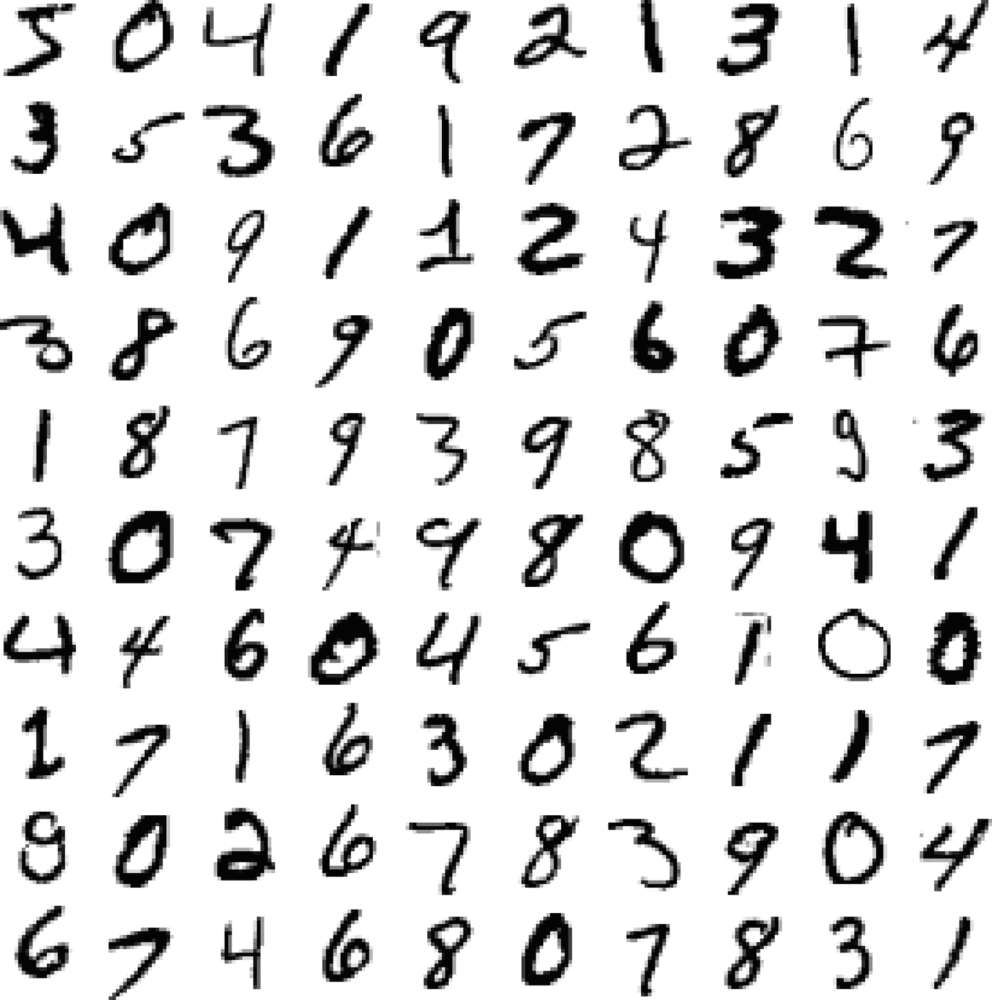
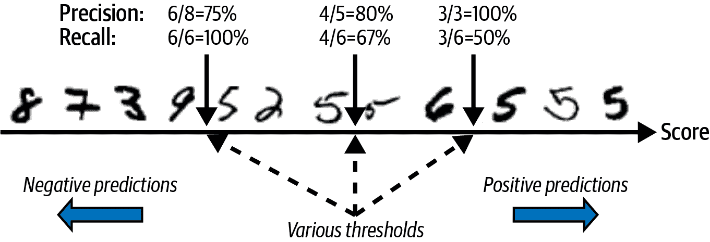
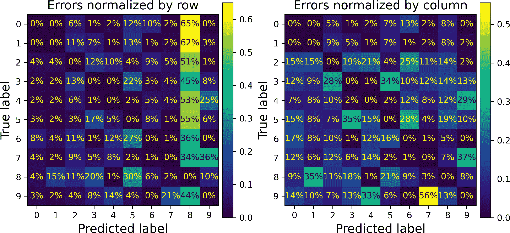

# 第三章\. 分类

在 第一章 中，我提到最常见的监督学习任务是回归（预测值）和分类（预测类别）。在 第二章 中，我们探讨了回归任务，使用各种算法（如线性回归、决策树和随机森林，这些将在后面的章节中详细解释）预测房价。现在，我们将把注意力转向分类系统。

# MNIST

在本章中，我们将使用 MNIST 数据集，这是一个由美国人口普查局的高中生和员工手写的 70,000 个小数字图像集合。每个图像都标有它所代表的数字。这个集合已经被研究得如此之多，以至于它经常被称为机器学习的“hello world”：每当人们提出一个新的分类算法时，他们都会好奇它在 MNIST 上的表现如何，任何学习机器学习的人迟早都会处理这个数据集。

Scikit-Learn 提供了许多辅助函数来下载流行的数据集。MNIST 就是其中之一。以下代码从 OpenML.org 获取 MNIST 数据集：⁠^(1)

```py
from sklearn.datasets import fetch_openml

mnist = fetch_openml('mnist_784', as_frame=False)
```

`sklearn.datasets` 包主要包含三种类型的函数：`fetch_*` 函数，例如 `fetch_openml()` 用于下载真实数据集，`load_*` 函数用于加载与 Scikit-Learn 捆绑的小型玩具数据集（因此不需要从互联网上下载），以及 `make_*` 函数用于生成假数据集，这对于测试很有用。生成的数据集通常以 `(X, y)` 元组的形式返回，包含输入数据和目标，两者均为 NumPy 数组。其他数据集以 `sklearn.utils.Bunch` 对象的形式返回，这些对象是字典，其条目也可以作为属性访问。它们通常包含以下条目：

`"DESCR"`

数据集的描述

`"数据"`

输入数据，通常是一个二维 NumPy 数组

`"目标"`

标签，通常是一个一维 NumPy 数组

`fetch_openml()` 函数有点不寻常，因为它默认返回输入作为 Pandas DataFrame，标签作为 Pandas Series（除非数据集是稀疏的）。但 MNIST 数据集包含图像，DataFrame 并不适合这种情况，因此最好设置 `as_frame=False` 以获取 NumPy 数组形式的数据。让我们看看这些数组：

```py
>>> X, y = mnist.data, mnist.target `>>>` `X` ````` `array([[0, 0, 0, ..., 0, 0, 0],`  `[0, 0, 0, ..., 0, 0, 0],`  `[0, 0, 0, ..., 0, 0, 0],`  `...,`  `[0, 0, 0, ..., 0, 0, 0],`  `[0, 0, 0, ..., 0, 0, 0],`  `[0, 0, 0, ..., 0, 0, 0]])` `>>>` `X``.``shape` ```py` `(70000, 784)` `>>>` `y` ``` `array(['5', '0', '4', ..., '4', '5', '6'], dtype=object)` `>>>` `y``.``shape` `` `(70000,)` `` ```py ```` ```py``
```

```py```` ```py``` ````` There are 70,000 images, and each image has 784 features. This is because each image is 28 × 28 pixels, and each feature simply represents one pixel’s intensity, from 0 (white) to 255 (black). Let’s take a peek at one digit from the dataset (Figure 3-1). All we need to do is grab an instance’s feature vector, reshape it to a 28 × 28 array, and display it using Matplotlib’s `imshow()` function. We use `cmap="binary"` to get a grayscale color map where 0 is white and 255 is black:    ```py import matplotlib.pyplot as plt  def plot_digit(image_data):     image = image_data.reshape(28, 28)     plt.imshow(image, cmap="binary")     plt.axis("off")  some_digit = X[0] plot_digit(some_digit) plt.show() ```    ###### Figure 3-1\. Example of an MNIST image    This looks like a 5, and indeed that’s what the label tells us:    ```py >>> y[0] `'5'` ```   ```py`To give you a feel for the complexity of the classification task, Figure 3-2 shows a few more images from the MNIST dataset. There’s quite a large variety of digit shapes. That said, the images are clean, well centered, not too rotated, and the digits all have roughly the same size: this dataset will not require much preprocessing (real-world datasets aren’t usually that friendly).    But wait! You should always create a test set and set it aside before inspecting the data closely. The MNIST dataset returned by `fetch_openml()` is actually already split into a training set (the first 60,000 images) and a test set (the last 10,000 images):^(2)    ``` X_train, X_test, y_train, y_test = X[:60000], X[60000:], y[:60000], y[60000:] ```py    The training set is already shuffled for us, which is good because this guarantees that all cross-validation folds will be similar (we don’t want one fold to be missing some digits). Moreover, some learning algorithms are sensitive to the order of the training instances, and they perform poorly if they get many similar instances in a row. Shuffling the dataset ensures that this won’t happen.⁠^(3)    ###### Figure 3-2\. Digits from the MNIST dataset```` ```py`` ``````py ``````py`  ``````py```````py```````py`````` ```py```````py```````py```````py` ``````py```````py```````py```` # Training a Binary Classifier    Let’s simplify the problem for now and only try to identify one digit—for example, the number 5\. This “5-detector” will be an example of a *binary classifier*, capable of distinguishing between just two classes, 5 and non-5\. First we’ll create the target vectors for this classification task:    ```py y_train_5 = (y_train == '5')  # True for all 5s, False for all other digits y_test_5 = (y_test == '5') ```    Now let’s pick a classifier and train it. A good place to start is with a *stochastic gradient descent* (SGD, or stochastic GD) classifier, using Scikit-Learn’s `SGDClassifier` class. This classifier is capable of handling very large datasets efficiently. This is in part because SGD deals with training instances independently, one at a time, which also makes SGD well suited for online learning, as you will see later. Let’s create an `SGDClassifier` and train it on the whole training set:    ```py from sklearn.linear_model import SGDClassifier  sgd_clf = SGDClassifier(random_state=42) sgd_clf.fit(X_train, y_train_5) ```    Now we can use it to detect images of the number 5:    ```py >>> sgd_clf.predict([some_digit]) `array([ True])` ```   ``The classifier guesses that this image represents a 5 (`True`). Looks like it guessed right in this particular case! Now, let’s evaluate this model’s performance.``  ```py```````py```````py`````` # Performance Measures    Evaluating a classifier is often significantly trickier than evaluating a regressor, so we will spend a large part of this chapter on this topic. There are many performance measures available, so grab another coffee and get ready to learn a bunch of new concepts and acronyms!    ## Measuring Accuracy Using Cross-Validation    A good way to evaluate a model is to use cross-validation, just as you did in Chapter 2. Let’s use the `cross_val_score()` function to evaluate our `SGDClassifier` model, using *k*-fold cross-validation with three folds. Remember that *k*-fold cross-validation means splitting the training set into *k* folds (in this case, three), then training the model *k* times, holding out a different fold each time for evaluation (see Chapter 2):    ```py >>> from sklearn.model_selection import cross_val_score `>>>` `cross_val_score``(``sgd_clf``,` `X_train``,` `y_train_5``,` `cv``=``3``,` `scoring``=``"accuracy"``)` `` `array([0.95035, 0.96035, 0.9604 ])` `` ```   ```py`` ```` Wow! Above 95% accuracy (ratio of correct predictions) on all cross-validation folds? This looks amazing, doesn’t it? Well, before you get too excited, let’s look at a dummy classifier that just classifies every single image in the most frequent class, which in this case is the negative class (i.e., *non*-5):    ```py from sklearn.dummy import DummyClassifier  dummy_clf = DummyClassifier() dummy_clf.fit(X_train, y_train_5) print(any(dummy_clf.predict(X_train)))  # prints False: no 5s detected ```    Can you guess this model’s accuracy? Let’s find out:    ```py >>> cross_val_score(dummy_clf, X_train, y_train_5, cv=3, scoring="accuracy") `array([0.90965, 0.90965, 0.90965])` ```   `That’s right, it has over 90% accuracy! This is simply because only about 10% of the images are 5s, so if you always guess that an image is *not* a 5, you will be right about 90% of the time. Beats Nostradamus.    This demonstrates why accuracy is generally not the preferred performance measure for classifiers, especially when you are dealing with *skewed datasets* (i.e., when some classes are much more frequent than others). A much better way to evaluate the performance of a classifier is to look at the *confusion matrix* (CM).` ```py` `````  ```py```````py```````py````` ```py```````py```````py```` ```py```````py```````py``` ## Confusion Matrices    The general idea of a confusion matrix is to count the number of times instances of class A are classified as class B, for all A/B pairs. For example, to know the number of times the classifier confused images of 8s with 0s, you would look at row #8, column #0 of the confusion matrix.    To compute the confusion matrix, you first need to have a set of predictions so that they can be compared to the actual targets. You could make predictions on the test set, but it’s best to keep that untouched for now (remember that you want to use the test set only at the very end of your project, once you have a classifier that you are ready to launch). Instead, you can use the `cross_val_predict()` function:    ``` from sklearn.model_selection import cross_val_predict  y_train_pred = cross_val_predict(sgd_clf, X_train, y_train_5, cv=3) ```py    Just like the `cross_val_score()` function, `cross_val_predict()` performs *k*-fold cross-validation, but instead of returning the evaluation scores, it returns the predictions made on each test fold. This means that you get a clean prediction for each instance in the training set (by “clean” I mean “out-of-sample”: the model makes predictions on data that it never saw during training).    Now you are ready to get the confusion matrix using the `confusion_matrix()` function. Just pass it the target classes (`y_train_5`) and the predicted classes (`y_train_pred`):    ``` >>> from sklearn.metrics import confusion_matrix `>>>` `cm` `=` `confusion_matrix``(``y_train_5``,` `y_train_pred``)` ```py `>>>` `cm` `` `array([[53892,   687],`  `[ 1891,  3530]])` `` ``` ```py   ``````py ````` ```py` Each row in a confusion matrix represents an *actual class*, while each column represents a *predicted class*. The first row of this matrix considers non-5 images (the *negative class*): 53,892 of them were correctly classified as non-5s (they are called *true negatives*), while the remaining 687 were wrongly classified as 5s (*false positives*, also called *type I errors*). The second row considers the images of 5s (the *positive class*): 1,891 were wrongly classified as non-5s (*false negatives*, also called *type II errors*), while the remaining 3,530 were correctly classified as 5s (*true positives*). A perfect classifier would only have true positives and true negatives, so its confusion matrix would have nonzero values only on its main diagonal (top left to bottom right):    ``` >>> y_train_perfect_predictions = y_train_5  # pretend we reached perfection `>>>` `confusion_matrix``(``y_train_5``,` `y_train_perfect_predictions``)` `` `array([[54579,     0],`  `[    0,  5421]])` `` ```py   `` `The confusion matrix gives you a lot of information, but sometimes you may prefer a more concise metric. An interesting one to look at is the accuracy of the positive predictions; this is called the *precision* of the classifier (Equation 3-1).    ##### Equation 3-1\. Precision  $precision equals StartFraction upper T upper P Over upper T upper P plus upper F upper P EndFraction$  *TP* is the number of true positives, and *FP* is the number of false positives.    Now consider a model that only makes positive predictions when it’s extremely confident. Let’s push this to the extreme and suppose that it always makes negative predictions, except for a single positive prediction on the instance it’s most confident about. If this one prediction is correct, then the classifier has 100% precision (precision = 1/1 = 100%). Obviously, such a classifier would not be very useful, since it would ignore all but one positive instance. For this reason, precision is typically used along with another metric named *recall*, also called *sensitivity* or the *true positive rate* (TPR): this is the ratio of positive instances that are correctly detected by the classifier (Equation 3-2).    ##### Equation 3-2\. Recall  $recall equals StartFraction upper T upper P Over upper T upper P plus upper F upper N EndFraction$  *FN* is, of course, the number of false negatives.    If you are confused about the confusion matrix, Figure 3-3 may help.    ###### Figure 3-3\. An illustrated confusion matrix showing examples of true negatives (top left), false positives (top right), false negatives (lower left), and true positives (lower right)` `` ```` ```py`` ``````py  ``````py```````py`````` ```py```````py```````py` ``````py```````py```` ## Precision and Recall    Scikit-Learn provides several functions to compute classifier metrics, including precision and recall:    ```py >>> from sklearn.metrics import precision_score, recall_score `>>>` `precision_score``(``y_train_5``,` `y_train_pred``)`  `# == 3530 / (687 + 3530)` ``` `np.float64(0.8370879772350012)` `>>>` `recall_score``(``y_train_5``,` `y_train_pred``)`  `# == 3530 / (1891 + 3530)` `` `np.float64(0.6511713705958311)` `` ```py ```   ```py``` ````` ```py` Now our 5-detector does not look as shiny as it did when we looked at its accuracy. When it claims an image represents a 5, it is correct only 83.7% of the time. Moreover, it only detects 65.1% of the 5s.    It is often convenient to combine precision and recall into a single metric called the *F[1] score*, especially when you need a single metric to compare two classifiers. The F[1] score is the *harmonic mean* of precision and recall (Equation 3-3). Whereas the regular mean treats all values equally, the harmonic mean gives much more weight to low values. As a result, the classifier will only get a high F[1] score if both recall and precision are high.    ##### Equation 3-3\. F[1] score  $upper F 1 equals StartStartFraction 2 OverOver StartFraction 1 Over precision EndFraction plus StartFraction 1 Over recall EndFraction EndEndFraction equals 2 times StartFraction precision times recall Over precision plus recall EndFraction equals StartStartFraction upper T upper P OverOver upper T upper P plus StartFraction upper F upper N plus upper F upper P Over 2 EndFraction EndEndFraction$  To compute the F[1] score, simply call the `f1_score()` function:    ``` >>> from sklearn.metrics import f1_score `>>>` `f1_score``(``y_train_5``,` `y_train_pred``)` `` `0.7325171197343846` `` ```py   `` `The F[1] score favors classifiers that have similar precision and recall. This is not always what you want: in some contexts you mostly care about precision, and in other contexts you really care about recall. For example, if you trained a classifier to detect videos that are safe for kids, you would probably prefer a classifier that rejects many good videos (low recall) but keeps only safe ones (high precision), rather than a classifier that has a much higher recall but lets a few really bad videos show up in your product (in such cases, you may even want to add a human pipeline to check the classifier’s video selection). On the other hand, suppose you train a classifier to detect shoplifters in surveillance images: it is probably fine if your classifier only has 30% precision as long as it has 99% recall. Sure, the security guards will get a few false alerts, but almost all shoplifters will get caught. Similarly, medical diagnosis usually requires a high recall to avoid missing anything important. False positives can be ruled out by follow-up medical tests.    Unfortunately, you can’t have it both ways: increasing precision reduces recall, and vice versa. This is called the *precision/recall trade-off*.` `` ```` ```py`` ``````py  ``````py```````py``` ``````py```````py`` ``````py```````py` ## 精确率/召回率权衡    为了理解这种权衡，让我们看看`SGDClassifier`是如何做出分类决定的。对于每个实例，它根据一个*决策函数*计算一个分数。如果这个分数大于一个阈值，它将实例分配到正类；否则，它将实例分配到负类。图 3-4 显示了从左到右从最低分数到最高分数的一些数字。假设*决策阈值*位于中央箭头（两个 5 之间）：你会在阈值右侧找到 4 个真正的正例（实际的 5），以及 1 个假正例（实际上是一个 6）。因此，使用这个阈值，精确率为 80%（5 个中的 4 个）。但是，在 6 个实际的 5 中，分类器只检测到 4 个，因此召回率为 67%（6 个中的 4 个）。如果你提高阈值（将其移动到右侧的箭头），假正例（6）变成真负例，从而提高了精确率（在本例中达到 100%），但一个真正的正例变成假负例，召回率下降到 50%。相反，降低阈值会增加召回率并降低精确率。    ###### 图 3-4. 精确率/召回率权衡：图像按其分类器分数排序，高于所选决策阈值的被认为是正例；阈值越高，召回率越低，但（通常）精确率越高    你可以调用分类器的`predict()`方法，而不是调用其`decision_function()`方法，后者为每个实例返回一个分数。然后你可以使用任何你想要的阈值来根据这些分数做出预测：    ``` >>> y_scores = sgd_clf.decision_function([some_digit]) `>>>` `y_scores` ```py`` `array([2164.22030239])` `>>>` `threshold` `=` `0` ```` `>>>` `y_some_digit_pred` `=` `(``y_scores` `>` `threshold``)` ```py `>>>` `y_some_digit_pred` `` `array([ True])` `` ``` ```py` ````` ```py   ``````py```````py ``````py`````` ```py```````py` `SGDClassifier`使用等于 0 的阈值，因此前面的代码返回的结果与`predict()`方法相同（即`True`）。让我们提高阈值：    ``` >>> threshold = 3000 `>>>` `y_some_digit_pred` `=` `(``y_scores` `>` `threshold``)` ```py `>>>` `y_some_digit_pred` `` `array([False])` `` ``` ```py   ``````py```` ```py`````` ```py````` 这证实了提高阈值会降低召回率。实际上，图像代表一个 5，当阈值是 0 时，分类器可以检测到它，但当阈值增加到 3,000 时，它就错过了它。    你如何决定使用哪个阈值？一个选项是使用`cross_val_predict()`函数来获取训练集中所有实例的分数，但这次指定你想要返回决策分数而不是预测：    ```py y_scores = cross_val_predict(sgd_clf, X_train, y_train_5, cv=3,                              method="decision_function") ```    使用这些分数，使用`precision_recall_curve()`函数计算所有可能阈值下的精确率和召回率（该函数添加一个最后的精确率为 1 和一个最后的召回率为 0，对应于无限阈值）：    ```py from sklearn.metrics import precision_recall_curve  precisions, recalls, thresholds = precision_recall_curve(y_train_5, y_scores) ```    最后，使用 Matplotlib 将精确率和召回率作为阈值值的函数绘制出来(图 3-5)。让我们展示我们选择的 3,000 个阈值：    ```py plt.plot(thresholds, precisions[:-1], "b--", label="Precision", linewidth=2) plt.plot(thresholds, recalls[:-1], "g-", label="Recall", linewidth=2) plt.vlines(threshold, 0, 1.0, "k", "dotted", label="threshold") [...]  # beautify the figure: add grid, legend, axis, labels, and circles plt.show() ```    ###### 图 3-5. 精确率和召回率与决策阈值    ###### 注意    你可能会想知道为什么图 3-5 中的精确率曲线比召回率曲线更崎岖。原因是，当你提高阈值时，精确率有时会下降（尽管在一般情况下它会上升）。要了解原因，请回顾图 3-4，并注意当你从中央阈值开始并将其向右移动一个数字时会发生什么：精确率从 4/5（80%）下降到 3/4（75%）。另一方面，召回率只有在阈值增加时才会下降，这解释了为什么它的曲线看起来很平滑。    在这个阈值值下，精确率接近 90%，召回率约为 50%。选择良好的精确率/召回率权衡的另一种方法是直接将精确率与召回率绘制在一起，如图图 3-6 所示（显示相同的阈值）：    ```py plt.plot(recalls, precisions, linewidth=2, label="Precision/Recall curve") [...]  # beautify the figure: add labels, grid, legend, arrow, and text plt.show() ```    ###### 图 3-6. 精确率与召回率    你可以看到，精确率在约 80%的召回率时真正开始急剧下降。你可能想在下降之前选择一个精确率/召回率权衡——例如，在约 60%的召回率时。但当然，选择取决于你的项目。    假设你决定以 90%的精确率为目标。你可以使用第一个图表来找到你需要使用的阈值，但这不是很精确。或者，你可以搜索至少给你 90%精确率的最小阈值。为此，你可以使用 NumPy 数组的`argmax()`方法。这返回最大值的第一个索引，在这种情况下意味着第一个`True`值：    ```py >>> idx_for_90_precision = (precisions >= 0.90).argmax() `>>>` `threshold_for_90_precision` `=` `thresholds``[``idx_for_90_precision``]` ``` `>>>` `threshold_for_90_precision` `` `np.float64(3370.0194991439557)` `` ```py ```   ```py```` ```py``` ````` To make predictions (on the training set for now), instead of calling the classifier’s `predict()` method, you can run this code:    ```py y_train_pred_90 = (y_scores >= threshold_for_90_precision) ```    Let’s check these predictions’ precision and recall:    ```py >>> precision_score(y_train_5, y_train_pred_90) `0.9000345901072293` `>>>` `recall_at_90_precision` `=` `recall_score``(``y_train_5``,` `y_train_pred_90``)` ``` `>>>` `recall_at_90_precision` `` `0.4799852425751706` `` ```py ```   ```py` ``` ``Great, you have a 90% precision classifier! As you can see, it is fairly easy to create a classifier with virtually any precision you want: just set a high enough threshold, and you’re done. But wait, not so fast: a high-precision classifier is not very useful if its recall is too low! For many applications, 48% recall wouldn’t be great at all.    ###### Tip    If someone says, “Let’s reach 99% precision”, you should ask, “At what recall?”    Since Scikit-Learn 1.5, there are two new classes you can use to more easily adjust the decision threshold:    *   The `FixedThresholdClassifier` class lets you wrap a binary classifier and set the desired threshold manually. If the underlying classifier has a `predict_proba()` method, then the threshold should be a value between 0 and 1 (the default is 0.5). Otherwise, it should be a decision score, comparable to the output of the model’s `decision_function()` (the default is 0).           *   The `TunedThresholdClassifierCV` class uses *k*-fold cross-validation to automatically find the optimal threshold for a given metric. By default, it tries to find the threshold that maximizes the model’s *balanced accuracy*: that’s the average of each class’s recall. However, you can select another metric to optimize for (see the documentation for the full list of options).`` ```py ```` ```py`` ``````py ``````py` ``````py`` ``````py``` ``````py```` ```py```````py` ``````py`````` ```py```````py```  ``````py``` ``````py`` ``````py` ## The ROC Curve    The *receiver operating characteristic* (ROC) curve is another common tool used with binary classifiers. It is very similar to the precision/recall curve, but instead of plotting precision versus recall, the ROC curve plots the *true positive rate* (another name for recall) against the *false positive rate* (FPR). The FPR (also called the *fall-out*) is the ratio of negative instances that are incorrectly classified as positive. It is equal to 1 – the *true negative rate* (TNR), which is the ratio of negative instances that are correctly classified as negative. The TNR is also called *specificity*. Hence, the ROC curve plots *sensitivity* (recall) versus 1 – *specificity*.    To plot the ROC curve, you first use the `roc_curve()` function to compute the TPR and FPR for various threshold values:    ``` from sklearn.metrics import roc_curve  fpr, tpr, thresholds = roc_curve(y_train_5, y_scores) ```py    Then you can plot the FPR against the TPR using Matplotlib. The following code produces the plot in Figure 3-7. To find the point that corresponds to 90% precision, we need to look for the index of the desired threshold. Since thresholds are listed in decreasing order in this case, we use `<=` instead of `>=` on the first line:    ``` idx_for_threshold_at_90 = (thresholds <= threshold_for_90_precision).argmax() tpr_90, fpr_90 = tpr[idx_for_threshold_at_90], fpr[idx_for_threshold_at_90]  plt.plot(fpr, tpr, linewidth=2, label="ROC curve") plt.plot([0, 1], [0, 1], 'k:', label="Random classifier's ROC curve") plt.plot([fpr_90], [tpr_90], "ko", label="Threshold for 90% precision") [...]  # beautify the figure: add labels, grid, legend, arrow, and text plt.show() ```py    Once again there is a trade-off: the higher the recall (TPR), the more false positives (FPR) the classifier produces. The dotted line represents the ROC curve of a purely random classifier; a good classifier stays as far away from that line as possible (toward the top-left corner).    One way to compare classifiers is to measure the *area under the curve* (AUC). A perfect classifier will have a ROC AUC equal to 1, whereas a purely random classifier will have a ROC AUC equal to 0.5\. Scikit-Learn provides a function to estimate the ROC AUC:    ``` >>> from sklearn.metrics import roc_auc_score `>>>` `roc_auc_score``(``y_train_5``,` `y_scores``)` `` `np.float64(0.9604938554008616)` `` ```py  ``````py `````   ###### Figure 3-7\. A ROC curve plotting the false positive rate against the true positive rate for all possible thresholds; the black circle highlights the chosen ratio (at 90% precision and 48% recall)    ###### Tip    Since the ROC curve is so similar to the precision/recall (PR) curve, you may wonder how to decide which one to use. As a rule of thumb, you should prefer the PR curve whenever the positive class is rare or when you care more about the false positives than the false negatives. Otherwise, use the ROC curve. For example, looking at the previous ROC curve (and the ROC AUC score), you may think that the classifier is really good. But this is mostly because there are few positives (5s) compared to the negatives (non-5s). In contrast, the PR curve makes it clear that the classifier has room for improvement: the curve could really be closer to the top-right corner (see Figure 3-6 again).    Let’s now create a `RandomForestClassifier`, whose PR curve and F[1] score we can compare to those of the `SGDClassifier`:    ```py from sklearn.ensemble import RandomForestClassifier  forest_clf = RandomForestClassifier(random_state=42) ```    The `precision_recall_curve()` function expects labels and scores for each instance, so we need to train the random forest classifier and make it assign a score to each instance. But the `RandomForestClassifier` class does not have a `decision_function()` method, due to the way it works (we will cover this in Chapter 6). Luckily, it has a `predict_proba()` method that returns estimated class probabilities for each instance, and we can just use the probability of the positive class as a score, so `precision_recall_curve()` will work.^(4) We can call the `cross_val_​predict()` function to train the `RandomForestClassifier` using cross-validation and make it predict class probabilities for every image as follows:    ```py y_probas_forest = cross_val_predict(forest_clf, X_train, y_train_5, cv=3,                                     method="predict_proba") ```    Let’s look at the estimated class probabilities for the first two images in the training set:    ```py >>> y_probas_forest[:2] `array([[0.11, 0.89],`  `[0.99, 0.01]])` ```   ```py` The model predicts that the first image is positive with 89% probability, and it predicts that the second image is negative with 99% probability. Since each image is either positive or negative, the estimated probabilities in each row add up to 100%.    ###### Warning    These are *estimated* probabilities, not actual probabilities. For example, if you look at all the images that the model classified as positive with an estimated probability between 50% and 60%, roughly 94% of them are actually positive. So, the model’s estimated probabilities were much too low in this case—but models can be overconfident as well. The `CalibratedClassifierCV` class from the `sklearn.calibration` package can calibrate the estimated probabilities using cross-validation, making them much closer to actual probabilities (see the notebook for a code example). This is important in some scenarios, such as medical diagnosis, financial risk assessment, or fraud detection.    The second column contains the estimated probabilities for the positive class, so let’s pass them to the `precision_recall_curve()` function:    ``` y_scores_forest = y_probas_forest[:, 1] precisions_forest, recalls_forest, thresholds_forest = precision_recall_curve(     y_train_5, y_scores_forest) ```py    Now we’re ready to plot the PR curve. It is useful to plot the first PR curve as well to see how they compare (Figure 3-8):    ``` plt.plot(recalls_forest, precisions_forest, "b-", linewidth=2,          label="Random Forest") plt.plot(recalls, precisions, "--", linewidth=2, label="SGD") [...]  # beautify the figure: add labels, grid, and legend plt.show() ```py    ###### Figure 3-8\. Comparing PR curves: the random forest classifier is superior to the SGD classifier because its PR curve is much closer to the top-right corner, and it has a greater AUC    As you can see in Figure 3-8, the `RandomForestClassifier`’s PR curve looks much better than the `SGDClassifier`’s: it comes much closer to the top-right corner. Its F[1] score and ROC AUC score are also significantly better:    ``` >>> y_train_pred_forest = y_probas_forest[:, 1] >= 0.5  # positive proba ≥ 50% `>>>` `f1_score``(``y_train_5``,` `y_train_pred_forest``)` ```py `0.9274509803921569` `>>>` `roc_auc_score``(``y_train_5``,` `y_scores_forest``)` `` `0.9983436731328145` `` ``` ```py   ``` `` `Try measuring the precision and recall scores: you should find about 99.0% precision and 87.3% recall. Not too bad!    You now know how to train binary classifiers, choose the appropriate metric for your task, evaluate your classifiers using cross-validation, select the precision/recall trade-off that fits your needs, and use several metrics and curves to compare various models. You’re ready to try to detect more than just the 5s.` `` ```py ```` ```py`` ``````py ``````py` ``````py`` ``````py``` ``````py```````py` ``````py```````py`` ``````py```````py``` ``````py```````py```` ```py```````py```````py` ``````py```````py`````` ```py```````py```````py``` ``````py```````py```````py` ``````py```````py```````py``  ``````py```````py```````py` ``````py```````py```````py ``````py```````py`````` # Multiclass Classification    Whereas binary classifiers distinguish between two classes, *multiclass classifiers* (also called *multinomial classifiers*) can distinguish between more than two classes.    Some Scikit-Learn classifiers (e.g., `LogisticRegression`, `RandomForestClassifier`, and `GaussianNB`) are capable of handling multiple classes natively. Others are strictly binary classifiers (e.g., `SGDClassifier` and `SVC`). However, there are various strategies that you can use to perform multiclass classification with multiple binary classifiers.    One way to create a system that can classify the digit images into 10 classes (from 0 to 9) is to train 10 binary classifiers, one for each digit (a 0-detector, a 1-detector, a 2-detector, and so on). Then when you want to classify an image, you get the decision score from each classifier for that image and you select the class whose classifier outputs the highest score. This is called the *one-versus-the-rest* (OvR) strategy, or sometimes *one-versus-all* (OvA).    Another strategy is to train a binary classifier for every pair of digits: one to distinguish 0s and 1s, another to distinguish 0s and 2s, another for 1s and 2s, and so on. This is called the *one-versus-one* (OvO) strategy. If there are *N* classes, you need to train *N* × (*N* – 1) / 2 classifiers. For the MNIST problem, this means training 45 binary classifiers! When you want to classify an image, you have to run the image through all 45 classifiers and see which class wins the most duels. The main advantage of OvO is that each classifier only needs to be trained on the part of the training set containing the two classes that it must distinguish.    Some algorithms (such as support vector machine classifiers) scale poorly with the size of the training set. For these algorithms OvO is preferred because it is faster to train many classifiers on small training sets than to train few classifiers on large training sets. For most binary classification algorithms, however, OvR is preferred.    Scikit-Learn detects when you try to use a binary classification algorithm for a multiclass classification task, and it automatically runs OvR or OvO, depending on the algorithm. Let’s try this with a support vector machine classifier using the `sklearn.svm.SVC` class (see the online chapter on SVMs at [*https://homl.info*](https://homl.info)). We’ll only train on the first 2,000 images, or else it will take a very long time:    ```py from sklearn.svm import SVC  svm_clf = SVC(random_state=42) svm_clf.fit(X_train[:2000], y_train[:2000])  # y_train, not y_train_5 ```    That was easy! We trained the `SVC` using the original target classes from 0 to 9 (`y_train`), instead of the 5-versus-the-rest target classes (`y_train_5`). Since there are 10 classes (i.e., more than 2), Scikit-Learn used the OvO strategy and trained 45 binary classifiers. Now let’s make a prediction on an image:    ```py >>> svm_clf.predict([some_digit]) `array(['5'], dtype=object)` ```   ```py```````py```````py` That’s correct! This code actually made 45 predictions—one per pair of classes—and it selected the class that won the most duels.⁠^(5) If you call the `decision_function()` method, you will see that it returns 10 scores per instance: one per class. Each class gets a score equal to the number of won duels plus or minus a small tweak (max ±0.33) to break ties, based on the classifier scores:    ``` >>> some_digit_scores = svm_clf.decision_function([some_digit]) `>>>` `some_digit_scores``.``round``(``2``)` `` `array([[ 3.79,  0.73,  6.06,  8.3 , -0.29,  9.3 ,  1.75,  2.77,  7.21,`  `4.82]])` `` ```py   ``````py```````py```` ```py```````py`````` The highest score is 9.3, and it’s indeed the one corresponding to class 5:    ```py >>> class_id = some_digit_scores.argmax() `>>>` `class_id` `` `np.int64(5)` `` ```   ```py```````py````` ```py```````py```` When a classifier is trained, it stores the list of target classes in its `classes_` attribute, ordered by value. In the case of MNIST, the index of each class in the `classes_` array conveniently matches the class itself (e.g., the class at index 5 happens to be class `'5'`), but in general you won’t be so lucky; you will need to look up the class label like this:    ```py >>> svm_clf.classes_ `array(['0', '1', '2', '3', '4', '5', '6', '7', '8', '9'], dtype=object)` `>>>` `svm_clf``.``classes_``[``class_id``]` `` `'5'` `` ```   ```py```````py``` ``````py`````` 如果你想要强制 Scikit-Learn 使用一对一或一对多，你可以使用`OneVsOneClassifier`或`OneVsRestClassifier`类。只需创建一个实例并将其传递给构造函数（它甚至不需要是二元分类器）。例如，此代码创建了一个基于`SVC`的 OvR 策略的多类分类器：    ```py from sklearn.multiclass import OneVsRestClassifier  ovr_clf = OneVsRestClassifier(SVC(random_state=42)) ovr_clf.fit(X_train[:2000], y_train[:2000]) ```    让我们进行预测，并检查训练的分类器数量：    ```py >>> ovr_clf.predict([some_digit]) `array(['5'], dtype='<U1')` `>>>` `len``(``ovr_clf``.``estimators_``)` `` `10` `` ```   ```py```````py` ``````py```` Training an `SGDClassifier` on a multiclass dataset and using it to make predictions is just as easy:    ```py >>> sgd_clf = SGDClassifier(random_state=42) `>>>` `sgd_clf``.``fit``(``X_train``,` `y_train``)` ``` `>>>` `sgd_clf``.``predict``([``some_digit``])` `` `array(['3'], dtype='<U1')` `` ```py ```   ```py`````` ```py````` ```py```` 哎呀，这是错误的。预测错误确实会发生！这次 Scikit-Learn 在底层使用了 OvR 策略：由于有 10 个类别，它训练了 10 个二元分类器。`decision_function()`方法现在为每个类别返回一个值。让我们看看 SGD 分类器分配给每个类别的分数：    ```py >>> sgd_clf.decision_function([some_digit]).round() `array([[-31893., -34420.,  -9531.,   1824., -22320.,  -1386., -26189.,`  `-16148.,  -4604., -12051.]])` ```   ```py``` 你可以看到，分类器对其预测并不太自信：几乎所有的分数都非常负，而类别 3 的分数为+1,824，类别 5 的分数也不太远，为-1,386。当然，你将想要在多个图像上评估这个分类器。由于每个类别中的图像数量大致相同，准确率指标是合适的。像往常一样，你可以使用`cross_val_score()`函数来评估模型：    ``` >>> cross_val_score(sgd_clf, X_train, y_train, cv=3, scoring="accuracy") `array([0.87365, 0.85835, 0.8689 ])` ```py   ````` It gets over 85.8% on all test folds. If you used a random classifier, you would get 10% accuracy, so this is not such a bad score, but you can still do much better. Simply scaling the inputs (as discussed in Chapter 2) increases accuracy above 89.1%:    ```py >>> from sklearn.preprocessing import StandardScaler `>>>` `scaler` `=` `StandardScaler``()` ```` `>>>` `X_train_scaled` `=` `scaler``.``fit_transform``(``X_train``.``astype``(``"float64"``))` ```py `>>>` `cross_val_score``(``sgd_clf``,` `X_train_scaled``,` `y_train``,` `cv``=``3``,` `scoring``=``"accuracy"``)` `` `array([0.8983, 0.891 , 0.9018])` `` ``` ```py` ``` ```py`` ``````py ``````py` ``````py`` ``````py``` ``````py```` ```py```````py` ``````py`````` ```py```````py``` ``````py```````py` ``````py```````py`` ``````py```````py``` ``````py```````py```` ```py```````py```````py`  ``````py``` ``````py`` ``````py` # 错误分析    如果这是一个真实的项目，你现在将遵循你的机器学习项目清单中的步骤（见[*https://homl.info/checklist*](https://homl.info/checklist)）。你会探索数据准备选项，尝试多个模型，筛选出最好的模型，使用`GridSearchCV`调整它们的超参数，并尽可能自动化。在这里，我们假设你已经找到了一个有前途的模型，并且你想要找到改进它的方法。一种方法是通过分析它所犯的错误类型。    首先，看看混淆矩阵。为此，你首先需要使用`cross_val_predict()`函数进行预测；然后你可以将标签和预测传递给`confusion_matrix()`函数，就像你之前做的那样。但是，由于现在有 10 个类别而不是 2 个，混淆矩阵将包含相当多的数字，并且可能难以阅读。    混淆矩阵的彩色图更容易分析。要绘制这样的图表，使用`ConfusionMatrixDisplay.from_predictions()`函数，如下所示：    ``` from sklearn.metrics import ConfusionMatrixDisplay  y_train_pred = cross_val_predict(sgd_clf, X_train_scaled, y_train, cv=3) ConfusionMatrixDisplay.from_predictions(y_train, y_train_pred) plt.show() ```py    这产生了图 3-9 中的左侧图表。这个混淆矩阵看起来相当不错：大多数图像都在主对角线上，这意味着它们被正确分类。注意，第 5 行和第 5 列的对角线单元格看起来比其他数字略暗。这可能是因为模型在 5 上犯了更多的错误，或者因为数据集中 5 的数量比其他数字少。这就是为什么通过将每个值除以对应（真实）类别的总图像数（即除以行的总和）来规范化混淆矩阵很重要。这可以通过简单地设置`normalize="true"`来完成。我们还可以指定`values_format=".0%"`参数来显示没有小数的百分比。以下代码产生了图 3-9 右侧的图表：    ``` ConfusionMatrixDisplay.from_predictions(y_train, y_train_pred,                                         normalize="true", values_format=".0%") plt.show() ```py    ###### 图 3-9. 混淆矩阵（左侧）和按行规范化的相同 CM（右侧）    现在，我们可以很容易地看到只有 82%的 5 的图像被正确分类。模型对 5 的图像犯的最常见的错误是将它们错误地分类为 8：这发生在所有 5 的 10%中。但只有 2%的 8 被错误地分类为 5；混淆矩阵通常不是对称的！如果你仔细观察，你会注意到许多数字被错误地分类为 8，但这从这个图表中并不明显。如果你想使错误更加突出，你可以尝试对正确的预测不赋予任何权重。以下代码就是这样做的，并产生了图 3-10 左侧的图表：    ``` sample_weight = (y_train_pred != y_train) ConfusionMatrixDisplay.from_predictions(y_train, y_train_pred,                                         sample_weight=sample_weight,                                         normalize="true", values_format=".0%") plt.show() ```py    ###### 图 3-10. 仅包含错误的混淆矩阵，按行规范化（左侧）和按列规范化（右侧）    现在，你可以更清楚地看到分类器犯的错误类型。现在，类别 8 的列真的很亮，这证实了许多图像被错误地分类为 8。事实上，这是几乎所有类别的最常见错误分类。但请注意如何解释这个图表中的百分比：记住，我们已经排除了正确的预测。例如，左侧网格中第 7 行第 9 列的 36%并不意味着 36%的所有 7 的图像都被错误地分类为 9。这意味着模型在 7 的图像上犯的错误中有 36%被错误地分类为 9。实际上，只有 3%的 7 的图像被错误地分类为 9，正如你在图 3-9 右侧的图表中可以看到的。    还有可能通过列而不是行来规范化混淆矩阵：如果你设置`normalize="pred"`，你将得到图 3-10 右侧的图表。例如，你可以看到 56%的错误分类的 7 实际上是 9。    分析混淆矩阵通常可以让你了解如何改进你的分类器。查看这些图表，似乎你应该把精力放在减少错误的 8 上。例如，你可以尝试收集更多看起来像 8 但不是的数字的训练数据，以便分类器可以学会将它们与真正的 8 区分开来。或者，你可以设计新的特征来帮助分类器——例如，编写一个算法来计算封闭环的数量（例如，8 有两个，6 有一个，5 没有）。或者，你可以对图像进行预处理（例如，使用 Scikit-Image、Pillow 或 OpenCV）来使某些模式（例如，封闭环）更加突出。    分析单个错误也可以是深入了解你的分类器正在做什么以及为什么它失败的好方法。例如，让我们以混淆矩阵的方式绘制 3 和 5 的示例(图 3-11)：    ``` cl_a, cl_b = '3', '5' X_aa = X_train[(y_train == cl_a) & (y_train_pred == cl_a)] X_ab = X_train[(y_train == cl_a) & (y_train_pred == cl_b)] X_ba = X_train[(y_train == cl_b) & (y_train_pred == cl_a)] X_bb = X_train[(y_train == cl_b) & (y_train_pred == cl_b)] [...]  # plot all images in X_aa, X_ab, X_ba, X_bb in a confusion matrix style ```py    ###### 图 3-11. 一些 3 和 5 的图像，以混淆矩阵的方式组织    如你所见，一些分类器犯错的数字（即左下角和右上角块中的数字）写得非常糟糕，即使是人类也很难分类它们。然而，大多数被错误分类的图像对我们来说似乎是明显的错误。虽然很难理解分类器为什么会犯错误，但请记住，人脑是一个了不起的模式识别系统，我们的视觉系统在信息甚至达到我们的意识之前会进行大量的复杂预处理。因此，这项任务感觉很简单并不意味着它很简单。回想一下，我们使用了一个简单的`SGDClassifier`，它只是一个线性模型：它所做的只是为每个类别分配每个像素的权重，当它看到一个新的图像时，它只是将加权像素强度相加以获得每个类别的分数。由于 3 和 5 只相差几个像素，这个模型很容易将它们混淆。    3 和 5 之间的主要区别是连接顶部行和底部弧的小线的位置。如果你将 3 画得连接点稍微向左偏移，分类器可能会将其分类为 5，反之亦然。换句话说，这个分类器对图像的平移和旋转非常敏感。减少 3/5 混淆的一种方法是对图像进行预处理，确保它们很好地居中并且不太旋转。然而，这可能不容易做到，因为它需要预测每个图像的正确旋转。一个更简单的方法是在训练集中添加稍微平移和旋转的训练图像的变体。这将迫使模型学会对这种变化更加宽容。这被称为*数据增强*（我们将在第十二章中介绍；也请参阅本章末尾的练习 2）。    # 多标签分类    到目前为止，每个实例都始终被分配到只有一个类别。但在某些情况下，你可能希望你的分类器为每个实例输出多个类别。考虑一个面部识别分类器：如果它在同一张图片中识别出几个人，它应该怎么办？它应该为它识别的每个人分配一个标签。假设分类器已经训练好了识别三个面部：Alice、Bob 和 Charlie。然后当分类器被展示一张 Alice 和 Charlie 的图片时，它应该输出`[True, False, True]`（表示“Alice 是，Bob 不是，Charlie 是”）。这种输出多个二进制标签的分类系统称为*多标签分类*系统。    我们现在不会深入探讨面部识别，但让我们看看一个更简单的例子，只是为了说明目的：    ``` import numpy as np from sklearn.neighbors import KNeighborsClassifier  y_train_large = (y_train >= '7') y_train_odd = (y_train.astype('int8') % 2 == 1) y_multilabel = np.c_[y_train_large, y_train_odd]  knn_clf = KNeighborsClassifier() knn_clf.fit(X_train, y_multilabel) ```py    此代码创建了一个`y_multilabel`数组，其中包含每个数字图像的两个目标标签：第一个表示数字是否很大（7、8 或 9），第二个表示它是否为奇数。然后代码创建了一个`KNeighborsClassifier`实例，该实例支持多标签分类（并非所有分类器都支持），并使用多个目标数组训练此模型。现在你可以进行预测，并注意它输出了两个标签：    ``` >>> knn_clf.predict([some_digit]) `array([[False,  True]])` ```py   ``````py And it gets it right! The digit 5 is indeed not large (`False`) and odd (`True`).    There are many ways to evaluate a multilabel classifier, and selecting the right metric really depends on your project. One approach is to measure the F[1] score for each individual label (or any other binary classifier metric discussed earlier), then simply compute the average score. The following code computes the average F[1] score across all labels:    ``` >>> y_train_knn_pred = cross_val_predict(knn_clf, X_train, y_multilabel, cv=3) `>>>` `f1_score``(``y_multilabel``,` `y_train_knn_pred``,` `average``=``"macro"``)` `` `0.976410265560605` `` ```py   ````` ```py` This approach assumes that all labels are equally important, which may not be the case. In particular, if you have many more pictures of Alice than of Bob or Charlie, you may want to give more weight to the classifier’s score on pictures of Alice. One simple option is to give each label a weight equal to its *support* (i.e., the number of instances with that target label). To do this, simply set `average="weighted"` when calling the `f1_score()` function.⁠^(6)    If you wish to use a classifier that does not natively support multilabel classification, such as `SVC`, one possible strategy is to train one model per label. However, this strategy may have a hard time capturing the dependencies between the labels. For example, a large digit (7, 8, or 9) is twice more likely to be odd than even, but the classifier for the “odd” label does not know what the classifier for the “large” label predicted. To solve this issue, the models can be organized in a chain: when a model makes a prediction, it uses the input features plus all the predictions of the models that come before it in the chain.    The good news is that Scikit-Learn has a class called `ClassifierChain` that does just that! By default it will use the true labels for training, feeding each model the appropriate labels depending on their position in the chain. But if you set the `cv` hyperparameter, it will use cross-validation to get “clean” (out-of-sample) predictions from each trained model for every instance in the training set, and these predictions will then be used to train all the models later in the chain. Note that the order of the classifiers in the chain may affect the final performance. Here’s an example showing how to create and train a `ClassifierChain` using the cross-validation strategy. As earlier, we’ll just use the first 2,000 images in the training set to speed things up:    ``` from sklearn.multioutput import ClassifierChain  chain_clf = ClassifierChain(SVC(), cv=3, random_state=42) chain_clf.fit(X_train[:2000], y_multilabel[:2000]) ```py    Now we can use this `ClassifierChain` to make predictions:    ``` >>> chain_clf.predict([some_digit]) `array([[0., 1.]])` ```py ```` ```py`` ``````py  ``````py ````` ```py`# Multioutput Classification    The last type of classification task we’ll discuss here is called *multioutput–multiclass classification* (or just *multioutput classification*). It is a generalization of multilabel classification where each label can be multiclass (i.e., it can have more than two possible values).    To illustrate this, let’s build a system that removes noise from images. It will take as input a noisy digit image, and it will (hopefully) output a clean digit image, represented as an array of pixel intensities, just like the MNIST images. Notice that the classifier’s output is multilabel (one label per pixel) and each label can have multiple values (pixel intensity ranges from 0 to 255). This is thus an example of a multioutput classification system.    ###### Note    The line between classification and regression is sometimes blurry, such as in this example. Arguably, predicting pixel intensity is more akin to regression than to classification. Moreover, multioutput systems are not limited to classification tasks; you could even have a system that outputs multiple labels per instance, including both class labels and value labels.    Let’s start by creating the training and test sets by taking the MNIST images and adding noise to their pixel intensities, using a random number generator’s `integers()` method. The target images will be the original images:    ``` rng = np.random.default_rng(seed=42) noise_train = rng.integers(0, 100, (len(X_train), 784)) X_train_mod = X_train + noise_train noise_test = rng.integers(0, 100, (len(X_test), 784)) X_test_mod = X_test + noise_test y_train_mod = X_train y_test_mod = X_test ```py    Let’s take a peek at the first image from the test set (Figure 3-12). Yes, we’re snooping on the test data, so you should be frowning right now.    ###### Figure 3-12\. A noisy image (left) and the target clean image (right)    On the left is the noisy input image, and on the right is the clean target image. Now let’s train the classifier and make it clean up this image (Figure 3-13):    ``` knn_clf = KNeighborsClassifier() knn_clf.fit(X_train_mod, y_train_mod) clean_digit = knn_clf.predict([X_test_mod[0]]) plot_digit(clean_digit) plt.show() ```py    ###### Figure 3-13\. The cleaned-up image    Looks close enough to the target! This concludes our tour of classification. You now know how to select good metrics for classification tasks, pick the appropriate precision/recall trade-off, compare classifiers, and more generally build good classification systems for a variety of tasks. In the next chapters, you’ll learn how all these machine learning models you’ve been using actually work.    # Exercises    1.  Try to build a classifier for the MNIST dataset that achieves over 97% accuracy on the test set. Hint: the `KNeighborsClassifier` works quite well for this task; you just need to find good hyperparameter values (try a grid search on the `weights` and `n_neighbors` hyperparameters).           2.  Write a function that can shift an MNIST image in any direction (left, right, up, or down) by one pixel.⁠^(7) Then, for each image in the training set, create four shifted copies (one per direction) and add them to the training set. Finally, train your best model on this expanded training set and measure its accuracy on the test set. You should observe that your model performs even better now! This technique of artificially growing the training set is called *data augmentation* or *training set expansion*.           3.  Tackle the Titanic dataset. A great place to start is on [Kaggle](https://kaggle.com/c/titanic). Alternatively, you can download the data from [*https://homl.info/titanic.tgz*](https://homl.info/titanic.tgz) and unzip this tarball like you did for the housing data in Chapter 2. This will give you two CSV files, *train.csv* and *test.csv*, which you can load using `pandas.read_csv()`. The goal is to train a classifier that can predict the `Survived` column based on the other columns.           4.  Build a spam classifier (a more challenging exercise):               1.  Download examples of spam and ham from [Apache SpamAssassin’s public datasets](https://homl.info/spamassassin).                       2.  Unzip the datasets and familiarize yourself with the data format.                       3.  Split the data into a training set and a test set.                       4.  Write a data preparation pipeline to convert each email into a feature vector. Your preparation pipeline should transform an email into a (sparse) vector that indicates the presence or absence of each possible word. For example, if all emails only ever contain four words, “Hello”, “how”, “are”, “you”, then the email “Hello you Hello Hello you” would be converted into a vector [1, 0, 0, 1] (meaning [“Hello” is present, “how” is absent, “are” is absent, “you” is present]), or [3, 0, 0, 2] if you prefer to count the number of occurrences of each word.                                    You may want to add hyperparameters to your preparation pipeline to control whether to strip off email headers, convert each email to lowercase, remove punctuation, replace all URLs with “URL”, replace all numbers with “NUMBER”, or even perform *stemming* (i.e., trim off word endings; there are Python libraries available to do this).                       5.  Finally, try out several classifiers and see if you can build a great spam classifier, with both high recall and high precision.                      Solutions to these exercises are available at the end of this chapter’s notebook, at [*https://homl.info/colab-p*](https://homl.info/colab-p).    ^(1) By default Scikit-Learn caches downloaded datasets in a directory called *scikit_learn_data* in your home directory.    ^(2) Datasets returned by `fetch_openml()` are not always shuffled or split.    ^(3) Shuffling may be a bad idea in some contexts—for example, if you are working on time series data (such as stock market prices or weather conditions). We will explore this in Chapter 13.    ^(4) Scikit-Learn classifiers always have either a `decision_function()` method or a `predict_proba()` method, or sometimes both.    ^(5) In case of a tie, the first class is selected, unless you set the `break_ties` hyperparameters to `True`, in which case ties are broken using the output of the `decision_function()`.    ^(6) Scikit-Learn offers a few other averaging options and multilabel classifier metrics; see the documentation for more details.    ^(7) You can use the `shift()` function from the `scipy.ndimage.interpolation` module. For example, `shift(image, [2, 1], cval=0)` shifts the image two pixels down and one pixel to the right.```` ```py`` ``````py ``````py` ``````py`` ``````py``` ``````py```````py`````` ```py```````py```````py``` ``````py```````py```````py` ``````py```````py```````py``` ``````py```````py```````py```` ```py```````py```````py```````py` ``````py```````py```````py``````
