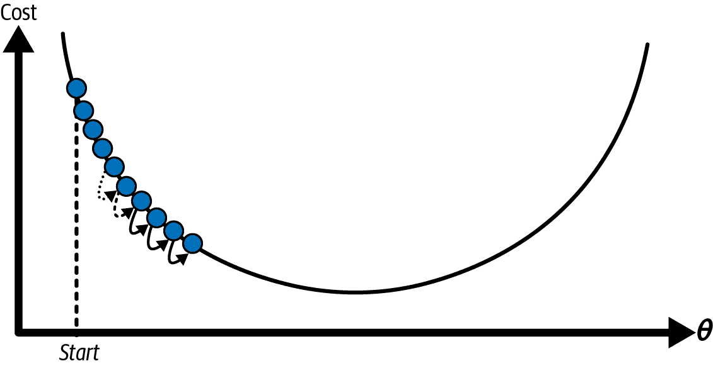
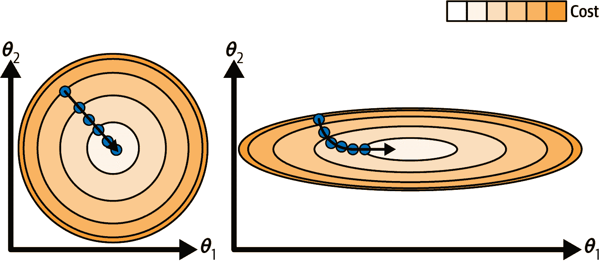
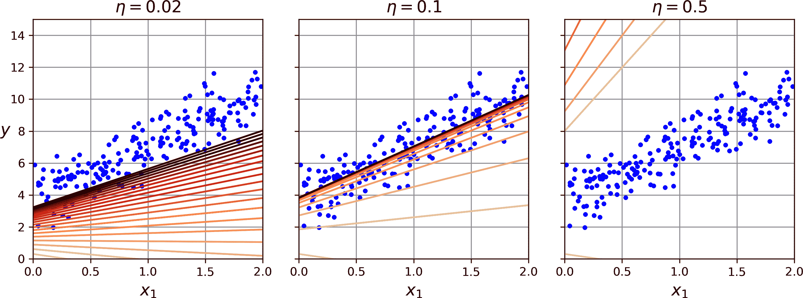
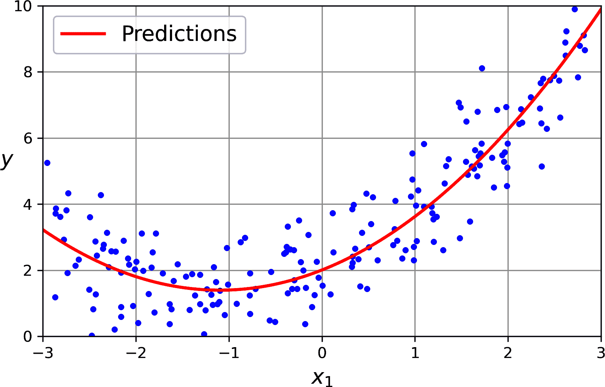
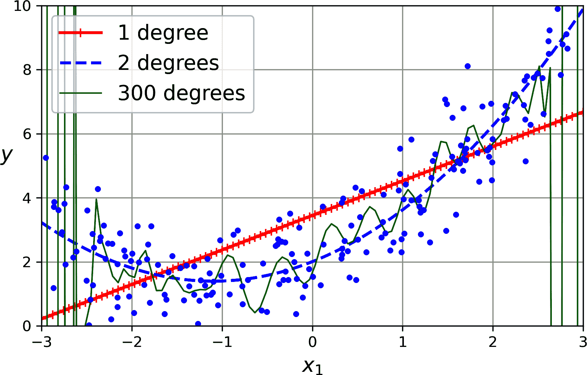
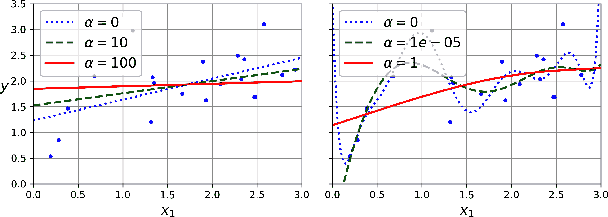
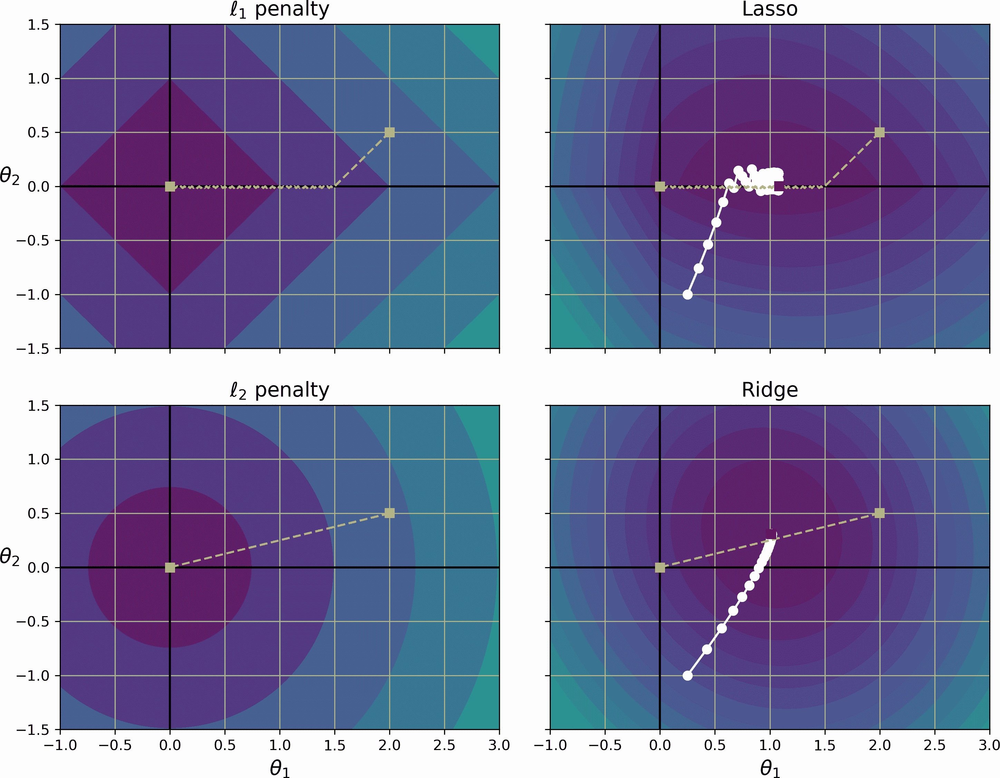
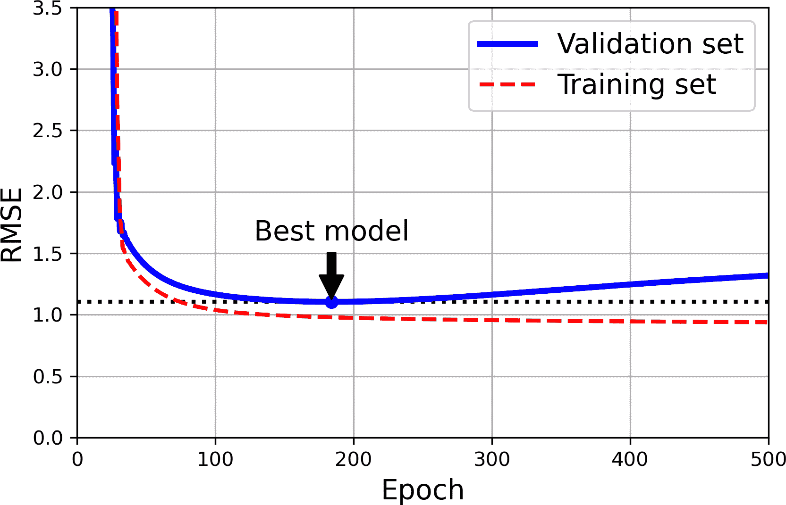
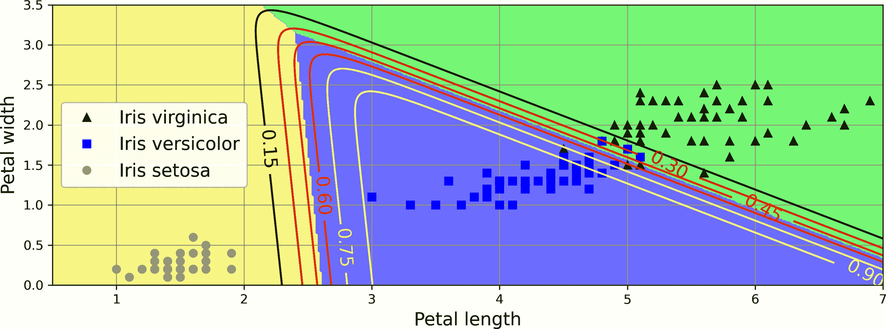

# 第四章\. 训练模型

到目前为止，我们主要将机器学习模型及其训练算法视为黑盒。如果你完成了前几章的一些练习，你可能会惊讶于你可以在不了解内部机制的情况下完成多少工作：你优化了一个回归系统，改进了一个数字图像分类器，甚至从头开始构建了一个垃圾邮件分类器，所有这些都不需要了解它们实际上是如何工作的。确实，在许多情况下，你并不真的需要了解实现细节。

然而，对事物工作原理的良好理解可以帮助你快速定位到合适的模型、正确的训练算法以及适合你任务的优秀超参数集。了解内部机制也将帮助你调试问题并更有效地进行错误分析。最后，本章讨论的许多主题对于理解、构建和训练神经网络（本书第二部分中讨论）至关重要。

在本章中，我们将首先探讨线性回归模型，这是最简单的模型之一。我们将讨论两种非常不同的训练方法：

+   使用一个“闭式”方程⁠^(1)，该方程直接计算最佳拟合模型到训练集的模型参数（即最小化训练集上成本函数的模型参数）。

+   使用一种称为梯度下降（GD）的迭代优化方法，该方法逐渐调整模型参数以最小化训练集上的成本函数，最终收敛到与第一种方法相同的一组参数。当我们研究第二部分中的神经网络时，我们将再次查看几种梯度下降的变体：批量 GD、小批量 GD 和随机 GD。

接下来，我们将探讨多项式回归，这是一个更复杂的模型，可以拟合非线性数据集。由于这个模型比线性回归有更多的参数，因此它更容易对训练数据进行过拟合。我们将通过学习曲线来探讨如何检测这种情况，然后我们将探讨几种可以减少对训练集过拟合风险的正则化技术。

最后，我们将检查两种常用于分类任务的模型：逻辑回归和 softmax 回归。

###### 警告

本章将使用线性代数和微积分的基本概念，包含相当多的数学方程。为了理解这些方程，你需要熟悉向量和矩阵——如何转置它们、乘以它们以及求逆，以及偏导数。如果这些概念不熟悉，请查阅[在线补充材料](https://github.com/ageron/handson-mlp)中提供的线性代数和微积分的入门 Jupyter 笔记本。如果你对数学真的过敏，可以跳过这些方程；文本应该仍然能帮助你掌握大部分的概念。尽管一开始可能看起来令人畏惧，但实际上并不难，本章还包括代码，可以帮助你理解这些方程。

# 线性回归

在第一章中，我们研究了生命满意度的一个简单线性模型(方程 4-1)。

##### 方程 4-1\. 生命满意度的一个简单线性模型

$life normal bar satisfaction equals theta 0 plus theta 1 times GDP normal bar per normal bar capita$

该模型只是输入特征 `GDP_per_capita` 的线性函数。*θ*[0] 和 *θ*[1] 是模型的参数。

更一般地，线性模型通过简单地计算输入特征的加权总和，加上一个称为 *偏置项*（也称为 *截距项*）的常数来进行预测，如方程 4-2 所示。

##### 方程 4-2\. 线性回归模型预测

$通过上标修改 y 等于 theta 0 加上 theta 1 乘以 x 1 加上 theta 2 乘以 x 2 加上中划线水平省略号加上 theta 下标 n 基线 x 下标 n$

在这个方程中：

+   *ŷ* 是预测值。

+   *n* 是特征的数量。

+   *x*[*i*] 是第 *i* 个特征值。

+   *θ*[*j*] 是第 *j* 个模型参数，包括偏置项 *θ*[0] 和特征权重 *θ*[1]、*θ*[2]、⋯、*θ*[*n*]。

这可以通过向量形式更简洁地表示，如方程 4-3 所示。

##### 方程 4-3\. 线性回归模型预测（向量形式）

<mover accent="true"><mi>y</mi><mo>^</mo></mover><mo>=</mo><msub><mi>h</mi><mi mathvariant="bold">θ</mi></msub><mo>(</mo><mi mathvariant="bold">x</mi><mo>)</mo><mo>=</mo><mi mathvariant="bold">θ</mi><mo>·</mo><mi mathvariant="bold">x</mi>

在这个方程中：

+   *h*[**θ**] 是假设函数，使用模型参数 **θ**。

+   **θ** 是模型的 *参数向量*，包含偏置项 *θ*[0] 和特征权重 *θ*[1] 到 *θ*[*n*]。

+   **x** 是实例的 *特征向量*，包含 *x*[0] 到 *x*[*n*]，其中 *x*[0] 总是等于 1。

+   **θ** · **x** 是向量 **θ** 和 **x** 的点积，等于 *θ*[0]*x*[0] + *θ*[1]*x*[1] + *θ*[2]*x*[2] + ... + *θ*[*n*]*x*[*n*]。

###### 注记

在机器学习中，向量通常表示为 *列向量*，它们是只有一列的二维数组。如果 **θ** 和 **x** 是列向量，那么预测是 <mover accent="true"><mi>y</mi><mo>^</mo></mover><mo>=</mo><msup><mi mathvariant="bold">θ</mi><mo>⊺</mo></msup><mi mathvariant="bold">x</mi>，其中 <msup><mi mathvariant="bold">θ</mi><mo>⊺</mo></msup> 是 **θ** 的 *转置*（一个行向量而不是列向量）并且 <msup><mi mathvariant="bold">θ</mi><mo>⊺</mo></msup><mi mathvariant="bold">x</mi> 是 <msup><mi mathvariant="bold">θ</mi><mo>⊺</mo></msup> 和 **x** 的矩阵乘积。当然，这仍然是相同的预测，只是现在它被表示为一个单元素矩阵而不是标量值。在这本书中，我将使用这种符号来避免在点积和矩阵乘法之间切换。

好的，这就是线性回归模型——但是我们是怎样训练它的呢？记住，训练一个模型意味着设置其参数，使得模型最好地拟合训练集。为此，我们首先需要一个衡量模型拟合训练数据好坏的指标。在 第二章 中，我们了解到回归模型最常见的性能指标是均方根误差（方程 2-1）。因此，为了训练一个线性回归模型，我们需要找到使 RMSE 最小的 **θ** 的值。在实践中，最小化均方误差（MSE）比最小化 RMSE 更简单，并且它会导致相同的结果（因为最小化正函数的值也会最小化其平方根）。

###### 警告

学习算法在训练过程中通常会优化一个不同于用于评估最终模型的性能度量函数。这通常是因为该函数更容易优化，或者因为它在训练期间需要额外的项（例如，用于正则化）。一个好的性能指标应该尽可能接近最终的商业目标。一个好的训练损失函数易于优化，并且与该指标高度相关。例如，分类器通常使用如对数损失（如你将在本章后面看到）的成本函数进行训练，但使用精确度/召回率进行评估。对数损失易于最小化，这样做通常会提高精确度/召回率。

在训练集 **X** 上，线性回归假设 *h*[**θ**] 的 MSE 是通过 方程 4-4 计算的。

##### 方程 4-4\. 线性回归模型的均方误差（MSE）成本函数

<mrow><mtext>MSE</mtext> <mrow><mo>(</mo> <mi mathvariant="bold">X</mi> <mo lspace="0%" rspace="0%">,</mo> <mi mathvariant="bold">y</mi> <mo lspace="0%" rspace="0%">,</mo> <msub><mi>h</mi> <mi mathvariant="bold">θ</mi></msub> <mo>)</mo></mrow> <mo>=</mo> <mstyle scriptlevel="0" displaystyle="true"><mfrac><mn>1</mn> <mi>m</mi></mfrac></mstyle> <munderover><mo>∑</mo> <mrow><mi>i</mi><mo>=</mo><mn>1</mn></mrow> <mi>m</mi></munderover> <msup><mrow><mo>(</mo><msup><mi mathvariant="bold">θ</mi> <mo>⊺</mo></msup> <msup><mi mathvariant="bold">x</mi> <mrow><mo>(</mo><mi>i</mi><mo>)</mo></mrow></msup> <mo>-</mo><msup><mi>y</mi> <mrow><mo>(</mo><mi>i</mi><mo>)</mo></mrow></msup> <mo>)</mo></mrow> <mn>2</mn></msup></mrow>

大多数这些符号都在 第二章 (见 “符号”) 中介绍过。唯一的区别是我们写 *h*[**θ**] 而不是仅仅 *h*，以使其清楚模型是由向量 **θ** 参数化的。为了简化符号，我们将只写 MSE(**θ**) 而不是 MSE(**X**, *h*[**θ**])。

## 正则方程

为了找到使 MSE 最小的 **θ** 值，存在一个 *封闭形式解*——换句话说，一个直接给出结果的数学方程。这被称为 *正则方程* (方程 4-5)。

##### 方程 4-5\. 正则方程

<mrow><mover accent="true"><mi mathvariant="bold">θ</mi> <mo>^</mo></mover> <mo>=</mo> <msup><mrow><mo>(</mo><msup><mi mathvariant="bold">X</mi> <mo>⊺</mo></msup> <mi mathvariant="bold">X</mi><mo>)</mo></mrow> <mrow><mo>-</mo><mn>1</mn></mrow></msup> <msup><mi mathvariant="bold">X</mi> <mo>⊺</mo></msup> <mi mathvariant="bold">y</mi></mrow>

在这个方程中：

+   <mover accent="true"><mi mathvariant="bold">θ</mi><mo>^</mo></mover> 是使成本函数最小的 **θ** 值。

+   **y** 是包含 *y*^((1)) 到 *y*^((*m*) 的目标值向量。

让我们生成一些看起来像线性的数据来测试这个方程 (图 4-1)：

```py
import numpy as np

rng = np.random.default_rng(seed=42)
m = 200  # number of instances
X = 2 * rng.random((m, 1))  # column vector
y = 4 + 3 * X + rng.standard_normal((m, 1))  # column vector
```


###### 图 4-1\. 随机生成的线性数据集

现在，让我们使用正则方程来计算 <mover accent="true"><mi mathvariant="bold">θ</mi><mo>^</mo></mover>。我们将使用 NumPy 线性代数模块 (`np.linalg`) 中的 `inv()` 函数来计算矩阵的逆，以及 `@` 运算符进行矩阵乘法：

```py
from sklearn.preprocessing import add_dummy_feature

X_b = add_dummy_feature(X)  # add x0 = 1 to each instance
theta_best = np.linalg.inv(X_b.T @ X_b) @ X_b.T @ y
```

###### 注意

`@` 运算符执行矩阵乘法。如果 `A` 和 `B` 是 NumPy 数组，那么 `A @ B` 等价于 `np.matmul(A, B)`。许多其他库，如 TensorFlow、PyTorch 和 JAX，也支持 `@` 运算符。然而，你不能在纯 Python 数组（即列表的列表）上使用 `@`。

我们用来生成数据的函数是 *y* = 4 + 3*x*[1] + 高斯噪声。让我们看看方程找到了什么：

```py
>>> theta_best
array([[3.69084138],
 [3.32960458]])
```

我们本希望得到*θ*[0] = 4 和*θ*[1] = 3，而不是*θ*[0] = 3.6908 和*θ*[1] = 3.3296。已经很接近了，但噪声使得无法恢复原始函数的确切参数。数据集越小、噪声越大，问题就越难解决。

现在我们可以使用<mover accent="true"><mi mathvariant="bold">θ</mi><mo>^</mo></mover>进行预测：

```py
>>> X_new = np.array([[0], [2]])
>>> X_new_b = add_dummy_feature(X_new)  # add x0 = 1 to each instance
>>> y_predict = X_new_b @ theta_best
>>> y_predict
array([[ 3.69084138],
 [10.35005055]])
```

让我们绘制这个模型的预测结果（图 4-2）：

```py
import matplotlib.pyplot as plt

plt.plot(X_new, y_predict, "r-", label="Predictions")
plt.plot(X, y, "b.")
[...]  # beautify the figure: add labels, axis, grid, and legend
plt.show()
```


###### 图 4-2\. 线性回归模型预测

使用 Scikit-Learn 进行线性回归相对简单：

```py
>>> from sklearn.linear_model import LinearRegression
>>> lin_reg = LinearRegression()
>>> lin_reg.fit(X, y)
>>> lin_reg.intercept_, lin_reg.coef_
(array([3.69084138]), array([[3.32960458]]))
>>> lin_reg.predict(X_new)
array([[ 3.69084138],
 [10.35005055]])
```

注意到 Scikit-Learn 将偏差项（`intercept_`）与特征权重（`coef_`）分开。`LinearRegression`类基于`scipy.linalg.lstsq()`函数（其名称代表“最小二乘”），你可以直接调用它：

```py
>>> theta_best_svd, residuals, rank, s = np.linalg.lstsq(X_b, y, rcond=1e-6)
>>> theta_best_svd
array([[3.69084138],
 [3.32960458]])
```

这个函数计算<mover accent="true"><mi mathvariant="bold">θ</mi><mo>^</mo></mover><mo>=</mo><msup><mi mathvariant="bold">X</mi><mo>+</mo></msup><mi mathvariant="bold">y</mi>，其中<msup><mi mathvariant="bold">X</mi><mo>+</mo></msup>是**X**的伪逆（具体来说，是莫雷-彭罗斯逆）。你可以使用`np.linalg.pinv()`直接计算伪逆：

```py
>>> np.linalg.pinv(X_b) @ y
array([[3.69084138],
 [3.32960458]])
```

伪逆本身是通过一种称为奇异值分解（SVD）的标准矩阵分解技术计算的，可以将训练集矩阵**X**分解为三个矩阵**U** **Σ** **V**^⊺的乘积（参见`numpy.linalg.svd()`）。伪逆计算为<msup><mi mathvariant="bold">X</mi><mo>+</mo></msup><mo>=</mo><mi mathvariant="bold">V</mi><msup><mi mathvariant="bold">Σ</mi><mo>+</mo></msup><msup><mi mathvariant="bold">U</mi><mo>⊺</mo></msup>。为了计算矩阵<msup><mi mathvariant="bold">Σ</mi><mo>+</mo></msup>，算法将**Σ**中所有小于一个很小的阈值值的值设置为 0，然后将所有非零值替换为其倒数，最后转置得到的矩阵。这种方法比计算正则方程更高效，并且很好地处理了边缘情况：实际上，如果矩阵**X**^⊺**X**不可逆（即奇异的），正则方程可能不起作用（例如，如果*m* < *n*或某些特征是冗余的），但伪逆总是定义良好的。

## 计算复杂度

正则方程计算**X**^⊺ **X**的逆，这是一个(*n* + 1) × (*n* + 1)的矩阵（其中*n*是特征的数量）。逆矩阵的计算复杂度通常是大约*O*(*n*^(2.4))到*O*(*n*³)，具体取决于实现方式。换句话说，如果你将特征的数量加倍，计算时间大约会增加 2^(2.4) = 5.3 到 2³ = 8 倍。

Scikit-Learn 的`LinearRegression`类使用的 SVD 方法是关于*O*(*n*²)的。如果你将特征数量加倍，计算时间大约会增加 4 倍。

###### 警告

当特征数量增长很大时（例如，100,000），正规方程和 SVD 方法都会变得非常慢。从积极的一面来看，它们与训练集中实例的数量都是线性的（它们是*O*(*m*))，因此它们可以有效地处理大型训练集，前提是它们可以适应内存。

此外，一旦你训练好了你的线性回归模型（使用正规方程或任何其他算法），预测非常快：计算复杂度与你要进行预测的实例数量和特征数量都是线性的。换句话说，对两倍多的实例（或两倍多的特征）进行预测将大约需要两倍的时间。

现在我们将探讨一种非常不同的训练线性回归模型的方法，这种方法更适合于特征数量很多或训练实例太多而无法适应内存的情况。

# 梯度下降

*梯度下降*是一种通用的优化算法，能够找到广泛问题的最优解。梯度下降的一般思想是通过迭代调整参数以最小化成本函数。

假设你在浓雾中迷失在山中，你只能感觉到脚下地面的坡度。一个快速到达山谷底部的好策略是沿着最陡的坡度向下走。这正是梯度下降所做的：它测量参数向量**θ**相对于误差函数的局部梯度，并沿着下降梯度方向前进。一旦梯度为零，你就达到了最小值！

在实践中，你首先用随机值填充**θ**（这被称为*随机初始化*）。然后你逐步改进它，每次只迈出一小步，每一步都试图减少成本函数（例如，均方误差），直到算法*收敛*到最小值（见图 4-3）。


###### 图 4-3\. 在这个梯度下降的描述中，模型参数被随机初始化，并反复调整以最小化成本函数；学习步长与成本函数的斜率成正比，因此随着成本接近最小值，步长逐渐减小

梯度下降中的一个重要参数是步长的大小，由*学习率*超参数确定。如果学习率太小，那么算法将需要经过许多迭代才能收敛，这将花费很长时间（见图 4-4）。



###### 图 4-4\. 学习率过低

另一方面，如果学习率过高，你可能会跳过山谷，最终落在另一边，甚至可能比之前更高。这可能会导致算法发散，值越来越大，无法找到好的解决方案（参见图 4-5）。


###### 图 4-5\. 学习率过高

此外，并非所有成本函数看起来都像漂亮的、规则的碗。可能会有洞、脊、平台和各种不规则的地形，使得收敛到最小值变得困难。图 4-6 展示了梯度下降的两个主要挑战。如果随机初始化使算法从左侧开始，那么它将收敛到一个**局部最小值**，这不如**全局最小值**好。如果它从右侧开始，那么它将花费很长时间才能越过平台。如果你过早停止，你将永远无法达到全局最小值。


###### 图 4-6\. 梯度下降陷阱

幸运的是，线性回归模型的均方误差成本函数恰好是一个**凸函数**，这意味着如果你在曲线上选择任意两点，连接这两点的线段永远不会低于曲线。这表明没有局部最小值，只有一个全局最小值。它也是一个斜率永远不会突然改变的连续函数。⁠^(2) 这两个事实具有重大意义：梯度下降保证能够任意接近全局最小值（如果你等待足够长的时间，并且学习率不是太高的话）。

当成本函数的形状像一个碗时，如果特征具有非常不同的尺度，它可能是一个拉长的碗。图 4-7 展示了在特征 1 和 2 尺度相同（左侧）的训练集上的梯度下降，以及在特征 1 的值比特征 2 小得多（右侧）的训练集上的梯度下降。⁠^(3)

如你所见，在左侧，梯度下降算法直接朝向最小值，因此快速到达，而在右侧，它首先沿着几乎垂直于全局最小值方向移动，最后在一个几乎平坦的山谷中缓慢下降。它最终会到达最小值，但需要很长时间。

此图还说明了训练模型意味着寻找一组模型参数的组合，以最小化成本函数（在训练集上）。这是在模型的*参数空间*中的搜索。模型具有的参数越多，这个空间就有更多的维度，搜索就越困难：在 300 维的稻草堆中寻找针比在 3 维中要困难得多。幸运的是，由于线性回归中的成本函数是凸的，针就简单地位于碗底。



###### 图 4-7\. 带有（左侧）和没有（右侧）特征缩放的梯度下降

###### 警告

当使用梯度下降时，你应该确保所有特征具有相似的尺度（例如，使用 Scikit-Learn 的 `StandardScaler` 类），否则收敛将需要更长的时间。

## 批量梯度下降

大多数模型都有多个模型参数。因此，要实现梯度下降，你需要计算每个模型参数 *θ*[*j*] 的成本函数梯度。换句话说，你需要计算如果只稍微改变 *θ*[*j*]，成本函数将如何变化。这被称为*偏导数*。就像问，“向东的山坡斜率是多少？”然后面对北方（如果你能想象一个超过三个维度的宇宙，那么对所有其他维度也是如此）。方程 4-6 计算了 MSE 关于参数 *θ*[*j*] 的偏导数，表示为 ∂ MSE(**θ**) / ∂θ[*j*]。

##### 方程 4-6\. 成本函数的偏导数

<mrow><mstyle scriptlevel="0" displaystyle="true"><mfrac><mi>∂</mi> <mrow><mi>∂</mi><msub><mi>θ</mi> <mi>j</mi></msub></mrow></mfrac></mstyle> <mtext>MSE</mtext> <mrow><mo>(</mo> <mi mathvariant="bold">θ</mi> <mo>)</mo></mrow> <mo>=</mo> <mstyle scriptlevel="0" displaystyle="true"><mfrac><mn>2</mn> <mi>m</mi></mfrac></mstyle> <munderover><mo>∑</mo> <mrow><mi>i</mi><mo>=</mo><mn>1</mn></mrow> <mi>m</mi></munderover> <mrow><mo>(</mo> <msup><mi mathvariant="bold">θ</mi> <mo>⊺</mo></msup> <msup><mi mathvariant="bold">x</mi> <mrow><mo>(</mo><mi>i</mi><mo>)</mo></mrow></msup> <mo>-</mo> <msup><mi>y</mi> <mrow><mo>(</mo><mi>i</mi><mo>)</mo></mrow></msup> <mo>)</mo></mrow> <msubsup><mi>x</mi> <mi>j</mi> <mrow><mo>(</mo><mi>i</mi><mo>)</mo></mrow></msubsup></mrow>

而不是单独计算这些偏导数，你可以使用方程 4-7 一次性计算它们。梯度向量，表示为 ∇[**θ**]MSE(**θ**)，包含了成本函数的所有偏导数（每个模型参数一个）。

##### 方程 4-7\. 成本函数的梯度向量

<mrow><msub><mi>∇</mi> <mi mathvariant="bold">θ</mi></msub> <mtext>MSE</mtext> <mrow><mo stretchy="true">(</mo> <mi mathvariant="bold">θ</mi> <mo>)</mo></mrow> <mo>=</mo> <mrow><mo stretchy="true">(</mo> <mtable><mtr><mtd><mrow><mfrac><mi>∂</mi> <mrow><mi>∂</mi><msub><mi>θ</mi> <mn>0</mn></msub></mrow></mfrac> <mtext>MSE</mtext> <mrow><mo>(</mo> <mi mathvariant="bold">θ</mi> <mo>)</mo></mrow></mrow></mtd></mtr> <mtr><mtd><mrow><mfrac><mi>∂</mi> <mrow><mi>∂</mi><msub><mi>θ</mi> <mn>1</mn></msub></mrow></mfrac> <mtext>MSE</mtext> <mrow><mo>(</mo> <mi mathvariant="bold">θ</mi> <mo>)</mo></mrow></mrow></mtd></mtr> <mtr><mtd><mo>⋮</mo></mtd></mtr> <mtr><mtd><mrow><mfrac><mi>∂</mi> <mrow><mi>∂</mi><msub><mi>θ</mi> <mi>n</mi></msub></mrow></mfrac> <mtext>MSE</mtext> <mrow><mo>(</mo> <mi mathvariant="bold">θ</mi> <mo>)</mo></mrow></mrow></mtd></mtr></mtable> <mo stretchy="true">)</mo></mrow> <mo>=</mo> <mstyle scriptlevel="0" displaystyle="true"><mfrac><mn>2</mn> <mi>m</mi></mfrac></mstyle> <msup><mi mathvariant="bold">X</mi> <mo>⊺</mo></msup> <mrow><mo>(</mo> <mi mathvariant="bold">X</mi> <mi mathvariant="bold">θ</mi> <mo>-</mo> <mi mathvariant="bold">y</mi> <mo>)</mo></mrow></mrow>

###### 警告

注意，这个公式涉及到在整个训练集 **X** 上进行计算，在每个梯度下降步骤中！这就是为什么这个算法被称为 *批量梯度下降*：它在每个步骤中使用整个训练数据批次（实际上，*全梯度下降*可能是一个更好的名字）。因此，它在非常大的训练集上非常慢（我们很快就会看到一些更快的梯度下降算法）。然而，梯度下降在特征数量方面具有良好的扩展性；当有数十万个特征时，使用梯度下降训练线性回归模型比使用正常方程或奇异值分解要快得多。

一旦你有了指向上坡的梯度向量，只需朝相反方向走，就可以下山。这意味着从 **θ** 中减去 ∇[**θ**]MSE(θ**)。这就是学习率 *η* 发挥作用的地方：⁠^(4) 将梯度向量乘以 *η* 以确定下山步长的大小 (方程 4-8)。

##### 方程 4-8\. 梯度下降步骤

<msup><mi mathvariant="bold">θ</mi><mrow><mo>(</mo><mtext>next step</mtext><mo>)</mo></mrow></msup><mo>=</mo><mi mathvariant="bold">θ</mi><mo>-</mo><mi>η</mi><msub><mo>∇</mo><mi mathvariant="bold">θ</mi></msub><mtext>MSE</mtext><mo>(</mo><mi mathvariant="bold">θ</mi><mo>)</mo>

让我们看看这个算法的快速实现：

```py
eta = 0.1  # learning rate
n_epochs = 1000
m = len(X_b)  # number of instances

rng = np.random.default_rng(seed=42)
theta = rng.standard_normal((2, 1))  # randomly initialized model parameters

for epoch in range(n_epochs):
    gradients = 2 / m * X_b.T @ (X_b @ theta - y)
    theta = theta - eta * gradients
```

这并不太难！对训练集的每次迭代称为一个 *epoch*。让我们看看结果 `theta`：

```py
>>> theta
array([[3.69084138],
 [3.32960458]])
```

嘿，这正是正常方程发现的东西！梯度下降工作得非常完美。但如果你使用了不同的学习率（`eta`）会怎样呢？图 4-8 展示了使用三个不同学习率的梯度下降的前 20 步。每个图底部的线代表随机的起始点，然后每个迭代由越来越深的线表示。



###### 图 4-8\. 使用不同学习率的梯度下降

在左边，学习率太低：算法最终会达到解，但会花费很长时间。在中间，学习率看起来相当不错：在仅仅几个迭代后，它已经收敛到解。在右边，学习率太高：算法发散，到处跳跃，实际上在每一步都离解越来越远。

为了找到一个好的学习率，你可以使用网格搜索（参见第二章）。然而，你可能想限制迭代的次数，这样网格搜索就可以消除那些收敛速度太慢的模型。

你可能会想知道如何设置迭代的次数。如果迭代次数太低，当算法停止时，你仍然离最优解很远；但如果迭代次数太高，你会浪费时间，因为模型参数已经不再变化。一个简单的解决方案是设置一个非常大的迭代次数，但在梯度向量变得非常小的时候中断算法——也就是说，当其范数小于一个非常小的数 *ε*（称为*容忍度*）时——因为这时梯度下降（几乎）达到了最小值。

## 随机梯度下降

批量梯度下降的主要问题在于它使用整个训练集在每一步计算梯度，这使得当训练集很大时非常慢。在相反的极端情况下，*随机梯度下降*在每一步从训练集中随机选择一个实例，并仅基于该单个实例计算梯度。显然，一次只处理一个实例使得算法快得多，因为它在每次迭代中要处理的数据非常少。这也使得在巨大的训练集上训练成为可能，因为每次迭代只需要一个实例在内存中（随机 GD 可以作为一个离核算法实现；参见第一章)。

另一方面，由于其随机（即随机）性质，此算法比批量梯度下降要少得多：它不会逐渐减小直到达到最小值，损失函数会上下波动，平均而言才会下降。随着时间的推移，它最终会非常接近最小值，但一旦到达那里，它将继续上下波动，永远不会稳定下来（参见图 4-9）。一旦算法停止，最终的参数值将很好，但不是最优的。

当损失函数非常不规则（如图 4-6 所示）时，这实际上可以帮助算法跳出局部最小值，因此随机梯度下降比批量梯度下降有更好的机会找到全局最小值。

因此，随机性有助于逃离局部最优，但也很不好，因为它意味着算法永远无法稳定在最小值。解决这个困境的一个方法是通过逐渐降低学习率。步骤一开始很大（这有助于快速进步并逃离局部最小值），然后越来越小，使算法能够稳定在全局最小值。这个过程类似于*模拟退火*，这是一种受冶金中退火过程启发的算法，其中熔融金属会慢慢冷却。确定每次迭代的 learning rate 的函数称为*学习计划*。如果学习率降得太快，你可能会陷入局部最小值，甚至可能在中途冻结。如果学习率降得太慢，你可能会在最小值周围跳来跳去很长时间，如果在训练太早停止的情况下，最终得到的解决方案可能不是最优的。


###### 图 4-9\. 使用随机梯度下降时，每个训练步骤比使用批量梯度下降要快得多，但同时也更加随机

此代码通过简单的学习计划实现了随机梯度下降：

```py
n_epochs = 50
t0, t1 = 5, 50  # learning schedule hyperparameters

def learning_schedule(t):
    return t0 / (t + t1)

rng = np.random.default_rng(seed=42)
theta = rng.standard_normal((2, 1))  # randomly initialized model parameters

for epoch in range(n_epochs):
    for iteration in range(m):
        random_index = rng.integers(m)
        xi = X_b[random_index : random_index + 1]
        yi = y[random_index : random_index + 1]
        gradients = 2 * xi.T @ (xi @ theta - yi)  # for SGD, do not divide by m
        eta = learning_schedule(epoch * m + iteration)
        theta = theta - eta * gradients
```

按照惯例，我们通过进行*m*次迭代的轮次来迭代；每一轮称为一个*epoch*，如前所述。当批量梯度下降代码在整个训练集上迭代了 1,000 次时，此代码只通过训练集 50 次就得到了一个相当不错的解决方案：

```py
>>> theta
array([[3.69826475],
 [3.30748311]])
```

图 4-10 显示了训练的前 20 步（注意步骤的不规则性）。


###### 图 4-10\. 随机梯度下降的前 20 步

注意，由于实例是随机选择的，一些实例在每个 epoch 可能被选择多次，而另一些可能一次都没有被选择。如果你想确保算法在每个 epoch 都遍历每个实例，另一种方法是洗牌训练集（确保同时洗牌输入特征和标签），然后逐个实例遍历，然后再洗牌，依此类推。然而，这种方法更复杂，并且通常不会改善结果。

###### 警告

当使用随机梯度下降时，训练实例必须是独立且同分布的（IID），以确保参数平均趋向于全局最优。确保这一点的一个简单方法是训练期间对实例进行洗牌（例如，随机选择每个实例，或在每个 epoch 开始时洗牌训练集）。如果你没有洗牌实例——例如，如果实例按标签排序——那么 SGD 将首先优化一个标签，然后是下一个，依此类推，它将不会接近全局最小值。

要使用 Scikit-Learn 进行随机梯度下降的线性回归，你可以使用`SGDRegressor`类，它默认优化均方误差成本函数。以下代码运行最多 1,000 个 epoch（`max_iter`）或直到在 100 个 epoch（`n_iter_no_change`）内损失下降小于 10 的负五次方（`tol`）。它以 0.01 的学习率（`eta0`）开始，使用默认的学习计划（与我们使用的不一样）。最后，它不使用任何正则化（`penalty=None`；关于这一点稍后详细说明）：

```py
from sklearn.linear_model import SGDRegressor

sgd_reg = SGDRegressor(max_iter=1000, tol=1e-5, penalty=None, eta0=0.01,
                       n_iter_no_change=100, random_state=42)
sgd_reg.fit(X, y.ravel())  # y.ravel() because fit() expects 1D targets
```

再次，你发现了一个与正常方程返回的解相当接近的解：

```py
>>> sgd_reg.intercept_, sgd_reg.coef_
(array([3.68899733]), array([3.33054574]))
```

###### 小贴士

所有 Scikit-Learn 估计器都可以使用`fit()`方法进行训练，但一些估计器还有一个`partial_fit()`方法，你可以调用它来对一个或多个实例运行一轮训练（它忽略了像`max_iter`或`tol`这样的超参数）。重复调用`partial_fit()`将逐渐训练模型。这在需要更多控制训练过程时很有用。其他模型有一个`warm_start`超参数（并且一些模型两者都有）：如果你设置`warm_start=True`，在训练模型上调用`fit()`方法不会重置模型；它将只继续从上次停止的地方训练，尊重像`max_iter`和`tol`这样的超参数。注意，`fit()`重置学习计划使用的迭代计数器，而`partial_fit()`不会。

## 小批量梯度下降

我们将要查看的最后一种梯度下降算法被称为 *小批量梯度下降*。一旦你了解了批量和小批量梯度下降，它就很简单：在每一步中，小批量 GD 不是基于完整训练集（如批量 GD）或仅基于一个实例（如随机 GD）来计算梯度，而是计算在称为 *小批量* 的小随机实例集上的梯度。小批量 GD 相对于随机 GD 的主要优势是你可以从矩阵操作的硬件加速中获得性能提升，尤其是在使用 *图形处理单元*（GPU）时。

该算法在参数空间中的进展比随机 GD 更平稳，尤其是在相当大的小批量中。因此，小批量 GD 最终会在比随机 GD 更接近最小值的地方徘徊——但它可能更难逃离局部最小值（对于有局部最小值的问题，与具有 MSE 成本函数的线性回归不同）。图 4-11 展示了三个梯度下降算法在训练过程中在参数空间中采取的路径。它们最终都接近最小值，但批量 GD 的路径实际上停止在最小值处，而随机 GD 和小批量 GD 则继续徘徊。然而，不要忘记批量 GD 每次移动都需要花费很多时间，而随机 GD 和小批量 GD 如果使用一个好的学习计划也会达到最小值。


###### 图 4-11\. 参数空间中的梯度下降路径

表 4-1 比较了我们迄今为止讨论的线性回归算法（回忆一下，*m* 是训练实例的数量，*n* 是特征的数量）。

表 4-1\. 线性回归算法比较

| 算法 | 大 *m* | 核外支持 | 大 *n* | 超参数 | 缩放要求 | Scikit-Learn |
| --- | --- | --- | --- | --- | --- | --- |
| 正则方程 | 快速 | 否 | 慢 | 0 | 否 | N/A |
| SVD | 快速 | 否 | 慢 | 0 | 否 | `LinearRegression` |
| 批量 GD | 慢 | 否 | 快 | 2 | 是 | N/A |
| 随机 GD | 快速 | 是 | 快速 | ≥2 | 是 | `SGDRegressor` |
| 小批量 GD | 快速 | 是 | 快速 | ≥2 | 是 | N/A |

训练后几乎没有差异：所有这些算法最终都得到非常相似的模式，并以完全相同的方式进行预测。

# 多项式回归

如果你的数据比直线更复杂怎么办？令人惊讶的是，你可以使用线性模型来拟合非线性数据。这样做的一个简单方法是将每个特征的幂次作为新特征添加，然后在扩展特征集上训练线性模型。这种技术称为 *多项式回归*。

让我们来看一个例子。首先，我们将生成一些非线性数据（见图 4-12），基于一个简单的*二次方程*——这是一个形式为*y* = *ax*² + *bx* + *c*的方程——以及一些噪声：

```py
rng = np.random.default_rng(seed=42)
m = 200  # number of instances
X = 6 * rng.random((m, 1)) - 3
y = 0.5 * X ** 2 + X + 2 + rng.standard_normal((m, 1))
```


###### 图 4-12\. 生成的非线性且噪声数据集

显然，一条直线永远不会恰当地拟合这些数据。因此，让我们使用 Scikit-Learn 的`PolynomialFeatures`类来转换我们的训练数据，将训练集中每个特征的平方（二次多项式）作为新特征添加（在这种情况下只有一个特征）：

```py
>>> from sklearn.preprocessing import PolynomialFeatures
>>> poly_features = PolynomialFeatures(degree=2, include_bias=False)
>>> X_poly = poly_features.fit_transform(X)
>>> X[0]
array([1.64373629])
>>> X_poly[0]
array([1.64373629, 2.701869  ])
```

`X_poly`现在包含原始特征`X`以及该特征的平方。现在我们可以将`LinearRegression`模型拟合到这个扩展的训练数据上（图 4-13）：

```py
>>> lin_reg = LinearRegression()
>>> lin_reg.fit(X_poly, y)
>>> lin_reg.intercept_, lin_reg.coef_
(array([2.00540719]), array([[1.11022126, 0.50526985]]))
```



###### 图 4-13\. 多项式回归模型预测

不错：模型估计 <mrow><mover accent="true"><mi>y</mi> <mo>^</mo></mover> <mo>=</mo> <mn>0.56</mn> <msup><mrow><msub><mi>x</mi> <mn>1</mn></msub></mrow> <mn>2</mn></msup> <mo>+</mo> <mn>0.93</mn> <msub><mi>x</mi> <mn>1</mn></msub> <mo>+</mo> <mn>1.78</mn></mrow> 当实际上原始函数是 <mrow><mi>y</mi> <mo>=</mo> <mn>0.5</mn> <msup><mrow><msub><mi>x</mi> <mn>1</mn></msub></mrow> <mn>2</mn></msup> <mo>+</mo> <mn>1.0</mn> <msub><mi>x</mi> <mn>1</mn></msub> <mo>+</mo> <mn>2.0</mn> <mo>+</mo> <mtext>高斯噪声</mtext></mrow> 。

注意，当存在多个特征时，多项式回归能够找到特征之间的关系，这是普通线性回归模型无法做到的。这是由于`PolynomialFeatures`还添加了所有给定阶数的特征组合。例如，如果有两个特征*a*和*b*，`PolynomialFeatures`的`degree=3`不仅会添加特征*a*²、*a*³、*b*²和*b*³，还会添加组合*ab*、*a*²*b*和*ab*²。

###### 警告

`PolynomialFeatures(degree=*d*)`将包含*n*个特征的数组转换为一个包含(*n* + *d*)! / *d*!*n*!个特征的数组，其中*n*!是*n*的阶乘，等于 1 × 2 × 3 × ⋯ × *n*。注意特征数量的组合爆炸！

# 学习曲线

如果你进行高阶多项式回归，你可能会比使用普通线性回归更好地拟合训练数据。例如，图 4-14 将 300 阶多项式模型应用于前面的训练数据，并将其与纯线性模型和二次模型（二次多项式）的结果进行比较。注意 300 阶多项式模型是如何扭曲以尽可能接近训练实例的。



###### 图 4-14\. 高阶多项式回归

这个高阶多项式回归模型严重地过拟合了训练数据，而线性模型则欠拟合了它。在这种情况下，表现最好的模型是二次模型，这是有道理的，因为数据是使用二次模型生成的。但通常你不会知道生成数据的函数是什么，那么你如何决定你的模型应该有多复杂？你如何判断你的模型是过拟合还是欠拟合数据？

在第二章中，你使用了交叉验证来估计模型的一般化性能。如果一个模型在训练数据上表现良好，但根据交叉验证的指标泛化性能差，那么你的模型就是过拟合。如果它在两者上都表现不佳，那么它就是欠拟合。这是判断模型是否过于简单或过于复杂的一种方法。

另一种判断方法是查看*学习曲线*，这是模型训练误差和验证误差作为训练迭代次数函数的图表：只需在训练过程中定期评估训练集和验证集上的模型，并绘制结果。如果模型不能增量训练（即，如果它不支持`partial_fit()`或`warm_start`），那么你必须对训练集的逐渐增大的子集进行多次训练。

Scikit-Learn 有一个有用的`learning_curve()`函数可以帮助你完成这个任务：它使用交叉验证来训练和评估模型。默认情况下，它会在训练集的逐渐增大的子集上重新训练模型，但如果模型支持增量学习，你可以在调用`learning_curve()`时设置`exploit_incremental_learning=True`，这样它就会增量训练模型。该函数返回它在哪些训练集大小上评估了模型，以及它为每个大小和每个交叉验证折计算的训练和验证分数。让我们使用这个函数来查看普通线性回归模型的学习曲线（见图 4-15）：

```py
from sklearn.model_selection import learning_curve

train_sizes, train_scores, valid_scores = learning_curve(
    LinearRegression(), X, y, train_sizes=np.linspace(0.01, 1.0, 40), cv=5,
    scoring="neg_root_mean_squared_error")
train_errors = -train_scores.mean(axis=1)
valid_errors = -valid_scores.mean(axis=1)

plt.plot(train_sizes, train_errors, "r-+", linewidth=2, label="train")
plt.plot(train_sizes, valid_errors, "b-", linewidth=3, label="valid")
[...]  # beautify the figure: add labels, axis, grid, and legend
plt.show()
```


###### 图 4-15\. 学习曲线

这个模型欠拟合，对于数据来说太简单了。我们如何判断呢？好吧，让我们看看训练误差。当训练集中只有一个或两个实例时，模型可以完美地拟合它们，这就是为什么曲线从零开始。但随着新实例被添加到训练集中，模型无法完美地拟合训练数据，这既是因为数据有噪声，也是因为数据根本不是线性的。因此，训练数据上的误差会上升，直到达到一个平台期，此时添加新实例到训练集中并不会使平均误差变得更好或更差。现在让我们看看验证误差。当模型在非常少的训练实例上训练时，它无法正确泛化，这就是为什么验证误差最初相当大。然后，随着模型展示了更多的训练示例，它开始学习，因此验证误差逐渐下降。然而，又一次，直线无法很好地模拟数据，所以误差最终达到一个平台期，非常接近另一条曲线。

这些学习曲线是欠拟合模型的典型特征。两条曲线都已达到平台期；它们接近且相当高。

###### 小贴士

如果你的模型欠拟合了训练数据，添加更多的训练示例是没有帮助的。你需要使用更好的模型或提出更好的特征。

现在我们来观察同一数据上 10 次多项式模型的学习曲线（图 4-16）：

```py
from sklearn.pipeline import make_pipeline

polynomial_regression = make_pipeline(
    PolynomialFeatures(degree=10, include_bias=False),
    LinearRegression())

train_sizes, train_scores, valid_scores = learning_curve(
    polynomial_regression, X, y, train_sizes=np.linspace(0.01, 1.0, 40), cv=5,
    scoring="neg_root_mean_squared_error")
[...]  # same as earlier
```


###### 图 4-16。10 次多项式模型的学习曲线

这些学习曲线看起来有点像之前的那些，但有两个非常重要的区别：

+   训练数据上的误差比之前低得多。

+   曲线之间存在差距。这意味着模型在训练数据上的表现优于在验证数据上的表现，这是过拟合模型的标志。然而，如果你使用了一个更大的训练集，这两条曲线会继续接近。

###### 小贴士

提高过拟合模型的一种方法是为它提供更多的训练数据，直到验证误差接近训练误差。

# 正则化线性模型

正如你在第一章和第二章中看到的，减少过拟合的一个好方法是对模型进行正则化（即约束它）：它拥有的自由度越少，它就越难过拟合数据。正则化多项式模型的一个简单方法就是减少多项式的次数。

关于线性模型呢？我们也能对它们进行正则化吗？你可能想知道我们为什么要这样做：线性模型不是已经足够受约束了吗？嗯，线性回归做出了一些假设，包括输入和输出之间真实关系的线性，噪声具有零均值，方差恒定，并且与输入无关，以及输入矩阵具有满秩，这意味着输入不是共线的⁠^(7)，并且至少有与参数一样多的样本。在实践中，一些假设并不完全成立。例如，一些输入可能接近共线，这使得线性回归数值不稳定，意味着训练集中非常小的差异可能会对训练模型产生重大影响。正则化可以稳定线性模型并使它们更准确。

那么，我们如何对线性模型进行正则化呢？这通常是通过约束其权重来实现的。在本节中，我们将讨论岭回归、Lasso 回归和弹性网络回归，它们实现了三种不同的正则化方法。

## 岭回归

*岭回归*（也称为 *Tikhonov 正则化*）是线性回归的正则化版本：将一个等于 <mfrac><mi>α</mi><mi>m</mi></mfrac><munderover><mo>∑</mo><mrow><mi>i</mi><mo>=</mo><mn>1</mn></mrow><mi>n</mi></munderover><msup><msub><mi>θ</mi><mi>i</mi></msub><mn>2</mn></msup> 的正则化项添加到均方误差（MSE）中。这迫使学习算法不仅要拟合数据，还要尽可能保持模型权重最小。这个约束使得模型更不灵活，防止它过度拉伸以适应每个数据点：这减少了过拟合的风险。请注意，正则化项应在训练期间添加到成本函数中。一旦模型训练完成，你希望使用未正则化的 MSE（或 RMSE）来评估模型性能。

超参数 *α* 控制你想要对模型进行多少正则化。如果 *α* = 0，则岭回归就是线性回归。如果 *α* 非常大，那么所有权重最终都会非常接近于零，结果是一条穿过数据平均值的平坦线。方程 4-9 展示了岭回归成本函数。⁠^(8)

##### 方程 4-9\. 岭回归成本函数

<mrow><mi>J</mi><mo>(</mo><mi mathvariant="bold">θ</mi><mo>)</mo></mrow><mo>=</mo><mrow><mtext>MSE</mtext><mo>(</mo><mi mathvariant="bold">θ</mi><mo>)</mo></mrow><mo>+</mo><mfrac><mi>α</mi><mi>m</mi></mfrac><munderover><mo>∑</mo><mrow><mi>i</mi><mo>=</mo><mn>1</mn></mrow><mi>n</mi></munderover><msup><msub><mi>θ</mi><mi>i</mi></msub><mn>2</mn></msup>

注意，偏差项 *θ*[0] 没有进行正则化（求和从 *i* = 1 开始，而不是 0）。如果我们定义 **w** 为特征权重向量（*θ*[1] 到 *θ*[*n*]），则正则化项等于 *α*(∥**w**∥[2])² / *m*，其中 ∥**w**∥[2] 表示权重向量的 ℓ[2] 范数。⁠^(9) 对于批量梯度下降，只需将 2*α***w** / *m* 添加到对应于特征权重的 MSE 梯度向量部分，而不添加任何内容到偏差项的梯度（参见 方程 4-7）。

###### 警告

在执行岭回归之前对数据进行缩放（例如，使用 `StandardScaler`）是很重要的，因为它对输入特征的规模很敏感。大多数正则化模型都如此。

图 4-18 展示了在非常嘈杂的线性数据上使用不同 *α* 值训练的几个岭回归模型。在左侧，使用了普通的岭回归模型，导致线性预测。在右侧，数据首先使用 `PolynomialFeatures(degree=10)` 进行扩展，然后使用 `StandardScaler` 进行缩放，最后将岭回归模型应用于生成的特征：这是具有岭回归正则化的多项式回归。注意，随着 *α* 的增加，预测结果变得更加平缓（即，不那么极端，更合理），从而减少了模型的方差但增加了偏差。



###### 图 4-18\. 线性（左）和多项式（右）模型，都具有不同级别的岭回归正则化

与线性回归一样，我们可以通过计算闭式方程或执行梯度下降来执行岭回归。优缺点相同。方程 4-10 展示了闭式解，其中 **A** 是 (*n* + 1) × (*n* + 1) 的 *单位矩阵*，⁠^(10) 除了左上角单元格为 0，对应于偏差项。

##### 方程 4-10\. 岭回归闭式解

<mrow><mover accent="true"><mi mathvariant="bold">θ</mi> <mo>^</mo></mover> <mo>=</mo> <msup><mrow><mo>(</mo><msup><mi mathvariant="bold">X</mi> <mo>⊺</mo></msup> <mi mathvariant="bold">X</mi><mo>+</mo><mi>α</mi><mi mathvariant="bold">A</mi><mo>)</mo></mrow> <mrow><mo>-</mo><mn>1</mn></mrow></msup> <msup><mi mathvariant="bold">X</mi> <mo>⊺</mo></msup> <mi mathvariant="bold">y</mi></mrow>

这里是如何使用闭式解（方程 4-10 的一个变体，使用安德烈-路易斯·高斯-约当矩阵分解技术）在 Scikit-Learn 中执行岭回归的：

```py
>>> from sklearn.linear_model import Ridge
>>> ridge_reg = Ridge(alpha=0.1, solver="cholesky")
>>> ridge_reg.fit(X, y)
>>> ridge_reg.predict([[1.5]])
array([1.84414523])
```

使用随机梯度下降：⁠^(11)

```py
>>> sgd_reg = SGDRegressor(penalty="l2", alpha=0.1 / m, tol=None,
...                        max_iter=1000, eta0=0.01, random_state=42)
...
>>> sgd_reg.fit(X, y.ravel())  # y.ravel() because fit() expects 1D targets
>>> sgd_reg.predict([[1.5]])
array([1.83659707])
```

`penalty`超参数设置要使用的正则化项的类型。指定`"l2"`表示您希望 SGD 向 MSE 损失函数添加一个等于`alpha`乘以权重向量ℓ[2]范数平方的正则化项。这与岭回归类似，只是在这种情况下没有除以*m*；这就是为什么我们传递`alpha=0.1 / m`，以获得与`Ridge(alpha=0.1)`相同的结果。

###### 小贴士

`RidgeCV`类也执行岭回归，但它使用交叉验证自动调整超参数。它大致等同于使用`GridSearchCV`，但针对岭回归进行了优化，并且运行速度*快得多*。其他几个估计器（主要是线性）也有高效的 CV 变体，例如`LassoCV`和`ElasticNetCV`。

## Lasso 回归

*最小绝对收缩和选择算子回归*（通常简称为*lasso 回归*）是线性回归的另一种正则化版本：就像岭回归一样，它将正则化项添加到损失函数中，但它使用权重向量的ℓ[1]范数而不是ℓ[2]范数的平方（参见方程 4-11）。请注意，ℓ[1]范数乘以 2*α*，而在岭回归中ℓ[2]范数乘以*α* / *m*。这些因素被选择以确保最优的*α*值与训练集大小无关：不同的范数导致不同的因素（有关更多详细信息，请参见[Scikit-Learn 问题#15657](https://github.com/scikit-learn/scikit-learn/issues/15657)）。

##### 方程 4-11。lasso 回归损失函数

<mrow><mi>J</mi><mo>(</mo><mi mathvariant="bold">θ</mi><mo>)</mo></mrow><mo>=</mo><mrow><mtext>MSE</mtext><mo>(</mo><mi mathvariant="bold">θ</mi><mo>)</mo></mrow><mo>+</mo><mrow><mn>2</mn><mi>α</mi><munderover><mo>∑</mo><mrow><mi>i</mi><mo>=</mo><mn>1</mn></mrow><mi>n</mi></munderover><mfenced open="|" close="|"><msub><mi>θ</mi><mi>i</mi></msub></mfenced></mrow>

图 4-19 显示了与图 4-18 相同的内容，但用 lasso 模型替换了岭模型，并使用了不同的*α*值。

lasso 回归的一个重要特征是它倾向于消除最不重要的特征（即将其设置为 0）。例如，图 4-19 中右手边图表中的虚线（*α* = 0.01）看起来大致是三次的：所有高次多项式特征的权重都等于 0。换句话说，lasso 回归自动执行特征选择，并输出一个具有很少非零特征权重的*稀疏模型*。当然，这里有一个权衡：如果您增加*α*太多，模型将非常稀疏，但性能会大幅下降。


###### 图 4-19\. 线性（左）和多项式（右）模型，都使用不同级别的 lasso 正则化

你可以通过查看图 4-20 来理解为什么ℓ[1]范数会导致稀疏性：轴代表两个模型参数，背景等高线代表不同的损失函数。在左上角的图中，等高线代表ℓ[1]损失（|*θ*[1]| + |*θ*[2]|），随着你接近任何轴而线性下降。例如，如果你将模型参数初始化为*θ*[1] = 2 和*θ*[2] = 0.5，运行梯度下降将使两个参数等量减少（如虚线黄色线所示）；因此*θ*[2]将首先达到 0（因为它一开始就接近 0）。之后，梯度下降将沿着沟槽滚下，直到它达到*θ*[1] = 0（会有一些弹跳，因为ℓ[1]的梯度永远不会接近 0：每个参数的梯度要么是-1，要么是 1）。在右上角的图中，等高线代表 lasso 回归的成本函数（即均方误差成本函数加上ℓ[1]损失）。小白色圆圈显示了梯度下降在优化一些初始化在*θ*[1] = 0.25 和*θ*[2] = –1 附近的模型参数时采取的路径：再次注意路径如何快速达到*θ*[2] = 0，然后滚下沟槽，最终在全局最优（用红色方块表示）周围弹跳。如果我们增加*α*，全局最优将沿着虚线黄色线向左移动，而如果我们减少*α*，全局最优将向右移动（在这个例子中，未正则化的 MSE 的最佳参数是*θ*[1] = 2 和*θ*[2] = 0.5）。

两个底部的图展示了相同的内容，但使用了ℓ[2]惩罚。在左下角的图中，你可以看到ℓ[2]损失随着我们接近原点而减少，因此梯度下降只是沿着一条直线向那个点移动。在右下角的图中，等高线代表岭回归的成本函数（即均方误差成本函数加上ℓ[2]损失）。正如你所见，当参数接近全局最优时，梯度会变小，因此梯度下降自然会减慢。这限制了来回弹跳，有助于岭回归比 lasso 回归更快地收敛。此外，请注意，当增加*α*时，最佳参数（用红色方块表示）会越来越接近原点，但它们永远不会完全消失。



###### 图 4-20\. Lasso 与岭回归正则化比较

###### 小贴士

为了防止在使用 lasso 回归时梯度下降在训练结束时在最优解周围弹跳，你需要逐渐降低学习率。它仍然会在最优解周围弹跳，但步长会越来越小，因此它会收敛。

当 *θ*[*i*] = 0 (对于 *i* = 1, 2, ⋯, *n*) 时，lasso 代价函数在 *θ*[*i*] 处不可导，但如果你使用一个 *subgradient vector* **g**⁠^(12) 替代时，梯度下降仍然有效。式 4-12 展示了一个你可以用于使用 lasso 代价函数进行梯度下降的子梯度向量方程。

##### 式 4-12\. Lasso 回归子梯度向量

<mrow><mi>g</mi><mo>(</mo><mi mathvariant="bold">θ</mi><mo>)</mo></mrow><mo>=</mo><mrow><msub><mo>∇</mo><mi mathvariant="bold">θ</mi></msub><mtext>MSE</mtext><mo>(</mo><mi mathvariant="bold">θ</mi><mo>)</mo></mrow><mo>+</mo><mrow><mn>2</mn><mi>α</mi><mfenced><mtable><mtr><mtd><mtext>sign</mtext><mo>(</mo><msub><mi>θ</mi><mn>1</mn></msub><mo>)</mo></mtd></mtr><mtr><mtd><mtext>sign</mtext><mo>(</mo><msub><mi>θ</mi><mn>2</mn></msub><mo>)</mo></mtd></mtr><mtr><mtd><mo>⋮</mo></mtd></mtr><mtr><mtd><mtext>sign</mtext><mo>(</mo><msub><mi>θ</mi><mi>n</mi></msub><mo>)</mo></mtd></mtr></mtable></mfenced></mrow><mtext>其中  </mtext><mrow><mtext>sign</mtext><mo>(</mo><msub><mi>θ</mi><mi>i</mi></msub><mo>)</mo></mrow><mo>=</mo><mrow><mfenced open="{" close=""><mtable><mtr><mtd><mo>-</mo><mn>1</mn></mtd><mtd><mtext>if  </mtext><msub><mi>θ</mi><mi>i</mi></msub><mo><</mo><mn>0</mn></mtd></mtr><mtr><mtd><mn>0</mn></mtd><mtd><mtext>if  </mtext><msub><mi>θ</mi><mi>i</mi></msub><mo>=</mo><mn>0</mn></mtd></mtr><mtr><mtd><mo>+</mo><mn>1</mn></mtd><mtd><mtext>if  </mtext><msub><mi>θ</mi><mi>i</mi></msub><mo>></mo><mn>0</mn></mtd></mtr></mtable></mfenced></mrow>

下面是一个使用 `Lasso` 类的 Scikit-Learn 小示例：

```py
>>> from sklearn.linear_model import Lasso
>>> lasso_reg = Lasso(alpha=0.1)
>>> lasso_reg.fit(X, y)
>>> lasso_reg.predict([[1.5]])
array([1.87550211])
```

注意，你也可以使用 `SGDRegressor(penalty="l1", alpha=0.1)`。

## 弹性网络回归

*弹性网络回归* 是岭回归和 lasso 回归之间的折中方案。正则化项是岭回归和 lasso 正则化项的加权总和，你可以控制混合比例 *r*。当 *r* = 0 时，弹性网络等同于岭回归，当 *r* = 1 时，它等同于 lasso 回归 (式 4-13)。

##### 式 4-13\. 弹性网络代价函数

<mrow><mi>J</mi><mo>(</mo><mi mathvariant="bold">θ</mi><mo>)</mo></mrow><mo>=</mo><mrow><mtext>MSE</mtext><mo>(</mo><mi mathvariant="bold">θ</mi><mo>)</mo></mrow><mo>+</mo><mi>r</mi><mfenced><mrow><mn>2</mn><mi>α</mi><munderover><mo>∑</mo><mrow><mi>i</mi><mo>=</mo><mn>1</mn></mrow><mi>n</mi></munderover><mfenced open="|" close="|"><msub><mi>θ</mi><mi>i</mi></msub></mfenced></mrow></mfenced><mo>+</mo><mo>(</mo><mn>1</mn><mo>-</mo><mi>r</mi><mo>)</mo><mfenced><mrow><mfrac><mi>α</mi><mi>m</mi></mfrac><munderover><mo>∑</mo><mrow><mi>i</mi><mo>=</mo><mn>1</mn></mrow><mi>n</mi></munderover><msubsup><mi>θ</mi><mi>i</mi><mn>2</mn></msubsup></mrow></mfenced>

因此，你何时应该使用弹性网络回归、岭回归、Lasso 回归或普通线性回归（即没有任何正则化）？几乎总是更可取至少有一些正则化，所以通常你应该避免使用普通线性回归。岭回归是一个好的默认选择，但如果你怀疑只有少数特征是有用的，你应该选择 Lasso 或弹性网络，因为它们倾向于将无用的特征权重降低到零，如前所述。一般来说，弹性网络比 Lasso 更受欢迎，因为当特征数量大于训练实例数量或当几个特征高度相关时，Lasso 可能会表现出不规律的行为。

这里有一个使用 Scikit-Learn 的`ElasticNet`（`l1_ratio`对应于混合比例*r*）的简短示例：

```py
>>> from sklearn.linear_model import ElasticNet
>>> elastic_net = ElasticNet(alpha=0.1, l1_ratio=0.5)
>>> elastic_net.fit(X, y)
>>> elastic_net.predict([[1.5]])
array([1.8645014])
```

## 早期停止

一种不同的方法来正则化迭代学习算法，如梯度下降，是在验证误差达到最小值时立即停止训练。这种流行的技术被称为**早期停止**。图 4-21 展示了使用批量梯度下降在之前使用的二次数据集上训练的复杂模型（在这种情况下，是一个高次多项式回归模型）。随着时代的推移，算法学习，其在训练集上的预测误差（RMSE）下降，同时其在验证集上的预测误差也下降。然而，过了一段时间后，验证误差停止下降并开始上升。这表明模型已经开始过拟合训练数据。使用早期停止，你只需在验证误差达到最小值时立即停止训练。这是一个如此简单且高效的正则化技术，以至于杰弗里·辛顿称其为“美丽的免费午餐”。⁠^(13) 话虽如此，验证误差有时会在一段时间后再次下降：这被称为**双重下降**。这在大型神经网络中相当常见，是一个活跃的研究领域。



###### 图 4-21\. 早期停止正则化

###### 小贴士

在随机和迷你批梯度下降中，曲线并不那么平滑，可能很难知道你是否已经达到了最小值。一个解决方案是在验证误差已经高于最小值一段时间后（当你确信模型不会变得更好时）停止，然后将模型参数回滚到验证误差达到最小值时的点。

这里是早期停止的基本实现：

```py
from copy import deepcopy
from sklearn.metrics import root_mean_squared_error
from sklearn.preprocessing import StandardScaler

X_train, y_train, X_valid, y_valid = [...]  # split the quadratic dataset

preprocessing = make_pipeline(PolynomialFeatures(degree=90, include_bias=False),
                              StandardScaler())
X_train_prep = preprocessing.fit_transform(X_train)
X_valid_prep = preprocessing.transform(X_valid)
sgd_reg = SGDRegressor(penalty=None, eta0=0.002, random_state=42)
n_epochs = 500
best_valid_rmse = float('inf')

for epoch in range(n_epochs):
    sgd_reg.partial_fit(X_train_prep, y_train)
    y_valid_predict = sgd_reg.predict(X_valid_prep)
    val_error = root_mean_squared_error(y_valid, y_valid_predict)
    if val_error < best_valid_rmse:
        best_valid_rmse = val_error
        best_model = deepcopy(sgd_reg)
```

此代码首先添加多项式特征，并将训练集和验证集的所有输入特征进行缩放（代码假设您已将原始训练集分割成较小的训练集和验证集）。然后，它创建一个没有正则化且学习率较小的`SGDRegressor`模型。在训练循环中，它调用`partial_fit()`而不是`fit()`，以执行增量学习。在每个 epoch，它测量验证集上的 RMSE。如果它低于迄今为止看到的最低 RMSE，它将在`best_model`变量中保存模型的副本。此实现实际上并没有停止训练，但它让您在训练后回退到最佳模型。请注意，使用`copy.deepcopy()`复制模型，因为它复制了模型的超参数和学习的参数。相比之下，`sklearn.base.clone()`只复制模型的超参数。

# 逻辑回归

如第一章所述，一些回归算法可以用于分类（反之亦然）。*逻辑回归*（也称为*logit 回归*）通常用于估计实例属于特定类别的概率（例如，这封电子邮件是垃圾邮件的概率是多少？）。如果估计的概率大于给定的阈值（通常是 50%），则模型预测该实例属于该类别（称为*正类*，标记为“1”），否则它预测它不属于（即，它属于*负类*，标记为“0”）。这使得它成为一个二元分类器。

## 估计概率

那么，逻辑回归是如何工作的呢？就像线性回归模型一样，逻辑回归模型计算输入特征的加权总和（加上一个偏差项），但它不像线性回归模型那样直接输出结果，而是输出这个结果的*逻辑值*（参见方程式 4-14）。

##### 方程式 4-14\. 逻辑回归模型估计概率（向量形式）

\[mrow\]\[mover accent="true"\]\[mi\]p\[mo\]^\[mo\]\[msub\]\[mi\]h\[mi mathvariant="bold"\]θ\[msub\]\[mrow\]\mo\\[mo\]\[mrow\]\[mo\]=\[mi\]σ\[mrow\]\mo\\[mo\]\[mrow\]\[mo\]\]

逻辑函数——表示为*σ*(·)—是一个*S 型函数*（即，*S*形），输出一个介于 0 和 1 之间的数字。它定义如方程式 4-15 和图 4-22 所示。

##### 方程式 4-15\. 逻辑函数

<mrow><mi>σ</mi> <mrow><mo>(</mo> <mi>t</mi> <mo>)</mo></mrow> <mo>=</mo> <mstyle scriptlevel="0" displaystyle="true"><mfrac><mn>1</mn> <mrow><mn>1</mn><mo>+</mo><mo form="prefix">exp</mo><mo>(</mo><mo lspace="0%" rspace="0%">-</mo><mi>t</mi><mo>)</mo></mrow></mfrac></mstyle></mrow>

###### 图 4-22\. 逻辑函数

一旦逻辑回归模型估计了实例 **x** 属于正类的概率 <mover><mi>p</mi><mo>^</mo></mover> = *h***θ**，它就可以轻松地做出预测 *ŷ*（参见 方程 4-16）。

##### 方程 4-16\. 使用 50% 阈值概率的逻辑回归模型预测

<mrow><mover accent="true"><mi>y</mi> <mo>^</mo></mover> <mo>=</mo> <mfenced separators="" open="{" close=""><mtable><mtr><mtd columnalign="left"><mn>0</mn></mtd> <mtd columnalign="left"><mrow><mtext>if</mtext> <mover accent="true"><mi>p</mi> <mo>^</mo></mover> <mo><</mo> <mn>0.5</mn></mrow></mtd></mtr> <mtr><mtd columnalign="left"><mn>1</mn></mtd> <mtd columnalign="left"><mrow><mtext>if</mtext> <mover accent="true"><mi>p</mi> <mo>^</mo></mover> <mo>≥</mo> <mn>0.5</mn></mrow></mtd></mtr></mtable></mfenced></mrow>

注意到当 *t* < 0 时，*σ*(*t*) < 0.5，而当 *t* ≥ 0 时，*σ*(*t*) ≥ 0.5，因此使用默认 50% 概率阈值的逻辑回归模型在 **θ**^⊺ **x** 为正时预测 1，为负时预测 0。

###### 注意

分数 *t* 通常被称为 *logit*。这个名字来源于 logit 函数，定义为 logit(*p*) = log(*p* / (1 – *p*))，它是逻辑函数的逆函数。确实，如果你计算估计概率 *p* 的 logit，你会发现结果是 *t*。logit 也被称为 *log-odds*，因为它是在正类估计概率与负类估计概率之间的比值的对数。

## 训练和损失函数

现在你已经知道了逻辑回归模型如何估计概率和做出预测。但是它是如何训练的呢？训练的目标是设置参数向量 **θ**，使得模型对正实例（*y* = 1）估计高概率，对负实例（*y* = 0）估计低概率。这个想法由 方程 4-17 中单个训练实例 **x** 的损失函数所体现。

##### 方程 4-17\. 单个训练实例的损失函数

<mrow><mi>c</mi><mo>(</mo><mi mathvariant="bold">θ</mi><mo>)</mo></mrow><mo>=</mo><mrow><mfenced open="{" close=""><mtable><mtr><mtd><mo>-</mo><mi>log</mi><mo>(</mo><mover accent="true"><mi>p</mi><mo>^</mo></mover><mo>)</mo></mtd><mtd><mtext>if </mtext><mi>y</mi><mo>=</mo><mn>1</mn></mtd></mtr><mtr><mtd><mo>-</mo><mi>log</mi><mo>(</mo><mn>1</mn><mo>-</mo><mover accent="true"><mi>p</mi><mo>^</mo></mover><mo>)</mo></mtd><mtd><mtext>if </mtext><mi>y</mi><mo>=</mo><mn>0</mn></mtd></mtr></mtable></mfenced></mrow>

这个代价函数是有意义的，因为当 *t* 接近 0 时，-log(*t*) 会变得非常大，所以如果模型估计一个正例的概率接近 0，代价就会很大；同样，如果模型估计一个负例的概率接近 1，代价也会很大。另一方面，当 *t* 接近 1 时，-log(*t*) 接近 0，所以如果估计的概率对于一个负例接近 0 或对于一个正例接近 1，代价就会接近 0，这正是我们想要的。

整个训练集上的代价函数是所有训练实例的平均代价。它可以写成单个表达式，称为 *对数损失*，如方程 4-18 所示。

##### 方程 4-18\. 逻辑回归代价函数（对数损失）

<mrow><mi>J</mi><mo>(</mo><mi mathvariant="bold">θ</mi><mo>)</mo></mrow><mo>=</mo><mrow><mo>-</mo><mfrac><mn>1</mn><mi>m</mi></mfrac><munderover><mo>∑</mo><mrow><mi>i</mi><mo>=</mo><mn>1</mn></mrow><mi>m</mi></munderover><mfenced open="[" close="]"><mrow><msup><mi>y</mi><mrow><mo>(</mo><mi>i</mi><mo>)</mo></mrow></msup><mi>l</mi><mi>o</mi><mi>g</mi><mfenced><msup><mover accent="true"><mi>p</mi><mo>^</mo></mover><mrow><mo>(</mo><mi>i</mi><mo>)</mo></mrow></msup></mfenced><mo>+</mo><mo>(</mo><mn>1</mn><mo>-</mo><msup><mi>y</mi><mrow><mo>(</mo><mi>i</mi><mo>)</mo></mrow></msup><mo>)</mo><mi>l</mi><mi>o</mi><mi>g</mi><mfenced><mrow><mn>1</mn><mo>-</mo><msup><mover accent="true"><mi>p</mi><mo>^</mo></mover><mrow><mo>(</mo><mi>i</mi><mo>)</mo></mrow></msup></mrow></mfenced></mrow></mfenced></mrow>

###### 警告

对数损失并不是随意提出的。可以通过数学方法（使用贝叶斯推理）证明，最小化这个损失会导致模型具有最大的似然性，假设实例围绕其类别的均值呈高斯分布。当你使用对数损失时，这就是你隐含的假设。这个假设越错误，模型就会越有偏差。同样，当我们使用均方误差（MSE）来训练线性回归模型时，我们隐含地假设数据是纯线性的，加上一些高斯噪声。所以，如果数据不是线性的（例如，如果是二次的）或者噪声不是高斯分布的（例如，如果异常值不是指数级稀少的），那么模型就会存在偏差。

坏消息是，没有已知的闭式方程来计算最小化此成本函数的 **θ** 值（没有正常方程的等价物）。但好消息是，这个成本函数是凸的，所以梯度下降（或任何其他优化算法）保证能够找到全局最小值（如果学习率不是太大，并且等待足够长的时间）。关于第 *j* 个模型参数 *θ*[*j*] 的成本函数的偏导数由公式 4-19 给出。

##### 公式 4-19\. 逻辑成本函数的偏导数

<mrow><mstyle scriptlevel="0" displaystyle="true"><mfrac><mi>∂</mi> <mrow><mi>∂</mi><msub><mi>θ</mi> <mi>j</mi></msub></mrow></mfrac></mstyle> <mtext>J</mtext> <mrow><mo>(</mo> <mi mathvariant="bold">θ</mi> <mo>)</mo></mrow> <mo>=</mo> <mstyle scriptlevel="0" displaystyle="true"><mfrac><mn>1</mn> <mi>m</mi></mfrac></mstyle> <munderover><mo>∑</mo> <mrow><mi>i</mi><mo>=</mo><mn>1</mn></mrow> <mi>m</mi></munderover> <mfenced separators="" open="(" close=")"><mi>σ</mi> <mrow><mo>(</mo> <msup><mi mathvariant="bold">θ</mi> <mo>⊺</mo></msup> <msup><mi mathvariant="bold">x</mi> <mrow><mo>(</mo><mi>i</mi><mo>)</mo></mrow></msup> <mo>)</mo></mrow> <mo>-</mo> <msup><mi>y</mi> <mrow><mo>(</mo><mi>i</mi><mo>)</mo></mrow></msup></mfenced> <msubsup><mi>x</mi> <mi>j</mi> <mrow><mo>(</mo><mi>i</mi><mo>)</mo></mrow></msubsup></mrow>

这个公式看起来非常像公式 4-6：对于每个实例，它计算预测误差并将其乘以第 *j* 个特征值，然后计算所有训练实例的平均值。一旦你有了包含所有偏导数的梯度向量，你就可以在批量梯度下降算法中使用它。就是这样：你现在知道如何训练一个逻辑回归模型。对于随机梯度下降，你会一次取一个实例，而对于小批量梯度下降，你会一次使用一个小批量。

## 决策边界

我们可以使用鸢尾花数据集来说明逻辑回归。这是一个著名的包含三种不同物种（*Iris setosa*，*Iris versicolor*，和 *Iris virginica*）的 150 朵鸢尾花萼片和花瓣长度和宽度的数据集（见图 4-23）。


###### 图 4-23\. 三种鸢尾花植物的鲜花⁠^(14)

让我们尝试构建一个分类器，仅基于花瓣宽度特征来检测 *Iris virginica* 类型。第一步是加载数据并快速查看：

```py
>>> from sklearn.datasets import load_iris
>>> iris = load_iris(as_frame=True)
>>> list(iris)
['data', 'target', 'frame', 'target_names', 'DESCR', 'feature_names',
 'filename', 'data_module']
>>> iris.data.head(3)
 sepal length (cm)  sepal width (cm)  petal length (cm)  petal width (cm)
0                5.1               3.5                1.4               0.2
1                4.9               3.0                1.4               0.2
2                4.7               3.2                1.3               0.2
>>> iris.target.head(3)  # note that the instances are not shuffled
0    0
1    0
2    0
Name: target, dtype: int64
>>> iris.target_names
array(['setosa', 'versicolor', 'virginica'], dtype='<U10')
```

接下来我们将分割数据，并在训练集上训练一个逻辑回归模型：

```py
from sklearn.linear_model import LogisticRegression
from sklearn.model_selection import train_test_split

X = iris.data[["petal width (cm)"]].values
y = iris.target_names[iris.target] == 'virginica'
X_train, X_test, y_train, y_test = train_test_split(X, y, random_state=42)

log_reg = LogisticRegression(random_state=42)
log_reg.fit(X_train, y_train)
```

让我们看看模型对花瓣宽度从 0 厘米到 3 厘米的鲜花估计的概率(图 4-24)⁠^(15)

```py
X_new = np.linspace(0, 3, 1000).reshape(-1, 1)  # reshape to get a column vector
y_proba = log_reg.predict_proba(X_new)
decision_boundary = X_new[y_proba[:, 1] >= 0.5][0, 0]

plt.plot(X_new, y_proba[:, 0], "b--", linewidth=2,
         label="Not Iris virginica proba")
plt.plot(X_new, y_proba[:, 1], "g-", linewidth=2, label="Iris virginica proba")
plt.plot([decision_boundary, decision_boundary], [0, 1], "k:", linewidth=2,
         label="Decision boundary")
[...] # beautify the figure: add grid, labels, axis, legend, arrows, and samples
plt.show()
```


###### 图 4-24\. 估计概率和决策边界

爱丽丝·弗吉尼亚（Iris virginica）花的瓣宽（以三角形表示）从 1.4 厘米到 2.5 厘米不等，而其他鸢尾花（以正方形表示）的瓣宽通常较小，范围从 0.1 厘米到 1.8 厘米。请注意，这里有一些重叠。当瓣宽超过 2 厘米时，分类器高度确信这朵花是 *Iris virginica*（为该类别输出高概率），而当瓣宽低于 1 厘米时，它高度确信这朵花不是 *Iris virginica*（“非 Iris virginica”类别的概率高）。在这两个极端之间，分类器不确定。然而，如果你要求它预测类别（使用 `predict()` 方法而不是 `predict_proba()` 方法），它将返回最可能的类别。因此，在约 1.6 厘米处存在一个 *决策边界*，此时两个概率都等于 50%：如果瓣宽大于 1.6 厘米，分类器将预测这朵花是 *Iris virginica*，否则它将预测它不是（即使它不太确定）：

```py
>>> decision_boundary
np.float64(1.6516516516516517)
>>> log_reg.predict([[1.7], [1.5]])
array([ True, False])
```

图 4-25 显示了相同的数据库，但这次显示两个特征：瓣宽和长度。一旦训练，逻辑回归分类器可以根据这两个特征估计一朵新花是 *Iris virginica* 的概率。虚线表示模型估计 50% 概率的点：这是模型的决策边界。请注意，它是一个线性边界。⁠^(16) 每条平行线代表模型输出特定概率的点，从左下角的 15% 到右上角的 90%。根据模型，所有超出右上角线的花朵有超过 90% 的可能性是 *Iris virginica*。


###### 图 4-25\. 线性决策边界

###### 注意

控制 Scikit-Learn `LogisticRegression` 模型正则化强度的超参数不是 `alpha`（如其他线性模型），而是其倒数：`C`。`C` 的值越高，模型的正则化程度就越低。

就像其他线性模型一样，逻辑回归模型可以使用 ℓ[1] 或 ℓ[2] 惩罚进行正则化。Scikit-Learn 实际上默认添加了 ℓ[2] 惩罚。

## Softmax 回归

逻辑回归模型可以推广以直接支持多个类别，而无需训练和组合多个二元分类器（如第三章所述）。这被称为 *softmax 回归*，或 *多项式逻辑回归*。

这个想法很简单：当给定一个实例 **x** 时，softmax 回归模型首先为每个类别 **k** 计算一个得分 *s**k*，然后通过应用 *softmax 函数*（也称为 *归一化指数*）到得分上来估计每个类别的概率。计算 *s**k* 的方程应该看起来很熟悉，因为它与线性回归预测的方程类似（参见 方程 4-20）。

##### 方程 4-20\. 类别 k 的 softmax 得分

<mrow><msub><mi>s</mi> <mi>k</mi></msub> <mrow><mo>(</mo> <mi mathvariant="bold">x</mi> <mo>)</mo></mrow> <mo>=</mo> <msup><mrow><mo>(</mo><msup><mi mathvariant="bold">θ</mi> <mrow><mo>(</mo><mi>k</mi><mo>)</mo></mrow></msup> <mo>)</mo></mrow> <mo>⊺</mo></msup> <mi mathvariant="bold">x</mi></mrow>

注意，每个类别都有自己的专用参数向量 **θ**^((*k*)）。所有这些向量通常存储为 *参数矩阵* **Θ** 的行。

一旦你计算了实例 **x** 的每个类别的得分，你就可以通过将得分通过 softmax 函数（方程 4-21）来估计实例属于类别 *k* 的概率 <msub><mover><mi>p</mi><mo>^</mo></mover><mi>k</mi></msub>。该函数计算每个得分的指数，然后对它们进行归一化（除以所有指数的总和）。得分通常被称为 logits 或 log-odds（尽管它们实际上是未归一化的 log-odds）。

##### 方程 4-21\. Softmax 函数

<mrow><msub><mover accent="true"><mi>p</mi> <mo>^</mo></mover> <mi>k</mi></msub> <mo>=</mo> <mi>σ</mi> <msub><mfenced separators="" open="(" close=")"><mi mathvariant="bold">s</mi><mo>(</mo><mi mathvariant="bold">x</mi><mo>)</mo></mfenced> <mi>k</mi></msub> <mo>=</mo> <mstyle scriptlevel="0" displaystyle="true"><mfrac><mrow><mtext>exp</mtext><mfenced separators="" open="(" close=")"><msub><mi>s</mi> <mi>k</mi></msub> <mrow><mo>(</mo><mi mathvariant="bold">x</mi><mo>)</mo></mrow></mfenced></mrow> <mrow><munderover><mo>∑</mo> <mrow><mi>j</mi><mo>=</mo><mn>1</mn></mrow> <mi>K</mi></munderover> <mrow><mtext>exp</mtext><mfenced separators="" open="(" close=")"><msub><mi>s</mi> <mi>j</mi></msub> <mrow><mo>(</mo><mi mathvariant="bold">x</mi><mo>)</mo></mrow></mfenced></mrow></mrow></mfrac></mstyle></mrow>

在这个方程中：

+   *K* 是类别的数量。

+   **s**(**x**) 是一个包含实例 **x** 每个类别得分的向量。

+   *σ*(**s**(**x**))[*k*] 是在给定该实例每个类别的得分的情况下，实例 **x** 属于类别 **k** 的估计概率。

就像逻辑回归分类器一样，默认情况下，softmax 回归分类器预测具有最高估计概率的类别（这仅仅是得分最高的类别），如 方程 4-22 所示。

##### 方程 4-22\. Softmax 回归分类器预测

<mrow><mover accent="true"><mi>y</mi> <mo>^</mo></mover> <mo>=</mo> <munder><mo form="prefix">argmax</mo> <mi>k</mi></munder> <mi>σ</mi> <msub><mfenced separators="" open="(" close=")"><mi mathvariant="bold">s</mi><mo>(</mo><mi mathvariant="bold">x</mi><mo>)</mo></mfenced> <mi>k</mi></msub> <mo>=</mo> <munder><mo form="prefix">argmax</mo> <mi>k</mi></munder> <msub><mi>s</mi> <mi>k</mi></msub> <mrow><mo>(</mo> <mi mathvariant="bold">x</mi> <mo>)</mo></mrow> <mo>=</mo> <munder><mo form="prefix">argmax</mo> <mi>k</mi></munder> <mfenced separators="" open="(" close=")"><msup><mrow><mo>(</mo><msup><mi mathvariant="bold">θ</mi> <mrow><mo>(</mo><mi>k</mi><mo>)</mo></mrow></msup> <mo>)</mo></mrow> <mo>⊺</mo></msup> <mi mathvariant="bold">x</mi></mfenced></mrow>

*argmax* 运算符返回使函数最大化的变量的值。在这个方程中，它返回使估计概率 *σ*(**s**(**x**))[*k*] 最大的 *k* 的值。

###### 提示

softmax 回归分类器一次只预测一个类别（即它是多类，而不是多输出），因此它只能与互斥的类别一起使用，例如不同的植物种类。你不能用它来识别一张图片中的多个人。

现在你已经知道了模型如何估计概率和做出预测，让我们来看看训练。目标是拥有一个能够为目标类别估计高概率（从而为其他类别估计低概率）的模型。最小化显示在方程式 4-23 中的损失函数，称为 *交叉熵*，应该会导致这个目标，因为它在模型估计目标类别的概率低时会对模型进行惩罚。交叉熵经常用来衡量一组估计的类别概率与目标类别匹配得有多好。

##### 方程式 4-23\. 交叉熵损失函数

<mrow><mi>J</mi><mo>(</mo><mi mathvariant="bold">Θ</mi><mo>)</mo></mrow><mo>=</mo><mrow><mo>-</mo><mfrac><mn>1</mn><mi>m</mi></mfrac><munderover><mo>∑</mo><mrow><mi>i</mi><mo>=</mo><mn>1</mn></mrow><mi>m</mi></munderover><munderover><mo>∑</mo><mrow><mi>k</mi><mo>=</mo><mn>1</mn></mrow><mi>K</mi></munderover><msubsup><mi>y</mi><mi>k</mi><mrow><mo>(</mo><mi>i</mi><mo>)</mo></mrow></msubsup><mi>log</mi><mfenced><msubsup><mover accent="true"><mi>p</mi><mo>^</mo></mover><mi>k</mi><mrow><mo>(</mo><mi>i</mi><mo>)</mo></mrow></msubsup></mfenced></mrow>

在这个方程中，<msubsup><mi>y</mi><mi>k</mi><mrow><mo>(</mo><mi>i</mi><mo>)</mo></mrow></msubsup> 是目标概率，表示第 *i* 个实例属于类别 *k*。一般来说，它要么等于 1，要么等于 0，这取决于实例是否属于该类别。

注意，当只有两个类别（*K* = 2）时，这个损失函数等同于逻辑回归损失函数（对数损失；参见方程式 4-18）。

关于**θ**^((*k*))的成本函数的梯度向量由方程 4-24 给出。

##### 方程 4-24\. 类 k 的交叉熵梯度向量

<mrow><msub><mi>∇</mi> <msup><mi mathvariant="bold">θ</mi> <mrow><mo>(</mo><mi>k</mi><mo>)</mo></mrow></msup></msub> <mi>J</mi> <mrow><mo>(</mo> <mi mathvariant="bold">Θ</mi> <mo>)</mo></mrow> <mo>=</mo> <mstyle scriptlevel="0" displaystyle="true"><mfrac><mn>1</mn> <mi>m</mi></mfrac></mstyle> <munderover><mo>∑</mo> <mrow><mi>i</mi><mo>=</mo><mn>1</mn></mrow> <mi>m</mi></munderover> <mrow><mrow><mo fence="true" stretchy="true">(</mo></mrow> <msubsup><mover accent="true"><mi>p</mi> <mo>^</mo></mover> <mi>k</mi> <mrow><mo>(</mo><mi>i</mi><mo>)</mo></mrow></msubsup> <mo>-</mo> <msubsup><mi>y</mi> <mi>k</mi> <mrow><mo>(</mo><mi>i</mi><mo>)</mo></mrow></msubsup> <mrow><mo fence="true" stretchy="true">)</mo></mrow> <msup><mi mathvariant="bold">x</mi> <mrow><mo>(</mo><mi>i</mi><mo>)</mo></mrow></msup></mrow></mrow>

现在，你可以计算每个类别的梯度向量，然后使用梯度下降法（或任何其他优化算法）来找到最小化成本函数的参数矩阵**Θ**。

让我们使用 softmax 回归将鸢尾花植物分类到三个类别中。当你在超过两个类别上训练 Scikit-Learn 的`LogisticRegression`分类器时，它会自动使用 softmax 回归（假设你使用`solver="lbfgs"`，这是默认设置）。它还默认应用ℓ[2]正则化，你可以通过超参数`C`来控制它：如前所述，减小`C`会增加正则化。

```py
X = iris.data[["petal length (cm)", "petal width (cm)"]].values
y = iris["target"]
X_train, X_test, y_train, y_test = train_test_split(X, y, random_state=42)

softmax_reg = LogisticRegression(C=30, random_state=42)
softmax_reg.fit(X_train, y_train)
```

所以下次当你发现一个花瓣长 5 厘米、宽 2 厘米的鸢尾花时，你可以让模型告诉你它是什么类型的鸢尾花，它将以 96%的概率回答*Iris virginica*（类别 2），或者以 4%的概率回答*Iris versicolor*：

```py
>>> softmax_reg.predict([[5, 2]])
array([2])
>>> softmax_reg.predict_proba([[5, 2]]).round(2)
array([[0\.  , 0.04, 0.96]])
```

图 4-26 显示了由此产生的决策边界，用背景颜色表示。请注意，任意两个类别之间的决策边界是线性的。该图还显示了*Iris versicolor*类的概率，用曲线表示（例如，标记为 0.30 的线代表 30%的概率边界）。请注意，模型可以预测一个估计概率低于 50%的类别。例如，在所有决策边界相交的点，所有类别的估计概率都是 33%。



###### 图 4-26\. Softmax 回归决策边界

在本章中，你学习了各种训练线性模型的方法，无论是回归还是分类。你使用闭式方程来解决线性回归，以及梯度下降，并学习了如何在训练过程中将各种惩罚添加到损失函数中以正则化模型。在这个过程中，你还学习了如何绘制学习曲线并分析它们，以及如何实现早期停止。最后，你学习了逻辑回归和 softmax 回归的工作原理。我们打开了第一个机器学习黑盒！在接下来的章节中，我们将打开更多，从支持向量机开始。

# 练习

1.  如果你有包含数百万个特征的训练集，你可以使用哪种线性回归训练算法？

1.  假设你的训练集中的特征具有非常不同的尺度。哪些算法可能会受到影响，以及如何受到影响？你能做些什么？

1.  在训练逻辑回归模型时，梯度下降是否会陷入局部最小值？

1.  如果你让它们运行足够长的时间，所有梯度下降算法都会导致相同的模型吗？

1.  假设你使用批量梯度下降并在每个 epoch 绘制验证误差。如果你注意到验证误差持续上升，可能发生了什么？你该如何解决这个问题？

1.  当验证误差上升时，立即停止小批量梯度下降是否是一个好主意？

1.  在我们讨论的梯度下降算法中，哪个算法最快达到最优解的附近？哪个实际上会收敛？你如何使其他算法也收敛？

1.  假设你正在使用多项式回归。你绘制了学习曲线，并注意到训练误差和验证误差之间存在很大的差距。发生了什么？有三种方法可以解决这个问题。

1.  假设你正在使用 ridge 回归，并且注意到训练误差和验证误差几乎相等且相当高。你会说模型受到高偏差还是高方差的影响？你应该增加正则化超参数 *α* 还是减少它？

1.  为什么你会想使用：

    1.  使用 ridge 回归而不是普通线性回归（即没有任何正则化）？

    1.  使用 lasso 而不是 ridge 回归？

    1.  使用弹性网络而不是 lasso 回归？

1.  假设你想将图片分类为户外/室内和白天/夜间。你应该实现两个逻辑回归分类器还是使用一个 softmax 回归分类器？

1.  使用 NumPy 而不使用 Scikit-Learn 实现带有早期停止的批量梯度下降法进行 softmax 回归。将其应用于如鸢尾花数据集的分类任务。

这些练习的解答可以在本章笔记本的末尾找到，在[*https://homl.info/colab-p*](https://homl.info/colab-p)。

^(1) 闭式方程仅由有限数量的常数、变量和标准运算组成：例如，*a* = sin(*b* – *c*)。没有无限求和，没有极限，没有积分等。

^(2) 从技术上来说，它的导数是*Lipschitz 连续*。

^(3) 由于特征 1 较小，因此需要更大的*θ*[1]的变化来影响成本函数，这就是为什么碗沿着*θ*[1]轴拉长的原因。

^(4) Eta (*η*) 是希腊字母表的第七个字母。

^(5) 虽然正规方程只能执行线性回归，但梯度下降算法可以用来训练许多其他模型，正如你将看到的。

^(6) 这种偏差的概念不要与线性模型的偏差项混淆。

^(7) 当一个输入等于其他一些输入的线性组合时，输入是共线的。例如，摄氏度温度与华氏度温度是共线的。

^(8) 对于没有简短名称的成本函数，通常使用*J*(**θ**)的符号；我将在本书的其余部分经常使用这个符号。上下文将清楚地表明正在讨论哪个成本函数。

^(9) 规范在第二章中讨论。

^(10) 一个除主对角线上的 1 之外全为 0 的方阵。

^(11) 或者，你可以使用带有`"sag"`求解器的`Ridge`类。随机平均 GD 是随机 GD 的一个变体。更多细节，请参阅不列颠哥伦比亚大学的 Mark Schmidt 等人发表的演示文稿“使用随机平均梯度算法最小化有限和”（[“Minimizing Finite Sums with the Stochastic Average Gradient Algorithm”](https://homl.info/12)）。

^(12) 你可以将非可微点处的子梯度向量视为该点周围梯度向量之间的中间向量。

^(13) [NeurIPS 2015 深度学习教程](https://homl.info/freelunch)的第 63 张幻灯片。

^(14) 图片来自相应的维基百科页面。*Iris virginica* 图片由 Frank Mayfield 提供 ([Creative Commons BY-SA 2.0](https://oreil.ly/O2fAq))，*Iris versicolor* 图片由 D. Gordon E. Robertson 提供 ([Creative Commons BY-SA 3.0](https://oreil.ly/pMbrK))，*Iris setosa* 图片为公有领域。

^(15) NumPy 的`reshape()`函数允许一个维度为-1，这意味着“自动”：该值从数组的长度和剩余维度推断出来。

^(16) 它是满足*θ*[0] + *θ*[1]*x*[1] + *θ*[2]*x*[2] = 0 的点集，这定义了一条直线。
