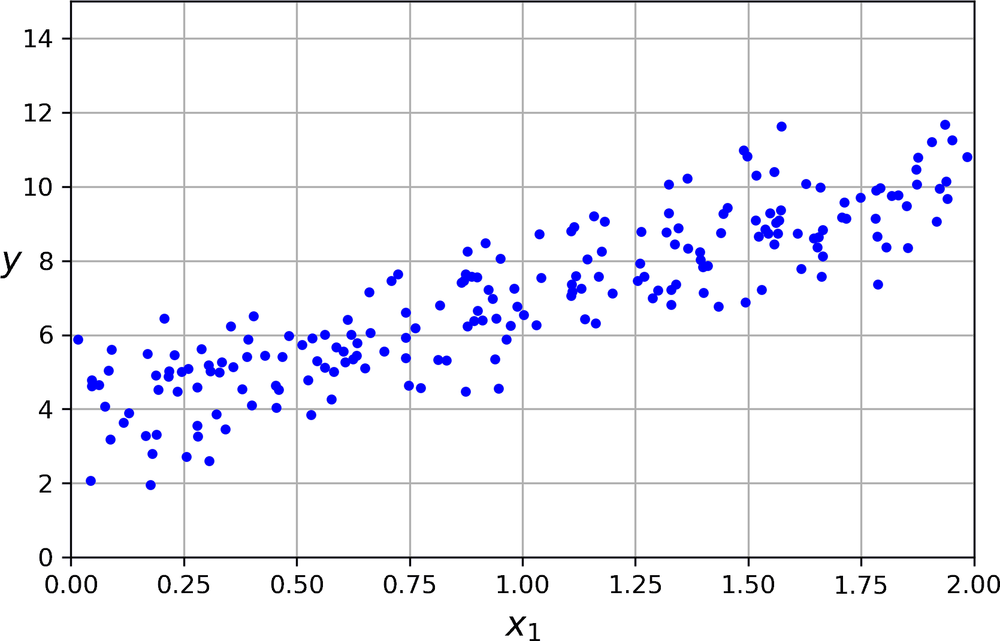
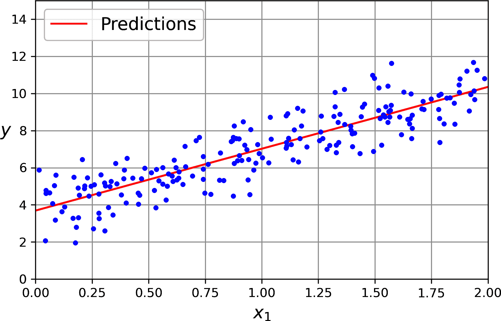
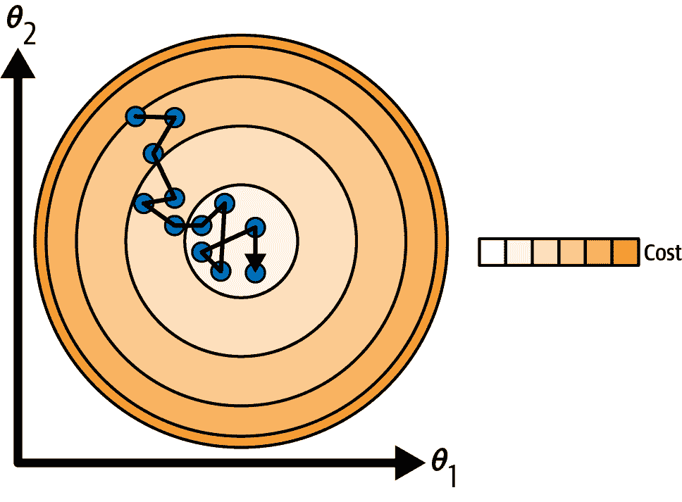
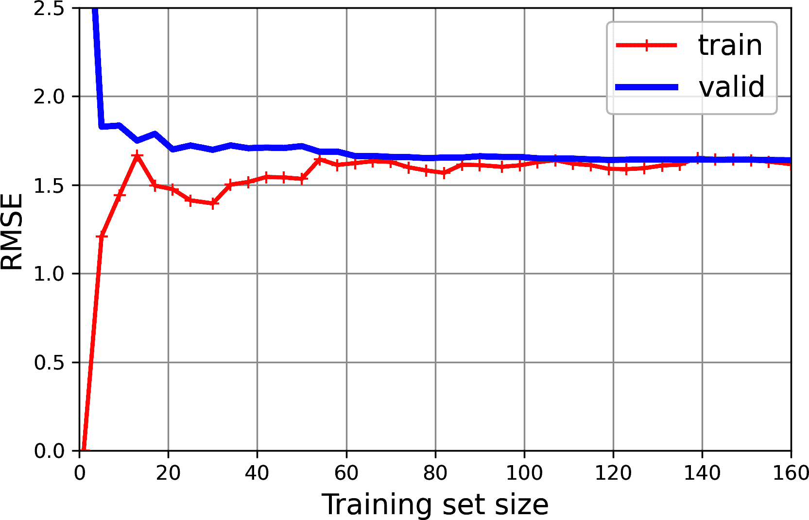

# 第四章\. 训练模型

到目前为止，我们主要将机器学习模型及其训练算法视为黑盒。如果你完成了前几章的一些练习，你可能对在不了解内部结构的情况下能完成多少工作感到惊讶：你优化了一个回归系统，改进了一个数字图像分类器，甚至从头开始构建了一个垃圾邮件分类器，所有这些都不需要了解它们实际是如何工作的。确实，在许多情况下，你并不真的需要了解实现细节。

然而，对事物工作原理的良好理解可以帮助你快速找到合适的模型、正确的训练算法以及适合你任务的良好的超参数集。了解内部结构也将帮助你更有效地调试问题和进行错误分析。最后，本章讨论的许多主题对于理解、构建和训练神经网络（本书第 II 部分[part02.html#neural_nets_part]中讨论）是必不可少的。

在本章中，我们将首先探讨线性回归模型，这是最简单的模型之一。我们将讨论两种非常不同的训练方法：

+   使用一个“闭式”方程⁠^(1)，该方程直接计算最适合训练集（即最小化训练集上成本函数的模型参数）的模型参数。

+   使用一种称为梯度下降（GD）的迭代优化方法，该方法逐渐调整模型参数以最小化训练集上的成本函数，最终收敛到与第一种方法相同的一组参数。当我们研究第 II 部分[part02.html#neural_nets_part]中的神经网络时，我们将再次查看几种梯度下降的变体：批量 GD、小批量 GD 和随机 GD。

接下来，我们将探讨多项式回归，这是一个更复杂的模型，可以拟合非线性数据集。由于这个模型比线性回归有更多的参数，它更容易过拟合训练数据。我们将通过学习曲线探索如何检测这种情况，然后我们将探讨几种可以减少过拟合训练集风险的正则化技术。

最后，我们将考察两种常用于分类任务的模型：逻辑回归和 softmax 回归。

###### 警告

本章将使用线性代数和微积分的基本概念，包含相当多的数学方程。要理解这些方程，你需要熟悉向量和矩阵——如何转置它们，如何乘法，以及如何求逆，以及偏导数。如果这些概念不熟悉，请查阅 [在线补充材料](https://github.com/ageron/handson-mlp) 中提供的线性代数和微积分的入门 Jupyter 笔记本。如果你真的对数学过敏，可以跳过这些方程；文本应该仍然能帮助你掌握大部分概念。尽管一开始可能觉得令人畏惧，但实际上并不难，本章还包括代码，可以帮助你理解这些方程。

# 线性回归

在 第一章 中，我们研究了生活满意度的简单线性模型（方程 4-1）。

##### 方程 4-1\. 生活满意度的简单线性模型

$life normal bar satisfaction equals theta 0 plus theta 1 times GDP normal bar per normal bar capita$

这个模型仅仅是输入特征 `GDP_per_capita` 的线性函数。*θ*[0] 和 *θ*[1] 是模型的参数。

更一般地，线性模型通过简单地计算输入特征的加权总和，加上一个称为 *偏差项*（也称为 *截距项*）的常数来进行预测，如 方程 4-2 所示。

##### 方程 4-2\. 线性回归模型预测

$y$ 上方的 caret 等于 theta 0 加上 theta 1 乘以 x 1 加上 theta 2 乘以 x 2 加上中划线水平省略号加上 theta 下标 n 基线 x 下标 n$

在这个方程中：

+   *ŷ* 是预测值。

+   *n* 是特征的数量。

+   *x*[*i*] 是 *i*^(th) 特征值。

+   *θ*[*j*] 是 *j*^(th) 模型参数，包括偏差项 *θ*[0] 和特征权重 *θ*[1]，*θ*[2]，⋯，*θ*[*n*]。

这可以通过向量化的形式更加简洁地表示，如 方程 4-3 所示。

##### 方程 4-3\. 线性回归模型预测（向量化形式）

<mover accent="true"><mi>y</mi><mo>^</mo></mover><mo>=</mo><msub><mi>h</mi><mi mathvariant="bold">θ</mi></msub><mo>(</mo><mi mathvariant="bold">x</mi><mo>)</mo><mo>=</mo><mi mathvariant="bold">θ</mi><mo>·</mo><mi mathvariant="bold">x</mi>

在这个方程中：

+   *h*[**θ**] 是假设函数，使用模型参数 **θ**。

+   **θ** 是模型的 *参数向量*，包含偏差项 *θ*[0] 和特征权重 *θ*[1] 到 *θ*[*n*]。

+   **x** 是实例的 *特征向量*，包含 *x*[0] 到 *x*[*n*]，其中 *x*[0] 总是等于 1。

+   **θ** · **x** 是向量 **θ** 和 **x** 的点积，等于 *θ*[0]*x*[0] + *θ*[1]*x*[1] + *θ*[2]*x*[2] + ... + *θ*[*n*]*x*[*n*]。

###### 注意

在机器学习中，向量通常表示为 *列向量*，它们是只有一列的二维数组。如果 **θ** 和 **x** 是列向量，那么预测是 <mover accent="true"><mi>y</mi><mo>^</mo></mover><mo>=</mo><msup><mi mathvariant="bold">θ</mi><mo>⊺</mo></msup><mi mathvariant="bold">x</mi>，其中 <msup><mi mathvariant="bold">θ</mi><mo>⊺</mo></msup> 是 **θ** 的 *转置*（一个行向量而不是列向量），而 <msup><mi mathvariant="bold">θ</mi><mo>⊺</mo></msup><mi mathvariant="bold">x</mi> 是 <msup><mi mathvariant="bold">θ</mi><mo>⊺</mo></msup> 和 **x** 的矩阵乘积。当然，这仍然是相同的预测，只是现在它被表示为一个单元素矩阵而不是标量值。在这本书中，我将使用这种符号来避免在点积和矩阵乘法之间切换。

好的，这就是线性回归模型——但是我们是怎样训练它的呢？嗯，回想一下，训练一个模型意味着设置其参数，使得模型最好地拟合训练集。为此，我们首先需要一个衡量模型如何（或不好）拟合训练数据的指标。在 第二章 中，我们看到了回归模型最常见的性能指标是均方根误差（方程 2-1）。因此，为了训练线性回归模型，我们需要找到使 RMSE 最小的 **θ** 的值。在实践中，最小化均方误差（MSE）比最小化 RMSE 更简单，并且它会导致相同的结果（因为最小化正函数的值也会最小化其平方根）。

###### 警告

学习算法在训练过程中通常会优化一个不同的损失函数，而不是用于评估最终模型的性能指标。这通常是因为该函数更容易优化，或者因为它在训练期间需要额外的项（例如，用于正则化）。一个好的性能指标应该尽可能接近最终的商业目标。一个好的训练损失函数易于优化，并且与指标高度相关。例如，分类器通常使用如对数损失（你将在本章后面看到）之类的成本函数进行训练，但使用精确度/召回率进行评估。对数损失易于最小化，并且这样做通常会提高精确度/召回率。

线性回归假设 *h*[**θ**] 在训练集 **X** 上的均方误差（MSE）是使用 方程 4-4 计算的。

##### 方程 4-4\. 线性回归模型的均方误差（MSE）成本函数

<mrow><mtext>MSE</mtext> <mrow><mo>(</mo> <mi mathvariant="bold">X</mi> <mo lspace="0%" rspace="0%">,</mo> <mi mathvariant="bold">y</mi> <mo lspace="0%" rspace="0%">,</mo> <msub><mi>h</mi> <mi mathvariant="bold">θ</mi></msub> <mo>)</mo></mrow> <mo>=</mo> <mstyle scriptlevel="0" displaystyle="true"><mfrac><mn>1</mn> <mi>m</mi></mfrac></mstyle> <munderover><mo>∑</mo> <mrow><mi>i</mi><mo>=</mo><mn>1</mn></mrow> <mi>m</mi></munderover> <msup><mrow><mo>(</mo><msup><mi mathvariant="bold">θ</mi> <mo>⊺</mo></msup> <msup><mi mathvariant="bold">x</mi> <mrow><mo>(</mo><mi>i</mi><mo>)</mo></mrow></msup> <mo>-</mo><msup><mi>y</mi> <mrow><mo>(</mo><mi>i</mi><mo>)</mo></mrow></msup> <mo>)</mo></mrow> <mn>2</mn></msup></mrow>

大多数这些符号都在 第二章（见 “符号”）中介绍过。唯一的区别是我们写 *h*[**θ**] 而不是仅仅 *h*，以使其清楚模型是由向量 **θ** 参数化的。为了简化符号，我们将只写 MSE(**θ**) 而不是 MSE(**X**, *h*[**θ**])。

## 正则方程

要找到使 MSE 最小的 **θ** 值，存在一个 *封闭形式解*——换句话说，一个直接给出结果的数学方程。这被称为 *正则方程* (方程 4-5)。

##### 方程 4-5\. 正则方程

<mrow><mover accent="true"><mi mathvariant="bold">θ</mi> <mo>^</mo></mover> <mo>=</mo> <msup><mrow><mo>(</mo><msup><mi mathvariant="bold">X</mi> <mo>⊺</mo></msup> <mi mathvariant="bold">X</mi><mo>)</mo></mrow> <mrow><mo>-</mo><mn>1</mn></mrow></msup> <msup><mi mathvariant="bold">X</mi> <mo>⊺</mo></msup> <mi mathvariant="bold">y</mi></mrow>

在这个方程中：

+   <mover accent="true"><mi mathvariant="bold">θ</mi><mo>^</mo></mover> 是使成本函数最小的 **θ** 的值。

+   **y** 是包含 *y*^((1)) 到 *y*^((*m*)）的目标值的向量。

让我们生成一些看起来像线性的数据来测试这个方程（图 4-1）：

```py
import numpy as np

rng = np.random.default_rng(seed=42)
m = 200  # number of instances
X = 2 * rng.random((m, 1))  # column vector
y = 4 + 3 * X + rng.standard_normal((m, 1))  # column vector
```



###### 图 4-1\. 随机生成的线性数据集

现在，让我们使用正则方程来计算 <mover accent="true"><mi mathvariant="bold">θ</mi><mo>^</mo></mover>。我们将使用 NumPy 线性代数模块（`np.linalg`）中的 `inv()` 函数来计算矩阵的逆，并使用 `@` 运算符进行矩阵乘法：

```py
from sklearn.preprocessing import add_dummy_feature

X_b = add_dummy_feature(X)  # add x0 = 1 to each instance
theta_best = np.linalg.inv(X_b.T @ X_b) @ X_b.T @ y
```

###### 注意

`@` 运算符执行矩阵乘法。如果 `A` 和 `B` 是 NumPy 数组，则 `A @ B` 等同于 `np.matmul(A, B)`。许多其他库，如 TensorFlow、PyTorch 和 JAX，也支持 `@` 运算符。然而，你不能在纯 Python 数组（即列表的列表）上使用 `@`。

我们用来生成数据的函数是 *y* = 4 + 3*x*[1] + 高斯噪声。让我们看看找到的方程：

```py
>>> theta_best `array([[3.69084138],`
 `[3.32960458]])`
```

```py```````py`` We would have hoped for *θ*[0] = 4 and *θ*[1] = 3 instead of *θ*[0] = 3.6908 and *θ*[1] = 3.3296\. Close enough, but the noise made it impossible to recover the exact parameters of the original function. The smaller and noisier the dataset, the harder it gets.    Now we can make predictions using <mover accent="true"><mi mathvariant="bold">θ</mi><mo>^</mo></mover>:    ``` >>> X_new = np.array([[0], [2]]) `>>>` `X_new_b` `=` `add_dummy_feature``(``X_new``)`  `# add x0 = 1 to each instance` ```py` `>>>` `y_predict` `=` `X_new_b` `@` `theta_best` ``` `>>>` `y_predict` `` `array([[ 3.69084138],`  `[10.35005055]])` `` ```py ```` ```py   ``````py````` ```py```````py ``````py``` Let’s plot this model’s predictions (Figure 4-2):    ``` 导入 matplotlib.pyplot 模块作为 plt，并使用 plt.plot 绘制新数据 X_new 和预测值 y_predict 的红色实线，并添加标签“Predictions”。接着使用 plt.plot 绘制原始数据 X 和 y 的蓝色点。 [...]  # 美化图形：添加标签、坐标轴、网格和图例 plt.show() ```py    ###### Figure 4-2\. Linear regression model predictions    Performing linear regression using Scikit-Learn is relatively straightforward:    ``` >>> from sklearn.linear_model import LinearRegression `>>>` `lin_reg` `=` `LinearRegression()` ```py`` `>>>` `lin_reg``.``fit``(``X``,` `y``)` ```` `>>>` `lin_reg` `. `intercept_` `, `lin_reg` `. `coef_` ```py `(array([3.69084138]), array([[3.32960458]]))` `>>>` `lin_reg``.``predict``(``X_new``)` `` `array([[ 3.69084138],`  `[10.35005055]])` `` ``` ```py` ````` ```py   ``````py`` ``````py` ``````py Notice that Scikit-Learn separates the bias term (`intercept_`) from the feature weights (`coef_`). The `LinearRegression` class is based on the `scipy.linalg.lstsq()` function (the name stands for “least squares”), which you could call directly:    ``` >>> theta_best_svd, residuals, rank, s = np.linalg.lstsq(X_b, y, rcond=1e-6) `>>>` `theta_best_svd` `` `array([[3.69084138],`  `[3.32960458]])` `` ```py   ````` ```py` This function computes <mover accent="true"><mi mathvariant="bold">θ</mi><mo>^</mo></mover><mo>=</mo><msup><mi mathvariant="bold">X</mi><mo>+</mo></msup><mi mathvariant="bold">y</mi>, where <msup><mi mathvariant="bold">X</mi><mo>+</mo></msup> is the *pseudoinverse* of **X** (specifically, the Moore–Penrose inverse). You can use `np.linalg.pinv()` to compute the pseudoinverse directly:    ``` >>> np.linalg.pinv(X_b) @ y `array([[3.69084138],`  `[3.32960458]])` ```py   ``The pseudoinverse itself is computed using a standard matrix factorization technique called *singular value decomposition* (SVD) that can decompose the training set matrix **X** into the matrix multiplication of three matrices **U** **Σ** **V**^⊺ (see `numpy.linalg.svd()`). The pseudoinverse is computed as <msup><mi mathvariant="bold">X</mi><mo>+</mo></msup><mo>=</mo><mi mathvariant="bold">V</mi><msup><mi mathvariant="bold">Σ</mi><mo>+</mo></msup><msup><mi mathvariant="bold">U</mi><mo>⊺</mo></msup>. To compute the matrix <msup><mi mathvariant="bold">Σ</mi><mo>+</mo></msup>, the algorithm takes **Σ** and sets to zero all values smaller than a tiny threshold value, then it replaces all the nonzero values with their inverse, and finally it transposes the resulting matrix. This approach is more efficient than computing the normal equation, plus it handles edge cases nicely: indeed, the normal equation may not work if the matrix **X**^⊺**X** is not invertible (i.e., singular), such as if *m* < *n* or if some features are redundant, but the pseudoinverse is always defined.`` ```` ```py`` ``````py ``````py` ``````py`` ``````py``` ``````py```` ```py```````py` ``````py``````  ```py` ``` ``## 计算复杂度    正则方程计算**X**^⊺ **X**的逆，这是一个(*n* + 1) × (*n* + 1)的矩阵（其中*n*是特征的数量）。逆矩阵的计算复杂度通常是大约*O*(*n*^(2.4))到*O*(*n*³)，具体取决于实现方式。换句话说，如果你将特征的数量加倍，计算时间大约会增加 2^(2.4) = 5.3 到 2³ = 8。    Scikit-Learn 的`LinearRegression`类使用的 SVD 方法大约是*O*(*n*²)。如果你将特征的数量加倍，计算时间大约会增加 4。    ###### 警告    当特征数量增长很大时（例如，100,000），正则方程和 SVD 方法都会变得非常慢。从积极的一面来看，它们与训练集实例的数量呈线性关系（它们是*O*(*m*))，因此它们可以有效地处理大型训练集，前提是它们可以适应内存。    此外，一旦你训练了你的线性回归模型（使用正则方程或任何其他算法），预测就会非常快：计算复杂度与你要进行预测的实例数量和特征数量呈线性关系。换句话说，对两倍多的实例（或两倍多的特征）进行预测将花费大约两倍的时间。    现在我们将探讨一种非常不同的训练线性回归模型的方法，这种方法更适合于特征数量很大或训练实例太多而无法适应内存的情况。`` ```py ````  ```py```````py```````py```` ```py```````py```````py``` ``````py```````py`````` # Gradient Descent    *Gradient descent* is a generic optimization algorithm capable of finding optimal solutions to a wide range of problems. The general idea of gradient descent is to tweak parameters iteratively in order to minimize a cost function.    Suppose you are lost in the mountains in a dense fog, and you can only feel the slope of the ground below your feet. A good strategy to get to the bottom of the valley quickly is to go downhill in the direction of the steepest slope. This is exactly what gradient descent does: it measures the local gradient of the error function with regard to the parameter vector **θ**, and it goes in the direction of descending gradient. Once the gradient is zero, you have reached a minimum!    In practice, you start by filling **θ** with random values (this is called *random initialization*). Then you improve it gradually, taking one baby step at a time, each step attempting to decrease the cost function (e.g., the MSE), until the algorithm *converges* to a minimum (see Figure 4-3).    ###### Figure 4-3\. In this depiction of gradient descent, the model parameters are initialized randomly and get tweaked repeatedly to minimize the cost function; the learning step size is proportional to the slope of the cost function, so the steps gradually get smaller as the cost approaches the minimum    An important parameter in gradient descent is the size of the steps, determined by the *learning rate* hyperparameter. If the learning rate is too small, then the algorithm will have to go through many iterations to converge, which will take a long time (see Figure 4-4).    ###### Figure 4-4\. Learning rate too small    On the other hand, if the learning rate is too high, you might jump across the valley and end up on the other side, possibly even higher up than you were before. This might make the algorithm diverge, with larger and larger values, failing to find a good solution (see Figure 4-5).    ###### Figure 4-5\. Learning rate too high    Additionally, not all cost functions look like nice, regular bowls. There may be holes, ridges, plateaus, and all sorts of irregular terrain, making convergence to the minimum difficult. Figure 4-6 shows the two main challenges with gradient descent. If the random initialization starts the algorithm on the left, then it will converge to a *local minimum*, which is not as good as the *global minimum*. If it starts on the right, then it will take a very long time to cross the plateau. And if you stop too early, you will never reach the global minimum.    ###### Figure 4-6\. Gradient descent pitfalls    Fortunately, the MSE cost function for a linear regression model happens to be a *convex function*, which means that if you pick any two points on the curve, the line segment joining them is never below the curve. This implies that there are no local minima, just one global minimum. It is also a continuous function with a slope that never changes abruptly.⁠^(2) These two facts have a great consequence: gradient descent is guaranteed to approach arbitrarily closely the global minimum (if you wait long enough and if the learning rate is not too high).    While the cost function has the shape of a bowl, it can be an elongated bowl if the features have very different scales. Figure 4-7 shows gradient descent on a training set where features 1 and 2 have the same scale (on the left), and on a training set where feature 1 has much smaller values than feature 2 (on the right).⁠^(3)    As you can see, on the left the gradient descent algorithm goes straight toward the minimum, thereby reaching it quickly, whereas on the right it first goes in a direction almost orthogonal to the direction of the global minimum, and it ends with a long march down an almost flat valley. It will eventually reach the minimum, but it will take a long time.    This diagram also illustrates the fact that training a model means searching for a combination of model parameters that minimizes a cost function (over the training set). It is a search in the model’s *parameter space*. The more parameters a model has, the more dimensions this space has, and the harder the search is: searching for a needle in a 300-dimensional haystack is much trickier than in 3 dimensions. Fortunately, since the cost function is convex in the case of linear regression, the needle is simply at the bottom of the bowl.    ###### Figure 4-7\. Gradient descent with (left) and without (right) feature scaling    ###### Warning    When using gradient descent, you should ensure that all features have a similar scale (e.g., using Scikit-Learn’s `StandardScaler` class), or else it will take much longer to converge.    ## Batch Gradient Descent    Most models have more than one model parameter. Therefore, to implement gradient descent, you need to compute the gradient of the cost function with regard to each model parameter *θ*[*j*]. In other words, you need to calculate how much the cost function will change if you change *θ*[*j*] just a little bit. This is called a *partial derivative*. It is like asking, “What is the slope of the mountain toward the east?” and then asking the same question facing north (and so on for all other dimensions, if you can imagine a universe with more than three dimensions). Equation 4-6 computes the partial derivative of the MSE with regard to parameter *θ*[*j*], denoted ∂ MSE(**θ**) / ∂θ[*j*].    ##### Equation 4-6\. Partial derivatives of the cost function  <mrow><mstyle scriptlevel="0" displaystyle="true"><mfrac><mi>∂</mi> <mrow><mi>∂</mi><msub><mi>θ</mi> <mi>j</mi></msub></mrow></mfrac></mstyle> <mtext>MSE</mtext> <mrow><mo>(</mo> <mi mathvariant="bold">θ</mi> <mo>)</mo></mrow> <mo>=</mo> <mstyle scriptlevel="0" displaystyle="true"><mfrac><mn>2</mn> <mi>m</mi></mfrac></mstyle> <munderover><mo>∑</mo> <mrow><mi>i</mi><mo>=</mo><mn>1</mn></mrow> <mi>m</mi></munderover> <mrow><mo>(</mo> <msup><mi mathvariant="bold">θ</mi> <mo>⊺</mo></msup> <msup><mi mathvariant="bold">x</mi> <mrow><mo>(</mo><mi>i</mi><mo>)</mo></mrow></msup> <mo>-</mo> <msup><mi>y</mi> <mrow><mo>(</mo><mi>i</mi><mo>)</mo></mrow></msup> <mo>)</mo></mrow> <msubsup><mi>x</mi> <mi>j</mi> <mrow><mo>(</mo><mi>i</mi><mo>)</mo></mrow></msubsup></mrow>  Instead of computing these partial derivatives individually, you can use Equation 4-7 to compute them all in one go. The gradient vector, denoted ∇[**θ**]MSE(**θ**), contains all the partial derivatives of the cost function (one for each model parameter).    ##### Equation 4-7\. Gradient vector of the cost function  <mrow><msub><mi>∇</mi> <mi mathvariant="bold">θ</mi></msub> <mtext>MSE</mtext> <mrow><mo>(</mo> <mi mathvariant="bold">θ</mi> <mo>)</mo></mrow> <mo>=</mo> <mrow><mo stretchy="true">(</mo> <mtable><mtr><mtd><mrow><mfrac><mi>∂</mi> <mrow><mi>∂</mi><msub><mi>θ</mi> <mn>0</mn></msub></mrow></mfrac> <mtext>MSE</mtext> <mrow><mo>(</mo> <mi mathvariant="bold">θ</mi> <mo>)</mo></mrow></mrow></mtd></mtr> <mtr><mtd><mrow><mfrac><mi>∂</mi> <mrow><mi>∂</mi><msub><mi>θ</mi> <mn>1</mn></msub></mrow></mfrac> <mtext>MSE</mtext> <mrow><mo>(</mo> <mi mathvariant="bold">θ</mi> <mo>)</mo></mrow></mrow></mtd></mtr> <mtr><mtd><mo>⋮</mo></mtd></mtr> <mtr><mtd><mrow><mfrac><mi>∂</mi> <mrow><mi>∂</mi><msub><mi>θ</mi> <mi>n</mi></msub></mrow></mfrac> <mtext>MSE</mtext> <mrow><mo>(</mo> <mi mathvariant="bold">θ</mi> <mo>)</mo></mrow></mrow></mtd></mtr></mtable> <mo stretchy="true">)</mo></mrow> <mo>=</mo> <mstyle scriptlevel="0" displaystyle="true"><mfrac><mn>2</mn> <mi>m</mi></mfrac></mstyle> <msup><mi mathvariant="bold">X</mi> <mo>⊺</mo></msup> <mrow><mo>(</mo> <mi mathvariant="bold">X</mi> <mi mathvariant="bold">θ</mi> <mo>-</mo> <mi mathvariant="bold">y</mi> <mo>)</mo></mrow></mrow>  ###### Warning    Notice that this formula involves calculations over the full training set **X**, at each gradient descent step! This is why the algorithm is called *batch gradient descent*: it uses the whole batch of training data at every step (actually, *full gradient descent* would probably be a better name). As a result, it is terribly slow on very large training sets (we will look at some much faster gradient descent algorithms shortly). However, gradient descent scales well with the number of features; training a linear regression model when there are hundreds of thousands of features is much faster using gradient descent than using the normal equation or SVD decomposition.    Once you have the gradient vector, which points uphill, just go in the opposite direction to go downhill. This means subtracting ∇[**θ**]MSE(**θ**) from **θ**. This is where the learning rate *η* comes into play:⁠^(4) multiply the gradient vector by *η* to determine the size of the downhill step (Equation 4-8).    ##### Equation 4-8\. Gradient descent step  <msup><mi mathvariant="bold">θ</mi><mrow><mo>(</mo><mtext>next step</mtext><mo>)</mo></mrow></msup><mo>=</mo><mi mathvariant="bold">θ</mi><mo>-</mo><mi>η</mi><msub><mo>∇</mo><mi mathvariant="bold">θ</mi></msub><mtext>MSE</mtext><mo>(</mo><mi mathvariant="bold">θ</mi><mo>)</mo>  Let’s look at a quick implementation of this algorithm:    ```py eta = 0.1  # learning rate n_epochs = 1000 m = len(X_b)  # number of instances  rng = np.random.default_rng(seed=42) theta = rng.standard_normal((2, 1))  # randomly initialized model parameters  for epoch in range(n_epochs):     gradients = 2 / m * X_b.T @ (X_b @ theta - y)     theta = theta - eta * gradients ```    That wasn’t too hard! Each iteration over the training set is called an *epoch*. Let’s look at the resulting `theta`:    ```py >>> theta `array([[3.69084138],`  `[3.32960458]])` ```   ``Hey, that’s exactly what the normal equation found! Gradient descent worked perfectly. But what if you had used a different learning rate (`eta`)? Figure 4-8 shows the first 20 steps of gradient descent using three different learning rates. The line at the bottom of each plot represents the random starting point, then each epoch is represented by a darker and darker line.    ###### Figure 4-8\. Gradient descent with various learning rates    On the left, the learning rate is too low: the algorithm will eventually reach the solution, but it will take a long time. In the middle, the learning rate looks pretty good: in just a few epochs, it has already converged to the solution. On the right, the learning rate is too high: the algorithm diverges, jumping all over the place and actually getting further and further away from the solution at every step.    To find a good learning rate, you can use grid search (see Chapter 2). However, you may want to limit the number of epochs so that grid search can eliminate models that take too long to converge.    You may wonder how to set the number of epochs. If it is too low, you will still be far away from the optimal solution when the algorithm stops; but if it is too high, you will waste time while the model parameters do not change anymore. A simple solution is to set a very large number of epochs but to interrupt the algorithm when the gradient vector becomes tiny—that is, when its norm becomes smaller than a tiny number *ε* (called the *tolerance*)—because this happens when gradient descent has (almost) reached the minimum.``  ```py`` ## Stochastic Gradient Descent    The main problem with batch gradient descent is the fact that it uses the whole training set to compute the gradients at every step, which makes it very slow when the training set is large. At the opposite extreme, *stochastic gradient descent* picks a random instance in the training set at every step and computes the gradients based only on that single instance. Obviously, working on a single instance at a time makes the algorithm much faster because it has very little data to manipulate at every iteration. It also makes it possible to train on huge training sets, since only one instance needs to be in memory at each iteration (stochastic GD can be implemented as an out-of-core algorithm; see Chapter 1).    On the other hand, due to its stochastic (i.e., random) nature, this algorithm is much less regular than batch gradient descent: instead of gently decreasing until it reaches the minimum, the cost function will bounce up and down, decreasing only on average. Over time it will end up very close to the minimum, but once it gets there it will continue to bounce around, never settling down (see Figure 4-9). Once the algorithm stops, the final parameter values will be good, but not optimal.    When the cost function is very irregular (as in Figure 4-6), this can actually help the algorithm jump out of local minima, so stochastic gradient descent has a better chance of finding the global minimum than batch gradient descent does.    Therefore, randomness is good to escape from local optima, but bad because it means that the algorithm can never settle at the minimum. One solution to this dilemma is to gradually reduce the learning rate. The steps start out large (which helps make quick progress and escape local minima), then get smaller and smaller, allowing the algorithm to settle at the global minimum. This process is akin to *simulated annealing*, an algorithm inspired by the process in metallurgy of annealing, where molten metal is slowly cooled down. The function that determines the learning rate at each iteration is called the *learning schedule*. If the learning rate is reduced too quickly, you may get stuck in a local minimum, or even end up frozen halfway to the minimum. If the learning rate is reduced too slowly, you may jump around the minimum for a long time and end up with a suboptimal solution if you halt training too early.    ###### Figure 4-9\. With stochastic gradient descent, each training step is much faster but also much more stochastic than when using batch gradient descent    This code implements stochastic gradient descent using a simple learning schedule:    ``` n_epochs = 50 t0, t1 = 5, 50  # learning schedule hyperparameters  def learning_schedule(t):     return t0 / (t + t1)  rng = np.random.default_rng(seed=42) theta = rng.standard_normal((2, 1))  # randomly initialized model parameters  for epoch in range(n_epochs):     for iteration in range(m):         random_index = rng.integers(m)         xi = X_b[random_index : random_index + 1]         yi = y[random_index : random_index + 1]         gradients = 2 * xi.T @ (xi @ theta - yi)  # for SGD, do not divide by m         eta = learning_schedule(epoch * m + iteration)         theta = theta - eta * gradients ```py    By convention we iterate by rounds of *m* iterations; each round is called an *epoch*, as earlier. While the batch gradient descent code iterated 1,000 times through the whole training set, this code goes through the training set only 50 times and reaches a pretty good solution:    ``` >>> theta `array([[3.69826475],`  `[3.30748311]])` ```py   ```` Figure 4-10 shows the first 20 steps of training (notice how irregular the steps are).    ###### Figure 4-10\. The first 20 steps of stochastic gradient descent    Note that since instances are picked randomly, some instances may be picked several times per epoch, while others may not be picked at all. If you want to be sure that the algorithm goes through every instance at each epoch, another approach is to shuffle the training set (making sure to shuffle the input features and the labels jointly), then go through it instance by instance, then shuffle it again, and so on. However, this approach is more complex, and it generally does not improve the result.    ###### Warning    When using stochastic gradient descent, the training instances must be independent and identically distributed (IID) to ensure that the parameters get pulled toward the global optimum, on average. A simple way to ensure this is to shuffle the instances during training (e.g., pick each instance randomly, or shuffle the training set at the beginning of each epoch). If you do not shuffle the instances—for example, if the instances are sorted by label—then SGD will start by optimizing for one label, then the next, and so on, and it will not settle close to the global minimum.    To perform linear regression using stochastic GD with Scikit-Learn, you can use the `SGDRegressor` class, which defaults to optimizing the MSE cost function. The following code runs for a maximum of 1,000 epochs (`max_iter`) or until the loss drops by less than 10^(–5) (`tol`) during 100 epochs (`n_iter_no_change`). It starts with a learning rate of 0.01 (`eta0`), using the default learning schedule (different from the one we used). Lastly, it does not use any regularization (`penalty=None`; more details on this shortly):    ```py from sklearn.linear_model import SGDRegressor  sgd_reg = SGDRegressor(max_iter=1000, tol=1e-5, penalty=None, eta0=0.01,                        n_iter_no_change=100, random_state=42) sgd_reg.fit(X, y.ravel())  # y.ravel() because fit() expects 1D targets ```    Once again, you find a solution quite close to the one returned by the normal equation:    ```py >>> sgd_reg.intercept_, sgd_reg.coef_ `(array([3.68899733]), array([3.33054574]))` ```   ``###### Tip    All Scikit-Learn estimators can be trained using the `fit()` method, but some estimators also have a `partial_fit()` method that you can call to run a single round of training on one or more instances (it ignores hyperparameters like `max_iter` or `tol`). Repeatedly calling `partial_fit()` will gradually train the model. This is useful when you need more control over the training process. Other models have a `warm_start` hyperparameter instead (and some have both): if you set `warm_start=True`, calling the `fit()` method on a trained model will not reset the model; it will just continue training where it left off, respecting hyperparameters like `max_iter` and `tol`. Note that `fit()` resets the iteration counter used by the learning schedule, while `partial_fit()` does not.`` ```py`  ``` ``## Mini-Batch Gradient Descent    The last gradient descent algorithm we will look at is called *mini-batch gradient descent*. It is straightforward once you know batch and stochastic gradient descent: at each step, instead of computing the gradients based on the full training set (as in batch GD) or based on just one instance (as in stochastic GD), mini-batch GD computes the gradients on small random sets of instances called *mini-batches*. The main advantage of mini-batch GD over stochastic GD is that you can get a performance boost from hardware acceleration of matrix operations, especially when using *graphical processing units* (GPUs).    The algorithm’s progress in parameter space is less erratic than with stochastic GD, especially with fairly large mini-batches. As a result, mini-batch GD will end up walking around a bit closer to the minimum than stochastic GD—but it may be harder for it to escape from local minima (in the case of problems that suffer from local minima, unlike linear regression with the MSE cost function). Figure 4-11 shows the paths taken by the three gradient descent algorithms in parameter space during training. They all end up near the minimum, but batch GD’s path actually stops at the minimum, while both stochastic GD and mini-batch GD continue to walk around. However, don’t forget that batch GD takes a lot of time to take each step, and stochastic GD and mini-batch GD would also reach the minimum if you used a good learning schedule.    ###### Figure 4-11\. Gradient descent paths in parameter space    Table 4-1 compares the algorithms we’ve discussed so far for linear regression⁠^(5) (recall that *m* is the number of training instances and *n* is the number of features).      Table 4-1\. Comparison of algorithms for linear regression   | Algorithm | Large *m* | Out-of-core support | Large *n* | Hyperparams | Scaling required | Scikit-Learn | | --- | --- | --- | --- | --- | --- | --- | | Normal equation | Fast | No | Slow | 0 | No | N/A | | SVD | Fast | No | Slow | 0 | No | `LinearRegression` | | Batch GD | Slow | No | Fast | 2 | Yes | N/A | | Stochastic GD | Fast | Yes | Fast | ≥2 | Yes | `SGDRegressor` | | Mini-batch GD | Fast | Yes | Fast | ≥2 | Yes | N/A |    There is almost no difference after training: all these algorithms end up with very similar models and make predictions in exactly the same way.`` ```py `````  ```py```````py```````py` ``````py````````py```` ```py```````py`````` # Polynomial Regression    What if your data is more complex than a straight line? Surprisingly, you can use a linear model to fit nonlinear data. A simple way to do this is to add powers of each feature as new features, then train a linear model on this extended set of features. This technique is called *polynomial regression*.    Let’s look at an example. First, we’ll generate some nonlinear data (see Figure 4-12), based on a simple *quadratic equation*—that’s an equation of the form *y* = *ax*² + *bx* + *c*—plus some noise:    ````py rng = np.random.default_rng(seed=42) m = 200  # 实例数量 X = 6 * rng.random((m, 1)) - 3 y = 0.5 * X ** 2 + X + 2 + rng.standard_normal((m, 1)) ```    ###### Figure 4-12\. Generated nonlinear and noisy dataset    Clearly, a straight line will never fit this data properly. So let’s use Scikit-Learn’s `PolynomialFeatures` class to transform our training data, adding the square (second-degree polynomial) of each feature in the training set as a new feature (in this case there is just one feature):    ```` >>> from sklearn.preprocessing import PolynomialFeatures `>>>` `poly_features` `=` `PolynomialFeatures(``degree``=``2``,` `include_bias``=``False``)` ````` `>>>` `X_poly` `=` `poly_features``.``fit_transform``(``X``)` ```py` `>>>` `X``[``0``]` ``` `array([1.64373629])` `>>>` `X_poly``[``0``]` `` `array([1.64373629, 2.701869  ])` `` ```py ```` ```py`` ```   ```py```` ```py``` ````` `X_poly`现在包含原始特征`X`及其平方。现在我们可以将`LinearRegression`模型拟合到扩展后的训练数据（图 4-13）：    ```py >>> lin_reg = LinearRegression() `>>>` `lin_reg``.``fit``(``X_poly``,` `y``)` ``` `>>>` `lin_reg` `. `intercept_` `, `lin_reg` `. `coef_` `` `(array([2.00540719]), array([[1.11022126, 0.50526985]]))` `` ```py ```  ```py` ``` ``  ###### 图 4-13\. 多项式回归模型预测    模型估计 <mrow><mover accent="true"><mi>y</mi> <mo>^</mo></mover> <mo>=</mo> <mn>0.56</mn> <msup><mrow><msub><mi>x</mi> <mn>1</mn></msub></mrow> <mn>2</mn></msup> <mo>+</mo> <mn>0.93</mn> <msub><mi>x</mi> <mn>1</mn></msub> <mo>+</mo> <mn>1.78</mn></mrow> ，而实际上原始函数是 <mrow><mi>y</mi> <mo>=</mo> <mn>0.5</mn> <msup><mrow><msub><mi>x</mi> <mn>1</mn></msub></mrow> <mn>2</mn></msup> <mo>+</mo> <mn>1.0</mn> <msub><mi>x</mi> <mn>1</mn></msub> <mo>+</mo> <mn>2.0</mn> <mo>+</mo> <mtext>高斯噪声</mtext></mrow> 。    注意，当存在多个特征时，多项式回归能够找到特征之间的关系，这是普通线性回归模型无法做到的。这是由于`PolynomialFeatures`还添加了给定度数的所有特征组合。例如，如果有两个特征*a*和*b*，`PolynomialFeatures`的`degree=3`不仅添加了特征*a*²、*a*³、*b*²和*b*³，还添加了组合*ab*、*a*²*b*和*ab*²。    ###### 警告    `PolynomialFeatures(degree=*d*)`将包含*n*个特征的数组转换为包含(*n* + *d*)! / *d*!*n*!个特征的数组，其中*n*!是*n*的阶乘，等于 1 × 2 × 3 × ⋯ × *n*，注意特征数量的组合爆炸！`` ```py ```` ```py`` ``````py ``````py`  ``````py```````py`` `````py```````py` ``````py```````py # 学习曲线    如果你执行高阶多项式回归，你可能会比使用普通线性回归更好地拟合训练数据。例如，图 4-14 将 300 次多项式模型应用于前面的训练数据，并将其与纯线性模型和二次模型（二次多项式）进行比较。注意 300 次多项式模型是如何围绕训练实例进行摆动，以尽可能接近训练实例的。    ###### 图 4-14\. 高阶多项式回归    这种高阶多项式回归模型严重过拟合了训练数据，而线性模型则欠拟合了数据。在这种情况下，表现最好的模型是二次模型，这是有道理的，因为数据是使用二次模型生成的。但一般来说，你不会知道生成数据的功能是什么，那么你如何决定你的模型应该有多复杂？你如何判断你的模型是否过拟合或欠拟合数据？    在第二章中，你使用了交叉验证来估计模型的一般化性能。如果一个模型在训练数据上表现良好，但在交叉验证指标上泛化性能差，那么你的模型就是过拟合。如果它在两者上都表现不佳，那么它就是欠拟合。这是判断模型是否过于简单或过于复杂的一种方法。    另一种判断方法是查看*学习曲线*，这是模型训练误差和验证误差作为训练迭代函数的图表：只需在训练过程中定期评估模型在训练集和验证集上的性能，并绘制结果。如果模型不能增量训练（即如果它不支持`partial_fit()`或`warm_start`），那么你必须多次在训练集的逐渐增大的子集上训练它。    Scikit-Learn 有一个有用的`learning_curve()`函数可以帮助你完成这项工作：它使用交叉验证来训练和评估模型。默认情况下，它会在训练集的增大小子集上重新训练模型，但如果模型支持增量学习，你可以在调用`learning_curve()`时设置`exploit_incremental_learning=True`，这样它就会增量训练模型。该函数返回评估模型的训练集大小，以及它为每个大小和每个交叉验证折数测量的训练和验证分数。让我们使用这个函数来查看普通线性回归模型的学习曲线（见图 4-15）：    ``` from sklearn.model_selection import learning_curve  train_sizes, train_scores, valid_scores = learning_curve(     LinearRegression(), X, y, train_sizes=np.linspace(0.01, 1.0, 40), cv=5,     scoring="neg_root_mean_squared_error") train_errors = -train_scores.mean(axis=1) valid_errors = -valid_scores.mean(axis=1)  plt.plot(train_sizes, train_errors, "r-+", linewidth=2, label="train") plt.plot(train_sizes, valid_errors, "b-", linewidth=3, label="valid") [...]  # beautify the figure: add labels, axis, grid, and legend plt.show() ````py    ###### 图 4-15\. 学习曲线    这个模型欠拟合，它对数据来说太简单了。我们如何判断呢？好吧，让我们看看训练误差。当训练集中只有一个或两个实例时，模型可以完美地拟合它们，这就是为什么曲线从零开始。但随着新实例被添加到训练集中，模型无法完美地拟合训练数据，这既是因为数据有噪声，也是因为它根本不是线性的。因此，训练数据的误差会上升，直到达到一个平台期，此时添加新实例到训练集中不会使平均误差变得更好或更差。现在让我们看看验证误差。当模型在非常少的训练实例上训练时，它无法正确泛化，这就是为什么验证误差最初相当大。然后，随着模型被展示更多的训练示例，它就会学习，因此验证误差会慢慢下降。然而，一旦再次使用直线无法很好地模拟数据，所以误差最终会达到一个平台期，非常接近另一个曲线。    这些学习曲线是欠拟合模型的典型特征。两个曲线都达到了平台期；它们很接近，而且相当高。    ###### 小贴士    如果你发现模型欠拟合训练数据，添加更多的训练实例不会有所帮助。你需要使用更好的模型或提出更好的特征。    现在我们来看看同一数据上 10 次多项式模型的学习曲线（图 4-16）：    ``` from sklearn.pipeline import make_pipeline  polynomial_regression = make_pipeline(     PolynomialFeatures(degree=10, include_bias=False),     LinearRegression())  train_sizes, train_scores, valid_scores = learning_curve(     polynomial_regression, X, y, train_sizes=np.linspace(0.01, 1.0, 40), cv=5,     scoring="neg_root_mean_squared_error") [...]  # same as earlier ````py    ###### 图 4-16\. 10 次多项式模型的学习曲线    这些学习曲线看起来有点像之前的那些，但有两个非常重要的区别：    *   训练数据的误差比之前低得多。           *   曲线之间存在差距。这意味着模型在训练数据上的表现比在验证数据上好，这是过拟合模型的标志。然而，如果你使用更大的训练集，这两个曲线将继续接近。              ###### 小贴士    改善过拟合模型的一种方法是将更多的
