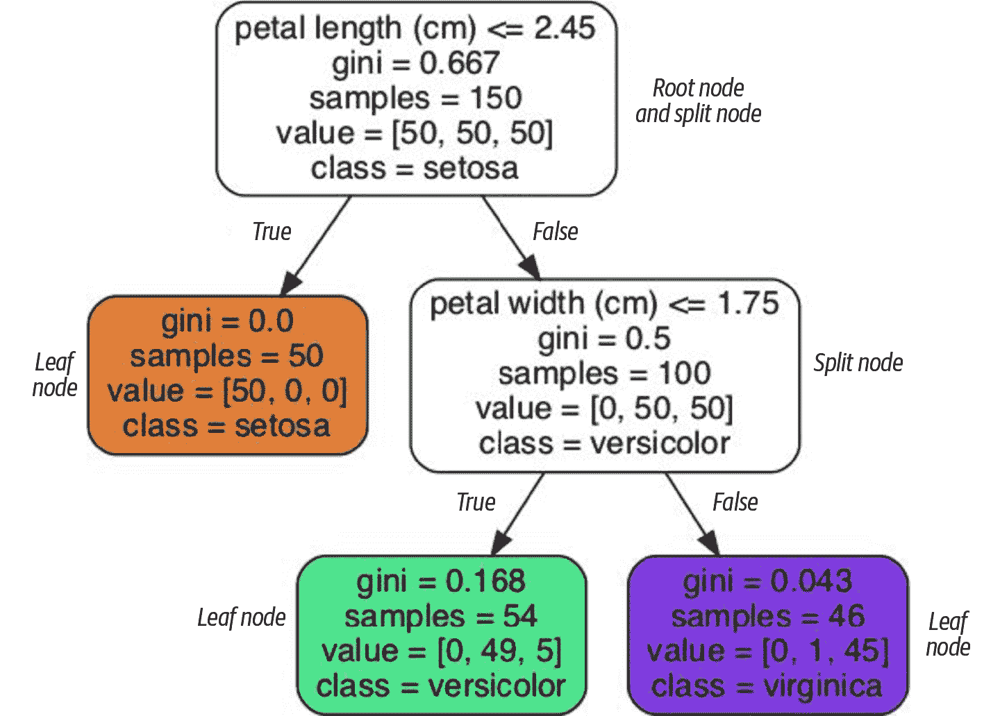
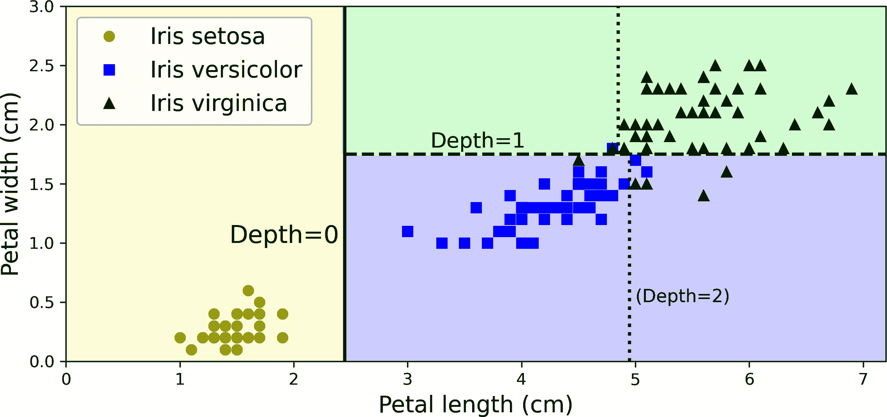
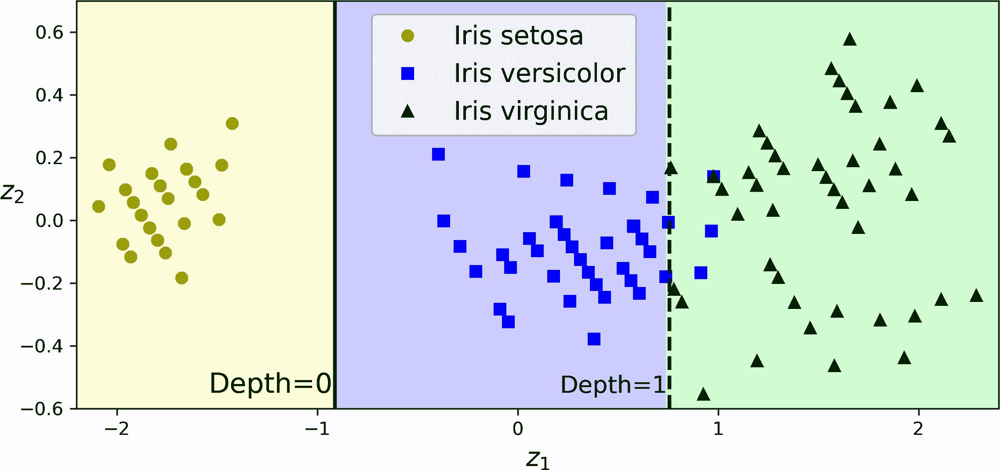
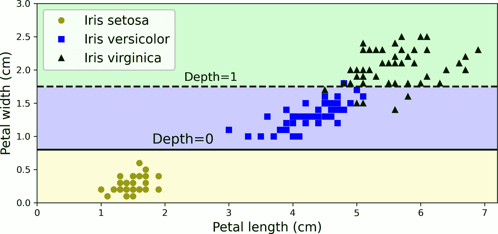

# 第五章\. 决策树

*决策树*是通用的机器学习算法，可以执行分类和回归任务，甚至多输出任务。它们是强大的算法，能够拟合复杂的数据集。例如，在第二章中，您在加利福尼亚住房数据集上训练了一个`DecisionTreeRegressor`模型，并完美地（实际上，过度拟合）地拟合了它。

决策树也是随机森林（见第六章）的基本组成部分，而随机森林是目前最强大的机器学习算法之一。

在本章中，我们将首先讨论如何使用决策树进行训练、可视化和预测。然后我们将介绍 Scikit-Learn 使用的 CART 训练算法，并探讨如何正则化树以及如何将它们用于回归任务。最后，我们将讨论决策树的一些局限性。

# 训练和可视化决策树

要理解决策树，让我们构建一个并看看它是如何进行预测的。以下代码在玫瑰数据集上训练了一个`DecisionTreeClassifier`（见第四章）：

```py
from sklearn.datasets import load_iris
from sklearn.tree import DecisionTreeClassifier

iris = load_iris(as_frame=True)
X_iris = iris.data[["petal length (cm)", "petal width (cm)"]].values
y_iris = iris.target

tree_clf = DecisionTreeClassifier(max_depth=2, random_state=42)
tree_clf.fit(X_iris, y_iris)
```

您可以通过首先使用`export_graphviz()`函数输出一个名为*iris_tree.dot*的图形定义文件来可视化训练好的决策树：

```py
from sklearn.tree import export_graphviz

export_graphviz(
        tree_clf,
        out_file="iris_tree.dot",
        feature_names=["petal length (cm)", "petal width (cm)"],
        class_names=iris.target_names,
        rounded=True,
        filled=True
    )
```

然后，您可以使用`graphviz.Source.from_file()`来加载和显示文件在一个 Jupyter 笔记本中：

```py
from graphviz import Source

Source.from_file("iris_tree.dot")
```

[Graphviz](https://graphviz.org)是一个开源的图形可视化软件包。它还包括一个`dot`命令行工具，可以将*.dot*文件转换为多种格式，如 PDF 或 PNG。

您的第一个决策树看起来像图 5-1。



###### 图 5-1\. 玫瑰决策树

# 进行预测

让我们看看图 5-1 中展示的树是如何进行预测的。假设您发现了一朵玫瑰，并想根据其花瓣对其进行分类。您从*根节点*（深度 0，位于顶部）开始：此节点询问花朵的花瓣长度是否小于 2.45 厘米。如果是，那么您将向下移动到根的左子节点（深度 1，左侧）。在这种情况下，它是一个*叶节点*（即它没有子节点），所以它不会提出任何问题：只需查看该节点的预测类别，决策树预测您的花朵是*玫瑰伊丽莎白*（`class=setosa`）。

现在假设你找到了另一朵花，这次瓣长大于 2.45 厘米。你再次从根节点开始，但这次移动到其右侧子节点（深度 1，右侧）。这不是一个叶节点，它是一个 *分裂节点*，因此它会问另一个问题：瓣宽是否小于 1.75 厘米？如果是，那么你的花很可能是 *Iris versicolor*（深度 2，左侧）。如果不是，它很可能是 *Iris virginica*（深度 2，右侧）。这真的很简单。

###### 注意

决策树的一个许多优点是它们需要很少的数据准备。事实上，它们根本不需要特征缩放或中心化。

一个节点的 `samples` 属性计算它应用了多少个训练实例。例如，100 个训练实例的瓣长大于 2.45 厘米（深度 1，右侧），其中 100 个中有 54 个瓣宽小于 1.75 厘米（深度 2，左侧）。一个节点的 `value` 属性告诉你这个节点应用到了每个类别的多少个训练实例：例如，右下角的节点应用到了 0 个 *Iris setosa*，1 个 *Iris versicolor* 和 45 个 *Iris virginica*。最后，一个节点的 `gini` 属性衡量其 *Gini 不纯度*：如果一个节点应用到的所有训练实例都属于同一类别，则该节点是“纯净的”（`gini=0`）。例如，由于深度 1 的左侧节点只应用到了 *Iris setosa* 的训练实例，其吉尼不纯度为 0。相反，其他节点都应用到了多个类别的实例，因此它们是“不纯净的”。方程式 5-1 展示了训练算法如何计算第 *i* 个节点的吉尼不纯度 *G*[*i*]。类别越多，混合程度越高，不纯度就越大。例如，深度 2 的左侧节点的吉尼不纯度等于 1 – (0/54)² – (49/54)² – (5/54)² ≈ 0.168。

##### 方程式 5-1\. 吉尼不纯度

$upper G Subscript i Baseline equals 1 minus sigma-summation Underscript k equals 1 Overscript n Endscripts p Subscript i comma k Baseline Superscript 2$

在这个方程中：

+   *G*[*i*] 是第 *i* 个节点的吉尼不纯度。

+   *p*[*i*,*k*] 是第 *i* 个节点中训练实例中类别 *k* 的实例比率。

###### 注意

Scikit-Learn 使用 CART 算法（稍后讨论），它只产生 *二叉树*，这意味着分裂节点总是有两个子节点（即问题只有是/否的答案）。然而，其他算法，如 ID3，可以产生具有超过两个子节点的决策树。

图 5-2 显示了这个决策树的决策边界。粗垂直线表示根节点（深度 0）的决策边界：花瓣长度 = 2.45 厘米。由于左侧区域是纯的（只有 *Iris setosa*），它不能再进一步分割。然而，右侧区域是不纯的，因此深度为 1 的右节点在花瓣宽度 = 1.75 厘米处将其分割（由虚线表示）。由于 `max_depth` 设置为 2，决策树就在那里停止。如果你将 `max_depth` 设置为 3，那么这两个深度为 2 的节点将各自添加另一个决策边界（由两条垂直虚线表示）。



###### 图 5-2\. 决策树决策边界

###### 小贴士

树结构，包括 图 5-1 中显示的所有信息，都可通过分类器的 `tree_` 属性获得。输入 **`help(tree_clf.tree_)`** 获取详细信息，并查看 [本章的笔记本](https://homl.info/colab-p) 以获取示例。

# 估计类概率

决策树还可以估计一个实例属于特定类别 *k* 的概率。首先，它遍历树以找到该实例的叶节点，然后返回在训练实例中达到该叶节点的类别 *k* 的实例比例。例如，假设你发现一朵花瓣长 5 厘米、宽 1.5 厘米的花。相应的叶节点是深度为 2 的左节点，因此决策树输出以下概率：*Iris setosa* 为 0%（0/54），*Iris versicolor* 为 90.7%（49/54），*Iris virginica* 为 9.3%（5/54）。如果你要求它预测类别，它输出 *Iris versicolor*（类别 1），因为它具有最高的概率。让我们检查一下：

```py
>>> tree_clf.predict_proba([[5, 1.5]]).round(3) `array([[0\.   , 0.907, 0.093]])`
`>>>` `tree_clf``.``predict``([[``5``,` `1.5``]])` `` `array([1])` ``
```

`` `完美！注意，在图 5-2 右下角的任何地方，估计的概率都是相同的——例如，如果花瓣长度为 6 厘米，宽度为 1.5 厘米（尽管在这种情况下似乎很明显它很可能是*Iris virginica*）。` `` ```py````` ```py```` # CART 训练算法 Scikit-Learn 使用**分类和回归树**（CART）算法来训练决策树（也称为“生长”树）。该算法通过首先使用单个特征*k*和阈值*t*[*k*]（例如，“花瓣长度≤2.45 厘米”）将训练集分成两个子集来工作。它是如何选择*k*和*t*[*k*]的呢？它寻找产生最纯净子集的(*k*, *t*[*k*])对，并按其大小进行加权。方程 5-2 给出了算法试图最小化的成本函数。    ##### 方程 5-2\. 分类 CART 成本函数  $StartLayout 1st Row 1st Column upper J left-parenthesis k comma t Subscript k Baseline right-parenthesis 2nd Column equals StartFraction m Subscript left Baseline Over m EndFraction upper G Subscript left Baseline plus StartFraction m Subscript right Baseline Over m EndFraction upper G Subscript right Baseline 2nd Row 1st Column where 2nd Column StartLayout Enlarged left-brace 1st Row  upper G Subscript left slash right Baseline measures the impurity of the left slash right subset 2nd Row  m Subscript left slash right Baseline is the number of instances in the left slash right subset 3rd Row  m equals m Subscript left Baseline plus m Subscript right EndLayout EndLayout$  一旦 CART 算法成功地将训练集分成两个部分，它就会使用相同的逻辑将子集分成两个部分，然后是子子集，依此类推，递归地进行。一旦达到最大深度（由`max_depth`超参数定义），或者找不到将减少纯度的分割，它就会停止递归。一些其他超参数（稍后描述）控制了额外的停止条件：`min_samples_split`、`min_samples_leaf`、`max_leaf_nodes`等。    ###### 警告    如您所见，CART 算法是一种**贪婪算法**：它在顶层贪婪地搜索最优分割，然后在每个后续级别重复此过程。它不会检查分割是否会降低几层以下的最低可能纯度。贪婪算法通常会产生一个相当好的解决方案，但并不保证是最优的。    不幸的是，找到最优树是一个已知的**NP 完全**问题。⁠^(1) 它需要*O*(exp(*m*))时间，⁠^(2) 即使对于小的训练集，这个问题也是不可行的。这就是为什么我们在训练决策树时必须满足于“相当好”的解决方案。    # 计算复杂度    做出预测需要从根节点遍历决策树到叶子节点。决策树通常是近似平衡的，因此遍历决策树需要通过大约*O*(log2)个节点，其中*m*是训练实例的数量，log2 是*m*的**二进制对数**，等于 log(*m*) / log(2)。由于每个节点只需要检查一个特征值，因此整体预测复杂度为*O*(log2)，与特征数量无关。因此，即使处理大型训练集，预测也非常快。    默认情况下，训练算法在节点上的每个样本上比较所有特征，这导致训练复杂度为*O*(*n* × *m* log2)。    可以使用`max_depth`超参数设置最大树深度，并且/或者设置每个节点要考虑的最大特征数（然后特征被随机选择）。这样做将大大加快训练速度，并且还可以减少过拟合的风险（但像往常一样，做得太过分会导致欠拟合）。    # Gini 不纯度或熵？    默认情况下，`DecisionTreeClassifier`类使用 Gini 不纯度度量，但可以通过将`criterion`超参数设置为`"entropy"`来选择*熵*不纯度度量。熵的概念起源于热力学，作为分子无序的度量：当分子静止且有序时，熵接近零。熵后来扩展到广泛的领域，包括香农的信息理论，其中它衡量消息的平均信息内容，正如我们在第四章中看到的。当所有消息都相同的时候，熵为零。在机器学习中，熵经常被用作不纯度度量：当集合只包含一个类的实例时，集合的熵为零。方程 5-3 显示了*i*^(th)节点的熵的定义。例如，图 5-1 中深度为 2 的左节点熵等于 –(49/54) log[2] (49/54) – (5/54) log[2] (5/54) ≈ 0.445。    ##### 方程 5-3\. 熵  <mrow><msub><mi>H</mi> <mi>i</mi></msub> <mo>=</mo> <mo>-</mo> <munderover><mo>∑</mo> <mfrac linethickness="0pt"><mrow><mi>k</mi><mo>=</mo><mn>1</mn></mrow> <mrow><msub><mi>p</mi> <mrow><mi>i</mi><mo lspace="0%" rspace="0%">,</mo><mi>k</mi></mrow></msub> <mo>≠</mo><mn>0</mn></mrow></mfrac> <mi>n</mi></munderover> <mrow><msub><mi>p</mi> <mrow><mi>i</mi><mo lspace="0%" rspace="0%">,</mo><mi>k</mi></mrow></msub> <msub><mo form="prefix">log</mo> <mn>2</mn></msub> <mrow><mo>(</mo> <msub><mi>p</mi> <mrow><mi>i</mi><mo lspace="0%" rspace="0%">,</mo><mi>k</mi></mrow></msub> <mo>)</mo></mrow></mrow></mrow>  因此，您应该使用 Gini 不纯度还是熵？事实是，大多数时候它们没有太大区别：它们会导致类似的树。Gini 不纯度计算速度略快，因此是一个好的默认值。然而，当它们不同时，Gini 不纯度倾向于将最频繁的类隔离在树的自己的分支中，而熵倾向于产生稍微更平衡的树。⁠^(3)    # 正则化超参数    决策树对训练数据所做的假设非常少（与假设数据是线性的线性模型相反）。如果不受约束，树结构将适应训练数据，非常紧密地拟合它——实际上，很可能会过拟合它。这样的模型通常被称为**非参数模型**，并不是因为它没有任何参数（它通常有很多）而是因为参数的数量在训练之前没有确定，因此模型结构可以自由地紧密适应数据。相比之下，**参数模型**，如线性模型，具有预定的参数数量，因此其自由度有限，这降低了过拟合的风险（但增加了欠拟合的风险）。    为了避免过拟合训练数据，您需要在训练过程中限制决策树的自由度。如您现在所知，这被称为正则化。正则化超参数取决于所使用的算法，但通常您至少可以限制决策树的最大深度。在 Scikit-Learn 中，这由`max_depth`超参数控制。默认值是`None`，这意味着无限制。减少`max_depth`将正则化模型并因此降低过拟合的风险。    `DecisionTreeClassifier`类有几个其他参数，这些参数以类似的方式限制决策树的结构：    `max_features`      每个节点上评估分割的最大特征数      `max_leaf_nodes`      最大叶子节点数      `min_samples_split`      节点在可以分割之前必须拥有的最小样本数      `min_samples_leaf`      创建叶子节点之前叶子节点必须拥有的最小样本数      `min_weight_fraction_leaf`      与`min_samples_leaf`相同，但以加权实例总数的分数表示      `min_impurity_decrease`      只有当此分割导致至少这种程度的纯度降低时才分割节点      `ccp_alpha`      控制**最小成本复杂度剪枝**（MCCP），即剪枝那些与叶子数相比没有足够减少纯度的子树；较大的`ccp_alpha`值会导致更多的剪枝，从而得到更小的树（默认值为 0——不剪枝）    为了限制模型的复杂度并因此正则化模型，您可以增加`min_*`超参数或`ccp_alpha`，或减少`max_*`超参数。调整`max_depth`通常是一个好的默认值：它提供了有效的正则化，并保持树小且易于解释。设置`min_samples_leaf`也是一个好主意，特别是对于小型数据集。并且当处理高维数据集时，`max_features`非常出色。    ###### 注意    其他算法首先在不加限制的情况下训练决策树，然后*剪枝*（删除）不必要的节点。如果一个节点的所有子节点都是叶子节点，并且它提供的纯度改进在统计上不显著，则该节点被认为是多余的。标准统计测试，如**χ**² **测试**（卡方测试），用于估计改进纯粹是偶然结果（这被称为**零假设**）的概率。如果这个概率，称为**p 值**，高于给定的阈值（通常为 5%，由超参数控制），则该节点被认为是多余的，并且其子节点被删除。剪枝会继续进行，直到所有不必要的节点都被剪枝。    让我们在 moons 数据集上测试正则化：这是一个用于二元分类的玩具数据集，其中数据点呈两个交错的新月形状（参见图 5-3）。您可以使用`make_moons()`函数生成此数据集。    我们将训练一个不带正则化的决策树，另一个带有`min_samples_leaf=5`。以下是代码；图 5-3 显示了每个树的决策边界：    ```py from sklearn.datasets import make_moons  X_moons, y_moons = make_moons(n_samples=150, noise=0.2, random_state=42)  tree_clf1 = DecisionTreeClassifier(random_state=42) tree_clf2 = DecisionTreeClassifier(min_samples_leaf=5, random_state=42) tree_clf1.fit(X_moons, y_moons) tree_clf2.fit(X_moons, y_moons) ```    ###### 图 5-3\. 未正则化树（左）和正则化树（右）的决策边界    左侧的未正则化模型显然是过拟合的，而右侧的正则化模型可能会更好地泛化。我们可以通过使用不同随机种子生成的测试集来验证这一点：    ```py >>> X_moons_test, y_moons_test = make_moons(n_samples=1000, noise=0.2, `... `                                        `random_state``=``43``)` ````` `...` ```py` `>>>` `tree_clf1``.``score``(``X_moons_test``,` `y_moons_test``)` ``` `0.898` `>>>` `tree_clf2``.``score``(``X_moons_test``,` `y_moons_test``)` `` `0.92` `` ```py ```` ```py`` ```   ```py `` `Indeed, the second tree has a better accuracy on the test set.` `` ```  ```py``` ````` ```py`# Regression    Decision trees are also capable of performing regression tasks. While linear regression only works well with linear data, decision trees can fit all sorts of complex datasets. Let’s build a regression tree using Scikit-Learn’s `DecisionTreeRegressor` class, training it on a noisy quadratic dataset with `max_depth=2`:    ``` import numpy as np from sklearn.tree import DecisionTreeRegressor  rng = np.random.default_rng(seed=42) X_quad = rng.random((200, 1)) - 0.5  # a single random input feature y_quad = X_quad ** 2 + 0.025 * rng.standard_normal((200, 1))  tree_reg = DecisionTreeRegressor(max_depth=2, random_state=42) tree_reg.fit(X_quad, y_quad) ```py    The resulting tree is represented in Figure 5-4.    ###### Figure 5-4\. A decision tree for regression    This tree looks very similar to the classification tree you built earlier. The main difference is that instead of predicting a class in each node, it predicts a value. For example, suppose you want to make a prediction for a new instance with *x*[1] = 0.2\. The root node asks whether *x*[1] ≤ 0.343\. Since it is, the algorithm goes to the left child node, which asks whether *x*[1] ≤ –0.302\. Since it is not, the algorithm goes to the right child node. This is a leaf node, and it predicts `value=0.038`. This prediction is the average target value of the 133 training instances associated with this leaf node, and it results in a mean squared error equal to 0.002 over these 133 instances.    This model’s predictions are represented on the left in Figure 5-5. If you set `max_depth=3`, you get the predictions represented on the right. Notice how the predicted value for each region is always the average target value of the instances in that region. The algorithm splits each region in a way that makes most training instances as close as possible to that predicted value.    ###### Figure 5-5\. Predictions of two decision tree regression models    The CART algorithm works as described earlier, except that instead of trying to split the training set in a way that minimizes impurity, it now tries to split the training set in a way that minimizes the MSE. Equation 5-4 shows the cost function that the algorithm tries to minimize.    ##### Equation 5-4\. CART cost function for regression  $upper J left-parenthesis k comma t Subscript k Baseline right-parenthesis equals StartFraction m Subscript left Baseline Over m EndFraction MSE Subscript left Baseline plus StartFraction m Subscript right Baseline Over m EndFraction MSE Subscript right Baseline where StartLayout Enlarged left-brace 1st Row  MSE Subscript node Baseline equals StartFraction sigma-summation Underscript i element-of node Endscripts left-parenthesis ModifyingAbove y With caret Subscript node Baseline minus y Superscript left-parenthesis i right-parenthesis Baseline right-parenthesis squared Over m Subscript node Baseline EndFraction 2nd Row  ModifyingAbove y With caret Subscript node Baseline equals StartFraction sigma-summation Underscript i element-of node Endscripts y Superscript left-parenthesis i right-parenthesis Baseline Over m Subscript node Baseline EndFraction EndLayout$  Just like for classification tasks, decision trees are prone to overfitting when dealing with regression tasks. Without any regularization (i.e., using the default hyperparameters), you get the predictions on the left in Figure 5-6. These predictions are obviously overfitting the training set very badly. Just setting `min_samples_leaf=10` results in a much more reasonable model, represented on the right in Figure 5-6.    ###### Figure 5-6\. Predictions of an unregularized regression tree (left) and a regularized tree (right)    # Sensitivity to Axis Orientation    Hopefully by now you are convinced that decision trees have a lot going for them: they are relatively easy to understand and interpret, simple to use, versatile, and powerful. However, they do have a few limitations. First, as you may have noticed, decision trees love orthogonal decision boundaries (all splits are perpendicular to an axis), which makes them sensitive to the data’s orientation. For example, Figure 5-7 shows a simple linearly separable dataset: on the left, a decision tree can split it easily, while on the right, after the dataset is rotated by 45°, the decision boundary looks unnecessarily convoluted. Although both decision trees fit the training set perfectly, it is very likely that the model on the right will not generalize well.    ###### Figure 5-7\. Sensitivity to training set rotation    One way to limit this problem is to scale the data, then apply a principal component analysis (PCA) transformation. We will look at PCA in detail in Chapter 7, but for now you only need to know that it rotates the data in a way that reduces the correlation between the features, which often (not always) makes things easier for trees.    Let’s create a small pipeline that scales the data and rotates it using PCA, then train a `DecisionTreeClassifier` on that data. Figure 5-8 shows the decision boundaries of that tree: as you can see, the rotation makes it possible to fit the dataset pretty well using only one feature, *z*[1], which is a linear function of the original petal length and width. Here’s the code:    ``` from sklearn.decomposition import PCA from sklearn.pipeline import make_pipeline from sklearn.preprocessing import StandardScaler  pca_pipeline = make_pipeline(StandardScaler(), PCA()) X_iris_rotated = pca_pipeline.fit_transform(X_iris) tree_clf_pca = DecisionTreeClassifier(max_depth=2, random_state=42) tree_clf_pca.fit(X_iris_rotated, y_iris) ```py    ###### Tip    The `DecisionTreeClassifier` and `DecisionTreeRegressor` classes both support missing values natively, no need for an imputer.    ###### Figure 5-8\. A tree’s decision boundaries on the scaled and PCA-rotated iris dataset    # Decision Trees Have a High Variance    More generally, the main issue with decision trees is that they have quite a high variance: small changes to the hyperparameters or to the data may produce very different models. In fact, since the training algorithm used by Scikit-Learn is stochastic—it randomly selects the set of features to evaluate at each node—even retraining the same decision tree on the exact same data may produce a very different model, such as the one represented in Figure 5-9 (unless you set the `random_state` hyperparameter). As you can see, it looks very different from the previous decision tree (Figure 5-2).    ###### Figure 5-9\. Retraining the same model on the same data may produce a very different model    Luckily, by averaging predictions over many trees, it’s possible to reduce variance significantly. Such an *ensemble* of trees is called a *random forest*, and it’s one of the most powerful types of models available today, as you will see in the next chapter.    # Exercises    1.  What is the approximate depth of a decision tree trained (without restrictions) on a training set with one million instances?           2.  Is a node’s Gini impurity generally lower or higher than its parent’s? Is it *generally* lower/higher, or *always* lower/higher?           3.  If a decision tree is overfitting the training set, is it a good idea to try decreasing `max_depth`?           4.  If a decision tree is underfitting the training set, is it a good idea to try scaling the input features?           5.  If it takes one hour to train a decision tree on a training set containing one million instances, roughly how much time will it take to train another decision tree on a training set containing ten million instances? Hint: consider the CART algorithm’s computational complexity.           6.  If it takes one hour to train a decision tree on a given training set, roughly how much time will it take if you double the number of features?           7.  Train and fine-tune a decision tree for the moons dataset by following these steps:               1.  Use `make_moons(n_samples=10000, noise=0.4)` to generate a moons dataset.                       2.  Use `train_test_split()` to split the dataset into a training set and a test set.                       3.  Use grid search with cross-validation (with the help of the `GridSearchCV` class) to find good hyperparameter values for a `DecisionTreeClassifier`. Hint: try various values for `max_leaf_nodes`.                       4.  Train it on the full training set using these hyperparameters, and measure your model’s performance on the test set. You should get roughly 85% to 87% accuracy.                   8.  Grow a forest by following these steps:               1.  Continuing the previous exercise, generate 1,000 subsets of the training set, each containing 100 instances selected randomly. Hint: you can use Scikit-Learn’s `ShuffleSplit` class for this.                       2.  Train one decision tree on each subset, using the best hyperparameter values found in the previous exercise. Evaluate these 1,000 decision trees on the test set. Since they were trained on smaller sets, these decision trees will likely perform worse than the first decision tree, achieving only about 80% accuracy.                       3.  Now comes the magic. For each test set instance, generate the predictions of the 1,000 decision trees, and keep only the most frequent prediction (you can use SciPy’s `mode()` function for this). This approach gives you *majority-vote predictions* over the test set.                       4.  Evaluate these predictions on the test set: you should obtain a slightly higher accuracy than your first model (about 0.5 to 1.5% higher). Congratulations, you have trained a random forest classifier!                      Solutions to these exercises are available at the end of this chapter’s notebook, at [*https://homl.info/colab-p*](https://homl.info/colab-p).    ^(1) P is the set of problems that can be solved in *polynomial time* (i.e., a polynomial of the dataset size). NP is the set of problems whose solutions can be verified in polynomial time. An NP-hard problem is a problem that can be reduced to a known NP-hard problem in polynomial time. An NP-complete problem is both NP and NP-hard. A major open mathematical question is whether P = NP. If P ≠ NP (which seems likely), then no polynomial algorithm will ever be found for any NP-complete problem (except perhaps one day on a quantum computer).    ^(2) This *big O notation* means that as *m* (i.e., the number of training instances) gets larger, the computation time becomes proportional to the exponential of *m* (it’s actually an upper bound, but we make it as small as we can). This tells us how “fast” the computation grows with *m*, and *O*(exp(*m*)) is very fast.    ^(3) See Sebastian Raschka’s [interesting analysis](https://homl.info/19) for more details.```` ```py`` ``````py ``````py` ````````
