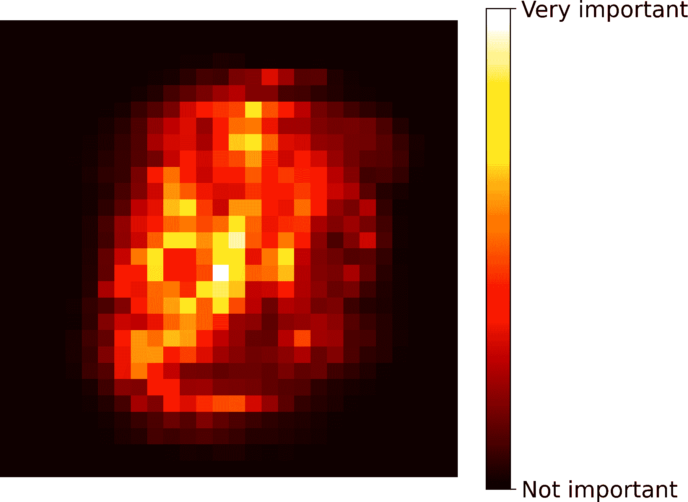
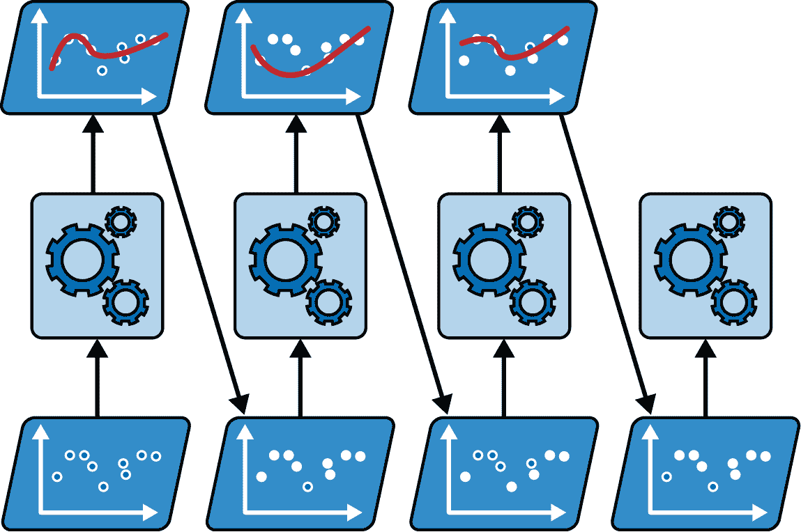
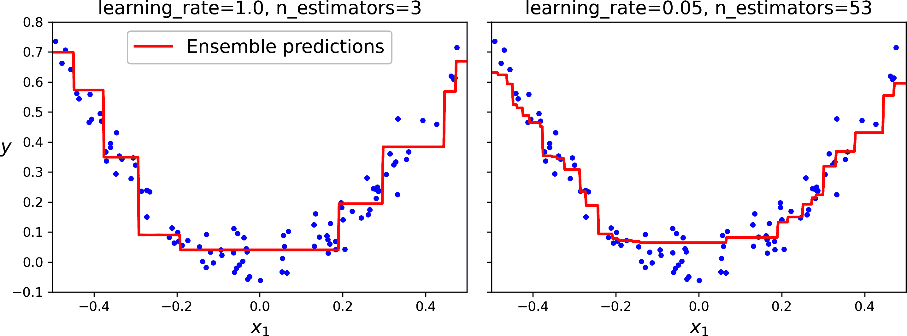

# 第六章：集成学习和随机森林

假设你向成千上万的随机人群提出一个复杂问题，然后汇总他们的答案。在许多情况下，你会发现这个汇总的答案比专家的答案更好。这被称为**群体智慧**。同样，如果你汇总了一组预测者的预测（例如分类器或回归器），你通常会得到比最佳单个预测者更好的预测。一组预测者被称为**集成**；因此，这种技术被称为**集成学习**，而集成学习算法被称为**集成方法**。

作为集成方法的一个例子，你可以训练一组决策树分类器，每个分类器在不同的训练集随机子集上。然后你可以获得所有单个树的预测，得到投票最多的类别就是集成的预测（参见第五章中的最后一个练习）。这样的决策树集成被称为**随机森林**，尽管它很简单，但这是今天最强大的机器学习算法之一。

如第二章所述，你通常会在项目接近尾声时使用集成方法，一旦你已经构建了几个好的预测者，将它们组合成一个更好的预测者。事实上，机器学习竞赛中的获胜方案通常涉及几个集成方法——最著名的是在[Netflix Prize 竞赛](https://en.wikipedia.org/wiki/Netflix_Prize)中。然而，也有一些缺点：集成学习比使用单个模型需要更多的计算资源（无论是训练还是推理），它可能更复杂，部署和管理起来更困难，而且预测结果更难解释。但优点通常大于缺点。

在本章中，我们将探讨最流行的集成方法，包括投票分类器、袋装和粘贴集成、随机森林、提升和堆叠集成。

# 投票分类器

假设你已经训练了几个分类器，每个分类器的准确率大约为 80%。你可能有一个逻辑回归分类器、一个 SVM 分类器、一个随机森林分类器、一个**k**-最近邻分类器，可能还有更多（参见图 6-1）。


###### 图 6-1 训练多种分类器

创建一个更好的分类器的一个非常简单的方法是汇总每个分类器的预测：得到最多投票的类别就是集成的预测。这种多数投票分类器被称为**硬投票**分类器（参见图 6-2）。


###### 图 6-2\. 硬投票分类器预测

令人惊讶的是，这种投票分类器通常比集成中最好的分类器具有更高的准确率。实际上，即使每个分类器都是一个*弱学习器*（意味着它仅略好于随机猜测），只要集成中有足够数量的弱学习器，并且它们足够多样化（即，如果它们关注数据的不同方面并犯不同类型的错误），集成仍然可以成为一个*强学习器*（实现高准确率）。

这怎么可能呢？以下类比可以帮助揭示这个谜团。假设您有一个略微偏颇的硬币，其出现正面的概率为 51%，出现反面的概率为 49%。如果您抛掷它 1,000 次，您通常会得到大约 510 次正面和 490 次反面，因此大多数是正面。如果您进行数学计算，您会发现 1,000 次抛掷后获得多数正面的概率接近 75%。您抛掷硬币的次数越多，概率就越高（例如，抛掷 10,000 次，概率超过 97%）。这是由于大数定律：随着您不断抛掷硬币，正面比率越来越接近正面的概率（51%）。图 6-3 展示了 10 次有偏硬币抛掷。您可以看到，随着抛掷次数的增加，正面比率接近 51%。最终，所有 10 次抛掷的结果都接近 51%，并且始终高于 50%。


###### 图 6-3\. 大数定律

类似地，假设您构建了一个包含 1,000 个分类器的集成，这些分类器各自正确率仅为 51%（略好于随机猜测）。如果您预测多数投票的类别，您可以期望达到高达 75%的准确率！然而，这只在所有分类器完全独立、犯不相关的错误的情况下才成立，这显然是不可能的，因为它们是在相同的数据上训练的。它们很可能会犯相同类型的错误，因此会有许多多数投票选择错误的类别，从而降低集成方法的准确性。

###### 小贴士

集成方法在预测因子尽可能相互独立时效果最佳。获得多样化分类器的一种方法是通过使用非常不同的算法来训练它们。这增加了它们犯不同类型错误的几率，从而提高了集成方法的准确性。您还可以通过调整模型超参数来获得多样化的模型，或者在不同的数据子集上训练模型，正如我们将看到的。

Scikit-Learn 提供了一个非常容易使用的`VotingClassifier`类：只需给它一个名称/预测器对的列表，就像使用一个正常的分类器一样。让我们在月亮数据集（在第五章中介绍）上试试它。我们将加载并分割月亮数据集为训练集和测试集，然后我们将创建并训练一个由三个不同分类器组成的投票分类器：

```py
from sklearn.datasets import make_moons
from sklearn.ensemble import RandomForestClassifier, VotingClassifier
from sklearn.linear_model import LogisticRegression
from sklearn.model_selection import train_test_split
from sklearn.svm import SVC

X, y = make_moons(n_samples=500, noise=0.30, random_state=42)
X_train, X_test, y_train, y_test = train_test_split(X, y, random_state=42)

voting_clf = VotingClassifier(
    estimators=[
        ('lr', LogisticRegression(random_state=42)),
        ('rf', RandomForestClassifier(random_state=42)),
        ('svc', SVC(random_state=42))
    ]
)
voting_clf.fit(X_train, y_train)
```

当你拟合一个`VotingClassifier`时，它会克隆每一个估计器并拟合克隆。原始估计器可以通过`estimators`属性访问，而拟合的克隆可以通过`estimators_`属性访问。如果你更喜欢字典而不是列表，可以使用`named_estimators`或`named_estimators_`。首先，让我们看看每个拟合分类器在测试集上的准确率：

```py
>>> for name, clf in voting_clf.named_estimators_.items():
...     print(name, "=", clf.score(X_test, y_test))
...
lr = 0.864
rf = 0.896
svc = 0.896
```

当你调用投票分类器的`predict()`方法时，它执行硬投票。例如，投票分类器预测测试集的第一个实例为类别 1，因为三个分类器中有两个预测这个类别：

```py
>>> voting_clf.predict(X_test[:1])
array([1])
>>> [clf.predict(X_test[:1]) for clf in voting_clf.estimators_]
[array([1]), array([1]), array([0])]
```

现在让我们看看投票分类器在测试集上的性能：

```py
>>> voting_clf.score(X_test, y_test)
0.912
```

这就是结果！投票分类器的性能超过了所有单个分类器。

如果所有分类器都能够估计类概率（即，如果它们都有`predict_proba()`方法），那么你应该通常告诉 Scikit-Learn 预测所有单个分类器平均的最高类概率，这被称为*软投票*。它通常比硬投票有更高的性能，因为它给予高度自信的投票更多的权重。你只需要设置投票分类器的`voting`超参数为`"soft"`，并确保所有分类器都能估计类概率。默认情况下，`SVC`类并不是这样，所以你需要将其`probability`超参数设置为`True`（这将使`SVC`类使用交叉验证来估计类概率，从而减慢训练速度，并且它将添加一个`predict_proba()`方法）。让我们试试看：

```py
>>> voting_clf.voting = "soft"
>>> voting_clf.named_estimators["svc"].probability = True
>>> voting_clf.fit(X_train, y_train)
>>> voting_clf.score(X_test, y_test)
0.92
```

我们仅通过使用软投票就达到了 92%的准确率——这已经很不错了！

###### 小贴士

当估计的概率很好地校准时，软投票效果最好。如果不这样，可以使用`sklearn.calibration.CalibratedClassifierCV`来校准它们（参见第三章分类章节）。

# 打包和粘贴

获取一组不同分类器的一种方法就是使用非常不同的训练算法，正如刚才讨论的那样。另一种方法是使用相同的训练算法为每个预测器，但它们在不同的随机训练集子集上训练。当采样是*带有*替换时，这种方法被称为[*打包*](https://homl.info/20)（简称为*bootstrap aggregating*），^(1)。当采样是*不带*替换时，它被称为[*粘贴*](https://homl.info/21)。⁠^(4)

换句话说，Bagging 和 Pasting 都允许在多个预测器中对训练实例进行多次采样，但只有 Bagging 允许对同一个预测器进行多次采样。这个过程在图 6-4 中表示。


###### 图 6-4\. Bagging 和 Pasting 涉及在训练集的不同随机样本上训练多个预测器

一旦所有预测器都经过训练，集成可以通过简单地聚合所有预测器的预测来对新实例进行预测。对于分类，聚合函数通常是*统计众数*（即最频繁的预测，就像在硬投票分类器中一样），而对于回归，通常是平均值。每个单独的预测器比在原始训练集上训练时的偏差更高，但聚合减少了偏差和方差。⁠^(5)

为了理解为什么会出现这种情况，想象一下你训练了两个回归器来预测房价。第一个回归器平均低估了房价 40,000 美元，而第二个回归器平均高估了房价 50,000 美元。假设这些回归器是 100%独立的，并且它们的预测遵循正态分布，如果你计算这两个预测的平均值，结果将平均高估房价（-40,000 + 50,000）/2 = 5,000 美元：这比偏差低得多！同样，如果两个预测器的标准差都是 10,000 美元（即方差为 100,000,000），那么平均预测的方差将是（10,000² + 10,000²）/2² = 50,000,000（即标准差将是 7,071 美元）。方差减半了！

在实践中，集成通常具有与原始训练集上训练的单个预测器相似的偏差，但方差更低。因此，它最适合高方差和低偏差的模型（例如决策树集成，而不是线性回归器的集成）。

###### 小贴士

当你的数据集有噪声或你的模型容易过拟合（例如深度决策树）时，请优先选择 Bagging。否则，请优先选择 Pasting，因为它在训练过程中避免了冗余，从而使其在计算上更有效率。

如图 6-4 所示，预测器可以通过不同的 CPU 核心甚至不同的服务器并行训练。同样，预测也可以并行进行。这也是 Bagging 和 Pasting 如此受欢迎的原因之一：它们的可扩展性非常好。

## Scikit-Learn 中的 Bagging 和 Pasting

Scikit-Learn 提供了对 bagging 和 pasting 的简单 API：`BaggingClassifier`类（或用于回归的`BaggingRegressor`）。以下代码训练了一个包含 500 个决策树分类器的集成：⁠^(6) 每个分类器都是通过对训练集进行有放回的随机采样（每个分类器 100 个训练实例）进行训练的（这是一个 bagging 的例子，但如果你想使用 pasting，只需设置`bootstrap=False`）。`n_jobs`参数告诉 Scikit-Learn 用于训练和预测的 CPU 核心数，`–1`告诉 Scikit-Learn 使用所有可用的核心：

```py
from sklearn.ensemble import BaggingClassifier
from sklearn.tree import DecisionTreeClassifier

bag_clf = BaggingClassifier(DecisionTreeClassifier(), n_estimators=500,
                            max_samples=100, n_jobs=-1, random_state=42)
bag_clf.fit(X_train, y_train)
```

###### 注意

如果基础分类器可以估计类概率（即，如果它有`predict_proba()`方法），则`BaggingClassifier`会自动执行软投票而不是硬投票，这是决策树分类器的情况。

图 6-5 比较了单个决策树的决策边界与在月亮数据集上训练的包含 500 棵树的 bagging 集成决策边界（来自前面的代码）。如图所示，集成预测的泛化能力可能会比单个决策树的预测更好：集成具有可比的偏差但较小的方差（它在训练集上犯的错误数量大致相同，但决策边界不太规则）。

Bagging 在训练每个预测器的子集时引入了更多的多样性，因此 bagging 最终具有比 pasting 略高的偏差；但额外的多样性也意味着预测器最终相关性较低，因此集成的方差减少。总的来说，bagging 通常会产生更好的模型，这也是为什么它通常更受欢迎的原因。但如果你有额外的空闲时间和 CPU 能力，你可以使用交叉验证来评估 bagging 和 pasting，并选择效果最好的一个。


###### 图 6-5\. 单个决策树（左）与包含 500 棵树的 bagging 集成（右）

## 袋外评估

在 bagging 中，某些训练实例可能被多次采样，而其他实例可能根本不会被采样。默认情况下，`BaggingClassifier`使用有放回的方式采样*m*个训练实例（`bootstrap=True`），其中*m*是训练集的大小。通过这个过程，可以数学上证明每个预测器平均只有大约 63%的训练实例被采样。⁠^(7) 未被采样的剩余 37%的训练实例被称为*袋外*（OOB）实例。请注意，它们不是所有预测器的 37%都相同。

可以使用 OOB 实例来评估袋装集成，无需单独的验证集：实际上，如果有足够的估计器，那么训练集中的每个实例很可能是几个估计器的 OOB 实例，因此可以使用这些估计器为该实例做出公平的集成预测。一旦为每个实例做出预测，就可以计算集成预测的准确率（或任何其他指标）。

在 Scikit-Learn 中，当你创建`BaggingClassifier`时，可以将`oob_score=True`设置为请求训练后的自动 OOB 评估。以下代码演示了这一点。结果评估分数可在`oob_score_`属性中找到：

```py
>>> bag_clf = BaggingClassifier(DecisionTreeClassifier(), n_estimators=500,
...                             oob_score=True, n_jobs=-1, random_state=42)
...
>>> bag_clf.fit(X_train, y_train)
>>> bag_clf.oob_score_
0.896
```

根据这种 OOB 评估，这个`BaggingClassifier`很可能在测试集中达到大约 89.6%的准确率。让我们来验证这一点：

```py
>>> from sklearn.metrics import accuracy_score
>>> y_pred = bag_clf.predict(X_test)
>>> accuracy_score(y_test, y_pred)
0.92
```

我们在测试中达到了 92.0%的准确率。OOB 评估稍微有些悲观。

每个训练实例的 OOB 决策函数也通过`oob_decision_function_`属性提供。由于基本估计器有`predict_proba()`方法，决策函数返回每个训练实例的类概率。例如，OOB 评估估计第一个训练实例有 67.6%的概率属于正类，有 32.4%的概率属于负类：

```py
>>> bag_clf.oob_decision_function_[:3]  # probas for the first 3 instances
array([[0.32352941, 0.67647059],
 [0.3375    , 0.6625    ],
 [1\.        , 0\.        ]])
```

## 随机补丁和随机子空间

`BaggingClassifier`类支持采样特征。采样由两个超参数控制：`max_features`和`bootstrap_features`。它们与`max_samples`和`bootstrap`的工作方式相同，但用于特征采样而不是实例采样。因此，每个预测器将在输入特征的随机子集上训练。

当你处理高维输入（如图像）时，这项技术特别有用，因为它可以显著加快训练速度。同时采样训练实例和特征被称为[*随机补丁*方法](https://homl.info/22)。⁠^(8) 保持所有训练实例（通过设置`bootstrap=False`和`max_samples=1.0`），但采样特征（通过设置`bootstrap_features`为`True`和/或`max_features`为一个小于`1.0`的值）被称为[*随机子空间*方法](https://homl.info/23)。⁠^(9)

采样特征导致预测器多样性更高，以略微增加的偏差换取更低的方差。

# 随机森林

正如我们讨论过的，一个 [随机森林](https://homl.info/24)⁠^(10) 是决策树的集成，通常通过 bagging 方法（或有时是粘贴）训练，通常将 `max_samples` 设置为训练集的大小。您不需要构建一个 `BaggingClassifier` 并传递一个 `DecisionTreeClassifier`，而是可以使用 `RandomForestClassifier` 类，它更方便且针对决策树进行了优化⁠^(11)（类似地，还有一个 `RandomForestRegressor` 类用于回归任务）。以下代码使用所有可用的 CPU 核心，训练了一个包含 500 棵树、每棵树最多 16 个叶节点的随机森林分类器：

```py
from sklearn.ensemble import RandomForestClassifier

rnd_clf = RandomForestClassifier(n_estimators=500, max_leaf_nodes=16,
                                 n_jobs=-1, random_state=42)
rnd_clf.fit(X_train, y_train)

y_pred_rf = rnd_clf.predict(X_test)
```

除了少数例外，`RandomForestClassifier` 具有与 `DecisionTreeClassifier` 相同的所有超参数（用于控制树的生长方式），以及 `BaggingClassifier` 的所有超参数，用于控制集成本身。

`RandomForestClassifier` 类在生长树时引入了额外的随机性：在分割节点时，它不是搜索最佳特征（参见第五章），而是在特征的一个随机子集中搜索最佳特征。默认情况下，它采样 $StartRoot n EndRoot$ 个特征（其中 *n* 是特征的总数）。该算法导致树多样性增加，这（再次）以更高的偏差换取了更低的方差，通常会产生更好的整体模型。因此，以下 `BaggingClassifier` 等同于之前的 `RandomForestClassifier`：

```py
bag_clf = BaggingClassifier(
    DecisionTreeClassifier(max_features="sqrt", max_leaf_nodes=16),
    n_estimators=500, n_jobs=-1, random_state=42)
```

## 额外树

当在随机森林中生长一棵树时，在每个节点上仅考虑随机子集的特征进行分割（如前所述）。通过为每个特征使用随机阈值而不是搜索最佳可能的阈值（如常规决策树所做的那样），可以使树变得更加随机。为此，在创建 `DecisionTreeClassifier` 时，只需将 `splitter="random"` 设置即可。

这样的极端随机树森林被称为 [*极端随机树*](https://homl.info/25)⁠^(12)（或简称为 *extra-trees*）集成。再次强调，这种技术以更多的偏差换取了更低的方差，因此，如果您遇到过拟合，尤其是在有噪声和/或高维数据集的情况下，它们可能比常规随机森林表现更好。与常规随机森林相比，额外树分类器训练得也更快，因为找到每个节点上每个特征的最佳可能阈值是随机森林中生长树时最耗时的任务之一。

您可以使用 Scikit-Learn 的 `ExtraTreesClassifier` 类创建一个额外的树分类器。它的 API 与 `RandomForestClassifier` 类相同，只是 `bootstrap` 默认为 `False`。同样，`ExtraTreesRegressor` 类的 API 与 `RandomForestRegressor` 类相同，只是 `bootstrap` 默认为 `False`。

###### 提示

正如决策树类别一样，最近 Scikit-Learn 版本的随机森林类别和额外树类别原生支持缺失值，无需使用填充器。

## 特征重要性

随机森林的另一个优点是它们使得测量每个特征的相对重要性变得容易。Scikit-Learn 通过查看使用该特征的树节点在森林中所有树上的平均纯度降低程度来衡量一个特征的重要性。更精确地说，这是一个加权平均值，其中每个节点的权重等于与之关联的训练样本数量（参见第五章 Chapter 5）。

Scikit-Learn 在训练后自动为每个特征计算这个分数，然后调整结果，使得所有重要性的总和等于 1。你可以通过`feature_importances_`变量访问结果。例如，以下代码在鸢尾花数据集（在第四章 Chapter 4 中介绍）上训练了一个`RandomForestClassifier`，并输出了每个特征的重要性。看起来最重要的特征是花瓣长度（44%）和宽度（42%），而与花瓣长度和宽度相比，萼片长度和宽度则相对不重要（分别为 11%和 2%）：

```py
>>> from sklearn.datasets import load_iris
>>> iris = load_iris(as_frame=True)
>>> rnd_clf = RandomForestClassifier(n_estimators=500, random_state=42)
>>> rnd_clf.fit(iris.data, iris.target)
>>> for score, name in zip(rnd_clf.feature_importances_, iris.data.columns):
...     print(round(score, 2), name)
...
0.11 sepal length (cm)
0.02 sepal width (cm)
0.44 petal length (cm)
0.42 petal width (cm)
```

类似地，如果你在 MNIST 数据集（在第三章 Chapter 3 中介绍）上训练一个随机森林分类器，并绘制每个像素的重要性，你将得到图 6-6 中所示的形象。



###### 图 6-6\. MNIST 像素重要性（根据随机森林分类器）

随机森林非常适合快速了解哪些特征真正重要，特别是如果你需要执行特征选择。

# 提升

*提升*（最初称为*假设提升*）指的是任何可以将多个弱学习器组合成强学习器的集成方法。大多数提升方法的一般思想是顺序训练预测器，每个预测器都试图纠正其前驱。有许多提升方法可用，但最流行的是[*AdaBoost*](https://homl.info/26)⁠^(13)（即*自适应提升*）和*梯度提升*。让我们从 AdaBoost 开始。

## AdaBoost

新预测器纠正其前驱的一种方法是对前驱欠拟合的训练实例给予更多的关注。这导致新预测器越来越多地关注困难案例。这是 AdaBoost 使用的技术。

例如，当训练一个 AdaBoost 分类器时，算法首先训练一个基分类器（例如决策树）并使用它对训练集进行预测。然后算法增加被错误分类的训练实例的相对权重。接着它使用更新后的权重训练第二个分类器，并在训练集上再次进行预测，更新实例权重，依此类推（参见 图 6-7）。



###### 图 6-7\. AdaBoost 顺序训练与实例权重更新

图 6-8 展示了五个连续预测器在月亮数据集上的决策边界（在这个例子中，每个预测器是一个具有 RBF 内核的高度正则化的 SVM 分类器）。⁠^(14) 第一个分类器错误地分类了许多实例，因此它们的权重被提升。因此，第二个分类器在这些实例上做得更好，依此类推。右侧的图表示相同的预测器序列，除了学习率减半（即，在每次迭代中错误分类的实例权重提升较少）。如您所见，这种顺序学习技术与梯度下降有一些相似之处，除了 AdaBoost 不是调整单个预测器的参数以最小化成本函数，而是将预测器添加到集成中，逐渐使其变得更好。


###### 图 6-8\. 连续预测器的决策边界

###### 警告

这种顺序学习技术有一个重要的缺点：由于每个预测器只能在之前的预测器被训练和评估之后才能进行训练，因此无法并行化。因此，它的扩展性不如 bagging 或 pasting。

一旦所有预测器都经过训练，集成进行预测的方式与 bagging 或 pasting 非常相似，除了预测器的权重取决于它们在加权训练集上的整体准确性。

让我们更仔细地看看 AdaBoost 算法。每个实例权重 *w*^((*i*)) 初始设置为 1/*m*，因此它们的总和为 1。首先训练一个预测器，并在训练集上计算其加权错误率 *r*[1]；参见 方程式 6-1。

##### 方程式 6-1\. 第 j 个预测器的加权错误率

<mrow><msub><mi>r</mi><mi>j</mi></msub> <mo>=</mo> <mstyle scriptlevel="0" displaystyle="true"><mrow><munderover><mo>∑</mo> <mstyle scriptlevel="0" displaystyle="false"><mrow><mfrac linethickness="0pt"><mrow><mi>i</mi><mo>=</mo><mn>1</mn></mrow> <mrow><msubsup><mover accent="true"><mi>y</mi><mo>^</mo></mover> <mi>j</mi> <mrow><mo>(</mo><mi>i</mi><mo>)</mo></mrow></msubsup> <mo>≠</mo> <msup><mi>y</mi> <mrow><mo>(</mo><mi>i</mi><mo>)</mo></mrow></msup></mrow></mfrac></mrow></mstyle> <mi>m</mi></munderover> <msup><mi>w</mi><mrow><mo>(</mo><mi>i</mi><mo>)</mo></mrow></msup></mrow></mstyle> <mtext>其中</mtext> <msubsup><mover accent="true"><mi>y</mi><mo>^</mo></mover> <mi>j</mi><mrow><mo>(</mo><mi>i</mi><mo>)</mo></mrow></msubsup> <mtext>是</mtext> <mtext>第</mtext> <msup><mi>j</mi><mtext>个</mtext></msup> <mtext>预测器的</mtext> <mtext>预测结果</mtext><mtext>针对</mtext> <mtext>第</mtext> <msup><mi>i</mi> <mtext>个</mtext></msup> <mtext>实例</mtext></mrow>

预测器的权重 *α*[*j*] 然后通过方程 6-2 计算，其中 *η* 是学习率超参数（默认为 1）。⁠^(15) 预测器越准确，其权重越高。如果只是随机猜测，那么其权重将接近零。然而，如果它通常错误（即，不如随机猜测准确），那么其权重将是负数。

##### 方程 6-2\. 预测器权重

$dollar-sign alpha Subscript j Baseline equals eta log StartFraction 1 minus r Subscript j Baseline Over r Subscript j Baseline EndFraction dollar-sign$

接下来，AdaBoost 算法更新实例权重，使用方程 6-3，这增加了错误分类实例的权重，并鼓励下一个预测器更加关注它们。

##### 方程 6-3\. 权重更新规则

$dollar-sign StartLayout 1st Row 1st Column Blank 2nd Column for i equals 1 comma 2 comma period period period comma m 2nd Row 1st Column Blank 2nd Column w Superscript left-parenthesis i right-parenthesis Baseline left-arrow StartLayout Enlarged left-brace 1st Row  w Superscript left-parenthesis i right-parenthesis Baseline if ModifyingAbove y With caret Superscript left-parenthesis i right-parenthesis Baseline equals y Superscript left-parenthesis i right-parenthesis Baseline 2nd Row  w Superscript left-parenthesis i right-parenthesis Baseline exp left-parenthesis alpha Subscript j Baseline right-parenthesis if ModifyingAbove y With caret Superscript left-parenthesis i right-parenthesis Baseline not-equals y Superscript left-parenthesis i right-parenthesis EndLayout EndLayout dollar-sign$

然后将所有实例权重归一化，以确保它们的总和再次为 1（即，它们被除以 $sigma-summation Underscript i equals 1 Overscript m Endscripts w Superscript left-parenthesis i right-parenthesis$ )。

最后，使用更新后的权重训练一个新的预测器，整个过程重复进行：计算新预测器的权重，更新实例权重，然后训练另一个预测器，依此类推。算法在达到所需预测器数量或找到完美预测器时停止。

为了进行预测，AdaBoost 简单地计算所有预测器的预测值，并使用预测器权重 *α*[*j*] 对其进行加权。预测类别是获得加权投票多数的类别（见方程 6-4）。

##### 方程 6-4\. AdaBoost 预测

<mrow><mover accent="true"><mi>y</mi> <mo>^</mo></mover> <mrow><mo>(</mo> <mi mathvariant="bold">x</mi> <mo>)</mo></mrow> <mo>=</mo> <munder><mo form="prefix">argmax</mo> <mi>k</mi></munder> <mrow><munderover><mo>∑</mo> <mfrac linethickness="0pt"><mstyle scriptlevel="1" displaystyle="false"><mrow><mi>j</mi><mo>=</mo><mn>1</mn></mrow></mstyle> <mstyle scriptlevel="1" displaystyle="false"><mrow><msub><mover accent="true"><mi>y</mi> <mo>^</mo></mover> <mi>j</mi></msub> <mrow><mo>(</mo><mi mathvariant="bold">x</mi><mo>)</mo></mrow><mo>=</mo><mi>k</mi></mrow></mstyle></mfrac> <mi>N</mi></munderover> <msub><mi>α</mi> <mi>j</mi></msub></mrow> <mtext>其中</mtext> <mi>N</mi> <mtext>是</mtext> <mtext>预测器</mtext> <mtext>的数量</mtext></mrow>

Scikit-Learn 使用 AdaBoost 的多分类版本，称为 [*SAMME*](https://homl.info/27)⁠^(16)（代表 *使用多类指数损失函数的阶跃式加性建模*）。当只有两个类别时，SAMME 等同于 AdaBoost。

以下代码使用 Scikit-Learn 的 `AdaBoostClassifier` 类（正如你所期望的，还有一个 `AdaBoostRegressor` 类）训练了一个基于 30 个 *决策树桩* 的 AdaBoost 分类器。决策树桩是一个 `max_depth=1` 的决策树——换句话说，由一个决策节点和两个叶节点组成的树。这是 `AdaBoostClassifier` 类的默认基础估计器：

```py
from sklearn.ensemble import AdaBoostClassifier

ada_clf = AdaBoostClassifier(
    DecisionTreeClassifier(max_depth=1), n_estimators=30,
    learning_rate=0.5, random_state=42, algorithm="SAMME")
ada_clf.fit(X_train, y_train)
```

###### 提示

如果你的 AdaBoost 集成对训练集过拟合，你可以尝试减少估计器的数量或更强烈地正则化基础估计器。

## 梯度提升

另一个非常流行的提升算法是[*梯度提升*](https://homl.info/28)。⁠^(17) 就像 AdaBoost 一样，梯度提升通过顺序地向集成中添加预测器来工作，每个预测器都纠正其前一个预测器。然而，与 AdaBoost 在每次迭代中调整实例权重不同，这种方法试图将新预测器拟合到前一个预测器产生的 *残差误差*。

让我们通过一个简单的回归示例来了解，使用决策树作为基础预测器；这被称为 *梯度树提升*，或 *梯度提升回归树*（GBRT）。首先，让我们生成一个有噪声的二次数据集，并将其拟合到 `DecisionTreeRegressor`：

```py
import numpy as np
from sklearn.tree import DecisionTreeRegressor

m = 100  # number of instances
rng = np.random.default_rng(seed=42)
X = rng.random((m, 1)) - 0.5
noise = 0.05 * rng.standard_normal(m)
y = 3 * X[:, 0] ** 2 + noise  # y = 3x² + Gaussian noise

tree_reg1 = DecisionTreeRegressor(max_depth=2, random_state=42)
tree_reg1.fit(X, y)
```

接下来，我们将在第一个预测器的残差误差上训练第二个`DecisionTreeRegressor`：

```py
y2 = y - tree_reg1.predict(X)
tree_reg2 = DecisionTreeRegressor(max_depth=2, random_state=43)
tree_reg2.fit(X, y2)
```

然后我们将在第二个预测器的残差误差上训练第三个回归器：

```py
y3 = y2 - tree_reg2.predict(X)
tree_reg3 = DecisionTreeRegressor(max_depth=2, random_state=44)
tree_reg3.fit(X, y3)
```

现在我们有一个包含三棵树的集成。它可以通过简单地将所有树的预测相加来对新实例进行预测：

```py
>>> X_new = np.array([[-0.4], [0.], [0.5]])
>>> sum(tree.predict(X_new) for tree in (tree_reg1, tree_reg2, tree_reg3))
array([0.57356534, 0.0405142 , 0.66914249])
```

图 6-9 展示了左列中这三棵树的预测和右列中集成的预测。在第一行，集成只有一棵树，所以其预测与第一棵树的预测完全相同。在第二行，新树是在第一棵树的残差误差上训练的。在右边可以看到，集成的预测等于前两棵树的预测之和。同样，在第三行，另一棵树是在第二棵树的残差误差上训练的。您可以看到，随着树被添加到集成中，集成的预测逐渐变得更好。

您可以使用 Scikit-Learn 的`GradientBoostingRegressor`类来更容易地训练 GBRT 集成（还有用于分类的`GradientBoostingClassifier`类）。与`RandomForestRegressor`类类似，它具有控制决策树增长的超参数（例如，`max_depth`、`min_samples_leaf`），以及控制集成训练的超参数，例如树的数量（`n_estimators`）。以下代码创建了与之前相同的集成：

```py
from sklearn.ensemble import GradientBoostingRegressor

gbrt = GradientBoostingRegressor(max_depth=2, n_estimators=3,
                                 learning_rate=1.0, random_state=42)
gbrt.fit(X, y)
```


###### 图 6-9。在此梯度提升的描述中，第一个预测器（左上角）是正常训练的，然后每个连续的预测器（中间左和底部左）是在前一个预测器的残差上训练的；右列显示了结果集成的预测

`learning_rate`超参数缩放每个树的贡献。如果您将其设置为低值，例如`0.05`，则需要在集成中添加更多树来拟合训练集，但预测通常泛化得更好。这是一种称为*收缩*的正则化技术。图 6-10 显示了使用不同超参数训练的两个 GBRT 集成：左边的那个没有足够的树来拟合训练集，而右边的那个数量大约是合适的。如果我们添加更多树，GBRT 将开始过度拟合训练集。通常，您可以使用交叉验证来找到最佳的学习率，使用`GridSearchCV`或`RandomizedSearchCV`。



###### 图 6-10。GBRT 集成：不足预测因子（左）和恰好足够的预测因子（右）

为了找到最佳树的数量，你也可以执行交叉验证，但有一个更简单的方法：如果你将 `n_iter_no_change` 超参数设置为一个整数值，比如 10，那么 `GradientBoostingRegressor` 将在训练过程中自动停止添加更多树，如果它看到最后 10 棵树没有帮助。这仅仅是提前停止（在第四章中介绍），但需要一点耐心：它在停止之前可以容忍几轮没有进展。让我们使用提前停止来训练集成：

```py
gbrt_best = GradientBoostingRegressor(
    max_depth=2, learning_rate=0.05, n_estimators=500,
    n_iter_no_change=10, random_state=42)
gbrt_best.fit(X, y)
```

如果你将 `n_iter_no_change` 设置得太低，训练可能会过早停止，模型将欠拟合。但如果你设置得太高，它将过拟合。我们还设置了一个相当小的学习率和高数量的估计器，但训练的集成中实际估计器的数量要低得多，这要归功于提前停止：

```py
>>> gbrt_best.n_estimators_
53
```

当设置 `n_iter_no_change` 时，`fit()` 方法会自动将训练集分成一个较小的训练集和一个验证集：这允许它在每次添加新树时评估模型的性能。验证集的大小由 `validation_fraction` 超参数控制，默认为 10%。`tol` 超参数决定了仍然被视为可忽略的最大性能提升。默认值为 0.0001。

`GradientBoostingRegressor` 类也支持一个 `subsample` 超参数，该参数指定了用于训练每棵树的训练实例的分数。例如，如果 `subsample=0.25`，则每棵树将在随机选择的 25% 的训练实例上训练。你现在可能已经猜到了，这种技术以更高的偏差换取了更低的方差。它还大大加快了训练速度。这被称为 *随机梯度提升*。

## 基于直方图的梯度提升

Scikit-Learn 还提供了一个针对大型数据集优化的 GBRT 实现：*基于直方图的梯度提升*（HGB）。它通过将输入特征分箱，用整数替换它们来实现。分箱的数量由 `max_bins` 超参数控制，默认为 255，不能设置得比这更高。分箱可以大大减少训练算法需要评估的可能阈值数量。此外，使用整数使得可以使用更快、更节省内存的数据结构。而且，构建分箱的方式消除了在训练每棵树时对特征排序的需要。

因此，这个实现的计算复杂度为 *O*(*b*×*m*)，而不是 *O*(*n*×*m*×log(*m*))，其中 *b* 是分箱的数量，*m* 是训练实例的数量，*n* 是特征的数量。在实践中，这意味着 HGB 可以在大型数据集上比常规 GBRT 快数百倍进行训练。然而，分箱会导致精度损失，这充当正则化器：根据数据集的不同，这可能会帮助减少过拟合，或者可能导致欠拟合。

Scikit-Learn 为 HGB 提供了两个类：`HistGradientBoostingRegressor`和`HistGradientBoostingClassifier`。它们与`GradientBoostingRegressor`和`GradientBoostingClassifier`类似，但有几个显著的区别：

+   如果实例数量大于 10,000，则会自动激活早期停止。您可以通过将`early_stopping`超参数设置为`True`或`False`来始终开启或始终关闭早期停止。

+   不支持子采样。

+   `n_estimators`被重命名为`max_iter`。

+   可以调整的唯一决策树超参数是`max_leaf_nodes`、`min_samples_leaf`、`max_depth`和`max_features`。

HGB 类原生支持缺失值以及分类特征。这大大简化了预处理工作。然而，分类特征必须表示为从 0 到`max_bins`以下数字的整数。您可以使用`OrdinalEncoder`来完成这项工作。例如，以下是如何为第二章中介绍的加利福尼亚住房数据集构建和训练完整管道的方法：

```py
from sklearn.pipeline import make_pipeline
from sklearn.compose import make_column_transformer
from sklearn.ensemble import HistGradientBoostingRegressor
from sklearn.preprocessing import OrdinalEncoder

hgb_reg = make_pipeline(
    make_column_transformer((OrdinalEncoder(), ["ocean_proximity"]),
                            remainder="passthrough",
                            force_int_remainder_cols=False),
    HistGradientBoostingRegressor(categorical_features=[0], random_state=42)
)
hgb_reg.fit(housing, housing_labels)
```

整个管道几乎与导入一样短！不需要填充器、缩放器或独热编码器，这非常方便。请注意，`categorical_features`必须设置为分类列的索引（或布尔数组）。在不进行任何超参数调整的情况下，此模型产生的 RMSE 约为 47,600，这并不算太差。

简而言之，当您拥有相当大的数据集时，HGB 是一个很好的选择，尤其是当它包含分类特征和缺失值时：它表现良好，不需要太多的预处理工作，训练速度快。然而，由于分箱，它可能比 GBRT 略逊一筹，因此您可能想尝试两者。

###### 小贴士

Python 机器学习生态系统中提供了几种梯度提升的优化实现：特别是[XGBoost](https://github.com/dmlc/xgboost)、[CatBoost](https://catboost.ai)和[LightGBM](https://lightgbm.readthedocs.io)。这些库已经存在了几年。它们都是专门针对梯度提升的，它们的 API 与 Scikit-Learn 的非常相似，并且提供了许多附加功能，包括使用 GPU 的硬件加速；您绝对应该检查它们！此外，[Yggdrasil 决策森林（YDF）](https://ydf.readthedocs.io)提供了各种随机森林算法的优化实现。

# 堆叠

本章我们将讨论的最后一种集成方法是称为*堆叠*（简称[*堆叠泛化*](https://homl.info/29)）。它基于一个简单的想法：我们为什么不训练一个模型来执行这个聚合，而不是使用简单的函数（如硬投票）来聚合集成中所有预测器的预测？图 6-11 展示了这样一个集成在新的实例上执行回归任务。底部的三个预测器预测不同的值（3.1、2.7 和 2.9），然后最终的预测器（称为*混合器*或*元学习器*）将这些预测作为输入并做出最终预测（3.0）。


###### 图 6-11\. 使用混合预测器聚合预测

要训练混合器，你首先需要构建混合训练集。你可以对集成中的每个预测器使用`cross_val_predict()`来获取原始训练集中每个实例的样本外预测（图 6-12），并将这些作为输入特征来训练混合器；目标可以直接从原始训练集中复制。请注意，无论原始训练集中的特征数量有多少（本例中只有一个），混合训练集将包含每个预测器的一个输入特征（本例中为三个）。一旦混合器被训练，基础预测器必须在完整的原始训练集上重新训练一次（因为`cross_val_predict()`无法访问已训练的估计器）。

实际上，可以通过这种方式训练几个不同的混合器（例如，一个使用线性回归，另一个使用随机森林回归）来获得一个完整的混合器层，然后在上面添加另一个混合器来生成最终预测，如图图 6-13 所示。通过这样做，你可能能够挤出更多性能，但这将增加训练时间和系统复杂性。


###### 图 6-12\. 在堆叠集成中训练混合器


###### 图 6-13\. 多层堆叠集成中的预测

Scikit-Learn 提供了两个用于堆叠集成的类：`StackingClassifier`和`StackingRegressor`。例如，我们可以用`StackingClassifier`替换本章开头在 moons 数据集上使用的`VotingClassifier`：

```py
from sklearn.ensemble import StackingClassifier

stacking_clf = StackingClassifier(
    estimators=[
        ('lr', LogisticRegression(random_state=42)),
        ('rf', RandomForestClassifier(random_state=42)),
        ('svc', SVC(probability=True, random_state=42))
    ],
    final_estimator=RandomForestClassifier(random_state=43),
    cv=5  # number of cross-validation folds
)
stacking_clf.fit(X_train, y_train)
```

对于每个预测器，如果可用，堆叠分类器将调用 `predict_proba()`；如果不可用，它将回退到 `decision_function()`，或者作为最后的手段调用 `predict()`。如果您不提供最终估计器，`StackingClassifier` 将使用 `LogisticRegression`，而 `StackingRegressor` 将使用 `RidgeCV`。

如果您在测试集上评估此堆叠模型，您将发现 92.8% 的准确率，这略好于使用软投票的投票分类器，其准确率为 92%。根据您的用例，这可能或可能不值得额外的复杂性和计算成本（因为所有其他模型之后还需要运行一个额外的模型）。

总之，集成方法非常灵活、强大且相对简单易用。如果您不小心，它们可能会过拟合，但这适用于每个强大的模型。表 6-1 总结了本章中讨论的所有技术及其使用时机。

表 6-1\. 何时使用每种集成学习方法

| 集成方法 | 何时使用 | 示例用例 |
| --- | --- | --- |
| Hard voting | 具有多个强大且多样化的分类器的平衡分类数据集。 | 垃圾邮件检测、情感分析、疾病分类 |
| Soft voting | 具有概率模型的分类数据集，其中置信度分数很重要。 | 医疗诊断、信用风险分析、假新闻检测 |
| Bagging | 具有高方差和容易过拟合模型的非结构化或半结构化数据集。 | 金融风险评估、电子商务推荐 |
| Pasting | 需要更多独立模型的结构化或半结构化数据集。 | 客户细分、蛋白质分类 |
| Random forest | 具有潜在噪声特征的高维结构化数据集。 | 客户流失预测、遗传数据分析、欺诈检测 |
| Extra-trees | 具有众多特征且速度关键、降低方差重要的大型结构化数据集。 | 实时欺诈检测、传感器数据分析 |
| AdaBoost | 小型至中型、低噪声、结构化数据集，其中弱学习器（例如，决策树桩）有助于可解释性。 | 信用评分、异常检测、预测性维护 |
| 梯度提升 | 需要高预测能力的中型至大型结构化数据集，即使需要额外的调整。 | 房价预测、风险评估、需求预测 |
| 基于直方图的梯度提升（HGB） | 训练速度和可扩展性关键的大型结构化数据集。 | 点击率预测、排名算法、广告中的实时竞价 |
| Stacking | 复杂、高维数据集，其中结合多个多样化的模型可以最大化准确性。 | 推荐引擎、自动驾驶车辆决策、Kaggle 竞赛 |

###### 提示

随机森林、AdaBoost、GBRT 和 HGB 是您应该首先测试的模型之一，尤其是在处理异构表格数据时。此外，由于它们需要的预处理很少，它们非常适合快速构建原型。

到目前为止，我们只看了监督学习技术。在下一章中，我们将转向最常见的不监督学习任务：降维。

# 练习

1.  如果你已经在完全相同的训练数据上训练了五个不同的模型，并且它们都达到了 95% 的精确度，你有没有可能将这五个模型结合起来得到更好的结果？如果是这样，如何？如果不是，为什么？

1.  硬投票分类器和软投票分类器之间的区别是什么？

1.  是否可以通过将 bagging 集成方法分布到多个服务器上来加速其训练？对于粘贴集成、提升集成、随机森林或堆叠集成又如何？

1.  出袋评估有什么好处？

1.  什么使得 extra-trees 集成比常规随机森林更加随机？这种额外的随机性如何帮助？extra-trees 分类器比常规随机森林快还是慢？

1.  如果你的 AdaBoost 集成欠拟合了训练数据，你应该调整哪些超参数，以及如何调整？

1.  如果你的梯度提升集成过度拟合了训练集，你应该增加还是减少学习率？

1.  加载 MNIST 数据集（在第三章中介绍），并将其分为训练集、验证集和测试集（例如，使用 50,000 个实例进行训练，10,000 个用于验证，10,000 个用于测试）。然后训练各种分类器，例如随机森林分类器、extra-trees 分类器和 SVM 分类器。接下来，尝试将它们组合成一个集成，在验证集上优于每个单独的分类器，使用软投票或硬投票。一旦找到这样的集成，就在测试集上尝试它。与单独的分类器相比，它的表现提高了多少？

1.  运行之前练习中的单个分类器，在验证集上进行预测，并创建一个新的训练集，其中包含由此产生的预测：每个训练实例都是一个向量，包含所有分类器对一个图像的预测集，目标是图像的类别。在这个新的训练集上训练一个分类器。恭喜你——你刚刚训练了一个混合器，它与分类器一起形成了一个堆叠集成！现在在测试集上评估这个集成。对于测试集中的每个图像，使用所有分类器进行预测，然后将预测输入到混合器以获得集成的预测。它与您之前训练的投票分类器相比如何？现在尝试再次使用 `StackingClassifier`。你得到更好的性能吗？如果是这样，为什么？

这些练习的解决方案可以在本章笔记本的末尾找到，在[*https://homl.info/colab-p*](https://homl.info/colab-p)。

^(1) 想象一下从一副扑克牌中随机抽取一张牌，写下它，然后将其放回牌堆中，再抽取下一张牌：同一张牌可能会被多次抽取。

^(2) Leo Breiman, “预测器的 Bagging”，*机器学习* 24, 第 2 期 (1996): 123–140.

^(3) 在统计学中，带替换的重新抽样称为 *bootstrapping*。

^(4) Leo Breiman, “在大型数据库和在线中对分类的小投票粘贴”，*机器学习* 36, 第 1-2 期 (1999): 85–103。

^(5) 偏差和方差在 第四章 中介绍。回想一下，高偏差意味着平均预测远低于目标，而高方差意味着预测非常分散。我们希望两者都低。

^(6) `max_samples` 可以设置为 0.0 到 1.0 之间的浮点数，在这种情况下，最大抽样实例数等于训练集大小乘以 `max_samples`。

^(7) 随着 *m* 的增长，这个比率趋近于 1 – exp(–1) ≈ 63%。

^(8) Gilles Louppe 和 Pierre Geurts, “基于随机补丁的集成”，*计算机科学讲义* 7523 (2012): 346–361.

^(9) Tin Kam Ho, “构建决策森林的随机子空间方法”，*IEEE 交易在模式分析与机器智能* 20, 第 8 期 (1998): 832–844.

^(10) Tin Kam Ho, “随机决策森林”，*第三国际文档分析与识别会议论文集* 1 (1995): 278.

^(11) 如果你想有一个除了决策树之外的其他东西的“袋”，`BaggingClassifier` 类仍然是有用的。

^(12) Pierre Geurts 等人，“极端随机树”，*机器学习* 63, 第 1 期 (2006): 3–42.

^(13) Yoav Freund 和 Robert E. Schapire, “在线学习的决策理论推广及其在提升中的应用”，*计算机与系统科学杂志* 55, 第 1 期 (1997): 119–139。

^(14) 这只是为了说明目的。SVMs 通常不是 AdaBoost 的好基预测器；它们速度慢，并且与它一起往往不稳定。

^(15) 原始的 AdaBoost 算法不使用学习率超参数。

^(16) 更多细节，请参阅 Ji Zhu 等人，“多类 AdaBoost”，*统计学及其应用* 2, 第 3 期 (2009): 349–360.

^(17) 梯度提升首先在 Leo Breiman 的 1997 年论文“Arcing the Edge”（https://homl.info/arcing）中提出，并在 Jerome H. Friedman 的 1999 年论文“Greedy Function Approximation: A Gradient Boosting Machine”（https://homl.info/gradboost）中进一步发展。

^(18) 大卫·H·沃尔珀特，“堆叠泛化”，*神经网络* 5, 第 2 期 (1992): 241–259.
