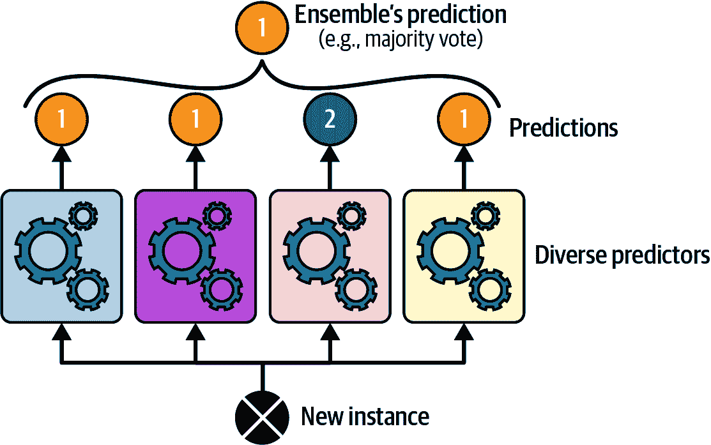
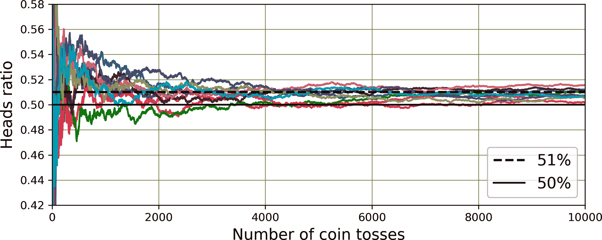
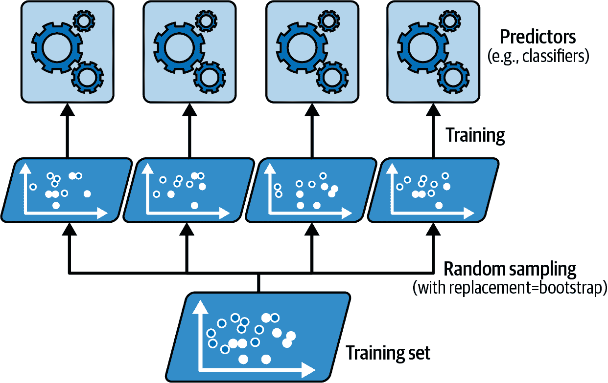
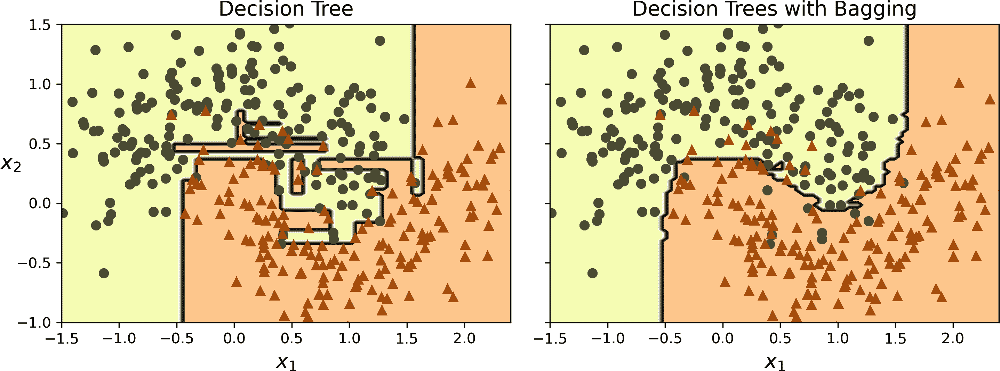

# 第六章\. 集成学习和随机森林

假设你向成千上万的随机人群提出一个复杂问题，然后汇总他们的答案。在许多情况下，你会发现这个汇总的答案比专家的答案更好。这被称为*群众的智慧*。同样，如果你汇总一组预测者的预测（例如分类器或回归器），你通常会得到比最佳单个预测者更好的预测。一组预测者被称为*集成*；因此，这种技术被称为*集成学习*，集成学习算法被称为*集成方法*。

作为集成方法的一个例子，你可以训练一组决策树分类器，每个分类器在不同的随机子集上。然后你可以获得所有单个树的预测，得到最多投票的类别就是集成预测（参见第五章的最后一个练习 Chapter 5）。这样的一组决策树被称为*随机森林*，尽管它很简单，但这是目前最强大的机器学习算法之一。

如第二章 Chapter 2 中所述，你通常会在项目后期使用集成方法，一旦你已经建立了一些好的预测者，将它们组合成一个更好的预测者。事实上，机器学习竞赛中的获胜解决方案通常涉及几个集成方法——最著名的是在[Netflix Prize 竞赛](https://en.wikipedia.org/wiki/Netflix_Prize)中。然而，也有一些缺点：集成学习比使用单个模型需要更多的计算资源（无论是训练还是推理），它可能更复杂，部署和管理起来更困难，而且预测更难解释。但优点通常大于缺点。

在本章中，我们将探讨最流行的集成方法，包括投票分类器、袋装和粘贴集成、随机森林、提升和堆叠集成。

# 投票分类器

假设你已经训练了一些分类器，每个分类器的准确率大约为 80%。你可能有一个逻辑回归分类器、一个 SVM 分类器、一个随机森林分类器、一个*k*最近邻分类器，可能还有更多（参见图 6-1）。


###### 图 6-1\. 多样化分类器的训练

创建一个更好的分类器的一个非常简单的方法是汇总每个分类器的预测：得到最多投票的类别就是集成预测。这种多数投票分类器被称为*硬投票*分类器（参见图 6-2）。



###### 图 6-2\. 硬投票分类器预测

比较令人惊讶的是，这种投票分类器通常比集成中的最佳分类器具有更高的准确性。事实上，即使每个分类器都是一个**弱学习器**（意味着它只比随机猜测略好），只要集成中有足够数量的弱学习器，并且它们足够多样化（即，如果它们关注数据的不同方面并犯不同类型的错误），集成仍然可以是一个**强学习器**（实现高准确性）。

这怎么可能呢？以下类比可以帮助揭示这个谜团。假设你有一个略微倾斜的硬币，有 51%的概率出现正面，49%的概率出现反面。如果你抛掷它 1000 次，你通常会得到大约 510 个正面和 490 个反面，因此大多数是正面。如果你做数学计算，你会发现 1000 次抛掷后获得大多数正面的概率接近 75%。你抛掷硬币的次数越多，概率就越高（例如，抛掷 10000 次，概率超过 97%）。这是由于**大数定律**：随着你不断地抛掷硬币，正面的比例越来越接近正面的概率（51%）。图 6-3 显示了 10 次倾斜硬币抛掷的系列。你可以看到，随着抛掷次数的增加，正面的比例接近 51%。最终，所有 10 个系列都接近 51%，它们始终高于 50%。



###### 图 6-3\. 大数定律

同样，假设你构建了一个包含 1000 个分类器的集成，这些分类器各自只有 51%的时间是正确的（几乎不比随机猜测好）。如果你预测多数投票的类别，你可以希望达到高达 75%的准确性！然而，这只在所有分类器完全独立，做出不相关的错误的情况下才成立，这显然是不可能的，因为它们是在相同的数据上训练的。它们很可能会犯相同类型的错误，因此会有许多多数投票错误类别，从而降低集成的准确性。

###### 小贴士

集成方法在预测器尽可能相互独立时效果最好。获得不同分类器的一种方法是通过使用非常不同的算法来训练它们。这增加了它们做出非常不同类型错误的概率，从而提高了集成的准确性。你也可以调整模型超参数来获得不同的模型，或者在不同的数据子集上训练模型，正如我们将看到的。

Scikit-Learn 提供了一个非常容易使用的 `VotingClassifier` 类：只需给它一个名称/预测器对的列表，就可以像使用普通分类器一样使用它。让我们在月亮数据集（在第五章中介绍）上试一试。我们将加载并分割月亮数据集为训练集和测试集，然后我们将创建并训练一个由三个不同分类器组成的投票分类器：

```py
from sklearn.datasets import make_moons
from sklearn.ensemble import RandomForestClassifier, VotingClassifier
from sklearn.linear_model import LogisticRegression
from sklearn.model_selection import train_test_split
from sklearn.svm import SVC

X, y = make_moons(n_samples=500, noise=0.30, random_state=42)
X_train, X_test, y_train, y_test = train_test_split(X, y, random_state=42)

voting_clf = VotingClassifier(
    estimators=[
        ('lr', LogisticRegression(random_state=42)),
        ('rf', RandomForestClassifier(random_state=42)),
        ('svc', SVC(random_state=42))
    ]
)
voting_clf.fit(X_train, y_train)
```

当你拟合一个 `VotingClassifier` 时，它会克隆每个估计器并拟合克隆。原始估计器可以通过 `estimators` 属性访问，而拟合的克隆可以通过 `estimators_` 属性访问。如果你更喜欢字典而不是列表，可以使用 `named_estimators` 或 `named_estimators_`。首先，让我们看看每个拟合分类器在测试集上的准确率：

```py
>>> for name, clf in voting_clf.named_estimators_.items(): `... `    `print``(``name``,` `"="``,` `clf``.``score``(``X_test``,` `y_test``))` ``` `...` `` `lr = 0.864` `rf = 0.896` `svc = 0.896` `` ```py
```

```py```````py ``````py``` ``````py`` When you call the voting classifier’s `predict()` method, it performs hard voting. For example, the voting classifier predicts class 1 for the first instance of the test set, because two out of three classifiers predict that class:    ``` >>> voting_clf.predict(X_test[:1]) `array([1])` `>>>` `[``clf``.``predict``(``X_test``[:``1``])` `for` `clf` `in` `voting_clf``.``estimators_``]` `` `[array([1]), array([1]), array([0])]` `` ```py   ``````py` ``````py Now let’s look at the performance of the voting classifier on the test set:    ``` >>> voting_clf.score(X_test, y_test) `0.912` ```py   ````` There you have it! The voting classifier outperforms all the individual classifiers.    If all classifiers are able to estimate class probabilities (i.e., if they all have a `predict_proba()` method), then you should generally tell Scikit-Learn to predict the class with the highest class probability, averaged over all the individual classifiers. This is called *soft voting*. It often achieves higher performance than hard voting because it gives more weight to highly confident votes. All you need to do is set the voting classifier’s `voting` hyperparameter to `"soft"`, and ensure that all classifiers can estimate class probabilities. This is not the case for the `SVC` class by default, so you need to set its `probability` hyperparameter to `True` (this will make the `SVC` class use cross-validation to estimate class probabilities, slowing down training, and it will add a `predict_proba()` method). Let’s try that:    ```py >>> voting_clf.voting = "soft" `>>>` `voting_clf``.``named_estimators``[``"svc"``]``.``probability` `=` `True` ```` `>>>` `voting_clf``.``fit``(``X_train``,` `y_train``)` ```py `>>>` `voting_clf``.``score``(``X_test``,` `y_test``)` `` `0.92` `` ``` ```py` ```   ```py` ``` ``We reach 92% accuracy simply by using soft voting—not bad!    ###### Tip    Soft voting works best when the estimated probabilities are well-calibrated. If they are not, you can use `sklearn.calibration.CalibratedClassifierCV` to calibrate them (see Chapter 3).`` ```py ```` ```py`` ``````py ``````py` ``````py`` ``````py``` ``````py````  ```py```````py````` ```py```````py```` ```py```````py``` # Bagging and Pasting    One way to get a diverse set of classifiers is to use very different training algorithms, as just discussed. Another way is to use the same training algorithm for every predictor but train them on different random subsets of the training set. When sampling is performed *with* replacement,⁠^(1) this method is called [*bagging*](https://homl.info/20)⁠^(2) (short for *bootstrap aggregating*⁠^(3)). When sampling is performed *without* replacement, it is called [*pasting*](https://homl.info/21).⁠^(4)    In other words, both bagging and pasting allow training instances to be sampled several times across multiple predictors, but only bagging allows training instances to be sampled several times for the same predictor. This sampling and training process is represented in Figure 6-4.    ###### Figure 6-4\. Bagging and pasting involve training several predictors on different random samples of the training set    Once all predictors are trained, the ensemble can make a prediction for a new instance by simply aggregating the predictions of all predictors. For classification, the aggregation function is typically the *statistical mode* (i.e., the most frequent prediction, just like with a hard voting classifier), and for regression it’s usually just the average. Each individual predictor has a higher bias than if it were trained on the original training set, but aggregation reduces both bias and variance.⁠^(5)    To get an intuition of why this is the case, imagine that you trained two regressors to predict house prices. The first underestimates the prices by $40,000 on average, while the second overestimates them by $50,000 on average. Assuming these regressors are 100% independent and their predictions follow a normal distribution, if you compute the average of the two predictions, the result will overestimate the prices by only (–40,000 + 50,000)/2 = $5,000 on average: that’s a much lower bias! Similarly, if both predictors have a $10,000 standard deviation (i.e., a variance of 100,000,000), then the average prediction will have a variance of (10,000² + 10,000²)/2² = 50,000,000 (i.e., the standard deviation will be $7,071). The variance is halved!    In practice, the ensemble often ends up with a similar bias but a lower variance than a single predictor trained on the original training set. Therefore it works best with high-variance and low-bias models (e.g., ensembles of decision trees, not ensembles of linear regressors).    ###### Tip    Prefer bagging when your dataset is noisy or your model is prone to overfitting (e.g., deep decision tree). Otherwise, prefer pasting as it avoids redundancy during training, making it a bit more computationally efficient.    As you can see in Figure 6-4, predictors can all be trained in parallel, via different CPU cores or even different servers. Similarly, predictions can be made in parallel. This is one of the reasons bagging and pasting are such popular methods: they scale very well.    ## Bagging and Pasting in Scikit-Learn    Scikit-Learn offers a simple API for both bagging and pasting: the `BaggingClassifier` class (or `BaggingRegressor` for regression). The following code trains an ensemble of 500 decision tree classifiers:⁠^(6) each is trained on 100 training instances randomly sampled from the training set with replacement (this is an example of bagging, but if you want to use pasting instead, just set `bootstrap=False`). The `n_jobs` parameter tells Scikit-Learn the number of CPU cores to use for training and predictions, and `–1` tells Scikit-Learn to use all available cores:    ``` from sklearn.ensemble import BaggingClassifier from sklearn.tree import DecisionTreeClassifier  bag_clf = BaggingClassifier(DecisionTreeClassifier(), n_estimators=500,                             max_samples=100, n_jobs=-1, random_state=42) bag_clf.fit(X_train, y_train) ```py    ###### Note    A `BaggingClassifier` automatically performs soft voting instead of hard voting if the base classifier can estimate class probabilities (i.e., if it has a `predict_proba()` method), which is the case with decision tree classifiers.    Figure 6-5 compares the decision boundary of a single decision tree with the decision boundary of a bagging ensemble of 500 trees (from the preceding code), both trained on the moons dataset. As you can see, the ensemble’s predictions will likely generalize much better than the single decision tree’s predictions: the ensemble has a comparable bias but a smaller variance (it makes roughly the same number of errors on the training set, but the decision boundary is less irregular).    Bagging introduces a bit more diversity in the subsets that each predictor is trained on, so bagging ends up with a slightly higher bias than pasting; but the extra diversity also means that the predictors end up being less correlated, so the ensemble’s variance is reduced. Overall, bagging often results in better models, which explains why it’s generally preferred. But if you have spare time and CPU power, you can use cross-validation to evaluate both bagging and pasting, and select the one that works best.    ###### Figure 6-5\. A single decision tree (left) versus a bagging ensemble of 500 trees (right)    ## Out-of-Bag Evaluation    With bagging, some training instances may be sampled several times for any given predictor, while others may not be sampled at all. By default, a `BaggingClassifier` samples *m* training instances with replacement (`bootstrap=True`), where *m* is the size of the training set. With this process, it can be shown mathematically that only about 63% of the training instances are sampled on average for each predictor.⁠^(7) The remaining 37% of the training instances that are not sampled are called *out-of-bag* (OOB) instances. Note that they are not the same 37% for all predictors.    A bagging ensemble can be evaluated using OOB instances, without the need for a separate validation set: indeed, if there are enough estimators, then each instance in the training set will likely be an OOB instance of several estimators, so these estimators can be used to make a fair ensemble prediction for that instance. Once you have a prediction for each instance, you can compute the ensemble’s prediction accuracy (or any other metric).    In Scikit-Learn, you can set `oob_score=True` when creating a `BaggingClassifier` to request an automatic OOB evaluation after training. The following
