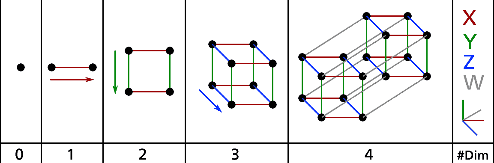
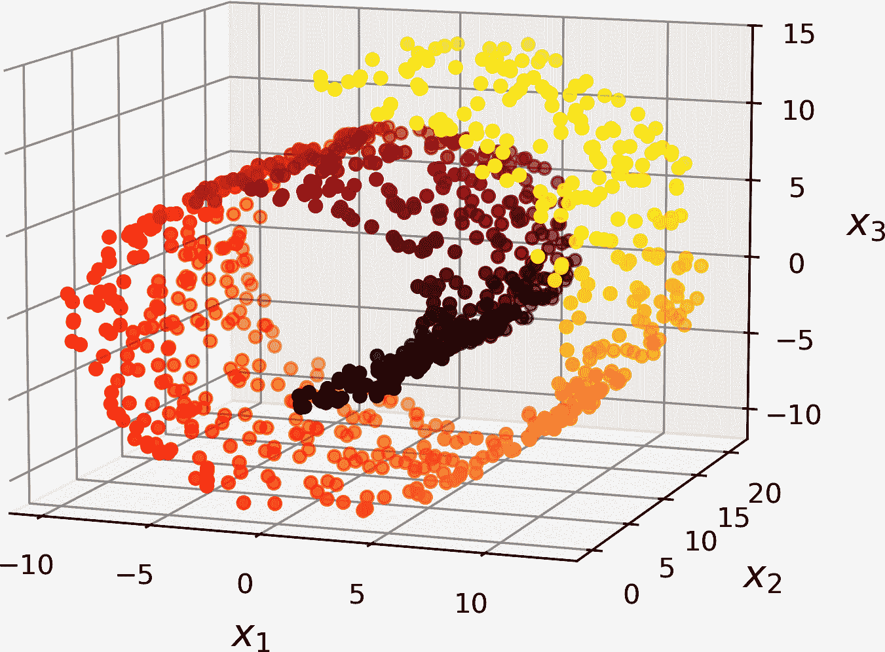
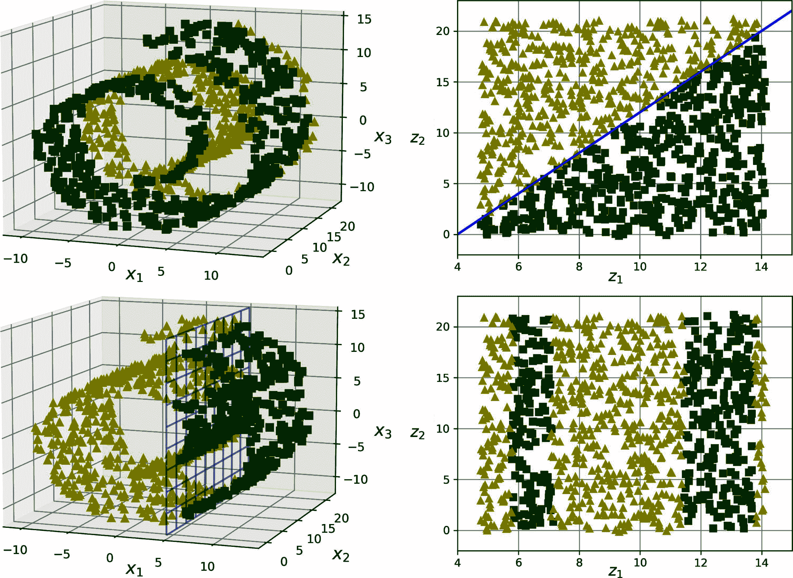

# 第七章. 降维

许多机器学习问题涉及每个训练实例数千甚至数百万个特征。所有这些特征不仅使训练变得极其缓慢，而且如你所见，它们也会使找到好的解决方案变得困难得多。这个问题通常被称为*维度灾难*。

幸运的是，在现实世界的问题中，通常可以显著减少特征的数量，将一个难以处理的问题转化为一个可处理的问题。例如，考虑 MNIST 图像（在第三章中介绍）：图像边界的像素几乎总是白色，因此你可以完全从训练集中删除这些像素而不会丢失太多信息。正如我们在上一章中看到的，图 6-6 证实了这些像素对于分类任务来说完全不重要。此外，相邻的像素通常高度相关：如果你将它们合并成一个像素（例如，通过取两个像素强度的平均值），你不会丢失太多信息，从而去除冗余，有时甚至去除噪声。

###### 警告

降维也可能丢失一些有用的信息，就像将图像压缩成 JPEG 格式可能会降低其质量一样：它可能会使你的系统性能略有下降，尤其是如果你过度降维的话。此外，一些模型——例如神经网络——可以有效地处理高维数据，并学会在保留任务所需的有用信息的同时降低其维度。简而言之，添加一个额外的预处理步骤进行降维并不总是有帮助。

除了加速训练和可能提高你的模型性能之外，降维对于数据可视化也非常有用。将维度数量减少到两个（或三个）使得在图上绘制高维训练集的浓缩视图成为可能，并且通过视觉检测模式，如簇，通常可以获得一些重要的见解。此外，数据可视化对于向非数据科学家的人们传达你的结论至关重要——特别是那些将使用你的结果做决策的人。

在本章中，我们将首先讨论维度灾难，并了解高维空间中发生的情况。然后我们将考虑降维的两种主要方法（投影和流形学习），并介绍三种最流行的降维技术：主成分分析（PCA）、随机投影和局部线性嵌入（LLE）。

# 维度灾难

我们已经习惯了生活在三维空间中⁠^(1)，以至于当我们试图想象高维空间时，直觉就会失效。即使是一个基本的 4 维超立方体在我们心中也很难想象（参见图 7-1），更不用说在一个 1000 维空间中弯曲的 200 维椭球体了。



###### 图 7-1\. 点、线段、正方形、立方体和超立方体（0D 到 4D 超立方体）⁠^(2)

结果表明，许多事物在高维空间中的行为非常不同。例如，如果你在一个单位正方形（1 × 1 的正方形）中随机选择一个点，它位于距离边界小于 0.001 的概率只有大约 0.4%（换句话说，随机点在任意维度上“极端”的可能性非常低）。但在一个 10,000 维的单位超立方体中，这个概率超过 99.999999%。一个高维超立方体中的大多数点都非常接近边界。⁠^(3)

这里有一个更麻烦的差异：如果你在一个单位正方形中随机选择两个点，这两个点之间的距离平均大约是 0.52。如果你在一个 3D 单位立方体中随机选择两个点，平均距离大约是 0.66。那么，如果你在一个 1,000,000 维的单位超立方体中随机选择两个点呢？平均距离，信不信由你，大约是 408.25（大约是 $StartRoot StartFraction 1 comma 000 comma 000 Over 6 EndFraction EndRoot$ ）！这是反直觉的：当两个点都位于同一个单位超立方体中时，它们怎么可能相距如此之远？好吧，高维度中确实有大量的空间。

因此，高维数据集通常非常稀疏：大多数训练实例可能彼此相距甚远，因此基于距离或相似度的训练方法（如 *k* 近邻）将远不如有效。而且，某些类型的模型可能根本无法使用，因为它们与数据集的维度扩展不佳（例如，SVMs 或密集神经网络）。新实例可能远离任何训练实例，这使得预测在低维度的可靠性大大降低，因为它们将基于更大的外推。由于数据中的模式更难识别，模型将比低维度更频繁地拟合噪声；正则化将变得更加重要。最后，模型将变得更加难以解释。

理论上，通过增加训练集的大小以达到足够的训练实例密度，可以解决这些问题。不幸的是，在实践中，达到给定密度所需的训练实例数量会随着维数的增加而呈指数增长。在只有 100 个特征的情况下——这比 MNIST 问题中的特征少得多——所有特征都介于 0 到 1 之间，你需要比可观测宇宙中的原子还多的训练实例，才能使训练实例的平均距离在 0.1 以内，假设它们在所有维度上均匀分布。

# 维度约简的主要方法

在深入研究特定的降维算法之前，让我们看看降低维度的两种主要方法：投影和流形学习。

## 投影

在大多数实际问题中，训练实例并不是均匀分布在所有维度上。许多特征几乎恒定不变，而其他特征高度相关（如前面讨论的 MNIST 所述）。因此，所有训练实例都位于（或接近）高维空间中一个低得多的 *子空间* 内。这听起来很抽象，所以让我们看一个例子。在图 7-2 中，一个 3D 数据集由小圆球表示（我将在接下来的几节中多次提到这个图）。

注意到所有训练实例都靠近一个平面：这是更高维（3D）空间中的低维（2D）子空间。如果我们将每个训练实例垂直投影到这个子空间上（如图中连接实例和平面的短虚线所示），我们就会得到图 7-3 中显示的新 2D 数据集。哇！我们刚刚将数据集的维度从 3D 降低到 2D。注意，轴对应于新的特征 *z*[1] 和 *z*[2]：它们是投影到平面上的坐标。


###### 图 7-2\. 一个靠近二维子空间的 3D 数据集


###### 图 7-3\. 投影后的新 2D 数据集

## 流形学习

虽然投影速度快且通常效果良好，但它并不是降维的最佳方法。在许多情况下，子空间可能会扭曲和旋转，例如在图 7-4 中展示的瑞士卷数据集中：这是一个包含瑞士卷形状 3D 点的玩具数据集。



###### 图 7-4\. 瑞士卷数据集

简单地投影到一个平面上（例如，通过丢弃 *x*[3]）会将瑞士卷的不同层压在一起，如图 7-5 的左侧所示。你可能更希望将瑞士卷展开，以获得图 7-5 右侧的 2D 数据集。


###### 图 7-5\. 通过投影到平面（左侧）压扁与展开瑞士卷（右侧）的比较

瑞士卷是 2D *流形*的一个例子。简单来说，2D 流形是在更高维空间中可以弯曲和扭曲的 2D 形状。更普遍地说，*d*-维流形是*n*-维空间（其中*d* < *n*）的一部分，它在局部上类似于*d*-维超平面。在瑞士卷的情况下，*d* = 2，*n* = 3：它在局部上类似于 2D 平面，但在第三维上卷曲。

许多降维算法（例如，LLE、Isomap、t-SNE 或 UMAP）通过在训练实例所在的流形上建模来工作；这被称为*流形学习*。它依赖于*流形假设*，也称为*流形假设*，即大多数现实世界的高维数据集都靠近一个低维流形。这个假设通常在经验观察中是成立的。

再次思考 MNIST 数据集：所有手写数字图像都有一些相似之处。它们由连接的线条组成，边缘是白色的，并且它们或多或少地居中。如果你随机生成图像，只有极小的一部分看起来像手写数字。换句话说，如果你尝试创建数字图像，可用的自由度比你被允许生成任何想要的图像的自由度要低得多。这些约束往往会将数据集挤压到一个低维流形中。

流形假设通常伴随着另一个隐含的假设：如果用流形的低维空间表达，手头的任务（例如，分类或回归）将更简单。例如，在图 7-6 的顶部行中，瑞士卷被分为两类：在 3D 空间（左侧）中，决策边界将相当复杂，但在 2D 展开流形空间（右侧）中，决策边界是一条直线。

然而，这个隐含的假设并不总是成立。例如，在图 7-6 的底部行中，决策边界位于 *x*[1] = 5。这个决策边界在原始的 3D 空间（一个垂直平面）中看起来非常简单，但在展开的流形（由四个独立的线段组成的集合）中看起来更复杂。

简而言之，在训练模型之前降低训练集的维度通常会加快训练速度，但它并不总是导致更好的或更简单的解决方案；这完全取决于数据集。当数据集相对于特征数量较小时，降维通常更有效，特别是如果它是嘈杂的，或者许多特征彼此高度相关（即冗余）。如果你对生成数据的流程有领域知识，并且你知道它是简单的，那么流形假设肯定成立，降维很可能会有所帮助。

希望你现在对维度灾难的概念以及降维算法如何与之抗争有了很好的理解，尤其是在流形假设成立的情况下。本章的其余部分将介绍一些最流行的降维算法。



###### 图 7-6\. 决策边界不一定总是随着维度降低而简化

# PCA

*主成分分析*（PCA）无疑是降维算法中最受欢迎的。首先，它识别出离数据最近的超平面，然后将数据投影到该平面上，如图图 7-2 所示。

## 保留方差

在你能够将训练集投影到低维超平面之前，你首先需要选择正确的超平面。例如，一个简单的二维数据集在图 7-7 的左侧表示，包括三个不同的轴（即 1D 超平面）。右侧是数据集在每个这些轴上的投影结果。正如你所看到的，投影到实线上保留了最大的方差（顶部），而投影到点状线上保留了非常少的方差（底部），投影到虚线上保留了中等数量的方差（中间）。 


###### 图 7-7\. 选择投影的子空间

选择保留最大方差量的轴似乎是合理的，因为它与其他投影相比很可能会丢失更少的信息。考虑当太阳正午直射时你在地面的影子：它是一个小而模糊的形状，看起来根本不像你。但你在日出时墙上的影子要大得多，它*确实*像你。另一种证明选择最大化方差轴的理由是，它也是最小化原始数据集与其在该轴上投影之间平均平方距离的轴。这正是主成分分析（PCA）背后的简单想法，这一概念早在[1901 年](https://homl.info/pca)就被提出了！⁠^(4)

## 主成分

PCA 确定了在训练集中解释最大方差量的轴。在图 7-7 中，它是实线。它还找到一个第二个轴，垂直于第一个轴，解释了剩余的最大方差量。在这个 2D 示例中，没有选择：它是虚线。如果是一个更高维度的数据集，PCA 还会找到一个第三个轴，垂直于前两个轴，第四个，第五个，等等——与数据集的维度数量一样多的轴。

第*i*轴被称为数据的第*i*个*主成分*（PC）。在图 7-7 中，第一个 PC 是向量**c**[**1**]所在的轴，第二个 PC 是向量**c**[**2**]所在的轴。在图 7-2 中，前两个 PC 位于投影平面上，第三个 PC 是垂直于该平面的轴。投影后，回到图 7-3，第一个 PC 对应于*z*[1]轴，第二个 PC 对应于*z*[2]轴。

###### 注意

对于每个主成分，PCA 找到一个以零为中心的单位向量，指向 PC 的方向。不幸的是，其方向没有保证：如果你稍微扰动训练集并再次运行 PCA，单位向量可能会指向相反的方向。实际上，如果这两个轴上的方差非常接近，一对单位向量甚至可能会旋转或交换。因此，如果你在模型之前使用 PCA 作为预处理步骤，确保每次更新 PCA 转换器时都完全重新训练模型：如果你不这样做，并且 PCA 的输出与之前版本不匹配，模型将会非常困惑。

那么你如何找到训练集的主成分呢？幸运的是，有一个标准的矩阵分解技术叫做*奇异值分解*（SVD），可以将训练集矩阵**X**分解为三个矩阵**U** **Σ** **V**^⊺的乘积，其中**V**包含定义所有要查找的主成分的单位向量，按正确的顺序排列，如方程 7-1 所示。⁠^(5)

##### 方程 7-1\. 主成分矩阵

**粗体大写 V 等于 3x4 矩阵，第一行第一列是 2，第二列是 2，第三列是空，第四列是 2；第二行第一列是粗体 c1，第二列是粗体 c2，第三列是中划线省略号，第四列是粗体 c 的下标 n 基线；第三行第一列是 2，第二列是 2，第三列是空，第四列是 2**。

以下 Python 代码使用 NumPy 的`svd()`函数获取图 7-2 中代表的所有 3D 训练集的主成分，然后它提取定义前两个 PC 的两个单位向量：

```py
import numpy as np

X = [...]  # create a small 3D dataset
X_centered = X - X.mean(axis=0)
U, s, Vt = np.linalg.svd(X_centered)
c1 = Vt[0]
c2 = Vt[1]
```

###### 警告

PCA 假设数据集围绕原点中心化。正如你将看到的，Scikit-Learn 的 PCA 类会为你处理数据中心化。如果你自己实现 PCA（如前例所示），或者如果你使用其他库，别忘了首先中心化数据。

## 投影到*d*维

一旦你确定了所有的主要成分，你可以通过将其投影到由前*d*个主要成分定义的超平面上来将数据集的维度降低到*d*维。我们将在稍后讨论如何选择维度*d*的数量。选择这个超平面确保投影尽可能多地保留方差。例如，在图 7-2 中，3D 数据集被投影到由前两个主要成分定义的 2D 平面上，保留了数据集的大部分方差。因此，2D 投影看起来非常像原始的 3D 数据集。

要将训练集投影到超平面并获得一个维度为*d*的降低数据集**X**[*d*-proj]，计算训练集矩阵**X**与矩阵**W**[*d*]的矩阵乘法，该矩阵定义为包含**V**的前*d*列的矩阵，如方程 7-2 所示。

##### 方程 7-2\. 将训练集投影到*d*维

**X**[*d*] - proj 基线等于 **X**[*d*] **W**[*d*]

以下 Python 代码将训练集投影到由前两个主要成分定义的平面上：

```py
W2 = Vt[:2].T
X2D = X_centered @ W2
```

就这样！你现在知道如何通过将数据集投影到任意数量的维度来降低其维度，同时尽可能多地保留方差。

## 使用 Scikit-Learn

Scikit-Learn 的`PCA`类使用 SVD 来实现 PCA，就像我们在本章前面所做的那样。以下代码将 PCA 应用于将数据集的维度降低到两个维度（请注意，它自动处理数据中心化）：

```py
from sklearn.decomposition import PCA

pca = PCA(n_components=2)
X2D = pca.fit_transform(X)
```

在将`PCA`转换器拟合到数据集后，其`components_`属性包含**W**[*d*]的转置：它包含每个前*d*个主要成分的一行。

## 解释方差比

另一个有用的信息是每个主要成分的*解释方差比*，可以通过`explained_variance_ratio_`变量获得。这个比率表示数据集的方差中有多少比例沿着每个主要成分。例如，让我们看看图 7-2 中 3D 数据集的前两个成分的解释方差比：

```py
>>> pca.explained_variance_ratio_
array([0.82279334, 0.10821224])
```

这个输出告诉我们，大约 82%的数据集方差沿着第一个主成分，大约 11%沿着第二个主成分。这留下了大约 7%给第三个主成分，因此可以合理地假设第三个主成分可能携带很少的信息。

## 选择正确的维度数量

与随意选择要减少的维度数相比，选择一个总和足够大的方差比例的维度数更简单——比如说，95%。（当然，这个规则的例外是，如果你是为了数据可视化而减少维度，在这种情况下，你将希望将维度减少到 2 或 3。）

以下代码加载并拆分 MNIST 数据集（在第三章分类章节中介绍），然后执行 PCA 而不减少维度，然后计算保留训练集 95%方差所需的最小维度数：

```py
from sklearn.datasets import fetch_openml

mnist = fetch_openml('mnist_784', as_frame=False)
X_train, y_train = mnist.data[:60_000], mnist.target[:60_000]
X_test, y_test = mnist.data[60_000:], mnist.target[60_000:]

pca = PCA()
pca.fit(X_train)
cumsum = np.cumsum(pca.explained_variance_ratio_)
d = np.argmax(cumsum >= 0.95) + 1  # d equals 154
```

然后，你可以将`n_components=d`设置为再次运行 PCA，但有一个更好的选择。与其指定要保留的主成分数量，你可以将`n_components`设置为介于 0.0 和 1.0 之间的浮点数，表示你希望保留的方差比例：

```py
pca = PCA(n_components=0.95)
X_reduced = pca.fit_transform(X_train)
```

实际的组件数量是在训练过程中确定的，并存储在`n_components_`属性中：

```py
>>> pca.n_components_
np.int64(154)
```

另一个选项是将解释方差作为维度数量的函数进行绘图（简单地绘制`cumsum`；参见图 7-8)。通常曲线中会有一个肘部，表示解释方差停止快速增长。在这种情况下，你可以看到将维度减少到大约 100 维不会损失太多解释方差。


###### 图 7-8\. 解释方差作为维度数量的函数

或者，如果你将降维作为监督学习任务（例如，分类）的预处理步骤，那么你可以像调整任何其他超参数一样调整维度数（参见第二章项目章节）。例如，以下代码示例创建了一个两步管道，首先使用 PCA 减少维度，然后使用随机森林进行分类。接下来，它使用`RandomizedSearchCV`找到 PCA 和随机森林分类器的好超参数组合。这个例子进行了快速搜索，仅调整了 2 个超参数，在仅 1,000 个实例上进行训练，并且只运行了 10 次迭代，但如果你有时间，可以自由地进行更彻底的搜索：

```py
from sklearn.ensemble import RandomForestClassifier
from sklearn.model_selection import RandomizedSearchCV
from sklearn.pipeline import make_pipeline

clf = make_pipeline(PCA(random_state=42),
                    RandomForestClassifier(random_state=42))
param_distrib = {
    "pca__n_components": np.arange(10, 80),
    "randomforestclassifier__n_estimators": np.arange(50, 500)
}
rnd_search = RandomizedSearchCV(clf, param_distrib, n_iter=10, cv=3,
                                random_state=42)
rnd_search.fit(X_train[:1000], y_train[:1000])
```

让我们看看找到的最佳超参数：

```py
>>> print(rnd_search.best_params_)
{'randomforestclassifier__n_estimators': np.int64(475),
 'pca__n_components': np.int64(57)}
```

有趣的是，最优组件数量如此之低：我们将一个 784 维数据集减少到了仅仅 57 维！这与我们使用了随机森林这一相当强大的模型有关。如果我们使用线性模型，例如`SGDClassifier`，搜索将发现我们需要保留更多的维度（大约 75）。

###### 注意

你可能还关心模型的大小和速度，而不仅仅是它的性能。维度越少，模型越小，训练和推理速度越快。但是，如果你过度压缩数据，那么你会丢失太多信号，你的模型将欠拟合。你需要为特定的用例选择速度、大小和性能之间的正确平衡。

## PCA 用于压缩

在降维之后，训练集占用的空间要小得多。例如，在将 PCA 应用于 MNIST 数据集并保留其 95%方差的情况下，我们剩下 154 个特征，而不是原始的 784 个特征。因此，数据集现在的大小不到原始大小的 20%，而我们只丢失了 5%的方差！这是一个合理的压缩比率，很容易看出这种尺寸减小将极大地加快分类算法的速度。

通过应用 PCA 投影的逆变换，也可以将降维后的数据集还原到 784 维。这不会给你回原始数据，因为投影丢失了一些信息（在丢弃的 5%方差内），但它可能会接近原始数据。原始数据与重建数据（压缩后再解压缩）之间的平均平方距离被称为*重建误差*。

`inverse_transform()`方法使我们能够将降维的 MNIST 数据集解压缩回 784 维：

```py
X_recovered = pca.inverse_transform(X_reduced)
```

图 7-9 显示了原始训练集中的几个数字（在左侧），以及压缩和解压缩后的相应数字。你可以看到图像质量略有损失，但数字仍然大部分完好。


###### 图 7-9\. 保留 95%方差的 MNIST 压缩

逆变换的方程式显示在方程 7-3 中。

##### 方程 7-3\. PCA 逆变换，回到原始的维度数

$ \text{bold upper X Subscript recovered Baseline} = \text{bold upper X Subscript d hyphen proj Baseline} \text{bold upper W Subscript d Baseline} \text{Superscript upper T} $

## 随机 PCA

如果你将`svd_solver`超参数设置为`"randomized"`，Scikit-Learn 将使用一种称为*随机 PCA*的随机算法，该算法快速找到前*d*个主成分的近似值。其计算复杂度为*O*(*m* × *d*²) + *O*(*d*³)，而不是全 SVD 方法的*O*(*m* × *n*²) + *O*(*n*³)，因此当*d*远小于*n*时，它比全 SVD 快得多：

```py
rnd_pca = PCA(n_components=154, svd_solver="randomized", random_state=42)
X_reduced = rnd_pca.fit_transform(X_train)
```

###### 小贴士

默认情况下，`svd_solver`设置为`"auto"`：如果输入数据具有少量特征（*n* < 1,000）并且样本数至少是特征数的 10 倍（*m* > 10*n*），则使用`"covariance_eigh"`求解器，在这些条件下非常快。否则，如果 max(*m*, *n*) > 500 且`n_components`是一个小于 min(*m*, *n*)的 80%的整数，则使用`"randomized"`求解器。在其他情况下，它使用完整的 SVD 方法。如果您想强制 Scikit-Learn 使用完整的 SVD，以牺牲计算时间为代价换取略微更精确的结果，可以将`svd_solver="full"`。

## 增量 PCA

前面的 PCA 实现的一个问题是，它们要求整个训练集都适合内存，以便算法可以运行。幸运的是，已经开发出了允许您将训练集分成小批量并一次喂入一个小批量的*增量 PCA*（IPCA）算法。这对于大型训练集和在在线（即实时，当新实例到达时）应用 PCA 非常有用。

以下代码将 MNIST 训练集分成 100 个小批量（使用 NumPy 的`array_split()`函数），并将它们喂给 Scikit-Learn 的`IncrementalPCA`类⁠^(6)，将 MNIST 数据集的维度降低到 154 维，就像之前一样。请注意，您必须使用每个小批量调用`partial_fit()`方法，而不是使用整个训练集的`fit()`方法：

```py
from sklearn.decomposition import IncrementalPCA

n_batches = 100
inc_pca = IncrementalPCA(n_components=154)
for X_batch in np.array_split(X_train, n_batches):
    inc_pca.partial_fit(X_batch)

X_reduced = inc_pca.transform(X_train)
```

或者，您可以使用 NumPy 的`memmap`类，它允许您像在内存中完全一样地操作存储在磁盘上的二进制文件中的大数组；该类仅在需要时在内存中加载所需的数据。为了演示这一点，我们首先创建一个内存映射（memmap）文件，并将 MNIST 训练集复制到其中，然后调用`flush()`以确保任何仍在缓存中的数据都保存到磁盘。在现实生活中，`X_train`通常不会适合内存，因此您需要分块加载它，并将每个块保存到 memmap 数组的正确部分：

```py
filename = "my_mnist.mmap"
X_mmap = np.memmap(filename, dtype='float32', mode='write', shape=X_train.shape)
X_mmap[:] = X_train  # could be a loop instead, saving the data chunk by chunk
X_mmap.flush()
```

接下来，我们可以加载 memmap 文件并像使用常规 NumPy 数组一样使用它。让我们使用`IncrementalPCA`类来降低其维度。由于该算法在任何给定时间只使用数组的一小部分，内存使用量保持可控。这使得可以调用通常的`fit()`方法而不是`partial_fit()`，这非常方便：

```py
X_mmap = np.memmap(filename, dtype="float32", mode="readonly").reshape(-1, 784)
batch_size = X_mmap.shape[0] // n_batches
inc_pca = IncrementalPCA(n_components=154, batch_size=batch_size)
inc_pca.fit(X_mmap)
```

###### 警告

只保存到磁盘的是原始二进制数据，因此当您加载它时，需要指定数组的类型和形状。如果您省略了形状，`np.memmap()`将返回一个一维数组。

对于非常高维的数据集，PCA 可能太慢。如您之前所见，即使您使用随机 PCA，其计算复杂度仍然是*O*(*m* × *d*²) + *O*(*d*³)，因此目标维度数*d*不能太大。如果您正在处理具有数万个特征或更多（例如，图像）的数据集，则训练可能会变得非常慢：在这种情况下，您应该考虑使用随机投影。

# 随机投影

如其名所示，随机投影算法通过随机线性投影将数据投影到低维空间。这听起来可能有些疯狂，但事实证明，这种随机投影实际上很可能很好地保留距离，正如 William B. Johnson 和 Joram Lindenstrauss 在著名的引理中通过数学证明的那样。因此，两个相似的实例在投影后仍然相似，两个非常不同的实例在投影后仍然非常不同。

显然，你丢弃的维度越多，损失的信息就越多，距离的扭曲也就越严重。那么，你如何选择最优的维度数呢？嗯，Johnson 和 Lindenstrauss 提出了一个方程，该方程确定了为了确保——以高概率——距离不会超过给定的容差而需要保留的最小维度数。例如，如果你有一个包含*m* = 5,000 个实例的数据集，每个实例有*n* = 20,000 个特征，并且你不想任何两个实例之间的平方距离变化超过*ε* = 10%，^(7)，那么你应该将数据投影到*d*维度，其中*d* ≥ 4 log(*m*) / (½ *ε*² - ⅓ *ε*³)，即 7,300 个维度。这是一个相当显著的降维！请注意，该方程没有使用*n*，它只依赖于*m*和*ε*。这个方程通过`johnson_lindenstrauss_min_dim()`函数实现：

```py
>>> from sklearn.random_projection import johnson_lindenstrauss_min_dim
>>> m, ε = 5_000, 0.1
>>> d = johnson_lindenstrauss_min_dim(m, eps=ε)
>>> d
7300
```

现在，我们只需生成一个形状为[*d*, *n*]的随机矩阵**P**，其中每个元素都是从均值为 0，方差为 1/*d*的高斯分布中随机抽取的，并使用它将数据集从*n*维度投影到*d*：

```py
n = 20_000
rng = np.random.default_rng(seed=42)
P = rng.standard_normal((d, n)) / np.sqrt(d)  # std dev = sqrt(variance)

X = rng.standard_normal((m, n))  # generate a fake dataset
X_reduced = X @ P.T
```

这就是全部！它简单高效，训练几乎瞬间完成：算法创建随机矩阵所需的所有信息仅仅是数据集的形状。数据本身根本不使用。这使得随机投影特别适合处理非常高维度的数据，例如具有数百万个特征的文本或基因组学数据，或者非常稀疏的数据，对于这些数据，即使是随机 PCA 也可能需要太长时间来训练，并且需要太多的内存。在推理时间，随机投影与 PCA 一样快（即，一次矩阵乘法）。但话虽如此，随机投影并不是万能的：它比 PCA 丢失了更多的信号，因此在训练速度和性能之间有一个权衡。

Scikit-Learn 提供了一个 `GaussianRandomProjection` 类来执行我们刚才所做的操作：当您调用其 `fit()` 方法时，它使用 `johnson_lindenstrauss_min_dim()` 确定输出维度，然后生成一个随机矩阵，并将其存储在 `components_` 属性中。然后当您调用 `transform()` 时，它使用这个矩阵进行投影。在创建转换器时，您可以设置 `eps` 来调整 *ε*（默认为 0.1），并设置 `n_components` 来强制特定的目标维度 *d*（您可能希望使用交叉验证来微调这些超参数）。以下代码示例给出了与前面代码相同的结果（您还可以验证 `gaussian_rnd_proj.components_` 是否等于 `P`）：

```py
from sklearn.random_projection import GaussianRandomProjection

gaussian_rnd_proj = GaussianRandomProjection(eps=ε, random_state=42)
X_reduced = gaussian_rnd_proj.fit_transform(X)  # same result as above
```

Scikit-Learn 还提供了一个名为 `SparseRandomProjection` 的第二个随机投影转换器。它以相同的方式确定目标维度，生成相同形状的随机矩阵，并执行相同的投影。主要区别在于随机矩阵是稀疏的。这意味着它使用的内存要少得多：大约 25 MB，而前面的例子中接近 1.2 GB！而且它也更快，无论是生成随机矩阵还是降低维度：在这种情况下大约快 50%。此外，如果输入是稀疏的，转换会保持其稀疏性（除非您设置 `dense_output=True`）。最后，它还享有与先前方法相同的距离保持属性，降维的质量也相当（仅略低一些精度）。简而言之，通常更倾向于使用这个转换器而不是第一个，特别是对于大型或稀疏数据集。

稀疏随机矩阵中非零项的比率 *r* 被称为其 *密度*。默认情况下，它等于 $StartFraction 1 Over StartRoot n EndRoot EndFraction$ 。对于 20,000 个特征，这意味着在随机矩阵中只有大约 1/141 的单元格是非零的：这相当稀疏！如果您愿意，可以将 `density` 超参数设置为另一个值。稀疏随机矩阵中的每个单元格都有 *r* 的概率是非零的，每个非零值要么是 –*v* 或 +*v*（两者同样可能），其中 *v* = $StartFraction 1 Over StartRoot d r EndRoot EndFraction$ 。

如果您想执行逆变换，您首先需要使用 SciPy 的 `pinv()` 函数计算成分矩阵的伪逆，然后将降维数据乘以伪逆的转置：

```py
components_pinv = np.linalg.pinv(gaussian_rnd_proj.components_)
X_recovered = X_reduced @ components_pinv.T
```

###### 警告

如果成分矩阵很大，计算伪逆可能需要非常长的时间，因为 `pinv()` 的计算复杂度为 *O*(*dn*²) 如果 *d* < *n*，否则为 *O*(*nd*²)。

总结来说，随机投影是一种简单、快速、内存高效且出奇强大的降维算法，您应该记住它，尤其是在处理高维数据集时。

###### 注意

随机投影并不总是用于降低大型数据集的维度。例如，Sanjoy Dasgupta 等人于 2017 年发表的一篇论文 8 表明，果蝇的大脑实现了一种随机投影的类似物，将密集的低维嗅觉输入映射到稀疏的高维二进制输出：对于每种气味，只有一小部分输出神经元被激活，但相似的气味会激活许多相同的神经元。这与一个众所周知的算法*局部敏感哈希* (LSH) 类似，通常用于搜索引擎中相似文档的分组（参见第十七章 17）。

# LLE

[*局部线性嵌入* (LLE)](https://homl.info/lle)⁠^(9)是一种*非线性降维* (NLDR) 技术。它是一种流形学习方法，与 PCA 和随机投影不同，它不依赖于投影。简而言之，LLE 首先确定每个训练实例如何线性地与其最近邻相关联，然后它寻找一个低维表示的训练集，在这些局部关系中最好地保留了这些关系（更多细节稍后提供）。这种方法使其特别擅长展开扭曲的流形，尤其是在噪声不是太多的情况下。然而，它的扩展性不好，所以它主要用于小型或中型数据集。

以下代码创建了一个瑞士卷，然后使用 Scikit-Learn 的`LocallyLinearEmbedding`类将其展开：

```py
from sklearn.datasets import make_swiss_roll
from sklearn.manifold import LocallyLinearEmbedding

X_swiss, t = make_swiss_roll(n_samples=1000, noise=0.2, random_state=42)
lle = LocallyLinearEmbedding(n_components=2, n_neighbors=10, random_state=42)
X_unrolled = lle.fit_transform(X_swiss)
```

变量`t`是一个包含瑞士卷卷轴上每个实例位置的 1D NumPy 数组。在这个例子中我们没有使用它，但它可以用作非线性回归任务的目标。得到的二维数据集在图 7-10 中显示。


###### 图 7-10\. 使用 LLE 展开的瑞士卷

如您所见，瑞士卷已经被完全展开，实例之间的距离在局部得到了很好的保留。然而，在更大的尺度上，距离并没有得到保留：展开的瑞士卷应该是一个矩形，而不是这种拉伸和扭曲的带状物。尽管如此，LLE 在建模流形方面做得相当不错。

这就是 LLE（局部线性嵌入）的工作原理：对于每个训练实例 **x**^((*i*)), 算法会识别其 *k*-近邻（在先前的代码中 *k* = 10），然后尝试将这些近邻作为线性函数来重建 **x**^((*i*)). 更具体地说，它试图找到权重 *w*[*i,j*]，使得 **x**^((*i*)) 与 $sigma-summation Underscript j equals 1 Overscript m Endscripts w Subscript i comma j Baseline bold x Superscript left-parenthesis j right-parenthesis$ 之间的平方距离尽可能小，假设如果 **x**^((*j*)) 不是 **x**^((*i*)) 的 *k*-近邻之一，则 *w*[*i,j*] = 0。因此，LLE 的第一步是方程 7-4 中描述的约束优化问题，其中 **W** 是包含所有权重 *w*[*i,j*] 的权重矩阵。第二个约束简单地规范化了每个训练实例 **x**^((*i*)*) 的权重。

##### 方程 7-4\. LLE 步骤 1：线性建模局部关系

<mtable displaystyle="true"><mtr><mtd columnalign="left"><mrow><mover accent="true"><mi mathvariant="bold">W</mi> <mo>^</mo></mover> <mo>=</mo> <munder><mo form="prefix">argmin</mo> <mi mathvariant="bold">W</mi></munder> <mstyle scriptlevel="0" displaystyle="true"><munderover><mo>∑</mo> <mrow><mi>i</mi><mo>=</mo><mn>1</mn></mrow> <mi>m</mi></munderover></mstyle> <msup><mfenced separators="" open="(" close=")"><msup><mi mathvariant="bold">x</mi> <mrow><mo>(</mo><mi>i</mi><mo>)</mo></mrow></msup> <mo>-</mo><munderover><mo>∑</mo> <mrow><mi>j</mi><mo>=</mo><mn>1</mn></mrow> <mi>m</mi></munderover> <msub><mi>w</mi> <mrow><mi>i</mi><mo lspace="0%" rspace="0%">,</mo><mi>j</mi></mrow></msub> <msup><mi mathvariant="bold">x</mi> <mrow><mo>(</mo><mi>j</mi><mo>)</mo></mrow></msup></mfenced> <mn>2</mn></msup></mrow></mtd></mtr> <mtr><mtd columnalign="left"><mrow><mtext>subject</mtext> <mtext>to</mtext> <mfenced separators="" open="{" close=""><mtable><mtr><mtd columnalign="left"><mrow><msub><mi>w</mi> <mrow><mi>i</mi><mo lspace="0%" rspace="0%">,</mo><mi>j</mi></mrow></msub> <mo>=</mo> <mn>0</mn></mrow></mtd> <mtd columnalign="left"><mrow><mtext>if</mtext> <msup><mi mathvariant="bold">x</mi> <mrow><mo>(</mo><mi>j</mi><mo>)</mo></mrow></msup> <mtext>is</mtext> <mtext>not</mtext> <mtext>one</mtext> <mtext>of</mtext> <mtext>the</mtext> <mi>k</mi> <mtext>n.n.</mtext> <mtext>of</mtext> <msup><mi mathvariant="bold">x</mi> <mrow><mo>(</mo><mi>i</mi><mo>)</mo></mrow></msup></mrow></mtd></mtr> <mtr><mtd columnalign="left"><mrow><munderover><mo>∑</mo> <mrow><mi>j</mi><mo>=</mo><mn>1</mn></mrow> <mi>m</mi></munderover> <msub><mi>w</mi> <mrow><mi>i</mi><mo lspace="0%" rspace="0%">,</mo><mi>j</mi></mrow></msub> <mo>=</mo> <mn>1</mn></mrow></mtd> <mtd columnalign="left"><mrow><mtext>for</mtext> <mi>i</mi> <mo>=</mo> <mn>1</mn> <mo lspace="0%" rspace="0%">,</mo> <mn>2</mn> <mo lspace="0%" rspace="0%">,</mo> <mo>⋯</mo> <mo lspace="0%" rspace="0%">,</mo> <mi>m</mi></mrow></mtd></mtr></mtable></mfenced></mrow></mtd></mtr></mtable>

在这一步之后，权重矩阵 $通过上标加粗大写 W 的求和$（包含权重 $通过上标加粗 w 下标 i，j 的求和$）编码了训练实例之间的局部线性关系。第二步是将训练实例映射到一个 *d*- 维空间（其中 *d* < *n*），尽可能多地保留这些局部关系。如果 **z**^((*i*)) 是 **x**^((*i*)) 在这个 *d*- 维空间中的像，那么我们希望 **z**^((*i*)) 与 $sigma-summation 下标 j 等于 1 上标 m 的求和，通过上标加粗 w 下标 i，j 基线加粗 z 上标左括号 j 右括号$ 之间的平方距离尽可能小。这个想法导致了方程 7-5 中描述的无约束优化问题。它看起来非常类似于第一步，但不是保持实例固定并找到最优权重，而是相反：保持权重固定并找到实例在低维空间中的最优位置。请注意，**Z** 是包含所有 **z**^((*i*)*) 的矩阵。

##### 方程 7-5\. LLE 步骤 2：在保留关系的同时降低维度

$通过上标加粗大写 Z 与上标加粗大写 Z 的求和等于 argmin 下标加粗大写 Z 的求和，下标 i 等于 1 上标 m 的求和，左括号加粗 z 上标左括号 i 右括号基线减去下标 j 等于 1 上标 m 的求和，通过上标加粗 w 下标 i，j 基线加粗 z 上标左括号 j 右括号基线右括号平方$

Scikit-Learn 的 LLE 实现具有以下计算复杂度：*O*(*m* log(*m*)*n* log(*k*))用于找到 *k*- 个最近邻，*O*(*mnk*³)用于优化权重，以及 *O*(*dm*²)用于构建低维表示。不幸的是，最后一个项中的 *m*² 使得该算法在非常大的数据集上扩展性不佳。

如您所见，局部线性嵌入 (LLE) 与投影技术相当不同，并且它更加复杂，但它也能构建更好的低维表示，尤其是当数据是非线性的。

# 其他降维技术

在我们结束这一章之前，让我们快速浏览一下 Scikit-Learn 中可用的其他一些流行的降维技术：

`sklearn.manifold.MDS`

*多维尺度分析* (MDS) 在尝试保留实例之间的距离的同时降低维度。随机投影适用于高维数据，但在低维数据上效果不佳。

`sklearn.manifold.Isomap`

*Isomap* 通过连接每个实例与其最近邻来创建一个图，然后在尝试保留实例之间的*测地距离*的同时降低维度。图中两个节点之间的测地距离是这两个节点之间最短路径上的节点数。这种方法在数据位于相当平滑且低维的流形上，并且具有单一全局结构（例如，瑞士卷）时效果最佳。

`sklearn.manifold.TSNE`

*t-分布随机邻域嵌入* (t-SNE) 在尝试保持相似实例靠近和不同实例分离的同时降低维度。它主要用于可视化，特别是用于可视化高维空间中的实例簇。例如，在本章末尾的练习中，您将使用 t-SNE 来可视化 MNIST 图像的 2D 地图。然而，它不打算用作 ML 模型的预处理阶段。

`sklearn.discriminant_analysis.LinearDiscriminantAnalysis`

*线性判别分析* (LDA) 是一种线性分类算法，在训练过程中，学习类之间的最具判别性的轴。然后可以使用这些轴来定义一个超平面，将数据投影到该平面上。这种方法的好处是投影将尽可能地将类分开，因此 LDA 是在运行另一个分类算法之前降低维度的良好技术（除非 LDA 本身就足够了）。

###### 小贴士

*均匀流形近似和投影* (UMAP) 是另一种流行的用于可视化的降维技术。虽然 t-SNE 在保留局部结构，尤其是簇方面表现更好，但 UMAP 试图保留局部和全局结构。此外，它更适合大规模数据集。遗憾的是，它不在 Scikit-Learn 中可用，但在 [umap-learn 包](https://umap-learn.readthedocs.io) 中有一个很好的实现。

图 7-11 展示了 MDS、Isomap 和 t-SNE 在瑞士卷上的结果。MDS 设法将瑞士卷展平，而没有失去其全局曲率，而 Isomap 则完全将其丢弃。根据下游任务，保留大规模结构可能是好是坏。t-SNE 在将瑞士卷展平、保留一点曲率以及放大簇方面做得相当合理，它还撕裂了卷，再次，这可能是好是坏，取决于下游任务。


###### 图 7-11\. 使用各种技术将瑞士卷降至 2D

# 练习

1.  降低数据集维度的主要动机是什么？主要缺点是什么？

1.  什么是维度诅咒？

1.  一旦降低了数据集的维度，是否可以逆转操作？如果是的话，如何？如果不是，为什么？

1.  PCA 能否用于降低高度非线性数据集的维度？

1.  假设你对一个 1,000 维度的数据集进行 PCA 分析，将解释方差比设置为 95%，那么结果数据集将有多少维度？

1.  在什么情况下你会使用常规 PCA、增量 PCA、随机 PCA 或随机投影？

1.  你如何评估降维算法在你数据集上的性能？

1.  将两个不同的降维算法串联起来是否有意义？

1.  加载 MNIST 数据集（在第三章中介绍），并将其分为训练集和测试集（取前 60,000 个实例用于训练，剩余的 10,000 个实例用于测试）。在数据集上训练一个随机森林分类器，并计时所需时间，然后评估测试集上的结果模型。接下来，使用 PCA 将数据集的维度降低，解释方差比为 95%。在降低维度的数据集上训练一个新的随机森林分类器，并查看所需时间。训练是否更快？接下来，在测试集上评估分类器。它与之前的分类器相比如何？再次尝试使用`SGDClassifier`。PCA 现在帮助了多少？

1.  使用 t-SNE 将 MNIST 数据集的前 5,000 个图像降低到 2 维，并使用 Matplotlib 绘制结果。你可以使用 10 种不同的颜色来表示每个图像的目标类别。或者，你可以用相应的实例类别（一个从 0 到 9 的数字）替换散点图中的每个点，或者甚至绘制数字图像的缩小版（如果你绘制所有数字，可视化将过于杂乱，因此你应该绘制一个随机样本，或者只在没有其他实例在近距离被绘制的情况下绘制一个实例）。你应该得到一个具有数字良好分离簇的漂亮可视化。尝试使用其他降维算法，如 PCA、LLE 或 MDS，并比较结果的可视化。

这些练习的解答可以在本章笔记本的末尾找到，请访问 [*https://homl.info/colab-p*](https://homl.info/colab-p)。

^(1) 嗯，如果你计算时间，是四个维度，如果你是弦论家，可能还有更多。

^(2) 观看将旋转的四面体投影到三维空间中的视频，请访问 [*https://homl.info/30*](https://homl.info/30)。图片由维基百科用户 NerdBoy1392 提供 ([Creative Commons BY-SA 3.0](https://oreil.ly/pMbrK))。图片来源于 [*https://en.wikipedia.org/wiki/Tesseract*](https://en.wikipedia.org/wiki/Tesseract)。

^(3) 有趣的事实：如果你考虑足够的维度，你认识的人可能至少在一个维度上是极端主义者（例如，他们在咖啡中放多少糖）。

^(4) Karl Pearson，"关于空间中点集的最近拟合线和面"，*The London, Edinburgh, and Dublin Philosophical Magazine and Journal of Science* 2, no. 11 (1901): 559–572。

^(5) SVD 确实能给我们提供 PCA 所需的恰好是主成分，这需要一些先验的数学知识，例如特征向量和协方差矩阵。如果你对此感兴趣，你可以在 Jonathon Shlens 的这篇 [2014 年论文](https://homl.info/pca2) 中找到所有细节。

^(6) Scikit-Learn 使用了 David A. Ross 等人描述的 [算法](https://homl.info/32)，该算法发表在 *International Journal of Computer Vision* 77, no. 1–3 (2008): 125–141。

^(7) *ε* 是希腊字母 epsilon，常用于表示极小的值。

^(8) Sanjoy Dasgupta 等人，"一个基本计算问题的神经网络算法"，*Science* 358, no. 6364 (2017): 793–796。

^(9) Sam T. Roweis 和 Lawrence K. Saul，"通过局部线性嵌入进行非线性降维"，*Science* 290, no. 5500 (2000): 2323–2326。
