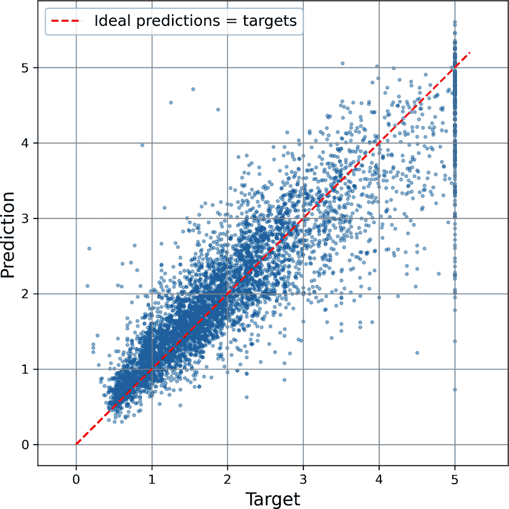

# 第九章. 人工神经网络简介

鸟类激励我们飞翔，蒺藜植物启发了维可牢（Velcro），而自然界也启发了无数其他发明。因此，从大脑的架构中寻找灵感来构建智能机器似乎是合乎逻辑的。这就是激发*人工神经网络*（ANNs）的逻辑，这些是受我们大脑中发现的生物神经元网络启发的机器学习模型。然而，尽管飞机是受鸟类启发的，但它们不需要拍打翅膀就能飞翔。同样，ANNs 逐渐与它们的生物表亲大相径庭。一些研究人员甚至认为，我们应该完全放弃生物类比（例如，用“单元”而不是“神经元”来表示），以免将我们的创造力限制在生物可能性的系统中。⁠^(1)

ANNs 是深度学习的核心。它们多功能、强大且可扩展，非常适合处理大型且高度复杂的机器学习任务，例如对数十亿张图片进行分类（例如，谷歌图片），提供语音识别服务（例如，苹果的 Siri 或谷歌助手）和聊天机器人（例如，ChatGPT 或 Claude），每天为上亿用户推荐最佳视频观看（例如，YouTube），或者学习蛋白质如何折叠（DeepMind 的 AlphaFold）。

本章介绍了人工神经网络，从对第一个 ANN 架构的快速浏览开始，一直介绍到今天广泛使用的多层感知器（MLPs）。在本章中，我们将使用 Scikit-Learn 实现简单的 MLPs，以熟悉相关概念，在下一章中，我们将转向 PyTorch，因为它是一个更灵活、更高效的神经网络库。

现在让我们回到人工神经网络起源的时代。

# 从生物神经元到人工神经元

令人惊讶的是，人工神经网络（ANNs）已经存在了相当长的时间：它们最早是在 1943 年由神经生理学家沃伦·麦克洛奇（Warren McCulloch）和数学家沃尔特·皮茨（Walter Pitts）首次提出的。在他们的[里程碑式论文](https://homl.info/43)，⁠^(2) “内在于神经活动的逻辑演算”，麦克洛奇和皮茨提出了一种简化的计算模型，描述了生物神经元如何在动物大脑中协同工作以使用*命题逻辑*执行复杂计算。这是第一个人工神经网络架构。从那时起，许多其他架构也被发明出来，正如你将看到的。

ANNs 的早期成功导致人们普遍相信我们很快就能与真正智能的机器进行对话。然而，在 20 世纪 60 年代，当人们意识到这一承诺将无法实现（至少在相当长的一段时间内）时，资金流向了其他地方，ANNs 进入了漫长的寒冬。在 20 世纪 80 年代初，发明了新的架构，并开发了更好的训练技术，这激发了人们对*连接主义*（神经网络的研究）的兴趣。但进展缓慢，到 20 世纪 90 年代，其他强大的机器学习技术已被发明，例如支持向量机。这些技术似乎比 ANNs 提供了更好的结果和更强的理论基础，因此，对神经网络的研究再次被搁置。

我们现在正在见证对 ANNs 的又一波兴趣。这波浪潮会像之前的那样消亡吗？好吧，这里有几个很好的理由相信这次情况不同，并且对 ANNs 的新一轮兴趣将对我们的生活产生更深远的影响：

+   现在可供训练神经网络的可用数据量巨大，并且人工神经网络（ANNs）在处理非常庞大和复杂的问题时，通常优于其他机器学习技术。

+   自 20 世纪 90 年代以来计算能力的巨大增长，现在使得在合理的时间内训练大型神经网络成为可能。这部分得益于摩尔定律（在过去 50 年中，集成电路中的组件数量大约每两年翻一番），也得益于游戏行业，它通过数百万台强大的*图形处理单元*（GPUs）刺激了生产：GPU 卡最初是为了加速图形而设计的，但结果证明神经网络执行类似的计算（例如大型矩阵乘法），因此它们也可以通过 GPU 加速。此外，云平台使这种力量对每个人都可以访问。

+   训练算法已经得到了改进。公平地说，它们与 20 世纪 90 年代使用的算法只有细微的差别，但这些相对小的调整产生了巨大的积极影响。

+   ANNs 的一些理论局限性在实践中证明是无害的。例如，许多人认为 ANN 的训练算法注定要失败，因为它们很可能会陷入局部最优，但实际情况并非如此，尤其是在较大的神经网络中：局部最优通常表现几乎与全局最优一样好。

+   2017 年 Transformer 架构的发明（见第十五章 Transformer 章节）是一场变革：它可以处理和生成各种数据（例如，文本、图像、音频），这与早期更专业化的架构不同，并且它在从机器人学到蛋白质折叠的广泛任务上表现出色。此外，它的扩展性相当好，这使得训练非常大的**基础模型**成为可能，这些模型可以在许多不同的任务中重复使用，可能只需要一点微调（这就是迁移学习），或者通过以正确的方式提示模型（这就是**情境学习**，或 ICL）。例如，你可以给它一些当前任务的示例（这就是**少样本学习**，或 FSL），或者要求它逐步推理（这就是**思维链提示**，或 CoT）。这是一个全新的世界！

+   神经网络似乎已经进入了一个资金和进步的良性循环。基于神经网络的惊人产品经常成为头条新闻，这吸引了越来越多的关注和资金，从而带来了更多的进步和更加惊人的产品。AI 不再只是默默无闻地推动产品：自从 ChatGPT 等聊天机器人发布以来，公众现在每天都在直接与人工智能助手互动，大型科技公司正在激烈竞争以抢占这个巨大的市场：创新的速度是疯狂的。

## 生物神经元

在我们讨论人工神经元之前，让我们快速看一下生物神经元（如图 9-1 所示生物神经元维基百科）。它是一种外形不寻常的细胞，主要存在于动物大脑中。它由一个包含细胞核和细胞大部分复杂成分的**细胞体**组成，许多分支称为**树突**，以及一个非常长的分支称为**轴突**。轴突的长度可能只是细胞体的几倍长，或者长达数万倍。在其末端，轴突分裂成许多称为**终树突**的分支，在这些分支的尖端是微小的结构，称为**突触末端**（或简称**突触**），它们连接到其他神经元的树突或细胞体。⁠^(3) 生物神经元产生短暂的电脉冲，称为**动作电位**（APs，或简称**信号**），这些信号沿着轴突传播，并使突触释放称为**神经递质**的化学信号。当一个神经元在几毫秒内接收到足够的这些神经递质时，它会发出自己的电脉冲（实际上，这取决于神经递质，因为其中一些会抑制神经元放电）。


###### 图 9-1. 生物神经元⁠^(4)

因此，单个生物神经元似乎以简单的方式行事，但它们被组织在一个由数十亿个神经元组成的庞大网络中，每个神经元通常连接到成千上万个其他神经元。一个由相对简单的神经元组成的网络可以执行高度复杂的计算，就像一个复杂的蚁群可以从简单蚂蚁的共同努力中产生一样。生物神经网络（BNNs）的架构是活跃研究的话题，但大脑的一些部分已经被绘制出来。这些努力表明，神经元通常按顺序组织在连续的层中，特别是在大脑皮层（大脑的外层），如图图 9-2 所示。


###### 图 9-2. 生物神经网络（人类皮层）中的多层⁠^(6)

## 神经元逻辑计算

麦克洛奇和皮茨提出了一种非常简单的生物神经元模型，后来被称为**人工神经元**：它有一个或多个二进制（开/关）输入和一个二进制输出。当其输入中超过一定数量的输入活跃时，人工神经元会激活其输出。在他们的论文中，麦克洛奇和皮茨表明，即使在这种简化的模型中，也可以构建一个可以计算任何所需逻辑命题的人工神经元网络。为了了解这样一个网络是如何工作的，让我们构建几个执行各种逻辑计算的 ANN（人工神经网络），假设一个神经元在其至少两个输入连接活跃时才会被激活（参见图 9-3）。


###### 图 9-3. 执行简单逻辑计算的 ANN

让我们看看这些网络能做什么：

+   左侧的第一个网络是恒等函数：如果神经元 A 被激活，那么神经元 C 也会被激活（因为它从神经元 A 接收两个输入信号）；但如果神经元 A 关闭，那么神经元 C 也会关闭。

+   第二个网络执行逻辑与操作：神经元 C 只有在神经元 A 和神经元 B 都被激活时才会被激活（单个输入信号不足以激活神经元 C）。

+   第三个网络执行逻辑或操作：如果神经元 A 或神经元 B（或两者）被激活，则神经元 C 会被激活。

+   最后，如果我们假设一个输入连接可以抑制神经元的活性（这在生物神经元中是情况），那么第四个网络计算的是一个稍微复杂一些的逻辑命题：神经元 C 只有在神经元 A 活跃且神经元 B 关闭时才会被激活。如果神经元 A 始终活跃，那么你得到一个逻辑非：神经元 C 在神经元 B 关闭时活跃，反之亦然。

你可以想象这些网络如何组合起来计算复杂的逻辑表达式（请参阅本章末尾的练习以获取示例）。

## **感知器**

*感知器* 是最简单的 ANN 架构之一，由 Frank Rosenblatt 于 1957 年发明。它基于一种略微不同的人工神经元（见图 9-4），称为*阈值逻辑单元*（TLU），或有时称为*线性阈值单元*（LTU）。输入和输出都是数字（而不是二进制的开/关值），每个输入连接都与一个权重相关联。TLU 首先计算其输入的线性函数：*z* = *w*[1] *x*[1] + *w*[2] *x*[2] + ⋯ + *w*[*n*] *x*[*n*] + *b* = **w**^⊺ **x** + *b*。然后它将一个*步函数*应用于结果：*h***w** = step(*z*)。所以它几乎就像逻辑回归一样，除了它使用步函数而不是逻辑函数。⁠^(7) 就像在逻辑回归中一样，模型参数是输入权重 **w** 和偏置项 *b*。


###### 图 9-4\. TLU：一种计算输入加权总和 **w**^⊺ **x**，加上偏置项 *b*，然后应用步函数以确定输出的人工神经元

感知器中最常用的步函数是*海维塞德步函数*（见方程 9-1）。有时也使用符号函数。

##### 方程 9-1\. 感知器中使用的常见步函数（假设阈值 = 0）

<mtable displaystyle="true"><mtr><mtd columnalign="right"><mrow><mo form="prefix">heaviside</mo> <mrow><mo>(</mo> <mi>z</mi> <mo>)</mo></mrow> <mo>=</mo> <mfenced separators="" open="{" close=""><mtable><mtr><mtd columnalign="left"><mn>0</mn></mtd> <mtd columnalign="left"><mrow><mtext>if</mtext> <mi>z</mi> <mo><</mo> <mn>0</mn></mrow></mtd></mtr> <mtr><mtd columnalign="left"><mn>1</mn></mtd> <mtd columnalign="left"><mrow><mtext>if</mtext> <mi>z</mi> <mo>≥</mo> <mn>0</mn></mrow></mtd></mtr></mtable></mfenced></mrow></mtd> <mtd columnalign="left"><mrow><mo form="prefix">sgn</mo> <mrow><mo>(</mo> <mi>z</mi> <mo>)</mo></mrow> <mo>=</mo> <mfenced separators="" open="{" close=""><mtable><mtr><mtd columnalign="left"><mrow><mo>-</mo> <mn>1</mn></mrow></mtd> <mtd columnalign="left"><mrow><mtext>if</mtext> <mi>z</mi> <mo><</mo> <mn>0</mn></mrow></mtd></mtr> <mtr><mtd columnalign="left"><mn>0</mn></mtd> <mtd columnalign="left"><mrow><mtext>if</mtext> <mi>z</mi> <mo>=</mo> <mn>0</mn></mrow></mtd></mtr> <mtr><mtd columnalign="left"><mrow><mo>+</mo> <mn>1</mn></mrow></mtd> <mtd columnalign="left"><mrow><mtext>if</mtext> <mi>z</mi> <mo>></mo> <mn>0</mn></mrow></mtd></mtr></mtable></mfenced></mrow></mtd></mtr></mtable>

单个 TLU 可用于简单的线性二进制分类。它计算其输入的线性函数，如果结果超过阈值，则输出正类。否则，输出负类。这可能会让你想起逻辑回归 (第四章) 或线性 SVM 分类（请参阅关于 SVMs 的在线章节 [*https://homl.info*](https://homl.info)）。例如，你可以使用单个 TLU 根据花瓣长度和宽度对鸢尾花进行分类。训练这样的 TLU 需要找到 *w*[1]、*w*[2] 和 *b*（训练算法将在稍后讨论）的正确值。

一个感知器由一个或多个组织在单层中的 TLU（阈值逻辑单元）组成，其中每个 TLU 都与每个输入相连。这样的层被称为 *全连接层* 或 *密集层*。输入构成 *输入层*。由于 TLU 层产生最终输出，因此它被称为 *输出层*。例如，具有两个输入和三个输出的感知器在 图 9-5 中表示。


###### 图 9-5\. 具有两个输入和三个输出神经元的感知器架构

这个感知器可以将实例同时分类到三个不同的二进制类别中，这使得它成为一个多标签分类器。它也可以用于多类分类。

多亏了线性代数的魔力，方程式 9-2 可以用来高效地一次性计算多个实例中人工神经元层的输出。

##### 方程式 9-2\. 计算全连接层的输出

$ModifyingAbove bold upper Y With caret equals phi left-parenthesis bold upper X bold upper W plus bold b right-parenthesis$

在这个方程中：

+   $ModifyingAbove bold upper Y With caret$ 是输出矩阵。它每一行代表一个实例，每一列代表一个神经元。

+   **X** 是输入矩阵。它每一行代表一个实例，每一列代表一个输入特征。

+   权重矩阵 **W** 包含所有连接权重。它每一行代表一个输入特征，每一列代表一个神经元。⁠^(8)

+   偏置向量 **b** 包含所有偏置项：每个神经元一个。

+   函数 *ϕ* 被称为 *激活函数*：当人工神经元是 TLU 时，它是一个步进函数（我们将在稍后讨论其他激活函数）。

###### 注意

在数学中，矩阵和向量的和是未定义的。然而，在数据科学中，我们允许“广播”：将向量加到矩阵上意味着将其加到矩阵的每一行。因此，**XW** + **b** 首先将 **X** 乘以 **W**——这会产生一个矩阵，其中每行对应一个实例，每列对应一个输出——然后将向量 **b** 加到该矩阵的每一行，这样每个偏差项就加到了每个实例的相应输出上。此外，*ϕ* 然后逐项应用于结果矩阵中的每个元素。

那么，感知器是如何训练的呢？Rosenblatt 提出的感知器训练算法在很大程度上受到了 *Hebb 定律* 的启发。在 1949 年的著作《行为组织》（Wiley）中，Donald Hebb 建议，当一个生物神经元经常触发另一个神经元时，这两个神经元之间的连接会变得更强。Siegrid Löwel 后来用吸引人的短语总结了 Hebb 的想法，“一起放电的细胞，一起连接”；也就是说，当两个神经元同时放电时，它们之间的连接权重往往会增加。这个规则后来被称为 Hebb 定律（或*Hebbian 学习*）。感知器使用这个规则的变体进行训练，该变体考虑了网络在做出预测时犯的错误；感知器学习规则加强了有助于减少错误的连接。更具体地说，感知器一次被喂给一个训练实例，并为每个实例做出预测。对于每个产生错误预测的输出神经元，它加强了那些本应有助于正确预测的输入的连接权重。该规则在方程 9-3 中显示。

##### 方程 9-3\. 感知器学习规则（权重更新）

$w_{i,j}^{(next)} = w_{i,j}^{(base)} + \eta (y_{j}^{(base)} - \hat{y}_{j}^{(base)}) x_i$

在这个方程中：

+   *w*[*i*,] [*j*] 是第 *i* 个输入和第 *j* 个神经元之间的连接权重。

+   *x*[*i*] 是当前训练实例的第 *i* 个输入值。

+   $\hat{y}_{j}^{(base)}$ 是当前训练实例的第 *j* 个输出神经元的输出。

+   *y*[*j*] 是当前训练实例的第 *j* 个输出神经元的期望输出。

+   *η* 是学习率（见第四章）。

每个输出神经元的决策边界是线性的，因此感知器无法学习复杂模式（就像逻辑回归分类器一样）。然而，如果训练实例是线性可分的，Rosenblatt 证明了该算法将收敛到解。⁠^(9) 这被称为 *感知器收敛定理*。

Scikit-Learn 提供了一个`Perceptron`类，可以像预期的那样使用——例如，在鸢尾花数据集（在第四章中介绍）上：

```py
import numpy as np
from sklearn.datasets import load_iris
from sklearn.linear_model import Perceptron

iris = load_iris(as_frame=True)
X = iris.data[["petal length (cm)", "petal width (cm)"]].values
y = (iris.target == 0)  # Iris setosa

per_clf = Perceptron(random_state=42)
per_clf.fit(X, y)

X_new = [[2, 0.5], [3, 1]]
y_pred = per_clf.predict(X_new)  # predicts True and False for these 2 flowers
```

你可能已经注意到，感知器学习算法与随机梯度下降（在第四章中介绍）非常相似。事实上，Scikit-Learn 的`Perceptron`类等同于使用具有以下超参数的`SGDClassifier`：`loss="perceptron"`，`learning_rate="constant"`，`eta0=1`（学习率），和`penalty=None`（无正则化）。

###### 注意

与逻辑回归分类器不同，感知器不会输出一个类概率。这是选择逻辑回归而不是感知器的一个原因。此外，感知器默认不使用任何正则化，并且训练会在训练集上没有更多预测错误时停止，因此模型通常不如逻辑回归或线性 SVM 分类器泛化得好。然而，感知器的训练可能更快一些。

在他们的 1969 年专著《感知器》中，Marvin Minsky 和 Seymour Papert 强调了感知器的一些严重弱点——特别是它们无法解决一些简单问题的事实（例如，*异或*（XOR）分类问题；参见图 9-6 的左侧）。这同样适用于任何其他线性分类模型（如逻辑回归分类器），但研究人员原本对感知器寄予厚望，有些人因此大失所望，甚至完全放弃了神经网络，转而采用更正式的方法，如逻辑、问题解决和搜索。缺乏实际应用也没有帮助。

事实证明，通过堆叠多个感知器可以消除感知器的一些局限性。由此产生的 ANN 被称为*多层感知器*（MLP）。

## 多层感知器和反向传播

一个 MLP 可以解决 XOR 问题，你可以通过计算图 9-6 右侧表示的 MLP 的输出来验证：当输入为(0, 0)或(1, 1)时，网络输出 0，而当输入为(0, 1)或(1, 0)时，它输出 1。尝试验证这个网络确实解决了 XOR 问题！^(10)

MLP 由一个输入层、一个或多个称为*隐藏层*的人工神经元层（最初是 TLU）和一个称为*输出层*的最终人工神经元层组成（参见图 9-7）。靠近输入层的层通常被称为*下层*，而靠近输出的层通常被称为*上层*。


###### 图 9-6. XOR 分类问题和解决它的 MLP


###### 图 9-7\. 具有两个输入、一个包含四个神经元的隐藏层和三个输出神经元的多层感知器架构

###### 注意

信号只在一个方向上流动（从输入到输出），因此这种架构是*正向神经网络*（FNN）的一个例子。

当一个人工神经网络包含深层堆叠的隐藏层时⁠^(11)，它被称为*深度神经网络*（DNN）。深度学习领域研究 DNN，更广泛地说，它对包含深层计算堆叠的模型感兴趣。即便如此，每当涉及到神经网络（即使是浅层神经网络）时，许多人都会谈论深度学习。

多年来，研究人员一直在努力寻找一种训练 MLP 的方法，但未能成功。在 20 世纪 60 年代初，几位研究人员讨论了使用梯度下降来训练神经网络的可行性，但正如我们在第四章中看到的，这需要计算模型误差相对于模型参数的梯度；在当时，如何以有效的方式计算这样一个包含许多参数的复杂模型的梯度并不清楚，尤其是在他们那时的计算机条件下。

然后，在 1970 年，一位名叫 Seppo Linnainmaa 的研究者在他的硕士论文中介绍了一种自动且高效地计算所有梯度的技术。这个算法现在被称为*反向模式自动微分*（或简称为*反向模式自动微分*）。在网络中仅经过两次遍历（一次正向，一次反向），它就能计算出神经网络误差相对于每个模型参数的梯度。换句话说，它能够找出每个连接权重和每个偏置应该如何调整，以减少神经网络的误差。然后，这些梯度可以被用来执行梯度下降步骤。如果你重复这个过程，自动计算梯度并执行梯度下降步骤，神经网络的误差将逐渐降低，直到最终达到最小值。这种反向模式自动微分和梯度下降的组合现在被称为*反向传播*（或简称为*反向传播*）。

这里有一个类比：想象你正在学习投篮进篮筐。你投出篮球（这就是前向传递），然后观察到篮球偏离了右侧很远（这就是错误计算），然后你考虑如何改变你的身体位置，以便下次投球时稍微向左一些（这就是反向传递）：你意识到你的手臂需要稍微逆时针旋转，可能整个上半身也需要旋转，这反过来又意味着你的脚也应该转动（注意我们是如何一层层深入下去的）。一旦你思考透彻，你实际上移动了你的身体：这就是梯度下降步骤。错误越小，调整越小。随着你重复整个过程多次，错误逐渐减小，经过几小时的练习，你每次都能成功将球投进篮筐。做得好！

###### 注意

有各种自动微分技术，各有优缺点。反向模式自动微分非常适合当要微分的函数有多个变量（例如，连接权重和偏差）而输出较少（例如，一个损失）时。如果你想了解更多关于自动微分的信息，请参阅附录 A。

反向传播实际上可以应用于各种计算图，而不仅仅是神经网络：事实上，Linnainmaa 的硕士论文根本不是关于神经网络的，它更加通用。在多年之后，反向传播才开始被用来训练神经网络，但那时它还不是主流。然后在 1985 年，David Rumelhart、Geoffrey Hinton 和 Ronald Williams 发表了一篇[论文](https://homl.info/44)⁠^(12)，分析了反向传播如何使神经网络学习有用的内部表示。他们的结果非常令人印象深刻，反向传播很快就在该领域得到了普及。40 多年后，它仍然是神经网络训练中最受欢迎的技术。

让我们更详细地回顾一下反向传播的工作原理：

+   它一次处理一个迷你批次，并多次遍历整个训练集。如果每个迷你批次包含 32 个实例，每个实例有 100 个特征，那么迷你批次将表示为一个 32 行 100 列的矩阵。每次遍历训练集称为一个*epoch*。

+   对于每个迷你批次，算法使用方程 9-2 计算第一隐藏层中所有神经元的输出。如果该层有 50 个神经元，那么它的输出是一个矩阵，每行对应迷你批次中的每个样本（例如，32），每列对应一个神经元。然后这个矩阵传递到下一层，其输出被计算并传递到下一层，依此类推，直到我们得到最后一层的输出，即输出层。这是*前向传递*：它就像做出预测一样，只不过所有中间结果都被保留，因为它们对于反向传递是必需的。

+   接下来，算法测量网络的输出误差（即，它使用一个损失函数来比较期望的输出和网络的实际输出，并返回一些误差的度量）。

+   然后它计算每个输出层参数对误差的贡献有多大。这是通过应用**链式法则**（微积分中最基本的规则之一）来分析的，这使得这一步骤既快速又精确。结果是每个参数一个梯度。

+   算法接着测量这些误差贡献中有多少来自下一层的每个连接，再次使用链式法则，反向工作直到达到输入层。如前所述，这种反向传递通过在网络中传播误差梯度来有效地测量网络中所有连接权重和偏差的误差梯度，因此得名该算法。

+   最后，算法执行梯度下降步骤，调整网络中所有连接权重和偏差项，使用它刚刚计算出的误差梯度。

###### 警告

重要的是要随机初始化所有隐藏层的连接权重，否则训练将失败。例如，如果你将所有权重和偏差初始化为零，那么给定层的所有神经元将完全相同，因此反向传播将以完全相同的方式影响它们，因此它们将保持相同。换句话说，尽管每层有数百个神经元，但你的模型将表现得好像每层只有一个神经元：它不会太聪明。相反，如果你随机初始化权重，你将*打破对称性*，并允许反向传播训练一个多样化的神经元团队。

简而言之，反向传播为小批量进行预测（正向传递），测量误差，然后反向遍历每一层以测量每个参数的误差贡献（反向传递），最后调整连接权重和偏差以减少误差（梯度下降步骤）。

为了使反向传播正常工作，Rumelhart 和他的同事们对 MLP 的架构进行了关键性的改变：他们将步骤函数替换为对数函数，σ(*z*) = 1 / (1 + exp(–*z*)），也称为**Sigmoid**函数。这是至关重要的，因为步骤函数只包含平坦的段，因此没有梯度可以工作（梯度下降无法在平坦表面上移动），而 Sigmoid 函数在所有地方都有一个定义良好的非零导数，允许梯度下降在每一步都取得一些进展。事实上，反向传播算法与许多其他激活函数一起工作得很好，而不仅仅是 Sigmoid 函数。这里还有两种其他流行的选择：

双曲正切函数：tanh(*z*) = 2*σ*(2*z*) – 1

就像 Sigmoid 函数一样，这个激活函数是*S*形，连续且可导，但其输出值范围从-1 到 1（与 Sigmoid 函数的 0 到 1 不同）。这个范围往往使得每个层的输出在训练开始时或多或少地围绕 0 中心，这通常有助于加快收敛速度。

矩形线性单元函数：ReLU(*z*) = max(0, *z*)

ReLU 函数是连续的，但不幸的是在*z* = 0 处不可导（斜率突然改变，这可能导致梯度下降跳动），其导数在*z* < 0 时为 0。然而，在实践中，它工作得非常好，并且计算速度快，因此它已成为大多数架构的默认选择（除了我们在第十五章中将要看到的 Transformer 架构）。⁠^(13) 重要的是，它没有最大输出值的事实有助于减少梯度下降期间的一些问题（我们将在第十一章中回到这个问题）。

这些流行的激活函数及其导数在图 9-8 中展示。但是等等！我们为什么一开始就需要激活函数呢？好吧，如果你链式连接几个线性变换，你得到的就是另一个线性变换。例如，如果 f(*x*) = 2*x* + 3 和 g(*x*) = 5*x* – 1，那么链式连接这两个线性函数会给你另一个线性函数：f(g(*x*)) = 2(5*x* – 1) + 3 = 10*x* + 1。所以如果你层与层之间没有非线性，那么即使是一堆深层的层也相当于一层，你无法用这种方法解决非常复杂的问题。相反，一个足够大的具有非线性激活的 DNN 理论上可以逼近任何连续函数。


###### 图 9-8\. 激活函数（左）及其导数（右）

好的！你已经知道了神经网络是从哪里来的，MLP 架构看起来是什么样子，以及它是如何计算输出的。你也已经了解了反向传播算法。现在是时候看看 MLP 的实际应用了！

# 使用 Scikit-Learn 构建和训练 MLP

MLP 可以处理各种任务，但最常见的是回归和分类。Scikit-Learn 可以帮助处理这两者。让我们从回归开始。

## 回归 MLP

你会如何构建一个用于回归任务的多层感知器（MLP）？好吧，如果你想预测单个值（例如，给定许多特征的房子价格），那么你只需要一个输出神经元：其输出是预测值。对于多元回归（即一次预测多个值），你需要每个输出维度一个输出神经元。例如，为了在图像中定位一个物体的中心，你需要预测 2D 坐标，因此你需要两个输出神经元。如果你还想在物体周围放置一个边界框，那么你需要两个额外的数字：物体的宽度和高度。因此，你最终会有四个输出神经元。

Scikit-Learn 包含一个 `MLPRegressor` 类，因此我们可以用它来构建一个包含三个隐藏层，每个隐藏层由 50 个神经元组成的多层感知器（MLP），并在加利福尼亚住房数据集上对其进行训练。为了简化，我们将使用 Scikit-Learn 的 `fetch_california_housing()` 函数来加载数据。这个数据集比我们在 第二章 中使用的那个更简单，因为它只包含数值特征（没有 `ocean_proximity` 特征），并且没有缺失值。目标值也被缩小了：每个单位代表 $100,000\. 让我们先导入我们需要的所有内容：

```py
from sklearn.datasets import fetch_california_housing
from sklearn.metrics import root_mean_squared_error
from sklearn.model_selection import train_test_split
from sklearn.neural_network import MLPRegressor
from sklearn.pipeline import make_pipeline
from sklearn.preprocessing import StandardScaler
```

接下来，让我们获取加利福尼亚住房数据集并将其分为训练集和测试集：

```py
housing = fetch_california_housing()
X_train, X_test, y_train, y_test = train_test_split(
    housing.data, housing.target, random_state=42)
```

现在，让我们创建一个包含 3 个隐藏层，每个隐藏层由 50 个神经元组成的 `MLPRegressor` 模型。当训练开始时，第一个隐藏层的输入大小（即其权重矩阵中的行数）和输出层的输出大小（即其权重矩阵中的列数）将自动调整到输入和目标的维度。该模型在所有隐藏层中使用 ReLU 激活函数，在输出层上不使用任何激活函数。我们还设置了 `verbose=True` 以在训练期间获取模型进度的详细信息：

```py
mlp_reg = MLPRegressor(hidden_layer_sizes=[50, 50, 50], early_stopping=True,
                       verbose=True, random_state=42)
```

由于神经网络可能有很多参数，它们有过度拟合训练集的倾向。为了减少这种风险，一个选择是使用早停（在第四章 线性模型 中介绍）：当我们设置 `early_stopping=True` 时，`MLPRegressor` 类会自动保留 10% 的训练数据，并在每个时代（epoch）使用它来评估模型（你可以通过设置 `validation_fraction` 来调整验证集的大小）。如果验证分数在 10 个时代后停止提高，训练将自动停止（你可以通过设置 `n_iter_no_change` 来调整这个时代数）。

现在我们创建一个管道来标准化输入特征，在将它们发送到`MLPRegressor`之前。这非常重要，因为当特征具有非常不同的尺度时，梯度下降的收敛性不好，正如我们在第四章中看到的。然后我们可以训练模型！`MLPRegressor`类使用一种称为*Adam*的梯度下降变体来最小化均方误差（见第十一章）。它还使用一点ℓ[2]正则化（你可以通过`alpha`超参数控制其强度，默认为 0.0001）：

```py
>>> pipeline = make_pipeline(StandardScaler(), mlp_reg)
>>> pipeline.fit(X_train, y_train)
Iteration 1, loss = 0.85190332
Validation score: 0.534299
Iteration 2, loss = 0.28288639
Validation score: 0.651094
[...]
Iteration 45, loss = 0.12960481
Validation score: 0.788517
Validation score did not improve more than tol=0.000100 for 10 consecutive
epochs. Stopping.
```

就这样，你已经训练出了你的第一个 MLP！这需要 45 个 epoch，正如你所见，每个 epoch 的训练损失都在下降。这个损失对应于方程 4-9 除以 2，所以你必须乘以 2 来得到 MSE（尽管并不完全准确，因为损失包括ℓ[2]正则化项）。验证分数通常在每个 epoch 都会上升。像 Scikit-Learn 中的每个回归器一样，`MLPRegressor`默认使用 R²分数进行评估——这就是`score()`方法返回的内容。正如我们在第二章中看到的，R²分数衡量的是模型解释的方差比率。在这种情况下，它在验证集上接近 80%，对于这个任务来说相当不错：

```py
>>> mlp_reg.best_validation_score_
0.791536125425778
```

让我们在测试集上评估 RMSE：

```py
>>> y_pred = pipeline.predict(X_test)
>>> rmse = root_mean_squared_error(y_test, y_pred)
>>> rmse
0.5327699946812925
```

我们得到了大约 0.53 的测试 RMSE，这与随机森林分类器得到的相当。对于第一次尝试来说，还不错！图 9-9 绘制了模型预测与目标（在测试集上）之间的关系。虚线红色线代表理想的预测（即等于目标）：大多数预测都接近目标，但仍然有一些错误，尤其是在较大的目标上。



###### 图 9-9\. MLP 回归器的预测与目标之间的关系

注意，这个 MLP 没有在输出层使用任何激活函数，所以它可以输出任何它想要的值。这通常是没问题的，但如果你想保证输出总是正的，那么你应该在输出层使用 ReLU 激活函数，或者使用*softplus*激活函数，它是 ReLU 的平滑变体：softplus(*z*) = log(1 + exp(*z*))。当*z*为负时，Softplus 接近 0，当*z*为正时，接近*z*。最后，如果你想保证预测始终在一个给定的值范围内，那么你应该使用 sigmoid 函数或双曲正切函数，并将目标缩放到适当的范围：sigmoid 为 0 到 1，tanh 为-1 到 1。遗憾的是，`MLPRegressor`类不支持输出层的激活函数。

###### 警告

Scikit-Learn 不支持 GPU 加速，其神经网络功能相当有限。这就是为什么我们将在第十章开始使用 PyTorch。尽管如此，使用 Scikit-Learn 仅用几行代码就能构建和训练一个标准的 MLP 是非常方便的：它让你能够快速处理许多复杂任务。

通常，均方误差是回归任务中正确的损失函数，但如果训练集中有很多异常值，你有时可能更愿意使用平均绝对误差，或者最好是使用*Huber 损失*，它是两者的结合：当误差小于阈值*δ*（通常为 1）时，它是二次的，但当误差大于*δ*时，它是线性的。线性部分使其对异常值不如均方误差敏感，而二次部分允许它更快地收敛并比平均绝对误差更精确。不幸的是，`MLPRegressor`只支持均方误差损失。

表 9-1 总结了回归 MLP 的典型架构。

表 9-1\. 典型回归 MLP 架构

| 超参数 | 典型值 |
| --- | --- |
| 隐藏层数量 | 取决于问题，但通常是 1 到 5 层 |
| 每个隐藏层的神经元数量 | 取决于问题，但通常是 10 到 100 个 |
| 输出神经元数量 | 每个目标维度 1 个 |
| 隐藏激活 | ReLU |
| 输出激活 | 无，或 ReLU/softplus（如果输出为正）或 sigmoid/tanh（如果输出有界） |
| 损失函数 | 均方误差（MSE），或 Huber（如果有异常值） |

好吧，MLP 可以处理回归任务。它们还能做什么呢？

## 分类 MLP

MLP 也可以用于分类任务。对于二元分类问题，你只需要一个输出神经元并使用 sigmoid 激活函数：输出将是一个介于 0 和 1 之间的数字，你可以将其解释为正类的估计概率。负类的估计概率等于 1 减去那个数字。

MLP 也可以轻松处理多标签二元分类任务（见第三章）。例如，你可能有一个电子邮件分类系统，它预测每封收到的电子邮件是垃圾邮件还是正常邮件，并同时预测它是紧急邮件还是非紧急邮件。在这种情况下，你需要两个输出神经元，都使用 sigmoid 激活函数：第一个会输出邮件是垃圾邮件的概率，第二个会输出邮件是紧急邮件的概率。更一般地说，你会为每个正类分配一个输出神经元。请注意，输出概率不一定总和为 1。这允许模型输出任何标签组合：你可以有非紧急的正常邮件、紧急的正常邮件、非紧急的垃圾邮件，甚至可能是紧急的垃圾邮件（尽管这可能是错误）。

如果每个实例只能属于单个类别，从三个或更多可能的类别（例如，数字图像分类中的类别 0 到 9）中，那么你需要为每个类别有一个输出神经元，并且应该在整个输出层使用 softmax 激活函数（见图 9-10）。softmax 函数（在第四章中介绍）将确保所有估计的概率都在 0 到 1 之间，并且它们的总和为 1，因为类别是互斥的。正如我们在第三章中看到的，这被称为多类分类。

关于损失函数，由于我们正在预测概率分布，交叉熵损失（或简称为*x-entropy*或 log loss，见第四章）通常是一个不错的选择。


###### 图 9-10。用于分类的现代 MLP（包括 ReLU 和 softmax）

表 9-2 总结了分类 MLP 的典型架构。

表 9-2。典型的分类 MLP 架构

| 超参数 | 二进制分类 | 多标签二进制分类 | 多类分类 |
| --- | --- | --- | --- |
| # 隐藏层 | 通常 1 到 5 层，具体取决于任务 |
| # 输出神经元 | 1 | 每个二进制标签 1 | 每个类别 1 |
| 输出层激活 | Sigmoid | Sigmoid | Softmax |
| 损失函数 | X-entropy | X-entropy | X-entropy |

如你所预期，Scikit-Learn 在`sklearn.neural_network`包中提供了一个`MLPClassifier`类，你可以用它来进行二进制或多类分类。它与`MLPRegressor`类几乎相同，只是它的输出层使用 softmax 激活函数，并且它最小化交叉熵损失而不是 MSE。此外，`score()`方法返回模型的准确率而不是 R²分数。让我们试试看。

我们可以处理鸢尾花数据集，但对于神经网络来说这个任务太简单了：线性模型也能做得一样好，而且不会存在过拟合的风险。所以让我们来处理一个更复杂的任务：Fashion MNIST。这是 MNIST（在第三章中介绍）的替代品。它具有与 MNIST 完全相同的格式（70,000 个 28 × 28 像素的灰度图像，每个图像有 10 个类别），但图像代表的是时尚商品而不是手写数字，因此每个类别的多样性更大，这个问题最终证明比 MNIST 更具挑战性。例如，简单的线性模型在 MNIST 上的准确率约为 92%，但在 Fashion MNIST 上只有约 83%。让我们看看我们是否能用 MLP 做得更好。

首先，让我们使用`fetch_openml()`函数加载数据集，这与我们在第三章中为 MNIST 所做的一样。注意，目标表示为字符串`'0'`、`'1'`、…、`'9'`，因此我们将它们转换为整数：

```py
from sklearn.datasets import fetch_openml

fashion_mnist = fetch_openml(name="Fashion-MNIST", as_frame=False)
targets = fashion_mnist.target.astype(int)
```

数据已经打乱了，所以我们只取前 60,000 张图像用于训练，最后 10,000 张用于测试：

```py
X_train, y_train = fashion_mnist.data[:60_000], targets[:60_000]
X_test, y_test = fashion_mnist.data[60_000:], targets[60_000:]
```

每个图像都表示为一个包含 784 个像素强度的 1D 整数数组，范围从 0 到 255。你可以使用`plt.imshow()`函数来绘制图像，但首先你需要将其重塑为`[28, 28]`：

```py
import matplotlib.pyplot as plt

X_sample = X_train[0].reshape(28, 28)  # first image in the training set
plt.imshow(X_sample, cmap="binary")
plt.show()
```

如果你运行这段代码，你应该能在图 9-11 的右上角看到踝靴的表示。


###### 图 9-11。Fashion MNIST 中每个类别的四个样本

在 MNIST 中，当标签等于 5 时，意味着图像代表的是手写数字 5。很简单。然而，对于 Fashion MNIST，我们需要知道我们正在处理哪个类别的名称列表。Scikit-Learn 没有提供它，所以让我们创建一个：

```py
class_names = ["T-shirt/top", "Trouser", "Pullover", "Dress", "Coat",
               "Sandal", "Shirt", "Sneaker", "Bag", "Ankle boot"]
```

我们现在可以确认训练集中第一张图像代表的是一双踝靴：

```py
>>> class_names[y_train[0]]
'Ankle boot'
```

我们现在可以构建分类 MLP 了：

```py
from sklearn.neural_network import MLPClassifier
from sklearn.preprocessing import MinMaxScaler

mlp_clf = MLPClassifier(hidden_layer_sizes=[300, 100], verbose=True,
                        early_stopping=True, random_state=42)
pipeline = make_pipeline(MinMaxScaler(), mlp_clf)
pipeline.fit(X_train, y_train)
accuracy = pipeline.score(X_test, y_test)
```

这段代码与我们之前使用的回归代码非常相似，但有一些不同之处：

+   当然，这是一个分类任务，所以我们使用`MLPClassifier`而不是`MLPRegressor`。

+   我们只使用了两个隐藏层，分别有 300 个和 100 个神经元。你可以尝试不同的隐藏层数量，如果你愿意，也可以更改神经元的数量。

+   我们还使用了`MinMaxScaler`而不是`StandardScaler`。我们需要它将像素强度缩小到 0-1 的范围，而不是 0-255：在这个范围内的特征通常与`MLPClassifier`使用的默认超参数（如默认学习率和权重初始化比例）配合得更好。你可能想知道为什么我们没有使用`StandardScaler`？好吧，一些像素在图像中变化不大；例如，边缘周围的像素几乎总是白色。如果我们使用`StandardScaler`，这些像素会被缩放到与其他像素相同的方差：结果，我们会给予这些像素比它们应得的更多的重要性。对于图像来说，`MinMaxScaler`通常比`StandardScaler`表现得更好（但效果可能因人而异）。

+   最后，`score()`函数返回模型的准确率。

如果你运行这段代码，你会在训练过程中发现模型在验证集上的准确率大约为 89.7%（确切值由`mlp_clf.best_validation_score_`给出），但到了最后，它开始有点过拟合，所以最终准确率只有 89.2%。当我们对测试集上的模型进行评估时，得到 87.1%，对于这个任务来说还不错，尽管我们可以通过其他神经网络架构（如卷积神经网络第十二章）做得更好。

你可能已经注意到训练相当慢。这是因为隐藏层有很多参数，所以每次迭代都要运行很多计算。例如，第一隐藏层有 784 × 300 个连接权重，加上 300 个偏置项，总共 235,500 个参数！所有这些参数使模型有很大的灵活性来拟合训练数据，但也意味着存在很高的过拟合风险，尤其是在你没有很多训练数据的情况下。在这种情况下，你可能想使用正则化技术，如提前停止和ℓ[2]正则化。

一旦模型训练完成，你就可以用它来对新图像进行分类：

```py
>>> X_new = X_test[:15]  # let's pretend these are 15 new images
>>> mlp_clf.predict(X_new)
array([9, 2, 1, 1, 6, 1, 4, 6, 5, 7, 4, 5, 8, 3, 4])
```

所有这些预测都是正确的，除了索引 12 的那个，它应该是 7（运动鞋）而不是 8（包）。你可能想知道模型对这些预测有多自信，特别是对错误的预测。为此，你可以使用`model.predict_proba()`而不是`model.predict()`，就像我们在第三章中做的那样：

```py
>>> y_proba = mlp_clf.predict_proba(X_new)
>>> y_proba[12]
array([0., 0., 0., 0., 0., 0., 0., 0., 1., 0.])
```

嗯，这不太好：模型告诉我们它 100%确信图像代表一个包（索引 8）。所以不仅模型是错误的，它还 100%确信它是正确的。实际上，在测试集的 10,000 张图像中，只有 16 张图像的模型对其信心低于 99.9%，尽管其准确率约为 90%。这就是为什么你应该总是带着怀疑的态度对待估计概率：神经网络有很强的过度自信倾向，尤其是如果训练时间过长的话。

###### 小贴士

分类任务的目标可以是类别索引（例如，3）或类别概率，通常是单热向量（例如，[0, 0, 0, 1, 0, 0, 0, 0, 0, 0]）。但如果你的模型倾向于过度自信，你可以尝试**标签平滑**技术：⁠^(14) 稍微降低目标类别的概率（例如，从 1 降到 0.9），并将剩余的均匀分配到其他类别（例如，[0.1/9, 0.1/9, 0.1/9, 0.9, 0.1/9, 0.1/9, 0.1/9, 0.1/9, 0.1/9, 0.1/9])。

尽管如此，在 Fashion MNIST 上达到 90%的准确率已经相当不错了。你可以通过微调超参数来获得更好的性能，例如使用`RandomizedSearchCV`，就像我们在第二章中做的那样。然而，搜索空间相当大，所以知道大致的搜索范围是有帮助的。

# 超参数调整指南

神经网络的灵活性也是它们的主要缺点之一：有许多超参数需要调整。你不仅可以使用任何可以想象到的网络架构，即使在基本的 MLP 中，你也可以改变层数、每层的神经元数量以及要使用的激活函数类型、权重初始化逻辑、要使用的优化器类型、其学习率、批量大小等等。这些超参数有哪些好的值？

## 隐藏层的数量

对于许多问题，你可以从一个单一的隐藏层开始，并得到合理的结果。一个只有一个隐藏层的 MLP 在理论上可以模拟甚至是最复杂的函数，前提是它有足够的神经元。但深度网络比浅层网络具有更高的*参数效率*：它们可以使用比浅层网络指数级更少的神经元来模拟复杂函数，这使得它们能够在相同数量的训练数据下达到更好的性能。这是因为它们的分层结构使它们能够在多个级别上重用和组合特征：例如，在人脸分类器中的第一层可能会学习识别低级特征，如点、弧或直线；而第二层可能会学习将这些低级特征组合成更高级的特征，如正方形或圆形；第三层可能会学习将这些高级特征组合成嘴巴、眼睛或鼻子；顶层然后将能够使用这些顶级特征来分类人脸。

这种分层架构不仅有助于深度神经网络更快地收敛到好的解决方案，而且还能提高它们泛化到新数据集的能力。例如，如果你已经训练了一个模型来识别图片中的面孔，现在你想训练一个新的神经网络来识别发型，你可以通过重用第一个网络的底层来启动训练。而不是随机初始化新神经网络的底层权重和偏差，你可以将它们初始化为第一个网络底层权重和偏差的值。这样，网络就不必从头开始学习大多数图片中出现的所有低级结构；它只需要学习高级结构（例如，发型）。这被称为*迁移学习*。

总结来说，对于许多问题，你可以从只有一个或两个隐藏层开始，神经网络的工作效果相当不错。例如，你只需使用一个包含几百个神经元的隐藏层，就可以轻松地在 MNIST 数据集上达到 97%以上的准确率，使用两个具有相同总神经元数的隐藏层，在几乎相同的学习时间内，可以达到 98%以上的准确率。对于更复杂的问题，你可以增加隐藏层的数量，直到开始过度拟合训练集。对于非常复杂的问题，如大型图像分类或语音识别，通常需要具有数十个（甚至数百个，但不是完全连接的，如你将在第十二章中看到）层的网络，并且需要大量的训练数据。你很少需要从头开始训练这样的网络：更常见的是重用执行类似任务的预训练的顶尖网络的某些部分。这样训练将会更快，并且需要的数据更少。

## 每个隐藏层的神经元数量

输入层和输出层中的神经元数量取决于你的任务所需的输入和输出类型。例如，MNIST 任务需要 28 × 28 = 784 个输入和 10 个输出神经元。

对于隐藏层来说，过去通常的做法是将它们的大小设计成金字塔形，每一层的神经元数量越来越少——其理论依据是许多低级特征可以合并成更少的高级特征。对于 MNIST 任务，一个典型的神经网络可能包含 3 个隐藏层，第一层有 300 个神经元，第二层有 200 个，第三层有 100 个。然而，这种做法已经被大量放弃，因为似乎在大多数情况下，所有隐藏层使用相同数量的神经元表现同样好，甚至更好；此外，只需要调整一个超参数，而不是每一层都需要调整。尽管如此，根据数据集的不同，有时将第一隐藏层做得比其他层稍大一些可能会有所帮助。

就像层数的数量一样，你可以逐渐增加神经元的数量，直到网络开始过拟合。或者，你可以尝试构建一个比实际需要的层数和神经元数量稍多的模型，然后使用提前停止和其他正则化技术来防止它过度拟合。Waymo 的研究员和前谷歌员工 Vincent Vanhoucke 将这种方法称为“紧身裤”方法：与其浪费时间寻找完美匹配你尺寸的裤子，不如使用可以缩到合适尺寸的大号紧身裤。采用这种方法，你可以避免可能导致模型损坏的瓶颈层。确实，如果一个层有太少的神经元，它将缺乏建模复杂关系的计算能力，甚至可能没有足够的表达能力来保留所有有用的输入信息。例如，如果你对 Fashion MNIST 训练集应用 PCA（在第七章中介绍），你会发现你需要 187 个维度来保留数据中 95%的方差。所以，如果你将第一隐藏层的神经元数量设置为某个更大的数字，比如 200，你可以确信这个层不会成为瓶颈。然而，你不想添加太多的神经元，否则模型将具有太多的参数需要优化，这将需要更多的时间和数据来训练。

###### 小贴士

通常情况下，通过增加层数而不是每层的神经元数量，你将获得更多的回报。

话虽如此，瓶颈层并不总是坏事。例如，限制第一隐藏层的维度迫使神经网络只保留最重要的维度，这可以消除数据中的一些噪声（但不要走得太远！）。此外，在输出层附近有一个瓶颈层可以迫使神经网络学习前一层中数据的良好表示（即，在更少的空间中打包更多有用的信息），这有助于神经网络泛化，并且对于**表示学习**本身也可能很有用。我们将在第十八章（第十八章中介绍）回到这一点。

## 学习率

学习率是一个极其重要的超参数。一般来说，最佳学习率大约是最大学习率的一半（即训练算法发散的学习率，正如我们在第四章中看到的）。找到良好学习率的一种方法是在几个迭代中训练模型，起始学习率非常低（例如，10 的负 5 次方）并逐渐增加到非常大的值（例如，10）。这是通过在每次迭代中将学习率乘以一个常数因子来实现的（例如，通过(10 / 10^(-5))^(1 / 500)在 500 次迭代内从 10 的负 5 次方增加到 10）。如果你将损失作为学习率的函数绘制出来（使用对数刻度表示学习率），你应该会看到损失最初下降。但过了一段时间后，学习率会变得太大，因此损失会急剧上升：最佳学习率通常略低于损失开始上升的点（通常比转折点低 10 倍）。然后你可以重新初始化你的模型，并使用这个良好的学习率正常训练它。

###### 小贴士

当使用 Scikit-Learn 在训练期间更改学习率时，你必须将 MLP 的`warm_start`超参数设置为`True`，并使用`partial_fit()`一次拟合一个批次的模型，就像我们在第四章中处理`SGDRegressor`时做的那样。只需在每次迭代中更新学习率即可。

## 批处理大小

批处理大小会对你的模型性能和训练时间产生重大影响。使用大批处理的主要好处是硬件加速器，如 GPU，可以高效地处理它们（正如我们在第十章中将会看到的），因此训练算法每秒将看到更多的实例。因此，许多研究人员和从业者推荐使用可以适应*VRAM*（视频内存，即 GPU 的内存）的最大批处理大小。然而，有一个问题：大批处理有时会导致训练不稳定，尤其是在较小的模型和训练初期，并且生成的模型可能不如小批处理训练的模型泛化得好。Yann LeCun 曾经发推文说“朋友们不要让朋友们使用大于 32 的迷你批处理”，引用了 Dominic Masters 和 Carlo Luschi 在 2018 年发表的一篇[论文](https://homl.info/smallbatch)⁠^(15)，该论文得出结论，使用小批处理（从 2 到 32）更可取，因为小批处理在更短的训练时间内导致了更好的模型。

然而，其他研究指出相反的方向。例如，2017 年，Elad Hoffer 等人撰写的论文[Elad Hoffer et al.](https://homl.info/largebatch)⁠^(16)和 Priya Goyal 等人撰写的论文[Priya Goyal et al.](https://homl.info/largebatch2)⁠^(17)表明，可以使用非常大的批量大小（高达 8,192），结合各种技术，如预热学习率（即以较小的学习率开始训练，然后逐渐增加），以获得非常短的训练时间，而没有任何泛化差距。

因此，一种策略是使用较大的批量大小，可能还有学习率预热，如果训练不稳定或最终性能令人失望，那么尝试使用较小的批量大小。

## 其他超参数

如果您有计算预算和时间，这里还有两个您可以调整的超参数：

优化器

选择比传统的批量梯度下降更好的优化器（并调整其超参数）可以帮助加速训练，有时还能达到更好的性能。

激活函数

我们在本章前面讨论了如何选择激活函数：一般来说，ReLU 激活函数是所有隐藏层的良好默认选项。在某些情况下，用另一个函数替换 ReLU 可能会有所帮助。

###### 小贴士

最佳学习率取决于其他超参数——特别是批量大小——因此，如果您修改了任何超参数，请确保再次调整学习率。

关于调整神经网络超参数的更多最佳实践，请参阅 Leslie Smith 撰写的优秀的 2018 年论文[2018 paper](https://homl.info/1cycle)⁠^(18)。谷歌研究人员撰写的[Deep Learning Tuning Playbook](https://github.com/google-research/tuning_playbook)也值得一读。Andrew Ng 的免费电子书[*Machine Learning Yearning*](https://homl.info/ngbook)也包含大量实用建议。

最后，我强烈建议您阅读本章末尾的练习 1。您将使用一个不错的网络界面来尝试各种神经网络架构并可视化它们的输出。这将非常有用，以更好地理解 MLPs 并培养对每个超参数（层数和神经元数量、激活函数等）影响的良好直觉。

这就结束了我们对人工神经网络及其使用 Scikit-Learn 实现的介绍。在下一章中，我们将转向 PyTorch，这是领先的神经网络开源库，我们将利用图形处理单元（GPU）的强大功能，用它来更快地训练和运行 MLPs。我们还将开始构建更复杂的模型，具有多个输入和输出。

# 练习

1.  这个[神经网络游乐场](https://playground.tensorflow.org)是一个伟大的工具，可以在不编写任何代码的情况下建立你的直觉（它是由 TensorFlow 团队构建的，但其中没有 TensorFlow 特有的东西；实际上，它甚至没有使用 TensorFlow）。在这个练习中，你只需点击几次就可以训练几个二元分类器，并调整模型的架构及其超参数，以获得一些关于神经网络如何工作以及它们的超参数做什么的直觉。花些时间探索以下内容：

    1.  神经网络学习到的模式。尝试通过点击运行按钮（左上角）来训练默认神经网络。注意，它如何快速找到一个好的分类任务解决方案。第一隐藏层的神经元已经学会了简单的模式，而第二隐藏层的神经元已经学会了将第一隐藏层的简单模式组合成更复杂的模式。一般来说，层数越多，模式可以越复杂。

    1.  激活函数。尝试将 tanh 激活函数替换为 ReLU 激活函数，并再次训练网络。注意，它甚至更快地找到了解决方案，但这次边界是线性的。这是由于 ReLU 函数的形状造成的。

    1.  局部最小值的风险。修改网络架构，使其只有一个包含三个神经元的隐藏层。多次训练它（要重置网络权重，请点击播放按钮旁边的重置按钮）。注意，训练时间变化很大，有时它甚至会陷入局部最小值。

    1.  当神经网络太小时会发生什么。移除一个神经元，只保留两个。注意，现在神经网络无法找到好的解决方案，即使你尝试多次。模型参数太少，系统性地欠拟合训练集。

    1.  当神经网络足够大时会发生什么。将神经元数量设置为八，并多次训练网络。注意，现在它始终运行得很快，并且从未陷入困境。这突显了神经网络理论中的一个重要发现：大型神经网络很少陷入局部最小值，即使它们确实如此，这些局部最优解通常几乎与全局最优解一样好。然而，它们仍然可能在长时间内卡在长平顶上。

    1.  深度网络中梯度消失的风险。选择螺旋数据集（“数据”下的右下角数据集），并将网络结构更改为具有四个隐藏层，每个层有八个神经元。注意，训练需要更长的时间，并且经常长时间陷入平台期。同时注意，最高层（右侧）的神经元比最低层（左侧）的神经元进化得更快。这个问题，称为*梯度消失*问题，可以通过更好的权重初始化和其他技术、更好的优化器（如 AdaGrad 或 Adam）或批量归一化（在第十一章中讨论）来缓解。

    1.  进一步探索。花上一小时左右的时间，尝试调整其他参数，以了解它们对神经网络的影响，从而建立对神经网络的直观理解。

1.  使用原始的人工神经元（如图 9-3 中的那些）绘制一个计算 *A* ⊕ *B*（其中 ⊕ 表示异或操作）的 ANN。提示：*A* ⊕ *B* = (*A* ∧ ¬ *B*) ∨ (¬ *A* ∧ *B*)。

1.  为什么通常更倾向于使用逻辑回归分类器而不是经典的感知器（即使用感知器训练算法训练的单层阈值逻辑单元）？你如何调整感知器使其等同于逻辑回归分类器？

1.  为什么 sigmoid 激活函数是训练第一个 MLP 的关键成分？

1.  列出三种流行的激活函数。你能画出它们吗？

1.  假设你有一个由一个输入层（10 个 passthrough 神经元）、一个隐藏层（50 个人工神经元）和一个输出层（3 个人工神经元）组成的 MLP。所有人工神经元都使用 ReLU 激活函数。

    1.  输入矩阵 **X** 的形状是什么？

    1.  隐藏层的权重矩阵 **W**[*h*] 和偏置向量 **b**[*h*] 的形状是什么？

    1.  输出层的权重矩阵 **W**[*o*] 和偏置向量 **b**[*o*] 的形状是什么？

    1.  网络输出矩阵 **Y** 的形状是什么？

    1.  将计算网络输出矩阵 **Y** 作为 **X**、**W**[*h*]、**b**[*h*]、**W**[*o*] 和 **b**[*o*] 函数的方程式写出来。

1.  如果你想将电子邮件分类为垃圾邮件或正常邮件，输出层需要多少个神经元？在输出层应该使用哪种激活函数？如果你要处理 MNIST，输出层需要多少个神经元，应该使用哪种激活函数？对于像第二章中提到的预测房价，应该如何调整网络结构？

1.  反向传播是什么？它是如何工作的？反向传播和反向模式自动微分有什么区别？

1.  你能列出在基本 MLP 中可以调整的所有超参数吗？如果 MLP 过度拟合训练数据，你应该如何调整这些超参数来尝试解决这个问题？

1.  在 CoverType 数据集上训练一个深度 MLP。你可以使用 `sklearn.datasets.fetch_covtype()` 加载它。尝试通过手动调整超参数和使用 `RandomizedSearchCV` 来获得超过 93% 的测试集准确率。

这些练习的解答可以在本章笔记本的末尾找到，在 [*https://homl.info/colab-p*](https://homl.info/colab-p)。

^(1) 通过开放于生物启发而不害怕创建生物上不现实的模型，只要它们有效，你可以同时获得两者的最佳之处。

^(2) 沃伦·S·麦克洛奇和沃尔特·皮茨，《神经活动内在思想的逻辑演算》，*《数学生物学通报》* 第 5 卷第 4 期（1943 年）：115–113。

^(3) 它们实际上并没有连接，只是非常接近，以至于可以非常快速地交换化学信号。

^(4) 图片由布鲁斯·布劳斯提供 ([Creative Commons 3.0](https://oreil.ly/pMbrK))。从 [*https://en.wikipedia.org/wiki/Neuron*](https://en.wikipedia.org/wiki/Neuron) 复制。

^(5) 在机器学习的背景下，短语“神经网络”通常指的是人工神经网络（ANNs），而不是生物神经网络（BNNs）。

^(6) S. Ramón y Cajal 绘制的皮质层图（公有领域）。从 [*https://en.wikipedia.org/wiki/Cerebral_cortex*](https://en.wikipedia.org/wiki/Cerebral_cortex) 复制。

^(7) 逻辑回归和对数几率函数在第四章（ch04.html#linear_models_chapter）中介绍，以及我们将在此章中大量依赖的几个其他概念，包括 softmax、交叉熵、梯度下降、早停等，所以请务必先阅读它。

^(8) 在一些库中，例如 PyTorch，权重矩阵是转置的，因此每个神经元对应一行，每个输入特征对应一列。

^(9) 注意，这个解决方案不是唯一的：当数据点是线性可分时，存在无限多个超平面可以分离它们。

^(10) 例如，当输入为（0，1）时，左下角的神经元计算 0 × 1 + 1 × 1 – 3 / 2 = –1 / 2，这是负数，因此它输出 0。右下角的神经元计算 0 × 1 + 1 × 1 – 1 / 2 = 1 / 2，这是正数，因此它输出 1。输出神经元接收前两个神经元的输出作为其输入，因此它计算 0 × (–1) + 1 × 1 - 1 / 2 = 1 / 2。这是正数，因此它输出 1。

^(11) 在 20 世纪 90 年代，具有两个以上隐藏层的 ANN 被认为是深度网络。如今，我们看到具有数十个甚至数百个层的 ANN 已很常见，因此“深度”的定义相当模糊。

^(12) 大卫·鲁梅尔哈特等人，《通过误差传播学习内部表示》（国防技术信息中心技术报告，1985 年 9 月）。

^(13) 生物神经元似乎实现了大约 sigmoid (*S*-形) 激活函数，因此研究人员长期坚持使用 sigmoid 函数。但结果发现 ReLU 在人工神经网络中通常表现更好。这是生物类比可能误导的一个例子。

^(14) C. Szegedy 等人, “重新思考计算机视觉中的 Inception 架构”, CVPR 2016: 2818–2826.

^(15) Dominic Masters 和 Carlo Luschi, “重新审视深度神经网络的小批量训练”, arXiv 预印本 arXiv:1804.07612 (2018).

^(16) Elad Hoffer 等人, “训练更长时间，泛化更好：缩小神经网络大批量训练中的泛化差距”, *第 31 届国际神经网络信息处理系统会议论文集* (2017): 1729–1739.

^(17) Priya Goyal 等人, “准确、大批量 SGD：1 小时训练 ImageNet”, arXiv 预印本 arXiv:1706.02677 (2017).

^(18) Leslie N. Smith, “神经网络的超参数 disciplined 方法：第一部分——学习率、批量大小、动量和权重衰减”, arXiv 预印本 arXiv:1803.09820 (2018).
