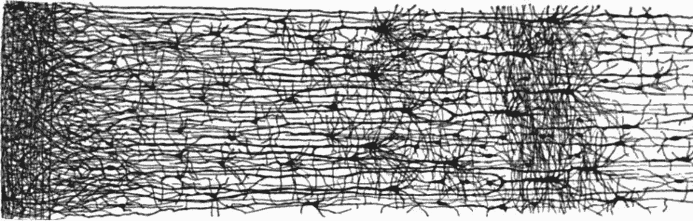
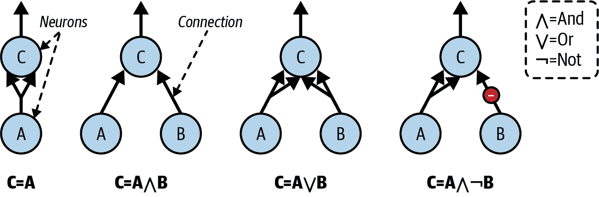
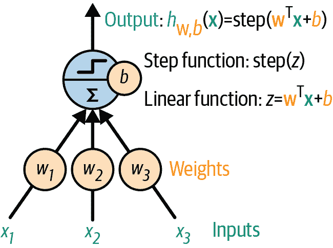
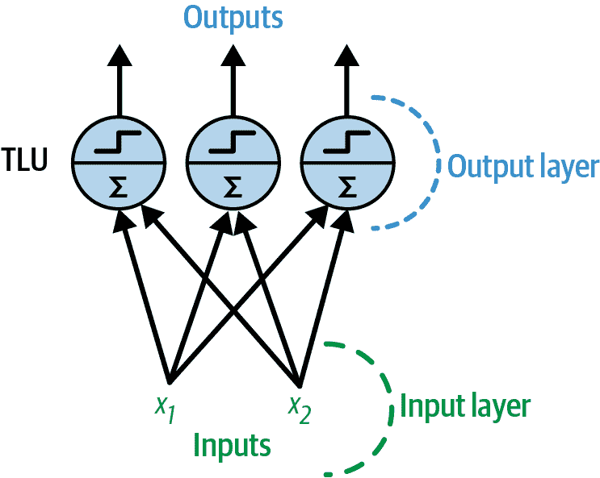
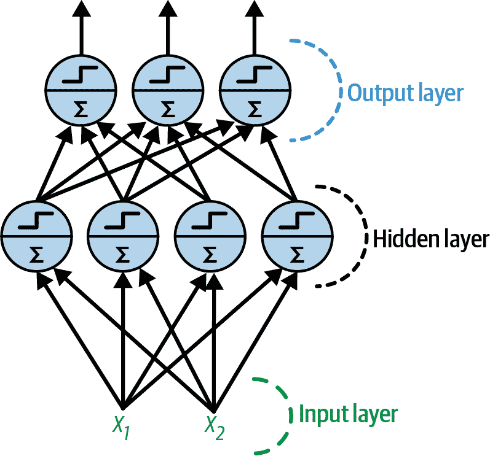
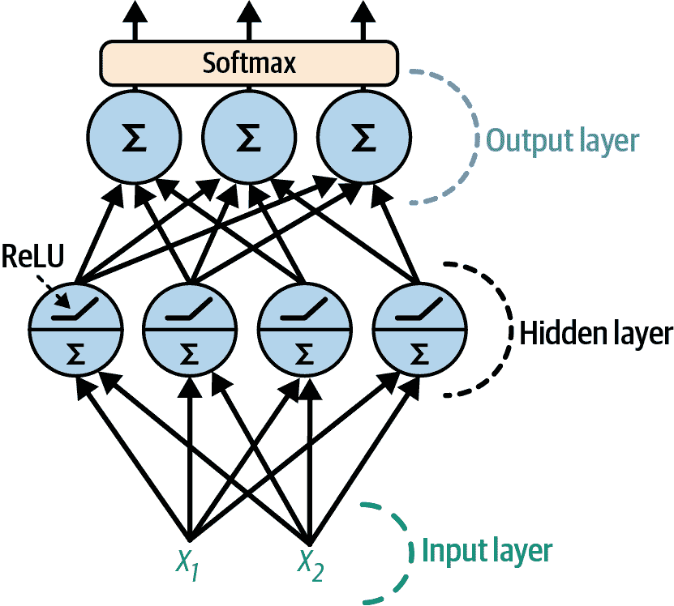

# 第九章. 人工神经网络简介

鸟类启发了我们飞翔，蒺藜植物启发了维可牢，而自然也启发了无数其他发明。因此，从大脑的架构中寻找灵感，以了解如何构建智能机器，这似乎是合乎逻辑的。这就是激发**人工神经网络**（ANNs）的逻辑，这些机器学习模型受到了我们大脑中生物神经元网络的启发。然而，尽管飞机是受鸟类启发的，但它们并不需要拍打翅膀才能飞翔。同样，ANNs 逐渐与它们的生物表亲大相径庭。一些研究人员甚至认为，我们应该完全放弃生物类比（例如，用“单元”而不是“神经元”来表示），以免将我们的创造力限制在生物可能存在的系统中。⁠^(1)

ANNs 是深度学习的核心。它们功能多样、强大且可扩展，非常适合处理大型且高度复杂的机器学习任务，例如对数十亿张图片进行分类（例如，谷歌图片）、提供语音识别服务（例如，苹果的 Siri 或谷歌助手）和聊天机器人（例如，ChatGPT 或 Claude）、每天为上亿用户推荐最佳视频观看（例如，YouTube）或学习蛋白质如何折叠（DeepMind 的 AlphaFold）。

本章介绍了人工神经网络，从对最早的 ANN 架构的快速浏览开始，一直介绍到今天广泛使用的多层感知器（MLPs）。在本章中，我们将使用 Scikit-Learn 实现简单的 MLPs，以熟悉相关概念，在下一章中，我们将转向 PyTorch，因为它是一个更灵活、更高效的神经网络库。

现在，让我们回到人工神经网络起源的时代。

# 从生物神经元到人工神经元

惊讶的是，ANNs 已经存在很长时间了：它们最早是在 1943 年由神经生理学家沃伦·麦克洛奇和数学家沃尔特·皮茨提出的。在他们的[里程碑式论文](https://homl.info/43)，⁠^(2)“内在于神经活动中的逻辑演算”中，麦克洛奇和皮茨提出了一种简化的计算模型，描述了生物神经元如何在动物大脑中协同工作，使用**命题逻辑**进行复杂计算。这是第一个人工神经网络架构。从那时起，还发明了许多其他架构，你将在下面看到。

ANNs 的早期成功导致了一种广泛的认识，即我们很快就能与真正智能的机器进行对话。当在 20 世纪 60 年代变得明显这一承诺将无法实现（至少在相当长一段时间内）时，资金流向了其他地方，ANNs 进入了一个漫长的冬天。在 20 世纪 80 年代初，发明了新的架构，并开发了更好的训练技术，这激发了人们对*连接主义*（神经网络的研究）的兴趣。但进展缓慢，到 20 世纪 90 年代，已经发明了其他强大的机器学习技术，如支持向量机。这些技术似乎比 ANNs 提供了更好的结果和更强的理论基础，因此，再次将神经网络的研究搁置起来。

我们现在正在见证对 ANNs 的又一波兴趣。这波浪潮会像之前的那样消亡吗？好吧，这里有几个很好的理由相信这次情况不同，并且对 ANNs 的新一轮兴趣将对我们的生活产生更深远的影响：

+   现在有大量的数据可用于训练神经网络，并且 ANNs 在非常大型和复杂的问题上经常优于其他 ML 技术。

+   自 1990 年代以来计算能力的巨大提升，现在使得在合理的时间内训练大型神经网络成为可能。这部分得益于摩尔定律（在过去 50 年中，集成电路中的组件数量大约每两年翻一番），同时也归功于游戏行业，它通过数百万台强大的*图形处理单元*（GPUs）刺激了生产：GPU 卡最初是为了加速图形而设计的，但结果证明神经网络执行类似的计算（如大型矩阵乘法），因此它们也可以通过 GPU 加速。此外，云平台使得这种能力对每个人都可以访问。

+   训练算法已经得到了改进。公平地说，它们与 20 世纪 90 年代使用的算法只有细微的差别，但这些相对小的调整产生了巨大的积极影响。

+   ANNs 的一些理论局限性在实践中证明是良性的。例如，许多人认为 ANN 训练算法注定要失败，因为它们很可能会陷入局部最优，但实际情况并非如此，尤其是在较大的神经网络中：局部最优解通常表现几乎与全局最优解相当。

+   2017 年 Transformer 架构的发明（见第十五章）是一个转折点：它可以处理和生成各种数据（例如，文本、图像、音频），这与早期更专业化的架构不同，并且它在从机器人学到蛋白质折叠的广泛任务上表现出色。此外，它的扩展性相当好，这使得训练非常大的*基础模型*成为可能，这些模型可以在许多不同的任务中重复使用，可能只需要一点微调（这就是迁移学习），或者只需以正确的方式提示模型（这就是*情境学习*，或 ICL）。例如，你可以给它一些当前任务的示例（这就是*少样本学习*，或 FSL），或者要求它逐步推理（这就是*思维链*提示，或 CoT）。这是一个全新的世界！

+   人工神经网络似乎进入了一个良性的资金和进步循环。基于人工神经网络惊人的产品经常成为头条新闻，这吸引了越来越多的关注和资金，从而带来了更多的进步和更加惊人的产品。人工智能不再是仅仅在阴影中为产品提供动力：自从 ChatGPT 等聊天机器人发布以来，公众现在每天都在直接与人工智能助手互动，大型科技公司正在激烈竞争以抢占这个巨大的市场：创新的速度是疯狂的。

## 生物神经元

在我们讨论人工神经元之前，让我们快速看一下生物神经元（如图 9-1 所示）。它是一种外形不寻常的细胞，主要存在于动物大脑中。它由一个包含细胞核和细胞大部分复杂成分的*细胞体*组成，许多分支称为*树突*，以及一个非常长的分支称为*轴突*。轴突的长度可能只是细胞体的几倍长，或者长达数万倍。在其末端，轴突分裂成许多称为*突触末梢*的分支，这些分支的尖端是微小的结构，称为*突触终端*（或简称*突触*），它们连接到其他神经元的树突或细胞体。⁠^(3) 生物神经元产生短暂的电脉冲，称为*动作电位*（APs，或简称*信号*），这些信号沿着轴突传播，并使突触释放称为*神经递质*的化学信号。当一个神经元在几毫秒内接收到足够的这些神经递质时，它会发出自己的电脉冲（实际上，这取决于神经递质，因为其中一些会抑制神经元放电）。


###### 图 9-1. 一个生物神经元⁠^(4)

因此，单个生物神经元似乎以简单的方式行事，但它们被组织在一个包含数十亿个神经元的庞大网络中，每个神经元通常连接到成千上万的其它神经元。一个由相对简单的神经元组成的网络可以执行高度复杂的计算，就像一个复杂的蚁群可以从简单蚂蚁的共同努力中产生一样。生物神经网络（BNNs）的架构是活跃研究的话题，但大脑的一些部分已经被绘制出来。这些努力表明，神经元通常以连续的层次组织，特别是在大脑皮层（大脑的外层），如图图 9-2 所示。



###### 图 9-2\. 生物神经网络（人类皮层）中的多层⁠^(6)

## 神经元的逻辑计算

麦克洛奇和皮茨提出了一种非常简单的生物神经元模型，后来被称为**人工神经元**：它有一个或多个二进制（开/关）输入和一个二进制输出。当其输入中超过一定数量的输入活跃时，人工神经元会激活其输出。在他们的论文中，麦克洛奇和皮茨表明，即使使用这样一个简化的模型，也可以构建一个由人工神经元组成的网络，可以计算任何你想要的逻辑命题。为了了解这样一个网络是如何工作的，让我们构建几个执行各种逻辑计算的 ANNs（人工神经网络），假设一个神经元在其至少两个输入连接活跃时被激活。



###### 图 9-3\. 执行简单逻辑计算的 ANNs

让我们看看这些网络是如何工作的：

+   左侧的第一个网络是恒等函数：如果神经元 A 被激活，那么神经元 C 也会被激活（因为它从神经元 A 那里接收了两个输入信号）；但如果神经元 A 关闭，那么神经元 C 也会关闭。

+   第二个网络执行逻辑与操作：只有当神经元 A 和神经元 B 都活跃时，神经元 C 才会被激活（单个输入信号不足以激活神经元 C）。

+   第三个网络执行逻辑或操作：如果神经元 A 或神经元 B（或两者）被激活，则神经元 C 会被激活。

+   最后，如果我们假设一个输入连接可以抑制神经元的活性（这在生物神经元中是这种情况），那么第四个网络计算了一个稍微复杂一些的逻辑命题：只有当神经元 A 活跃且神经元 B 关闭时，神经元 C 才会被激活。如果神经元 A 始终活跃，那么你得到一个逻辑非：当神经元 B 关闭时，神经元 C 活跃，反之亦然。

你可以想象这些网络如何组合起来计算复杂的逻辑表达式（参见本章末尾的练习以获取示例）。

## 感知器

*感知器*是 ANN 架构中最简单的一种，由 Frank Rosenblatt 于 1957 年发明。它基于一种略微不同的称为*阈值逻辑单元*（TLU）或有时称为*线性阈值单元*（LTU）的人工神经元（参见图 9-4）。输入和输出都是数字（而不是二进制的开/关值），每个输入连接都与一个权重相关联。TLU 首先计算其输入的线性函数：*z* = *w*[1] *x*[1] + *w*[2] *x*[2] + ⋯ + *w*[*n*] *x*[*n*] + *b* = **w**^⊺ **x** + *b*。然后它将阶跃函数应用于结果：*h***w** = step(*z*)。所以它几乎就像逻辑回归，只是它使用的是阶跃函数而不是逻辑函数。⁠^(7) 就像在逻辑回归中一样，模型参数是输入权重**w**和偏置项*b*。



###### 图 9-4\. TLU：一种计算其输入**w**^⊺ **x**加权和加上偏置项*b*的人工神经元，然后应用阶跃函数

在感知器中最常用的阶跃函数是*海维塞德阶跃函数*（参见方程式 9-1）。有时会使用符号函数代替。

##### 方程式 9-1\. 感知器中常用的阶跃函数（假设阈值为 0）

<mtable displaystyle="true"><mtr><mtd columnalign="right"><mrow><mo form="prefix">heaviside</mo> <mrow><mo>(</mo> <mi>z</mi> <mo>)</mo></mrow> <mo>=</mo> <mfenced separators="" open="{" close=""><mtable><mtr><mtd columnalign="left"><mn>0</mn></mtd> <mtd columnalign="left"><mrow><mtext>if</mtext> <mi>z</mi> <mo><</mo> <mn>0</mn></mrow></mtd></mtr> <mtr><mtd columnalign="left"><mn>1</mn></mtd> <mtd columnalign="left"><mrow><mtext>if</mtext> <mi>z</mi> <mo>≥</mo> <mn>0</mn></mrow></mtd></mtr></mtable></mfenced></mrow></mtd> <mtd columnalign="left"><mrow><mo form="prefix">sgn</mo> <mrow><mo>(</mo> <mi>z</mi> <mo>)</mo></mrow> <mo>=</mo> <mfenced separators="" open="{" close=""><mtable><mtr><mtd columnalign="left"><mrow><mo>-</mo> <mn>1</mn></mrow></mtd> <mtd columnalign="left"><mrow><mtext>if</mtext> <mi>z</mi> <mo><</mo> <mn>0</mn></mrow></mtd></mtr> <mtr><mtd columnalign="left"><mn>0</mn></mtd> <mtd columnalign="left"><mrow><mtext>if</mtext> <mi>z</mi> <mo>=</mo> <mn>0</mn></mrow></mtd></mtr> <mtr><mtd columnalign="left"><mrow><mo>+</mo> <mn>1</mn></mrow></mtd> <mtd columnalign="left"><mrow><mtext>if</mtext> <mi>z</mi> <mo>></mo> <mn>0</mn></mrow></mtd></mtr></mtable></mfenced></mrow></mtd></mtr></mtable>

单个 TLU 可用于简单的线性二进制分类。它计算其输入的线性函数，如果结果超过阈值，则输出正类。否则，输出负类。这可能会让你想起逻辑回归 (第四章) 或线性 SVM 分类（请参阅关于 SVM 的在线章节[*https://homl.info*](https://homl.info)）。例如，你可以使用单个 TLU 根据花瓣长度和宽度对鸢尾花进行分类。训练这样的 TLU 需要找到 *w*[1]、*w*[2] 和 *b*（训练算法将在稍后讨论）的正确值。

一个感知器由一个或多个组织在单层中的 TLU 组成，其中每个 TLU 都与每个输入相连。这样的层被称为 *全连接层* 或 *密集层*。输入构成 *输入层*。由于 TLU 层产生最终输出，因此它被称为 *输出层*。例如，具有两个输入和三个输出的感知器在 图 9-5 中表示。



###### 图 9-5\. 具有两个输入和三个输出神经元的感知器架构

这个感知器可以将实例同时分类到三个不同的二进制类别，这使得它成为一个多标签分类器。它也可以用于多类分类。

多亏了线性代数的魔力，方程 9-2 可以用来有效地同时计算多个实例的人工神经元层的输出。

##### 方程 9-2\. 计算全连接层的输出

$ModifyingAbove 粗体上标 Y With 叉等于 phi 左括号 粗体上标 X 粗体上标 W 加 粗体 b 右括号$

在这个方程中：

+   $ModifyingAbove 粗体上标 Y With 叉$ 是输出矩阵。它每行对应一个实例，每列对应一个神经元。

+   **X** 是输入矩阵。它每行对应一个实例，每列对应一个输入特征。

+   权重矩阵 **W** 包含所有连接权重。它每行对应一个输入特征，每列对应一个神经元。⁠^(8)

+   偏置向量 **b** 包含所有偏置项：每个神经元一个。

+   函数 *ϕ* 被称为 *激活函数*：当人工神经元是 TLU 时，它是一个阶跃函数（我们将在稍后讨论其他激活函数）。

###### 注意

在数学中，矩阵和向量的和是未定义的。然而，在数据科学中，我们允许“广播”：将一个向量加到一个矩阵上意味着将它加到矩阵的每一行。因此，**XW** + **b** 首先将 **X** 乘以 **W**——这会得到一个矩阵，其中每一行代表一个实例，每一列代表一个输出——然后将向量 **b** 加到该矩阵的每一行，这样就将每个偏置项加到了每个实例的对应输出上。此外，*ϕ* 然后逐项应用于结果矩阵中的每个元素。

那么，感知器是如何训练的呢？Rosenblatt 提出的感知器训练算法在很大程度上受到了 *Hebb 的规则* 的启发。在他的 1949 年著作《行为组织》（Wiley）中，Donald Hebb 建议，当一个生物神经元经常触发另一个神经元时，这两个神经元之间的连接会变得更强。Siegrid Löwel 后来用吸引人的短语总结了 Hebb 的想法，“Cells that fire together, wire together”；也就是说，当两个神经元同时触发时，它们之间的连接权重往往会增加。这个规则后来被称为 Hebb 的规则（或 *Hebbian learning*）。感知器使用这个规则的变体进行训练，该变体考虑了网络在做出预测时犯的错误；感知器学习规则加强了有助于减少错误的连接。更具体地说，感知器一次被喂给一个训练实例，并为每个实例做出预测。对于每个产生错误预测的输出神经元，它加强了那些本应有助于正确预测的输入的连接权重。该规则在 方程 9-3 中显示。

##### 方程 9-3\. 感知器学习规则（权重更新）

$w Subscript i comma j Baseline Superscript left-parenthesis next step right-parenthesis Baseline equals w Subscript i comma j Baseline plus eta left-parenthesis y Subscript j Baseline minus ModifyingAbove y With caret Subscript j Baseline right-parenthesis x Subscript i$

在这个方程中：

+   *w*[*i*,] [*j*] 是第 *i* 个输入和第 *j* 个神经元之间的连接权重。

+   *x*[*i*] 是当前训练实例的第 *i* 个输入值。

+   $通过上标 caret 标记的 y Subscript j Baseline 对 y 进行修改$ 是当前训练实例的第 *j* 个输出神经元的输出。

+   *y*[*j*] 是当前训练实例的第 *j* 个输出神经元的期望输出。

+   *η* 是学习率（参见第四章）。

每个输出神经元的决策边界是线性的，因此感知器无法学习复杂的模式（就像逻辑回归分类器一样）。然而，如果训练实例是线性可分的，Rosenblatt 证明了该算法将收敛到解决方案。⁠^(9) 这被称为 *感知器收敛定理*。

Scikit-Learn 提供了一个`Perceptron`类，可以像预期的那样使用——例如，在鸢尾花数据集（在第四章中介绍）上：

```py
import numpy as np
from sklearn.datasets import load_iris
from sklearn.linear_model import Perceptron

iris = load_iris(as_frame=True)
X = iris.data[["petal length (cm)", "petal width (cm)"]].values
y = (iris.target == 0)  # Iris setosa

per_clf = Perceptron(random_state=42)
per_clf.fit(X, y)

X_new = [[2, 0.5], [3, 1]]
y_pred = per_clf.predict(X_new)  # predicts True and False for these 2 flowers
```

你可能已经注意到，感知器学习算法与随机梯度下降（在第四章中介绍）非常相似。事实上，Scikit-Learn 的`Perceptron`类相当于使用具有以下超参数的`SGDClassifier`：`loss="perceptron"`，`learning_rate="constant"`，`eta0=1`（学习率），和`penalty=None`（无正则化）。

###### 注意

与逻辑回归分类器不同，感知器不会输出一个类概率。这是选择逻辑回归而不是感知器的一个原因。此外，感知器默认不使用任何正则化，并且训练会在训练集上没有更多预测错误时停止，因此该模型通常不如逻辑回归或线性 SVM 分类器泛化得好。然而，感知器的训练可能更快一些。

在他们的 1969 年专著《感知器》中，Marvin Minsky 和 Seymour Papert 强调了感知器的一些严重弱点——特别是它们无法解决一些简单问题的事实（例如，*异或*（XOR）分类问题；参见图 9-6 的左侧）。这同样适用于任何其他线性分类模型（如逻辑回归分类器），但研究人员原本对感知器寄予厚望，有些人因此感到非常失望，以至于完全放弃了神经网络，转而采用更正式的方法，如逻辑、问题解决和搜索。缺乏实际应用也没有帮助。

结果表明，通过堆叠多个感知器可以消除感知器的一些局限性。由此产生的 ANN 被称为*多层感知器*（MLP）。

## 多层感知器和反向传播

一个 MLP 可以解决 XOR 问题，你可以通过计算图 9-6 右侧表示的 MLP 的输出来验证这一点：当输入为(0, 0)或(1, 1)时，网络输出 0，而当输入为(0, 1)或(1, 0)时，它输出 1。尝试验证这个网络确实解决了 XOR 问题！^(10)

MLP 由一个输入层、一个或多个称为*隐藏层*的人工神经元层（最初是 TLU）和一个称为*输出层*的最终人工神经元层组成（参见图 9-7）。靠近输入层的层通常被称为*下层*，而靠近输出的层通常被称为*上层*。


###### 图 9-6. XOR 分类问题和解决它的 MLP



###### 图 9-7. 具有两个输入、一个包含四个神经元的隐藏层和三个输出神经元的多层感知器架构

###### 注意

信号只沿一个方向流动（从输入到输出），因此这种架构是**前馈神经网络**（FNN）的一个例子。

当一个人工神经网络包含深层堆叠的隐藏层时⁠^(11)，它被称为**深度神经网络**（DNN）。深度学习领域研究 DNN，更广泛地说，它对包含深层计算堆叠的模型感兴趣。即便如此，每当涉及到神经网络（即使是浅层神经网络）时，许多人都会谈论深度学习。

多年来，研究人员一直在努力寻找一种训练 MLP 的方法，但都没有成功。在 20 世纪 60 年代初，几位研究人员讨论了使用梯度下降来训练神经网络的可行性，但正如我们在第四章中看到的，这需要计算模型误差相对于模型参数的梯度；在当时，如何以有效的方式计算这样一个包含许多参数的复杂模型的梯度并不清楚，尤其是在他们那时的计算机条件下。

然后，在 1970 年，一位名叫 Seppo Linnainmaa 的研究者在他的硕士论文中介绍了一种自动且高效地计算所有梯度的技术。这个算法现在被称为**反向模式自动微分**（或简称**反向自动微分**）。通过网络中的两次遍历（一次正向，一次反向），它能够计算神经网络误差相对于每个模型参数的梯度。换句话说，它可以找出每个连接权重和每个偏置应该如何调整，以减少神经网络的误差。这些梯度可以用来执行梯度下降步骤。如果你重复这个过程，自动计算梯度并执行梯度下降步骤，神经网络的误差将逐渐降低，直到最终达到最小值。这种反向自动微分和梯度下降的组合现在被称为**反向传播**（或简称**反向传播**）。

这里有一个类比：想象你正在学习投篮进篮筐。你投掷篮球（这就是前向传递），然后观察到篮球偏离了右侧很远（这就是错误计算），然后你考虑如何改变你的身体位置，以便下次投掷时篮球向右偏移得少一些（这就是反向传递）：你意识到你的手臂需要稍微逆时针旋转，可能整个上半身也需要旋转，这反过来又意味着你的脚也需要转动（注意我们是如何沿着“层”向下走的）。一旦你想通了，你实际上就会移动你的身体：这就是梯度下降步骤。错误越小，调整越小。随着你重复整个过程多次，错误逐渐减小，经过几小时的练习，你每次都能成功将篮球投进篮筐。做得好！

###### 注意

有各种自动微分技术，各有优缺点。反向模式自动微分非常适合当要微分的函数有多个变量（例如，连接权重和偏差）而输出较少（例如，一个损失）时。如果你想了解更多关于自动微分的信息，请参阅附录 A。

反向传播实际上可以应用于各种计算图，而不仅仅是神经网络：确实，林纳伊马亚的硕士论文根本不是关于神经网络的，它更加通用。在几年之后，反向传播才开始被用来训练神经网络，但那时它还不是主流。然后，在 1985 年，大卫·鲁梅尔哈特、杰弗里·辛顿和罗纳德·威廉姆斯发表了一篇[论文](https://homl.info/44)⁠^(12)，分析了反向传播如何使神经网络学习有用的内部表示。他们的结果非常令人印象深刻，反向传播很快就在该领域得到了普及。40 多年后，它仍然是神经网络最受欢迎的训练技术。

让我们再次更详细地回顾一下反向传播的工作原理：

+   它一次处理一个迷你批次，并多次遍历整个训练集。如果每个迷你批次包含 32 个实例，每个实例有 100 个特征，那么迷你批次将表示为一个有 32 行和 100 列的矩阵。每次遍历训练集被称为一个*epoch*。

+   对于每个迷你批次，算法使用方程式 9-2 计算第一隐藏层中所有神经元的输出。如果该层有 50 个神经元，那么它的输出是一个矩阵，每行对应迷你批次中的每个样本（例如，32 行），每列对应一个神经元（50 列）。然后这个矩阵被传递到下一层，其输出被计算并传递到下一层，依此类推，直到我们得到最后一层的输出，即输出层。这是*前向传递*：它就像做出预测一样，只不过所有中间结果都被保留下来，因为它们对于反向传递是必需的。

+   接下来，算法测量网络的输出错误（即，它使用一个损失函数来比较期望的输出和网络的实际输出，并返回一些错误度量）。

+   然后它计算每个输出层参数对错误的贡献有多大。这是通过应用*链式法则*（微积分中最基本的规则之一）来分析的，这使得这一步骤既快又准确。结果是每个参数一个梯度。

+   算法随后测量这些错误贡献中有多少来自下一层的每个连接，再次使用链式法则，反向工作直到达到输入层。如前所述，这种反向传递通过在网络中传播错误梯度来有效地测量网络中所有连接权重和偏差的错误梯度，因此得名该算法。

+   最后，算法执行梯度下降步骤，使用它刚刚计算的错误梯度来调整网络中的所有连接权重和偏差项。

###### 警告

初始化所有隐藏层的连接权重是随机的重要，否则训练将失败。例如，如果你将所有权重和偏差初始化为零，那么给定层的所有神经元将完全相同，因此反向传播将以完全相同的方式影响它们，因此它们将保持相同。换句话说，尽管每个层有数百个神经元，但你的模型将表现得好像每个层只有一个神经元：它不会太聪明。如果你随机初始化权重，你将*打破对称性*，并允许反向传播训练一个多样化的神经元团队。

简而言之，反向传播为迷你批次进行预测（正向传递），测量错误，然后反向通过每一层来测量每个参数的错误贡献（反向传递），最后调整连接权重和偏差以减少错误（梯度下降步骤）。

为了使反向传播正常工作，Rumelhart 和他的同事们对 MLP 的架构进行了关键性的改变：他们将步函数替换为对数函数，*σ*(*z*) = 1 / (1 + exp(–*z*))，也称为*sigmoid*函数。这是至关重要的，因为步函数只包含平坦的段，因此没有梯度可以工作（梯度下降无法在平坦表面上移动），而 sigmoid 函数在所有地方都有一个定义良好的非零导数，允许梯度下降在每一步都取得一些进展。事实上，反向传播算法与许多其他激活函数一起工作得很好，而不仅仅是 sigmoid 函数。这里还有两种其他流行的选择：

双曲正切函数：tanh(*z*) = 2*σ*(2*z*) – 1

就像 Sigmoid 函数一样，这个激活函数是*S*-形的，连续且可导，但其输出值范围从-1 到 1（与 Sigmoid 函数的 0 到 1 不同）。这个范围往往使得每个层的输出在训练开始时或多或少地围绕 0 中心，这通常有助于加快收敛速度。

矩形线性单元函数：ReLU(*z*) = max(0, *z*)

ReLU 函数在*z* = 0 处连续但不幸的是不可导（斜率突然改变，这可能导致梯度下降在周围弹跳），对于*z* < 0 时其导数为 0。然而，在实践中，它工作得非常好，并且具有计算速度快的优势，因此已成为大多数架构的默认选择（除了我们将要在第十五章中看到的 Transformer 架构）。^(13) 重要的是，它没有最大输出值的事实有助于在梯度下降过程中减少一些问题（我们将在第十一章中回到这个问题）。

这些流行的激活函数及其导数在图 9-8 中表示。但是等等！我们为什么需要激活函数呢？好吧，如果你链式连接几个线性变换，你得到的就是一个线性变换。例如，如果 f(*x*) = 2*x* + 3 和 g(*x*) = 5*x* – 1，那么链式这两个线性函数给你另一个线性函数：f(g(*x*)) = 2(5*x* – 1) + 3 = 10*x* + 1。所以如果你在层之间没有非线性，那么即使是一堆深的层也相当于一层，你无法用这种方法解决非常复杂的问题。相反，具有足够大的非线性激活的 DNN 可以从理论上逼近任何连续函数。


###### 图 9-8\. 激活函数（左）及其导数（右）

好吧！你已经知道了神经网络是从哪里来的，MLP 架构看起来像什么，以及它是如何计算其输出的。你还学习了反向传播算法。现在是时候看看 MLP 的实际应用了！

# 使用 Scikit-Learn 构建和训练 MLP

MLP 可以处理各种任务，但最常见的是回归和分类。Scikit-Learn 可以帮助处理这两者。让我们从回归开始。

## 回归 MLP

你会如何构建一个用于回归任务的 MLP？好吧，如果你想预测一个单一值（例如，给定许多特征的房子价格），那么你只需要一个输出神经元：其输出是预测值。对于多元回归（即一次性预测多个值），你需要每个输出维度一个输出神经元。例如，为了定位图像中物体的中心，你需要预测 2D 坐标，因此你需要两个输出神经元。如果你还想在物体周围放置一个边界框，那么你需要两个额外的数字：物体的宽度和高度。所以，你最终会有四个输出神经元。

Scikit-Learn 包含一个`MLPRegressor`类，所以让我们使用它来构建一个由 50 个神经元组成的三个隐藏层的 MLP，并在加利福尼亚住房数据集上对其进行训练。为了简单起见，我们将使用 Scikit-Learn 的`fetch_california_housing()`函数来加载数据。这个数据集比我们在第二章中使用的数据集简单，因为它只包含数值特征（没有`ocean_proximity`特征），并且没有缺失值。目标值也被缩小了：每个单位代表$100,000。让我们首先导入我们将需要的一切：

```py
from sklearn.datasets import fetch_california_housing
from sklearn.metrics import root_mean_squared_error
from sklearn.model_selection import train_test_split
from sklearn.neural_network import MLPRegressor
from sklearn.pipeline import make_pipeline
from sklearn.preprocessing import StandardScaler
```

接下来，让我们获取加利福尼亚住房数据集并将其分为训练集和测试集：

```py
housing = fetch_california_housing()
X_train, X_test, y_train, y_test = train_test_split(
    housing.data, housing.target, random_state=42)
```

现在让我们创建一个由 50 个神经元组成的 3 个隐藏层的`MLPRegressor`模型。当训练开始时，第一个隐藏层的输入大小（即其权重矩阵中的行数）和输出层的大小（即其权重矩阵中的列数）将自动调整到输入和目标的维度。该模型在所有隐藏层中使用 ReLU 激活函数，在输出层上则没有任何激活函数。我们还设置了`verbose=True`以获取训练过程中模型进度的详细信息：

```py
mlp_reg = MLPRegressor(hidden_layer_sizes=[50, 50, 50], early_stopping=True,
                       verbose=True, random_state=42)
```

由于神经网络可以有大量的参数，它们有过度拟合训练集的倾向。为了减少这种风险，一个选项是使用提前停止（在第四章中介绍）：当我们设置`early_stopping=True`时，`MLPRegressor`类会自动保留 10%的训练数据，并在每个 epoch 评估模型（你可以通过设置`validation_fraction`调整验证集的大小）。如果验证分数在 10 个 epoch 内不再提高，训练将自动停止（你可以通过设置`n_iter_no_change`调整这个 epoch 数）。

现在让我们创建一个管道来标准化输入特征，在将它们发送到`MLPRegressor`之前。这非常重要，因为当特征具有非常不同的尺度时，梯度下降法收敛得不是很好，正如我们在第四章中看到的。然后我们可以训练模型！`MLPRegressor`类使用一种称为*Adam*的梯度下降变体（见第十一章）来最小化均方误差。它还使用一点ℓ[2]正则化（你可以通过`alpha`超参数来控制其强度，默认值为 0.0001）：

```py
>>> pipeline = make_pipeline(StandardScaler(), mlp_reg) `>>>` `pipeline``.``fit``(``X_train``,` `y_train``)` `` `Iteration 1, loss = 0.85190332` `Validation score: 0.534299` `Iteration 2, loss = 0.28288639` `Validation score: 0.651094` `[...]` `Iteration 45, loss = 0.12960481` `Validation score: 0.788517` `Validation score did not improve more than tol=0.000100 for 10 consecutive` `epochs. Stopping.` ``
```

```py```` ```py```就这样，你已经训练出了你的第一个 MLP！这需要 45 个 epoch，正如你所见，每个 epoch 的训练损失都在下降。这个损失对应于方程式 4-9 除以 2，所以你必须乘以 2 来得到 MSE（尽管并不完全准确，因为损失包括ℓ[2]正则化项）。验证分数通常在每个 epoch 都会上升。像 Scikit-Learn 中的每个回归器一样，`MLPRegressor`默认使用 R²分数进行评估——这就是`score()`方法返回的内容。正如我们在第二章中看到的，R²分数衡量的是模型解释的方差比率。在这种情况下，它在验证集上接近 80%，对于这个任务来说相当不错：    ``` >>> mlp_reg.best_validation_score_ `0.791536125425778` ```py   ````` Let’s evaluate the RMSE on the test set:    ```py >>> y_pred = pipeline.predict(X_test) `>>>` `rmse` `=` `root_mean_squared_error``(``y_test``,` `y_pred``)` ``` `>>>` `rmse` `` `0.5327699946812925` `` ```py ```   ```py` ``` ``We get a test RMSE of about 0.53, which is comparable to what you would get with a random forest classifier. Not too bad for a first try! Figure 9-9 plots the model’s predictions versus the targets (on the test set). The dashed red line represents the ideal predictions (i.e., equal to the targets): most of the predictions are close to the targets, but there are still quite a few errors, especially for larger targets.    ###### Figure 9-9\. MLP regressor’s predictions versus the targets    Note that this MLP does not use any activation function for the output layer, so it’s free to output any value it wants. This is generally fine, but if you want to guarantee that the output is always positive, then you should use the ReLU activation function on the output layer, or the *softplus* activation function, which is a smooth variant of ReLU: softplus(*z*) = log(1 + exp(*z*)). Softplus is close to 0 when *z* is negative, and close to *z* when *z* is positive. Finally, if you want to guarantee that the predictions always fall within a given range of values, then you should use the sigmoid function or the hyperbolic tangent, and scale the targets to the appropriate range: 0 to 1 for sigmoid and –1 to 1 for tanh. Sadly, the `MLPRegressor` class does not support activation functions in the output layer.    ###### Warning    Scikit-Learn does not offer GPU acceleration, and its neural net features are fairly limited. This is why we will switch to PyTorch starting in Chapter 10. That said, it is quite convenient to be able to build and train a standard MLP in just a few lines of code using Scikit-Learn: it lets you tackle many complex tasks very quickly.    In general, the mean squared error is the right loss to use for a regression tasks, but if you have a lot of outliers in the training set, you may sometimes prefer to use the mean absolute error instead, or preferably the *Huber loss*, which is a combination of both: it is quadratic when the error is smaller than a threshold *δ* (typically 1), but linear when the error is larger than *δ*. The linear part makes it less sensitive to outliers than the mean squared error, and the quadratic part allows it to converge faster and be more precise than the mean absolute error. Unfortunately, `MLPRegressor` only supports the MSE loss.    Table 9-1 summarizes the typical architecture of a regression MLP.      Table 9-1\. Typical regression MLP architecture   | Hyperparameter | Typical value | | --- | --- | | # hidden layers | Depends on the problem, but typically 1 to 5 | | # neurons per hidden layer | Depends on the problem, but typically 10 to 100 | | # output neurons | 1 per target dimension | | Hidden activation | ReLU | | Output activation | None, or ReLU/softplus (if positive outputs) or sigmoid/tanh (if bounded outputs) | | Loss function | MSE, or Huber if outliers |    All right, MLPs can tackle regression tasks. What else can they do?`` ```py ```` ```py`` ``````py ``````py`  ``````py``` ``````py`` ``````py` ## Classification MLPs    MLPs can also be used for classification tasks. For a binary classification problem, you just need a single output neuron using the sigmoid activation function: the output will be a number between 0 and 1, which you can interpret as the estimated probability of the positive class. The estimated probability of the negative class is equal to one minus that number.    MLPs can also easily handle multilabel binary classification tasks (see Chapter 3). For example, you could have an email classification system that predicts whether each incoming email is ham or spam, and simultaneously predicts whether it is an urgent or nonurgent email. In this case, you would need two output neurons, both using the sigmoid activation function: the first would output the probability that the email is spam, and the second would output the probability that it is urgent. More generally, you would dedicate one output neuron for each positive class. Note that the output probabilities do not necessarily add up to 1\. This lets the model output any combination of labels: you can have nonurgent ham, urgent ham, nonurgent spam, and perhaps even urgent spam (although that would probably be an error).    If each instance can belong only to a single class, out of three or more possible classes (e.g., classes 0 through 9 for digit image classification), then you need to have one output neuron per class, and you should use the softmax activation function for the whole output layer (see Figure 9-10). The softmax function (introduced in Chapter 4) will ensure that all the estimated probabilities are between 0 and 1, and that they add up to 1, since the classes are exclusive. As we saw in Chapter 3, this is called multiclass classification.    Regarding the loss function, since we are predicting probability distributions, the cross-entropy loss (or *x-entropy* or log loss for short, see Chapter 4) is generally a good choice.    ###### Figure 9-10\. A modern MLP (including ReLU and softmax) for classification    Table 9-2 summarizes the typical architecture of a classification MLP.      Table 9-2\. Typical classification MLP architecture   | Hyperparameter | Binary classification | Multilabel binary classification | Multiclass classification | | --- | --- | --- | --- | | # hidden layers | Typically 1 to 5 layers, depending on the task | | # output neurons | 1 | 1 per binary label | 1 per class | | Output layer activation | Sigmoid | Sigmoid | Softmax | | Loss function | X-entropy | X-entropy | X-entropy |    As you might expect, Scikit-Learn offers an `MLPClassifier` class in the `sklearn.neural_network` package, which you can use for binary or multiclass classification. It is almost identical to the `MLPRegressor` class, except that its output layer uses the softmax activation function, and it minimizes the cross-entropy loss rather than the MSE. Moreover, the `score()` method returns the model’s accuracy rather than the R² score. Let’s try it out.    We could tackle the iris dataset, but that task is too simple for a neural net: a linear model would do just as well and wouldn’t risk overfitting. So let’s instead tackle a more complex task: Fashion MNIST. This is a drop-in replacement of MNIST (introduced in Chapter 3). It has the exact same format as MNIST (70,000 grayscale images of 28 × 28 pixels each, with 10 classes), but the images represent fashion items rather than handwritten digits, so each class is much more diverse, and the problem turns out to be significantly more challenging than MNIST. For example, a simple linear model reaches about 92% accuracy on MNIST, but only about 83% on Fashion MNIST. Let’s see if we can do better with an MLP.    First, let’s load the dataset using the `fetch_openml()` function, very much like we did for MNIST in Chapter 3. Note that the targets are represented as strings `'0'`, `'1'`, …​, `'9'`, so we convert them to integers:    ``` 从 sklearn.datasets 导入 fetch_openml  fashion_mnist = fetch_openml(name="Fashion-MNIST", as_frame=False) targets = fashion_mnist.target.astype(int) ```py    The data is already shuffled, so we just take the first 60,000 images for training, and the last 10,000 for testing:    ``` X_train, y_train = fashion_mnist.data[:60_000], targets[:60_000] X_test, y_test = fashion_mnist.data[60_000:], targets[60_000:] ```py    Each image is represented as a 1D integer array containing 784 pixel intensities ranging from 0 to 255\. You can use the `plt.imshow()` function to plot an image, but first you need to reshape it to `[28, 28]`:    ``` 导入 matplotlib.pyplot as plt  X_sample = X_train[0].reshape(28, 28)  # 训练集中的第一张图片 plt.imshow(X_sample, cmap="binary") plt.show() ```py    If you run this code, you should see the ankle boot represented in the top-right corner of Figure 9-11.    ###### Figure 9-11\. First four samples from each class in Fashion MNIST    With MNIST, when the label is equal to 5, it means that the image represents the handwritten digit 5\. Easy. For Fashion MNIST, however, we need the list of class names to know what we are dealing with. Scikit-Learn does not provide it, so let’s create it:    ``` class_names = ["T-shirt/top", "Trouser", "Pullover", "Dress", "Coat",                "Sandal", "Shirt", "Sneaker", "Bag", "Ankle boot"] ```py    We can now confirm that the first image in the training set represents an ankle boot:    ``` >>> class_names[y_train[0]] `'Ankle boot'` ```py   ``````py We’re ready to build the classification MLP:    ``` 从 sklearn.neural_network 导入 MLPClassifier 从 sklearn.preprocessing 导入 MinMaxScaler  mlp_clf = MLPClassifier(hidden_layer_sizes=[300, 100], verbose=True,                         early_stopping=True, random_state=42) pipeline = make_pipeline(MinMaxScaler(), mlp_clf) pipeline.fit(X_train, y_train) accuracy = pipeline.score(X_test, y_test) ```py    This code is very similar to the regression code we used earlier, but there are a few differences:    *   Of course, it’s a classification task so we use an `MLPClassifier` rather than an `MLPRegressor`.           *   We use just two hidden layers with 300 and 100 neurons, respectively. You can try a different number of hidden layers, and change the number of neurons as well if you want.           *   We also use a `MinMaxScaler` instead of a `StandardScaler`. We need it to shrink the pixel intensities down to the 0–1 range rather than 0–255: having features in this range usually works better with the default hyperparameters used by `MLPClassifier`, such as its default learning rate and weight initialization scale. You might wonder why we didn’t use a `StandardScaler`? Well some pixels don’t vary much across images; for example, the pixels around the edges are almost always white. If we used the `StandardScaler`, these pixels would get scaled up to have the same variance as every other pixel: as a result, we would give more importance to these pixels than they probably deserve. Using the `MinMaxScaler` often works better than the `StandardScaler` for images (but your mileage may vary).           *   Lastly, the `score()` function returns the model’s accuracy.              If you run this code, you will find that the model reaches about 89.7% accuracy on the validation set during training (the exact value is given by `mlp_clf.best_validation_score_`), but it starts overfitting a bit toward the end, so it ends up at just 89.2% accuracy. When we evaluate the model on the test set, we get 87.1%, which is not bad for this task, although we can do better with other neural net architectures such as convolutional neural networks (Chapter 12).    You probably noticed that training was quite slow. That’s because the hidden layers have a *lot* of parameters, so there are many computations to run at each iteration. For example, the first hidden layer has 784 × 300 connection weights, plus 300 bias terms, which adds up to 235,500 parameters! All these parameters give the model quite a lot of flexibility to fit the training data, but it also means that there’s a high risk of overfitting, especially when you do not have a lot of training data. In this case, you may want to use regularization techniques such as early stopping and ℓ[2] regularization.    Once the model is trained, you can use it to classify new images:    ``` >>> X_new = X_test[:15]  # 假设这些是 15 张新图像 `>>>` `mlp_clf``.``predict``(``X_new``)` `` `array([9, 2, 1, 1, 6, 1, 4, 6, 5, 7, 4, 5, 8, 3, 4])` `` ```py   ````` ```py` All these predictions are correct, except for the one at index 12, which should be a 7 (sneaker) instead of a 8 (bag). You might want to know how confident the model was about these predictions, especially the bad one. For this, you can use `model.predict_proba()` instead of `model.predict()`, like we did in Chapter 3:    ``` >>> y_proba = mlp_clf.predict_proba(X_new) `>>>` `y_proba``[``12``]` `` `array([0., 0., 0., 0., 0., 0., 0., 0., 1., 0.])` `` ```py   ``` ``嗯，这不太好：模型告诉我们它 100%确信图像代表一个包（索引 8）。所以不仅模型是错误的，它还 100%确信它是正确的。实际上，在测试集的 10,000 张图像中，只有 16 张图像模型对其信心不足于 99.9%，尽管其准确率约为 90%。这就是为什么你应该总是带着怀疑的态度对待估计概率：神经网络有很强的过度自信倾向，尤其是如果训练时间过长的话。    ###### 小贴士    分类任务的标签可以是类别索引（例如，3）或类别概率，通常是 one-hot 向量（例如，[0, 0, 0, 1, 0, 0, 0, 0, 0, 0]）。但如果你的模型倾向于过度自信，你可以尝试*标签平滑*技术：⁠^(14)稍微降低目标类别的概率（例如，从 1 降到 0.9），并将剩余的均匀分配到其他类别（例如，[0.1/9, 0.1/9, 0.1/9, 0.9, 0.1/9, 0.1/9, 0.1/9, 0.1/9, 0.1/9, 0.1/9]）。    然而，在 Fashion MNIST 上获得 90%的准确率已经相当不错了。你可以通过微调超参数来获得更好的性能，例如使用`RandomizedSearchCV`，就像我们在第二章中所做的那样。然而，搜索空间相当大，所以知道大致的查找位置是有帮助的。`` ```py ```` ```py`` ``````py ``````py` ``````py`` ``````py```  ```` ```py ``# Hyperparameter Tuning Guidelines    The flexibility of neural networks is also one of their main drawbacks: there are many hyperparameters to tweak. Not only can you use any imaginable network architecture, but even in a basic MLP you can change the number of layers, the number of neurons and the type of activation function to use in each layer, the weight initialization logic, the type of optimizer to use, its learning rate, the batch size, and more. What are some good values for these hyperparameters?    ## Number of Hidden Layers    For many problems, you can begin with a single hidden layer and get reasonable results. An MLP with just one hidden layer can theoretically model even the most complex functions, provided it has enough neurons. But deep networks have a much higher *parameter efficiency* than shallow ones: they can model complex functions using exponentially fewer neurons than shallow nets, allowing them to reach much better performance with the same amount of training data. This is because their layered structure enables them to reuse and compose features across multiple levels: for example, the first layer in a face classifier may learn to recognize low-level features such as dots, arcs, or straight lines; while the second layer may learn to combine these low-level features into higher-level features such as squares or circles; and the third layer may learn to combine these higher-level features into a mouth, an eye, or a nose; and the top layer would then be able to use these top-level features to classify faces.    Not only does this hierarchical architecture help DNNs converge faster to a good solution, but it also improves their ability to generalize to new datasets. For example, if you have already trained a model to recognize faces in pictures and you now want to train a new neural network to recognize hairstyles, you can kickstart the training by reusing the lower layers of the first network. Instead of randomly initializing the weights and biases of the first few layers of the new neural network, you can initialize them to the values of the weights and biases of the lower layers of the first network. This way the network will not have to learn from scratch all the low-level structures that occur in most pictures; it will only have to learn the higher-level structures (e.g., hairstyles). This is called *transfer learning*.    In summary, for many problems you can start with just one or two hidden layers, and the neural network will work pretty well. For instance, you can easily reach above 97% accuracy on the MNIST dataset using just one hidden layer with a few hundred neurons, and above 98% accuracy using two hidden layers with the same total number of neurons, in roughly the same amount of training time. For more complex problems, you can ramp up the number of hidden layers until you start overfitting the training set. Very complex tasks, such as large image classification or speech recognition, typically require networks with dozens of layers (or even hundreds, but not fully connected ones, as you will see in Chapter 12), and they need a huge amount of training data. You will rarely have to train such networks from scratch: it is much more common to reuse parts of a pretrained state-of-the-art network that performs a similar task. Training will then be a lot faster and require much less data.    ## Number of Neurons per Hidden Layer    The number of neurons in the input and output layers is determined by the type of input and output your task requires. For example, the MNIST task requires 28 × 28 = 784 inputs and 10 output neurons.    As for the hidden layers, it used to be common to size them to form a pyramid, with fewer and fewer neurons at each layer—the rationale being that many low-level features can coalesce into far fewer high-level features. A typical neural network for MNIST might have 3 hidden layers, the first with 300 neurons, the second with 200, and the third with 100\. However, this practice has been largely abandoned because it seems that using the same number of neurons in all hidden layers performs just as well in most cases, or even better; plus, there is only one hyperparameter to tune, instead of one per layer. That said, depending on the dataset, it can sometimes help to make the first hidden layer a bit larger than the others.    Just like the number of layers, you can try increasing the number of neurons gradually until the network starts overfitting. Alternatively, you can try building a model with slightly more layers and neurons than you actually need, then use early stopping and other regularization techniques to prevent it from overfitting too much. Vincent Vanhoucke, a Waymo researcher and former Googler, has dubbed this the “stretch pants” approach: instead of wasting time looking for pants that perfectly match your size, just use large stretch pants that will shrink down to the right size. With this approach, you avoid bottleneck layers that could ruin your model. Indeed, if a layer has too few neurons, it will lack the computational capacity to model complex relationships, and it may not even have enough representational power to preserve all the useful information from the inputs. For example, if you apply PCA (introduced in Chapter 7) to the Fashion MNIST training set, you will find that you need 187 dimensions to preserve 95% of the variance in the data. So if you set the number of neurons in the first hidden layer to some greater number, say 200, you can be confident that this layer will not be a bottleneck. However, you don’t want to add too many neurons, or else the model will have too many parameters to optimize, and it will take more time and data to train.    ###### Tip    In general, you will get more bang for your buck by increasing the number of layers rather than the number of neurons per layer.    That said, bottleneck layers are not always a bad thing. For example, limiting the dimensionality of the first hidden layers forces the neural net to keep only the most important dimensions, which can eliminate some of the noise in the data (but don’t go too far!). Also, having a bottleneck layer near the output layer can force the neural net to learn good representations of the data in the previous layers (i.e., packing more useful information in less space), which can help the neural net generalize, and can also be useful in and of itself for *representation learning*. We will get back to that in Chapter 18.    ## Learning Rate    The learning rate is a hugely important hyperparameter. In general, the optimal learning rate is about half of the maximum learning rate (i.e., the learning rate above which the training algorithm diverges, as we saw in Chapter 4). One way to find a good learning rate is to train the model for a few hundred iterations, starting with a very low learning rate (e.g., 10^(–5)) and gradually increasing it up to a very large value (e.g., 10). This is done by multiplying the learning rate by a constant factor at each iteration (e.g., by (10 / 10^(-5))^(1 / 500) to go from 10^(–5) to 10 in 500 iterations). If you plot the loss as a function of the learning rate (using a log scale for the learning rate), you should see it dropping at first. But after a while, the learning rate will be too large, so the loss will shoot back up: the optimal learning rate is often a bit lower than the point at which the loss starts to climb (typically about 10 times lower than the turning point). You can then reinitialize your model and train it normally using this good learning rate.    ###### Tip    To change the learning rate during training when using Scikit-Learn, you must set the MLP’s `warm_start` hyperparameter to `True`, and fit the model one batch at a time using `partial_fit()`, much like we did with the `SGDRegressor` in Chapter 4. Simply update the learning rate at each iteration.    ## Batch Size    The batch size can have a significant impact on your model’s performance and training time. The main benefit of using large batch sizes is that hardware accelerators like GPUs can process them efficiently (as we will see in Chapter 10), so the training algorithm will see more instances per second. Therefore, many researchers and practitioners recommend using the largest batch size that can fit in *VRAM* (video RAM, i.e., the GPU’s memory). There’s a catch, though: large batch sizes can sometimes lead to training instabilities, especially with smaller models and at the beginning of training, and the resulting model may not generalize as well as a model trained with a small batch size. Yann LeCun once tweeted “Friends don’t let friends use mini-batches larger than 32”, citing a [2018 paper](https://homl.info/smallbatch)⁠^(15) by Dominic Masters and Carlo Luschi which concluded that using small batches (from 2 to 32) was preferable because small batches led to better models in less training time.    However, other research points in the opposite direction. For example, in 2017, papers by [Elad Hoffer et al.](https://homl.info/largebatch)⁠^(16) and [Priya Goyal et al.](https://homl.info/largebatch2)⁠^(17) showed that it is possible to use very large batch sizes (up to 8,192), along with various techniques such as warming up the learning rate (i.e., starting training with a small learning rate, then ramping it up), to obtain very short training times, without any generalization gap.    So one strategy is to use a large batch size, possibly with learning rate warmup, and if training is unstable or the final performance is disappointing, then try using a smaller batch size instead.    ## Other Hyperparameters    Here are two more hyperparameters you can tune if you have the computation budget and the time:    Optimizer      Choosing a better optimizer than plain old mini-batch gradient descent (and tuning its hyperparameters) can help speed up training and sometimes reach better performance.      Activation function      We discussed how to choose the activation function earlier in this chapter: in general, the ReLU activation function is a good default for all hidden layers. In some cases, replacing ReLU with another function can help.      ###### Tip    The optimal learning rate depends on the other hyperparameters—especially the batch size—so if you modify any hyperparameter, make sure to tune the learning rate again.    For more best practices regarding tuning neural network hyperparameters, check out the excellent [2018 paper](https://homl.info/1cycle)⁠^(18) by Leslie Smith. The [Deep Learning Tuning Playbook](https://github.com/google-research/tuning_playbook) by Google researchers is also well worth reading. The free e-book [*Machine Learning Yearning* by Andrew Ng](https://homl.info/ngbook) also contains a wealth of practical advice.    Lastly, I highly recommend you go through exercise 1 at the end of this chapter. You will use a nice web interface to play with various neural network architectures and visualize their outputs. This will be very useful to better understand MLPs and grow a good intuition for the effects of each hyperparameter (number of layers and neurons, activation functions, and more).    This concludes our introduction to artificial neural networks and their implementation with Scikit-Learn. In the next chapter, we will switch to PyTorch, the leading open source library for neural networks, and we will use it to train and run MLPs much faster by exploiting the power of graphical processing units (GPUs). We will also start building more complex models, with multiple inputs and outputs.    # Exercises    1.  This [neural network playground](https://playground.tensorflow.org) is a great tool to build your intuitions without writing any code (it was built by the TensorFlow team, but there’s nothing TensorFlow-specific about it; in fact, it doesn’t even use TensorFlow). In this exercise, you will train several binary classifiers in just a few clicks, and tweak the model’s architecture and its hyperparameters to gain some intuition on how neural networks work and what their hyperparameters do. Take some time to explore the following:               1.  The patterns learned by a neural net. Try training the default neural network by clicking the Run button (top left). Notice how it quickly finds a good solution for the classification task. The neurons in the first hidden layer have learned simple patterns, while the neurons in the second hidden layer have learned to combine the simple patterns of the first hidden layer into more complex patterns. In general, the more layers there are, the more complex the patterns can be.                       2.  Activation functions. Try replacing the tanh activation function with a ReLU activation function, and train the network again. Notice that it finds a solution even faster, but this time the boundaries are linear. This is due to the shape of the ReLU function.                       3.  The risk of local minima. Modify the network architecture to have just one hidden layer with three neurons. Train it multiple times (to reset the network weights, click the Reset button next to the Play button). Notice that the training time varies a lot, and sometimes it even gets stuck in a local minimum.                       4.  What happens when neural nets are too small. Remove one neuron to keep just two. Notice that the neural network is now incapable of finding a good solution, even if you try multiple times. The model has too few parameters and systematically underfits the training set.                       5.  What happens when neural nets are large enough. Set the number of neurons to eight, and train the network several times. Notice that it is now consistently fast and never gets stuck. This highlights an important finding in neural network theory: large neural networks rarely get stuck in local minima, and even when they do, these local optima are often almost as good as the global optimum. However, they can still get stuck on long plateaus for a long time.                       6.  The risk of vanishing gradients in deep networks. Select the spiral dataset (the bottom-right dataset under “DATA”), and change the network architecture to have four hidden layers with eight neurons each. Notice that training takes much longer and often gets stuck on plateaus for long periods of time. Also notice that the neurons in the highest layers (on the right) tend to evolve faster than the neurons in the lowest layers (on the left). This problem, called the *vanishing gradients* problem, can be alleviated with better weight initialization and other techniques, better optimizers (such as AdaGrad or Adam), or batch normalization (discussed in Chapter 11).                       7.  Go further. Take an hour or so to play around with other parameters and get a feel for what they do to build an intuitive understanding about neural networks.                   2.  Draw an ANN using the original artificial neurons (like the ones in Figure 9-3) that computes *A* ⊕ *B* (where ⊕ represents the XOR operation). Hint: *A* ⊕ *B* = (*A* ∧ ¬ *B*) ∨ (¬ *A* ∧ *B*).           3.  Why is it generally preferable to use a logistic regression classifier rather than a classic perceptron (i.e., a single layer of threshold logic units trained using the perceptron training algorithm)? How can you tweak a perceptron to make it equivalent to a logistic regression classifier?           4.  Why was the sigmoid activation function a key ingredient in training the first MLPs?           5.  Name three popular activation functions. Can you draw them?           6.  Suppose you have an MLP composed of one input layer with 10 passthrough neurons, followed by one hidden layer with 50 artificial neurons, and finally one output layer with 3 artificial neurons. All artificial neurons use the ReLU activation function.               1.  What is the shape of the input matrix **X**?                       2.  What are the shapes of the hidden layer’s weight matrix **W**[*h*] and bias vector **b**[*h*]?                       3.  What are the shapes of the output layer’s weight matrix **W**[*o*] and bias vector **b**[*o*]?                       4.  What is the shape of the network’s output matrix **Y**?                       5.  Write the equation that computes the network’s output matrix **Y** as a function of **X**, **W**[*h*], **b**[*h*], **W**[*o*], and **b**[*o*].                   7.  How many neurons do you need in the output layer if you want to classify email into spam or ham? What activation function should you use in the output layer? If instead you want to tackle MNIST, how many neurons do you need in the output layer, and which activation function should you use? What about for getting your network to predict housing prices, as in Chapter 2?           8.  What is backpropagation and how does it work? What is the difference between backpropagation and reverse-mode autodiff?           9.  Can you list all the hyperparameters you can tweak in a basic MLP? If the MLP overfits the training data, how could you tweak these hyperparameters to try to solve the problem?           10.  Train a deep MLP on the CoverType dataset. You can load it using `sklearn.datasets.fetch_covtype()`. See if you can get over 93% accuracy on the test set by fine-tuning the hyperparameters manually and/or using `RandomizedSearchCV`.              Solutions to these exercises are available at the end of this chapter’s notebook, at [*https://homl.info/colab-p*](https://homl.info/colab-p).    ^(1) You can get the best of both worlds by being open to biological inspirations without being afraid to create biologically unrealistic models, as long as they work well.    ^(2) Warren S. McCulloch and Walter Pitts, “A Logical Calculus of the Ideas Immanent in Nervous Activity”, *The Bulletin of Mathematical Biology* 5, no. 4 (1943): 115–113.    ^(3) They are not actually attached, just so close that they can very quickly exchange chemical signals.    ^(4) Image by Bruce Blaus ([Creative Commons 3.0](https://oreil.ly/pMbrK)). Reproduced from [*https://en.wikipedia.org/wiki/Neuron*](https://en.wikipedia.org/wiki/Neuron).    ^(5) In the context of machine learning, the phrase “neural networks” generally refers to ANNs, not BNNs.    ^(6) Drawing of a cortical lamination by S. Ramon y Cajal (public domain). Reproduced from [*https://en.wikipedia.org/wiki/Cerebral_cortex*](https://en.wikipedia.org/wiki/Cerebral_cortex).    ^(7) Logistic regression and the logistic function were introduced in Chapter 4, along with several other concepts that we will heavily rely on in this chapter, including softmax, cross-entropy, gradient descent, early stopping, and more, so please make sure to read it first.    ^(8) In some libraries, such as PyTorch, the weight matrix is transposed, so there’s one row per neuron, and one column per input feature.    ^(9) Note that this solution is not unique: when data points are linearly separable, there is an infinity of hyperplanes that can separate them.    ^(10) For example, when the inputs are (0, 1) the lower-left neuron computes 0 × 1 + 1 × 1 – 3 / 2 = –1 / 2, which is negative, so it outputs 0\. The lower-right neuron computes 0 × 1 + 1 × 1 – 1 / 2 = 1 / 2, which is positive, so it outputs 1\. The output neuron receives the outputs of the first two neurons as its inputs, so it computes 0 × (–1) + 1 × 1 - 1 / 2 = 1 / 2. This is positive, so it outputs 1.    ^(11) In the 1990s, an ANN with more than two hidden layers was considered deep. Nowadays, it is common to see ANNs with dozens of layers, or even hundreds, so the definition of “deep” is quite fuzzy.    ^(12) David Rumelhart et al., “Learning Internal Representations by Error Propagation” (Defense Technical Information Center technical report, September 1985).    ^(13) Biological neurons seem to implement a roughly sigmoid (*S*-shaped) activation function, so researchers stuck to sigmoid functions for a very long time. But it turns out that ReLU generally works better in ANNs. This is one of the cases where the biological analogy was perhaps misleading.    ^(14) C. Szegedy et al., “Rethinking the Inception Architecture for Computer Vision”, CVPR 2016: 2818–2826.    ^(15) Dominic Masters and Carlo Luschi, “Revisiting Small Batch Training for Deep Neural Networks”, arXiv preprint arXiv:1804.07612 (2018).    ^(16) Elad Hoffer et al., “Train Longer, Generalize Better: Closing the Generalization Gap in Large Batch Training of Neural Networks”, *Proceedings of the 31st International Conference on Neural Information Processing Systems* (2017): 1729–1739.    ^(17) Priya Goyal et al., “Accurate, Large Minibatch SGD: Training ImageNet in 1 Hour”, arXiv preprint arXiv:1706.02677 (2017).    ^(18) Leslie N. Smith, “A Disciplined Approach to Neural Network Hyper-Parameters: Part 1—Learning Rate, Batch Size, Momentum, and Weight Decay”, arXiv preprint arXiv:1803.09820 (2018).`` ``` ````
