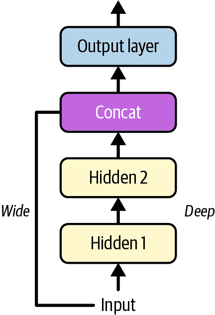
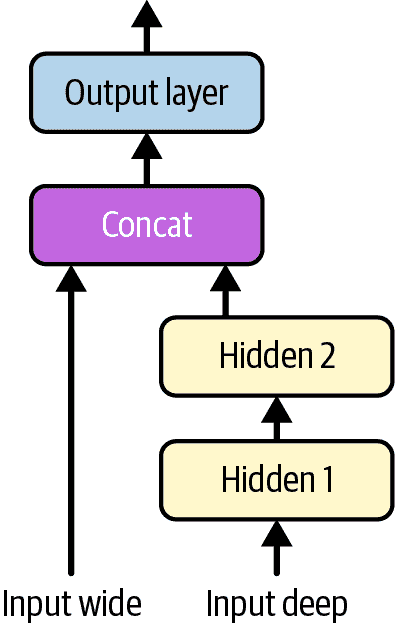

# 第十章\. 使用 PyTorch 构建神经网络

PyTorch 是由 Facebook 的 AI 研究实验室（FAIR，现称为 Meta AI）开发的一个强大的开源深度学习库。它是用 Lua 编程语言编写的 Torch 库的 Python 后继者。使用 PyTorch，您可以构建各种神经网络模型，并使用 GPU（或我们将会看到的其他硬件加速器）进行大规模训练。在许多方面，它与 NumPy 类似，但它还支持硬件加速和自动微分（见第九章），并包括优化器和现成的神经网络组件。

当 PyTorch 在 2016 年发布时，谷歌的 TensorFlow 库无疑是最受欢迎的：它运行速度快，扩展性好，并且可以在许多平台上部署。但它的编程模型复杂且静态，使得使用和调试变得困难。相比之下，PyTorch 是从头开始设计的，旨在提供一种更灵活、更 Pythonic 的方法来构建神经网络。特别是，正如您将看到的，它使用动态计算图（也称为运行时定义），这使得它直观且易于调试。PyTorch 的代码和文档也非常精美，专注于其核心任务：使构建和训练高性能神经网络变得容易。最后但同样重要的是，它强烈倾向于开源文化，并受益于一个热情且专注的社区，以及丰富的生态系统。2022 年 9 月，PyTorch 的治理权甚至转移到了 Linux 基金会的子公司 PyTorch 基金会。所有这些品质都与研究人员产生了共鸣：PyTorch 迅速成为学术界最常用的框架，一旦大多数深度学习论文都基于 PyTorch，行业的大部分也逐渐转向了它。⁠^(1)

在本章中，您将学习如何使用 PyTorch 训练、评估、微调、优化和保存神经网络。我们将首先熟悉 PyTorch 的核心构建块，即张量和 autograd，然后我们将通过构建和训练一个简单的线性回归模型来试水，接着我们将把这个模型升级为一个多层神经网络，首先是用于回归，然后是用于分类。在这个过程中，我们将看到如何构建具有多个输入或输出的自定义神经网络。最后，我们将讨论如何使用 Optuna 库自动微调超参数，以及如何优化和导出您的模型。快上船吧，我们将深入探索深度学习！

###### 注意

Colab 运行时预装了最新版本的 PyTorch。然而，如果您更愿意在自己的机器上安装它，请参阅[*https://homl.info/install-p*](https://homl.info/install-p)上的安装说明：这包括安装 Python、许多库以及 GPU 驱动器（如果您有的话）。

# PyTorch 基础

PyTorch 的核心数据结构是 *张量*。⁠^(2) 它是一个具有形状和数据类型的多维数组，用于数值计算。这不就是和 NumPy 数组一模一样吗？嗯，是的！但张量还有两个额外特性：它可以存在于 GPU（或我们将会看到的其他硬件加速器）上，并且支持自动微分。从现在开始，我们将构建的每一个神经网络都将输入和输出张量（就像 Scikit-Learn 模型输入和输出 NumPy 数组一样）。所以，让我们先看看如何创建和操作张量。

## PyTorch 张量

首先，让我们导入 PyTorch 库：

```py
>>> import torch
```

接下来，您可以创建一个 PyTorch 张量，就像创建 NumPy 数组一样。例如，让我们创建一个 2 × 3 的数组：

```py
>>> X = torch.tensor([[1.0, 4.0, 7.0], [2.0, 3.0, 6.0]])
>>> X
tensor([[1., 4., 7.],
 [2., 3., 6.]])
```

就像 NumPy 数组一样，张量可以包含浮点数、整数、布尔值或复数——每个张量只包含一种数据类型。如果您使用不同类型的数据初始化张量，则将选择最通用的一种（即复数 > 浮点数 > 整数 > 布尔值）。您也可以在创建张量时显式选择数据类型，例如使用 `dtype=torch.float16` 创建 16 位浮点数。请注意，不支持字符串或对象张量。

您可以像这样获取张量的形状和数据类型：

```py
>>> X.shape
torch.Size([2, 3])
>>> X.dtype
torch.float32
```

索引的工作方式与 NumPy 数组相同：

```py
>>> X[0, 1]
tensor(4.)
>>> X[:, 1]
tensor([4., 3.])
```

您还可以在张量上运行各种计算，API 与 NumPy 的非常相似：例如，有 `torch.abs()`、`torch.cos()`、`torch.exp()`、`torch.max()`、`torch.mean()`、`torch.sqrt()` 等等。PyTorch 张量也有这些操作的大部分方法，因此您可以编写 `X.exp()` 而不是 `torch.exp(X)`。让我们尝试几个操作：

```py
>>> 10 * (X + 1.0)  # itemwise addition and multiplication
tensor([[20., 50., 80.],
 [30., 40., 70.]])
>>> X.exp()  # itemwise exponential
tensor([[   2.7183,   54.5981, 1096.6332],
 [   7.3891,   20.0855,  403.4288]])
>>> X.mean()
tensor(3.8333)
>>> X.max(dim=0)  # max values along dimension 0 (i.e., max value per column)
torch.return_types.max(values=tensor([2., 4., 7.]), indices=tensor([1, 0, 0]))
>>> X @ X.T  # matrix transpose and matrix multiplication
tensor([[66., 56.],
 [56., 49.]])
```

###### 注意

PyTorch 在 `max()` 等操作中更喜欢使用 `dim` 参数名，但它也支持 `axis`（如 NumPy 或 Pandas）。

您还可以使用 `numpy()` 方法将张量转换为 NumPy 数组，并从 NumPy 数组创建张量：

```py
>>> import numpy as np
>>> X.numpy()
array([[1., 4., 7.],
 [2., 3., 6.]], dtype=float32)
>>> torch.tensor(np.array([[1., 4., 7.], [2., 3., 6.]]))
tensor([[1., 4., 7.],
 [2., 3., 6.]], dtype=torch.float64)
```

注意，在 PyTorch 中浮点数的默认精度是 32 位，而 NumPy 中是 64 位。在深度学习中通常使用 32 位更好，因为这只需要一半的 RAM 并加快计算速度，而神经网络实际上并不需要 64 位浮点数提供的额外精度。因此，在调用 `torch.tensor()` 函数将 NumPy 数组转换为张量时，最好指定 `dtype=torch.float32`。或者，您可以使用 `torch.FloatTensor()`，它将数组自动转换为 32 位：

```py
>>> torch.FloatTensor(np.array([[1., 4., 7.], [2., 3., 6]]))
tensor([[1., 4., 7.],
 [2., 3., 6.]])
```

###### 小贴士

`torch.tensor()` 和 `torch.FloatTensor()` 都会复制给定的 NumPy 数组。如果您愿意，可以使用 `torch.from_numpy()` 创建一个张量，该张量在 CPU 上直接使用 NumPy 数组的数据，而不进行复制。但请注意：修改 NumPy 数组也会修改张量，反之亦然。

您还可以使用索引和切片修改张量，就像 NumPy 数组一样：

```py
>>> X[:, 1] = -99
>>> X
tensor([[  1., -99.,   7.],
 [  2., -99.,   6.]])
```

PyTorch 的 API 提供了许多原地操作，如`abs_()`、`sqrt_()`和`zero_()`，它们直接修改输入张量：它们有时可以节省一些内存并加快你的模型速度。例如，`relu_()`方法通过将所有负值替换为 0s 来原地应用 ReLU 激活函数：

```py
>>> X.relu_()
>>> X
tensor([[1., 0., 7.],
 [2., 0., 6.]])
```

###### 小贴士

PyTorch 的原地操作很容易一眼看出，因为它们的名字总是以下划线结尾。除了极少数例外（例如，`zero_()`），去掉下划线会得到常规操作（例如，`abs_()`是原地操作，`abs()`不是）。

随着我们继续前进，我们将介绍更多操作，但现在让我们看看如何使用硬件加速来使计算更快。

## 硬件加速

假设你的机器配备有兼容的 GPU，并且已经安装了所需的库，PyTorch 张量可以轻松地复制到 GPU 上。在 Colab 上，你只需确保你正在使用 GPU 运行时：为此，前往运行时菜单并选择“更改运行时类型”，然后确保已选择 GPU（例如，Nvidia T4 GPU）。GPU 运行时将自动安装适当的 PyTorch 库——带有 GPU 支持的编译库——以及适当的 GPU 驱动程序和相关库（例如，Nvidia 的 CUDA 和 cuDNN 库）。⁠^(3) 如果你更喜欢在自己的机器上运行代码，你需要确保你拥有所有所需的驱动程序和库。请遵循[*https://homl.info/install-p*](https://homl.info/install-p)上的说明。

PyTorch 对 Nvidia GPU 以及几个其他硬件加速器提供了出色的支持：

+   苹果的*Metal Performance Shaders* (MPS)用于加速在 M1、M2 等苹果硅芯片以及一些配备兼容 GPU 的 Intel Mac 上的计算。

+   通过 ROCm 软件堆栈或 Windows 上的 DirectML，AMD Instinct 加速器和 AMD Radeon GPU。

+   通过 Intel 的 oneAPI 在 Linux 和 Windows 上使用 Intel GPU 和 CPU。

+   通过`torch_xla`库使用 Google TPUs。

让我们检查 PyTorch 是否可以访问 Nvidia GPU 或苹果的 MPS，否则就回退到 CPU：

```py
if torch.cuda.is_available():
    device = "cuda"
elif torch.backends.mps.is_available():
    device = "mps"
else:
    device = "cpu"
```

###### 警告

深度学习通常需要大量的计算能力，尤其是在我们开始深入研究计算机视觉和自然语言处理时，在接下来的章节中。你需要一台相当强大的机器，但最重要的是你需要一个硬件加速器（或多个）。如果你没有，你可以尝试使用 Colab 或 Kaggle；它们提供带有免费 GPU 的运行时。或者考虑使用其他云服务。否则，请做好耐心等待的准备。

在 Colab 的 GPU 运行时，`device`将等于`"cuda"`。现在让我们在那个 GPU 上创建一个张量。为此，一个选项是在 CPU 上创建张量，然后使用`to()`方法将其复制到 GPU 上：

```py
>>> M = torch.tensor([[1., 2., 3.], [4., 5., 6.]])
>>> M = M.to(device)
```

###### 小贴士

`cpu()`和`cuda()`方法分别是`to("cpu")`和`to("cuda")`的简称。

你可以通过查看张量的`device`属性来始终知道它位于哪个设备上：

```py
>>> M.device
device(type='cuda', index=0)
----
```

或者，我们可以使用`device`参数直接在 GPU 上创建张量：

```py
>>> M = torch.tensor([[1., 2., 3.], [4., 5., 6.]], device=device)
```

###### 小贴士

如果你有多块 Nvidia GPU，你可以通过附加 GPU 索引来引用所需的 GPU：`"cuda:0"`（或仅`"cuda"`）表示 GPU #0，`"cuda:1"`表示 GPU #1，以此类推。

一旦张量在 GPU 上，我们就可以在它上面运行操作，并且所有操作都会在 GPU 上执行：

```py
>>> R = M @ M.T  # run some operations on the GPU
>>> R
tensor([[14., 32.],
 [32., 77.]], device='cuda:0')
```

注意，结果`R`也位于 GPU 上。这意味着我们可以在 GPU 上执行多个操作，而无需在 CPU 和 GPU 之间来回传输数据。这在深度学习中至关重要，因为设备之间的数据传输往往可能成为性能瓶颈。

GPU 能加速计算到什么程度？当然，这取决于 GPU：昂贵的 GPU 比便宜的 GPU 快几十倍。但速度并不是唯一重要的因素：数据吞吐量也同样关键，正如我们刚才看到的。如果你的模型计算密集（例如，一个非常深的神经网络），GPU 的速度和 RAM 量通常最为重要，但如果模型较浅，那么将训练数据泵入 GPU 可能会成为瓶颈。让我们运行一个小测试来比较在 CPU 和 GPU 上运行的矩阵乘法的速度：⁠^(4)

```py
>>> M = torch.rand((1000, 1000))  # on the CPU
>>> %timeit M @ M.T
16.1 ms ± 2.17 ms per loop (mean ± std. dev. of 7 runs, 100 loops each)
>>> M = torch.rand((1000, 1000), device="cuda")  # on the GPU
>>> %timeit M @ M.T
549 µs ± 3.99 µs per loop (mean ± std. dev. of 7 runs, 1000 loops each)
```

哇！GPU 给了我们 29 倍的加速！而且这只是在 Colab 上使用免费的 Nvidia T4 GPU；想象一下使用更强大的 GPU 我们能得到多大的加速。现在尝试调整矩阵大小：你将注意到在较小的矩阵上（例如，100 × 100 矩阵仅为 2×）加速效果并不那么令人印象深刻。这是因为 GPU 通过将大操作分解成小操作并在数千个核心上并行运行来工作。如果任务很小，就不能分解成那么多部分，因此性能提升较小。实际上，当运行许多小任务时，有时直接在 CPU 上运行操作可能会更快。

好的，现在我们已经看到了张量是什么以及如何在 CPU 或 GPU 上使用它们，让我们看看 PyTorch 的自动微分功能。

## Autograd

PyTorch 提供了一个高效的反向模式自动微分实现（在第九章中介绍，在第 A 附录中详细说明），称为*autograd*，代表自动梯度。它非常容易使用。例如，考虑一个简单的函数，f(*x*) = *x*²。微分学告诉我们这个函数的导数是*f’*(*x*) = 2*x*。如果我们评估 f(5)和 f'(5)，我们分别得到 25 和 10。让我们看看 PyTorch 是否同意：

```py
>>> x = torch.tensor(5.0, requires_grad=True)
>>> f = x ** 2
>>> f
tensor(25., grad_fn=<PowBackward0>)
>>> f.backward()
>>> x.grad
tensor(10.)
```

太好了，我们得到了正确的结果：`f`是 25，而`x.grad`是 10！请注意，`backward()`函数自动计算了在相同点*x* = 5.0 处的梯度 f'(*x*)。让我们逐行分析这段代码：

+   首先，我们创建了一个等于 5.0 的张量 `x`，并通过指定 `requires_grad=True` 告诉 PyTorch 它是一个变量（而不是一个常数）。了解这一点后，PyTorch 将自动跟踪所有涉及 `x` 的操作：这是必需的，因为 PyTorch 必须捕获计算图，以便对其运行反向传播并获取 `f` 关于 `x` 的导数。在这个计算图中，张量 `x` 是一个 *叶节点*。

+   然后我们计算 `f = x ** 2`。结果是等于 25.0 的张量，这是 5.0 的平方。但是等等，还有更多：`f` 还携带一个 `grad_fn` 属性，它表示创建此张量的操作（`**`，幂运算，因此命名为 `PowBackward0`），并告诉 PyTorch 如何通过此特定操作反向传播梯度。这个 `grad_fn` 属性是 PyTorch 跟踪计算图的方式。

+   接下来，我们调用 `f.backward()`：这会将梯度通过计算图反向传播，从 `f` 开始，一直回溯到叶节点（在这个例子中就是 `x`）。

+   最后，我们只需读取 `x` 张量的 `grad` 属性，该属性是在反向传播过程中计算的：这给出了 `f` 关于 `x` 的导数。哇塞！

PyTorch 在每次前向传播过程中都会动态创建一个新的计算图，因为操作正在执行。这使得 PyTorch 能够支持包含循环和条件语句的非常动态的模型。

###### 警告

PyTorch 在每个变量的 `grad` 属性中累积梯度的方式一开始可能会让人感到惊讶，尤其是对于来自 TensorFlow 或 JAX 的用户。在这些框架中，计算 `f` 关于 `x` 的梯度只会返回梯度，而不会影响 `x`。在 PyTorch 中，如果你对一个张量调用 `backward()`，它将累积用于计算它的每个变量的梯度。所以如果你对两个都使用了相同变量 `v` 的张量 `t1` 和 `t2` 调用 `backward()`，那么 `v.grad` 将是它们梯度的总和。

计算梯度后，你通常想要通过从模型变量中减去梯度的一部分来执行梯度下降步骤（至少在训练神经网络时是这样）。在我们的简单例子中，运行梯度下降将逐渐将 `x` 推向 0，因为这是使 f(*x*) = *x*² 最小的值。要进行梯度下降步骤，你必须暂时禁用梯度跟踪，因为你不希望在计算图中跟踪梯度下降步骤本身（实际上，如果你尝试在跟踪变量上运行原地操作，PyTorch 会引发异常）。这可以通过将梯度下降步骤放在 `torch.no_grad()` 上下文中来完成，如下所示：

```py
learning_rate = 0.1
with torch.no_grad():
    x -= learning_rate * x.grad  # gradient descent step
```

变量 `x` 减少了 0.1 * 10.0 = 1.0，从 5.0 减少到 4.0。

避免梯度计算的另一种方法是使用变量的 `detach()` 方法：这创建了一个新的与计算图分离的张量，`requires_grad=False`，但仍然指向内存中的相同数据。然后你可以更新这个分离的张量：

```py
x_detached = x.detach()
x_detached -= learning_rate * x.grad
```

由于 `x_detached` 和 `x` 共享相同的内存，修改 `x_detached` 也会修改 `x`。

当你需要在一个张量上运行一些计算而不影响梯度（例如，用于评估或记录）或当你需要精细控制哪些操作应该对梯度计算做出贡献时，`detach()` 方法会很有用。在执行推理或进行梯度下降步骤时，通常更喜欢使用 `no_grad()`，因为它提供了一个方便的上下文方法来禁用梯度跟踪。

最后，在你重复整个过程（前向传播 + 反向传播 + 梯度下降步骤）之前，将每个模型参数的梯度置零是至关重要的（由于梯度张量 `requires_grad=False`，你不需要 `no_grad()` 上下文）：

```py
x.grad.zero_()
```

###### 警告

如果你忘记在每个训练迭代中将梯度置零，`backward()` 方法将只是累积它们，导致梯度下降更新不正确。由于不会出现任何明确的错误，只是性能低下（可能还有无限或 NaN 值），这个问题可能很难调试。

将所有这些放在一起，整个训练循环看起来像这样：

```py
learning_rate = 0.1
x = torch.tensor(5.0, requires_grad=True)
for iteration in range(100):
    f = x ** 2  # forward pass
    f.backward()  # backward pass
    with torch.no_grad():
        x -= learning_rate * x.grad  # gradient descent step

    x.grad.zero_()  # reset the gradients
```

如果你想要使用原地操作来节省内存并稍微加快你的模型速度，避免不必要的复制操作，你必须小心：原地操作并不总是与自动微分很好地配合。首先，正如我们之前看到的，你不能对一个叶节点（即具有 `requires_grad=True` 的张量）应用原地操作，因为 PyTorch 不会知道在哪里存储计算图。例如 `x.cos_()` 或 `x += 1` 会引发 `RuntimeError`。其次，考虑以下代码，它在 `t = 2` 时计算 z(*t*) = exp(*t*) + 1，然后尝试计算梯度：

```py
t = torch.tensor(2.0, requires_grad=True)
z = t.exp()  # this is an intermediate result
z += 1  # this is an in-place operation
z.backward()  #  RuntimeError!

```

哦不！虽然 `z` 被正确计算，但最后一行引发了 `RuntimeError`，抱怨“用于梯度计算的一个变量已被原地操作修改”。确实，当我们运行原地操作 `z += 1` 时，中间结果 `z = t.exp()` 被丢失，所以当反向传播到达指数操作时，无法计算梯度。一个简单的修复是将 `z += 1` 替换为 `z = z + 1`。它看起来很相似，但它不再是原地操作：创建了一个新的张量并将其分配给相同的变量，但原始张量保持不变，并记录在最终张量的计算图中。

令人惊讶的是，如果你在之前的代码示例中将 `exp()` 替换为 `cos()`，梯度将会被正确计算：没有错误！这是为什么？嗯，结果取决于每个操作是如何实现的：

+   一些操作，例如`exp()`、`relu()`、`rsqrt()`、`sigmoid()`、`sqrt()`、`tan()`和`tanh()`，在正向传播期间将它们的输出保存到计算图中，然后在反向传播期间使用这些输出来计算梯度。⁠^(5) 这意味着您不能原地修改此类操作的输出，否则在反向传播期间将得到错误（正如我们刚才看到的）。

+   其他操作，例如`abs()`、`cos()`、`log()`、`sin()`、`square()`和`var()`，保存它们的输入而不是输出。⁠^(6) 这样的操作不关心您是否原地修改了它的输出，但您必须在反向传播之前不要原地修改它的输入（例如，基于相同的输入计算其他内容）。

+   一些操作，例如`max()`、`min()`、`norm()`、`prod()`、`sgn()`和`std()`，保存输入和输出，因此在反向传播之前您不能原地修改它们中的任何一个。

+   最后，一些操作，例如`ceil()`、`floor()`、`mean()`、`round()`和`sum()`，既不保存它们的输入也不保存它们的输出。⁠^(7) 您可以安全地原地修改它们。

###### 小贴士

首先在不进行原地操作的情况下实现您的模型，然后如果您需要节省一些内存或稍微加快模型的速度，您可以尝试将一些最昂贵的操作转换为它们的原地对应操作。只需确保您的模型对于给定的输入仍然输出相同的结果，并且确保您在反向传播之前不要修改用于反向传播的张量（在这种情况下，您将得到一个`RuntimeError`）。

好的，让我们稍微回顾一下。我们已经讨论了 PyTorch 的所有基础知识：如何创建张量并使用它们执行各种计算，如何使用 GPU 加速计算，以及如何使用自动微分来计算梯度下降的梯度。太棒了！现在让我们通过使用 PyTorch 构建和训练一个简单的线性回归模型来应用我们迄今为止所学的内容。

# 实现线性回归

我们将首先直接使用张量和自动微分实现线性回归，然后我们将使用 PyTorch 的高级 API 简化代码，并添加 GPU 支持。

## 使用张量和自动微分进行线性回归

让我们处理与第九章中相同的加利福尼亚住房数据集。我将假设您已经使用`sklearn.datasets.fetch_california_housing()`下载了它，并且您已经使用`sklearn.model_selection.train_test_split()`将其分为训练集（`X_train`和`y_train`）、验证集（`X_valid`和`y_valid`）和测试集（`X_test`和`y_test`）。接下来，让我们将其转换为张量并进行归一化。我们可以使用`StandardScaler`来完成这项工作，就像我们在第九章中所做的那样，但让我们只使用张量操作来练习一下：

```py
X_train = torch.FloatTensor(X_train)
X_valid = torch.FloatTensor(X_valid)
X_test = torch.FloatTensor(X_test)
means = X_train.mean(dim=0, keepdims=True)
stds = X_train.std(dim=0, keepdims=True)
X_train = (X_train - means) / stds
X_valid = (X_valid - means) / stds
X_test = (X_test - means) / stds
```

让我们也把目标转换为张量。由于我们的预测将是列向量（即只有一列的矩阵），我们需要确保我们的目标也是列向量。⁠^(8) 不幸的是，表示目标的 NumPy 数组是一维的，因此我们需要通过添加一个大小为 1 的第二个维度来重塑张量成为列向量。⁠^(9)

```py
y_train = torch.FloatTensor(y_train).reshape(-1, 1)
y_valid = torch.FloatTensor(y_valid).reshape(-1, 1)
y_test = torch.FloatTensor(y_test).reshape(-1, 1)
```

现在数据已经准备好了，让我们创建线性回归模型的参数：

```py
torch.manual_seed(42)
n_features = X_train.shape[1]  # there are 8 input features
w = torch.randn((n_features, 1), requires_grad=True)
b = torch.tensor(0., requires_grad=True)
```

现在我们有一个权重参数`w`（一个列向量，每个输入维度有一个权重，在这种情况下是 8），以及一个偏置参数`b`（一个单一的标量）。权重随机初始化，而偏置初始化为零。在这种情况下，我们也可以将权重初始化为零，但当我们到达神经网络时，将权重随机初始化以打破神经元之间的对称性（如第九章中解释的那样）将变得很重要，所以我们现在就养成这个习惯。

###### 警告

我们调用了`torch.manual_seed()`来确保结果可重现。然而，PyTorch 不能保证在不同版本、平台或设备上具有完全可重现的结果，所以如果你不在使用 PyTorch 2.8.0 的 Colab 运行时和带有 Nvidia T4 GPU 的情况下运行本章的代码，你可能会得到不同的结果。此外，由于 GPU 将每个操作分成多个块并并行运行，这些块完成顺序可能会因运行而异，这可能会由于浮点精度误差而略微影响结果。这些细微的差异在训练过程中可能会累积，导致模型非常不同。为了避免这种情况，你可以通过调用`torch.use_deterministic_algorithms(True)`并设置`torch.backends.cudnn.benchmark = False`来告诉 PyTorch 只使用确定性算法。然而，确定性算法通常比随机算法慢，而且某些操作根本就没有确定性版本，所以如果你的代码尝试使用它，你会得到一个错误。

接下来，让我们训练我们的模型，这与我们在第四章中做的方法非常相似，只是我们将使用自动微分来计算梯度，而不是使用闭式方程。目前我们将使用批量梯度下降（BGD），在每个训练步骤中使用整个训练集：

```py
learning_rate = 0.4
n_epochs = 20
for epoch in range(n_epochs):
    y_pred = X_train @ w + b
    loss = ((y_pred - y_train) ** 2).mean()
    loss.backward()
    with torch.no_grad():
        b -= learning_rate * b.grad
        w -= learning_rate * w.grad
        b.grad.zero_()
        w.grad.zero_()
    print(f"Epoch {epoch + 1}/{n_epochs}, Loss: {loss.item()}")
```

让我们逐步分析这段代码：

+   首先，我们定义`learning_rate`超参数。你可以尝试不同的值，以找到一个收敛快且结果精确的值。

+   接下来，我们运行 20 个 epoch。我们可以实现提前停止来找到停止的正确时机，避免过拟合，就像我们在第四章中做的那样，但现在我们将保持简单。

+   接下来，我们运行前向传播：我们计算预测值`y_pred`和均方误差`loss`。

+   然后我们运行`loss.backward()`来计算损失相对于每个模型参数的梯度。这是自动微分的作用。

+   接下来，我们使用梯度 `b.grad` 和 `w.grad` 执行梯度下降步骤。请注意，我们像之前讨论的那样，在这个 `with torch.no_grad()` 上下文中运行这段代码。

+   一旦我们完成了梯度下降步骤，我们将梯度重置为零（非常重要！）。

+   最后，我们在每个时期打印时期编号和当前的损失。`item()` 方法提取标量张量的值。

就这样；如果你运行这段代码，你应该看到训练损失像这样下降：

```py
Epoch 1/20, Loss: 16.158456802368164
Epoch 2/20, Loss: 4.8793745040893555
Epoch 3/20, Loss: 2.255225419998169
[...]
Epoch 20/20, Loss: 0.5684100389480591
```

恭喜，你刚刚使用 PyTorch 训练了你的第一个模型！你现在可以使用这个模型对新数据 `X_new` 进行预测（这些数据必须表示为 PyTorch 张量）。例如，让我们对测试集中的前三个实例进行预测：

```py
>>> X_new = X_test[:3]  # pretend these are new instances
>>> with torch.no_grad():
...     y_pred = X_new @ w + b  # use the trained parameters to make predictions
...
>>> y_pred
tensor([[0.8916],
 [1.6480],
 [2.6577]])
```

###### 小贴士

在推理期间最好使用 `with torch.no_grad()` 上下文：由于 PyTorch 不需要跟踪计算图，它将消耗更少的 RAM 并运行得更快。

使用 PyTorch 的低级 API 实现线性回归并不太难，但使用这种方法为更复杂的模型会变得非常混乱且困难。因此，PyTorch 提供了一个高级 API 来简化所有这些。让我们使用这个高级 API 重新编写我们的模型。

## 使用 PyTorch 的高级 API 进行线性回归

PyTorch 在 `torch.nn.Linear` 类中提供了一个线性回归的实现，所以让我们使用它：

```py
import torch.nn as nn  # by convention, this module is usually imported this way

torch.manual_seed(42)  # to get reproducible results
model = nn.Linear(in_features=n_features, out_features=1)
```

`nn.Linear` 类（简称 `torch.nn.Linear`）是 PyTorch 提供的许多 *模块* 之一。每个模块都是 `nn.Module` 类的子类。要构建一个简单的线性回归模型，只需要一个 `nn.Linear` 模块。然而，对于大多数神经网络，你将需要组装许多模块，正如我们将在本章后面看到的那样，所以你可以将模块视为数学乐高积木。许多模块包含模型参数。例如，`nn.Linear` 模块包含一个 `bias` 向量（每个神经元一个偏置项），以及一个 `weight` 矩阵（每个神经元一行，每个输入维度一列，这是之前我们使用的权重矩阵的转置，并在 方程 9-2 中提到）。由于我们的模型只有一个神经元（因为 `out_features=1`），`bias` 向量包含一个单独的偏置项，`weight` 矩阵包含一行。这些参数可以直接作为 `nn.Linear` 模块的属性访问：

```py
>>> model.bias
Parameter containing:
tensor([0.3117], requires_grad=True)
>>> model.weight
Parameter containing:
tensor([[ 0.2703, 0.2935, -0.0828, 0.3248, -0.0775, 0.0713, -0.1721, 0.2076]],
 requires_grad=True)
```

注意，这两个参数都是自动随机初始化的（这就是为什么我们使用了`manual_seed()`来获得可重复的结果）。这些参数是`torch.nn.Parameter`类的实例，它是`tensor.Tensor`类的子类：这意味着你可以像使用普通张量一样使用它们。模块的`parameters()`方法返回一个迭代器，遍历模块的所有类型为`Parameter`的属性，以及所有子模块的所有参数（如果有的话），递归地（如果有）。它**不**返回常规张量，即使那些带有`requires_grad=True`的张量。这是常规张量和`Parameter`之间的主要区别：

```py
>>> for param in model.parameters():
...     [...]  # do something with each parameter
```

此外，还有一个`named_parameters()`方法，它返回一个参数名称和值的对迭代器。

模块可以像常规函数一样被调用。例如，让我们为训练集中的前两个实例进行一些预测（因为模型尚未训练，其参数是随机的，预测非常糟糕）：

```py
>>> model(X_train[:2])
tensor([[-0.4718],
 [ 0.1131]], grad_fn=<AddmmBackward0>)
```

当我们将模块作为函数使用时，PyTorch 内部调用模块的`forward()`方法。在`nn.Linear`模块的情况下，`forward()`方法计算`X @ self.weight.T + self.bias`（其中`X`是输入）。这正是线性回归所需要的！

注意，结果包含`grad_fn`属性，表明 autograd 完成了其工作，并在模型进行预测时跟踪了计算图。

###### 小贴士

如果你将自定义函数传递给模块的`register_forward_hook()`方法，它将在每次模块本身被调用时自动被调用。这对于记录或调试特别有用。要移除钩子，只需在`register_forward_hook()`返回的对象上调用`remove()`方法。请注意，钩子仅在将模型作为函数调用时才起作用，而不是直接调用其`forward()`方法（这就是为什么你不应该这样做）。你还可以使用`register_backward_hook()`注册在反向传播期间运行的函数。

现在我们有了我们的模型，我们需要创建一个优化器来更新模型参数，并且我们必须选择一个损失函数：

```py
optimizer = torch.optim.SGD(model.parameters(), lr=learning_rate)
mse = nn.MSELoss()
```

PyTorch 提供了一些不同的优化器（我们将在下一章中讨论它们）。在这里，我们使用简单的随机梯度下降（SGD）优化器，它可以用于 SGD、小批量 GD 或批量梯度下降。为了初始化它，我们必须提供模型参数和学习率。

对于损失函数，我们创建了一个`nn.MSELoss`类的实例：这也是一个模块，所以我们可以像函数一样使用它，给它提供预测和目标，然后它会计算均方误差。`nn`模块包含许多其他损失函数和其他神经网络工具，我们将在后面看到。接下来，让我们编写一个小的函数来训练我们的模型：

```py
def train_bgd(model, optimizer, criterion, X_train, y_train, n_epochs):
    for epoch in range(n_epochs):
        y_pred = model(X_train)
        loss = criterion(y_pred, y_train)
        loss.backward()
        optimizer.step()
        optimizer.zero_grad()
        print(f"Epoch {epoch + 1}/{n_epochs}, Loss: {loss.item()}")
```

将这个训练循环与我们的早期训练循环进行比较：它们非常相似，但现在我们使用的是高级构造而不是直接与张量和 autograd 交互。以下是一些需要注意的事项：

+   在 PyTorch 中，损失函数对象通常被称为*criterion*，以区分它本身（在每次训练迭代中使用*criterion*计算）。在这个例子中，它是`MSELoss`实例。

+   `optimizer.step()`这一行对应于我们早期代码中更新`b`和`w`的两行。

+   当然，`optimizer.zero_grad()`这一行对应于我们早期代码中使`b.grad`和`w.grad`归零的两行。请注意，我们在这里不需要使用`with torch.no_grad()`，因为这是由优化器自动在`step()`和`zero_grad()`函数内部完成的。

###### 注意

大多数人更喜欢在调用`loss.backward()`之前调用`zero_grad()`，而不是之后：如果调用函数时梯度不为零，这可能会更安全一些，但总的来说，由于梯度会自动初始化为`None`，所以这并没有什么区别。

现在让我们调用这个函数来训练我们的模型！

```py
>>> train_bgd(model, optimizer, mse, X_train, y_train, n_epochs)
Epoch 1/20, Loss: 4.3378496170043945
Epoch 2/20, Loss: 0.780293345451355
[...]
Epoch 20/20, Loss: 0.5374288558959961
```

所有这些都很好；模型已经训练完成，你现在可以像调用函数一样使用它来做出预测（最好在`no_grad()`上下文中调用，就像我们之前看到的）：

```py
>>> X_new = X_test[:3]  # pretend these are new instances
>>> with torch.no_grad():
...     y_pred = model(X_new)  # use the trained model to make predictions
...
>>> y_pred
tensor([[0.8061],
 [1.7116],
 [2.6973]])
```

这些预测与我们的先前模型做出的预测相似，但并不完全相同。这是因为`nn.Linear`模块初始化参数的方式略有不同：它使用从$minus StartFraction StartRoot 2 EndRoot Over 4 EndFraction$到$plus StartFraction StartRoot 2 EndRoot Over 4 EndFraction$的均匀随机分布来初始化权重和偏置项（我们将在第十一章中讨论初始化方法）。

现在你已经熟悉了 PyTorch 的高级 API，你就可以超越线性回归并构建多层感知器（在第九章 ann_chapter 中介绍）。

# 实现回归 MLP

PyTorch 提供了一个有用的`nn.Sequential`模块，可以将多个模块链接起来：当你用一些输入调用这个模块时，它会将这些输入传递给第一个模块，然后将第一个模块的输出传递给第二个模块，依此类推。大多数神经网络包含模块堆叠，实际上许多神经网络只是模块的一个大堆叠：这使得`nn.Sequential`模块成为 PyTorch 中最有用的模块之一。我们想要构建的 MLP 正是这样：一个简单的模块堆叠——两个隐藏层和一个输出层。所以让我们使用`nn.Sequential`模块来构建它：

```py
torch.manual_seed(42)
model = nn.Sequential(
    nn.Linear(n_features, 50),
    nn.ReLU(),
    nn.Linear(50, 40),
    nn.ReLU(),
    nn.Linear(40, 1)
)
```

让我们逐层分析：

+   第一层必须具有适合我们数据的正确输入数量：`n_features`（在我们的例子中等于 8）。然而，它可以有任意数量的输出：让我们选择 50（这是一个我们可以调整的超参数）。

+   接下来，我们有一个`nn.ReLU`模块，它实现了第一隐藏层的 ReLU 激活函数。此模块不包含任何模型参数，并且逐项操作，因此其输出形状等于其输入形状。

+   第二隐藏层必须具有与前一层的输出相同的输入数量：在这种情况下，50。然而，它可以有任意数量的输出。在所有隐藏层中使用相同数量的输出维度是常见的，但在本例中我使用了 40，以便清楚地表明一层的输出必须匹配下一层的输入。

+   然后，再次使用`nn.ReLU`模块来实现第二隐藏层的激活函数。

+   最后，输出层必须有 40 个输入，但这次其输出数量不是自由的：它必须匹配目标的维度。由于我们的目标只有一个维度，因此输出层必须只有一个输出维度。

现在，让我们像之前一样训练模型：

```py
>>> learning_rate = 0.1
>>> optimizer = torch.optim.SGD(model.parameters(), lr=learning_rate)
>>> mse = nn.MSELoss()
>>> train_bgd(model, optimizer, mse, X_train, y_train, n_epochs)
Epoch 1/20, Loss: 5.045480251312256
Epoch 2/20, Loss: 2.0523128509521484
[...]
Epoch 20/20, Loss: 0.565444827079773
```

就这样，你可以告诉你的朋友你已经用 PyTorch 训练了你的第一个神经网络！然而，我们仍然在使用批量梯度下降，在每个迭代中计算整个训练集的梯度。这对于小型数据集来说是可以的，但如果我们想要能够扩展到大型数据集和大型模型，我们需要切换到小批量梯度下降。

# 使用 DataLoader 实现小批量梯度下降

为了帮助实现小批量梯度下降，PyTorch 在`torch.utils.data`模块中提供了一个名为`DataLoader`的类。它可以高效地加载所需大小的一批数据，如果我们想要的话，还可以在每个 epoch 中打乱数据。`DataLoader`期望数据集以至少具有两个方法的对象表示：`__len__(self)`用于获取数据集中的样本数量，`__getitem__(self, index)`用于加载给定索引处的样本（包括目标）。

在我们的情况下，训练集包含在`X_train`和`y_train`张量中，因此我们首先需要将这些张量包装在具有所需 API 的数据集对象中。为此，PyTorch 提供了一个`TensorDataset`类。所以让我们构建一个`TensorDataset`来包装我们的训练集，并创建一个`DataLoader`来从这个数据集中提取批次。在训练过程中，我们希望数据集被打乱，所以我们指定`shuffle=True`：

```py
from torch.utils.data import TensorDataset, DataLoader

train_dataset = TensorDataset(X_train, y_train)
train_loader = DataLoader(train_dataset, batch_size=32, shuffle=True)
```

现在我们有一个更大的模型，并且我们有工具可以一次训练一个批次，现在是时候开始使用硬件加速了。这实际上非常简单：我们只需要将模型移动到 GPU 上，这将将其所有参数移动到 GPU RAM 中，然后在训练的每个迭代的开始时，我们必须将每个批次复制到 GPU 上。要移动模型，我们可以使用它的`to()`方法，就像我们处理张量一样：

```py
torch.manual_seed(42)
model = nn.Sequential([...])  # create the model just like earlier
model = model.to(device)
```

我们也可以创建损失函数和优化器，就像之前一样（但使用较低的学习率，例如 0.02）。

###### 警告

一些优化器有一些内部状态，我们将在第十一章中看到。优化器通常会在与模型参数相同的设备上分配其状态，因此在你将模型移动到 GPU 后创建优化器是很重要的。

现在让我们创建一个 `train()` 函数来实现小批量 GD：

```py
def train(model, optimizer, criterion, train_loader, n_epochs):
    model.train()
    for epoch in range(n_epochs):
        total_loss = 0.
        for X_batch, y_batch in train_loader:
            X_batch, y_batch = X_batch.to(device), y_batch.to(device)
            y_pred = model(X_batch)
            loss = criterion(y_pred, y_batch)
            total_loss += loss.item()
            loss.backward()
            optimizer.step()
            optimizer.zero_grad()

        mean_loss = total_loss / len(train_loader)
        print(f"Epoch {epoch + 1}/{n_epochs}, Loss: {mean_loss:.4f}")
```

在每个时代，函数会逐批迭代整个训练集，一次处理一个批次，就像之前一样。但是，关于第一行：`model.train()` 呢？嗯，这会将模型及其所有子模块切换到**训练模式**。目前，这并没有什么区别，但在第十一章中，当我们开始使用在训练和评估期间表现不同的层（例如，`nn.Dropout` 或 `nn.BatchNorm1d`）时，它将变得很重要。每次你想在训练之外使用模型（例如，用于评估或对新实例进行预测）时，你必须首先通过运行 `model.eval()` 将模型切换到**评估模式**。请注意，`model.training` 包含一个布尔值，表示当前模式。

###### 小贴士

PyTorch 本身不提供训练循环的实现；你必须自己构建它。正如我们刚才看到的，这并不长，许多人喜欢这种提供的自由、清晰和控制。然而，如果你更喜欢使用经过良好测试的现成训练循环，并且包含你需要的所有功能（例如，多 GPU 支持），那么你可以使用像 PyTorch Lightning、FastAI、Catalyst 或 Keras 这样的库。这些库建立在 PyTorch 之上，包括训练循环和许多其他功能（Keras 自版本 3 开始支持 PyTorch，同时也支持 TensorFlow 和 JAX）。查看它们吧！

现在让我们调用这个 `train()` 函数来在 GPU 上训练我们的模型：

```py
>>> train(model, optimizer, mse, train_loader, n_epochs)
Epoch 1/20, Loss: 0.6958
Epoch 2/20, Loss: 0.4480
[...]
Epoch 20/20, Loss: 0.3227
```

它工作得很好：我们实际上在相同的周期数中达到了更低的损失！然而，你可能注意到了每个周期都要慢得多。你可以进行两个简单的调整来显著加快训练速度：

+   如果你使用 CUDA 设备，在创建数据加载器时通常应该设置 `pin_memory=True`：这将数据分配在**页锁定内存**中，这保证了在 CPU RAM 中的固定物理内存位置，因此允许直接内存访问（DMA）传输到 GPU，消除了否则需要的额外复制操作。虽然这可能会使用更多的 CPU RAM，因为内存不能交换到磁盘上，但它通常会导致数据传输速度显著加快，从而加快训练速度。在用其 `to()` 方法将张量传输到 GPU 时，你也可以设置 `non_blocking=True` 以避免在数据传输期间阻塞 CPU（这仅在 `pin_memory=True` 时有效）。

+   当前的训练循环会在完全处理完一个批次之后才加载下一个批次。你可以在 GPU 仍在处理当前批次的同时，在 CPU 上预取下一个批次来加快训练速度。为此，将数据加载器的`num_workers`参数设置为你要用于数据加载和预处理的进程数。最佳数值取决于你的平台、硬件和工作负载，因此你应该尝试不同的值。你还可以通过设置数据加载器的`prefetch_factor`参数来调整每个工作进程预取的批次数量。请注意，启动和同步工作进程的开销可能会使训练速度变慢而不是变快（尤其是在 Windows 上）。在这种情况下，你可以尝试设置`persistent_workers=True`来跨 epoch 重用相同的工人。

好的，现在让我们稍微退后一步：你知道 PyTorch 的基础知识（张量和自动微分），你可以使用 PyTorch 的高级 API 构建神经网络，并使用优化器、损失函数和数据加载器通过小批量梯度下降来训练它们。下一步是学习如何评估你的模型。

# 模型评估

让我们编写一个函数来评估模型。它接受模型以及一个用于评估模型的数据集的`DataLoader`，以及一个用于计算给定批次的度量函数，最后是一个用于聚合批次度量的函数（默认情况下，它只是计算平均值）：

```py
def evaluate(model, data_loader, metric_fn, aggregate_fn=torch.mean):
    model.eval()
    metrics = []
    with torch.no_grad():
        for X_batch, y_batch in data_loader:
            X_batch, y_batch = X_batch.to(device), y_batch.to(device)
            y_pred = model(X_batch)
            metric = metric_fn(y_pred, y_batch)
            metrics.append(metric)
    return aggregate_fn(torch.stack(metrics))
```

现在，让我们为我们的验证集构建一个`TensorDataset`和一个`DataLoader`，并将其传递给我们的`evaluate()`函数来计算验证 MSE：

```py
>>> valid_dataset = TensorDataset(X_valid, y_valid)
>>> valid_loader = DataLoader(valid_dataset, batch_size=32)
>>> valid_mse = evaluate(model, valid_loader, mse)
>>> valid_mse
tensor(0.4080, device='cuda:0')
```

它运行正常。但现在假设我们想使用 RMSE 而不是 MSE（如我们在第二章中看到的，它可能更容易解释）。PyTorch 没有内置该函数，但编写它很容易：

```py
>>> def rmse(y_pred, y_true):
...     return ((y_pred - y_true) ** 2).mean().sqrt()
...
>>> evaluate(model, valid_loader, rmse)
tensor(0.5668, device='cuda:0')
```

但等等！RMSE 应该等于 MSE 的平方根；然而，当我们计算我们之前找到的 MSE 的平方根时，我们得到一个不同的结果：

```py
>>> valid_mse.sqrt()
tensor(0.6388, device='cuda:0')
```

原因是，我们不是在整个验证集上计算 RMSE，而是对每个批次进行计算，然后计算所有这些批次 RMSE 的平均值。这从数学上不等同于在整个验证集上计算 RMSE。为了解决这个问题，我们可以使用 MSE 作为我们的`metric_fn`，并使用`aggregate_fn`来计算平均 MSE 的平方根：⁠^(10)

```py
>>> evaluate(model, valid_loader, mse,
...          aggregate_fn=lambda metrics: torch.sqrt(torch.mean(metrics)))
...
tensor(0.6388, device='cuda:0')
```

这好多了！

与其自己实现度量，你可能更愿意使用 TorchMetrics 库（由 PyTorch Lightning 团队制作），它提供了许多经过良好测试的*流度量*。流度量是一个跟踪给定度量的对象，可以逐批更新。TorchMetrics 库在 Colab 上没有预安装，因此我们必须运行`%pip install torchmetrics`，然后我们可以实现`evaluate_tm()`函数，如下所示：

```py
import torchmetrics

def evaluate_tm(model, data_loader, metric):
    model.eval()
    metric.reset()  # reset the metric at the beginning
    with torch.no_grad():
        for X_batch, y_batch in data_loader:
            X_batch, y_batch = X_batch.to(device), y_batch.to(device)
            y_pred = model(X_batch)
            metric.update(y_pred, y_batch)  # update it at each iteration
    return metric.compute()  # compute the final result at the end
```

然后，我们可以创建一个 RMSE 流量指标，将其移动到 GPU 上，并使用它来评估验证集：

```py
>>> rmse = torchmetrics.MeanSquaredError(squared=False).to(device)
>>> evaluate_tm(model, valid_loader, rmse)
tensor(0.6388, device='cuda:0')
```

果然，我们得到了正确的结果！现在尝试更新 `train()` 函数，以评估模型在训练过程中的性能，包括在训练集（在每个 epoch 期间）和验证集（在每个 epoch 结束时）。像往常一样，如果训练集上的性能远好于验证集，那么你的模型可能过度拟合了训练集，或者存在一个错误，比如训练集和验证集之间的数据不匹配。如果你绘制并分析学习曲线，这会更容易检测到，就像我们在 第四章 中做的那样。为此，你可以使用 Matplotlib 或 TensorBoard 这样的可视化工具（参见笔记本中的示例）。

现在你已经知道了如何使用 PyTorch 构建、训练和评估一个回归 MLP，以及如何使用训练好的模型进行预测。太棒了！但到目前为止，我们只看了简单的顺序模型，由一系列线性层和 ReLU 激活函数组成。你将如何构建一个更复杂、非顺序的模型呢？为此，我们需要构建自定义模块。

# 使用自定义模块构建非顺序模型

非顺序神经网络的一个例子是 *宽 & 深度* 神经网络。这种神经网络架构是在 2016 年由 Heng-Tze Cheng 等人发表的一篇论文中提出的。它将所有或部分输入直接连接到输出层，如图 图 10-1 所示。这种架构使得神经网络能够学习深度模式（使用深度路径）和简单规则（通过短路径）。短路径也可以用来向神经网络提供手动工程化的特征。相比之下，一个常规的 MLP 强制所有数据都通过完整的层堆栈；因此，数据中的简单模式可能会被这个变换序列扭曲。



###### 图 10-1\. 宽度与深度神经网络

让我们构建这样一个神经网络来处理加利福尼亚住房数据集。因为这个宽度和深度架构是非顺序的，我们必须创建一个自定义模块。这比听起来容易：只需创建一个从 `torch.nn.Module` 派生的类，然后在构造函数中（在调用基类的 `__init__()` 方法之后）创建所有需要的层，并在 `forward()` 方法中定义这些层应该如何被模块使用：

```py
class WideAndDeep(nn.Module):
    def __init__(self, n_features):
        super().__init__()
        self.deep_stack = nn.Sequential(
            nn.Linear(n_features, 50), nn.ReLU(),
            nn.Linear(50, 40), nn.ReLU(),
        )
        self.output_layer = nn.Linear(40 + n_features, 1)

    def forward(self, X):
        deep_output = self.deep_stack(X)
        wide_and_deep = torch.concat([X, deep_output], dim=1)
        return self.output_layer(wide_and_deep)
```

注意，我们可以在自定义模块内部使用任何类型的模块：在这个例子中，我们使用 `nn.Sequential` 模块来构建模型中的“深度”部分（实际上并不深；这只是一个玩具示例）。它与之前的 MLP 相同，只是我们分离了输出层，因为我们需要将模型输入和深度部分的输出连接起来输入。出于同样的原因，输出层现在有 40 + `n_features` 个输入，而不是仅仅 40 个。

在 `forward()` 方法中，我们只需将输入 `X` 输送到深度堆叠中，连接输入和深度堆叠的输出，然后将结果输入到输出层。

###### 注意

模块有一个 `children()` 方法，它返回模块子模块（非递归）的迭代器。还有一个 `named_children()` 方法。如果你的模型具有可变数量的子模块，你应该将它们存储在 `nn.ModuleList` 或 `nn.ModuleDict` 中，这些是由 `children()` 和 `named_children()` 方法返回的（与常规 Python 列表和字典不同）。同样，如果你的模型具有可变数量的参数，你应该将它们存储在 `nn.ParameterList` 或 `nn.ParameterDict` 中，以确保它们由 `parameters()` 和 `named_parameters()` 方法返回。

现在，我们可以创建自定义模块的一个实例，将其移动到 GPU 上，对其进行训练、评估，并像我们之前的模型一样使用它：

```py
torch.manual_seed(42)
model = WideAndDeep(n_features).to(device)
learning_rate = 0.002  # the model changed, so did the optimal learning rate
[...]  # train, evaluate, and use the model, exactly like earlier
```

但如果你想要将特征子集通过宽路径发送，而将不同的子集（可能重叠）通过深度路径发送，如图 图 10-2 所示，那会怎样？在这种情况下，一种方法是在 `forward()` 方法内部拆分输入，例如：

```py
class WideAndDeepV2(nn.Module):
    [...]  # same constructor as earlier, except with adjusted input sizes

    def forward(self, X):
        X_wide = X[:, :5]
        X_deep = X[:, 2:]
        deep_output = self.deep_stack(X_deep)
        wide_and_deep = torch.concat([X_wide, deep_output], dim=1)
        return self.output_layer(wide_and_deep)
```

这工作得很好；然而，在许多情况下，直接让模型接受两个独立的张量作为输入更为可取。让我们看看为什么以及如何做到这一点。

## 使用多个输入构建模型

一些模型需要多个输入，这些输入不能轻易地合并成一个张量。例如，输入可能具有不同的维度数量（例如，当你想将图像和文本同时输入到神经网络中时）。为了让我们的 Wide & Deep 模型接受两个独立的输入，如图 图 10-2 所示，我们必须首先更改模型的 `forward()` 方法：

```py
class WideAndDeepV3(nn.Module):
    [...]  # same as WideAndDeepV2

    def forward(self, X_wide, X_deep):
        deep_output = self.deep_stack(X_deep)
        wide_and_deep = torch.concat([X_wide, deep_output], dim=1)
        return self.output_layer(wide_and_deep)
```



###### 图 10-2\. 处理多个输入

接下来，我们需要创建返回宽度和深度输入的单独数据集：

```py
train_data_wd = TensorDataset(X_train[:, :5], X_train[:, 2:], y_train)
train_loader_wd = DataLoader(train_data_wd, batch_size=32, shuffle=True)
[...]  # same for the validation set and test set
```

由于数据加载器现在在每个迭代中返回三个张量而不是两个，我们需要更新评估和训练函数中的主循环：

```py
for X_batch_wide, X_batch_deep, y_batch in data_loader:
    X_batch_wide = X_batch_wide.to(device)
    X_batch_deep = X_batch_deep.to(device)
    y_batch = y_batch.to(device)
    y_pred = model(X_batch_wide, X_batch_deep)
    [...]  # the rest of the function is unchanged
```

或者，由于输入的顺序与`forward()`方法参数的顺序匹配，我们可以使用 Python 的`*`操作符来解包`data_loader`返回的所有输入，并将它们传递给模型。这种实现的优势是，只要顺序正确，它将适用于接受任何数量输入的模型，而不仅仅是两个输入：

```py
for *X_batch_inputs, y_batch in data_loader:
    X_batch_inputs = [X.to(device) for X in X_batch_inputs]
    y_batch = y_batch.to(device)
    y_pred = model(*X_batch_inputs)
    [...]
```

当你的模型有多个输入时，很容易出错并混淆输入的顺序，这可能导致难以调试的问题。为了避免这种情况，给每个输入命名可能是一个好主意。为此，你可以定义一个自定义数据集，它从输入名称到输入值返回一个字典，如下所示：

```py
class WideAndDeepDataset(torch.utils.data.Dataset):
    def __init__(self, X_wide, X_deep, y):
        self.X_wide = X_wide
        self.X_deep = X_deep
        self.y = y

    def __len__(self):
        return len(self.y)

    def __getitem__(self, idx):
        input_dict = {"X_wide": self.X_wide[idx], "X_deep": self.X_deep[idx]}
        return input_dict, self.y[idx]
```

然后创建数据集和数据加载器：

```py
train_data_named = WideAndDeepDataset(
    X_wide=X_train[:, :5], X_deep=X_train[:, 2:], y=y_train)
train_loader_named = DataLoader(train_data_named, batch_size=32, shuffle=True)
[...]  # same for the validation set and test set
```

再次强调，我们还需要更新评估和训练函数中的主循环：

```py
for inputs, y_batch in data_loader:
    inputs = {name: X.to(device) for name, X in inputs.items()}
    y_batch = y_batch.to(device)
    y_pred = model(X_wide=inputs["X_wide"], X_deep=inputs["X_deep"])
    [...]  # the rest of the function is unchanged
```

或者，由于所有输入名称都与`forward()`方法的参数名称匹配，我们可以使用 Python 的`**`操作符来解包`inputs`字典中的所有张量，并将它们作为命名参数传递给模型：`y_pred = model(**inputs)`.

现在你已经知道了如何构建具有一个或多个输入的顺序和非顺序模型，让我们来看看具有多个输出的模型。

## 使用多个输出的构建模型

在许多情况下，你可能需要一个具有多个输出的神经网络：

+   任务可能需要这样做。例如，你可能想在图片中定位和分类主要对象。这既是回归任务也是分类任务。

+   类似地，你可能基于相同的数据有多个独立任务。当然，你可以为每个任务训练一个神经网络，但在许多情况下，通过为每个任务训练一个具有单个输出的单个神经网络，你将在所有任务上获得更好的结果。这是因为神经网络可以在数据中学习到对多个任务都有用的特征。例如，你可以在人脸图片上执行*多任务分类*，一个输出用于分类人的面部表情（微笑、惊讶等），另一个输出用于识别他们是否戴眼镜。

+   另一个用例是正则化（即一个训练约束，其目标是减少过拟合，从而提高模型泛化的能力）。例如，你可能想在神经网络架构中添加一个辅助输出（见图 10-3），以确保网络的底层部分能够独立地学习到有用的东西，而不依赖于网络的其他部分。


###### 图 10-3\. 处理多个输出，本例中为正则化添加辅助输出

让我们在 Wide & Deep 模型中添加一个辅助输出，以确保深度部分可以独立做出良好的预测。由于深度堆栈的输出维度是 40，而目标只有一个维度，我们必须添加一个`nn.Linear`层，将辅助输出从 40 维度降低到 1。我们还需要确保`forward()`方法计算辅助输出，并返回主要输出和辅助输出：

```py
class WideAndDeepV4(nn.Module):
    def __init__(self, n_features):
        [...]  # same as earlier
        self.aux_output_layer = nn.Linear(40, 1)

    def forward(self, X_wide, X_deep):
        deep_output = self.deep_stack(X_deep)
        wide_and_deep = torch.concat([X_wide, deep_output], dim=1)
        main_output = self.output_layer(wide_and_deep)
        aux_output = self.aux_output_layer(deep_output)
        return main_output, aux_output
```

接下来，我们需要更新训练函数中的主循环：

```py
for inputs, y_batch in train_loader:
    y_pred, y_pred_aux = model(**inputs)
    main_loss = criterion(y_pred, y_batch)
    aux_loss = criterion(y_pred_aux, y_batch)
    loss = 0.8 * main_loss + 0.2 * aux_loss
    [...]  # the rest is unchanged
```

注意，现在模型返回了主要预测`y_pred`和辅助预测`y_pred_aux`。在这个例子中，我们可以使用相同的目标和相同的损失函数来计算主要输出的损失和辅助输出的损失。在其他情况下，你可能需要对每个输出有不同的目标和损失函数，在这种情况下，你需要创建一个自定义数据集来返回所有必要的目标。一旦我们为每个输出有了损失，我们必须将它们组合成一个单一的损失，这个损失将通过梯度下降来最小化。一般来说，这个最终的损失只是所有输出损失的加权总和。在这个例子中，我们为主要的损失（0.8）使用更高的权重，因为我们最关心这个，而辅助损失（0.2）使用较低的权重。这个比率是一个正则化超参数，你可以调整它。

我们还需要更新评估函数中的主循环。然而，在这种情况下，我们可以忽略辅助输出，因为我们真正关心的是主要输出——辅助输出只是用于训练期间的正则化：

```py
for inputs, y_batch in data_loader:
    y_pred, _ = model(**inputs)
    metric.update(y_pred, y_batch)
    [...]  # the rest is unchanged
```

哇！现在你可以构建和训练各种神经网络架构，以任何你想要的方式组合预定义模块和自定义模块，以及任何数量的输入和输出。神经网络的可塑性是它们的主要品质之一。但到目前为止，我们只处理了回归任务，所以现在让我们转向分类。

# 使用 PyTorch 构建图像分类器

如同第九章中所述，我们将处理 Fashion MNIST 数据集，所以我们需要做的第一件事是下载数据集。我们可以使用与第九章相同的`fetch_openml()`函数，但我们将展示另一种方法，使用 TorchVision 库。

## 使用 TorchVision 加载数据集

TorchVision 库是 PyTorch 生态系统的重要组成部分：它提供了许多计算机视觉工具，包括下载常见数据集的实用函数，例如 MNIST 或 Fashion MNIST，以及各种计算机视觉任务的预训练模型（见第十二章），图像转换函数（例如裁剪、旋转、调整大小等），等等。它在 Colab 上预先安装，所以让我们继续使用它来加载 Fashion MNIST。它已经分为训练集（60,000 张图像）和测试集（10,000 张图像），但我们将从训练集的最后 5,000 张图像中保留用于验证，使用 PyTorch 的`random_split()`函数：

```py
import torchvision
import torchvision.transforms.v2 as T

toTensor = T.Compose([T.ToImage(), T.ToDtype(torch.float32, scale=True)])

train_and_valid_data = torchvision.datasets.FashionMNIST(
    root="datasets", train=True, download=True, transform=toTensor)
test_data = torchvision.datasets.FashionMNIST(
    root="datasets", train=False, download=True, transform=toTensor)

torch.manual_seed(42)
train_data, valid_data = torch.utils.data.random_split(
    train_and_valid_data, [55_000, 5_000])
```

在导入之后和加载数据集之前，我们创建了一个`toTensor`对象。这是怎么回事？嗯，默认情况下，`FashionMNIST`类以 PIL（Python Image Library）图像的形式加载图像，像素值从 0 到 255 的整数。但我们需要 PyTorch 浮点张量，具有缩放的像素值。幸运的是，TorchVision 数据集接受一个`transform`参数，允许你传递一个预处理函数，该函数将在数据访问时即时执行（如果需要预处理目标，还有一个`target_transform`参数）。TorchVision 提供了许多可用于此的转换对象（这些转换中的大多数都是 PyTorch 模块）。

在此代码中，我们创建了一个`Compose`转换来链式调用两个转换：一个`ToImage`转换后跟一个`ToDtype`转换。`ToImage`转换将各种格式（包括 PIL 图像、NumPy 数组和张量）转换为 TorchVision 的`Image`类，它是`Tensor`的子类。`ToDtype`转换将数据类型转换为 32 位浮点数。我们还将其`scale`参数设置为`True`，以确保值在 0.0 和 1.0 之间缩放。⁠^(12)

###### 注意

TorchVision 转换 API 的版本 1 仍然可用于向后兼容，可以使用`import` `torchvision.transforms`导入，但是你应该使用版本 2（`torchvision.transformers.v2`），因为它更快，并且具有更多功能。

接下来，我们加载数据集：首先加载训练和验证数据，然后加载测试数据。`root`参数是 TorchVision 将创建 Fashion MNIST 数据集子目录的目录路径。`train`参数表示你是否想加载训练集（默认为`True`）或测试集。`download`参数表示如果本地找不到数据集是否下载（默认为`False`）。我们还设置了`transform=toTensor`以使用我们的自定义预处理管道。

如往常一样，我们必须创建数据加载器：

```py
train_loader = DataLoader(train_data, batch_size=32, shuffle=True)
valid_loader = DataLoader(valid_data, batch_size=32)
test_loader = DataLoader(test_data, batch_size=32)
```

现在，让我们看看训练集中的第一张图像：

```py
>>> X_sample, y_sample = train_data[0]
>>> X_sample.shape
torch.Size([1, 28, 28])
>>> X_sample.dtype
torch.float32
```

在第九章中，每个图像由一个包含 784 个像素强度的 1D 数组表示，但现在每个图像张量有 3 个维度，其形状为：`[1, 28, 28]`。第一个维度是通道维度。对于灰度图像，有一个单独的通道（彩色图像通常有三个通道，我们将在第十二章中看到）。其他两个维度是高度和宽度维度。例如，`X_sample[0, 2, 4]`表示位于通道 0、行 2、列 4 的像素。在 Fashion MNIST 中，较大的值表示较暗的像素。

###### 警告

PyTorch 期望通道维度是第一个，而许多其他库，例如 Matplotlib、PIL、TensorFlow、OpenCV 或 Scikit-Image，期望它是最后一个。务必确保根据你使用的库将通道维度移动到正确的位置。`ToImage`已经处理了将通道维度移动到第一个位置的问题，否则我们可以使用`torch.permute()`函数。

对于目标，它们是 0 到 9 的整数，我们可以使用与第九章中相同的`class_names`数组来解释它们。实际上，许多数据集——包括`FashionMNIST`——都有一个包含类名列表的`classes`属性。例如，以下是判断样本图像代表一双踝靴的方法：

```py
>>> train_and_valid_data.classes[y_sample]
'Ankle boot'
```

## 构建分类器

让我们为具有两个隐藏层的分类 MLP 构建一个自定义模块：

```py
class ImageClassifier(nn.Module):
    def __init__(self, n_inputs, n_hidden1, n_hidden2, n_classes):
        super().__init__()
        self.mlp = nn.Sequential(
            nn.Flatten(),
            nn.Linear(n_inputs, n_hidden1),
            nn.ReLU(),
            nn.Linear(n_hidden1, n_hidden2),
            nn.ReLU(),
            nn.Linear(n_hidden2, n_classes)
        )

    def forward(self, X):
        return self.mlp(X)

torch.manual_seed(42)
model = ImageClassifier(n_inputs=28 * 28, n_hidden1=300, n_hidden2=100,
                        n_classes=10)
xentropy = nn.CrossEntropyLoss()
```

在此代码中需要注意以下几点：

+   首先，模型由一个单一的层序列组成，这就是为什么我们使用了`nn.Sequential`模块。我们不必创建自定义模块；我们可以用`model = nn.Sequential(...)`来代替，但通常更倾向于将模型包裹在自定义模块中，因为它使得你的代码更容易部署和重用，并且也更容易调整超参数。

+   模型从`nn.Flatten`层开始：这个层没有任何参数，它只是将每个输入样本重塑为单维，这对于`nn.Linear`层是必需的。例如，一个包含 32 个 Fashion MNIST 图像的批次具有形状`[32, 1, 28, 28]`，但经过`nn.Flatten`层后，最终形状变为`[32, 784]`（因为 28×28=784）。

+   第一个隐藏层必须有正确的输入数量（28×28=784），输出层必须有正确的输出数量（10，每个类别一个）。

+   我们在每个隐藏层之后使用 ReLU 激活函数，在输出层之后不使用任何激活函数。

+   由于这是一个多类分类任务，我们使用`nn.CrossEntropyLoss`。它接受类索引作为目标（如本例所示），或者类概率（如 one-hot 向量）。

###### 小贴士

形状错误相当常见，尤其是在入门阶段，因此你应该熟悉错误信息：尝试移除`nn.Flatten`模块，或者尝试修改输入和/或标签的形状，并查看你得到的错误。

但等等！在第九章中我们不是说过，在多类分类任务中，我们应该在输出层使用 softmax 激活函数吗？实际上，PyTorch 的`nn.CrossEntropyLoss`直接从 logits（即类分数，在第四章中介绍）计算交叉熵损失，而不是从类概率计算。这绕过了训练期间的一些昂贵的计算（例如，对数和指数相互抵消），节省了计算和 RAM。它也更具数值稳定性。然而，缺点是模型必须输出 logits，这意味着我们将在需要类概率时手动在 logits 上调用 softmax 函数，正如我们很快就会看到的。

现在，我们可以像往常一样训练模型（例如，使用带有`SGD`优化器的`train()`函数）。为了评估模型，我们可以使用`torchmetrics`库中的`Accuracy`流式指标，并将其移动到 GPU：

```py
accuracy = torchmetrics.Accuracy(task="multiclass", num_classes=10).to(device)
```

###### 警告

使用 GPU 训练模型将花费几分钟（如果没有 GPU，则可能需要更长的时间）。处理图像比处理低维数据需要显著更多的计算和内存。

模型在训练集上达到约 92.8%的准确率，在验证集上达到 87.2%的准确率（根据你使用的硬件加速器的不同，结果可能会有所不同）。这意味着存在一点过拟合，因此你可能想要减少神经元数量或添加一些正则化（参见第十一章）。

现在模型已经训练好了，我们可以用它来对新图像进行预测。例如，让我们对验证集的第一批中的第一个样本进行预测，并查看前三个图像的结果：

```py
>>> model.eval()
>>> X_new, y_new = next(iter(valid_loader))
>>> X_new = X_new[:3].to(device)
>>> with torch.no_grad():
...     y_pred_logits = model(X_new)
...
>>> y_pred = y_pred_logits.argmax(dim=1)  # index of the largest logit
>>> y_pred
tensor([7, 4, 2], device='cuda:0')
>>> [train_and_valid_data.classes[index] for index in y_pred]
['Sneaker', 'Coat', 'Pullover']
```

对于每个图像，预测的类别是具有最高 logits 的类别。在这个例子中，所有三个预测都是正确的！

但如果我们想得到模型的估计概率呢？为此，我们需要手动计算 logits 的 softmax，因为模型在输出层没有包含 softmax 激活函数，正如我们之前讨论的那样。我们可以创建一个`nn.Softmax`模块，并将 logits 传递给它，但也可以直接调用`softmax()`函数，这是你将在`torch.nn.functional`模块中找到的许多函数之一（按照惯例，这个模块通常被导入为`F`）。这并没有太大的区别，只是避免了创建我们不需要的模块实例：

```py
>>> import torch.nn.functional as F
>>> y_proba = F.softmax(y_pred_logits, dim=1)
>>> y_proba.round(decimals=3)
tensor([[0.000, 0.000, 0.000, 0.000, 0.000, 0.001, 0.000, 0.911, 0.000, 0.088],
 [0.000, 0.000, 0.004, 0.000, 0.996, 0.000, 0.000, 0.000, 0.000, 0.000],
 [0.000, 0.000, 0.625, 0.000, 0.335, 0.000, 0.039, 0.000, 0.000, 0.000]],
 device='cuda:0')
```

就像在第九章中提到的，模型对前两个预测非常有信心：分别为 91.1%和 99.6%。

###### 小贴士

如果你想在训练期间应用标签平滑，只需将`nn.CrossEntropyLoss`的`label_smoothing`超参数设置为所需的平滑量，介于 0 和 1 之间（例如，0.05）。

有时获取模型的 top *k* 预测结果非常有用。为此，我们可以使用 `torch.topk()` 函数，该函数返回一个包含 top *k* 值及其索引的元组：

```py
>>> y_top4_logits, y_top4_indices = torch.topk(y_pred_logits, k=4, dim=1)
>>> y_top4_probas = F.softmax(y_top4_logits, dim=1)
>>> y_top4_probas.round(decimals=3)
tensor([[0.9110, 0.0880, 0.0010, 0.0000],
 [0.9960, 0.0040, 0.0000, 0.0000],
 [0.6250, 0.3350, 0.0390, 0.0000]], device='cuda:0')
>>> y_top4_indices
tensor([[7, 9, 5, 8],
 [4, 2, 6, 0],
 [2, 4, 6, 0]], device='cuda:0')
```

对于第一张图片，模型的最佳猜测是类别 7（运动鞋），置信度为 91.1%，其次最佳猜测是类别 9（踝靴），置信度为 8.8%，依此类推。

###### 小贴士

Fashion MNIST 数据集是平衡的，这意味着它每个类别的实例数量相同。当处理不平衡的数据集时，你应该通常给予罕见类别更多的权重，而对于频繁出现的类别则给予较少的权重，否则你的模型将偏向于更频繁出现的类别。你可以通过设置 `nn.CrossEntropyLoss` 的 `weight` 参数来实现这一点。例如，如果有三个类别，分别有 900、700 和 400 个实例（即总共 2000 个实例），那么相应的权重应该是 2000/900、2000/700 和 2000/400。最好将这些权重归一化，以确保它们的总和为 1，因此在这个例子中，你会设置 `weight=torch.tensor([0.2205, 0.2835, 0.4961])`。

你的 PyTorch 超能力正在增长：你现在可以构建、训练和评估回归和分类神经网络。下一步是学习如何微调模型超参数。

# 使用 Optuna 微调神经网络超参数

我们在 第九章 中讨论了如何手动选择合理的模型超参数值，但如果你想要更进一步并自动搜索好的超参数值呢？一个选择是将你的 PyTorch 模型转换为 Scikit-Learn 估算器，无论是通过编写自己的自定义估算器类，还是通过使用 Skorch 这样的包装库（[*https://skorch.readthedocs.io*](https://skorch.readthedocs.io)），然后使用 `GridSearchCV` 或 `RandomizedSearchCV` 来微调超参数，就像你在 第二章 中所做的那样。然而，通常使用像 Optuna ([*https://optuna.org*](https://optuna.org))、Ray Tune ([*https://docs.ray.io*](https://docs.ray.io)) 或 Hyperopt ([*https://hyperopt.github.io/hyperopt*](https://hyperopt.github.io/hyperopt)) 这样的专用微调库会得到更好的结果。这些库提供了几种强大的调优策略，并且它们高度可定制。

让我们通过 Optuna 的一个示例来了解一下。它在 Colab 上没有预安装，所以我们需要使用 `%pip install optuna` 来安装它（如果你更喜欢在本地运行代码，请按照 [*https://homl.info/install-p*](https://homl.info/install-p) 上的安装说明进行操作）。现在，让我们调整学习率和隐藏层中的神经元数量（为了简单起见，我们将使用相同数量的神经元在两个隐藏层中）。首先，我们需要定义一个函数，Optuna 将多次调用该函数以执行超参数调整：这个函数必须接受一个 `Trial` 对象，并使用它来请求 Optuna 的超参数值，然后使用这些超参数值来构建和训练一个模型。最后，该函数必须评估模型（通常在验证集上）并返回指标：

```py
import optuna

def objective(trial):
    learning_rate = trial.suggest_float("learning_rate", 1e-5, 1e-1, log=True)
    n_hidden = trial.suggest_int("n_hidden", 20, 300)
    model = ImageClassifier(n_inputs=1 * 28 * 28, n_hidden1=n_hidden,
                            n_hidden2=n_hidden, n_classes=10).to(device)
    optimizer = torch.optim.SGD(model.parameters(), lr=learning_rate)
    [...]  # train the model, then evaluate it on the validation set
    return validation_accuracy
```

`suggest_float()` 和 `suggest_int()` 方法让我们请求 Optuna 在给定范围内提供一个好的超参数值（Optuna 还提供了一个 `suggest_categorical()` 方法）。对于 `learning_rate` 超参数，我们请求一个介于 10^(–5) 和 10^(–1) 之间的值，由于我们不知道最优的尺度是多少，我们添加 `log=True`：这将使 Optuna 从对数分布中采样值，这使得它能够探索所有可能的尺度。如果我们使用默认的均匀分布，Optuna 很可能不会探索很小的值。

要开始超参数调整，我们创建一个 `Study` 对象并调用它的 `optimize()` 方法，将我们刚刚定义的目标函数以及要运行的试验次数（即 Optuna 应该调用目标函数的次数）传递给它。由于我们的目标函数返回一个分数——越高越好——我们在创建研究时将 `direction="maximize"` 设置为（默认情况下，Optuna 尝试 *最小化* 目标）。为了确保可重复性，我们还设置了 PyTorch 的随机种子，以及 Optuna 的采样器使用的随机种子：

```py
torch.manual_seed(42)
sampler = optuna.samplers.TPESampler(seed=42)
study = optuna.create_study(direction="maximize", sampler=sampler)
study.optimize(objective, n_trials=5)
```

默认情况下，Optuna 使用 *树结构帕累托估计器*（TPE）算法来优化超参数：这是一个基于序列模型的优化算法，意味着它从过去的结果中学习以更好地选择有希望的超参数。换句话说，Optuna 以随机的超参数值开始，但它逐渐将搜索重点放在超参数空间中最有希望的区域内。这使得 Optuna 能够在相同的时间内找到比随机搜索更好的超参数。

###### 小贴士

你可以向搜索空间添加更多的超参数，例如批量大小、优化器的类型、隐藏层的数量或激活函数的类型，但请记住，随着你添加更多的超参数，搜索空间将以指数级增长，所以请确保这值得额外的搜索时间和计算。

一旦 Optuna 完成，你可以查看它找到的最佳超参数，以及相应的验证准确率：

```py
>>> study.best_params
{'learning_rate': 0.08525846269447772, 'n_hidden': 116}
>>> study.best_value
0.8867999911308289
```

这比我们之前得到的表现略好。如果你将`n_trials`增加到 50 或更多，你会得到更好的结果，但当然这需要数小时才能运行。你也可以反复运行`optimize()`，直到你对性能满意为止。

Optuna 还可以在多台机器上并行运行试验，这可以提供接近线性的速度提升。为此，你需要设置一个 SQL 数据库（例如，SQLite 或 PostgreSQL），并将`create_study()`函数的`storage`参数设置为指向该数据库。你还需要通过`study_name`参数设置研究的名称，并将`load_if_exists=True`。之后，你可以将你的超参数调整脚本复制到多台机器上，并在每台机器上运行它（如果你使用随机种子，确保每台机器上的种子都不同）。这些脚本将并行工作，将试验结果读取和写入数据库。这还有一个额外的优点，就是可以保留所有实验结果的完整日志。

你可能已经注意到，我们假设`objective()`函数可以直接访问训练集和验证集，这可能是通过全局变量实现的。通常，将它们作为额外的参数传递给`objective()`函数会更干净，例如，像这样：

```py
def objective(trial, train_loader, valid_loader):
    [...]  # the rest of the function remains the same as above

objective_with_data = lambda trial: objective(
    trial, train_loader=train_loader, valid_loader=valid_loader)
study.optimize(objective_with_data, n_trials=5)
```

要设置额外的参数（在这个例子中是数据集加载器），我们只需在需要时创建一个 lambda 函数，并将其传递给`optimize()`方法。或者，你可以使用`functools.partial()`函数，它会在给定的可调用对象周围创建一个薄包装函数，为任意数量的参数提供默认值：

```py
from functools import partial

objective_with_data = partial(objective, train_loader=train_loader,
                              valid_loader=valid_loader)
```

通常可以很快地判断一个试验是否绝对糟糕：例如，当损失在第一个 epoch 期间急剧上升，或者当模型在前几个 epoch 中几乎没有改进时。在这种情况下，提前中断训练以避免浪费时间是很明智的。你可以简单地返回模型当前的验证准确率，并希望 Optuna 学会避免这个超参数空间区域。或者，你可以通过引发`optuna.TrialPruned`异常来中断训练：这告诉 Optuna 完全忽略这个试验。在许多情况下，这会导致更有效的搜索，因为它避免了将许多噪声模型评估污染 Optuna 的搜索算法。

Optuna 附带几个`Pruner`类，可以检测并修剪不良的试验。例如，`MedianPruner`将在训练期间定期修剪性能低于中位数的试验。它将在完成指定数量的试验后开始修剪，由`n_startup_trials`（默认为 5）控制。在此之后的每个试验，它都会让训练开始几个 epoch，由`n_warmup_steps`（默认为 0）控制；然后每隔几个 epoch（由`interval_steps`控制），它确保模型的性能优于过去试验中同一 epoch 的中位数性能。要使用此修剪器，创建一个实例并将其传递给`create_study()`方法：

```py
pruner = optuna.pruners.MedianPruner(n_startup_trials=5, n_warmup_steps=0,
                                     interval_steps=1)
study = optuna.create_study(direction="maximize", sampler=sampler,
                            pruner=pruner)
```

然后在`objective()`函数中，添加以下代码以便在每个 epoch 之后运行：

```py
for epoch in range(n_epochs):
    [...]  # train the model for one epoch
    validation_accuracy = [...]  # evaluate the model's validation accuracy
    trial.report(validation_accuracy, epoch)
    if trial.should_prune():
        raise optuna.TrialPruned()
```

`report()`方法通知 Optuna 当前的验证准确率和 epoch，以便它可以确定试验是否应该被修剪。如果`trial.should_prune()`返回`True`，我们将引发`TrialPruned`异常。

###### 小贴士

Optuna 还有许多其他值得探索的功能，例如可视化工具、试验结果和其他艺术品的持久化工具、人机交互优化仪表板，以及许多其他用于超参数搜索和试验修剪的算法。

一旦你对超参数满意，你就可以在完整的训练集（即训练集加上验证集）上训练模型，然后在其上评估它。希望它表现良好！如果它确实表现良好，你将想要保存模型，然后加载它并在生产中使用：这是本章的最后一个主题。

# 保存和加载 PyTorch 模型

保存 PyTorch 模型最简单的方法是使用`torch.save()`方法，传递模型和文件路径。模型对象使用 Python 的`pickle`模块进行序列化（可以将对象转换为字节序列），然后结果被压缩（zip）并保存到磁盘。惯例是使用`.pt`或`.pth`扩展名保存 PyTorch 文件：

```py
torch.save(model, "my_fashion_mnist.pt")
```

简单！现在你可以像这样轻松地加载模型（例如，在你的生产代码中）：

```py
loaded_model = torch.load("my_fashion_mnist.pt", weights_only=False)
```

###### 警告

如果你的模型使用了任何自定义函数或类（例如，`ImageClassifier`），则`torch.save()`只保存它们的引用，而不是代码本身。因此，你必须确保在调用`torch.load()`之前在 Python 环境中加载任何自定义代码。还请确保使用相同的代码版本，以避免任何不匹配问题。

将`weights_only=False`设置为`False`确保加载整个模型对象，而不仅仅是模型参数。然后你可以使用加载的模型进行推理。别忘了首先使用`eval()`方法切换到评估模式：

```py
loaded_model.eval()
y_pred_logits = loaded_model(X_new)
```

这很简单，也很容易，但不幸的是，这种方法有一些非常严重的缺点：

+   首先，pickle 的序列化格式臭名昭著地不安全。虽然 `torch.save()` 不会保存自定义代码，但 pickle 格式支持它，因此黑客可以在保存的 PyTorch 模型中注入恶意代码：当模型被加载时，这段代码会被 `pickle` 模块自动运行。因此，在以这种方式加载模型之前，请务必确保您完全信任模型的来源。

+   其次，pickle 有点脆弱。它可能取决于 Python 版本（例如，Python 3.7 和 3.8 之间有重大变化），并且它保存特定的文件路径来定位代码，如果加载环境有不同的文件夹结构，这可能会导致破坏。

为了避免这些问题，建议只保存和加载模型权重，而不是完整的模型对象：

```py
torch.save(model.state_dict(), "my_fashion_mnist_weights.pt")
```

`state_dict()` 方法返回的状态字典只是一个包含每个由 `named_parameters()` 方法返回的参数条目的 Python `OrderedDict`。如果模型有任何缓冲区，它也包含缓冲区：缓冲区只是一个使用 `register_buffer()` 方法注册到模型（或其任何子模块）的常规张量。缓冲区持有需要与模型一起存储的额外数据，但不是模型参数。我们将在 第十一章 中的批归一化层示例中看到。

要加载这些权重，我们首先必须创建一个具有完全相同结构的模型，然后使用 `torch.load()` 并将 `weights_only=True` 加载权重，最后调用模型的 `load_state_dict()` 方法并传入加载的权重：

```py
new_model = ImageClassifier(n_inputs=1 * 28 * 28, n_hidden1=300, n_hidden2=100,
                            n_classes=10)
loaded_weights = torch.load("my_fashion_mnist_weights.pt", weights_only=True)
new_model.load_state_dict(loaded_weights)
new_model.eval()
```

保存的模型只包含数据，`load()` 函数确保了这一点，因此这是安全的，并且也远不太可能在 Python 版本之间出现破坏，或者导致任何部署问题。然而，这仅在你能够在加载状态字典之前创建出完全相同的模型架构时才有效。为此，您需要知道层数、每层的神经元数量等等。将此信息与状态字典一起保存是个好主意：

```py
model_data = {
    "model_state_dict": model.state_dict(),
    "model_hyperparameters": {"n_inputs": 1 * 28 * 28, "n_hidden1": 300, [...]}
}
torch.save(model_data, "my_fashion_mnist_model.pt")
```

然后，您可以加载这个字典，根据保存的超参数构建模型，并将状态字典加载到这个模型中：

```py
loaded_data = torch.load("my_fashion_mnist_model.pt", weights_only=True)
new_model = ImageClassifier(**loaded_data["model_hyperparameters"])
new_model.load_state_dict(loaded_data["model_state_dict"])
new_model.eval()
```

如果您想能够从上次停止的地方继续训练，您还需要保存优化器的状态字典、其超参数以及您可能需要的任何其他训练信息，例如当前周期和损失历史。

###### 小贴士

Hugging Face 的 `safetensors` 库是另一种流行的安全保存模型权重的途径。

还有另一种保存和加载模型的方法：首先将其转换为 TorchScript。这也有助于加快模型推理的速度。

# 编译和优化 PyTorch 模型

PyTorch 提供了一个非常棒的功能：它可以自动将您的模型代码转换为 *TorchScript*，您可以将它视为 Python 的一个静态类型子集。有两个主要好处：

+   首先，TorchScript 代码可以被编译和优化，以产生显著更快的模型。例如，多个操作通常可以融合成一个更有效的单个操作。对常量的操作（例如，2 * 3）可以用其结果（例如，6）替换；这称为 *常量折叠*。未使用的代码可以被剪枝，等等。

+   其次，TorchScript 可以被序列化，保存到磁盘上，然后使用 LibTorch 库在 Python 或 C++ 环境中加载和执行。这使得在包括嵌入式设备在内的广泛设备上运行 PyTorch 模型成为可能。

将 PyTorch 模型转换为 TorchScript 有两种方法。第一种方法称为 *跟踪*。PyTorch 只用一些样本数据运行你的模型，记录发生的每个操作，然后将此日志转换为 TorchScript。这是通过使用 `torch.jit.trace()` 函数来完成的：

```py
torchscript_model = torch.jit.trace(model, X_new)
```

这通常适用于 `forward()` 方法不使用条件或循环的静态模型。然而，如果你尝试跟踪包含 `if` 或 `match` 语句的模型，那么只有实际执行的分支将被 TorchScript 捕获，这通常不是你想要的。同样，如果你使用跟踪一个包含循环的模型，那么 TorchScript 代码将包含每个实际执行的迭代中该循环内的操作的一个副本。这也不是你通常想要的。

对于这样的动态模型，你可能想尝试另一种名为 *脚本化* 的方法。在这种情况下，PyTorch 实际上直接解析你的 Python 代码并将其转换为 TorchScript。此方法正确支持 `if` 语句和 `while` 循环，只要条件是张量。它还支持在迭代张量时使用 `for` 循环。然而，它只适用于 Python 的一个子集。例如，你不能使用全局变量，Python 生成器 (`yield`)，复杂的列表推导式，可变长度函数参数 (`*args` 或 `**kwargs`)，或 `match` 语句。此外，类型必须是固定的（在某些情况下，一个函数不能返回整数，而在其他情况下返回浮点数），并且只有当其他函数也遵守这些规则时，你才能调用其他函数，因此没有标准库，没有第三方库等。（有关约束条件的完整列表，请参阅文档）。这听起来可能很令人畏惧，但对于大多数现实世界的模型，这些规则实际上并不难遵守，你可以这样保存你的模型：

```py
torchscript_model = torch.jit.script(model)
```

无论你使用跟踪还是脚本生成你的 TorchScript 模型，你都可以进一步优化它：

```py
optimized_model = torch.jit.optimize_for_inference(torchscript_model)
```

由于 TorchScript 环境不支持梯度跟踪或参数更新，TorchScript 模型只能用于推理，而不能用于训练。

最后，你可以使用其 `save()` 方法保存一个 TorchScript 模型：

```py
torchscript_model.save('my_fashion_mnist_torchscript.pt')
```

然后使用 `torch.jit.load()` 函数加载它：

```py
loaded_torchscript_model = torch.jit.load("my_fashion_mnist_torchscript.pt")
```

一个重要的注意事项：TorchScript 不再处于积极开发状态——错误被修复，但没有添加新功能。它仍然运行良好，并且仍然是你在 C++环境中运行 PyTorch 模型的最佳方式之一⁠^(13)，但自 2023 年 3 月 PyTorch 2.0 发布以来，PyTorch 团队已经将精力集中在围绕`torch.compile()`函数的新编译工具集上，你可以非常容易地使用它：

```py
compiled_model = torch.compile(model)
```

生成的模型现在可以正常使用，当你使用它时，它将自动编译和优化。这被称为即时（JIT）编译，与提前（AOT）编译相对。在底层，`torch.compile()`依赖于*TorchDynamo*（或简称*Dynamo*），它直接钩入 Python 字节码以在推理时捕获模型的计算图。访问字节码允许 Dynamo 高效且可靠地捕获计算图，正确处理条件语句和循环，同时还能从可用于更好地优化模型动态信息中受益。实际的编译和优化默认由名为*TorchInductor*的后端组件执行，它反过来依赖于 Triton 语言生成高度高效的 GPU 代码（仅限 Nvidia），或依赖于 OpenMP API 进行 CPU 优化。PyTorch 2.x 提供了一些其他优化后端，包括用于 Google TPU 设备的 XLA 后端：在调用`torch.compile()`时只需设置`device="xla"`即可。

现在，你已经拥有了开始构建和训练复杂高效神经网络所需的所有工具。我希望你喜欢这个 PyTorch 的入门介绍！我们涵盖了很多内容，但冒险才刚刚开始：在下一章中，我们将讨论训练非常深的网络的技术。之后，我们将深入研究其他流行的神经网络架构：用于图像处理的卷积神经网络，用于序列数据的循环神经网络，用于文本（以及更多）的转换器，用于表示学习的自编码器，以及用于生成数据的生成对抗网络和扩散模型⁠^(14)。然后我们将探讨强化学习以训练自主代理，最后，我们将学习更多关于部署和优化你的 PyTorch 模型的知识。让我们开始吧！

# 练习

1.  PyTorch 在许多方面与 NumPy 相似，但它提供了一些额外的功能。你能说出最重要的几个吗？

1.  `torch.exp()`和`torch.exp_()`，或者`torch.relu()`和`torch.relu_()`之间的区别是什么？

1.  在 GPU 上创建一个新的张量有两种方法？

1.  有三种方法可以在不使用 autograd 的情况下执行张量计算？

1.  以下代码会导致`RuntimeError`吗？如果你将第二行替换为`z = t.cos_().exp()`会怎样？如果你将其替换为`z = t.exp().cos_()`又会怎样？

    ```py
    t = torch.tensor(2.0, requires_grad=True)
    z = t.cos().exp_()
    z.backward()
    ```

    以下代码会导致错误吗？如果你将第三行替换为`w = v.cos_() * v.sin()`，两种情况下`w`的值会相同吗？

    ```py
    u = torch.tensor(2.0, requires_grad=True)
    v = u + 1
    w = v.cos() * v.sin_()
    w.backward()
    ```

1.  假设你创建了一个`Linear(100, 200)`模块。它有多少个神经元？它的`weight`和`bias`参数的形状是什么？它期望什么输入形状？它产生什么输出形状？

1.  PyTorch 训练循环的主要步骤是什么？

1.  为什么建议在模型移动到 GPU 之后创建优化器？

1.  使用 GPU 时，你应该通常设置哪些`DataLoader`选项来加快训练速度？

1.  PyTorch 提供了哪些主要的分类损失，你应在何时使用它们？

1.  为什么在训练之前调用`model.train()`和在评估之前调用`model.eval()`很重要？

1.  `torch.jit.trace()`和`torch.jit.script()`之间的区别是什么？

1.  使用 autograd 找到函数 f(*x*, *y*) = sin(*x*² *y*)在点(*x*, *y*) = (1.2, 3.4)处的梯度向量。

1.  创建一个自定义的`Dense`模块，它复制了`nn.Linear`模块后跟`nn.ReLU`模块的功能。首先尝试使用`nn.Linear`和`nn.ReLU`模块实现它，然后使用`nn.Parameter`和`relu()`函数重新实现它。

1.  在 CoverType 数据集上构建和训练一个分类 MLP：

    1.  使用`sklearn.datasets.fetch_covtype()`加载数据集，并为这些数据创建一个自定义的 PyTorch `Dataset`。

    1.  创建用于训练、验证和测试的数据加载器。

    1.  构建一个自定义的 MLP 模块来处理这个分类任务。你可以选择使用之前练习中的自定义`Dense`模块。

    1.  在 GPU 上训练这个模型，并尝试在测试集上达到 93%的准确率。为此，你可能需要进行超参数搜索，以找到正确的层数和每层的神经元数量、良好的学习率和批量大小等。你可以选择使用 Optuna 来完成这项工作。

这些练习的解决方案可以在本章笔记本的末尾找到，在[*https://homl.info/colab-p*](https://homl.info/colab-p)。

^(1) 公平地说，TensorFlow 的大多数可用性问题都在版本 2 中得到了解决，而且谷歌还推出了 JAX，这是一个设计良好且速度极快的工具，因此 PyTorch 仍然有一些健康的竞争。好消息是，所有这些库的 API 已经相当一致，因此从一种切换到另一种要容易得多。

^(2) 在数学和物理学中存在称为张量的东西，但 ML 张量更简单：它们实际上是用于数值计算的多元数组，加上一些额外的功能。

^(3) CUDA 是 Nvidia 为其兼容 CUDA 的 GPU 运行代码的专有平台，cuDNN 是基于 CUDA 构建的库，用于加速各种深度神经网络架构。

^(4) `%timeit` 魔法命令仅在 Jupyter 笔记本、Colab 以及 iPython shell 中有效；在常规 Python shell 或程序中，您可以使用 `timeit.timeit()` 函数代替。

^(5) 例如，由于 exp(*x*) 的导数等于 exp(*x*)，在正向传播期间将这个操作的输出保存在计算图中是非常有意义的，然后在反向传播期间使用这个输出来获取梯度：无需存储额外的数据，也无需重新计算 exp(*x*)。

^(6) 例如，当 *x* < 0 时，abs(*x*) 的导数是 -1，而当 *x* > 0 时，导数是 +1。如果这个操作将输出保存在计算图中，反向传播将无法知道 *x* 是正数还是负数（因为 abs(*x*) 总是正数），因此它将无法计算梯度。这就是为什么这个操作必须保存其输入的原因。

^(7) 例如，floor(*x*) 的导数始终为零（至少对于非整数输入），因此 `floor()` 操作在正向传播期间只保存输入的形状，然后在反向传播期间产生具有相同形状但充满零的梯度。对于整数输入，autograd 也返回零而不是 NaN。

^(8) 在机器学习中，列向量（形状 [*m*, 1]）和行向量（形状 [1, *m*]）通常比 1D 向量（形状 [*m*]）更受欢迎，因为它们避免了某些操作中的歧义，例如矩阵乘法或广播，并且使代码在只有一个特征或更多特征时更加一致。

^(9) 就像在 NumPy 中一样，`reshape()` 方法允许您为其中一个维度指定 -1。这个维度的尺寸将自动计算，以确保新的张量具有与原始张量相同数量的单元格。

^(10) 批量 MSE 的平均值等于整体 MSE，因为所有批次的尺寸都相同。嗯，除了最后一个批次，它通常更小，但这影响非常小。

^(11) Heng-Tze Cheng 等人，[“Wide & Deep Learning for Recommender Systems”](https://homl.info/widedeep)，*第一届全国深度学习推荐系统研讨会论文集*（2016）：7–10。

^(12) TorchVision 包含一个 `ToTensor` 转换，它执行所有这些操作，但它已被弃用，因此建议使用此管道。

^(13) 另一个流行的选项是使用 `torch.onnx.export()` 将 PyTorch 模型导出到开放的 ONNX 标准。然后，ONNX 模型可以在各种环境中用于推理。

^(14) 在在线笔记本 [*https://homl.info/extra-anns*](https://homl.info/extra-anns) 中展示了几个额外的 ANN 架构。
