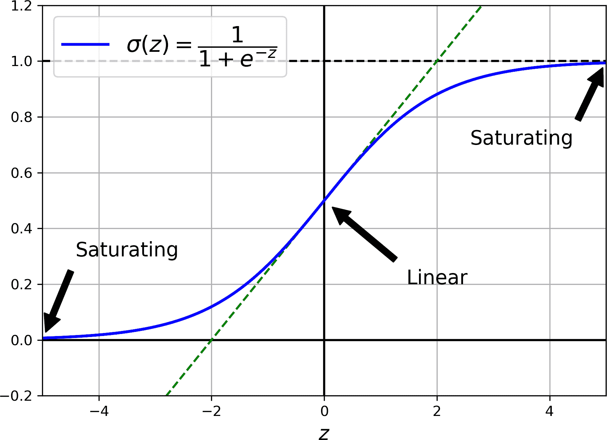
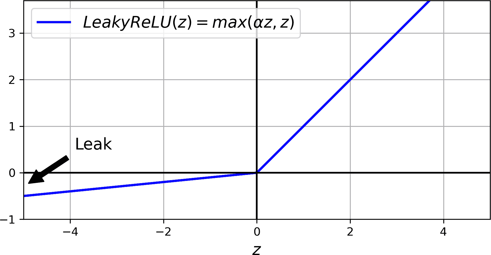
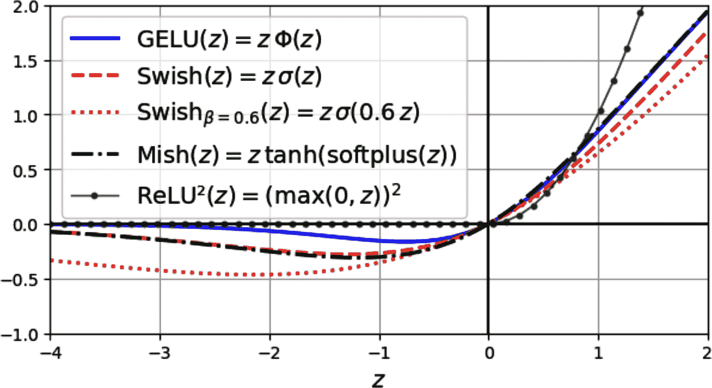
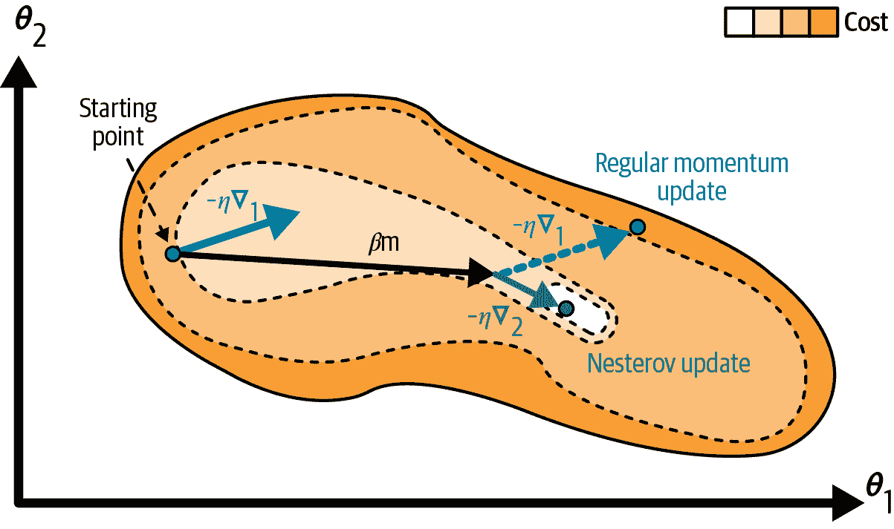
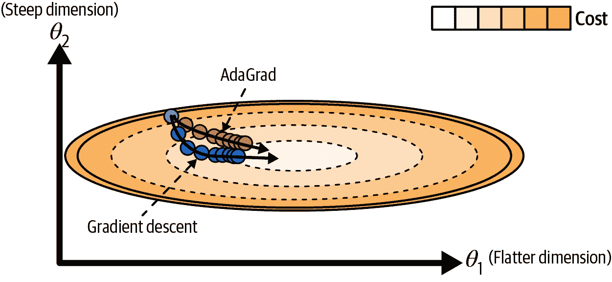
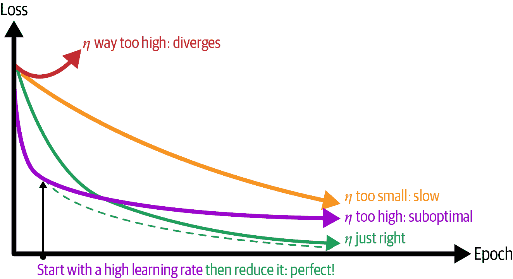
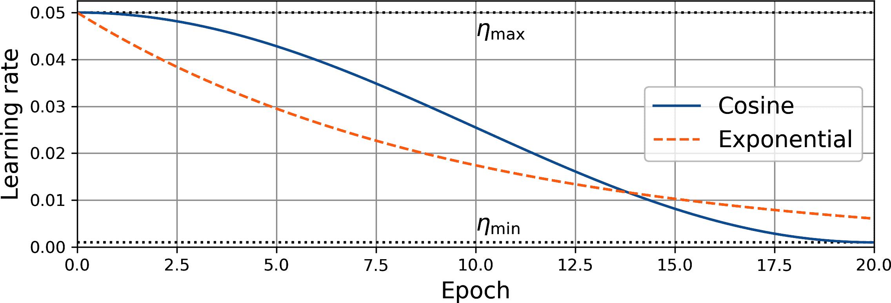

# 第十一章\. 深度神经网络的训练

在第十章中，你使用 PyTorch 构建、训练和微调了几个人工神经网络。但它们只是具有几个隐藏层的浅层网络。如果你需要解决一个复杂的问题，比如在高分辨率图像中检测数百种类型的对象，你可能需要训练一个深度更深的人工神经网络，可能包含数十甚至数百层，每层包含数百个神经元，通过数十万个连接相互连接。训练深度神经网络并非易事。以下是一些你可能遇到的问题：

+   你可能会遇到在训练过程中，当反向传播通过深度神经网络时梯度不断变小或变大的问题。这两个问题都使得训练较低层变得非常困难。

+   你可能没有足够的训练数据来训练如此大的网络，或者标注成本可能过高。

+   训练可能非常缓慢。

+   具有数百万个参数的模型可能会严重过拟合训练集，尤其是如果没有足够的训练实例或者它们太嘈杂的情况下。

在本章中，我们将逐一探讨这些问题，并介绍各种解决方法。我们将首先探讨梯度消失和爆炸问题及其最流行的解决方案，包括智能权重初始化、更好的激活函数、批归一化、层归一化和梯度裁剪。接下来，我们将探讨迁移学习和无监督预训练，这可以帮助你在只有少量标记数据的情况下解决复杂任务。然后，我们将讨论各种优化器，它们可以极大地加速大型模型的训练。我们还将讨论如何在训练过程中调整学习率以加快训练速度并产生更好的模型。最后，我们将介绍一些适用于大型神经网络的流行正则化技术：ℓ[1]和ℓ[2]正则化、dropout、蒙特卡洛 dropout 和最大范数正则化。

使用这些工具，你将能够训练各种深度网络。欢迎来到*深度学习*！

# 梯度消失/爆炸问题

如同在第九章中讨论的那样，反向传播算法的第二阶段是通过从输出层到输入层，沿着路径传播误差梯度来工作的。一旦算法计算了网络中每个参数相对于成本函数梯度的值，它就会使用这些梯度通过梯度下降步骤来更新每个参数。

不幸的是，随着算法向底层推进，梯度往往会越来越小。结果，梯度下降更新几乎不会改变底层连接权重，训练永远不会收敛到一个好的解。这被称为*梯度消失*问题。在某些情况下，情况可能相反：梯度会越来越大，直到层得到极端巨大的权重更新，算法发散。这被称为*梯度爆炸*问题，在循环神经网络（见第十三章）中最常见。更普遍地说，深度神经网络受到不稳定梯度的困扰；不同的层可能以非常不同的速度学习。

这种不幸的行为很久以前就被观察到了，这也是深度神经网络在 2000 年代初大部分被放弃的原因之一。当训练深度神经网络时，不清楚是什么导致了梯度的如此不稳定，但在 2010 年的一篇论文（https://homl.info/47）中，Xavier Glorot 和 Yoshua Bengio 提供了一些线索。⁠^(1) 作者发现了一些嫌疑人，包括当时最受欢迎的 sigmoid（逻辑）激活函数和最流行的权重初始化技术（即均值为 0，标准差为 1 的正态分布）。简而言之，他们表明，使用这种激活函数和这种初始化方案，每一层的输出方差远大于其输入的方差。在网络中向前推进时，方差在每一层之后都会增加，直到激活函数在顶层饱和。这种饱和实际上因为 sigmoid 函数的均值为 0.5 而不是 0（双曲正切函数的均值为 0，在深度网络中表现略好于 sigmoid 函数）而变得更糟。

观察 sigmoid 激活函数（见图 11-1），你可以看到当输入变得很大（负数或正数）时，函数在 0 或 1 处饱和，导数非常接近 0（即曲线在两端都是平的）。因此，当反向传播开始时，它几乎没有任何梯度可以传播回网络，而存在的少量梯度在反向传播通过顶层的过程中不断被稀释，所以底层实际上什么也没有剩下。



###### 图 11-1\. Sigmoid 激活函数饱和

## Glorot 初始化和 He 初始化

在他们的论文中，Glorot 和 Bengio 提出了一种显著缓解不稳定梯度问题的方法。他们指出，我们需要信号在两个方向上正确流动：在预测时的前向方向，以及在反向传播梯度时的反向方向。我们不希望信号衰减，也不希望它爆炸并饱和。为了使信号正确流动，作者们认为我们需要每一层的输出方差等于其输入方差，⁠^(2) 并且我们需要在反向方向通过一层之前和之后，梯度具有相同的方差（如果您对数学细节感兴趣，请查看论文）。实际上，除非层有相等数量的输入和输出（这些数字被称为层的 *fan-in* 和 *fan-out*），否则无法保证两者都成立。但 Glorot 和 Bengio 提出了一个在实践中证明非常有效的良好折衷方案：每一层的连接权重必须随机初始化，如 方程式 11-1 所述，其中 *fan*[avg] = (*fan*[in] + *fan*[out]) / 2。这种初始化策略被称为 *Xavier 初始化* 或 *Glorot 初始化*，以论文的第一作者命名。

##### 方程式 11-1\. Glorot 初始化（当使用 sigmoid 激活函数时）

<mtable columnalign="left"><mtr><mtd><mtext>均值为 0 且方差为 </mtext><msup><mi>σ</mi><mn>2</mn></msup><mo>=</mo><mfrac><mn>1</mn><msub><mi mathvariant="italic">fan</mi><mtext>avg</mtext></msub></mfrac></mtd></mtr><mtr><mtd><mtext>或介于 </mtext><mo>-</mo><mi>r</mi><mtext> 和 </mtext><mo>+</mo><mi>r</mi><mtext> 之间的均匀分布，其中 </mtext><mi>r</mi><mo>=</mo><msqrt><mfrac><mn>3</mn><msub><mi mathvariant="italic">fan</mi><mtext>avg</mtext></msub></mfrac></msqrt></mtd></mtr></mtable>

如果您将 方程式 11-1 中的 *fan*[avg] 替换为 *fan*[in]，您将得到 Yann LeCun 在 1990 年代提出的一种初始化策略。他称之为 *LeCun 初始化*。Genevieve Orr 和 Klaus-Robert Müller 在他们的 1998 年书籍 *Neural Networks: Tricks of the Trade* (Springer) 中甚至推荐了它。当 *fan*[in] = *fan*[out] 时，LeCun 初始化与 Glorot 初始化等价。研究人员花了十多年时间才意识到这个技巧的重要性。使用 Glorot 初始化可以显著加快训练速度，这是导致深度学习成功的关键技巧之一。

一些论文为不同的激活函数提供了类似的策略，最著名的是 Kaiming He 等人于 2015 年发表的一篇论文[2015 paper by Kaiming He et al](https://homl.info/48)。⁠^(3) 这些策略仅在方差缩放的比例以及是否使用 *fan*[avg] 或 *fan*[in] 方面有所不同，如 表 11-1 所示（对于均匀分布，只需使用 <mi>r</mi><mo>=</mo><msqrt><mn>3</mn><msup><mi>σ</mi><mn>2</mn></msup></msqrt>）。为 ReLU 激活函数及其变体提出的初始化策略被称为 *He 初始化* 或 *Kaiming 初始化*，以论文的第一作者命名。对于 SELU，使用 Yann LeCun 的初始化方法，最好使用正态分布。我们将在稍后介绍所有这些激活函数。

表 11-1\. 每种激活函数类型的初始化参数

| 初始化 | 激活函数 | *σ*² (正态) |
| --- | --- | --- |
| Xavier Glorot | 无，tanh，sigmoid，softmax | 1 / *fan*[avg] |
| Kaiming He | ReLU, Leaky ReLU, ELU, GELU, Swish, Mish, SwiGLU, ReLU² | 2 / *fan*[in] |
| Yann LeCun | SELU | 1 / *fan*[in] |

由于历史原因，PyTorch 的 `nn.Linear` 模块使用 Kaiming 均匀初始化来初始化其权重，但权重会按 $StartRoot 6 EndRoot$（即 6 的 0.5 次方）的比例缩小（并且偏置项也会随机初始化）。遗憾的是，这并不是任何常见激活函数的最佳缩放比例。一种解决方案是在创建 `nn.Linear` 层后立即将权重乘以 $StartRoot 6 EndRoot$（即 6 的 0.5 次方），以获得适当的 Kaiming 初始化。为此，我们可以更新参数的 `data` 属性。我们还将清零偏置，因为没有随机初始化它们的任何好处：

```py
import torch
import torch.nn as nn

layer = nn.Linear(40, 10)
layer.weight.data *= 6 ** 0.5  # Kaiming init (or 3 ** 0.5 for LeCun init)
torch.zero_(layer.bias.data)
```

这可以工作，但使用 `torch.nn.init` 模块中可用的初始化函数之一会更清晰且更不容易出错：

```py
nn.init.kaiming_uniform_(layer.weight)
nn.init.zeros_(layer.bias)
```

如果你想要将相同的初始化方法应用到模型中每个 `nn.Linear` 层的权重上，你可以在创建每个 `nn.Linear` 层之后在模型的构造函数中这样做。或者，你可以编写 `nn.Linear` 类的子类，并调整其构造函数以按你的意愿初始化权重。但可能最简单的方法是编写一个小的函数，该函数接受一个模块，检查它是否是 `nn.Linear` 类的实例，如果是，则对其权重应用所需的初始化函数。然后，你可以通过将其传递给模型的 `apply()` 方法来将此函数应用到模型及其所有子模块。例如：

```py
def use_he_init(module):
    if isinstance(module, nn.Linear):
        nn.init.kaiming_uniform_(module.weight)
        nn.init.zeros_(module.bias)

model = nn.Sequential(nn.Linear(50, 40), nn.ReLU(), nn.Linear(40, 1), nn.ReLU())
model.apply(use_he_init)
```

`torch.nn.init`模块还包含一个`orthogonal_()`函数，它使用随机正交矩阵初始化权重，正如 Andrew Saxe 等人在 2014 年的一篇论文[2014 paper](https://homl.info/ortho-init)中提出的。正交矩阵具有许多有用的数学性质，包括它们保持范数的事实：给定一个正交矩阵**W**和一个输入向量**x**，**Wx**的范数等于**x**的范数，因此输入的大小在输出中得到了保留。当输入被标准化时，这会在层中产生稳定的方差，从而防止激活和梯度在深度网络中消失或爆炸（至少在训练开始时）。这种初始化技术比前面讨论的初始化技术要少见得多，但它可以在循环神经网络（第十三章）或生成对抗网络（第十八章）中工作得很好。

就这样！适当地缩放权重将为深度神经网络提供一个更好的训练起点。

###### 小贴士

在分类器中，初始化时降低输出层的权重通常是一个好主意（例如，乘以 10）。事实上，这将导致训练开始时的 logits 更小，这意味着它们将更接近，因此估计的概率也将更接近。换句话说，这鼓励模型在训练开始时对其预测不太自信：这将避免极端损失和巨大的梯度，这些梯度常常会导致模型在训练开始时权重随机跳动，浪费时间和可能阻止模型学习任何东西。

## 更好的激活函数

Glorot 和 Bengio 在 2010 年的论文中提出的一个见解是，梯度不稳定的问题部分原因是激活函数的选择不当。在此之前，大多数人认为如果大自然选择在生物神经元中使用接近 sigmoid 激活函数的东西，那么它们肯定是一个很好的选择。但事实表明，其他激活函数在深度神经网络中表现更好——特别是 ReLU 激活函数，主要是因为它对于正值不会饱和，而且计算速度非常快。

很不幸，ReLU 激活函数并不完美。它存在一个被称为*渐逝 ReLU*的问题：在训练过程中，一些神经元实际上“死亡”，意味着它们停止输出除了 0 以外的任何内容。在某些情况下，你可能发现你网络中一半的神经元都“死亡”了，尤其是如果你使用了较大的学习率。当一个神经元的权重被调整到使得 ReLU 函数的输入（即神经元输入的加权和加上其偏置项）对于训练集中的所有实例都是负值时，神经元就会“死亡”。当这种情况发生时，它只会持续输出 0，因为当 ReLU 函数的输入为负值时，其梯度为 0，所以梯度下降不再影响它。⁠^(6)

为了解决这个问题，你可能想要使用 ReLU 函数的变体，例如*渗漏 ReLU*。

### 渗漏 ReLU

渗漏 ReLU 激活函数定义为 LeakyReLU*α* = max(*αz*, *z*)（见图 11-2）。超参数*α*定义了函数“渗漏”的程度：它是函数在*z* < 0 时的斜率。对于*z* < 0 有斜率确保了渗漏 ReLU 永远不会真正“死亡”；它们可以进入长时间的昏迷，但最终有苏醒的机会。Bing Xu 等人于 2015 年发表的一篇[2015 论文](https://homl.info/49)⁠^(7)比较了 ReLU 激活函数的几个变体，其结论之一是渗漏变体总是优于严格的 ReLU 激活函数。实际上，将*α*设置为 0.2（巨大的渗漏）似乎比*α* = 0.01（小的渗漏）有更好的性能。该论文还评估了*随机渗漏 ReLU*（RReLU），其中*α*在训练期间随机选择一个范围内的值，并在测试期间固定为平均值。RReLU 也表现相当不错，似乎起到了正则化的作用，减少了过拟合的风险。最后，论文评估了*参数化渗漏 ReLU*（PReLU），其中*α*被允许在训练期间学习：它不再是超参数，而成为了一个可以通过反向传播修改的参数。PReLU 据报道在大型图像数据集上显著优于 ReLU，但在较小的数据集上存在过拟合训练集的风险。



###### 图 11-2\. 渗漏 ReLU：与 ReLU 类似，但负值具有小的斜率

如你所预期，PyTorch 包含每个这些激活函数的模块：`nn.LeakyReLU`、`nn.RReLU` 和 `nn.PReLU`。就像其他 ReLU 变体一样，你应该与 Kaiming 初始化一起使用这些模块，但由于负斜率，方差应该略小：它应该通过一个因子 1 + *α*² 缩放。PyTorch 支持：你可以将 *α* 超参数传递给 `kaiming_uniform_()` 和 `kaiming_normal_()` 函数，以及 `nonlinearity="leaky_relu"` 以获得适当的调整 Kaiming 初始化：

```py
alpha = 0.2
model = nn.Sequential(nn.Linear(50, 40), nn.LeakyReLU(negative_slope=alpha))
nn.init.kaiming_uniform_(model[0].weight, alpha, nonlinearity="leaky_relu")
```

ReLU、leaky ReLU 和 PReLU 都存在它们不是平滑函数的事实：它们的斜率在 *z* = 0 处突然改变。正如我们在 第四章 中讨论 lasso 时所看到的，这种导数中的不连续性可以使梯度下降在最优解周围弹跳，并减慢收敛速度。因此，现在我们将查看 ReLU 激活函数的一些平滑变体，从 ELU 和 SELU 开始。

### ELU 和 SELU

2015 年，Djork-Arné Clevert 等人发表了一篇 [论文](https://homl.info/50)⁠^(8)，提出了一种新的激活函数，称为 *指数线性单元* (ELU)，在作者的实验中优于所有 ReLU 变体：训练时间减少，神经网络在测试集上的表现更好。方程 11-2 展示了这个激活函数的定义。

##### 方程 11-2\. ELU 激活函数

<mrow><msub><mo form="prefix">ELU</mo> <mi>α</mi></msub> <mrow><mo>(</mo> <mi>z</mi> <mo>)</mo></mrow> <mo>=</mo> <mfenced separators="" open="{" close=""><mtable><mtr><mtd columnalign="left"><mrow><mi>α</mi> <mo>(</mo> <mtext>exp</mtext> <mo>(</mo> <mi>z</mi> <mo>)</mo> <mo>-</mo> <mn>1</mn> <mo>)</mo></mrow></mtd> <mtd columnalign="left"><mrow><mtext>if</mtext> <mi>z</mi> <mo><</mo> <mn>0</mn></mrow></mtd></mtr> <mtr><mtd columnalign="left"><mi>z</mi></mtd> <mtd columnalign="left"><mrow><mtext>if</mtext> <mi>z</mi> <mo>≥</mo> <mn>0</mn></mrow></mtd></mtr></mtable></mfenced></mrow>

ELU 激活函数看起来与 ReLU 函数非常相似（见 图 11-3），但有几个主要区别：

+   当 *z* < 0 时，它取负值，这使得单元的平均输出更接近 0，有助于缓解梯度消失问题。超参数 *α* 定义了当 *z* 是一个很大的负数时，ELU 函数趋近的值的相反数。它通常设置为 1，但你可以像调整任何其他超参数一样对其进行调整。

+   它在 *z* < 0 时具有非零梯度，这避免了神经元死亡问题。

+   如果 *α* 等于 1，那么函数在所有地方都是平滑的，包括在 *z* = 0 附近，这有助于加快梯度下降，因为它不会像在 *z* = 0 的左右两侧那样弹跳得那么厉害。

使用 PyTorch 中的 ELU 与使用 `nn.ELU` 模块以及 Kaiming 初始化一样简单。ELU 激活函数的主要缺点是它比 ReLU 函数及其变体计算速度慢（由于使用了指数函数）。它在训练期间更快的收敛速度可能可以弥补这种慢速计算，但仍然，在测试时间，ELU 网络将比 ReLU 网络慢一些。


###### 图 11-3\. ELU 和 SELU 激活函数

不久之后，Günter Klambauer 等人⁠^(9) 在一篇 [2017 年的论文](https://homl.info/selu) 中介绍了 *缩放 ELU* (SELU) 激活函数：正如其名所示，它是 ELU 激活函数的一个缩放变体（大约是 ELU 的 1.05 倍，使用 *α* ≈ 1.67）。作者们表明，如果你构建一个仅由堆叠的密集层（即 MLP）组成的神经网络，并且所有隐藏层都使用 SELU 激活函数，那么网络将 *自我归一化*：每个层的输出在训练过程中将倾向于保持均值为 0 和标准差为 1，这解决了梯度消失/爆炸问题。因此，SELU 激活函数可能在 MLP 中优于其他激活函数，尤其是在深度 MLP 中。要在 PyTorch 中使用它，只需使用 `nn.SELU`。然而，自我归一化发生有几个条件（参见论文中的数学证明）：

+   输入特征必须标准化：均值为 0，标准差为 1。

+   每个隐藏层的权重必须使用 LeCun 正态初始化。

+   自我归一化属性仅在纯 MLP 中得到保证。如果你尝试在其他架构中使用 SELU，如循环网络（参见第十三章）或具有 *跳过连接*（即跳过层的连接，例如在 Wide & Deep 神经网络中）的网络，它可能不会优于 ELU。

+   你不能使用正则化技术，如 ℓ[1] 或 ℓ[2] 正则化、批归一化、层归一化、最大归一化或常规 dropout（这些将在本章后面讨论）。

这些是重要的限制条件，因此尽管 SELU 有其承诺，但它并没有获得太多的关注。此外，其他激活函数似乎在大多数任务上的一致性上优于它。让我们看看其中一些最受欢迎的。

### GELU、Swish、SwiGLU、Mish 和 RELU²

*高斯误差线性单元* (*GELU*) 在 Dan Hendrycks 和 Kevin Gimpel 的 [2016 年论文](https://homl.info/gelu) 中被引入。再次，你可以将其视为 ReLU 激活函数的平滑变体。其定义在 方程 11-3 中给出，其中 Φ 是标准高斯累积分布函数（CDF）：Φ(*z*) 对应于从均值为 0 和方差为 1 的正态分布中随机抽取的值小于 *z* 的概率。

##### 方程 11-3\. GELU 激活函数

<mrow><mi>GELU</mi><mo>(</mo><mi>z</mi><mo>)</mo></mrow><mo>=</mo><mi>z</mi><mi mathvariant="normal">Φ</mi><mo>(</mo><mi>z</mi><mo>)</mo>

正如你在 图 11-4 中可以看到的，GELU 与 ReLU 相似：当其输入 *z* 非常负时，它接近 0；当 *z* 非常正时，它接近 *z*。然而，与我们之前讨论的所有激活函数都是凸性和单调性不同，GELU 激活函数既不是凸性的也不是单调的：从左到右，它开始是直线，然后波动下降，在约 –0.17（z ≈ –0.75）附近达到低点，最后弹起并最终直线向上到达右上角。这种相当复杂的形状以及它在每个点都有曲率的事实可能解释了为什么它工作得如此之好，尤其是在复杂任务中：梯度下降可能更容易拟合复杂模式。在实践中，它通常优于我们之前讨论的任何其他激活函数。然而，它计算上稍微复杂一些，它提供的性能提升并不总是足以证明额外成本是合理的。尽管如此，可以证明它大约等于 *z*σ(1.702 *z*)，其中 σ 是 sigmoid 函数：使用这个近似也工作得很好，并且它具有计算速度更快的优势。



###### 图 11-4\. GELU、Swish、参数化 Swish、Mish 和 ReLU² 激活函数

GELU 论文还介绍了 *sigmoid 线性单元*（SiLU）激活函数，它等于 *z*σ(*z*)，但在作者们的测试中，其性能不如 GELU。有趣的是，Prajit Ramachandran 等人于 2017 年发表的一篇 [论文](https://homl.info/swish) 通过自动搜索好的激活函数重新发现了 SiLU 函数。作者将其命名为 *Swish*，这个名字很快流行起来。在他们的论文中，Swish 在性能上优于其他所有函数，包括 GELU。Ramachandran 等人后来通过添加一个额外的标量超参数 *β* 来缩放 sigmoid 函数的输入，从而推广了 Swish。推广后的 Swish 函数是 Swish*β* = *z*σ(*βz*)，因此当 *β* = 1.702 时，GELU 大约等于推广后的 Swish 函数。你可以像调整任何其他超参数一样调整 *β*。或者，也可以使 *β* 可训练，并让梯度下降优化它（有点像 PReLU）：通常整个模型只有一个可训练的 *β* 参数，或者每层只有一个，以保持模型高效并避免过拟合。

一种流行的 Swish 变体是 [*SwiGLU*](https://homl.info/swiglu):⁠^(13) 输入通过 Swish 激活函数，同时并行通过一个线性层，然后逐项相乘输出。这就是 SwiGLU(**z**) = Swish*β* ⊗ Linear(**z**)。这通常通过将前一个线性层的输出维度加倍，然后沿着特征维度将输出分成两部分以获得 **z**[1] 和 **z**[2]，最后应用：SwiGLU*β* = Swish*β* ⊗ **z**[2]。这是 Facebook 研究人员在 2016 年引入的 [*门控线性单元* (GLU)](https://homl.info/glu)⁠^(14) 的一个变体。逐项乘法给模型提供了更多的表达能力，允许它学习何时关闭（即乘以 0）或放大特定特征：这被称为 *门控机制*。SwiGLU 在现代变压器中非常常见（参见 第十五章）。

另一种类似于 GELU 的激活函数是 *Mish*，它由 Diganta Misra 在 [2019 年的一篇论文](https://homl.info/mish)中提出.^(15) 它被定义为 mish(*z*) = *z*tanh(softplus(*z*))，其中 softplus(*z*) = log(1 + exp(*z*))。就像 GELU 和 Swish 一样，它是一个平滑、非凸、非单调的 ReLU 变体，而且作者再次进行了许多实验，发现 Mish 通常优于其他激活函数——甚至比 Swish 和 GELU 略胜一筹。 展示了 GELU、Swish（默认 *β* = 1 和 *β* = 0.6）以及最后的 Mish。如图所示，当 *z* 为负值时，Mish 几乎完美地与 Swish 重叠，而当 *z* 为正值时，几乎完美地与 GELU 重叠。

最后，在 2021 年，Google 研究人员运行了一个自动化的架构搜索来改进大型变压器，搜索发现了一个非常简单但有效的激活函数：[ReLU²](https://homl.info/relu2)。⁠^(16) 如其名所示，它只是 ReLU 的平方：ReLU²(*z*) = (max(0, *z*))²。它具有 ReLU 的所有特性（简单性、计算效率、稀疏输出、正侧无饱和）但它也有在 *z* = 0 处的平滑梯度，并且通常优于其他激活函数，特别是对于稀疏模型。然而，训练可能不太稳定，部分原因是因为它对异常值和死亡 ReLUs 的敏感性增加。

###### 小贴士

那么，你应该为你的深度神经网络隐藏层使用哪种激活函数呢？ReLU 对于大多数任务来说仍然是一个好的默认选择：它通常与更复杂的激活函数一样好，而且计算速度非常快，许多库和硬件加速器提供了 ReLU 特定的优化。然而，对于复杂任务，Swish 可能是一个更好的默认选择，你甚至可以尝试带有可学习**β**参数的参数化 Swish，对于最复杂的任务。Mish 和 SwiGLU 可能会给你带来略微更好的结果，但它们需要更多的计算。如果你非常关心运行时延迟，那么你可能更喜欢 Leaky ReLU，或者对于复杂任务，选择参数化 Leaky ReLU，甚至 ReLU²，特别是对于稀疏模型。

PyTorch 原生支持 GELU、Mish 和 Swish（分别使用`nn.GELU`、`nn.Mish`和`nn.SiLU`）。要实现 SwiGLU，将前一个线性层的输出维度加倍，然后使用`z1, z2 = z.chunk(2, dim=-1)`将其输出分成两部分，并计算`F.silu(beta * z1) * z2`（其中`F`是`torch.nn.functional`）。对于 ReLU²，只需计算`F.relu(z).square()`。PyTorch 还包括几个激活函数的简化和近似版本，这些版本计算速度更快，在训练过程中通常更稳定。这些简化版本的名字以“Hard”开头，例如`nn.Hardsigmoid`、`nn.Hardtanh`和`nn.Hardswish`，它们通常用于移动设备。

激活函数就讲到这里！现在，让我们看看解决不稳定梯度问题的另一种完全不同的方法：批归一化。

## 批归一化

尽管在训练初期使用 Kaiming 初始化与 ReLU（或其任何变体）可以显著减少梯度消失/爆炸问题的风险，但这并不能保证它们在训练过程中不会再次出现。

在 2015 年的一篇论文[2015 paper](https://homl.info/51)⁠^(17)中，谢尔盖·约夫伊和克里斯蒂安·塞格迪提出了一种称为**批归一化**（BN）的技术，用以解决这些问题。这项技术包括在每个隐藏层的激活函数之前或之后在模型中添加一个操作。这个操作简单地将每个输入归零并标准化，然后使用每个层的两个新参数向量进行缩放和偏移：一个用于缩放，另一个用于偏移。换句话说，这个操作让模型学习每个层输入的最佳缩放和均值。在许多情况下，如果你将 BN 层作为你的神经网络的第一层，你就不需要标准化你的训练集（不需要`StandardScaler`）；BN 层会为你完成这项工作（好吧，大约是这样，因为它一次只查看一个批次，并且它还可以重新缩放和偏移每个输入特征）。

为了使输入零中心并归一化，算法需要估计每个输入的均值和标准差。它是通过评估当前迷你批次上的输入均值和标准差来做到这一点的（因此得名“批标准化”）。整个操作步骤总结在方程 11-4 中。

##### 方程 11-4\. 批标准化算法

<mtable displaystyle="true"><mtr><mtd columnalign="right"><mrow><mn>1</mn> <mo lspace="0%" rspace="0%">.</mo></mrow></mtd> <mtd columnalign="left"><mrow><msub><mi mathvariant="bold">μ</mi> <mi>B</mi></msub> <mo>=</mo> <mstyle scriptlevel="0" displaystyle="true"><mfrac><mn>1</mn> <msub><mi>m</mi> <mi>B</mi></msub></mfrac></mstyle> <munderover><mo>∑</mo> <mrow><mi>i</mi><mo>=</mo><mn>1</mn></mrow> <msub><mi>m</mi> <mi>B</mi></msub></munderover> <msup><mi mathvariant="bold">x</mi> <mrow><mo>(</mo><mi>i</mi><mo>)</mo></mrow></msup></mrow></mtd></mtr> <mtr><mtd columnalign="right"><mrow><mn>2</mn> <mo lspace="0%" rspace="0%">.</mo></mrow></mtd> <mtd columnalign="left"><mrow><msup><mrow><msub><mi mathvariant="bold">σ</mi> <mi>B</mi></msub></mrow> <mn>2</mn></msup> <mo>=</mo> <mstyle scriptlevel="0" displaystyle="true"><mfrac><mn>1</mn> <msub><mi>m</mi> <mi>B</mi></msub></mfrac></mstyle> <munderover><mo>∑</mo> <mrow><mi>i</mi><mo>=</mo><mn>1</mn></mrow> <msub><mi>m</mi> <mi>B</mi></msub></munderover> <msup><mrow><mo>(</mo><msup><mi mathvariant="bold">x</mi> <mrow><mo>(</mo><mi>i</mi><mo>)</mo></mrow></msup> <mo>-</mo><msub><mi mathvariant="bold">μ</mi> <mi>B</mi></msub> <mo>)</mo></mrow> <mn>2</mn></msup></mrow></mtd></mtr> <mtr><mtd columnalign="right"><mrow><mn>3</mn> <mo lspace="0%" rspace="0%">.</mo></mrow></mtd> <mtd columnalign="left"><mrow><msup><mover accent="true"><mi mathvariant="bold">x</mi> <mo>^</mo></mover> <mrow><mo>(</mo><mi>i</mi><mo>)</mo></mrow></msup> <mo>=</mo> <mstyle scriptlevel="0" displaystyle="true"><mfrac><mrow><msup><mi mathvariant="bold">x</mi> <mrow><mo>(</mo><mi>i</mi><mo>)</mo></mrow></msup> <mo>-</mo><msub><mi mathvariant="bold">μ</mi> <mi>B</mi></msub></mrow> <msqrt><mrow><msup><mrow><msub><mi mathvariant="bold">σ</mi> <mi>B</mi></msub></mrow> <mn>2</mn></msup> <mo>+</mo><mi>ε</mi></mrow></msqrt></mfrac></mstyle></mrow></mtd></mtr> <mtr><mtd columnalign="right"><mrow><mn>4</mn> <mo lspace="0%" rspace="0%">.</mo></mrow></mtd> <mtd columnalign="left"><mrow><msup><mi mathvariant="bold">z</mi> <mrow><mo>(</mo><mi>i</mi><mo>)</mo></mrow></msup> <mo>=</mo> <mi mathvariant="bold">γ</mi> <mo>⊗</mo> <msup><mover accent="true"><mi mathvariant="bold">x</mi> <mo>^</mo></mover> <mrow><mo>(</mo><mi>i</mi><mo>)</mo></mrow></msup> <mo>+</mo> <mi mathvariant="bold">β</mi></mrow></mtd></mtr></mtable>

在此算法中：

+   **μ**[*B*] 是输入均值向量，在整个迷你批次 *B* 上评估（它包含每个输入的一个均值）。

+   *m*[*B*] 是迷你批次的实例数量。

+   **x**^((*i*))是批归一化层实例*i*的输入向量。

+   **σ**[*B*]是输入标准差的向量，在整个小批量上评估（它包含每个输入的一个标准差）。

+   <mover accent="true"><mi mathvariant="bold">x</mi> <mo>^</mo></mover> ^((*i*))是实例*i*的零均值和归一化输入向量。

+   *ε*是一个很小的数，它避免了除以零并确保梯度不会变得太大（通常是 10^(–5)）。这被称为*平滑项*。

+   **γ**是层的输出缩放参数向量（它包含每个输入的一个缩放参数）。

+   ⊗表示逐元素乘法（每个输入都乘以其相应的输出缩放参数）。

+   **β**是层的输出偏移（偏移量）参数向量（它包含每个输入的一个偏移参数）。每个输入都通过其相应的偏移参数进行偏移。

+   **z**^((*i*))是 BN 操作的输出。它是输入的缩放和偏移版本。

因此，在训练期间，BN 标准化其输入，然后缩放和偏移它们。很好！那么测试时间呢？嗯，并不那么简单。实际上，我们可能需要为单个实例而不是实例批量进行预测：在这种情况下，我们将无法计算每个输入的标准差。此外，即使我们有实例批量，它可能太小，或者实例可能不是独立同分布的，因此在小批量实例上计算统计量将不可靠。一种解决方案是在训练结束时等待，然后运行整个训练集通过神经网络，并计算 BN 层每个输入的均值和标准差。然后可以使用这些“最终”输入均值和标准差来代替批输入均值和标准差进行预测。

然而，大多数批归一化的实现都是通过使用层的批输入均值和方差的移动平均来估计这些最终统计量的。这就是当你使用 PyTorch 的批归一化层，如`nn.BatchNorm1d`（我们将在下一节中讨论）时，PyTorch 自动执行的操作。总的来说，每个批归一化层中学习到四个参数向量：**γ**（输出缩放向量）和**β**（输出偏移向量）通过常规的反向传播学习，而**μ**（最终输入均值向量）和**σ**²（最终输入方差向量）使用指数移动平均来估计。请注意，**μ**和**σ**²是在训练期间估计的，但它们仅在训练完成后使用，一旦你使用`model.eval()`将模型切换到评估模式：**μ**和**σ**²将替换方程 11-4 中的**μ**[*B*]和**σ**[*B*]²。

Ioffe 和 Szegedy 证明了批量归一化显著提高了他们实验中所有深度神经网络的表现，这在 ImageNet 分类任务（ImageNet 是一个包含许多类别的图像的大型数据库，常用于评估计算机视觉系统）中带来了巨大的改进（ImageNet 是包含许多类别的图像的大型数据库，常用于评估计算机视觉系统）。梯度消失问题得到了显著减少，以至于他们可以使用饱和激活函数，如 tanh 和 sigmoid。网络对权重初始化的敏感性也大大降低。作者能够使用更大的学习率，显著加快学习过程。具体来说，他们指出：

> 将批量归一化应用于最先进的图像分类模型，批量归一化在 14 倍更少的训练步骤下达到了相同的准确率，并且显著优于原始模型。[……]使用批量归一化的网络集成，我们在 ImageNet 分类上取得了最佳已发表结果：达到 4.9%的 top-5 验证错误（和 4.8%的测试错误），超过了人类评分员的准确率。

最后，就像源源不断的礼物一样，批量归一化还起到了正则化的作用，减少了其他正则化技术（如本章后面将要描述的 dropout）的需求。

然而，批量归一化确实给模型增加了一些复杂性（尽管它可以消除前面讨论中提到的对输入数据进行归一化的需求）。此外，还存在运行时惩罚：由于在每个层中需要额外的计算，神经网络做出预测的速度会变慢。幸运的是，通常可以在训练后融合 BN 层和前一层的权重，从而避免运行时惩罚。这是通过更新前一层的权重和偏置，使其直接产生适当规模和偏移的输出来实现的。例如，如果前一层的计算是**XW** + **b**，那么 BN 层将计算**γ** ⊗ (**XW** + **b** – **μ**) / **σ** + **β**（忽略分母中的平滑项*ε*）。如果我们定义**W**′ = **γ**⊗**W** / **σ**和**b**′ = **γ** ⊗ (**b** – **μ**) / **σ** + **β**，则方程可以简化为**XW**′ + **b**′。因此，如果我们用更新的权重和偏置（**W**′和**b**′）替换前一层的权重和偏置（**W**和**b**），我们就可以去掉 BN 层。这是`optimize_for_inference()`（见第十章）执行的一种优化。 

###### 注意

你可能会发现训练相当慢，因为当你使用批量归一化时，每个 epoch 所需的时间会大大增加。这通常会被 BN 收敛速度更快的事实所抵消，因此达到相同性能所需的 epoch 会更少。总的来说，*wall time*（这是由你墙上的时钟测量的时间）通常会缩短。

### 使用 PyTorch 实现批量归一化

就像 PyTorch 中的大多数事情一样，实现批量归一化简单直观。只需在每个隐藏层的激活函数之前或之后添加一个`nn.BatchNorm1d`层，并指定每个 BN 层的输入数量。你还可以将 BN 层作为模型的第一层，这样就不需要手动标准化输入。例如，让我们创建一个 Fashion MNIST 图像分类器（类似于我们在第十章中构建的），将 BN 作为模型的第一层（在展平输入图像之后），然后在每个隐藏层之后再次使用：

```py
model = nn.Sequential(
    nn.Flatten(),
    nn.BatchNorm1d(1 * 28 * 28),
    nn.Linear(1 * 28 * 28, 300),
    nn.ReLU(),
    nn.BatchNorm1d(300),
    nn.Linear(300, 100),
    nn.ReLU(),
    nn.BatchNorm1d(100),
    nn.Linear(100, 10)
)
```

您现在可以正常训练模型（就像你在第十章中学到的那样），就这样！在这个只有两层隐藏层的微小示例中，批量归一化不太可能产生重大影响，但对于更深的网络来说，它可能带来巨大的差异。

###### 警告

由于批量归一化在训练和评估期间的行为不同，因此在训练期间切换到训练模式（使用`model.train()`）以及在评估期间切换到评估模式（使用`model.eval()》）至关重要。忘记这样做是最常见的错误之一。

如果你查看第一个 BN 层的参数，你会找到两个：`weight`和`bias`，它们对应于方程 11-4 中的**γ**和**β**：

```py
>>> dict(model[1].named_parameters()).keys()
dict_keys(['weight', 'bias'])
```

如果你查看这个相同的 BN 层的缓冲区，你会找到三个：`running_mean`、`running_var`和`num_batches_tracked`。前两个对应于之前讨论的运行均值**μ**和**σ**²，而`num_batches_tracked`简单地统计了训练过程中看到的批次数量：

```py
>>> dict(model[1].named_buffers()).keys()
dict_keys(['running_mean', 'running_var', 'num_batches_tracked'])
```

BN 论文的作者们赞成在激活函数之前添加 BN 层，而不是之后（正如我们刚才所做的那样）。对此有一些争议，这似乎取决于任务，所以你可以尝试不同的选项，看看哪个在你的数据集上效果最好。如果你将 BN 层移动到激活函数之前，你也可以通过将它们的`bias`超参数设置为`False`来从之前的`nn.Linear`层中移除偏差项。确实，批量归一化层已经为每个输入包含了一个偏差项。你还可以删除第一个 BN 层，以避免在两个 BN 层之间夹着第一个隐藏层，但这意味着你应该在训练之前对训练集进行归一化。更新的代码如下：

```py
model = nn.Sequential(
    nn.Flatten(),
    nn.Linear(1 * 28 * 28, 300, bias=False),
    nn.BatchNorm1d(300),
    nn.ReLU(),
    nn.Linear(300, 100, bias=False),
    nn.BatchNorm1d(100),
    nn.ReLU(),
    nn.Linear(100, 10)
)
```

`nn.BatchNorm1d`类有几个你可以调整的超参数。默认值通常很好，但你可能偶尔需要调整`momentum`。这个超参数在`BatchNorm1d`层更新指数移动平均时使用；给定一个新值**v**（即，一个新向量，它是通过当前批次计算得到的输入均值或方差），该层使用以下方程更新运行平均<mover><mi mathvariant="bold">v</mi><mo>^</mo></mover>：

<mrow><mover accent="true"><mi mathvariant="bold">v</mi> <mo>^</mo></mover> <mo>←</mo> <mi mathvariant="bold">v</mi> <mo>×</mo> <mtext>momentum</mtext> <mo>+</mo> <mover accent="true"><mi mathvariant="bold">v</mi> <mo>^</mo></mover> <mo>×</mo> <mrow><mo>(</mo> <mn>1</mn> <mo>-</mo> <mtext>momentum</mtext> <mo>)</mo></mrow></mrow>

良好的动量值通常接近于 0；例如，0.01 或 0.001。对于较小的 mini-batch，你希望有更多的 0，而对于较大的 mini-batch，则希望有较少的 0。默认值为 0.1，这对于大 batch size 来说很好，但对于 32 或 64 这样的小 batch size 来说则不是很好。

###### 警告

当人们谈论运行均值的“动量”时，他们通常指的是更新方程中当前运行均值的权重。遗憾的是，由于历史原因，PyTorch 在 BN 层中使用相反的含义。然而，PyTorch 的其他部分使用传统的含义（例如，在优化器中），所以不要混淆。

### 批归一化 1D、2D 和 3D

在前面的示例中，我们在将输入图像发送到第一个`nn.BatchNorm1d`层之前将其展平。这是因为`nn.BatchNorm1d`层作用于形状为`[batch_size, num_features]`的 batch（就像`nn.Linear`层一样），所以如果你在`nn.Flatten`层之前移动它，你会得到一个错误。

然而，你可以在`nn.Flatten`层之前使用`nn.BatchNorm2d`层：确实，它期望其输入为形状为`[batch_size, channels, height, width]`的图像 batch，并且它计算批量的均值和方差，包括批维度（维度 0）和空间维度（维度 2 和 3）。这意味着同一 batch 和通道中的所有像素都使用相同的均值和方差进行归一化：`nn.BatchNorm2d`层每个通道只有一个权重和一个偏置（例如，对于具有三个通道的红、绿、蓝的颜色图像，有三个权重和三个偏置项）。这通常在处理图像数据集时效果更好。

此外，还有一个`nn.BatchNorm3d`层，它期望 batch 的形状为`[batch_size, channels, depth, height, width]`：这对于 3D 图像数据集，如 CT 扫描，非常有用。

`nn.BatchNorm1d`层也可以处理序列的批次。在 PyTorch 中，惯例是将序列的批次表示为形状为`[batch_size, sequence_length, num_features]`的 3D 张量。例如，假设您从事粒子物理学研究，并且您有一个粒子轨迹的数据集，其中每个轨迹由 3D 空间中的 100 个点组成的序列，那么 32 个轨迹的批次将具有形状`[32, 100, 3]`。然而，`nn.BatchNorm1d`层期望形状为`[batch_size, num_features, sequence_length]`，并且它通过计算第一维和最后一维的批次均值和方差来为每个特征得到一个均值和方差。因此，您必须在通过`nn.BatchNorm1d`层之前使用`X.permute(0, 2, 1)`对数据的最后两个维度进行置换。我们将在第十三章中进一步讨论序列。

批归一化已成为深度神经网络中最常用的层之一，尤其是在第十二章中讨论的深度卷积神经网络，以至于在架构图中经常被省略：假设在每一层之后都添加了 BN。尽管如此，它并不完美。特别是，一个实例的统计数据会受到批量中其他样本的偏差影响，这可能会降低性能（尤其是对于小批量大小）。此外，BN 在处理某些架构时存在困难，例如循环网络，正如我们将在第十三章中看到的那样。因此，批归一化越来越多地被层归一化所取代。

## 层归一化

层归一化（LN）与批归一化（batch norm）非常相似，但不同之处在于 LN 不是在批量维度上进行归一化，而是在特征维度上进行归一化。这个简单想法是由 Jimmy Lei Ba 等人于 2016 年在一篇[论文](https://homl.info/layernorm)中提出的，⁠^(18)，最初主要应用于循环网络。然而，近年来它已成功应用于许多其他架构，例如卷积网络、Transformer、扩散网络等。

一个优点是 LN 可以在每个时间步独立地为每个实例即时计算所需的统计数据。这也意味着它在训练和测试期间的行为方式相同（与 BN 相反），并且它不需要使用指数移动平均来估计训练集中所有实例的特征统计数据，就像 BN 所做的那样。最后，LN 为每个输入特征学习一个缩放参数和一个偏移参数，就像 BN 所做的那样。

PyTorch 包括一个`nn.LayerNorm`模块。要创建一个实例，您只需指定您想要归一化的维度大小。这些必须是输入的最后一个维度。例如，如果输入是 100 × 200 RGB 图像的批次，形状为`[3, 100, 200]`，并且您想要分别对每个图像的三个颜色通道进行归一化，您将使用以下`nn.LayerNorm`模块：

```py
inputs = torch.randn(32, 3, 100, 200)  # a batch of random RGB images
layer_norm = nn.LayerNorm([100, 200])
result = layer_norm(inputs)  # normalizes over the last two dimensions
```

以下代码产生相同的结果：

```py
means = inputs.mean(dim=[2, 3], keepdim=True)  # shape: [32, 3, 1, 1]
vars_ = inputs.var(dim=[2, 3], keepdim=True, unbiased=False)  # shape: same
stds = torch.sqrt(vars_ + layer_norm.eps)  # eps is a smoothing term (1e-5)
result = layer_norm.weight * (inputs - means) / stds + layer_norm.bias
# result shape: [32, 3, 100, 200]
```

然而，大多数使用 LN（层归一化）的计算机视觉架构一次对所有通道进行归一化。为此，在创建`nn.LayerNorm`模块时，你必须包含通道维度的尺寸：

```py
layer_norm = nn.LayerNorm([3, 100, 200])
result = layer_norm(inputs)  # normalizes over the last three dimensions
```

这就是全部内容！现在让我们看看最后一个在训练期间稳定梯度的技术：梯度剪裁。

## 梯度剪裁

另一种减轻梯度爆炸问题的技术是在反向传播期间剪裁梯度，以确保它们永远不会超过某个阈值。这被称为[*梯度剪裁*](https://homl.info/52)。⁠^(19) 这种技术通常用于循环神经网络，在那里使用批归一化是棘手的（正如你将在第十三章中看到的那样）。

在 PyTorch 中，梯度剪裁通常通过在每次迭代的训练中调用`torch.nn.utils.clip_grad_norm_()`或`torch.nn.utils.clip_grad_value_()`来实现，在计算梯度之后（即`loss.backward()`之后）。这两个函数都将作为第一个参数接受必须剪裁其梯度的模型参数列表——通常是所有参数（`model.parameters()`）。`clip_grad_norm_()`函数如果梯度向量的范数超过给定的`max_norm`参数，则会剪裁每个梯度向量的范数。这是一个你可以调整的超参数（一个典型的默认值是 1.0）。`clip_grad_value_()`函数独立地剪裁梯度向量的各个分量，介于`-clip_value`和`+clip_value`之间，其中`clip_value`是一个你可以调整的超参数。例如，这个训练循环将每个梯度向量的范数剪裁到 1.0：

```py
for epoch in range(n_epochs):
    for X_batch, y_batch in train_loader:
        X_batch, y_batch = X_batch.to(device), y_batch.to(device)
        y_pred = model(X_batch)
        loss = loss_fn(y_pred, y_batch)
        loss.backward()
        nn.utils.clip_grad_norm_(model.parameters(), max_norm=1.0)
        optimizer.step()
        optimizer.zero_grad()
```

注意，当`clip_grad_value_()`函数的分量被剪裁时，它将改变梯度向量的方向。例如，如果原始的梯度向量是`[0.9, 100.0]`，它主要指向第二个维度；但一旦你通过值来剪裁它，你得到`[0.9, 1.0]`，这大致指向两个轴之间的对角线。尽管这种重新定向，这种方法在实践中实际上工作得相当好。如果你通过范数剪裁相同的向量，结果将是`[0.00899964, 0.9999595]`：这将保留向量的方向，但几乎消除了第一个分量。最佳剪裁函数的选择取决于数据集。

# 重新使用预训练层

通常来说，在没有首先尝试找到现有神经网络来执行你试图解决的问题之前，从头开始训练一个非常大的深度神经网络不是一个好主意（我将在第十二章中讨论如何找到它们）。如果你找到了这样的神经网络，那么你通常可以重用其大部分层，除了最顶层。这种技术被称为*迁移学习*。它不仅会显著加快训练速度，而且还需要显著更少的训练数据。

假设你有一个经过训练以将图片分类为一百个不同类别（包括动物、植物、车辆和日常物品）的深度神经网络，现在你想要训练一个深度神经网络来分类特定类型的车辆。这些任务非常相似，甚至部分重叠，因此你应该尝试重用第一个网络的部分（见图 11-5）。


###### 图 11-5\. 重用预训练层

###### 注意

如果你新任务中的输入图片与原始任务中使用的图片大小不同，你通常需要添加一个预处理步骤来将它们调整到原始模型期望的大小。更普遍地说，当输入具有相似的低级特征时，迁移学习将工作得最好。例如，在从手机拍摄的普通图片上训练的神经网络将有助于许多其他手机图片任务，但它可能对卫星图像或医学图像完全无帮助。

原始模型的输出层通常需要替换，因为它很可能对新任务完全无用，甚至可能没有正确的输出数量。

同样，原始模型的顶层隐藏层可能不如底层有用，因为对新任务最有用的中级特征可能与原始任务中最有用的特征有很大差异。你需要找到合适的层来重用。

###### 小贴士

任务越相似，你希望重用的层就越多（从底层开始）。对于非常相似的任务，尽量保留所有隐藏层，只需替换输出层。

首先尝试冻结所有重用的层（即，通过将 `requires_grad` 设置为 `False` 使其参数不可训练，这样梯度下降就不会修改它们，它们将保持固定），然后训练你的模型并观察其表现。然后尝试解冻一两个顶层隐藏层，让反向传播调整它们，看看性能是否有所改善。你拥有的训练数据越多，你可以解冻的层就越多。在解冻重用层时降低学习率也很有用：这将避免破坏它们的微调权重。

如果你仍然无法获得良好的性能，并且你的训练数据很少，尝试删除顶层隐藏层，并再次冻结所有剩余的隐藏层。你可以迭代直到找到合适的层来重用。如果你有大量的训练数据，你可能尝试替换顶层隐藏层而不是删除它们，甚至添加更多隐藏层。

## 使用 PyTorch 进行迁移学习

让我们看看一个例子。假设 Fashion MNIST 数据集只包含八个类别——例如，除了 Pullover 和 T-shirt/top 之外的所有类别。有人在这个集合上构建并训练了一个 PyTorch 模型，并取得了相当好的性能（约 92%的准确率）。让我们称这个模型为 A。你现在想处理一个不同的任务：你有 T 恤和 Pullover 的图像，你想要训练一个二分类器：T-shirt/top 为正，Pullover 为负。你的数据集很小；你只有 20 个标记的图像！当你使用与模型 A 相同的架构为这个任务（让我们称它为模型 B）训练一个新模型时，你得到 71.6%的测试准确率。在喝早咖啡的时候，你意识到你的任务与任务 A 非常相似，所以也许迁移学习可以有所帮助？让我们来看看！

首先，让我们看看模型 A：

```py
torch.manual_seed(42)

model_A = nn.Sequential(
    nn.Flatten(),
    nn.Linear(1 * 28 * 28, 100),
    nn.ReLU(),
    nn.Linear(100, 100),
    nn.ReLU(),
    nn.Linear(100, 100),
    nn.ReLU(),
    nn.Linear(100, 8)
)
[...]  # train this model or load pretrained weights
```

我们现在可以重用我们想要的层，例如，除了输出层之外的所有层：

```py
import copy

torch.manual_seed(42)
reused_layers = copy.deepcopy(model_A[:-1])
model_B_on_A = nn.Sequential(
    *reused_layers,
    nn.Linear(100, 1)  # new output layer for task B
).to(device)
```

在这段代码中，我们使用 Python 的`copy.deepcopy()`函数来复制`nn.Sequential`模块中的所有模块（包括它们的所有数据和子模块），除了最后一层。由于我们进行的是深度复制，所以所有子模块也被复制。然后我们创建`model_B_on_A`，这是一个基于模型 A 重用层的`nn.Sequential`模型，并添加了一个新的输出层用于任务 B：由于任务 B 是二分类，它只有一个输出。

你现在可以开始训练`model_B_on_A`以执行任务 B，但由于新的输出层是随机初始化的，它将导致大的错误（至少在最初的几轮中），因此会有大的误差梯度，可能会破坏重用的权重。为了避免这种情况，一种方法是在最初的几轮中将重用层冻结，给新层一些时间来学习合理的权重：

```py
for layer in model_B_on_A[:-1]:
    for param in layer.parameters():
        param.requires_grad = False
```

现在你可以训练`model_B_on_A`了。但别忘了任务 B 是二分类，所以你必须将损失函数切换到`nn.BCEWithLogitsLoss`（或者如果你更喜欢在输出层添加`nn.Sigmoid`激活函数，可以使用`nn.BCELoss`），正如我们在第十章中讨论的那样。另外，如果你使用`torchmetrics`，确保在创建`Accuracy`度量时设置`task="binary"`：

```py
xentropy = nn.BCEWithLogitsLoss()
accuracy = torchmetrics.Accuracy(task="binary").to(device)
[...]  # train model_B_on_A
```

在你对模型训练了几轮之后，你可以解冻重用的层（将所有参数的`requires_grad`设置为`True`），降低学习率，并继续训练以微调任务 B 的重用层。

那么，最终的结论是什么？嗯，这个模型的测试准确率是 92.5%，这比我们没有预训练时的 71.6%准确率要好得多！

你信服了吗？好吧，你不应该信服；我作弊了！我尝试了许多配置，直到找到一个能展示显著改进的配置。如果你尝试更改类别或随机种子，你会看到改进通常下降，甚至消失或逆转。我所做的是“折磨数据直到它招供”。当一篇论文看起来过于乐观时，你应该怀疑。也许这个闪亮的新技术实际上并没有太大帮助（事实上，它甚至可能降低性能），但作者尝试了许多变体，只报告了最好的结果——这可能是纯粹运气的结果——而没有提及他们在过程中遇到了多少失败。这被称为*p-hacking*。大多数情况下，这并非恶意，但它也是科学中许多结果无法复制的部分原因。

但为什么我会作弊呢？结果发现，迁移学习在小而密集的网络中效果并不好，可能是因为小网络学习的模式很少，而密集网络学习的模式非常具体，这些模式可能对其他任务没有太大帮助。迁移学习在深度卷积神经网络和 Transformer 架构中效果最佳。我们将在第十二章和第十五章重新探讨迁移学习，使用我们刚刚讨论的技术（这次我保证不会作弊！）。

## 无监督预训练

假设你想要处理一个复杂任务，但你没有太多标记的训练数据，而且不幸的是，你找不到在类似任务上训练过的模型。不要失去希望！首先，你应该尝试收集更多的标记训练数据，但如果你做不到，你可能仍然能够执行*无监督预训练*（参见图 11-6）。实际上，收集未标记的训练示例通常很便宜，但标记它们却很昂贵。如果你能收集到大量的未标记训练数据，你可以尝试用它来训练一个无监督模型，例如自动编码器（参见第十八章）。然后你可以重用自动编码器的底层，在你的任务上方添加输出层，并使用监督学习（即使用标记的训练示例）微调最终的神经网络。


###### 图 11-6\. 深度学习早期使用的贪婪层预训练；如今，通常在所有数据上一次性完成无监督部分，而不是逐层进行

正是这种技术在 2006 年由杰弗里·辛顿及其团队使用，并导致了神经网络的重生和深度学习的成功。直到 2010 年，无监督预训练（通常使用受限玻尔兹曼机 RBM；参见[*https://homl.info/extra-anns*](https://homl.info/extra-anns)中的笔记本）是深度网络的常态，只有在梯度消失问题得到缓解之后，才更多地使用监督学习来纯训练 DNN。当你要解决一个复杂任务，没有可重用的类似模型，以及少量标记的训练数据，但大量未标记的训练数据时，无监督预训练（如今通常使用自动编码器或扩散模型而不是 RBM）仍然是一个好选择。

注意，在深度学习的早期，训练深度模型很困难，因此人们会使用一种称为**贪婪层预训练**（如图 11-6 所示）的技术。他们首先使用单个层训练一个无监督模型，通常是 RBM，然后冻结该层，在其上方添加另一层，然后再次训练模型（实际上只是训练新层），然后冻结新层，在其上方添加另一层，再次训练模型，依此类推。如今，事情要简单得多：人们通常一次性训练完整的无监督模型，并使用自动编码器或扩散模型等模型，而不是 RBM。

## 在辅助任务上进行预训练

如果你没有多少标记的训练数据，最后一个选项是在一个辅助任务上训练第一个神经网络，对于这个任务，你可以轻松地获得或生成标记的训练数据，然后重用该网络的底层来处理你的实际任务。第一个神经网络的底层将学习特征检测器，这些检测器很可能会被第二个神经网络重用。

例如，如果你想构建一个识别面部系统的系统，你可能只有每个个体的几张照片——显然不足以训练一个好的分类器。收集每个人的数百张照片也不切实际。然而，你可以使用包含数百万张人像图片的公共数据集（如 VGGFace2），并训练第一个神经网络来检测两张不同的图片是否特征相同的人。这样的网络将学习到好的面部特征检测器，因此重用其底层将允许你训练一个使用少量训练数据的好面部分类器。

###### 警告

你也可以从网上抓取随机人的图片，但这可能是不合法的。首先，照片通常由其创作者拥有版权，像 Instagram 或 Facebook 这样的网站通过其服务条款执行这些版权保护，禁止抓取和未经授权的使用。其次，超过 40 个国家要求收集和处理个人数据（包括面部图像）时必须获得明确同意。

对于自然语言处理（NLP）应用，您可以下载包含数百万文本文档的语料库，并从中自动生成标记数据。例如，您可以随机掩盖一些单词，并训练一个模型来预测缺失的单词（例如，它应该预测句子“你在说什么？”中缺失的单词可能是“are”或“were”）。如果您能够训练一个模型在这个任务上达到良好的性能，那么它就已经对语言有了相当多的了解，您当然可以将其用于实际任务并对其标记数据进行微调（这基本上是大型语言模型被训练和微调的方式，我们将在第十五章中看到）。

###### 注意

**自监督学习**是指您从数据本身自动生成标签，例如在文本掩码示例中，然后使用监督学习技术训练一个模型来处理结果“标记”的数据集。

# 更快的优化器

训练一个非常大的深度神经网络可能会非常缓慢。到目前为止，我们已经看到了四种加速训练（并达到更好的解决方案）的方法：为连接权重应用一个好的初始化策略，使用一个好的激活函数，使用批归一化或层归一化，以及重用预训练网络的部分（可能是为辅助任务构建或使用无监督学习）。使用比常规梯度下降优化器更快的优化器还可以带来巨大的速度提升。在本节中，我们将介绍最流行的优化算法：动量、Nesterov 加速梯度、AdaGrad、RMSProp，最后是 Adam 及其变体。

## 动量

想象一个保龄球在光滑表面上沿着一个温和的斜坡滚动：它一开始会慢慢滚动，但很快就会积累动量，直到最终达到终端速度（如果有摩擦或空气阻力）。这是**动量优化**的核心思想，由 Boris Polyak 于 1964 年提出[proposed by Boris Polyak in 1964](https://homl.info/54)。⁠^(20) 相比之下，常规梯度下降在斜坡平缓时会采取小步，在斜坡陡峭时会采取大步，但它永远不会加速。因此，常规梯度下降通常比动量优化慢得多，才能达到最小值。

正如我们在第四章中看到的，梯度下降通过直接从权重中减去成本函数*J*(**θ**)相对于权重的梯度（∇[**θ**]*J*(**θ**))乘以学习率*η*来更新权重**θ**。方程是**θ** ← **θ** – *η*∇[**θ**]*J*(**θ**)。它不关心之前的梯度是什么。如果局部梯度很小，它就会非常慢。

动量优化非常关注之前的梯度：在每次迭代中，它从动量向量**m**（乘以学习率**η**）中减去局部梯度，并通过添加这个动量向量来更新权重（见方程 11-5）。换句话说，梯度被用作一个力，学习加速度，而不是速度。为了模拟某种摩擦机制并防止动量增长过大，算法引入了一个新的超参数**β**，称为**动量系数**，其值必须在 0（高摩擦）和 1（无摩擦）之间。一个典型的动量值是 0.9。

##### 方程 11-5\. 动量算法

<mtable displaystyle="true"><mtr><mtd columnalign="right"><mrow><mn>1</mn> <mo lspace="0%" rspace="0%">.</mo></mrow></mtd> <mtd columnalign="left"><mrow><mi mathvariant="bold">m</mi> <mo>←</mo> <mi>β</mi> <mi mathvariant="bold">m</mi> <mo>-</mo> <mi>η</mi> <msub><mi>∇</mi> <mi mathvariant="bold">θ</mi></msub> <mi>J</mi> <mrow><mo>(</mo> <mi mathvariant="bold">θ</mi> <mo>)</mo></mrow></mrow></mtd></mtr> <mtr><mtd columnalign="right"><mrow><mn>2</mn> <mo lspace="0%" rspace="0%">.</mo></mrow></mtd> <mtd columnalign="left"><mrow><mi mathvariant="bold">θ</mi> <mo>←</mo> <mi mathvariant="bold">θ</mi> <mo>+</mo> <mi mathvariant="bold">m</mi></mrow></mtd></mtr></mtable>

你可以验证，如果梯度保持不变，终端速度（即权重更新的最大大小）等于该梯度乘以学习率**η**乘以 1 / (1 – **β**)（忽略符号）。例如，如果**β** = 0.9，那么终端速度等于梯度乘以学习率的 10 倍，因此动量优化最终比梯度下降快 10 倍！在实践中，梯度并不总是恒定的，所以加速效果并不总是那么显著，但动量优化比常规梯度下降更快地逃离平台期。我们在第四章中看到，当输入具有非常不同的尺度时，损失函数将看起来像一个拉长的碗（见图 4-7）。梯度下降可以相当快地沿着陡峭的斜坡下降，但随后需要很长时间才能下降到山谷。相比之下，动量优化会越来越快地滚动下山谷，直到达到底部（最优）。在未使用批归一化或层归一化的深度神经网络中，上层通常会具有具有非常不同尺度的输入，因此使用动量优化非常有帮助。它还可以帮助越过局部最优。

###### 注意

由于动量的存在，优化器可能会略微超出最小值，然后返回，再次超出，并像这样多次振荡，最终稳定在最小值。这是在系统中保持一点摩擦的好处之一：它减少了这些振荡，从而加快了收敛速度。

在 PyTorch 中实现动量优化是一件轻而易举的事情：只需使用`SGD`优化器并设置其`momentum`超参数，然后坐下来享受利润吧！

```py
optimizer = torch.optim.SGD(model.parameters(), momentum=0.9, lr=0.05)
```

动量优化的一个缺点是它又增加了一个需要调整的超参数。然而，在实践中的动量值 0.9 通常效果很好，并且几乎总是比常规的梯度下降更快。

## Nesterov 加速梯度

动量优化的一种小变体，由 Yurii Nesterov 于 1983 年提出（[Yurii Nesterov in 1983](https://homl.info/55)，⁠^(21）几乎总是比常规动量优化更快。*Nesterov 加速梯度*（NAG）方法，也称为*Nesterov 动量优化*，不是在局部位置**θ**处测量成本函数的梯度，而是在动量方向上稍微领先的位置，即**θ** + *β***m**（见方程 11-6）。

##### 方程 11-6\. Nesterov 加速梯度算法

<mtable displaystyle="true"><mtr><mtd columnalign="right"><mrow><mn>1</mn> <mo lspace="0%" rspace="0%">.</mo></mrow></mtd> <mtd columnalign="left"><mrow><mi mathvariant="bold">m</mi> <mo>←</mo> <mi>β</mi> <mi mathvariant="bold">m</mi> <mo>-</mo> <mi>η</mi> <msub><mi>∇</mi> <mi mathvariant="bold">θ</mi></msub> <mi>J</mi> <mrow><mo>(</mo> <mi mathvariant="bold">θ</mi> <mo>+</mo> <mi>β</mi> <mi mathvariant="bold">m</mi> <mo>)</mo></mrow></mrow></mtd></mtr> <mtr><mtd columnalign="right"><mrow><mn>2</mn> <mo lspace="0%" rspace="0%">.</mo></mrow></mtd> <mtd columnalign="left"><mrow><mi mathvariant="bold">θ</mi> <mo>←</mo> <mi mathvariant="bold">θ</mi> <mo>+</mo> <mi mathvariant="bold">m</mi></mrow></mtd></mtr></mtable>

这种小的调整之所以有效，是因为一般来说，动量向量将指向正确的方向（即，指向最优解），因此使用在该方向上稍微远一点的梯度来测量，而不是在原始位置处的梯度，将更加准确，正如你在图 11-7（其中∇[1]代表在起点**θ**处测量的成本函数的梯度，而∇[2]代表在**θ** + *β***m**处测量的梯度）中可以看到。



###### 图 11-7\. 常规与 Nesterov 动量优化：前者应用动量步骤之前的梯度计算，而后者应用动量步骤之后的梯度计算

如您所见，Nesterov 更新最终会接近最优解。经过一段时间，这些小的改进累积起来，NAG 最终会比常规动量优化快得多。此外，请注意，当动量将权重推过山谷时，∇[1]会继续推动更远，而∇[2]则会推动回山谷底部。这有助于减少振荡，因此 NAG 收敛得更快。

要使用 NAG，只需在创建`SGD`优化器时设置`nesterov=True`：

```py
optimizer = torch.optim.SGD(model.parameters(),
                            momentum=0.9, nesterov=True, lr=0.05)
```

## AdaGrad

再次考虑拉长的碗问题：梯度下降首先快速沿着最陡的斜坡下降，但这并不直接指向全局最优解，然后它非常缓慢地下降到山谷底部。如果算法能够更早地纠正其方向，稍微指向全局最优解，那就太好了。[*AdaGrad*算法](https://homl.info/56)⁠^(22)通过沿最陡维度缩放梯度向量来实现这种纠正（参见方程 11-7)。

##### 方程 11-7\. AdaGrad 算法

<mtable displaystyle="true"><mtr><mtd columnalign="right"><mrow><mn>1</mn> <mo lspace="0%" rspace="0%">.</mo></mrow></mtd> <mtd columnalign="left"><mrow><mi mathvariant="bold">s</mi> <mo>←</mo> <mi mathvariant="bold">s</mi> <mo>+</mo> <msub><mi>∇</mi> <mi mathvariant="bold">θ</mi></msub> <mi>J</mi> <mrow><mo>(</mo> <mi mathvariant="bold">θ</mi> <mo>)</mo></mrow> <mo>⊗</mo> <msub><mi>∇</mi> <mi mathvariant="bold">θ</mi></msub> <mi>J</mi> <mrow><mo>(</mo> <mi mathvariant="bold">θ</mi> <mo>)</mo></mrow></mrow></mtd></mtr> <mtr><mtd columnalign="right"><mrow><mn>2</mn> <mo lspace="0%" rspace="0%">.</mo></mrow></mtd> <mtd columnalign="left"><mrow><mi mathvariant="bold">θ</mi> <mo>←</mo> <mi mathvariant="bold">θ</mi> <mo>-</mo> <mi>η</mi> <msub><mi>∇</mi> <mi mathvariant="bold">θ</mi></msub> <mi>J</mi> <mrow><mo>(</mo> <mi mathvariant="bold">θ</mi> <mo>)</mo></mrow> <mo>⊘</mo> <msqrt><mrow><mi mathvariant="bold">s</mi> <mo>+</mo> <mi>ε</mi></mrow></msqrt></mrow></mtd></mtr></mtable>

第一步将梯度的平方累加到向量**s**中（回想一下，⊗符号代表逐元素乘法）。这种向量形式等同于计算 *s*[*i*] ← *s*[*i*] + (∂*J*(**θ**) / ∂*θ*[*i*])² 对于向量**s**中的每个元素 *s*[*i*]；换句话说，每个 *s*[*i*] 累积了关于参数 *θ*[*i*] 的成本函数偏导数的平方。如果成本函数沿着 *i*^(th) 维度很陡峭，那么 *s*[*i*] 将在每次迭代中越来越大。

第二步几乎与梯度下降相同，但有一个重大区别：梯度向量被一个因子<msqrt><mrow><mi mathvariant="bold">s</mi><mo>+</mo><mi>ε</mi></mrow></msqrt>（⊘符号表示逐元素除法，平方根也是逐元素计算的，*ε*是一个平滑项，用于避免除以零，通常设置为 10^(–10)）缩小。这种向量形式相当于同时计算所有参数*θ*[*i*]的<msub><mi>θ</mi><mi>i</mi></msub><mo>←</mo><msub><mi>θ</mi><mi>i</mi></msub><mo>-</mo><mi>η</mi><mo>∂</mo><mi>J</mi><mo>(</mo><mi mathvariant="bold">θ</mi><mo>)</mo><mo>/</mo><mo>∂</mo><msub><mi>θ</mi><mi>i</mi></msub><mo lspace="0.25em" rspace="0.25em">/</mo><msqrt><msub><mi>s</mi><mi>i</mi></msub><mo>+</mo><mi>ε</mi></msqrt>。

简而言之，这个算法会降低学习率，但对于斜率较陡的维度，它的降低速度比斜率较缓的维度更快。这被称为**自适应学习率**。它有助于使结果更新更直接地指向全局最优解（见图 11-8）。一个额外的优点是它需要调整的学习率超参数*η*的次数要少得多。

AdaGrad 在简单的二次问题中通常表现良好，但在训练神经网络时往往过早停止：学习率被缩小得太多，以至于算法在达到全局最优解之前就完全停止了。



###### 图 11-8\. AdaGrad 与梯度下降：前者可以更早地纠正方向，指向最优解

因此，尽管 PyTorch 有一个`Adagrad`优化器，但你不应将其用于训练深度神经网络（尽管它可能对线性回归等简单任务效率较高）。然而，了解 AdaGrad 对于理解其他自适应学习率优化器是有帮助的。

## RMSProp

正如我们所见，AdaGrad 存在风险，可能会过快地减慢速度，并且永远不会收敛到全局最优解。*RMSProp*算法⁠^(23)通过仅累积最近迭代的梯度来解决这个问题，而不是从训练开始以来的所有梯度。它是通过在第一步中使用指数衰减来实现的（见公式 11-8）。

##### 公式 11-8\. RMSProp 算法

<mtable displaystyle="true"><mtr><mtd columnalign="right"><mrow><mn>1</mn> <mo lspace="0%" rspace="0%">.</mo></mrow></mtd> <mtd columnalign="left"><mrow><mi mathvariant="bold">s</mi> <mo>←</mo> <mi>α</mi> <mi mathvariant="bold">s</mi> <mo>+</mo> <mrow><mo>(</mo> <mn>1</mn> <mo>-</mo> <mi>α</mi> <mo>)</mo></mrow> <msub><mi>∇</mi> <mi mathvariant="bold">θ</mi></msub> <mi>J</mi> <mrow><mo>(</mo> <mi mathvariant="bold">θ</mi> <mo>)</mo></mrow> <mo>⊗</mo> <msub><mi>∇</mi> <mi mathvariant="bold">θ</mi></msub> <mi>J</mi> <mrow><mo>(</mo> <mi mathvariant="bold">θ</mi> <mo>)</mo></mrow></mrow></mtd></mtr> <mtr><mtd columnalign="right"><mrow><mn>2</mn> <mo lspace="0%" rspace="0%">.</mo></mrow></mtd> <mtd columnalign="left"><mrow><mi mathvariant="bold">θ</mi> <mo>←</mo> <mi mathvariant="bold">θ</mi> <mo>-</mo> <mi>η</mi> <msub><mi>∇</mi> <mi mathvariant="bold">θ</mi></msub> <mi>J</mi> <mrow><mo>(</mo> <mi mathvariant="bold">θ</mi> <mo>)</mo></mrow> <mo>⊘</mo> <msqrt><mrow><mi mathvariant="bold">s</mi> <mo>+</mo> <mi>ε</mi></mrow></msqrt></mrow></mtd></mtr></mtable>

衰减率 *α* 通常设置为 0.9。是的，这又是一个新的超参数，但这个默认值通常效果很好，所以你可能根本不需要调整它。

如你所预期，PyTorch 有一个 `RMSprop` 优化器：

```py
optimizer = torch.optim.RMSprop(model.parameters(), alpha=0.9, lr=0.05)
```

除了在非常简单的问题上，这个优化器几乎总是比 AdaGrad 表现得更好。事实上，在 Adam 优化出现之前，它是许多研究人员的首选优化算法。

## Adam

[*Adam*](https://homl.info/59),⁠^(24) 代表 *自适应动量估计*，它结合了动量优化和 RMSProp 的思想：就像动量优化一样，它跟踪过去梯度的指数衰减平均值；就像 RMSProp 一样，它跟踪过去平方梯度的指数衰减平均值（见方程 11-9）。这些都是梯度的均值和（未中心化）方差的估计。均值通常被称为 *一阶矩*，而方差通常被称为 *二阶矩*，因此算法得名。

##### 方程 11-9\. Adam 算法

<mtable displaystyle="true"><mtr><mtd columnalign="right"><mrow><mn>1</mn> <mo lspace="0%" rspace="0%">.</mo></mrow></mtd> <mtd columnalign="left"><mrow><mi mathvariant="bold">m</mi> <mo>←</mo> <msub><mi>β</mi> <mn>1</mn></msub> <mi mathvariant="bold">m</mi> <mo>-</mo> <mrow><mo>(</mo> <mn>1</mn> <mo>-</mo> <msub><mi>β</mi> <mn>1</mn></msub> <mo>)</mo></mrow> <msub><mi>∇</mi> <mi mathvariant="bold">θ</mi></msub> <mi>J</mi> <mrow><mo>(</mo> <mi mathvariant="bold">θ</mi> <mo>)</mo></mrow></mrow></mtd></mtr> <mtr><mtd columnalign="right"><mrow><mn>2</mn> <mo lspace="0%" rspace="0%">.</mo></mrow></mtd> <mtd columnalign="left"><mrow><mi mathvariant="bold">s</mi> <mo>←</mo> <msub><mi>β</mi> <mn>2</mn></msub> <mi mathvariant="bold">s</mi> <mo>+</mo> <mrow><mo>(</mo> <mn>1</mn> <mo>-</mo> <msub><mi>β</mi> <mn>2</mn></msub> <mo>)</mo></mrow> <msub><mi>∇</mi> <mi mathvariant="bold">θ</mi></msub> <mi>J</mi> <mrow><mo>(</mo> <mi mathvariant="bold">θ</mi> <mo>)</mo></mrow></mrow></mtd></mtr> <mtr><mtd columnalign="right"><mrow><mn>3</mn> <mo lspace="0%" rspace="0%">.</mo></mrow></mtd> <mtd columnalign="left"><mrow><mover accent="true"><mi mathvariant="bold">m</mi><mo>^</mo></mover> <mo>←</mo> <mstyle scriptlevel="0" displaystyle="true"><mfrac><mi mathvariant="bold">m</mi> <mrow><mn>1</mn> <mo>-</mo> <msup><mrow><msub><mi>β</mi> <mn>1</mn></msub></mrow> <mi>t</mi></msup></mrow></mfrac></mstyle></mrow></mtd></mtr> <mtr><mtd columnalign="right"><mrow><mn>4</mn> <mo lspace="0%" rspace="0%">.</mo></mrow></mtd> <mtd columnalign="left"><mrow><mover accent="true"><mi mathvariant="bold">s</mi><mo>^</mo></mover> <mo>←</mo> <mstyle scriptlevel="0" displaystyle="true"><mfrac><mi mathvariant="bold">s</mi> <mrow><mn>1</mn><mo>-</mo><msup><mrow><msub><mi>β</mi> <mn>2</mn></msub></mrow> <mi>t</mi></msup></mrow></mfrac></mstyle></mrow></mtd></mtr> <mtr><mtd columnalign="right"><mrow><mn>5</mn> <mo lspace="0%" rspace="0%">.</mo></mrow></mtd> <mtd columnalign="left"><mrow><mi mathvariant="bold">θ</mi> <mo>←</mo> <mi mathvariant="bold">θ</mi> <mo>+</mo> <mi>η</mi> <mover accent="true"><mi mathvariant="bold">m</mi><mo>^</mo></mover> <mo>⊘</mo> <msqrt><mrow><mover accent="true"><mi mathvariant="bold">s</mi><mo>^</mo></mover> <mo>+</mo> <mi>ε</mi></mrow></msqrt></mrow></mtd></mtr></mtable>

在这个方程中，*t* 代表迭代次数（从 1 开始）。

如果你只看步骤 1、2 和 5，你会注意到 Adam 与动量优化和 RMSProp 非常相似：*β*[1] 对应于动量优化中的 *β*，*β*[2] 对应于 RMSProp 中的 *α*。唯一的区别是步骤 1 计算的是指数衰减的平均值而不是指数衰减的和，但实际上除了一个常数因子外，这些是等价的（衰减平均只是 1 – *β*[1] 倍的衰减和）。步骤 3 和 4 是一种技术细节：由于 **m** 和 **s** 初始化为 0，它们在训练开始时会偏向于 0，因此这两个步骤将有助于在训练开始时提升 **m** 和 **s**。

动量衰减超参数 *β*[1] 通常初始化为 0.9，而缩放衰减超参数 *β*[2] 通常初始化为 0.999。同样，平滑项 *ε* 通常初始化为一个很小的数字，例如 10^(–8)。这些是 `Adam` 类的默认值。以下是使用 PyTorch 创建 Adam 优化器的示例：

```py
optimizer = torch.optim.Adam(model.parameters(), betas=(0.9, 0.999), lr=0.05)
```

由于 Adam 是一种自适应学习率算法，类似于 AdaGrad 和 RMSProp，它需要较少的学习率超参数 *η* 的调整。你通常可以使用默认值 *η* = 0.001，这使得 Adam 比梯度下降更容易使用。

###### 小贴士

如果你开始觉得所有这些不同的技术让你感到不知所措，并想知道如何为你的任务选择正确的技术，请不要担心：本章末尾提供了一些实用的指南。

最后，值得提一下 Adam 的三种变体：AdaMax、NAdam 和 AdamW。

## AdaMax

Adam 论文还介绍了 AdaMax。注意，在 方程 11-9 的第二步中，Adam 累积梯度的平方到 **s** 中（对较近的梯度赋予更大的权重）。在第五步中，如果我们忽略 *ε* 以及第三步和第四步（这些毕竟是技术细节），Adam 会通过 **s** 的平方根来缩小参数更新的规模。简而言之，Adam 通过时间衰减梯度的 ℓ[2] 范数来缩小参数更新（回想一下，ℓ[2] 范数是平方和的平方根）。

AdaMax 将 ℓ[2] 范数替换为 ℓ[∞] 范数（一种更复杂的说法，即最大值）。具体来说，它将 方程 11-9 中的第二步替换为 <mi mathvariant="bold">s</mi><mo>←</mo><mpadded lspace="-1px"><mi>max</mi><mo>(</mo><msub><mi>β</mi><mn>2</mn></msub><mi mathvariant="bold">s</mi><mo lspace="0%" rspace="0%">,</mo> <mtext>abs(</mtext><msub><mo mathvariant="bold">∇</mo><mi mathvariant="bold">θ</mi></msub><mi>J</mi><mo>(</mo><mi mathvariant="bold">θ</mi><mo>)</mo><mo>)</mo><mo>)</mo></mpadded>，它省略了第四步，并在第五步中将梯度更新缩小到 **s** 的倍数，其中 **s** 是时间衰减梯度的绝对值中的最大值。

在实践中，这可以使 AdaMax 比 Adam 更稳定，但实际上这取决于数据集，通常 Adam 的表现更好。因此，如果你在某些任务上遇到 Adam 的问题，这只是一个你可以尝试的更多优化器之一。

## NAdam

NAdam 优化是 Adam 优化加上 Nesterov 技巧，因此它通常会比 Adam 收敛得稍快。在介绍这项技术的报告中⁠^(25)，研究人员 Timothy Dozat 比较了各种任务上的许多不同优化器，并发现 NAdam 通常优于 Adam，但有时会被 RMSProp 超越。

## AdamW

[AdamW](https://homl.info/adamw)⁠^(26)是 Adam 的一个变体，它集成了称为**权重衰减**的正则化技术。权重衰减通过乘以衰减因子（如 0.99）来减少每个训练迭代中模型权重的尺寸。这可能会让你想起ℓ[2]正则化（在第四章中介绍），它也旨在保持权重较小，实际上可以数学上证明ℓ[2]正则化在使用 SGD 时等同于权重衰减。然而，当使用 Adam 或其变体时，ℓ[2]正则化和权重衰减**并不**等价：在实践中，将 Adam 与ℓ[2]正则化结合使用会导致模型通常不如 SGD 生成的模型泛化得好。AdamW 通过正确地将 Adam 与权重衰减结合来解决这个问题。

###### 警告

自适应优化方法（包括 RMSProp、Adam、AdaMax、NAdam 和 AdamW 优化）通常非常好，快速收敛到良好的解。然而，Ashia C. Wilson 等人 2017 年的一篇论文⁠^(27)表明，它们可能导致在某些数据集上泛化不良的解。因此，当你对模型的表现感到失望时，尝试使用 NAG：你的数据集可能只是对自适应梯度有过敏反应。

要在 PyTorch 中使用 NAdam、AdaMax 或 AdamW，将`torch.optim.Adam`替换为`torch.optim.NAdam`、`torch.optim.Adamax`或`torch.optim.AdamW`。对于 AdamW，你可能想要调整`weight_decay`超参数。

到目前为止讨论的所有优化技术都只依赖于**一阶偏导数**（雅可比矩阵，它测量损失函数沿每个轴的斜率）。优化文献中还包含基于**二阶偏导数**（海森矩阵，它是雅可比矩阵的偏导数，衡量每个雅可比矩阵沿每个轴的变化；换句话说，衡量损失函数的曲率）的惊人算法。

很不幸，这些基于 Hessian 的算法难以直接应用于深度神经网络，因为每个输出有 *n*² 个二阶导数（其中 *n* 是参数的数量），而每个输出只有 *n* 个一阶导数。由于 DNN 通常有数万个参数或更多，二阶优化算法通常甚至无法适应内存，即使它们可以，计算 *Hessian 矩阵* 也太慢了。⁠^(28)

幸运的是，可以使用可以有效地近似二阶信息的随机方法。其中一种算法是洗发水算法，⁠^(29) 它使用累积梯度信息来近似二阶项，类似于 Adam 累积一阶统计信息。它不包括在 PyTorch 库中，但您可以在 PyTorch-Optimizer 库中获取它（`pip install torch_optimizer`）。

表 11-2 比较了我们迄今为止讨论的所有优化器（表示不好，表示一般，表示好）。

表 11-2\. 优化器比较

| 类别 | 收敛速度 | 收敛质量 |
| --- | --- | --- |
| `SGD` |  |  |
| `SGD(momentum=...)` |  |  |
| `SGD(momentum=..., nesterov=True)` |  |  |
| `Adagrad` |  |  (过早停止) |
| `RMSprop` |  |   或   |
| `Adam` |  |   或   |
| `AdaMax` |  |   或   |
| `NAdam` |  |   或   |
| `AdamW` |  |   或   |

# 学习率调度

找到一个好的学习率非常重要。如果你设置得太高，训练会发散（如“梯度下降”中讨论的）。如果你设置得太低，那么训练会非常缓慢，它也可能陷入局部最优并产生次优模型。如果你设置的学习率相当高（但不足以发散），那么训练最初通常会取得快速进展，但最终会在训练结束时围绕最优解摇摆，从而产生次优模型。如果你找到一个真正好的学习率，你可能会得到一个非常好的模型，但训练通常会比较慢。幸运的是，你可以做得比恒定学习率更好。特别是，从相当高的学习率开始，然后在训练结束时（或进展停止时）降低它是一个好主意：这确保了训练开始得快，同时也允许反向传播在训练结束时稳定下来，以真正微调模型参数（参见图 11-9）。

在训练期间调整学习率的策略有很多。这些被称为**学习计划**（我在第四章中简要介绍了这个概念）。`torch.optim.lr_scheduler` 模块提供了几种常见学习计划的实现。让我们看看最重要的几个，从指数调度开始。



###### 图 11-9\. 各种学习率 η 的学习曲线

## 指数调度

`ExponentialLR` 类实现了**指数调度**，即学习率在某个固定间隔内乘以一个常数因子 `gamma`，通常是在每个 epoch 末进行。因此，在第 *n* 个 epoch 之后，学习率将等于初始学习率乘以 `gamma` 的 *n* 次幂。这个因子 `gamma` 是另一个可以调整的超参数。一般来说，你会希望将 `gamma` 设置为一个小于 1 但接近 1 的值，以避免学习率下降过快。例如，如果 `gamma` 设置为 0.9，那么在 10 个 epoch 后，学习率将大约是初始学习率的 35%，而在 20 个 epoch 后将大约是 12%。

`ExponentialLR` 构造函数至少需要两个参数——将在训练期间调整其学习率的优化器，以及因子 `gamma`：

```py
model = [...]  # build the model
optimizer = torch.optim.SGD(model.parameters(), lr=0.05)  # or any other optim.
scheduler = torch.optim.lr_scheduler.ExponentialLR(optimizer, gamma=0.9)
```

接下来，你必须更新训练循环，在每个 epoch 末调用 `scheduler.step()` 来调整优化器的学习率：

```py
for epoch in range(n_epochs):
    for X_batch, y_batch in train_loader:
        [...]  # the rest of the training loop remains unchanged

    scheduler.step()
```

###### 小贴士

如果你中断了训练，并且后来想从你停止的地方继续，你应该将调度器构造函数的 `last_epoch` 参数设置为最后一个运行的 epoch（从零开始计数）。默认值是 –1，这使得调度器从头开始训练。

## 余弦退火

与指数下降学习率不同，你可以使用余弦函数从训练开始的最高学习率 *η*[max] 下降到训练结束的最小学习率 *η*[min]。这被称为 *余弦退火*。与指数调度相比，余弦退火确保学习率在训练的大部分时间内保持相对较高，而在接近结束时逐渐接近最小值（见图 11-10）。总的来说，余弦退火通常表现更好。在时间步 *t*（零索引）的学习率由方程 11-10 给出，其中 *T*[max] 是最大时间步数。



###### 图 11-10。余弦退火学习调度

##### 方程 11-10。余弦退火方程

`<mrow><msub><mi>η</mi> <mi>t</mi></msub> <mo>=</mo> <msub><mi>η</mi> <mtext>min</mtext></msub> <mo>+</mo> <mfrac><mn>1</mn> <mn>2</mn></mfrac> <mrow><mo>(</mo> <msub><mi>η</mi> <mtext>max</mtext></msub> <mo>-</mo> <msub><mi>η</mi> <mtext>min</mtext></msub> <mo>)</mo></mrow> <mfenced separators="" open="(" close=")"><mn>1</mn> <mo>+</mo> <mo form="prefix">cos</mo> <mfenced separators="" open="(" close=")"><mfrac><mi>t</mi> <msub><mi>T</mi> <mtext>max</mtext></msub></mfrac> <mi>π</mi></mfenced></mfenced></mrow>`

PyTorch 包含 `CosineAnnealingLR` 调度器，你可以按照以下方式创建它（`T_max` 是 *T*[max]，`eta_min` 是 *η*[min]）。然后你可以像使用 `ExponentialLR` 调度器一样使用它：

```py
cosine_scheduler = torch.optim.lr_scheduler.CosineAnnealingLR(
    optimizer, T_max=20, eta_min=0.001)
```

余弦退火的一个问题是，你必须设置两个新的超参数，*T*[max] 和 *η*[min]，并且很难事先知道训练需要多少时间步数以及何时停止降低学习率。这就是为什么我通常更喜欢使用性能调度技术。

## 性能调度

*性能调度*，也称为 *自适应调度*，由 PyTorch 的 `ReduceLROnPlateau` 调度器实现：它在训练过程中跟踪一个给定的指标——通常是验证损失——如果这个指标在一段时间内停止改进，它将学习率乘以某个因子。这个调度器有几个超参数，但默认值对大多数情况都很好。你偶尔可能需要调整以下内容（有关其他超参数的信息，请参阅文档）：

`mode`

如果跟踪的指标必须最大化（例如验证准确率），则必须将 `mode` 设置为 `'max'`。默认为 `'min'`，如果跟踪的指标必须最小化（例如验证损失），则这是可以接受的。

`patience`

在降低学习率之前，等待监控指标改进的连续步数（通常是时间步数）。默认为 10，这通常是可以接受的。如果每个时间步非常长，那么你可能想降低这个值。

`factor`

当监控的指标长时间没有改善时，学习率将被乘以的系数。它默认为 0.1，再次是一个合理的默认值，但在某些情况下可能有点小。

例如，让我们实现基于验证准确度的性能调度（即，我们希望最大化的指标）：

```py
[...]  # build the model and optimizer
scheduler = torch.optim.lr_scheduler.ReduceLROnPlateau(
  optimizer, mode="max", patience=2, factor=0.1)
```

训练循环需要再次调整，因为我们必须在每个 epoch 评估所需的指标（在这个例子中，我们使用的是我们在第十章中定义的`evaluate_tm()`函数），然后我们必须将结果传递给调度器的`step()`方法：

```py
metric = torchmetrics.Accuracy(task="multiclass", num_classes=10).to(device)
for epoch in range(n_epochs):
    for X_batch, y_batch in train_loader:
        [...]  # the rest of the training loop remains unchanged
    val_metric = evaluate_tm(model, valid_loader, metric).item()
    scheduler.step(val_metric)
```

## 预热学习率

到目前为止，我们总是以最大学习率开始训练。然而，这有时会导致梯度下降在训练开始时随机弹跳，既不会爆炸也不会取得任何显著的进展。这种情况通常发生在敏感的模型上，例如循环神经网络(第十三章)，或者当使用非常大的批量大小时。在这种情况下，一种解决方案是“预热”学习率，从接近零开始，并在几个 epoch 内逐渐增加学习率，直到最大学习率。在这个预热阶段，梯度下降有足够的时间稳定到一个更好的损失地形区域，然后它可以使用高学习率快速进步。

为什么这会起作用？好吧，损失地形有时类似于喜马拉雅山脉：它非常高，充满了巨大的尖峰。如果您以高学习率开始，您可能会长时间从一个山峰跳到另一个山峰。如果您相反地以低学习率开始，您将只是沿着山和山谷走下去，并完全避开尖峰山脉，直到您到达更平坦的土地。从那时起，您可以在剩余的旅途中使用高学习率，只在结束时减慢速度。

使用 PyTorch 实现学习率预热的一种常见方法是使用`LinearLR`调度器在几个 epoch 内线性增加学习率。例如，以下调度器将在 3 个 epoch 内将学习率从优化器的原始学习率的 10%增加到 100%（即第一个 epoch 为 10%，第二个 epoch 为 40%，第三个 epoch 为 70%，之后为 100%）：

```py
warmup_scheduler = torch.optim.lr_scheduler.LinearLR(
    optimizer, start_factor=0.1, end_factor=1.0, total_iters=3)
```

如果您需要更多的灵活性，您可以编写自己的自定义函数，并将其包装在`LambdaLR`调度器中。例如，以下调度器与我们刚刚定义的`LinearLR`调度器等效：

```py
warmup_scheduler = torch.optim.lr_scheduler.LambdaLR(
    optimizer,
    lambda epoch: (min(epoch, 3) / 3) * (1.0 - 0.1) + 0.1)
```

您必须在每个 epoch 的开始处插入`warmup_scheduler.step()`，并确保在预热阶段关闭您用于其余训练的调度器。就这样！

```py
for epoch in range(n_epochs):
    warmup_scheduler.step()
    for X_batch, y_batch in train_loader:
        [...]  # the rest of the training loop is unchanged
    if epoch >= 3:  # deactivate other scheduler(s) during warmup
        scheduler.step(val_metric)
```

简而言之，你几乎总是希望在训练结束时降低学习率，如果你希望梯度下降在开始时需要一点帮助，你也许还希望在开始时预热学习率。但是，在训练过程中，你有没有可能想要调整学习率？嗯，是的，有；例如，如果梯度下降陷入局部最优或高平台期。梯度下降可能会在这里卡住很长时间，甚至永远。幸运的是，有一种方法可以摆脱这个陷阱：只需暂时增加学习率。

你可以在训练过程中花费时间盯着学习曲线，并在需要时手动中断它来调整学习率，但你可能还有更好的事情要做。或者，你可以实现一个自定义的调度器，监控验证指标——就像 `ReduceLROnPlateau` 调度器一样——如果验证指标陷入一个糟糕的平台期，就暂时增加学习率。为此，你可以从 `LRScheduler` 基类中派生。这超出了本书的范围，但你可以从 `ReduceLROnPlateau` 调度器的源代码中获取灵感（并从你最喜欢的 AI 助手中获得一些帮助）。但一个更简单的选项是使用带有预热重启的余弦退火学习计划。现在让我们来看看它。

## 带有预热重启的余弦退火

*带有预热重启的余弦退火* 是由 Ilya Loshchilov 和 Frank Hutter 在 2016 年的一篇论文中提出的。[2016 paper](https://homl.info/coslr)⁠^(30) 这个调度计划只是反复执行余弦退火调度计划。由于学习率通常会定期反弹，这个调度计划允许梯度下降自动逃离局部最优和平台期。作者建议从一段相当短的余弦退火回合开始，但在每个回合后加倍 *T*[max]（参见 图 11-11）。这允许梯度下降在训练开始时进行大量的快速探索，同时也留出时间在训练后期适当优化模型，可能在这个过程中逃离一个或两个平台期。


###### 图 11-11\. 带有预热重启的余弦退火

便利的是，PyTorch 包含一个 `CosineAnnealingWarmRestarts` 调度器。你必须设置 `T_0`，这是第一次余弦退火中 *T*[max] 的值。如果你想在每个回合将 *T*[max] 加倍，也可以设置 `T_mult` 为 2（默认值为 1，意味着 *T*[max] 保持不变，所有回合长度相同）。最后，你可以设置 `eta_min`（默认值为 0）：

```py
cosine_repeat_scheduler = torch.optim.lr_scheduler.CosineAnnealingWarmRestarts(
    optimizer, T_0=2, T_mult=2, eta_min=0.001)
```

## 1cycle 调度

另一个流行的学习计划是 *1cycle*，由 Leslie Smith 在 2018 年的一篇 [论文](https://homl.info/1cycle) 中提出。⁠^(31) 它首先通过预热学习率开始，从 *η*[0] 开始，线性增长到训练中期的一半 *η*[1]。然后，在训练的第二半期间，线性降低学习率回到 *η*[0]，通过将速率降低几个数量级（仍然是线性）来完成最后的几个周期。最大学习率 *η*[1] 是使用与我们用来找到最佳学习率相同的方法选择的，初始学习率 *η*[0] 通常比它低 10 倍。当使用动量时，我们首先使用高动量（例如，0.95），然后在训练的前半部分将其降低到较低的动量（例如，线性降低到 0.85），然后在训练的第二半部分将其恢复到最大值（例如，0.95），在最后的几个周期中使用这个最大值。Smith 进行了许多实验，表明这种方法通常能够显著加快训练速度并达到更好的性能。例如，在流行的 CIFAR10 图像数据集上，这种方法在仅仅 100 个周期内达到了 91.9% 的验证准确率，而标准方法（使用相同的神经网络架构）在 800 个周期内达到了 90.3% 的准确率。这一成就被称为 *超级收敛*。PyTorch 在 `OneCycleLR` 调度器中实现了这个计划。

###### 小贴士

如果你不确定使用哪种学习计划，1cycle 可以作为一个好的默认选项，但我倾向于使用性能调度获得更好的效果。如果在训练开始时遇到不稳定性，尝试添加学习率预热。如果训练陷入平台期，尝试使用带有预热重启的余弦退火。

我们已经介绍了最流行的学习计划，但 PyTorch 还提供了一些额外的调度器（例如，多项式调度器、循环调度器、易于链式其他调度器的调度器，以及一些其他调度器），所以请确保查看文档。

现在我们来讨论最后一个主题，在完成关于深度学习训练技术的这一章之前：正则化。深度学习非常容易过拟合，所以正则化是关键！

# 通过正则化避免过拟合

> 用四个参数我可以拟合一头大象，用五个参数我甚至可以让它扭动它的鼻子。
> 
> 约翰·冯·诺伊曼，被恩里科·费米在《自然》杂志 427 中引用

用数千个参数，你可以拟合整个动物园。深度神经网络通常有数万个参数，有时甚至达到数百万或数十亿。这给了它们巨大的自由度，意味着它们可以拟合大量复杂的数据集。但这种巨大的灵活性也使得网络容易过拟合训练集。通常需要正则化来防止这种情况。

我们已经在第四章中实现了一种常见的正则化技术：提前停止。此外，尽管批归一化和层归一化是为了解决不稳定梯度问题而设计的，但它们也像很好的正则化器一样发挥作用。在本节中，我们将检查神经网络的其他流行正则化技术：ℓ[1]和ℓ[2]正则化、dropout、MC dropout 和 max-norm 正则化。

## ℓ[1]和ℓ[2]正则化

就像你在第四章中为简单线性模型所做的那样，你可以使用ℓ[2]正则化来约束神经网络的连接权重，如果你想要一个稀疏模型（许多权重等于 0），则可以使用ℓ[1]正则化。正如我们之前所看到的（在讨论 AdamW 优化器时），当使用`SGD`优化器（带或不带动量）时，ℓ[2]正则化在数学上等同于权重衰减，所以如果那样的话，你可以通过简单地设置优化器的`weight_decay`参数来实现ℓ[2]正则化。例如，以下是使用`SGD`训练的 PyTorch 模型的连接权重应用ℓ[2]正则化的方法，正则化因子为 10^(–4)：

```py
optimizer = torch.optim.SGD(model.parameters(), lr=0.05, weight_decay=1e-4)
[...]  # use the optimizer normally during training
```

如果你正在使用 Adam 优化器，你应该切换到 AdamW 并设置`weight_decay`参数。这并不完全等同于ℓ[2]正则化，但正如我们之前所看到的，它非常接近并且效果更好。

注意，权重衰减应用于每个模型参数，包括偏置项，甚至包括批归一化和层归一化层的参数。通常这并不是什么大问题，但惩罚这些参数对正则化的贡献不大，有时甚至可能对训练性能产生负面影响。那么我们如何只对某些模型参数应用权重衰减，而不对其他参数应用呢？一种方法是通过手动实现ℓ[2]正则化，而不依赖于优化器的权重衰减功能。为此，你必须调整训练循环，手动计算仅基于你想要的参数的ℓ[2]损失，并将这个ℓ[2]损失添加到主要损失中：

```py
optimizer = torch.optim.SGD(model.parameters(), lr=0.05)
params_to_regularize = [
    param for name, param in model.named_parameters()
    if not "bias" in name and not "bn" in name]
for epoch in range(n_epochs):
    for X_batch, y_batch in train_loader:
        [...]  # the rest of the training loop is unchanged
        main_loss = loss_fn(y_pred, y_batch)
        l2_loss = sum(param.pow(2.0).sum() for param in params_to_regularize)
        loss = main_loss + 1e-4 * l2_loss
        [...]
```

另一种方法是使用 PyTorch 的**参数组**功能，它允许优化器将不同的超参数应用于模型参数的不同组。到目前为止，我们总是通过传递模型参数的完整列表来创建优化器：PyTorch 自动将它们全部放入一个参数组，共享相同的超参数。相反，我们可以向优化器传递一个字典列表，每个字典都有一个包含参数列表的`"params"`条目，以及（可选地）一些特定于该参数组的超参数键/值对。组特定的超参数优先于优化器的全局超参数。例如，让我们创建一个具有两个参数组的优化器：第一个组将包含我们想要正则化的所有参数，它将使用权重衰减，而第二个组将包含所有偏差项和 BN 参数，并且它将完全不使用权重衰减。

```py
params_bias_and_bn = [
    param for name, param in model.named_parameters()
    if "bias" in name or "bn" in name]
optimizer = torch.optim.SGD([
    {"params": params_to_regularize, "weight_decay": 1e-4},
    {"params": params_bias_and_bn},
    ], lr=0.05)
[...]  # use the optimizer normally during training
```

###### 小贴士

参数组还允许您将不同的学习率应用于模型的不同部分。这在迁移学习中最为常见，当您希望新层比复用层更新得更快时。

现在关于ℓ[1]正则化怎么样？不幸的是，PyTorch 没有提供任何辅助工具，所以您需要手动实现它，就像我们为ℓ[2]正则化所做的那样。这意味着调整训练循环以计算ℓ[1]损失并将其添加到主损失中：

```py
l1_loss = sum(param.abs().sum() for param in params_to_regularize)
loss = main_loss + 1e-4 * l1_loss
```

就这些了！现在让我们继续讨论 Dropout，这是深度神经网络中最受欢迎的正则化技术之一。

## Dropout

**Dropout**是由 Geoffrey Hinton 等人于 2012 年在一篇论文中[提出](https://homl.info/64)⁠^(32)，并在 Nitish Srivastava 等人于 2014 年的另一篇论文中[进一步详细说明](https://homl.info/65)⁠^(33)，它已被证明是非常成功的：许多最先进的神经网络都使用 dropout，因为它可以为它们提供 1%–2%的准确率提升。这可能听起来不多，但当模型已经达到 95%的准确率时，获得 2%的准确率提升意味着将错误率降低近 40%（从 5%错误率降低到大约 3%）。

这是一个相当简单的算法：在每一步训练中，每个神经元（包括输入神经元，但始终不包括输出神经元）有概率 *p* 被临时“丢弃”，这意味着在这次训练步骤中它将被完全忽略，但在下一个步骤中它可能活跃（见图 11-12）。超参数 *p* 被称为**丢弃率**，通常设置在 10%到 50%之间：在循环神经网络中接近 20%–30%（见第十三章），在卷积神经网络中接近 40%–50%（见第十二章）。训练完成后，神经元不再被丢弃。这就是全部（除了我们很快将要讨论的技术细节）。

起初，这种破坏性技术竟然能起作用确实令人惊讶。如果一家公司告诉其员工每天早上掷硬币决定是否去上班，这家公司会表现更好吗？好吧，谁知道呢；也许会！公司将被迫适应其组织；它不能依赖任何一个人来操作咖啡机或执行任何其他关键任务，因此这种专业知识必须分散到几个人身上。员工必须学会与许多同事合作，而不仅仅是少数人。公司会变得更加有弹性。如果一个人辞职，这不会造成太大的影响。不清楚这个想法是否真的适用于公司，但它确实适用于神经网络。使用 dropout 训练的神经元不能与其相邻的神经元共同适应；它们必须尽可能有用。它们也不能过度依赖少数输入神经元；它们必须注意所有输入神经元。最终，它们对输入的微小变化变得不那么敏感。最终，你得到的是一个更健壮的网络，泛化能力更强。


###### 图 11-12。在 dropout 正则化中，在每个训练迭代中，除了输出层之外，一个或多个层中的所有神经元中的随机子集被“丢弃”；这些神经元在这个迭代中输出 0（用虚线箭头表示）

理解 dropout 强大功能的另一方法是意识到在每个训练步骤中都会生成一个独特的神经网络。由于每个神经元可以是存在或不存在，因此总共有 2^(*N*)个可能的网络（其中*N*是可丢弃神经元的总数）。这是一个如此巨大的数字，以至于几乎不可能采样到相同的神经网络两次。一旦你运行了 10,000 个训练步骤，你就实际上训练了 10,000 个不同的神经网络，每个神经网络只有一个训练实例。这些神经网络显然不是独立的，因为它们共享许多权重，但它们确实是不同的。生成的神经网络可以看作是所有这些较小神经网络的平均集合。

###### 小贴士

高层，它们学习更复杂的特征组合，由于更容易过拟合，因此从 dropout 中受益更多。所以你通常只需要将 dropout 应用于顶层隐藏层（例如，一到三层隐藏层）的神经元。然而，你应该避免丢弃输出神经元，因为这就像在训练过程中改变任务一样：这不会有所帮助。

有一个微小但重要的技术细节。假设 *p* = 75%：在训练过程中，平均只有 25% 的神经元在每一步都是活跃的。这意味着在训练结束后，每个神经元接收到的输入比训练期间平均多四倍。这种差异如此之大，以至于模型可能无法很好地工作。为了避免这个问题，一个简单的解决方案是在训练期间将输入乘以 4，这相当于将它们除以 25%。更普遍地说，我们需要在训练期间将输入除以 *保持概率*（1 – *p*）。

要使用 PyTorch 实现 dropout，你可以使用 `nn.Dropout` 层。在训练期间切换到训练模式，在评估期间切换到评估模式（就像批归一化一样）。在训练模式下，该层随机丢弃一些输入（将它们设置为 0），并将剩余的输入除以保持概率。在评估模式下，它根本不做任何事情；它只是将输入传递到下一层。以下代码在每一个 `nn.Linear` 层之前应用 dropout 正则化，使用丢弃率为 0.2：

```py
model = nn.Sequential(
    nn.Flatten(),
    nn.Dropout(p=0.2), nn.Linear(1 * 28 * 28, 100), nn.ReLU(),
    nn.Dropout(p=0.2), nn.Linear(100, 100), nn.ReLU(),
    nn.Dropout(p=0.2), nn.Linear(100, 100), nn.ReLU(),
    nn.Dropout(p=0.2), nn.Linear(100, 10)
).to(device)
```

###### 警告

由于 dropout 只在训练期间激活，比较训练损失和验证损失可能会产生误导。特别是，一个模型可能过拟合了训练集，但训练损失和验证损失却相似。所以请确保在没有 dropout 的情况下评估训练损失（例如，在训练后）。

如果你观察到模型过拟合，你可以增加丢弃率。相反，如果你发现模型欠拟合训练集，你应该尝试降低丢弃率。对于大型层，增加丢弃率也可能有所帮助，而对于小型层，则应减少丢弃率。此外，许多最先进的架构只对最后几个隐藏层应用丢弃率，所以如果你觉得全丢弃率太强，你可能想尝试这种方法。

Dropout 确实会显著减慢收敛速度，但只要调整得当，通常会产生更好的模型。所以，它通常非常值得额外的时间和精力，尤其是对于大型模型。

###### 小贴士

如果你想要基于 SELU 激活函数（如前所述）的正则化自归一化网络，你应该使用 *alpha dropout*：这是一种保留其输入均值和标准差的 dropout 变体。它是在与 SELU 同一篇论文中引入的，因为常规 dropout 会破坏自归一化。PyTorch 在 `nn.AlphaDropout` 层中实现了它。

## 蒙特卡洛丢弃

在 2016 年，Yarin Gal 和 Zoubin Ghahramani 的 [论文](https://homl.info/mcdropout)⁠^(34) 为使用 dropout 添加了几个额外的良好理由：

+   首先，该论文在丢弃网络（即包含 `Dropout` 层的神经网络）和近似贝叶斯推理之间建立了深刻的联系，⁠^(35) 为丢弃提供了坚实的数学依据。

+   其次，作者介绍了一种强大的技术，称为**蒙特卡洛（MC）dropout**，它可以在不重新训练或甚至修改模型的情况下，提升任何已训练 dropout 模型的性能。它还提供了对模型不确定性的更好度量，并且只需几行代码即可实现。

这种对 MC dropout 的描述听起来像是一些“一个奇怪的小技巧”点击诱饵，让我来解释一下：它就像常规 dropout 一样，只不过它不仅在训练期间活跃，在评估期间也活跃。这意味着预测总是有点随机（因此得名蒙特卡洛）。但不是只做一个预测，而是做很多预测然后取平均值。结果发现，这种方法产生的预测比原始模型更好。

下面是 MC dropout 的完整实现，使用我们在上一节中训练的模型对一个图像批次进行预测：

```py
model.eval()
for module in model.modules():
    if isinstance(module, nn.Dropout):
        module.train()

X_new = [...]  # some new images, e.g., the first 3 images of the test set
X_new = X_new.to(device)

torch.manual_seed(42)
with torch.no_grad():
    X_new_repeated = X_new.repeat_interleave(100, dim=0)
    y_logits_all = model(X_new_repeated).reshape(3, 100, 10)
    y_probas_all = torch.nn.functional.softmax(y_logits_all, dim=-1)
    y_probas = y_probas_all.mean(dim=1)
```

让我们来看一下这段代码：

+   首先，我们将模型切换到评估模式，就像我们预测之前总是做的那样，但这次我们立即将所有 dropout 层切换回训练模式，这样它们就会表现得就像在训练期间一样（即随机丢弃一些输入）。换句话说，我们将 dropout 层转换为 MC dropout 层。

+   接下来，我们加载一个新的图像批次 `X_new`，并将其移动到 GPU 上。在这个例子中，让我们假设 `X_new` 包含三张图像。

+   我们随后使用 `repeat_interleave()` 方法创建一个包含 `X_new` 中每个图像 100 份副本的批次。图像在第一个维度（`dim=0`）上重复，因此 `X_new_repeated` 的形状为 `[300, 1, 28, 28]`。

+   接着，我们将这个大的批次传递给模型，模型对每张图像预测 10 个 logits，就像往常一样。这个张量的形状是 `[300, 10]`，但我们将其重塑为 `[3, 100, 10]` 以将每个图像的预测分组。记住，dropout 层是活跃的，这意味着预测之间会有一些变化，即使是相同图像的副本。

+   然后，我们使用 softmax 函数将这些 logits 转换为估计的概率。

+   最后，我们在第二个维度（`dim=1`）上计算平均值，以获得每个类别和每个图像在所有 100 个预测中的平均估计概率。结果是形状为 `[3, 10]` 的张量。这些就是我们的最终预测：

```py
>>> y_probas.round(decimals=2)
tensor([[0.000, 0.000, 0.000, 0.000, 0.000, 0.000, 0.000, 0.010, 0.000, 0.990],
 [0.990, 0.000, 0.000, 0.000, 0.000, 0.000, 0.010, 0.000, 0.000, 0.000],
 [0.410, 0.040, 0.040, 0.230, 0.040, 0.000, 0.230, 0.000, 0.010, 0.000]],
 device='cuda:0')
```

###### 警告

与将 logits 转换为概率并计算平均概率不同，你可能想反过来操作：首先对 logits 进行平均，然后**再**将平均 logits 转换为概率。这样做更快，但它并不能正确反映模型的不确定性，因此往往会产生过度自信的模型。

MC dropout 通常会提高模型概率估计的可靠性。这意味着它不太可能自信地犯错，使其更安全（你不想自动驾驶汽车自信地忽略停车标志）。当你对前 *k* 个类别感兴趣，而不仅仅是可能性最大的类别时，这也很有用。此外，你可以查看每个类概率的[标准差](https://xkcd.com/2110)：

```py
>>> y_std = y_probas_all.std(dim=1)
>>> y_std.round(decimals=2)
tensor([[0.000, 0.000, 0.000, 0.000, 0.000, 0.000, 0.000, 0.020, 0.000, 0.020],
 [0.020, 0.000, 0.000, 0.000, 0.000, 0.000, 0.020, 0.000, 0.000, 0.000],
 [0.170, 0.030, 0.030, 0.130, 0.050, 0.000, 0.090, 0.000, 0.010, 0.000]],
 device='cuda:0')
```

第一张图片中类别 9（踝靴）的概率估计的标准差为 0.02。这给该类别的 99% 估计概率增添了一丝怀疑：实际上，模型真正说的是“嗯，我猜超过 95%”。如果你正在构建一个对风险敏感的系统（例如，医疗或金融系统），你可能只想考虑那些既有高估计概率又有低标准差的预测。

###### 注意

你使用的蒙特卡洛样本数量（本例中为 100）是一个可以调整的超参数。它的值越高，预测及其不确定性估计就越准确，但预测速度也会变慢。此外，超过一定数量的样本后，你将注意到改进很小。你的任务是找到延迟、吞吐量和准确性之间的最佳平衡，这取决于你的应用。

如果你想要从头开始训练一个 MC dropout 模型，而不是重用现有的 dropout 模型，你可能应该使用自定义的 `McDropout` 模块，而不是使用 `nn.Dropout` 并通过 `train()` 和 `eval()` 进行修改，因为这样做有点脆弱（例如，它不会很好地与评估函数配合）。以下是一个三行实现的示例：

```py
class McDropout(nn.Dropout):
    def forward(self, input):
        return F.dropout(input, self.p, training=True)
```

简而言之，MC dropout 是一种提升 dropout 模型并提供更好不确定性估计的出色技术。当然，由于它在训练期间只是普通的 dropout，它也充当了正则化器。

## 最大范数正则化

另一种相当流行的神经网络正则化技术被称为 *最大范数正则化*：对于每个神经元，它约束输入连接的权重 **w**，使得 ∥ **w** ∥[2] ≤ *r*，其中 *r* 是最大范数超参数，∥ · ∥[2] 是 ℓ[2] 范数。

减少 *r* 增加了正则化的量，有助于减少过拟合。最大范数正则化也可以帮助缓解不稳定梯度的问题（如果你没有使用批归一化或层归一化）。

与将正则化损失项添加到整体损失函数不同，最大范数正则化通常通过在每次训练步骤后计算 ∥ **w** ∥[2] 并在需要时重新缩放 **w**（**w** ← **w** *r* / ∥ **w** ∥[2]）来实现。以下是在 PyTorch 中实现此方法的常见方式：

```py
def apply_max_norm(model, max_norm=2, epsilon=1e-8, dim=1):
    with torch.no_grad():
        for name, param in model.named_parameters():
            if 'bias' not in name:
                actual_norm = param.norm(p=2, dim=dim, keepdim=True)
                target_norm = torch.clamp(actual_norm, 0, max_norm)
                param *= target_norm / (epsilon + actual_norm)
```

此函数遍历模型的所有权重矩阵（即所有除了偏置项之外的所有参数），并对每个权重矩阵使用`norm()`方法来计算每行的ℓ[2]范数（`dim=1`）。`nn.Linear`层的权重形状为[*神经元数量*, *输入数量*]，因此使用`dim=1`意味着我们将为每个神经元得到一个范数，正如所期望的那样。然后，该函数使用`torch.clamp()`来计算每个神经元权重的目标范数：这会创建一个`actual_norm`张量的副本，除了所有大于`max_norm`的值都被替换为`max_norm`（这对应于前面方程中的*r*）。最后，我们重新缩放权重矩阵，使得每一列最终都达到目标范数。请注意，平滑项`epsilon`用于避免某些列范数为零时的除以零错误。

接下来，您只需在训练循环中调用`apply_max_norm(model)`，紧随调用优化器的`step()`方法之后。当然，您可能还希望微调`max_norm`超参数。

###### 小贴士

当使用最大范数与`nn.Linear`以外的层时，您可能需要调整`dim`参数。例如，当使用卷积层（见第十二章）时，通常希望设置`dim=[1, 2, 3]`以限制每个卷积核的范数。

# 实用指南

在本章中，我们介绍了一系列技术，您可能会想知道应该使用哪些。这取决于任务，目前还没有明确的共识，但我发现表 11-3 中的配置在大多数情况下都工作得很好，无需进行太多的超参数调整。但请记住，不要将这些默认值视为硬性规则！

表 11-3\. 默认深度神经网络配置

| 超参数 | 默认值 |
| --- | --- |
| 核初始化器 | He 初始化 |
| 激活函数 | 浅层使用 ReLU；深层使用 Swish |
| 归一化 | 浅层使用无；深层使用批归一化或层归一化 |
| 正则化 | 提前停止；如有需要则使用权重衰减 |
| 优化器 | Nesterov 加速梯度或 AdamW |
| 学习率调度 | 性能调度或 1cycle |

如果您能找到一个解决类似问题的预训练神经网络，您应该尝试重用它的一部分；如果您有很多未标记的数据，则使用无监督预训练；如果您有大量类似任务的标记数据，则使用辅助任务的预训练。

虽然前面的指南应该涵盖大多数情况，但仍有一些例外：

+   如果需要稀疏模型，请使用ℓ[1]正则化。您还可以尝试在训练后清零最小的权重（例如，使用`torch.nn.utils.prune.l1_unstructured()`函数）。这将破坏自归一化，因此在这种情况下您应使用默认配置。

+   如果你需要一个低延迟的模型（即执行闪电般快速预测的模型），你可能需要使用更少的层；使用快速激活函数，如`nn.ReLU`、`nn.LeakyReLU`或`nn.Hardswish`；并在训练后将批归一化和层归一化层折叠到之前的层中。拥有稀疏模型也将有所帮助。最后，你可能希望将浮点精度从 32 位降低到 16 位甚至 8 位。附录 B 涵盖了多种使模型更小、更快的技巧，包括降低精度模型、混合精度模型和量化。

+   如果你正在构建一个对风险敏感的应用程序，或者推理延迟在你的应用程序中不是非常重要，你可以使用 MC dropout 来提升性能并获得更可靠的概率估计，同时获得不确定性估计。

在过去的三章中，我们学习了什么是人工神经网络，如何使用 Scikit-Learn 和 PyTorch 构建和训练它们，以及各种使训练深度和复杂网络成为可能的技术。在下一章中，我们将深入探讨深度学习最重要的应用之一：计算机视觉。

# 练习

1.  Glorot 初始化和 He 初始化旨在解决什么问题？

1.  只要使用 He 初始化随机选择该值，将所有权重初始化为相同的值是否可以？

1.  将偏置项初始化为 0 是否可以？

1.  在哪些情况下，你会想使用本章讨论的每个激活函数？

1.  当使用`SGD`优化器时，如果你将`momentum`超参数设置得太接近 1（例如，0.99999），可能会发生什么？

1.  列出三种你可以产生稀疏模型的方法。

1.  dropout 会减慢训练吗？它会减慢推理（即在新的实例上做出预测）吗？MC dropout 呢？

1.  在 CIFAR10 图像数据集上练习训练深度神经网络：

    1.  就像在第十章中加载 FashionMNIST 数据集一样加载 CIFAR10，但使用`torchvision.datasets.CIFAR10`而不是`FashionMNIST`。该数据集由 60,000 个 32 × 32 像素彩色图像组成（50,000 个用于训练，10,000 个用于测试），分为 10 个类别。

    1.  构建一个具有 20 个隐藏层，每个层有 100 个神经元的 DNN（这太多了，但这是练习的目的）。使用 He 初始化和 Swish 激活函数（使用`nn.SiLU`）。由于这是一个分类任务，你需要一个输出层，每个类别有一个神经元。

    1.  使用 NAdam 优化和早停策略，在 CIFAR10 数据集上训练网络。记住，每次更改模型架构或超参数时，都要寻找合适的学习率。

    1.  现在尝试添加批归一化，并比较学习曲线：它是否比以前更快地收敛？它是否产生了更好的模型？这对训练速度有何影响？

    1.  尝试将批归一化替换为 SELU，并做出必要的调整以确保网络自我归一化（即标准化输入特征，使用 LeCun 正态初始化，确保深度神经网络只包含一系列密集层等）。

    1.  尝试使用 alpha dropout 规范化模型。然后，在不重新训练模型的情况下，看看是否可以使用 MC dropout 实现更好的准确率。

    1.  使用 1cycle 调度重新训练您的模型，看看是否可以提高训练速度和模型准确率。

这些练习的解决方案可在本章笔记本的末尾找到，在 [*https://homl.info/colab-p*](https://homl.info/colab-p)。

^(1) Xavier Glorot 和 Yoshua Bengio，"理解深度前馈神经网络的训练难度"，*《第 13 届国际人工智能与统计会议论文集》* (2010): 249–256。

^(2) 这里有一个类比：如果你将麦克风放大器的音量旋钮设置得太接近零，人们就听不到你的声音，但如果你设置得太接近最大值，你的声音就会饱和，人们就无法理解你在说什么。现在想象一个这样的放大器链：它们都需要被正确设置，以便你的声音在链的末端清晰响亮。你的声音必须以与进入时相同的振幅从每个放大器中出来。

^(3) Kaiming He 等人，"深入探究修正器：在 ImageNet 分类上超越人类水平的表现"，*《2015 年 IEEE 国际计算机视觉会议论文集》* (2015): 1026–1034。

^(4) 自 2019 年以来，PyTorch 的问题 (#18182) 已被打开，以更新权重初始化以使用当前最佳实践。

^(5) Andrew Saxe 等人，"深度线性神经网络学习非线动态的精确解"，ICLR (2014)。

如果一个神经元死亡，随着时间的推移其输入发生变化并最终返回到 ReLU 激活函数再次获得正输入的范围内，它可能会复活。例如，这可能发生在梯度下降调整死亡神经元下方的层中的神经元时。

^(7) Bing Xu 等人，"卷积网络中修正激活函数的经验评估"，arXiv 预印本 arXiv:1505.00853 (2015)。

^(8) Djork-Arné Clevert 等人，"通过指数线性单元 (ELUs) 实现快速且精确的深度网络学习"，*《国际学习表示会议论文集》*，arXiv 预印本 (2015)。

^(9) Günter Klambauer 等人，"自我归一化神经网络"，*《第 31 届国际神经网络信息处理系统会议论文集》* (2017): 972–981。

^(10) Dan Hendrycks 和 Kevin Gimpel，"高斯误差线性单元 (GELUs)"，arXiv 预印本 arXiv:1606.08415 (2016)。

^(11) 如果曲线上的任意两点之间的线段始终不低于曲线，则函数是凸函数。单调函数只增加或只减少。

^(12) Prajit Ramachandran 等人，“寻找激活函数”，arXiv 预印本 arXiv:1710.05941（2017）。

^(13) Noam Shazeer，“GLU 变体改进 Transformer”，arXiv 预印本 arXiv:2002.05202（2020）。

^(14) Yann Dauphin 等人，“使用门控卷积网络进行语言建模”，arXiv 预印本 arXiv:1612.08083（2016）。

^(15) Diganta Misra，“Mish：一种自正则化的非单调激活函数”，arXiv 预印本 arXiv:1908.08681（2019）。

^(16) So 等人，“语言建模中高效 Transformer 的搜索”，arXiv 预印本 arXiv:2109.08668（2021）。

^(17) Sergey Ioffe 和 Christian Szegedy，“批量归一化：通过减少内部协变量偏移来加速深度网络训练”，*第 32 届国际机器学习会议论文集*（2015）：448–456。

^(18) Jimmy Lei Ba 等人，“层归一化”，arXiv 预印本 arXiv:1607.06450（2016）。

^(19) Razvan Pascanu 等人，“关于训练循环神经网络难度的研究”，*第 30 届国际机器学习会议论文集*（2013）：1310–1318。

^(20) Boris T. Polyak，“一些加速迭代方法收敛速度的方法”，*苏联计算数学与数学物理* 4，第 5 期（1964）：1–17。

^(21) Yurii Nesterov，“一种具有收敛率*O*(1/*k*²)的无约束凸最小化问题的方法”，*苏联科学院院刊* 269（1983）：543–547。

^(22) John Duchi 等人，“自适应梯度下降法用于在线学习和随机优化”，*机器学习研究杂志* 12（2011）：2121–2159。

^(23) 该算法由 Geoffrey Hinton 和 Tijmen Tieleman 于 2012 年创建，并由 Geoffrey Hinton 在他的 Coursera 神经网络课程中介绍（幻灯片：[*https://homl.info/57*](https://homl.info/57)，视频：[*https://homl.info/58*](https://homl.info/58)）。有趣的是，由于作者没有撰写论文来描述该算法，研究人员通常在他们的论文中引用“第 6e 讲幻灯片 29”。

^(24) Diederik P. Kingma 和 Jimmy Ba，“Adam：一种随机优化方法”，arXiv 预印本 arXiv:1412.6980（2014）。

^(25) Timothy Dozat，[“将 Nesterov 动量引入 Adam”](https://homl.info/nadam)，（2016）。

^(26) Ilya Loshchilov 和 Frank Hutter，“解耦权重衰减正则化”，arXiv 预印本 arXiv:1711.05101（2017）。

^(27) Ashia C. Wilson 等人，“机器学习中自适应梯度方法边际价值的评估”，*神经网络信息处理系统进展* 30 (2017): 4148–4158。

^(28) **雅可比矩阵** 包含了一个具有多个参数和多个输出的函数的所有一阶偏导数：每一列对应一个参数，每一行对应一个输出。当使用梯度下降训练神经网络时，只有一个输出——损失，因此矩阵包含一个行，并且每一列对应一个模型参数，所以它是一个 1×*n* 矩阵。**海森矩阵** 包含了一个具有多个参数的单输出函数的所有二阶导数：对于每个模型参数，它包含一行和一列，所以它是一个 *n*×*n* 矩阵。非正式名称“雅可比”和“海森”指的是这些矩阵的元素。

^(29) V. Gupta 等人，“Shampoo：预条件随机张量优化”，[“洗发水：预条件随机张量优化”](https://homl.info/shampoo)，arXiv 预印本 arXiv:1802.09568 (2018)。

^(30) Ilya Loshchilov 和 Frank Hutter，“SGDR：带有预热重启的随机梯度下降”，arXiv 预印本 arXiv:1608.03983 (2016)。

^(31) Leslie N. Smith，“对神经网络超参数的纪律性方法：第一部分——学习率、批量大小、动量和权重衰减”，arXiv 预印本 arXiv:1803.09820 (2018)。

^(32) Geoffrey E. Hinton 等人，“通过防止特征检测器的共适应来改进神经网络”，arXiv 预印本 arXiv:1207.0580 (2012)。

^(33) Nitish Srivastava 等人，“Dropout：防止神经网络过拟合的简单方法”，*机器学习研究杂志* 15 (2014): 1929–1958。

^(34) Yarin Gal 和 Zoubin Ghahramani，“Dropout 作为贝叶斯近似：在深度学习中表示模型不确定性”，*第 33 届国际机器学习会议论文集* (2016): 1050–1059。

^(35) 特别是，他们表明训练 dropout 网络在数学上等同于在一种称为 **深度高斯过程** 的特定类型概率模型中的近似贝叶斯推理。
