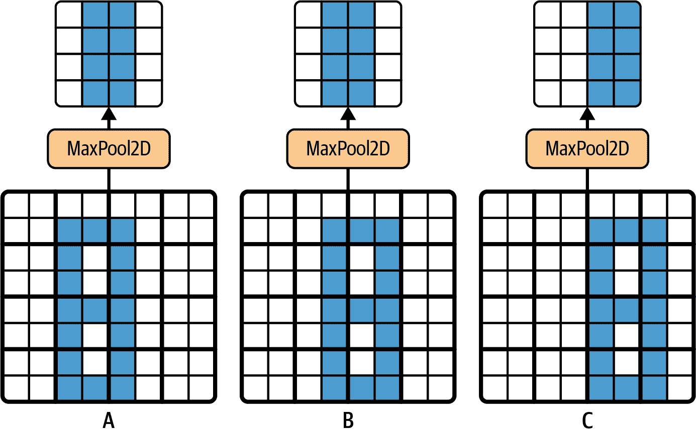
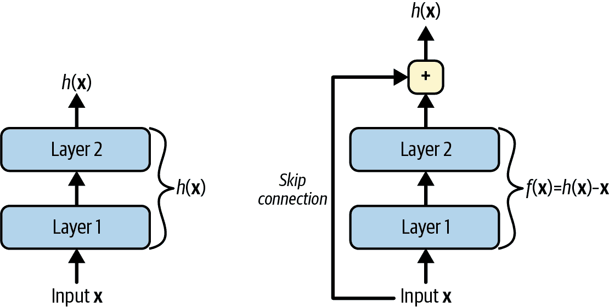
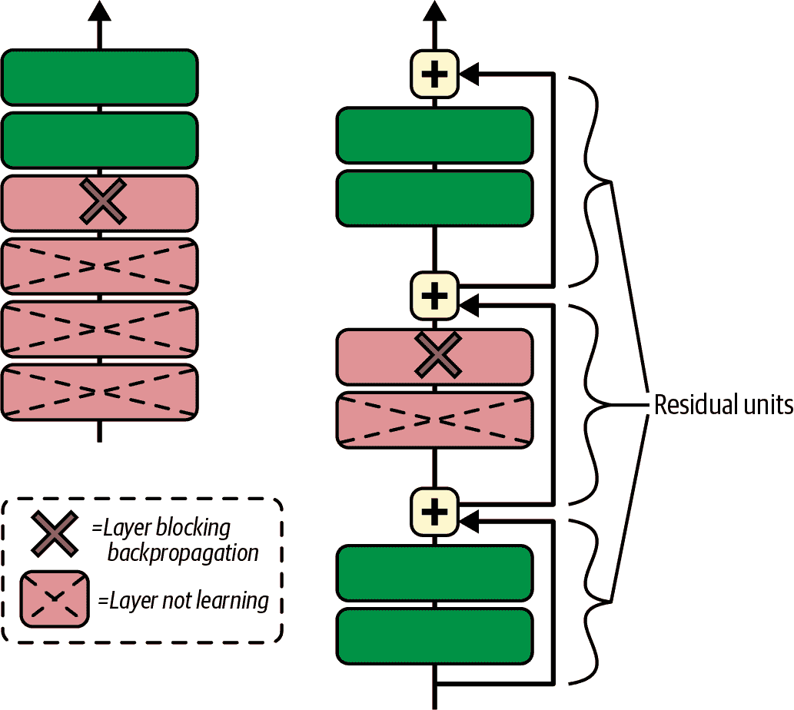
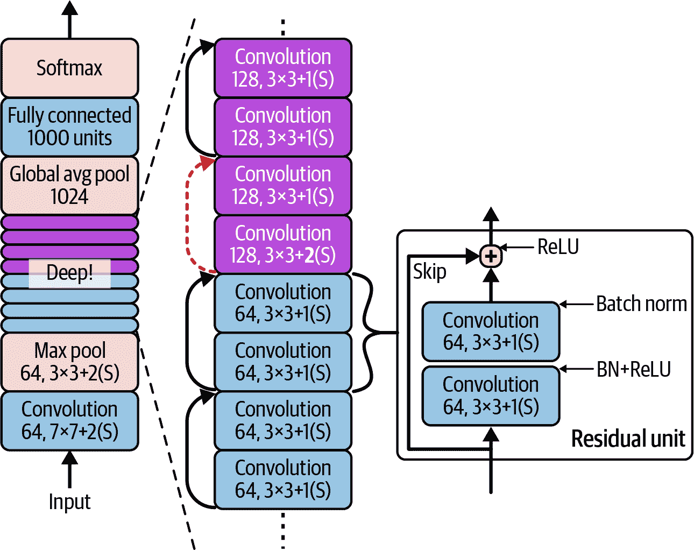
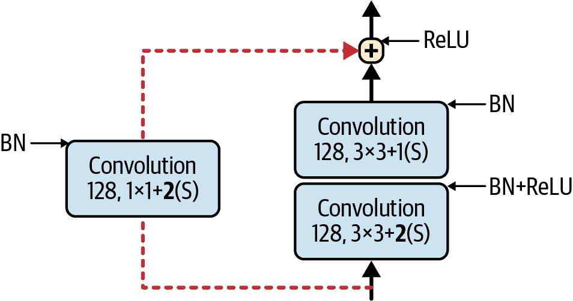
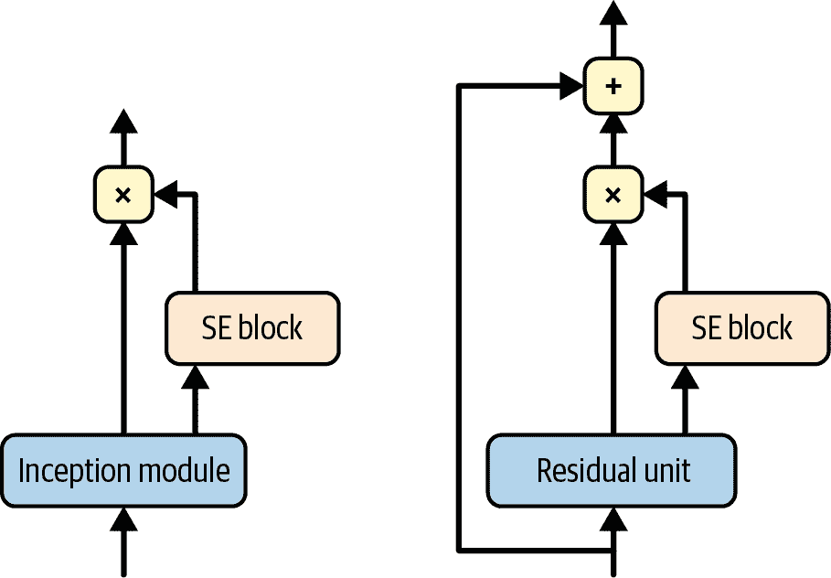
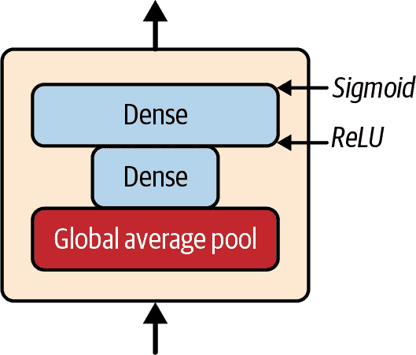

# 第十二章\. 使用卷积神经网络的深度计算机视觉

尽管 IBM 的 Deep Blue 超级计算机在 1996 年击败了国际象棋世界冠军加里·卡斯帕罗夫，但直到最近，计算机才能可靠地执行看似微不足道的任务，比如在图片中检测小狗或识别语音。为什么这些任务对我们人类来说如此容易？答案在于，感知在很大程度上发生在我们的意识之外，在我们大脑中专门的视觉、听觉和其他感官模块内。当感官信息到达我们的意识时，它已经带有高级特征；例如，当你看一张可爱小狗的图片时，你无法选择*不*看到小狗，*不*注意到它的可爱。你也不能解释*如何*你识别出可爱的小狗；这对你来说只是显而易见的。因此，我们不能相信我们的主观经验：感知绝非微不足道，要理解它，我们必须看看我们的感官模块是如何工作的。

*卷积神经网络*（CNN）起源于对大脑视觉皮层的研究，自 20 世纪 80 年代以来，它们已被用于计算机图像识别。在过去 15 年里，得益于计算能力的提升、可用训练数据的增加，以及第十一章中提出的用于训练深度网络的技巧，CNN 在处理一些复杂的视觉任务上已经达到了超越人类的表现。它们为图像搜索服务、自动驾驶汽车、自动视频分类系统等提供了动力。此外，CNN 不仅限于视觉感知：它们在许多其他任务中也取得了成功，例如语音识别和自然语言处理。然而，我们现在将专注于视觉应用。

在本章中，我们将探讨卷积神经网络（CNN）的起源，它们的基本构建块是什么样的，以及如何使用 PyTorch 来实现它们。然后我们将讨论一些最佳的 CNN 架构，以及其他视觉任务，包括目标检测（在图像中分类多个对象并在它们周围放置边界框）和语义分割（根据对象所属的类别对每个像素进行分类）。

# 视觉皮层的架构

大卫·H·休伯尔（David H. Hubel）和托斯顿·威塞尔（Torsten Wiesel）在[1958 年](https://homl.info/71)⁠^(1)和[1959 年](https://homl.info/72)⁠^(2)（以及几年后对猴子进行的实验](https://homl.info/73)⁠^(3))进行了一系列对猫的实验，为视觉皮层的结构（1981 年，作者因他们的工作获得了诺贝尔生理学或医学奖）提供了关键见解。特别是，他们展示了视觉皮层中的许多神经元具有小的*局部感受野*，这意味着它们只对视觉场中有限区域的视觉刺激做出反应（参见图 12-1，其中五个神经元的局部感受野由虚线圆表示）。不同神经元的感受野可能重叠，并且共同覆盖整个视觉场。


###### 图 12-1\. 视觉皮层中的生物神经元对视觉场中小区域内的特定模式做出反应；随着视觉信号通过连续的大脑模块，神经元对更大感受野中的更复杂模式做出反应

此外，作者还表明，一些神经元只对水平线的图像做出反应，而另一些神经元只对具有不同方向的线条做出反应（两个神经元可能具有相同的感觉野，但对不同的线条方向做出反应）。他们还注意到，一些神经元具有更大的感受野，并对更复杂的模式做出反应，这些模式是较低级别模式的组合。这些观察导致了一个想法，即高级神经元基于相邻的低级神经元的输出（在图 12-1 中，注意每个神经元只与前一层的附近神经元相连）。这种强大的架构能够检测视觉场任何区域的复杂模式。

这些对视觉皮层的研究启发了 1980 年引入的[新认知机](https://homl.info/74)⁠^(4)，它逐渐演变成了我们现在所说的卷积神经网络。一个重要的里程碑是 Yann LeCun 等人于[1998 年发表的一篇论文](https://homl.info/75)⁠^(5)，介绍了著名的*LeNet-5*架构，该架构被银行广泛用于识别支票上的手写数字。这个架构有一些你已经知道的构建块，例如全连接层和 sigmoid 激活函数，但它还引入了两个新的构建块：*卷积层*和*池化层*。现在让我们来看看它们。

###### 注意

为什么不简单地使用具有全连接层的深度神经网络进行图像识别任务呢？遗憾的是，尽管这对于小图像（例如，Fashion MNIST）效果很好，但由于它需要大量的参数，因此对于大图像来说就会失效。例如，一个 100 × 100 像素的图像有 10,000 个像素，如果第一层只有 1,000 个神经元（这已经严重限制了传递给下一层的信息量），这意味着总共需要 1,000 万个连接。而这只是第一层。CNN 通过使用部分连接层和权重共享来解决这一问题。

# 卷积层

CNN 最重要的构建块是**卷积层**：⁠^(6) 第一卷积层中的神经元并不连接到输入图像中的每一个像素（就像在前面章节中讨论的层那样），而是只连接到它们感受野中的像素（见图 12-2)。反过来，第二卷积层中的每个神经元只连接到第一层中位于一个小矩形内的神经元。这种架构使得网络能够专注于第一隐藏层中的小低级特征，然后将它们组装成下一隐藏层中的更大高级特征，依此类推。这种层次结构非常适合处理现实世界图像中常见的复合对象：这也是 CNN 在图像识别中表现如此出色的原因之一。


###### 图 12-2\. 具有矩形局部感受野的 CNN 层

###### 注意

我们迄今为止所查看的所有多层神经网络都是由一长串神经元组成的层，我们必须在将它们输入神经网络之前将输入图像展平为 1D。在 CNN 中，每一层都以 2D 形式表示，这使得匹配神经元与其相应的输入变得更容易。

位于给定层第*i*行、第*j*列的神经元连接到前一层中位于*i*到*i* + *f*[*h*] – 1 行、*j*到*j* + *f*[*w*] – 1 列的神经元的输出，其中*f*[*h*]和*f*[*w*]是感受野的高度和宽度（见图 12-3)。为了使层具有与前一层相同的高度和宽度，通常会在输入周围添加零，如图所示。这被称为**零填充**。

通过间隔感受野，也可以将一个大型输入层连接到一个远小的层，如图图 12-4 所示。这大大降低了模型的计算复杂度。从一个感受野到下一个感受野的水平或垂直步长称为**步长**。在图中，一个 5 × 7 输入层（包括零填充）通过 3 × 3 感受野和 2 的步长连接到一个 3 × 4 层。在这个例子中，两个方向的步长是相同的，这通常是情况（尽管也有例外）。上层中位于第*i*行、第*j*列的神经元连接到前一层中位于*i* × *s*[*h*]到*i* × *s*[*h*] + *f*[*h*] – 1 行、*j* × *s*[*w*]到*j* × *s*[*w*] + *f*[*w*] – 1 列的神经元的输出，其中*s*[*h*]和*s*[*w*]是垂直和水平步长。


###### 图 12-3。层之间的连接和零填充


###### 图 12-4。使用 2 的步长降低维度

## 滤波器

神经元的权重可以表示为与感受野大小相同的小图像。例如，图 12-5 显示了两组可能的权重，称为**滤波器**（或**卷积核**，或简称**核**）。第一个是一个中间有垂直白色线的黑色正方形（它是一个 7 × 7 的全 0 矩阵，除了中间列，该列全为 1）；使用这些权重的神经元将忽略它们感受野中的所有内容，除了中心垂直线（因为所有输入都将乘以 0，除了中心垂直线上的输入）。第二个滤波器是一个中间有水平白色线的黑色正方形。使用这些权重的神经元将忽略它们感受野中的所有内容，除了中心水平线。


###### 图 12-5。应用两个不同的滤波器以获得两个特征图

###### 注意

在深度学习中，我们通常构建一个单一模型，该模型接受原始输入并产生最终输出。这被称为**端到端学习**。相比之下，经典视觉系统通常会将系统划分为一系列专门的模块。

现在，如果一层中的所有神经元都使用相同的垂直线滤波器（以及相同的偏置项），并且你将网络输入图 12-5（底部图像）所示的输入图像，该层将输出顶部左边的图像。注意，垂直的白色线条被增强，而其余部分则被模糊。同样，如果所有神经元都使用相同的水平线滤波器，你将得到右上方的图像；注意，水平白色线条被增强，而其余部分则被模糊掉。因此，使用相同滤波器的神经元层输出一个*特征图*，该图突出了图像中激活滤波器最强烈的区域。但不用担心，你不需要手动定义滤波器：相反，在训练过程中，卷积层将自动学习其任务中最有用的滤波器，而上面的层将学会将它们组合成更复杂的模式。

## 多个特征图的堆叠

到目前为止，为了简单起见，我将每个卷积层表示为一个二维层，但现实中卷积层有多个滤波器（你决定有多少个）并且每个滤波器输出一个特征图，因此输出更准确地用三维表示（参见图 12-6）。


###### 图 12-6\. 每个卷积层有多个滤波器（核）处理具有三个颜色通道的彩色图像；每个卷积层为每个滤波器输出一个特征图

每个特征图中的每个像素对应一个神经元，并且给定特征图内的所有神经元共享相同的参数（即相同的核和偏置项）。不同特征图中的神经元使用不同的参数。神经元的感受野与之前描述的相同，但它扩展到前一层的所有特征图中。简而言之，卷积层同时对其输入应用多个可训练的滤波器，使其能够在输入的任何位置检测到多个特征。

###### 注意

由于特征图中的所有神经元共享相同的参数，这大大减少了模型中的参数数量。一旦 CNN 学会在某个位置识别一个模式，它就可以在任何其他位置识别该模式。相比之下，一旦全连接神经网络学会在某个位置识别一个模式，它只能在那个特定位置识别该模式。

输入图像也由多个子层组成：每个*颜色通道*一个。如第八章中所述，通常有三个：红色、绿色和蓝色（RGB）。灰度图像只有一个通道，但有些图像可能有更多——例如，捕捉额外光频的卫星图像（如红外线）。

具体来说，给定卷积层 *l* 中特征图 *k* 中行 *i*、列 *j* 的神经元连接到前一层 *l* – 1 中行 *i* × *s*[*h*] 到 *i* × *s*[*h*] + *f*[*h*] – 1 和列 *j* × *s*[*w*] 到 *j* × *s*[*w*] + *f*[*w*] – 1 的神经元的输出，跨越所有特征图（在层 *l* – *1*）。注意，在一个层中，位于同一行 *i* 和列 *j* 但在不同特征图中的所有神经元都连接到前一层中完全相同的神经元的输出。

方程 12-1 总结了前面的解释，用一个大的数学方程表示：它展示了如何计算卷积层中给定神经元的输出。由于所有不同的索引，它看起来有点丑，但它所做的只是计算所有输入的加权和，加上偏置项。

##### 方程 12-1\. 计算卷积层中神经元的输出

<mrow><msub><mi>z</mi> <mrow><mi>i</mi><mo lspace="0%" rspace="0%">,</mo><mi>j</mi><mo lspace="0%" rspace="0%">,</mo><mi>k</mi></mrow></msub> <mo>=</mo> <msub><mi>b</mi> <mi>k</mi></msub> <mo>+</mo> <munderover><mo>∑</mo> <mrow><mi>u</mi><mo>=</mo><mn>0</mn></mrow> <mrow><msub><mi>f</mi> <mi>h</mi></msub> <mo>-</mo><mn>1</mn></mrow></munderover> <munderover><mo>∑</mo> <mrow><mi>v</mi><mo>=</mo><mn>0</mn></mrow> <mrow><msub><mi>f</mi> <mi>w</mi></msub> <mo>-</mo><mn>1</mn></mrow></munderover> <munderover><mo>∑</mo> <mrow><mi>k</mi><mo>'</mo><mo>=</mo><mn>0</mn></mrow> <mrow><msub><mi>f</mi> <msup><mi>n</mi> <mo>'</mo></msup></msub> <mo>-</mo><mn>1</mn></mrow></munderover> <msub><mi>x</mi> <mrow><msup><mi>i</mi> <mo>'</mo></msup> <mo lspace="0%" rspace="0%">,</mo><msup><mi>j</mi> <mo>'</mo></msup> <mo lspace="0%" rspace="0%">,</mo><msup><mi>k</mi> <mo>'</mo></msup></mrow></msub> <mo>×</mo> <msub><mi>w</mi> <mrow><mi>u</mi><mo lspace="0%" rspace="0%">,</mo><mi>v</mi><mo lspace="0%" rspace="0%">,</mo><msup><mi>k</mi> <mo>'</mo></msup> <mo lspace="0%" rspace="0%">,</mo><mi>k</mi></mrow></msub> <mtext>with</mtext> <mfenced separators="" open="{" close=""><mtable><mtr><mtd columnalign="left"><mrow><mi>i</mi> <mo>'</mo> <mo>=</mo> <mi>i</mi> <mo>×</mo> <msub><mi>s</mi> <mi>h</mi></msub> <mo>+</mo> <mi>u</mi></mrow></mtd></mtr> <mtr><mtd columnalign="left"><mrow><mi>j</mi> <mo>'</mo> <mo>=</mo> <mi>j</mi> <mo>×</mo> <msub><mi>s</mi> <mi>w</mi></msub> <mo>+</mo> <mi>v</mi></mrow></mtd></mtr></mtable></mfenced></mrow>

在这个方程中：

+   *z*[*i*,] [*j*,] [*k*] 是位于特征图 *k* 中行 *i*、列 *j* 的神经元的输出，该神经元位于卷积层（层 *l*）中。

+   如前所述，*s*[*h*] 和 *s*[*w*] 是垂直和水平步长，*f*[*h*] 和 *f*[*w*] 是感受野的高度和宽度，*f*[*n*′] 是前一层（层 *l* – 1）中的特征图数量。

+   *x*[*i*′,] [*j*′,] [*k*′] 是位于层 *l* – 1、行 *i*′、列 *j*′、特征图 *k*′（如果前一层是输入层，则为通道 *k*′）的神经元的输出。

+   *b*[*k*] 是特征图 *k*（在层 *l* 中）的偏置项。你可以将其视为一个旋钮，用于调整特征图 *k* 的整体亮度。

+   *w*[*u*,] [*v*,] [*k*′,] [*k*] 是层 *l* 中特征图 *k* 的任意神经元与其位于行 *u*、列 *v*（相对于神经元的感受野）及其输入之间的连接权重，以及特征图 *k*′。

让我们看看如何使用 PyTorch 创建和使用卷积层。

## 使用 PyTorch 实现卷积层

首先，让我们使用 Scikit-Learn 的 `load_sample_images()` 函数加载一些样本图像。第一幅图像代表中国佛教香塔，而第二幅图像则代表一朵美丽的 *Dahlia pinnata* 花朵。这些图像以 Python 列表的形式表示 NumPy 无符号字节数组，因此让我们将这些图像堆叠成一个单一的 NumPy 数组，然后将其转换为 32 位浮点张量，并将像素值从 0–255 缩放到 0–1：

```py
import numpy as np
import torch
from sklearn.datasets import load_sample_images

sample_images = np.stack(load_sample_images()["images"])
sample_images = torch.tensor(sample_images, dtype=torch.float32) / 255
```

让我们看看这个张量的形状：

```py
>>> sample_images.shape `torch.Size([2, 427, 640, 3])`
```

```py```````py``` We have two images, both are 427 pixels high and 640 pixels wide, and they have three color channels: red, green, and blue. As we saw in Chapter 10, PyTorch expects the channel dimension to be just *before* the height and width dimensions, not after, so we need to permute the dimensions using the `permute()` method:    ``` >>> sample_images_permuted = sample_images.permute(0, 3, 1, 2) `>>>` `sample_images_permuted``.``shape` `` `torch.Size([2, 3, 427, 640])` `` ```py   ``````py`````` ```py```````py` 让我们也使用 TorchVision 的`CenterCrop`类来对图像进行中心裁剪：``` >>> import torchvision `>>>` `import` `torchvision.transforms.v2` `as` `T` ```py` `>>>` `cropped_images` `=` `T``.``CenterCrop``((``70``,` `120``))(``sample_images_permuted``)` ``` `>>>` `cropped_images``.``shape` `` `torch.Size([2, 3, 70, 120])` `` ```py ```` ```py   ``````py```` ```py`````` ```py````` 现在让我们创建一个二维卷积层，并将这些裁剪后的图像输入其中，看看会得到什么结果。为此，PyTorch 提供了`nn.Conv2d`层。在底层，这个层依赖于`torch.nn.((("torch", "F.conv2d()")))functional.conv2d()`函数。让我们创建一个具有 32 个滤波器、每个滤波器大小为 7 × 7（使用`kernel_size=7`，相当于使用`kernel_size=(7 , 7)`）的卷积层，并将其应用于我们的小批量两张图像：```py import torch.nn as nn  torch.manual_seed(42) conv_layer = nn.Conv2d(in_channels=3, out_channels=32, kernel_size=7) fmaps = conv_layer(cropped_images) ```    ###### 注意    当我们谈论二维卷积层时，“2D”指的是空间维度（高度和宽度），但正如你所见，这个层接受 4D 输入：正如我们所见，另外两个维度是批量大小（第一个维度）和通道（第二个维度）。    现在让我们看看输出的形状：```py >>> fmaps.shape `torch.Size([2, 32, 64, 114])` ```   ```py```` 输出形状与输入形状相似，但有两大区别。首先，有 32 个通道而不是 3 个。这是因为我们设置了`out_channels=32`，所以我们得到了 32 个输出特征图：而不是每个位置的红色、绿色和蓝色的强度，我们现在在每个位置都有每个特征的强度。其次，高度和宽度都缩小了 6 个像素。这是因为`nn.Conv2d`层默认不使用任何零填充，这意味着我们在输出特征图的边缘会丢失一些像素，具体取决于滤波器的大小。在这种情况下，由于滤波器大小为 7，我们在水平方向上丢失了 6 个像素，在垂直方向上也丢失了 6 个像素（即每边 3 个像素）。    ###### 警告    默认情况下，`padding`超参数设置为 0，这意味着填充被关闭。奇怪的是，这也被称为*有效填充*，因为每个神经元的感受野严格位于输入内的*有效*位置（它不会越界）。实际上，你可以设置`padding="valid"`，这相当于`padding=0`。这不是 PyTorch 的命名怪癖：每个人都使用这种令人困惑的命名法。    如果我们改为设置`padding="same"`，那么输入将在所有边上填充足够的零，以确保输出特征图最终具有与输入相同的*大小*（因此得名此选项）：```py >>> conv_layer = nn.Conv2d(in_channels=3, out_channels=32, kernel_size=7, `... `                       `padding``=``"same"``)` ````` `...` ```py` `>>>` `fmaps` `=` `conv_layer``(``cropped_images``)` ``` `>>>` `fmaps``.``shape` `` `torch.Size([2, 32, 70, 120])` `` ```py ```` ```py`` ```   ```py``` ````` ```py` These two padding options are illustrated in Figure 12-7. For simplicity, only the horizontal dimension is shown here, but of course the same logic applies to the vertical dimension as well.    ###### Figure 12-7\. Two different padding options, with `stride=1` and `kernel_size=7`    If the stride is greater than 1 (in any direction), then the output size will be much smaller than the input size. For example, assuming the input size is 70 × 120, then if you set `stride=2` (or equivalently `stride=(2, 2)`), `padding=3`, and `kernel_size=7`, then the output feature maps will be 35 × 60: halved both vertically and horizontally. You could set a very large padding value to make the output size identical to the input size, but that’s almost certainly a bad idea since it would drown your image in a sea of zeros (for this reason, PyTorch raises an exception if you set `padding="same"` along with a `stride` greater than 1). Figure 12-8 illustrates `stride=2`, with `kernel_size=7` and `padding` set to 0 or 3.    ###### Figure 12-8\. Two different padding options, with `stride=2` and `kernel_size=7`: the output size is much smaller    Now let’s look at the layer’s parameters (which were denoted as *w*[*u*,] [*v*,] [*k*′,] [*k*] and *b*[*k*] in Equation 12-1). Just like an `nn.Linear` layer, an `nn.Conv2d` layer holds all the layer’s parameters, including the kernels and biases, which are accessible via the `weight` and `bias` attributes:    ``` >>> conv_layer.weight.shape `torch.Size([32, 3, 7, 7])` `>>>` `conv_layer``.``bias``.``shape` `` `torch.Size([32])` `` ```py   ``` ``The `weight` tensor is 4D, and its shape is [*output_channels*, *input_channels*, *kernel_height*, *kernel_width*]. The `bias` tensor is 1D, with shape [*output_channels*]. The number of output channels is equal to the number of output feature maps, which is also equal to the number of filters. Most importantly, note that the height and width of the input images do not appear in the kernel’s shape: this is because all the neurons in the output feature maps share the same weights, as explained earlier. This means that you can feed images of any size to this layer, as long as they are at least as large as the kernels, and if they have the right number of channels (three in this case).    It’s important to add an activation function after each convolutional layer. This is for the same reason as for `nn.Linear` layers: a convolutional layer performs a linear operation, so if you stacked multiple convolutional layers without any activation functions, they would all be equivalent to a single convolutional layer, and they wouldn’t be able to learn anything really complex.    Both the `weight` and `bias` parameters are initialized randomly, using a uniform distribution similar to the one used by the `nn.Linear` layer, between $minus StartFraction 1 Over StartRoot k EndRoot EndFraction$ and $plus StartFraction 1 Over StartRoot k EndRoot EndFraction$ , where *k* is the fan[in]. In `nn.Conv2d`, *k* = *f*[h] × *f*[w] × *f*[n’], where *f*[h] and *f*[w] are the height and width of the kernel, and *f*[n’] is the number of input channels. As we saw in Chapter 11, you will generally want to reinitialize the weights depending on the activation function you use. For example, you should apply He initialization whenever you use the ReLU activation function. As for the biases, they can just be reinitialized to zero.    As you can see, convolutional layers have quite a few hyperparameters: the number of filters (`out_channels`), the kernel size, the type of padding, the strides, and the activation function. As always, you can use cross-validation to find the right hyperparameter values, but this is very time-consuming. We will discuss common CNN architectures later in this chapter to give you some idea of which hyperparameter values work best in practice.    Now, let’s look at the second common building block of CNNs: the *pooling layer*.`` ```py ```` ```py`` ``````py ``````py` ``````py`` ``````py``` ``````py```` ```py```````py` ``````py`````` ```py```````py```  ``````py```````py ``````py`````` ```py```````py` # Pooling Layers    Once you understand how convolutional layers work, the pooling layers are quite easy to grasp. Their goal is to *subsample* (i.e., shrink) the input image in order to reduce the computational load, the memory usage, and the number of parameters (thereby limiting the risk of overfitting).    Just like in convolutional layers, each neuron in a pooling layer is connected to the outputs of a limited number of neurons in the previous layer, located within a small rectangular receptive field. You must define its size, the stride, and the padding type, just like before. However, a pooling neuron has no weights or biases; all it does is aggregate the inputs using an aggregation function such as the max or mean. Figure 12-9 shows a *max pooling layer*, which is the most common type of pooling layer. In this example, we use a 2 × 2 *pooling kernel*,⁠^(7) with a stride of 2 and no padding. Only the max input value in each receptive field makes it to the next layer, while the other inputs are dropped. For example, in the lower-left receptive field in Figure 12-9, the input values are 1, 5, 3, and 2, so only the max value, 5, is propagated to the next layer. Because of the stride of 2, the output image has half the height and half the width of the input image (rounded down since we use no padding).    ###### Figure 12-9\. Max pooling layer (2 × 2 pooling kernel, stride 2, no padding)    ###### Note    A pooling layer typically works on every input channel independently, so the output depth (i.e., the number of channels) is the same as the input depth.    Other than reducing computations, memory usage, and the number of parameters, a max pooling layer also introduces some level of *invariance* to small translations, as shown in Figure 12-10. Here we assume that the bright pixels have a lower value than dark pixels, and we consider three images (A, B, C) going through a max pooling layer with a 2 × 2 kernel and stride 2\. Images B and C are the same as image A, but shifted by one and two pixels to the right. As you can see, the outputs of the max pooling layer for images A and B are identical. This is what translation invariance means. For image C, the output is different: it is shifted one pixel to the right (but there is still 50% invariance). By inserting a max pooling layer every few layers in a CNN, it is possible to get some level of translation invariance at a larger scale. Moreover, max pooling offers a small amount of rotational invariance and a slight scale invariance. Such invariance (even if it is limited) can be useful in cases where the prediction should not depend on these details, such as in classification tasks.    ###### Figure 12-10\. Invariance to small translations    However, max pooling has some downsides too. It’s obviously very destructive: even with a tiny 2 × 2 kernel and a stride of 2, the output will be two times smaller in both directions (so its area will be four times smaller), thereby dropping 75% of the input values. And in some applications, invariance is not desirable. Take semantic segmentation (the task of classifying each pixel in an image according to the object that pixel belongs to, which we’ll explore later in this chapter): obviously, if the input image is translated by one pixel to the right, the output should also be translated by one pixel to the right. The goal in this case is *equivariance*, not invariance: a small change to the inputs should lead to a corresponding small change in the output.    # Implementing Pooling Layers with PyTorch    The following code creates an `nn.MaxPool2d` layer, using a 2 × 2 kernel. The strides default to the kernel size, so this layer uses a stride of 2 (horizontally and vertically). By default, it uses `padding=0` (i.e., “valid” padding):    ``` max_pool = nn.MaxPool2d(kernel_size=2) ```py    To create an *average pooling layer*, just use `nn.AvgPool2d`, instead of `nn.MaxPool2d`. As you might expect, it works exactly like a max pooling layer, except it computes the mean rather than the max. Average pooling layers used to be very popular, but people mostly use max pooling layers now, as they generally perform better. This may seem surprising, since computing the mean generally loses less information than computing the max. But on the other hand, max pooling preserves only the strongest features, getting rid of all the meaningless ones, so the next layers get a cleaner signal to work with. Moreover, max pooling offers stronger translation invariance than average pooling, and it requires slightly less compute.    Note that max pooling and average pooling can also be performed along the depth dimension instead of the spatial dimensions, although it’s not as common. This can allow the CNN to learn to be invariant to various features. For example, it could learn multiple filters, each detecting a different rotation of the same pattern (such as handwritten digits; see Figure 12-11), and the depthwise max pooling layer would ensure that the output is the same regardless of the rotation. The CNN could similarly learn to be invariant to anything: thickness, brightness, skew, color, and so on.    ###### Figure 12-11\. Depthwise max pooling can help the CNN learn to be invariant (to rotation in this case)    PyTorch does not include a depthwise max pooling layer, but we can implement a custom module based on the `torch.F.max_pool1d()` function:    ``` import torch.nn.functional as F  class DepthPool(torch.nn.Module):     def __init__(self, kernel_size, stride=None, padding=0):         super().__init__()         self.kernel_size = kernel_size         self.stride = stride if stride is not None else kernel_size         self.padding = padding      def forward(self, inputs):         batch, channels, height, width = inputs.shape         Z = inputs.view(batch, channels, height * width)  # merge spatial dims         Z = Z.permute(0, 2, 1)  # switch spatial and channels dims         Z = F.max_pool1d(Z, kernel_size=self.kernel_size, stride=self.stride,                          padding=self.padding)  # compute max pool         Z = Z.permute(0, 2, 1)  # switch back spatial and channels dims         return Z.view(batch, -1, height, width)  # unmerge spatial dims ```py    For example, suppose the input batch contains two 70 × 120 images, each with 32 channels (i.e., the inputs have a shape of `[2, 32, 70, 120]`), and we use `kernel_size=4`, and the default `stride` (equal to `kernel_size`) and `padding=0`:    *   The `forward()` method starts by merging the spatial dimensions, which gives us a tensor of shape `[2, 32, 8400]` (since 70 × 120 = 8,400).           *   It then permutes the last two dimensions, so we get a shape of `[2, 8400, 32]`.           *   Next, it uses the `max_pool1d()` function to compute the max pool along the last dimension, which corresponds to our original 32 channels. Since `kernel_size` and `stride` are both equal to 4, and we don’t use any padding, the size of the last dimension gets divided by 4, so the resulting shape is `[2, 8400, 8]`.           *   The function then permutes the last two dimensions again, giving us a shape of `[2, 8, 8400]`.           *   Lastly, it separates the spatial dimensions to get the final shape of `[2, 8, 50, 100]`. You can verify that the output is exactly what we were after.              One last type of pooling layer that you will often see in modern architectures is the *global average pooling layer*. It works very differently: all it does is compute the mean of each entire feature map. Therefore it outputs a single number per feature map and per instance. Although this is of course extremely destructive (most of the information in the feature map is lost), it can be useful just before the output layer, as you will see later in this chapter.    To create such a layer, one option is to use a regular `nn.AvgPool2d` layer and set its kernel size to the same size as the inputs. However, this is not very convenient since it requires knowing the exact dimensions of the inputs ahead of time. A simpler solution is to use the `nn.AdaptiveAvgPool2d` layer, which lets you specify the desired spatial dimensions of the output: it automatically adapts the kernel size (with an equal stride) to get the desired result, adding a bit of padding if needed. If we set the output size to 1, we get a global average pooling layer:    ``` global_avg_pool = nn.AdaptiveAvgPool2d(output_size=1) output = global_avg_pool(cropped_images) ```py    Alternatively, you could just use the `torch.mean()` function to get the same output:    ``` output = cropped_images.mean(dim=(2, 3), keepdim=True) ```py    Now you know all the building blocks to create convolutional neural networks. Let’s see how to assemble them.    # CNN Architectures    Typical CNN architectures stack a few convolutional layers (each one generally followed by a ReLU layer), then a pooling layer, then another few convolutional layers (+ReLU), then another pooling layer, and so on. The image gets smaller and smaller as it progresses through the network, but it also typically gets deeper and deeper (i.e., with more feature maps), thanks to the convolutional layers (see Figure 12-12). At the top of the stack, a regular feedforward neural network is added, composed of a few fully connected layers (+ReLUs), and the final layer outputs the prediction (e.g., a softmax layer that outputs estimated class probabilities).    ###### Figure 12-12\. Typical CNN architecture    ###### Tip    Instead of using a convolutional layer with a 5 × 5 kernel, it is generally preferable to stack two layers with 3 × 3 kernels: it will use fewer parameters and require fewer computations, and it will usually perform better. One exception is for the first convolutional layer: it can typically have a large kernel (e.g., 5 × 5 or 7 × 7), usually with a stride of 2 or more. This reduces the spatial dimension of the image without losing too much information, and since the input image only has three channels in general, it will not be too costly.    Here is how you can implement a basic CNN to tackle the Fashion MNIST dataset (introduced in Chapter 9):    ``` from functools import partial  DefaultConv2d = partial(nn.Conv2d, kernel_size=3, padding="same") model = nn.Sequential(     DefaultConv2d(in_channels=1, out_channels=64, kernel_size=7), nn.ReLU(),     nn.MaxPool2d(kernel_size=2),     DefaultConv2d(in_channels=64, out_channels=128), nn.ReLU(),     DefaultConv2d(in_channels=128, out_channels=128), nn.ReLU(),     nn.MaxPool2d(kernel_size=2),     DefaultConv2d(in_channels=128, out_channels=256), nn.ReLU(),     DefaultConv2d(in_channels=256, out_channels=256), nn.ReLU(),     nn.MaxPool2d(kernel_size=2),     nn.Flatten(),     nn.Linear(in_features=2304, out_features=128), nn.ReLU(),     nn.Dropout(0.5),     nn.Linear(in_features=128, out_features=64), nn.ReLU(),     nn.Dropout(0.5),     nn.Linear(in_features=64, out_features=10), ).to(device) ```py    Let’s go through this code:    *   We use the `functools.partial()` function (introduced in Chapter 11) to define `DefaultConv2d`, which acts just like `nn.Conv2d` but with different default arguments: a small kernel size of 3, and `"same"` padding. This avoids having to repeat these arguments throughout the model.           *   Next, we create the `nn.Sequential` model. Its first layer is a `DefaultConv2d` with 64 fairly large filters (7 × 7). It uses the default stride of 1 because the input images are not very large. It also uses `in_channels=1` because the Fashion MNIST images have a single color channel (i.e., grayscale). Each convolutional layer is followed by the ReLU activation function.           *   We then add a max pooling layer with a kernel size of 2, so it divides each spatial dimension by a factor of 2 (rounded down if needed).           *   Then we repeat the same structure twice: two convolutional layers followed by a max pooling layer. For larger images, we could repeat this structure several more times. The number of repetitions is a hyperparameter you can tune.           *   Note that the number of filters doubles as we climb up the CNN toward the output layer (it is initially 64, then 128, then 256). It makes sense for it to grow, since the number of low-level features is often fairly low (e.g., small circles, horizontal lines), but there are many different ways to combine them into higher-level features. It is a common practice to double the number of filters after each pooling layer: since a pooling layer divides each spatial dimension by a factor of 2, we can afford to double the number of feature maps in the next layer without fear of exploding the number of parameters, memory usage, or computational load.           *   Next is the fully connected network, composed of two hidden dense layers (`nn.Linear`) with the ReLU activation function, plus a dense output layer. Since it’s a classification task with 10 classes, the output layer has 10 units. As we did in Chapter 10, we leave out the softmax activation function, so the model will output logits rather than probabilities, and we must use the `nn.CrossEntropyLoss` to train the model. Note that we must flatten the inputs just before the first dense layer, since it expects a 1D array of features for each instance. We also add two dropout layers, with a dropout rate of 50% each, to reduce overfitting.              ###### Tip    The first `nn.Linear` layer has 2,304 input features: where did this number come from? Well the Fashion MNIST images are 28 × 28 pixels, but the pooling layers shrink them to 14 × 14, then 7 × 7, and finally 3 × 3\. Just before the first `nn.Linear` layer, there are 256 feature maps, so we end up with 256 × 3 × 3 = 2,304 input features. Figuring out the number of features can sometimes be a bit difficult, but one trick is to set `in_features` to some arbitrary value (say, 999), and let training crash. The correct number of features appears in the error message: “RuntimeError: mat1 and mat2 shapes cannot be multiplied (32x2304 and 999x128)”. Another option is to use `nn.LazyLinear` instead of `nn.Linear`: it’s just like the `nn.Linear` layer, except it only creates the weights matrix the first time it gets called: it can then automatically set the number of input features to the correct value. Other layers—such as convolutional layers and batch-norm layers—also have lazy variants.    If you train this model on the Fashion MNIST training set, it should reach close to 92% accuracy on the test set (you can use the `train()` and `evaluate_tm()` functions we defined in Chapter 10). It’s not state of the art, but it is pretty good, and better than what we achieved with dense networks in Chapter 9.    Over the years, variants of this fundamental architecture have been developed, leading to amazing advances in the field. A good measure of this progress is the error rate in competitions such as the ILSVRC [ImageNet challenge](https://image-net.org). In this competition, the error rate for image classification fell from over 26% to less than 2.3% in just 6 years. More precisely, this was the *top-five error rate*, which is the ratio of test images for which the system’s five most confident predictions did *not* include the correct answer. The images are fairly large (e.g., 256 pixels high) and there are 1,000 classes, some of which are really subtle (try distinguishing 120 dog breeds!). Looking at the evolution of the winning entries is a good way to understand how CNNs work, and how research in deep learning progresses.    We will first look at the classical LeNet-5 architecture (1998), then several winners of the ILSVRC challenge: AlexNet (2012), GoogLeNet (2014), ResNet (2015), and SENet (2017). We will also discuss a few more architectures, including VGGNet, Xception, ResNeXt, DenseNet, MobileNet, CSPNet, EfficientNet, and ConvNeXt (and we will discuss vision transformers in Chapter 16).    ## LeNet-5    The [LeNet-5 architecture](https://homl.info/lenet5)⁠^(8) is perhaps the most widely known CNN architecture. As mentioned earlier, it was created by Yann LeCun in 1998 and has been widely used for handwritten digit recognition (MNIST). It is composed of the layers shown in Table 12-1.      Table 12-1\. LeNet-5 architecture   | Layer | Type | Maps | Size | Kernel size | Stride | Activation | | --- | --- | --- | --- | --- | --- | --- | | Out | Fully connected | – | 10 | – | – | RBF | | F6 | Fully connected | – | 84 | – | – | tanh | | C5 | Convolution | 120 | 1 × 1 | 5 × 5 | 1 | tanh | | S4 | Avg pooling | 16 | 5 × 5 | 2 × 2 | 2 | tanh | | C3 | Convolution | 16 | 10 × 10 | 5 × 5 | 1 | tanh | | S2 | Avg pooling | 6 | 14 × 14 | 2 × 2 | 2 | tanh | | C1 | Convolution | 6 | 28 × 28 | 5 × 5 | 1 | tanh | | In | Input | 1 | 32 × 32 | – | – | – |    As you can see, this looks pretty similar to our Fashion MNIST model: a stack of convolutional layers and pooling layers, followed by a dense network. Perhaps the main difference with more modern classification CNNs is the activation functions: today, we would use ReLU instead of tanh, and softmax instead of RBF (introduced in Chapter 2). There were several other minor differences that don’t really matter much, but in case you are interested, they are listed in this chapter’s notebook at [*https://homl.info/colab-p*](https://homl.info/colab-p). Yann LeCun’s [website](http://yann.lecun.com/exdb/lenet) also features great demos of LeNet-5 classifying digits.    ## AlexNet    The [AlexNet CNN architecture](https://homl.info/80)⁠^(9) won the 2012 ILSVRC challenge by a large margin: it achieved a top-five error rate of 17%, while the second best competitor achieved only 26%! AlexNet was developed by Alex Krizhevsky (hence the name), Ilya Sutskever, and Geoffrey Hinton. It is similar to LeNet-5, only much larger and deeper, and it was the first to stack convolutional layers directly on top of one another, instead of stacking a pooling layer on top of each convolutional layer. Table 12-2 presents this architecture.      Table 12-2\. AlexNet architecture   | Layer | Type | Maps | Size | Kernel size | Stride | Padding | Activation | | --- | --- | --- | --- | --- | --- | --- | --- | | Out | Fully connected | – | 1,000 | – | – | – | Softmax | | F10 | Fully connected | – | 4,096 | – | – | – | ReLU | | F9 | Fully connected | – | 4,096 | – | – | – | ReLU | | S8 | Max pooling | 256 | 6 × 6 | 3 × 3 | 2 | `valid` | – | | C7 | Convolution | 256 | 13 × 13 | 3 × 3 | 1 | `same` | ReLU | | C6 | Convolution | 384 | 13 × 13 | 3 × 3 | 1 | `same` | ReLU | | C5 | Convolution | 384 | 13 × 13 | 3 × 3 | 1 | `same` | ReLU | | S4 | Max pooling | 256 | 13 × 13 | 3 × 3 | 2 | `valid` | – | | C3 | Convolution | 256 | 27 × 27 | 5 × 5 | 1 | `same` | ReLU | | S2 | Max pooling | 96 | 27 × 27 | 3 × 3 | 2 | `valid` | – | | C1 | Convolution | 96 | 55 × 55 | 11 × 11 | 4 | `valid` | ReLU | | In | Input | 3 (RGB) | 227 × 227 | – | – | – | – |    To reduce overfitting, the authors used two regularization techniques. First, they applied dropout (introduced in Chapter 11) with a 50% dropout rate during training to the outputs of layers F9 and F10\. Second, they performed data augmentation by randomly shifting the training images by various offsets, flipping them horizontally, and changing the lighting conditions.    AlexNet also used a regularization technique called *local response normalization* (LRN): the most strongly activated neurons inhibit other neurons located at the same position in neighboring feature maps. Such competitive activation has been observed in biological neurons. This encourages different feature maps to specialize, pushing them apart and forcing them to explore a wider range of features, ultimately improving generalization. However, this technique was mostly superseded by simpler and more efficient regularization techniques, especially batch normalization.    A variant of AlexNet called [*ZFNet*](https://homl.info/zfnet)⁠^(10) was developed by Matthew Zeiler and Rob Fergus and won the 2013 ILSVRC challenge. It is essentially AlexNet with a few tweaked hyperparameters (number of feature maps, kernel size, stride, etc.).    ## GoogLeNet    The [GoogLeNet architecture](https://homl.info/81) was developed by Christian Szegedy et al. from Google Research,⁠^(11) and it won the ILSVRC 2014 challenge by pushing the top-five error rate below 7%. This great performance came in large part from the fact that the network was much deeper than previous CNNs (as you’ll see in Figure 12-15). This was made possible by subnetworks called *inception modules*,⁠^(12) which allow GoogLeNet to use parameters much more efficiently than previous architectures: GoogLeNet actually has 10 times fewer parameters than AlexNet (roughly 6 million instead of 60 million).    Figure 12-14 shows the architecture of an inception module. The notation “3 × 3 + 1(S)” means that the layer uses a 3 × 3 kernel, stride 1, and `"same"` padding. The input signal is first fed to four different layers in parallel. All convolutional layers use the ReLU activation function. Note that the top convolutional layers use different kernel sizes (1 × 1, 3 × 3, and 5 × 5), allowing them to capture patterns at different scales. Also note that every single layer uses a stride of 1 and `"same"` padding (even the max pooling layer), so their outputs all have the same height and width as their inputs. This makes it possible to concatenate all the outputs along the depth dimension in the final *depth concatenation layer* (i.e., it concatenates the multiple feature maps output by each of the upper four convolutional layers). It can be implemented using the `torch.cat()` function, with `dim=1`.    ###### Figure 12-14\. Inception module    You may wonder why inception modules have convolutional layers with 1 × 1 kernels. Surely these layers cannot capture any features because they look at only one pixel at a time, right? In fact, these layers serve three purposes:    *   Although they cannot capture spatial patterns, they can capture patterns along the depth dimension (i.e., across channels).           *   They are configured to output fewer feature maps than their inputs, so they serve as *bottleneck layers*, meaning they reduce dimensionality. This cuts the computational cost and the number of parameters, speeding up training and improving generalization.           *   Each pair of convolutional layers ([1 × 1, 3 × 3] and [1 × 1, 5 × 5]) acts like a single powerful convolutional layer, capable of capturing more complex patterns. A convolutional layer is equivalent to sweeping a dense layer across the image (at each location, it only looks at a small receptive field), and these pairs of convolutional layers are equivalent to sweeping two-layer neural networks across the image.              In short, you can think of the whole inception module as a convolutional layer on steroids, able to output feature maps that capture complex patterns at various scales.    Now let’s look at the architecture of the GoogLeNet CNN (see Figure 12-15). The number of feature maps output by each convolutional layer and each pooling layer is shown before the kernel size. The architecture is so deep that it has to be represented in three columns, but GoogLeNet is actually one tall stack, including nine inception modules (the boxes with the spinning tops). The six numbers in the inception modules represent the number of feature maps output by each convolutional layer in the module (in the same order as in Figure 12-14). Note that all the convolutional layers use the ReLU activation function.    ###### Figure 12-15\. GoogLeNet architecture    Let’s go through this network:    *   The first two layers divide the image’s height and width by 4 (so its area is divided by 16), to reduce the computational load. The first layer uses a large kernel size, 7 × 7, so that much of the information is preserved.           *   Then the local response normalization layer ensures that the previous layers learn a wide variety of features (as discussed earlier).           *   Two convolutional layers follow, where the first acts like a bottleneck layer. As mentioned, you can think of this pair as a single smarter convolutional layer.           *   Again, a local response normalization layer ensures that the previous layers capture a wide variety of patterns.           *   Next, a max pooling layer reduces the image height and width by 2, again to speed up computations.           *   Then comes the CNN’s *backbone*: a tall stack of nine inception modules, interleaved with a couple of max pooling layers to reduce dimensionality and speed up the net.           *   Next, the global average pooling layer outputs the mean of each feature map: this drops any remaining spatial information, which is fine because there is not much spatial information left at that point. Indeed, GoogLeNet input images are typically expected to be 224 × 224 pixels, so after 5 max pooling layers, each dividing the height and width by 2, the feature maps are down to 7 × 7\. Moreover, this is a classification task, not localization, so it doesn’t matter where the object is. Thanks to the dimensionality reduction brought by this layer, there is no need to have several fully connected layers at the top of the CNN (like in AlexNet), and this considerably reduces the number of parameters in the network and limits the risk of overfitting.           *   The last layers are self-explanatory: dropout for regularization, then a fully connected layer with 1,000 units (since there are 1,000 classes) and a softmax activation function to output estimated class probabilities.              The original GoogLeNet architecture included two auxiliary classifiers plugged on top of the third and sixth inception modules. They were both composed of one average pooling layer, one convolutional layer, two fully connected layers, and a softmax activation layer. During training, their loss (scaled down by 70%) was added to the overall loss. The goal was to fight the vanishing gradients problem and regularize the network, but it was later shown that their effect was relatively minor.    Several variants of the GoogLeNet architecture were later proposed by Google researchers, including Inception-v3 and Inception-v4, using slightly different inception modules to reach even better performance.    ## ResNet    Kaiming He et al. won the ILSVRC 2015 challenge using a [Residual Network (ResNet)](https://homl.info/82)⁠^(13) that delivered an astounding top-five error rate under 3.6%. The winning variant used an extremely deep CNN composed of 152 layers (other variants had 34, 50, and 101 layers). It confirmed the general trend: computer vision models were getting deeper and deeper, with fewer and fewer parameters. The key to being able to train such a deep network is to use *skip connections* (also called *shortcut connections*): the signal feeding into a layer is also added to the output of a layer located higher up the stack. Let’s see why this is useful.    When training a neural network, the goal is to make it model a target function *h*(**x**). If you add the input **x** to the output of the network (i.e., you add a skip connection), then the network will be forced to model *f*(**x**) = *h*(**x**) – **x** rather than *h*(**x**). This is called *residual learning* (see Figure 12-16).    ###### Figure 12-16\. Residual learning    When you initialize a neural network, its weights are close to zero, so a regular network just outputs values close to zero when training starts. But if you add a skip connection, the resulting network outputs a copy of its inputs; in other words, it acts as the identity function at the start of training. If the target function is fairly close to the identity function (which is often the case), this will speed up training considerably.    Moreover, if you add many skip connections, the network can start making progress even if several layers have not started learning yet (see Figure 12-17). Thanks to skip connections, the signal can easily make its way across the whole network. The deep residual network can be seen as a stack of *residual units* (RUs), where each residual unit is a small neural network with a skip connection.    Now let’s look at ResNet’s architecture (see Figure 12-18). It is surprisingly simple. It starts and ends exactly like GoogLeNet (except without a dropout layer), and in between is just a very deep stack of residual units. Each residual unit is composed of two convolutional layers (and no pooling layer!), with batch normalization (BN) and ReLU activation, using 3 × 3 kernels and preserving spatial dimensions (stride 1, `"same"` padding).    ###### Figure 12-17\. Regular deep neural network (left) and deep residual network (right)    ###### Figure 12-18\. ResNet architecture    Note that the number of feature maps is doubled every few residual units, at the same time as their height and width are halved (using a convolutional layer with stride 2). When this happens, the inputs cannot be added directly to the outputs of the residual unit because they don’t have the same shape (for example, this problem affects the skip connection represented by the dashed arrow in Figure 12-18). To solve this problem, the inputs are passed through a 1 × 1 convolutional layer with stride 2 and the right number of output feature maps (see Figure 12-19).    ###### Figure 12-19\. Skip connection when changing feature map size and depth    ###### Tip    During training, for each mini-batch, you can skip a random set of residual units. This [*stochastic depth* technique](https://homl.info/sdepth)⁠^(14) speeds up training considerably without compromising accuracy. You can implement it using the `torchvision.ops.​sto⁠chastic_depth()` function.    Different variations of the architecture exist, with different numbers of layers. ResNet-34 is a ResNet with 34 layers (only counting the convolutional layers and the fully connected layer)⁠^(15) containing 3 RUs that output 64 feature maps, 4 RUs with 128 maps, 6 RUs with 256 maps, and 3 RUs with 512 maps. We will implement this architecture later in this chapter.    ResNets deeper than that, such as ResNet-152, use slightly different residual units. Instead of two 3 × 3 convolutional layers with, say, 256 feature maps, they use three convolutional layers: first a 1 × 1 convolutional layer with just 64 feature maps (4 times less), which acts as a bottleneck layer (as discussed already), then a 3 × 3 layer with 64 feature maps, and finally another 1 × 1 convolutional layer with 256 feature maps (4 times 64) that restores the original depth. ResNet-152 contains 3 such RUs that output 256 maps, then 8 RUs with 512 maps, a whopping 36 RUs with 1,024 maps, and finally 3 RUs with 2,048 maps.    ###### Note    Google’s [Inception-v4 architecture](https://homl.info/84)⁠^(16) merged the ideas of GoogLeNet and ResNet and achieved a top-five error rate of close to 3% on ImageNet classification.    ## Xception    Another variant of the GoogLeNet architecture is worth noting: [Xception](https://homl.info/xception)⁠^(17) (which stands for *Extreme Inception*) was proposed in 2016 by François Chollet (the author of the deep learning framework Keras), and it significantly outperformed Inception-v3 on a huge vision task (350 million images and 17,000 classes). Just like Inception-v4, it merges the ideas of GoogLeNet and ResNet, but it replaces the inception modules with a special type of layer called a *depthwise separable convolution layer* (or *separable convolution layer* for short⁠^(18)). These layers had been used before in some CNN architectures, but they were not as central as in the Xception architecture. While a regular convolutional layer uses filters that try to simultaneously capture spatial patterns (e.g., an oval) and cross-channel patterns (e.g., mouth + nose + eyes = face), a separable convolutional layer makes the strong assumption that spatial patterns and cross-channel patterns can be modeled separately (see Figure 12-20). Thus, it is composed of two parts: the first part applies a single spatial filter to each input feature map, then the second part looks exclusively for cross-channel patterns—it is just a regular convolutional layer with 1 × 1 filters.    ###### Figure 12-20\. Depthwise separable convolutional layer    Since separable convolutional layers only have one spatial filter per input channel, you should avoid using them after layers that have too few channels, such as the input layer (granted, that’s what Figure 12-20 represents, but it is just for illustration purposes). For this reason, the Xception architecture starts with 2 regular convolutional layers, but then the rest of the architecture uses only separable convolutions (34 in all), plus a few max pooling layers and the usual final layers (a global average pooling layer and a dense output layer).    You might wonder why Xception is considered a variant of GoogLeNet, since it contains no inception modules at all. Well, as discussed earlier, an inception module contains convolutional layers with 1 × 1 filters: these look exclusively for cross-channel patterns. However, the convolutional layers that sit on top of them are regular convolutional layers that look both for spatial and cross-channel patterns. So you can think of an inception module as an intermediate between a regular convolutional layer (which considers spatial patterns and cross-channel patterns jointly) and a separable convolutional layer (which considers them separately). In practice, it seems that separable convolutional layers often perform better.    PyTorch does not include a `SeparableConv2d` module, but it’s fairly straightforward to implement your own:    ``` class SeparableConv2d(nn.Module):     def __init__(self, in_channels, out_channels, kernel_size, stride=1,                  padding=0):         super().__init__()         self.depthwise_conv = nn.Conv2d(             in_channels, in_channels, kernel_size, stride=stride,             padding=padding, groups=in_channels)         self.pointwise_conv = nn.Conv2d(             in_channels, out_channels, kernel_size=1, stride=1, padding=0)      def forward(self, inputs):         return self.pointwise_conv(self.depthwise_conv(inputs)) ```py    Notice the `groups` argument on the seventh line: it lets you split the input channels into the given number of independent groups, each with its own filters (note that `in_channels` and `out_channels` need to be divisible by `groups`). By default `groups=1`, giving you a normal convolutional layer, but if you set both `groups=in_channels` and `out_channels=in_channels`, you get a depthwise convolutional layer, with one filter per input channel. That’s the first layer in the separable convolutional layer. The second is a regular convolutional layer, except we set its kernel size and stride to 1\. And that’s it!    ###### Tip    Separable convolutional layers use fewer parameters, less memory, and fewer computations than regular convolutional layers, and they often perform better. Consider using them by default, except after layers with few channels (such as the input channel).    ## SENet    The winning architecture in the ILSVRC 2017 challenge was the [Squeeze-and-Excitation Network (SENet)](https://homl.info/senet).⁠^(19) This architecture extends existing architectures such as inception networks and ResNets, and boosts their performance. This allowed SENet to win the competition with an astonishing 2.25% top-five error rate! The extended versions of inception networks and ResNets are called *SE-Inception* and *SE-ResNet*, respectively. The boost comes from the fact that a SENet adds a small neural network, called an *SE block*, to every inception module or residual unit in the original architecture, as shown in Figure 12-21.    ###### Figure 12-21\. SE-Inception module (left) and SE-ResNet unit (right)    An SE block analyzes the output of the unit it is attached to, focusing exclusively on the depth dimension (it does not look for any spatial pattern), and it learns which features are usually most active together. It then uses this information to recalibrate the feature maps, as shown in Figure 12-22. For example, an SE block may learn that mouths, noses, and eyes usually appear together in pictures: if you see a mouth and a nose, you should expect to see eyes as well. So, if the block sees a strong activation in the mouth and nose feature maps, but only mild activation in the eye feature map, it will boost the eye feature map (more accurately, it will reduce irrelevant feature maps). If the eyes were somewhat confused with something else, this feature map recalibration will help resolve the ambiguity.    ###### Figure 12-22\. An SE block performs feature map recalibration    An SE block is composed of just three layers: a global average pooling layer, a hidden dense layer using the ReLU activation function, and a dense output layer using the sigmoid activation function (see Figure 12-23).    ###### Figure 12-23\. SE block architecture    As earlier, the global average pooling layer computes the mean activation for each feature map: for example, if its input contains 256 feature maps, it will output 256 numbers representing the overall level of response for each filter. The next layer is where the “squeeze” happens: this layer has significantly fewer than 256 neurons—typically 16 times fewer than the number of feature maps (e.g., 16 neurons)—so the 256 numbers get compressed into a small vector (e.g., 16 dimensions). This is a low-dimensional vector representation (i.e., an embedding) of the distribution of feature responses. This bottleneck step forces the SE block to learn a general representation of the feature combinations (we will see this principle in action again when we discuss autoencoders in Chapter 18). Finally, the output layer takes the embedding and outputs a recalibration vector containing one number per feature map (e.g., 256), each between 0 and 1\. The feature maps are then multiplied by this recalibration vector, so irrelevant features (with a low recalibration score) get scaled down while relevant features (with a recalibration score close to 1) are left alone.    ## Other Noteworthy Architectures    There are many other CNN architectures to explore. Here’s a brief overview of some of the most noteworthy:    [VGGNet](https://homl.info/vggnet)⁠^(20)      VGGNet was the runner-up in the ILSVRC 2014 challenge. Karen Simonyan and Andrew Zisserman, from the Visual Geometry Group (VGG) research lab at Oxford University, developed a very simple and classical architecture; it had 2 or 3 convolutional layers and a pooling layer, then again 2 or 3 convolutional layers and a pooling layer, and so on (reaching a total of 16 or 19 convolutional layers, depending on the VGG variant), plus a final dense network with 2 hidden layers and the output layer. It used small 3 × 3 filters, but it had many of them.      [ResNeXt](https://homl.info/resnext)⁠^(21)      ResNeXt improves the residual units in ResNet. Whereas the residual units in the best ResNet models just contain 3 convolutional layers each, the ResNeXt residual units are composed of many parallel stacks (e.g., 32 stacks), with 3 convolutional layers each. However, the first two layers in each stack only use a few filters (e.g., just four), so the overall number of parameters remains the same as in ResNet. Then the outputs of all the stacks are added together, and the result is passed to the next residual unit (along with the skip connection).      [DenseNet](https://homl.info/densenet)⁠^(22)      A DenseNet is composed of several dense blocks, each made up of a few densely connected convolutional layers. This architecture achieved excellent accuracy while using comparatively few parameters. What does “densely connected” mean? The output of each layer is fed as input to every layer after it within the same block. For example, layer four in a block takes as input the depthwise concatenation of the outputs of layers one, two, and three in that block. Dense blocks are separated by a few transition layers.      [MobileNet](https://homl.info/mobilenet)⁠^(23)      MobileNets are streamlined models designed to be lightweight and fast, making them popular in mobile and web applications. They are based on depthwise separable convolutional layers, like Xception. The authors proposed several variants, trading a bit of accuracy for faster and smaller models. Several other CNN architectures are available for mobile devices, such as SqueezeNet, ShuffleNet, or MNasNet.      [CSPNet](https://homl.info/cspnet)⁠^(24)      A Cross Stage Partial Network (CSPNet) is similar to a DenseNet, but part of each dense block’s input is concatenated directly to that block’s output, without going through the block.      [EfficientNet](https://homl.info/efficientnet)⁠^(25)      EfficientNet is arguably the most important model in this list. The authors proposed a method to scale any CNN efficiently by jointly increasing the depth (number of layers), width (number of filters per layer), and resolution (size of the input image) in a principled way. This is called *compound scaling*. They used neural architecture search to find a good architecture for a scaled-down version of ImageNet (with smaller and fewer images), and then used compound scaling to create larger and larger versions of this architecture. When EfficientNet models came out, they vastly outperformed all existing models, across all compute budgets, and they remain among the best models out there today. The authors published a follow-up paper in 2021, introducing EfficientNetV2, which improved training time and parameter efficiency even further.      [ConvNeXt](https://homl.info/convnext)⁠^(26)      ConvNeXt is quite similar to ResNet, but with a number of tweaks inspired from the most successful vision transformer architectures (see Chapter 16), such as using large kernels (e.g., 7 × 7 instead of 3 × 3), using fewer activation functions and normalization layers in each residual unit, and more.      Understanding EfficientNet’s compound scaling method is helpful to gain a deeper understanding of CNNs, especially if you ever need to scale a CNN architecture. It is based on a logarithmic measure of the compute budget, denoted *ϕ*: if your compute budget doubles, then *ϕ* increases by 1\. In other words, the number of floating-point operations available for training is proportional to 2^(*ϕ*). Your CNN architecture’s depth, width, and resolution should scale as *α*^(*ϕ*), *β*^(*ϕ*), and *γ*^(*ϕ*), respectively. The factors *α*, *β*, and *γ* must be greater than 1, and *αβ*²*γ*² should be close to 2\. The optimal values for these factors depend on the CNN’s architecture. To find the optimal values for the EfficientNet architecture, the authors started with a small baseline model (EfficientNetB0), fixed *ϕ* = 1, and simply ran a grid search: they found α = 1.2, β = 1.1, and γ = 1.1\. They then used these factors to create several larger architectures, named EfficientNetB1 to EfficientNetB7, for increasing values of *ϕ*.    I hope you enjoyed this deep dive into the main CNN architectures! But how do you choose the right one?    ## Choosing the Right CNN Architecture    As you might expect, the best architecture depends on what matters most for your project: Accuracy? Model size (e.g., for deployment to a mobile device)? Inference speed? Energy consumption? Table 12-3 lists some of the pretrained classification models currently available in TorchVision (you’ll see how to use them later in this chapter). You can find the full list at [*https://pytorch.org/vision/stable/models*](https://pytorch.org/vision/stable/models) (including models for other computer vision tasks). The table shows each model’s top-1 and top-5 accuracy on the ImageNet dataset, its number of parameters (in millions), and how much compute it requires for each image (measured in GFLOPs: a Giga-FLOP is one billion floating-point operations). As you can see, larger models are generally more accurate, but not always; for example, the small variant of EfficientNet v2 outperforms Inception v3 both in size and accuracy (but not in compute).      Table 12-3\. Some of the pretrained models available in TorchVision, sorted by size   | Class name | Top-1 acc | Top-5 acc | Params | GFLOPs | | --- | --- | --- | --- | --- | | MobileNet v3 small | 67.7% | 87.4% | 2.5M | 0.1 | | EfficientNet B0 | 77.7% | 93.5% | 5.3M | 0.4 | | GoogLeNet | 69.8% | 89.5% | 6.6M | 1.5 | | DenseNet 121 | 74.4% | 92.0% | 8.0M | 2.8 | | EfficientNet v2 small | 84.2% | 96.9% | 21.5M | 8.4 | | ResNet 34 | 73.3% | 91.4% | 21.8M | 3.7 | | Inception V3 | 77.3% | 93.5% | 27.2M | 5.7 | | ConvNeXt Tiny | 82.6% | 96.1% | 28.6M | 4.5 | | DenseNet 161 | 77.1% | 93.6% | 28.7M | 7.7 | | ResNet 152 | 82.3% | 96.0% | 60.2M | 11.5 | | AlexNet | 56.5% | 79.1% | 61.1M | 0.7 | | EfficientNet B7 | 84.1% | 96.9% | 66.3M | 37.8 | | ResNeXt 101 32x8D | 82.8% | 96.2% | 88.8M | 16.4 | | EfficientNet v2 large | 85.8% | 97.8% | 118.5M | 56.1 | | VGG 11 with BN | 70.4% | 89.8% | 132.9M | 7.6 | | ConvNeXt Large | 84.4% | 97.0% | 197.8M | 34.4 |    The smaller models will run on any GPU, but what about a large model, such as ConvNeXt Large? Since each parameter is represented as a 32-bit float (4 bytes), you might think you just need 800 MB of RAM to run a 200M parameter model, but you actually need *much* more, typically 5 GB per image at inference time (depending on the image size), and even more at training time. Let’s see why.    ## GPU RAM Requirements: Inference Versus Training    CNNs need a *lot* of RAM. For example, consider a single convolutional layer with 200 5 × 5 filters, stride 1 and `"same"` padding, processing a 150 × 100 RGB image (3 channels):    *   The number of parameters is (5 × 5 × 3 + 1) × 200 = 15,200 (the + 1 corresponds to the bias terms). That’s not much: to produce the same size outputs, a fully connected layer would need 200 × 150 × 100 neurons, each connected to all 150 × 100 × 3 inputs. It would have 200 × 150 × 100 × (150 × 100 × 3 + 1) ≈ 135 billion parameters!           *   However, each of the 200 feature maps contains 150 × 100 neurons, and each of these neurons needs to compute a weighted sum of its 5 × 5 × 3 = 75 inputs: that’s a total of 225 million float multiplications. Not as bad as a fully connected layer, but still quite computationally intensive.           *   Importantly, the convolutional layer’s output will occupy 200 × 150 × 100 × 32 = 96 million bits (12 MB) of RAM, assuming we’re using 32-bit floats.⁠^(27) And that’s just for one instance—if a training batch contains 100 instances, then this single convolutional layer will use up 1.2 GB of RAM!              During inference (i.e., when making a prediction for a new instance) the RAM occupied by one layer can be released as soon as the next layer has been computed, so you only need as much RAM as required by two consecutive layers. But during training everything computed during the forward pass needs to be preserved for the backward pass, so the amount of RAM needed is (at least) the total amount of RAM required by all layers. You can easily run out of GPU RAM.    If training crashes because of an out-of-memory error, you can try reducing the batch size. To still get some of the benefits of large batches, you can accumulate the gradients after each batch, and only update the model weights every few batches. Alternatively, you can try reducing dimensionality using a stride, removing a few layers, using 16-bit floats instead of 32-bit floats, distributing the CNN across multiple devices, or offloading the most memory-hungry modules to the CPU (using `module.to("cpu")`).    Yet another option is to trade more compute in exchange for a lower memory usage. For example, instead of saving all of the activations during the forward pass, you can save some of them, called *activation checkpoints*, then during the backward pass, you can recompute the missing activations as needed by running a partial forward pass starting from the previous checkpoint.    To implement activation checkpointing (also called *gradient checkpointing*) in PyTorch, you can use the `torch.utils.checkpoint.checkpoint()` function: instead of calling a module `z = foo(x)`, you can call it using `z = checkpoint(foo, x)`. During inference, it will make no difference, but during training this module’s activations will no longer be saved during the forward pass, and `foo(x)` will be recomputed during the backward pass when needed. This approach is fairly simple to implement, and it doesn’t require any changes to your model architecture.    ###### Warning    The forward pass needs to produce the same result if you call it twice with the same inputs, or else the gradients will be incorrect. This means that custom modules must respect a few constraints, such as avoiding in-place ops or using controlled states for random number generation: please see the `checkpoint()` function’s documentation for more details.    That said, if you’re OK with tweaking your model architecture, then there’s a much more efficient solution you can use to exchange compute for memory: reversible residual networks.    ## Reversible Residual Networks (RevNets)    [RevNets](https://homl.info/revnet) were proposed by Aidan Gomez et al. in 2017:⁠^(28) they typically only increase compute by about 33% and actually don’t require you to save any activations at all during the forward pass! Here’s how they work:    *   Each layer, called a *reversible layer*, takes two inputs of equal sizes, **x**[1] and **x**[2], and computes two outputs: **y**[1] = **x**[1] + f(**x**[2]) and **y**[2] = g(**y**[1]) + **x**[2], where f and g can be any functions, as long as the output size equals the input size, and as long as they always produce the same output for a given input. For example, f and g can be identical modules composed of a few convolutional layers with stride 1 and `"same"` padding (each convolutional layer comes with its own batch-norm and ReLU activation).           *   During backpropagation, the inputs of each reversible layer can be recomputed from the outputs whenever needed, using: **x**[2] = **y**[2] – g(**y**[1]) and **x**[1] = **y**[1] – f(**x**[2]) (you can easily verify that these two equalities follow directly from the first two). No need to store any activations during the forward pass: brilliant!              Since f and g must output the same shape as the input, reversible layers cannot contain convolutional layers with a stride greater than 1, or with `"valid"` padding. You can still use such layers in your CNN, but the RevNet trick won’t be applicable to them, so you will have to save their activations during the forward pass; luckily, a CNN usually requires only a handful of such layers. This includes the very first layer, which reduces the spatial dimensions and increases the number of channels: the result can be split in two equal parts along the channel dimension and fed to the first reversible layer.    RevNets aren’t limited to CNNs. In fact, they are at the heart of an influential Transformer architecture named Reformer (see Chapter 17).    OK, it’s now time to get our hands dirty! Let’s implement one of the most popular CNN architectures from scratch using PyTorch.    # Implementing a ResNet-34 CNN Using PyTorch    Most CNN architectures described so far can be implemented pretty naturally using PyTorch (although generally you would load a pretrained network instead, as you will see). To illustrate the process, let’s implement a ResNet-34 from scratch with PyTorch. First, we’ll create a `ResidualUnit` layer:    ``` class ResidualUnit(nn.Module):     def __init__(self, in_channels, out_channels, stride=1):         super().__init__()         DefaultConv2d = partial(             nn.Conv2d, kernel_size=3, stride=1, padding=1, bias=False)         self.main_layers = nn.Sequential(             DefaultConv2d(in_channels, out_channels, stride=stride),             nn.BatchNorm2d(out_channels),             nn.ReLU(),             DefaultConv2d(out_channels, out_channels),             nn.BatchNorm2d(out_channels),         )         if stride > 1:             self.skip_connection = nn.Sequential(                 DefaultConv2d(in_channels, out_channels, kernel_size=1,                               stride=stride, padding=0),                 nn.BatchNorm2d(out_channels),             )         else:             self.skip_connection = nn.Identity()      def forward(self, inputs):         return F.relu(self.main_layers(inputs) + self.skip_connection(inputs)) ```py    As you can see, this code matches Figure 12-19 pretty closely. In the constructor, we create all the layers we need: the main layers are the ones on the righthand side of the figure, and the skip connection corresponds to the layers on the left when the stride is greater than 1, or an `nn.Identity` module when the stride is 1—the `nn.Identity` module does nothing at all, it just returns its inputs. Then in the `forward()` method, we make the inputs go through both the main layers and the skip connection, then we add both outputs and apply the activation function.    Next, let’s build our `ResNet34` module! Now that we have our `ResidualUnit` module, the whole ResNet-34 architecture becomes one big stack of modules, so we can base our `ResNet34` class on a single `nn.Sequential` module. The code closely matches Figure 12-18:    ``` class ResNet34(nn.Module):     def __init__(self):         super().__init__()         layers = [             nn.Conv2d(in_channels=3, out_channels=64, kernel_size=7, stride=2,                       padding=3, bias=False),             nn.BatchNorm2d(num_features=64),             nn.ReLU(),             nn.MaxPool2d(kernel_size=3, stride=2, padding=1),         ]         prev_filters = 64         for filters in [64] * 3 + [128] * 4 + [256] * 6 + [512] * 3:             stride = 1 if filters == prev_filters else 2             layers.append(ResidualUnit(prev_filters, filters, stride=stride))             prev_filters = filters         layers += [             nn.AdaptiveAvgPool2d(output_size=1),             nn.Flatten(),             nn.LazyLinear(10),         ]         self.resnet = nn.Sequential(*layers)      def forward(self, inputs):         return self.resnet(inputs) ```py    The only tricky part in this code is the loop that adds the `ResidualUnit` layers to the list of layers: as explained earlier, the first 3 RUs have 64 filters, then the next 4 RUs have 128 filters, and so on. At each iteration, we must set the stride to 1 when the number of filters is the same as in the previous RU, or else we set it to 2; then we append the `ResidualUnit` to the list, and finally we update `prev_filters`.    And that’s it, you could now train this model on ImageNet or any other dataset of 224 × 224 images. It is amazing that in just 45 lines of code, we can build the model that won the ILSVRC 2015 challenge! This demonstrates both the elegance of the ResNet model and the expressiveness of PyTorch (and Python). Implementing the other CNN architectures we discussed would take more time, but it wouldn’t be much harder. However, TorchVision comes with several of these architectures built in, so why not use them instead?    # Using TorchVision’s Pretrained Models    In general, you won’t have to implement standard models like GoogLeNet, ResNet, or ConvNeXt manually, since pretrained networks are readily available with a couple lines of code using TorchVision.    ###### Tip    TIMM is another very popular library built on PyTorch: it provides a collection of pretrained image classification models, as well as many related tools such as data loaders, data augmentation utilities, optimizers, schedulers, and more. Hugging Face’s Hub is also a great place to get all sorts of pretrained models (see Chapter 14).    For example, you can load a ConvNeXt model pretrained on ImageNet with the following code. There are several variants of the ConvNeXt model—tiny, small, base, and large—and this code loads the base variant:    ``` weights = torchvision.models.ConvNeXt_Base_Weights.IMAGENET1K_V1 model = torchvision.models.convnext_base(weights=weights).to(device) ```py    That’s all! This code automatically downloads the weights (338 MB) from the *Torch Hub*, an online repository of pretrained models. The weights are saved and cached for future use (e.g., in `~/.cache/torch/hub`; run `torch.hub.get_dir()` to find the exact path on your system). Some models have newer weights versions (e.g., `IMAGENET1K_V2`) or other weight variants. For the full list of available models, run `torchvision.models.list_models()`. To find the list of pretrained weights available for a given model, such as `convnext_base`, run `list(torchvision.models.get_model_weights("convnext_base"))`. Alternatively, visit [*https://pytorch.org/vision/main/models*](https://pytorch.org/vision/main/models).    Let’s use this model to classify the two sample images we loaded earlier. Before we can do this, we must first ensure that the images are preprocessed exactly as the model expects. In particular, they must have the right size. A ConvNeXt model expects 224 × 224 pixel images (other models may expect other sizes, such as 299 × 299). Since our sample images are 427 × 640 pixels, we need to resize them. We could do this using TorchVision’s `CenterCrop` and/or `Resize` transform, but it’s much easier and safer to use the transforms returned by `weights.transforms()`, as they are specifically designed for this particular pretrained model:    ``` transforms = weights.transforms() preprocessed_images = transforms(sample_images_permuted) ```py    Importantly, these transforms also normalize the pixel intensities just like during training. In this case, the transforms standardize the pixel intensities separately for each color channel, using ImageNet’s means and standard deviations for each channel (we will see how to do this manually later in this chapter).    Next we can move the images to the GPU and pass them to the model. As always, remember to switch the model to evaluation mode before making predictions—the model is in training mode by default—and also turn off autograd:    ``` model.eval() with torch.no_grad():     y_logits = model(preprocessed_images.to(device)) ```py    The result is a 2 × 1,000 tensor containing the class logits for each image (recall that ImageNet has 1,000 classes). As we did in Chapter 10, we can use `torch.argmax()` to get the predicted class for each image (i.e., the class with the maximum logit):    ``` >>> y_pred = torch.argmax(y_logits, dim=1) `>>>` `y_pred` `` `tensor([698, 985], device='cuda:0')` `` ```py   ``````py``` ``````py`` So far, so good, but what exactly do these classes represent? Well you could find the ImageNet class names online, but once again it’s simpler and safer to get the class names directly from the `weights` object. Indeed, its `meta` attribute is a dictionary containing metadata about the pretrained model, including the class names:    ``` >>> class_names = weights.meta["categories"] `>>>` `[``class_names``[``class_id``]` `for` `class_id` `in` `y_pred``]` `` `['palace', 'daisy']` `` ```py   ``````py` ``````py There you have it: the first image is classified as a palace, and the second as a daisy. Since the ImageNet dataset does not have classes for Chinese towers or dahlia flowers, a palace and a daisy are reasonable substitutes (the tower is part of the Summer Palace in Beijing). Let’s look at the top-three predictions using `topk()`:    ``` >>> y_top3_logits, y_top3_class_ids = y_logits.topk(k=3, dim=1) `>>>` `[[``class_names``[``class_id``]` `for` `class_id` `in` `top3``]` `for` `top3` `in` `y_top3_class_ids``]` `` `[['palace', 'monastery', 'lakeside'], ['daisy', 'pot', 'ant']]` `` ```py   ````` ```py` Let’s look at the estimated probabilities for each of these classes:    ``` >>> y_top3_logits.softmax(dim=1) `tensor([[0.8618, 0.1185, 0.0197],`  `[0.8106, 0.0964, 0.0930]], device='cuda:0')` ```py   `As you can see, TorchVision makes it easy to download and use pretrained models, and it works quite well out of the box for ImageNet classes. But what if you need to classify images into classes that don’t belong to the ImageNet dataset, such as various flower species? In that case, you may still benefit from the pretrained models by using them to perform transfer learning.` ```` ```py`` ``````py ``````py` ``````py`` ``````py```  ``````py```` ```py`````` ```py````` # 预训练模型用于迁移学习    如果你想要构建一个图像分类器，但你没有足够的数据从头开始训练它，那么重用预训练模型的底层通常是一个好主意，正如我们在第十一章中讨论的那样。在本节中，我们将重用我们之前加载的 ConvNeXt 模型——它
