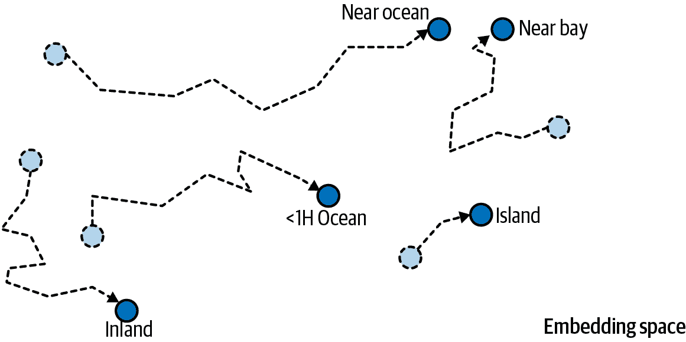

# 第十四章\. 使用 RNN 和注意力进行自然语言处理

当艾伦·图灵在 1950 年构想他著名的[Turing 测试](https://homl.info/turingtest)⁠^(1)时，他提出了一种评估机器匹配人类智能能力的方法。他本可以测试许多事情，例如识别图片中的猫、下棋、作曲或逃离迷宫的能力，但有趣的是，他选择了一个语言任务。更具体地说，他设计了一个能够欺骗其对话者认为它是人类的*聊天机器人*。⁠^(2) 这个测试确实有其弱点：一组硬编码的规则可以欺骗毫无戒备或天真的人类（例如，机器可以对某些关键词给出模糊的预定义答案，它可以假装在开玩笑或醉酒以通过其最奇怪的答案，或者它可以通过用自己提出的问题来回答困难的问题来逃避问题），并且忽略了人类智能的许多方面（例如，解读非言语交流的能力，如面部表情，或学习手动任务的能力）。但这个测试确实突出了掌握语言可能是*智人*最大的认知能力。

直到最近，最先进的自然语言处理（NLP）模型几乎都是基于循环神经网络（在第十三章中介绍）。然而，近年来，RNN 已被 transformers 所取代，我们将在第十五章（15）中探讨。尽管如此，了解如何使用 RNN 进行 NLP 任务仍然很重要，这不仅因为这样有助于更好地理解 transformers。此外，本章中我们将讨论的大部分技术也适用于 Transformer 架构（例如，标记化、束搜索、注意力机制等）。此外，RNN 最近以状态空间模型（SSMs）的形式意外回归（参见“状态空间模型（SSMs）”在[*https://homl.info*](https://homl.info)）。

本章分为三个部分。在第一部分，我们将从构建一个*字符 RNN*，或*char-RNN*开始，该 RNN 被训练来预测句子中的下一个字符。在这个过程中，我们将了解可训练嵌入。我们的 char-RNN 将成为我们的第一个微型的*语言模型*，能够生成原始文本。

在第二部分，我们将转向文本分类，更具体地说，是情感分析，其目的是预测某些文本的积极或消极程度。我们的模型将阅读电影评论并估计评论者对电影的感受。这次，我们不会将文本拆分为单个字符，而是将其拆分为*tokens*：一个 token 是从固定大小的词汇中提取的小块文本，例如英语中最常见的 10,000 个单词，或者最常见的子词（例如，“smartest”=“smart”+“est”），甚至单个字符或字节。为了将文本拆分为 tokens，我们将使用*tokensizer*。本节还将介绍流行的 Hugging Face 库：*Datasets*库用于下载数据集，*Tokenizers*库用于 tokenizers，以及*Transformers*库用于流行的模型，这些模型将自动从*Hugging Face Hub*下载。Hugging Face 是一家极具影响力的公司，也是开源社区，它在开源 AI 领域，尤其是在 NLP 领域扮演着核心角色。

本章的最终目标将是神经机器翻译（NMT），这是第三部分和最后一部分的主题：我们将构建一个能够将英语翻译成西班牙语的编码器-解码器模型。这将引导我们到*注意力机制*，我们将将其应用于我们的编码器-解码器模型，以提高其处理长输入文本的能力。正如其名称所暗示的，注意力机制是神经网络组件，它们学会在每个时间步选择模型应该关注的输入部分。它们直接导致了下一章中我们将看到的转换器革命。

让我们从一个非常简单且有趣的 char-RNN 模型开始，它可以写出类似莎士比亚的作品（某种程度上）。

# 使用字符 RNN 生成莎士比亚风格的文本

在一篇著名的[2015 年博客文章](https://homl.info/charrnn)中，标题为“循环神经网络的不合理有效性”，安德烈·卡帕西展示了如何训练一个 RNN 来预测句子中的下一个字符。这个*char-RNN*可以用来逐个字符生成新的文本。以下是 char-RNN 模型在训练了所有莎士比亚作品后生成的一小段文本样本：

> PANDARUS：
> 
> 唉，我想他将被接近，那一天
> 
> 当微小的压力得以形成却从未被满足时，
> 
> 谁是但一条链和死亡的主宰，
> 
> 我不应该睡觉。

这不是一个杰作，但令人印象深刻的是，模型仅通过学习预测句子中的下一个字符就能学会单词、语法、正确的标点符号等等。这是我们第一个*语言模型*的例子。在本节的剩余部分，我们将逐步构建 char-RNN，从创建数据集开始。

## 创建训练数据集

首先，让我们下载莎士比亚作品的一个子集（大约 25%）。数据是从安德烈·卡帕西的[char-rnn 项目](https://github.com/karpathy/char-rnn)中加载的：

```py
from pathlib import Path
import urllib.request

def download_shakespeare_text():
    path = Path("datasets/shakespeare/shakespeare.txt")
    if not path.is_file():
        path.parent.mkdir(parents=True, exist_ok=True)
        url = "https://homl.info/shakespeare"
        urllib.request.urlretrieve(url, path)
    return path.read_text()

shakespeare_text = download_shakespeare_text()
```

让我们先打印出前几行：

```py
>>> print(shakespeare_text[:80]) `First Citizen:`
`Before we proceed any further, hear me speak.`

`All:`
`Speak, speak.`
```

```py```````py`` Looks like Shakespeare, all right!    Neural networks work with numbers, not text, so we need a way to encode text into numbers. In general, this is done by splitting the text into *tokens*, such as words or characters, and assigning an integer ID to each possible token. For example, let’s split our text into characters, and assign an ID to each possible character. We first need to find the list of characters used in the text. This will constitute our token *vocabulary*:    ``` >>> vocab = sorted(set(shakespeare_text.lower())) `>>>` `""``.``join``(``vocab``)` `` `"\n !$&',-.3:;?abcdefghijklmnopqrstuvwxyz"` `` ```py   ``````py````` ```py```````py 注意，我们调用 `lower()` 来忽略大小写，从而减少词汇量。现在我们必须为每个字符分配一个标记 ID。为此，我们可以直接使用它在词汇表中的索引。为了解码我们模型的输出，我们还需要一种从标记 ID 到字符的转换方法：    ``` >>> char_to_id = {char: index for index, char in enumerate(vocab)} `>>>` `id_to_char` `=` `{``index``:` `char` `for` `index``,` `char` `in` `enumerate``(``vocab``)}` ```py` `>>>` `char_to_id``[``"a"``]` ``` `13` `>>>` `id_to_char``[``13``]` `` `'a'` `` ```py ```` ```py   ``````py``` ``````py`` ``````py` Next, let’s create two helper functions to encode text to tensors of token IDs, and to decode them back to text:    ``` 导入 torch  def encode_text(text):     return torch.tensor([char_to_id[char] for char in text.lower()])  def decode_text(char_ids):     return "".join([id_to_char[char_id.item()] for char_id in char_ids]) ```py    Let’s try them out:    ``` >>> encoded = encode_text("Hello, world!") `>>>` `encoded` ```py `tensor([20, 17, 24, 24, 27,  6,  1, 35, 27, 30, 24, 16,  2])` `>>>` `decode_text``(``encoded``)` `` `'hello, world!'` `` ``` ```py   ``````py ````` ```py`Next, let’s prepare the dataset. Right now, we have a single, extremely long sequence of characters containing Shakespeare’s works. Just like we did in Chapter 13, we can turn this long sequence into a dataset of windows that we can then use to train a sequence-to-sequence RNN. The targets will be similar to the inputs, but shifted by one time step into the “future”. For example, one sample in the dataset may be a sequence of character IDs representing the text “to be or not to b” (without the final “e”), and the corresponding target—a sequence of character IDs representing the text “o be or not to be” (with the final “e”, but without the leading “t”). Let’s create our dataset class:    ``` 从 torch.utils.data 导入 Dataset, DataLoader  class CharDataset(Dataset):     def __init__(self, text, window_length):         self.encoded_text = encode_text(text)         self.window_length = window_length      def __len__(self):         return len(self.encoded_text) - self.window_length      def __getitem__(self, idx):         if idx >= len(self):             raise IndexError("dataset index out of range")         end = idx + self.window_length         window = self.encoded_text[idx : end]         target = self.encoded_text[idx + 1 : end + 1]         return window, target ```py    And now let’s create the data loaders, as usual. Since the text is quite large, we can afford to use roughly 90% for training (i.e., one million characters), and just 5% for validation, and 5% for testing (60,000 characters each):    ``` window_length = 50 batch_size = 512  # 如果你的 GPU 无法处理如此大的批量大小，请减少此值 train_set = CharDataset(shakespeare_text[:1_000_000], window_length) valid_set = CharDataset(shakespeare_text[1_000_000:1_060_000], window_length) test_set = CharDataset(shakespeare_text[1_060_000:], window_length) train_loader = DataLoader(train_set, batch_size=batch_size, shuffle=True) valid_loader = DataLoader(valid_set, batch_size=batch_size) test_loader = DataLoader(test_set, batch_size=batch_size) ```py    Each batch will be composed of 512 50-character windows, where each character is represented by its token ID, and where each window comes with its 50-character target window (offset by one character). Note that the training batches are shuffled at each epoch (see Figure 14-1).    ###### Figure 14-1\. Each training batch is composed of shuffled windows, along with their shifted targets. In this figure, the window length is 10 instead of 50.    ###### Tip    We set the window length to 50, but you can try tuning it. It’s easier and faster to train RNNs on shorter input sequences, but the RNN will not be able to learn any pattern longer than the window length, so don’t make it too small.    While we could technically feed the token IDs directly to a neural network without any further preprocessing, it wouldn’t work very well. Indeed, as we saw in Chapter 2, most ML models—including neural networks—assume that similar inputs represent similar things; unfortunately, similar IDs may represent totally unrelated tokens, and conversely, distant IDs may represent similar tokens. The neural net would be biased in a weird way, and it would have great difficulty overcoming this bias during training.    One solution is to use one-hot encoding, since all one-hot vectors are equally distant from one another. However, when the vocabulary is large, one-hot vectors are equally large. In our case, the vocabulary contains just 39 characters, so each character would be represented by a 39-dimensional one-hot vector. That’s still manageable, but if we were dealing with words instead of characters, the vocabulary size could be in the tens of thousands, so one-hot encoding would be out of the question. Luckily, since we are dealing with neural networks, we have a better option: embeddings.```` ```py`` ``````py ``````py` ``````py`` ``````py``` ``````py```` ```py```````py` ``````py``````  ```py```````py``` ``````py`````` ```py```````py` ## 嵌入    嵌入是某些高维数据的密集表示，通常是分类特征。如果有 50,000 个可能的类别，那么 one-hot 编码会产生一个 50,000 维的稀疏向量（即，大部分是零）。相比之下，嵌入是一个相对较小的密集向量；例如，只有 300 维。    ###### 小贴士    嵌入大小是一个可以调整的超参数。一般来说，一个好的嵌入大小通常接近类别数量的平方根。    在深度学习中，嵌入通常随机初始化，然后与模型的其他参数一起通过梯度下降进行训练。例如，如果我们想在加利福尼亚住房数据集（见第二章）上训练神经网络，我们可以使用嵌入来表示 `ocean_proximity` 分类特征。初始时，`"NEAR BAY"`类别可以表示为一个随机向量，例如 `[0.831, 0.696]`，而`"NEAR OCEAN"`类别可能表示为另一个随机向量，例如 `[0.127, 0.868]`（在这个例子中我们使用 2D 嵌入）。    由于这些嵌入是可训练的，它们将在训练过程中逐渐改进；并且由于在这个例子中它们代表相当相似的类型，梯度下降将最终将它们推向彼此，同时它倾向于将它们从`"INLAND"`类别的嵌入中移开（见图 14-2）。确实，表示越好，神经网络做出准确预测就越容易，因此训练往往使嵌入成为类别的有用表示。这被称为 *表示学习*（你将在第十八章中看到其他类型的表示学习）。    ###### 图 14-2\. 嵌入将在训练过程中逐渐改进    不仅嵌入通常是有用的任务表示，而且这些相同的嵌入通常可以成功地用于其他任务。最常见的例子是 *词嵌入*（即，单个单词的嵌入）：当你从事自然语言处理任务时，通常最好重用预训练的词嵌入，而不是自己训练，正如我们将在本章后面看到的那样。    使用向量来表示单词的想法可以追溯到 20 世纪 60 年代，已经使用了许多复杂的技术来生成有用的向量，包括使用神经网络。但直到 2013 年，当 Tomáš Mikolov 和其他谷歌研究人员发表了一篇 [论文](https://homl.info/word2vec)⁠^([3](ch14.html#
