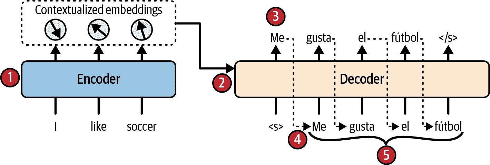

# 第十五章\. 用于自然语言处理和聊天机器人的 Transformer

在一篇标志性的 2017 年论文《“Attention Is All You Need”》中，⁠^(1) 一组 Google 研究人员提出了一种新颖的神经网络架构，名为 *Transformer*，它显著提高了神经机器翻译（NMT）的现有水平。简而言之，Transformer 架构只是一个编码器-解码器模型，非常类似于我们在第十四章（ch14.html#nlp_chapter）中为英语到西班牙语翻译所构建的模型，并且可以以完全相同的方式进行使用（参见图 15-1）：

1.  源文本进入编码器，编码器输出上下文嵌入（每个标记一个）。

1.  将编码器的输出以及到目前为止的翻译文本（从序列开始标记开始）输入到解码器。

1.  解码器为每个输入标记预测下一个标记。

1.  解码器输出的最后一个标记被附加到翻译中。

1.  步骤 2 到 4 重复进行，以生成完整的翻译，每次添加一个额外的标记，直到生成一个序列结束标记。在训练过程中，我们已经有完整的翻译了——它是目标——因此在步骤 2 中将其输入到解码器（从序列开始标记开始），步骤 4 和 5 就不再需要了。



###### 图 15-1\. 使用 Transformer 模型进行英语到西班牙语翻译

那么，有什么新内容呢？嗯，在黑盒内部，与我们的先前编码器-解码器相比，有一些重要的不同之处。关键的是，Transformer 架构不包含任何循环或卷积层，只有常规的密集层，结合了一种新的注意力机制，称为 *多头注意力*（MHA），再加上一些额外的功能。⁠^(2) 由于模型不是循环的，它不像 RNN 那样容易受到梯度消失或爆炸问题的影响，因此它可以以更少的步骤进行训练，更容易在多个 GPU 上并行化，并且扩展性出奇地好。此外，多亏了多头注意力，模型能够比 RNN 更好地捕捉到长距离模式。

Transformer 架构也证明极其灵活。它最初是为 NMT 设计的，但研究人员很快对架构进行了调整，以适应许多其他语言任务。2018 年甚至被称为“NLP 的 ImageNet 时刻”。2018 年 6 月，OpenAI 发布了第一个基于 Transformer 解码模块的 GPT 模型。它在大量文本语料库上进行了预训练，其生成文本的能力是前所未有的，它可以自动完成句子，创作故事，甚至回答一些问题。GPT 还可以微调以执行广泛的语言任务。仅仅几个月后，Google 发布了基于 Transformer 编码模块的 BERT 模型。它在各种*自然语言理解*（NLU）任务上表现出色，例如文本分类、文本嵌入、多项选择题回答，或在某些文本中找到问题的答案。

令人惊讶的是，Transformer 在计算机视觉、音频处理（例如，语音转文本）、机器人技术（使用传感器输入并将输出发送到执行器）等领域也表现出色。例如，如果你将图像分割成小块并喂给一个 Transformer（而不是标记嵌入），你得到的是一个*视觉 Transformer*（ViT）。实际上，一些 Transformer 甚至可以同时处理多种*模态*（例如，文本+图像）；这些被称为*多模态模型*。

这种卓越的性能、灵活性和可扩展性的组合促使 Google、OpenAI、Facebook（Meta）、Microsoft、Anthropic 和其他许多组织训练越来越大的 Transformer 模型。原始的 Transformer 模型大约有 6500 万个参数——在当时被认为相当大——但新的 Transformer 以令人难以置信的速度增长，到 2021 年 1 月达到了 160 亿个参数——即 1600 万个百万个参数！从头开始训练如此庞大的 Transformer 模型遗憾的是仅限于财力雄厚的组织，因为它需要几个月内的大型且昂贵的基础设施：训练通常需要数百万美元，据某些估计甚至高达数亿美元（确切数字通常不公开）。图 15-2 显示了 2018 年 6 月至 2025 年 4 月之间发布的一些最有影响力的 Transformer。请注意，垂直轴是以*十亿*参数为单位的，并且使用了对数刻度。


###### 图 15-2。自 2018 年以来发布的一些最有影响力的 Transformer；[在线查看更大版本](https://homl.info/fig15-2)

然后，在 2022 年 11 月，OpenAI 发布了 ChatGPT，一款令人惊叹的*对话式人工智能*——或者说是*聊天机器人*——它迅速席卷了全球：仅用五天时间就达到了一百万用户，两个月后月活跃用户数超过一亿！在底层，它使用了 GPT-3.5-turbo，这是 GPT-3.5 的一个变种，经过微调以实现对话性、帮助性和安全性。其他公司也很快跟上了：Perplexity AI、谷歌的 Gemini（最初称为 Bard）、Anthropic 的 Claude、Mistral AI、DeepSeek 以及更多。

###### 注意

在 ChatGPT 发布之前，谷歌实际上已经开发了一个名为 LaMDA 的强大聊天机器人，但它并未公开，可能是因为担心声誉和法律风险，因为这个模型被认为还不够安全。这使得 OpenAI 成为第一家训练出相对安全和有帮助的模型并将其作为有用的聊天机器人产品的公司。

那么，你如何使用这些模型和聊天机器人呢？嗯，其中许多是专有的（例如，OpenAI 的 GPT-3.5、GPT-4 和 GPT-5 模型、Anthropic 的 Claude 模型和谷歌的 Gemini 模型），并且只能通过 Web UI、应用程序或 API 使用：你必须创建一个账户，选择一个套餐（或使用免费层），对于 API，你必须获取访问令牌并使用它来程序化查询 API。然而，许多其他模型是*开源权重*，这意味着它们可以免费下载（例如，使用 Hugging Face Hub）：其中一些有许可限制（例如，Meta 的 Llama 模型仅限非商业用途免费），而其他则是真正的开源（例如，DeepSeek 的 R1 或 Mistral AI 的 Mistral-7B）。甚至有些还包括训练代码和数据（例如，Ai2 的 OLMo 模型）。

那么，我们还在等什么呢？让我们加入 Transformer 革命！以下是计划：

+   我们首先将打开原始的 Transformer 架构，检查其组件，以全面了解其工作原理。

+   然后，我们将从头开始构建和训练一个用于英语到西班牙语翻译的 Transformer。

+   之后，我们将研究仅使用编码器模型，如 BERT，学习它们的预训练方法，并了解如何使用它们进行文本分类、语义搜索和文本聚类等任务，无论是进行微调还是不进行微调。

+   接下来，我们将探讨仅使用解码器模型，如 GPT，并了解它们的预训练过程。这些模型能够生成文本，如果你想要写一首诗，这当然很棒，但它们也可以用于解决许多其他任务。

+   然后，我们将使用仅使用解码器的模型来构建我们自己的聊天机器人！这涉及几个步骤：首先，你必须下载一个预训练模型（或者如果你有时间和金钱，可以自己训练），然后你必须微调它以使其更具对话性、帮助性和安全性（或者你可以下载已经微调好的模型，甚至可以通过 API 使用对话式模型），最后你必须将模型部署到一个提供用户界面、存储对话并能够为模型提供工具（如搜索网络或使用计算器）的聊天机器人系统中。

+   最后，我们将快速浏览一下编码器-解码器模型，例如 T5 和 BART，这些模型非常适合翻译和摘要等任务。

在第十六章中，我们将探讨视觉 Transformer 和多模态 Transformer。第十七章和“状态空间模型（SSMs）”（均可在[*https://homl.info*](https://homl.info)找到）也讨论了一些高级技术，以允许 Transformer 进行扩展并处理更长的输入序列。

让我们从剖析 Transformer 架构开始：拿出你的解剖刀吧！

# 注意力即是所有你需要的东西：原始的 Transformer 架构

原始的 2017 年 Transformer 架构在图 15-3 中展示。图的左侧代表编码器，右侧代表解码器。

如我们之前所见，编码器的作用是将输入（例如，英语标记的序列）逐步*转换*，直到每个标记的表示完美捕捉到该标记在句子中的含义：编码器的输出是一系列上下文化的标记嵌入。除了嵌入层之外，编码器中的每一层都接受形状为[*批大小*，*批中最大英语序列长度*，*嵌入大小*]的张量作为输入，并返回形状完全相同的张量。这意味着标记表示会逐步转换，因此得名该架构。例如，如果你将句子“我喜欢足球”输入到编码器中，那么标记“喜欢”一开始将有一个相当模糊的表示，因为“喜欢”在不同的上下文中可能有不同的含义（例如，“我喜欢猫”与“我喜欢我的猫”）。但是经过编码器处理后，标记的表示应该能够捕捉到给定句子中“喜欢”的正确含义（在这种情况下，表示喜爱），以及可能需要用于翻译的任何其他信息（例如，它是一个动词）。

解码器的角色是接收编码器的输出以及迄今为止翻译的句子，并预测翻译中的下一个标记。为此，解码器层逐渐将每个输入标记的表示转换为可以用来预测下一个标记的表示。例如，假设要翻译的句子是“我喜欢足球”，并且我们已经调用了解码器四次，每次产生一个新标记：首先“我”，然后“我喜欢”，然后“我喜欢足球的”，最后“我喜欢足球”。由于这个翻译不以 EoS 标记`"</s>"`结束，我们必须再次调用解码器。现在解码器的输入序列是"`<s>`我喜欢足球”。随着每个标记的表示通过解码器，它会被转换：`"<s>"`的表示变成了足够丰富的表示，可以预测“我”（为了简单起见，我会更简洁地说：`"<s>"`变成了“我”），“我”变成了“喜欢”，“喜欢”变成了“的”，“的”变成了“足球”，如果一切顺利，“足球”将变成 EoS 标记`"</s>"`。除了嵌入层和输出`Linear`层之外，解码器中的每一层都接受形状为[*batch size*, *batch 中的最大西班牙语序列长度*, *嵌入大小*]的张量作为输入，并返回形状完全相同的张量。


###### 图 15-3. 原始 2017 年 transformer 架构⁠^(4)

经过解码器处理后，每个标记的表示会通过一个最终的`Linear`层，希望输出正确的标记的高 logit 值，以及词汇表中所有其他标记的低 logit 值。解码器的输出形状是[*batch size*, *batch 中的最大西班牙语序列长度*, *词汇表大小*]。最终的预测句子应该是“我喜欢足球 `</s>`”。请注意，图中显示了顶部的 softmax 层，但在 PyTorch 中我们通常不会明确添加它：相反，我们让模型输出 logit，并使用`nn.CrossEntropyLoss`训练模型，该损失函数基于 logit 而不是估计概率（如我们在前面的章节中看到的）。如果您需要估计概率，您始终可以使用`F.softmax()`函数将 logit 转换为估计概率。

现在，让我们进一步聚焦于图 15-3：

+   首先，注意编码器和解码器都包含被堆叠了*N*次的块。在论文中，*N* = 6。请注意，整个编码器堆栈的最终输出被馈送到解码器的*N*个块中。

+   如您所见，您已经熟悉大多数组件：有两个嵌入层；几个跳跃连接，每个连接后面都跟着一个层归一化模块；几个由两个密集层组成的前馈模块（第一个使用 ReLU 激活函数，第二个没有激活函数）；最后，输出层是一个线性层。请注意，所有层都独立于其他所有标记处理每个标记。但我们如何通过完全单独查看标记来翻译一个句子呢？好吧，我们不能，这就是新组件发挥作用的地方：

    +   编码器的*多头注意力*层通过关注（即，关注）同一句子中的每个标记（包括自身）来更新每个标记表示。这被称为*自*注意力。这就是模糊的单词“like”的表示变成一个更丰富、更准确的表示，捕捉其在给定句子中的精确含义（例如，层注意到主语“I”，因此推断“like”必须是一个动词）。我们很快就会讨论这是如何工作的。

    +   解码器的*掩码多头注意力*层做的是同样的事情，但在处理一个标记时，它不会关注位于其后的标记：它是一个因果层。例如，当它处理标记“gusta”时，它只关注标记`"<s>"`、“me”和“gusta”，而忽略标记“el”和“fútbol”（否则模型在训练期间可能会作弊）。

    +   解码器的上层多头注意力层是解码器关注由编码器堆栈输出的上下文化标记表示的地方。这被称为*交叉*注意力，与*自*注意力相对。例如，当解码器处理单词“el”并输出单词“fútbol”的表示时，它可能会非常关注单词“soccer”。

    +   *位置编码*是密集向量，表示句子中每个标记的位置。第*n*个位置编码被添加到每个句子中第*n*个标记的标记嵌入中。这是必需的，因为 Transformer 架构中的所有层都是位置无关的，这意味着它们平等地对待所有位置（与循环或卷积层不同）：当它们处理一个标记时，它们不知道该标记在句子中的位置或相对于其他单词的位置。但是单词的顺序很重要，因此我们必须以某种方式给 Transformer 提供位置信息。将位置编码添加到标记表示中是实现这一点的有效方法。

###### 注意

在图 15-3 中，每个多头注意力层进入的前两个箭头代表键和值，第三个箭头代表查询。⁠^(5) 在自注意力层中，这三个都等于前一层输出的标记表示，而在交叉注意力层（即解码器的上层注意力层）中，键和值等于编码器的最终标记表示，而查询等于前一个解码器层输出的标记表示。

现在，让我们更详细地探讨 Transformer 架构的新颖组件，从位置编码开始。

## 位置编码

位置编码是一个密集向量，用于编码标记在句子中的位置：第*i*个位置编码被添加到每个句子中第*i*个标记的标记嵌入中。实现这一点的简单方法是使用`Embedding`层：只需将嵌入编号#0 添加到标记编号#0 的表示中，将嵌入编号#1 添加到标记编号#1 的表示中，依此类推。或者，您可以使用`nn.Parameter`来存储嵌入矩阵（使用小的随机权重初始化），然后将它的前*L*行添加到输入中（其中*L*是最大输入序列长度）：结果是相同的，但速度要快得多。您还可以添加一些 dropout 以降低过拟合的风险。以下是实现方式：

```py
import torch
import torch.nn as nn
import torch.nn.functional as F

class PositionalEmbedding(nn.Module):
    def __init__(self, max_length, embed_dim, dropout=0.1):
        super().__init__()
        self.pos_embed = nn.Parameter(torch.randn(max_length, embed_dim) * 0.02)
        self.dropout = nn.Dropout(dropout)

    def forward(self, X):
        return self.dropout(X + self.pos_embed[:X.size(1)])
```

###### 注意

输入的形状为[*批大小*, *序列长度*, *嵌入大小*]，但我们正在添加形状为[*序列长度*, *嵌入大小*]的位置编码。这得益于广播规则：第*i*个位置编码被添加到批次中每个句子的第*i*个标记的表示中。

Transformer 论文的作者还提出了使用固定位置编码而不是可训练位置编码的方法。他们的方法使用了一个相当聪明的基于正弦和余弦函数的方案，但现在已很少使用，因为它并没有真正比可训练位置嵌入表现得更好（除非你很幸运，在小型 Transformer 上）。有关更多详细信息，请参阅本章的笔记本。此外，像*相对位置偏置*（RPB）、*旋转位置编码*（RoPE）和*带线性偏置的注意力*（ALiBi）等新方法通常表现更好。要了解更多关于所有这些位置编码的替代方法，请参阅“相对位置编码”。 

现在，让我们深入探究 Transformer 模型的核心：多头注意力层。

## 多头注意力

多头注意力（MHA）层基于*缩放点积注意力*，这是点积注意力（在第十四章中介绍）的一种变体，通过一个常数因子缩放相似度得分。参见方程 15-1 以获取其向量方程。

##### 方程 15-1\. 缩放点积注意力

<mo>注意力</mo><mrow><mo>(</mo><mrow><mi mathvariant="bold">Q</mi><mo lspace="0%" rspace="0%">,</mo><mi mathvariant="bold">K</mi><mo lspace="0%" rspace="0%">,</mo><mi mathvariant="bold">V</mi></mrow><mo>)</mo></mrow><mo>=</mo><mo>softmax</mo><mfenced><mfrac><mrow><msup><mi mathvariant="bold">QK</mi><mo>⊺</mo></msup></mrow><msqrt><mrow><msub><mi>d</mi><mi mathvariant="normal">k</mi></msub></mrow></msqrt></mfrac></mfenced><mi mathvariant="bold">V</mi>

在此方程中：

+   **Q** 是表示查询（例如，英语或西班牙语序列，具体取决于注意力层）的矩阵。其形状为 [*L*[q], *d*[q]]，其中 *L*[q] 是查询的长度，*d*[q] 是查询的维度性（即标记表示中的维度数）。

+   **K** 是表示密钥的矩阵。其形状为 [*L*[k], *d*[k]]，其中 *L*[k] 是密钥的长度，*d*[k] 是密钥的维度性。请注意，*d*[k] 必须等于 *d*[q]。

+   **V** 是表示值的矩阵。其形状为 [*L*[v], *d*[v]]，其中 *L*[v] 是值的长度，*d*[v] 是值的维度性。请注意，*L*[v] 必须等于 *L*[k]。

+   **Q** **K**^⊺ 的形状为 [*L*[q], *L*[k]]：它包含每个查询/键对的相似度分数。为了防止这个矩阵变得太大，输入序列不能太长：这是关键的**二次上下文窗口**问题（我们将在第十六章和第十七章中讨论缓解此问题的各种方法）。softmax 函数应用于每一行：输出具有与输入相同的形状，但现在每一行的总和为 1。最终输出具有 [*L*[q], *d*[v]] 的形状。每一行对应一个查询标记，每一行代表查询结果：值标记的加权和，优先考虑与给定查询标记最对齐的键标记的值标记。

+   缩放因子 1 / <msqrt><msub><mi>d</mi> <mrow><mi>k</mi></mrow></msub></msqrt> 将相似度分数缩小，以避免饱和 softmax 函数，这会导致梯度非常小。这个因子在经验上被证明可以加速和稳定训练。

+   在计算 softmax 之前，可以通过向相应的相似度分数添加一个非常大的负值来屏蔽一些键/值对，这有助于屏蔽填充标记以及被屏蔽的多头注意力层中的后续标记。在实践中，我们可以添加 `–torch.inf`。结果权重将等于零。

PyTorch 自带`F.scaled_dot_product_attention()`函数。其输入与**Q**、**K**和**V**相同，但这些输入可以在开头有额外的维度，例如批大小和头的数量（当用于多头注意力时）。该方程会在所有这些额外维度上同时应用。换句话说，该函数会在批中所有句子和所有注意力头之间同时计算结果，这使得它非常高效。

现在我们准备查看多头注意力层。其架构在图 15-4 中展示。

如您所见，它只是一系列缩放点积注意力层，称为*注意力头*，每个注意力头之前都有一个值、键和查询的线性变换（跨所有标记）。所有注意力头的输出简单地连接起来，然后通过最终的线性变换（再次，跨所有标记）。

但为什么？这个架构背后的直觉是什么？好吧，再次考虑句子“I like soccer”中的单词“like”。编码器可能足够聪明，能够编码其含义，即它是一个动词，以及许多对翻译有用的其他特征，例如它是在现在时态。标记表示还包含了位置信息，多亏了位置编码。简而言之，标记表示编码了标记的许多不同特征。如果我们只使用单个缩放点积注意力层，我们只能一次性查询所有这些特征。


###### 图 15-4\. 多头注意力层架构⁠^(6)

###### 警告

Transformer 架构极其灵活，因此在训练过程中模型有充分的自由度来选择自己的知识表示和策略。因此，它最终变成了一种黑盒：理解变换器真正“思考”的方式是一个活跃的研究领域，称为*模型可解释性*。例如，查看 Anthropic 的这篇[迷人的帖子](https://homl.info/tracing-thoughts)。

这就是为什么 MHA 层将值、键和查询分割到多个头中：这样，每个头可以专注于标记的特定特征。第一层线性层让模型选择每个头应该关注哪些特征。例如，线性层可能确保第一个头将“like”标记的表示投影到只包含该标记是现在时态动词的信息的子空间中。另一个头可能专注于单词的意义，等等。然后缩放点积注意力层实现实际的查找阶段，最后将所有结果连接起来，通过一个最终的线性层，让模型按照自己的意愿重新组织表示。

要真正理解 Transformer 架构，关键是理解多头注意力，为此，查看基本实现是有帮助的：

```py
class MultiheadAttention(nn.Module):
    def __init__(self, embed_dim, num_heads, dropout=0.1):
        super().__init__()
        self.h = num_heads
        self.d = embed_dim // num_heads
        self.q_proj = nn.Linear(embed_dim, embed_dim)
        self.k_proj = nn.Linear(embed_dim, embed_dim)
        self.v_proj = nn.Linear(embed_dim, embed_dim)
        self.out_proj = nn.Linear(embed_dim, embed_dim)
        self.dropout = nn.Dropout(dropout)

    def split_heads(self, X):
        return X.view(X.size(0), X.size(1), self.h, self.d).transpose(1, 2)

    def forward(self, query, key, value):
        q = self.split_heads(self.q_proj(query))  # (B, h, Lq, d)
        k = self.split_heads(self.k_proj(key))  # (B, h, Lk, d)
        v = self.split_heads(self.v_proj(value))  # (B, h, Lv, d) with Lv=Lk
        scores = q @ k.transpose(2, 3) / self.d**0.5  # (B, h, Lq, Lk)
        weights = scores.softmax(dim=-1)  # (B, h, Lq, Lk)
        Z = self.dropout(weights) @ v  # (B, h, Lq, d)
        Z = Z.transpose(1, 2)  # (B, Lq, h, d)
        Z = Z.reshape(Z.size(0), Z.size(1), self.h * self.d)  # (B, Lq, h × d)
        return (self.out_proj(Z), weights)  # (B, Lq, h × d)
```

让我们来看一下这段代码：

+   构造函数存储头数`self.h`并计算每个头的维度数`self.d`，然后创建必要的模块。注意，嵌入大小必须能被头数整除。

+   `split_heads()`方法在`forward()`方法中使用。它沿着其最后一个维度（每个头一个分割）分割其输入`X`，将其从形状为[*B*, *L*, *h* × *d*]的 3D 张量转换为形状为[*B*, *L*, *h*, *d*]的 4D 张量，其中*B*是批大小，*L*是输入序列的最大长度（对于键和值是*L*[k]，对于查询是*L*[q]），*h*是头的数量，*d*是每个头的维度数（即*h* × *d* = 嵌入大小）。然后交换维度 1 和 2 以获得形状为[*B*, *h*, *L*, *d*]的张量：由于矩阵乘法运算符`@`只作用于最后两个维度，它不会触及前两个维度*B*和*h*，因此我们可以使用此运算符一次性计算批中所有实例和所有注意力头之间的分数（`q @ k.transpose(2, 3)`）。在计算所有注意力输出时（`weights @ v`）也将如此。

+   `forward()`方法首先对查询、键和值应用线性变换，并将结果通过`split_heads()`方法传递。接下来的三行计算方程 15-1，并在权重上添加一些 dropout。然后我们将维度 1 和 2 交换回来，以确保维度*h*和*d*再次相邻，然后将张量重新塑形回 3D：这将连接所有头的输出。然后我们可以应用输出线性变换并返回结果，以及权重（以防以后需要）。

###### 小贴士

如果需要一些时间才能完全掌握这一点，请不要担心，这并不容易。当然，您可以在不完全理解引擎工作原理的情况下驾驶汽车，但第十六章和 17 中描述的一些 Transformer 改进只有在您理解 MHA 的情况下才有意义。

但等等！我们遗漏了一个重要的细节：掩码。确实，正如我们之前讨论的，解码器的掩码自注意力层在尝试预测下一个标记时必须只考虑之前的标记（否则就是作弊）。此外，如果键包含填充标记，我们还想忽略它们。因此，让我们更新 `forward()` 方法以支持两个额外的参数：

`attn_mask`

一个形状为 [*L*[q], *L*[k]] 的布尔掩码，我们将使用它来控制每个查询标记应该忽略哪些键标记（`True` 表示忽略，`False` 表示关注）

`key_padding_mask`

一个形状为 [*B*, *L*[k]] 的布尔掩码，用于定位每个键中的填充标记

```py
def forward(self, query, key, value, attn_mask=None, key_padding_mask=None):
    [...]  # compute the scores exactly like earlier
    if attn_mask is not None:
        scores = scores.masked_fill(attn_mask, -torch.inf)  # (B, h, Lq, Lk)
    if key_padding_mask is not None:
        mask = key_padding_mask.unsqueeze(1).unsqueeze(2)  # (B, 1, 1, Lk)
        scores = scores.masked_fill(mask, -torch.inf)  # (B, h, Lq, Lk)
    [...]  # compute the weights and the outputs exactly like earlier
```

此代码将我们想要忽略的分数替换为负无穷大，因此在 softmax 操作后相应的权重将为零（如果我们直接尝试将这些权重置零，剩余的权重将不会加起来等于 1）。请注意，掩码会自动广播：`attn_mask` 在整个批次和所有注意力头之间广播，而 `key_padding_mask` 在所有头和所有查询标记之间广播。

PyTorch 有一个非常相似的 `nn.MultiheadAttention` 模块，它进行了更多优化（例如，它通常可以将三个输入投影融合成一个）。它具有相同的参数，它们的行为方式完全相同。它还有一些额外的参数。以下是最重要的：

+   构造函数有一个 `batch_first` 参数，默认为 `False`，因此模块期望批次维度在序列长度维度之后。如果您希望批次维度先于序列长度维度，例如在我们的自定义实现中，您必须设置 `batch_first=True`。

+   `forward()` 方法有一个 `need_weights` 参数，默认为 `True`。如果您不需要使用此模块返回的权重，您应该将此参数设置为 `False`，因为这有时允许进行一些优化。当 `need_weights` 设置为 `False` 时，该方法返回 `None` 而不是权重。

+   `forward()` 方法还有一个 `is_causal` 参数：如果（并且仅当）`attn_mask` 被设置并且是一个 *causal mask*，那么您可以设置 `is_causal=True` 以允许一些性能优化。因果掩码允许每个查询标记关注所有之前的标记（包括自身），但不允许它关注位于其后的标记。换句话说，因果掩码在主对角线上方包含 `True`，在其他地方包含 `False`。这是掩码自注意力层所需的掩码。

现在我们已经有了主要成分，我们准备实现 Transformer 模型的其余部分。

## 构建 Transformer 的其余部分

Transformer 架构的其余部分要简单得多。让我们从编码器块开始。以下实现与 图 15-3 左侧表示的编码器块非常相似，除了在自注意力层和前馈模块中的两个密集层之后都添加了一些 dropout：

```py
class TransformerEncoderLayer(nn.Module):
    def __init__(self, d_model, nhead, dim_feedforward=2048, dropout=0.1):
        super().__init__()
        self.self_attn = MultiheadAttention(d_model, nhead, dropout)
        self.linear1 = nn.Linear(d_model, dim_feedforward)
        self.dropout = nn.Dropout(dropout)
        self.linear2 = nn.Linear(dim_feedforward, d_model)
        self.norm1 = nn.LayerNorm(d_model)
        self.norm2 = nn.LayerNorm(d_model)

    def forward(self, src, src_mask=None, src_key_padding_mask=None):
        attn, _ = self.self_attn(src, src, src, attn_mask=src_mask,
                                 key_padding_mask=src_key_padding_mask)
        Z = self.norm1(src + self.dropout(attn))
        ff = self.dropout(self.linear2(self.dropout(self.linear1(Z).relu())))
        return self.norm2(Z + ff)
```

注意，前馈块由一个首先将维度扩展到 2048（默认值）的 `Linear` 层组成，然后是一个非线性（在这种情况下是 ReLU），然后是一个将数据投影回原始嵌入大小的第二个 `Linear` 层（也称为 *模型维度*，`d_model`）。这个 *反向瓶颈* 增加了非线性函数的表达能力，允许模型学习更丰富的特征组合。这个想法在后来的 MobileNetv2 论文中得到了进一步探索，其作者提出了 *逆残差网络* 这个术语。

在编码器中，`src_mask` 参数通常不使用，因为编码器允许每个标记关注所有标记，即使是在它之后的位置。然而，用户应适当地设置 `key_padding_mask`。

现在是一个解码器块的实现。它与 图 15-3 右侧表示的解码器块非常相似，增加了一些额外的 dropout：

```py
class TransformerDecoderLayer(nn.Module):
    [...]  # similar constructor, with 2 MHA, 3 Linear, 3 LayerNorm, 1 Dropout
    def forward(self, tgt, memory, tgt_mask=None, memory_mask=None,
                tgt_key_padding_mask=None, memory_key_padding_mask=None):
        attn1, _ = self.self_attn(tgt, tgt, tgt, attn_mask=tgt_mask,
                                  key_padding_mask=tgt_key_padding_mask)
        Z = self.norm1(tgt + self.dropout(attn1))
        attn2, _ = self.multihead_attn(Z, memory, memory, attn_mask=memory_mask,
                                       key_padding_mask=memory_key_padding_mask)
        Z = self.norm2(Z + self.dropout(attn2))
        ff = self.dropout(self.linear2(self.dropout(self.linear1(Z).relu())))
        return self.norm3(Z + ff)
```

`memory` 参数对应于编码器的输出。为了提供最大的灵活性，我们允许用户将适当的掩码传递给 `forward()` 方法。通常，您需要适当地设置填充掩码（对于记忆和目标），并将 `tgt_mask` 设置为因果掩码（我们很快就会看到）。

PyTorch 实际上提供了 `nn.TransformerEncoderLayer` 和 `nn.TransformerDecoderLayer`，直接使用相同的参数，还有一些额外的参数：最重要的是 `batch_first`，如果你将批维度设置为第一维，则必须将其设置为 `True`，以及每个注意力掩码的一个 `*_is_causal` 参数，还有一个默认为“relu”的 `activation` 参数。许多最先进的转换器使用更先进的激活函数，如 GELU（在第十一章中介绍）。

PyTorch 还提供了三个额外的转换器模块（为这些每个编写自定义模块留给读者作为练习——参见笔记本以获取解决方案）：

`nn.TransformerEncoder`

简单地链接所需数量的编码器层。其构造函数接受一个编码器层以及所需的层数 `num_layers`，并将给定的编码器层复制 `num_layers` 次。构造函数还接受一个可选的归一化层，如果提供，则应用于最终输出。

`nn.TransformerDecoder`

与此相同，只是它链接解码器层而不是编码器层。

`nn.Transformer`

创建一个编码器和解码器（两者都带有层归一化），并将它们链接起来。

恭喜！你现在知道如何从头开始构建一个完整的 Transformer 模型。你只需要添加一个最终的`Linear`层，并使用`nn.CrossEntropyLoss`来获得如图 15-3 所示的全架构（正如我们在前面的章节中看到的，softmax 层隐含地包含在损失中）。现在让我们看看如何使用 Transformer 模型将英语翻译成西班牙语。

# 构建英语到西班牙语的 Transformer

现在是构建我们的 NMT Transformer 模型的时候了。为此，我们将使用我们的`PositionalEmbedding`模块和 PyTorch 的`nn.Transformer`（我们的自定义`Transformer`模块也可以正常工作，但速度较慢）：

```py
class NmtTransformer(nn.Module):
    def __init__(self, vocab_size, max_length, embed_dim=512, pad_id=0,
                 num_heads=8, num_layers=6, dropout=0.1):
        super().__init__()
        self.embed = nn.Embedding(vocab_size, embed_dim, padding_idx=pad_id)
        self.pos_embed = PositionalEmbedding(max_length, embed_dim, dropout)
        self.transformer = nn.Transformer(
            embed_dim, num_heads, num_encoder_layers=num_layers,
            num_decoder_layers=num_layers, batch_first=True)
        self.output = nn.Linear(embed_dim, vocab_size)

    def forward(self, pair):
        src_embeds = self.pos_embed(self.embed(pair.src_token_ids))
        tgt_embeds = self.pos_embed(self.embed(pair.tgt_token_ids))
        src_pad_mask = ~pair.src_mask.bool()
        tgt_pad_mask = ~pair.tgt_mask.bool()
        size = [pair.tgt_token_ids.size(1)] * 2
        full_mask = torch.full(size, True, device=tgt_pad_mask.device)
        causal_mask = torch.triu(full_mask, diagonal=1)
        out_decoder = self.transformer(src_embeds, tgt_embeds,
                                       src_key_padding_mask=src_pad_mask,
                                       memory_key_padding_mask=src_pad_mask,
                                       tgt_mask=causal_mask, tgt_is_causal=True,
                                       tgt_key_padding_mask=tgt_pad_mask)
        return self.output(out_decoder).permute(0, 2, 1)
```

让我们逐行分析这段代码：

+   构造函数很简单：我们只需创建必要的模块。

+   `forward()`方法接受一个`NmtPair`作为输入（这个类在第十四章中定义过）。方法首先对源输入和目标输入的输入标记进行嵌入，并给它们都添加位置编码。

+   然后代码使用`not`运算符（`~`）反转源和目标掩码，因为它们对每个填充标记包含`False`，但`nn.MultiheadAttention`期望应该忽略的标记为`True`。

+   接下来，我们创建一个形状为[*L*[q]，*L*[q]]的正方形矩阵，填充`True`，然后使用`torch.triu()`函数获取主对角线以上的所有元素，其余默认为`False`。这产生了一个因果掩码，我们可以将其用作 Transformer 的`tgt_mask`：它将使用此掩码进行掩码自注意力层。或者，你也可以调用`nn.Transformer.generate_square_subsequent_mask()`来创建因果掩码：只需传递序列长度（`pair.tgt_token_ids.size(1)`）并设置`dtype=torch.bool`。

+   然后我们调用 transformer，传递给它源和目标嵌入以及所有适当的掩码。

+   最后，我们将结果通过输出`Linear`层传递，并交换最后两个维度，因为`nn.CrossEntropyLoss`期望类维度是维度 1。

现在我们可以创建这个模型的实例并像第十四章中的 RNN 编码器-解码器一样训练它。为了加快训练速度并减少过拟合，你可以大幅度缩小 Transformer 的大小——使用 4 个头而不是 8 个，编码器和解码器中各只有 2 层，并且使用 128 的嵌入大小：

```py
nmt_tr_model = NmtTransformer(vocab_size, max_length, embed_dim=128, pad_id=0,
                              num_heads=4, num_layers=2, dropout=0.1).to(device)
[...]  # train this model exactly like the encoder-decoder in Chapter 14
```

让我们看看这个模型的表现如何：

```py
>>> nmt_tr_model.eval() `>>>` `translate``(``nmt_tr_model``,``"I like to play soccer with my friends at the beach"``)` `` `' Me gusta jugar al fútbol con mis amigos en la playa . </s>'` ``
```

```py ``Great, even this tiny transformer trained for 20 epochs works rather well, so imagine a much bigger one trained on a much larger dataset, and you can start to see how ChatGPT and its friends can be so impressive.    ###### Tip    Before we move on to other models, it’s important to clean up the GPU RAM, or else it will quickly become saturated. For this, delete all variables that are no longer needed—especially models, optimizers, tensors, and datasets—using the `del` keyword, then call the `gc.collect()` function to run Python’s garbage collector. When using a CUDA or AMD device, you must also call `torch.cuda.empty_cache()`. On Colab, you can view the available GPU RAM by selecting Runtime → “View resources” from the menu.    Now that you have a good understanding of the original Transformer architecture, let’s look at encoder-only transformers.`` ```  ```py```````py```````py```````py````` ```py```````py```````py```````py```` # 仅编码器 Transformer 用于自然语言理解    当谷歌在 2018 年发布了 [BERT 模型](https://homl.info/bert)⁠^(7) 时，它证明了仅编码器的 Transformer 可以处理各种自然语言任务：句子分类、标记分类、多项选择题回答等等！BERT 还证实了在大语料库上进行自监督预训练对迁移学习是有效的：BERT 确实可以在许多任务上实现优异的性能，只需在每个任务上对相当小的数据集进行微调即可。让我们首先看看 BERT 的架构，然后我们将看看它是如何进行预训练的，以及您如何为自己的任务进行微调。    ###### 警告    仅编码器模型通常不用于文本生成任务，如自动完成、翻译、摘要或聊天机器人，因为它们在执行此任务时比解码器慢得多。解码器更快，因为它们是因果的，所以一个好的实现可以在预测新标记时缓存和重用其先前状态。相反，编码器仅使用非掩码多头注意力层，因此它们自然是双向的；这就是 BERT 中的 B（来自 Transformer 的双向编码器表示）。每当添加新标记时，都需要重新计算。    ## BERT 的架构    BERT 的架构几乎与原始 Transformer 的编码器完全相同，只有三个区别：    1.  它要大得多。BERT-base 有 12 个编码器块、12 个注意力头和 768 维嵌入，而 BERT-large 有 24 个块、16 个头和 1,024 维度（而原始 Transformer 有 6 个块、8 个头和 512 维度）。它还使用可训练的位置嵌入，并支持输入句子长达 512 个标记。           2.  它在每个子层（注意力或前馈）之前而不是之后应用层归一化。这被称为 *pre-LN*，与 *post-LN* 相比，并确保每个子层的输入都进行了归一化，这稳定了训练并减少了对手动初始化的敏感性。PyTorch 的 transformer 模块默认为 post-LN，但它们有一个 `norm_first` 参数，您可以将它设置为 `True` 以选择 pre-LN（然而，某些优化可能不会为 pre-LN 实现）。           3.  如果需要，它允许将输入句子拆分为两个 *段*。这对于需要一对输入句子的任务很有用，例如自然语言推理（即句子 A 是否蕴涵句子 B？）或多项选择题回答（即给定问题 A，答案 B 有多好？）。要将两个句子传递给 BERT，您必须首先将 *分隔符标记* [SEP] 添加到每个句子中，然后连接它们。此外，还添加了一个可训练的 *段嵌入* 到每个标记的表示中：段嵌入 #0 添加到段 #0 内的所有标记中，段嵌入 #1 添加到段 #1 内的所有标记中。理论上，我们可以有更多的段，但 BERT 只在由一个或两个段组成的输入上进行预训练。请注意，位置编码也添加到每个标记的表示中，就像通常那样（即相对于完整输入序列，而不是相对于单个段）。              那就是全部！现在让我们看看 BERT 是如何进行预训练的。    ## BERT 预训练    作者提出了两个自监督预训练任务：    遮蔽语言模型 (MLM)      句子中的每个标记有 15% 的概率被替换为掩码标记，模型被训练来预测原始标记是什么。这通常被称为 *填空题*（即填空）。例如，如果原始句子是“她在生日派对上玩得很开心”，那么模型可能会得到句子“她
