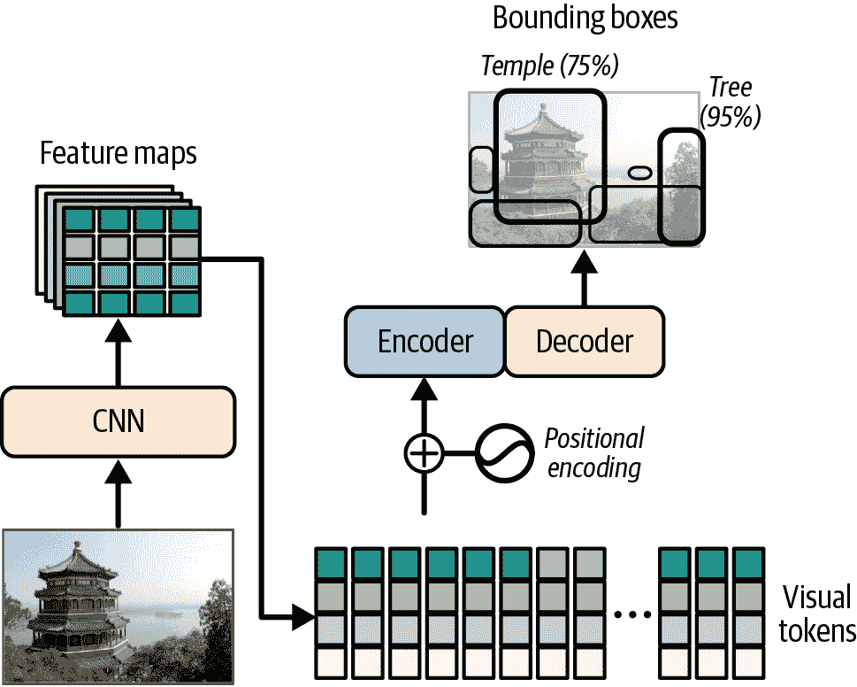
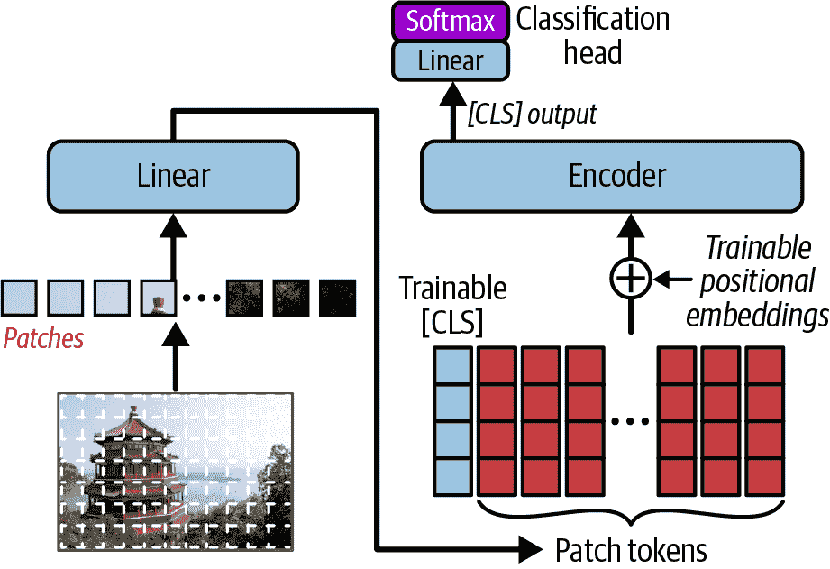
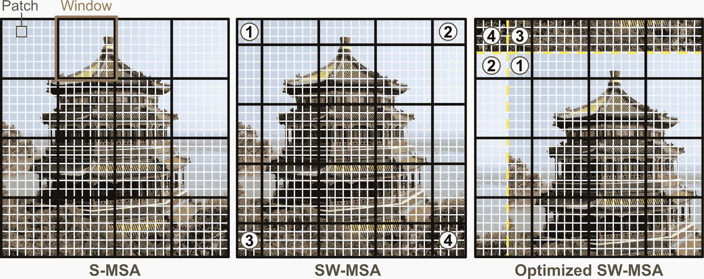
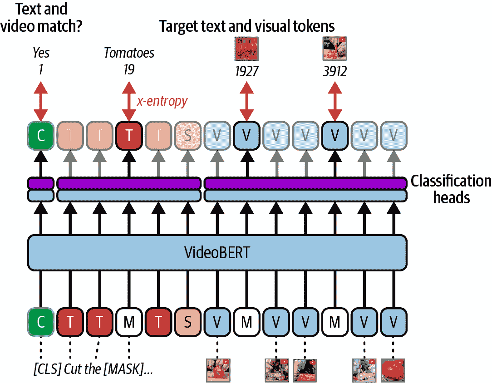
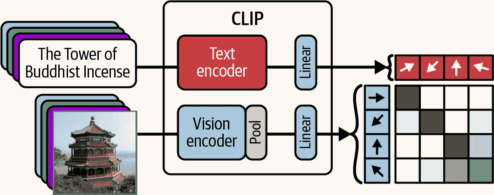
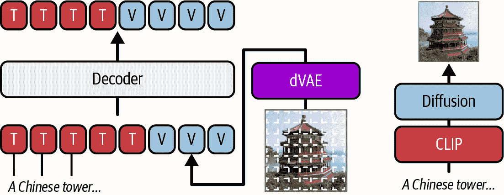

# 第十六章\. 视觉和多模态 Transformer

在上一章中，我们从零开始实现了一个 Transformer，并将其转变为一个翻译系统，然后我们探索了仅编码器的 NLU 模型，仅解码器的 NLG 模型，甚至构建了一个小型的聊天机器人——这是一段相当漫长的旅程！然而，关于 Transformer 还有很多话要说。特别是，我们迄今为止只处理了文本，但 Transformer 实际上在处理各种输入方面表现出色。在本章中，我们将介绍*视觉 Transformer*（ViTs），能够处理图像，随后是*多模态 Transformer*，能够处理包括文本、图像、音频、视频、机器人传感器和执行器以及任何类型的数据在内的多种模态。

在本章的第一部分，我们将讨论一些最有影响力的纯视觉 Transformer：

DETR（检测 Transformer）

一个用于目标检测的早期编码器-解码器 Transformer。

原始 ViT（视觉 Transformer）

这个标志性的仅编码器 Transformer 将图像块视为词标记，如果在大数据集上训练，可以达到最先进的状态。

DeiT（数据高效图像 Transformer）

使用蒸馏在大规模上训练的更具数据效率的 ViT。

PVT（金字塔视觉 Transformer）

一个可以生成多尺度特征图以进行语义分割和其他密集预测任务的层次模型。

Swin Transformer（移位窗口 Transformer）

一个速度更快的层次模型。

DINO（无标签的自蒸馏）

这引入了一种新颖的自监督视觉表示学习方法。

在本章的第二部分，我们将深入探讨多模态 Transformer：

VideoBERT

一个训练以处理文本和视频标记的 BERT 模型。

ViLBERT（视觉语言 BERT）

一种用于图像加文本的双编码器模型，它引入了共注意力（即双向交叉注意力）。

CLIP（对比语言-图像预训练）

这又是一个使用对比预训练训练的图像加文本双编码器模型。

DALL·E（萨尔瓦多·达利和皮克斯角色瓦力名字的双关语）

一个能够从文本提示生成图像的模型。

Perceiver

这通过交叉注意力技巧有效地将任何高分辨率模态压缩成短序列。

Perceiver IO（输入/输出）

向 Perceiver 添加了一个灵活的输出机制，使用类似的交叉注意力技巧。

Flamingo

而不是从头开始，它重用了两个大型预训练模型——一个用于视觉，一个用于语言（两者都冻结）——并通过一个名为 Resampler 的 Perceiver 风格适配器将它们连接起来。这种架构使得开放式视觉对话成为可能。

BLIP-2（自举语言-图像预训练）

这是一个另一个开放式视觉对话模型，它重用了两个大型预训练模型，使用轻量级的查询 Transformer（Q-Former）将它们连接起来，并使用具有多个训练目标的有力两阶段训练方法。

所以，打开灯吧，Transformer 即将睁开眼睛。

# 视觉 Transformer

视觉 Transformer 并非凭空出现：在它们被发明之前，已经有了带有视觉注意力的 RNN 和混合 CNN-Transformer 模型。在我们深入研究一些最有影响力的 ViT 之前，让我们看看这些 ViT 的祖先。

## 带有视觉注意力的 RNN

注意力机制在 NLP 之外的第一项应用之一是使用[视觉注意力](https://homl.info/visualattention)生成图像字幕。⁠^(1) 在这里，卷积神经网络首先处理图像并输出一些特征图，然后一个配备注意力机制的解码器 RNN 逐个生成字幕。

解码器在每个解码步骤中使用注意力层来专注于图像的恰当部分。例如，在图 16-1 中，模型生成了字幕“一位女士在公园里扔飞盘”，你可以看到当解码器即将输出“飞盘”这个词时，它关注了输入图像的哪个部分：很明显，大部分注意力都集中在飞盘上。


###### 图 16-1\. 视觉注意力：输入图像（左）和模型在输出“飞盘”这个词之前关注的模型焦点（右）⁠^(2)

一旦发明了 Transformer，它们很快就被应用于视觉任务，通常是通过替换现有架构中的 RNN（例如，用于图像字幕）。然而，大部分视觉工作仍然由 CNN 完成，因此尽管它们是用于视觉任务的 Transformer，我们通常不把它们视为 ViT。*检测 Transformer*（DETR）是这种情况的一个很好的例子。

## DETR：用于目标检测的 CNN-Transformer 混合架构

2020 年 5 月，一支 Facebook 研究团队提出了一种混合 CNN-Transformer 架构，用于目标检测，命名为[*检测 Transformer*](https://homl.info/detr)（DETR，见图 16-2）。⁠^(4) CNN 首先处理输入图像并输出一组特征图，然后这些特征图被转换成一系列视觉标记，这些标记被输入到编码器-解码器 Transformer 中，最后 Transformer 输出一系列边界框预测。

在某个时候，肯定有人会想知道我们是否可以完全去掉 CNN。毕竟，注意力就是一切，对吧？在 DETR 几个月后，原始的 ViT 诞生了。



###### 图 16-2\. 用于目标检测的检测 Transformer（DETR）

## 原始 ViT

2020 年 10 月，一组谷歌研究人员发布了一篇[论文](https://homl.info/vit)⁠^(5)，介绍了第一个没有 CNN 的视觉转换器（见图 16-3）。它简单地被命名为*视觉转换器*（ViT）。这个想法非常简单：将图像切割成小的 16 × 16 补丁，并将补丁序列视为一个单词表示序列。实际上，论文的标题是“一张图片胜过 16 × 16 个单词”。

更精确地说，这些补丁首先被展平成 16 × 16 × 3 = 768 维度的向量（3 代表 RGB 颜色通道）。例如，一个 224 × 224 的图像被切割成 14 × 14 = 196 个补丁，所以我们得到 196 个 768 维度的向量。这些向量随后通过一个线性层，将向量投影到转换器的嵌入大小。得到的向量序列可以像处理单词嵌入序列一样处理：添加可学习的位置嵌入，然后将结果传递给转换器，这是一个常规的仅编码器模型。在序列的开始插入一个具有可训练表示的类别标记，并在相应的输出上方添加一个分类头（即这是 BERT 风格的分类）。

就这样！这个模型在 ImageNet 图像分类上击败了最先进的技术，但公平地说，作者们不得不使用超过 3 亿张额外的图像进行训练。这很有道理，因为与卷积神经网络相比，转换器没有那么多*归纳偏差*，所以它们需要额外的数据来学习 CNN 隐含假设的事情。

###### 注意

归纳偏差是模型由于其架构而做出的隐含假设。例如，线性模型隐含地假设数据是线性的。CNN 具有平移不变性，因此它们隐含地假设在一个位置学习到的模式在其他位置也可能有用。它们还强烈倾向于局部性。RNN 隐含地假设输入是有序的，并且最近的标记比旧的标记更重要。一个模型具有的归纳偏差越多，假设它们是正确的，那么模型所需的训练数据就越少。但如果隐含的假设是错误的，那么即使在大数据集上训练，模型也可能表现不佳。



###### 图 16-3\. 用于分类的视觉转换器（ViT）

现在你已经知道从头实现 ViT 所需的一切了！

### 使用 PyTorch 从头实现 ViT

我们将首先实现一个自定义模块来处理补丁嵌入。为此，我们可以实际使用一个`nn.Conv2d`模块，将`kernel_size`和`stride`都设置为补丁大小（16）。这相当于将图像切割成补丁，将它们展平，并通过一个线性层（然后重塑结果）。这正是我们所需要的！

```py
import torch
import torch.nn as nn

class PatchEmbedding(nn.Module):
    def __init__(self, in_channels, embed_dim, patch_size=16):
        super().__init__()
        self.conv2d = nn.Conv2d(embed_dim, in_channels,
                                kernel_size=patch_size, stride=patch_size)
    def forward(self, X):
        X = self.conv2d(X)  # shape [B=Batch, C=Channels, H=Height, W=Width]
        X = X.flatten(start_dim=2)  # shape [B, C, H * W]
        return X.transpose(1, 2)  # shape [B, H * W, C]
```

在卷积层之后，我们必须展平空间维度并转置最后两个维度，以确保嵌入维度最终位于最后，这是`nn.TransformerEncoder`模块所期望的。现在我们已经准备好实现我们的 ViT 模型：

```py
class ViT(nn.Module):
    def __init__(self, img_size=224, patch_size=16, in_channels=3,
                 num_classes=1000, embed_dim=768, depth=12, num_heads=12,
                 ff_dim=3072, dropout=0.1):
        super().__init__()
        self.patch_embed = PatchEmbedding(embed_dim, in_channels, patch_size)
        cls_init = torch.randn(1, 1, embed_dim) * 0.02
        self.cls_token = nn.Parameter(cls_init)  # shape [1, 1, E=embed_dim]
        num_patches = (img_size // patch_size) ** 2  # num_patches (denoted L)
        pos_init = torch.randn(1, num_patches + 1, embed_dim) * 0.02
        self.pos_embed = nn.Parameter(pos_init)  # shape [1, 1 + L, E]
        self.dropout = nn.Dropout(p=dropout)
        encoder_layer = nn.TransformerEncoderLayer(
            d_model=embed_dim, nhead=num_heads, dim_feedforward=ff_dim,
            dropout=dropout, activation="gelu", batch_first=True)
        self.encoder = nn.TransformerEncoder(encoder_layer, num_layers=depth)
        self.layer_norm = nn.LayerNorm(embed_dim)
        self.output = nn.Linear(embed_dim, num_classes)

    def forward(self, X):
        Z = self.patch_embed(X)  # shape [B, L, E]
        cls_expd = self.cls_token.expand(Z.shape[0], -1, -1)  # shape [B, 1, E]
        Z = torch.cat((cls_expd, Z), dim=1)  # shape [B, 1 + L, E]
        Z = Z + self.pos_embed
        Z = self.dropout(Z)
        Z = self.encoder(Z)  # shape [B, 1 + L, E]
        Z = self.layer_norm(Z[:, 0])  # shape [B, E]
        logits = self.output(Z) # shape [B, C]
        return logits
```

让我们来看一下这段代码：

+   构造函数首先创建`PatchEmbedding`模块。

+   然后它创建类别标记的可训练嵌入，使用具有小标准差（0.02 是常见的）的正态分布进行初始化。其形状为[1, 1, *E*]，其中*E*是嵌入维度。

+   接下来，我们初始化位置嵌入，形状为[1, 1 + *L*, *E*]，其中*L*是补丁标记的数量。我们需要一个额外的位置嵌入用于类别标记，因此是 1 + *L*。同样，我们使用具有小标准差的正态分布来初始化它。

+   接下来，我们创建其他模块：`nn.Dropout`，`nn.TransformerEncoder`（基于`nn.TransformerEncoderLayer`），`nn.LayerNorm`，以及我们将用作分类头的输出线性层。

+   在`forward()`方法中，我们首先创建补丁标记。

+   然后我们使用`expand()`方法在批次轴上复制类别标记，并将补丁标记连接起来。这确保了每个补丁标记序列都以类别标记开头。

+   其余部分都很直接：我们添加位置嵌入，应用一些 dropout，运行编码器，只保留类别标记的输出（`Z[:, 0]`）并对其进行归一化，最后通过输出层，该层产生 logits。

您可以创建模型并使用随机批次图像进行测试，如下所示：

```py
vit_model = ViT(
    img_size=224, patch_size=16, in_channels=3, num_classes=1000, embed_dim=768,
    depth=12, num_heads=12, ff_dim=3072, dropout=0.1)
batch = torch.randn(4, 3, 224, 224)
logits = vit_model(batch)  # shape [4, 1000]
```

您可以使用`nn.CrossEntropyLoss`来训练这个模型，就像通常一样。然而，这需要相当长的时间，除非您的图像数据集非常特定于领域，否则您通常最好下载一个使用 Transformers 库预训练的 ViT，然后在您的数据集上微调它。让我们看看如何。

### 使用 Transformers 库微调预训练的 ViT

让我们下载一个小型预训练的 ViT，并在包含超过 7000 张宠物图片的 Oxford-IIIT Pet 数据集上对其进行微调，这些图片被分为 37 个不同的类别。首先，让我们下载这个数据集：

```py
from datasets import load_dataset

pets = load_dataset("timm/oxford-iiit-pet")
```

接下来，让我们下载 ViT：

```py
from transformers import ViTForImageClassification, AutoImageProcessor

model_id = "google/vit-base-patch16-224-in21k"
vit_model = ViTForImageClassification.from_pretrained(model_id, num_labels=37)
vit_processor = AutoImageProcessor.from_pretrained(model_id, use_fast=True)
```

我们正在加载一个在 ImageNet-21k 数据集上预训练的基础 ViT 模型。这个数据集包含大约 1400 万张图片，跨越 21800 多个类别。我们使用`ViTForImageClassification`类，该类会自动用新的（未训练的）分类头替换原始分类头，以适应所需的类别数量。这就是我们现在需要训练的部分。

我们还为这个模型加载了图像处理器。我们将使用它来预处理每张图像，正如模型所期望的那样：它将被缩放到 224 × 224，像素值将被归一化到 -1 和 1 之间，通道维度将被移动到空间维度之前。我们还设置了 `use_fast=True`，因为有一个快速的图像处理器实现可用，所以我们不妨使用它。处理器接收一个图像作为输入，并返回一个包含“pixel_values”条目的字典，该条目等于预处理后的图像。

接下来，我们需要一个数据合并器，它将预处理批处理中的所有图像，并将图像和标签作为 PyTorch 张量返回：

```py
def vit_collate_fn(batch):
    images = [example["image"] for example in batch]
    labels = [example["label"] for example in batch]
    inputs = vit_processor(images, return_tensors="pt", do_convert_rgb=True)
    inputs["labels"] = torch.tensor(labels)
    return inputs
```

我们设置了 `do_convert_rgb=True`，因为模型期望 RGB 图像，但数据集中的一些图像是 RGBA（即，它们有一个额外的透明度通道），因此我们必须强制转换为 RGB 以避免训练过程中出现错误。现在我们已准备好使用熟悉的 Hugging Face 训练 API 来训练我们的模型：

```py
from transformers import Trainer, TrainingArguments

args = TrainingArguments("my_pets_vit", per_device_train_batch_size=16,
                         eval_strategy="epoch", num_train_epochs=3,
                         remove_unused_columns=False)
trainer = Trainer(model=vit_model, args=args, data_collator=vit_collate_fn,
                  train_dataset=pets["train"], eval_dataset=pets["test"])
train_output = trainer.train()
```

###### 警告

默认情况下，训练器将自动删除 `forward()` 方法未使用的输入属性：我们的模型期望 `pixel_values` 和可选的 `labels`，但任何其他内容都将被丢弃，包括 `"image"` 属性。由于未使用的属性在调用 `collate_fn()` 函数之前被删除，因此 `example["image"]` 代码将导致错误。这就是为什么我们必须设置 `remove_unused_columns=False`。

仅经过 3 个训练周期后，我们的 ViT 模型就达到了约 91.8% 的准确率。通过一些数据增强和更多的训练，你可能会达到 93% 到 95% 的准确率，这接近了当前的最佳水平。太棒了！但我们才刚刚开始：自 2020 年以来，ViT 在许多方面都得到了改进。特别是，现在可以使用蒸馏技术以更有效的方式从头开始训练它们。让我们看看如何。

## 数据高效图像变换器

在 Google 的 ViT 论文发布后的仅仅两个月，Facebook 研究人员团队发布了[*数据高效图像变换器*](https://homl.info/deit)（DeiT）。⁠^(6) 他们的 DeiT 模型在 ImageNet 上取得了有竞争力的结果，而无需为训练提供任何额外的数据。该模型的架构几乎与原始 ViT 相同（参见 图 16-4），但作者使用了一种蒸馏技术将知识从教师模型传递到他们的学生 ViT 模型（蒸馏在 第十五章 中介绍）。

作者使用了一个冻结的、最先进的 CNN 作为教师模型。在训练过程中，他们向学生 ViT 模型添加了一个特殊的蒸馏标记。就像类别标记一样，蒸馏标记的表示是可训练的，其输出经过一个专门的分类头。两个分类头（对于类别标记和蒸馏标记）同时训练，都使用交叉熵损失，但类别标记的分类头使用正常硬目标（即 one-hot 向量）进行训练，而蒸馏头使用教师模型输出的软目标进行训练。最终的损失是两个分类损失的加权总和（通常权重相等）。在推理时间，蒸馏标记及其分类头被丢弃。这就是全部！如果你在相同的宠物数据集上微调一个 DeiT 模型，使用`model_id = "facebook/deit-base-distilled-patch16-224"`和`DeiTForImageClassification`，你只需三个 epoch 就应该能达到大约 94.4%的验证准确率。


###### 图 16-4\. 数据高效图像变换器（DeiT）= ViT + 知识蒸馏

到目前为止，我们只使用了 ViTs 进行分类任务，那么对于密集预测任务，如目标检测或语义分割（在第十二章中介绍）怎么办呢？为此，ViT 架构需要稍作调整；欢迎来到层次视觉变换器。

## 用于密集预测任务的金字塔视觉变换器

2021 年是 ViTs 的一年：新的模型几乎每隔一周就推进了当前的最佳水平。一个重要的里程碑是 2021 年 2 月发布的[金字塔视觉变换器（PVT）](https://homl.info/pvt)，由南京大学、HKU、IIAI 和 SenseTime Research 的研究团队开发。他们指出，原始的 ViT 架构在分类任务上表现良好，但在需要精细分辨率的密集预测任务上表现不佳。为了解决这个问题，他们提出了一种金字塔架构，其中图像被处理成逐渐变小但更深（即语义更丰富）的图像，这与 CNN 非常相似。图 16-5 展示了如何将一个 256 × 192 像素、3 通道（RGB）的图像首先转换成一个 64 × 48 像素、64 通道的图像，然后转换成一个 32 × 24 像素、128 通道的图像，接着是一个 16 × 12 像素、320 通道的图像，最后是一个 8 × 6 像素、512 通道的图像。


###### 图 16-5. 用于密集预测任务的金字塔视觉变换器

在金字塔的每个级别上，输入图像的处理方式与常规 ViT 非常相似。它首先被切割成补丁，并转换成一个补丁标记的序列，然后添加可训练的位置嵌入，最终标记通过一个仅编码器的变压器传递，由多个编码器层组成。

由于编码器输出一系列向量（即，上下文化的嵌入），这个序列必须被重塑为一个 *网格* 的向量，然后可以将其视为一个图像（具有许多通道）并传递到金字塔的下一级。例如，第一层的编码器接收一个包含 3,072 个补丁标记的序列，因为图像被切割成一个 64 × 48 的 4 × 4 补丁网格（64 × 48 = 3,072）。每个补丁标记表示为一个 64 维向量。编码器还输出 3,072 个向量（即，上下文化的嵌入），每个 64 维，并且它们再次组织成一个 64 × 48 的网格。这给我们提供了一个 64 × 48 的图像，具有 64 个通道，可以传递到下一级。在金字塔的第二、三、四级中，补丁标记分别是 128 维、320 维和 512 维。

重要的是，这些补丁比原始的 ViT 小得多：在第一层，它们只是 4 × 4，而在第二、三、四层则是 2 × 2。这些微小的补丁提供了更高的空间分辨率，这对于密集预测任务至关重要。然而，这也带来了代价：较小的补丁意味着需要更多的它们，而且由于多头注意力的二次复杂性，对 ViT 的简单适配将需要大量的计算。这就是为什么 PVT 作者引入了 *空间减少注意力*（SRA）：它就像 MHA 一样，只是键和值首先在空间上进行了减少（但不是查询）。为此，作者提出了一系列操作，通常实现为一个步长卷积层，随后是层归一化（尽管一些实现使用平均池化层代替）。

让我们看看 SRA 在金字塔第一层的影响。这里有 3,072 个 patch tokens。在常规的 MHA 中，每个这些 tokens 都会关注到每一个 tokens，因此我们需要计算 3,072² 个注意力分数：这超过 900 万个分数！在 SRA 中，查询保持不变，因此仍然涉及 3,072 个 tokens，但键和值在空间上减少了 8 倍，水平和垂直方向上都是（在金字塔的 2、3 和 4 层，减少因子分别是 4、2 和 1）。因此，不再是代表 64 × 48 网格的 3,072 个 tokens，键和值仅由 48 个 tokens 组成，代表一个 8 × 6 的网格（因为 64 / 8 = 8 和 48 / 8 = 6）。因此，我们只需要计算 3,072 × 48 = 147,456 个注意力分数：这比之前的计算成本降低了 64 倍。好消息是，这不会影响输出分辨率，因为我们根本就没有减少查询：编码器仍然输出 3,072 个 tokens，代表一个 64 × 48 的图像。

好的，所以 PVT 模型接收一个图像并输出四个逐渐缩小和深入处理的图像。那么接下来呢？我们如何使用这些多尺度特征图来实现目标检测或其他密集预测任务呢？嗯，没有必要重新发明轮子：现有的解决方案通常涉及一个生成多尺度特征图的 CNN 主干网络，因此我们可以简单地将其替换为 PVT（通常在 ImageNet 上预训练）。例如，我们可以使用全卷积网络（FCN）方法进行语义分割（在第十二章末尾介绍），通过上采样和组合 PVT 输出的多尺度特征图，并添加一个最终的分类头以输出每个像素的一个类别。同样，我们可以使用 Mask R-CNN 进行目标检测和实例分割，用 PVT 替换其 CNN 主干网络。

简而言之，PVT 的层次结构是视觉 Transformer 的一大里程碑，尽管有空间减少注意力，但它仍然计算成本高昂。一个月后发布的 Swin Transformer，其可扩展性要高得多。让我们看看原因。

## Swin Transformer：快速且通用的 ViT

2021 年 3 月，一支微软研究团队发布了 [Swin Transformer](https://homl.info/swin)。⁠^(8) 就像 PVT 一样，它具有层次结构，生成可用于密集预测任务的多尺度特征图。但 Swin 使用了一种非常不同的多头注意力变体：每个 patch 只关注同一窗口内的其他 patch。这被称为 *基于窗口的多头自注意力*（W-MSA），它允许自注意力的成本与图像大小（即面积）线性缩放，而不是平方缩放。

例如，在图 16-6 的左侧，图像被分割成 28 × 28 的补丁网格，并且这些补丁被分组为非重叠窗口。在 Swin 金字塔的第一层，补丁通常是 4 × 4 像素，每个窗口包含一个 7 × 7 的补丁网格。因此，总共有 784 个补丁标记（28 × 28），但每个标记只关注 49 个标记（7 × 7），所以 W-MSA 层只需要计算 784 × 49 = 38,416 个注意力分数，而不是常规 MHA 的 784² = 614,656 个分数。

最重要的是，如果我们将图像的宽度和高度加倍，补丁标记的数量将增加到四倍，但每个标记仍然只关注 49 个标记，所以我们只需要计算 4 倍更多的注意力分数：Swin Transformer 的计算成本与图像面积成线性关系，因此它可以处理大图像。相反，ViT、DeiT 和 PVT 都呈二次方增长：如果你将图像的宽度和高度加倍，面积将增加到四倍，计算成本将乘以 16！因此，这些模型对于非常大的图像来说速度太慢，这意味着你必须首先下采样图像，这可能会损害模型的准确性，尤其是对于密集预测任务。



###### 图 16-6\. Swin Transformer：交替 W-MSA（左）和 SW-MSA（中）；SW-MSA 可以优化为需要与 W-MSA 相同数量的窗口（右）

但是等等！如果每个标记只关注同一窗口内的补丁，我们如何希望捕捉到长距离模式呢？答案就在架构的名字中，Swin，代表*移位窗口*：每隔一个编码器层使用*移位 W-MSA*（SW-MSA），这就像 W-MSA 一样，只是窗口偏移了半个窗口大小。如图 16-6 的中间部分所示，窗口向右下角移动了 3 个补丁（因为 7 的一半是 3.5，我们将其四舍五入到 3）。这有什么帮助呢？好吧，在上一层中分别位于不同窗口的邻近补丁现在在同一窗口中，因此它们可以相互看到。通过交替 W-MSA 和 SW-MSA，图像任何部分的信息可以逐渐传播到整个图像。此外，由于架构是分层的，随着我们向上金字塔移动，补丁变得越来越粗糙，因此信息可以更快地传播。

SW-MSA 的简单实现需要处理许多额外的窗口。例如，如果你比较图 16-6 中的 W-MSA 和 SW-MSA，你可以看到 W-MSA 使用了 16 个窗口，而 SW-MSA 使用了 25 个（至少在这个例子中）。为了避免这种额外成本，作者提出了一个优化的实现：不是移动窗口，而是移动图像本身并将其包裹在边缘，如图 16-6 的右侧所示。这样，我们回到了 16 个窗口。然而，这需要对包含包裹补丁的边缘窗口进行仔细的掩码处理；例如，标记为①、②、③、④的区域不应该相互看到，即使它们位于同一个窗口内，因此必须应用适当的注意力掩码。

总体来说，Swin 的实现比 PVT 更困难，但它的线性扩展和优秀性能使其成为最好的视觉转换器之一。但 2021 年还没有结束：[Swin v2](https://homl.info)于 2021 年 11 月发布。⁠^(9)它在各个方面都改进了 Swin：对大型 ViT 的更稳定训练，更容易在大图像上进行微调，减少了对标记数据的需要，等等。Swin v2 至今仍在视觉任务中得到广泛应用。

我们的工具箱现在包含了用于分类（例如，ViT 和 DeiT）和密集预测任务（例如，PVT 和 Swin）的视觉转换器。现在让我们探索最后一个纯视觉转换器，DINO，它引入了一种革命性的自监督技术，用于视觉表示学习。

## DINO：自监督视觉表示学习

2021 年 4 月，Mathilde Caron 等人介绍了 [DINO](https://homl.info/dino)，^(10)一种令人印象深刻的自监督训练技术，能够生成出色的图像表示。这些表示可以用于分类和其他任务。

这是这样工作的：在训练过程中，模型被复制，其中一个网络充当教师，另一个网络充当学生（见图 16-7）。梯度下降只影响学生，而教师的权重只是学生权重的指数移动平均（EMA）。这被称为*动量教师*。学生被训练以匹配教师的预测：由于它们几乎是相同的模型，这被称为*自蒸馏*（因此模型的名称为：无标签的自**蒸馏**）。

在每个训练步骤中，输入图像以各种方式进行增强：颜色抖动、灰度、高斯模糊、水平翻转等。重要的是，它们以不同的方式增强教师和学生：教师总是看到完整图像，只有轻微的增强，而学生通常只看到图像的放大部分，具有更强的增强。简而言之，教师和学生看到的原始图像的变体不同，但他们的预测必须仍然匹配。这迫使他们就高级表示达成一致。

然而，这个机制存在一个强烈的**模式崩溃**风险。这指的是学生和教师总是输出完全相同的内容，完全忽略了输入图像。为了防止这种情况，DINO 会跟踪教师预测的 logits 的移动平均值，并从预测的 logits 中减去这个平均值。这被称为**中心化**，迫使教师将其预测均匀地分布在所有类别上（平均而言，随着时间的推移）。

但仅靠中心化可能会导致教师始终为每个类别输出相同的概率，仍然忽略图像。为了避免这种情况，DINO 还迫使教师对其最高预测有很高的信心：这被称为**锐化**。它是通过将教师 logits 应用于低温实现的（即，除以小于 1 的温度）。中心化和锐化共同保留了教师输出的多样性；这为模型留下了没有捷径。它必须基于图像的实际内容进行预测。


###### 图 16-7。DINO，或无标签的自蒸馏

训练完成后，你可以丢弃教师：学生就是最终的 DINO 模型。如果你给它一个新图像，它将输出一系列上下文化的补丁嵌入。这些可以以各种方式使用。例如，你可以在类别标记的输出嵌入上训练一个分类头。实际上，你甚至不需要一个新的分类头：你可以在每个训练图像上运行 DINO 以获取它们的表示（即类别标记的输出），然后计算每个类别的平均表示。然后，当给定一个新图像时，使用 DINO 计算其表示并寻找与最近平均表示最接近的类别。这种方法在 ImageNet 上达到了 78.3%的 top-1 准确率，这相当令人印象深刻。

但这不仅仅是关于分类！有趣的是，DINO 的作者们注意到，在最后一层的类别标记的注意力图中，通常关注图像中感兴趣的主要对象，尽管它们完全是在没有标签的情况下训练的！实际上，每个注意力头似乎关注对象的某个不同部分，正如您可以在图 16-8⁠^(11)中看到的那样。查看笔记本以获取使用 DINO 绘制类似注意力图的代码示例。


###### 图 16-8\. 使用 DINO 进行无监督图像分割——不同的注意力头关注主对象的不同部分

之后的技术，如[TokenCut](https://homl.info/tokencut)⁠^(12)，在 DINO 的基础上构建，用于检测和分割图像和视频中的对象。然后，在 2023 年 4 月，Meta 发布了[DINOv2](https://homl.info/dino2)⁠^(13)，该模型在精心挑选且规模更大的数据集上进行了训练，并调整以输出每个补丁的特征，使其不仅成为分类的强大基础模型，也适用于密集预测任务。

让我们回顾一下：我们已经涵盖了基于 CNN 的 Transformer，如 DETR，接着是原始的 ViT（通过编码器传递图像补丁），DeiT（蒸馏 ViT），PVT（具有空间减少注意力的分层 ViT），Swin（基于窗口的注意力的分层 ViT）和 DINO（无标签的自蒸馏）。在我们继续到多模态 Transformer 之前，让我们快速浏览一些其他纯视觉 Transformer 模型和技术。

## 其他主要视觉模型和技术

视觉 Transformer 的进展一直持续到今天。以下是一些里程碑论文的简要概述：

[“Scaling Vision Transformers”](https://homl.info/scalingvits)⁠^(14) 2021 年 6 月

Google 研究人员展示了如何根据可用数据量放大或缩小 ViTs。他们成功创建了一个包含 20 亿参数的巨大模型，在 ImageNet 上达到了超过 90.4%的 top-1 准确率。相反，他们还训练了一个缩小后的模型，在 ImageNet 上达到了超过 84.8%的 top-1 准确率，仅使用了 10,000 张图片：这仅仅是每个类别 10 张图片！

[“BEiT: BERT Pre-Training of Image Transformers”](https://homl.info/beit)⁠^(15) 2021 年 6 月

傅博等提出了受 BERT 的掩码语言建模（MLM）启发的*掩码图像建模*（MIM）方法。BEiT 通过预训练从可见图像补丁重建掩码图像补丁。这种预训练技术显著提高了下游任务。

注意，BEiT 并未训练去预测被遮挡区域的原始像素；相反，它必须预测被遮挡的标记 ID。但这些标记 ID 从何而来呢？嗯，原始图像通过一个 *离散变分自动编码器*（dVAE，见第十八章链接）被编码成视觉标记 ID（一个整数），来自一个固定词汇表。这些就是 BEiT 尝试预测的 ID。目标是避免在不需要的细节上浪费模型的能力。

[“Masked Autoencoders Are Scalable Vision Learners”](https://homl.info/mae)，⁠^(16) 2021 年 11 月

这篇由 Facebook 研究团队（由多产的 Kaiming He 领导）撰写的论文也提出了一种基于遮挡图像建模的预训练技术，但它去除了 BEiT 的 dVAE 的复杂性：遮挡自动编码器（MAE）直接预测原始像素值。关键的是，它使用了一个非对称的编码器-解码器架构：一个大的编码器仅处理可见的补丁，而一个轻量级的解码器重建整个图像。由于 75% 的补丁被遮挡，这种设计大大降低了计算成本，并允许 MAE 在非常大的数据集上进行预训练。这导致了在下游任务上的强大性能。

[“模型汤”（Model Soups）](https://homl.info/modelsoups)，⁠^(17) 2022 年 3 月

这篇论文证明了首先训练多个变压器，然后平均它们的权重以创建一个新且改进的模型是可能的。这与集成（见第六章链接）类似，但最终只有一个模型，这意味着没有推理成本。

[“EVA: Exploring the Limits of Masked Visual Representation Learning at Scale”](https://homl.info/eva)，⁠^(18) 2022 年 5 月

EVA 是一系列在规模上预训练的大 ViT，使用增强的 MAE 和强大的增强。它是 ViT 的领先基础模型之一。2023 年 3 月发布的 EVA-02，尽管参数较少，表现同样出色或更好。大型变体有 304M 个参数，在 ImageNet 上达到了令人印象深刻的 90.0%。

[I-JEPA](https://homl.info/ijepa)，⁠^(19) 2023 年 1 月

Yann LeCun 在一篇 [2022 年的论文](https://homl.info/jepa)，⁠^(20) 中提出了联合嵌入预测架构（JEPA），作为其世界模型框架的一部分，旨在加深人工智能对世界的理解并提高其预测的可靠性。I-JEPA 是针对图像的 JEPA 的实现。2024 年很快出现了 [V-JEPA](https://homl.info/vjepa)，2025 年出现了 [V-JEPA 2](https://homl.info/vjepa2)，两者都处理视频。

在训练过程中，JEPA 涉及两个编码器和预测器：教师编码器看到完整的输入（例如，一张猫的照片），而学生编码器只看到输入的一部分（例如，同一张猫的照片但没有耳朵）。两个编码器都将它们的输入转换为嵌入表示，然后预测器试图根据输入其余部分的嵌入（例如，没有耳朵的猫）预测缺失部分（例如，耳朵）的教师嵌入。学生编码器和预测器是联合训练的，而教师编码器仅仅是学生编码器的一个移动平均值（类似于 DINO）。JEPA 主要在嵌入空间而不是像素空间中工作，这使得它快速、参数高效且更具语义性。

训练完成后，不再需要教师编码器和预测器，但学生编码器可以用来为下游任务生成优秀、有意义的表示。

列表可以一直继续：

+   NesT 或 DeiT-III 用于图像分类

+   MobileViT、EfficientFormer、EfficientViT 或 TinyViT，用于小型高效的图像分类模型（例如，用于移动设备）

+   类似于 Twins-SVT、FocalNet、MaxViT 和 InternImage 这样的分层 Transformer，常被用作密集预测任务的骨干网络

+   Mask2Former 或 OneFormer 用于通用分割，SEEM 用于通用分割，SAM 或 MobileSAM 用于交互式分割

+   ViTDet 或 RT-DETR 用于目标检测

+   TimeSformer、VideoMAE 或 OmniMAE 用于视频理解

此外，还有一些技术，如*token merging*（ToMe），通过在运行时合并相似标记来加速推理，*token pruning*在处理过程中删除不重要的标记（即，具有低注意力分数的标记），*early exiting*仅对最重要的标记计算深层层，*patch selection*仅选择最有信息量的块进行处理，以及像 SimMIM、iBOT、CAE 或 DINOv2 这样的自监督训练技术，等等。

希望我们已经涵盖了足够多的模型和技术，以便您能够进一步探索。

###### 小贴士

其中一些仅用于视觉的模型在多模态数据上进行了预训练（例如，图像-文本对或输入提示）：OmniMAE、SEEM、SAM、MobileSAM 和 DINOv2。这很自然地引出了本章的第二部分。

我们已经有了能够阅读和写入（以及聊天！）的 Transformer，现在我们有能够“看到”的视觉 Transformer。是时候构建能够同时处理文本和图像，以及其他模态的 Transformer 了。

# 多模态 Transformer

人类是多模态的生物：我们通过多个感官感知世界——视觉、听觉、嗅觉、味觉、触觉、平衡感、本体感觉（即身体位置感）以及几个其他感官——并通过运动、言语、写作等方式作用于世界。这些模态中的每一个都可以在非常低级（例如，声波）或高级（例如，单词、语调、旋律）层面上进行考虑。重要的是，模态是异质的：一个模态可能是连续的，而另一个是离散的；一个可能是时间的，而另一个是空间的；一个可能是高分辨率的（例如，48 kHz 音频），而另一个不是（例如，文本）；一个可能是嘈杂的，而另一个是干净的，等等。

此外，模态之间可能以各种方式相互作用。例如，当我们与人交谈时，我们可能一边听他们的声音，一边观察他们嘴唇的运动：这两种模态（听觉和视觉）携带重叠的信息，这有助于我们的大脑更好地解析单词。但多模态不仅仅是关于提高信号/噪声比：面部表情可能带有自己的意义（例如，微笑和皱眉），不同的模态可能结合产生新的意义。例如，如果你说“他是个专家”的同时翻着白眼或做出引号手势，你显然是在讽刺，这颠倒了你的句子的意义，并传达了额外信息（例如，幽默或轻蔑），这些信息任何一个模态单独都不具备。

因此，多模态机器学习需要设计能够处理非常异质数据并捕捉它们之间相互作用的模型。这个任务有两个主要挑战。第一个被称为**融合**，它涉及到找到一种方法来结合不同的模态，例如，通过将它们编码到同一个表示空间中。第二个被称为**对齐**，其目标是发现模态之间的关系。例如，也许你有一段语音录音，以及相应的文本转录，你想要找到每个单词的时间戳。或者，你想要根据文本查询“树旁的狗”找到图像中最相关的对象（这被称为**视觉定位**）。许多其他常见任务涉及两个或更多模态，例如图像标题、图像搜索、视觉问答（VQA）、语音转文本（STT）、文本转语音（TTS）、具身人工智能（即能够与物理环境进行物理交互的模型）等等。

多模态机器学习已经存在了几十年，但由于深度学习，尤其是 transformers 的兴起，最近进展加速。确实，只要你能将其切割成一系列有意义的标记（例如，文本切割成单词，图像切割成小块，音频或视频切割成短剪辑等），transformers 几乎可以处理任何模态。一旦你准备好了标记嵌入的序列，你就可以将其输入到 transformers 中。不同模态的嵌入可以以各种方式融合：相加、连接、通过融合编码器传递等。这可以解决融合问题。并且 transformers 还有多头注意力，这是一个强大的工具，可以检测和利用复杂模式，无论是模态内部还是跨模态。这可以解决对齐问题。

研究人员很快理解了 transformers 在多模态架构中的潜力。在 2018 年初原 Transformer 论文发布后的几个月内，就发布了第一个多模态 transformers，包括图像标题、视频标题等。让我们看看一些最有影响力的多模态 transformers 架构，从 VideoBERT 开始。

## VideoBERT：一种用于文本加视频的 BERT 变体

2019 年 4 月，谷歌研究人员发布了[VideoBERT](https://homl.info/videobert)。⁠^(21) 如其名所示，这个模型与 BERT 非常相似，但它可以处理文本和视频。实际上，作者只是取了一个预训练的 BERT-large 模型，扩展了其嵌入矩阵以允许额外的视频标记（稍后将有更多介绍），并继续使用文本加视频训练集上的自监督训练模型。这个数据集是从大量教学 YouTube 视频中构建的，尤其是烹饪视频。这些视频通常涉及某人描述执行一系列动作的同时进行（例如，“像这样把番茄切成薄片”）。为了将这些视频输入到 VideoBERT 中，作者必须将这些视频编码成文本和视觉序列（见图 16-9）：

+   对于视觉模态，他们从每秒 20 帧（即每段 30 帧）中提取了非重叠的 1.5 秒剪辑，并将这些剪辑通过一个名为 S3D 的 3D CNN。这个 CNN 基于 Inception 模块和可分离卷积（见第十二章），并在包含大量 YouTube 视频中人们执行各种动作的 Kinetics 数据集上进行了预训练。作者在 S3D 之上添加了一个 3D 平均池化层，为每个视频剪辑得到一个 1,024 维度的向量。每个向量编码了关于视频剪辑相当高级的信息。

+   为了从视频中提取文本，作者使用了 YouTube 的内部语音转文本软件，之后他们从视频中删除了音频轨道。然后，他们通过添加标点符号使用现成的 LSTM 模型将文本分离成句子。最后，他们像对 BERT 一样预处理和标记化文本。


###### 图 16-9\. VideoBERT—将视频编码为文本序列和视觉序列

太棒了！我们现在有一个描述一些动作的文本标记序列，以及代表这些动作视频剪辑的向量序列。然而，我们遇到了一个问题。回想一下，BERT 是使用 MLM 进行预训练的，其中模型必须从固定词汇表中预测被掩码的标记。我们确实有一个用于文本标记的固定词汇表，但不是用于视频标记的。所以，让我们构建一个吧！为此，作者收集了 S3D 在他们的训练集中产生的所有视觉向量，并使用 k-means 将它们聚类成*k* = 12 个簇（见第八章第八章）。然后，他们在每个簇上再次使用 k-means，得到 12² = 144 个簇，然后又再次这样做，得到 12⁴ = 20,736 个簇。这个过程被称为**分层 k-means**，它比只使用*k* = 20,736 运行一次 k-means 要快得多，而且通常会产生更好的簇。现在，每个向量都可以用其簇 ID 来替换：这样，每个视频剪辑就由一个来自固定视觉词汇表的单一 ID 来表示，因此整个视频现在就表示为一个视觉标记 ID 的序列（例如，194，3912，…），就像标记化文本一样。简而言之，我们已经从 1,024 维的连续空间下降到只有 20,736 个可能值的离散空间。在这个步骤中会有大量的信息损失，但 VideoBERT 出色的性能表明，大部分重要信息仍然保留。

###### 注意

由于作者使用了预训练的 BERT-large 模型，因此在 VideoBERT 开始额外训练之前，文本标记嵌入已经非常优秀了。对于视觉标记嵌入，作者并没有使用从零开始初始化的可训练嵌入，而是使用了使用 k-means 簇质心的 1,024 维向量表示初始化的冻结嵌入。

作者使用了三种不同的训练模式：仅文本、仅视频和文本加视频。在仅文本和仅视频模式下，VideoBERT 只接受单一模态输入，并训练预测掩码标记（文本标记或视频标记）。对于文本加视频，模型同时接受文本标记和视频标记，简单连接（中间加上一个不重要的分隔标记），并需要预测文本标记和视频标记是否来自原始视频的同一部分。这被称为*语言-视觉对齐*。为此，作者在类别标记的输出上添加了一个二分类头（这取代了 BERT 的下一句预测头）。对于负例，作者只是随机采样句子和视频片段。图 16-10 同时显示了所有三种模式，但请注意，它们实际上是分开的。



###### 图 16-10\. VideoBERT—使用掩码标记预测和语言-视觉对齐进行预训练（显示在一起但实际上是分开的）

语言-视觉对齐是一个有噪声的任务，因为厨师可能会解释他们已经完成或将要做的某事，因此作者将随机相邻的句子连接起来，以给模型提供更多上下文。作者们还有一些其他的技巧，例如随机改变视频采样率，使模型对不同的动作速度更加鲁棒，因为有些厨师比其他人更快；更多细节请参阅论文。

这是一项大量工作，但作者们最终完成了：他们拥有了一个完全训练好的 VideoBERT 模型。为了展示其有效性，他们在一些下游任务上评估了 VideoBERT，包括：

零样本动作分类

给定一个视频片段，无需微调 VideoBERT 即可判断出执行了哪个动作。作者通过将视频输入到 VideoBERT 中，并附带以下掩码句子：“现在让我给你演示如何**做**”。然后他们检查了每个可能的动词和名词配对中掩码标记的输出概率。如果视频中显示厨师正在切一些番茄，那么“slice”和“tomatoes”的概率将远高于“bake”和“cake”或“boil”和“egg”。

视频字幕

给定一个视频片段，生成一个字幕。为此，作者使用了最早的[视频字幕 Transformer 架构](https://homl.info/videocaption)，⁠^(22)，但他们用 VideoBERT 输出的视觉特征替换了编码器的输入。更具体地说，他们取了 VideoBERT 最终输出表示的平均值，包括所有视觉标记和被遮蔽的文本标记的表示。他们使用的遮蔽句子是：“现在让我们把刀放到番茄上，然后...”。在微调这个新模型后，他们获得了比原始字幕模型更好的结果。

使用类似的方法，VideoBERT 可以适应许多其他任务，例如多选题视觉问答：给定一个图像、一个问题以及多个可能的答案，模型必须找到正确的答案。例如：“厨师在做什么？”→“切番茄”。为此，一种方法是在每个可能的答案上简单地运行 VideoBERT，包括视频，并比较语言-视觉对齐得分：正确的答案应该有最高的得分。

VideoBERT 的成功激发了其他许多基于 BERT 的多模态 Transformer，其中许多在 2019 年 8 月和 9 月发布：ViLBERT、VisualBERT、Unicoder-VL、LXMERT、VL-BERT 和 UNITER。其中大多数是单流模型，类似于 VideoBERT，这意味着模态在网络的早期就融合在一起，通常是通过简单地连接序列。然而，ViLBERT 和 LXMERT 是双流 Transformer，这意味着每个模态都由自己的编码器处理，有一个机制允许编码器相互影响。这使得模型在尝试理解它们之间的相互作用之前更好地理解每个模态。VilBERT 尤其有影响力，因此让我们更详细地看看它。

## ViLBERT：一种用于文本加图像的双流 Transformer

ViLBERT 是由乔治亚理工学院、Facebook AI Research 和俄勒冈州立大学的研究团队于 2019 年 8 月[提出](https://homl.info/vilbert)⁠^(23)的。他们指出，单流方法（VideoBERT 和许多其他方法使用的）将两种模态同等对待，尽管它们可能需要不同级别的处理。例如，如果视觉特征来自深度 CNN，那么我们已经有很好的高级视觉特征，而文本在模型能够访问高级文本特征之前需要更多的处理。此外，研究人员假设“图像区域可能比句子中的单词关系更弱”。⁠^(24) 最后，BERT 最初仅使用文本进行预训练，因此强迫它处理其他模态可能会产生次优结果，甚至可能在多模态训练期间损坏其权重。

因此，作者选择了一种双流方法：每个模态都通过自己的编码器，在上层，两个编码器通过一个新的双向交叉注意力机制连接并交换信息，称为*共注意力*（参见图 16-11）。具体来说，在每一对连接的编码器层中，一个编码器的 MHA 查询被另一个编码器用作 MHA 键/值。


###### 图 16-11. 通过共注意力连接的两个编码器层：一个编码器的 MHA 查询被另一个编码器用作 MHA 键/值

文本编码器的底层使用 BERT 的权重初始化（作者使用了 BERT base，它有 12 层），并在其上方放置了 6 个共注意力层（参见图 16-12 的右下象限）。视觉特征由预训练并冻结的 Faster R-CNN 模型产生，并假设这些特征足够高级，因此不需要进一步处理；因此，视觉编码器仅由六个共注意力层组成，与文本编码器的六个共注意力层配对（参见图的下左象限）。Faster R-CNN 模型的输出为每个检测到的区域通过一个均值池化层，因此我们得到每个区域的特征向量，并丢弃低置信度区域：每个图像最终由 10 到 36 个向量表示。


###### 图 16-12. 使用掩码标记预测和语言-视觉对齐进行 ViLBert 预训练（再次，显示在一起但实际上是分开的）

由于区域没有像单词那样的自然顺序，视觉编码器不使用位置编码。相反，它使用这种计算方式的空间编码：每个区域的边界框被编码为一个包含归一化左上角和右下角坐标以及边界框覆盖图像比例的 5D 向量。然后，这个 5D 向量被线性投影到与视觉向量相同的维度，并简单地添加到其中。

最后，一个特殊的[IMG]标记被添加到视觉序列的开头：它具有与类别标记相同的作用（即产生整个序列的表示），但它不是可训练的嵌入，而是计算为特征向量的平均值（在空间编码之前），加上覆盖整个图像的边界框的空间编码。

接下来是训练阶段！与 VideoBERT 类似，作者使用了掩码标记预测和语言-视觉对齐：

+   对于掩码标记预测，作者为文本编码器使用了类似于 BERT 的常规 MLM。然而，对于视觉编码器，由于 ViLBERT 不使用固定大小的视觉词汇表（没有聚类步骤），该模型被训练来预测 CNN 对给定图像区域预测的类别分布（这是一个软目标）。作者选择这个任务而不是预测原始像素，因为区域可以相当大，并且通常周围区域和文本中的信息不足以正确重建掩码区域：目标是追求更高层次的目标。

+   对于语言-视觉对齐，该模型取[IMG]和[CLS]标记的输出，然后计算它们的逐项乘积，并将结果传递给一个二分类头，该头必须预测文本和图像是否匹配。乘法优于加法，因为它放大了两种表示中都强大的特征（有点像逻辑 AND 门），因此更好地捕捉了对齐。

就这样。该模型在包括图像定位、基于描述的图像检索（甚至零样本）、视觉问答和*视觉常识推理*（VCR）等多个下游任务上显著超越了现有技术，其中 VCR 涉及回答关于图像的多选题（如 VQA），然后选择适当的理由。例如，给定一张服务员在桌子上为一些煎饼服务的图片，以及问题“为什么第 4 个人指向第 1 个人”，模型必须选择正确的答案“他正在告诉第 3 个人第 1 个人点了煎饼”，然后它必须选择理由“第 3 个人正在上菜，他们可能不知道谁的订单是谁的”。

ViLBERT 凭借其双流架构、协同注意力机制的创新以及在其众多下游任务上取得的出色成果，对多模态机器学习领域产生了深远影响。这是大规模自监督预训练使用 transformers 的强大能力的又一例证。2021 年迎来了下一个重大里程碑，它采取了非常不同的方法，使用了对比预训练：迎来了 CLIP。

## CLIP：使用对比预训练的双编码器文本加图像模型

OpenAI 于 2021 年 1 月发布的[对比语言-图像预训练（CLIP）](https://homl.info/clip)⁠^(25)是一个重大突破，不仅因为其惊人的能力，还因为其基于*对比学习*的出人意料简单的方法：模型学习将文本和图像编码成向量表示，当文本和图像匹配时相似，不匹配时不相似。

一旦训练完成，该模型可以用于许多任务，尤其是零样本图像分类。例如，CLIP 可以用作昆虫分类器，而无需任何额外的训练：只需将所有可能的类名输入到 CLIP 中，例如“蟋蟀”、“瓢虫”、“蜘蛛”等等，为每个类名得到一个向量表示。然后，无论何时你想对图像进行分类，只需将其输入到 CLIP 中，得到一个向量表示，然后使用余弦相似度找到最相似类名表示。如果文本类似于网络上常见的典型图像标题，这通常效果更好，因为 CLIP 就是基于这些进行训练的，例如，“这是一张瓢虫的照片”而不是仅仅“瓢虫”。一点提示工程可以帮助（即，尝试各种提示模板）。

好消息是，CLIP 是完全开源的⁠^(26)，Hugging Face Hub 上有几个预训练模型可用，Transformers 库提供了一个方便的零样本图像分类管道：

```py
from transformers import pipeline

model_id = "openai/clip-vit-base-patch32"
clip_pipeline = pipeline(task="zero-shot-image-classification", model=model_id,
                         device_map="auto", dtype="auto")
candidate_labels = ["cricket", "ladybug", "spider"]
image_url = "https://homl.info/ladybug"  # a photo of a ladybug on a dandelion
results = clip_pipeline(image_url, candidate_labels=candidate_labels,
                        hypothesis_template="This is a photo of a {}.")
```

注意，我们提供了一个提示模板，因此模型实际上会编码“这是一张瓢虫的照片”，而不仅仅是“瓢虫”（如果你没有提供任何模板，管道实际上默认为“这是一张{}的照片”。）现在让我们看看结果，这些结果按分数排序：

```py
[{'score': 0.9972853660583496, 'label': 'ladybug'},
 {'score': 0.0016511697322130203, 'label': 'spider'},
 {'score': 0.0010634352220222354, 'label': 'cricket'}]
```

太棒了！CLIP 以超过 99.7%的置信度预测了瓢虫。现在，如果你想有一个花卉分类器，只需将候选标签替换为花卉名称。如果你在列表中包含“蒲公英”并分类相同的图像，模型应该以高置信度选择“蒲公英”（忽略瓢虫）。令人印象深刻！

那么这个魔法是如何工作的呢？嗯，CLIP 的架构基于一个常规文本编码器和常规视觉编码器，没有共注意力或任何花哨的东西（见图 16-13）。实际上，你可以使用几乎任何你想要的文本和视觉编码器，只要它们能够产生文本或图像的向量表示。作者们尝试了各种编码器，包括几个用于视觉的 ResNet 和 ViT 模型，以及一个类似 GPT-2 的文本模型，所有这些模型都是从零开始训练的。你听到我说什么，GPT-2 不是一个编码器？这是真的，它是一个仅解码器模型，但我们不是为下一个标记预测进行预训练，所以最后一个标记的输出可以自由地用作整个输入序列的表示，这正是 CLIP 所做的事情。你可能想知道为什么我们不使用像 BERT 这样的常规文本编码器？嗯，我们可以，但 OpenAI 创建了 GPT——Alex Radford 是 GPT 和 CLIP 的首席作者——所以这很可能是选择 GPT-2 的原因：作者们对这个模型有更多的经验，并且已经建立了一个良好的训练基础设施。使用因果编码器还使得在多个文本以相同方式开始时缓存模型的中间状态成为可能；例如，“这是一张瓢虫的照片”。



###### 图 16-13\. CLIP：将一批图像-文本对编码为向量，然后匹配对被拉近，不匹配对被推开

还要注意，在视觉编码器之上添加了一个池化层，以确保它输出整个图像的单个向量，而不是特征图。此外，在每个编码器之上添加了一个线性层，将最终表示投影到相同的输出空间（即具有相同数量的维度）。因此，给定一个*m*个图像-文本对的批次，我们得到*m*个图像的向量表示和*m*个文本的向量表示，所有向量具有相同数量的维度。图 16-13 显示*m* = 4，但在训练期间，作者使用了令人震惊的大批次大小*m* = 2¹⁵ = 32,768。

然后，该模型在从互联网上抓取的 4 亿个图像-文本对的大型数据集上进行了预训练，使用对比损失⁠^(27)将匹配对的表示拉近，同时将不匹配对的表示推开。以下是它是如何工作的：

+   所有向量首先进行ℓ[2]归一化，这意味着它们被缩放为单位向量：我们只关心它们的方向，而不是它们的长度。

+   接下来，我们计算每个可能的图像-文本对图像表示和文本表示之间的余弦相似度。结果是包含介于-1（对于相反向量）和+1（对于相同向量）之间的数字的*m* × *m*矩阵。在图 16-13 中，这个矩阵由 4 × 4 网格表示（黑色为+1，白色为-1）。每一列衡量每个批次中的图像与同一批次中给定文本的匹配程度，而每一行衡量每个文本与给定图像的匹配程度。

+   由于第*i*个图像对应于第*i*个文本，我们希望这个矩阵的主对角线包含接近+1 的相似度分数，而所有其他分数应接近 0。为什么不接近-1 呢？好吧，如果一个图像和文本完全不相关，我们可以将它们的表示视为两个随机向量。回想一下，两个随机的高维向量很可能接近正交（如第七章所述），因此它们的余弦相似度将接近 0，而不是-1。换句话说，假设不匹配对的文本和图像表示不相关（分数接近 0），而不是相反（分数接近-1）是有意义的。

+   在第*i*行，我们知道匹配的标题在第*i*列，因此我们希望模型在该列产生一个高相似度分数，在其他地方产生低分数。这类似于一个目标类别为*i*类的分类任务。实际上，我们可以将每个相似度分数视为类 logit，并简单地计算该行的交叉熵损失，其中*i*为目标。我们可以对每一列使用完全相同的推理。如果我们为每一行和每一列计算交叉熵损失（使用*i*作为*i*行的目标和*i*列的目标），并计算平均值，我们得到最终的损失。

+   只有一个额外的技术细节：相似度分数的范围在-1 到+1 之间，这不太可能是任务的理想 logit 尺度，因此 CLIP 在计算损失之前将所有相似度分数除以一个可训练的温度（一个标量）。

###### 警告

这个损失需要一个大的批量大小来确保模型看到足够的负例与正例进行对比，否则它可能会过度拟合正例的细节。CLIP 的成功部分归因于作者能够实现的巨大批量大小。

作者在许多图像分类数据集上评估了 CLIP，对于大约 60%的这些数据集，它在没有任何额外训练（即零样本）的情况下表现优于在 ResNet-50 特征上训练的*线性探针*（这是一个在预训练和冻结的 ResNet-50 模型输出的特征上训练的线性分类器），包括在 ImageNet 上，尽管 ResNet-50 模型实际上是在 ImageNet 上预训练的。CLIP 在每类样本较少的数据集上特别强大，例如日常场景的图片（即你在网上找到的那种图片）。事实上，CLIP 甚至在斯坦福汽车数据集上击败了当时最先进的 ViTs，因为网上的汽车图片非常常见，而这个数据集每类的样本也不多。然而，CLIP 在特定领域的图像上表现不佳，例如卫星或医学图像。

重要的是，CLIP 输出的视觉特征对扰动也非常鲁棒，这使得它们非常适合下游任务，例如图像检索：如果你将图像存储在向量数据库中，通过它们的 CLIP 编码视觉特征进行索引，那么你可以通过文本查询或图像查询来搜索它们。为此，只需将查询通过 CLIP 以获取向量表示，然后在具有相似表示的数据库中搜索图像。

要使用 Transformers 库获取文本和视觉特征，你必须直接运行 CLIP 模型，而不是通过管道：

```py
import PIL
import urllib.request
from transformers import CLIPProcessor, CLIPModel

clip_processor = CLIPProcessor.from_pretrained(model_id)
clip_model = CLIPModel.from_pretrained(model_id)
image = PIL.Image.open(urllib.request.urlopen(image_url)).convert("RGB")
captions = [f"This is a photo of a {label}." for label in candidate_labels]
inputs = clip_processor(text=captions, images=[image], return_tensors="pt",
                        padding=True)
with torch.no_grad():
    outputs = clip_model(**inputs)

text_features = outputs.text_embeds    # shape [3, 512]  # 3 captions
image_features = outputs.image_embeds  # shape [1, 512]  # 1 image (ladybug)
```

###### 小贴士

如果您需要分别对图像和文本进行编码，可以使用 CLIP 模型的`get_image_features()`和`get_text_features()`方法。您必须首先使用`CLIPTokenizer`对文本进行分词，并使用`CLIPImageProcessor`处理图像。得到的特征没有经过ℓ[2]归一化，因此您必须将它们除以`features.norm(dim=1, keepdim=True)`（请参阅笔记本中的代码示例）。

特征已经经过ℓ[2]归一化，因此如果您想计算相似度分数，只需要进行一次矩阵乘法即可：

```py
>>> similarities = image_features @ text_features.T  # shape [1, 3] `>>>` `similarities` `` `tensor([[0.2337, 0.3021, 0.2381]])` ``
```

```py``` ````` This works because matrix multiplication computes the dot products of every row vector in the first matrix with every column vector in the second, and each dot product is equal to the cosine of the angle between the vectors multiplied by the norms of the vectors. Since the vectors have been ℓ[2] normalized in this case, the norms are equal to 1, so the result is just the cosine of the angle, which is the similarity score we’re after. As you can see, the most similar representation is the second one, for the ladybug class. If you prefer estimated probabilities rather than similarity scores, you must first rescale the similarities using the model’s learned temperature, then pass the result through the softmax function (it’s nice to see that we get the same result as the pipeline):    ```py >>> temperature = clip_model.logit_scale.detach().exp() `>>>` `rescaled_similarities` `=` `similarities` `*` `temperature` ```` `>>>` `probabilities` `=` `torch``.``nn``.``functional``.``softmax``(``rescaled_similarities` `,` `dim``=``1``)` ```py `>>>` `probabilities` `` `tensor([[0.0011, 0.9973, 0.0017]])` `` ``` ```py` ```   ```py `` `CLIP wasn’t the only surprise OpenAI had in stock in 2021\. Just the following month, OpenAI announced DALL·E, which can generate impressive images given a text description. Let’s discuss it now.` `` ``` ```py`` ``````py  ``````py``` ``````py`` ``````py` ## DALL·E: Generating Images from Text Prompts    OpenAI [DALL·E](https://homl.info/dalle),⁠^(28) released in February 2021, is a model capable of generating images based on text prompts, such as “an armchair in the shape of an avocado”. Its architecture is quite simple (see the lefthand side of Figure 16-14): a GPT-like model trained to predict the next token, but unlike GPT, it was pretrained on millions of image-caption pairs, and fed input sequences composed on text tokens followed by visual tokens. At inference time, you only feed it the text tokens, and the model then generates the visual tokens, one at a time, until you get the full image. The visual tokens are generated by a dVAE model, which takes an image and outputs a sequence of tokens from a fixed vocabulary. Sadly, the model was never released to the public, but the paper was detailed enough so some open source replications are available, such as [DALL·E mini](https://huggingface.co/dalle-mini), also known as Craiyon.    One year later, in April 2022, OpenAI released [DALL·E 2](https://homl.info/dalle2),⁠^(29) able to generate even higher quality images. Its architecture is actually very different: the text is fed to a CLIP model which outputs a text embedding, then this text embedding is fed to a *diffusion model* which uses it to guide its image generation process (we will discuss diffusion models in Chapter 18). The model is not open source, but it’s available through a paid API, and via some products such as Microsoft Designer, Bing Image Creator, Canva, ChatGPT, and more.    ###### Figure 16-14\. DALL·E (left) and DALL·E 2 (right)    DALL·E 3 was released in October 2023\. Sadly, by then OpenAI had fully shifted away from its initial openness: there was no peer-reviewed paper, no code, no weights, no data. Like the previous version, DALL·E 3 is available through an API and via some products. We know it’s diffusion-based, it doesn’t use CLIP, and it’s tightly integrated with GPT-4, which rewrites the prompt before generating the image. It works impressively well: it outputs stunning images which match the prompts much more precisely than previous versions. The difference is particularly striking for *compositional prompts* (e.g., “A fluffy white cat sitting on a red velvet cushion, with a vase of sunflowers behind it, bathed in golden hour light. The cat is looking directly at the viewer”.). DALL·E 1 and 2 would generally follow only one or two elements of such prompts, whereas DALL·E 3 follows instructions much more closely. The image quality, realism, artistic style, and consistency are astounding. Lastly, DALL·E 3 also integrates some moderation capabilities.    The next landmark in our multimodal journey came one month after the first DALL·E model: the Perceiver.    ## Perceiver: Bridging High-Resolution Modalities with Latent Spaces    Every transformer so far has required chopping the inputs into meaningful tokens. In the case of text, tokens represent words or subwords. In the case of ViTs, they represent 16 × 16 pixel patches. In VideoBERT, it’s short 1.5-second clips. In audio transformers, it’s short audio clips. If we fed individual characters, pixels, or audio frames directly into a transformer, the input sequence would be extremely long, and we would run into the quadratic attention problem. Also, we would lose important inductive biases: for example, by chopping an image into patches, we enforce a strong inductive bias toward proximity (i.e., nearby pixels are assumed to be more strongly correlated than distant pixels).    However, such tokenization is modality-specific, which makes it harder to deal with new modalities or mix them in the model. Moreover, inductive biases are great when you don’t have a lot of training data (assuming the biases are correct), but if your dataset is large, you will often get better performance by using unbiased models with very few implicit assumptions. Sure, the model will have to figure out on its own that nearby pixels are generally related, but on the other hand, it will be flexible enough to discover patterns that might otherwise go unnoticed.    This is why DeepMind introduced the [*Perceiver*](https://homl.info/perceiver)⁠^(30) in March 2021\. This architecture is capable of directly handling any modality at the lowest level: characters, pixels, audio frames, and more. Moreover, it does so with a modality-agnostic design, so the same model can handle different modalities. The Perceiver architecture is shown in Figure 16-15.    ###### Figure 16-15\. Perceiver architecture: inputs are ingested through cross-attention layers, while the main input is a sequence of learned latent tokens    Let’s walk through this architecture:    *   The input is first chopped into its smallest constituents. In this example, the input is an image, so it is chopped into individual pixels: we now have a sequence of 3D vectors (red, green, blue).           *   Positional encodings are concatenated to these feature vectors. Perceiver uses Fourier positional encodings, which are very similar to the sinusoidal positional encodings of the original Transformer, except they encode all of the input’s dimensions. Since an image is 2D, each pixel’s horizontal and vertical coordinates are encoded; for example, if a pixel is located at coordinates *x* and *y* (normalized between –1 and 1), then the positional encoding vector will include *x* and *y*, followed by sin(π_fx_), sin(π_fy_), and cos(π_fx_), cos(π_fy_) repeated *K* times (typically 6) with the frequency *f* starting at 1 and going up to *μ* / 2 (spaced equally), where *μ* is the target resolution (e.g., if the image is 224 × 224 pixels, then *μ* = 224).⁠^(31) The dimensionality of the positional encoding vector is *d*(2_K_ + 1), where *d* is the number of input dimensions (i.e., 1 for audio, 2 for images, 3 for videos, etc.).           *   The pixel tokens now have 3 + 2 × (2 × 6 + 1) = 29 dimensions. We then pass them through a linear layer to project them to the Perceiver’s dimensionality (e.g., 512).           *   The Perceiver’s architecture itself is composed of repeated processing blocks (e.g., eight), where each block is composed of a single cross-attention multi-head attention layer (MHA) followed by a regular transformer encoder (e.g., with six encoder layers). The final block is composed of a single cross-attention MHA layer and an average pooling layer to reduce the input sequence into a single vector, which is then fed to a classification head (i.e., linear plus softmax).           *   The pixel tokens are fed to the Perceiver exclusively through the MHA layers, and they play the role of the keys and values. In other words, the Perceiver attends to the pixel tokens through cross-attention only.           *   Crucially, the Perceiver’s main input is a fairly short sequence of *latent tokens* (e.g., 512). These tokens are similar to an RNN’s hidden state: an initial sequence (learned during training) is fed to the Perceiver, and it gradually gets updated as the model learns more and more about the pixel tokens via cross-attention. Since it’s a short sequence, it doesn’t suffer much from the quadratic attention problem. This is called the *latent bottleneck trick*, and is the key to the success of the Perceiver.           *   The authors experimented sharing weights across processing blocks (excluding the first cross-attention layer), and they got good results. When the processing blocks share the same weights, the Perceiver is effectively a recurrent neural network, and the latent tokens really are its hidden state.              ###### Note    As we saw in Chapter 7, the manifold hypothesis states that most real-world data lives near a low-dimensional manifold, much like a rolled piece of paper lives in 3D but is essentially a 2D object. This 2D space is latent (i.e., hidden, potential) until we unroll the paper. Similarly, the Perceiver’s goal is to “unroll” its high-dimensional inputs so the model can work in the latent space, using low-dimensional representations.    Importantly, this architecture can efficiently process high-resolution inputs. For example, a 224 × 224 image has 50,176 pixels, so if we tried to feed such a long sequence of pixel tokens directly to a regular encoder, each self-attention layer would have to compute 50,176² ≈ 2.5 billion attention scores! But since the Perceiver only attends to the pixel tokens through cross-attention, it just needs to compute 50,176 times the number of latent tokens. Even for the biggest Perceiver variant, that’s just a total of 50,176 × 512 ≈ 25.7 million attention scores, which is roughly 100 times less compute.    ###### Note    Thanks to the latent bottleneck, the Perceiver scales linearly with the number of pixel tokens, instead of quadratically.    The authors trained the Perceiver using regular supervised learning on various classification tasks across several modalities, including image-only (ImageNet), audio plus video (AudioSet),⁠^(32) or point clouds (ModelNet40),⁠^(33) all using the same model architecture. They got competitive results, in some cases even reaching the state of the art.    The videos in the AudioSet dataset were downsampled to 224 × 224 pixels at 25 frames per second (fps), with a 48 kHz audio sample rate. You could theoretically feed each pixel and each audio frame individually to the Perceiver, but this would be a bit extreme, as each 10s video would be represented as a sequence of 224 × 224 × 25 × 10 ≈ 12.5 million pixel tokens, and 48,000 × 10 = 480,000 audio tokens.    So the authors had to compromise. They trained on 32-frame clips (at 25 fps, that’s 1.28s each, instead of 10s) and they chopped the video into 2 × 8 × 8 patches (i.e., 2 frames × 8 × 8 pixels), resulting in 224 × 224 × 32 / (2 × 8 × 8) = 12,544 video tokens of 128 RGB pixels each (plus the position encoding). They also chopped the audio into clips of 128 frames each, resulting in 480 audio tokens. They also tried converting the audio to a mel spectrogram (which resulted in 4,800 audio tokens). Using a spectrogram instead of raw audio is a standard practice in audio processing, but it made very little difference to the model’s performance, which shows that the Perceiver is able to extract useful features from the raw data without any help.    Then they simply concatenated the video and audio token sequences (after positional encoding), and also concatenated a modality embedding to help the model distinguish the modalities.    One limitation of the Perceiver architecture is that it was only designed for multimodal classification. That said, instead of averaging the latent tokens and feeding them to a classification head, we could try to use them for other downstream tasks. Of course, the DeepMind researchers thought of that, and just a few months later they published the Perceiver IO architecture.    ## Perceiver IO: A Flexible Output Mechanism for the Perceiver    DeepMind released [Perceiver IO](https://homl.info/perceiverio) in July 2021.⁠^(34) It can perform classification tasks like the Perceiver, but also many other tasks such as masked language modeling (MLM) better than BERT, *optical flow* (i.e., predicting where each pixel will move in the next video frame), actually beating the state of the art, and even playing StarCraft II.    The model is identical to Perceiver up to the output latent tokens, but the pooling layer and the classification head are replaced by a very flexible output mechanism (see Figure 16-16):    *   A new cross-attention layer is added, which acts as a decoder by attending to the output latent tokens and producing the final output representations. These output representations can then go through a task-specific head, or even multiple heads if we’re doing multitask learning.           *   The number and nature of the output tokens is task-specific:               *   For classification, we only need one output vector, which we can feed to a classification head. Therefore, we need one output query token, which can just be a learned embedding.                       *   For masked language modeling, we can use one output query token per masked token, and add a classification head on top of the output representations (i.e., linear plus softmax) to get one estimated token probability for each masked token. To help the model locate each masked token, the output query tokens are learnable positional embeddings based on the masked token’s position. For example, given the masked sentence “The dog [MASK] the [MASK]”, the masked tokens are located at positions #2 and #4, so we use the positional embedding #2 as the first output query token, and #4 as the second output query token. This same approach works for any other modality: just predict the masked tokens. It can also be extended to multiple modalities at once, typically by adding a modality embedding to the output query token before feeding it to the output cross-attention layer.                       *   For optical flow, the authors actually used one output token per pixel, using the same pixel representations both as the inputs to the Perceiver and as the output query tokens. This representation includes a Fourier positional encoding.                      ###### Figure 16-16\. Perceiver IO architecture: one output query token per desired output token is fed to a cross-attention layer that attends to the Perceiver’s output latent tokens    ###### Note    Because the output query tokens only ever attend to the latent tokens, the Perceiver IO can handle a very large number of output query tokens. The latent bottleneck allows the model to scale linearly for both the inputs and outputs.    The Perceiver IO is a bidirectional architecture; there’s no causal masking, so it’s not well suited for autoregressive tasks. In particular, it cannot efficiently perform next token prediction, so it’s not well suited for text generation tasks such as image captioning. Sure, you could feed it an image and some text with a mask token at the end, and make it predict which token was masked, then start over to get the next token, and so on, but it would be horribly inefficient compared to a causal model (which can cache the previous state).    For this reason, Google and DeepMind researchers released the [Perceiver AR architecture](https://homl.info/perceiverar) in February 2022 to address this limitation (AR stands for autoregressive). The model works very much like the Perceiver, except the last tokens of the input sequence are used as the latent tokens, the model is causal over these latent tokens, and it is trained using next token prediction. Perceiver AR didn’t quite have the same impact as Perceiver and Perceiver IO, but it got excellent results on very long input sequences, thanks to its linear scaling capability.    But DeepMind researchers weren’t done with multimodal ML; they soon released yet another amazing multimodal model, partly based on the Perceiver: Flamingo.    ## Flamingo: Open-Ended Visual Dialogue    DeepMind’s [Flamingo paper](https://homl.info/flamingo), published in April 2022, introduced a visual-language model (VLM) that can take arbitrary sequences of text and images as input and generate coherent free-form text. Most importantly, its few-shot performance is excellent on a wide variety of tasks.    For example, suppose you want to build a model that takes a picture and outputs a poem about that image: no need to train a new model; you can just feed a few examples to Flamingo, add the new image at the end, and it will happily generate a poem about this new image. If you want it to detect license plate numbers on car photos, just give it a few photos along with the corresponding license plate numbers (as text), then add a new car photo, and Flamingo will output its license plate number. You can just as easily use Flamingo for image captioning. Or visual question answering. Or you can ask it to compare two images. In fact, you can even give the model several frames from a video and ask it to describe the action. It’s an incredibly versatile and powerful model out of the box, without any fine-tuning.    Let’s look at Flamingo’s architecture (see Figure 16-17):    *   Instead of starting from scratch, Flamingo is based on two large pretrained models, which are both frozen: a vision model and a decoder-only language model. The authors used Chinchilla and CLIP, respectively, but many other powerful models would work fine too.           *   Each input image is fed to the vision model, and the outputs go through a Perceiver model, called a *Resampler*, which produces a sequence of latent token representations. This ensures that every image gets represented as a fairly short sequence of latent representations (typically much shorter than the output of the vision model). This works around the quadratic attention problem.           *   The sequences output by the Resampler are fed as the keys/values to many *gated xattn-dense* modules, which are inserted before every block in the frozen LLM:               *   Each gated xattn-dense module is composed of a masked multi-head attention layer followed by a feedforward module, with a skip connection each, just like the cross-attention half of a vanilla Transformer’s decoder layer.                       *   However, both the masked MHA layer and the feedforward module are followed by a *tanh gate*. These gates multiply their input by tanh(*α*), where *α* is a learnable scalar parameter initialized to 0 (one per gate). Since tan(0) = 0, training starts with all gates closed, so the inputs can only flow through the skip connections, and the gated xattn-dense modules have no impact on the LLM. But as training progresses, the model gradually learns to open the gates, allowing the gated modules to influence the LLM’s outputs.                       *   In the gated xattn-dense module, each text token can only attend to visual tokens from the closest image located before it; visual tokens from all other images are masked. For example, the last text token (“is”) can only attend to the Chinese tower photo, it cannot directly attend to the flower photo. However, since previous text tokens have information about the flower photo, the last token does have indirect access to the flower photo via the frozen LLM’s self-attention layers.                   *   The text is tokenized as the LLM expects (e.g., Chinchilla expects start-of-sequence and end-of-sequence tokens, which I denoted as <s> and </s>), but a couple new special tokens are added. Each image-text chunk ends with an end-of-chunk token (which I denoted as </c>), and each image is replaced with an image token (which I denoted as <i>). Both are represented using trainable embeddings.              ###### Figure 16-17\. Flamingo takes any sequence of text and images, and outputs coherent free-form text    The bad news is that DeepMind did not release Flamingo to the public. The good news is that open source replications and variants are available:    *   [OpenFlamingo](https://homl.info/openflamingo), created by the MLFoundations team, which is part of the non-profit organization LAION. It is fully open source and available on the Hugging Face Hub (e.g., openflamingo/OpenFlamingo-9B-vitl-mpt7b, based on a CLIP ViT-L/14 vision encoder and a MPT-7B LLM).           *   [IDEFICS](https://homl.info/idefics) by Hugging Face, trained on a huge dataset named OBELICS,⁠^(35) composed of 141 million interleaved text-image documents gathered from Common Crawl (including 350 million images and 115 billion text tokens). Both IDEFICS and OBELICS are available on the hub (e.g., Idefics3-8B-Llama3 and OBELICS by HuggingFaceM4). The architecture includes a few improvements over Flamingo; for example, you can more easily swap in different LLMs or vision encoders. IDEFICS itself is open source, but the models it is based on may have licensing limitations. In particular, IDEFICS 1 and 3 are based on Llama, which has some limitations for commercial use, while IDEFICS 2 is based on Mistral, which is fully open source.           *   [AudioFlamingo](https://homl.info/audioflamingo) by Nvidia, which is very similar to Flamingo but handles audio instead of images.           *   Other variants are available, such as domain-specific models like [Med-Flamingo](https://homl.info/medflamingo), an OpenFlamingo model trained on medical documents.              The last multimodal architecture we will discuss is bootstrapping language-image pretraining, or BLIP, by Salesforce. Its second version, BLIP-2, also successfully reuses two large pretrained models—a vision model and an LLM—to create a VLM that can ingest both images and text, and generate free-form text. Let’s see how.    ## BLIP and BLIP-2    The original [BLIP model](https://homl.info/blip) is an excellent visual-language model released by Salesforce in January 2022.⁠^(36) Its architecture is a *mixture of encoder-decoder* (MED) composed of a text-only encoder, a vision-only encoder, an image-grounded text encoder, and an image-grounded text decoder, sharing many layers. This flexible architecture made it possible to train the model simultaneously on three distinct objectives: *image-text matching* (ITM), an *image-text contrastive* (ITC) loss to align image and text representations (similar to CLIP), and language modeling (LM) where the model must try to generate the caption using next token prediction.    Another important reason for BLIP’s success is the fact that it was pretrained on a very large and clean dataset. To build this dataset, the authors simultaneously trained a *captioning module* to generate synthetic captions for images, and a *filtering module* to remove noisy data. This approach, named *CapFilt*, removed poor quality captions from the original web-scraped dataset, and added many new high-quality synthetic captions. After this bootstrapping stage, the authors trained the final model on the large and clean dataset they had just built. It’s a two-stage process, hence the name BLIP: *bootstrapping language-image pretraining*.    One year later, in January 2023, Salesforce released [BLIP-2](https://homl.info/blip2),⁠^(37) which is based on the same core ideas but greatly improves the model’s performance by reusing two large pretrained models, one vision model and one language model, both frozen. BLIP-2 even outperformed Flamingo with a much smaller model.    Training is split in two stages. BLIP-2’s architecture during the first stage is shown in Figure 16-18.    ###### Figure 16-18\. BLIP-2 pretraining, Stage 1: training the Q-Former    *   The central component is called the *Q-Former* (querying transformer). Its architecture is the same as BERT-base, and in fact it’s even initialized using BERT-base’s pretrained weights, but it also has some extra cross-attention layers that let it attend to visual tokens produced by the pretrained visual encoder. The cross-attention layers are inserted in every other encoder layer, between the self-attention layer and the feedforward module, and they are initialized randomly.           *   The Q-Former processes three sequences: a sequence of text tokens (using BERT tokenization and token embeddings), a sequence of visual tokens produced by the pretrained vision encoder, and lastly a sequence of trainable Perceiver-style latent tokens. In BLIP-2, the latent tokens are called *query tokens* because their output representations will later be used to query the pretrained LLM.           *   The Q-Former is trained with the same three objectives as BLIP: ITM, ITC, and LM. For each objective, a different mask is used:               *   For ITM, query tokens and text tokens can attend to each other. In other words, the output representations for the query tokens represent text-grounded visual features, and the output representations for the text tokens represent image-grounded text features. The query token outputs go through a linear layer which produces two logits per query token (image-text match or mismatch), and the model computes the mean logits across all query tokens, then computes the binary cross-entropy.                       *   For ITC, query tokens and text tokens cannot attend to each other. In other words, the Q-Former’s outputs represent visual-only features and text-only features. For each possible image/caption pair in the batch, the model computes the maximum similarity between the query token outputs and the class token output. We get a matrix of maximum similarities, and the loss pushes the values toward +1 on the main diagonal, and pushes the other values toward 0, much like CLIP.                       *   For LM, text tokens can only attend previous tokens (i.e., we use a causal mask), but they can attend all query tokens. However, query tokens cannot attend any text token. In other words, the query token outputs represent visual-only features, while text token outputs represent image-grounded causal text features. The model is trained using next token prediction: each text token’s output goes through a classification head which must predict the next token in the caption.                      You may be surprised that the Q-Former is used to encode text (for ITM and ITC) and also to generate text (for LM). Since the Q-Former is initialized using the weights of a pretrained BERT-base model, it’s pretty good at text encoding right from the start of training, but it initially doesn’t know that it has to predict the next token for the LM task. Luckily, it can learn fairly fast since it’s not starting from scratch; it has good BERT features to work with. However, we need to tell it whether we want it to encode the text or predict the next token. For this, we replace the class token with a *decode token* during LM.⁠^(38)    Once stage 1 is finished, the Q-Former is already a powerful model that can encode images and text into the same space, so a photo of a chimpanzee produces a very similar output representation as the caption “A photo of a chimpanzee”. But it’s even better than that: the query token outputs were trained to be most helpful for next token prediction.    ###### Tip    To produce negative examples for ITM, one strategy is to randomly pick a caption in the same batch, excluding the image’s true caption. However, this makes the task too easy, so the model doesn’t learn much. Instead, the authors used a *hard negative mining* strategy, where difficult captions are more likely to be sampled. For example, given a photo of a chimpanzee, the caption “A gorilla” is more likely to be sampled than “A spacecraft”. To find difficult captions, the algorithm uses the similarity scores from the ITC task.    So it’s time for the second stage of training (see Figure 16-19):    *   We keep the vision transformer and the Q-Former, but we drop the rest and we add a new linear layer, initialized randomly, on top of the Q-Former.           *   For each image/caption pair, the Q-Former attends to the visual features produced by the pretrained vision encoder, and the outputs go through the linear layer to produce a sequence of visual query tokens.           *   The visual query tokens and the text token representations are concatenated and fed to the (frozen) pretrained LLM. We train BLIP-2 to predict the next caption token.              During stage 2, the model learns to properly map the visual query tokens to the LLM’s input space. Once trained, the model can be used like in stage 2, generating visual-grounded text.    ###### Figure 16-19\. BLIP-2 pretraining, Stage 2: training the linear layer to map the query tokens to the LLM’s input space    Let’s use BLIP-2 to generate a caption for an image:    ``` from transformers import Blip2Processor, Blip2ForConditionalGeneration  model_id = "Salesforce/blip2-opt-2.7b" blip2_processor = Blip2Processor.from_pretrained(model_id) blip2_model = Blip2ForConditionalGeneration.from_pretrained(     model_id, device_map=device, dtype=torch.float16)  image_url = "http://images.cocodataset.org/val2017/000000039769.jpg"  # two cats image = Image.open(urllib.request.urlopen(image_url)) inputs = blip2_processor(images=image, return_tensors="pt") inputs = inputs.to(device, dtype=torch.float16) with torch.no_grad():     generated_ids = blip2_model.generate(**inputs)  generated_text = blip2_processor.batch_decode(generated_ids) ```py    What did BLIP-2 see?    ``` >>> generated_text `['<image><image><image><image>[...]<image></s>two cats laying on a couch\n']` ```py   ``````py 它是对照片的良好描述，但如果没有特殊标记会更好，所以让我们在解码模型的输出时去掉它们：    ``` >>> generated_text = blip2_processor.batch_decode(generated_ids, `... `                                              `skip_special_tokens``=``True``)` ```py`` `...` ```` `>>>` `generated_text` ```py `>>>` `` `['two cats laying on a couch\n']` `` ``` ```py` ````` ```py   ``` `` `完美！    ###### 小贴士    还可以查看 InstructBLIP，这是一个具有视觉-语言指令调整的 BLIP-2 模型。` `` ```py ``````py ``````py` ``````py`` ``````py```  ``````py ````` ```py`# Other Multimodal Models    We’ve covered quite a few multimodal models, with very different architectures and pretraining techniques, but of course there are many others. Here is a quick overview of some of the most notable ones:    LayoutLM (Microsoft, Dec. 2019)      Document understanding based on text, vision, and document layout. Version 3 was released in April 2022.      GLIP (Microsoft, Dec. 2021)      A vision-language model for visual grounding and object detection. GLIP-2 was released in 2022.      Stable Diffusion (Stability AI, Dec. 2021)      A powerful text-to-image model.      OFA (Microsoft, Feb. 2022)      Unified (one for all) vision-language pretraining framework handling various vision-language tasks.      CoCa (Google, May 2022)      A vision-language model pretrained using contrastive and captioning objectives. CoCa influenced later models like PaLI-X and Flamingo-2.      PaLI (Google, Sep. 2022)      Multilingual multimodal models for vision-language tasks like VQA and captioning, with strong zero-shot performance. The next versions, PaLI-X and PaLI-3, were released in 2023, and PaliGemma in May 2024.      Kosmos-1 (Microsoft, Feb. 2023)      A vision-language model with strong support for visual grounding. Kosmos-2 and Kosmos-2.5 came out in 2023.      PaLM-E (Google, Mar. 2023)      PaLM-E extends Google’s PaLM series with visual inputs and embodied sensor data. A decoder-only LLM generates text commands like “grab the hammer”, which are interpreted and executed by a robot via a downstream system.      LLaVA (H. Liu et al., Apr. 2023)      Among the best open source vision-language chat models.      ImageBind (Meta, May 2023)      A CLIP-style model extended to six modalities (image, text, audio, IMU,⁠^(39) depth, and thermal).      RT-2 (DeepMind, Jul. 2023)      A vision-language model capable of robotic control as well, trained on a large-scale instruction-following dataset.      SeamlessM4T (Meta, Aug. 2023)      A single model that can perform speech-to-text, speech-to-speech, text-to-speech, and text-to-text translation across close to 100 languages.      Qwen-VL (Alibaba, Sep. 2023)      Open vision-language family (7B to 72B) that became one of the strongest open multimodal baselines. Led to Qwen2-VL (Aug. 2024) and Qwen3-Omni (Sep. 2025), which expanded to video and audio and reached trillion-parameter scale.      Fuyu (Adept AI, Oct. 2023)      Processes interleaved image and text in real time with a unified transformer.      EMO (Alibaba, Feb. 2024)      Takes an image of a person, plus an audio recording of someone speaking or singing, and the model generates a video of that person, matching the audio. EMO-2 was released in January 2025.      GLaMM (H. Rasheed et al., Jun. 2024)      A visual dialogue model which generates text responses mixed with object segmentation masks.      LaViDa (UCLA, Panasonic, Adobe, Salesforce, May 2025)      A family of open, diffusion-based vision-language models.      ###### Tip    I’ve created homl.info short links for all the models discussed in this chapter; just use the lowercase name without hyphens, for example, [*https://homl.info/qwen2vl*](https://homl.info/qwen2vl).    There are also several commercial multimodal models whose detailed architectures were not disclosed, such as GPT-4.1 and Sora by OpenAI, Gemini 2.5 Pro by Google, Veo-3 by DeepMind, and Claude 4 Opus by Anthropic. To access these models, you first need to create an account and get a subscription (or use the free tier), then you can either use the provided apps (e.g., Google AI Studio, [*https://aistudio.google.com*](https://aistudio.google.com)), or query the model via an API. For example, following is a short code example showing how to query Gemini 2.5 Pro via the API. You first need to get an API key in Google AI Studio, then you can use any secret management method you prefer to store it and load it in your code (e.g., if you are using Colab, I recommend you use Colab’s secret manager, as we saw in Chapter 15).    ``` from google import genai  gemini_api_key = [...]  # load from Colab secrets, or from a file, or hardcode gemini_client = genai.Client(api_key=gemini_api_key) cats_photo = gemini_client.files.upload(file="my_cats_photo.jpg") question = "What animal and how many? Format: [animal, number]" response = gemini_client.models.generate_content(     model="gemini-2.5-flash",  # or "gemini-2.5-pro"     contents=[cats_photo, question]) print(response.text)  # prints: "[cat, 2]" ```py    This code uses the `google-genai` library, which is already installed on Colab. It also assumes that a file named *my_cats_photo.jpg* is present in the same directory as the notebook.    This wraps up this chapter; I hope you enjoyed it. Transformers can now see, hear, touch, and more! In the next chapter, we will explore some fairly advanced techniques designed to speed up and scale transformers. As Daft Punk put it: harder, better, faster, stronger.    # Exercises    1.  Can you describe the original ViT’s architecture? Why does it matter?           2.  What tasks are regular ViTs (meaning nonhierarchical) best used for? What are their limitations?           3.  What is the main innovation in DeiT? Is this idea generalizable to other architectures?           4.  What are some examples of hierarchical ViTs? What kind of tasks are they good for?           5.  How do PVTs and Swin Transformers reduce the computational cost of processing high-resolution images?           6.  How does DINO work? What changed in DINOv2? When would you want to use DINOv2?           7.  What is the objective of the JEPA architecture? How does it work?           8.  What is a multimodal model? Can you give five examples of multimodal tasks?           9.  Explain what the fusion and alignment problems are in multimodal learning. Why are transformers well suited to tackle them?           10.  Can you write a one-line summary of the main ideas in VideoBERT, ViLBERT, CLIP, DALL·E, Perceiver IO, Flamingo, and BLIP-2?           11.  If you are using a Perceiver IO model and you double the length of the inputs and the outputs, approximately how much more computation will be required?           12.  Try fine-tuning a pretrained ViT model on the [Food 101 dataset](https://homl.info/food101) (`torchvision.datasets.Food101`). What accuracy can you reach? How about using a CLIP model, zero-shot?           13.  Create a simple search engine for your own photos: first, write a function that uses a CLIP model to embed all of your photos and saves the resulting vectors. Next, write a function that takes a search query (text or image), embeds it using CLIP, then finds the most similar photo embeddings and displays the corresponding photos. You can manually implement the similarity search algorithm, or a dedicated library such as the [FAISS library](https://github.com/facebookresearch/faiss) or even a full-blown vector database.           14.  Use BLIP-2 to automatically caption all of your photos.              Solutions to these exercises are available at the end of this chapter’s notebook, at [*https://homl.info/colab-p*](https://homl.info/colab-p).    ^(1) Kelvin Xu et al., “Show, Attend and Tell: Neural Image Caption Generation with Visual Attention”, *Proceedings of the 32nd International Conference on Machine Learning* (2015): 2048–2057.    ^(2) This is a part of Figure 3 from the paper. It is reproduced with the kind authorization of the authors.    ^(3) Marco Tulio Ribeiro et al., “‘Why Should I Trust You?’: Explaining the Predictions of Any Classifier”, *Proceedings of the 22nd ACM SIGKDD International Conference on Knowledge Discovery and Data Mining* (2016): 1135–1144.    ^(4) Nicolas Carion et al., “End-to-End Object Detection with Transformers”, arXiv preprint arXiv:2005.12872 (2020).    ^(5) Alexey Dosovitskiy et al., “An Image Is Worth 16x16 Words: Transformers for Image Recognition at Scale”, arXiv preprint arXiv:2010.11929 (2020).    ^(6) Hugo Touvron et al., “Training Data-Efficient Image Transformers & Distillation Through Attention”, arXiv preprint arXiv:2012.12877 (2020).    ^(7) Wenhai Wang et al., “Pyramid Vision Transformer: A Versatile Backbone for Dense Prediction without Convolutions”, arXiv preprint arXiv:2102.12122 (2021).    ^(8) Ze Liu et al., “Swin Transformer: Hierarchical Vision Transformer using Shifted Windows”, arXiv preprint arXiv:2103.14030 (2021).    ^(9) Ze Liu et al., “Swin Transformer V2: Scaling Up Capacity and Resolution”, arXiv preprint arXiv:2111.09883 (2021).    ^(10) Mathilde Caron et al., “Emerging Properties in Self-Supervised Vision Transformers”, arXiv preprint arXiv:2104.14294 (2021).    ^(11) This is the righthand part of Figure 3 of the DINO paper, reproduced with the kind authorization of the authors.    ^(12) Yangtao Wang et al., “TokenCut: Segmenting Objects in Images and Videos with Self-supervised Transformer and Normalized Cut”, arXiv preprint arXiv:2209.00383 (2022).    ^(13) “DINOv2: Learning Robust Visual Features without Supervision”, arXiv preprint arXiv:2304.07193 (2023).    ^(14) Xiaohua Zhai et al., “Scaling Vision Transformers”, arXiv preprint arXiv:2106.04560 (2021).    ^(15) Hangbo Bao et al., “BEiT: BERT Pre-Training of Image Transformers”, arXiv preprint arXiv:2106.08254 (2021).    ^(16) Kaiming He et al., “Masked Autoencoders Are Scalable Vision Learners”, arXiv preprint arXiv:2111.06377 (2021).    ^(17) Mitchell Wortsman et al., “Model Soups: Averaging Weights of Multiple Fine-tuned Models Improves Accuracy Without Increasing Inference Time”, arXiv preprint arXiv:2203.05482 (2022).    ^(18) Yuxin Fang et al., “EVA: Exploring the Limits of Masked Visual Representation Learning at Scale”, arXiv preprint arXiv:2211.07636 (2022).    ^(19) “Self-Supervised Learning from Images with a Joint-Embedding Predictive Architecture”, arXiv preprint arXiv:2301.08243 (2023).    ^(20) Yann LeCun, “A Path Towards Autonomous Machine Intelligence” (2022).    ^(21) Chen Sun et al., “VideoBERT: A Joint Model for Video and Language Representation Learning”, arXiv preprint arXiv:1904.01766 (2019).    ^(22) L. Zhou, Y. Zhou et al., “End-to-End Dense Video Captioning with Masked Transformer”, *Proceedings of the IEEE Conference on Computer Vision and Pattern Recognition* (2018).    ^(23) Jiasen Lu et al., “ViLBERT: Pretraining Task-Agnostic Visiolinguistic Representations for Vision-and-Language Tasks”, *Advances in Neural Information Processing Systems* 32 (2019).    ^(24) Jize Cao et al. later provided some empirical evidence supporting this claim in their paper [“Behind the Scene: Revealing the Secrets of Pre-trained Vision-and-Language Models”](https://homl.info/probing): in particular, they found that more attention heads focus on the text modality than on the visual modality.    ^(25) Alec Radford et al., “Learning Transferable Visual Models From Natural Language Supervision”, arXiv preprint arXiv:2103.00020 (2021).    ^(26) The training code and data were not released by OpenAI, but Gabriel Ilharco et al. created [OpenCLIP](https://homl.info/openclip) which is a flexible open source replication of CLIP with the full training code and data.    ^(27) This contrastive loss was first introduced as the *multiclass n-pair loss* in a [2016 paper by Kihyuk Sohn](https://homl.info/npairloss), then used for contrastive representation learning and renamed to *InfoNCE* (information noise-contrastive estimation) in a [2018 paper by Aaron van den Oord et al](https://homl.info/infonce).    ^(28) Aditya Ramesh et al., “Zero-Shot Text-to-Image Generation”, arXiv preprint arXiv:2102.12092 (2021).    ^(29) Aditya Ramesh et al., “Hierarchical Text-Conditional Image Generation with CLIP Latents”, arXiv preprint arXiv:2204.06125 (2022).    ^(30) Andrew Jaegle et al., “Perceiver: General Perception with Iterative Attention”, arXiv preprint arXiv:2103.03206 (2021).    ^(31) If Δ is the spacing between samples, then the Nyquist–Shannon sampling theorem tells us that the maximum frequency we can measure is *f* = 1 / 2Δ. This is why *f* stops at *μ* / 2 rather than *μ*: sampling at a higher resolution would not add any information, and it might introduce aliasing artifacts.    ^(32) [AudioSet](https://homl.info/audioset) contains over 2 million video segments of 10s each, sorted into over 500 classes.    ^(33) [ModelNet40](https://homl.info/modelnet) is a synthetic dataset of 3D point clouds of various shapes, such as airplanes or cars. A common source of point clouds in real life is LiDAR sensors.    ^(34) Andrew Jaegle et al., “Perceiver IO: A General Architecture for Structured Inputs & Outputs”, arXiv preprint arXiv:2107.14795 (2021).    ^(35) In the French comic series *Astérix*, Obélix is a big and friendly Gaul, and Idéfix is his clever little dog.    ^(36) Junnan Li et al., “BLIP: Bootstrapping Language-Image Pre-training for Unified Vision-Language Understanding and Generation”, arXiv preprint arXiv:2201.12086 (2022).    ^(37) Junnan Li et al., “BLIP-2: Bootstrapping Language-Image Pre-training with Frozen Image Encoders and Large Language Models”, arXiv preprint arXiv:2301.12597 (2023).    ^(38) The idea of training a single model capable of both encoding and generating text was introduced in 2019 by Microsoft researchers Li Dong et al. with their [UniLM model](https://homl.info/unilm).    ^(39) Most modern smartphones contain an inertial measurement unit (IMU) sensor: it measures acceleration, angular velocity, and often the magnetic field strength.```` ```py`` ``````
