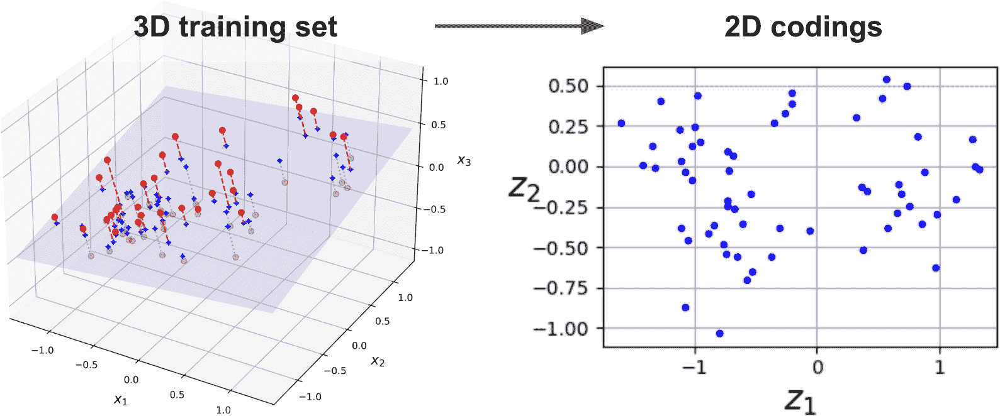
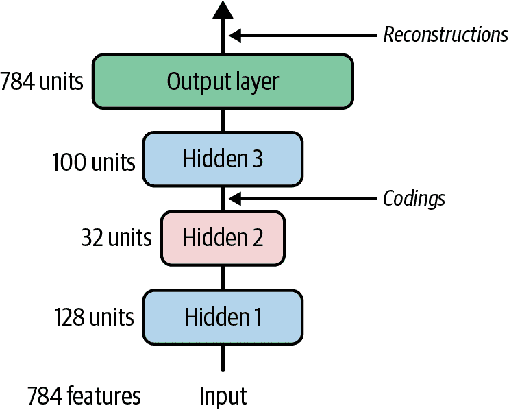
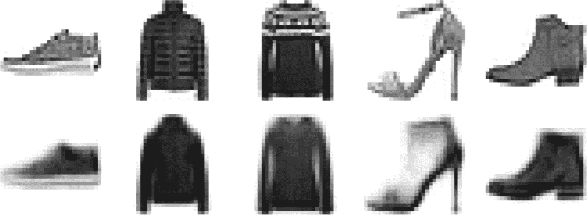
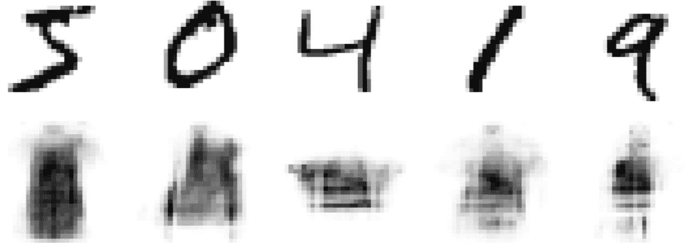
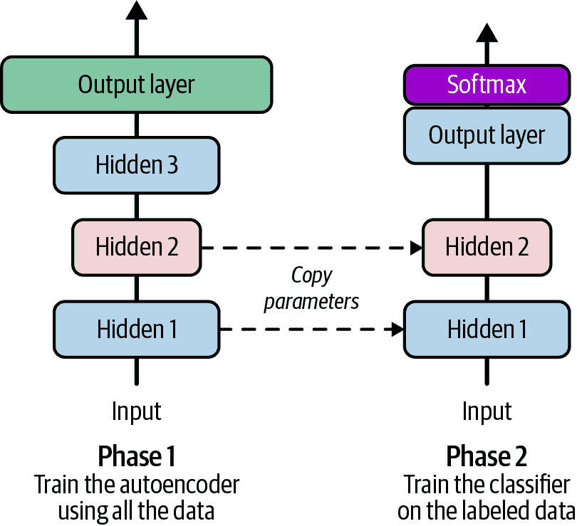
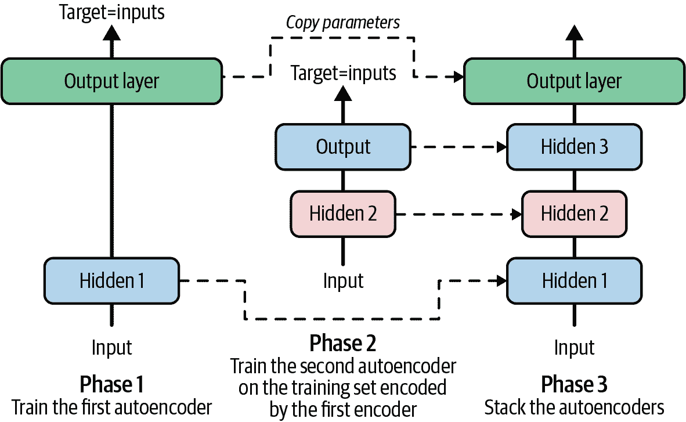
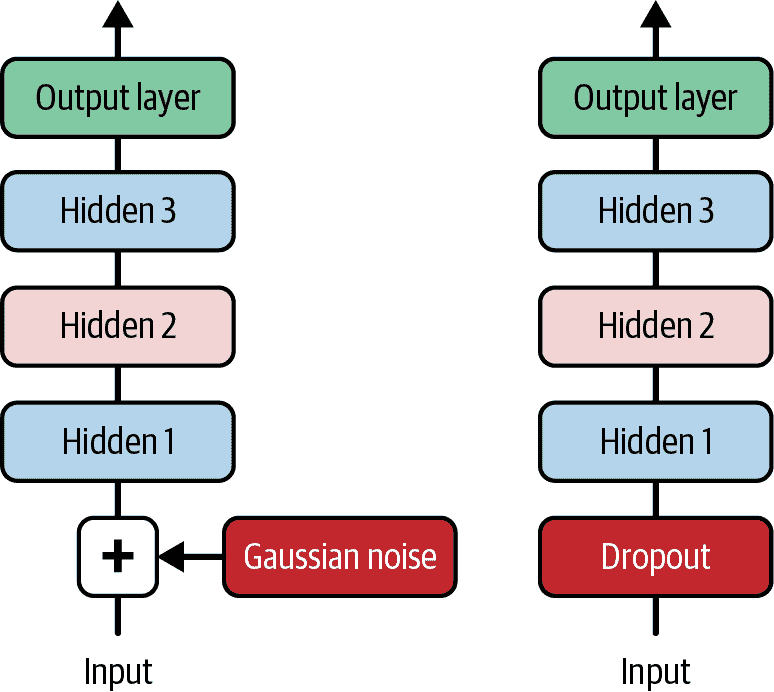
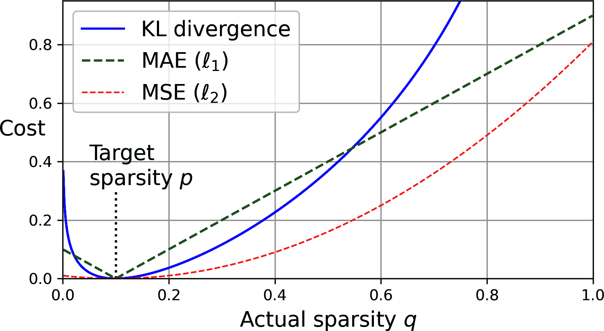
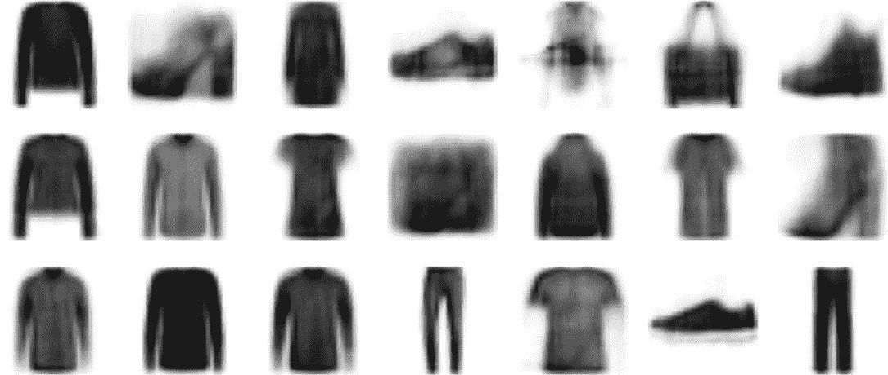
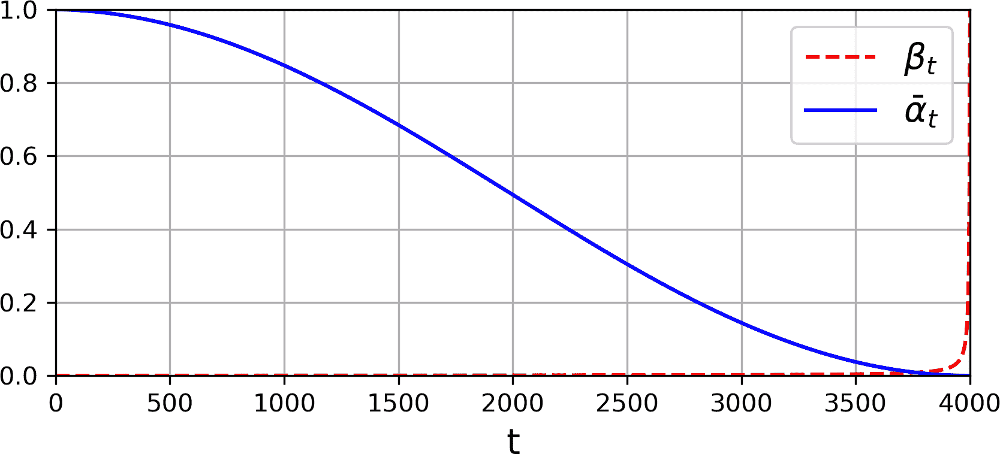

# 第十八章。自动编码器、GANs 和扩散模型

自动编码器是能够学习输入数据的密集表示的人工神经网络，这种表示被称为*潜在表示*或*编码*，无需任何监督（即，训练集是无标签的）。这些编码通常比输入数据具有更低的维度，这使得自动编码器在降维（见第七章）方面非常有用，特别是用于可视化目的。自动编码器还充当特征检测器，并且可以用于深度神经网络的非监督预训练（正如我们在第十一章中讨论的那样）。它们也常用于异常检测，我们将会看到。最后，一些自动编码器是*生成模型*：它们能够随机生成与训练数据非常相似的新数据。例如，您可以在面部图片上训练一个自动编码器，然后它就能够生成新的面部。

*生成对抗网络*（GANs）也是一种能够生成数据的神经网络。实际上，它们可以生成逼真的面部图片，以至于很难相信它们所代表的人不存在。您可以通过访问[*https://thispersondoesnotexist.com*](https://thispersondoesnotexist.com)，一个展示由名为*StyleGAN*的 GAN 架构生成的面部网站的链接，来判断这一点。GANs 已被广泛应用于超分辨率（提高图像分辨率）、[着色](https://github.com/jantic/DeOldify)、强大的图像编辑（例如，用逼真的背景替换照片中的捣乱者）、将简单的素描变成逼真的图像、预测视频中的下一帧、增强数据集（以训练其他模型）、生成其他类型的数据（如文本、音频和时间序列）、识别其他模型的弱点以增强它们，以及更多。

然而，自 2020 年代初以来，GANs 在很大程度上已被*扩散模型*所取代，这些模型可以生成比 GANs 更丰富、质量更高的图像，同时训练起来也容易得多。然而，扩散模型的运行速度要慢得多，因此当您需要非常快速的生成时，GANs 仍然很有用。

自动编码器、GANs 和扩散模型都是无监督的，学习潜在表示，可以用作生成模型，并且有许多类似的应用。然而，它们的工作方式非常不同：

自动编码器

自编码器简单地学习将它们的输入复制到输出。这听起来可能像是一项微不足道的任务，但正如你将看到的，以各种方式约束网络可以使任务变得任意困难。例如，你可以限制潜在表示的大小，或者你可以在输入中添加噪声并训练网络恢复原始输入。这些约束阻止了自编码器直接将输入复制到输出，这迫使它学习高效的数据表示方法。简而言之，编码是自编码器在某种约束下学习恒等函数的副产品。

生成对抗网络（GANs）

生成对抗网络（GANs）由两个神经网络组成：一个*生成器*，它试图生成看起来与训练数据相似的数据，以及一个*判别器*，它试图区分真实数据和假数据。这种架构在深度学习中非常独特，因为在训练过程中生成器和判别器相互竞争；这被称为*对抗训练*。生成器通常被比作一个试图制作逼真假币的罪犯，而判别器则像是一个试图区分真币和假币的警察调查员。

扩散模型

扩散模型被训练以逐渐从图像中去除噪声。如果你然后取一个完全充满随机噪声的图像，并反复在该图像上运行扩散模型，一个高质量的图像将逐渐出现，类似于训练图像（但并不相同）。

在本章中，我们将首先深入探讨自编码器的工作原理以及如何使用它们进行降维、特征提取、无监督预训练或作为生成模型。这自然会引导我们进入生成对抗网络（GANs）。我们将构建一个简单的 GAN 来生成假图像，但我们会看到训练通常相当困难。我们将讨论你在对抗训练中会遇到的主要困难，以及一些解决这些困难的主要技术。最后，我们将构建和训练一个扩散模型——具体来说是一个*去噪扩散概率模型*（DDPM）——并使用它来生成图像。让我们从自编码器开始吧！

# 高效的数据表示

你觉得以下哪个数字序列最容易记住？

+   40, 27, 25, 36, 81, 57, 10, 73, 19, 68

+   50, 48, 46, 44, 42, 40, 38, 36, 34, 32, 30, 28, 26, 24, 22, 20, 18, 16, 14

乍一看，似乎第一个序列应该更容易，因为它要短得多。然而，如果你仔细观察第二个序列，你会注意到它只是从 50 到 14 的偶数列表。一旦你注意到这个模式，第二个序列就比第一个序列更容易记住，因为你只需要记住模式（即递减的偶数）以及起始和结束数字（即 50 和 14）。请注意，如果你能够快速轻松地记住非常长的序列，你就不太会在意第二个序列中是否存在模式。你只需逐个记住每个数字，然后就可以了。难以记住长序列的事实使得识别模式变得有用，希望这能阐明为什么在训练过程中对自动编码器进行约束会推动它发现并利用数据中的模式。

记忆、感知和模式匹配之间的关系在 20 世纪 70 年代初由[威廉·蔡斯和赫伯特·西蒙](https://homl.info/111)⁠^(1)进行了著名的研究。他们观察到，专家棋手只需看五秒钟棋盘，就能记住游戏中所有棋子的位置，这对于大多数人来说是不可能的任务。然而，这只在棋子放置在现实位置（来自实际比赛）时才成立，而不是当棋子随机放置时。象棋专家的记忆并不比我们好多少；他们只是更容易看到棋局模式，这得益于他们对游戏的经验。注意模式有助于他们有效地存储信息。

就像这个记忆实验中的棋手一样，自动编码器查看输入，将它们转换为有效的潜在表示，然后能够重建出（希望）非常接近输入的东西。自动编码器始终由两部分组成：一个*编码器*（或*识别网络*），它将输入转换为潜在表示，然后是一个*解码器*（或*生成网络*），它将内部表示转换为输出。

在图 18-1 所示的示例中，自动编码器是一个常规的多层感知器（MLP；参见第九章）。由于它必须重建其输入，输出层的神经元数量必须等于输入的数量（即在这个例子中是三个）。网络的下半部分是编码器（在这种情况下它是一个包含两个神经元的单层），上半部分是解码器。输出通常被称为*重建*，因为自动编码器试图重建输入。成本函数总是包含一个*重建损失*，当重建与输入不同时，会对模型进行惩罚。


###### 图 18-1。棋盘记忆实验（左）和简单的自动编码器（右）

由于内部表示的维度低于输入数据（在这个例子中，它是 2D 而不是 3D），因此自动编码器被称为*欠完整*。欠完整自动编码器不能简单地复制其输入到编码中，但它必须找到一种方法来输出其输入的副本。它被迫压缩数据，从而学习输入数据中最重要的特征（并丢弃不重要的特征）。

让我们看看如何实现一个非常简单的欠完整自动编码器来进行降维。

# 使用不完整线性自动编码器执行 PCA

如果自动编码器仅使用线性激活函数，并且损失函数是均方误差（MSE），则它最终执行主成分分析（PCA；见第七章）。

以下代码构建了一个简单的线性自动编码器，它接受 3D 输入，将其投影到 2D，然后再将其投影回 3D。由于我们将使用等于输入的目标来训练模型，梯度下降必须找到最接近训练数据的 2D 平面，就像 PCA 一样。

```py
import torch
import torch.nn as nn

torch.manual_seed(42)
encoder = nn.Linear(3, 2)
decoder = nn.Linear(2, 3)
autoencoder = nn.Sequential(encoder, decoder).to(device)
```

这段代码与我们过去章节中构建的所有 MLP（多层感知器）并没有太大区别，但有一些需要注意的地方：

+   我们将自动编码器组织成两个子组件：编码器和解码器，在这个例子中每个都由一个`Linear`层组成，自动编码器是一个包含编码器然后是解码器的`Sequential`模型。

+   自动编码器的输出数量等于输入数量（即，3）。

+   要执行 PCA，我们不使用任何激活函数（即，所有神经元都是线性的），并且损失函数是 MSE。这是因为 PCA 是一种线性变换。我们很快就会看到更复杂和非线性的自动编码器。

现在，让我们在第七章中使用的相同简单生成的 3D 数据集上训练模型，并使用它来编码该数据集（即，将其投影到 2D）：

```py
from torch.utils.data import DataLoader, TensorDataset

X_train = [...]  # generate a 3D dataset, like in Chapter 7
train_set = TensorDataset(X_train, X_train)  # the inputs are also the targets
train_loader = DataLoader(train_set, batch_size=32, shuffle=True)
```

注意`X_train`既用作输入也用作目标。接下来，让我们使用与第十章中相同的`train()`函数来训练自动编码器（笔记本使用了一个稍微复杂一些的函数，它在每个 epoch 打印一些信息并评估模型）：

```py
import torchmetrics

optimizer = torch.optim.NAdam(autoencoder.parameters(), lr=0.2)
mse = nn.MSELoss()
rmse = torchmetrics.MeanSquaredError(squared=False).to(device)
train(autoencoder, optimizer, mse, train_loader, n_epochs=20)
```

现在自动编码器已经训练好了，我们可以使用它的编码器将 3D 输入压缩到 2D。例如，让我们压缩整个训练集：

```py
codings = encoder(X_train.to(device))
```

图 18-2 展示了原始的 3D 数据集（在左侧）和自动编码器隐藏层的输出（即编码层，在右侧）。正如您所看到的，自动编码器找到了最佳二维平面来投影数据，尽可能多地保留了数据中的方差（就像 PCA 一样）。



###### 图 18-2\. 由欠完备线性自动编码器执行的近似 PCA

###### 注意

您可以将自动编码器视为执行一种形式的自监督学习，因为它基于一种带有自动生成标签的监督学习技术（在这种情况下，简单地等于输入）。

# 堆叠自动编码器

就像我们讨论过的其他神经网络一样，自动编码器可以有多个隐藏层。在这种情况下，它们被称为*堆叠自动编码器*（或*深度自动编码器*）。添加更多层有助于自动编码器学习更复杂的编码。但必须小心不要使自动编码器过于强大。想象一下，一个编码器如此强大，以至于它只学会了将每个输入映射到一个任意的单一数字（解码器学习反向映射）。显然，这样的自动编码器将完美地重建训练数据，但在过程中它并没有学习到任何有用的数据表示，并且不太可能很好地泛化到新的实例。

堆叠自动编码器的架构通常在中心隐藏层（编码层）方面是对称的。简单来说，它看起来像一个三明治。例如，用于 Fashion MNIST（在第九章中介绍）的自动编码器可能有 784 个输入，然后是一个包含 128 个神经元的隐藏层，接着是一个 32 个神经元的中心隐藏层，然后是另一个包含 128 个神经元的隐藏层，最后是一个 784 个神经元的输出层。这个堆叠自动编码器在图 18-3 中展示。请注意，所有隐藏层都必须有一个激活函数，例如 ReLU。



###### 图 18-3\. 堆叠自动编码器

## 使用 PyTorch 实现堆叠自动编码器

您可以像实现常规深度 MLP 一样实现堆叠自动编码器。例如，这里有一个可以用于处理 Fashion MNIST 图像的自动编码器：

```py
stacked_encoder = nn.Sequential(
    nn.Flatten(),
    nn.Linear(1 * 28 * 28, 128), nn.ReLU(),
    nn.Linear(128, 32), nn.ReLU(),
)
stacked_decoder = nn.Sequential(
    nn.Linear(32, 128), nn.ReLU(),
    nn.Linear(128, 1 * 28 * 28), nn.Sigmoid(),
    nn.Unflatten(dim=1, unflattened_size=(1, 28, 28))
)
stacked_ae = nn.Sequential(stacked_encoder, stacked_decoder).to(device)
```

让我们来看一下这段代码：

+   就像之前一样，我们将自动编码器模型分为两个子模型：编码器和解码器。

+   编码器接收 28 × 28 像素的灰度图像（即，单通道），将它们展平，使得每个图像都表示为一个大小为 784 的向量，然后通过 2 个`线性`层（128 个单元，然后 32 个单元）对这些向量进行处理，每个层后面都跟着 ReLU 激活函数。对于每个输入图像，编码器输出一个大小为 32 的向量。

+   解码器接收大小为 32 的编码（由编码器输出）并通过 2 个`线性`层（128 个单元，然后 784 个单元）进行处理，并将最终的向量重塑为 1 × 28 × 28 数组，这样解码器的输出形状与编码器的输入相同。注意，我们使用 sigmoid 函数而不是 ReLU 作为输出层的激活函数，以确保输出像素值在 0 到 1 之间。

我们现在可以使用 TorchVision 库加载 Fashion MNIST 数据集，并将其拆分为`train_data`、`valid_data`和`test_data`（就像我们在第十章中所做的那样），然后像之前的自编码器一样训练自编码器，使用输入作为目标并最小化均方误差损失。试一试，这是一个很好的练习！别忘了更改目标，使它们与输入匹配——我们正在训练一个自编码器，而不是一个分类器。⁠^(2)如果你遇到困难，请查看本章笔记本中的实现。

## 可视化重建图像

一旦你训练了堆叠自编码器，你怎么知道它是否表现良好？检查自编码器是否正确训练的一种方法是比较输入和输出：差异不应太大。让我们绘制一些来自验证集的图像以及它们的重建图像：

```py
import matplotlib.pyplot as plt

def plot_image(image):
    plt.imshow(image.permute(1, 2, 0).cpu(), cmap="binary")
    plt.axis("off")

def plot_reconstructions(model, images, n_images=5):
    images = images[:n_images]
    with torch.no_grad():
        y_pred = model(images.to(device))

    fig = plt.figure(figsize=(len(images) * 1.5, 3))
    for idx in range(len(images)):
        plt.subplot(2, len(images), 1 + idx)
        plot_image(images[idx])
        plt.subplot(2, len(images), 1 + len(images) + idx)
        plot_image(y_pred[idx])

X_valid = torch.stack([x for x, _ in valid_data])
plot_reconstructions(stacked_ae, X_valid)
plt.show()
```



###### 图 18-4\. 原始图像（顶部）及其重建图像（底部）

图 18-4 显示了生成的图像。重建的图像可以辨认，但损失有点太大。我们可能需要更长时间地训练模型，或者使编码器和解码器更强大，或者使编码更大。现在，让我们使用这个模型并看看我们如何使用它。

## 使用自编码器进行异常检测

自动编码器的一个常见用途是异常检测。确实，如果自动编码器接收到一个看起来不像它训练过的图像（该图像被称为*分布外*），那么重构将非常糟糕。例如，图 18-5 展示了一些 MNIST 数字及其使用我们在 Fashion MNIST 上刚刚训练的模型进行重构的结果。如你所见，这些重构与输入非常不同。如果你计算重构损失（即输入和输出之间的均方误差），它将非常高。要使用该模型进行异常检测，你只需定义一个阈值，然后任何重构损失大于该阈值的图像都可以被认为是异常。



###### 图 18-5。分布外图像的重构效果不佳

就这些了！现在让我们看看自动编码器的另一个用例。

## 可视化 Fashion MNIST 数据集

如我们在这章前面看到的，欠完备的自动编码器可以用于降维。然而，对于大多数数据集，它们在将维度降低到两维或三维方面可能不会做得很好；它们需要足够的维度来正确地重构输入。因此，它们通常不直接用于可视化。然而，它们在处理大型数据集方面非常出色，所以一种策略是使用自动编码器将维度降低到一个合理的水平，然后使用另一个降维算法进行可视化，例如我们在第七章中讨论的那些。

让我们使用这种策略来可视化 Fashion MNIST。首先，我们将使用堆叠自动编码器的编码器将维度降低到 32，然后我们将使用 Scikit-Learn 实现的 t-SNE 算法将维度降低到 2 以进行可视化：

```py
from sklearn.manifold import TSNE

with torch.no_grad():
    X_valid_compressed = stacked_encoder(X_valid.to(device))

tsne = TSNE(init="pca", learning_rate="auto", random_state=42)
X_valid_2D = tsne.fit_transform(X_valid_compressed.cpu())
```

现在，我们可以绘制数据集：

```py
plt.scatter(X_valid_2D[:, 0], X_valid_2D[:, 1], c=y_valid, s=10, cmap="tab10")
plt.show()
```

图 18-6 展示了生成的散点图，通过显示一些图像进行了一些美化。t-SNE 算法识别出几个与类别匹配得相当好的簇（每个类别用不同的颜色表示）。请注意，如果你使用不同的随机种子、略微不同的数据或在不同的平台上运行 t-SNE，其输出可能会有很大差异，因此你的图表可能看起来不同。


###### 图 18-6。使用自动编码器，然后是 t-SNE 进行 Fashion MNIST 可视化

接下来，让我们看看如何使用自动编码器进行无监督预训练。

## 使用堆叠自动编码器进行无监督预训练

正如我们在第十一章中讨论的那样，如果你正在处理一个复杂的监督任务，但你没有很多标记的训练数据，一个解决方案是找到一个执行类似任务的神经网络并重用其底层。这样，你就可以使用很少的训练数据训练一个高性能模型，因为你的神经网络不需要学习所有低级特征；它只需重用现有网络学习到的特征检测器。

同样，如果你有一个大型数据集，但其中大部分是无标记的，你可以首先使用所有数据训练一个堆叠自动编码器，然后重用底层来创建用于实际任务的神经网络，并使用标记数据对其进行训练。例如，图 18-7 展示了如何使用堆叠自动编码器对分类神经网络进行无监督预训练。在训练分类器时，如果你真的没有很多标记的训练数据，你可能想要冻结预训练层（至少是底层的）。



###### 图 18-7\. 使用自动编码器进行无监督预训练

###### 注意

拥有大量无标记数据和少量标记数据是很常见的。构建一个大型无标记数据集通常很便宜（例如，一个简单的脚本可以从互联网上下载数百万张图片），但标记这些图片（例如，将它们分类为可爱或不可爱）通常只能由人类可靠地完成。标记实例既耗时又昂贵，因此通常只有几千个或更少的人类标记实例。尽管如此，使用高级 AI 来标记数据集的趋势正在增长。

实现上并没有什么特别之处：只需使用所有训练数据（标记的和无标记的）训练一个自动编码器，然后重用其编码器层来创建一个新的神经网络，并在标记实例上对其进行训练（参见本章末尾的练习以获取示例）。

让我们现在看看一些用于训练堆叠自动编码器的技巧。

## 权重绑定

当一个自动编码器结构对称，就像我们刚刚构建的那样，一个常见的技巧是将解码器层的权重与编码器层的权重**绑定**。这使模型中的权重数量减半，从而加快训练速度并限制过拟合的风险。具体来说，如果自动编码器总共有*N*层（不包括输入层），并且**W**[*L*]表示*L*^(th)层的连接权重（例如，第 1 层是第一个隐藏层，第*N*/2 层是编码层，第*N*层是输出层），那么解码器层的权重可以定义为**W**[*L*] = **W**[*N*–*L*+1]^⊺（其中*L* = *N* / 2 + 1, …​, *N*）。

例如，这里有一个与之前相同的自编码器，除了解码器权重绑定到编码器权重：

```py
import torch.nn.functional as F

class TiedAutoencoder(nn.Module):
    def __init__(self):
        super().__init__()
        self.enc1 = nn.Linear(1 * 28 * 28, 128)
        self.enc2 = nn.Linear(128, 32)
        self.dec1_bias = nn.Parameter(torch.zeros(128))
        self.dec2_bias = nn.Parameter(torch.zeros(1 * 28 * 28))

    def encode(self, X):
        Z = X.view(-1, 1 * 28 * 28)  # flatten
        Z = F.relu(self.enc1(Z))
        return F.relu(self.enc2(Z))

    def decode(self, X):
        Z = F.relu(F.linear(X, self.enc2.weight.t(), self.dec1_bias))
        Z = F.sigmoid(F.linear(Z, self.enc1.weight.t(), self.dec2_bias))
        return Z.view(-1, 1, 28, 28)  # unflatten

    def forward(self, X):
        return self.decode(self.encode(X))
```

这个模型实现了比之前模型更小的重建误差，使用大约一半的参数数量。

## 逐个训练一个自编码器

与我们刚才一次性训练整个堆叠自编码器不同，可以一次训练一个浅层自编码器，然后将所有这些堆叠成一个单一的自编码器堆叠（因此得名），如图图 18-8 所示。这种技术被称为*贪婪层状训练*。

在训练的第一个阶段，第一个自编码器学会重建输入。然后我们使用这个第一个自编码器对整个训练集进行编码，这给我们提供了一个新的（压缩的）训练集。然后我们在这个新数据集上训练第二个自编码器。这是训练的第二阶段。最后，我们使用所有这些自编码器构建一个大的三明治，如图图 18-8 所示（即我们首先堆叠每个自编码器的编码器层，然后以相反的顺序堆叠解码器层）。这给我们带来了最终的堆叠自编码器。我们可以轻松地以这种方式训练更多的自编码器，构建一个非常深的堆叠自编码器。



###### 图 18-8\. 逐个训练一个自编码器

正如我在第十一章中提到的，深度学习海啸的触发因素之一是 2006 年[杰弗里·辛顿](https://homl.info/136)及其同事发现，深度神经网络可以使用这种贪婪层状方法进行无监督预训练。他们为此目的使用了受限玻尔兹曼机（RBMs；见[*https://homl.info/extra-anns*](https://homl.info/extra-anns)），但在 2007 年[约书亚·本吉奥](https://homl.info/112)⁠^(3)等人展示了自编码器同样有效。在接下来的几年里，这是训练深度网络的唯一有效方法，直到第十一章中介绍的技术使得一次性训练深度网络成为可能。

自编码器不仅限于密集网络：你还可以构建卷积自编码器。现在让我们来看看这些。

# 卷积自编码器

如果你正在处理图像，那么我们之前看到的自动编码器可能不会很好地工作（除非图像非常小）。正如你在第十二章中看到的，卷积神经网络比密集网络更适合处理图像。因此，如果你想为图像构建一个自动编码器（例如，用于无监督预训练或降维），你需要构建一个[*卷积自动编码器*](https://homl.info/convae)。⁠^(4) 编码器是一个由卷积层和池化层组成的常规 CNN。它通常减少输入的空间维度（即高度和宽度），同时增加深度（即特征图的数量）。解码器必须执行相反的操作（放大图像并减少其深度以回到原始维度），为此你可以使用转置卷积层（或者，你也可以将上采样层与卷积层结合使用）。以下是一个用于 Fashion MNIST 的基本卷积自动编码器：

```py
conv_encoder = nn.Sequential(
    nn.Conv2d(1, 16, kernel_size=3, padding="same"), nn.ReLU(),
    nn.MaxPool2d(kernel_size=2),  # output: 16 × 14 × 14
    nn.Conv2d(16, 32, kernel_size=3, padding="same"), nn.ReLU(),
    nn.MaxPool2d(kernel_size=2),  # output: 32 × 7 × 7
    nn.Conv2d(32, 64, kernel_size=3, padding="same"), nn.ReLU(),
    nn.MaxPool2d(kernel_size=2),  # output: 64 × 3 × 3
    nn.Conv2d(64, 32, kernel_size=3, padding="same"), nn.ReLU(),
    nn.AdaptiveAvgPool2d((1, 1)), nn.Flatten())  # output: 32

conv_decoder = nn.Sequential(
    nn.Linear(32, 16 * 3 * 3),
    nn.Unflatten(dim=1, unflattened_size=(16, 3, 3)),
    nn.ConvTranspose2d(16, 32, kernel_size=3, stride=2), nn.ReLU(),
    nn.ConvTranspose2d(32, 16, kernel_size=3, stride=2, padding=1,
                       output_padding=1), nn.ReLU(),
    nn.ConvTranspose2d(16, 1, kernel_size=3, stride=2, padding=1,
                       output_padding=1), nn.Sigmoid())

conv_ae = nn.Sequential(conv_encoder, conv_decoder).to(device)
```

还可以创建具有其他架构类型的自动编码器，例如 RNN（请参阅笔记本中的示例）。

好的，让我们退后一步。到目前为止，我们已经探讨了各种类型的自动编码器（基本、堆叠和卷积）以及如何训练它们（一次性或逐层）。我们还探讨了几个应用：降维（例如，用于数据可视化）、异常检测和无监督预训练。

到目前为止，为了迫使自动编码器学习有趣的特征，我们限制了编码层的大小，使其不完整。实际上还有许多其他类型的约束可以使用，包括允许编码层与输入大小相同，甚至更大的约束，从而产生一个*过完备自动编码器*。因此，在接下来的几节中，我们将探讨更多类型的自动编码器：降噪自动编码器、稀疏自动编码器和变分自动编码器。

# 降噪自动编码器

强迫自动编码器学习有用特征的一种简单方法是在其输入中添加噪声，训练它恢复原始的无噪声输入。这个想法自 20 世纪 80 年代以来一直存在（例如，它在 Yann LeCun 的 1987 年硕士论文中提到）。在[2008 年的一篇论文](https://homl.info/113)，⁠^(5)中 Pascal Vincent 等人表明自动编码器也可以用于特征提取。在[2010 年的一篇论文](https://homl.info/114)，⁠^(6)中 Vincent 等人引入了*堆叠降噪自动编码器*。

噪声可以是添加到输入的纯高斯噪声，也可以是随机关闭的输入，就像在 dropout 中（在第十一章中介绍）一样。图 18-9 显示了这两种选项。



###### 图 18-9\. 噪声消除自动编码器，带有高斯噪声（左侧）或 dropout（右侧）

噪声消除自动编码器的 dropout 实现很简单：它是一个常规的堆叠自动编码器，在编码器的输入上应用了一个额外的`Dropout`层（回想一下，`Dropout`层仅在训练期间是活跃的）。请注意，编码层不需要对数据进行过多的压缩，因为噪声已经使得重建任务变得非平凡：

```py
dropout_encoder = nn.Sequential(
    nn.Flatten(),
    nn.Dropout(0.5),
    nn.Linear(1 * 28 * 28, 128), nn.ReLU(),
    nn.Linear(128, 128), nn.ReLU(),
)
dropout_decoder = nn.Sequential(
    nn.Linear(128, 128), nn.ReLU(),
    nn.Linear(128, 1 * 28 * 28), nn.Sigmoid(),
    nn.Unflatten(dim=1, unflattened_size=(1, 28, 28))
)
dropout_ae = nn.Sequential(dropout_encoder, dropout_decoder).to(device)
```

###### 注意

这可能会让你想起 BERT 的 MLM 预训练任务（参见第十五章）：重建掩码输入（除了 BERT 没有分成编码器和解码器）。

图 18-10 展示了一些噪声图像（一半的像素被关闭），以及经过训练后由基于 dropout 的去噪自动编码器重建的图像。注意自动编码器如何猜测实际上不在输入中的细节，例如最右侧鞋子的顶部。正如你所看到的，去噪自动编码器不仅可以用于数据可视化或无监督预训练，就像我们之前讨论的其他自动编码器一样，而且它们还可以非常简单且高效地用于从图像中去除噪声。


###### 图 18-10\. 噪声图像（顶部）及其重建图像（底部）

# 稀疏自动编码器

另一种常导致良好特征提取的约束是*稀疏性*：通过在成本函数中添加一个适当的项，自动编码器被推动减少编码层中活跃神经元的数量。这迫使自动编码器将每个输入表示为少量激活的组合。因此，编码层中的每个神经元通常最终代表一个有用的特征（如果你每月只能说几个词，你可能会尝试使它们值得聆听）。

一种基本的方法是在编码层中使用 sigmoid 激活函数（将编码约束在 0 到 1 之间的值），使用一个大的编码层（例如，有 256 个单元），并在编码层的激活上添加一些ℓ[1]正则化。这意味着将编码的ℓ[1]范数（即它们的绝对值之和）添加到损失中，并乘以一个稀疏超参数。这种*稀疏损失*将鼓励神经网络产生接近 0 的编码。然而，总损失仍然包括重建损失，因此模型将被迫输出至少几个非零值以正确重建输入。使用ℓ[1]范数而不是ℓ[2]范数将推动神经网络保留最重要的编码，同时消除对于输入图像不需要的编码（而不仅仅是减少所有编码）。

另一种方法——通常会产生更好的结果——是测量编码层中每个神经元的平均稀疏度，跨每个训练批次，并在平均稀疏度与目标稀疏度（例如，10%）不同时惩罚模型。批大小不能太小，否则平均值将不准确。例如，如果我们测量到一个神经元的平均激活为 0.3，但目标稀疏度是 0.1，那么这个神经元必须被惩罚以减少激活。一种方法可能是简单地将平方误差（0.3 – 0.1）²加到损失函数中，但在实践中，最好使用 Kullback–Leibler（KL）散度（在第四章中简要讨论），因为它比均方误差具有更强的梯度，如图 18-11 所示。



###### 图 18-11. 目标稀疏度 *p* = 0.1 的稀疏度损失

给定两个离散概率分布 *P* 和 *Q*，这些分布之间的 KL 散度，记为 *D*KL，可以使用方程 18-1 计算。

##### 方程 18-1. Kullback–Leibler 散度

$upper D Subscript KL Baseline left-parenthesis upper P parallel-to upper Q right-parenthesis equals sigma-summation Underscript i Endscripts upper P left-parenthesis i right-parenthesis log StartFraction upper P left-parenthesis i right-parenthesis Over upper Q left-parenthesis i right-parenthesis EndFraction$

在我们的情况下，我们想要测量编码层中神经元激活的目标概率 *p* 和通过测量训练批次中的平均激活估计的实际概率 *q* 之间的差异。因此，KL 散度简化为方程 18-2。

##### 方程 18-2. 目标稀疏度 *p* 和实际稀疏度 *q* 之间的 KL 散度

$upper D Subscript KL Baseline left-parenthesis p parallel-to q right-parenthesis equals p log StartFraction p Over q EndFraction plus left-parenthesis 1 minus p right-parenthesis log StartFraction 1 minus p Over 1 minus q EndFraction$

要在 PyTorch 中实现这种方法，我们首先必须确保自动编码器输出重建和编码，因为它们都是计算损失所必需的。在此代码中，自动编码器的 `forward()` 方法返回一个包含两个字段的 `namedtuple` ——`output`（即重建）和`codings`：

```py
from collections import namedtuple

AEOutput = namedtuple("AEOutput", ["output", "codings"])

class SparseAutoencoder(nn.Module):
    def __init__(self):
        super().__init__()
        self.encoder = nn.Sequential(
            nn.Flatten(),
            nn.Linear(1 * 28 * 28, 128), nn.ReLU(),
            nn.Linear(128, 256), nn.Sigmoid())
        self.decoder = nn.Sequential(
            nn.Linear(256, 128), nn.ReLU(),
            nn.Linear(128, 1 * 28 * 28), nn.Sigmoid(),
            nn.Unflatten(dim=1, unflattened_size=(1, 28, 28)))

    def forward(self, X):
        codings = self.encoder(X)
        output = self.decoder(codings)
        return AEOutput(output, codings)
```

###### 注意

您可能需要调整训练和评估函数以支持这些 `namedtuple` 预测。例如，您可以在调用模型后立即在 `evaluate_tm()` 函数中添加 `y_pred = y_pred.output`。

接下来，我们可以定义损失函数：

```py
def mse_plus_sparsity_loss(y_pred, y_target, target_sparsity=0.1,
                           kl_weight=1e-3, eps=1e-8):
    p = torch.tensor(target_sparsity, device=y_pred.codings.device)
    q = torch.clamp(y_pred.codings.mean(dim=0), eps, 1 - eps)  # actual sparsity
    kl_div = p * torch.log(p / q) + (1 - p) * torch.log((1 - p) / (1 - q))
    return mse(y_pred.output, y_target) + kl_weight * kl_div.sum()
```

此函数返回重建损失（均方误差）加上一个加权稀疏损失。稀疏损失是目标稀疏度与批次平均稀疏度之间的 KL 散度。`kl_weight` 是一个超参数，你可以调整它来控制鼓励稀疏度的程度：如果这个超参数太高，模型将紧密地遵循目标稀疏度，但它可能无法正确地重建输入，使得模型变得无用。相反，如果它太低，模型将主要忽略稀疏度目标，并且不会学习任何有趣的特征。`eps` 参数是一个平滑项，用于避免在计算 KL 散度时除以零。

现在我们已经准备好创建模型并进行训练（使用与之前相同的 `train()` 函数，来自 第十章）：

```py
torch.manual_seed(42)
sparse_ae = SparseAutoencoder().to(device)
optimizer = torch.optim.NAdam(sparse_ae.parameters(), lr=0.002)
train(sparse_ae, optimizer, mse_plus_sparsity_loss, train_loader, n_epochs=10)
```

在对 Fashion MNIST 上的稀疏自编码器进行训练后，编码层将大约有 10%的稀疏度。成功！

###### 小贴士

稀疏自编码器通常会产生相当可解释的编码，其中每个组件对应于图像中的一个可识别特征。例如，你可以绘制所有 *n*^(th) 编码值大于通常值（例如，高于 90^(th) 分位数）的图像：你通常会注意到所有图像都有一些共同点（例如，它们都是鞋子）。

现在让我们继续讨论变分自编码器！

# 变分自编码器

2013 年，[Diederik Kingma 和 Max Welling](https://homl.info/115)⁠^(7) 引入了一个重要的自编码器类别，很快它就成为了最受欢迎的变体之一：*变分自编码器* (VAEs)。

与我们之前讨论的所有自编码器相比，VAEs 在以下特定方面相当不同：

+   它们是 *概率自编码器*，这意味着即使经过训练，它们的输出也部分由机会决定（与仅在使用训练时使用随机性的去噪自编码器相反）。

+   最重要的是，它们是 *生成式自编码器*，这意味着它们可以生成看起来像是从训练集中采样的新实例。⁠^(8)

让我们看看变分自动编码器是如何工作的。图 18-12（左侧）展示了一个变分自动编码器。您可以识别出大多数自动编码器的基本三明治结构，即编码器后面跟着解码器（在这个例子中，它们都有两个隐藏层），但有一个转折：编码器不是直接为给定的输入产生编码，而是产生一个*均值编码* **μ** 和一个标准差 **σ**。实际的编码随后从具有均值 **μ** 和标准差 **σ** 的高斯分布中随机采样。之后，解码器正常解码采样的编码。图例的右侧部分展示了训练实例通过这个自动编码器的过程。首先，编码器产生 **μ** 和 **σ**，然后随机采样一个编码（注意它并不正好位于 **μ** 上），最后对这个编码进行解码。最终的输出类似于训练实例。

如您在图 18-12 中可以看到，尽管输入可能具有非常复杂的分布，变分自动编码器往往会产生看起来像是从简单高斯分布中采样的编码。在训练过程中，成本函数（将在下一节讨论）推动编码在编码空间（也称为*潜在空间*）内逐渐迁移，最终看起来像是一团多维高斯点。一个很好的结果是，在训练完变分自动编码器后，您可以非常容易地生成一个新的实例：只需从高斯分布中随机采样一个编码，解码它，然后就可以了！


###### 图 18-12\. 变分自动编码器（左侧）及其通过实例（右侧）

###### 注意

从随机分布中采样不是一个可微的操作，它将阻止反向传播，那么我们如何希望训练编码器呢？嗯，使用一个*重新参数化技巧*：从𝒩(0, 1)中采样 **ε** 并计算 **μ** + **σ** ⊗ **ε**（逐元素乘法）。这相当于从𝒩(**μ**, **σ**²)中采样，但它将过程的确定性和随机性部分分开，允许梯度通过 **μ** 和 **σ** 流回编码器。结果编码器梯度是随机的（由于 **ε**），但它们是无偏估计，并且在训练过程中随机性会平均化。

成本函数由两部分组成。第一部分是通常的重建损失，它推动自动编码器重现其输入。我们可以使用 MSE 来实现这一点，就像我们之前做的那样。第二部分是 *潜在损失*，它推动自动编码器具有看起来像是从简单高斯分布中采样的编码：它是编码的实际分布和期望的潜在分布（即高斯分布）之间的 KL 散度。数学上比稀疏自动编码器复杂一些，特别是由于高斯噪声，这限制了可以传输到编码层的信 息量。幸运的是，方程简化了，因此可以使用 方程 18-3（对于完整的数学细节，请参阅变分自动编码器的原始论文或 Carl Doersch 的 [优秀 2016 教程](https://homl.info/vaetuto)）来计算潜在损失。

##### 方程 18-3\. 变分自动编码器的潜在损失

$script upper L equals minus one-half sigma-summation Underscript i equals 1 Overscript n Endscripts left-bracket 1 plus log left-parenthesis sigma Subscript i Superscript 2 Baseline right-parenthesis minus sigma Subscript i Superscript 2 Baseline minus mu Subscript i Superscript 2 Baseline right-bracket$

在这个方程中，ℒ 是潜在损失，*n* 是编码的维度，而 *μ*[i] 和 *σ*[i] 是编码的第 *i* 个分量的均值和标准差。向量 **μ** 和 **σ**（包含所有 *μ*[i] 和 *σ*[i]）由编码器输出，如图 图 18-12（左）所示。

变分自动编码器架构的一个常见调整是使编码器输出 **γ** = log(**σ**²) 而不是 **σ**。然后可以像 方程 18-4 中所示计算潜在损失。这种方法在数值上更稳定，并且可以加快训练速度。

##### 方程 18-4\. 变分自动编码器的潜在损失，使用 **γ** = log(**σ**²) 重新编写

$script upper L equals minus one-half sigma-summation Underscript i equals 1 Overscript n Endscripts left-bracket 1 plus gamma Subscript i Baseline minus exp left-parenthesis gamma Subscript i Baseline right-parenthesis minus mu Subscript i Superscript 2 Baseline right-bracket$

让我们为 Fashion MNIST 构建一个变分自动编码器，使用 图 18-12 中所示的架构，除了使用 **γ** 调整：

```py
VAEOutput = namedtuple("VAEOutput",
                       ["output", "codings_mean", "codings_logvar"])

class VAE(nn.Module):
    def __init__(self, codings_dim=32):
        super(VAE, self).__init__()
        self.codings_dim = codings_dim
        self.encoder = nn.Sequential(
            nn.Flatten(),
            nn.Linear(1 * 28 * 28, 128), nn.ReLU(),
            nn.Linear(128, 2 * codings_dim))  # output both the mean and logvar
        self.decoder = nn.Sequential(
            nn.Linear(codings_dim, 128), nn.ReLU(),
            nn.Linear(128, 1 * 28 * 28), nn.Sigmoid(),
            nn.Unflatten(dim=1, unflattened_size=(1, 28, 28)))

    def encode(self, X):
        return self.encoder(X).chunk(2, dim=-1)  # returns (mean, logvar)

    def sample_codings(self, codings_mean, codings_logvar):
        codings_std = torch.exp(0.5 * codings_logvar)
        noise = torch.randn_like(codings_std)
        return codings_mean + noise * codings_std

    def decode(self, Z):
        return self.decoder(Z)

    def forward(self, X):
        codings_mean, codings_logvar = self.encode(X)
        codings = self.sample_codings(codings_mean, codings_logvar)
        output = self.decode(codings)
        return VAEOutput(output, codings_mean, codings_logvar)
```

让我们分析一下这段代码：

+   首先，我们定义 `VAEOutput`。这允许模型输出一个包含重建（`output`）、**μ**（`codings_mean`）和 **γ**（`codings_logvar`）的 `namedtuple`。

+   编码器和解码器架构与之前的自动编码器非常相似，但请注意，编码器的输出是编码的两倍大小。这是因为编码器不是直接输出编码；相反，它输出从其中采样编码的高斯分布的参数：均值（**μ**）和方差的对数（**γ**）。

+   `encode()` 方法调用 `encoder` 模型，并使用 `chunk()` 方法将输出分成两部分，以获得 **μ** 和 **γ**。

+   `sample_codings()` 方法接受 **μ** 和 **γ** 并从中采样实际的编码。为此，它首先计算 `torch.exp(0.5 * codings_logvar)` 以获得编码的标准差 **σ**（你可以验证这在数学上是可行的）。然后它使用 `torch.randn_like()` 函数从均值为 0、标准差为 1 的高斯分布中采样与 **σ** 相同形状的随机向量，在同一设备和相同数据类型上。最后，它将这个高斯噪声乘以 **σ**，加上 **μ**，并返回结果。这就是我们之前讨论过的重新参数化技巧。

+   `decode()` 方法简单地调用解码器模型以生成重建图像。

+   `forward()` 方法调用编码器以获取 **μ** 和 **γ**，然后使用这些参数来采样编码，将其解码，并最终返回一个包含重建和参数 **μ** 和 **γ** 的 `VAEOutput` 对象，这些都是计算 VAE 损失所必需的。

说到这里，让我们现在定义损失函数，它是重建损失（MSE）和潜在损失（KL 散度）的和：

```py
def vae_loss(y_pred, y_target, kl_weight=1.0):
    output, mean, logvar = y_pred
    kl_div = -0.5 * torch.sum(1 + logvar - logvar.exp() - mean.square(), dim=-1)
    return F.mse_loss(output, y_target) + kl_weight * kl_div.mean() / 784
```

函数首先使用 方程 18-4 计算批次中每个实例的潜在损失（`kl_div`）（通过在最后一个维度上求和），然后计算批次中所有实例的平均潜在损失（`kl_div.mean()`）。请注意，重建损失是批次中所有实例以及所有 784 个像素的平均值：这就是为什么我们要将潜在损失除以 784，以确保重建损失和潜在损失具有相同的尺度。

最后，我们可以在 Fashion MNIST 数据集上训练模型：

```py
torch.manual_seed(42)
vae = VAE().to(device)
optimizer = torch.optim.NAdam(vae.parameters(), lr=1e-3)
train(vae, optimizer, vae_loss, train_loader, n_epochs=20)
```

# 生成 Fashion MNIST 图像

现在让我们使用这个 VAE 来生成看起来像时尚商品的图像。我们只需要从均值为 0、方差为 1 的高斯分布中采样随机编码，并将它们解码：

```py
torch.manual_seed(42)
vae.eval()
codings = torch.randn(3 * 7, vae.codings_dim, device=device)
with torch.no_grad():
    images = vae.decode(codings)
```

图 18-13 展示了 21 个生成的图像。



###### 图 18-13\. 变分自动编码器生成的 Fashion MNIST 图像

大多数这些图像看起来相当令人信服，尽管有点模糊。其余的图像不是很好，但不要对自动编码器太苛刻——它只花了几分钟来学习，如果你使用卷积层，你会得到更好的结果！

变分自编码器使得进行**语义插值**成为可能：而不是在像素级别上对两张图像进行插值，这样看起来就像是两张图像只是简单地叠加在一起，我们可以在编码级别上进行插值。例如，如果我们采样两个随机编码并在它们之间进行插值，然后解码所有插值编码，我们得到一系列图像，这些图像逐渐从一个时尚单品过渡到另一个（参见图 18-14）：

```py
codings = torch.randn(2, vae.codings_dim)  # start and end codings
n_images = 7
weights = torch.linspace(0, 1, n_images).view(n_images, 1)
codings = torch.lerp(codings[0], codings[1], weights)  # linear interpolation
with torch.no_grad():
    images = vae.decode(codings.to(device))
```


###### 图 18-14\. 语义插值

VAEs 有一些变体，例如，对于潜在变量使用不同的分布。一个重要的变体是离散 VAEs：现在让我们来讨论它们。

## 离散变分自编码器

一种**离散变分自编码器**（dVAE）与 VAE 非常相似，除了编码是离散的而不是连续的：每个编码向量包含*潜在编码*（也称为*类别*），每个编码都是一个介于 0 和*k* – 1 之间的整数，其中*k*是可能的潜在编码的数量。编码向量的长度通常表示为*d*。例如，如果你选择*k* = 10 和*d* = 6，那么就有 100 万个可能的编码向量（10⁶），例如[3, 0, 3, 9, 1, 4]。离散 VAEs 对于对连续输入进行标记以用于 transformers 和其他模型非常有用。例如，它们是 BEiT 和 DALL·E 等模型的核心（参见第十六章）。

使 VAEs 离散的最自然方式是使用分类分布而不是高斯分布。这暗示了一些变化：

+   首先，编码器必须输出 logits 而不是均值和方差。对于每个输入图像，它输出一个形状为[*d*, *k*]的张量，包含 logits，例如如果*d* = 2 和*k* = 3，则为[[1.2, –0.8, 0.5], [–1.3, 0.4, 0.3]]。

+   其次，由于分类采样不是一个可微操作，我们必须再次使用重新参数化技巧，但我们不能像在常规 VAEs 中那样重用：我们需要一个为分类分布设计的。最受欢迎的是 Gumbel-softmax 技巧。我们不是直接从分类分布中采样，而是调用`F.gumble_softmax()`函数：这实现了分类采样的可微近似。给定之前的 logits，这个函数可能会输出离散编码向量[0, 2]。

###### 注意

Gumbel 分布用于模拟从另一个分布的样本集中取出的最大值。例如，它可以用来估计未来 10 年内河流溢出的概率。如果你在 logits 上添加 Gumbel 噪声，然后取结果的最大值，这在数学上等同于分类采样。然而，argmax 操作是不可微的，所以在反向传播期间我们用 softmax 来替换它：这给了我们分类采样的可微近似。

这个想法在 2016 年由两个独立的研究团队几乎同时提出，一个来自[DeepMind 和牛津大学](https://homl.info/dvae1)，⁠^(9)，另一个来自[谷歌、剑桥大学和斯坦福大学](https://homl.info/dvae2)。⁠^(10)

让我们实现一个用于 Fashion MNIST 的 dVAE：

```py
DiscreteVAEOutput = namedtuple("DiscreteVAEOutput",
                               ["output", "logits", "codings_prob"])

class DiscreteVAE(nn.Module):
    def __init__(self, coding_length=32, n_codes=16, temperature=1.0):
        super().__init__()
        self.coding_length = coding_length
        self.n_codes = n_codes
        self.temperature = temperature
        self.encoder = nn.Sequential([...])  # outputs [coding_length, n_codes]
        self.decoder = nn.Sequential([...])  # outputs [1, 28, 28]

    def forward(self, X):
        logits = self.encoder(X)
        codings_prob = F.gumbel_softmax(logits, tau=self.temperature, hard=True)
        output = self.decoder(codings_prob)
        return DiscreteVAEOutput(output, logits, codings_prob)
```

如您所见，此代码与 VAE 代码非常相似。请注意，我们在调用`F.gumbel_softmax()`函数时设置`hard=True`，以确保正向传播使用 Gumbel-argmax（以获得采样代码的 one-hot 向量），而反向传播使用 Gumbel-softmax 近似。此外，请注意我们向此函数传递一个温度（一个标量）：在调用 softmax 函数之前，logits 将被除以这个温度。温度越低，输出分布就越接近 one-hot 向量（这仅影响反向传播）。通常，我们在训练开始时使用温度为 1，然后在训练过程中逐渐降低它，直到一个较小的值，例如 0.1。

损失函数也与常规 VAE 损失类似：它是重建损失（MSE）和加权潜在损失（KL 散度）的总和。然而，由于潜在分布已改变，KL 散度方程略有不同。现在是一个均匀的分类分布，其中所有可能的代码都是等可能的，因此每个代码都有 1 / *k*的概率。由于 log(1 / *k*) = –log(*k*)，我们可以在 KL 散度方程中添加 log(*k*)而不是减去 log(1 / *k*)：

```py
def d_vae_loss(y_pred, y_target, kl_weight=1.0):
    output, logits, _ = y_pred
    codings_prob = F.softmax(logits, -1)
    k = logits.new_tensor(logits.size(-1))  # same device and dtype as logits
    kl_div = (codings_prob * (codings_prob.log() + k.log())).sum(dim=(1, 2))
    return F.mse_loss(output, y_target) + kl_weight * kl_div.mean() / 784
```

你现在可以训练模型了。记得更新你的训练循环，以便在训练过程中逐渐降低温度，例如：

```py
model.temperature = 1 - 0.9 * epoch / n_epochs
```

模型训练完成后，你可以通过从均匀分布中采样随机编码，然后对结果进行 one-hot 编码，最后解码得到的 one-hot 分布来生成新的图像：

```py
codings = torch.randint(0, d_vae.n_codes,  # from 0 to k – 1
                        (n_images, d_vae.coding_length), device=device)
codings_prob = F.one_hot(codings, num_classes=d_vae.n_codes).float()
with torch.no_grad():
    images = d_vae.decoder(codings_prob)
```

另一种流行的离散 VAE 方法被称为*向量量化*（VQ-VAE），由 DeepMind 研究人员于 2017 年[提出](https://homl.info/vqvae)。⁠^(11) 与生成 logits 不同，编码器输出*d*个嵌入，每个嵌入的维度为*e*。然后，VQ-VAE 将每个嵌入映射到形状为[*k*, *e*]的可训练嵌入矩阵中最近的嵌入的索引，称为*代码簿*。这产生了整数代码。最后，这些代码使用嵌入矩阵进行嵌入，然后传递给解码器。

由于用最近的代码簿嵌入替换嵌入不是一个可微的操作，反向传播过程假装代码簿查找步骤是恒等函数，因此梯度直接通过这个操作：这就是为什么这个技巧被称为*直通估计器*（STE）。这是一个假设编码嵌入周围的梯度与最近的代码簿嵌入周围的梯度相似的近似。 

###### 小贴士

VQ-VAEs 正确实现起来可能有点棘手，但你可以使用像[*https://github.com/lucidrains/vector-quantize-pytorch*](https://github.com/lucidrains/vector-quantize-pytorch)这样的库。从积极的一面来看，训练更加稳定，代码也更容易解释。

离散 VAEs 对于小图像工作得相当好，但对于大图像则不太适用：小尺度特征可能看起来不错，但通常会有大尺度的不一致性。为了改进这一点，你可以使用训练好的 dVAE 来编码你的整个训练集（因此每个实例都变成一个整数序列），然后使用这个新的训练集来训练一个变换器：只需将代码视为标记，并使用下一个标记预测来训练变换器。直观地说，dVAE 学习词汇表，而变换器学习语法。一旦变换器被训练，你就可以通过首先使用变换器生成一系列代码，然后将这个序列传递给 dVAE 的解码器来生成一个新的图像。

这种两阶段方法也使得控制图像生成过程变得更加容易：在训练变换器时，可以将图像的文本描述输入到变换器中，例如作为代码序列的前缀。我们说变换器是**基于描述**的，这有助于它预测正确的下一个代码。这样，经过训练后，我们可以通过提供我们想要的图像描述来引导图像生成过程。变换器将使用这个描述来生成适当的代码序列。这正是第一个 DALL·E 系统工作的方式。

在实践中，编码器和解码器通常是卷积网络，因此潜在表示通常组织成一个网格（但仍然被展平成一个序列以训练变换器）。例如，编码器可能输出形状为[256, 32, 32]的张量：这是一个 32 × 32 的网格，每个单元格包含 256 维的嵌入（或者 Gumbel-Softmax dVAEs 的情况下的 256 个 logits）。将这些嵌入映射到代码簿中最近嵌入的索引（或进行分类采样后），每个图像都表示为一个 32 × 32 的整数网格（代码），代码范围在 0 到 255 之间。要生成一个新图像，你使用变换器来预测一系列 1,024 个代码，将它们组织成一个 32 × 32 的网格，将每个代码替换为其代码簿向量，然后将结果传递给解码器以生成最终的图像。

###### 小贴士

为了提高图像质量，你也可以堆叠两个或更多个 dVAEs，每个生成的网格比前一个更小：这被称为**分层 VAE**（HVAE）。编码器是堆叠的，然后是解码器，顺序相反，所有这些都是联合训练的。损失是单个重建损失加上多个 KL 散度损失（每个 dVAE 一个）的总和。

现在，让我们将注意力转向 GANs。它们更难训练，但当你设法让它们工作的时候，它们会产生相当惊人的图像。

# 生成对抗网络

生成对抗网络（GAN）是由 Ian Goodfellow 等人于 2014 年在一篇[论文](https://homl.info/gan)⁠^(12)中提出的，尽管这个想法几乎立即让研究人员们兴奋起来，但克服 GAN 训练的一些困难还是花了几年的时间。像许多伟大的想法一样，事后看来这似乎很简单：让神经网络相互竞争，希望这种竞争能推动它们表现得更好。如图图 18-15 所示，GAN 由两个神经网络组成：

生成器

以随机编码作为输入（通常从高斯分布中采样）并输出一些数据——通常是图像。编码是待生成图像的潜在表示。所以，正如你所看到的，生成器提供了与变分自编码器中的解码器相同的功能，并且可以以相同的方式生成新的图像：只需给它一个随机向量，它就会输出一个全新的图像。然而，它的训练方式与生成器非常不同，你很快就会看到。

判别器

以生成器产生的假图像或训练集中的真实图像作为输入，并必须猜测输入图像是假还是真。


###### 图 18-15\. 生成对抗网络

在训练过程中，生成器和判别器有相反的目标：判别器试图区分假图像和真实图像，而生成器试图生成足够真实的图像以欺骗判别器。由于 GAN 由两个具有不同目标的网络组成，因此不能像常规神经网络那样进行训练。每个训练迭代分为两个阶段：

第一阶段：训练判别器

从训练集中采样一批真实图像，并补充与生成器产生的假图像数量相等的假图像。标签设置为 0 表示假图像，1 表示真实图像，判别器在这个标记批次上训练一步，使用二元交叉熵损失。重要的是，反向传播只在这个阶段优化判别器的权重。

第二阶段：训练生成器

我们首先使用生成器生成另一批假图像，然后再次使用判别器来判断图像是否为假。这次我们不添加真实图像到批次中，所有标签都设置为 1（真实）；换句话说，我们希望生成器生成判别器（错误地）认为真实的图像！关键的是，在这个步骤中，判别器的权重被冻结，因此反向传播只影响生成器的权重。

###### 注意

生成器实际上从未真正看到任何真实图像，然而它逐渐学会了产生令人信服的假图像！它所获得的一切只是通过判别器流回的梯度。幸运的是，判别器越好，这些二手梯度中包含的真实图像信息就越多，因此生成器可以取得显著的进步。

让我们继续构建一个简单的针对 Fashion MNIST 的 GAN。

首先，我们需要构建生成器和判别器。生成器类似于自编码器的解码器——它以编码向量作为输入并输出一个图像——而判别器是一个常规的二分类器——它以图像作为输入，并以包含单个单元的密集层结束，使用 sigmoid 激活函数：

```py
codings_dim = 32
generator = nn.Sequential(
    nn.Linear(codings_dim, 128), nn.ReLU(),
    nn.Linear(128, 256), nn.ReLU(),
    nn.Linear(256, 1 * 28 * 28), nn.Sigmoid(),
    nn.Unflatten(dim=1, unflattened_size=(1, 28, 28))).to(device)
discriminator = nn.Sequential(
    nn.Flatten(),
    nn.Linear(1 * 28 * 28, 256), nn.ReLU(),
    nn.Linear(256, 128), nn.ReLU(),
    nn.Linear(128, 1), nn.Sigmoid()).to(device)
```

由于训练循环不寻常，我们需要一个新的训练函数：

```py
def train_gan(generator, discriminator, train_loader, codings_dim, n_epochs=20,
              g_lr=1e-3, d_lr=5e-4):
    criterion = nn.BCELoss()
    generator_opt = torch.optim.NAdam(generator.parameters(), lr=g_lr)
    discriminator_opt = torch.optim.NAdam(discriminator.parameters(), lr=d_lr)
    for epoch in range(n_epochs):
        for real_images, _ in train_loader:
            real_images = real_images.to(device)
            pred_real = discriminator(real_images)
            batch_size = real_images.size(0)
            ones = torch.ones(batch_size, 1, device=device)
            real_loss = criterion(pred_real, ones)
            codings = torch.randn(batch_size, codings_dim, device=device)
            fake_images = generator(codings).detach()
            pred_fake = discriminator(fake_images)
            zeros = torch.zeros(batch_size, 1, device=device)
            fake_loss = criterion(pred_fake, zeros)
            discriminator_loss = real_loss + fake_loss
            discriminator_opt.zero_grad()
            discriminator_loss.backward()
            discriminator_opt.step()

            codings = torch.randn(batch_size, codings_dim, device=device)
            fake_images = generator(codings)
            for p in discriminator.parameters():
                p.requires_grad = False
            pred_fake = discriminator(fake_images)
            generator_loss = criterion(pred_fake, ones)
            generator_opt.zero_grad()
            generator_loss.backward()
            generator_opt.step()
            for p in discriminator.parameters():
                p.requires_grad = True
```

如前所述，你可以在每个迭代中看到两个阶段：首先判别器执行梯度下降步骤，然后轮到生成器。我们为每个使用一个单独的优化器。让我们更详细地看看：

第一阶段

我们向判别器输入一批真实图像，并计算等于一的标签给出的损失；确实，我们想让判别器预测这些图像是真实的。然后我们生成一些随机编码，并将它们输入到生成器中以生成一些假图像。注意，我们对这些图像调用`detach()`，因为我们不希望梯度下降影响生成器在这个阶段。然后我们将这些假图像传递给判别器，并计算等于零的标签给出的损失；我们想让判别器预测这些图像是假的。判别器的总损失是`real_loss`加上`fake_loss`。最后，我们执行梯度下降步骤，改进判别器。

第二阶段

我们使用生成器生成一些假图像，并将它们传递给判别器，就像我们刚才做的那样。然而，这次我们不对假图像调用`detach()`，因为我们想训练生成器。此外，我们通过将每个参数`p`的`p.required_grad`设置为`False`来使判别器不可训练。然后我们使用等于一的标签来计算损失：确实，我们想让生成器欺骗判别器，所以想让判别器错误地预测这些是真实图像。最后，我们为生成器执行梯度下降步骤，并再次使判别器可训练。

就这样！训练完成后，你可以从高斯分布中随机采样一些编码，并将它们输入到生成器中，以生成新的图像：

```py
generator.eval()
codings = torch.randn(n_images, codings_dim, device=device)
with torch.no_grad():
    generated_images = generator(codings)
```

如果你展示了生成的图像（见图 18-16），你将看到在第一个训练周期结束时，它们已经开始看起来像（非常嘈杂的）Fashion MNIST 图像。


###### 图 18-16\. GAN 在训练一个周期后生成的图像

很不幸，图像的质量永远不会比这更好，你甚至可能会发现某些时期，GAN 似乎忘记了它学到的内容。这是为什么？好吧，事实证明，训练 GAN 可能具有挑战性。让我们看看原因。

## 训练 GAN 的困难

在训练过程中，生成器和判别器不断在零和游戏中试图智胜对方。随着训练的进行，游戏可能最终陷入一种博弈论学家称之为纳什均衡的状态，以数学家约翰·纳什的名字命名。这种情况发生在没有任何玩家会因改变自己的策略而变得更好，假设其他玩家不会改变他们的策略。例如，当每个人都开车在道路的左侧时，就会达到纳什均衡：没有司机会因为成为唯一一个改变车道的人而变得更好。当然，还有第二个可能的纳什均衡：当每个人都开车在*右侧*的道路上。不同的初始状态和动态可能导致一个均衡或另一个均衡。在这个例子中，一旦达到均衡，就有一个单一的优化策略（即与其他人一样开车），但纳什均衡可以涉及多个竞争策略（例如，捕食者追逐猎物，猎物试图逃跑，并且双方都不会因改变策略而变得更好）。

那么，这如何适用于 GAN？嗯，GAN 论文的作者证明了 GAN 只能达到一个纳什均衡：那就是生成器产生完全逼真的图像，而判别器被迫猜测（50%真实，50%伪造）。这个事实非常鼓舞人心，因为它似乎意味着你只需要训练 GAN 足够长的时间，它最终会达到这个均衡，给你一个完美的生成器。不幸的是，事情并没有那么简单：没有任何保证均衡会被达到。

最大的困难被称为*模式崩溃*：当生成器的输出逐渐变得不那么多样化。这怎么可能发生呢？假设生成器在制作令人信服的鞋子方面比其他任何类别都做得更好。它将用鞋子稍微欺骗判别器，这将鼓励它产生更多鞋子的图像。渐渐地，它将忘记如何产生其他任何东西。同时，判别器将看到的唯一伪造图像将是鞋子，因此它也会忘记如何区分其他类别的伪造图像。最终，当判别器设法区分伪造的鞋子与真实的鞋子时，生成器将被迫转移到另一个类别。然后它可能擅长衬衫，忘记鞋子，判别器也会跟随。GAN 可能逐渐在几个类别之间循环，但从未真正擅长任何一个（参见图 18-17 的顶部行）。


###### 图 18-17\. 训练 GAN 时的模式坍塌（顶部行）与无模式坍塌的成功训练（底部行）

此外，由于生成器和判别器不断相互对抗，它们的参数最终可能会振荡并变得不稳定。训练可能一开始进行得很顺利，然后突然由于这些不稳定性而突然发散，没有任何明显的原因。由于许多因素会影响这些复杂的动态，GANs 对超参数非常敏感：你可能需要花费大量精力来微调它们。

这些问题自 2014 年以来一直让研究人员非常忙碌。关于这个主题已经发表了多篇论文，其中一些提出了新的成本函数⁠^(13)（尽管谷歌研究人员在 2018 年的一篇论文中 14 对其效率提出了质疑）或用于稳定训练或避免模式坍塌问题的技术。例如，一种流行的技术称为*经验回放*，它包括在每个迭代中将生成器产生的图像存储在回放缓冲区中（逐渐丢弃较旧的生成图像）并使用真实图像加上从该缓冲区中抽取的假图像来训练判别器（而不是仅使用当前生成器产生的假图像）。这减少了判别器过度拟合最新生成器输出的可能性。另一种常见的技术称为*小批量判别*：它衡量批次中图像之间的相似性，并将此统计数据提供给判别器，以便它可以轻松拒绝缺乏多样性的整个批次假图像。这鼓励生成器产生更多样化的图像，减少模式坍塌的可能性（见图 18-17 的底部行）。

简而言之，这是一个非常活跃的研究领域，直到最近都取得了很大的进展：从基于卷积层的*深度卷积生成对抗网络*（DCGANs）（见笔记本中的示例），到能够生成高分辨率图像的*渐进式增长生成对抗网络*，或允许用户对图像生成过程进行精细控制的*风格生成对抗网络*（StyleGANs），GANs 似乎有着光明的未来。但是，当扩散模型也开始产生令人惊叹的图像，并且具有更稳定的训练过程和更多样化的图像时，GANs 很快就被边缘化了。因此，现在让我们将注意力转向扩散模型。

# 扩散模型

扩散模型背后的思想已经存在很多年了，但它们首次以现代形式在斯坦福大学和加州大学伯克利分校的 Jascha Sohl-Dickstein 等人于 2015 年发表的一篇[论文](https://homl.info/diffusion)⁠^(15)中得到正式化。作者将统计力学的工具应用于模拟一个扩散过程，类似于牛奶在茶杯中扩散的过程。核心思想是训练一个模型来学习逆向过程：从完全混合的状态开始，逐渐“去混合”茶中的牛奶。利用这个想法，他们在图像生成方面获得了有希望的结果，但由于当时的 GANs 生成的图像更加令人信服，而且速度更快，扩散模型并没有得到太多的关注。

然后，在 2020 年，来自加州大学伯克利分校的[Jonathan Ho 等人](https://homl.info/ddpm)成功构建了一个能够生成高度逼真图像的扩散模型，他们将这个模型称为*去噪扩散概率模型*（DDPM）。⁠^(16)几个月后，OpenAI 的研究员 Alex Nichol 和 Prafulla Dhariwal 发表了一篇[2021 年的论文](https://homl.info/ddpm2)⁠^(17)，分析了 DDPM 架构并提出了几个改进，使得 DDPM 最终能够击败 GANs：DDPM 的训练比 GANs 容易得多，而且生成的图像更加多样化，质量更高。DDPM 的主要缺点，正如你将看到的，是它们生成图像所需的时间非常长，与 GANs 或 VAEs 相比。

那么，DDPM 究竟是如何工作的呢？好吧，假设你从一个猫的图片（如图 18-18 中的图片）开始，记为**x**[0]，在每一个时间步长*t*，你向图像中添加一点高斯噪声，均值为 0，方差为*β*[*t*]（一个标量）。这种噪声对每个像素是独立的（使用相同的均值和方差）：我们称之为*各向同性*。你首先得到图像**x**[1]，然后**x**[2]，以此类推，直到猫被噪声完全掩盖，无法看见。最后一个时间步长记为*T*。在原始的 DDPM 论文中，作者使用了*T* = 1,000，并且他们安排方差*β*[*t*]的方式使得猫的信号在时间步长 0 和*T*之间线性衰减。在改进的 DDPM 论文中，*T*被提高到 4,000，方差的时间表被调整以在开始和结束时变化得更慢。简而言之，我们是在逐渐将猫淹没在噪声中：这被称为*正向过程*。


###### 图 18-18\. 正向过程*q*和逆向过程*p*

随着我们在正向过程中添加越来越多的高斯噪声，像素值的分布变得越来越像高斯分布。我遗漏的一个重要细节是，像素值在每一步都会稍微重新缩放，缩放因子为 $StartRoot 1 minus beta Subscript t Baseline EndRoot$ 。这确保了像素值的平均值逐渐接近 0，因为缩放因子略小于 1（想象一下反复将一个数字乘以 0.99）。这也确保了方差将逐渐收敛到 1。这是因为像素值的标准差也会被 $StartRoot 1 minus beta Subscript t Baseline EndRoot$ 缩放，因此方差会被缩放为 1 – *β*[*t*]（即缩放因子的平方）。但由于我们在每一步都添加了具有方差 *β*[*t*] 的高斯噪声，方差不能缩小到 0。并且由于高斯分布的方差相加，方差必须收敛到 1 – *β*[*t*] + *β*[*t*] = 1。

正向扩散过程总结在 方程 18-5 中。这个方程不会教你关于正向过程的新知识，但它有助于理解这种数学符号，因为它在机器学习论文中经常被使用。这个方程定义了给定 **x**[*t*–1] 作为具有平均值 **x**[*t*–1] 乘以缩放因子的高斯分布，并且协方差矩阵等于 *β*[*t*]**I** 的概率分布 *q*。这是单位矩阵 **I** 乘以 *β*[*t*]，这意味着噪声是各向同性的，方差为 *β*[*t*]。

##### 方程 18-5\. 正向扩散过程的概率分布 *q*

$q left-parenthesis bold x Subscript t Baseline vertical-bar bold x Subscript t minus 1 Baseline right-parenthesis equals script upper N left-parenthesis StartRoot 1 minus beta Subscript t Baseline EndRoot bold x Subscript t minus 1 Baseline comma beta Subscript t Baseline bold upper I right-parenthesis$

有趣的是，对于正向过程有一个快捷方式：在不需要首先计算 **x**[1]，**x**[2]，…，**x**[*t*–1] 的情况下，可以采样图像 **x**[*t*]。确实，由于多个独立高斯分布的总和也是一个高斯分布，所有噪声可以在一次操作中添加。如果我们定义 *α*[*t*] = 1 – *β*[*t*]，并且 *α̅*[*t*] = *α*[*1*] × *α*[*2*] × …​× *α*[*t*] = $alpha overbar Subscript t Baseline equals product Underscript i equals 1 Overscript t Endscripts alpha Subscript t$ ，那么我们可以使用 方程 18-6 来计算 **x**[*t*]。这就是我们将要使用的方程，因为它要快得多。

##### 方程 18-6\. 正向扩散过程的快捷方式

$q left-parenthesis bold x Subscript t Baseline vertical-bar bold x 0 right-parenthesis equals script upper N left-parenthesis StartRoot alpha overbar Subscript t Baseline EndRoot bold x 0 comma left-parenthesis 1 minus alpha overbar Subscript t Baseline right-parenthesis bold upper I right-parenthesis$

当然，我们的目标不是在噪声中淹死猫。相反，我们想要创造许多新的猫！我们可以通过训练一个能够执行 *反向过程* 的模型来实现这一点：从 **x**[*t*] 到 **x**[*t*–1]。然后我们可以用它来从图像中移除一小部分噪声，并重复操作多次，直到所有噪声都消失。这不是一个仅依赖于相邻像素的基本噪声过滤器：相反，当噪声被移除时，它会被根据训练数据替换为逼真的像素。例如，如果我们在一个包含许多猫图像的数据集上训练模型，那么我们可以给它一张完全由高斯噪声组成的图片，模型将逐渐使一只全新的猫出现（参见 图 18-18）。

好的，那么让我们开始编码！我们首先需要做的是编码前向过程。为此，我们首先需要实现方差调度。我们如何控制猫消失的速度？在每一个时间步 *t*，像素值会被乘以 $StartRoot 1 minus beta Subscript t Baseline EndRoot$，并添加均值为 0 和方差 *β*[*t*] 的噪声（如前所述）。因此，图像方差中来自原始猫图像的部分在每个步骤中会以 *α*[*t*] = 1 – \beta_t 的因子缩小。经过 *t* 个时间步后，它将缩小到因子 *α̅*[*t*] = *α*[*1*] × *α*[*2*] × …​ × *α*[*t*]。我们想要调度这个“猫信号”因子 *α̅*[*t*]，使其在时间步 0 和 *T* 之间逐渐从 1 缩小到 0。在改进的 DDPM 论文中，作者根据 方程 18-7 调度 *α̅*[*t*]。这个调度在 图 18-19 中表示。

##### 方程 18-7\. 前向扩散过程的方差调度方程

$beta Subscript t Baseline equals 1 minus StartFraction alpha overbar Subscript t Baseline Over alpha overbar Subscript t minus 1 Baseline EndFraction$ with alpha overbar Subscript t Baseline equals StartFraction f left-parenthesis t right-parenthesis Over f left-parenthesis 0 right-parenthesis EndFraction and f left-parenthesis t right-parenthesis equals cosine squared left-parenthesis StartStartFraction StartFraction t Over upper T EndFraction plus s OverOver 1 plus s EndEndFraction dot StartFraction pi Over 2 EndFraction right-parenthesis$

在这个方程中：

+   *s* 是一个非常小的值，它防止 *β*[*t*] 在 *t* = 0 附近变得太小。在论文中，作者使用了 *s* = 0.008。

+   *β*[*t*] 被限制在不超过 0.999，以避免在 *t* = *T* 附近的稳定性问题。



###### 图 18-19\. 噪声方差计划 *β*[*t*]，以及剩余的信号方差 *α̅*[*t*]

让我们创建一个小的函数来计算 *α*[*t*]，*β*[*t*]，和 *α̅*[*t*]，使用 方程 18-7，并使用 *T* = 4,000 调用此函数：

```py
def variance_schedule(T, s=0.008, max_beta=0.999):
    t = torch.linspace(0, T, T + 1)
    f = torch.cos((t / T + s) / (1 + s) * torch.pi / 2) ** 2
    alpha_bars = f / f[0]
    betas = (1 - (f[1:] / f[:-1])).clamp(max=max_beta)
    betas = torch.cat([torch.zeros(1), betas])  # for easier indexing
    alphas = 1 - betas
    return alphas, betas, alpha_bars

T = 4000
alphas, betas, alpha_bars = variance_schedule(T)
```

为了训练我们的模型以逆转扩散过程，我们需要来自正向过程不同时间步长的噪声图像。为此，让我们创建一个函数，该函数将使用 方程 18-6 接收一个图像 **x**[0] 和一个时间步 *t*，并返回一个噪声图像 **x**[*t*]：

```py
def forward_diffusion(x0, t):
    eps = torch.randn_like(x0)  # this unscaled noise will be the target
    xt = alpha_bars[t].sqrt() * x0 + (1 - alpha_bars[t]).sqrt() * eps
    return xt, eps
```

模型需要噪声图像 **x**[*t*] 和时间步 *t*，所以让我们创建一个小的类来保存这两个值。我们将给它一个方便的 `to()` 方法，将 **x**[*t*] 和 *t* 移动到 GPU：

```py
class DiffusionSample(namedtuple("DiffusionSampleBase", ["xt", "t"])):
    def to(self, device):
        return DiffusionSample(self.xt.to(device), self.t.to(device))
```

接下来，让我们创建一个数据集包装器类。它接收一个图像数据集——在我们的例子中是 Fashion MNIST，并预处理图像，使其像素值介于 -1 和 +1 之间（这是可选的，但通常效果更好），并使用 `forward_diffusion()` 函数向图像添加噪声。然后它将生成的噪声图像以及时间步封装在 `DiffusionSample` 对象中，并返回它以及目标，即未缩放的噪声 `eps`，在它被 $StartRoot 1 减去 alpha bar Subscript t Baseline EndRoot$ 缩放并添加到图像之前：

```py
class DiffusionDataset:
    def __init__(self, dataset):
        self.dataset = dataset

    def __getitem__(self, i):
        x0, _ = self.dataset[i]
        x0 = (x0 * 2) - 1  # scale from –1 to +1
        t = torch.randint(1, T + 1, size=[1])
        xt, eps = forward_diffusion(x0, t)
        return DiffusionSample(xt, t), eps

    def __len__(self):
        return len(self.dataset)

train_set = DiffusionDataset(train_data)  # wrap Fashion MNIST
train_loader = DataLoader(train_set, batch_size=32, shuffle=True)
```

你可能想知道为什么不直接预测原始图像，而不是未缩放的噪声？一个原因是经验性的：作者尝试了两种方法，并观察到预测噪声而不是图像导致了更稳定的训练和更好的结果。另一个原因是噪声是高斯分布，这允许进行一些数学简化：特别是，两个高斯分布之间的 KL 散度与它们均值之间的平方距离成正比，因此我们可以使用 MSE 损失，它简单、快速且相当稳定。

现在我们已经准备好构建实际的扩散模型本身。它可以是你想要的任何模型，只要它以`DiffusionSample`作为输入，并输出与输入图像相同形状的图像。DDPM 的作者使用了一个修改过的[U-Net 架构](https://homl.info/unet)，⁠^(18)，它与我们在第十二章中讨论的 FCN 架构在语义分割方面有很多相似之处。U-Net 是一种卷积神经网络，它逐渐下采样输入图像，然后再次逐渐上采样，通过跳过连接从下采样部分的每一级跨越到上采样部分的相应级。为了考虑时间步长，他们使用固定的正弦编码（即与原始 Transformer 架构中的位置编码相同的技巧）。在 U-Net 架构的每一级，他们都通过`Linear`层传递这些时间编码，并将它们输入到 U-Net 中。最后，他们在各个级别也使用了多头注意力层。参见本章的笔记本以获取基本实现（这里复制太长，细节不重要：许多其他模型架构也可以很好地工作）。

```py
class DiffusionModel(nn.Module):  # see the notebook for full details
    def __init__(self, T=T, embed_dim=64):
        [...]  # create all the required modules to build the U-Net

    def forward(self, sample):
        [...]  # process the sample and predict the noise for each image
```

对于训练，作者指出使用 MAE 损失比 MSE 更有效。你也可以使用 Huber 损失：

```py
diffusion_model = DiffusionModel().to(device)
huber = nn.HuberLoss()
optimizer = torch.optim.NAdam(diffusion_model.parameters(), lr=3e-3)
train(diffusion_model, optimizer, huber, train_loader, n_epochs=20)
```

一旦模型训练完成，你可以通过从均值为 0、方差为 1 的高斯分布中随机采样**x**[*T*]来使用它生成新的图像，然后使用方程 18-8 得到**x**[*T*–1]。然后使用这个方程再重复 3,999 次，直到得到**x**[0]。如果一切顺利，**x**[0]应该看起来像一张普通的 Fashion MNIST 图像！

##### 方程 18-8\. 在 DDPM 扩散过程中的反向一步

<mrow><msub><mi>𝐱</mi> <mrow><mi>t</mi> <mo>−</mo> <mn>1</mn></mrow></msub> <mo>=</mo> <mfrac><mn>1</mn> <msqrt><msub><mi>α</mi> <mi>t</mi></msub></msqrt></mfrac> <mrow><mo fence="true" form="prefix">(</mo> <msub><mi>𝐱</mi> <mi>t</mi></msub> <mo>−</mo> <mfrac><msub><mi>β</mi> <mi>t</mi></msub> <msqrt><mrow><mn>1</mn> <mo>−</mo> <msub><menclose notation="top"><mi>α</mi></menclose> <mi>t</mi></msub></mrow></msqrt></mfrac> <msub><mi mathvariant="bold">ε</mi> <mi mathvariant="bold">θ</mi></msub> <mo form="prefix" stretchy="false">(</mo> <msub><mi>𝐱</mi> <mi>t</mi></msub> <mo lspace="0%" rspace="0%" separator="true">,</mo> <mi>t</mi> <mo form="postfix" stretchy="false">)</mo> <mo fence="true" form="postfix">)</mo></mrow> <mo>+</mo> <msqrt><msub><mi>β</mi> <mi>t</mi></msub></msqrt> <mi>𝐳</mi></mrow>

在这个方程中，**ε[θ]**(**x**[*t*], *t*)表示模型根据输入图像**x**[*t*]和时间步长*t*预测的噪声。**θ**代表模型参数。此外，**z**是均值为 0、方差为 1 的高斯噪声。这使得反向过程是随机的：如果你多次运行它，你会得到不同的图像。

这方法效果不错，但生成一张图片需要 4,000 次迭代！这太慢了。幸运的是，在 DDPM 论文发表后的几个月里，斯坦福大学的研究人员提出了一种名为[去噪扩散隐式模型（DDIM）](https://homl.info/ddim)的技术⁠^(19)，可以在更少的步骤中生成图片：DDIM 可以一次下降任意多个时间步，而不是每次只下降一个时间步从*t* = 4,000 下降到 0，使用方程 18-9。此外，训练过程与 DDPM 完全相同，因此我们可以简单地重用我们训练好的 DDPM 模型。

##### 方程 18-9\. 使用 DDIM 进行多步反向操作

<mtable displaystyle="true" style="width:100%;"><mtr><mtd style="padding-left:1em;padding-right:0em;"><mtable displaystyle="true" class="tml-jot"><mtr><mtd class="tml-right" style="padding-left:0em;padding-right:0em;"><mrow><msub><mi>𝐱</mi> <mi>p</mi></msub> <mo>=</mo> <msqrt><msub><menclose notation="top"><mi>α</mi></menclose> <mi>p</mi></msub></msqrt> <msub><mover><mi>𝐱</mi> <mo stretchy="false" class="wbk-acc" style="math-depth:0;">^</mo></mover> <mn>0</mn></msub> <mo>+</mo> <msqrt><mrow><mn>1</mn> <mo>−</mo> <msub><menclose notation="top"><mi>α</mi></menclose> <mi>p</mi></msub> <mo>−</mo> <msup><mi>σ</mi> <mn>2</mn></msup></mrow></msqrt> <mo>⋅</mo> <msub><mi mathvariant="bold">ε</mi> <mi mathvariant="bold">θ</mi></msub> <mo form="prefix" stretchy="false">(</mo> <msub><mi>𝐱</mi> <mi>t</mi></msub> <mo lspace="0%" rspace="0%" separator="true">,</mo> <mi>t</mi> <mo form="postfix" stretchy="false">)</mo> <mo>+</mo> <mi>σ</mi> <mi>𝐳</mi></mrow></mtd></mtr> <mtr><mtd style="padding-left:0em;padding-right:0em;"><mrow><mtext>其中</mtext> <msub><mover><mi>𝐱</mi> <mo stretchy="false" class="wbk-acc" style="math-depth:0;">^</mo></mover> <mn>0</mn></msub> <mo>=</mo> <mfrac><mn>1</mn> <msqrt><msub><menclose notation="top"><mi>α</mi></menclose> <mi>t</mi></msub></msqrt></mfrac> <mrow><mo fence="true" form="prefix">(</mo> <msub><mi>𝐱</mi> <mi>t</mi></msub> <mo>−</mo> <msqrt><mrow><mn>1</mn> <mo>−</mo> <msub><menclose notation="top"><mi>α</mi></menclose> <mi>t</mi></msub></mrow></msqrt> <msub><mi mathvariant="bold">ε</mi> <mi mathvariant="bold">θ</mi></msub> <mo form="prefix" stretchy="false">(</mo> <msub><mi>𝐱</mi> <mi>t</mi></msub> <mo lspace="0%" rspace="0%" separator="true">,</mo> <mi>t</mi> <mo form="postfix" stretchy="false">)</mo> <mo fence="true" form="postfix">)</mo></mrow></mrow></mtd></mtr> <mtr><mtd style="padding-left:0em;padding-right:0em;"><mrow><mtext>并且</mtext> <msup><mi>σ</mi> <mn>2</mn></msup> <mo>=</mo> <mi>η</mi> <mrow><mo fence="true" form="prefix">(</mo> <mfrac><mrow><mn>1</mn> <mo>−</mo> <msub><menclose notation="top"><mi>α</mi></menclose> <mi>p</mi></msub></mrow> <mrow><mn>1</mn> <mo>−</mo> <msub><menclose notation="top"><mi>α</mi></menclose> <mi>t</mi></msub></mrow></mfrac> <mo fence="true" form="postfix">)</mo></mrow> <msub><mi>β</mi> <mi>t</mi></msub></mrow></mtd></mtr></mtable></mtd></mtr></mtable>

在这个方程中：

+   **ε[θ]**(**x**[*t*], *t*), **θ**, 和 **z** 与 方程 18-8 中的含义相同。

+   *p* 代表 *t* 之前的任何时间步。例如，它可以是 *p* = *t* – 50。

+   *η* 是一个超参数，它控制生成过程中应该使用多少随机性，从 0（无随机性，完全确定）到 1（就像 DDPM）。

让我们编写一个实现这个反向过程的函数，并将其命名为生成几个图像：

```py
def generate_ddim(model, batch_size=32, num_steps=50, eta=0.85):
    model.eval()
    with torch.no_grad():
        xt = torch.randn([batch_size, 1, 28, 28], device=device)
        times = torch.linspace(T - 1, 0, steps=num_steps + 1).long().tolist()
        for t, t_prev in zip(times[:-1], times[1:]):
            t_batch = torch.full((batch_size, 1), t, device=device)
            sample = DiffusionSample(xt, t_batch)
            eps_pred = model(sample)
            x0 = ((xt - (1 - alpha_bars[t]).sqrt() * eps_pred)
                  / (alpha_bars[t].sqrt()))
            abar_t_prev = alpha_bars[t_prev]
            variance = eta * (1 - abar_t_prev) / (1 - alpha_bars[t]) * betas[t]
            sigma_t = variance.sqrt()
            pred_dir = (1 - abar_t_prev - sigma_t**2).sqrt() * eps_pred
            noise = torch.randn_like(xt)
            xt = abar_t_prev.sqrt() * x0 + pred_dir + sigma_t * noise

        return torch.clamp((xt + 1) / 2, 0, 1)  # from [–1, 1] range to [0, 1]

X_gen_ddim = generate_ddim(diffusion_model, num_steps=500)
```

这次生成将只需几秒钟，并将产生如图图 18-20 所示的图像。诚然，它们并不非常令人印象深刻，但我们只在 Fashion MNIST 上训练了模型几分钟。尝试在更大的数据集上训练它几个小时，以获得更令人印象深刻的结果。


###### 图 18-20\. 由 DDIM 加速扩散生成的图像

自 2020 年以来，扩散模型取得了巨大的进步。特别是，2021 年 12 月由 Robin Rombach 等人发表的一篇论文介绍了*潜在扩散模型*，其中扩散过程发生在潜在空间，而不是像素空间。为了实现这一点，使用了一个强大的自动编码器将每个训练图像压缩到一个更小的潜在空间，其中扩散过程发生，然后使用自动编码器来解压缩最终的潜在表示，生成输出图像。这大大加快了图像生成速度，并显著减少了训练时间和成本。重要的是，生成的图像质量非常出色。

此外，研究人员还采用了各种条件化技术，通过文本提示、图像或其他任何输入来引导扩散过程。这使得快速生成任何你想要的图像成为可能。你也可以使用输入图像来条件化图像生成过程。这使许多应用成为可能，例如扩展画布——将输入图像扩展到其边界之外，或者修复画布——在图像中填充洞。

最后，一个名为*Stable Diffusion*（SD）的强大预训练潜在扩散模型在 2022 年 8 月由慕尼黑大学与 StabilityAI、Runway 等几家公司的合作开源，得到了 EleutherAI 和 LAION 的支持。现在任何人都可以在几秒钟内免费生成令人惊叹的图像，甚至在普通的笔记本电脑上也可以。例如，你可以使用 Hugging Face Diffusers 库来加载 SD（例如，turbo 变体），创建一个从文本到图像的图像生成管道，并生成一只猩猩读书的图像：

```py
from diffusers import AutoPipelineForText2Image

pipe = AutoPipelineForText2Image.from_pretrained(
    "stabilityai/sd-turbo", variant="fp16", dtype=torch.float16)
pipe.to(device)
prompt = "A closeup photo of an orangutan reading a book"
torch.manual_seed(26)
image = pipe(prompt=prompt, num_inference_steps=1, guidance_scale=0.0).images[0]
```


###### 图 18-21\. 使用 Diffusers 库生成的 Stable Diffusion 图像

可能性是无限的！

在下一章中，我们将转向深度学习的另一个完全不同的分支：深度强化学习。

# 练习

1.  自动编码器主要用于哪些主要任务？

1.  假设你想训练一个分类器，你有很多未标记的训练数据，但只有几千个标记实例。自动编码器如何帮助？你会如何进行？

1.  如果一个自编码器完美地重建了输入，它是否必然是一个好的自编码器？你如何评估自编码器的性能？

1.  什么是欠完备和过完备的自编码器？一个过度欠完备的自编码器的主要风险是什么？过完备的自编码器的主要风险又是什么？

1.  你如何在堆叠自编码器中绑定权重？这样做有什么意义？

1.  什么是生成模型？你能命名一种生成自编码器的类型吗？

1.  什么是 GAN？你能列举一些 GAN 可以大放异彩的任务吗？

1.  训练 GAN 时主要有哪些困难？

1.  扩散模型擅长什么？它们的主要局限性是什么？

1.  尝试使用去噪自编码器来预训练一个图像分类器。你可以使用 MNIST（最简单的选项），或者一个更复杂的图像数据集，如[CIFAR10](https://homl.info/122)，如果你想要更大的挑战。无论你使用什么数据集，请遵循以下步骤：

    1.  将数据集分为训练集和测试集。在完整的训练集上训练一个深度去噪自编码器。

    1.  检查图像是否得到了相当好的重建。可视化激活编码层中每个神经元的图像。

    1.  构建一个分类深度神经网络（DNN），重用自编码器的底层。仅使用训练集中的 500 张图像进行训练。是否有预训练的情况下表现更好？

1.  在你选择的数据集上训练一个变分自编码器，并使用它来生成图像。或者，你可以尝试找到一个你感兴趣的无标签数据集，看看你是否可以生成新的样本。

1.  训练一个 DCGAN 来处理你选择的图像数据集，并使用它来生成图像。添加经验回放并看看这是否有帮助。

1.  在你喜欢的图像数据集（例如，`torchvision.datasets.Flowers102`）上训练一个扩散模型，并生成漂亮的图像。接下来，将图像类别作为额外的输入添加到模型中，并重新训练它：你现在应该能够控制生成图像的类别。

这些练习的解决方案可在本章笔记本的末尾找到，在[*https://homl.info/colab-p*](https://homl.info/colab-p)。

^(1) William G. Chase 和 Herbert A. Simon，“国际象棋中的感知”，*认知心理学* 4, 第 1 期 (1973): 55–81.

^(2) 提示：一种方法是为给定的数据集创建一个自定义的 `AutoencoderDataset` 类，该类包装给定数据集并将目标替换为输入。

^(3) Yoshua Bengio 等人，“深度网络贪婪层逐层训练”，*第 19 届国际神经网络信息处理系统会议论文集* (2006): 153–160.

^(4) Jonathan Masci 等人，“用于分层特征提取的堆叠卷积自编码器”，*第 21 届国际人工神经网络会议论文集* 1 (2011): 52–59.

^(5) Pascal Vincent 等人, “使用去噪自编码器提取和组合鲁棒特征”, *第 25 届国际机器学习会议论文集* (2008): 1096–1103.

^(6) Pascal Vincent 等人, “堆叠去噪自编码器：使用局部去噪标准在深度网络中学习有用的表示”, *机器学习研究杂志* 11 (2010): 3371–3408.

^(7) Diederik Kingma 和 Max Welling, “自动编码器变分贝叶斯”, arXiv 预印本 arXiv:1312.6114 (2013).

^(8) 这两个特性使得 VAEs 与 RBMs 非常相似，但它们更容易训练，采样过程也更快（使用 RBMs，你需要等待网络稳定到“热平衡”状态后才能采样新的实例）。

^(9) Chris J. Maddison 等人, “具体分布：离散随机变量的连续松弛”, arXiv 预印本 arXiv:1611.00712 (2016).

^(10) Eric Jang 等人, “使用 Gumbel-Softmax 进行分类重参数化”, arXiv 预印本 arXiv:1611.01144 (2016).

^(11) Aaron van den Oord 等人, “神经离散表示学习”, arXiv 预印本 arXiv:1711.00937 (2017).

^(12) Ian Goodfellow 等人, “生成对抗网络”, *第 27 届国际神经网络信息处理系统会议论文集* 2 (2014): 2672–2680.

^(13) 想要比较主要的 GAN 损失，可以查看 Hwalsuk Lee 的这个优秀的 [GitHub 项目](https://homl.info/ganloss)。

^(14) Mario Lucic 等人, “GANs 是否平等？一项大规模研究”, *第 32 届国际神经网络信息处理系统会议论文集* (2018): 698–707.

^(15) Jascha Sohl-Dickstein 等人, “使用非平衡热力学进行深度无监督学习”, arXiv 预印本 arXiv:1503.03585 (2015).

^(16) Jonathan Ho 等人, “去噪扩散概率模型” (2020).

^(17) Alex Nichol 和 Prafulla Dhariwal, “改进的去噪扩散概率模型” (2021).

^(18) Olaf Ronneberger 等人, “U-Net：用于生物医学图像分割的卷积网络”, arXiv 预印本 arXiv:1505.04597 (2015).

^(19) Jiaming Song 等人, “去噪扩散隐式模型”, arXiv 预印本 arXiv:2010.02502 (2020).

^(20) Robin Rombach, Andreas Blattmann 等人, “使用潜在扩散模型进行高分辨率图像合成”, arXiv 预印本 arXiv:2112.10752 (2021).
