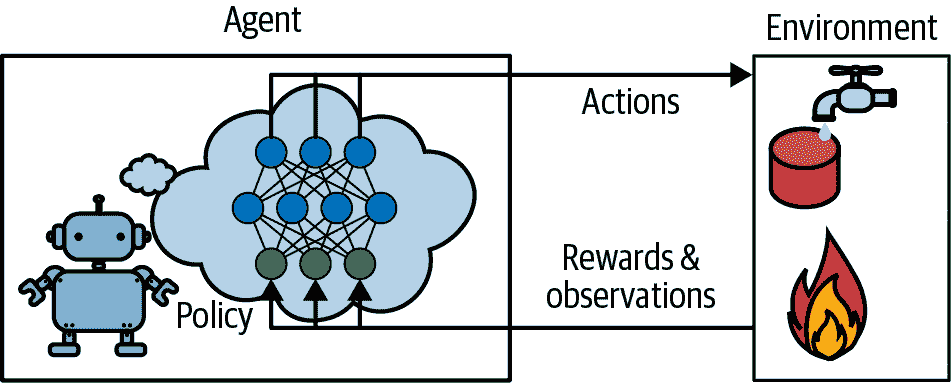
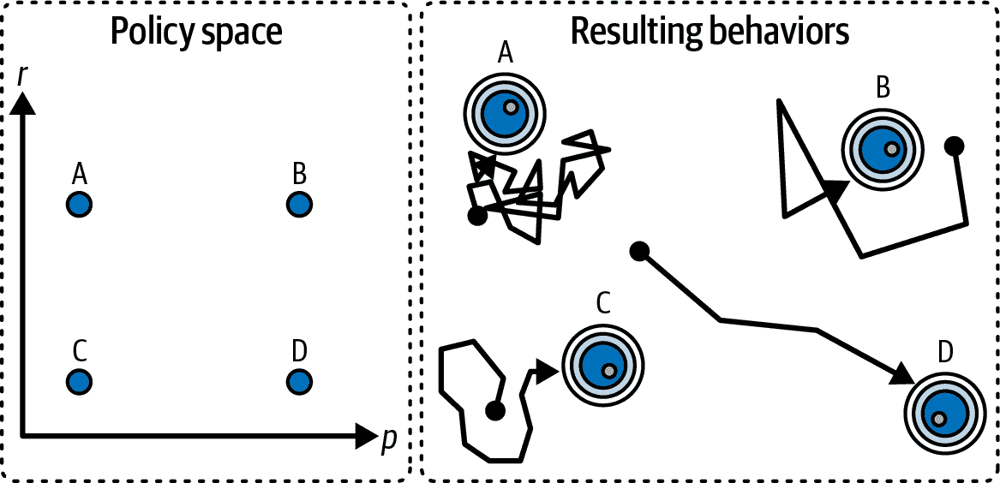

# 第十九章\. 强化学习

*强化学习*（RL）是当今最激动人心的机器学习领域之一，同时也是最古老的领域之一。它自 20 世纪 50 年代以来一直存在，多年来产生了许多有趣的应用，尤其是在游戏（例如，国际跳棋程序 TD-Gammon）和机器控制方面，但很少成为头条新闻。然而，2013 年发生了一场革命，当时来自一家名为 DeepMind 的英国初创公司的研究人员展示了一个可以从零开始学习几乎任何 Atari 游戏的系统，最终在大多数游戏中超过了人类，仅使用原始像素作为输入，并且没有任何关于游戏规则的先验知识。这是一系列惊人壮举中的第一个：

+   2016 年，DeepMind 的 AlphaGo 击败了围棋传奇职业选手李世石；2017 年，它又击败了世界冠军柯洁。没有任何程序曾接近击败这个游戏的宗师，更不用说最顶尖的选手了。

+   2020 年，DeepMind 发布了 AlphaFold，它可以以前所未有的精度预测蛋白质的 3D 形状。这在生物学、化学和医学领域是一次变革。实际上，Demis Hassabis（创始人兼首席执行官）和 John Jumper（总监）因 AlphaFold 获得了诺贝尔化学奖。

+   2022 年，DeepMind 发布了 AlphaCode，它可以生成具有竞技编程水平的代码。

+   2023 年，DeepMind 发布了 GNoME，它可以预测新的晶体结构，包括数十万个预测的稳定材料。

那么，DeepMind 的研究人员是如何实现这一切的呢？嗯，他们将深度学习的力量应用于强化学习领域，结果超出了他们的预期：*深度强化学习*诞生了。今天，尽管 DeepMind 继续引领潮流，但许多其他组织也加入了进来，整个领域充满了新的想法，应用范围广泛。

在本章中，我将首先解释什么是强化学习以及它的优势，然后介绍深度强化学习中最重要的一些技术家族：策略梯度、深度 Q 网络（包括马尔可夫决策过程的讨论），最后是演员-评论家方法，包括流行的 PPO，我们将用它来击败 Atari 游戏。那么，让我们开始吧！

# 什么是强化学习？

在强化学习中，一个软件*代理*在*环境*中做出*观察*和*动作*，并从环境中获得*奖励*。它的目标是学习以最大化其预期奖励的方式行事。如果你不介意一点拟人化，你可以把正奖励看作是快乐，负奖励看作是痛苦（在这种情况下，“奖励”这个词有点误导）。简而言之，代理在环境中行动，并通过试错来学习最大化快乐和最小化痛苦。

这是一个相当广泛的设置，可以应用于各种任务。以下是一些例子（见图 19-1）：

+   代理可以是控制机器人的程序。在这种情况下，环境是现实世界，代理通过一组*传感器*（如摄像头和触觉传感器）观察环境，其动作包括发送信号以激活电机。它可能被编程为每当它接近目标目的地时获得正奖励，而每当它浪费时间或走错方向时获得负奖励。

+   代理可以是控制*Ms. Pac-Man*的程序。在这种情况下，环境是 Atari 游戏的模拟，动作是九个可能的摇杆位置（左上角、向下、中心等），观察是屏幕截图，奖励只是游戏分数。

+   类似地，代理可以是玩围棋等棋类游戏的程序。只有当它获胜时才会获得奖励。

+   代理不需要控制一个物理上（或虚拟上）移动的物体。例如，它可以是智能恒温器，每当它接近目标温度并节省能源时，就会获得正奖励，而当人类需要调整温度时，就会获得负奖励，因此代理必须学会预测人类的需求。

+   代理可以观察股票市场价格，并决定每秒买卖多少。奖励显然是货币的盈亏。

注意，可能根本没有任何正奖励；例如，代理可能在迷宫中移动，每一步都获得负奖励，因此它最好尽快找到出口！强化学习非常适合许多其他任务，例如自动驾驶汽车、推荐系统、在网页上放置广告，或者控制图像分类系统应该关注的地方。


###### 图 19-1\. 强化学习示例：（a）机器人，（b）*Ms. Pac-Man*，（c）围棋选手，（d）恒温器，（e）自动交易员⁠^(6)

现在我们转向强化学习算法的一个大型家族：*策略梯度*。

# 策略梯度

软件代理用来确定其动作的算法被称为其*策略*。策略可以是任何你能想到的算法，例如一个神经网络，它以观察作为输入，并输出要采取的动作（参见图 19-2)）。



###### 图 19-2. 使用神经网络策略的强化学习

策略甚至不必是确定性的。实际上，在某些情况下，它甚至不必观察环境，只要它能获得奖励！例如，考虑一个盲目的机器人吸尘器，其奖励是在 30 分钟内收集的灰尘量。其策略可以是每秒钟以概率*p*向前移动，或者以概率 1 – *p*随机左转或右转。旋转角度将是介于- *r*和+ *r*之间的随机角度。由于这种策略涉及一些随机性，它被称为*随机策略*。机器人将会有一个不规则的轨迹，这保证了它最终会到达它能到达的任何地方并收集所有灰尘。问题是，它在 30 分钟内能收集多少灰尘？

你会如何训练这样的机器人？你可以调整的只有两个*策略参数*：概率*p*和角度范围*r*。一个可能的学习算法是尝试这些参数的许多不同值，并选择表现最好的组合（参见图 19-3)）。这是一个*策略搜索*的例子，在这种情况下使用的是穷举法。当*策略空间*太大（这通常是情况）时，以这种方式找到一组好的参数就像在大堆稻草中寻找一根针一样。

探索政策空间的另一种方法是使用*遗传算法*。例如，你可以随机创建第一代 100 个策略并尝试它们，然后“淘汰”80 个最差的策略⁠^(7)，让 20 个幸存者各自产生 4 个后代。后代是其父母的副本⁠^(8)加上一些随机变异。幸存策略及其后代共同构成了第二代。你可以继续这样迭代通过代数，直到找到好的策略。⁠^(9)



###### 图 19-3. 政策空间中的四个点（左侧）及其对应的代理行为（右侧）

另一种方法是使用优化技术，通过评估奖励相对于策略参数的梯度，然后通过跟随梯度向更高奖励的方向调整这些参数。遵循这种策略的算法被称为 *策略梯度*（PG）算法。但在我们能够实现它们之前，我们首先需要为智能体创建一个生存的环境——因此，现在是介绍 Gymnasium 库的时候了。

## Gymnasium 库简介

强化学习的一个挑战是，为了训练一个智能体，您首先需要一个工作环境。如果您想编写一个学习玩 Atari 游戏的智能体，您将需要一个 Atari 游戏模拟器。如果您想编写一个行走机器人，那么环境就是现实世界，您可以直接在那个环境中训练您的机器人。然而，这有其局限性：如果机器人从悬崖上掉下来，您不能只是点击撤销。您也不能加快时间——增加计算能力不会让机器人移动得更快——并且并行训练 1,000 个机器人通常成本太高。简而言之，在现实世界中训练既困难又缓慢，因此您至少需要一个 *模拟环境* 来进行启动训练。例如，您可能使用 [PyBullet](https://pybullet.org) 或 [MuJoCo](https://mujoco.org) 这样的库来进行 3D 物理模拟。

[Gymnasium 库](https://gymnasium.farama.org)是一个开源工具包，它提供了各种模拟环境（Atari 游戏、棋盘游戏、2D 和 3D 物理模拟等），您可以使用这些环境来训练智能体、比较它们或开发新的强化学习算法。它是 OpenAI Gym 的继任者，现在由一群研究人员和开发者维护。

Gymnasium 预装在 Colab 上，包括 Arcade Learning Environment（ALE）库 `ale_py`，这是一个 Atari 2600 游戏的模拟器，对于所有 Atari 环境都是必需的，以及 Box2D 库，它是用于几个具有 2D 物理的环境所必需的。如果您在自己的机器上编码而不是在 Colab 上，并且您遵循了 [*https://homl.info/install-p*](https://homl.info/install-p) 上的安装说明，那么您应该可以开始了。

首先，让我们导入 Gymnasium 并创建一个环境：

```py
import gymnasium as gym

env = gym.make("CartPole-v1", render_mode="rgb_array", max_episode_steps=1000)
```

在这里，我们创建了一个 CartPole 环境（版本 1）。这是一个 2D 模拟，其中一辆小车可以向左或向右加速，以平衡放置在其顶部的一根杆子（参见图 19-4）——这是一个经典的控制任务。我很快会解释 `render_mode` 和 `max_episode_steps`。

###### 小贴士

`gym.envs.registry` 字典包含了所有可用环境的名称和规范。您可以使用 `gym.pprint_registry()` 打印出一个漂亮的列表。Atari 环境只有在启动 ALE 模拟器后才会可用。


###### 图 19-4\. CartPole 环境

环境创建完成后，您必须使用 `reset()` 方法对其进行初始化，可选地指定一个随机种子。这将返回第一个观察结果。观察结果取决于环境的类型。对于 CartPole 环境，每个观察结果都是一个包含四个浮点数的 NumPy 数组，分别代表小车水平位置（`0.0` = 中间），其速度（正值表示向右），杆的角度（`0.0` = 垂直），以及其角速度（正值表示顺时针）。`reset()` 方法还返回一个可能包含额外环境特定信息的字典。这可以用于调试，有时也用于训练。例如，在许多 Atari 环境中，它包含剩余生命值。然而，在 CartPole 环境中，这个字典是空的：

```py
>>> obs, info = env.reset(seed=42) `>>>` `obs` ``` `array([ 0.0273956 , -0.00611216,  0.03585979,  0.0197368 ], dtype=float32)` `>>>` `info` `` `{}` `` ```py
```

```py```````py`` ``````py````` ```py```````py 让我们调用 `render()` 方法将这个环境渲染成一张图片。由于我们在创建环境时设置了 `render_mode="rgb_array"`，所以图片将以 NumPy 数组的形式返回（然后你可以使用 Matplotlib 的 `imshow()` 函数来显示这张图片）：    ``` >>> img = env.render() `>>>` `img``.``shape`  `# height, width, channels (3 = Red, Green, Blue)` `` `(400, 600, 3)` `` ```py   ``````py``` ``````py`` 现在让我们询问环境有哪些可行的动作：    ``` >>> env.action_space `Discrete(2)` ```py   ``````py` `Discrete(2)` means that the possible actions are integers 0 and 1, which represent accelerating left or right. Other environments may have additional discrete actions, or other kinds of actions (e.g., continuous). Since the pole is leaning toward the right (`obs[2] > 0`), let’s accelerate the cart toward the right:    ``` >>> action = 1  # accelerate right `>>>` `obs``,` `reward``,` `done``,` `truncated``,` `info` `=` `env``.``step``(``action``)` ```py` `>>>` `obs` ``` `array([ 0.02727336,  0.18847767,  0.03625453, -0.26141977], dtype=float32)` `>>>` `reward``,` `done``,` `truncated``,` `info` `` `(1.0, False, False, {})` `` ```py ```` ```py   ``````py ````` ```py` The `step()` method executes the desired action and returns five values:    `obs`      This is the new observation. The cart is now moving toward the right (`obs[1] > 0`). The pole is still tilted toward the right (`obs[2] > 0`), but its angular velocity is now negative (`obs[3] < 0`), so it will likely be tilted toward the left after the next step.      `reward`      In this environment, you get a reward of 1.0 at every step, no matter what you do, so the goal is to keep the episode running for as long as possible. An *episode* is one run of the environment until the game is over or interrupted.      `done`      This value will be `True` when the episode is over. This will happen when the pole tilts too much, or goes off the screen. After that, the environment must be reset before it can be used again.      `truncated`      This value will be `True` when an episode is interrupted early, typically by an environment wrapper that imposes a maximum number of steps per episode (see Gymnasium’s documentation for more details on environment wrappers). By default, the environment specification for CartPole sets the maximum number of steps to 500, but we changed this to 1,000 when we created the environment. Some RL algorithms treat truncated episodes differently from episodes finished normally (i.e., when `done` is `True`), but in this chapter we will treat them identically.      `info`      This environment-specific dictionary may provide extra information, just like the one returned by the `reset()` method.      ###### Tip    Once you have finished using an environment—possibly after many episodes—you should call its `close()` method to free resources.    Let’s hardcode a simple policy that accelerates left when the pole is leaning toward the left and accelerates right when the pole is leaning toward the right. We will run this policy to see the average rewards it gets over 500 episodes:    ``` def basic_policy(obs):     angle = obs[2]     return 0 if angle < 0 else 1  # go left if leaning left, otherwise go right  totals = [] for episode in range(500):     total_rewards = 0     obs, info = env.reset(seed=episode)     while True:  # no risk of infinite loop: will be truncated after 1000 steps         action = basic_policy(obs)         obs, reward, done, truncated, info = env.step(action)         total_rewards += reward         if done or truncated:             break      totals.append(total_rewards) ```py    This code is self-explanatory. Let’s look at the result:    ``` >>> import numpy as np `>>>` `np``.``mean``(``totals``),` `np``.``std``(``totals``),` `min``(``totals``),` `max``(``totals``)` `` `(np.float64(41.698), np.float64(8.389445512070509), 24.0, 63.0)` `` ```py   `` `Even with 500 tries, this policy never managed to keep the pole upright for more than 63 consecutive steps. Not great. If you look at the simulation in this chapter’s notebook, you will see that the cart oscillates left and right more and more strongly until the pole tilts too much. A neural network can do better!` `` ```` ```py`` ``````py ``````py` ``````py`` ``````py``` ``````py```` ```py```````py` ``````py``````  ```py```` ```py``` ````` ## 神经网络策略    让我们创建一个神经网络策略。这个神经网络将观察作为输入，并输出要执行的动作，就像我们之前硬编码的策略一样。更确切地说，它将为每个动作估计一个概率，然后根据估计的概率随机选择一个动作（参见图 19-5）。在 CartPole 环境中，只有两个可行的动作（左或右），所以我们只需要一个输出神经元。它将输出动作 1（右）的概率 *p*，当然动作 0（左）的概率将是 1 – *p*。例如，如果它输出 0.7，那么我们将以 70% 的概率选择动作 1，或者以 30% 的概率选择动作 0（这是一个 *伯努利分布*，*p* = 0.7）。    ###### 图 19-5\. 神经网络策略    你可能会想知道为什么我们根据神经网络给出的概率随机选择动作，而不是直接选择得分最高的动作。这种方法让智能体在探索新动作和利用已知效果良好的动作之间找到正确的平衡。这里有一个类比：假设你第一次去餐厅，所有的菜看起来都同样吸引人，所以你随机选择一个。如果它很好，你可以增加下次点这个菜的概率，但你不应该将这个概率增加到 100%，否则你将永远无法尝试其他菜，其中一些可能比你尝试的更好。这种 *探索/利用困境* 是强化学习中的核心。    还要注意，在这个特定的环境中，由于每个观察都包含环境的完整状态，所以可以安全地忽略过去的行为和观察。如果有某些隐藏状态，那么你可能需要考虑过去的行为和观察。例如，如果环境只揭示了滑车的位置但没有其速度，那么你必须考虑不仅当前的观察，还要以前的观察来估计当前的速度。另一个例子是当观察有噪声时；在这种情况下，你通常想使用过去几项观察来估计最可能的状态。因此，CartPole 问题是最简单的；观察是无噪声的，并且包含环境的完整状态。    让我们使用 PyTorch 为 CartPole 实现一个基本的神经网络策略：    ```py import torch import torch.nn as nn  class PolicyNetwork(nn.Module):     def __init__(self):         super().__init__()         self.net = nn.Sequential(nn.Linear(4, 5), nn.ReLU(), nn.Linear(5, 1))      def forward(self, state):         return self.net(state) ```    由于这是一个相当简单的任务，我们的策略网络是一个很小的 MLP。输入的数量是环境状态的尺寸：在 CartPole 的情况下，它只是单个观察的尺寸，即四个。我们只有一个包含五个单元的隐藏层（在这种情况下不需要更多）。最后，我们想要输出一个单一的概率，所以我们有一个输出神经元。如果有超过两个可能的动作，那么每个动作将有一个输出神经元。为了性能和数值稳定性，我们在最后没有添加 sigmoid 函数，所以网络实际上输出的是 logits 而不是概率。    接下来，让我们定义一个函数，该函数将使用这个策略网络来选择一个动作：    ```py def choose_action(model, obs):     state = torch.as_tensor(obs)     logit = model(state)     dist = torch.distributions.Bernoulli(logits=logit)     action = dist.sample()     log_prob = dist.log_prob(action)     return int(action.item()), log_prob ```    该函数接受一个观察值，将其转换为张量，并将其传递给策略网络以获取动作 1（右）的 logits。然后它创建一个 `Bernoulli` 概率分布，并从中采样一个动作：这个分布将以概率 *p* = exp(logit) / (1 + exp(logit)) 输出 1（右），并以概率 1 – *p* 输出 0（左）。如果有超过两个可能的动作，你将使用 `Categorical` 分布。最后，我们计算采样动作的对数概率（即 log(*p*) 或 log(1 – *p*))：这个对数概率将在训练时需要。    ###### 提示    如果动作空间是连续的，你可以使用高斯分布而不是伯努利或分类分布。策略网络必须预测分布的均值和标准差（或标准差的对数）。标准差的对数通常会被裁剪，以确保分布既不太宽也不太窄。    好的，我们现在有一个神经网络策略，它可以接受环境状态（在这种情况下，单个观察）并选择一个动作。但我们如何训练它呢？    ## 评估动作：信用分配问题    如果我们知道每个步骤的最佳动作是什么，我们可以通过最小化估计概率分布和目标概率分布之间的交叉熵来像往常一样训练神经网络。这将是常规的监督学习。然而，在强化学习中，智能体得到的唯一指导是通过奖励，而奖励通常是稀疏和延迟的。例如，如果智能体设法平衡杆 100 步，它如何知道它所采取的 100 个动作中哪些是好的，哪些是坏的？它唯一知道的是杆在最后一个动作后倒下了，但显然最后一个动作并不完全负责。这被称为 *信用分配问题*：当智能体获得奖励（或惩罚）时，它很难知道哪些动作应该得到信用（或责备）。想象一下一只狗在行为良好数小时后得到奖励；它会理解它为什么被奖励吗？    为了简化信用分配，一个常见的策略是评估动作基于其之后所有奖励的总和，并在每一步应用一个 *折现因子*，_γ*（伽马）。这个折现奖励的总和被称为动作的 *回报*。考虑图 19-6 中的例子。如果智能体连续三次向右移动，并在第一步获得 +10 的奖励，第二步获得 0，最后在第三步获得 –50，那么假设我们使用折现因子 *γ* = 0.8，第一个动作的回报将是 10 + *γ* × 0 + *γ*² × (–50) = –22。    ###### 图 19-6\. 计算动作的回报：折现未来奖励的总和    以下函数根据奖励和折现因子计算回报：    ```py def compute_returns(rewards, discount_factor):     returns = rewards[:]  # copy the rewards     for step in range(len(returns) - 1, 0, -1):         returns[step - 1] += returns[step] * discount_factor      return torch.tensor(returns) ```    这个函数产生预期的结果：    ```py >>> compute_returns([10, 0, -50], discount_factor=0.8) `tensor([-22., -40., -50.])` ```   `如果折现因子接近 0，那么与即时奖励相比，未来的奖励不会太多。相反，如果折现因子接近 1，那么远期奖励将几乎与即时奖励一样重要。典型的折现因子在 0.9 到 0.99 之间。使用折现因子 0.95，13 步之后的奖励大约是即时奖励的一半（因为 0.95¹³ ≈ 0.5），而使用折现因子 0.99，69 步之后的奖励几乎与即时奖励一样重要。在 CartPole 环境中，动作有相当短期的效果，所以选择一个低折现因子 0.95 似乎是合理的，这将有助于信用分配，使训练更快、更稳定。然而，如果折现因子设置得太低，那么智能体将学习到一个次优策略，过分关注短期收益。    现在我们有了评估每个动作的方法，我们就可以使用策略梯度来训练我们的第一个智能体了。让我们看看怎么做。`  ```py`## Solving the CartPole Using Policy Gradients    As discussed earlier, policy gradient algorithms optimize the parameters of a policy by following the gradients toward higher rewards. One popular PG algorithm, called *REINFORCE* (or *Monte Carlo PG*), was [introduced back in 1992 by Ronald Williams](https://homl.info/132).⁠^(11) It has many variants, with various tweaks, but the general principle is this:    1.  First, let the neural network policy play the game for an episode, and record the rewards and estimated log probabilities.           2.  Then compute each action’s return, using the function defined in the previous section.           3.  If an action’s return is positive, it means that the action was probably good, and you want to make this action even more likely to be chosen in the future. Conversely, if an action’s return is negative, you want to make this action *less* likely. To achieve this, you can minimize the REINFORCE loss defined in Equation 19-1: this will maximize the expected discounted rewards.                    ##### Equation 19-1\. REINFORCE loss          <mrow><mi>ℒ</mi> <mrow><mo>(</mo> <mi mathvariant="bold">θ</mi> <mo>)</mo></mrow> <mo>=</mo> <mo>-</mo> <munder><mo>∑</mo> <mi>t</mi></munder> <mrow><mo form="prefix">log</mo> <msub><mi>π</mi> <mi mathvariant="bold">θ</mi></msub> <mrow><mo>(</mo> <msub><mi>a</mi> <mi>t</mi></msub> <mo>|</mo> <msub><mi>s</mi> <mi>t</mi></msub> <mo>)</mo></mrow> <mo>·</mo> <msub><mi>r</mi> <mi>t</mi></msub></mrow></mrow>    In this equation, *π***θ** is the policy network’s estimated probability for action *a*[*t*], given state *s*[*t*] (where *t* is the time step), and *r*[*t*] is the observed return of this action; **θ** represents the model parameters.    Let’s use PyTorch to implement this algorithm. First, we need a function to let the policy network play an episode, and record the rewards and log probabilities:    ``` def run_episode(model, env, seed=None):     log_probs, rewards = [], []     obs, info = env.reset(seed=seed)     while True:  # the environment will truncate the episode if it is too long         action, log_prob = choose_action(model, obs)         obs, reward, done, truncated, _info = env.step(action)         log_probs.append(log_prob)         rewards.append(reward)         if done or truncated:             return log_probs, rewards ```py    The function first resets the environment to start a new episode. For reproducibility, we pass a seed to the `reset()` method. Then comes the game loop: at each iteration, we pass the current environment state (i.e., the last observation) to the `choose_action()` method we defined earlier. It returns the chosen action and its log probability. We then call the environment’s `step()` method to execute the action. This returns a new observation (a NumPy array), a reward, two booleans indicating whether the game is over or truncated, and an info dict (which we can safely ignore in the case of CartPole). We record the log probabilities and rewards in two lists, which we return when the episode is over.    We can finally write the training function:    ``` def train_reinforce(model, optimizer, env, n_episodes, discount_factor):     for episode in range(n_episodes):         seed = torch.randint(0, 2**32, size=()).item()         log_probs, rewards = run_episode(model, env, seed=seed)         returns = compute_returns(rewards, discount_factor)         std_returns = (returns - returns.mean()) / (returns.std() + 1e-7)         losses = [-logp * rt for logp, rt in zip(log_probs, std_returns)]         loss = torch.cat(losses).sum()         optimizer.zero_grad()         loss.backward()         optimizer.step()         print(f"\rEpisode {episode + 1}, Reward: {sum(rewards):.2f}", end=" ") ```py    That’s nice and short, isn’t it? At each training iteration, the function runs an episode and gets the log probabilities and rewards.⁠^(12) Then it computes the return for each action. Next, it standardizes the returns (i.e., it subtracts the mean return and divides by the standard deviation, plus a small value to avoid division by zero). This standardization step is optional but it’s a common and recommended tweak to the REINFORCE algorithm, as it stabilizes training. Next, the function computes the REINFORCE loss using Equation 19-1, and it performs an optimizer step to minimize the loss.    That’s it, we’re ready to build and train a policy network!    ``` torch.manual_seed(42) model = PolicyNetwork() optimizer = torch.optim.NAdam(model.parameters(), lr=0.06) train_reinforce(model, optimizer, env, n_episodes=200, discount_factor=0.95) ```py    Training will take less than a minute. If you run an episode using this policy network, you will see that it perfectly balances the pole. Success!    The simple policy gradients algorithm we just trained solved the CartPole task, but it would not scale well to larger and more complex tasks. Indeed, it is highly *sample inefficient*, meaning it needs to explore the game for a very long time before it can make significant progress. This is because its return estimates are extremely noisy, especially when good actions are mixed with bad ones. However, it is the foundation of more powerful algorithms, such as *actor-critic* algorithms (which we will discuss at the end of this chapter).    ###### Tip    Researchers try to find algorithms that work well even when the agent initially knows nothing about the environment. However, unless you are writing a paper, you should not hesitate to inject prior knowledge into the agent, as it will speed up training dramatically. For example, since you know that the pole should be as vertical as possible, you could add negative rewards proportional to the pole’s angle. This will make the rewards much less sparse and speed up training. Also, if you already have a reasonably good policy (e.g., hardcoded), you may want to train the neural network to imitate it before using policy gradients to improve it.    Moreover, the REINFORCE algorithm is quite unstable: the agent may improve for a while during training, then forget everything catastrophically, learn again, forget, learn, etc. It’s a roller coaster. This is in large part because the training samples are not independent and identically distributed (IID); indeed, the training samples consist of whatever states the agent is capable of reaching right now. As the agent progresses, it explores different parts of the environment, and it can forget everything about other parts. For example, once it learns to properly hold the pole upright, it will no longer see nonvertical poles, and it will totally forget how to handle them. And this issue gets much worse with more complex environments.    ###### Note    Reinforcement learning is notoriously difficult, largely because of the training instabilities and the huge sensitivity to the choice of hyperparameter values and random seeds.⁠^(13) As the researcher Andrej Karpathy put it, “[Supervised learning] wants to work. […​] RL must be forced to work”. You will need time, patience, perseverance, and perhaps a bit of luck, too. This is a major reason RL is not as widely adopted as regular deep learning.    We will now look at another popular family of algorithms: *value-based methods*.```` ```py`` ``````py ``````py`  ``````py`` ``````py` ``````py # Value-Based Methods    Whereas PG algorithms directly try to optimize the policy to increase rewards, value-based methods are less direct: the agent learns to estimate the value of each state (i.e., the expected return), or the value of each action in a given state, then it uses this knowledge to decide how to act. To understand these algorithms, we must first discuss *Markov decision processes* (MDPs).    ## Markov Decision Processes    In the early 20th century, the mathematician Andrey Markov studied stochastic processes with no memory, called *Markov chains*. Such a process has a fixed number of states, and it randomly evolves from one state to another at each step. The probability for it to evolve from a state *s* to a state *s*′ is fixed, and it depends only on the pair (*s*, *s*′), not on past states. This is why we say that the system has no memory.    Figure 19-7 shows an example of a Markov chain with four states.    ###### Figure 19-7\. Example of a Markov chain    Suppose that the process starts in state *s*[0], and there is a 70% chance that it will remain in that state at the next step. Eventually it is bound to leave that state and never come back, because no other state points back to *s*[0]. If it goes to state *s*[1], it will then most likely go to state *s*[2] (90% probability), then immediately back to state *s*[1] (with 100% probability). It may alternate a number of times between these two states, but eventually it will fall into state *s*[3] and remain there forever, since there’s no way out: this is called a *terminal state*. Markov chains can have very different dynamics, and they are frequently used in thermodynamics, chemistry, statistics, and much more.    Markov decision processes were first described in the 1950s by [Richard Bellman](https://homl.info/133).⁠^(14) They resemble Markov chains, but with a twist: at each step, an agent can choose one of several possible actions, and the transition probabilities depend on the chosen action. Moreover, some state transitions return some reward (positive or negative), and the agent’s goal is to find a policy that will maximize its cumulative reward over time.    For example, the MDP represented in Figure 19-8 has three states (represented by circles) and up to three possible discrete actions at each step (represented by diamonds).    ###### Figure 19-8\. Example of a Markov decision process    If it starts in state *s*[0], the agent can choose among actions *a*[0], *a*[1], or *a*[2]. If it chooses action *a*[1], it just remains in state *s*[0] with certainty and without any reward. It can thus decide to stay there forever if it wants to. But if it chooses action *a*[0], it has a 70% probability of gaining a reward of +10 and remaining in state *s*[0]. It can then try again and again to gain as much reward as possible, but at one point it is going to end up instead in state *s*[1]. In state *s*[1] it has only two possible actions: *a*[0] or *a*[2]. It can choose to stay put by repeatedly choosing action *a*[0], or it can choose to move on to state *s*[2] and get a negative reward of –50 (ouch). In state *s*[2] it has no choice but to take action *a*[1], which will most likely lead it back to state *s*[0], gaining a reward of +40 on the way. You get the picture. By looking at this MDP, can you guess which strategy will gain the most reward over time? In state *s*[0] it is clear that action *a*[0] is the best option, and in state *s*[2] the agent has no choice but to take action *a*[1], but in state *s*[1] it is not obvious whether the agent should stay put (*a*[0]) or go through the fire (*a*[2]).    Bellman found a way to estimate the *optimal state value* of any state *s*, denoted *V**(*s*), which is the sum of all discounted future rewards the agent can expect on average starting from state *s*, assuming it acts optimally. He showed that if the agent acts optimally, then the *Bellman optimality equation* applies (see Equation 19-2). This recursive equation says that if the agent acts optimally, then the optimal value of the current state is equal to the reward it will get on average after taking one optimal action, plus the expected optimal value of all possible next states that this action can lead to.    ##### Equation 19-2\. Bellman optimality equation  $upper V Superscript asterisk Baseline left-parenthesis s right-parenthesis equals max Underscript a Endscripts sigma-summation Underscript s Superscript prime Baseline Endscripts upper T left-parenthesis s comma a comma s Superscript prime Baseline right-parenthesis left-bracket upper R left-parenthesis s comma a comma s Superscript prime Baseline right-parenthesis plus gamma dot upper V Superscript asterisk Baseline left-parenthesis s Superscript prime Baseline right-parenthesis right-bracket for all s$  In this equation:    *   *T*(*s*, *a*, *s*′) is the transition probability from state *s* to state *s*′, given that the agent chose action *a*. For example, in Figure 19-8, *T*(*s*[2], *a*[1], *s*[0]) = 0.8\. Note that $sigma-summation Underscript s Superscript prime Baseline Endscripts upper T left-parenthesis s comma a comma s Superscript prime Baseline right-parenthesis equals 1$ .           *   *R*(*s*, *a*, *s*′) is the reward that the agent gets when it goes from state *s* to state *s*′, given that the agent chose action *a*. For example, in Figure 19-8, *R*(*s*[2], *a*[1], *s*[0]) = +40.           *   *γ* is the discount factor.              ###### Note    In the Bellman equation and the rest of this chapter, an optimal policy is one that maximizes the expected sum of *discounted* future rewards: this means that it depends on the discount factor *γ*. However, in real-world tasks we’re generally more interested in the expected sum of rewards per episode, without any discount (in fact, that’s usually how we evaluate agents). To approach this goal, we usually choose a discount factor close to 1 (but not too close or else training becomes slow and unstable).    This equation leads directly to an algorithm that can precisely estimate the optimal state value of every possible state: first initialize all the state value estimates to zero, and then iteratively update them using the *value iteration* algorithm (see Equation 19-3). A remarkable result is that, given enough time, these estimates are guaranteed to converge to the optimal state values, corresponding to the optimal policy.    ##### Equation 19-3\. Value iteration algorithm  $upper V Subscript k plus 1 Baseline left-parenthesis s right-parenthesis left-arrow max Underscript a Endscripts sigma-summation Underscript s Superscript prime Baseline Endscripts upper T left-parenthesis s comma a comma s Superscript prime Baseline right-parenthesis left-bracket upper R left-parenthesis s comma a comma s Superscript prime Baseline right-parenthesis plus gamma dot upper V Subscript k Baseline left-parenthesis s Superscript prime Baseline right-parenthesis right-bracket for all s$  In this equation, *V**k* is the estimated value of state *s* at the *k*^(th) iteration of the algorithm.    ###### Note    This algorithm is an example of *dynamic programming*, which breaks down a complex problem into tractable subproblems that can be tackled iteratively.    Knowing the optimal state values can be useful, in particular to evaluate a policy, but it does not give us the optimal policy for the agent. Luckily, Bellman found a very similar algorithm to estimate the optimal *state-action values*, generally called *Q-values* (quality values). The optimal Q-value of the state-action pair (*s*, *a*), denoted *Q**(*s*, *a*), is the sum of discounted future rewards the agent can expect on average starting from state *s* if it chooses action *a*, but before it sees the outcome of this action, assuming it acts optimally after that action.    Let’s look at how it works. Once again, you start by initializing all the Q-value estimates to zero, then you update them using the *Q-value iteration* algorithm (see Equation 19-4).    ##### Equation 19-4\. Q-value iteration algorithm  $upper Q Subscript k plus 1 Baseline left-parenthesis s comma a right-parenthesis left-arrow sigma-summation Underscript s Superscript prime Baseline Endscripts upper T left-parenthesis s comma a comma s Superscript prime Baseline right-parenthesis left-bracket upper R left-parenthesis s comma a comma s Superscript prime Baseline right-parenthesis plus gamma dot max Underscript a Superscript prime Baseline Endscripts upper Q Subscript k Baseline left-parenthesis s prime comma a Superscript prime Baseline right-parenthesis right-bracket for all left-parenthesis s comma a right-parenthesis$  Once you have the optimal Q-values, defining the optimal policy, denoted *π*^*(*s*), is trivial: when the agent is in state *s*, it should choose the action with the highest Q-value for that state. The fancy math notation for this is $pi Superscript asterisk Baseline left-parenthesis s right-parenthesis equals argmax Underscript a Endscripts upper Q Superscript asterisk Baseline left-parenthesis s comma a right-parenthesis$ .    Let’s apply this algorithm to the MDP represented in Figure 19-8. First, we need to define the MDP:    ``` transition_probabilities = [  # shape=[s, a, s']     [[0.7, 0.3, 0.0], [1.0, 0.0, 0.0], [0.8, 0.2, 0.0]],     [[0.0, 1.0, 0.0], None, [0.0, 0.0, 1.0]],     [None, [0.8, 0.1, 0.1], None] ] rewards = [  # shape=[s, a, s']     [[+10, 0, 0], [0, 0, 0], [0, 0, 0]],     [[0, 0, 0], [0, 0, 0], [0, 0, -50]],     [[0, 0, 0], [+40, 0, 0], [0, 0, 0]] ] possible_actions = [[0, 1, 2], [0, 2], [1]] ```py    For example, to know the transition probability of going from *s*[2] to *s*[0] after playing action *a*[1], we will look up `transition_probabilities[2][1][0]` (which is 0.8). Similarly, to get the corresponding reward, we will look up `rewards[2][1][0]` (which is +40). And to get the list of possible actions in *s*[2], we will look up `possible_actions[2]` (in this case, only action *a*[1] is possible). Next, we must initialize all the Q-values to zero (except for the impossible actions, for which we set the Q-values to –∞):    ``` Q_values = np.full((3, 3), -np.inf)  # -np.inf for impossible actions for state, actions in enumerate(possible_actions):     Q_values[state, actions] = 0.0  # for all possible actions ```py    Now let’s run the Q-value iteration algorithm. It applies Equation 19-4 repeatedly, to all Q-values, for every state and every possible action:    ``` gamma = 0.90  # the discount factor  for iteration in range(50):     Q_prev = Q_values.copy()     for s in range(3):         for a in possible_actions[s]:             Q_values[s, a] = np.sum([                     transition_probabilities[s][a][sp]                     * (rewards[s][a][sp] + gamma * Q_prev[sp].max())                 for sp in range(3)]) ```py    That’s it! The resulting Q-values look like this:    ``` >>> Q_values `array([[18.91891892, 17.02702702, 13.62162162],`  `[ 0\.        ,        -inf, -4.87971488],`  `[       -inf, 50.13365013,        -inf]])` ```py   ```` 例如，当智能体处于状态 *s*[0] 并选择动作 *a*[1] 时，期望的折现未来奖励总和大约是 17.0。    对于每个状态，我们可以找到具有最高 Q 值的动作：    ```py >>> Q_values.argmax(axis=1)  # optimal action for each state `array([0, 0, 1])` ```   `这给出了使用折现因子 0.90 的 MDP 的最优策略：在状态 *s*[0] 选择动作 *a*[0]，在状态 *s*[1] 选择动作 *a*[0]（即保持不动），在状态 *s*[2] 选择动作 *a*[1]（唯一可能的动作）。有趣的是，如果我们增加折现因子到 0.95，最优策略就会改变：在状态 *s*[1] 中，最佳动作变为 *a*[2]（穿过火焰！）。这很有道理，因为你对未来奖励的重视程度越高，你越愿意为了未来的幸福而忍受一些痛苦。` ```py`  ````` ```py`## Temporal Difference Learning    Reinforcement learning problems with discrete actions can often be modeled as Markov decision processes, but the agent initially has no idea what the transition probabilities are (it does not know *T*(*s*, *a*, *s*′)), and it does not know what the rewards are going to be either (it does not know *R*(*s*, *a*, *s*′)). It must experience each state and each transition at least once to know the rewards, and it must experience them multiple times if it is to have a reasonable estimate of the transition probabilities.    The *temporal difference (TD) learning* algorithm is very similar to the Q-value iteration algorithm, but tweaked to take into account the fact that the agent has only partial knowledge of the MDP. In general we assume that the agent initially knows only the possible states and actions, and nothing more. The agent uses an *exploration policy*—for example, a purely random policy—to explore the MDP, and as it progresses, the TD learning algorithm updates the estimates of the state values based on the transitions and rewards that are actually observed (see Equation 19-5).    ##### Equation 19-5\. TD learning algorithm  $StartLayout 1st Row 1st Column upper V Subscript k plus 1 Baseline left-parenthesis s right-parenthesis 2nd Column left-arrow left-parenthesis 1 minus alpha right-parenthesis upper V Subscript k Baseline left-parenthesis s right-parenthesis plus alpha left-parenthesis r plus gamma dot upper V Subscript k Baseline left-parenthesis s prime right-parenthesis right-parenthesis 2nd Row 1st Column or comma 2nd Column equivalently colon 3rd Row 1st Column upper V Subscript k plus 1 Baseline left-parenthesis s right-parenthesis 2nd Column left-arrow upper V Subscript k Baseline left-parenthesis s right-parenthesis plus alpha dot delta Subscript k Baseline left-parenthesis s comma r comma s Superscript prime Baseline right-parenthesis 4th Row 1st Column with 2nd Column delta Subscript k Baseline left-parenthesis s comma r comma s Superscript prime Baseline right-parenthesis equals r plus gamma dot upper V Subscript k Baseline left-parenthesis s prime right-parenthesis minus upper V Subscript k Baseline left-parenthesis s right-parenthesis EndLayout$  In this equation:    *   *α* is the learning rate (e.g., 0.01).           *   *r* + *γ* · *V**k* is called the *TD target*.           *   *δ**k* is called the *TD error*.              A more concise way of writing the first form of this equation is to use the notation $a left-arrow Underscript alpha Endscripts b$ , which means *a*[*k*+1] ← (1 – *α*) · *a*[*k*] + *α* ·*b*[*k*]. So the first line of Equation 19-5 can be rewritten like this: $upper V left-parenthesis s right-parenthesis left-arrow Underscript alpha Endscripts r plus gamma dot upper V left-parenthesis s prime right-parenthesis$ .    ###### Tip    TD learning has many similarities with stochastic gradient descent, including the fact that it handles one sample at a time. Moreover, just like SGD, it can only truly converge if you gradually reduce the learning rate; otherwise, it will keep bouncing around the optimum Q-values.    For each state *s*, this algorithm keeps track of a running average of the immediate rewards the agent gets upon leaving that state, plus the rewards it expects to get later, assuming it acts optimally.    ## Q-Learning    Similarly, the Q-learning algorithm is an adaptation of the Q-value iteration algorithm to the situation where the transition probabilities and the rewards are initially unknown (see Equation 19-6). Q-learning works by watching an agent play (e.g., randomly) and gradually improving its estimates of the Q-values. Once it has accurate Q-value estimates (or close enough), then the optimal policy is to choose the action that has the highest Q-value (i.e., the greedy policy).    ##### Equation 19-6\. Q-learning algorithm  $upper Q left-parenthesis s comma a right-parenthesis left-arrow Underscript alpha Endscripts r plus gamma dot max Underscript a Superscript prime Baseline Endscripts upper Q left-parenthesis s prime comma a prime right-parenthesis$  For each state-action pair (*s*, *a*), this algorithm keeps track of a running average of the rewards *r* the agent gets upon leaving the state *s* with action *a*, plus the sum of discounted future rewards it expects to get. To estimate this sum, we take the maximum of the Q-value estimates for the next state *s*′, since we assume that the target policy will act optimally from then on.    Let’s implement the Q-learning algorithm. First, we will need to make an agent explore the environment. For this, we need a step function so that the agent can execute one action and get the resulting state and reward:    ``` def step(state, action):     probas = transition_probabilities[state][action]     next_state = np.random.choice([0, 1, 2], p=pro
