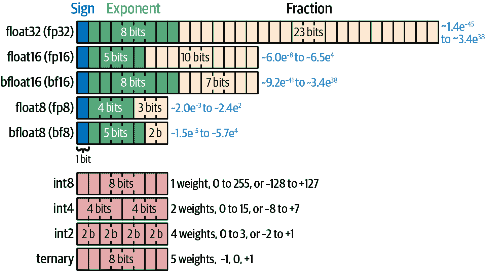
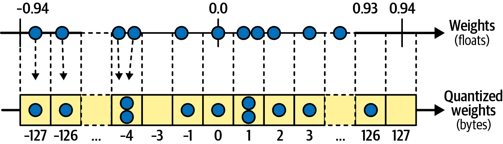

# 附录 B. 混合精度和量化

默认情况下，PyTorch 使用 32 位浮点数来表示模型参数：每个参数 4 个字节。如果你的模型有 10 亿个参数，那么你至少需要 4GB 的 RAM 来存储模型。在推理时，你需要足够的 RAM 来存储激活，在训练时，你需要足够的 RAM 来存储所有中间激活（用于反向传播），以及存储优化器参数（例如，Adam 为每个模型参数需要两个额外的参数——这额外需要 8GB）。这需要大量的 RAM，而且还需要大量的时间在 CPU 和 GPU 之间传输数据，更不用说存储空间、下载时间和能耗了。

那么，我们如何减小模型的大小呢？一个简单的选择是使用降低精度的浮点数表示——通常是 16 位浮点数而不是 32 位浮点数。如果你训练一个 32 位模型，然后在训练后将其缩小到 16 位，其大小将减半，对质量的影响很小。太棒了！

然而，如果你尝试使用 16 位浮点数训练模型，你可能会遇到收敛问题，正如我们将看到的。因此，一个常见的策略是*混合精度训练*（MPT），在训练过程中保持权重和权重更新为 32 位精度，但其余的计算使用 16 位精度。训练完成后，我们将权重缩小到 16 位。

最后，为了进一步缩小模型，你可以使用*量化*：参数被离散化，并以 8 位整数表示，甚至可以更少，如 4 位整数。这比较困难，并且会稍微降低模型的质量，但它可以将模型大小减少 4 倍或更多，并显著提高速度。

在本附录中，我们将介绍降低精度、混合精度训练和量化。但要完全理解这些，我们首先必须讨论机器学习中常见的数字表示。

# 常见数字表示

默认情况下，PyTorch 使用基于*IEEE 浮点算术标准*（IEEE 754）的 32 位浮点数来表示权重和激活，该标准规定了浮点数在内存中的表示方式。这是一个灵活且高效的格式，可以表示极小的值和极大的值，以及±0、⁠^(1) ±infinity 和 NaN（即非数字）等特殊值。

float32 数据类型（简称 fp32）可以容纳从±1.4e^(–45)到±3.4e³⁸的数值。它在图 B-1 的顶部表示。第一个比特位确定*符号* *S*：0 表示正数，1 表示负数。接下来的 8 位包含*指数* *E*，范围从 0 到 255。最后 23 位代表*分数* *F*，范围从 0 到 2²³ – 1。以下是计算值的方法：

+   如果 *E* 在 1 和 254 之间，则该数字称为 *规范化*：这是最常见的情况。在这种情况下，值 *v* 可以通过 *v* = (–1)^(*S*)⋅2^(*E*–127)⋅(1 + *F*⋅2^(–23)) 来计算。最后一个项 (1 + *F*⋅2^(–23)) 对应于最高有效位，因此称为 *尾数*。

+   如果 *E* = 0 且 *F* > 0，则该数字称为 *次规范化*：它用于表示极小的值。⁠^(2) 在这种情况下，*v* = (–1)^(*S*)⋅2^(*E*+1–127)⋅(0 + *F*⋅2^(–23)) = (–1)^(*S*)⋅*F*⋅2^(–149)。

+   如果 *E* = 0 且 *F* = 0，则 *v* = ±0。

+   如果 *E* = 255 且 *F* > 0，则 *v* = NaN。

+   如果 *E* = 255 且 *F* = 0，则 *v* = ±infinity。

图 B-1 中表示的其他浮点数格式仅通过指数和分数使用的位数不同。例如，float16 使用 5 位用于指数（即，范围从 0 到 31）和 10 位用于分数（范围从 0 到 1,023），而 float8 使用 4 位用于指数（从 0 到 15）和 3 位用于分数，因此通常表示为 fp8 E4M3。⁠^(3) 计算值的方程相应调整，例如规范化 float16 值通过 *v* = (–1)^(*S*)⋅2^(*E*–15)⋅(1 + *F*⋅2^(–10)) 来计算。



###### 图 B-1\. 机器学习中的常见数字表示

bfloat16 和 bfloat8 格式由 Google Brain 提出（因此有 *b*），它们提供了更宽的数值范围，但代价是精度显著降低。我们稍后会回到这一点。

整数通常使用 64 位表示，对于无符号整数，值范围从 0 到 2⁶⁴ – 1（约 1.8e¹⁹），对于有符号整数，范围从 –2³² 到 2³² – 1（约 ±4.3e⁹）。根据用例，整数也经常使用 32 位、16 位或 8 位表示。在 图 B-1 中，我只表示了经常用于量化的整数类型，例如 8 位整数（可以是无符号或带符号）。

当量化到 4 位时，我们通常每字节打包 2 个权重，当量化到 2 位时，我们每字节打包 4 个权重。甚至可以将量化降低到三进制值，其中每个权重只能等于 –1、0 或 +1。在这种情况下，通常每字节存储 5 个权重。例如，字节 178 可以写作 20121（三进制），因为 178 = 2⋅3⁴ + 0⋅3³ + 1⋅3² + 2⋅3¹ + 1⋅3⁰），如果我们从每个数字中减去 1，我们得到 1、–1、0、1、0：这些是存储在这个单一字节中的 5 个三进制权重。由于 3⁵ = 243，小于 256，我们可以将五个三进制值放入一个字节中。这种格式平均每个权重只使用 1.6 位，这比使用 32 位浮点数少 20 倍！

从技术上讲，可以将权重量化到每个位只有一位，每字节存储 8 个权重：每个位代表一个等于-1 或+1（有时是 0 或 1）的权重。然而，使用如此严重的量化很难获得合理的精度。

如你所见，PyTorch 的默认权重表示（32 位浮点数）与其他表示相比占用*很多*空间：我们有相当大的空间来缩小我们的模型！让我们从将精度从 32 位降低到 16 位开始。

# 精度降低的模型

如果你有一个 32 位的 PyTorch 模型，你可以通过调用模型的`half()`方法将所有参数转换为 16 位浮点数——这被称为*半精度*：

```py
import torch
import torch.nn as nn

model = nn.Sequential(nn.Linear(10, 100), nn.ReLU(), nn.Linear(100, 1))
# [...] pretend the 32-bit model is trained here
model.half()  # convert the model parameters to half precision (16 bits)
```

这是一个快速简单的方法，通常不会对模型的质量产生太大影响，可以将训练模型的尺寸减半。此外，由于许多 GPU 具有 16 位浮点优化，并且 CPU 和 GPU 之间的数据传输量将减少，因此模型通常可以运行得快近两倍。

###### 小贴士

当使用 Transformers 库的`from_pretrained()`方法下载预训练模型时，你可以设置`dtype="auto"`让库为你选择硬件的最佳浮点表示。

要使用该模型，你现在需要给它提供 16 位输入，它也将输出 16 位输出：

```py
X = torch.rand(3, 10, dtype=torch.float16)  # some 16-bit input
y_pred = model(X)  # 16-bit output
```

但如果你想在一开始就构建和训练一个 16 位模型呢？在这种情况下，你可以在创建张量或具有参数的模块时设置`dtype=torch.float16`，例如：

```py
model = nn.Sequential(nn.Linear(10, 100, dtype=torch.float16), nn.ReLU(),
                      nn.Linear(100, 1, dtype=torch.float16))
```

###### 小贴士

如果你希望避免在所有地方重复`dtype=torch.float16`，那么你可以通过使用`torch.set_default_dtype(torch.float16)`将默认数据类型设置为`torch.float16`。请注意：这将对之后创建的所有张量和模块生效。

然而，降低精度可能会在训练过程中引起一些问题。确实，16 位浮点数有一个有限的*动态范围*（即最大和最小可表示的正值之间的比率）：最小的可表示的正值大约是 0.00000006（即 6.0e^(–8)），而最大的是 65,504（即~6.5e⁴）。这意味着任何小于~6.0e^(–8)的梯度更新都会*下溢*，意味着它将被舍入到零，因此会被忽略。相反，任何大于~6.5e⁴的值都会*上溢*，意味着它将被舍入到无穷大，导致训练失败（一旦某些权重变为无穷大，损失将变为无穷大或 NaN）。

为了避免下溢，一种解决方案是将损失乘以一个很大的因子（例如，乘以 256）：这将自动在反向传播期间将梯度乘以相同的因子，从而防止它们小于最小的 16 位可表示值。然而，在执行优化器步骤之前，你必须将梯度缩小回原来的规模，这时你可能会遇到下溢。此外，如果你将损失放大得太多，你可能会遇到上溢。

如果你找不到一个好的缩放因子来避免下溢和上溢，你可以尝试使用`torch.bfloat16`而不是`torch.float16`，因为 bfloat16 有更多的指数位：最小值约为~9.2e^(–41)，最大值约为~3.4e³⁸，因此不太可能忽略任何显著的梯度更新，或者将合理的值四舍五入到无穷大。

然而，bfloat16 在历史上硬件支持较少（尽管这种情况正在改善），并且它提供的分数位较少，这可能导致当相应的参数值非常大时，一些梯度更新被忽略，导致训练停滞。例如，如果梯度更新是 4.5e^(–2)（即 0.045）且相应的参数值等于 1.23e²（即 123），那么总和应该是 1.23045e²（即 123.045），但 bfloat16 没有足够的分数位来存储所有这些数字，因此它必须将结果四舍五入到 1.23e²（即 123）：正如你所见，梯度更新被完全忽略。使用常规的 16 位浮点数，结果将是 123.0625，这并不完全正确，因为浮点精度错误，但至少参数向正确的方向迈出了一步。话虽如此，如果梯度更新稍微小一点（例如，0.03），即使在常规 16 位浮点精度下也会被忽略。

因此，如果你尝试了 float16 和 bfloat16，但在训练过程中仍然遇到收敛问题，那么你可以尝试使用*混合精度训练*。

# 混合精度训练

[*混合精度训练*（MPT）](https://homl.info/mpt)是由百度和 Nvidia 研究人员在 2017 年提出的，⁠^(4)，旨在解决 16 位训练中经常遇到的问题。以下是它的工作原理：

+   MPT 将模型参数的主要副本存储为 32 位浮点数，并在每次训练迭代中创建这些模型参数的 16 位副本（参见图 B-2 中的步骤 1），并使用它们进行正向传递（步骤 2）。

+   然后，损失被放大一个很大的因子（步骤 3），以避免下溢，正如我们之前讨论的那样。

+   最后，我们切换回 32 位精度以将梯度缩放回原来的大小：这种更高的精度可以避免下溢的风险。接下来，我们使用梯度执行一个优化器步骤，改进主要参数（步骤 5）。在 32 位精度下执行实际的优化器步骤确保了当应用于较大的参数值时，小的权重更新不会被忽略，因为 32 位浮点数有非常大的分数部分（23 位）。


###### 图 B-2\. 混合精度训练

MPT 提供了 16 位训练几乎所有的优点，而没有不稳定性。然而，由于每次训练迭代中的 16 位复制，模型参数比 32 位训练多占用 50%的空间，那么这有什么好处呢？嗯，在训练过程中，大部分 RAM 用于存储激活，而不是模型参数，所以实际上 MPT 只需要比常规 32 位训练多一点点 RAM。而且它通常运行速度快一倍。此外，一旦训练完成，我们就不再需要 32 位参数，我们可以将它们转换为 16 位，从而得到一个纯 16 位模型。

###### 警告

MPT 并不总是加速训练：这取决于模型、批量大小和硬件。尽管如此，大多数大型 Transformer 都是使用 MPT 进行训练的。

而不是通过试错找到最佳缩放因子，你可以先以 32 位精度运行训练一段时间（假设你有足够的 RAM），并测量梯度统计信息以找到适合你任务的最佳缩放因子：它应该足够大以避免下溢，同时足够小以避免上溢。

或者，你的训练脚本可以在训练过程中动态调整因子：如果某些梯度是无穷大或 NaN，这意味着发生了溢出，因此必须减少（例如减半）因子，并跳过训练步骤，但如果未检测到溢出，则缩放因子可以逐渐增加（例如每 2,000 个训练步骤加倍）。PyTorch 提供了一个`torch.amp.GradScaler`类来实现这种方法，并且还会适当地调整学习率。

PyTorch 还提供了一个`torch.autocast()`函数，它返回一个上下文，在该上下文中许多操作将自动以 16 位精度运行。这包括通常从 16 位精度中受益最大的操作，如矩阵乘法和卷积，但不包括像 reductions（例如`torch.sum()`）这样的操作，因为这些操作以半精度运行不会带来显著的好处，并且可能会损害精度。

让我们更新我们的训练函数，在 autocast 上下文中运行前向传递，并使用`GradScaler`动态缩放损失：

```py
from torch.amp import GradScaler

def train_mpt(model, optimizer, criterion, train_loader, n_epochs,
              dtype=torch.float16, init_scale=2.0**16):
    grad_scaler = GradScaler(device=device, init_scale=init_scale)
    model.train()
    for epoch in range(n_epochs):
        for X_batch, y_batch in train_loader:
            X_batch, y_batch = X_batch.to(device), y_batch.to(device)
            with torch.autocast(device_type=device, dtype=dtype):
                y_pred = model(X_batch)
                loss = criterion(y_pred, y_batch)
            grad_scaler.scale(loss).backward()
            grad_scaler.step(optimizer)
            grad_scaler.update()
            optimizer.zero_grad()
```

###### 小贴士

当使用 Hugging Face Transformers 库微调 Transformer 时，你可以在`TrainingArguments`中将`fp16=True`或`bf16=True`设置为激活混合精度训练。

将精度降低到 16 位通常效果很好，但我们能否进一步缩小我们的模型？是的，我们可以，使用量化技术。

# 量化

量化意味着将连续值映射到离散值。在深度学习中，这通常涉及将参数，以及通常激活，从浮点数转换为整数——通常是 32 位浮点数到 8 位整数。更普遍地，目标是通过减少参数（以及通常激活）中使用的位数来缩小和加速我们的模型。此外，一些嵌入式设备（例如，ARM Cortex-M0）根本不支持浮点运算（部分是为了降低成本和能耗），因此模型在可以在设备上使用之前必须完全量化（包括权重和激活）。现代智能手机支持浮点运算，但仍然可以从量化中受益很大：int8 运算比 FP32 快 2 到 4 倍，并且能耗低 5 到 10 倍。

最简单的方法是 *线性量化*，因此我们现在将讨论它。我们将在本附录的后面讨论一些非线性量化方法。

## 线性量化

线性量化可以追溯到 20 世纪 50 年代的数字信号处理，但自从过去十年模型变得巨大，而我们又希望在手机和其他有限设备上运行它们，它变得尤为重要。它有两种变体：非对称和对称。在 *非对称线性量化* 中，浮点值被简单地线性映射到无符号字节，其值范围从 0 到 255（或者更普遍地，当量化到 *n*-位整数时，从 0 到 2^(*n*) – 1）。例如，如果权重范围在 *a* = –0.1 和 *b* = 0.6 之间，那么浮点数 –0.1 将被映射到字节 0，浮点数 0.0 将被映射到整数 36，0.1 到 72，…，0.6 到 255，并且更普遍地，浮点张量 **w** 将被映射到整数张量 **q**，使用 方程 B-1。

##### 方程 B-1\. 非对称线性量化

$StartLayout 1st Row 1st Column q Subscript i 2nd Column equals round left-parenthesis StartFraction w Subscript i Baseline Over s EndFraction right-parenthesis plus z 2nd Row 1st Column with s 2nd Column equals StartFraction b minus a Over 2 Superscript n Baseline minus 1 EndFraction and z equals minus round left-parenthesis StartFraction a Over s EndFraction right-parenthesis 3rd Row 1st Column where a 2nd Column equals min Underscript i Endscripts w Subscript i Baseline and b equals max Underscript i Endscripts w Subscript i Baseline EndLayout$

在这个方程中：

+   *w*[*i*] 是原始张量 **w** 中的第 *i* 个浮点数。

+   *q*[i] 是量化张量 **q** 中的第 *i* 个整数。它被限制在 0 和 2^(*n*) – 1 之间（例如，对于 8 位量化，为 255）。

+   *s* 是 *量化比例*. 注意，一些作者将其定义为 1 / *s* 并相应地调整方程（即，他们乘以而不是除以）。

+   *z* 是 *量化偏置* 或 *零点*。

+   *a* 是 **w** 的最小值，而 *b* 是 **w** 的最大值。

对于权重，[*a*，*b*] 的范围是已知的，因为它们的值在训练后不会改变。然而，激活值的范围取决于我们输入到模型中的输入。因此，对于我们要量化的每个激活（例如，每层的输入），我们可能必须为每个新的输入批次动态计算 *a* 和 *b*（这称为 *动态量化*）或者运行一个校准数据集一次通过模型来确定激活值的典型范围，然后使用这个范围来量化所有后续批次的激活（这称为 *静态量化*）。静态量化更快但精度较低。

要从量化值 *q*[*i*] 近似恢复原始值 *w*[*i*]，我们可以计算 *w*[*i*] ≈ s × (*q*[*i*] – *z*)。这被称为 *反量化*。例如，如果 *q*[*i*] = 72，那么我们得到 *w*[*i*] ≈ 0.0988，这确实接近 0.1。反量化值（0.0988）与原始值（0.1）之间的差异称为 *量化噪声*：在 8 位量化中，量化噪声通常会导致略微降低的精度。在 6 位、4 位或更少的情况下，量化噪声可能会造成更大的伤害，尤其是因为它具有累积效应：网络越深，影响越强。

###### 注意

方程 B-1 保证任何等于 0.0 的浮点数都可以精确地量化并反量化回 0.0：确实，如果 *w*[*i*] = 0.0，则 *q*[*i*] = *z*，反量化 *q*[*i*] 会得到 *w*[*i*] = *s* × (*z* – *z*) = 0.0。这对于许多权重为零的稀疏模型特别有用。当使用 ReLU 等产生许多零激活的激活函数时，这也非常重要。

在 PyTorch 中，`torch.quantize_per_tensor()` 函数允许你创建一个量化张量：这是一种特殊的张量，它包含量化值（即整数）以及量化参数（即缩放和零点）。让我们使用这个函数来量化一个张量，然后对其进行反量化。在这个例子中，我们将使用数据类型 `torch.quint8`，它使用 8 位无符号整数：

```py
>>> w = torch.tensor([0.1, -0.1, 0.6, 0.0])  # 32-bit floats
>>> s = (w.max() - w.min()) / 255.  # compute the scale
>>> z = -(w.min() / s).round()  # compute the zero point
>>> qw = torch.quantize_per_tensor(w, scale=s, zero_point=z, dtype=torch.quint8)
>>> qw  # this is a quantized tensor internally represented using integers
tensor([ 0.0988, -0.0988,  0.6012,  0.0000], size=(4,), dtype=torch.quint8,
 quantization_scheme=torch.per_tensor_affine, scale=0.002745098201557994,
 zero_point=36)
>>> qw.dequantize()  # back to 32-bit floats (close to the original tensor)
tensor([ 0.0988, -0.0988,  0.6012,  0.0000])
```

将模型量化为 8 位将几乎将其大小缩小 4 倍。例如，假设我们有一个具有 64 个核的卷积层，每个核大小为 3 × 3，并且它有 32 个输入通道。这个层需要 64 × 32 × 3 × 3 = 18,432 个参数（忽略偏置项）。在量化之前，这是 18,432 × 4 = 73,728 字节，量化后仅为 18,432 字节，加上 2 × 4 = 8 字节来存储 *s* 和 *z*（实际上，它们都存储为 32 位浮点数，所以每个 4 字节）。

###### 小贴士

PyTorch 还有一个 `torch.quantize_per_channel()` 函数，它可以将每个通道分别量化：这提供了更好的精度，但需要更多的空间来存储额外的量化参数。

当浮点值在零点附近大致对称时，我们可以使用*对称线性量化*，其中值映射到 –127 和 +127 之间，或者更一般地，映射到 –*r* 和 +*r* 之间，其中 *r* = 2^(*n*–1) – 1，使用 方程 B-2。

##### 方程 B-2\. 对称线性量化

$q Subscript i Baseline equals round left-parenthesis StartFraction w Subscript i Baseline Over s EndFraction right-parenthesis with s equals StartFraction max Underscript i Endscripts StartAbsoluteValue w Subscript i Baseline EndAbsoluteValue Over 2 Superscript n minus 1 Baseline minus 1 EndFraction$

要在 PyTorch 中实现对称线性量化，我们可以再次使用 `torch.quantize_per_tensor()` 函数，但使用零点等于 0，数据类型 `qint8`（量化有符号 8 位整数）：

```py
>>> w = torch.tensor([0.0, -0.94, 0.92, 0.93])  # 32-bit floats
>>> s = w.abs().max() / 127.
>>> qw = torch.quantize_per_tensor(w, scale=s, zero_point=0, dtype=torch.qint8)
>>> qw
tensor([ 0.0000, -0.9400,  0.9178,  0.9326], size=(4,), dtype=torch.qint8,
 quantization_scheme=torch.per_tensor_affine, scale=0.007401574868708849,
 zero_point=0)
```

图 B-3 显示了一些介于 –0.94 和 +0.93 之间的浮点数，使用对称线性量化量化为有符号字节（即 8 位），范围在 –127 到 +127 之间，⁠^(5)。注意，浮点数 0.0 总是映射到整数 0。



###### 图 B-3\. 对称线性量化

对称模式通常比非对称模式快一点，因为没有需要担心的零点 *z*。然而，如果值不是对称的，整数范围的一部分将被浪费。例如，如果所有权重都是正的，那么对称模式将只使用字节 0 到 127（而不是 –127 到 127）。因此，对称模式可能比非对称模式精度略低。在实践中，对称模式通常更适用于权重（权重通常相当对称），而非对称模式适用于激活（特别是当使用 ReLU 时，因为它只输出非负值）。

现在我们来看如何使用 PyTorch 的 `torch.ao.quantization` 包在实际中对你的模型进行量化。第一种方法是量化一个训练好的模型，这被称为*后训练量化*（PTQ）。第二种是使用一些模拟量化来训练（或微调）你的模型，使其习惯噪声：这被称为*量化感知训练*（QAT）。让我们从 PTQ 开始。

## 使用 torch.ao.quantization 进行后训练量化

`torch.ao` 包包含用于架构优化的工具（因此得名），包括剪枝、稀疏化和量化。`torch.ao.quantization` 包提供了两种量化训练模型的方法：动态量化和静态量化。让我们看看如何实现这两种方法。

### 动态量化

动态量化最适合 MLPs、RNNs 和 transformers。要使用 PyTorch 的`torch.ao.quantization`包实现它，您必须首先选择一个量化引擎：PyTorch 目前支持用于 x86 CPU 的*Facebook 通用矩阵乘法*（FBGEMM）引擎，以及一个支持最新 x86 CPU 但经验较少的新 x86 引擎，最后是用于 ARM/移动的*量化神经网络包*（QNNPACK）引擎。此代码将根据平台选择适当的引擎：

```py
import platform

machine = platform.machine().lower()
engine = "qnnpack" if ("arm" in machine or "aarch64" in machine) else "x86"
```

###### 警告

PyTorch 不提供 CUDA 或其他硬件加速器的引擎，但其他库提供了，例如 bitsandbytes 库（我们很快就会看到）。

一旦您选择了引擎，您就可以使用`torch.ao.quantization`包中的`quantize_dynamic()`函数；只需传递您的训练模型，告诉它要量化的层类型（通常是`Linear`和 RNN 层），指定量化数据类型，然后您就有一个现成的量化模型了：

```py
from torch.ao.quantization import quantize_dynamic

model = nn.Sequential(nn.Linear(10, 100), nn.ReLU(), nn.Linear(100, 1))
# [...] pretend the 32-bit model is trained here
torch.backends.quantized.engine = engine
qmodel = quantize_dynamic(model, {nn.Linear}, dtype=torch.qint8)
X = torch.randn(3, 10)
y_pred = qmodel(X)  # float inputs and outputs, but quantized internally
```

`quantize_dynamic()`函数将每个`Linear`层替换为具有 int8 权重的`DynamicQuantizedLinear`层。这个层的行为就像一个常规线性层一样，具有浮点输入和输出，但它会动态量化其输入（为每个批次重新计算零点和比例），仅使用整数执行矩阵乘法（使用 32 位整数累加器），并将结果反量化，以便下一层获得浮点输入。现在让我们看看静态量化。

### 静态量化

此选项最适合 CNNs，并且具有最快的推理速度。它对于没有*浮点单元*（FPU）的边缘设备也是强制性的，因为它们根本不支持浮点数。权重和激活都在提前为所有层准备好的，以进行量化。正如我们之前讨论的，权重是常数，因此可以一次性量化，而激活需要校准步骤来确定它们的典型范围。然后，模型被转换为完全量化的模型。以下是实现方法：

```py
from torch.ao.quantization import get_default_qconfig, QuantStub, DeQuantStub

model = nn.Sequential(QuantStub(),
                      nn.Linear(10, 100), nn.ReLU(), nn.Linear(100, 1),
                      DeQuantStub())
# [...] pretend the 32-bit model is trained here
model.qconfig = get_default_qconfig(engine)
torch.ao.quantization.prepare(model, inplace=True)
for X_batch, _ in calibration_loader:
    model(X_batch)
torch.ao.quantization.convert(model, inplace=True)
```

让我们一步一步地分析这段代码：

+   在导入之后，我们创建了一个 32 位模型，但这次我们在第一个层添加了一个`QuantStub`层，在最后一个层添加了一个`DeQuantStub`层。这两个层目前只是简单的透传层。

+   接下来，模型可以正常训练（另一种选择是使用预训练模型，并将其放置在`QuantStub`层和`DeQuantStub`层之间）。

+   接下来，我们将模型的`qconfig`设置为`get_default_qconfig()`函数的输出：这个函数接受所需量化引擎的名称，并返回一个包含该引擎默认量化配置的`QConfig`对象。它指定了量化数据类型（例如，`torch.qint8`）、量化方案（例如，每个张量的对称线性量化）以及两个函数，这些函数将观察权重和激活以确定它们的范围。

+   接下来，我们调用 `torch.ao.quantization.prepare()` 函数：它使用配置中指定的权重观察者来确定权重范围，然后立即使用该范围来计算权重的零点和比例。由于我们此时不知道输入数据的形状，该函数还不能计算激活的量化参数，因此它在模型本身中插入激活观察者：这些观察者附加到 `QuantStub` 和 `Linear` 层的输出。附加到 `QuantStub` 层的观察者负责跟踪输入范围。

+   接下来，我们取输入批次的一个代表性样本（即模型在生产中将获得的类型），并将这些批次通过模型传递：这允许激活观察者跟踪激活。

+   一旦我们给模型提供了足够的数据，我们最终调用 `torch.ao.quantization.convert()` 函数，该函数从模型中移除观察者，并用量化版本替换层。`QuantStub` 层被替换为 `Quantize` 层，该层将量化输入。`Linear` 层被替换为 `QuantizedLinear` 层。`DeQuantStub` 层被替换为 `DeQuantize` 层，该层将反量化输出。

###### 注意

有几个观察者可供选择：它们可以仅跟踪每个张量（`MinMaxObserver`）的最小和最大值，或者每个通道（`PerChannelMinMaxObserver`）的最小和最大值，或者它们可以计算最小/最大值的指数移动平均值，这可以减少少数异常值的影响。最后，它们甚至可以记录观察值的直方图（`HistogramObserver`），这使得找到最优的量化范围成为可能，从而最小化量化误差。尽管如此，默认的观察者通常就足够好了。

我们现在有一个可以正常使用的模型，它具有浮点输入和输出，但完全使用整数内部工作，使其轻量级且快速。要将它部署到移动或嵌入式设备，有许多选择（这些内容超出了本书的范围），包括：

+   使用 ExecuTorch，这是 PyTorch 的轻量级边缘运行时

+   将模型导出为 ONNX 并使用 ONNX Runtime 运行（跨平台）

+   将其转换为 TFLite 或 TFLite Micro

+   使用 TVM 或 microTVM 为目标设备编译

此外，PyTorch 团队发布了一个名为 [*PyTorch-native Architecture Optimization* (TorchAO)](https://homl.info/torchao) 的独立库，旨在成为一个健壮且可扩展的模型优化框架。随着时间的推移，PyTorch 的 `torch.ao` 包中的许多功能预计将被迁移到或由 TorchAO 取代。该库已经包括高级功能，如 4 位权重支持和 *按块量化*，其中每个张量被分成小块，每个块独立量化，以空间换取精度提升。

训练后量化（无论是动态还是静态）可以显著缩小和加速你的模型，但也会降低它们的精度。这尤其适用于量化到 4 位或更少的情况，并且静态量化比动态量化更糟糕（动态量化至少可以独立地适应每个输入批次）。当精度下降无法接受时，你可以尝试量化感知训练，正如我们现在将要讨论的。

## 量化感知训练（Quantization-Aware Training, QAT）

QAT 是由谷歌研究人员在 2017 年的一篇[论文](https://homl.info/qat)中引入的。⁠^(6) 它基于一个简单的想法：为什么不在训练期间引入一些伪量化噪声，让模型学会应对它？训练完成后，我们可以对模型进行真正的量化，并且它应该保持相当准确。QAT 还使得可以更激进地进行量化而不会损失太多精度，低至 4 位，甚至更少。听起来很有希望？让我们看看它是如何实现的。

要向权重添加伪量化噪声，我们可以简单地量化它们，然后立即反量化。例如，一个等于 0.42 的权重可能被量化为 4 位整数 7，然后立即反量化回 0.39：我们已经成功引入了量化噪声，这正是如果模型真正量化时我们会得到的量化噪声。这种伪量化操作可以在每个训练步骤执行，也可以应用于一些激活（例如，每个层的输出）。

然而，有一个小问题：量化涉及四舍五入到最接近的整数，而四舍五入操作的梯度为零（或在整数边界上未定义），因此梯度下降无法取得任何进展。幸运的是，我们可以通过使用*直通估计器*（STE）技巧来规避这个问题：在反向传播阶段，我们假装伪量化操作只是恒等函数，所以梯度直接通过它而不受影响。这之所以有效，是因为损失地形在局部通常是相当平滑的，因此梯度在量化值周围的小区域内很可能是相似的，包括原始值。

在 PyTorch 中实现 QAT 相当直接：

```py
from torch.ao.quantization import get_default_qat_qconfig

model = nn.Sequential(nn.Linear(10, 100), nn.ReLU(), nn.Linear(100, 1))
model.qconfig = get_default_qat_qconfig(engine)
torch.ao.quantization.prepare_qat(model, inplace=True)
train(model, optimizer, [...])  # train the model normally
torch.ao.quantization.convert(model.eval(), inplace=True)
```

导入之后，我们创建我们的模型，将其`qconfig`属性设置为所选量化引擎的默认 QAT 配置对象，然后我们调用`prepare_qat()`函数向模型添加伪量化操作。这一步还会添加观察者以确定激活值的正常范围。接下来，我们可以正常训练模型。最后，我们将模型切换到评估模式，并调用`convert()`函数来真正量化它。

###### 小贴士

QAT 不需要在整个训练过程中使用：你可以使用预训练模型，仅使用 QAT 对其进行几轮微调，通常使用较低的学习率以避免损坏预训练权重。

我们已经看到了如何使用 PyTorch 的`torch.ao`包实现 PTQ 和 QAT。然而，它主要是为 CPU 设计的。如果你想在内存不太够的 GPU 上运行 LLM 怎么办？一个选项是使用具有日益增长的 GPU 支持的 TorchAO 库。另一个选项是使用 bitsandbytes 库：让我们现在讨论它。

## 使用 bitsandbytes 库对 LLMs 进行量化

由 Tim Dettmers 创建的 bitsandbytes 库（bnb）旨在使在有限 VRAM 的 GPU 上训练和运行大型模型变得更加容易。为此，它提供了以下功能：

+   量化工具，包括 4 位量化、块量化等

+   内存高效的流行优化器版本，如 Adam 或 AdamW，它们在 8 位张量上操作

+   为 8 位或 4 位量化模型专门编写的自定义 CUDA 内核，以实现最大速度

###### 警告

bitsandbytes 库是为 Nvidia GPU 设计的。它还对 CPU 和 AMD GPU 提供了一些有限的支持。

例如，让我们看看如何实现将训练后的静态量化降低到 4 位。如果你使用 Colab，你必须首先使用`%pip install bitsandbytes`安装 bitsandbytes 库，然后运行以下代码：

```py
from transformers import AutoModelForCausalLM, BitsAndBytesConfig

model_id = "TinyLlama/TinyLlama-1.1B-Chat-v1.0"
bnb_config = BitsAndBytesConfig(load_in_4bit=True, bnb_4bit_quant_type="nf4",
                                bnb_4bit_compute_dtype=torch.bfloat16)
model = AutoModelForCausalLM.from_pretrained(model_id, device_map="auto",
                                             quantization_config=bnb_config)
```

此代码首先从 Transformers 库（在第十四章中介绍）导入必要的类，然后创建一个`BitsAndBytesConfig`对象，我将在稍后解释。最后，它下载了一个预训练模型（在这种情况下是一个名为 TinyLlama 的 11 亿参数版本的 Llama，用于聊天微调），并指定了所需的量化配置。

在底层，Transformers 库使用 bitsandbytes 库将模型权重量化到 4 位，就像它们被加载到 GPU 上一样：不需要额外的步骤。你现在可以使用这个模型正常生成文本（见第十五章）。在推理过程中，每当需要某些权重时，它们会即时反量化到由`bnb_4bit_compute_dtype`参数指定的类型（在这种情况下为`bfloat16`），并且计算以更高的精度执行。一旦不再需要反量化后的权重，它们就会被丢弃，因此内存使用保持较低。

在这个例子中，`BitsAndBytesConfig`对象指定使用`bfloat16`进行计算的*4 位正常浮点数*（NF4）量化。NF4 是一种非线性 4 位方案，其中 16 个可能的整数值中的每一个代表-1 和+1 之间的特定浮点值。与线性量化中均匀分布不同，这些值对应于以零为中心的正态分布的分位数：这意味着它们在零附近更接近。这提高了准确性，因为模型权重往往遵循以零为中心的正态分布，因此在零附近有更多的精度是有帮助的。

NF4 作为[QLoRA](https://homl.info/qlora)⁠^(7)的一部分被引入，这是一种量化冻结预训练模型的方法，然后使用 LoRA 适配器（见第十七章）进行微调，以及激活检查点（见第十二章）。这种方法大大减少了 VRAM 使用量和计算量：作者成功使用单个具有 48GB RAM 的 GPU 微调了一个 65 亿参数的模型，只略有精度下降。尽管激活检查点总体上减少了 VRAM 使用量，但它会导致处理长序列批次时的内存峰值。为了处理这种峰值，QLoRA 作者还引入了*分页优化器*，它利用 Nvidia 统一内存：CUDA 驱动程序在需要时自动将数据页从 GPU VRAM 移动到 CPU RAM。最后，作者还使用了*双重量化*，这意味着量化参数本身也被量化，以节省更多 VRAM。

关于 Hugging Face 生态系统中 4 位量化更详细的介绍，请查看 QLoRA 作者和其他贡献者写的这篇[优秀文章](https://huggingface.co/blog/4bit-transformers-bitsandbytes)。

# 使用预量化模型

许多流行的预训练模型已经量化并发布在网上，特别是在 Hugging Face Hub 上。例如，Tom Jobbins，更广为人知的是他的 Hugging Face 用户名 TheBloke，已经发布了数千个可用的量化模型，见[*https://huggingface.co/TheBloke*](https://huggingface.co/TheBloke)。许多这些模型都是使用以下现代方法之一进行量化的：

*生成式预训练量化* (GPTQ)

[GPTQ](https://homl.info/gptq)⁠^(8)是一种后训练量化方法，通常降低到 4 位，将量化视为一个优化问题。GPTQ 逐层进行，一次一层，优化 4 位权重以最小化层原始输出（即使用全精度权重）和近似输出（即使用 4 位权重）之间的均方误差。一旦找到最优的 4 位权重，近似输出就传递到下一层，整个过程一直重复到输出层。在推理过程中，每当需要时，权重就会被反量化。GPTQ 只量化权重，不量化激活：这被称为*仅权重量化*，这对于推理来说非常好，但不适用于训练。您可以使用[Hugging Face Optimum 库](https://huggingface.co/docs/optimum)或[GPTQModel 库](https://github.com/ModelCloud/GPTQModel)使用 GPTQ 量化您的模型。

*激活感知权重量化* (AWQ)

[AWQ](https://homl.info/awq)⁠^(9)旨在提高块状权重仅量化（通常是 4 位量化）的准确性。其思路是保留最重要的权重的精度。为了识别这些所谓的*显著权重*，算法将校准数据集通过模型运行，并找到每个量化组的最大激活（例如，最大的 0.1%到 1%的激活），相应的权重被认为是显著的。作者观察到，使用 float16 存储显著权重可以显著降低模型的总困惑度（一个常见的指标，等于交叉熵的指数）。然而，混合 4 位和 16 位权重对硬件不友好，因此 AWQ 使用另一种方法来保留显著权重的精度：他们简单地通过某个因子放大它们，并在模型中添加一个操作来缩小相应的激活（但这个操作通常可以融合到前面的操作中）。AWQ 而不是使用固定的缩放因子，执行对最优因子的搜索，从而实现最低的量化误差。要实现 AWQ，你可以使用 Hugging Face Optimum 库。

使用*GPT-Generated Unified Format*（GGUF）的 Llama.cpp 量化

[GGUF](https://homl.info/gguf)是一种二进制文件格式，旨在高效地存储 LLMs。它由 llama.cpp 的创造者 Georgi Gerganov 引入，并取代了之前的文件格式，如 GGML、GGMF 和 GGJT。一个 GGUF 文件包括权重、分词器、特殊标记、模型架构、词汇量大小和其他元数据。Llama.cpp 提供了量化器（例如，使用`quantize`工具）将模型权重转换为 GGUF 支持的量化格式之一，例如 Q4_K_M。Q4 代表 4 位量化，K 代表每块量化（通常取决于所选格式，每块 32 或 64 个权重），M 表示此量化级别的中等大小和精度（其他选项是 S = 小型和 L = 大型）。还有更近期的更高效的量化选项，如重要性感知量化（IQ），它使用各种技术来提高准确性（例如，非线性量化），以及三值量化（TQ）。

###### 注意

在 Hugging Face Hub 上，每个存储库都由 Git 支持，因此它有分支和提交。当你调用`from_pretrained()`时，模型是从默认分支获取的，这几乎总是`main`。但是量化模型通常放在不同的分支中。当调用`from_pretrained()`时，你可以通过使用`revision`参数来选择分支、标签，甚至提交哈希。检查模型卡片以获取可用文件和版本的列表。对于 GGUF 模型，你必须使用`gguf_file`参数指定文件名。

总之，降低精度、混合精度训练和量化可能是允许大型模型在有限硬件上运行的最重要工具。但还有更多，包括以下内容：

+   你可以在训练之前调整模型的架构，例如通过减少层数、每层的神经元数量，或者通过在层之间共享权重（例如，在第十五章中介绍的 ALBERT 模型中就是这样做的）。

+   如果你有一个大型训练好的模型，你可以通过移除其中的一些权重来缩小它，例如那些幅度最小的权重，或者那些对损失影响最小的权重。你也可以移除整个通道、层或注意力头。这被称为*模型剪枝*，你可以使用`torch.nn.utils.prune`模块或 Hugging Face Optimum 库来实现它。

+   如我们在第十五章中看到的，你也可以使用一个大型训练好的模型作为教师来训练一个较小的模型：这被称为蒸馏。

+   训练好的模型也可以通过融合其部分层来缩小，移除冗余。例如，一个批归一化层（在第十一章[deep_chapter]中介绍）执行线性操作，所以如果它紧接在一个线性层之后，你可以将这两个层融合成一个单一的线性层。同样，你也可以将一个卷积层和一个批归一化层融合成一个单一的卷积层。这只能在训练后进行，因为批归一化层必须在训练期间计算运行平均值。你可以使用`torch.quantization.fuse_modules()`函数或 Hugging Face Optimum 库来实现层融合。无论如何，确保在量化你的模型之前融合层：层越少，量化噪声就越少。

+   你可以使用低秩近似，其中一个大矩阵被两个较小矩阵的乘积所替代。例如，将一个大的线性层，如`Linear(10_000, 20_000)`，替换为两个线性层`Linear(10_000, 100)`和`Linear(100, 20_000)`。这将从大约两亿个参数减少到仅仅三百万个，同时也极大地减少了计算。中间维度（本例中的 100）是一个可以调整的超参数，以平衡准确性和模型大小。这种技术可以通过使用 SVD（参见笔记本中的示例）对权重矩阵进行分解来在训练后执行。

尝试这些技术：缩小模型！

###### 注意

第十七章和附录 C、D 和 E 可在网上找到[*https://homl.info*](https://homl.info)。

^(1) 通常，-0 和+0 被认为是相等的，但某些操作会给出不同的结果，例如 1 / -0 = -infinity，而 1 / +0 = +infinity。

^(2) 一些高性能计算应用会禁用非正常数值，因为它们会减慢计算速度，而归一化数值通常足够（例如，归一化的 fp32 可以表示±1.2e^(–38)这样小的数值）。

^(3) “*M*”代表**尾数**，这是一个常被用作分数同义词的术语。不幸的是，它也被用作有效数字的同义词，导致了一些混淆。这就是为什么 IEEE 754 标准不再使用“尾数”这个术语。

^(4) P. Micikevicius 等人，“混合精度训练”，arXiv 预印本 2017，ICLR (2018)。

^(5) PyTorch 实现了**限制对称量化**，这意味着它排除了可能的最小有符号整数（例如，8 位整数的 -128）以确保范围是对称的（例如，-127 到 +127）。一些其他实现允许完整的有符号字节范围（从 -128 到 +127）：这被称为**非限制对称量化**。这些实现也在 方程 B-2 的分母中减去 0.5 而不是 1。

^(6) Benoit Jacob 等人，“用于高效整数算术推理的神经网络量化与训练”，arXiv 预印本 arXiv:1712.05877 (2017)”。

^(7) Tim Dettmers 等人，“QLORA：量化 LLM 的有效微调”，arXiv 预印本 arXiv:2305.14314 (2023)。

^(8) Elias Frantar 等人，“GPTQ：生成预训练变换器的准确后训练量化”，arXiv 预印本 arXiv:2210.17323 (2022)。

^(9) Ji Lin 等人，“AWQ：用于 LLM 压缩和加速的激活感知权重量化”，arXiv 预印本 arXiv:2306.00978 (2023)。
