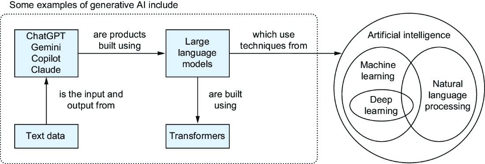
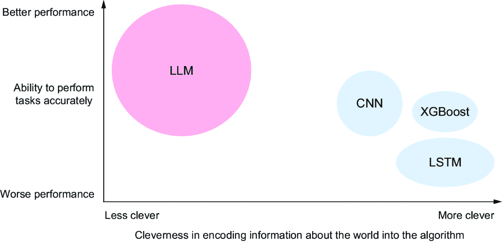

# 1 整体图景：什么是 LLMs？

### 本章涵盖

+   生成式预训练变换器和大型语言模型是什么

+   以通俗易懂的语言解释 LLMs 的工作原理

+   人类和机器如何不同地表示语言

+   为什么像 ChatGPT 这样的工具表现如此出色

+   理解使用 LLMs 的局限性和担忧

机器学习（ML）、深度学习（DL）和人工智能（AI）等术语的炒作已经达到了历史最高水平。这些术语最初对公众的曝光很大程度上是由一个名为 ChatGPT 的产品驱动的，这是一种由 OpenAI 公司构建的生成式 AI。现在，我们可以在日常新闻中看到来自 Google 的 Gemini、来自 Microsoft 的 Copilot、来自 Meta 的 Llama、来自 Anthropic 的 Claude 以及像 DeepSeek 这样的新来者等生成式 AI 产品。似乎一夜之间，计算机说话、学习和执行复杂任务的能力有了巨大的飞跃。新的生成式 AI 公司正在形成，现有公司也在公开投资数十亿美元进入这个领域。这个领域的科技正在以令人疯狂的速度发展。

本书旨在通过揭示 ChatGPT 及相关技术工作原理背后的神秘面纱，帮助您理解这个新世界。我们将涵盖理解其内部工作原理以及组件（数据和算法）如何堆叠在一起以创建我们使用的工具所需的知识。我们还将讨论这种技术如何成为更广泛系统的基石，以及在其他情况下，基于大型语言模型（LLMs）的系统可能不是最佳选择的各种案例。

阅读本书后，您将了解生成式 AI 如 ChatGPT 真正**是什么**，它能做什么，不能做什么，以及它局限性的“为什么”。有了这些知识，您将成为这个技术家族更有效的消费者，无论是作为用户、软件开发者，还是决定是否以及如何将其纳入产品或运营的组织中的业务决策者。这个基础也将作为深入研究该领域的跳板，提供知识，让您能够深入理解研究和其他作品。

## 1.1 上下文中的生成式 AI

首先，当我们谈论 LLMs、GPTs 以及依赖它们的各种工具时，我们需要更具体地了解我们讨论的内容。ChatGPT 中的 GPT 代表**生成式预训练变换器**。这些词在 ChatGPT 的上下文中都有特定的含义。我们将在未来的章节中讨论**预训练**和**变换器**的含义，但在这里，我们先讨论一下在这个上下文中**生成式**的含义。

类似于 ChatGPT 的 AI 聊天机器人是生成式 AI 的一种形式。广义上，生成式 AI 是能够根据过去观察到的数据以及受人们认为令人愉悦和准确输出影响的软件，生成或创建各种媒体（例如，文本、图像、音频和视频）。例如，如果 ChatGPT 被提示“写一首关于松树上雪的俳句”，它将使用所有关于俳句、雪、松树和其他诗歌形式的训练数据来生成一个新颖的俳句，如图 1.1 所示。

##### 图 1.1 ChatGPT 生成的一个简单的俳句

基本上，这些系统是生成新输出的机器学习模型，因此生成式 AI 是一个恰当的描述。一些可能的输入和输出在图 1.2 中得到了展示。虽然 ChatGPT 主要处理文本作为输入和输出，但它也支持更多实验性的不同数据类型，如音频和图像。然而，根据我们的定义，你可以想象许多不同类型的算法和任务都符合生成式 AI 的描述。

##### 图 1.2 生成式 AI 接收一些输入（数字、文本、图像）并产生新的输出（通常是文本或图像）。输入或输出选项的任何组合都是可能的，输出的性质取决于算法训练的目标。它可能是添加细节、缩短内容、推断缺失的部分等等。

深入一层，ChatGPT 处理的是人类文本，因此也可以公平地称其为人类语言模型——如果你是一个在被称为“自然语言处理”（NLP）领域的酷炫人士，你可能会称其为“语言模型”。NLP 领域与计算机科学和语言学相交，探索帮助计算机理解、操作和创建人类语言的技术。NLP 领域的早期努力出现在 20 世纪 40 年代，当时研究人员希望构建能够自动在不同语言之间进行翻译的机器。因此，NLP 和语言模型已经存在很长时间了。那么，是什么让新的生成式 AI 工具与众不同呢？最显著的区别是，ChatGPT 和类似的算法比人们历史上构建的规模要大得多，并且是在更大的数据量上训练的。

因此，“大型语言模型”（LLMs）这个名字被广泛用来描述 GPT 和类似类型的机器学习模型。GPT 描述的是由 OpenAI 开发的一种特定类型的 LLM，其他公司使用类似的技术来构建自己的 LLMs 和 AI 聊天机器人。更广泛地说，LLMs 是在大量语言数据上训练的机器学习模型。

这些关系的图示可以在图 1.3 中看到。ChatGPT、Copilot、Claude 和 Gemini 是一些通过文本操作的产品，它们使用 LLMs 构建。LLMs 使用来自 AI 和 NLP 的技术。LLM 的主要组件是一个转换器，我们将在第三章中详细解释。

##### 图 1.3：你将熟悉的各种术语及其相互关系的高级图示。生成式人工智能是对功能性的描述：生成内容并使用 AI 技术实现该目标的功能。

注意，视觉和语言并不是生成式人工智能的唯一选择。音频生成（例如，当你的 GPS 说出街道名称时的文本到语音），玩像国际象棋这样的棋类游戏，甚至蛋白质折叠都使用了生成式人工智能。这本书将主要关注文本和语言，因为这些都是 GPTs 和 LLMs 使用的主要数据类型。

正如名称“大型”所暗示的，这些模型并不小。ChatGPT 据传言[1]包含 1.76 万亿个参数，这些参数用于决定其行为方式。每个参数通常存储为一个使用 4 个字节进行存储的浮点数（带有小数点的数字）。这意味着模型本身需要 7 个太字节来在内存中存储。这个大小比大多数人的电脑能放入 RAM 中的大小都要大，更不用说在拥有 80GB 内存的最强大的图形处理单元（GPU）内部了。GPU 是专门的硬件组件，擅长执行使 LLMs 成为可能的各种数学运算。目前，制作 LLMs 需要许多 GPU，因此我们已经在讨论多个机器上的大量计算基础设施和复杂性，以构建一个 LLM。相比之下，大多数常规语言模型在大多数情况下不会超过 2GB——超过 5,000更小，在考虑在更标准的硬件上构建和使用此类模型时，这是一个更加合理的尺寸。

##### 优化 LLMs

许多研究人员正在探索让大型语言模型（LLMs）消耗更少内存的方法。有时，这包括使用名为“混合精度”的方法，该方法需要少于 4 个字节来存储一个参数的技术[2]。这种方法使用 2 个字节或更少的存储空间来存储一些 LLM 参数，并在精度和内存效率之间做出权衡。最终，对精度的影响通常是可以忽略不计的。这种优化是研究人员为了使 LLMs 更加资源高效而做出的许多优化之一。

##### GPU 替代方案

虽然 GPU 目前是训练 LLM 最常用的硬件，但并非唯一的选择。越来越多的公司正在开发专门用于训练机器学习模型的专用硬件，这些硬件提供了训练机器学习模型的一般优势。例如，2018 年，谷歌将其 Tensor Processing Unit (TPU) [3]作为谷歌云平台（GCP）的一部分向公众开放。虽然 TPU 的算力通常低于 GPU，但它们的专用架构使它们在特定的机器学习任务上比 GPU 表现更好。

## 1.2 你将学到什么

在整本书中，我们将解释 LLM 是如何工作的，并为你提供理解它们所需的词汇。阅读完毕后，你将对 LLM 是什么以及其操作中的关键步骤有一个对话式的理解。此外，你将对 LLM 合理能做什么有一些看法，特别是与部署或使用 LLM 相关的考虑。我们将讨论 LLM 的基本限制的显著点，并提供如何绕过它们或何时应完全避免使用 LLM 以及更广泛的生成式 AI 的建议。

请记住，如何将变压器组合起来构建 ChatGPT、Claude 或 Gemini 的细节是微妙的，本书主要关注这些系统共有的特点。实际上，我们无法了解这些 LLM 之间的一些实际差异，因为尽管商业 LLM 提供商已经分享了他们模型的大量信息，但他们没有分享一些信息，这些信息可能被认为是商业机密。

由于基于 Transformer 的 LLM 将对世界产生的影响，我们故意将本书的受众范围扩大。所有背景的程序员、高管、经理、销售人员、艺术家、作家、出版商以及许多其他人在未来几年内将不得不与 LLM 互动或他们的工作将受到 LLM 的影响。因此，我们假设你，亲爱的读者，有最少的编码背景，但熟悉编码的基本结构：逻辑、函数，甚至可能是一些数据结构。你也不必是数学家；我们将展示一些有助于理解 LLM 工作原理的数学知识，但在构建对 LLM 工作原理的理解时，这些知识将是可选的。

这种方法意味着本书中将展示的代码非常少。如果你想直接进入构建和使用 LLM，Manning 目录中的其他书籍，如 Sebastian Raschka 的《从零开始构建大型语言模型》（2024）或 Edward Raff 的《深度学习内部》（2022），将补充这里所展示的内容。然而，如果你想了解你使用的 LLM 为什么会有不寻常的输出，你的团队如何可能使用 LLM，或者在哪里避免使用 LLM，或者如果你有一个对机器学习背景了解有限的同事需要具备对话能力，这本书就是你和你同事需要的。

尤其是本书的第一部分专注于 LLM 做什么：它们的输入和输出，将输入转换为输出，以及我们如何约束这些输出的性质。在第二部分，我们将关注人类做什么：人们如何与技术互动，以及使用生成式 AI 会带来哪些风险。同样，我们还将讨论在使用和构建 LLM 时出现的某些伦理考量。

##### 训练 LLM 是昂贵的

对于大多数人来说，训练一个 LLM 并不现实；这至少是一个的投资，而与 OpenAI 竞争可能需要 10 亿美元。与此同时，用于训练 LLM 的资源正在不断演变。因此，我们不是带你了解今天训练 LLM 的样子，而是关注那些具有更长保质期的内容——我们认为这些知识在未来几年内仍然有效，而不是那些可能几个月后就过时的示例代码。

## 1.3 介绍 LLM 的工作原理

生成式人工智能（GAI 或 GenAI）正准备改变我们生产和交互信息的方式。2022 年 11 月 ChatGPT 的推出凸显了现代 AI 的能力，并吸引了世界上很大一部分人的兴趣。目前，你可以在 [`chat.openai.com/`](https://chat.openai.com/) 上免费注册尝试。

如果你输入文本提示“用两句话总结以下文本”，然后跟上是本章的所有介绍性文本，你将得到类似以下的内容。

“近期人工智能领域，尤其是像 OpenAI 的 ChatGPT 这样的大型语言模型（LLM）的关注度激增，凸显了它们在自然语言处理方面的巨大能力。本书旨在向读者提供对 LLM 的对话式理解，包括它们的操作复杂性、潜在应用、局限性以及使用它们时涉及的伦理考量，同时假设读者对编码概念有基本的了解，并具备最少的数学背景。这相当令人印象深刻，对于普通观众来说，这种能力可能似乎是从天而降。”

当你访问 OpenAI 的网站并注册 ChatGPT 时，你可能注意到一个类似于图 1.4 中所示的选择项。正如 GPT-4 这个名字所暗示的，截至本文写作时，Open AI 正在开发其第四代 GPT 模型。像 GPT-4 这样的 LLM 是机器学习研究中一个确立的领域，它旨在创建能够综合和反应信息并产生看似由人类生成的输出的算法。这种能力解锁了人与人之间机器互动的几个领域，这些领域以前仅存在于科幻小说中。ChatGPT 中编码的语言表示的强大能力使得对话、指令遵循、摘要生成、问答、内容创作以及更多应用成为可能。实际上，许多可能的应用技术可能尚未存在，因为我们的直觉反应是思考我们当前的问题，而不是可能存在的新能力或产品。

##### 图 1.4 当你注册 OpenAI 的 ChatGPT 时，你有两个选择：你可以免费使用的 GPT-3.5 模型，或者需要付费的 GPT-4 模型。

对你，即读者来说，关键因素是这项技术并非凭空出现，而是过去十年中机器学习逐年显著进步的结果。因此，我们已经对 LLM 的工作方式和它们可能失败的方式有了相当的了解。

我们假设有一个最小的背景，这样你就可以把这本书给你的朋友和家人。（其中一位作者希望他们能将这本书送给他们的母亲，尽管她不知道他们的确切工作是什么，但她为他们感到非常自豪。）因此，在我们深入之前，我们需要填补一个可能很大的背景差距。第一章旨在为你提供这个背景，以便下一章可以开始回答这个问题：电脑究竟是如何总结这本书的引言的？

## 1.4 什么才是真正的智能？

从营销角度来看，“人工智能”是一个很好的名字，尽管它最初被用作一个整个学术研究领域的名称。这种做法导致了一个微妙的问题，给人们造成了关于 AI 工作方式的错误心理模型。我们将尽力避免强化这种模型。为了解释原因，我们将讨论为什么“人工智能”不是一个很好的名字。我们可以通过考虑一个简单的问题来轻松证明这一点：什么是智能？

你可能会认为像智商测试这样的东西可以帮助我们回答那个问题。智商测试与许多结果有很强的相关性，如学校表现，但它们并没有给我们一个客观的智能定义。研究表明，一些自然（遗传）和环境因素会影响一个人的智商。我们也应该怀疑，我们能否将智能简化为一个如此简单的数字——毕竟，我们经常批评人们只是“书本上的聪明”，而不是“街头上的聪明”。即使我们知道了智能是什么，什么会使其变得人工化？智能有制造的风味和食品色素吗？

事实上，智商测试衡量的是你执行有限能力的能力，主要是时间限制下的某些特定类型的逻辑谜题，但它们并不能帮助我们理解智能的根本性质。事实是，对智能的理解并不完美。

人工智能领域长期以来一直在尝试让计算机，这些是僵化、确定性、遵循规则的机器，执行人类可以执行但无法给出精确定义或指令的具体任务。例如，如果我们想让计算机数到 1000 并打印出所有能被 5 整除的数字，我们可以编写详细的指令，几乎任何程序员都可以将其转换为代码。但如果我们要求你编写一个尝试检测任意图片中是否有猫的程序，那将是一个完全不同的挑战。你需要以某种方式精确地定义什么是猫，然后是检测猫的所有细节。我们如何编写代码来找到和区分猫胡须和狗胡须？当猫没有胡须时，我们如何成功地识别它？归根结底，这并不容易做到。

然而，由于人工智能和机器学习专注于这些难以界定的任务，即人类可以执行的任务，因此使用类比来描述人工智能和机器学习算法变得特别常见。为了让计算机检测到猫，我们提供了成千上万张是猫和不是猫的图片示例。然后我们运行许多算法之一，这些算法具有一个特定、详细、数学化的过程，用于区分猫和其他物体。但在技术术语中，我们称这个过程为*学习*。当模型在新的图像中未能检测到猫，因为它是一只狮子，而狮子不在原始的猫的列表中时，我们经常说模型没有*理解*狮子。

事实上，每当我们要向朋友解释某事时，我们通常会使用我们双方都熟悉的共同概念进行类比。因为人工智能和机器学习广泛关注复制人类执行任务的能力，所以这些类比经常使用暗示人类直接认知功能的语言。随着大型语言模型（LLMs）展示出接近人类所能做到的能力，这些类比变得比有帮助更麻烦，因为人们过于深入地解读它们，并开始相信它们意味着比实际更多的东西。

因此，我们将谨慎使用类比，并提醒读者不要过度追随任何类比。一些术语，如*学习*，是值得理解的术语，但我们希望您对它们可能意味着什么保持警惕。在某些情况下，这本书中的类比仍然是有帮助的，但我们将尝试明确解释如何解释这些类比的范围。

## 1.5 人类与机器如何不同地表示语言

表示语言意味着什么？我们人类在出生后不久通过与周围的人和世界的互动，隐式地开始学习如何表示语言。我们通过正规教育来发展对语言及其使用的组成部分、底层结构和规则的理解。我们对语言的内部表示已经被广泛研究。虽然已经发现了某些语言定律，但许多仍然有待辩论。ChatGPT 对语言的内部表示基于这些知识的一部分。它是通过使用*人工神经网络*的概念实现的，也称为深度学习（另一个危险的类比），这些是模仿人类大脑结构的数据结构和算法的组合。然而，我们对心智工作方式的了解是不完整的。虽然为 LLMs 提供动力的神经网络只是人类大脑结构的简化，但它们的强大之处在于它们能够以有用的方式捕捉和编码语言，以生成语言并与人们互动。

注意 大脑结构的抽象在许多领域都已被证明是有用的。神经网络在语言、视觉、学习和模式识别方面取得了惊人的进步。神经机器学习算法的进步、数字数据的极端增长以及如 GPU 等计算机硬件的爆炸性增长，共同导致了今天 ChatGPT 成为可能的技术进步。

从这次讨论中，我们需要关注的关键细节是，作为人类，你天生就理解你随着时间的推移所学习的语言。你的学习和语言使用是互动的。通过进化，我们似乎都有相对一致的学习和相互沟通的方式。要了解更多关于这个概念的信息，可以查阅语言学家诺姆·乔姆斯基提出的普遍语法理论。与人类不同，LLMs 通过静态过程学习语言表示。当你与 Claude 或 ChatGPT 进行对话时，它机械地参与与你进行的对话，尽管它以前从未参与过任何对话。

LLM 学习的语言表示可能质量很高，但并非没有错误。它是可操纵的，我们可以以特定方式改变 LLMs 的行为，以限制它们所了解的内容或它们产生的结果。理解 LLMs 通过从示例中推断出的关系来表示语言，有助于我们保持现实的期望。如果你打算使用 LLM，如果它出错，会有多危险？你如何与语言表示一起工作来构建产品或避免不良结果？这些问题是我们将在本书中讨论的一些高级问题。

## 1.6 生成式预训练转换器和朋友们

“生成式预训练转换器”这个术语是由 OpenAI 发明的，用于描述他们在 2018 年引入的一种新型模型，该模型包含一种称为转换器的神经网络组件。虽然原始的 GPT 模型（GPT-1）不再使用，但预训练和转换器的核心思想已成为最近生成式 AI 革命以及 Claude、Gemini、Llama 和 Copilot 等工具的核心支柱。

认识到这些基于 GPT 的人工智能工具只是 LLMs（大型语言模型）算法研究和应用广泛领域的一个例子，这一点同样至关重要。除了 ChatGPT 的发布，我们还观察到 LLMs 的惊人增长。一些 LLMs，如 EleutherAI 和 BigScience Research Workshop 发布的 LLMs，对公众免费开放，以推进研究和探索应用。正如我们提到的，Meta、Microsoft 和 Google 等公司已经发布了具有更严格许可条款的其他 LLMs。任何人都可以使用的公开 LLMs，有时被称为*基础模型*，已经创造了一个充满活力的研究、爱好者和公司社区，他们正在探索 LLMs 和生成式 AI 的应用、局限性和机遇。本书中教授的概念几乎普遍适用于所有 LLMs。这些 LLMs 都使用与 ChatGPT 中找到的结构相似，如果不是完全相同的方式来产生输出。

对于一本书来说，似乎不可能包含适用于许多模型的通用总结。然而，由于以下几个原因，这是可能的，其中最重要的一个原因是，我们不会深入到足以从零开始自己编写 LLM 代码的程度。自然地，ChatGPT 和其他商业 LLMs 的部分仍然属于商业机密。因此，我们的范围和描述有意地概括了今天所有生成型 LLMs 最常见方面。

我们可以给出这样一个广泛适用的总结的第二个原因是 LLMs（大型语言模型）的本质。虽然确实可以对它们的建设和运行方式进行调整，但该领域的学者们一致发现，最重要的细节如下：

+   模型有多大，你能否使其更大？

+   构建模型所使用的数据量有多少，你能否获得更多？

对于那些认为自己拥有重要见解或设计，能够实质性改进这些 LLMs 的工作和运行方式的学者来说，这些点可能会令人沮丧，因为在许多情况下，通过“使其更大”或构建一个拥有更多数据或更多参数的模型，同样可以轻易地获得相同的改进。增加模型和数据集的大小是围绕使用和构建 LLMs 的许多伦理问题中的一个关键组成部分，我们将在第九章中讨论。

## 1.7 为什么 LLMs 表现如此出色

我们将在接下来的章节中讨论 LLMs 的工作细节，但在这里也值得分享一个通过研究机器学习算法所学到的重要教训。多年来，从你的算法中获得更好的性能，无论你试图完成什么任务，通常意味着你需要巧妙地设计你的算法。你会研究你的问题、数据以及数学，并试图推导出关于世界的有价值真理，然后将其编码到你的算法中。如果你做得好，你的性能会提高，你需要的数据会更少，世界上的所有事情都会变得很好。你可能听说过的许多经典深度学习算法，如卷积神经网络（CNNs）和长短期记忆（LSTM）网络，在高度上，是人们深思熟虑和巧妙设计的成果。甚至更简单的“浅层”机器学习算法，如不依赖神经网络或深度学习的 XGBoost，也是通过巧妙的算法设计创建的。

LLMs 展示了一个更近期的趋势。它们不是在算法上变得聪明，而是保持简单，实现一个*天真*的算法，该算法简单地捕捉信息片段之间的关系。在许多方面，LLMs 在算法中强制嵌入的世界观更少。从根本上说，这提供了更多的灵活性。如果你告诉我相反的方法是人们改进算法的方式，这怎么会是一个好主意？区别在于 LLMs 和类似的技术只是更大，大得多。它们在更多的数据上训练，并且有更大的能力捕捉更多句子中更多单词之间的关系；这种蛮力方法似乎在性能上超过了经典的 ML 方法。这个想法在图 1.5 中得到了说明。

##### 图 1.5 如果算法的聪明程度取决于你编码到设计中的信息量，那么旧技术通常通过比前辈更聪明来提高性能。正如圆圈的大小所反映的，LLMs 主要选择了一种“更愚蠢”的方法，即使用更多的数据和参数，并对算法可以学习的内容施加最小的限制。

正如我们已经指出的，并不是每个指标都表明“更大”就是更好。这些模型目前部署起来是一个物流和计算上的挑战。许多现实世界的限制，包括响应时间、功耗、电池消耗和可维护性，都受到了负面影响。因此，LLMs 的“性能”只是一种狭义的定义。

然而，关于“做大”比“聪明”更有价值的教训是值得考虑的。有时，在设计机器学习解决方案时，即使你使用 LLM，最好的答案可能是“让我们去获取更多的数据。”

## 1.8 LLMs 在行动中：好的、坏的、和可怕的

在整本书中，我们将提供 LLMs 可能失败的一些例子，通常以滑稽或愚蠢的方式。这些例子的目的并不是说 LLMs 无法执行任务。通过改变输入、设置或随机运气，你通常可以使 LLMs 工作得更好。

这些例子的目的是向您展示 LLMs 如何失败，通常是在一些非常简单的事情上，以至于孩子都能做得更好。当你阅读这本书并亲自与 LLMs 互动时，这些例子应该让你停下来，并引导你思考，“如果我使用 ChatGPT 来完成一项艰巨的任务，但它却在简单的事情上失败了，我是不是在为自己设置失败？”答案可能经常是肯定的！安全地使用 LLMs 需要一定程度的对输出的怀疑或质疑，需要验证和验证正确性，以及相应地适应的能力。如果你使用 LLM 来完成你自己无法完成的任务，你可能会暴露自己于无法亲自验证的错误结果。随着我们在书中讨论如何更广泛地使用 LLMs，我们将不断将这一点以及如何处理它融入到对话中。

很容易想象，当 LLMs（大型语言模型）工作正常时，它们可能会以许多方式让我们的生活变得更轻松——比如回答你的所有电子邮件、总结长篇文档，以及解释新概念。然而，对于很多人来说，事情可能出错并迅速变得危险的情况并不那么自然。

有些人可能会争辩说，如果有人足够聪明，能够想出如何欺骗 LLM，他们可能从其他来源获取他们想要的任何危险信息。这可能确实如此，但与此同时，这也未能考虑到 LLM 和生成式 AI 工具中自动化的规模。没有哪种 AI 或 ML 算法是完美的，如果成千上万的人提出问题，LLM 可能会在 0.01%的时间内产生危险的反应。ChatGPT 拥有超过 1 亿用户[5]，这意味着可能会有 10,000 次危险的反应。当考虑到恶意行为者可能开始自动化的情况时，这个问题变得更加严重。我们将在本书的第二部分进一步讨论这个问题。

我们期待您加入我们，共同探索大型语言模型（LLMs）的工作原理。最终，您将详细了解在您的商业或日常生活中运用 LLMs 革命性功能时需要考虑的许多事项。

## 摘要

+   大型语言模型（LLMs）的设计灵感来源于对人类大脑功能和对语言学习的不完整理解。这被用作设计的灵感，但这并不意味着模型具有与人类相同的或相似的能力和弱点。

+   人类语言必须转换为 LLM（大型语言模型）的内部表示，并从其内部表示转换回人类语言。这种表示的形成方式将改变 LLM 的学习内容，并影响您使用 LLM 构建解决方案的方式。
