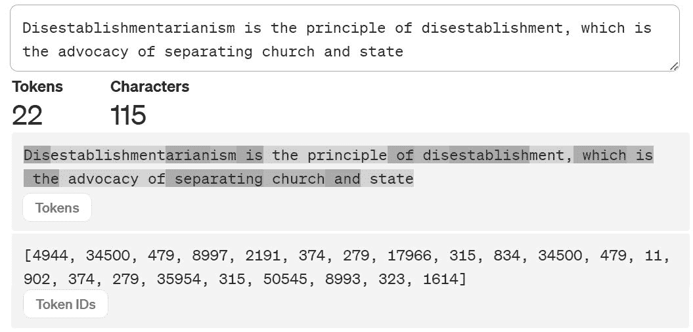
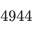
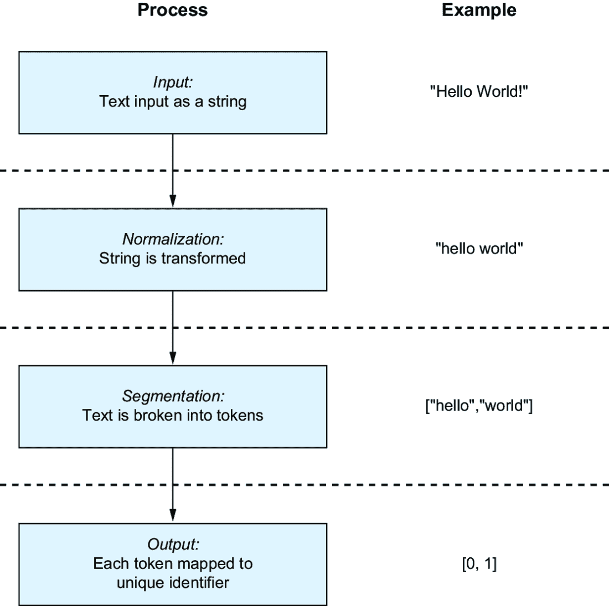
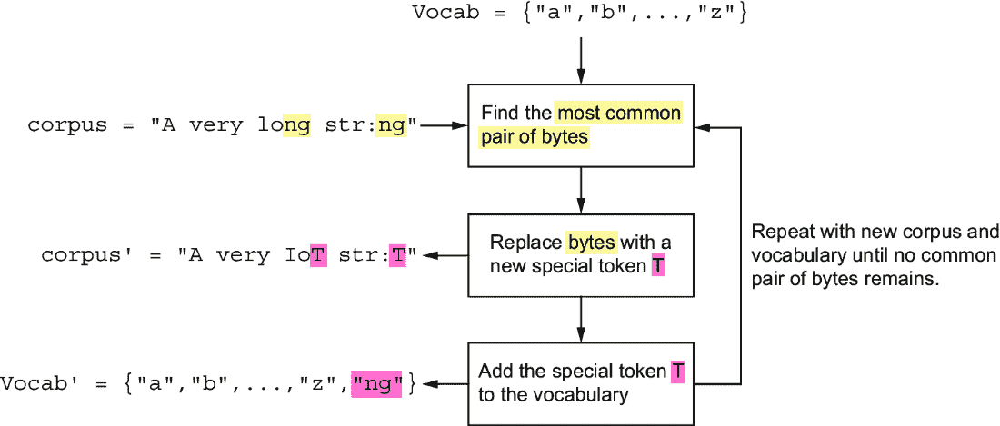
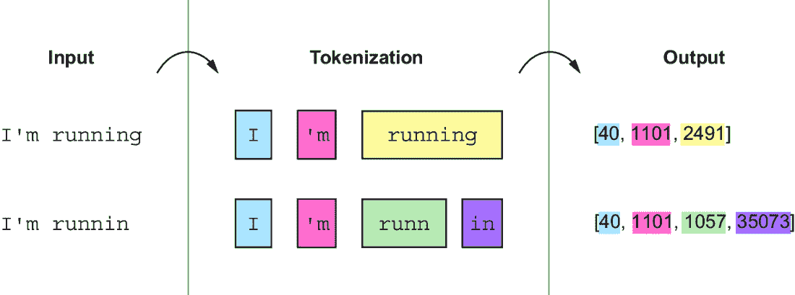
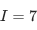
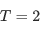
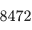

# 2 标记化器：大型语言模型如何看待世界

### 本章涵盖

+   从句子中创建标记

+   通过规范化控制词汇量

+   避免标记化中的风险

+   用于消除歧义的标记化策略

如第一章所述，在人工智能的世界里，找到与人类学习相关的类比来解释机器“学习”通常很有帮助。你如何阅读和理解句子是一个复杂的过程，随着年龄的增长而变化，涉及多个顺序和并发的认知过程[1]。然而，大型语言模型（LLMs）使用的处理过程比人类认知过程简单。它们使用基于神经网络的算法来捕捉大量数据中单词之间的关系，然后使用这些关于关系的信息来解释和生成句子。

我们关于这些算法如何工作的讨论将从它们的输入开始：文本句子。在本章中，我们探讨 LLM 如何处理这些句子，使其成为模型的输入。正如语言对于你的思考和信息处理至关重要一样，LLM 的输入对于影响 LLM 可以执行的概念和任务类型至关重要。

## 2.1 标记作为数值表示

虽然看起来很明显 LLMs 应该处理句子，但要完全理解，我们必须更加具体。当我们讨论 LLM 的工作原理时，你会看到文本句子对于驱动 LLM 的神经网络算法来说是不自然的，因为神经网络本质上使用数字来完成它们的工作。如图 2.1 所示，LLM 使用的算法必须将人类文本转换为数值表示，然后才能对其进行处理。“标记”是 LLM 用来将文本分解成可以编码为数字的片段的表示。

##### 图 2.1 为了理解文本，LLM 必须将文本分解成标记。每个唯一的标记都与一个与之关联的数值标识符相关联。

你可以将标记视为 LLM 处理的最小文本单元——如果你愿意，可以将其视为“原子”，所有其他事物都是由它构建的最小部分。那么文本的原子是什么？考虑一下：当你阅读这本书时，你的大脑使用什么最小的构建块来处理意义？两个自然的答案就是*字母*和*单词*。将字母定义为原子很有诱惑力，因为单词是由字母组成的，但你是否真的有意识地阅读每个单词中的每个字母？对大多数人来说，答案是“不”。（如果你像本书的一位合著者一样患有阅读障碍，这个问题可能很奇怪。但认知处理是复杂的，并且尚未完全理解；请对我们使用的类比表示理解！）你关注的是更突出的单词和词根。在 fbct 中，yoy cn probbly unrestand ths sentnce ever through we diddt sue th ryght cpellng or l3ttrs。人们无意识地使用单词的部分来处理文本，而 LLM 正是基于这个原理构建的。

在本章中，你将学习将文本转换为分词的过程。首先，我们将更详细地讨论分词；然后，我们将讨论用于决定句子如何转换为分词的程序。

## 2.2 语言模型只看到分词

到成年时，大多数讲英语的人大约知道 30,000 个单词[2]。最初为 ChatGPT 提供动力的 LLM GPT-3 拥有 50,257 个分词的词汇量[3]。这些分词不是单词，而是称为*子词*的单词的一部分，这种表示介于单词和字母之间。直观地说，一个分词捕捉了语言的*最小有意义的语义单元*。例如，单词`schoolhouse`通常会分解成两个分词，`school`和`house`，单词`thoughtful`会分解成`thought`和`ful`。这对于识别常用单词和拥有子词来解释我们以前从未见过的单词是有用的。人们经常使用类似的技术，称为语义分解，来理解他们以前从未见过的单词。我们直观地将新单词分解成组成部分，根据我们已知的单词来理解其含义。

*特征工程*是将你的数据转换为对算法和你要解决的问题更方便的形式的过程。为了构建一个可以检测给定文本语言的算法，你可以编写代码，以文本作为输入，输出每个字符出现的百分比。例如，如果`é`在一个文档中出现的频率很高，那么你就有了一个很好的特征来表明该文档更有可能是西班牙语或法语，而不是俄语或中文。良好的特征工程涉及思考你的模型是如何工作的，你想要实现什么，以及如何为模型和目标组合准备你的数据。

分词是 LLM（大型语言模型）的特征工程；它至关重要，因为分词是模型唯一与之交互的信息。分词被视为独立的、抽象的*事物*，它们本身并不具有内在联系。关系是通过观察数据来学习的。

回顾图 2.1，很明显，`Dis`和`dis`的分词是相关的，唯一的区别是其中一个以大写`D`开头。然而，你可以看到模型将标识符分配给`Dis`，将标识符分配给`dis`。也就是说，模型本身并不认为代表`Dis`和`dis`的分词之间存在任何联系，即使我们作为人类，看到的是明显的联系。模型甚至不*看到*`Dis`或`dis`。为了使 LLM 处理分词，我们必须将这些分词转换为数字，这样模型才能看到数字和。重要的是，模型没有直接的方式来知道这些分词是相关的。

标记是从子词到唯一数字表示的映射。反过来，*标记化*是将全文字符串转换为标记序列的过程。如果你之前使用过机器学习库（特别是任何自然语言处理[NLP]工具），你可能熟悉一些简单的标记化形式。例如，简单的标记化过程通过基于空格分割文本来将文本分解成标记。然而，这种方法限制了我们的能力来创建子词或处理不使用空格来分隔单词的语言，例如中文。

### 2.2.1 标记化过程

标记化遵循的通用过程如图 2.2 所示，包含四个关键步骤：

1.  *接收要处理的文本*——这意味着从用户、互联网或任何其他来源获取文本输入作为`字符串`数据类型（一组字母、数字或符号）。这是你想要文本的来源。

1.  *转换字符串*——这通常涉及以某种有用的方式更改字符串，例如将大写字符转换为小写。这也可能是出于安全原因（例如，文本来自用户，我们需要删除任何可能看起来像恶意输入的东西）或消除文本中的不相关变化，以帮助算法更好地学习。这个过程被称为*规范化*。

1.  *将字符串分解成标记*——一旦有字符串可用，就需要将其分离成一系列离散的子字符串；这些是较大字符串中找到的标记。这被称为*分割*。

1.  *将每个标记映射到唯一的标识符*——唯一的标识符通常是整数，它产生 LLM 可以理解的输出。

##### 图 2.2 通常，标记化涉及处理输入以生成标记的数字标识符。

这个过程的开始和结束部分几乎没有选择或不同行为的余地。首先，你需要输入来处理；最后，你需要为每个标记存储和检索与该标记关联的信息的数字标识符。中间的两个步骤，规范化和分割，是你可以选择发生什么的地方。

标记化过程的最后一步是构建词汇表。模型的*词汇表*是在训练过程中看到的独特标记的总数，当我们向算法提供学习数据时。几乎总是需要大量的数据来构建包含许多独特标记的丰富词汇表。

为模型选择词汇涉及一系列权衡：词汇量越大，您的模型可以成功处理的信息就越多。考虑一个可能只有几十个单词词汇量的一岁孩子。这个孩子不会是一个非常有效的沟通者（但那没关系；他们有足够的时间去学习）。因此，更广泛的词汇量不仅有助于模型理解更多事物，而且还会使模型更大。如果您有一个词汇量太大，您可能会因为使用它所需的计算量而使模型变慢，或者模型可能会消耗过多的内存或磁盘存储，这使得将其转移到其他机器或作为软件应用的一部分变得更加困难。

您通过处理训练数据并识别标记来构建模型的词汇。每次您看到一个新的标记时，您都会根据您看到的唯一标记的数量给它一个唯一的标识符。这个过程通常就像存储一个设置为`0`的计数器并在每次找到新标记时递增它一样简单。一旦这个过程完成，您就拥有了一个实际上是一个*编码器*的分词器。分词器可以接收文本作为输入，并返回该文本的数值编码，LLM 算法可以使用它作为其输出。

### 2.2.2 在分词中控制词汇量

GPT-NeoX，一个公开可用的 LLM，在磁盘上存储其词汇需要大约 10 GB。这是一大批数据，已经足够大，从数据存储和计算的角度来看，使得许多实际应用案例变得具有挑战性。它如此之大，以至于存储在 micro-SD 卡上会非常慢，使得在手机或某些游戏机上使用它成为一个重大的挑战。它足够大，以至于不能实时流式传输，必须下载并加载到处理器的 RAM 中才能进行分词。然而，词汇量必须足够大，以表示模型在训练和使用过程中将遇到的全部单词和子单词。假设模型遇到一个不在其词汇表中的单词，并且无法通过其词汇表中的子单词组合来表示。在这种情况下，模型无法捕捉到该段文本的信息。因此，权衡词汇量大小与模型需要解释广泛内容的需求至关重要。在 NLP 中，这通常被称为词汇表外问题，当我们遇到无法使用模型可用的标记表示的单词时。

词汇量是影响大型语言模型（LLM）大小的一个因素，因此讨论控制词汇量的方法和权衡至关重要。在本节中，我们将描述如何改变分词过程的行为来影响词汇量，并影响模型的能力和准确性。

##### 图 2.3 常见的归一化过程通常涉及将文本转换为删除大写字母和标点符号。

在图 2.3 中，我们关注第二个转换步骤，归一化，它将大写字母“H”和“W”转换为小写并删除标点符号。这些常见的归一化步骤起源于经典 NLP 管道，并且在今天的一些现代深度学习方法中仍然有时会执行。它们具有立即期望的效果，即减少词汇量的大小。不再需要将“Hello”和“hello”作为两个不同的标记来表示，它们被映射到一个唯一的标记。这种映射产生了巨大的差异，因为每个以大写字母开头的句子都会潜在地重复词汇库中带有大写版本的那个词。这种归一化还可以帮助解决各种拼写错误和误拼。

例如，在撰写这本书的过程中，我们输入了“LLMs”、“LLms”和“llms”，并犯了许多其他的大小写混合错误。将每个变体中的每个字符都转换为小写，可以将所有这些错误都解决成单一、简单的形式，因此我们得到一个更小的词汇量并减少了歧义。

然而，将文本转换为小写并不总是能减少歧义。考虑“Bill”和“bill”这两个例子。在第一种情况下，首字母大写对于理解“Bill”可能是某人的名字，而“bill”更有可能是货币单位（或其他“bill”的定义）至关重要。首字母大写不仅对于理解文本的意义至关重要，而且对于理解文本中的错误也非常重要。再次考虑一下，在这本书中我们如何错误地大写“LLMs”的所有各种方式。一个高质量的 AI 算法能够识别我们犯的拼写错误并纠正它！ChatGPT 能够做到这一点，因此模型中需要使用大写字母。因此，在词汇量大小和潜在模型准确性之间有一个重要的权衡需要考虑。

在经典 NLP 以及甚至不是那么老的深度学习模型如 BERT（ChatGPT 所使用的 LLMs 的前身）中，算法识别错误并修复它们的能力在专门为此目的设计的解决方案之外极为有限。因此，许多原本用于构建鲁棒的归一化步骤的工作现在已经被 LLMs 所摒弃。更广泛的词汇量是可取的，以产生更强大的模型，这些模型可以学会理解错误。

### 2.2.3 详细说明分词

在分词过程中的归一化和分割步骤在很大程度上决定了词汇量的大小。在图 2.4 中，我们展示了分词的最直接策略之一。这个策略遵循一个简单的规则：每当在文本中看到空格时，将较长的字符串分割成那些标记。在“hello world”的情况下，在 Python 中调用`hello world.split( )`就足够简单了。这是一个合理的做法；这是我们人类阅读句子的方式。但它也增加了一些微妙的复杂性。

##### 图 2.4 分割过程将规范化文本分解成单词或标记，以便每个都可以独立处理。

当你的文本中有标点符号时会发生什么？如果我们使用我们的空白规则将字符串“hello, world”转换为 `[hello,, world]`，我们会遇到与大小写类似的问题。我们最终会得到两个代表同一概念的独立标记：`hello` 和 `hello,`。传统的做法通常是通过删除并开发更复杂的规则来分割字符串为标记来解决这个问题。虽然这是朝着减少词汇量正确方向迈出的一步，但手动指定标记化规则并没有解决其他问题。例如，基于规则的标记化策略对于像中文这样的不使用空格分隔单词的语言来说是一个巨大的挑战。

#### 使用字节对编码识别子词

LLMs（大型语言模型）的一般主题是通过手动进行更少的特征工程，让算法来做繁重的工作。因此，通常使用一种名为 *字节对编码*（BPE）的算法来将字符串分解成标记。字节对编码是一种将单词分解成常见的子词字符序列的算法。如今，BPE 通常使用自定义的分割器，并且几乎不需要进行规范化。

注意：通过实验，我们发现许多类似 ChatGPT 的产品会移除一些不打印的 Unicode 字符（Unicode 很奇怪），但除此之外，它们基本上会以原样接受你的文本。大多数先前的语言模型确实使用了各种形式的规范化，我们认为如何更好地为 LLMs 规范化文本是一个好且开放的问题。

由于找到最有效的子词集是一个计算成本很高的任务，BPE 使用启发式方法来简化这个过程。它首先将单个字母视为标记，然后找到出现频率最高的相邻字母对，并将它们组合成子词标记。该算法重复这个过程多次，继续使用子词标记，直到达到某个阈值，词汇表“足够小”。例如，在第一次遍历中，BPE 算法检查英语中使用的单个字母的频率，并发现字母`i`、“n”和“g”经常出现在一起。在第一次遍历中，BPE 可能观察到“n”和“g”一起出现的频率比`i`和“n”一起出现的频率更高，因此它将生成标记 `i` 和 `ng`。在随后的遍历中，它可能根据该字母组合的频率与`ng`与其他字母或子词一起出现的频率相比，将这些标记组合成 `ing`。一旦 BPE 达到其停止点，它将识别出诸如“eating”和“drinking”这样的单词作为频繁出现的组合。它还可能将`ing`作为后缀捕获，以便以该子词结尾的其他单词也可以表示为标记。当算法完成时，我们最终得到捕获完整单词和其他捕获子词的标记。这个过程在图 2.5 中以高层次展示。

##### 图 2.5 创建标记的简化字节对编码算法：首先，找到出现频率最高的字符对“ng”。接下来，将所有“ng”实例替换为占位符标记“T”，并将“ng”添加到词汇表中。重复此过程，直到没有剩余的常见字节对。

注意：运行 BPE 算法创建词汇表非常昂贵，因为它必须多次读取输入数据来计算字母的最频繁组合。虽然大型语言模型在超过 5 亿甚至 10 亿页的文本上进行了训练，但它们的标记器通常使用该数据的一个非常小的子集创建。通常，标记器使用一个比小说还要小的文本集合进行训练。

BPE 过程一开始可能看起来很奇怪，但你可以将其视为识别语料库中常见字符串的一种方式。例如，BPE 几乎总是学会将`New York`表示为一个标记，这在文本中纽约州和纽约市频繁出现时很有用。将整个概念表示为一个单独的标记使得使用这类信息变得更容易。确实，大多数常见单词将变成唯一的标记，而罕见单词则希望被捕获为子词的组合。例如，`loquacious`将被 GPT-4 分词为`lo`、`qu`和`acious`。这种方法之所以成功，是因为`acious`是拉丁语后缀，表示倾向/倾向性，这使得模型更容易正确处理不寻常的单词。它也是一个失败案例，因为拉丁语前缀“`loqu`”被拆分为两个标记而不是一个，这使得学习变得更加困难。

在使用 BPE（字节对编码）创建词汇表之后，模型作者出于各种原因手动添加额外的标记，例如对特定知识领域重要的单词。正如我们将在下一节讨论的，在某些领域，拥有正确的标记通过捕捉细微的意义具有显著的影响。因此，作者通常会确保必要的标记被包含在内。模型作者还会添加特殊的标记，这些标记不直接表示词的部分，但为模型提供辅助信息。这类标记的一些常见例子包括“未知”标记（通常表示为 `[UNK]`），当分词器无法正确处理符号时使用，以及系统标记 `[SYSTM]`，用于区分模型的内置提示和用户输入的数据，以及其他类型的风格标记。接受文本和图像输入的多模态模型使用独特的标记来告知模型输入流何时在代表文本数据的字节和代表图像数据的字节之间切换。

OpenAI 在开发 ChatGPT 时决定使用 BPE 将文本编码成标记，并已将他们的分词器作为开源包`tiktoken`（[`github.com/openai/tiktoken`](https://github.com/openai/tiktoken)）发布。尽管如此，还有其他几种自动生成标记的算法和实现，包括谷歌开发的 WordPiece 和 SentencePiece 算法[4]。这些算法各有不同的权衡。例如，WordPiece 在构建分词器词汇表时，使用不同的技术来计数候选子词的频率。SentencePiece 中实现的一种算法处理整个句子，在计算标记时保留空白字符，这可能在构建处理多种语言的模型时提高输出质量。然而，BPE 是最广泛使用的算法。例如，它现在被谷歌最近的大型语言模型（LLMs）独家使用。

无论选择哪种算法，分词器的词汇表大小都是一个关键模型参数，由负责训练和增强分词器的数据科学家或工程师确定。以下几节将深入探讨词汇表大小和其他在分词器开发过程中做出的决策。

### 2.2.4 分词的风险

如第一章所述，本书不会过多涉及编码。目标是让你对 LLMs（大型语言模型）的工作原理有一个合理的理解，并消除一些神秘感，以便你能够专注于 LLMs 如何应用于你的工作。分词是拼图的第一块。这是一种简单但有效的策略，用于生成 LLMs 的输入。你已经了解到词汇表的大小在模型的可部署性中起着重要作用，认识到在识别细微差别与制作词汇表相关的无必要冗余之间的权衡，了解到分词过程如何影响词汇表的大小，以及如何使用 BPE（字节对编码）自动化标记选择过程。

在分词时所做的选择会影响 LLMs 今天能做什么，并将在未来影响它们。这些选择涉及一些需要了解的大挑战。为了进一步探讨这个话题，BPE 的两个显著但细微的细节值得分享一些关注点：句子长度与标记计数之间的关系，以及 LLMs 可能被具有相同二进制编码但外观不同的字符（称为同形异义字）所混淆的潜在可能性。

#### 句子越长并不意味着标记越多

BPE 的一个不直观的方面是，句子越长并不意味着标记越多。为了理解为什么，请看图 2.6，其中我们展示了 GPT-3 对两个不同字符串的真正分词。字符串“I’m running”比字符串“I’m runnin”多一个字符，但它少一个标记！如果你不相信，你可以在[`platform.openai.com/tokenizer`](https://platform.openai.com/tokenizer)尝试对不同的字符串进行分词。

##### 图 2.6 分词两个不同的句子

这种差异发生是因为 BPE（字节对编码）在寻找任何输入的最小标记集时是贪婪的。在这个特定案例中，字符串“running”在我们的训练数据中出现的频率足够高，以至于它得到了自己的标记。在“g”缺失的情况下，我们的词汇表中没有“runnin”的标记，因为这种变化可能在我们训练数据中很少出现。因此，“runnin”需要被分解成至少两个标记，给我们`run`和`nin`。

分词器实现的这种细微差别是软件漏洞的沃土。不同的分词器可能会对如何分词相同的字符串提供不同的答案。在设计单元测试和基础设施时，这个因素需要牢记在心，以避免在升级或转换可能导致新差异的分词器实现时迷失方向或感到困惑。它也可能影响 LLM 的评估，因为许多模型对添加的空白空间非常敏感，不一致的分词可能会无意中导致比较不是“苹果对苹果”。

#### 同形异义字符会引起混淆

当开发者处理多种人类语言或考虑处理外部提供数据的安全性影响时，同形异义字符可能会成为一个问题。当输入来自任意用户时，有时可能是恶意的，并试图诱使你的模型表现出不良行为。对 LLM 进行的一种可能的攻击方式就是使用*同形异义字符攻击*。

当两个或更多字符具有不同的字节编码，但在屏幕上渲染时看起来相同，这就是同形异义字符。一个例子是大多数西欧语言中使用的拉丁字母“H”和整个东欧和中亚地区使用的西里尔字母“H”。

BPE 会将使用不同字节编码的同形异义字符编码成不同的标记。因此，同形异义字符可能会增加文本中的标记数量，改变 LLM 解析信息的方式，并增加你的计算成本。一个有趣的同形异义字符例子是 Unicode 字符 U+200B，也称为“零宽空格”。这个字符在排版中使用，占据空间，但不会打印任何内容，显示任何内容，或改变文档的渲染方式。

零宽空格是 Unicode 规范中存在许多奇怪且有趣的事物之一，可能会给你带来麻烦。因此，许多服务都采用规范化步骤来删除这些奇怪字符，并将同形异义字符替换为规范表示（即，任何看起来像`a`的字符都必须编码为`a`）。例如，OpenAI 当前的分词器接口会删除同形异义字符。如果你想在你的硬件或用户的设备上部署 LLM，你必须考虑同形异义字符。

## 2.3 分词和 LLM 能力

如果我们只关心 LLM 产生高质量类似人类文本的能力，那么你分词文本的具体细节并不像构建这些模型所使用的数据和计算那样重要。如果你在模型中投入足够的计算能力和规模，它们最终会找到有用的表示，无论这些表示的构建块是什么。但有时，分词会极大地影响 LLM 的能力。在本节中，我们将介绍一些例子。

可能是以下例子与你的工作或你希望用 LLM 做什么不直接相关；这完全没问题；这些例子的目的不是让你放弃使用 LLM。相反，目标是帮助你了解 LLM 学习的范围受所选表示的限制，并且可能没有方法绕过这些担忧而不进行大量工程工作。如果你开始用 LLM 构建应用程序并发现重大困难，考虑令牌化如何成为你目标的一个因素。如果令牌化确实是问题所在，那么你几乎无法解决这个问题，因此最好考虑其他方法，例如手动通过对你应用重要的令牌来增强词汇表。

### 2.3.1 LLMs 在单词游戏中表现不佳

用户经常喜欢让 LLM 解决单词谜题或执行涉及单词游戏的任务。例如，图 2.7 展示了一个单词游戏，正确答案取决于单词的确切字母序列和单词中的字母数量。

##### 图 2.7 令牌化方法意味着 ChatGPT 实际上无法“看到”单个字符或单词长度。如果你提出需要识别子字符并独特地改变它们的问题，ChatGPT 开始失败。正确的中间字符是“a”，但 ChatGPT 坚持认为字母是“e”。ChatGPT 看到的是三个令牌，分别代表`P`、`ine`和`apple`。

玩单词游戏可能不是你应用中关心的事情，但单词游戏失败的原因可能对你的问题非常明显。尽管许多这样的例子在科学或商业上并不重要，但它们揭示了这些模型操作中的显著故障。它们可能在更实际的应用中发挥作用，例如当模型难以写出包含押韵或谐音的诗歌时。

例如，假设你想构建一个回答用户处方药问题的应用程序。药物通常有更长、更令人困惑的名称，人们难以记住或拼错，而且由于 LLM 不理解字母，它可能会将一种药物的名称与另一种药物的长而奇怪的名称混淆。

由于药物名称不常见，即使有轻微的拼写错误，它们也会以不同的方式进行令牌化。例如，在 GPT-3 中，“Amoxicillin”和容易拼错的“Amoxicillan”没有共享任何公共令牌！这导致 LLM 响应错误的概率大大增加，风险本质上更高，因此对 LLM 应用进行彻底测试、极端小心地进行工程处理或可能完全避免变得尤为重要。

### 2.3.2 LLMs 在数学上面临挑战

分词对涉及形式符号推理的任务有显著影响，包括数学和玩棋类游戏。数学和棋类游戏都是由 LLM 作为符号推理问题实现的，其中单个标记具有特定的规则，这些规则控制着它们与其他标记交互和意义。例如，包含每个数字单独标记的模型在算术运算上往往比不包含这些标记的模型表现更好。这是因为数字 123456 在 GPT-3 中将成为两个标记 `[, ]`，这是基于这些标记在分词器原始训练数据中的频率。这使得模型处理该数字中的单个数字变得更加困难。一些系统开发者通过在所有数字之间插入空格来规范化数字，例如 1 2 3 4 5 6，这会创建一个新的输出，包含六个标记，每个数字一个。 

这种数学能力差异在图 2.8 中得到了很好的体现，该图显示了整个训练过程中的算术计算性能。顶部曲线是一个典型的 BPE 分词器，而底部曲线，显示了更好的性能，是经过修改的相同分词器，它对数字进行了数字级别的分词。

##### 图 2.8 比较了两个大型语言模型（LLM）随时间学习进行算术计算的方式。时间显示在 x 轴上。上曲线是一个典型的 BPE 分词器，而下曲线是经过修改的相同分词器，它使用代表单个数字的标记。y 轴描述了 LLM 准确执行任务的能力，其中数字越小表示错误越少。底线是，使用数字级别分词的 LLM 可以更好地、更快地学习数学。

### 2.3.3 LLMs 和语言公平性

大多数 LLM 分词器可以表示 Unicode 覆盖范围内的任何符号，这包括世界上大多数字母表中的字符。然而，这些分词器在表示特定语言的文本方面的效率差异很大，尤其是在分词器通常针对不同语言的较小文本资源集合进行训练的情况下。这可能导致基于 LLM 的商业服务存在重大不公平性 [5]，因为训练集中罕见的语言的单词分词默认为更细粒度的子词集合，从而导致标记使用量增加。像 OpenAI 和 Anthropic 这样的商业 LLM 提供商通常按每个标记向客户收费，通常每个输入到 LLM 并由 LLM 生成的标记的费用是几分之一美分。当考虑到高使用量的商业应用可能每天处理数千万个标记时，这些成本就会累积起来。

LLM 完成请求所需的时间和用户每 token 收取的费用直接取决于分词器。因此，使用分词器更有效地表示的语言在经济上会得到激励，而那些表示效率不高的语言则不会。以英语为基准，研究人员发现，使用 ChatGPT 和 GPT-4 回答德语或意大利语用户查询的成本大约高出 50%。与英语差异更大的语言可能会产生更大的费用：Tumbuka 和保加利亚语的成本超过两倍，而藏语、奥里亚语、桑塔尔语和掸语的处理成本是英语的 12 倍以上。

## 2.4 检查你的理解

1.  你预计以下单词或短语会如何被分词？试着自己分解它们，然后通过实际的 LLM 分词器，如 [`platform.openai.com/tokenizer`](https://platform.openai.com/tokenizer) 进行测试：

    +   backstopped

    +   大型语言模型

    +   学校

    +   你如何处理句子以理解它们是一个复杂的过程，这个过程会随着年龄的增长而变化，并涉及多个顺序和并发认知过程

1.  你认为大写字母与小写字母在每个先前的例子中有多重要？试着用不同的格式重新提交它们。

1.  让我们通过一个密码来模拟 LLM 如何思考数学，其中每个英语字母对应一个数字。例如，，，，和 ，因此我们会用 *WAIT* 来表示 。知道这个事实以及 ，你能弄清楚  代表什么吗？

1.  由于 token 是 LLM 运作的基本单元，为什么使用分词器表示效率较低的语言成本更高在技术上是有意义的？

1.  使用大型语言模型（LLM）向说不同语言的人收取相同服务的不同费用是否是一个道德问题？你会认为这是一种歧视吗？

## 2.5 上下文中的分词

本章讨论的分词细节是 LLM 的基础构建块，决定了它们可以有效地表示的输入和产生的输出。分词是 LLM（如 ChatGPT）在开发有效文本表示中的关键组成部分，以便在训练过程中处理大量信息时，可以学习 token 之间的关系，解释用户输入并产生我们习惯的高质量响应。LLM 的潜力受限于或由其采用的分词策略和词汇表决定，以及我们在以下章节中探讨的所有其他特征。

## 摘要

+   标记化是 LLM 通过将句子转换为标记来理解文本的基本过程。

+   标记是文本中最小的信息单位，代表内容。有时，它们对应于完整的单词，但通常，它们代表单词或子单词的部分。

+   标记化（Tokenization）涉及将文本*规范化*成标准表示，这可能包括将字符转换为小写或转换 Unicode 字符的字节编码，以便可见的相同字符使用相同的编码。

+   标记化还涉及*分割*，即将文本分割成单词或子单词。例如字节对编码（BPE）这样的算法提供了一种机制，可以根据训练数据集中字母组合的统计出现频率自动学习如何有效地分割文本。

+   构建标记化器的结果被称为*词汇表*，这是标记化器可以用来表示其处理过的文本的唯一单词和子单词标记集合。

+   标记化器的词汇表大小会影响 LLM 准确表示数据的能力，以及理解和预测文本所需的存储和计算资源。

+   在 LLM 内部，标记（tokens）是用数字来表示的。因此，没有理解标记之间关系的能力，例如前缀和后缀之间的关系，或者两个标记共享一组相似的字母的事实。

+   为了支持特定的知识领域，自动训练的标记化器可能被增强以提供对其应用重要的标记。

+   不理解单个字母或数字的标记化器在算术运算或简单的文字游戏中会遇到问题。
