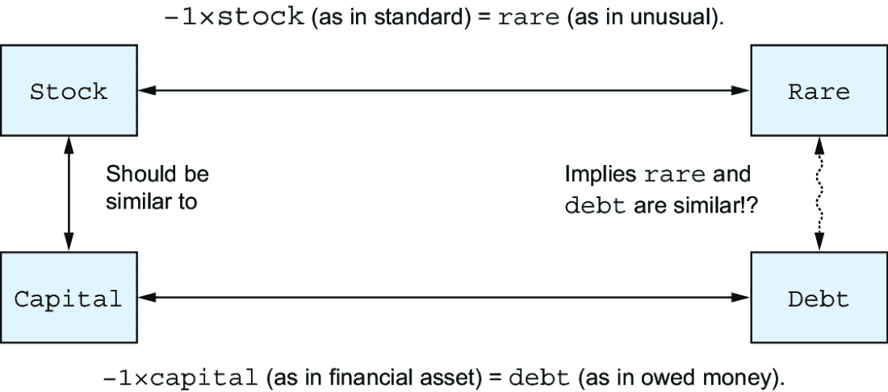
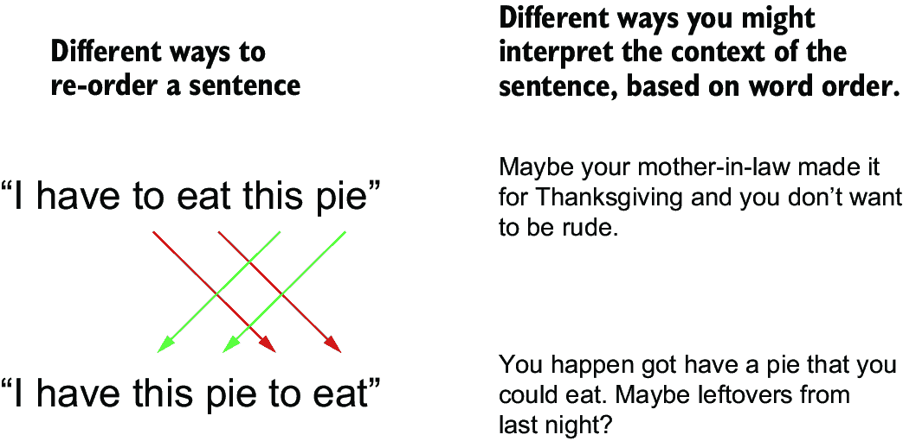
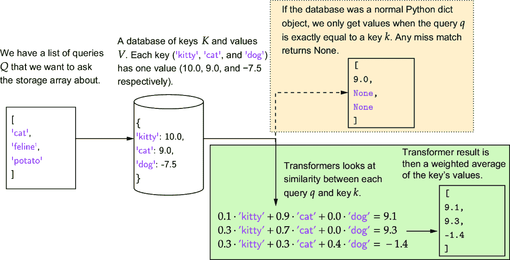
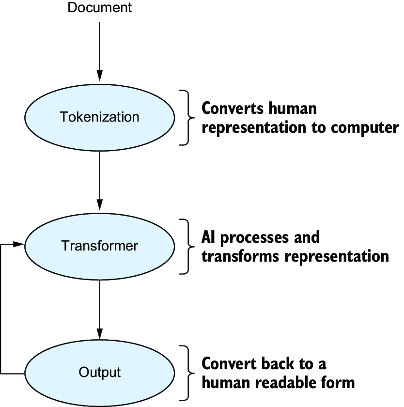
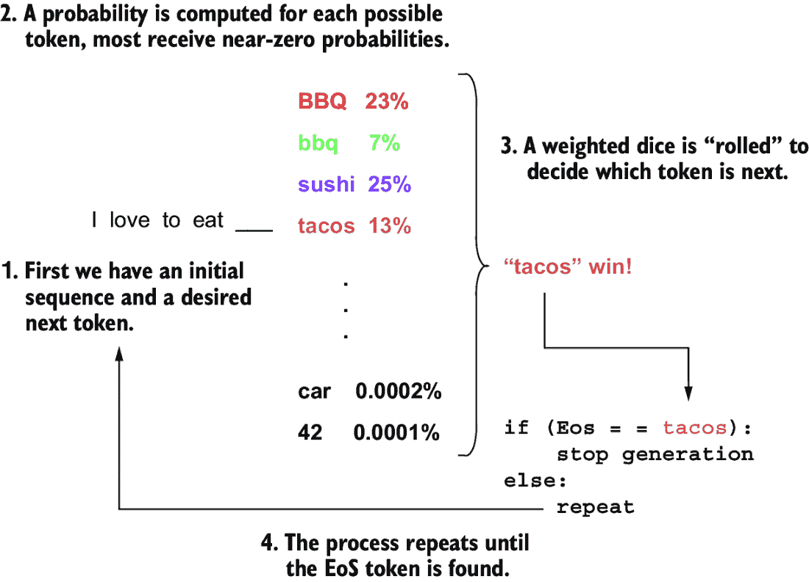

# 第三章：种变换器：输入如何变成输出

### 本章涵盖

+   将标记转换为向量

+   变换器，它们的类型及其作用

+   将向量转换回标记

+   创建文本生成循环

在第二章中，我们看到了大型语言模型（LLMs）如何将文本视为称为标记的基本单元。现在，是时候讨论 LLMs 对它们看到的标记做了什么。LLMs 生成文本的过程与人类形成连贯句子的方式明显不同。当 LLM 运行时，它正在处理标记，但同时又不能像人类那样操纵标记，因为 LLM 不理解每个标记所代表的字母的结构和关系。

例如，英语使用者知道“magic”、“magical”和“magician”这些词都是相关的。我们可以理解，包含这些词的句子都与同一主题相关，因为这些词有一个共同的词根。然而，操作于代表这些词的整数标记的 LLMs，如果不能进行额外的工作来建立这些联系，就无法理解标记之间的关系。

因此，LLMs 遵循机器学习和深度学习中的长期历史，执行一种循环转换。首先，标记被转换为深度学习算法可以处理的数字形式。然后，LLM 将这种数字表示转换回新的标记。这个周期会迭代重复，这与人类的工作方式不可比。如果你的同事在每说一句话之间都要拿出计算器来解决几个数学问题，你会感到非常担忧。

然而，这个过程确实是 LLMs 生成输出的方式。在本章中，我们将分两个阶段来介绍这个过程。首先，我们将从高层次上回顾整个过程，以介绍基本概念并构建 LLMs 生成文本的心理模型。接下来，这个模型将作为深入讨论 LLMs 使用的组件的细节和设计选择的脚手架，这些组件用于捕捉单词和语言之间的关系，并最终生成我们熟悉的输出。

## 3.1 变换器模型

你今天遇到的许多大型语言模型（LLMs）使用一种称为变换器的软件架构来解释标记并生成输出。这种架构由一系列算法和数据结构组成，通过将信息表示为神经网络中的数字来存储信息。在核心上，变换器是序列预测算法。虽然通常描述它们为“推理”或“理解”语言，但它们实际上所做的只是预测标记。变换器提供了三种不同的标记预测方法。虽然我们专注于著名的 GPT 架构（更正式地称为仅解码器模型），但也值得介绍仅编码器和编码器-解码器模型：

+   *仅编码模型*—这些模型被设计用来创建可用于执行任务的认知表示——也就是说，将输入编码成对算法更有用的数值表示。最好的思考方式是，它们将文本处理成机器学习算法更容易使用的形式。它们在科学研究中被广泛使用。著名的例子包括 BERT 和 RoBERTa。

+   *仅解码器模型*—这些模型被设计用来生成文本。最好的思考方式是，它们接受部分撰写的文档，然后通过预测下一个标记来生成该文档的可能续篇。著名的例子包括 OpenAI 的 GPT 和 Google 的 Gemini。

+   *编码-解码模型*—这些模型也被设计用来生成文本。与仅解码器模型不同，它们接受整段文本并创建相应的段落，而不是继续现有的段落。由于它们训练成本更高，且使用起来有时更具挑战性，因此它们不如仅解码器模型受欢迎。对于具有明确定义的输入和输出序列的任务，编码-解码模型往往优于仅解码器模型。例如，它们在翻译和摘要任务上比仅解码器模型表现得更好。著名的例子包括 T5 和为 Google Translate 提供动力的算法。

不论使用哪种类型的 Transformer，模型的基本组件都是由三个基本层构建的，只是内部排列方式不同。一个合理的类比是汽油车引擎：它们都工作得类似，并且具有相同的一般组件。这些组件（即层）如何在引擎（即 Transformer）内部组合在一起，会引发各种性能权衡。

##### 神经网络层究竟是什么？

大型语言模型（LLMs）是我们现在称之为 *神经网络* 的数百种算法之一。然而，这种说法在几个方面都是不准确的。首先，构成当前神经网络方法的内容非常广泛，以至于提到“基于神经网络的方案”并不能给读者提供太多关于具体方法的详细信息。其次，名称中的 *神经* 部分与神经科学或大脑的工作方式几乎没有关系。有时，可能会有一种直观的“嘿，大脑有点这样做；我们能否模仿这种行为并从中得到一些有用的东西？”这样的灵感，但对于大多数当前的方法来说并不是这样。第三，神经网络更多地描述了一种关于组装数据结构的标准协议，而不是特定的算法。想想建造一栋房子：你使用两英寸乘四英寸的木材、石膏板，以及许多关于橱柜、油漆和设计选择的选项来组装成一座家园。每座房子看起来都是独一无二的，但也很熟悉：它们都是以预期的方式组装的。“层”是神经网络中最小的组件，但你可以用不同的方式使用许多类型的层。变换器是组装成更大网络的多块组件之一。

### 3.1.1 变换器模型的层级

图 3.1 描述了变换器模型的基本组件：生成能够承载更多意义的标记表示的 *嵌入层*；基于单词关系的 *变换器层*；以及将变换器内部使用的数值表示转换为人类可读的单词的 *输出层*。

##### 图 3.1 变换器模型的基本组件，包括嵌入层、多个变换器层和输出层

让我们详细看看这些层级：

+   *嵌入层*——嵌入层将原始标记作为输入，并将它们映射到能够捕捉每个标记意义的表示。例如，在第二章中，我们讨论了标记如何表示概念，但单个标记之间没有任何关系。考虑一下“狗”和“狼”这两个词。根据我们对语言的理解，我们知道这些术语是相关的，但我们需要一种方法来捕捉这种关系在神经网络中。这正是嵌入层所做的。它捕捉每个标记的信息，这些信息编码了其意义，并允许我们表达其与其他标记的概念关系。因此，我们可以捕捉到“狗”和“狼”这两个标记的表示比“红色”和“法国”这两个标记的表示更相似的想法。你可以把嵌入层看作是模型中处理页面上的单词并将它们映射到你头脑中的抽象概念表示的部分。

+   *Transformer 层*—在语言模型中，大部分计算都是在 Transformer 层中进行的：它们捕捉嵌入层创建的单词之间的关系，并完成大部分实际工作以获得输出。虽然 LLMs 通常只有一个嵌入层和一个输出层，但它们有许多 Transformer 层。更强大的模型有更多的 Transformer 层。

    将 Transformer 层描述为模型的“思考”部分很有诱惑力。这个定义错误地暗示了 Transformer 层（或由它们构建的更大模型）可以思考，但像人类一样思考是自我反思的，并且持续时间和努力程度是变化的。你可以思考几秒钟或几个月，这取决于完成任务所需的努力。Transformer 总是以相同的努力重复相同的流程。没有自我反思，也没有改变 Transformer 层的心理状态。因此，想象一个更好的 Transformer 层的方式是一组*模糊规则*—*模糊*是因为它们不需要精确匹配（因为嵌入可能会返回类似于“狗”到“狼”的东西），*规则*是因为 Transformer 没有灵活性。一旦学习完成，Transformer 层将每次都做同样的事情。

+   *输出层*—在模型完成计算后，输出层会进行额外的转换以获得有用的结果。最常见的情况是，输出层作为嵌入层的逆过程，将计算结果从捕捉概念的嵌入空间转换回捕捉实际子词的标记空间，以构建文本输出。你可以将这部分模型视为选择实际单词来表达你已决定的答案的部分，通过选择最有可能代表构成答案的概念的单词。最后，我们通过一个反嵌入过程结束，将嵌入转换为标记。因为每个标记都与一个子词有一对一的映射，我们可以使用简单的字典或映射将标记再次转换为人类可读的文本。这个过程在图 3.2 中有详细说明。

## 3.2 详细探索 Transformer 架构

为了进一步理解 LLM 内部发生的事情，将我们描述的步骤重新框架化可能会有所帮助。因此，让我们在图 3.2 中这样做，它描述了七个步骤。我们将用参考标记来标记这些步骤，指出我们之前覆盖的章节，或者告诉你它是一个即将解释的新细节。本章提供的信息很多，因此我们将随着我们的进展逐步分解。

##### 图 3.2 使用大型语言模型将输入转换为输出的过程

LLM 的七个步骤如下：

1.  将文本映射到标记（第二章）。

1.  将标记映射到嵌入空间（*新增*，子节 *使用向量表示标记*）。

1.  为每个嵌入添加信息，以捕捉输入文本中每个标记的位置（*新增*，子节 添加位置信息）。

1.  将数据通过一个转换层（重复  次）(*新增*，子节 3.2.2）。

1.  应用反嵌入层以获取可能构成良好响应的标记（*新增*，子节 3.2.3）。

1.  从可能的标记列表中采样以生成单个响应（*新增*，子节 *采样标记以生成输出*）。

1.  将响应中的标记解码为实际文本（第二章）。

### 3.2.1 嵌入层

标记化、嵌入以及语言如何精确地被转化为模型能理解的事物有很多细微之处。最重要的细微之处是神经网络仍然不能直接处理标记。总体来说，神经网络需要可以操作的数字，而标记有一个固定的数字标识。我们不能改变标记的标识，因为标识允许我们将标记转换回人类可读的文本。我们需要一个层，将数字形式的标记转换成它们所代表的单词或子词。

#### 使用向量表示标记

我们的转换器需要数字来工作。这里的“连续”数字意味着任何分数值都可以供我们使用：0.3，-5，3.14 等。我们还需要多个数字来表示每个标记，以捕捉意义的细微差别和标记之间的关系。如果你试图只用一个数字来表示每个单词，你将难以捕捉到单词的多种含义、同义词、反义词以及它们所建立的关系。例如，你可能希望说一个单词的反义词（对立面）可以通过将单词乘以  来实现。如图 3.3 所示，这很快就会导致关于单词关系的荒谬结论。

##### 图 3.3 如果你只用一个数字来表示一个标记，你很快就会遇到相似/不同单词无法相互适应的问题。在这里，我们看到尝试表示简单的同义词/反义词关系，即使只有几个单词，也会变得毫无意义。

例如，假设我们有一个表示`stock`的标记，我们任意决定将其转换为某个数字（例如，`5.2`）。我想给相关的金融词汇，如`capital`，一个类似的数字（例如，`5.3`），因为它们有相似的意义。`stock`的其他含义也有反义词，例如`rare`。让我们假设我们使用负值来捕捉反义的概念，并给它一个值为`-5.2`。但现在事情变得复杂，因为`capital`的另一个反义词是`debt`。但如果反义词是否定，那么`debt`和`rare`有相似的意义，这是不合逻辑的。图 3.3 说明了这个问题：当我们用一个数字来表示一个词时，我们无法编码它们的关系，而不暗示与其他词的奇怪关系，而且我们还没有处理过四个词！

##### 图 3.4 在我们的标记表示中添加另一个维度，使我们能够表示更丰富的语义关系排列。在这里，我们看到两个维度如何捕捉同一词的多个含义之间的关系。

这个技巧是使用多个数字来表示每个标记，这样你可以找到更好的表示，以适应词语之间不同的关系。图 3.4 展示了使用两个数字的例子。我们可以看到像`bland`这样的词几乎与`rare`和`well-done`等距，同时还有空间让`bank`远离前面提到的所有三个词，而是靠近`stock`。我们甚至还能加入一些额外的词。你使用的数字越多，在领域的术语中称为*维度*，你就能表示更复杂的关系。

##### 维度诅咒

如果更多的维度能更好地捕捉细微的意义，为什么不尽可能多地使用维度来表示我们的数据呢？当处理大量维度时，会出现几个问题。一个主要的问题是 LLMs 处理许多嵌入，增加维度会增加存储和处理嵌入所需的内存和计算。此外，随着我们增加维度，语义空间的大小急剧增加，训练机器学习模型以了解语义空间中所有位置所需的数据量和时间也会呈指数增长。数学家理查德·E·贝尔曼提出了“维度诅咒”这个术语来描述这一现象，因为虽然我们希望创建一个能够捕捉细微意义的空间，但我们受到我们创建的空间的基本属性的局限。

在 LLM（大型语言模型）的术语中，用于表示标记的数字列表被称为*嵌入*。你可以将嵌入想象成一个浮点值数组或列表。作为简称，我们称这样的数组为*向量*。向量的每个位置称为一个维度。正如我们在图 3.4 中所示，使用多个维度使我们能够捕捉到人类语言中词汇之间关系的细微差别。

由于嵌入存在于多个维度中，我们通常说它们存在于一个*语义空间*中。在一些机器学习应用中，这被称为*潜在空间*，尤其是在不处理文本的情况下。语义空间是一个模糊不清的术语，在领域中并没有很好地定义，但它最常被用作表示每个标记的向量嵌入在该空间中表现良好的简称，即同义词/反义词的距离较近/较远，并且我们可以利用这些关系进行有效利用。例如，在图 3.5 中，我们展示了一个著名的案例，通过减去`male`的嵌入并添加`female`的嵌入，可以构建一个“使女性化”的转换。这种转换可以应用于许多不同的男性性别词汇，以找到具有相同概念的女性性别词汇。图 3.5 右下角所有“royal”词汇的共现也是故意的，因为在高维空间中可以同时维持许多不同类型的关系。

##### 图 3.5 展示了嵌入之间的关系如何创建语义空间。意义相似的词汇彼此靠近，并且可以对多个词汇应用相同的转换以产生相似的结果——在这个例子中，是将男性词汇转换为女性词汇的转换。

令人震惊的是，我们无法保证这些语义关系会在训练过程中形成。它们只是碰巧经常形成，并且被发现非常有用。由此延伸，语义空间中的关系并非万无一失，你的数据中的偏差可能会渗透进来。例如，模型通常会确定`doctor`与`male`更相似，而`nurse`与`female`更相似，因为在构建大多数模型时通常可用的文本中，医生被描述为男性的情况更为常见，而护士被描述为女性的情况更为常见。因此，这些关系不是世界发现的真理，而是反映了进入该过程的数据。

#### 添加位置信息

一个关键问题是标准变换器不理解序列信息。如果你给变换器一个句子，然后重新排列所有标记，它会认为所有可能的标记排列都是相同的！这个问题在图 3.6 中得到了说明。

##### 图 3.6 没有位置信息，变换器不理解它们的输入具有特定的顺序，所有可能的标记重新组织对算法来说看起来都是相同的。这是有问题的，因为词序可以改变词的上下文，或者如果随机进行，可能会变成乱码。

因此，嵌入层生成两种不同类型的嵌入。首先，它创建一个*词嵌入*，以捕捉标记的意义，其次，它制作一个*位置嵌入*，以捕捉标记在序列中的位置。

这个想法非常简单。正如我们将每个唯一的标记映射到一个唯一的含义向量一样，我们也将每个唯一的标记位置（第一、第二、第三等等）映射到一个位置向量。因此，每个标记将得到两次嵌入——一次用于其身份，再次用于其位置。然后，这两个向量相加，创建一个代表单词及其在句子中位置的向量。这个过程在图 3.7 中概述。

注意：使用多个维度而不是绝对位置，对于变换器来说更容易学习相对位置，即使对我们人类来说可能过于冗余[1]。

##### 图 3.7 词嵌入没有捕捉到输入标记出现的特定顺序。这种信息由位置嵌入捕捉。位置嵌入的工作方式与词嵌入相同，并且它们被相加。结果组合嵌入包含了模型需要以理解标记顺序的信息。

这些都是理解如何将标记转换为变换层所需的向量的缺失细节。这种策略可能看起来有些天真，这确实是真实的。人们已经尝试开发更复杂的方法来处理这些信息，但“让我们将一切变成向量并简单地相加”这种简单的方法出奇地有效。重要的是，它还在视频和图像中展示了成功。有一个简单且足够有效的策略来处理许多不同的问题是非常有价值的，这就是为什么这种天真方法得以流行。

### 3.2.2 变换层

变换层旨在将输入转换为更有用的输出。大多数先前的神经网络层，如嵌入层，都是设计用来将关于世界如何运作的非常具体的信念融入其操作中。其理念是，如果编码的信念准确反映了世界的实际运作方式，那么你的模型将使用更少的数据达到更好的解决方案。变换器采取相反的策略。它们编码了一种通用机制，如果你有足够的数据，它可以学习许多任务。

为了做到这一点，变换器使用三个主要组件：

+   *查询*——查询是从嵌入层来的向量，代表你正在寻找的内容。

+   *关键*——键向量代表与查询配对的可能答案。

+   *值*—每个键都有一个相应的值向量，当查询和键匹配时返回的实际值。

这个术语对应于 Python 中`dict`或字典对象的行为。你通过键在字典中查找一个条目，以便然后创建一些有用的输出。不同之处在于转换器是模糊的。我们不是在查找单个键，而是在评估*所有键*，根据它们与查询的相似度进行加权。图 3.8 展示了如何通过一个简单的例子来工作。虽然查询和键被显示为字符串，但这些字符串是代表每个字符串将通过嵌入层映射到的向量的替代品。

##### 图 3.8 查询、键和值在转换器内部如何工作，与 Python 字典相比的示例。当 Python 字典将查询与键匹配时，它需要一个精确匹配来找到值，否则它将返回空值。转换器总是基于查询和键之间最相似的匹配返回一些内容。

每个键都对一个查询做出贡献可能会很混乱，特别是如果查询和特定键之间有一个真正的匹配。这个问题通过一个称为*注意力*或*注意力机制*的细节来处理。

转换器内的注意力可以被认为是类似于你关注重要事物的能力。你可以忽略无关的和分散注意力的信息（即，不良的键），并主要关注重要的事情（最佳匹配的键）。这个类比进一步扩展，注意力是自适应的；什么是重要的取决于其他可用的选项。你的老板给你一周的指示会占用你的注意力，但火警响起会将你的注意力从老板转移到警报（以及可能的火灾）。

在生成下一个标记时，转换器将当前标记的*查询*与所有先前标记的*键*进行比较。查询和键的比较生成一系列值，注意力机制使用这些值来计算在决定生成下一个标记时应分配给每个潜在后续标记的权重。每个标记的*值*告诉模型每个先前标记认为其对概率的贡献应该是什么。然后，注意力函数计算下一个标记，如图 3.9 所示。

##### 图 3.9 通过使用当前标记作为查询并计算与先前单词作为键的匹配来预测句子中的下一个标记。这些个别值本身不需要存在于语义空间中；注意力机制的输出产生的是词汇表中某个标记的类似物。

##### 注意力的数学是什么？

我们不会深入探讨注意力背后的数学细节，因为这需要占用很多空间来描述，而且这些内容在其他地方已经有所介绍。我们曾在之前的书中这样做过：*《深度学习内部》* [2] 的第十一章详细解释了转换器和注意力的技术细节。

对于好奇的人来说，主要方程是

##### (3.1)

##### (3.2)

查询、键和值分别由单个矩阵、和表示。矩阵乘法在 GPU 上实现时使注意力变得高效，因为它们可以并行执行许多乘法操作。softmax 函数通过分配许多几乎等于零的值来实现注意力类比的主要组件，这导致转换器忽略不重要的项。

*norm*和*Feedforward*的最后一步是通过跳过连接应用*层归一化*和*线性层*。如果你对这些术语不熟悉，那没关系；你不需要了解这些数学知识就能理解本书的其余部分。如果你想了解这些术语的含义，我们建议你参考*《深度学习内部》* [2] 以获得技术上的深入了解。

转换器模型由数十个转换器层组成。中间的转换器层执行与图 3.9 中描述的相同机械任务，尽管它们不需要预测标记，因为最后一个转换器层是唯一需要预测实际标记的层。转换器层足够通用，结合许多中间层可以使模型学习到复杂的任务，如排序、堆叠和其他复杂的输入转换。

### 3.2.3 反嵌入层

LLM 的最后一个阶段是反嵌入层，它将转换器使用的数值向量表示转换为特定的输出标记，以便我们最终能够返回与该标记对应的文本。这个输出生成过程也被称为*解码*，因为我们解码转换器的向量表示为一段输出文本。这是使用 LLM 生成文本的关键组件。不仅解码当前标记对于产生输出至关重要，下一个标记将取决于为输出所选的每个先前标记。这个过程如图 3.10 所示，我们一次递归生成一个标记。在统计术语中，这个过程被称为*自回归*过程，意味着输出中的每个元素都基于其前面的输出。

##### 图 3.10 从 LLM 生成输出涉及将文档转换为标记，然后使用模型生成输出。我们循环这个过程来消费文本并生成可读的输出。

你可能想知道这个过程是如何停止的。当我们构建标记词汇表时，我们包括一些在文本中不出现的特殊标记。其中之一是一个*序列结束*（EoS）标记。模型在带有自然端点的文本上训练，这些文本以 EoS 标记结束，当模型生成一个新标记时，EoS 标记是它可以生成的选项之一。如果生成了 EoS，我们知道是时候停止循环并将完整文本返回给用户了。如果您的模型陷入不良状态并且无法生成 EoS 标记，设置一个最大生成限制也是一个好主意。

#### 样本标记以生成输出

这个过程中缺少的是我们如何将一个向量，即由 transformer 层产生的浮点数数组，转换成一个单独的标记。这个过程被称为*采样*，因为它使用统计方法根据 LLM 的输入及其迄今为止的输出从词汇表中选择样本标记。LLM 的采样算法评估这些样本以选择要生成的标记。有几种进行这种采样的技术，但所有技术都遵循相同的基本两步策略：

1.  对于词汇表中的每个标记，计算每个标记将成为下一个选择的标记的概率。

1.  根据计算出的概率随机选择一个标记。

如果你使用过 ChatGPT 或其他 LLM，你可能已经注意到它们并不总是为相同的输入提供相同的输出。解码步骤是为什么每次你问相同的问题时，你可能会得到不同答案的原因。

似乎选择标记是随机的，这似乎有些不合逻辑。然而，这是生成高质量文本的关键组成部分。考虑图 3.11 中的文本生成示例，我们试图完成句子“I love to eat.”如果模型总是选择“寿司”作为下一个标记，因为它具有最高的概率，这将是不现实的。如果有人在这种背景下总是对你说“寿司”，你会认为有什么不对劲。我们需要随机性来处理存在多个有效选择的事实，并且并非所有选项都可能发生。

##### 图 3.11 我们通过从短语"I love to eat"开始来展示文本生成，然后显示一些可能的完成项，如烧烤和寿司，具有高概率，而汽车和数字 42 具有低概率。加权随机选择选择了单词*tacos*。当出现 EoS 标记时，生成循环停止。

还要注意，在图 3.11 的例子中，其他标记在给定的极小概率下将是无意义的，比如 42。再次强调，我们需要给每个标记分配一个概率，以了解哪些标记可能是或可能不是。

##### 你如何为标记获取概率？

每个可能的下一个标记都有被选中的不同概率。大多数标记被选中的概率几乎为零。一个敏锐的读者可能会想：在知道其他标记之前，我们如何给一个标记分配一个概率？我们通过给每个标记一个分数来实现，这个分数表示该标记的嵌入与当前向量（即 transformer 的输出）的匹配程度如何。这个分数是任意的，从到，并且为每个标记独立计算。然后，使用分数的相对差异来创建概率。例如，如果一个标记的分数是 65.2，而另一个标记的分数是-5.0，那么该标记的概率将接近 100%，而另一个标记的概率将接近 0%。如果分数是 65.2 和 65.1，那么概率将分别接近 50.5%和 49.5%。同样，分数为 0.2 和 0.1 将给出与分数 65.2 和 65.1 相同的概率，因为我们关注的是分数的相对差异来分配概率，而不是分数本身。

Transformer 有时会给出不寻常或无意义的生成。这种情况并不常见，但其他标记的概率接近零，最终会选中一个你不会预期的奇怪标记。一旦选定了意外的标记，所有后续生成的标记都将以试图使不寻常的生成有意义的方式进行。

例如，如果 LLM 产生了“我喜欢吃*粉笔*”，你可能会感到非常惊讶。但这并不过分不合理，因为吃粉笔是被称为异食癖的医学状况的症状。一旦选定了单词*粉笔*，LLM 可能会进入关于异食癖或其他医学评论的旁白——当然，如果你足够幸运，你的不寻常生成是在“罕见但合理”的领域，而不是一个完全错误的预测。

注意：许多算法可以计算用于选择生成单词的最终概率。其中之一是核采样，也称为 Top-p 采样，它涉及确定具有最高概率的标记作为潜在输出，并从该列表中选择要输出的标记。这种方法可以帮助我们避免不合理的预测。如果你能的话，你想检查你的 LLM 使用的是哪种采样算法，这样你就可以了解其产生罕见或不合理输出的风险。

## 3.3 创造力和主题响应之间的权衡

根据用户如何计划与 LLM 互动，生成令人惊讶或具有创造性的输出可能是所希望的。比如说你正在使用 LLM 来帮助构思新产品想法，你正在使用聊天机器人作为数字回声板来激发想法。在这种情况下，你可能会希望生成不寻常的输出，因为目标是具有创造性并想出新点子。

相反，有时创造性是完全不希望的。LLMs 的一个潜在用途是离线搜索，你可以在（相对强大的）手机上安装 LLM，即使没有互联网连接也能提问/查找信息。在这种情况下，你希望 LLM 的输出是可靠的、相关的和事实性的。不需要创造性的重新解释。

LLMs 中一个称为 *温度* 的特性平衡了这种权衡。温度变量（这是一个介于 0 和 1 之间的数字，通常默认值为 0.7 或 0.8）用于夸大低概率标记的概率（高温）或降低低概率标记的概率（低温）。

以一杯水中的分子作为类比。假设我们想知道哪一种分子会位于杯子的顶部（不要问我们为什么；就按这个思路来）。如果将杯子降低到绝对零度，所有分子都会静止，位于杯子顶部的分子每次都会是相同的（即，你将始终生成相同的标记）。如果你将杯子的温度升高到开始沸腾的程度，分子将会四处弹跳，使得位于杯子顶部的分子基本上是随机的（即，你得到的是一个完全随机的标记）。当你上下调整温度时，你改变了在更大随机性（因此，通常更具创造性）和仅关注最可能的下一个标记（从而保持生成内容的相关性）之间的平衡。

在实际意义上，以“我喜欢吃”为例，较高的温度会导致生成不同类型的食物，而不仅仅是披萨或寿司，还可能是更不典型或更具体的食物，如牛排 Wellington 或素食辣椒。

## 3.4 上下文中的 Transformer

在本章中，我们已经覆盖了很多内容。嵌入层、Transformer 层和反嵌入层是使 LLMs 运作的核心构建块。LLMs 如何编码意义和位置，然后使用堆叠的 Transformer 层来揭示文本中的结构，这些概念对于理解 LLMs 如何捕捉信息以及它们能够产生的输出质量都是至关重要的。但我们还有更多细节要探讨！我们是如何创建这些层，通过分析堆积如山的数据来生成嵌入和概率的？在第四章中，我们将继续探讨如何将数据输入到这个架构中，并通过训练过程激励 LLM 学习文本中的有意义关系。

## 摘要

+   虽然大型语言模型（LLMs）使用标记作为它们基本语义意义的基本单位，但在模型中它们以*嵌入向量*的形式进行数学表示，而不是作为字符串。这些嵌入向量可以捕捉关于邻近性、相似性、反义词以及其他语言描述属性的关系。

+   位置和词序对变换器来说不是自然发生的，它们通过表示相对位置的另一个向量来获得。模型可以通过添加位置和词嵌入向量来表示词序。

+   变换器层充当一种模糊字典，对近似匹配返回近似答案。这个过程称为注意力，并使用*查询*、*键*和*值*等术语，类似于 Python 字典中的键和值。

+   ChatGPT 是一个仅解码器变换器的例子，但仅编码器变换器和编码器-解码器变换器也存在。仅解码器变换器在生成文本方面表现最佳，但其他类型的变换器可能在其他任务上表现更佳。

+   LLMs 是自回归的，这意味着它们是递归工作的。在每一步中，所有先前生成的标记都被输入到模型中，以获取下一个标记。简单来说，自回归模型使用先前的事物来预测下一个事物。

+   任何变换器的输出都不是标记；相反，输出是每个标记可能性的概率。选择特定的标记被称为*反嵌入*或*采样*，并包含一些随机性。

+   随机性的强度可以控制，从而产生更真实或更不真实、更有创意或更独特、或更一致的输出。大多数 LLMs 都有一个合理的默认随机性阈值，但您可能希望根据不同的用途进行更改。
