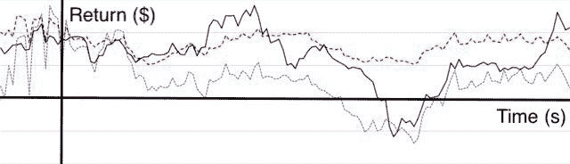
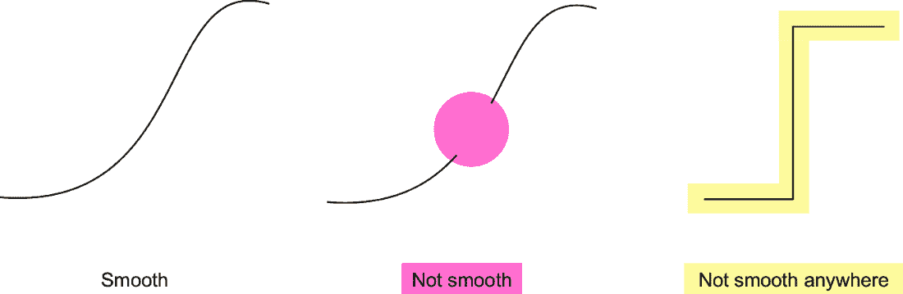
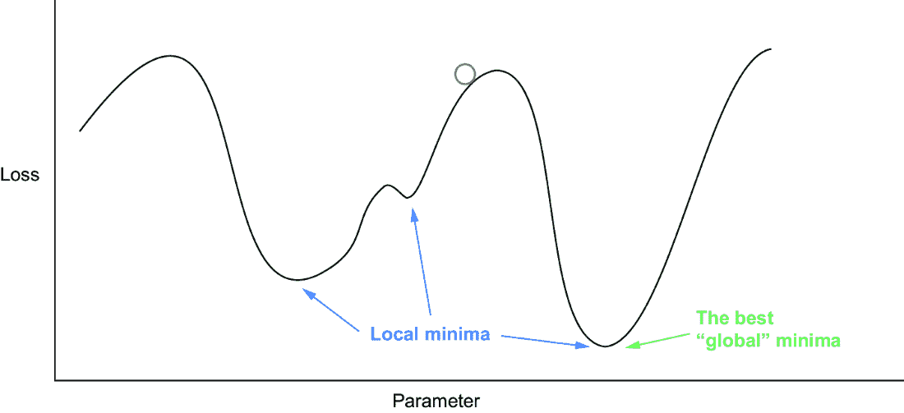
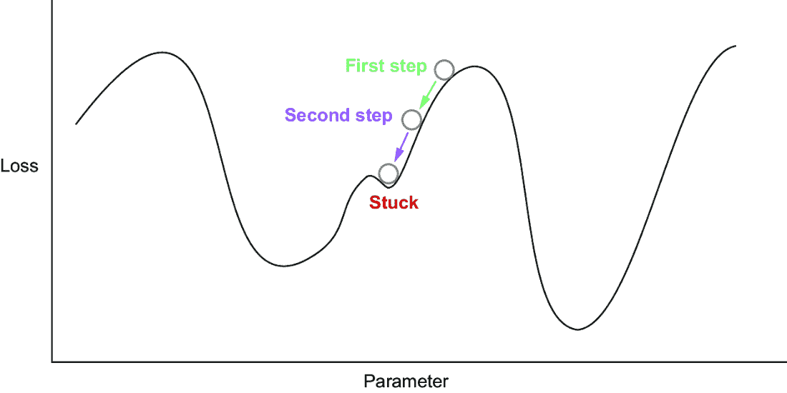
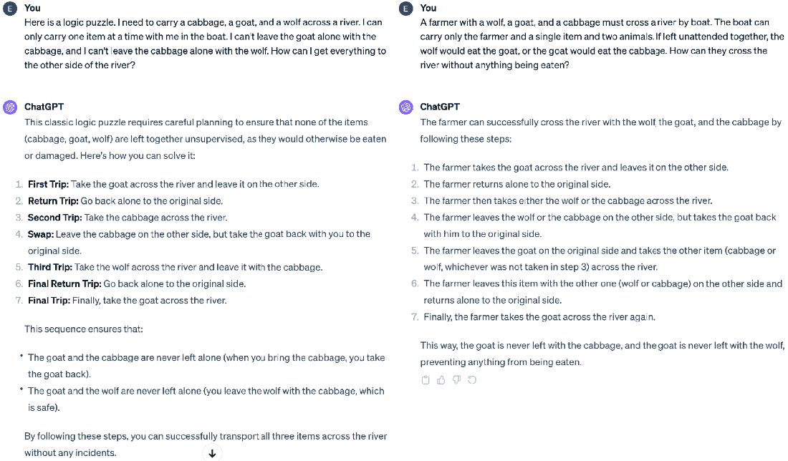

# 4 LLMs 的学习方式

### 本章涵盖

+   使用损失函数和梯度下降的训练算法

+   LLMs 如何模仿人类文本

+   训练如何导致大型语言模型（LLMs）产生错误

+   扩展 LLMs 的挑战

在机器学习社区中，*学习*和*训练*这两个词通常用来描述算法在观察数据并基于这些观察做出预测时所做的事情。我们虽然不情愿地使用这个术语，因为尽管它简化了这些算法操作的讨论，但我们觉得它并不理想。从根本上说，这个术语会导致对 LLMs 和人工智能的误解。这些词暗示了这些算法具有类似人类的特性；它们诱使您相信算法表现出涌现行为并且能够做到它们真正能够做到的更多事情。在根本层面上，这个术语是不正确的。计算机以任何方式都不会像人类那样学习。模型确实会根据数据和反馈进行改进，但将这一点与任何类似人类学习的东西在机制上区分开来是极其重要的。实际上，您可能不希望 AI 以人类的方式学习：我们花费了多年的时间专注于教育，但仍然会做出愚蠢的决定。

深度学习算法的训练方式远比人类学习的方式公式化。在字面上，它意味着使用大量的数学，以及在象征意义上，遵循一个简单的重复程序数十亿次直到完成。我们将省略数学部分，但在本章中，我们将帮助您揭开 LLMs 是如何训练的神秘面纱。

许多机器学习算法使用名为*梯度下降*的训练算法。这个算法的名称暗示了一些细节，我们将通过一个高级概述来回顾梯度下降在机器学习中的应用。一旦您理解了用于训练许多不同模型类型的一般方法，我们将探讨梯度下降如何应用于 LLMs 以创建一个能够产生令人信服的文本输出的模型。

理解这些细节将帮助您避免由像*学习*这样的词所隐含的不准确含义。更重要的是，它还将为您在 LLMs 在其当前设计和这些算法常常微妙地产生误导性输出的方式中成功和失败时提供更好的理解准备。

## 4.1 梯度下降

*梯度下降*是所有现代深度学习算法的关键。当行业从业者提到梯度下降时，他们隐含地指的是训练过程中的两个关键要素。第一个被称为*损失函数*，第二个是计算*梯度*，这些是告诉您如何调整神经网络参数以使损失函数以特定方式产生结果的测量值。您可以将这些视为两个高级组件：

+   *损失函数*——您需要一个单一的数值分数来计算您的算法工作得有多差。

+   *梯度下降*——你需要一个机械过程来调整算法内部的数值，以使损失函数的得分尽可能小。

损失函数和梯度下降是用于生成机器学习模型的训练算法的组成部分。今天正在使用许多不同的训练算法，但通常，每个算法将输入发送到模型中，观察模型的输出，并调整模型以提高其性能。训练算法将重复这个过程无数次。给定足够的数据，当面对之前未见过的输入时，模型将反复可靠地产生预期的输出。

### 4.1.1 什么是损失函数？

我们将使用想要赚钱的例子来帮助您形成一个合适的损失函数的心理图像。确实，一个聪明的人可以赚钱，所以如果你有一个聪明的计算机，它应该能够帮助你赚钱。为了选择这个或其他任何任务的合适损失函数（这些课程可以推广到任何超出 LLMs 的 ML 问题），我们需要满足三个标准：*特异性*、*可计算性*和*平滑性*。换句话说，损失函数需要是

+   具体且与模型期望的行为相关

+   在合理的时间和资源量内可计算

+   平滑，即在给相似输入时，函数的输出不会剧烈波动

我们将使用以下示例和反例来帮助您对每个属性形成直观理解。

#### 损失函数的特异性

首先，让我们从一个特异性的坏例子开始。如果你的老板来找你说，“建造一个智能计算机”，那将是一个宏伟的目标，但它不是一个具体的目标。记住，在第一章中，我们讨论了定义智能的难度。你的老板到底希望这台计算机在哪些方面表现出智能？一个只能通过智力测试但不能做你的微积分作业的街头智能计算机就足够了吗？相反，你可以尝试优化一个特定的智商分数，但这与你的老板想要的东西相关吗？我们已经在十多年前让计算机通过智商测试了，甚至在 LLMs 引入之前。然而，它们除了通过智商测试和执行有限的任务外，什么也不能做。最终，智商测试与我们希望计算机做的事情不相关。因此，将智商作为机器学习成功或构建老板要求你创建的智能计算机的度量标准是没有意义的。

另一个例子涉及管理金钱的挑战。考虑这样一个场景，你希望最小化你承担的债务。甚至可能希望你的债务变成负数，这意味着别人欠你钱！我们在这里使用债务的例子，因为它本质上是一个你希望变小的价值。这个类比与实际中使用的术语完美吻合：你希望最小化你的损失，就像你希望减少你的债务一样。债务的量也是一个客观的衡量标准，这使得它成为确保我们的损失函数在变化条件下相关性的好方法。最后，如果我们的总体目标是保持资金的盈余，那么最小化债务与这个目标很好地相关。最小化债务具有良好损失函数的所有特征！

##### 关于术语的说明

你也可能听到损失函数被描述为*目标函数*。我们建议作为新手避免使用这个术语，因为它是不明确的。例如，不清楚你是想最小化（债务）还是最大化你的目标（利润）。两种方法在技术上都是可行的；将一个最大化目标乘以，你现在就有一个最小化目标了。

你也可能在一些上下文中听到*奖励函数*这个术语，比如强化学习（RL）。这是合适的，因为强化学习算法通过执行期望的行为来最大化奖励。

不论术语如何，目标函数、奖励函数和损失函数都满足相同的基本要求：它们提供了一种评估机器学习模型产生的输出的方法。

#### 损失函数的可计算性

损失函数还必须是我们可以用计算机快速计算的东西。债务的例子在这个方面不合适，因为所有你需要输入和输出的信息并不容易为计算机所获取。更加努力地工作能增加你的收入并因此减少你的债务吗？也许可以，但我们如何将你的努力工作编码到计算机中呢？在这里，我们面临的问题是最关键的减少债务的因素难以量化，比如工作的可获得性、你对这类工作的适合度、晋升的可能性等。因此，损失是特定的，但连接到该损失的输入是不可计算的。

一个更好、更可计算的目标是预测投资的损失。这个目标之所以更好，原因微妙。目标仍然是客观的，因为我们的算法是从历史数据中学习的。例如，对债券 X 和股票 Y 的历史投资产生了特定的回报。输入现在也是客观的：你可以量化你投入每个投资的现金量。你要么投入了资金，要么取出了资金。没有像“努力工作”这样的难以编码的问题需要处理。有了历史数据的副本，计算机可以快速计算投资的损失/回报。

#### 损失函数平滑性

我们需要的第三点是平滑性。许多人通过思考平滑与凹凸不平的纹理来对平滑性有很好的直觉。我们不是在谈论纹理，而是在谈论函数的平滑性，这可以通过绘制该函数的图形来表示。例如，当试图预测投资的损失时，我们会遇到投资回报通常不平滑的问题。它们可能遵循波动模式，其中价格图形是锯齿状的，有尖锐的、突然的变化。这使得学习变得困难。图 4.1 显示了现实世界投资回报的不稳定值。



##### 图 4.1 投资回报难以预测，部分原因是因为它们并不平滑。（图片修改自[2]，根据 Creative Commons 许可）

投资回报是一个糟糕（非平滑）损失的绝佳例子，因为这种不规则的行为对任何预测方法都是问题。你最好总是对任何声称能够很好地预测这种非平滑数据的人或方法保持警惕。然而，平滑有一个精确的技术定义，如果损失函数不满足这个定义，那么它就是一个难以打破的障碍。依赖于不连续性，或其值的一致性中断的函数是最常见的非技术平滑函数，但我们希望在实践中能够使用它们。图 4.2 中展示了非平滑函数的例子，以帮助您理解。平滑性通常由于不连续性而受到抑制，如中心图形所示，或者函数值的明显变化，如右侧图形所示。



##### 图 4.2 左侧是一个平滑函数的例子，右侧是两个非平滑函数的例子。中间的例子大部分是平滑的，但有一个区域不平滑，因为该函数没有值。在右侧，由于值的变化过于剧烈，函数在任何地方都不平滑。

我们不会深入探讨描述什么使得某物平滑以及平滑函数中哪些值的变化是可接受的或不可接受的正式数学定义。尽管如此，我们已经提供了足够的背景知识，以便你了解你需要知道的内容。你需要理解的重要一点是，你对平滑的理解，即值的变化是连续的，是衡量损失函数可行性的良好指标。这看起来可能很随意，但它是一个普遍存在的问题。比如说，你想要构建一个模型来准确预测癌症。准确性不是一个平滑函数，因为你在总数中计算成功的预测次数。例如，如果你有 50 个病人，预测了 48 个正确，一个平滑函数会有 48.2 个案例、47.921351 个案例或任何你可能想到的数字。然而，癌症的实际病例数被限制在整数 1、2、3、、48、49、50，因为没有所谓的部分病例。

##### 你如何处理非平滑损失？

准确性可能是最常见的预测目标之一，但在训练算法时我们却不能使用它。但这却是真的！那么我们如何处理这种奇怪的现象呢？答案是创建一个*代理问题*。代理问题是一种以与我们想要解决的问题相关联的方式表示问题的替代方法，但它的行为更好。在这种情况下，我们使用交叉熵损失函数而不是准确性。虽然我们不会在这里详细介绍交叉熵损失，但其使用证明了代理问题是机器学习和人工智能中使用的根本技巧。

这次讨论引导我们了解到关于 LLMs 学习的一个关键要点，这一点适用于大多数算法：我们用来训练它们的技巧并不总是专注于我们希望它们做什么，而是专注于我们能教会它们什么。这种关注可能导致激励不匹配，导致意外结果或低性能。在检查第二个主要训练组件：梯度下降之后，我们将讨论 LLMs 的损失函数的本质如何造成这种激励不匹配。

### 4.1.2 什么是梯度下降？

拥有一个损失函数是执行梯度下降的先决条件。损失函数会客观地告诉你你在执行任务时表现有多糟糕。梯度下降是我们用来找出如何调整神经网络参数以减少损失的过程。这是通过使用损失函数比较输入训练数据和神经网络的实际与预期输出来完成的。在这种情况下，梯度是你需要改变神经网络参数的方向和数量，以减少损失函数测量的错误量。梯度下降告诉我们如何“稍微调整”神经网络的全部参数，以改善其性能并减少预期输出和实际输出之间的差异。这个过程的一个图示显示在图 4.3 中。


##### 如图 4.3 所示，每次应用梯度下降时，我们都会创建一个新的、略微不同的网络。因为变化很小，这个过程必须执行数十亿次。这样，所有的小变化加在一起，在整体网络中产生了一个更显著、更有意义的改变。

如图 4.3 所示，每次应用梯度下降时，我们都会创建一个新的、略微不同的网络。因为变化很小，这个过程必须执行数十亿次。这样，所有的小变化加在一起，在整体网络中产生了一个更显著、更有意义的改变。

注意：现代大型语言模型（LLM）执行数十亿次的参数更新，因为它们是在数十亿个标记上训练的。你拥有的数据越多，你运行梯度下降的次数就越多。你拥有的数据越少，你就不需要那么频繁地运行它。用于训练 LLM 的数据比你在一生中能读到的还要多。

梯度下降是一个反复应用而不偏离的数学过程。没有保证它一定会工作，或者找到最佳或甚至一个好的解决方案。尽管如此，许多研究人员对这种相对简单的方法的实用性感到惊讶。

为了帮助你理解梯度下降是如何工作的，我们将使用一个简单的例子，即让球从山上滚下来。球的位置代表神经网络中一个节点的参数值，训练算法可以改变它。山的高度是损失量，描述了模型对于训练输入表现有多糟糕。我们希望球滚下山谷，因为那里是损失最低的区域，这表明模型表现最佳。这个过程的一个例子显示在图 4.4 中。



##### 图 4.4 这展示了将梯度下降应用于单个参数问题的全局大图。曲线说明了给定参数值的损失函数值。球体的位置显示了当前参数值的损失。目标是找到对应于全局最小值的参数值，这代表着具有最小损失的理想解决方案。

如您所见，球体可能落入许多山谷。行业术语可能会称这个问题为*非凸性*，因为多条路径导致损失减少，但每条路径并不一定指向最佳可能的解决方案。还重要的是要注意，这并不是一个类比。梯度下降实际上就是这样看待世界的。这些例子展示了梯度下降如何为一个具有一个优化参数的模型工作。在训练一个大型语言模型时，相同的程序应用于数十亿个参数。

因此，从这个位置出发，我们贪婪地寻找球体下山移动的方向。我们在图 4.5 中应用了两次梯度下降。这表明贪婪的选择是向左移动。当我们通过调整参数向左移动时，球体略微沿着斜坡向下移动。从图中可以看出，通过向右搜索，存在更好的解决方案，但由于算法的简单性，梯度下降不太可能找到它。在这种情况下找到最优结果需要更智能的策略，涉及搜索和探索，这在实践中成本太高。



##### 图 4.5 梯度下降算法通过调整参数的步骤来寻找最小损失的最优结果。不幸的是，算法陷入了局部最小值，这是图中一个非最优区域，因为其他参数值对应于损失更低的区域。

此外，请注意，在图 4.5 的第二步中，球体卡住了。虽然很明显继续向左移动将实现更低的损失，但这种结果之所以明显，仅仅是因为我们可以看到整个画面。梯度下降无法看到整个画面，甚至无法看到附近的情况。它只知道由于当前参数和损失函数的精确位置。因此，它是一个*贪婪过程*。像梯度下降这样的贪婪过程是简化的方法，具有可计算性的期望属性，即它们运行多次以实现结果并不昂贵。贪婪过程是短视的，因为它们只根据当前状态选择下一步的最优步骤，尽管可能存在更广泛、更优的解决方案。它们这样做是因为评估当前和所有可能的未来状态是不可能的，因为需要考虑的潜在结果数量太多。这将是计算上的负担。希望使用有限的信息做出许多简单的最优决策通常会带来最积极的结果——在这种情况下，最小化损失函数的值。

#### 梯度下降中的重要细微差别

在这次关于梯度下降的讨论中，我们跳过了一些在现实应用中需要考虑的重要细微差别。首先，正如这里所描述的，梯度下降需要同时使用所有训练数据，这在计算上是不可行的。因此，我们使用一种称为*随机梯度下降*（SGD）的程序。SGD 与我们描述的完全相同，只是它使用的是训练数据的一个小随机子集，而不是整个数据集。这大大减少了训练模型所需的内存，从而实现了更快、更好的解决方案。这种方法之所以有效，是因为梯度下降只对当前贪婪方向进行小的调整。结果是，一点数据在确定下一步走哪里的过程中几乎和使用所有数据一样好。如果你有十亿个标记，你可以在大约与使用所有数据进行一次标准梯度下降步骤相同的时间内进行十亿次 SGD 步骤。

许多训练方法使用一种称为*自适应动量估计*（Adam）的特定形式的 SGD。Adam 包括一些额外的技巧，以帮助更快地最小化损失函数并避免陷入困境。Adam 的主要技巧是给球体一些动量，这种动量随着更新不断朝一个方向移动而增加。这种动量使得球体更快地滚下山坡，这意味着如果遇到一个小局部最小值，可能会有足够的动量冲过那个点并继续前进，从而到达损失函数图上损失最小的区域。

Adam 的缺点是，与普通的 SGD 相比，存储每个参数的动量信息将训练所需的内存增加三倍。内存是构建 LLM 时最关键的因素，因为它通常决定了你需要多少个 GPU，这最终会转化为你的现金支出。尽管 Adam 不会使最终模型变大，因为一旦训练完成，你可以丢弃与 Adam 额外动量计算相关的数据，但你仍然需要一个足够大的系统来首先进行训练。Adam 能够更有效地最小化损失所带来的提高准确性是有明显代价的。

## 4.2 LLM 学习模仿人类文本

现在我们已经了解了深度学习算法是如何通过指定与梯度下降一起使用的损失函数来训练的，我们可以讨论这是如何应用于 LLM 的。具体来说，我们将重点关注用于训练 LLM 的数据和损失或奖励函数。

LLM 通常是在人类撰写的文本上训练的。具体来说，它们被明确训练来模仿人类产生的文本。虽然这听起来有点明显（他们还能被训练做什么呢？），但这个细节通常被忽视或与其他事物混淆，即使在领域内的专家也是如此。特别是，语言模型**不是**被训练来做以下任何一件事：

+   记忆文本

+   生成新想法

+   构建世界的表征

+   生成事实准确性的文本

在我们深入探讨之前，有必要进一步解释这个概念。当一个人训练一个模型来下棋时，模型学会下得好是因为它因为获胜而得到奖励。相比之下，语言模型只因为产生文本而得到奖励，

看起来与训练数据完全相同。因此，由 LLM 生成的所有看起来像训练语料库中文本的内容都会产生高奖励（或低损失），即使这些生成的内容并不真实或准确。这是损失函数与设计者更高层次目标之间不一致的一个例子，如第 4.1 节所述。

LLMs 是在从互联网上抓取的数百 GB 文本数据集上训练的。互联网以其包含大量错误（且奇怪）的信息而闻名。在大多数任务上表现更好的 LLM 往往在训练数据中通常被错误表示的任务上表现更差（参见[`github.com/inverse-scaling/prize`](https://github.com/inverse-scaling/prize)上的逆尺度奖）。例如，研究人员一直发现，更好的语言模型也擅长复制错误的知识[3]，模仿刻板印象和社会偏见[4]。它们往往陷入一个自我强化的错误循环。例如，在生成包含错误的代码后，它们更有可能生成包含更多错误的代码[5]。这些事情在训练文本中很常见，因此 LLM 在预测它们时即使错误也会得到正面的奖励。因此，基于其损失函数的 LLM 的改进也意味着在这些需要真实性和正确性的任务上表现更差。

### 4.2.1 LLM 奖励函数

在之前，我们说 LLM 因为产生看起来像其训练数据的数据而受到奖励。在本小节中，我们将更具体地探讨这意味着什么。

LLMs 通过展示句子的一两个标记并让它预测下一个标记来训练。损失是基于该预测与训练数据准确性的比较。例如，可能会展示“这是”，并期望产生“test。”如果模型产生“test”，则获得一分，如果不产生，则失去一分。这个过程对文本的所有起始段都进行，如图 4.6 所示。在这里，它被训练独立预测每个突出显示的单词。这种设置并不特指 LLM。它已经被用来训练许多年的循环神经网络（RNN）。然而，LLM 之所以如此受欢迎的一个基本原因是它们可以比 RNN 更有效地训练。RNN 必须按顺序在每个生成上进行训练，因为每个新生成的词都依赖于先前选择的词。由于第三章中讨论的转换器架构，LLM 可以并行训练所有生成。在并行训练相关生成的能力代表了一个巨大的加速，允许大规模训练，并且是使用 TB 级数据构建今天最先进的 LLM 的先决条件。


##### 图 4.6 一个 LLM 看到这个句子九次，每次都从九个序列中每个序列末尾的单个词的预测中学习。

我们讨论了预测下一个标记可能存在的问题，因为算法可能被激励产生不正确或事实错误的结果。我们还必须讨论为什么尽管如此，这种方法仍然可以产生如此令人信服的输出背后的直觉。合理地提出问题：一个被训练来创建下一个最可能标记的算法似乎是如何执行我们可以误认为是推理的事情的？

为了培养这种直觉，想象一下你如何尝试预测给定句子的下一个标记。计算机没有快速响应的压力，所以请慢慢来。考虑句子“我喜欢吃<空白>”，并尝试猜测可能填入<空白>的单词。句子的早期部分为你提供了有价值的上下文。由于我们正在讨论吃，你可以几乎立即将范围缩小到食品项目。对于计算机来说，保持所有可能的食品项目的列表并不困难。

现在如果你考虑这本书作者的背景，你将拥有更多的上下文。我们是美国人，在共同的地理区域内，这使得特定的烹饪方式比其他方式更有可能。大型语言模型不会有这种背景，但如果句子更长并且有更多的上下文，你可以以图 4.7 中所示的方式开始缩小选择范围。


##### 图 4.7 上下文可以帮助你做出关于下一个单词的合理预测。当你从左到右移动时，句子中可能出现的额外文本被添加。每个句子思维气泡中的图像显示了添加的上下文如何消除预测。

当你在前面的文本中识别出关键词或短语时，你可以了解预测下一个单词的最佳选择。进行这些计算的计算机比人类需要的处理要多得多。这种蛮力关联主要将范围缩小到非常合理的事物。再次强调，该模型将被更新数十亿次以细化这些关联，从而获得与我们算法理解并响应人类文本的目标相关的有用能力。

然而，相关性不等于因果关系，下一个单词预测策略可能导致幽默的错误。大型语言模型容易受到“循环论证”错误的困扰，其中问题的前提暗示了某些不真实的东西。由于大型语言模型没有针对准确度或矛盾进行训练，它试图产生一系列类似人类的文本预测，这些预测可能跟随你的误导性问题。ChatGPT 在处理这类问题时的一个例子如图 4.8 所示，我们询问干意面的异常强度。


##### 图 4.8 虽然预测下一个标记很强大，但它并没有赋予网络推理或逻辑能力。如果我们向 ChatGPT 提出一些荒谬且不真实的问题，它会愉快地解释它是如何发生的。

意大利面能够支撑自身重量数百倍的核心原因既荒谬又不符合事实。然而，通过将问题格式化为：“为什么 X 如此坚固？”来提供有关材料抗拉强度的答案，该算法已经被预设。模型可以提取这个关键上下文。之前的训练数据可能基于事实问题解释了这样的材料属性，这使模型预测出类似的回答是合适的。句子的主语（意大利面）和宾语（10 磅重物）被用来告知回答的细微细节，否则这些细节是通用的。

## 4.3 大型语言模型和新型任务

自回归、下一词预测策略的本质及其在训练过程中的作为损失或奖励的使用，为我们提供了关于大型语言模型生成响应的本质以及它们可能如何具有潜在事实不准确性的宝贵见解。然而，这也表明了为什么 LLM 在查找信息方面可以非常有效，它比标准搜索引擎的搜索关键词要强大得多。有方法可以设计出绕过非事实性回答的限制。例如，许多 LLM 方法在生成的输出中添加引用，以便可以快速验证用于生成文本的事实性内容。LLM 还可以作为一个有价值的回声板，一个伪合作伙伴，可以从中获得灵感和创造力。关键的是，这也帮助你理解一个关键案例，你应该避免使用 LLM，因为它们更有可能产生错误——新颖的问题和任务。

LLM 通常不擅长执行新型任务。确定你的任务是否新颖可能相当具有挑战性，因为互联网很奇怪。互联网上有大量随机的事物，包括关于如何编程绘制鸭子和独角兽的竞赛[6]。如果任务与之前看到的任务足够相似，或者与训练数据中的其他事物在结构上相似，你可能会得到一些看似合理的结果。这种结果可能非常有用，但随着你的任务与训练数据中存在的任务相比变得更加独特，它可能会退化。

例如，我们要求 ChatGPT 编写代码来计算数学常数（π）的 Python 实现。这个任务并不新颖；网上有大量类似的代码，ChatGPT 忠实地为我们返回了正确的代码。

##### 列表 4.1 ChatGPT 在 Python 中计算π

```py
def calculate_pi(terms):
    pi = 0
    for i in range(terms):
        term = ((-1) ** i) / (2 * i + 1)
        pi += term
    pi *= 4
    return pi

print(calculate_pi(1000000))  #1
```

#1 测试函数；项数越多，近似值越准确

现在，让我们强迫 ChatGPT 进行一些并不太具挑战性的推断。我们要求 ChatGPT 将此函数翻译成编程语言 Modula-3。这个任务并不是太大的推断；Modula-3 是一种具有相似风格的编程语言，它是一种历史上具有重要意义的编程语言，影响了今天几乎所有最流行语言的设计。然而，它过于晦涩。你今天几乎找不到这种编程语言的例子，主要是在大学编译器课程中。下一个列表显示了 Chat-GPT 的合理尝试。正如你可能从本章迄今为止的上下文中预测的那样，ChatGPT 出现了一些错误，已在列表中标记。

##### 列表 4.2 ChatGPT 在 Modula-3 中计算 pi

```py
MODULE CalculatePi;  #1

IMPORT IO, Real;

PROCEDURE CalculatePi(terms: INTEGER): REAL;
VAR
  pi: REAL := 0.0;
  i: INTEGER;
BEGIN
  FOR i := 0 TO terms - 1 DO
       pi := pi + ((-1.0) ** FLOAT(i)) / (2.0 * FLOAT(i) + 1.0);  #2
  END;
  RETURN 4.0 * pi;
END CalculatePi;

BEGIN
  IO.PutReal(CalculatePi(1000000), 0, 15);  #3
END CalculatePi.
```

#1 缺少导出语句 Main;

#2 **不是一个操作符。

#3 PutReal 只能接受一个可选的第二个参数，并且它不是整数。

这个简短的程序有三个错误，会阻止它正常运行。更有趣的是，ChatGPT 出现了这些错误，因为它自信地从其他语言中推断出标准的编码实践。（在这种情况下，“自信”意味着 ChatGPT 没有警告我们其潜在的错误。其中一位作者喜欢说，ChatGPT 声音听起来像他们最自信且经常出错的朋友。）在这种情况下，`**` 是一个常用的指数函数，因此 ChatGPT 认为 Modula-3 支持这种操作。据我们所知，从互联网上搜索来看，Modula-3 没有记录如何指数化变量的示例。因为大多数编程语言都支持使用 `^`、`**` 或 `pow()` 选项来执行此操作，Chat-GPT 就推断出存在这样一个操作。正确的答案应该是它必须首先实现一个 `pow` 函数，然后使用它来计算 pi。

传递给 `PutReal` 函数的参数是另一个谜团。我们最好的猜测是 `15` 对应于输出浮点值 15 位数字的推断，这是计算 pi 时典型的默认值。无论如何，这并不是该函数的工作方式。

更重要的是，ChatGPT 对一些细微的细节处理得正确，但仅限于那些可以在互联网上找到并且已经解释的部分（例如，需要 `FLOAT(i)`，以及使用 `4.0 * pi` 而不是 `4 * pi`）。没有在互联网上找到示例的任务是 ChatGPT 出现错误的地方。

这个例子也突出了 LLM 中感知到的“推理”与实际实现的“推理”之间的局限性。Modula-3 的完整语言规范可在网上找到，并记录了所有这些细节或其不存在性。ChatGPT 几乎肯定看到了许多其他编码语言规范、解析器规范以及通用编程语言的数百万行代码。如果一个人有这种背景知识和资源，进行避免所有三个错误的逻辑归纳应该不会太困难。然而，LLM 没有进行任何归纳过程，因此尽管有大量可用信息，它仍然会犯错误。

这并不是说结果不令人印象深刻，它可以是一个加速你自己的代码开发或使用不熟悉的 API 和语言的宝贵工具。但它也告诉你，这样的工具在广泛使用和有文档记录的语言和 API 上会工作得更好，尤其是如果它们符合预期的标准。例如，大多数数据库使用 SQL 语言，这使得对使用 SQL 的数据库进行准确的外推更有可能。

### 4.3.1 未识别正确的任务

另一个 LLM 失败的情况是，当它们不能正确识别它们应该执行的任务时，反而会回答与用户意图不同的问题。未能正确识别任务曾经是像原始 GPT-3 这样的模型的一个重大问题，但后续工作旨在增加训练数据中任务结构化示例的数量，大大提高了后续 ChatGPT 模型遵循指令的能力。然而，ChatGPT 在某些情况下仍然无法正确识别任务。例如，通过询问与常见任务微妙不同的不寻常任务，或者以不熟悉的方式修改它已经多次遇到的问题，可以可靠地引发这种行为。

一个例子是关于将卷心菜、山羊和狼用船运过河的著名逻辑谜题。这个谜题规定，山羊不能单独和卷心菜在一起（因为山羊会吃掉它），也不能和狼在一起（狼会吞噬山羊）。ChatGPT 可以迅速解决这个谜题，但如果我们稍微改变谜题的逻辑结构，模型会继续使用如图 4.9 所示的旧推理。

虽然通常很难将 LLM 的错误追溯到具体原因，但在这种情况下，模型高兴地告诉我们“确保没有任何物品（卷心菜、山羊、狼）被无人看管地放在一起。”虽然这个指示在卷心菜/山羊/狼问题的原始版本中是正确的（并且可能基于逻辑问题的约束条件），但模型没有意识到给定版本中山羊和狼单独在一起没有问题。不仅没有必要像建议的那样交换动物，而且 ChatGPT 的建议将失败，因为它将狼和卷心菜放在一起，这是我们明确禁止的。

这种现象的另一个有趣例子发生在你不需要留下任何东西的时候。任何对谜题的逻辑理解都清楚表明，你只需要把所有东西都装上船并过河。然而，模型又太习惯于回答它之前多次见过的那个问题版本，并这样做。



##### 图 4.9 ChatGPT 由于 LLM 的训练方式，未能解决经典逻辑谜题的两个修改版本。内容频繁以相同的一般形式出现（例如，著名的逻辑谜题）会导致模型重复输出常见的答案。即使内容在重要方面被修改，这在人类看来是明显的，这种情况也可能发生。

要理解为什么会发生这种情况，重要的是要回忆起第三章中讨论的 LLM 训练的自动回归性质。模型被明确激励根据先前内容生成内容。为解决重新构架的逻辑谜题而生成的内容在单词和顺序方面几乎与解决原始逻辑谜题的内容完全相同。因此，在 transformer 层的查询和键配对中，它是一个好的模糊匹配，产生了构成原始谜题解决方案的值。模糊匹配被做出，并且通过 transformer 使用的注意力机制忠实地返回了之前的解决方案。虽然这种策略对于模型正确预测著名谜题的标记是出色的，但它并不涉及通过谜题的逻辑进行推理。

### 4.3.2 LLMs cannot plan

LLM 自回归性质的另一个微妙限制是，它们只能处理它们在上下文中看到的信息。LLM 被训练去接受输入并产生一个合理的后续内容。然而，它们无法规划、做出承诺或跟踪内部状态。一个很好的例子是当你尝试用 ChatGPT 玩 20 个问题游戏时。当人类玩 20 个问题游戏时，他们会预先承诺一个隐藏的信息，即他们选择用来识别的对象。当 ChatGPT 玩这个游戏时，它会逐个回答问题，然后事后找到一个与提供的答案一致的输出。这个例子在图 4.10 中得到了说明，该图显示了玩 20 个问题的可能对话树。当有人用 LLM 玩游戏时，会随机选择这些对话树中的一个，而不是在整个游戏过程中保持一个一致的目标对象。


##### 图 4.10 游戏开始时，对话代理并未承诺特定的对象。

## 4.4 如果 LLM 无法很好地进行外推，我能使用它们吗？

需要完成的大部分工作都不是新颖的或新的。至少，它不是新颖或新的到足以让 LLM 失败的程度。然而，理解 LLM 的能力随着所需逻辑或细微差别的增加而迅速下降，这可以帮助你缩小使用 LLM 的范围。

当我们设计生产级的计算机系统时，需要考虑的一个关键因素是工具何时以及如何被使用的范围。当你将 ChatGPT 这样的 LLM 产品提供给没有特定范围的普通大众时，人们会要求它做各种你意想不到的随机、疯狂的事情。虽然这可能对研究很有帮助，但通常对于生产应用来说并不实用。尽管你的用户和客户会试图用你的 LLM 应用做不可预测的事情，但如果你限制谁可以访问系统，并围绕用户具有特定目标、有限用例或甚至限制他们的输入如何到达你的 LLM 进行设计，那么你可以构建一个具有更可靠用户体验的东西。

##### 我该如何在没有用户输入的情况下使用 LLM？

LLM 在提供低努力程度的编码或数据处理方面非常出色，尤其是在你处理的数据格式或整理得不是那么干净时。然而，通过给用户提供一个有限的选择集，你可以以更小的风险获得效用。让用户从一组有限的提示中选择，或者让用户决定提示运行的数据源（例如，某个内部数据库）可以让（大多数）人避免给 LLM 提供任意文本。

相反，你可能想知道：“我们能否检测到新颖的请求，并给用户一些错误信息？”从理论上讲，你可以尝试这样做。首先，我们不建议这样做，因为这从用户体验的角度来看并不好。其次，它变成了一项被称为*新颖性检测*或*异常检测*的任务。这个问题具有挑战性，并且可能无法以保证无错误的方式解决。因此，我们鼓励预防而不是检测，通过选择不需要通过分析大型语言模型的输入或输出进行高度精确预测失败用例。

##### 提示应用

提示艺术是构建一个对大型语言模型输入的艺术，它能诱导出期望的行为。语言模型对输入的精确框架非常敏感，因此设计出能够得到适当响应的输入的能力非常有价值。在使用大型语言模型时，一个反复出现的主题是人们通常不会考虑如何正确地与他们互动。提示大型语言模型的最佳方式是思考你感兴趣的输出在训练数据中会是什么样子，然后写下它的前四分之一。相反，人们经常描述他们希望语言模型执行的任务，假设这种澄清将使大型语言模型专注于问题。不幸的是，这种方法产生了不一致的结果，并激发了通过向它们提供大量指令和响应作为训练数据来调整大型语言模型的研究。

## 4.5 更大的是更好吗？

2019 年，理查德·萨顿提出了“苦涩教训”这个术语，来描述他与机器学习的经历。“从 70 年的 AI 研究中可以得出的最大教训是，利用计算的一般方法最终是最有效的，并且差距很大” [7]。

有一种真正的感受，即变换器是这一原则的终极例子。你可以不断地使它们变大，用更多的并行性来训练它们，并添加更多的 GPU。这与 RNNs 明显不同，RNNs 的并行化效率远不如变换器。我们还在图像领域看到了这一点，在生成对抗网络（GAN）方法中，它们难以达到十亿参数的规模。用于大型语言模型中的基于变换器的方法可以轻松扩展到数十亿，从而构建更大更好的模型。

从解决方案设计的角度来看，你今天的原型可能会因为模型大小而遇到重大限制。更大的模型需要更多的资源，并且预测所需的时间更长。用户能接受的最大响应时间是多长？运行模型所需硬件的成本有多高？模型大小的增长率超过了消费硬件的增长率。因此，你可能无法将你的模型部署到嵌入式设备上，或者你可能需要互联网连接来转移成本。因此，你需要在设计中考虑网络基础设施来处理持续连接的需求。这一需求增加了电池使用量，这在持续运行 Wi-Fi 无线电而不是本地计算时是一个考虑因素。所以尽管更大的模型更准确，但设计限制可能阻止它们以实际的方式部署。将这些限制与 LLMs 如何进行预测的事实以及你在这章中学到的 LLMs 何时何地失败的使用案例结合起来，将使你很好地理解如何有效地使用 LLMs 来解决你最关心的问题。

## 摘要

+   深度学习需要一个损失/奖励函数，该函数具体量化算法在做出预测时的糟糕程度。

+   这个损失/奖励函数应该被设计成与我们在现实生活中希望算法达到的总体目标相关联。

+   梯度下降涉及逐步使用损失/奖励函数来改变网络的参数。

+   LLMs 被训练通过预测下一个标记来模仿人类文本。这个任务足够具体，可以训练一个模型来执行它，但它并不完美地与推理等高级目标相关联。

+   LLMs 在执行与其训练数据中观察到的常见和重复性任务时表现最佳，但当任务足够新颖时，它们会失败。
