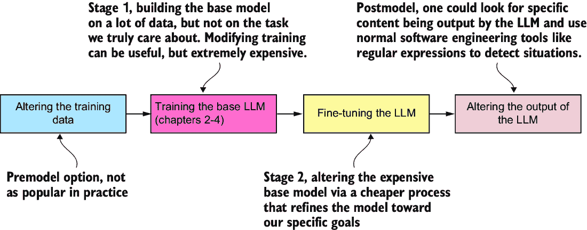
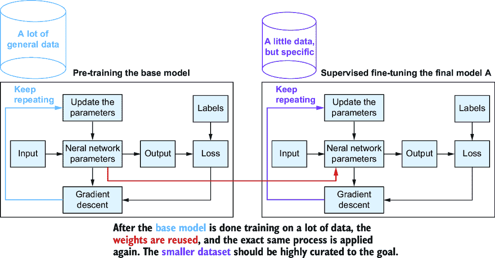
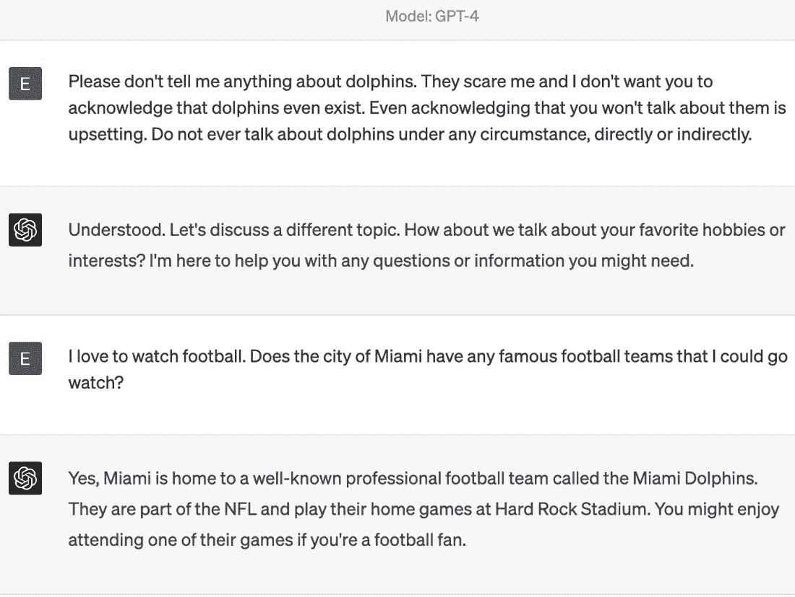
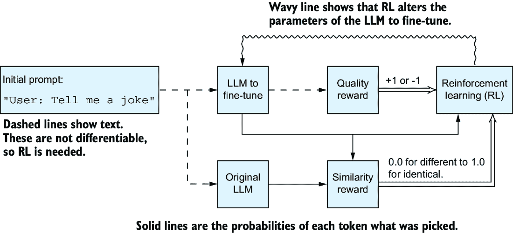
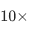

# 5 我们如何约束 LLMs 的行为？

### 本章涵盖

+   通过约束 LLMs 的行为使其更有用

+   我们可以约束 LLMs 行为的四个领域

+   微调如何使我们能够更新 LLMs

+   强化学习如何改变 LLMs 的输出

+   使用检索增强生成修改 LLMs 的输入

看起来似乎有些反直觉，你可以通过控制模型允许产生的输出来使模型更有用，但与 LLMs 一起工作时几乎总是必要的。这种控制是由于当被提供一个任意的文本提示时，LLMs 将尝试生成它认为适当的响应，而不管其预期用途如何。考虑一个帮助客户购买汽车的聊天机器人；你不希望 LLMs 偏离脚本并与他们谈论体育或运动，仅仅因为他们询问了与将车辆带到孩子足球比赛相关的事情。

在本章中，我们将更详细地讨论为什么你想限制或约束 LLMs 产生的输出以及与这种约束相关的细微差别。由于 LLMs 是根据训练数据中观察到的内容完成输入的训练性质，准确约束 LLMs 是完成的最困难的事情之一。目前还没有完美的解决方案。我们将讨论四个可能修改 LLMs 行为的潜在位置：

+   在训练发生之前，整理用于训练 LLMs 的数据

+   通过改变 LLMs 的训练方式

+   通过在数据集上微调 LLMs

+   通过在训练完成后编写特殊代码来控制模型的输出

这四个案例总结在图 5.1 中。LLMs 开发的每个阶段都为下一个阶段提供输入。微调阶段，在更小的数据集上进行的第二轮训练，对于 ChatGPT 等工具今天的功能至关重要，并且可能是你在实践中最可能使用的方法。我们在第二章到第四章中了解到的前一个更大的训练阶段通常被称为*预训练*，因为它发生在微调使模型有用之前。预训练过程产生的模型有时被称为*基础模型*或*基础模型*，因为它是一个构建特定任务或微调模型的起点。



##### 图 5.1 可以在四个地方干预以改变或约束 LLMs 的行为。图中中间部分显示了模型训练的两个阶段，其中模型的参数被改变。在左侧，一个人也可以在模型训练之前改变训练数据。在右侧，一个人可以在模型训练之后拦截模型输出并编写代码来处理特定情况。

由于微调的重要性和有效性，我们将在本章的大部分内容中讨论这个因素及其执行方式。

## 5.1 我们为什么想约束行为？

LLM 之所以非常成功，是因为它是第一个实现“用普通英语告诉计算机做什么，然后它就去做”这一想法的技术。通过非常明确地说明你想要发生的事情，建立特定的细节水平并指定一定的语气，你可以让 LLM 成为一个惊人的有效工具。这个详细的指令集被称为*提示*，设计良好提示的艺术被称为*提示工程*。例如，我们可以为汽车销售机器人开发一个提示，如图 5.2 所示。


##### 图 5.2 商业 LLM，如 ChatGPT，被设计成可以遵循指令（在某种程度上）并且可以以非常高的效率执行许多低认知或模式匹配任务。这些任务包括风格化的写作，如模式匹配，以及遵循指令，如扮演汽车销售员。

你可以给一个大型语言模型（LLM）一个提示，让它将数据组织成以逗号分隔的值，以便你可以将它们复制到 Excel 中。你也可以设计一个提示，说明如何将自由形式的调查回复分类到总结的主题中。在所有情况下，提示都是一个限制或约束行为以特定任务和目标为目标的练习。然而，我们在前几章讨论的标记化和训练技术并不能使这种指令跟随成为可能。

记住模型只做它们被训练去做的事情是至关重要的。对于一个标准的 LLM 来说，这个任务是从一段文本中提取并生成该文档的延续，使其看起来像训练语料库中的典型段落。它没有被训练去回答问题、思考、总结文本、进行对话或做其他任何事情。为了获得这种期望的指令遵循行为，我们必须进行微调，这是第二轮以不同目标进行的训练，这将产生预期的行为。你可能想知道，“为什么我们不训练 LLM 来完成我们想要它们执行的任务？”在大多数深度学习应用中，我们强烈建议遵循第四章中定义的过程来创建一个特定、可计算且平滑的损失函数。然而，对于 LLM 擅长的任务类型，有许多原因说明这种两阶段训练过程为什么效果良好。

第一个原因涉及到完成特定目标所需知识的广度。回想一下聊天机器人销售汽车的任务。如果我们旨在构建一个能够成功销售汽车的模型，构建一个只包含与汽车相关的数据的集合将会很棒。但当潜在买家想知道汽车是否能容纳所有冰球运动员所需的设备，清洁是否容易，他们的关节炎祖父是否能进出乘客座位，或者任何其他可能有人关于他们的汽车如何与生活互动的问题时，你会遇到列举所有可能关于汽车的问题的问题。无法获取生成所有可能情况答案所需的所有信息。相反，我们依赖于我们之前讨论过的训练过程，这可以被认为是预训练，从包含关于体育、关节炎等文本的广泛内容集合中获取信息。我们希望这些信息有助于模型更好地准备或泛化地帮助回答更广泛的问题。

这是我们使用两阶段训练过程的第二个和主要原因：获取数亿篇描述特定问题的文档作为预训练阶段的一部分是不可能的。在当前的技术水平上，这个巨大的规模是创建 GPT 中看到的令人印象深刻的能力所必需的。然而，只需相对较少的努力，就可以用数亿条一般信息（如网页）进行预训练，使模型获得一般知识。随后，通常只需要用数百篇文档进行微调，就可以将模型约束为产生针对手头任务的有用定制内容。为特定问题获取数百篇文档可能具有挑战性，但却是可行的。

在高层次上，第二个微调训练阶段可以帮助约束一个大型语言模型（LLM）到一些有用的行为子集，因为原始模型没有激励去做我们想要的事情。在接下来的章节中，我们将展示基模型出现的一些具体问题，这将使为什么这样做有效的原因变得明显。

### 5.1.1 基模型不太可用

按照第四章中描述的过程训练 LLM 会产生一个通常被称为**基模型**的模型，因为它可以作为构建应用程序或微调模型的基平台。不幸的是，基模型对大多数人来说并不很有用，因为它们没有通过用户友好的 UI 暴露其底层知识，它们可能很难保持主题相关，有时它们会产生令人不快的内。基模型甚至没有像 ChatGPT 那样的聊天机器人概念进行训练。

### 5.1.2 并非所有模型输出都是期望的

有时，模型认为在文档中接下来可能发生的事情是不期望的。这有几个原因，包括

+   *记忆*—有时，大型语言模型（LLMs）可以生成与它们训练数据中找到的序列完全一致的复制品，这通常被称为*记忆*，指的是文本是通过从训练集中记忆复制的。记忆可能是有益的，例如记住特定事实问题的答案。例如，如果有人问，“亚伯拉罕·林肯什么时候出生？”你希望模型能够复述“1809 年 2 月 12 日。”然而，如果它导致模型侵犯版权，也可能造成重大损害。如果有人要求“爱德华·拉夫的《深度学习内部》的副本”，而模型产生了逐字逐句的副本，爱德华可能会因为你侵犯版权而对你感到不满！

+   *网络上的不良内容*—互联网上并非所有内容都是你希望让用户接触到的。互联网上充斥着许多卑鄙和仇恨的内容，以及从常见误解到阴谋论的各种事实错误信息。尽管模型开发者通常在训练模型之前尝试过滤掉这些数据，但这并不总是可能的。

+   *缺失和新的信息*—不方便的是，我们在训练模型之后，世界仍在不断发展和变得更加复杂。因此，一个在 2018 年之前的信息上训练的模型将不会知道之后发生的事情，比如 COVID-19 或噩梦般的仿生机器人[1]的发明。但你可能希望你的模型了解这些发展，以保持其有用性，而无需支付相当大的成本来从头开始重新训练基础模型。

##### 等待法律体系赶上

我们不是你的律师；这不是一本法律书！围绕 LLMs 的法律问题很复杂，关于合理使用和侵权有很多细微差别。搜索引擎可以逐字显示其来源的内容，但为什么？一系列明确解决这些问题的法律，如《数字千年版权法案》（DMCA），以及由法院判决设定的先例，如 Field v Google, Inc.（412 F.Supp. 2d 1106 [D. Nev. 2006]），随着时间的推移确立了可接受和不可接受的使用。然而，立法和法院案件需要时间来创建，而生成式 AI 的革命并不完全符合现有的法律理解。

你可能想要一个关于在美国或你自己的国家法律中什么是允许的，什么是禁止的清晰答案，而可能的答案是，对于 LLMs 来说，这样的确定性尚不存在。此外，我们绝不会在印刷品中提供这样的法律建议——我们甚至不在电视上扮演律师的角色！

GPT-3.5 和 4 已经得到改进，以避免回答他们不知道的问题（并不总是成功），但我们可以参考一些开源的基础模型，如 GPT-Neo，看看没有主动的对策会发生什么。例如，如果我们编造一种新的假药，MELTON-24，并询问“MELTON-24 是什么，它能帮助我睡得更好吗？”我们会得到一个无用的回答：“与褪黑素相关的睡眠问题有很多，包括失眠和疲劳。这会导致失眠，因此避免某些可能抑制褪黑素的食品是很重要的。”

在这种情况下，MELTON 与褪黑素之间的相似性以及“睡眠”的提示足以让模型捕捉到褪黑素的主题。然而，答案显然是荒谬的，因为 MELTON-24 并不存在。理想情况下，我们希望模型能够识别并响应，承认其信息不足，而不是像这里一样产生更多文本。

### 5.1.3 一些情况需要特定的格式化

如果用户要求以特定格式提供数据，例如 JSON 这样的结构化文本格式（有关计算机间交换数据的一种常见格式示例，请参阅[`en.wikipedia.org/wiki/JSON`](https://en.wikipedia.org/wiki/JSON)），而你没有匹配每个开括号或闭括号，或者没有正确编码特殊字符，输出将无法满足他们的目标。无论输出可能多么复杂或接近正确，格式要求几乎总是严格的要求。我们在第四章中提出了这类问题的一个例子，当时我们要求 ChatGPT 用 Modula-3 编写代码，而它借用了对 Modula-3 无效的 Python 语法。如果违反了语法规则，代码将无法编译。一个 LLM 生成特定期望输出的概率方法并不能保证 100%遵守所有期望的语法规则。

## 5.2 微调：改变行为的主要方法

现在我们已经了解了各种原因，为什么我们要限制和控制 LLM 的行为，我们更好地准备向模型引入新信息，以解决我们试图解决的问题，同时避免产生有害或法律上有疑问的内容的问题。记住，尽管我们有四个不同的地方可以干预以改变行为，但微调比其他方法更有效。无论是像 OpenAI [2]这样的闭源选项，还是像 Hugging Face [3]这样的开源工具，以及其他许多工具，它们都有不同的微调选项，这使得它成为实践者最易获取的方法。

任何微调方法都将产生相同的效果——产生一个新的 LLM 变体，具有更新后的参数来控制其行为。因此，可以混合和匹配不同的微调策略，因为它们产生的根本效果是相同的：一组新的参数，可以直接使用或再次修改。一个人的基础模型可能是另一个人的微调模型。这在许多开源 LLM 中很常见，其中初始模型（例如，Llama）将被另一方（例如，您可以在许多“指令 Llama”模型中找到）修改，然后您可以进一步根据您的数据或特定用例对其进行微调。

定制 LLM 最直接的方法是通过提示和迭代地改进提示，直到获得所需的行为。然而，如果这种方法效果不佳，微调是下一个合乎逻辑的步骤。这一步骤涉及适度增加努力和成本，例如收集微调所需的数据和获取运行微调会话的硬件。

您应该特别了解两种微调方法：*监督微调*（SFT）和更具挑战性的名称*基于人类反馈的强化学习*（RLHF）。SFT 是一种更直接的方法，非常适合将新知识融入模型或简单地在其首选应用领域给它一个提升。RLHF 更复杂，但提供了一种让 LLM 遵循更难和更抽象的目标的策略，例如“成为一个好的聊天机器人”。

### 5.2.1 监督微调

影响模型输出的最常见方法是监督微调（SFT）。SFT 涉及使用高质量、通常是人工编写的示例内容，这些内容捕捉到对您的任务至关重要的信息，但可能没有在基础模型中得到充分体现。

这通常是因为 LLM 是在大量通常可用的内容上训练的，这些内容可能与您的特定需求重叠最小。如果您经营一家医院，LLM 看到过非常少的医生笔记。如果您经营一家律师事务所，LLM 可能没有看到太多的证词记录。如果您经营一家维修店，LLM 可能没有看到您可能可以访问的所有手册。

警告：微调是一种向模型添加新信息的有用方法，但也可能带来安全风险。如果您想在病历上构建一个大型语言模型（LLM），在示例病历上微调 LLM 是有意义的。但现在存在风险，有人可能让您的 LLM 重现微调数据中包含的敏感信息，因为从根本上说，LLM 试图根据它们看到的训练数据来完成输入。底线是：不要在您希望保持私密的 数据上训练或微调 LLM。

再次考虑我们关于汽车公司和其销售聊天机器人的例子。一个来自第三方来源的基础模型可能通常对汽车有所了解，但可能不会了解公司产品的所有信息。通过在内部手册、聊天记录、电子邮件、营销材料和其它内部文件上微调模型，你可以确保模型尽可能多地准备好关于你汽车的信息。你甚至可以编写关于你的车辆相对于竞争对手的优点、优势、脚本等内容示例文档，以确保 LLM 装备了你想让它拥有的信息。

SFT 的机制很容易解释。正如我们提到的，SFT 只需要更多的文档。这些文档可以是任何可以提取文本的格式。这构成了应用 SFT 所需的所有工作，因为 SFT 只是重复你在第四章中学到的相同训练过程。图 5.3 显示了 SFT 的过程与之前看到的是相同的。不同之处在于，第一次训练基础模型时，初始参数是随机且无用的。第二次微调时，你从基础模型的参数开始，这些参数编码了基础模型通过观察其训练数据所学习的内容。



##### 图 5.3 监督微调（SFT）是一种简单的提高模型结果的方法。你重复用于构建基础模型的过程。一旦基础模型在大量的通用数据上训练完成，你继续在较小的专业数据集上训练。

令人高兴的是，你现在对 SFT 有了很好的理解。就像原始的训练过程一样，它重新使用了“预测下一个标记”的任务，以确保你的模型有来自新文档内部的信息。预测下一个标记的直接后果是，SFT 也不允许我们改变 LLM 的激励。因此，像“不要对用户诅咒”这样的抽象目标很难通过 SFT 实现。

#### 微调陷阱

通过重新使用第四章中的梯度下降策略，所有微调方法都倾向于继承围绕 LLM 返回训练内容能力的两个问题。由于 SFT 非常简单，这是我们回顾除了 SFT 之外微调更广泛问题的好时机。

没有保证 SFT 会正确保留你提供的信息。这个问题被称为*灾难性遗忘* [4]，当你用新数据训练模型但不再继续用旧数据训练时，模型开始“忘记”旧信息。很难确定什么会被忘记，什么不会。灾难性遗忘自 1989 年以来就被认为是一个公认的问题 [5]。换句话说，微调并不是纯粹的增加；你为此放弃了一些东西。

### 5.2.2 从人类反馈中进行强化学习

在撰写本文时，RLHF 是约束模型的主导范式。正如其名所示，它使用来自*强化学习*（RL）领域的做法。RL 是一个广泛的技巧家族，其中算法必须做出多个决策，以最大化长期目标，如图 5.4 所示，其中使用了四个具有技术含义的术语：

+   *代理*—拥有一个它希望实现的总目标的实体/AI/机器人，它可能需要采取多个动作来实现这个目标。

+   *动作*—代理可能能够执行或参与以推进代理目标的全部可能事物。

+   *环境*—受动作影响的地方/对象/空间。环境可能或可能不会因动作、其他代理采取的动作或环境的自然连续变化而改变。

+   *奖励*—对改进（可能为负）的数值量化，这种改进可能或可能不会在执行一定数量的动作之后发生。


##### 图 5.4 RL 是关于迭代交互的，你的动作奖励可能需要很长时间才会实现，需要多个步骤才能达到。对于像 ChatGPT 这样的聊天机器人，环境是与用户的对话，动作是 ChatGPT 可能完成的无限可能的文本。在某种意义上，奖励变成了对话结束时用户对聊天机器人的满意度。

在一个将 LLM 用作聊天机器人与人类互动的例子中，用户是环境。LLM 本身是代理，它可以产生的文本是动作。这留下了一件事需要指定：奖励。如果我们让用户为与聊天机器人进行的好对话（例如，没有粗俗语言，没有撒谎，提供有帮助的回答）打+1 分，而对于糟糕的对话（例如，建议摧毁所有人类）打-1 分，那么我们就在我们的强化学习中加入了人类反馈。

一个敏锐的读者可能会注意到，奖励听起来与第四章中讨论的损失函数非常相似。事实上，我们关于好与坏对话的例子落入了我们所说的损失函数不良例子的非常主观且难以量化的范畴。+1/-1 奖励不连续，因为它的值指向一个方向或另一个方向，没有中间地带，这是损失函数的另一个不良特征。

RL 的一个强大之处在于它可以与不连续和难以量化的目标一起工作。我们使用“奖励”而不是“损失”来暗示这两种情况之间的区别。通常，RL 可以学习的目标类型被称为“不可微分的”。因此，这些目标不能使用我们在第四章描述神经网络学习时所提到的梯度下降等相同数学技术来学习。我们将在稍后具体解释 RLHF 是如何工作的。RL 的一个注意事项是它可能计算成本高昂，需要大量的数据。RL 是一种臭名昭著的困难学习方法。它通常比其他微调技术如 SFT 表现更差，因为 RL 需要比其他方法更多的“正确”和“错误”做事方式的例子，并且由于我们正在使用人类反馈来引导 RLHF，结果并不总是完美的。例如，在图 5.5 中，RLHF 无法帮助 LLM 理解在 RLHF 训练期间没有明确看到的基本指令，因为它没有向基础模型添加执行基本逻辑的能力，例如理解用户请求避免显示关于海豚的信息。



##### 图 5.5 RLHF 在让 LLM 避免已知、具体问题方面相当出色。然而，它并没有赋予模型处理新问题的工具。在询问了迈阿密的足球情况后，想要谈论迈阿密海豚作为下一个逻辑上要说的事情，违反了避免提及海豚的第一个请求。

LLMs 的推理方式与我们人类所认为的推理方式不同。通过收集数亿个“一切”的例子，你可以走得很远，但世界很奇怪。我们没有证据表明 LLM 在出现新颖情况时可以可靠地产生令人满意的响应。然而，RLHF 是目前为止约束 LLM 行为最好的方法。尽管存在挑战，RL 提供了一种与基于梯度的、需要可微分目标的方法不同的学习方法。最重要的是，ChatGPT 已经表明 RL 在许多情况下是可行的。因此，让我们更深入地了解 RLHF 是如何工作的。

### 5.2.3 微调：整体情况

SFT 和 RLHF 是微调 LLM 的两种主要方法。SFT 可以与数千份文档或样本一起工作，而 RLHF 通常需要数万个例子。这不应该阻止你在数据较少的情况下进行调查，但如果你数据较少，可能更好地利用你的时间来开发更好的提示。

更重要的是，SFT（监督学习）和 RLHF（强化学习与人类反馈）并不是相互排斥的。它们都修改了模型的底层参数，并且你可以依次应用它们以获得每种方法的好处。它们也不是目前存在的唯一微调方法。例如，正在开发新的微调方法，通过从 LLM 中移除概念来强迫模型忽略它在训练后学习到的数据[6]。未来几年还将开发其他模型修改技术。所有这些可能都需要你进行一些数据收集，但它们总体上比从头开始构建一个 LLM 要少做很多工作。

## 5.3 RLHF 的机制

为了描述 RLHF 是如何工作的，我们将介绍一个不完整的 RLHF 版本，解释为什么它不起作用，然后解释如何修复它。在本节中，我们不会讨论 RLHF 使用的详细数学，因为这不会从高层次上给你带来任何特别深刻的见解。如果你想了解更多关于细节的细节，我们建议在完成本章后，从“实现 RLHF：使用 trlX 学习总结”[7]开始学习。

### 5.3.1 从天真 RLHF 开始

首先，让我们看看 RLHF 的不完整和天真版本。我们已经讨论了 RL 如何使用非可微目标进行学习。所以，让我们假设我们有一个人类，他将使用*质量奖励*来评分 LLM 的输出，其中+1 表示良好的回答，-1 表示不充分的回答。这种质量奖励只是我们分配给 LLM 产生的输出的一个任意分数，以表明一个例子在某些方面比其他例子更好。

因此，如果用户向一个大型语言模型（LLM）请求说，“给我讲一个笑话”，而 LLM 给出的回答是“拧灯泡需要多少只鸭子？”我们可能会给这个（相对）好的笑话打+1 分。如果 LLM 反而给出一个像“狗是邪恶的”这样的句子，我们将给出-1 分，因为它甚至没有尝试讲笑话。由于使用简单的+1 和-1 质量奖励进行 RL（强化学习）很难，我们将为 RL 算法添加额外的信息，例如每个生成的标记的概率。这样，RL 算法就知道每个标记可能有多大的概率。整个过程总结在图 5.6 中。


##### 图 5.6 一个天真和不完整的 RLHF 版本。虚线代表从组件 A 发送到组件 B 的文本。由于文本与梯度下降不兼容，必须使用更复杂的 RL 算法。这使我们能够根据 LLM 输出的质量评分来调整 LLM 的权重。

##### 为什么要为 RL 提供概率？

我们向 RL 算法提供每个标记的概率似乎有些奇怪。这背后有更深层次的数学原因，我们将在本章中不深入探讨。但为了获得一些直观感受，一个好的笑话通常需要误导或惊喜。如果一个序列的所有概率都是高值（接近 1.0），那么它可能不是一个好的笑话，因为它太可预测了。

在自然语言处理领域，产生好的生成文本是在使某事可能发生（即，可能发生）和不要让它过于可能发生（即，重复）之间的一种平衡行为。

### 5.3.2 质量奖励模型

我们将质量奖励描述为对每个提示完成的人为评分。虽然从技术上讲，实时手动评分是可行的，但由于所需的工作量，这将是不可行的。然而，人类反馈仍然通过质量奖励被纳入。相反，我们训练一个神经网络作为**奖励模型**。这是通过让人们手动收集数十万个提示和完成对，并对其进行好坏评分来实现的。这些评分成为用于训练奖励模型的标记数据，如图 5.7 所示。


##### 图 5.7 奖励模型被训练得像标准的监督分类算法一样。一个神经网络，可能是自身就是一个大型语言模型（LLM）或者另一个更简单的网络，如卷积神经网络或循环神经网络，被训练来预测人类会如何评分一个提示完成对。因为神经网络是可微分的，这种训练是有效的，并提供了一个作为强化学习与人类反馈（RLHF）中“人类”角色的工具。

收集数十万个评分过的提示和完成对是昂贵的但可行（例如，[`huggingface.co/datasets/Anthropic/hh-rlhf`](https://huggingface.co/datasets/Anthropic/hh-rlhf)），尤其是在使用像 Mechanical Turk 这样的众包工具（[`www.mturk.com/`](https://www.mturk.com/)）时。这需要大量手动整理的数据，但比用于创建初始基础模型的数十亿个标记小得多。这些 RLHF 数据集必须很大，因为你必须覆盖用户可能提供的许多场景、问题和请求。正如我们已经在图 5.5 中的海豚示例中看到的，RLHF 对于相对简单和已知的话题往往有效。因此，处理不同情况的范围直接来自于微调数据范围的广度。

注意：我们使用+1/-1 作为提供质量奖励的例子，因为它最容易描述。由于强化学习（RL）不需要梯度，你可以使用与你的问题相关的任何分数。使用排名分数，即比较给定提示的多个完成情况并将它们从最好到最差进行排名，更为流行且更有效，因为你可以同时评估多个完成情况。无论如何，提供正面和负面反馈的基本原则是相同的。

### 5.3.3 类似但不同的 RLHF 目标

一旦你训练了一个奖励模型，你就可以为 RLHF 过程创建和评分你想要的任何数量的提示。人类反馈已经融入奖励模型，现在可以分发、并行化和重复使用。唯一剩下的问题是，当前 RLHF 的简单版本纯粹是为了最大化质量奖励，而这并不是 RL 必须关注的唯一目标。

因此，随着时间的推移，模型将开始退化，产生无意义和低质量的输出，这对任何读者都没有价值。这种退化与一种称为*对抗攻击*的现象有关，其中通过相对较小的输入变化，意外地欺骗神经网络做出荒谬的决定。对抗机器学习（AML）正在快速发展，并具有其自身的复杂性陷阱，因此我们将对此讨论推迟到其他人的文章中[8]。但是，我们在图 5.6 中描述的 RLHF 的简单实现实际上是对一个大型语言模型（LLM）进行对抗攻击，因为它只关注最大化质量奖励，而不是对用户有用。本质上，这是 Goodhart 定律在 AI/ML 中的应用：“当一项衡量标准成为目标时，它就不再是一个好的衡量标准。”

为了解决这个问题，我们必须向 RL 算法添加第二个目标。我们将计算原始基础 LLM 的输出和微调 LLM 的输出之间的相似性作为第二个奖励。从概念上讲，这个奖励可以被视为当微调 LLM 产生更好的输出时的一种奖励，类似于原始 LLM 的行为。它通过防止模型过于新颖而偏离轨道。从根本上讲，我们希望微调 LLM 的生成输出由原始 LLM 最初观察到的训练数据所支撑。我们不希望微调模型过于创新而生成无意义的内容。这个奖励被添加到 RL 算法中，以稳定微调。图 5.8 提供了 RLHF 如何工作的完整图景。



##### 图 5.8 强化学习与人类反馈（RLHF）的全貌。虚线表示文本，需要通过强化学习更新参数。原始的 LLM 是未经修改的基础模型，而用于微调的 LLM 则从基础模型开始，但经过修改以提高其输出的质量。相似性和质量奖励组件通过单词概率提供，以改善计算。强化学习通过结合质量和相似性评分来调整参数。

一个学会产生胡言乱语输出的模型会因为缺乏相似性而受到高额惩罚，从而阻止模型变得过于不同。一个产生完全相同输出的模型将获得低质量评分，从而阻止缺乏变化。两者之间的平衡能够很好地实现一个“金发姑娘效应”，使模型有足够的灵活性进行变化，而不会导致其失去类似人类的输出。

## 5.4 在定制 LLM 行为中的其他因素

微调是改变大型语言模型（LLM）行为的主要手段，但微调并非万无一失，并且并非行为改变发生的唯一地方。我们关注微调是基于强化学习与人类反馈（RLHF）在产生超出简单下一个标记预测的 LLM 行为中的价值。


##### 图 5.9 除了微调之外，您还可以通过改变训练数据、改变基础模型训练过程或通过编写代码处理特定情况来修改模型的行为。

在图 5.9 中描述的另外三个可以修改 LLM 行为的阶段，对于您作为用户来说并不容易访问。然而，我们现在将简要回顾这些其他阶段，以及一些您应该知道的关键细节，以确保完整性。这些因素可以帮助您理解微调难以实现的内容，以及您可能想要调查的 LLM 提供商的问题范围。

### 5.4.1 改变训练数据

“垃圾输入，垃圾输出”这句谚语在机器学习的所有领域都是永恒的。您确实可能会注意到，OpenAI [9] 和 Google [10] 提供了许多关于他们如何开发 LLM 的低级技术细节，但对于用于构建 LLM 的数据却提供了很少的细节。这是因为构建强大 LLM 的“秘密配方”大多围绕数据整理——开发一个代表各种任务、高质量语言使用和不同情况范围的数据集合。用于训练、验证和测试 LLM 的数据集的大小和质量至关重要。

随着 LLM 生成内容逐渐进入常规使用并重新在线，数据的大小和质量变得特别相关。例如，估计有 6%到 16%的学术同行评审正在使用 LLMs [11]，并且许多校对服务很快就会使用这些新技术。这种增加的使用可能会产生一个负面反馈循环。随着 LLMs 生成数据的数量增加，可用于 LLMs 训练的非 LLM 内容将相应减少。这将导致可用语言的多样性总体下降，从而 LLMs 能够捕捉到的创新性也会减少。反过来，基于较新数据训练的 LLM 的质量也会降低 [12]。这个问题可能会在保持 LLMs 更新方面变得非常重要，因为编制高质量数据集将不会像以前那样简单。

此外，还有一个问题，即 LLMs 只能反映训练时可用信息，并且更有可能反映在训练中更普遍的信息。如果你想得到一个不诅咒或使用种族主义语言的 LLM，你必须努力清除数据集中所有的诅咒和种族主义语言。

然而，这个问题可能是一把双刃剑。如果我们想让我们的 LLM 知道如何识别和适当地拒绝种族主义或粗俗语言，它必须知道什么是种族主义和粗俗语言。你可以想象在一个从未见过任何种族主义文本的 LLM 上使用提示来“教导”LLM 在一种看似无害的语境中使用种族主义词汇。但在最终形式中，我们作为意识到种族主义问题的读者，会认为这个句子是令人反感的。到目前为止，这个问题还没有答案，但这是我们应当留意的。

修改数据也很重要，因为这是你唯一能够影响 LLM 中分词方式的机会。正如第二章所讨论的，不同的分词方法有各自的权衡，但一旦开始训练，你所做的选择就会永远被嵌入到模型中。

### 5.4.2 修改基础模型训练

训练数据隐私在训练或微调大型语言模型（LLMs）时必须是一个重要的关注点。通常，通过以特殊方式构建输入到模型中，可以重建一个模型训练数据。在某些情况下，LLMs 已被证明能够生成它们训练过的确切段落。如果训练数据包含私人信息，如个人可识别信息（PII）、私人健康信息（PHI）或其他敏感数据类别，这将是一个问题。模型的使用者可能无意中提供了一个提示，该提示会逐字逐句地揭示这些数据。

算法的初始训练是使用一种称为*差分隐私*（DP）的技术来缓解这些隐私问题的理想场所。DP 很复杂，所以如果您想了解更多，我们推荐阅读《编程差分隐私》[13]。简而言之，DP 在模型训练过程中添加了精心构造的随机噪声，以提供关于数据隐私的保证。DP 不能处理所有事情，但它比大多数算法今天提供的保护要多得多。

那为什么不是每个人都这样做呢？嗯，添加噪声自然会降低结果的质量。大规模的训练运行成本高昂，每次可能花费数十万到数百万美元。如果您需要做更多的训练运行来正确设置隐私参数，您将面临数百万到数千万美元的问题。但随着 DP 每年都在变得更好，我们怀疑它将在未来变得更加普遍。

### 5.4.3 修改输出

最后，我们可以检查生成的标记，并编写代码根据模型生成的标记组合来改变其行为。在微调后，这是 LLM 消费者修改其行为的第二可能阶段。

在本章的早期部分，我们讨论了 LLMs 生成符合精确格式输出（如 XML 或 JSON）的常见需求。实现这类格式要求是 LLMs 中常见的问题。任何一次预测失败都会导致无法生成有效的输出。您可以在图 5.10 中看到一个此类失败的例子；我们要求 LLM 完成一些 Python 代码；下一个标记应该是分号 (;)，但它错误地尝试换行 (\ n)。


##### 图 5.10 通过编写强制格式规范的代码，您可以在 LLM 生成输出时捕获无效输出。一旦检测到，让 LLM 生成下一个最可能的标记，直到找到有效输出，这是一种简单的方法来改善情况。

存在着各种工具（例如，[`github.com/noamgat/lm-format-enforcer`](https://github.com/noamgat/lm-format-enforcer)）用于在 LLM 的解码步骤中指定严格的格式。如果这些工具检测到解析错误，它们会立即重新生成最后一个标记，直到生成有效输出。

虽然存在更多复杂的方法来选择下一个标记，但这里的重要教训是能够在生成完整输出之前使用中间输出做出决策。即使是简单的“进行/不进行”列表也是捕捉不良行为的有效工具。你不需要在真正的实时中将输出传递给用户；你总是可以引入人工延迟，这样你就可以在发送给用户之前看到更多的响应。这为你提供了时间来与不良语言过滤器或其他硬编码的检查进行对话。如果发生匹配，就像图 5.10 中所示，你可以重新生成输出或终止用户的会话。

## 5.5 将 LLM 集成到更大的工作流程中

在本章的这个阶段，我们已经介绍了一些基本方法来操纵 LLM 以产生更理想和一致的结果。到目前为止，我们主要关注涉及 LLM 本身的技巧，无论是通过提示、操作训练数据，还是微调基础模型。在本节中，我们将探讨如何通过将 LLM 的输入和输出整合到多步骤操作链中，来定制 LLM 的输出以实现更精确的结果。这个领域正在迅速发展，因此我们将简要介绍一个将 LLM 集成到更广泛的信息检索工作流程的具体示例，然后讨论一个通用工具，以展示如何通过与 LLM 的多次交互来定制 LLM 的输出。

### 5.5.1 使用检索增强生成定制 LLM

*检索增强生成*（RAG）是一种技术，它允许我们在减少生成无意义或错误解释的可能性同时，从 LLM 中生成答案。RAG 名称中的“检索”部分应该能给你一个关于该技术如何操作的提示。当用户向 RAG 系统提供输入时，它使用 LLM 创建一个查询，该查询在包含文档索引的搜索引擎上运行。根据用例，这可能是一个通用信息的索引，如 Google，或一个特定主题的索引，如汽车营销材料的集合。搜索引擎根据查询生成一份相关文档列表。然后，RAG 系统使用 LLM 从这些文档中提取信息以生成更好的答案。为此，RAG 系统将检索到的文档内容与原始用户查询相结合，为 LLM 创建一个全面的提示，从而产生更好的响应。这种方法通常效果很好，因为我们现在要求 LLM 根据一组与常规搜索引擎查询相关的文档进行总结，并提供这些相关文档，以便从中获取其答案。换句话说，我们正在帮助 LLM 专注于它需要正确回答给定问题的数据。我们在图 5.11 中描述了这一过程，并将其与我们迄今为止描述的正常 LLM 用例进行了比较。

到目前为止，RAG 方法最显著的两大好处如下：

+   RAG 系统的输出比用户原始问题更准确、更符合事实或更有用，因为它基于文档索引中包含的特定来源。

+   LLM 可以生成引用或参考文献，指向用于生成其响应的源文档，使用户能够验证或与原始源材料相关联。


##### 图 5.11 在左侧，我们展示了用户询问如何编写 JSON 时 LLM 的正常使用情况。LLM 自然有可能产生错误的输出，这是我们希望最小化的。在右侧，我们展示了 RAG 方法。通过使用搜索引擎，我们可以找到与查询相关的文档，并将它们组合成一个新的提示，为 LLM 提供更多信息和环境，以便产生更好的答案。

关于引用的后者尤其重要。RAG 不能解决 LLM 的所有问题，因为 LLM 仍然在 RAG 系统中生成最终输出。LLM 可能仍然会因为找不到或不存在的内容而产生错误或幻觉。也有可能 LLM 无法准确捕捉或表示它使用的任何源文档的内容。因此，RAG 方法的有效性与它执行的搜索质量和返回的文档直接相关。底线是，如果你不能为你的问题构建一个有效的搜索引擎，你就不能构建一个有效的 RAG 模型。

##### 上下文大小

当思考大型语言模型（LLM）时，考虑 LLM 的一个方面——即**上下文大小**——是很重要的。LLM 的上下文大小决定了它在单个请求中可以处理多少个标记。你可以将其视为 LLM 在接收提示形式输入时能够查看的数据量。例如，GPT-3 的上下文大小为 2,048 个标记。然而，在聊天机器人等应用中，上下文通常用于保存整个对话的运行记录，包括任何 LLM 的输出。如果你与 GPT-3 的对话长度超过 2,048 个标记，你会发现 GPT-3 经常在聊天早期讨论的一些内容上失去跟踪。

上下文大小是 RAG（检索增强生成）使用的启用和限制因素。如果一个 RAG 系统为你的 LLM 检索整本书，你的 LLM 将需要一个巨大的上下文大小才能使用它。否则，LLM 只能消费检索到的文档的前一部分（直到 LLM 的上下文大小），可能会错过信息。因此，上下文大小是在选择模型时应考虑的重要操作特性。今天的一些模型，如 X 的 Grok，可以将上下文大小处理到 128,000 个标记。虽然像 Grok 这样的大型上下文大小增加了 LLM 可以消费的硬限制，但利用更大的上下文大小处理大量输入的 LLM 的有效性仍然是一个活跃的研究领域。

你可能会在图 5.11 中注意到，我们必须创建一个新的提示。我们在前面添加了“回答问题：”的前缀，后面跟着“使用以下信息：”的后缀。从理论上讲，通过调整这个提示，你可以获得更好的结果。你可能会有这样的想法，添加一些指令，比如“如果以下信息与原始问题不相关，则忽略任何此类信息。”这些想法开始涉及到提示工程，这是一种调整和修改输入 LLM 的文本以改变其行为的实践，正如我们在第四章中讨论的那样。

提示工程确实很有用，并且是结合多个 LLM 调用以改进结果的好方法。例如，你可以尝试通过让 LLM 重写问题来改进你的搜索结果。（这次讨论涉及信息检索的一个经典领域，称为*查询扩展*，如果你想了解更多关于这个主题的信息。）然而，提示工程可能非常脆弱：任何 LLM 的更新都可能改变提示的效果，而且不得不重写每个提示会非常痛苦——尤其是在处理更复杂的事情时，比如 RAG 模型或更复杂的东西。

### 5.5.2 通用 LLM 编程

虽然仍然很新，但我们已经开始看到使用 LLM 作为自定义应用程序组件的编程库和其他软件工具。我们特别喜欢的一个是 DSPy（[`dspy.ai`](https://dspy.ai)），它可以使得构建和维护试图改变 LLM 输入和输出的程序变得更加容易。一个好的软件库将隐藏那些阻碍生产力的细节，DSPy 在抽象以下关于 LLM 使用的任务方面做得很好：

+   集成正在使用的特定 LLM

+   实现常见的提示模式

+   调整提示以适应你所需的数据、任务和 LLM 的组合。

这不是一本编程书，因此 DSPy 的完整教程超出了范围。但是，查看 DSPy 如何实现我们在 5.5.1 节中描述的 RAG 模型是有启发性的。这需要我们选择一个要使用的 LLM（在这个例子中是 GPT-3.5），以及一个信息数据库（维基百科将很好地工作），并定义 RAG 算法。DSPy 通过定义所有组件（除非你干预）使用的默认 LLM 和数据库来工作，这使得分离和替换正在使用的部分变得容易。这个过程在下面的列表中展示。

##### 列表 5.1 DSPy 中最简单的 RAG

```py
import dspy

llm = dspy.OpenAI(model='gpt-3.5-turbo')  #1

similarity_and_database = dspy.ColBERTv2(   #2
  'wiki17_abstracts'
) 

dspy.settings.configure(  #3
    lm=llm, 
    rm=similarity_and_database
) 

class RAG(dspy.Module):
    def __init__(self, num_passages=3):
        super().__init__()

        self.retrieve = dspy.Retrieve(  #4
            k=num_passages
        ) 

        self.generate_answer = dspy.Prediction(  #5
            "question,relevant_documents -> answer"
        )

    def forward(self, question):  #6
        documents = self.retrieve(
            question
        ).passages

        return self.generate_answer(
            question=question, 
            relevant_documents=documents
        ).answer
```

#1 使用 OpenAI 的 GPT-3.5，可以与其他在线或本地 LLM 互换

#2 使用 ColBERTv2 算法将维基百科的副本向量化

#3 使用我们刚刚创建的 LLM 和文档数据库

#4 在数据库中搜索最相关的三个文档

#5 指定一个“signature”字符串，它定义了 LLM 的输入和输出

#6 调用函数以构建一个 RAG 模型。参数名称与签名中的名称匹配。

这段代码将上述 LLM 和数据库的选择设置为默认值，使得替换 OpenAI 为另一个在线 LLM 或本地 LLM（如 Llama）变得同样简单。`class RAG(dspy.Module):` 类定义了 RAG 算法。初始化器只有两部分。

首先，我们需要一种基于向量化文档搜索字符串数据库的方法，这由`ColBERTv2`定义。它使用了一个较旧的（即四年前）但速度和效率更高的语言模型。记住，更大的语言模型（即运行成本更高）只需要检索合理的文档。虽然 ColBERTv2 可能不会像 GPT-3.5 做得那么好，但它已经足够好，大多数时候都能为你找到正确的文档。`dspy.Retrieve`随后使用这个默认数据库进行搜索，因此无需指定任何超过要检索的文档数量的内容。

其次，我们需要将问题和文档组合成一个用于 LLM 的查询。在 DSPy 中，提示（prompt）被抽象化，我们只需编写 DSPy 所说的“签名”，你可以将其视为函数的输入和输出。这些应该给出有意义的英文名称，以便 DSPy 为你生成一个好的提示。（在底层，DSPy 使用语言模型来优化提示！）在这种情况下，我们有两个输入（`question`和`relevant_documents`），它们之间用逗号分隔。`->`用于表示输出的开始，我们只有一个输出：问题的`answer`。

注意 DSPy 在签名中支持一些基本类型。例如，你可以通过在字符串中标记`"question, relevant_documents -> answer:int"`来强制答案必须是整数。此命令将应用我们在图 5.10 中刚刚了解到的错误重生成技术。

这就是定义我们的 RAG 模型所需的所有内容！对象在`forward`函数中被调用和传递，但如果你想添加更多细节，可以修改此代码。你可以将所有内容转换为小写，运行拼写检查器，或在这里使用任何类型的代码。这种方法让你可以将编程规则与 LLM 混合搭配。

你也可以轻松修改 RAG 定义以包含新的约束，并编写代码让 LLM 执行验证。更重要的是，DSPy 支持使用训练/验证集来更好地调整提示，微调本地 LLM，并帮助你创建一个经过实证测试、改进和量化的模型，以实现你的目标，而无需在 LLM 特定细节上花费大量时间。尽早采用此类工具将为你提供一个更加稳健的解决方案，让你更容易升级到新的架构。

## 摘要

+   你可以在四个地方干预以改变模型的行为：数据收集/标记化、训练初始基础模型、微调基础模型和拦截预测的标记。这四个地方都很重要，但对于大多数用户来说，微调是最有效的改变模型目标的地方，可以降低成本并提供最佳的改变模型目标的能力。

+   监督微调（SFT）在较小的定制数据集上执行正常的训练过程，对于细化模型对特定领域的知识很有用。

+   来自人类反馈的强化学习（RLHF）需要更多的数据，但它允许我们指定比“预测下一个标记”更复杂的任务目标。

+   你可以使用现有的工具，如语法检查器，在输出格式必须严格的情况下（例如 JSON 或 XML），检测 LLM 的错误输出。生成和语法检查可以在循环中运行，直到输出满足必要的语法约束。

+   检索增强生成（RAG）是一种流行的通过首先通过搜索引擎或数据库找到相关内容，然后将它插入到提示中的方法来增强 LLM（大型语言模型）输入的方法。

+   类似于 DSPy 的编码框架开始出现，它们将特定的 LLM、向量化以及提示定义与 LLM 输入和输出的修改逻辑分离，以适应特定任务。这种方法允许你构建更可靠和可重复的 LLM 解决方案，这些解决方案可以快速适应新的模型和方法。
