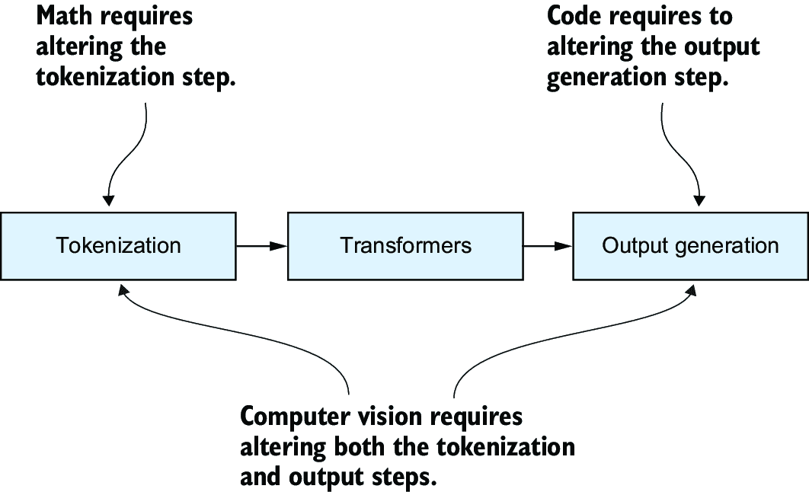
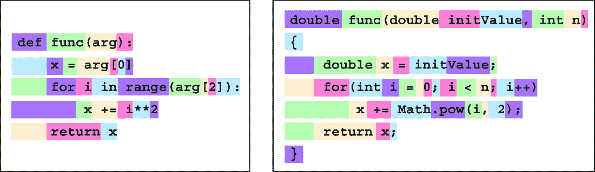
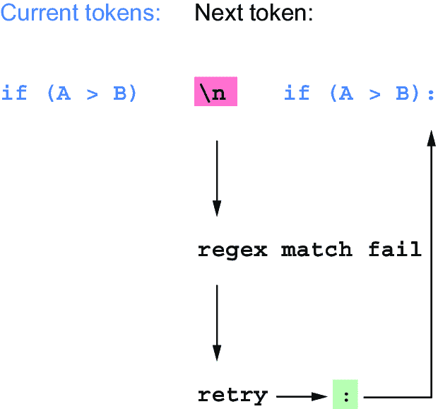
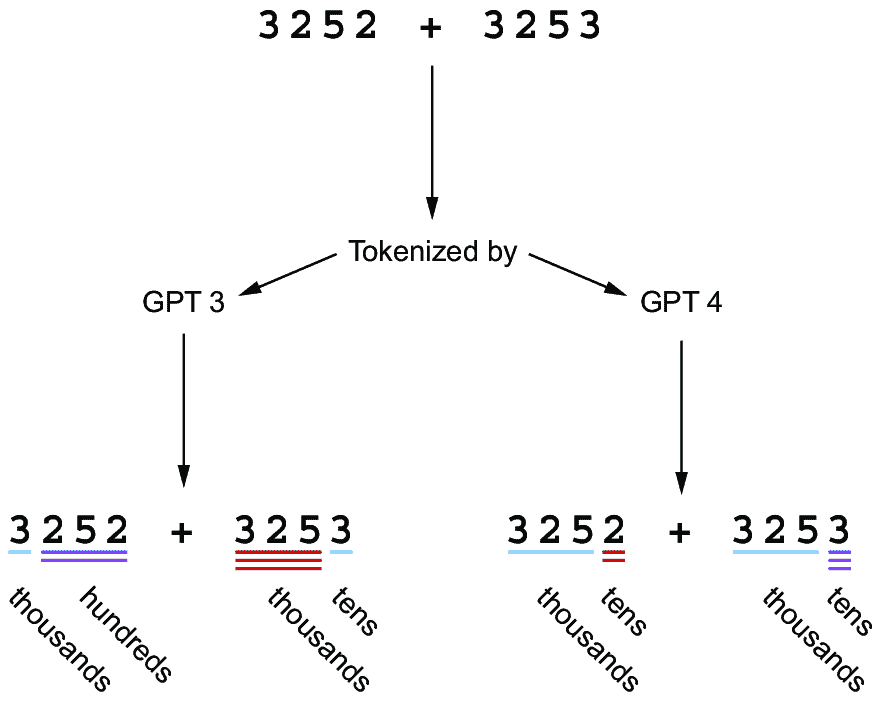
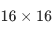
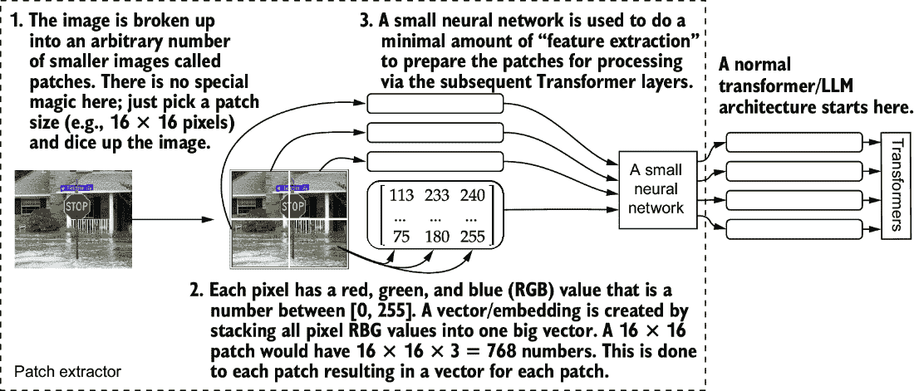
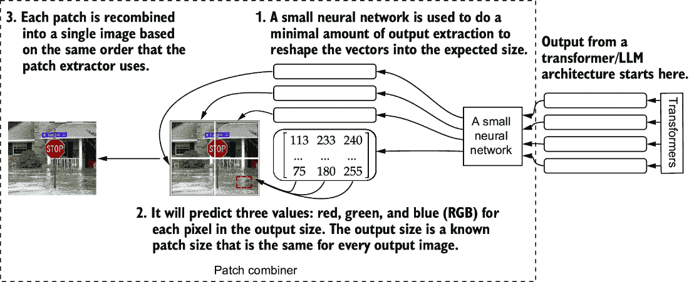

# 第六章：超越自然语言处理

### 本章涵盖

+   变压器层如何在除文本以外的数据上工作

+   帮助 LLMs 编写可工作的软件

+   调整 LLMs 以便它们理解数学符号

+   如何让变压器替换输入和输出步骤以处理图像

虽然建模自然语言是变压器的首要目的，但机器学习研究人员很快发现他们可以预测涉及数据序列的任何事物。变压器将一个句子视为一个标记序列，并产生一个相关的标记序列，例如从一种语言到另一种语言的翻译，或者预测序列中的下一个标记，例如在回答问题或充当聊天机器人时。虽然序列建模和预测是解释和生成自然语言的强大工具，但自然语言是 LLMs 唯一能够提供帮助的领域。

许多数据类型，除了人类语言，都可以表示为标记序列。用于实现软件的源代码就是一个例子。与您期望在英语中看到的单词和语法不同，源代码是用 Python 这样的计算机编程语言编写的。源代码有其自己的结构，描述了软件开发人员希望计算机执行的操作。与人类语言一样，源代码中的标记根据所使用的语言和它们出现的上下文具有意义。如果有什么不同的话，源代码比人类语言更加结构化和具体。具有模糊性和意义的编程语言对计算机的解释以及其他人对其进行修改和维护都会更具挑战性。

源代码，或者简单地说“代码”（这是我们接下来将如何称呼它的），只是 LLMs 和变压器如何处理非自然语言数据的例子之一。几乎任何可以重新铸造成标记序列的数据都可以使用变压器以及我们关于 LLMs 工作方式所学到的大量经验。本章将回顾三个例子，这些例子逐渐不像自然语言：代码、数学和计算机视觉。

这三种不同的数据类型，被称为数据*模态*，将需要一种新的方式来观察 transformer 的输入或输出。然而，在所有情况下，transformer 本身将保持不变。我们仍然会在彼此之上堆叠多个 transformer 层来构建模型，并且我们将继续使用梯度下降来训练 transformer 层。代码与自然语言最相似，不需要太多改变。但是，为了使代码 LLM 工作得更好，我们将改变 LLM 生成后续标记的方式。接下来，我们将探讨数学，我们需要改变标记化以使 LLM 在基本操作，如加法中取得成功。最后，对于计算机视觉，它涉及处理图像并执行诸如对象检测和识别等任务，我们将修改输入和输出，展示如何通过完全替换标记的概念来将非常不同的数据类型转换为序列。我们在图 6.1 中展示了必须修改以与每种数据模态一起工作的 LLM 的部分。

##### 图 6.1 如果我们将 LLM 分解为三个主要组件——输入（标记化）、转换（transformers）和输出生成（反嵌入）——我们可以通过更改至少一个输入或输出组件来使用新的数据模态。同时，对于大多数用例，transformer 本身不需要修改，因为它是一般性的。

在处理所有三种新的数据类型时，我们必须解决一个共同的问题。我们如何赋予 LLM 或 transformer 使用与特定学科领域相关的知识的能力？我们通常通过将外部软件集成到 LLM 中来处理这个问题。你可以将这些外部软件组件视为工具。类似于你需要一把锤子来将钉子敲入一块木头，LLM 也可以通过使用工具来实现最终目标。为代码构建的工具将帮助我们改进编码 LLM。了解人类如何进行数学以及我们用来自动化数学的工具将帮助我们制作更好的数学 LLM。理解我们如何将图像表示为像素（我们最终将它们转换为表示图像某一部分中红色、绿色和蓝色数量的数字序列）将使我们能够将它们转换为 LLM 的序列。当你思考与你工作相关的特定知识，而 LLM 尚未应用到的领域时，你将能够识别你所处理数据的独特特征，以便修改 LLM 以更好地与该知识领域的数据进行交互。

## 6.1 软件开发的 LLM

我们已经简要讨论过，LLMs 可以编写软件的源代码。在第四章中，我们要求 ChatGPT 编写一些用于计算数学常数  的 Python 代码。接下来，我们要求它将这段代码转换成一种名为 Modula-3 的晦涩语言。软件是人们最早发现 LLMs 可以帮助解决的事情之一，这是编程工作相对自然的结果。编程语言被设计成像文本一样由人类阅读和编写！因此，我们可以在不改变标记化过程的情况下生成代码。我们讨论的所有关于构建 LLMs 的内容同样适用于代码和人类语言。

我们可以通过查看 ChatGPT 对 Python 和 Java 两种类似代码段的标记化来了解这一点，如图 6.2 所示。在这里，我们使用不同灰度来表示 OpenAI 标记化器 ([`platform.openai.com/tokenizer`](https://platform.openai.com/tokenizer))，它将代码分解成不同的标记。虽然每个例子中相同的标记可能颜色不同，但我们关注的是标记化器如何将代码分解成标记，以及两个例子之间的相似性。这些包括如下内容：

+   每行代码的缩进

+   变量 `x` 和 `i`（在大多数情况下）

+   函数名和返回语句

+   操作符，例如 `+=`

这些相似性使得 LLM 能够更容易地关联每段代码之间的相似性。相似性还意味着，在训练过程中，LLM 在具有共同命名、语法和编码实践的编程语言之间共享信息。

##### 图 6.2 以编程语言 Python（左）和 Java（右）编写的两个类似代码样本。这展示了字节对编码如何在不同语言中识别相似的标记。方框显示了单个标记。标准的人类语言标记化方法在代码上做得相当合理，因为代码与自然语言有很多相似之处。

鼓励软件开发者使用有意义的变量名，这些变量名反映了变量在编写的程序中的作用或目的。像 `initValue` 这样的变量名被拆分为两个标记 `init` 和 `Value`，使用相同的标记来表示自然语言文本，其中单词 `Value` 的前缀 `init` 出现。因此，我们不仅可以在具有相似语法的编程语言之间共享信息，还可以通过变量名共享关于代码上下文和意图的信息。LLMs 也可以从程序员添加的代码注释中受益，这些注释用于描述代码的复杂部分，以便于自己或其他程序员理解。在图 6.3 中，我们重复了 Java 版本，并更改了变量名，并在函数顶部添加了一个描述性（但在现实生活中并非必需）的注释。

##### 图 6.3 用 Java 编写的代码，包括描述代码功能的注释。由于（好的）代码（希望）有很多注释，因此自然语言和代码的自然混合为 LLM 提供了信息。当变量有描述性的名称时，模型更容易在代码和注释及变量名称中描述的意图之间关联信息。

在大多数情况下，代码和注释之间得到相同的标记，将人类和编程语言联系起来，因为它们使用相同的表示。无论是处理编程语言还是自然语言，我们都得到相同的标记和嵌入。这种美妙的性质是，LLM 将重用关于自然语言的信息来捕捉源代码的意义，就像人类程序员一样。

在每种情况下，我们都看到代码的标记化并不完美。存在一些边缘情况，LLM 的标记化器没有将代码中的数据类型转换为相同的标记。例如，你可以看到函数参数中的`(double`标记与函数体中的`double`标记的处理方式不同。然而，这些差异与我们在自然语言 LLM 中已经看到的问题类似，即围绕像“hello ”、“hello.”和“hello!”这样的单词的不同标点符号被解释为不同的标记。由于 LLM 可以处理这些细微的差异，因此它们也可以处理相同的问题，即代码问题。问题是，在许多方面，LLM 处理代码问题更容易，因为代码是区分大小写的，所以我们不需要担心像“hello”和“Hello”这样的文本情况被不适当地映射到不同的标记。在代码中，“hello”和“Hello”将是不同的、独立的变量或函数名。将它们视为不同的标记是正确的，因为编程语言将它们视为不同的元素。

从应用角度来看，代码生成特别有趣，因为存在各种自我验证的机会。我们可以应用第五章中关于监督微调（SFT）和强化学习（RLHF）的所有教训，使 LLM 成为一个有效的编码代理。

### 6.1.1 改进 LLM 以处理代码

提高代码型大型语言模型（LLM）的第一步是确保初始训练数据中包含代码示例。由于互联网的特性，大多数 LLM 开发者已经完成了这一步：代码示例在网络上很常见，并自然地融入了每个人的训练数据集中。

提高结果成为应用 SFT 的机会，我们收集额外的代码示例，并在给定的代码示例上微调我们的 LLM。像 GitHub 这样的开源仓库，包含大量的代码，使得获取大量代码变得特别容易。从 GitHub 等来源收集的代码构成了用于解释和生成代码的 LLM 微调数据集的基础。

更有趣的情况是使用 RLHF 来提高模型编写代码的实用性。同样，有许多工具和数据集可用，使得为编码助手构建一个不错的 RLHF 数据集成为可能。像 Stack Overflow 这样的来源允许用户提出问题，为其他人提供回答这些问题的便利，并包括一个其他用户对最佳答案进行投票的系统。数据来源包括像 CodeJam 这样的编码竞赛，它们为特定的编码问题提供了许多示例解决方案。如图 6.4 所示，将这些数据源的信息纳入其中。

就像所有优秀的机器学习解决方案一样，如果你为你的任务创建并标记自己的数据，你将获得最佳结果。据传闻，OpenAI 就是这样做的，为了生成代码，他们雇佣承包商完成编码任务，作为创建他们系统数据的一部分 [1]。无论训练和微调数据是如何收集的，整体策略保持不变：使用标准的标记化工具和强化学习与人类反馈（RLHF）来定制一个用于生成代码的 LLM。这个方法已经被成功用于生成像 Code Llama [2]和 StarCoder [3]这样的 LLM。

##### 图 6.4 开发用于代码的 LLM 需要多轮微调。标准的训练程序，如第四章所述，产生一个初始的基础 LLM。使用大量的代码，SFT 创建了一个与代码配合良好的 LLM。将 RLHF 作为第二次微调步骤可以提升 LLM 生成代码的能力。

### 6.1.2 验证 LLM 生成的代码

LLMs（大型语言模型）在代码生成方面特别有用，因为存在一个客观且易于运行的验证步骤：尝试将代码编译成可执行程序[4]。在生成自然语言时，检查由 LLM 生成的输出是否正确具有挑战性，因为自然语言具有主观性。没有自动化的方法来检查 LLM 生成的输出的真实性或准确性。然而，在生成代码时，简单地检查代码是否成功编译成可执行程序是一个很好的第一步，并且可以捕捉到大量错误代码。一些商业产品更进一步，将编译器（将源代码转换为可执行文件的软件）和可视化工具等工具集成到其后端。例如，ChatGPT 可以在将代码返回给用户之前检查它所编写的代码是否可编译。如果代码未通过这一验证步骤，ChatGPT 将尝试为它收到的提示生成不同的代码。如果模型无法创建可以编译的有效代码，它将警告用户这一事实。

除了检查代码是否可编译之外，LLM 越来越能够创建验证功能正确性的方法。许多代码生成工具利用 LLM 生成单元测试，这些是提供样本输入到生成的代码中的小型程序，并验证它是否产生正确的结果。在某些情况下，这些功能需要开发者描述他们希望 LLM 生成的测试用例，然后 LLM 创建一个初始实现作为进一步测试的起点。

代码特别特殊，因为除了编译之外，还有多种方式可以验证其输出。例如，LLM 完成生成响应之前，代码编译是无法发生的。

考虑到 LLM 运行成本高昂，我们不想让用户等待太长时间才能得到输出，如果 LLM 能够在完成大量生成之前纠正错误，那就太理想了。再次应用第五章的教训，我们可以在完成整个生成过程之前使用语法解析器来检查代码是否错误。如果输出代码的部分未能通过基本的语法检查，我们可以指示 LLM 仅重新生成那个有缺陷的代码部分。我们在图 6.5 中展示了这一基本过程，其中 LLM 在基于每个标记的基础上进行检查，而不是在生成完成之前使用编译来检查代码。语法检查成本较低，可以更快地发生，但它并不能验证编译器能否将代码转换为可工作的可执行程序。

##### 图 6.5 一个 Python 代码示例，其中生成了当前的标记`if(A > B)`。如果 LLM 接下来生成的标记是换行符，将会发生语法错误，因为一个`if`语句必须以冒号结尾才是有效的。对每个新标记运行语法检查，使我们能够捕捉到这个错误并迫使 LLM 选择一个不会导致语法错误的替代标记。

### 6.1.3 通过格式化改进代码

使用解析器进行语法检查和使用编译器生成可执行的程序，使得将 LLM 适应生成代码的新问题领域变得容易得多。然而，还有一个额外的技巧是有帮助的。我们可以使用被称为*代码格式化工具*（程序员也称之为*代码检查器*）的工具来改变标记化并提高性能。

问题在于，可能有多种编写执行相同功能但标记化不同的代码的方式。应用代码检查器调整源代码格式有助于消除两个功能等效但不同的代码片段之间的差异。虽然重新格式化代码不是使代码 LLM 良好运行的要求，但它有助于避免可能发生的不必要冗余。例如，考虑使用括号在程序中开始和结束新作用域的 Java 编程语言。现在各种形式的空白不再重要，但会被不同地标记化，特别是由于对于只使用单行代码的作用域来说，括号是可选的！图 6.6 展示了执行相同功能的代码存在不同的合法格式，以及我们理想上如何将这些代码转换为单一的标准表示形式。

##### 图 6.6 一个 Java 代码示例，展示了多种格式化相同代码的方式会导致不同的标记化，尽管每种方式在语义上都是相同的。代码检查器是一种常见的工具，用于强制代码遵循特定的格式化规则。相反，可以使用代码格式化工具创建一个相同的“基础”形式，从而避免表示不必要的信息（如空格与制表符）。

移除代码的非功能性部分称为*规范化*，这意味着我们将具有格式变化的代码转换为标准或“规范”形式。在这里，我们通过添加特殊标记如`<NEW SCOPE>`来展示了一种稳健的规范方法，这些特殊标记捕捉到`if`语句存在新上下文的事实，无论它是单行还是多行语句。我们不仅可以添加特殊标记，还可以使用在代码中一致的格式（例如，始终使用空格而不是制表符，在`{`之前或之后换行）。特殊解析和格式化都将提高代码 LLM 的性能。添加特殊标记的稳健方法在格式化方面将产生更好的性能，但需要编写和维护一个用于添加这些特殊标记的自定义解析器。在下一节讨论使用 LLM 进行数学时，更改标记化器的问题将更加关键。

## 6.2 用于形式数学的 LLM

LLM 还可以执行人类通常难以成功完成的数学任务。这些任务不仅仅是执行加法和减法等操作来计算数字；还包括形式和符号数学。我们在图 6.7 中给出了我们所说的形式数学的例子。你可以要求这些 LLM 计算导数、极限和积分，并撰写证明。它们可以产生令人震惊的合理结果。

代码 LLM 是实用的，因为我们可以使用解析器和编译器来部分验证它们的输出。适当的标记化对于创建一个有用的数学 LLM 至关重要。使用 LLM 进行数学研究仍然是一个特别活跃的研究领域[6]，因此，让 LLM 执行数学操作的最佳方法尚不清楚。然而，研究人员已经确定了一些围绕 LLM 构建和运行过程中的标记化阶段的问题。

##### 图 6.7 Minerva LLM 可以正确解决的符号数学问题。虽然这个例子将自然语言与数学内容混合在一起，但许多 LLM 使用的标准标记化方法不允许这种数学输出，并可能导致一些令人惊讶的问题。（图片由 Creative Commons 授权自[5]）

注意：在第五章中，我们提到微调可以多次应用，数学 LLM（大型语言模型）是这一点的绝佳例子。研究人员通常通过微调通用文本 LLM 来创建数学 LLM，而通用文本 LLM 是通过微调代码 LLM 创建的。在数学 LLM 的每个阶段，SFT（监督式微调）和 RLHF（基于人类反馈的强化学习）之间，对原始下游 LLM 进行多达三到六轮的微调。

### 6.2.1 清理后的输入

Math LLMs 通常受到输入准备的影响，这些准备对于自然语言文本可能效果良好，但会降低数学概念的表示。在文本中，格式化的数学表示通常涉及像`{}<>;^`这样的符号。当处理常规文本时，这些特殊的符号通常会被从训练数据中移除。保留这些信息需要重新编写用于标记化的输入解析器，以确保您不会移除您希望模型从中学习的那些数据。

对于等价的数学方程的多种表示形式进一步增加了训练 LLMs 以类似方式理解数学的难度，就像多种格式在处理编程语言时可能引起问题一样。像 TeX、asciimath 和 MathML 这样的多种格式允许使用纯文本表达数学符号，但提供了为排版者正确渲染方程的指令。这些格式提供了许多表示同一方程的不同方式。我们在图 6.8 中展示了这个问题的一个例子。数学的排版方法（即通过选择 TeX 还是 MathML 来绘制方程）和数学的表示（即表达同一事物的两种数学上等价的方式）都存在问题。

这些都是在我们讨论 LLMs 时多次出现的问题的形式：表示同一事物的不同方式。在数学的情况下，目前的偏好是保持使用 TeX 格式，以及非常相似但使用频率较低的替代方案，如 asciimath，并丢弃像 MathML 这样的冗长内容。我们基于以下三个因素来支持这一动机：

##### 图 6.8 左上角的数学方程展示了数学中出现的两种不同的表示问题。格式良好的数学需要一种排版语言。TeX 和 MathML 是两种不同的排版语言，它们在文本和标记化方面有极大的不同。除了排版语言之外，还有许多方式可以表示相同的数学陈述。

+   基于 TeX 的格式化数学是数学最常见和可用的形式，这得益于像 arXiv 这样的公开资源，它始终使用 TeX 格式。

+   保持所有类似 TeX 的表示形式可以减轻学习多个格式以及因此非常不同的标记集的挑战。

+   MathML 的冗长性使用了更多种类的标记；因此，存储与每个唯一标记相关的数据需要更多的计算资源。

在 LLMs 中将 TeX 作为数学表示的唯一首选格式并不能解决存在多种等效方程书写方式的事实。确定哪些方程是相同的非常困难，以至于研究人员已经证明没有单个算法可以确定两个数学表达式的等价性。（鉴于本节讨论的是*形式*数学，我们在用词上稍微宽松一些，所以我们将指向来源[7]。）到目前为止，对于 LLMs 来说，最好的答案似乎是由模型尝试自己找出答案，这在迄今为止已经相当成功。但如果我们看到未来数学 LLMs 的开发者大量投资于通过创建更一致的规范表示来改进预处理，从而减少等效表达式的可能表达方式的多样性，我们也不会感到惊讶。

### 6.2.2 帮助 LLMs 理解数字

对于大多数人来说，数字是数学中更容易接触的部分。你可以把它们放入计算器中并得到结果。尽管可能有些繁琐，如果你没有计算器，你也可以手动进行计算。遵循一组固定的规则就可以得到结果。有些令人惊讶的是，LLMs 在那种死记硬背的计算上有很多困难，但开发者们已经努力提高分词器与数字更好地协同工作的能力。

第一个问题在于标准的字节对编码（BPE）算法产生的分词器为数字创建了不一致的标记。例如，“1812”可能会被标记为一个单独的标记，因为成千上万的文档中都有关于 1812 年战争的引用；分词器可能会将 1811 和 1813 分解成更小的数字。为了进一步探究为什么会发生这种情况，考虑初始字符串`3252+3253`以及 GPT-3 和 GPT-4 如何分词这个字符串。GPT-4 会做得更好，因为它似乎每次都以前三位数字开始分词，结果是一个三位数后面跟着一个一位数。GPT-3 看起来不一致，因为它改变了解释数字的顺序，如图 6.9 所示。

##### 图 6.9 LLMs 如果不能一致地分词数字，就无法学习进行基本的算术。在这张图中，下划线表示不同的标记。分词的数字可能代表任何给定数字的十位、百位或千位。GPT-3（左）在分词数字方面不一致，使得加法变得没有必要地复杂。GPT-4 在以一致的方式分词数字方面做得更好（但并不完美）。

现在出现了一个重大问题。GPT-3 的“3”标记在两个不同的上下文中出现了两次，一次在千位（*三千*二百 ...），一次在十位（三千二百五十 *三*）。为了使 GPT-3 正确地加这些数字，分词器必须正确地捕获四个不同的数字位置。相比之下，GPT-4 使用每个数字的数字表示顺序，这使得得到正确结果更容易。

人们仍在尝试不同的方法来改变分词器，以提高大型语言模型处理数字的能力。如果我们打算将数字分解成子组件，当前最佳的方法是将每个数字，如 3252，分解成单个数字，如“3, 2, 5, 2” [8]。然而，也存在其他替代方案。

另一种表示数字的有趣方法是称为 *xVal* [9]，其理念是将每个数字替换为表示“一个数字”的相同标记。我们可以称这个特殊标记为 `NUM`，它将被我们第三章中提到的嵌入层映射为一个数字向量。

智巧的做法是给每个标记包含一个乘数，即一个与嵌入向量值相乘的第二个数字。默认情况下，大型语言模型为每个标记使用乘数为 1。将任何东西乘以 1 都不会产生任何效果。但对于我们遇到的任何 `NUM` 标记，它将被乘以文本中的原始数字！这样，我们可以表示可能出现的每一个可能的数字，包括分数值，甚至包括那些没有出现在训练数据中的数字。以这种方式捕获的数字以简单直观的方式相关联。我们将在图 6.10 中更详细地展示这一点。

##### 图 6.10 xVal 使用一个技巧来帮助减少标记的数量并使它们更不模糊。通过修改大型语言模型将数字转换为向量的方式，单个向量表示每个数字，例如数字 1。通过始终使用 1 标记并将其乘以观察到的数字，我们避免了数字标记表示中的许多边缘情况，例如那些从未出现在训练数据中的数字。这种转换方法也使得支持分数数字，如 3.14，变得更容易。

一致数字和 xVal 策略共享一个重要的认识。我们知道如何表示数学和简单的算法，如小学的加法和乘法。如果我们设计大型语言模型以更符合我们作为人类进行数学任务的方式对数学进行分词，我们的语言模型将获得更好的和更一致的数学能力。

### 6.2.3 数学大型语言模型也使用工具

聪明的读者可能已经注意到，大多数与数学相关的标记化问题都涉及处理数字而不是符号数学。LLM 在改变标记化器并保留通常“不好”的符号（如`{}<>;^`）的情况下，无法进行基本的加法或减法运算。通过改变标记化器处理数字的方式来启用计算可能看起来像是一个小问题。然而，它对于良好的符号性能是一个重要因素，并且通常不足以处理其他形式的符号数学。在符号数学上获得最佳性能依赖于外部工具和巧妙地使用 LLM 输出。

如果你曾经使用过能够为你求解导数的 TI-89 计算器，你就知道计算机可以在没有 LLM 的情况下自动化计算。从功能上讲，计算机代数系统（CAS）可以提供这种功能。CAS 实现算法来执行一些（但不是所有）数学步骤。计算导数是其中之一，因此让 LLM 使用 CAS，如 Sympy，有助于确保 LLM 始终正确执行特定步骤。然而，将 Sympy 这样的 CAS 集成到 LLM 中并不能保证整个步骤序列都会被正确执行。

为了验证正确性，数学 LLM 已经开始使用一种名为*Lean*的编程语言。在 Lean 中，程序是一种数学证明，如果证明中存在错误，程序将无法编译。它有效地将错误的证明步骤视为一种语法错误，然后可以被检测到。一旦检测到，正如我们在其他示例中所示，LLM 可以重新生成输出，直到证明，以 Lean 程序的形式输出，编译成功，就像我们在第 6.1.2 节中展示的那样。

使用 Lean 可以保证从 LLM 返回的证明是 100%正确的，但并不能保证 LLM 能够找到这个证明。值得注意的是，也可能存在 LLM 能够正确解决问题但可能无法使用 Lean 表达所解决问题的情况。我们在图 6.11 中展示了这个问题背后的逻辑，归结为 LLM 中工具使用效果取决于训练数据中工具使用示例的多样性。由于 Lean 相对较新且专业，很少有调整 LLM 以有效使用 Lean 的示例。像我们这样的人需要生成这些示例，以产生合适的训练数据，教会 LLM 如何使用 Lean。

##### 图 6.11 对于某个数学目标，让一个大型语言模型（LLM）使用 Lean（正确路径）可能不会导致一个可验证的正确证明，因为它可能不擅长将 Lean 作为工具使用。让 LLM 生成一个普通证明（左侧路径）可能得到一个正确的证明，但不是一种让我们验证其正确性的方法。

如果 LLM 无法提供其数学正确的可验证证据，你该怎么办？今天使用的一个技巧是多次运行 LLM。因为下一个标记是随机选择的，所以每次运行 LLM 时，你可能会得到不同的结果，每次的结果都不同。出现频率最高的答案最可能是正确的。这个过程不能保证证明是正确的，但它有帮助。

## 6.3 变压器与计算机视觉

将代码和数学转换为标记的过程相当直观。代码是基本文本，用于以高度严谨的方式告诉计算机做什么。数学转换为标记比较困难，但我们已经讨论了它是如何可能的。计算机视觉是另一回事，其中涉及的数据是使用像素表示的图像或视频。图像标记的概念似乎很令人困惑。我们怎么可能将图像转换为标记呢？图像通常包含大量细节，你不能像将单词连成句子那样将许多小图像组合成一个连贯的图像。尽管如此，如果我们将标记化视为将任何输入转换为数字序列的过程，我们仍然可以将变压器应用于图像。

注意：有一种将图像表示为称为“代码簿”的微小图像组合的方法。代码簿可能很有用，但与我们的讨论精神不同。如果你想了解一些较老的计算机视觉技术，请将此视为一个关键词要点。

在变压器出现之前，高质量的图像识别算法和图像生成器已经存在了很多年。但是，变压器迅速成为机器学习中处理图像的顶级方法之一。严格使用变压器的视觉变压器（ViT）架构，以及混合架构模型，如 VQGAN 和 U-Net 变压器，这些模型将变压器与其他类型的数据结构混合，在解释基于图像的数据和从文本描述生成惊人的计算机生成图像方面都取得了巨大成功。变压器在图像上表现如此出色似乎有些反直觉，因为图像不像自然语言、代码或氨基酸序列那样看起来像离散的符号序列。然而，变压器通过为模型带来全局凝聚力，在计算机视觉中发挥着关键作用。

### 6.3.1 将图像转换为补丁并反向转换

从概念上讲，我们将用一个新的过程来替换分词器和嵌入过程，该过程输出一系列与我们在第 3.1.1 节中讨论的嵌入层类似的向量序列。创建表示图像的序列的常用方法是将其划分为一组 *补丁*。因此，我们将用 *补丁提取器* 来替换我们的分词器，该提取器返回一系列向量。LLM 的输出使用反嵌入层将向量转换回标记。由于我们没有标记，我们需要一个 *补丁组合器* 来将转换器的输出合并成一个连贯的图像。我们在图 6.12 中展示了这个过程。请特别注意，图中的中心部分与基于文本的 LLM 的情况相同。我们在文本和图像之间重用了相同的转换器层和学习算法（梯度下降）。

##### 图 6.12 在左侧，这个简化的图展示了文本输入在进入转换器之前是如何被分词和嵌入的。然后，反嵌入层将转换器的输出转换为所需的文本表示。当执行计算机视觉任务时，输入和输出将是图像。转换器保持不变，但我们修改了将图像分割成向量序列的方法，以执行补丁提取而不是分词。LLM 使用补丁组合器产生图像输出，类似于文本 LLM 的反嵌入层。

由于除了输入向量序列生成和输出步骤之外的所有内容都保持不变，我们可以专注于图像到向量以及从向量到图像的转换是如何工作的。首先关注输入端将是有帮助的。

如 *补丁* 的名字所暗示的，补丁提取器将每个图像分割成一系列较小的图像。通常会选择一个固定大小的补丁，比如一个  像素的正方形。我们希望有一个固定的大小，这样就可以轻松地将其输入到神经网络中，神经网络总是处理固定大小的数据，并且大小要小，以便它们只代表整个图像的一部分。将图像分割成补丁类似于将文本分割成标记集合。每个单独的标记并不具有信息量，但与其他标记结合时，它就构成了一个连贯的句子。

一旦图像被分割成补丁，该补丁中的每个像素都被转换成代表每个像素中存在的红色、绿色和蓝色（RGB）数量的三个数字。通过将每个像素的 RGB 值组合成一个单一的长时间向量，创建了一个初始向量。因此，对于我们的像素的正方形，每个像素有三个颜色值，我们将有一个长度为 768 的向量（16 高度，16 宽度，以及每个像素的 RGB 值）。然后，一个可能只有一到两层的小型神经网络分别处理每个向量，以生成最终的输出。这个神经网络实现了一个非常轻量级的特征提取过程，不需要大量的内存或计算资源。这种设计在计算机视觉中很常见，因为第一层通常学习简单的模式，如“内部黑暗，外部明亮”，并且不需要变压器层的高成本或高能耗来学习图像补片的基本特征。整个过程总结在图 6.13 中。

##### 图 6.13 提取补丁是一个简单的过程。补丁提取器将图像分割成称为补丁的正方形瓷砖。图像由像素值组成，这些像素值已经是数字，因此我们将每个补丁转换成一个数字向量。然后，我们在将向量传递给基于完整变压器的神经网络之前，使用一个小型神经网络作为预处理程序。

在补丁提取器中使用的小型神经网络的设计方法有很多种，但所有方法通常都同样有效。一个选择是使用所谓的**卷积神经网络**（CNN），这是一种理解相邻像素之间相互关联的神经网络类型。其他人则使用了与变压器层组件相同的线性层。在这种情况下，包括小型神经网络和一系列变压器在内的整体模型通常被称为**视觉变压器**。

小型网络的设计是一个细节，但值得提及，因为它的存在与产生最终输出的补丁合并器相关。无论你选择 CNN 还是线性层作为小型神经网络的架构，但确保输出的形状与输入的形状匹配是至关重要的。例如，如果你有个补丁，你可以使用小型网络强制输出个值，无论变压器层的本身大小如何。为了产生图像输出，你需要反转补丁提取过程，将向量转换为补丁，然后将补丁组合成图像，如图 6.14 所示。

因此，我们已经成功地将输入分词和输出嵌入替换为新的以图像为中心的层。在许多方面，这比分词更优雅。无需构建/跟踪词汇表，无需采样过程等。这是对变换器作为 LLM 通用核心的通用适用性的关键洞察。如果你能找到大量数据，并且有合理的方法将数据转换为向量序列，你可以使用变换器来解决某些类别的输入和输出问题。

##### 图 6.14 与图 6.13 相比，这里的箭头方向相反。其目的是强调补丁组合器和提取器做的是相同的事情，但操作方向不同。在这个阶段，神经网络更为重要，因为它可以迫使变换器的输出与原始补丁具有相同的形状，因为我们能够控制任何神经网络的输出大小。

### 6.3.2 使用图像和文本的多模态模型

将 LLM 的输入和输出更改为视觉变换器的能力意味着我们可以以图像为输入，生成图像为输出。这展示了变换器如何产生不同模态的输入，但我们只讨论了输入和输出是同一模态的情况。我们要么以文本为输入和输出，要么以图像为输入和输出。然而，深度学习是灵活的！没有任何东西强迫我们使用相同的模态作为输入和输出，甚至将输入和输出限制为单一模态。你可以将文本作为输入与图像作为输出相结合，图像作为输入与文本作为输出相结合，文本和图像作为输入与音频作为输出相结合，或者任何其他你可能想到的数据模态组合。图 6.15 展示了图像和文本如何给我们提供四种组合方式，我们可以通过这些方式处理不同类型的数据。

通过创建一个以图像为输入、文本为输出的模型，我们构建了一个*图像描述模型*。我们可以训练这个模型来生成描述输入图像内容的文本。这类模型有助于使图像更易于发现，并帮助视觉障碍用户。

通过创建一个以文本为输入、图像为输出的模型，我们构建了一个*图像生成模型*。你可以用文字描述一个期望的图像，模型可以根据你的输入创建一个合理的图像。MidJourney 等著名产品就是这类模型的例子。尽管它们的实现涉及不仅仅是视觉变换器，但高级思想是相同的：通过将基于文本的输入与基于图像的输出以及大量数据相结合，我们可以创建跨越不同数据类型的新多模态能力。

##### 图 6.15 展示了四种不同类型的模型输入和输出的组合。最右边的一个例子代表了我们已经了解的正常基于文本的 LLM。向左，我们展示了像以文本作为输入生成图像的模型（“画一个洪水区域的停车标志的图片”）或生成描述图像输入文本的图像标题模型（“这张图片显示了一个被浑浊的水包围的停车标志”）这样的可能性。

### 6.3.3 前期课程的应用性

在这本书中学习到的其他经验教训仍然适用于这些视觉转换器和多模态模型。最终，它们学会做它们被训练去做的事情，当你试图以训练数据中找不到的方式弯曲它们时，你可能会得到一个不寻常的结果。例如，我们可能会告诉一个图像生成模型“画任何东西，但不是可爱的猫”，你可能会得到如图 6.16 所示的猫。

这些模型（目前）是通过图像和描述图像的文本片段的成对进行训练的。因此，它们学会了对输入句子中的任何东西产生视觉化的强烈相关性。例如，模型想要生成猫，因为输入句子中有“猫”这个词。更复杂的抽象绘图请求，如“画任何东西但”，没有出现在这样的数据集中，因此模型没有被训练去处理这样的请求。

类似地，随着像 ChatGPT 这样的 LLM 将提示作为制定产生期望输出的输入的策略，提示也被开发用于图像标题模型。包含像“Unreal3D”这样的不寻常信息，这是用于为电脑游戏生成 3D 图像的软件名称，以产生具有特定风格和质量输出的情况并不少见。像“高分辨率”这样的词甚至艺术家的名字，无论是生前的还是已故的，都被用来试图影响模型产生特定的风格。

##### 图 6.16 这是由一个老版本的 Stable Diffusion 生成的，这是一个流行的图像生成模型。尽管告诉模型“不要画猫”，但模型被训练生成内容。请求超出了模型被激励去学习的内容，因此它无法处理。这与 LLM 在训练期间看到类似数据时重复输出错误但接近的结果的问题类似。

## 摘要

+   当 LLM 能够使用外部工具时，它们会受益。例如，一个代码 LLM 可以使用语法检查器和编译器来检测错误代码生成。当 LLM 发现错误时，输出会被重新生成，从而最小化向用户提供无帮助或损坏的代码的风险。

+   标记化器必须修改以支持数学，通过保留用于表达格式化数学的不寻常符号并更改数字表示。我们可以通过给他们提供像计算机代数系统这样的工具来检测和避免错误来进一步提高数学 LLM。

+   Transformer 可以通过将图像分割成块（patches）来应用于图像，其中每个块变成一个向量，并为 Transformer 处理生成一系列输入。从概念上讲，块与文本 LLM（大型语言模型）的标记相似。

+   Transformer 可以使用不同的数据模态作为输入和输出，这允许创建多模态模型，如用于图像标题和图像生成的模型。
