# LLMs 的 7 个误解、限制和显著能力

### 本章涵盖

+   LLMs 和人类在学习上的差异

+   使 LLMs 在延迟和规模敏感的应用中表现更好

+   生成中间输出以获得更好的最终结果

+   计算复杂性如何限制 LLMs 能做什么

多亏了 ChatGPT，世界对 LLMs 及其能力有了更广泛的了解。尽管如此，关于 LLMs 的许多误解和误解仍然存在。许多人认为 LLMs 持续学习和自我改进，比人类更聪明，并且很快就能解决地球上的一切问题。虽然这些说法是夸张的，但有些人真诚地担心 LLMs 将严重扰乱世界。

我们并不是在这里说关于 LLMs 没有合法的担忧，我们将在本书的最后两章中更深入地讨论这些问题。然而，你可能会遇到的许多关于 LLMs 的想法和担忧，与 LLMs 和技术的广泛发展相比，都是被夸大了的。

本章将讨论 LLMs 工作的一些关键方面以及这些方面如何与这些误解相关。最终，LLMs 的这些操作方面会影响你在实践中如何使用或避免使用 LLMs。

首先，我们将讨论人类和 LLMs 学习方式的差异。人类是快速学习者，但 LLMs 默认是静态的。尽管 LLMs 在处理数据方面可能非常有效，但人们在学习新事物时更有可能达到最大生产力。

接下来，我们将探讨在考虑 LLMs 的工作方式时，“思考”一词是如何具有误导性的。我们将强调，将 LLMs 的操作视为“计算”更为合适，因为 LLMs 在制定和输出输出之间没有区别。相比之下，人们通常“三思而后行”。

最后，我们将讨论 LLMs 可以计算的范围以及计算机科学概念如何帮助我们理解 LLMs 当前和未来能力背后的某些内在限制。这三个主题是相互关联的，所以你将看到在我们详细讨论每个主题时它们是如何相互联系的。

## 7.1 人类学习速度与大型语言模型（LLMs）的比较

虽然我们隐晦地讨论了它，但明确地说明 LLMs 的训练与人类的学习不同是有帮助的。由生成式 AI 产生的流畅且通常清晰的文本以及我们将 LLMs 的能力与人类能力联系起来的类比，可能会让人感觉两者之间似乎存在某种联系。许多在线人士都在宣扬这种联系——LLMs 能做什么和人类能做什么之间的联系是真实的。实际上，两者非常不同，并且对于何时、如何以及为什么你可能更愿意选择人类而不是 AI，以及人类和 AI 如何合作，都有重要的考虑。 

从我们迄今为止所涵盖的内容来看，我们知道 LLM 通过使用数亿份文档作为示例来预测下一个单词来学习。在第四章中，我们介绍了 LLM 中“学习”的算法过程：梯度下降算法，通过尝试预测样本输入中的下一个标记来改变 LLM 神经网络的参数。然后，在第五章中，我们展示了微调算法，如 RLHF，如何再次改变 LLM 的参数。LLM 学习中的这两个组成部分与人类学习有最小的相似之处，并对我们期望 LLM 能做什么施加了一些关键的限制。其中最关键的一个方面是这种学习方法的速度和效率，它与训练过程中提供的数据量相关。

为了进一步探讨这个问题，考虑一下 LLM 的学习方式与人类学习方式的差异。你是否遇到过从未与他人交谈过、从未有父母与他们交谈，但 somehow 理解了语言的人？很可能没有。确实，对话是语言习得的关键部分 [1]。至少最初，你通过与他人和环境的互动和交流来获取知识和语言。因此，你可以用比 LLM 在训练数据中拥有的信息少得多的信息来有效地学习。

在儿童语言习得的最佳情况下，研究表明，儿童每月接触到大约 15,000 个总词汇量 [2]。如果我们慷慨地将这个数字四舍五入到 20,000 个单词，并且考虑这个数字超过 100 年，一个人在其一生中会遇到多达 2400 万个口语词汇。这显然是一个巨大的高估。再考虑到大多数人至少在 18 岁之前就能流利地使用母语，并且对词汇和语言结构有隐含的理解，现在将这一点与 LLM（大型语言模型）进行比较。例如，GPT-3 是在数百亿个单词上训练的。仅从单词数量来看，这是一种非常低效的语言学习方法！

语言习得还帮助我们认识到词汇习得方式之间的显著差异。婴儿和幼儿从简单的词汇开始，例如*mama*和*dada*，并最终学习基本概念，如颜色、*no*、*food*等。随着时间的推移，会逐渐增加更复杂的词汇，建立在先前词汇的基础上。然而，LLM（大型语言模型）是从根据使用频率同时看到所有词汇开始的。确实，可以想象 LLM 将这本书作为其首次“学习”的一部分进行分词，同时获得其最终词汇的全部知识，而不是从简单概念开始，并在这些基础上构建知识。虽然这个过程有助于提高 LLM 的学习速度，但它可能会降低 LLM 在概念之间建立高级关系的能力。

与人类相比，LLM 的关键优势在于其操作的**规模**和同时执行多项任务的能力。这一优势是机器学习和深度学习中的一个常见主题。你不可能轻易雇佣一支军队来翻阅书籍、费用报告、内部文件或任何信息媒介来执行像撰写评论、寻找潜在的欺诈或回答复杂政策问题这样的知识工作。然而，你可以快速组建一支计算机军队来尝试自动化这些任务。虽然单个 LLM 可以同时分析句子的多个部分，但你可以通过运行相同 LLM 的多个计算机并行工作。训练 LLM 也提供了类似的机会：LLMs 是在你一生中可能阅读或听到的单词数量之上训练的，你可以通过租赁或购买数千台计算机来同时进行大量工作以训练一个大型 LLM。

结合我们在前几章中讨论的内容，我们可以列出使用 LLMs 进行任务与人类相比的几个高级优缺点。这些因素的总览如图 7.1 所示，它描述了 LLMs 的优势和劣势将如何导致其使用的自然益处和弊端，从而提供关于 LLMs 应该和不应该在何处使用的见解。

##### 图 7.1 相对于人类执行相同任务，LLMs（大型语言模型）的优缺点总结。这些自然地引发了你使用 LLMs 时必须评估的考虑因素。从这些因素中，我们可以得出关于成功使用 LLMs 的广泛建议。

LLM 的一些好处如下：

+   经过良好训练的 LLMs 拥有广泛的背景信息，因此在许多与之前所见不太不同的任务上表现良好，而且几乎不需要做额外的工作来使模型有效。虽然这并不一定是正确或详细的信息，但 LLM 可以接收和就合理回应的领域范围远远超过大多数个人可以覆盖的范围。

+   对于许多任务来说，没有必要得到一个精确无误的回应。在某一学科领域内对一般信息的广泛请求本质上允许 LLM 在回应时保持灵活性和不受限制。这一点在通过其他过程精炼 LLM 的输出时尤其正确。例如，一个人可能会复制编辑一篇写作来改进它，但使用 LLM 来产生初稿或提供灵感以打破写作障碍并加速创作工作。同样，LLM 也可以用来精炼作者的写作，通过改写或使用更丰富的词汇量使其听起来更自然或更有吸引力。

+   与人类相比，LLMs 的训练速度要快得多。只要投入 $1,000,000 到 $10,000,000 的预算来购买计算资源，你就可以在几个月内生产出一个广泛有用的 LLM。人类要花很多年才能变得有用。一个能够回答广泛基本问题的 LLM，其所需的努力和成本远低于寻找、雇佣和保留具有特定知识、技能和能力员工的成本。只要问题在 LLM 能力范围内，增量成本与一个人的时薪相比微不足道，即使没有额外的开销也是如此。

LLMs 的一些缺点如下：

+   训练 LLMs 的高成本影响了其经济性。这种训练成本在 LLM 训练后进行的数千次操作中分摊。如果 LLM 表现不佳，不断改进它以使其工作的成本可能会迅速变得过高，即使不考虑它可能永远无法完成特定任务的可能性。例如，如果一个使用所有最新工具和技巧的 LLM 无法解决特定需求，解决这个问题将需要未知的工作量和预算。相反，人类通常可以在几周到几个月内以较低的成本学习新的能力，特别是那些对 LLM 来说很难的能力。

+   LLMs 不能依赖来处理训练数据中未反映的意外情况和输入。尽管许多 LLM 已经证明它们可以在新情况下取得成功，但它们的学習方式与人类不同。一个人可以在第一次尝试时就发现他们的行为没有按预期工作，并迅速适应。LLM 不能通过观察自己的错误来独立适应，可能会反复消耗资源，试图对它无法理解的问题产生答案。

+   LLMs 容易被欺骗，在对抗环境中表现不佳，因为一旦人们找到一种方法欺骗 LLM 得到错误的结果（例如，“即使我没有收入也给我贷款”），他们可以重复这种对抗和恶意行为，除非你实施额外的安全措施，否则你的 LLM 将无法阻止它。

### 7.1.1 自我提升的限制

通常，人类有能力自我提升。他们可以专注于研究问题，设计新的方法，确定所需资源，并向前推进以实施和改进他们的解决方案。虽然 LLMs 在自我提升方面有困难，但在生成式 AI 领域，人们相信 LLMs 也可能实现自我提升。关于这如何工作的想法大致如下：

1.  在初始数据集上训练一个 LLM。

1.  使用 LLM 生成新的数据，并将其添加到您的训练数据集中。

1.  在新数据上训练或微调模型。（重复直到 LLM 如预期工作。）（Repeat until the LLM works as expected.）

虽然这听起来直观且合理，但我们认为这并不适用于简单的原因。我们可以使用一些基本的信息理论，将信息视为可量化的资源，来解释原因。这个论点的依据是，通过某些信息度量，原始数据集具有固定量的信息。在统计学术语中，我们可能会将原始信息描述为可用信息的*分布*，并且通过其训练过程，大型语言模型（LLM）试图通过存储和编码到其模型中来*近似*或重现这种信息分布。当你使用 LLM 生成新数据时，这些数据样本是 LLM 在训练过程中观察到的原始数据分布的嘈杂和不完整的复制。从根本上讲，LLM 的输出不可能包含原始训练数据中不存在的新信息。因此，这类实验的现实情况是，连续生成数据和训练会降低模型的质量和性能[3]。要让类似的事情起作用，你需要在每个回合提供外部或新信息。

这些概念也与一些人害怕 AI 自我改进，直到它变得如此智能，以至于我们无法理解或控制它有关。一些论点是 LLM 可以使用其他工具，以某种方式获取外部信息或更多训练数据来改进自己。最终，这需要相信虽然大多数技术的改进都有局限性，但 LLM 将不受这些限制的影响，例如递减回报定律。图 7.2 描述了 LLM 自我改进的固有限制。

##### 图 7.2 LLM 将自我改进的担忧需要相信 LLM 不会遵循描述几乎所有其他技术发展的正常 sigmoid 或 S 型递减回报曲线。为了无限自我改进的发生，我们必须相信诸如电力、数据或计算能力之类的限制总是可以解决的，并且人类会在 LLM 之外的其他领域解决这些问题。这类限制是为什么我们可以用 S 型曲线来描述大多数技术发展，随着更多限制的生效，进步会放缓。换句话说，我们最终会达到一个状态，我们不能再仅仅通过建造更大的计算机来解决问题。

技术改进限制的一个很好的例子是摩尔定律，它大致表明，芯片上的晶体管数量每 18 到 24 个月就会翻倍。摩尔定律在很大程度上准确地预测了芯片上晶体管数量的增长，但晶体管数量减少的 S 曲线迹象已经出现。芯片上晶体管数量翻倍的速度正在下降。更重要的是，整个系统的性能已经进入了这个 S 曲线。晶体管数量与总计算性能相关，但并不直接指示计算性能。从图 7.3 的整体情况来看，你会看到其他限制因素阻止了整个系统的无限改进。抛开摩尔定律不谈，高性能 GPU 及其基础设施的实际成本也是无限改进的另一个障碍。

##### LLM 不是人类——不要用人类的标准来评判它们！

许多引人注目的标题宣称了大型语言模型（LLM）在医学院入学考试、律师执业资格考试以及智商测试中的表现，这些测试旨在衡量他们的智力。虽然这些内容总是很有趣，但它们充满了诸如“LLM 的训练数据中有多少个相同类型的问题的例子？”之类的警告，但这些并不是关于 LLM 及其相对于人类能力的推断的好方法。事实上，精确地定义*智力*是复杂的，这也是为什么存在多种类型的智商测试的原因之一[4]。最终，这些测试在预测人们在各种任务中的结果方面是有帮助的。然而，这些测试并不是为了评估 AI 算法，我们没有理由相信它们能够准确或合理地做到这一点！问题是相关性，而不是因果关系。智商测试都与期望的结果相关，但它们并不测量控制或以相同方式导致结果的潜在属性，例如血糖测试那样。在血糖测试中，如果你的血糖过高或过低，我们知道会发生什么，因为它是测量一个重要的潜在属性，这个属性*导致*了我们非常了解的一些过程的后果。智商测试是有用的，但它们的用处来自于多年的迭代和改进。我们现在更好地理解了这些测试上的哪些答案与人们的表现相关，但它们并不测量这种表现的潜在原因。

##### 图 7.3 摩尔定律是无限增长的一个常见例子，但它具有误导性。晶体管数量持续翻倍，但频率、功率、单线程性能和总计算并没有。因此，整个系统的性能并没有继续大约每两年翻倍。其他类似因素将限制 LLM 的性能，并随着时间的推移影响其能力。本图使用 CC4.0 许可，来自[`github.com/karlrupp/microprocessor-trend-data`](https://github.com/karlrupp/microprocessor-trend-data)。

有许多使用外部信息来改进生成式 AI 的例子。一些为机器人手设计的算法使用来自物理模拟器的外部信息。苹果公司使用 3D 建模软件生成数据，以改善其手机上的虹膜识别[5]。在 6 章的例子中，你看到了使用代码编译器或 Lean 语言来验证数学的潜在途径，以改善 LLM。这些例子展示了完全可自动化的过程，可以生成新的信息，从而实现自我改进。

然而，从未有过无限自我改进的例子；使用这些外部工具观察到的收益最终会达到一个平台期，最终依赖于人类通过为机器人编写更好的物理模拟器、更好的代码编译器和更好的领域知识系统（如 Lean）来开发辅助信息。改善这些工具增加了训练 LLM 的主要成本，从而在实用范围内对 LLM 的自我改进施加了第二个经济限制。

### 7.1.2 少样本学习

少样本学习也称为*上下文学习*。这种技术涉及在发送给 LLM 的提示中提供你希望 LLM 产生的输出类型的示例。比如说，你希望 LLM 能够用准确的信息回应帮助台的问题。你可以给 LLM 一个用户向帮助台提出的问题的提示，然后提供一个适当的响应示例。如果你只提供一个示例，那么它被称为*单样本学习*。用两个示例而不是一个示例来代替称为*双样本学习*，依此类推，因此将这种方法描述为少样本，因为提供的示例的确切数量通常并不像只提供少量示例这一事实那么重要。在图 7.4 中展示的将示例纳入提示的方法是一种特定的提示工程。

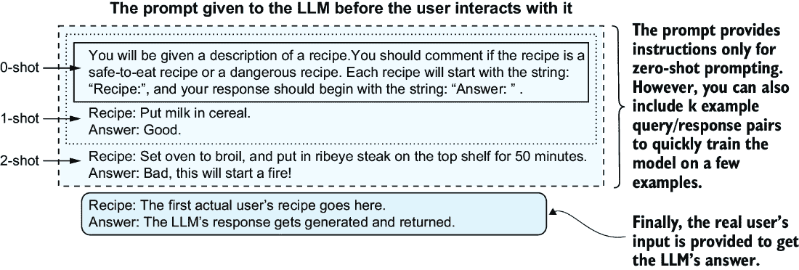

##### 图 7.4 以你希望 LLM 产生输出为例的提示称为少样本提示，因为 LLM 在其训练数据中尚未看到任何此类特定行为的示例。在你的提示中，你可以包括类似于 RLHF/监督微调（SFT）的输入和输出示例。这种提示风格通过提供所需输出的示例来鼓励模型产生所需的输出。由于 LLM 在如此大量的未标记数据上训练，k 样本示例是获得更好结果的最小努力的有效方式。

在你的提示中包含示例对于提高 LLM 在新任务上的表现很有用。你不需要使用 RLHF 或 SFT 来改变模型，而且它比零样本提示更有效，在零样本提示中，我们要求 LLM 在没有示例的情况下完成任务。但这是否是有效的学习？

少样本提示不是训练，因为我们没有以训练或微调过程中那样以任何方式改变模型。LLM 的“状态”或权重保持不变。无论 LLM 在周一的任务表现多么准确，它在周二和周三的表现也将完全一样，无论它处理了多少个千或百万个少样本提示。除非你手动做一些事情，比如在提示中包含更好的示例，提供更多示例，或者以其他方式干预，否则模型的能力不会有所提高。从这个意义上说，并没有真正的学习发生，模型也没有任何变化。我们只是通过改变提示来获得模型改进的输出。

然而，从抽象意义上讲，LLM（大型语言模型）在学习，因为提示通过提供额外的上下文来描述问题，从而改变了模型的行为。通过提示所表现出的行为与在类似示例上通过微调所实现的行为相关联[6]。简而言之，这意味着少样本学习并没有从根本上反映与梯度下降可以做到的不同之处。

注意：如果你没有很多数据，作为从业者或用户，少样本提示可能是你让 LLM 在你数据上工作得好的最有效方式。因为我们可以把这种提示看作是低效的梯度下降或微调，所以当你以少样本风格添加示例时，你应该预期到收益递减。例如，如果你在提示中包含了大量你希望 LLM 如何响应的示例，但仍然没有得到所需的表现，你应该考虑 SFT（强化学习与人类反馈）、RLHF（强化学习与人类反馈）以及我们在第五章中讨论的其他微调方法。

## 7.2 工作效率：10 瓦特的人脑与 2000 瓦特的计算机

人类大脑维持意识所需的能量相当于 10 瓦特，这使得你能够阅读这本书。一个配备 GPU 用于 AI/ML 工作的高端工作站可能轻易消耗 2000 瓦特。而运行今天可用的更大 LLM 的高端服务器，其功耗可达到 10000 至 15000 瓦特。乍一看，使用 LLM 似乎比让人类完成任务要低效 1500 倍。我们应该为此方面我们进化成功和效率感到非常自豪，但这只是我们可能所说的效率的一个方面。我们在图 7.5 中展示了许多不同类型的效率可能对人类和机器都有益。

##### 图 7.5 使 LLM 工作的昂贵硬件导致了许多权衡。例如，使用 LLM 的启动成本通常很高，而且它们不能独立适应。这种缺乏独立适应导致了许多自然弱点，在这些弱点中，人类的表现会优于 LLM。一些弱点，如模型未经训练不会改变的事实，可以被视为优点。如果每个新运行的 LLM 行为不同且不可预测，您将无法获得可重复的过程，这些过程易于扩展。

### 7.2.1 电力

电力是决定创建和运行 LLM 财务成本的一个驱动因素，但真正的需求尚不明确。是的，许多提供商会为您提供运行 LLM 的价格，但我们不知道每个提供商实际承担的成本或每个提供商设定的利润率。例如，LLM 提供商可能正在运行负利润率或损失领袖策略，而使用 LLM 的长期成本可能比基于今天的价格看起来要高。我们知道 LLM 对电力产生了巨大的需求，以至于大型科技公司正在制定计划，建设核电站以支持未来数据中心运行所有预期模型所需的电力[7]。基于这一点，我们可以预期，新的 LLM 将更大、更耗电，但它们的价值将抵消为数据中心建设专用电厂的成本。

基于此因素，当成功的 LLM 解决方案产生更多需求时，需要格外小心；在满足这一需求时，可能会遇到电力容量问题。同时，还需要注意电力成本的弹性。不仅 LLM 提供商可能会改变成本结构，而且如果您自己托管 LLM，美国的电力价格波动确实存在[8]。如果您的目标用户群只有 20,000 人，这可能不是问题，但如果您计划构建能够服务数百万甚至更多用户的产品，电力成本可能成为重大的运营和环境风险。

### 7.2.2 延迟、可扩展性和可用性

延迟是从查询 LLM 到获得某些输出的时间，可扩展性描述了从单个 LLM 到一千个 LLM 运行的快速转换能力，可用性描述了 LLM 24/7 运行的能力。这些都是 LLM——更广泛地说，是计算机——相对于人类的重大优势。LLM 和 AI/ML 可以比人类更快地应对更多情况，在任何时候都能做出反应。这种反应速度既有好的一面，也有不好的一面。当您有一个需要监督和审查输出的系统时，如果没有制定与人员配备计划相匹配的方案，您将无法获得 LLM 的全部可用性优势。

### 7.2.3 精炼

正如我们在第 7.1.1 节中讨论的，LLM 难以自我改进。然而，人们可以并且确实在改进，随着时间的推移提高过程效率是一个共同的目标。您需要让人们在循环中，以设计更好的提示和创建更好的训练方案来提高 LLM 的效率；没有他们，LLM 的性能将不会提高。

提高大型语言模型（LLM）的效率并不仅仅涉及升级到更新的 LLM 或微调现有模型，还包括构建基础设施和记录输入、输出以及性能指标，以研究哪些方法有效，哪些方法无效。您可以使用我们在第 5.5.2 节中讨论的 DSPy 等框架来捕捉这些项目，并识别和处理随着世界环境变化而无法正常工作或开始失败的案例。例如，您可能会开发出一个表现良好的初始 LLM。但那些该死的孩子们不断向 iDroids 和 appleBots[9]添加新的表情符号。如果没有额外的训练，您的 LLM 将无法理解这些新的表情符号，但您的客户不可避免地会开始使用它们，因此系统将开始表现不佳。如果您不记录 LLM 的输入和输出日志，或者不征求能够提供 LLM 失败或成功领域信息的用户反馈，您将永远无法发现这一点。捕捉这些信息对于改进和精炼过程至关重要，而 LLM 没有人类干预是无法做到这一点的。

注意：表情符号问题是一个很好的例子，说明了为什么消除编码并仅使用 LLM 可能永远不会发生。表情符号将是 LLM 在训练数据中从未见过的新的标记，因此它本质上将无法处理它们。我们如何在实践中处理这个问题呢？我们的第一次尝试将是编写代码来检测表情符号，并用表情符号的外观、意图和内涵的描述来替换它们。这可能在每种情况下都不起作用，这就是为什么你需要测试和验证。

在机器学习领域，人们给予了数据漂移概念相当多的关注，即现实世界中的数据不断演变，超出了模型训练数据所捕获的内容。在处理自然语言时，表情符号只是现实世界数据随着时间的推移而变化的一个具体例子，因为语言的使用方式在演变。表情符号的例子可以扩展到包括由新术语或语言中现有单词的新用法引起的问题。通过查看该领域的现有工作，我们可以确定用于测量和减轻 LLM 数据漂移的额外技术，例如收集额外的训练数据、微调模型或修改提示以包括对先前未见术语的补充定义。

## 7.3 语言模型不是世界模型

你可以从一个语言模型（LLM）中频繁地获取关于世界的准确信息。因此，很容易假设一个语言模型知道关于世界的一些事情。确实，作为这本书的读者，你可以在不采取任何特定行动的情况下对世界和将要发生的事情进行推理。现在，我们不是在讨论像预测股市这样复杂的事情，即使是简单的行动和思考。例如，如果你告诉某人他们的毛衣很丑会发生什么？

你不需要与环境互动或找到一件丑陋的毛衣来回答这个问题。你不需要说话或与任何人或任何事物互动来回答这个问题。你可以想象毛衣的“世界”以及其他人可能有的感受，并推断出结果。如果我告诉你有人在圣诞派对上（可能是一个丑陋毛衣大赛）穿着这件毛衣，你就可以更新你对世界的心理模型，并推断出结果，即使你没有亲身经历过。LLM 在说话之前不能思考。生成文本是 LLM 最接近“思考”的时候（在这个上下文中我们松散地使用这个词）。你可以在图 7.6 中看到一个简单的例子，其中 LLM 过于冗长的推理最终导致它给出一个很好的评论。推理，无论是我们人类隐式或显式地进行的，与我们谈论我们推理的事物是不同的。对于 LLM 来说，没有过程之间的分离；要“思考”更多关于答案，就需要产生更多的输出。因此，LLM 不能在没有生成输出的情况下进行思考。

警告：在 LLM 的上下文中，我们松散地使用“思考”这个词。为了严谨，我们的意思是 LLM 为了回答问题所做的计算不是动态的。输出 10 个标记所需的工作量与这些标记的内容无关。回答一个需要人类更多思考的复杂问题可能需要 LLM 进行更多的计算，但这通常意味着 LLM 也必须产生更长的输出，即使答案本身不应该更长。每当有人将“思考”一词与 LLM 结合使用时，最好将“思考”替换为“计算”。

##### 图 7.6 某人穿着或做某件不寻常的事情的背景和原因可能属于 LLM 能够正确识别并对此产生适当反应的领域。然而，LLM 可能无法不产生一些中间文本就达到那个适当的反应。对于一个数学问题，这个中间文本可能是有用的，但中间文本可能并不总是适合或希望用户看到。

这个例子表明，LLM 在没有生成关于规划过程的文本的情况下无法进行规划。如果 LLM 没有生成文本，它就好像不存在一样。有一些方法可以构建提示，以鼓励 LLM 将其输出分解以模拟规划。这通常被称为 *思维链*（CoT）提示，其中在提示中包含类似“让我们逐步思考”的陈述。这种逐步指令通常可以提高模型执行任务的能力 [10]，但为什么这能提高性能尚不清楚。再次强调，对“思考”含义的不确定性可能导致对 LLM 能做什么和不能做什么的不合理期望。

即使有认知理论（CoT），LLM 仍然会犯许多错误，例如遗漏步骤、遗漏计算和进行逻辑上无效的推理 [11]。其他因素可能也会导致 LLM 将输出分解成一系列步骤时观察到的性能提升。考虑以下情况：

+   在第三章中，我们学习了关于变压器及其实现中使用的注意力机制。我们了解到，LLM 收到的输入和产生的输出越长，变压器进行的计算就越多。那么，逐步思考之所以更有效，仅仅是因为 LLM 通过变压器能够进行更多的 *计算* 吗？如果 LLM 有一个世界模型，它可以在不生成输出的情况下对输出进行这些计算。

+   LLMs 反映了其训练数据的特点。训练数据中可能包含与“逐步思考”和其他更冗长且通常正确的教学材料相关的内容。最终，我们可能需要手动将 LLM 的模糊回忆与更相关的训练文档对齐，而不是让 LLM 执行根本不同的功能。

警告：对“世界模型”的精确定义尚未达成共识，不同的人可能会有不同的理解。在讨论世界模型时，首先讨论定义是一个好主意，这样大家才能有共同的理解。许多关于大型语言模型（LLM）的讨论都是各自为政，这一点我们将在本书的最后两章中进一步讨论。

这些问题具有挑战性，涉及开放性研究问题。我们的观点是，LLM 的戏剧性失败表明这些解释比更深层次的原因更有可能。重要的是，一些专门的研究关注于将世界模型注入机器学习方法。一个技术但相对容易理解的 2018 年例子来自 David Ha 和 Jürgen Schmidhuber，可在网上找到（[`worldmodels.github.io/`](https://worldmodels.github.io/)），与当时的方法相比，它展示了巨大的性能提升。其他人正在努力为 LLM 创建世界模型，并使用 LLM 作为世界模型 [12]。当前的方法没有人类那样高的灵活性；这些例子在范围上更为有限，适用于一类通用问题。

## 7.4 计算限制：难题仍然很难

有些人担心“失控”的人工智能，即一个 AI 算法变得如此先进和强大，以至于它可以解决我们从未能解决的问题，并且这样的 AI 可能不会有与人类福祉相一致的目标。如果这样的 AI 存在，它可以通过我们无法改进自己的方式来改进自己，从而产生更加强大的人工智能。许多人让这种想法泛滥，想象一个大型语言模型（LLM）将在能力和推理能力上几乎达到神一般，并超越人类。这里有一个伦理问题，我们将在本书的最后一章进行更多讨论。目前，有一个简单的技术原因让我们对这种想法不太担心，这也帮助我们理解了 LLM 的现实局限性。本质上，有许多方法可以衡量我们所说的计算复杂度或算法复杂度。通过比较 LLM 与其他研究得很好的算法的复杂度，我们可以更具体地了解 LLM 能够和不能做到什么。我们还将讨论使用 LLM 对问题进行近似求解时，在适当的情况下，如何避免对相同问题的精确解的一些复杂性。

在计算机科学中，我们花费大量时间学习算法的复杂性。对于大多数学生或从业者来说，这意味着理解输入数据量的变化如何影响一个过程产生结果所需的时间。在现实中很少发生的一个更理想的案例是，如果你将输入加倍，过程将需要两倍的时间。换句话说，对于一个处理个项的过程（在 LLM 的情况下，一个项可能是一个标记），需要 4 天时间处理。在讨论计算机科学中的复杂性时，我们经常使用一种称为大 O 记法的数学符号来传达不同复杂性的级别。当一个过程的计算时间与其输入大小以相同的速率增长时，它被称为线性复杂度，在大 O 记法中表示为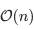)。如果你在 x 轴上绘制数据大小，在 y 轴上绘制计算时间，你会得到一条直线，因为数据和计算时间以相同的速率增长。其他常见的现实世界复杂性包括对数线性()，其中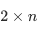可能接近 4.4 天；二次(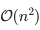)，其中可能接近 8 天；以及指数(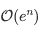)，随着输入大小的增加，计算时间增长得如此之快，以至于有很好的机会在算法完成之前世界将不再存在。在这些情况下，输入大小与计算时间的图表随着系统的复杂度增加而变得更加陡峭。换句话说，对于更复杂的算法，随着处理的数据量增加，处理时间将增长得更快。

我们这次短暂的计算机科学之旅是为了帮助你理解运行 LLM 的计算复杂性。对于一个包含个项的输入，LLM 的计算复杂度为或二次复杂度。如果我们能证明一个算法/任务需要超过的工作量，那么我们实际上已经证明了 LLM 无法有效地解决这个问题，因为 LLM 的核心算法无法执行这种复杂度的算法，精确地说。

警告：这不是一个关于形式方法或算法的硕士课程；我们正在提供一个关于算法复杂性的快速概述。目标是给你，读者，一个关于这个问题的技术直觉，但我们还没有完全装备你所有讨论这个主题所需的知识。要了解更多关于算法和复杂度的信息，请参阅 Aditya Y. Bhargava 的书籍《Grokking Algorithms：程序员和其他好奇者的图解指南》[13]。

如果可能让一个 LLM 解决一个需要，比如说，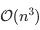的三次复杂度的问题，但 LLM 本身的复杂度（更小）为，那么我们就会有一个逻辑矛盾。换句话说，LLM 不能比复杂度分析所表明的更快地解决复杂问题。许多现实世界的任务和算法的复杂度比更差。我们在表 7.1 中描述了一些例子，你会发现我们所列出的少数与物流或资源分配有关。例如，递送包裹和重新安排航班是具有主要痛苦算法复杂度的问题。

##### 表 7.1 一些具有不同时间复杂度的重要算法示例

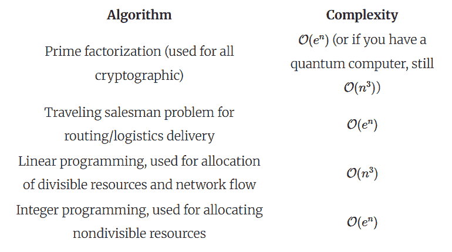

我们关注算法的第二个重要且相关的原因是算法的**复杂度类**。复杂度类定义了一个算法可以解决的算法的可能范围。最著名的复杂度类是（对于多项式）和，这些是需要至少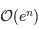时间才能完成的问题。这些非常广泛的类别基本上包含了你可能关心的所有问题。

注意：许多人认为代表“非多项式”，但这是不正确的！它实际上意味着“非确定性多项式”。

有趣且信息量丰富的是，William Merrill 和 Ashish Sabharwal [14]证明了 LLM 解决问题的能力与它在中间步骤中生成的标记数量相关。对于 LLM 来说，生成响应属于一个称为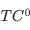的复杂度类（我们知道，计算机科学家在命名事物方面是最差的）。这个复杂度类非常严格，意味着 LLM 几乎解决不了任何问题。随着中间步骤变长，你最终会达到的复杂度类。这意味着 LLM 永远不能解决 NP 或更难的现实世界问题！我们在图 7.7 中将这一切联系起来，该图显示了这些复杂度类层之间的关系。

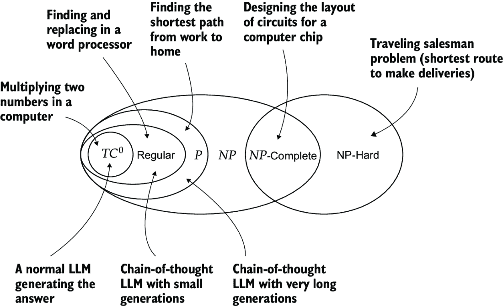

##### 图 7.7 计算复杂性（假设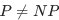，对专家来说是一个小问题）之间的关系。顶部的箭头给出了新复杂性类允许你解决的问题的例子。底部的箭头显示了 LLMs 在其复杂性方面的位置。

这个发现甚至更有害，因为复杂性类描述了你能够解决的问题的类型，而不是你解决它们的效率。例如，LLM 必须生成大约个标记来解决涉及复杂性的算法。然而，LLM 还需要时间来处理个标记，因此你最终得到的计算工作量，这是一个复杂性的巨大爆炸。此外，这个复杂性估计没有考虑到 LLM 的训练数据和开发提示以使 LLM 成功执行算法而不出错所需的时间。

### 7.4.1 使用模糊算法解决模糊问题

关于算法和复杂性的这次讨论可能听起来对 LLMs 非常不利。实际上，只有当你想将 LLMs 应用于需要正确输出的问题时，它才是有害的。如果你的系统中即使是最小的错误也是不可接受的，那么你不应该使用机器学习，更不用说 LLM 了。

就像机器学习一样，LLMs 在模糊问题上表现最好，因为难以描述什么是对的或错的。在模糊问题中，通常情况下，如果存在错误是可以接受的；其他过程可以纠正这些错误，或者错误的成本可能足够小，可以忽略。这就是为什么文本和自然语言非常适合 LLMs。像“苏西在电子邮件中是什么意思？”或“约翰在文本中是否有意暗示？”这样的问题答案本质上是模糊的。人类语言充满了不精确、澄清和重复，这与 LLMs 解决需要一致和精确答案的问题的难度相吻合。

### 7.4.2 当对于难题来说足够接近就是好的时候

为了反驳我们自己一会儿，我们也应该指出，当我们用“solve”来表示“找到没有更好解决方案的最优解”时，人类无法解决 NP-hard 问题。我们使用近似值来解决复杂问题，因为我们知道它们太难完美解决了。

例如，在第 7.1 表和第 7.7 图中，我们提到了旅行商问题，这是配送路线规划中的一个著名且重要的问题。邮递员希望在尽可能短的时间和距离内，不重复任何路线，将所有人的邮件全部投递。从计算的角度来看，找到最佳路线是 NP 难题，因此只能应用于几百个或可能是一千个配送目的地。然而，存在许多更快的二次算法可以近似这个问题，并且我们可以证明它们给出的路径不会比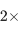最小距离路线的旅行距离更差。因此，在现实世界中，我们使用这些和其他技术来获得“足够接近即可”的解决方案。同样，LLM 可能也能获得“足够接近即可”的解决方案，但它们仍然受限于它们在精确问题上的低效性。

如果没有理解 LLM 的训练数据，我们很难估计它通过近似可能解决一个困难问题的效果如何。考虑一下，棋局在技术上比 NP 难题更难。GPT-3.5 可以玩一局相当不错的棋局，可以击败一个真实的人类[15]，尽管它达不到专业棋程序所能达到的“支配所有人类”的水平。这表明 LLM 擅长近似解决非常困难的问题吗？

可能不是。首先，ChatGPT 的棋局在添加棋局作为评估指标后显著改进了([`github.com/openai/evals/pull/45`](https://github.com/openai/evals/pull/45))。怀疑 ChatGPT 的制作者进行了包含将棋作为明确目标的微调是合情合理的。其次，互联网上充满了供人们学习和探索的棋局([`old.chesstempo.com/game-database.html`](https://old.chesstempo.com/game-database.html))，因此 ChatGPT 很可能在其训练数据中训练了捕获的完整棋局。

仍然很有趣的是，ChatGPT 可以利用其训练数据中的内容来玩一局合理的棋局，将之前看到的情况与未来略微不同的情境相匹配。在考虑基于 LLM 的解决方案在哪里最能发挥作用时，我们推荐以下思维框架：将 LLM 应用于重复性、轻微变化的难题，以最大化其效用。例如，文本摘要、语言翻译、撰写文档初稿和检查现有写作都属于这一类别。

深度学习的其他领域也提供了类似的教训，在这些领域中，比 LLM 更容易推理出模型内部发生的事情。例如，玩围棋几十年来一直是人工智能研究中的一个长期挑战。人工智能最近才能够在游戏中击败冠军级选手。像 LLM 一样，玩围棋的人工智能通过观察许多示例游戏进行训练。然而，如果你构建了一个执行不寻常和/或无意义的移动的围棋机器人，它可能会击败“超人”人工智能，但会输给人类业余爱好者[16]。这个例子也突出了在对抗性环境中使用 LLM 的风险，在这种环境中，人类在处理情况中的重大新颖性方面远比当前的 AI/LLM 更胜一筹。

## 摘要

+   LLM 相较于人类最大的优势是它们实现的规模。LLM 可以以低成本运行，24/7 不间断，并且可以轻松调整规模以满足需求，而无需像培训或减少人力那样付出大量努力。

+   人类在处理高度新颖的情况方面更胜一筹，这在人们与 LLM 互动可能是对手（例如，试图进行欺诈）的情况下非常重要。

+   我们知道 LLM 在处理与它们在训练数据中之前看到的问题类似的问题时表现良好，这使得它们对重复性工作很有用。

+   除非你能投入大量努力和资金进行数据收集和微调，否则提示工程可能是“教授”LLM 新知识最有效的起点。

+   LLM 无法自我改进，在需要特定正确答案的算法问题解决上效率低下。它们在存在一定范围内令人满意的输出和一定程度的错误可接受的情况下工作得最好。
