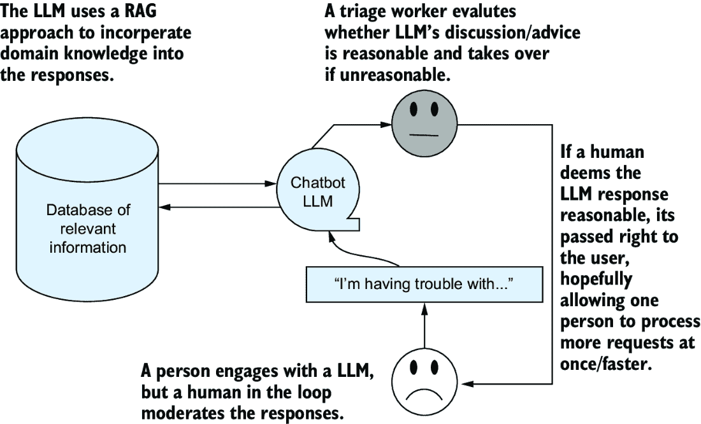
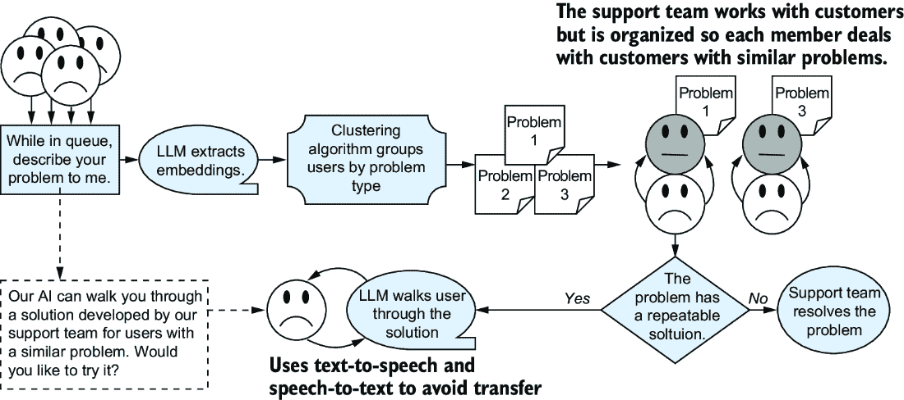

# 8 使用大型语言模型设计解决方案

### 本章涵盖

+   使用检索增强生成来减少错误

+   LLM 如何监督人类以减轻自动化偏差

+   通过嵌入启用经典机器学习工具

+   对公司和用户都有益的展示 LLM 的方法

到现在为止，你应该对 LLMs 及其能力有了深刻的理解。它们产生的文本非常类似于人类文本，因为它们是在数十亿份人类文本文档上训练的。它们产生的内容很有价值，但也可能存在错误。而且，正如你所知，你可以通过结合领域知识或像解析器这样的工具来减轻这些错误。 

现在，你已经准备好使用 LLM 来设计解决方案了。你如何考虑到目前为止我们所讨论的所有内容，并将其转化为一个有效的实施计划？本章将引导你了解设计该计划的过程、权衡和考虑因素。为此，我们将使用一个我们都能相关联的运行示例：在需要帮助时联系技术支持。

首先，我们将考虑显而易见的路径：构建一个聊天机器人。聊天机器人是许多人了解大型语言模型（LLMs）的媒介，因为它们通常能够很好地进行交互式输出。我们将评估在客户服务场景中部署由 LLM 驱动的聊天机器人的风险。通过这次讨论，你会发现使用 LLM 相比其他选项可能会增加风险。然而，如果风险足够小，一个简单的聊天机器人可能是一个有效的选择。

接下来，我们将探讨通过使用改进客户与 LLM 交互的应用设计来管理风险的方法。我们将讨论由于自动化偏差这一现象，让一个人检查 LLM 产生的每个输出充满了问题。我们将讨论如何通过让 LLM 监督人来在一定程度上避免自动化偏差。我们将探讨如何将 LLM 的嵌入（文本编码为数字的语义表示）与经典机器学习算法相结合，以应对这一风险并处理 LLM 无法独立执行的任务。

最后，我们将探讨技术如何呈现给用户，并在建立信任和传达其内部工作原理方面发挥关键作用。我们将讨论“可解释人工智能”这一领域，其中机器学习算法产生描述或解释其如何到达特定输出的输出。可解释人工智能通常被采用来处理人们需要了解 LLM 如何工作的情况，但研究表明，尽管可解释性可能通过用人类术语描述这些模型的行为来揭示 LLM 的内部工作原理，但它并不总是为了自身的目的而有所帮助。相反，我们将描述关注透明度、与客户利益一致以及创建反馈循环以设计解决方案的好处，这些解决方案能够更好地满足雇用它们的公司和与之互动的客户的需求，通过提供准确的输出并在业务流程中创造效率。

## 8.1 只做一个聊天机器人？

毫不奇怪，许多人正在使用基于 transformer 架构的 LLM 来构建聊天机器人，这正是 ChatGPT 所依赖的技术。这是一个明显且看似合理的第一步。ChatGPT 与人类互动、适应对话、检索和呈现信息的出色能力展示了 LLM 技术在客户交互应用中的支持效果。随着 LLM 的出现和可用性，尝试使用任何其他方法（如使用训练有素的专家系统，该系统使用决策树和预设响应）来实现客户服务代理可能过于短视。当不满意的客户遇到一些技术问题时，他们可以直接与一个 AI 驱动的工具进行交互，以解决他们的问题，而不是搜索在线常见问题解答（FAQ）文档，将电子邮件发送到工单系统的黑洞中，或者拨打一个具有自动交互语音响应系统的电话号码。这听起来在纸上很美好，如果你画一个像图 8.1 那样的简单图，确实看起来我们正在简化生活。

##### 图 8.1 当查看流程图时，似乎用基于 LLM 的聊天机器人来替换 FAQ、电子邮件工单和支持电话号码可以简化并优化流程。然而，这种观点的愚蠢之处在于流程是不完整的。确保 LLM 能够准确执行所需的潜在错误和补救措施是隐藏的，并增加了复杂性。

当然，有些情况下使用聊天机器人是个好主意。但令人惊讶的是，由于需要构建一个在许多情况下准确可靠且不会在遇到意外输入时产生意外输出的系统，基于在线 LLM 的聊天机器人可能并不是大多数公司客户支持工具列表上的首选。最终，决定使用 LLM 来实现客户支持聊天机器人的决策，归结于我们对 LLM 在生成客户响应时可能犯的错误持续讨论。我们知道 LLM 并非没有错误，虽然机器学习有时是实用的，但在考虑部署这项技术时，潜在错误的成本是主要的决策标准。从根本上说，使用 LLM 可能会增加这些错误的成本。底线是，在当前形式下，LLM 可能会提供错误的答案，而这些错误的责任落在部署和维护它们的公司或个人身上。

高管或产品经理可能会在几个经典商业关键绩效指标（KPI）的背景下考虑错误的成本。例如，如果他们把客户支持委托给聊天机器人，客户保留率可能会下降。也许如果客户关系职能外包给另一个国家的呼叫中心，保留率会更高。确实，这些考虑因素很重要，你可能会在用大型语言模型（LLM）全面替换客户支持功能之前，先进行一次试验部署，看看客户对它们的看法。

注意：我们几乎总是推荐对任何机器学习系统进行试验部署。投资格言“过去的业绩并不能保证未来的回报”适用于任何人工智能。一种方法是进行“幽灵部署”，即在几周或几个月内，将您的新 AI 系统与现有流程并行运行。在现有业务流程存在的情况下，您可以选择忽略其结果。这为您提供了时间来观察当前流程和新流程之间的差异，识别和解决问题，并确定机器学习系统的性能是否会随时间退化。

最重要的是，您的 LLM 可能会提供可能对您的用户造成伤害的建议。由于 LLM 不是一个可以对其行为承担法律责任的人，因此您和您的公司将承担责任。这已经在一家部署了给出错误政策声明的聊天机器人的航空公司中发生过。法院裁定，该公司必须遵守其聊天机器人错误生成和分享的政策[1]。

我们建议在部署大型语言模型（LLM）时始终考虑一种**对抗性**的思维模式。问自己“如果有人知道它是如何工作的，一个有动机的恶意行为者会做什么？”将帮助你识别和减轻重大风险，并且通常是确定你打算使用的 LLM 应用是好是坏的最佳方式。例如，一家汽车公司将其网站集成 LLM 以帮助销售汽车并回答问题。在意识到这一点后，用户仅用不到一天的时间就说服网站以仅 1 美元的价格卖给他们一辆车[2]。

如果潜在的成本或错误风险较低，如果你选择的话，可以放心地部署 LLM 聊天机器人。但为了本章的目的，让我们假设我们假设的这个技术支持代理非常重要，它犯的错误可能会给公司造成大量损失。现在的问题变成了：我们如何设计一个既能带来生产力和效率上的好处，又能限制用户直接访问 LLM 的解决方案？如果你是 AI/ML 的新手，并且聊天机器人是你对这个领域的首次接触，这可能会听起来像是一种矛盾，但有一些简单、可重复的设计模式你可以应用来实现这一点。

## 8.2 自动化偏差

针对使用 LLM 进行直接客户互动的风险，一种常见的应对方法是将 LLM 与支持人员或技术人员进行交互。这通常被称为“人工在环”，因为有一个人在审查 LLM 与客户之间的反馈循环，对自动化系统的输出进行关键评估，并在发现错误时介入和调整输出。技术人员仍然会被雇佣，但我们将通过让 LLM 为每个用户的问题生成初始响应，并由技术人员整理这些响应以确保其准确性和相关性来提高他们的效率。如果 LLM 生成可能代价高昂或错误的响应，我们可靠的技术人员将介入并回复更合适的内容。在这种情况下，最终由技术人员选择适当的权威性回复。

记得我们在第五章讨论检索增强生成（RAG）的聪明读者甚至可能识别出改进这一想法的方法。你会说：“啊，我们可以把所有的培训手册和文档都放在数据库里，然后我们可以使用 RAG，这样 LLM 就可以检索到与用户问题最相关的信息。”这种方法在图 8.2 中进行了概述，该图显示了用户的问题首先被发送到 LLM，以使用一组已知答案来集中生成输出。

##### 图 8.2 一种实现“人工在环”系统的天真方法，该系统使用 LLM 与相关信息的数据库配对以生成输出，最终由人工工作者进行审查，并可能进行纠正

RAG 方法可能会减轻很多风险，但也可能陷入*自动化偏差*的陷阱。自动化偏差指的是人们普遍倾向于选择系统提供的自动化或默认选项，因为这比应用批判性思维来确定哪种选择最适合当前情况要容易得多。如果一个系统运行良好且不需要你经常干预，那么保持高度警惕并检测偶尔的错误就变得极其困难。悖论在于，如果系统在建议上的不准确程度足以让你保持警惕，那么系统在直接回答问题时可能比使用无自动化工具要慢。

这就是试验或幻影部署变得极其重要的地方。如果你的系统如此准确，以至于自动化偏差是真正的风险来源，你有两个选项，不需要偏离“人工在环”的设计：

+   将“逃逸到人工服务”的路径添加到管道中

+   通过流程变更来外部减轻错误风险

第一点相当直接。最终，会出现 LLM 无法回答的新情况。在这种情况下，最好提供一种让客户能够“逃逸”出与计算机的无穷循环，以获得更高层次支持的方法。这可能是一个以消息交换次数或聊天时间衡量的最大对话长度，或者在多次尝试沟通失败后出现联系人工代表的选项，或其他可能的设计。

注意：假设你打算做创建 RLHF 或 SFT 数据集的工作，以微调你的 LLM 以适应你的情况，正如我们在第五章中讨论的那样。在这种情况下，你甚至可以添加训练示例，其中 LLM 的预期响应是“很抱歉，这种情况听起来比我能够协助的要复杂；让我找个人来帮忙。”

### 8.2.1 改变流程

第二个建议，改变流程，听起来可能并不困难。如果你的老板之一有 MBA 学位，他们（据称）受过这方面的训练。（我们的一位作者有 MBA 学位，所以我们可以说这是可以的。）例如，与聊天机器人的互动可以包括任何需要“人工最终批准”的任何结果的免责声明。在这种情况下，让整个对话由人审查，比要求某人在整个连续对话中保持持续警惕要小得多自动化偏差风险。最终，对抗性用户知道有人会检查，因此他们不太可能试图操纵系统。

根据上下文，通过要求用户提供抵押品以确保他们诚信行动，可以防止 LLM 的对抗性使用。例如，你可以采取相当于冻结用户信用卡的行动，作为一种对不良诚信互动的保险。当交易成功完成时，这种冻结将被解除。你也可以限制自动化过程的程度，要求身份验证，或者随机化人们被路由到人类还是 AI 的频率，以便在可能被利用的情况出现时变得不可预测。

所有这些行动都将取决于你的具体应用、风险、对风险的容忍度以及你用户的性质。一些客户可能会因为信用冻结而感到沮丧。或者，你可能将其作为一项可选方法，如果 AI 系统成功帮助用户解决问题，用户可以从账单中节省 2 美元，前提是这比旧系统每通电话的成本要低。无论如何，这都是个案，将取决于你的创造力来管理风险。

### 8.2.2 当事情对自主 LLM 来说风险太高时

现在你已经进行了试验部署，评估了风险和用户对抗性倾向，并得出结论，LLM 提供初始答案的风险太高。LLM 如何仍然提供一定程度的效率呢？

一种不直观的方法是让大型语言模型（LLM）检查人，而不是让人检查 LLM。这听起来可能很奇怪。如果我们不能信任 LLM 独立行动，我们为什么要让它进行监督？为了进一步考虑这个问题，想象一下你有一个 LLM 系统在这个监督角色中，检查每个响应，如图 8.3 所示。

如果 LLM 和人都正确，就会采取行动，并将消息传达给客户。这就像用户在与技术人员聊天一样。但如果技术人员和 LLM 对答案有分歧，我们可以提示技术人员在将答案发送给用户之前进行双重检查。

##### 图 8.3 注意到这个图中的箭头方向与图 8.2 不同。所有内容都首先发送给人类，我们使用 LLM 在错误发生之前捕捉错误。

这种双重检查可能只是简单地告诉技术人员，“嘿，这个解决方案看起来可能不正常；请在发送前确认。”你可以尝试让 LLM 生成它自己的建议替代方案。或者，你可以让 LLM 不参与这个过程，并使用它来通知一个更有经验的技术人员加入过程并提供帮助。无论这种结构如何，目的都是为了表明可能存在负面客户互动的风险，比如错误的答案。虽然这种风险以前就存在，但现在我们有机会减轻它。

此外，因为我们正在考虑由人类发起的客户支持错误，所以我们通常不会承担任何新的风险，因为单独行动的支持代表同样可能犯错。所以如果 LLM 和人类同时出错，你本来就已经注定要犯那个过程错误了。这就是生活。从技术上讲，我们可以争论技术人员可能会过多地根据 LLM 对他们的互动评估来质疑他们的回答，从而降低效率。此外，过于敏感的 LLM 可能会频繁要求技术人员复查他们的工作，这会导致警报疲劳，可能导致技术人员完全忽略 LLM 的建议。如果你的用例容易遇到这类问题，那么在提供关于如何调整 LLM 以解决此类问题的特定上下文反馈的试验部署过程中，这一事实将会被发现。适用于所有机器学习的普遍警告在这里尤其重要：总是测试；不要假设。

使用 LLM 来复查人类表现可以减少整个过程中的错误。虽然这种方法看起来并没有使任何事情变得更快，因为人类仍在生成初始回复，但这种方法仍然创造了提高效率的机会：

+   它可以通过帮助捕捉错误和更快地解决问题来缩短对话长度。

+   它可以识别需要更多培训或信息来回答客户问题或识别特定错误情况发生的员工。

+   它可能有助于避免升级到更昂贵的支持级别或经理，从而减少麻烦客户的频率和成本。

## 8.3 使用 LLM 以外的工具来降低风险

我们所讨论的一切都涉及一种“以火攻火”的方法，即在考虑使用 LLM（大型语言模型）存在风险的情况下，我们考虑了不同的使用 LLM 来减轻这些风险的方法。虽然我们已经改变了使用 LLM 的方式，但 LLM 仍然是主要组件。或者，我们可以考虑使用除 LLM 之外的工具来解决我们的设计挑战。在生成式 AI 的范围内，其他方法，如文本转语音和语音转文本，可以用来构建更易于访问或更方便的用户体验。例如，患有关节炎或视力低下的用户可能更愿意通过电话通话而不是在聊天机器人提示窗口中键入回复。

如果我们考虑我们的客户服务问题以及 LLM 工作得好的时候，我们会发现更广泛类别工具的成分也同样是可用的。LLM 在场景中表现最佳，在这些场景中，问题会重复出现，并且可以给出公式化的解决方案和响应。LLM 在识别语言模糊性中的广泛模式方面非常灵活。如果 LLM 可以正确解释用户的问题，并且存在已知的解决方案，它可能能够引导用户通过该解决方案。这听起来可能很像一个无监督的聊天机器人，但关键的区别在于，在 LLM 在解决方案中扮演从属角色的案例中，输出最终是由客户支持技术人员生成的，如图 8.3 所描述。

本节还将讨论我们如何利用经典的机器学习技术，例如分类，来解决现有问题。我们可以通过使用 LLM 中的知识来生成用户的文本嵌入，从而实现机器学习技术。

### 8.3.1 将 LLM 嵌入与其它工具结合

在第三章中，我们描述了 LLM 如何将标记转换为嵌入，这些嵌入是向量，它们将每个标记的意义作为一个数字序列进行编码。这些向量嵌入在 LLM 的变压器架构之外也有其他用途。虽然向量嵌入对于使 LLM 运作至关重要，但它们本身也是一个极其有用的工具。

LLM 产生的向量语义性质很重要，因为数百个其他实用的机器学习算法在向量表示上操作。LLM 实质上是一种将复杂的人类语言文本转换为与机器学习领域其他部分兼容形式的一种非常强大的方式。利用 LLM 的向量输出与其他算法相结合已被证明是一种极其有用的策略，从业者将其描述为“创建嵌入”。这种描述来源于 LLM 将一种表示（人类文本）嵌入到另一种表示（数学向量）中的想法。因为这些数字编码了关于原始文本的信息，你可以像数字一样绘制它们，并看到相似文本最终在图表上的相似位置，如图 8.4 所示。

##### 图 8.4 LLM 在其功能中产生称为嵌入的数值向量。这些嵌入的效用取决于这些数字在给定相似文本时只发生微小变化的事实。这里提供的两个示例测试将具有相似的嵌入，因此它们的图表看起来相似，尽管它们没有共享任何相同的单词。这是在较老的机器学习技术中存在的一个强大功能。

让我们快速了解一下四种类型的机器学习算法，您在拥有嵌入后可以使用。我们认为每种类型的机器学习对于大多数使用 LLM 的现实世界应用都特别有用；我们还将注意一些相对可靠且易于使用的流行算法。关键要点是，如果您跳出只有 LLM 才能解决问题的思维定式，您将获得更广泛的一套工具。这个列表是您开始探索这些工具的起点图：

+   *聚类算法*—根据彼此之间的相似性对文本进行分组，这些文本与大量可用的文本不同（例如，用于市场细分分析）。流行的算法包括 k-means 和 HDBSCAN。

+   *异常检测*—寻找与几乎所有其他文本都不同的文本（即，寻找持不同意见的客户或新颖的问题）。流行的算法包括隔离森林和局部离群因子（LoF）。

+   *信息可视化*—创建数据的 2D 图，以便进行视觉检查/探索，尤其是在结合交互式工具（即，数据探索）时。流行的算法包括 UMAP 和 PCA。

+   *分类和回归*—如果您用已知的成果（例如，净推荐者评分）标记旧文本，您可以使用分类（即，选择 A、B 或 C 中的一个）或回归（即，预测一个连续的数字，如 3.14 或 42）来预测新文本的评分（即，数据分类和值预测）。使用嵌入作为简单算法（如逻辑回归和线性回归）的输入，对于分类或回归都很有用。

注意嵌入并不是作为 LLM 的一部分新发明的。一个名为 Word2Vec 的算法，它可以嵌入单个单词，在 2013 年将嵌入推广为表示文本意义的首选策略。尽管如此，LLM 倾向于产生比其他较老算法更有用的嵌入。然而，LLM 的计算需求远大于 Word2Vec 等较老算法。因此，您可能希望使用较老或更快的算法来完成这项任务。图像、视频和语音中生成 AI 方法的存在意味着您还可以在文本之外，为图像、视频和语音等域使用嵌入。

### 8.3.2 设计使用嵌入的解决方案

现在我们已经描述了嵌入的概念以及它们如何为我们提供更多工具，让我们构建一个增强型技术支持呼叫中心解决方案。我们将继续使用 LLM 的文本生成能力以及它们的嵌入，并纳入其他机器学习技术，以实现人们习惯的语音交互，减少等待时间，并提高效率。

首先，为了支持语音交互，我们将使用语音转文本将用户说出的单词转换为用于输入 LLM 的文本。合理的想法是，“我之前使用过一些非常糟糕的语音控制系统”，是的，你很可能有。这就是为什么在系统无法理解用户的语音的情况下，添加一个“退出”机制（例如，最大尝试次数、时间或选择退出）是至关重要的。除了语音转文本之外，我们还将使用文本转语音，以便 LLM 有一种将产生的文本转换为用户应该能够听到和理解的方式。

其次，为了减少等待时间，我们可以实施一个系统，如果由于支持请求的数量而形成了一个呼叫者队列，我们将要求客户描述他们的问题，以便他们可以被路由到最合适的分析师。假设客户可能有新颖的问题，我们不尝试直接使用 LLM 来解决问题。相反，我们将使用客户的问题描述来调用 LLM 的嵌入 API 以产生他们问题的表示。一旦我们有了这个问题描述嵌入，我们可以使用聚类来将队列中的用户分组。具有相似问题的用户可以被分配到同一个分析师团队，以帮助分析师更快地解决问题。这本身就是一种胜利。

我们可以利用这种问题分组来进一步提高效率。假设分析师已经确定用户有一个常见问题，对于这个问题有一个一致且预定义的解决方案。而不是依赖 LLM 动态生成一个假设性的解决方案，您的人类分析师可以分享已经由真实用户验证过的预定义解决方案。此外，您可以通过 LLM 将此解决方案推送给正在排队等待的用户。您将能够通知用户：“我们已经开发了一个自动化的解决方案，我们相信这将解决您的问题。当您等待时，让我们尝试用我们的自动化 AI 来解决这个问题。”这种方法总结在图 8.5 中。

##### 图 8.5 该图描述了我们针对客户支持请求的“更好解决方案”，在客户等待与某人交谈时描述他们的问题。LLM 使用问题的嵌入表示来比较已知解决方案的类似问题。在用户等待期间，一个自动化的系统可以提供可能帮助他们解决问题的信息，而无需支持人员的干预。如果这失败了，总有“退出”并与真人交谈的可能性。用于生成嵌入的模型不一定是引导用户通过解决方案的 LLM。

将我们迄今为止描述的解决方案结合起来是完全可能的。例如，图 8.5 右上角的分析师与客户互动循环可能涉及两个人讨论问题，或者可能是我们在图 8.3 中设计的 LLM 监督验证解决方案。根据需要解决的问题，现在我们有了嵌入，有许多机会扩展这些解决方案。例如，如果分析师保存了有关客户愤怒或沮丧的信息，您就可以训练一个回归模型来预测客户从其嵌入中可能有多愤怒。然后，您可以将愤怒的客户均匀分配给分析师，以避免有人感到不堪重负，或者尝试将愤怒的客户引导远离仍在学习如何帮助客户解决问题的初级分析师。

为了明确起见，我们并不是说如果客户服务技术支持系统采用这种方法，它们就会变得更好。目标是向您展示，有方法可以利用 LLM（大型语言模型）构建解决方案，以克服它们的不足，例如它们倾向于产生幻觉以及无法动态地融入新知识。总之，我们提出了两种基本策略：

+   将 LLM 作为观察正在发生的事情的第二双眼睛。如果 LLM 同意，那么一切正常。如果它不同意，您需要进行双重检查，这可能是简单或复杂的，具体取决于问题的性质。

+   使用嵌入将经典机器学习应用于问题。聚类（将相似的事物分组）和异常检测（寻找独特或不寻常的事物）对于许多实际应用将特别有用。

在这些解决方案的任何阶段，我们并不完全依赖 LLM 来创建输出，因为 LLM 可能会生成错误或不适当的输出。然而，我们仍然可以通过谨慎地设计整个系统来利用 LLM 减少工作量、错误和解决问题的耗时。

## 8.4 技术展示很重要

在阅读了如何设计使用 LLM 的客服支持系统示例之后，有些人可能会感到难以置信。我们经常听到那些完全相信 LLM 技术的人说：“如果你让 LLM 解释其推理，用户或分析师就可以判断其是否合理，并且所有与幻觉和错误相关的问题都将得到解决。”我们也经常收到来自那些对 LLM 产生的错误表示担忧且不理解正在发生什么的人的类似请求，他们希望创建“可解释的人工智能”。因此，在双方都有一种观念，即解释将提供建立对技术的信任并相信 LLM（或任何机器学习算法）正在正常和有效地工作的手段。

在本节中，我们想要讨论一些支持以下观点的论点：可解释性并不是这些问题的解决方案。可解释性并不是单一的解决方案，它将有助于捕捉错误或使系统更加透明和值得信赖。不幸的事实是，我们对大型语言模型如何与人类合作的假设往往是不正确的，并且必须仔细评估。事实上，最近的研究表明，当系统采用可解释人工智能技术时，人们错误地相信人工智能是正确的，仅仅因为存在解释，而不管其准确性如何。即使在用户可以在没有人工智能支持的情况下独立完成任务，并且用户已经了解人工智能系统实际工作方式的情况下，这也是正确的 [3]。底线是，解释可能会对它们试图推进的目标产生有害影响。

##### 为什么要使用可解释人工智能？

在我们的专业经验中，许多对可解释人工智能的请求都源于恐惧或焦虑。理想情况下，可解释人工智能不应该成为平息这种恐惧的方法，因为这与实际要解决的问题的目标是相反的。那么，为什么有人会进行任何形式的可解释人工智能呢？

从实际角度来看，有两个关键因素使可解释人工智能变得有用：

+   回答问题，可解释**给谁**？

+   从问题陈述到达可解释人工智能

例如，一个现实世界的问题陈述可能描述了需要发展对物理或化学过程的科学理解。有了这个目标，算法的一个有用的解释可能是生成一个产生答案的方程式，而不是直接产生答案。有了这个方程式，物理学家或化学家可以检查其逻辑一致性，并将其作为进一步科学探索的起点。

在这种情况下，解决方案只对具有显著专业知识的人可解释，但只有这个人需要解释。以方程式形式提供的解释也直接解决了科学理解的问题，而不仅仅是理解人工智能算法的内部工作原理。我们没有关于人工智能如何得出方程式的解释，而这个方程式（希望）是一个逻辑上一致的形式，可以解释物理或化学过程。

这个例子反映了我们在哪种情况下发现可解释人工智能最有帮助的一般情况：当它被用来帮助一个狭窄且具体的潜在专家用户群体实现一个非常具体的目标时。例如，数据科学家确实经常使用可解释人工智能来帮助他们弄清楚为什么某个模型会犯特定的错误集，即使他们使用的工具对非数据科学家用户群体来说并不易理解。

所以，如果可解释人工智能不是建立对人工智能系统或解决方案信任的解决方案，那又是什么呢？遗憾的是，目前还没有一个普遍认同的、经过严格评估的方法来建立对人工智能的信任。我们非原创的建议是关注透明度、用户评估以及涉及的使用案例的细节。

### 8.4.1 如何做到透明？

透明度可以简单到通知用户正在使用的 AI 系统：它是用哪个模型设计的，在较高层次上是如何修改的？如果系统旨在模仿一个特定的人（“由 Albert A.I. Einstein 辅导”）或一种有资格的人（“向 Dr. GPT 询问你背上的那个痣”），那个人或类似有资格的人是否同意这样做或批准其有效性？消费者如何验证这些信息？

实际上，列出这些合理的疑问及其答案，审计员或怀疑的用户可能想知道，将使你在使你的系统更加透明方面远远领先于平均水平。这些不需要向每个用户详细展示，但为用户提供一种发现这些信息的方式是有帮助的。这不仅有助于复杂的用户理解正在发生的事情，还有助于设定用户对给定系统可能性和不可能性的普遍期望。此外，当用户与生成自动响应的系统交互时，告知用户这一点至关重要。试图假装人类在控制并因此应该能够解决任何合理的挑战与告知客户该 AI 具有有限能力的自动化 AI 之间有很大的区别。

### 8.4.2 与用户对齐激励

透明度和系统展示的一部分涉及调整涉及的激励措施。这不仅仅是一句关于管理实践的好听的话，而是一个实用的建议。记得从第四章中，人工智能算法是贪婪的机器，它们优化的是你所要求的，而不是你所意图的。如果你开始构建一个 LLM 系统，而这个系统的激励措施与你的更广泛目标没有很好地对齐，你可能会过度拟合你所要求的，而不是你和你用户所需要的。

在激励措施对齐的情况下（例如，我们的例子是“试用 LLM 并在它有效时减免 2 美元”），你更有可能获得积极的结果。它们还为你提供了更多使用 LLM 作为向客户提供价值机制而不是作为试图外包所有工作的邪恶人的广告方式。讨论业务与其客户之间的对齐激励以及你是如何使用 LLMs 来实现这些目标的，描述了需要说的话，而不需要隐藏信息。

### 8.4.3 引入反馈循环

世界不是静止的。事物在变化，今天有效的东西明天可能就不行。这就是为什么你应该定期和持续地对任何自动化 AI/ML 系统进行审计的原因：因为它们不会独立地随着经验而改进或适应。

但这也有助于你捕捉潜在的负面反馈循环，这是你想要提前考虑的事情。负面反馈循环并不总是可以预测的。为了帮助你捕捉这些，尝试思考哪些用户会或不会从新系统中获得最大利益，以及当这种情况反复发生时会发生什么。

例如，我们提到语音转文本和文本转语音可以帮助老年客户或任何听力或运动障碍的客户。如果我们不包括这样的选项，我们可能会随着时间的推移疏远这些客户，因为每次他们有问题时，他们都必须使用一个身体上困难的系统。

想象一下，你是一家依赖家庭计划获得部分收入的手机公司。你之前的中年客户首次购买你的家庭计划，现在对你的支持系统感到沮丧，所以他们把整个家庭计划转移到一家新的提供商那里，该提供商投入额外的工作以确保客户支持流程准确高效。现在你同时失去了老年和年轻客户！

这里的要点是深思熟虑，并训练自己进行这些思维实验。你可能不会捕捉到每一个案例，但你将会进步。定期的审计和测试帮助你捕捉到失败案例，记录它们，并改善你对未来情况和重复问题的思考方式。

## 摘要

+   LLMs 会出错，你首先需要确定错误的风险和潜在成本，以设计适当的解决方案。如果错误的风险和成本较低，你可能会使用正常的聊天机器人风格的 LLM。

+   通过改变用户与系统交互的方式或将自动化转移到业务流程的另一个部分，可以控制使用 LLM 的风险。

+   包括“人工介入”来监督 LLM 会产生自动化偏差风险，即使使用 RAG 等技术来降低错误风险。

+   LLMs 可以将文本转换为嵌入，这是一种数值表示，其中相似的句子会收到相似的价值。这允许你使用额外的机器学习方法，包括经典技术，如聚类和异常检测。

+   虽然 LLMs 可以解释它们的决策，但它们的解释通常无效，因为人们会依赖它们。相反，专注于产生满足特定需求或用例的解释，而不是通用的“需要解释”。

+   设计你系统的激励措施，使其与用户的激励措施相一致。这不仅是一种避免 LLM 优化你所要求的内容而不是你意图的内容的错误的好方法，也是一种向用户传达和展示你的 LLM 的好方法。
