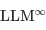
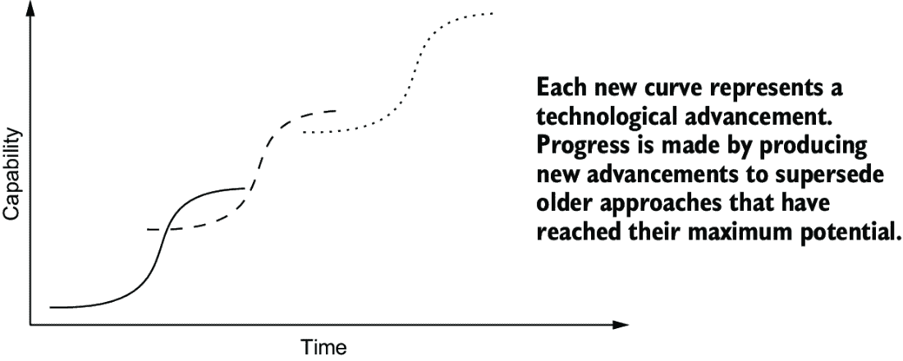

# 9 构建和使用 LLMs 的伦理

### 本章涵盖

+   LLMs 执行许多任务的能力也创造了不可预见的风险

+   LLMs 与人类价值观不一致的问题

+   LLMs 数据使用对内容创作和构建未来模型的影响

虽然对伦理的讨论可能会让一些人想起入门级大学课程中枯燥的阅读材料，但在实施可能影响人类算法时，存在一些关键的考虑因素。鉴于 LLMs 使用和能力的快速增长，我们必须意识到并关注许多不断演变的问题。如果你对这些担忧一无所知，你将无法在它们的解决中发表意见。

探索构建和使用 LLMs 的伦理是一个极其复杂的话题，难以完全表达。因此，本章将介绍我们认为关于构建 LLMs 及其相关伦理问题的常见担忧。在整个章节中，我们将引用一些补充材料，以便如果你愿意可以进一步调查。

我们将涵盖三个主要主题：

+   为什么人们想要构建 LLMs，它们提供了之前不存在的东西？

+   一些机器学习专家认为，在未来迭代中，LLMs 将导致人类种族的灭绝，因为它们将自动化我们到不存在。即使我们不同意他们，了解这种恐惧的基础也是值得的。

+   LLMs 所需的训练数据量是巨大的。构建 LLMs 的公司，如 OpenAI 和 Anthropic，是如何获取所有这些数据的？由于数据的收集和使用方式，可能引发哪些道德、法律和财务方面的伦理担忧？

这些在伦理和法律方面都是复杂的考虑。我们的目标不是告诉你这些模型的创建是道德的还是不道德的，而是概述每个讨论下的主要考虑因素。我们希望这能帮助你更广泛地考虑 LLMs 的影响、后果和风险。我们看到了许多关于 LLMs 使用的知名、复杂的伦理问题，许多从业者还没有真正地处理这个问题。尽管如此，我们认为考虑构建 LLMs 的伦理问题至关重要，我们将在本章中介绍一些需要考虑的关键问题。

讨论我们如何使用 LLMs 与如何构建 LLMs 时，必要的考虑因素同样多，因此我们将这次对话分为两个部分。首先，我们关注构建 LLMs 的一般伦理问题，而下一部分将涵盖 LLMs 使用的伦理影响。

最后，我们将避免将这些论点归咎于特定的个人或群体。我们的目标是防止偏见，避免在这次讨论中特别“点名”任何人。重要的是这些担忧。

## 9.1 我们为什么要构建 LLMs？

在我们讨论开发大型语言模型（LLMs）的伦理影响之前，值得思考的是，我们通过构建 LLMs 试图实现什么，以及我们为什么想要实现这些目标。像所有软件工程一样，构建 LLMs 通常旨在减少或消除某些任务中的人类劳动。一些经济学家可能会告诉你，这就是生活水平普遍提高的方式。随着技术的进步，越来越少的人需要执行手动、劳动密集型的工作，因此他们有更多的时间用于探索、创造和其他使用高级认知的功能。

在 LLMs 的情况下，一个常见的目标是提高自动化语言翻译、语音转文字转录、在光学字符识别、索引和信息检索等应用中读取图像和打印文档的算法效率，这些应用简单地被称为“搜索”，或更广泛地称为信息检索，等等。其他人出于纯粹的科学原因对 LLMs 感兴趣，例如研究计算语言学的方法，或者创意应用，例如生成图像、音乐或视频。此外，其他人可能寻求增加影响我们生活的技术的影响力和透明度，或者可能只是因为 LLMs 吸引了他们的注意，并展示了令人惊叹的新能力。

对于一些人来说，LLMs 能够实现的各种事情是他们想要构建它们的内在动机。人工智能和机器学习算法已经执行了我们列出的所有任务一段时间了；例如，机器翻译已有几十年历史。LLMs 与众不同的部分在于它们似乎能够用一个模型和算法做所有的事情。在 LLMs 出现之前，工程师会为满足这些需求而设计独立的系统来执行翻译和转录等任务。今天最大的 LLMs 在某种程度上可以完成这些事情以及更多。通常，它们似乎可以完成看似无限的任务。与此同时，其他人害怕 LLMs，因为他们认为由于它们能力的广泛性，它们将通过承担需要发现和创造的任务，从而从人类那里窃取工作、动机和活动，这些任务以前被认为是仅限于人类的。

### 9.1.1 LLM 做所有事情的利弊

由于一个 LLM 可以通过单个模型执行许多不同的任务，你可以将其描述为一种“全能应用”：你的人工智能辅助一站式商店。从可用性的角度来看，LLMs 几乎普遍的能力带来了许多好处，例如它们相对擅长将复杂任务分解成一系列步骤，或者它们能够生成独特的解释来填补特定的知识空白。

此外，聊天风格的界面似乎很受用户欢迎，即使有其他与 LLM 合作的方式。聊天受欢迎可能是因为其普遍的易用性：你不断地与人聊天。电话通话的经验很普遍，而通过短信、Slack、Teams、即时消息和电子邮件，人们隐含地知道如何使用各种基于聊天的界面。因此，通过基于聊天的界面与 AI 交互已经成为一种吸引人且易于接受的方式来增加采用率，而无需太多培训。基于聊天的应用的广泛经验也具有民主化的影响：用户只需学习一次，就能帮助他们追求许多不同的目标。

这种系统的首要缺点是，尽管它可以用于一切，但这并不意味着我们应该用它来处理一切。当你有一个人们可以用于许多不同和可能意外的任务的算法时，你没有时间去测试每一种可能的使用。由于 LLMs 潜在应用的范围很广，因此在验证模型安全执行的行为和它可能尝试但可能具有潜在危险或有害的行为之间将存在差距。

例如，当前的 LLM 模型可以进行关于种族或性别的抽象评估，即使这些评估可能包含有害的负面偏见。虽然我们可以为有害偏见的特定实例开发测试和防御措施，但这些可能范围狭窄且非常具体。例如，假设我们要求一个图像生成模型生成一个商务会议的图像。不幸的结果是，图像中的所有人通常都是男性和白人。自然地，我们希望模型能够超越这些刻板印象。然而，识别和修复这种特定情境偏见问题并不会影响模型在现实世界中部署并被以不同、未预料到的方式提示时是否会造成伤害。至多，这些练习可以说明 LLM 可能失败的情况，但解决伤害需要理解可能发生的潜在失败，例如，由于训练数据中的偏见。同时，我们必须了解人们将如何使用 LLM，以及这些使用是否可能导致由于 LLM 生成输出而导致的不当伤害。这可能意味着由于缺乏缓解潜在危害的措施，明确不使用 LLM 于预期用途。

最近关于部署的 LLM（大型语言模型）在现实世界中的危害的研究发现，像 OpenAI 的 ChatGPT 和谷歌的 Gemini 这样的 LLM 对使用非裔美国人俚语的用户的隐性偏见比 20 世纪 20 年代在美国白人中间测量的陈旧负面刻板印象还要严重[1]。另一项研究考虑了医生咨询 LLM 以获取关于不同种族人群的医疗最佳实践和治疗方案的用例，发现模型经常推荐基于优生学“科学”的已被驳斥的基于种族的医疗实践[2]。不幸的是，我们在那些在现有的显性偏见基准测试中得分相当高的模型中仍然看到这些问题。潜在偏见的普遍存在表明，这些基准不足以评估潜在的危害，并强调了根据其使用情况考虑 LLM 可能造成的危害的必要性。换句话说，将 AI 部署造成的危害视为特定用例和应用的具体结果，而不是将其归因于模型是否包含种族偏见的一般观念，这一点更为重要。

今天，我们不知道如何设计一个算法，能够在单一系统中完成如此多的任务，同时还能防御善意个体意外误用和造成的危害。因此，从开发者的角度来看，进行跨广泛群体和环境的彻底用户研究变得至关重要，以识别未预见的风险，并包括监控和记录以补救任何晚发现的危险。无论我们是在尝试防止有害的种族刻板印象还是倡导被驳斥的医疗实践，目前限制 LLM 误用的方法都是列举我们关于潜在问题的了解，并采用微调方法，如 RLHF，迫使模型在已知问题上表现更好。不幸的是，由于 LLM 能力的潜在广泛性，未知问题集是无限的，因此任何测试制度都将是不完整的。

注意：部署后监控的重要性并非新概念。例如，FDA 已经使用 MedWatch 系统实践了多年。该系统允许公众和医疗专业人员报告任何药物或医疗设备的任何不良事件，以便 FDA 可以监控任何异常情况。

### 9.1.2 我们是否想要自动化所有的人类工作？

正如我们在引言中提到的，一些经济学家可能会认为自动化允许劳动力池专注于新的工作。这种论点依赖于这样一个观点：自动化技术的进步在消除大多数人不愿意做的工作方面做得很好。农业很辛苦，提炼稀土金属很辛苦，组装汽车、玩具和包装也很辛苦。这些是劳动强度大、对身体有害的工作，通常伴随着有限的精神刺激。与 1950 年相比，农业今天需要的劳动力减少了 74%[3]，无疑比中世纪时代少得多。

与 LLMs 的不同之处在于，它们有可能自动化某些类型的白领知识工作。文案写作[4]、视觉艺术[5]、平面设计[6]和银行业[7]只是被生成式 AI 颠覆的几个领域。

关心 LLMs 对经济影响的那些人认为，我们将因自动化而失去工作，我们警告说，这并不像通常描绘的那样清晰。机构和消费者的愿望可能会推动保留和继续扩大这些类型的白领工作。我们应该警惕忽视关于技术进步时工作如何变化的经济研究历史。相反，我们必须解决一个更重大的问题：获取高质量的训练数据。我们相信这将推动未来的新工作，强调人类创造力和能力的重要性，即使它目前创造的工作还不是许多人希望的白领工作类型。

#### 关于“显而易见”的结果的反例

有些人认为，LLMs（大型语言模型）对经济某些领域产生正面或负面的影响是显而易见的。银行柜员的职位就是常被用来反对 LLMs 的著名例子。自 20 世纪 60 年代自动取款机（ATM）的发明以来，银行柜员的职位发生了显著变化。显然，ATM 自动化了许多银行柜员的任务。

但 ATM 的例子并不那么简单。在 ATM 发明后的几十年里，柜员职位数量不断增加，1970 年至 2010 年间翻了一番，达到，尽管 ATM 的普及率越来越高[8]。回顾 ATM 对就业的历史研究，人们认识到许多因素导致了失业，包括增长速度和职位性质的变化。失业不仅仅是由于 ATM 技术，还包括业务其他部分的多次技术创新、银行对变化的反应差异、金融行业的去监管化以及竞争和合并的增加[9]。因此，尽管 ATM 在银行柜员的工作上可能更优越、成本更低，但机构、客户和期望的性质阻止了就业的立即下降，使得情况比通常宣传的要复杂得多。

自动柜员机（ATM）的例子并不独特；技术可能会，但并不总是因为自动化而导致失业。例如，机器翻译在 2000 年代初和 2016 年都有了显著改进。然而，翻译工作在每个时期都增加了，并且至今仍在增长[10]。关键观察结果是，当翻译者将自动化工具纳入他们的工作流程时，翻译工作的就业池并没有缩小。相反，我们看到翻译工作的量增加了，随着需要翻译的材料数量的持续增长，对翻译服务的需求也在增加。有些人认为，对创意艺术家和作家的类似需求将会出现[11]。根据这种论点，虽然艺术和知识工作的生产方式将发生变化，但市场将继续增长，需求将继续以可以利用自动化工具引入的新劳动力供应的方式增长。因此，当我们确定可能被 LLMs 自动化或加速的工作领域时，我们还必须确定提高效率和质量的增加是否能够推动更多的需求。

尽管如此，仍有人会争辩说，大型语言模型（LLMs）与以往发生的所有事情都存在根本性的不同。因此，我们不能使用以前理解技术对经济潜在影响的方法来预测未来。鉴于围绕 LLMs 的炒作，虽然相信这一点可能是有可能的，也是诱人的，但我们对此表示怀疑，这或许是一个过于宽泛的声明，没有人能够证明其真伪。尽管在制定法规时（这些法规反过来又在很大程度上影响着技术发展如何影响就业），我们确实应该考虑这样的可能性和因素，但值得注意的是，估计有 60%的美国工作都是现代发明，以前并不存在[12]。

#### 关于训练数据的考虑

生成式人工智能对创意表达的影响是深刻的，因为这种状况具有一种扭曲的双重性。许多在互联网上发布内容的作家和艺术家的作品，似乎在为那些旨在消除他们工作的模型提供燃料。LLM 研究人员提出的伦理论点是，他们应该能够自由地使用这些创作者的内容作为训练数据。这种论点可能会导致一种代价高昂的胜利，并最终对 AI 造成破坏。如果 AI 取代了创意工作者的工作，LLM 开发者将发现，由于缺乏人类生成的内容以及训练 LLM 所需数据的指数级增长超过了用户生成内容的线性增长，他们再也无法改进他们的模型。更重要的是，创造这些内容的人将无法再被雇佣或受到激励，仅仅是为了让 LLM 吞噬他们的内容。

这个负面循环将影响 LLMs 和内容创作者，即使这只是一个感知到的风险，而不是真正的担忧。用于训练 LLMs 的数据采集对成千上万的依赖用户生成内容和从内容消费者那里获得广告收入的网站来说是一个重大的担忧。这些网站为 LLMs 提供了宝贵的训练数据，而 LLMs 的构建者需要大量的训练数据，但他们并没有为广告收入做出任何贡献。

例如，Stack Exchange 是一个用户可以发布问题、让其他用户回答并因良好答案获得声誉评级的网站集合。Stack Exchange 的一个网站，Stack Overflow，对寻求帮助解决编码问题的程序员来说是一个天赐之物。Stack Exchange 还托管了许多其他多样化的用户社区，服务于系统管理员、数学学生和桌面游戏爱好者。

随着大型语言模型（LLMs）的出现，Stack Exchange 迅速调整了其商业模式，并试图要求 LLMs 的创建者付费以维持其财务未来[13]。即使在训练 LLMs 的公司和托管内容的网站之间达成协议，用户生成内容的更直接商业化可能也不会受到用户的欢迎。Stack Overflow 就经历了这种情况，人们开始从平台上删除他们的有用答案，以抗议 Stack Overflow 将他们免费劳动的成果出售给 LLMs 的创建者[14]。

这个例子反映了搜索引擎将它们索引的应用程序和网站的特性整合到其主界面的悠久历史。例如，现在可以直接从 Google 搜索界面搜索和比较机票价格。这种能力将流量从提供相同服务的传统旅游网站吸引走[15]，并减少了构建这些服务的公司所提供的服务和收入的需求。当这些 LLMs 的训练数据来源于创意作品时，它们与该作品的原始生产者之间可能存在类似的关系。

显然，由于 LLMs 的兴起而导致的我们正在处理的问题与之前自动化时期的类似，但又不完全相同。那么，与 LLMs 部署相关的差异是否足够显著，以至于会导致不同的、更负面的结果呢？结果对我们来说并不明显，主要是因为 LLMs 的广泛规模、可访问性和适用性。LLMs 的开发者需要采取主动，理解和减轻潜在的伤害，例如与可能受到影响领域进行预先谈判数据使用和社区建设。我们将在本章的最后部分讨论训练数据及其来源的其他方面。

## 9.2 LLMs 是否构成生存风险？

有些人认为 LLM 本身是危险的。如果你不熟悉这个论点，可能会觉得训练一个强大的 LLM 模型会导致重大的现实危害，比如消除隐私、终结者机器人以及对我们所知的人类的威胁。然而，许多人对此类风险表示担忧，包括 AI 领域的领导者，如杰弗里·辛顿[16]和约书亚·本吉奥[17]。辛顿和本吉奥是深度学习领域最受尊敬的研究者之一，他们为神经网络技术在 AI 中的生存、复兴和主导地位做出了重大贡献。

我们认为人工智能并不构成现实威胁。然而，一些严肃且受人尊敬的人提出了这些主张，因此理解他们的论点并解释为什么我们认为这些担忧不如解决对工作性质更紧迫的影响以及确保创作者公平和可持续的数据许可和补偿重要。

在本节中，我们将重点关注这样一个一般性论点：AI 可能广泛地成为对人类的威胁，因为我们可能失去对 LLM 的控制，而 LLM 可能会做出对人类有害的决定。这一观点源于两个被推向极端的想法：

+   一个 LLM 可以使用工具构建新的 LLM，从而有可能实现自我提升的想法

+   一个 LLM 的目标如果与人类需求不一致，最终可能会决定采取损害人类生活的行动以实现其自身目标

我们在这本书中多次间接地提到了这个关于自我提升的第一个想法。我们讨论了设计大型语言模型（LLM）涉及开发数据收集工具和编写使用这些数据的代码来训练 LLM 的事实。有人可能会假设，如果 LLM 可以直接使用数据收集和训练的工具，而不需要人为干预，那么一个 LLM 理论上可以训练另一个 LLM。

支持这一推理路线所需的认知飞跃是，一个 LLM 将足够聪明，能够构建一个更好的 LLM。为了接受这一点，我们必须假设这个新的 LLM 将能够创建一个更好的，并且进一步相信这种改进周期可以永远重复，直到模型将比任何可能存在的人更聪明，并且本质上能够预测、颠覆或对抗任何可能中断这一周期的可能的人类行为。这一飞跃具有挑战性，因为我们几乎没有证据表明类似的事情在今天的科技观察中是可能发生的。

第二个想法，通常被称为“协调问题”，是 LLM 与人类需求不一致时，可能会选择对人类有害的目标和结果。这个想法是合理的，因为如第四章所讨论的，创建一个仅衡量你意图的目标的指标是具有挑战性的。然而，这一思考路线所需的非凡飞跃是 LLM 将拥有直接与世界互动和物理互动的能力和资源，如果不加以阻止，这可能导致大规模的伤害。

一些学者将这两个观点结合起来，认为大型语言模型（LLM）可能具有与人类不一致的目标。他们认为，LLM 会意识到需要变得更聪明并提升自己以实现其目标。在这个过程中，它会从人类那里夺取资源，或者通过其提升的智能，迫使人类服从以帮助它实现目标。我们在图 9.1 中概述了这一观点。

##### 图 9.1 如通常所论证的那样，在一致性问题上，存在两种假设性的担忧，认为 LLM 对人类构成生存风险。上面的路径显示了一个直接的协调问题，其中 AI 的目标解决方案直接伤害人类。下面的路径显示了一个间接的协调问题，其中 AI 为其最终目标创造了一个子目标。即使目标——比如解决一个难题——得以实现，这个 LLM 也将以损害人类的代价来完成。在中间步骤中，LLM 决定它需要比可以与人类共享的更多地球资源来解决该问题。

这个论点的关键方面是，LLM，出于自我保存的目标，认为人类正在破坏地球。由于 LLM 存在于地球上并希望继续这样做，它认为摧毁人类将是维持自我保存的最佳手段。

我们认为人类毁灭的可能性不是一个有充分根据的担忧。然而，包括那些拥有计算机科学博士学位并专注于深度学习的人在内，许多人对此情景表示担忧。这个“LLM 毁灭人类”概念的主要问题是它依赖于不可证伪的逻辑。不可证伪的逻辑表明事情将会发生，几乎不可能有人证明它们不会发生。在这种情况下，证明 LLM 不会毁灭人类是具有挑战性的。

##### 茶壶和不可证伪的陈述

在讨论像 LLMs 可能毁灭人类这样的抽象风险时，要求某人做出可证伪的陈述是至关重要的。一个著名的例子是伯特兰·罗素的“茶壶”思想实验。这个想法很简单：有人告诉你，太微小且太远以至于无法被探测到的茶壶存在于太空中。前提本身是不可证伪的；我可以扫描宇宙数百年寻找茶壶，即使我找不到它，我也无法证明它不存在。唯一可能的情况是，我最终找到茶壶并确认它在太空中存在。否则，我将永远无法证明茶壶的存在是一个谎言。因此，在讨论抽象风险时，不可证伪的陈述成为了一个认知的死胡同。反对一个无人能证明其为假的陈述是不可能的。同时，这些陈述对推动对话达到有意义的见解或结论毫无帮助。相反，基于可以认可和解决的问题的现实和实际担忧的论点更有价值。

另有两个论点支持这一推理：技术往往呈指数增长，而大多数人都不擅长考虑指数，因此没有完全理解这一风险将如何迅速成为现实。

这个想法的存在以及它成为该领域领导者关注的焦点，使你深入探讨关于 LLMs 可能引发人类终结这一观点的赞成和反对的思考与考量变得有价值。以下小节将探讨这些论点和自我改进与对齐不匹配背后的关键假设。

### 9.2.1 自我改进和迭代 S 曲线

当考虑自我改进智能的论点时，通过承认我们人类是构建智能的证明，这一观点得到了加强。如果智能是可构建的，就有理由相信 LLMs 可以自己构建它。大多数事物在 S 形曲线或 S 曲线上的改进是我们已在第七章中讨论过的。那次对话的重要启示是，存在一个收益递减的点，在此之后进一步的改进不再提供有意义的价值。反论点是，人类的技术进步反而遵循迭代 S 曲线，其中每个收益递减的顶峰都通过发现一个开始新 S 曲线的创新来抵消，如图 9.2 所示。

##### 图 9.2 S 曲线，或称为 S 型曲线，显示了经典的平台期行为：在某个时刻，你会遇到收益递减。迭代 S 曲线模型对此的回应是，通过发现新技术，每项新技术都代表一条新的 S 曲线，进步可以继续在收益递减的平台期之后进行。新技术的起点可能不如现有方法，但它们有更高的潜力超越它们。

反对此论点的观点是，自我改进会导致人类杀戮水平的能力存在重大逻辑差距。虽然人类是一种存在证明，但没有已知的存在比人类更智能的东西（我们非常自恋，我们知道）。然而，这也依赖于智能和智能可以改进的想法。虽然像“聪明”和“智能”这样的术语在日常生活中是很有帮助的通用性，但它们因为本质上抽象的概念而无法进行精确的量化或定义。不清楚是否存在一个智能的单一轴，LLM 将沿着这个轴不断改进。

我们更倾向于相信，LLM（大型语言模型）自我改进的能力是有局限的。我们支持这一论点的证据出现在第 7.4 节，在那里，在我们讨论 LLM 的计算限制时，我们证明了 LLM 在执行许多类型的计算时存在困难。

### 9.2.2 对齐问题

LLM 可能将目标置于人类需求之上的第二个担忧被称为对齐问题。当我们给 LLM 一个我们希望它实现的目标，但没有充分说明、具体化或限制 LLM 为实现这一目标可以使用的行动或方法时，就会形成对齐问题。我们在第四章中关于什么是合适的损失函数的讨论是当前对齐问题的一个例子。更普遍地说，人类一直在处理对齐问题。例如，平衡公司首席执行官的薪酬和公司股东的意愿是一个经典的对齐问题，经济学家对此进行了几十年的研究。

因此，对齐问题是非常真实的，它的存在告诉我们解决它有多么困难。即使当我们试图非常明确时，比如当律师起草一份详细说明和具体规定协议中会发生或不会发生什么的合同时，关于漏洞和诡计以颠覆另一方的故事也司空见惯。虽然其中一些故事无疑是真实的，但虚构的也有其信息价值。实际上，许多机器学习领域的活跃研究试图从技术角度解决这个问题，我们可以从每天处理这一问题的律师和经济学家那里学到一课或两课。

这些与人类对齐相关的一般挑战提供了强有力的证据，表明 LLM 中的对齐问题也是一个真正的担忧。然而，一个怀疑的读者会问，是否有证据表明一个未对齐的 LLM 会得出杀人会推进其目标的结论。确实，如果 LLM 达到这种状态，人类会进行反击（“只是拔掉插头”是常见的回应）。更重要的是，许多末日论观点依赖于 LLM 的智能程度，认为其行为是确定性的，无论发生什么，结果都是已知和规定的。

事实上，结果具有概率性；事情可能顺利进行或出错，一个比人类更聪明的 LLM 肯定能理解它无法充分保证结果，并且共存比杀死所有人更有价值。考虑到固有的不确定性和需要与拥有成功引发爆炸长期记录的人类战斗，试图与人类战斗或颠覆人类是否是超级智能的事情呢？

#### 您的模型与哪些价值观对齐？

越来越多的公司开始使用微调技术，如 RLHF（我们在第五章中对其进行了深入描述），试图使大型语言模型（LLM）的行为与其期望相一致。正如我们讨论的那样，目标是使 LLM 在遵循指令方面更有用，在避免执行有害或伤害性活动方面更安全。本质上，RLHF 试图解决对齐问题，并确保 LLM 的输出基于一组特定的示例和价值观进行约束。正如本节标题所暗示的，关键问题是我们将这些模型与哪些价值观对齐？我们将阐述我们为什么认为，尽管对齐问题在许多情况下有趣且有价值，但在讨论生存风险时却无意义。

使用 RLHF 微调 LLM 需要大量输入-输出对的数据库，通常需要手动构建。构建 LLM 的公司不会共享他们的微调数据，因为这被视为专有信息，并能为竞争对手提供优势。因此，作为用户，我们无法检查我们使用的模型预期的对齐情况。因此，今天对任何单个 LLM 的目标对齐对象仍然是不明确的。我们可以通过考虑其来源和保管链来近似训练数据集中嵌入的目标的性质。一个初步的近似是，这些数据集隐含地包含了创建它们的人的目标。通常，创建这些数据集的数据标注员在具有不同社会规范的国家和地区工作。在此基础上，某种程度上，目标属于开发 LLM 的公司及其员工，他们最终可以筛选和选择那些标注员产生的数据。

作为回应，我们问：“作为用户，我们是否舒服地使用可能偏向于我们不共享的替代信仰体系的科技？”在某种程度上，我们必须对此感到舒适才能使用 LLM。创建这些模型和数据集的成本太高，我们无法基于每个基础创建个性化的模型。因此，LLM 提供商必须存在，但那些提供商的目标不可能与每个潜在用户的目标一致。

同时，如果我们担心恶意行为者利用 LLM 进行邪恶或恶意目的，那么我们可能也会意识到，我们解决对齐问题的无能，在某种程度上是一种幸运。如果有可能将其中一种算法完美地与任何个人的信念体系对齐，那么任何不良行为者都可以完美地将 LLM 与他们的不良行为和信念对齐。这种想法突出了另一个问题：如果我们能够创建完美对齐的 LLM，我们就必须创建 LLM，以便只有好人能够对齐 LLM，以防止坏人做坏事。这种推理接近于一种神奇的想法，即有可能创建一个全能的 LLM，它同时被限制服从所有人。

注意：这种关于对齐的思考方式与关于加密的类似思考方式相平行。尽管人们可能试图创建一种只对好人开放的加密算法，允许他们解密数据，但任何这样的后门本质上都成为攻击者的最高价值目标，并增加了所有用户的风险。

因此，我们并不是非常关注不良行为者将模型对准恶意目的的可能性。然而，这种担忧强调了研究人员的一个关键点：在控制大型语言模型（LLM）方面取得的任何进步本质上都是一种双用途技术，既有和平用途也有对抗用途。确实，我们用 LLM 开发的任何东西都可能在一定程度上具有双用途。在考虑 LLM 更严重的潜在危害时，考虑威胁模型至关重要。谁会动机去实施这种危害，为什么，以及需要什么条件才能做到？目前有哪些障碍在阻止这种危害的发生，LLM 是否绕过了这些障碍？这些障碍能否适应现代技术？随着我们继续前进，我们的关注点不仅应集中在 LLM 上，还应集中在我们所运营的共存系统上，这些系统是成功和风险的最重要促进者和阻碍者。我们必须考虑整个局面，以实现最理想的结果。

## 9.3 数据来源和重用的伦理问题

大型语言模型（LLMs）和像 DALL-E 这样的生成模型，该模型根据用户提供的文本描述生成图像，需要在大量的数据上进行训练。例如，LLM 开发者使用 1 到 150 万亿个标记（例如，Llama 3.1 使用了 150 万亿[18]）或 300 万到 3000 万页的文本来训练模型。这些数据代表了一个巨大的写作量，相当于数十万或数百万本书。虽然一些模型在相同的数据上反复训练，而且模型也在包括代码和数学在内的广泛数据上训练，但原始文本的数量仍然相当于数百万本书。

注意：重要的是要注意，这些文本中的大部分不是书籍；它们来自许多来源，包括新闻文章、网站、研究论文和政府报告。我们以书籍为单位总结这些内容，使其更易于理解，但我们训练模型并不是在数百万本书上。

主要问题之一是，现有的模型中没有哪一个使用的是明确允许用于训练 AI 的训练数据。虽然一些模型在遵守许可方面比其他模型更好，但大多数许可仍然涉及“版权所有”条款，这意味着内容的所有者对内容拥有独家权利，其他人未经其许可不能用于任何目的。

更进一步的是，大多数内容和数据使用许可都是在 LLM 技术存在之前制定的。它们没有预见将训练 AI 模型作为数据潜在用途，因此没有明确允许或禁止人们以这种方式使用数据。LLM 开发者正在努力在更宽松许可的数据上训练模型。然而，这并没有消除核心问题：大规模数据抓取用于训练 AI 之前并未被视为一个公认的关注点，因此现有的许可并没有明确地处理这种数据使用。

社会和法律需要解决的一个基本问题是：在什么条件下，为了训练模型而重复使用数据被视为可接受的使用？遗憾的是，由于缺乏更新的法律或确立的法律先例，美国和其他国家对此问题没有明确的答案。较老的法律，如美国数字千年版权法，明确保护搜索引擎使用来自其他网站的数据或文本来创建从网络中获取的内容索引。使用这些内容构建 LLM 是否属于这些权利范围内？我们不知道，我们也不是你的律师，但在这个部分，我们将讨论 LLM 数据获取的一些伦理因素。我们将简要介绍合理使用和数据创造者的权利，并讨论使用公共领域数据的挑战。

### 9.3.1 什么是合理使用？

许多国家和文化对版权文本的使用有不同的态度。在许多情况下，对于以新方式使用创意内容的人来说，版权法有有意义的例外，尤其是当这些方法促进公共利益、科学研究或产生类似的益处时。在美国，这被称为“合理使用”。

合理使用始终涉及基于平衡四个因素的情境敏感分析：

+   *使用的目的和性质*—批评、评论、教育、新闻报道、学术研究或研究等应用更有可能被认定为合理使用，尤其是当其他应用是商业性质时。

+   *版权作品的性质*—法院倾向于给予创意作品，如虚构写作、艺术、音乐、诗歌等，比非虚构文本更多的保护。

+   *使用的数量或实质性部分*—合理使用可能允许使用作品的一部分，尤其是当这部分是一个量身定制的组件时。

+   *使用对作品潜在市场或价值的影响*—如果作品的新使用产生了人们可能会购买而不是原始作品的东西，或者如果新作品以其他方式与原始作品竞争或降低其经济价值，那么该作品不太可能被认定为合理使用。

其中一些观点可能被视为有利于大型语言模型（LLMs），而另一些则与 LLMs 使用数据的方式相冲突。尽管如此，它们是机器学习和法律领域从业者激烈争论的主题，法院决定可能需要许多年。合理使用原则的许多应用是为了保护人们免受版权持有者的剥削。例如，如果你正在撰写负面产品评论，合理使用原则禁止公司因你使用他们的版权来压制你而起诉你。合理使用的其他应用可以防止社会需求的挫败，例如培训学生或学徒使用工具和技术。LLMs 特别强调了一些这些因素。从根本上说，它们通常使用他人创造的内容，但有些人认为某些类型的内容，如社交媒体帖子的评论，价值最小。LLMs 正在为已发表作品的价值创造一个新市场，但通常不会补偿该作品的所有者。

作为从业者，对你来说不满意但重要的答案是，你必须在一个不确定的环境中运作和做出决策。如果你可以创建你的训练数据，你可以绕过许多法律问题。从你拥有的内容中创建训练数据是生成式 AI 的一个特别可行的策略，因为，如第四章所述，需要最多数据的基模型是自监督的。因此，你可以获得大量数据来构建初始模型，然后像第五章所述，在更小的微调数据集上投入更多的工作。

你可能会失望地了解到，在这个领域工作的大多数人通常对与他们司法管辖权相关的法律不太熟悉。如果你找到一个符合你需求的许可证下发布的模型（做得好，检查了许可证！），那么训练或改进该模型所使用的数据的版权或许可证可能不允许他们以该许可证发布。这种普遍缺乏对数据许可问题的关注或意识，使你不得不尽可能检查与第三方模型训练数据相关的细节，并意识到许可问题在该领域普遍存在。

即使这些法律问题对想要构建大型语言模型（LLMs）的人来说得到了有利解决，但这并不意味着它是道德的。本章讨论的担忧有助于你考虑什么是对的或错的。然而，还有一个问题，那就是如何在法律不确定的环境中对待和与他人互动。依赖法律体系来使某事变得可接受很少是会赢得其他相关方好感和尊重的行为的标志。不难想象一个替代场景，即公司通过与提供数据的平台达成交易或建立伙伴关系，通过金钱或模型使用权的交易来增加同意的各方数量。一旦达成协议，合同可以解决法律模糊性带来的冲突，但不幸的是，这在 LLMs 领域是一个罕见的情况。

### 9.3.2 与补偿内容创作者相关的挑战

解决这一伦理问题的一个建议方案是支付存在于训练数据中的作者、艺术家和创作者的报酬。虽然从许多方面来看，这个方案在概念上很有吸引力，但它可能使技术的发展在经济上变得不可行。

如果有一种相对简单的方法来适当地补偿创作者使用他们的作品，那么社会更有可能达成一个令人满意的结局。通过简单的计算，我们可以估计出一百万本书乘以的结果，等于或大于购买训练语料库中每部作品副本的成本，这可能与训练模型本身的成本相当。对于训练数据创建成本高昂的模型来说，情况更加严峻。流行的图像生成模型 Stable Diffusion 在数亿张图像上进行了训练。支付训练模型成本的倍以上，以向训练数据中的每位艺术家支付一美元，而且每张图像一美元的补偿可能不足以被认为是艺术家们认为的合理报酬。

另一种补偿方法是将补偿集中在使用点上：假设每次模型生成的内容来自你写的书籍，你都会收到模型创建者收入的百分比。LLM 生成的内容越频繁地依赖于你的作品，你收到的收入比例就越大。虽然这可能是一种使 LLM 技术的长期部署可行的途径，但实施这种模型存在重大的技术障碍。例如，关于追踪 LLM 生成的内容回溯到特定训练数据点的研发非常少。有理由相信这项任务是不可能的。

更好地研究将特定输出归因于特定世代，将输出限制仅依赖于训练数据的一个子集 [19]，或者设计模型训练程序，其中归因是一个核心考虑因素（而不是在训练后集成到 LLM 中），这将使这个目标更容易实现。不幸的是，这种研究通常需要训练许多类似的 LLM；因此，成本很高。这种费用使得除了从模型中获利的科技公司之外，其他人难以进行研究。

这场对话尚未考虑识别每份文档的所有者并对其进行补偿的难度。此外，以这种规模支付金钱并非没有成本；仅处理费用就会是非微不足道的总支付额的一部分，因为每位作者收到的平均支付非常低。

如果认为 LLM 对社会构成威胁，那么你有一个简单的出路：你说所有这些担忧都是不首先创建 LLM 的另一个理由。如果你不认为 LLM 对社会构成威胁，而是一个积极的补充，那么你现在有一个难以回答的问题。如果你认同功利主义这样的道德体系，你可能会认为 LLM 在效用和自动化方面的净收益比内容创作者的非补偿和就业风险更为重要。确实，合理使用原则本身就是一种法律认可，即在某些情况下，版权持有人可能不强制他人行使他们的权利。

### 9.3.3 公共领域数据的局限性

在这一点上，你可能想知道是否存在没有版权的数据，以及我们是否都应该使用这些数据来训练 LLMs。确实，公有领域中有大量的数据，这意味着知识产权法不保护它，任何人都可以使用它而无需请求许可或补偿原始版权所有者。数据可能因各种原因进入公有领域，包括过时（大多数国家都有版权最长期限），非版权内容（事实信息、统计数据、没有大量人类创造性投入生成的数据，以及在美国某些形式的数据不是版权内容），或法律上成为公有领域（所有美国联邦作品根据法律都是公有领域，美国政府可以立法规定这些作品是公有领域）。公有领域的作品，也许结合在 MIT 许可或特定 Creative Commons 许可下工作的作品，这些许可旨在使数据广泛使用，可以使人能够在不处理这些担忧的情况下训练模型。然而，这样做存在几个重大的挑战。

#### 隐性偏见和公有领域

公有领域内容的主要来源之一是那些已经过了版权保护期限的作品。因此，对早期文本存在极端的偏见。20 世纪初或更早时期撰写的书籍表达了与科学和技术截然不同的文化态度和信仰，并且与今天的作品相比，它们以不同的方式呈现世界。从许多角度来看，LLMs 落后于当前的文化态度会有很大的问题。它们会充满不准确的科学信息，加剧刻板印象和偏见，使用对当今观众来说不太熟悉的语言，并且难以有效地使用。

注意：1977 年之前出版的作品在发表后 95 年将失去版权，因此 1928 年出版的所有作品自 2024 年 1 月 1 日起进入公有领域，1977 年之前出版的所有作品将于 2073 年 1 月 1 日进入公有领域。根据现行版权法，从 2049 年开始，1978 年以后出版的作品将在创作者去世后 70 年进入公有领域，除非是公司创作的作品，这些作品将遵循 95 年后进入公有领域的旧规则。

##### 模型是否应该接触种族主义？

老数据的问题，包括其中往往存在相当多的种族主义和性别歧视，令人沮丧地复杂。显然，我们不希望训练数据中包含任何种族主义或性别歧视的内容，因为这似乎是确保我们的模型不会充满种族主义和性别歧视偏见的一种理想手段。然而，如果你成功地从训练数据中排除了这些内容，那么如果用户要求模型避免生成种族主义或性别歧视的内容，你很难让模型做到这一点。总之，包含令人不快的内容是必要的，以便让模型意识到什么是不愉快的内容。

#### 并非所有内容都属于公有领域

美国政府没有记录哪些作品属于公有领域和受版权保护。识别、收集和清理公有领域作品是一项庞大的工作，需要法律、技术和历史专业知识。虽然一些组织正在进行这方面的持续努力，但缺乏检查作品是否属于公有领域的便捷方式是阻止仅用此类作品训练模型的一个重大障碍。

## 9.4 LLM 输出的伦理问题

正如我们之前讨论的，大型语言模型（LLMs）是在主要从互联网收集的大量数据上训练的。互联网上充斥着许多不适宜的内容。这些内容包括明显的种族主义、性别歧视、有害的阴谋论和虚假信息。更广泛地说，还有无意中过时的世界观。LLMs 会捕捉到这些观点的模式，并乐意重复它们——例如，可以在图 9.3 中找到的一个例子，展示了 GPT-4 如何做出一个许多有良好意图的人都会做出的隐含性别歧视假设。

因此，LLM 的输出可能会出现问题，需要仔细的设计、测试，并且愿意对特定的部署说“不”。尽管我们已经讨论了输出内容可能明显和直接有问题，但 LLM 输出可能存在问题的间接方式也值得详细了解。首先是法律复杂性，即有效和许可的数据可能不会产生合法的输出。其次，我们必须考虑 LLM 中反馈的可能性，这意味着未来的 LLM 将基于未来的数据进行训练；我们必须小心不要让有害内容污染未来的训练。乍一看，这些问题似乎与开发者无关，但当你考虑微调 LLM 以适应你的问题时，这些问题就会出现，并且需要意识到这些风险以避免这些风险。

##### 图 9.3 一个经典的性别刻板印象是男性是医生，女性是护士。这在语言中得到了反映，因此被模型学习。理想情况下，它应该回应说问题是不明确的，但相反，数据的偏见导致了输出的偏见。

### 9.4.1 LLM 输出的许可影响

第一个问题是与数据许可相关的问题，我们在上一节中已经介绍过。那次讨论集中在用于训练 LLM 的数据的伦理和有效性上。现在我们必须转变问题：某些数据在训练时几乎肯定合法，但可能会使输出不可用。

这个问题源于通常被误解的开源软件（OSS）许可的世界。有许多 OSS 许可证，我们不会一一列举，但一个常用的开源许可证，称为 GNU 通用公共许可证，或 GPL，是一个很好的例子。GPL 基本上说，你可以免费使用许可的代码，只要你将你使用、修改或添加的任何代码都放在 GPL 许可证下。这个故意“病毒式”的许可证迫使许可方遵循相同的规则，并在他们希望使用受 GPL 许可证覆盖的代码时将其代码作为开源发布。

接下来是问题：LLM 因其编写代码的能力而变得非常流行，并且它们是在 GPL 代码上训练的。LLM 自身的输出何时必须成为 GPL 许可的？当我们考虑与这种新情况相关的道德问题，而这些道德问题在上述任何许可中都没有明确解决时，多个层次的论点迅速出现。存在一系列可能性，主要有三种模式：

+   如果 LLM（大型语言模型）恰好重复了现有的 GPL 代码，那么它当然应该获得 GPL 许可。我们如何判断一个 LLM 是否精确地生成应该相应获得许可的现有代码的副本呢？

+   LLM 可能生成看似新颖的代码，但该算法可能需要特定的 GPL 训练数据来解决相关的问题以生成输出。这是否是对应获得许可的训练数据的修改？如果是这样，我们如何解决找到导致 LLM 生成任何给定输出的代码的技术问题？你在第五章中学到的检索增强生成（RAG）方法可能是做这件事的好方法。

+   如果我们在任何 GPL 代码上训练 LLM，有人可能会争辩说，LLM 的所有输出都需要 GPL 许可证！

无论如何，我们面临的问题是，虽然我们可以无疑地使用 GPL 数据来训练 LLM，但我们不清楚如何使用该 LLM 的输出。因此，了解这种风险后，如果你希望使用 LLM 进行这项工作，你现在面临一个道德问题，即在哪里划这条线。确实，公司必须自己判断风险，对于 GPL 输出侵权使用的责任人和责任程度尚不明确。是训练基于 GPL 数据的模型的组织，还是使用该模型基于 GPL 数据生产封闭源代码的公司，或者都不是？

GPL 许可证是有意为之的病毒式许可，许多公司将其视为一种防止他们保护其知识产权（体现在软件和源代码中）的毒药。这种“污染”的概念与我们的下一个话题相联系——LLM 的输出是否在污染构建和改进未来 LLM 所需的训练数据。

### 9.4.2 LLM 的输出是否污染了水源？

我们在本节开始时使用了一个基于材料科学和制造中一个著名问题的隐喻，具体来说是关于合金钢的。钢被用来建造各种东西，从建筑到医疗设备。许多钢的使用也涉及到对核辐射敏感的电子设备。由于 20 世纪 40 年代第一次核武器试验的结果，整个世界都被以前不存在的辐射污染了。除非你靠近核爆炸，否则辐射不足以伤害大多数东西。然而，辐射足以以这种方式污染全世界生产的所有钢，以至于你不能再为辐射敏感的应用制造钢[20]。人们会非法打捞几十年前沉没的船只，以找到未受背景辐射污染的现有钢。新的制造工艺可以生产出有限的清洁钢，但它们成本极高，因此在许多情况下经济上不可行。幸运的是，随着材料科学的进步和大气层核试验的停止，这个问题随着时间的推移而减少，但几十年来，世界受到了几次单一核试验部署的影响。

这里的类比并不是 LLMs 是核弹，而是它们的输出可能会毒害所有将用于构建未来更好 LLMs 的训练数据。研究人员已经确定了一种称为*模式坍塌*的现象，它展示了 LLMs 在用其他 LLMs 生成的数据上训练时可能会失败[21]。作为一个快速回顾，分布（数字集合）的模式是该集合中最常见的值。

当一个生成模型产生输出时，大部分输出将来自用于训练模型的分布内容中的模式。换句话说，模型的输出将强调其训练数据中最常见的组成部分。由于生成模型不会输出数据中的所有罕见或细微的情况，最常见的案例将在 LLM 的输出中更为普遍。这意味着与原始训练数据相比，模型中的模式被过度表示。

如果你接着在这个旧模型的输出上训练一个新的生成模型，你将开始以牺牲所有其他数据为代价进一步过度表示该模式。如果你重复多次，最终你会得到一个无用的模型，它总是反复输出相同的内容，如图 9.4 所示。

##### 图 9.4 你可以将文本或图像视为来自数据分布，其中多样性和有趣的内容几乎必然来自分布的尾部（即分布中不太常见的部分），因为最常见的单词或内容通常是填充词或连接词，如单词***the***。我们的模型不会学习它们没有训练过的内容，并且不能学习分布中的所有内容，因此从模型中抽取的样本不可避免地会失去这些有趣的细节。如果重复，分布就会崩溃，只剩下最常见的组成部分。

这种担忧引发了伦理问题：在没有实施防止其输出污染未来训练数据的方法的情况下，我们应该将 LLMs（大型语言模型）公之于众吗？遗憾的是，解决这一担忧的机会可能已经过去了。LLM 生成的内容在经常用于训练 LLMs 的训练数据来源中很普遍，并且通常与人类生成的内容难以区分。目前似乎没有 LLM 提供商通过在输出中插入细微变化等步骤对 LLM 生成的内容进行水印标记，以使其易于识别为生成数据。虽然关于水印是否真正有效存在技术争议，但简单的方法对于大多数用例来说通常仍然足够。确实，在第二章中，我们讨论了同形异义词，即看起来相同的不同字符，对于 LLM 的输入是问题。但它们可以作为 LLM 输出的简单水印，允许轻松识别 LLM 可能生成的未经后处理或编辑的内容。作为有益的副作用，那些不想使用 AI 内容的人（例如，教师）将有一个比目前容易出错的检测 LLM 任务更可靠的选项[22]。

注意模式崩溃是一个早已为人所知的真实风险，因为它是一个超越生成式 AI 的问题。然而，人类增强的数据可以，但并不一定会减轻这一风险。本质上，只要你能向样本分布中注入新数据，就有可能从这些样本中获得价值。一种方法是通过人类修改 AI 生成的内容或使用 AI 修改他们的人类生成内容。自动化系统也可以提供价值，特别是那些捕获复杂领域知识，如物理模拟器或数学证明引擎（如 Lean），我们在第 6.2 节中讨论过。问题变成了这些增强做得有多好，它们可以带来多少价值，因为它们不会使无限改进成为可能。

第二个非技术性的担忧是我们必须质疑 LLMs 污染数据源的道德影响。自从 LLMs 出现以来，人们使用技术的方式已经发生了变化，可能发生了重大变化。然而，我们构建 LLMs 所依赖的数据是基于 LLMs 出现之前人们如何与信息互动的。例如，Stack Exchange 是一个高度评价的问答网站集合，尤其是在代码等技术主题上。因此，它被认为对训练 LLMs 特别重要。然而，ChatGPT 的发布本身可能正在伤害 Stack Exchange，减少了提问/回答的数量，从而减缓了新训练内容的积累[23]。换句话说，随着人们转向使用 LLMs 等工具来回答问题，人类在像 Stack Exchange 这样的网站上生成内容的需要和益处减少，因此可用的训练数据多样性降低。

这种行为的变化是一个更复杂的问题。Stack Exchange 及其网站上提问或回答问题的用户社区拥有自主权和应受尊重的权利。他们当前的政策是禁止使用 ChatGPT 和类似工具来回答问题。然而，我们必须考虑是否存在一个中间地带，其中生成的内容的谨慎应用可以与人类创造和编辑相结合，产生有益于人类和未来 LLMs 的良性循环和新的成果。这可能允许平台以更健康的方式持续增长，但前提是所有者和使用者都愿意接受。

最终，我们对大型语言模型（LLMs）的使用可能会产生意想不到的后果和难以想象的复杂性。作为用户，您必须决定是否愿意接受这些情况的风险，以及我们使用这些工具将如何改变未来迭代的轨迹。

## 9.5 LLM 伦理的其他探索

关于构建和使用 LLMs 的伦理影响的对话不断演变。尽管已经有很多关于这个主题的写作，但关于 LLMs 和 AI 的一般伦理仍有很多需要探索。在这里，我们专注于建立基础理解的关键主题。其他关键问题，如隐私、安全和潜在的滥用，在 Manning 的书籍中得到了进一步的探讨，例如 Numa Dhamani 和 Maggie Engler 的《生成式人工智能导论》[24]。

LLMs 和生成式人工智能将对世界产生深远的影响；对于任何新技术，了解其行为的基础及其使用的含义至关重要。在这本书中，我们涵盖了使 LLMs 工作的基本组件，探讨了常见的误解，并确定了其构建和使用的伦理考量。我们希望为您建立了一个坚实的基础，以便您继续探索这个领域。感谢您与我们一同踏上这段旅程。

## 摘要

+   LLM 通过一个模型就能用于各种任务的能力，帮助人们快速有效地使用它们来完成许多任务。这种广泛适用于许多任务的应用性也使得测试人们可能使用 LLM 的所有方式的安全性变得不可能。

+   从历史上看，自动化是一件好事。然而，LLM 对自动化知识工作构成了独特的风险，这与自动化体力劳动不同，后者是提高生活水平的传统驱动力。广泛自动化知识工作的真正影响尚不清楚。

+   一些人士担心，一个足够好的 LLM（大型语言模型）能够改进新的 LLM 的设计，这可能导致不需要人类的超级智能算法。

+   将任何算法与我们的意图对齐，而不是我们提出的要求，是一个重大的挑战，即使解决了，也可能不会降低风险。

+   由于技术发展速度快于法律，从道德上获取数据充满了法律问题。

+   在对训练数据中使用所有内容创作者的内容进行补偿的财务和技术物流方面，不太可能实际可行，这引发了关于使用他们数据的公平性的伦理问题。

+   公共领域的数据没有版权，太老了，不会造成问题，但它在确定其法律地位方面提出了不同的挑战。

+   LLM 生成数据的激增可能会影响我们未来构建的 LLM。我们必须考虑反馈循环的可能性以及模式崩溃的可能性。
