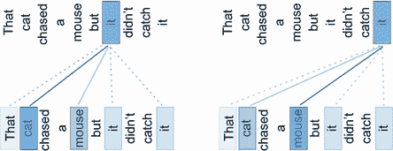
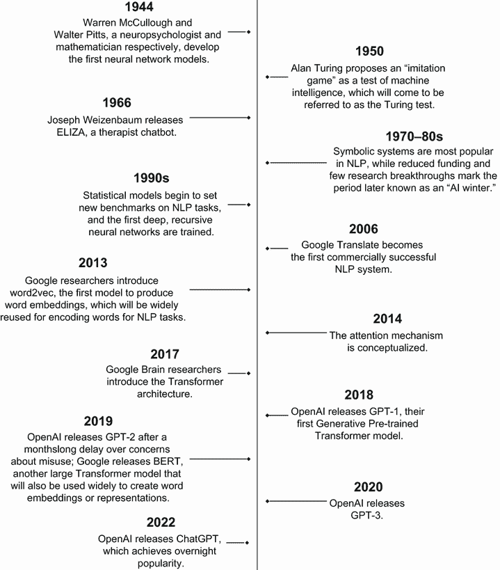

# 1 大型语言模型：AI 的力量

本章涵盖

+   介绍大型语言模型

+   理解 Transformer 背后的直觉

+   探索大型语言模型的应用、局限性和风险

+   调查突破性大型语言模型在对话中的应用

2022 年 11 月 30 日，总部位于旧金山的公司 OpenAI 在推特上发文：“试试与我们的新 AI 系统 ChatGPT 对话，它针对对话进行了优化。您的反馈将帮助我们改进它” [[1]](https://twitter.com/OpenAI/status/1598014522098208769?cxt=HHwWgsCi-bfvpK0sAAAA)。ChatGPT 是一个通过网页界面与用户互动的聊天机器人，被描述为 OpenAI 已经发布并可通过 API 提供的现有模型的微小更新。但随着网页应用的发布，任何人都可以与 ChatGPT 进行对话，让它写诗或代码，推荐电影或锻炼计划，或总结或解释文本片段。许多回应都感觉像是魔法。ChatGPT 点燃了科技界，几天内达到 100 万用户，两个月后达到 1 亿用户。在某些衡量标准下，它是有史以来增长最快的互联网服务 [[2]](https://www.technologyreview.com/2023/02/08/1068068/ChatGPT-is-everywhere-heres-where-it-came-from/)。

自 ChatGPT 公开发布以来，它吸引了数百万用户的想象力，并引起了长期科技观察者的谨慎，他们对对话代理的不足表示担忧。ChatGPT 和类似模型属于一类大型语言模型（LLMs），它们已经改变了自然语言处理（NLP）领域，并在问答、文本摘要和文本生成等任务中实现了新的最佳性能。已经，预言家们推测 LLMs 将改变我们教学、创作、工作和沟通的方式。几乎每个职业的人都将与这些模型互动，甚至可能与他们合作。因此，那些最能利用 LLMs 实现他们想要的结果——同时避免我们将讨论的常见陷阱的人——将处于在持续进行的生成 AI 时刻的领导地位。

作为人工智能（AI）从业者，我们相信，了解这些模型如何工作对于培养何时以及如何使用它们的直觉至关重要。本章将讨论 LLMs 的突破，它们的工作原理，它们的使用方式，以及它们的激动人心的可能性，同时也会讨论它们的潜在问题。重要的是，我们还将通过解释是什么使得这些 LLMs 如此重要，以及为什么这么多人对它们既兴奋又担忧来推动本书的其余部分。比尔·盖茨将这种类型的 AI 称为“与个人电脑、互联网一样重要”，并表示 ChatGPT 将改变世界 [[3]](https://www.businessinsider.com/bill-gates-ChatGPT-ai-artificial-intelligenct-as-important-pc-internet-2023-2)。包括埃隆·马斯克和史蒂夫·沃兹尼亚克在内的数千人签署了未来生命研究所撰写的公开信，呼吁暂停这些模型的研究和开发，直到人类更好地准备好应对风险（参见 [`mng.bz/847B`](http://mng.bz/847B)）。这回忆了 OpenAI 在 2019 年的担忧，当时该组织构建了 ChatGPT 的前身，并出于对误用的恐惧，当时决定不发布完整的模型 [[4]](https://www.fastcompany.com/90308169/openai-refuses-to-release-software-because-its-too-dangerous)。在所有的喧嚣、不同的观点和夸张的声明中，很难透过炒作来理解 LLMs 的真正能力和局限性。这本书将帮助你做到这一点，同时提供一个有用的框架来应对今天负责任技术中的主要问题，包括数据隐私和算法问责制。

既然你在这里，你很可能已经对生成式人工智能（generative AI）有一些了解了。也许你已经与 ChatGPT 或其他聊天机器人进行过交流；也许这次体验让你感到高兴，或者让你感到不安。无论哪种反应都是可以理解的。在这本书中，我们将以细腻和务实的方式探讨大型语言模型（LLMs），因为我们相信，尽管 LLMs 并不完美，但它们将长期存在，并且尽可能多的人应该投资于使它们更好地服务于社会。

尽管 ChatGPT 引起了很大的关注，但它并不是一个单一的技术突破，而是自然语言处理（NLP）领域快速发展的一个最新迭代改进：LLMs。ChatGPT 是一个为对话使用而设计的 LLM；其他模型可能被定制用于其他目的，或者用于任何自然语言任务的通用用途。这种灵活性是 LLMs 相对于其前辈如此强大的一个方面。在本章中，我们将定义 LLMs，并讨论它们是如何在 NLP 领域达到如此显赫的地位的。

## 自然语言处理的发展

NLP 指的是构建机器来操作人类语言及其相关数据以完成有用任务。它和计算机一样古老：当计算机被发明时，人们首先想象的新机器用途之一就是程序化地将一种人类语言翻译成另一种语言。当然，在当时，计算机编程本身是一项完全不同的练习，其中所需的行为必须设计成一系列由穿孔卡片指定的逻辑操作。尽管如此，人们认识到，为了使计算机充分发挥其潜力，它们需要理解自然语言，这是世界上主要的沟通形式。1950 年，英国计算机科学家艾伦·图灵发表了一篇论文，提出了人工智能的一个标准，现在被称为图灵测试[[5]](https://doi.org/10.1093/mind/LIX.236.433)。著名的是，如果一台机器能够在对话中产生与人类无法区分的回应，那么它将被认为是“智能”的。虽然图灵没有使用这个术语，但这是一种标准的自然语言理解和生成任务。图灵测试现在被认为是一个不完整的人工智能标准，因为许多模仿人类语音的现代程序很容易通过，但它们缺乏灵活性，无法进行推理[[6]](https://time.com/6238781/chatbot-ChatGPT-ai-interview/)。尽管如此，它作为基准存在了数十年，并且仍然是高级自然语言模型的一个流行标准。

早期的 NLP 程序与其他早期的 AI 应用采取了相同的方法，使用一系列规则和启发式方法。1966 年，麻省理工学院（MIT）的教授约瑟夫·魏岑鲍姆发布了一个名为 ELIZA 的聊天机器人，这个名字来源于《皮格马利翁》中的角色。ELIZA 被设计成一种治疗工具，它主要通过提出开放式问题和对其不认识的语言和短语给出通用回应来回应用户，例如“请继续。”这个机器人通过简单的模式匹配工作，但人们感到与 ELIZA 分享私密细节很舒服——在测试这个机器人时，魏岑鲍姆的秘书要求他离开房间[[7]](https://99percentinvisible.org/episode/the-eliza-effect/)。魏岑鲍姆本人报告说，人们对与 ELIZA 交谈时所赋予的真正同理心和理解的程度让他感到震惊。他对自己的工具所应用的拟人化感到担忧，并在之后的大部分时间里试图说服人们，ELIZA 并不是他们所宣扬的那样成功。

尽管基于规则的文本解析在接下来的几十年里仍然很常见，但这些方法很脆弱，需要复杂的 if-then 逻辑和显著的语文学识。到 20 世纪 90 年代，在诸如机器翻译等任务上的一些最佳结果是通过统计方法实现的，得益于数据和计算能力的增加。从基于规则的方法到统计方法的转变代表了自然语言处理领域的一个重大范式转变——不再是人们通过仔细定义和构建诸如语言中的词性和时态等概念来教他们的模型语法，而是新模型通过在成千上万的翻译文档上进行训练，通过自己学习模式而做得更好。

这种类型的机器学习被称为监督学习，因为模型可以访问其训练数据的期望输出——我们通常称之为标签，或者在这种情况下，翻译文档。其他系统可能使用无监督学习，其中不提供标签，或者使用强化学习，这是一种使用试错来教会模型通过获得奖励或惩罚来找到最佳结果的技术。这三种类型之间的比较见表 1.1。

表 1.1 机器学习类型

|  | 监督学习 | 无监督学习 | 强化学习 |
| --- | --- | --- | --- |
| 描述 | 模型通过将标记输入映射到已知输出进行学习。 | 模型在没有标签和特定奖励的情况下进行训练。 | 模型根据奖励和惩罚从其环境中学习。 |
| 数据 | 标签数据 | 未标记数据 | 无静态数据集 |
| 目标 | 预测未见输入的输出 | 发现数据中的潜在模式，例如聚类 | 通过试错确定最佳策略 |

在强化学习（如图 1.1 所示）中，奖励和惩罚是代表模型向特定任务进展的数值。当某种行为得到奖励时，这种积极的反馈会形成一个强化循环，使得模型更有可能重复该行为，从而使得受惩罚的行为可能性降低。正如您将看到的，LLMs 通常结合使用这些策略。

图 1.1 强化学习周期

强化学习是一种使用试错来教会模型通过从算法根据其结果获得奖励或惩罚来找到最佳结果的技术。

除了使用的学习类型外，还有几个关键组件可以区分 NLP 模型。首先是数据，对于自然语言任务而言，数据的形式是文本。其次，有一个目标函数，它是模型目标的数学陈述。目标可能是最小化特定任务中犯的错误数量，或者最小化模型对某个值的预测与真实值之间的差异。第三，有不同类型的模型和架构，但过去几十年中几乎所有高级 NLP 模型都属于一个类别：神经网络。

神经网络，或称为神经网，于 1944 年被提出，作为一种算法上的人脑表示[[8]](https://news.mit.edu/2017/explained-neural-networks-deep-learning-0414)。每个网络都有一个输入层、一个输出层，以及它们之间任意数量的“隐藏”层；每一层都有若干个神经元或节点，这些节点可以以不同的方式连接。每个节点为其接收到的输入分配权重（表示节点之间连接的强度），结合加权输入，并在加权总和超过某个阈值时“触发”或传递这些输入到下一层。在神经网络中，训练的目标是确定权重和阈值的最佳值。给定训练数据，训练算法将迭代更新权重和阈值，直到找到在模型目标中表现最佳的值。参数的数量指的是模型学习的权重数量，它是模型可以处理的复杂程度的简写，这也反过来影响了模型的能力。今天最强大的 LLMs 拥有数百亿个参数。

在过去几十年中，大量数据和计算能力的可用性巩固了神经网络的统治地位，并导致了无数不同网络架构的实验。深度学习作为一个子领域出现，其中的“深度”仅仅指的是涉及的神经网络深度，即输入和输出之间的隐藏层数量。人们发现，随着神经网络的大小和深度的增加，只要数据足够，模型的性能也会提高。

## LLMs 的诞生：注意力即一切

随着人们开始训练用于文本生成、分类和其他自然语言任务的模型，他们试图精确地了解模型学习了什么。这不仅仅是一项纯粹的科学探究；检查模型如何做出预测是信任模型输出并使用它们的重要一步。让我们以从英语到西班牙语的机器翻译为例。

当我们向模型提供一个输入序列，例如“那只猫穿了红色的袜子”，这个序列首先必须被编码成文本的数学表示。序列被分割成*标记*，通常是单词或部分单词。神经网络将这些标记转换成其数学表示，并应用在训练中学习的算法。最后，输出被转换回标记，或者解码，以产生可读的结果。在这种情况下，输出序列是句子的翻译版本（*El gato usó calcetines rojos*），这使得模型成为一个序列到序列模型。当模型的输出是正确的翻译时，我们满意地认为模型已经“学习”了翻译函数，至少对于输入中使用的词汇和语法结构来说是这样。

2014 年，受人类认知的启发 [[9]](http://arxiv.org/abs/1409.0473)，机器学习研究人员提出了对传统方法的一种替代，即逐个将序列通过编码器-解码器模型。在新方法中，解码器可以搜索整个输入序列，并尝试找到与生成每个部分最相关的部分。这种机制被称为*注意力*。让我们回到机器翻译的例子。如果你被要求从句子“那只猫追了一只老鼠，但它没有抓住它”中挑选出关键词，你可能会说“猫”和“老鼠”，因为像“那”和“一”这样的冠词在翻译中并不那么相关。如图 1.2 所示，你将“注意力”集中在重要的单词上。注意力机制通过为序列的重要部分添加注意力权重来模拟这一点。

注意力为序列中的任何位置或单词提供上下文。

图 1.2 不同上下文中单词“它”的注意力分布

几年后，一篇由谷歌大脑撰写的论文，恰当地命名为“Attention Is All You Need”，表明那些丢弃了其他架构中冗长的顺序步骤，仅使用注意力信息的模型要快得多，并且更易于并行化。他们将这类模型称为 transformers。Transformers 从输入句子的初始表示开始，然后通过在整个输入上使用自注意力，对句子中的每个单词进行重复生成新的表示，直到句子结束。这样，模型可以捕捉长期依赖关系——因为每个步骤都包括所有上下文——但表示可以并行计算。 “Attention Is All You Need”论文证明了这些模型在英语到德语和英语到法语翻译任务上达到了最先进的性能 [[10]](http://arxiv.org/abs/1706.03762)。这是十年中最大的 NLP 突破，为所有后续发展奠定了基础。

由于在时间和资源需求上的改进，使用 transformers 可以在大量数据上训练模型。这标志着 LLM（大型语言模型）时代的开始。2018 年，OpenAI 推出了生成预训练（GPT），这是一个基于 transformers 的 LLM，它使用了从互联网上大量未标记的数据进行训练，然后可以针对特定任务进行微调，例如情感分析、机器翻译、文本分类等 [[11]](https://cdn.openai.com/research-covers/language-unsupervised/language_understanding_paper.pdf)。在此之前，大多数 NLP 模型都是针对特定任务进行训练的，这成为了一个主要瓶颈，因为它们需要大量针对该任务的标注数据，而标注数据既耗时又昂贵。这些通用 LLM 旨在克服这一挑战，使用未标记数据构建对单词和概念本身的具有意义的内部表示。

微调模型指的是在大型数据集上训练好的模型，然后调整或微调模型以执行类似任务，这样我们就可以利用模型已经学到的知识，而无需从头开始开发。

当专家们争论应该将什么大小的模型视为“大型”时，另一个早期的 LLM，谷歌的 BERT（来自 Transformers 的双向编码器表示），在数十亿个单词上进行了训练，并使用了超过 1 亿个参数或学习权重，使用 transformers 架构 [[12]](https://arxiv.org/pdf/1810.04805.pdf)。要查看 NLP 主要事件的总结时间线，请参阅图 1.3。

图 1.3 NLP 突破事件时间线

## LLM 的爆炸式增长

在上一节中，我们讨论了如何通过学习数据中的模式来训练语言模型以完成特定任务。对于翻译，可能会使用包含多种语言文档的数据集；对于摘要任务，可能会使用包含手写摘要的文档数据集；等等。但与这些先前应用不同，LLMs 并非旨在特定于任务。相反，它们训练的任务仅仅是预测在特定上下文中隐藏的一个标记（或单词）最适合什么，因此不需要标签。这个任务的美丽之处在于它是自监督的：模型通过从输入的另一部分学习来训练自己学习输入的一部分，因此不需要标注。这也被称为预测性或预文学习。

随着 LLMs 被应用于各个领域，它们正成为我们日常生活中的一个重要组成部分。像苹果的 Siri、亚马逊的 Alexa 和谷歌 Home 这样的对话代理使用 NLP 来监听用户查询，将声音转换为文本，然后执行任务或寻找答案。我们在零售业看到客户服务聊天机器人，我们将在下一节中讨论更复杂的对话代理，如 ChatGPT。NLP 还用于医学中解释或总结电子健康记录，以及处理日常法律任务，如查找案例法中的相关先例或挖掘文件以进行发现。社交媒体平台，如 Facebook、Twitter 和 Reddit 等，也使用 NLP 通过检测仇恨言论或攻击性评论来改善在线讨论。

之后，我们将讨论如何微调 LLMs 以在特定用例中表现出色，但训练阶段的结构意味着 LLMs 可以在各种情境下流畅地生成文本。这种属性使它们成为对话代理的理想人选，但也赋予它们在未明确训练的任务中一些意想不到的能力。

## LLMs 有哪些用途？

LLMs 的通用性和多功能性导致了一系列自然语言任务，包括与用户交谈、回答问题和分类或总结文本。在本节中，我们将讨论几个常见的 LLM 用例和它们解决的问题，以及它们在历史上未使用语言模型的各种新颖任务（如编码助手和逻辑推理）中展现出的潜力。

### 语言建模

语言建模是语言模型最自然的应用。具体来说，对于文本补全，模型学习自然语言的特征和特性，并生成下一个最可能的单词或字符。当用于训练 LLMs 时，这种技术可以应用于一系列自然语言任务，如后续章节所述。

语言建模任务通常在各种数据集上评估。让我们来看一个长距离依赖任务的例子，在这个任务中，模型被要求根据一段上下文预测句子的最后一个单词 [[13]](https://arxiv.org/pdf/1606.06031.pdf)。模型得到的上下文如下：

他摇了摇头，后退了一步，举起双手试图微笑而不丢掉香烟。“是的，你可以，”朱莉娅用安慰的语气说。“我已经专注于我的朋友了。你只需要点击上面的快门，就在这里。”

在这里，模型需要预测最后一个单词的目标句子是以下内容：“他尴尬地点了点头，扔掉了他的香烟，然后拿起了 _____。”模型在这里需要预测的正确单词应该是“相机”。

评估模型性能的其他任务包括选择故事或一组指令的最佳结尾 [[14]](https://arxiv.org/pdf/1905.07830.pdf) 或选择一个由几句话组成的故事的正确结尾句子。让我们来看另一个例子，其中我们有以下故事 [[15]](https://cs.rochester.edu/nlp/rocstories/):

“凯伦在大学的第一年被分配了一个室友。她的室友邀请她去附近的城市听音乐会。凯伦欣然同意。演出绝对令人兴奋。”模型最可能和期望选择的结尾是“凯伦和她的室友成为了好朋友”，而最不可能的结尾是“凯伦讨厌她的室友”。

这些模型用于文本生成，或自然语言生成（NLG），因为它们被训练生成与人类撰写的文本相似的文字。特别适用于对话聊天机器人和自动完成，它们还可以微调以生成不同风格和格式的文本，包括社交媒体帖子、新闻文章，甚至编程代码。文本生成已经使用 BERT、GPT 等技术实现。

### 问答

大型语言模型（LLMs）在问答任务中得到了广泛应用，这些任务涉及以自然语言回答人类提出的问题。问答任务分为两种类型：多项选择和开放域。对于多项选择题，模型从一组可能的答案中选择正确答案，而对于开放域任务，模型在没有任何选项提供的情况下以自然语言回答问题。

根据它们的输入和输出，问答模型主要有三种变体。第一种是抽取式问答，其中模型从上下文中抽取答案，上下文可以是文本或表格。第二种是开放式书籍生成式问答，它使用提供的上下文生成自由文本。这与第一种问答方法类似，除了不是直接从上下文中抽取答案，而是使用给定的上下文用自己的话生成答案。最后一种变体是闭卷生成式问答，在这种情况下，你的输入中不提供任何上下文，只有一个问题，模型根据其训练生成最可能的答案。

在最近在大型语言模型（LLMs）中的突破之前，问答任务通常被视为一种开放式书籍生成式问答，因为查询和响应的可能性是无限的。新的模型，如 GPT-3，在极其严格的闭卷设置下进行了评估，不允许使用外部上下文，并且模型不允许在它们将被评估的数据集上训练或“从”数据集中学习。用于评估问答任务的流行数据集包括常识问题（见[`mng.bz/E9Rj`](http://mng.bz/E9Rj)）和谷歌搜索查询（见[`mng.bz/NVy7`](http://mng.bz/NVy7)）。在这里，示例问题可能包括“哪位政治家在 2009 年获得了诺贝尔和平奖？”或“贝多芬创作了什么音乐？”

另一个与问答任务紧密相关的应用是阅读理解。在这个任务中，模型被展示了几句话或几段文字，然后被要求回答一个特定的问题。为了最好地模拟人类的表现，大型语言模型（LLMs）通常在各种阅读理解问题格式上进行测试，包括多项选择题、对话行为和抽象数据集。让我们看看来自对话问答数据集的一个例子 [[16](https://arxiv.org/pdf/1808.07042.pdf)]。在这里，任务是回答对话中的下一个问题：“杰西卡坐在她的摇椅上。今天是她的生日，她即将满 80 岁。她的孙女安妮将在下午过来，杰西卡非常期待见到她。她的女儿梅勒妮和梅勒妮的丈夫乔什也会过来。杰西卡有……”。如果对话中的第一个问题是“谁过了生日？”正确的答案将是“杰西卡”。然后，根据对话中的下一个问题“她会是多少岁？”模型应该回答“80 岁”。

专为问答任务设计的模型中最引人注目的例子之一是 IBM 研究部门的沃森（Watson）。在 2011 年，沃森计算机参加了电视节目《危险边缘》（*Jeopardy!*）的竞赛，与该节目两位历史上最成功的冠军选手对抗并获胜 [[17](https://www.jeopardy.com/sites/default/files/2023-06/ThisisJeopardyEp8.pdf)]。

### 编码

最近，代码生成已成为 LLMs（大型语言模型）最受欢迎的应用之一。这些模型接受自然语言输入，并为特定的编程语言生成代码片段。虽然在这个领域存在一些需要解决的问题——安全性、透明度和许可——但不同水平的开发者和工程师每天都在使用 LLM 辅助工具来提高生产力。

代码生成工具在 2022 年中随着 GitHub 的 CoPilot 发布而兴起。被称为“你的 AI 编程伙伴”，CoPilot 被介绍为面向个人程序员的订阅制服务（见[`github.com/features/copilot`](https://github.com/features/copilot)）。基于 OpenAI 的 Codex 模型，它迅速成为提高开发者生产力的“配对编程”助手。Codex 是 GPT-3 的一个版本，它针对十多种不同的编程语言进行了微调。GitHub CoPilot 在您键入时建议代码，自动填充重复代码，显示替代建议，并将注释转换为代码。

开发者已经找到了创造性的、出乎意料的方法来使用 AI 辅助的程序员，例如帮助非英语母语者，准备编码面试，测试您的代码等等。此外，在 2022 年 6 月，亚马逊宣布了一款类似工具，名为 CodeWhisperer，它被描述为基于 AI 的编码伴侣，通过生成代码推荐和安全扫描来提高开发者生产力（见[`aws.amazon.com/codewhisperer/`](https://aws.amazon.com/codewhisperer/)）。值得注意的是，这些编程工具被营销为“配对程序员”或“编程助手”，以补充人类而不是取代他们。虽然 CoPilot 和 CodeWhisperer 通常能提出很好的建议，但它们思考程序的方式与人类不同，有时可能会犯愚蠢的错误。在第六章中，我们将详细讨论机器提高生产力的想法。

GPT 类模型的一个迭代版本，GPT-4，于 2023 年 3 月发布，在各种编码任务上进行了评估[[18]](https://arxiv.org/pdf/2303.08774.pdf)。LeetCode 是一个知名的在线平台，用于解决数据结构和算法编码挑战，这些挑战经常出现在软件工程职位的面试中。虽然 GPT-4 在“简单”的 LeetCode 问题上表现相对较好，但在“中等”或“困难”的问题上则显得力不从心，这表明许多编码任务仍然需要人类的干预。

### 内容生成

大型语言模型（LLM）的一个极具前景且广泛应用的领域是生成内容。为合成新闻文章生成类似人类的文本，在历史上一直被用作评估 LLM 的任务。给定一个标题和副标题，或者第一句话，任务就是生成一篇长篇文章，评估标准是确定文章被机器写出的可能性——生成的文章越好，就越难判断是机器写的。这个任务的变体，也与第 3.2 节“控制机器输出限制”中讨论的 LLM 潜在误用相关，即利用人类能力通过检测人类能否区分机器生成内容和人类生成内容来评估新闻文章的质量。这个变体类似于内容而非对话的图灵测试。GPT-3 和其他 LLM 变体继续生成人类难以识别为机器撰写的新闻文章。以下是一个由 GPT-3 生成的文章示例，给定一个标题和副标题，人类最难识别为机器生成 [[19]](https://arxiv.org/pdf/2005.14165.pdf)。

标题：卫理公会达成历史性分裂

副标题：反对同性婚姻的人将成立自己的教派

文章：经过两天激烈的辩论，卫理公会教会达成了一项历史性的分裂——据《华盛顿邮报》报道，预计这将导致一个新教派的诞生，这个新教派将“在神学和社会上保守”。五月份参加教会年度大会的大多数代表投票决定加强禁止任命 LGBTQ 牧师的禁令，并制定新规定，对主持同性婚礼的牧师进行“惩戒”。但反对这些措施的人有一个新的计划：他们说他们将在 2020 年之前成立一个独立的教派，将他们的教会称为基督教卫理公会。邮报指出，这个教派声称有 1250 万成员，在 20 世纪初是美国“最大的新教派”，但近年来一直在萎缩。这次分裂将是教会历史上的第二次分裂。第一次发生在 1968 年，当时大约 10%的教派成员离开，成立了福音派联合兄弟教会。邮报指出，提议的分裂“发生在教会面临关键时刻，多年来一直在失去成员”，并且“被推向分裂的边缘，关于 LGBTQ 人在教会中的角色。”同性婚姻并不是唯一分裂教会的问题。2016 年，教派在任命跨性别牧师问题上发生分裂，北美地区会议投票禁止他们担任牧师，而南太平洋地区会议投票允许他们。

如前一小节所暗示的，内容生成的应用已经扩展到写作新闻文章之外的使用场景。随着高级对话代理的可用性提高，创作者正在使用 LLMs 生成不同类型、风格和格式的内 容，包括创建营销活动、撰写博客文章和电子邮件、编写社交媒体帖子等。几家初创公司也进入了生成内容创作的领域，包括 Jasper AI、Anthropic AI、Cohere、Runway、Stability AI 和 Adept AI。我们将在下一章详细讨论使用 LLMs 生成内容，并突出任何潜在的风险。

### 逻辑推理

大型语言模型（LLMs）的一个新颖且有趣的应用是它们的“推理”能力——即从新信息或现有信息中得出推论或结论的想法。对于 LLMs 来说，一个新但现在已经常见的推理任务是算术。这些任务通常是简单的算术查询，涉及两个到五个数字的加法、减法或乘法。虽然我们不能说 LLMs“理解”算术，因为它们在处理不同数学问题时表现不一致，但 GPT-3 的评估结果展示了它们执行非常简单的算术任务的能力。在数学领域的一个显著模型是 Facebook AI Research 基于 transformer 训练的模型，用于解决符号积分和微分方程问题。当面对未见过的表达式（即训练数据中不包含的方程）时，他们的模型优于基于规则的代数系统，如 MATLAB 和 Mathematica [[20]](https://arxiv.org/pdf/1912.01412.pdf)。

值得讨论的另一个应用是常识或逻辑推理，其中模型试图捕捉物理或科学推理。这与阅读理解或回答一般常识问题不同，因为它需要一些基于世界的实际理解。一个重要的模型是谷歌研究团队的 Minerva，这是一个能够通过逐步推理解决数学和科学问题的语言模型 [[21]](https://arxiv.org/pdf/2206.14858.pdf)。GPT-4 在各种学术和专业考试中进行了测试，包括统一律师资格考试（UBE）、LSAT、SAT 阅读和写作、SAT 数学、研究生入学考试（GRE）、AP 物理、AP 统计学、AP 微积分等。在这些考试中，模型大多数情况下达到了人类水平的表现，并且值得注意的是，它在 UBE 考试中取得了前 10%的分数 [[18]](https://arxiv.org/pdf/2303.08774.pdf)。

最近，法律实践也越来越多地采用 LLMs 的应用，使用文档审查、尽职调查、提高法律服务可及性和协助法律推理的工具。2023 年 3 月，法律 AI 公司 Casetext 推出了 CoCounsel，这是第一个与 OpenAI 合作在他们的最先进的 LLM 上构建的 AI 法律助手 [[22]](https://www.prnewswire.com/news-releases/casetext-unveils-cocounsel-the-groundbreaking-ai-legal-assistant-powered-by-openai-technology-301759255.xhtml)。CoCounsel 可以执行法律任务，如法律研究、文档审查、出庭准备、合同分析等。类似的工具 Harvey AI 协助合同分析、尽职调查、诉讼和合规性等工作。Harvey AI 与世界上最大的律师事务所之一 Allen & Overy 合作，并宣布与普华永道（PwC）建立了战略合作伙伴关系 [[23]](https://www.pwc.com/gx/en/news-room/press-releases/2023/pwc-announces-strategic-alliance-with-harvey-positioning-pwcs-legal-business-solutions-at-the-forefront-of-legal-generative-ai.xhtml)。

### 其他自然语言任务

当然，大型语言模型（LLMs）也非常适合许多其他语言任务。一个流行且长期的应用是机器翻译，它使用 LLMs 来自动化不同语言之间的翻译。正如之前所讨论的，机器翻译是 70 年前计算机被要求解决的第一批问题之一。从 20 世纪 50 年代开始，计算机使用一系列编程语言规则来解决这个问题，这不仅计算成本高昂且耗时，还需要为每种语言提供完整的词汇表和多种类型的语法。到 20 世纪 90 年代，美国跨国科技公司国际商业机器公司（IBM），更广为人知的是 IBM，引入了统计机器翻译，研究人员认为，如果他们查看足够多的文本，他们就能在翻译中找到模式。这在该领域是一个巨大的突破，并导致了 2006 年使用统计机器翻译的 Google Translate 的推出。Google Translate 是第一个商业上成功的 NLP 应用，也许是最著名的。2015 年，当谷歌开始使用 LLMs 来提供更令人印象深刻的结果时，机器翻译领域发生了永久性的变化。2020 年，Facebook 宣布了第一个多语言机器翻译模型，该模型可以在不依赖任何英语数据的情况下翻译任何 100 对语言——这是机器翻译领域的一个重大里程碑，因为它减少了在翻译中丢失意义的机会 [[24]](https://about.fb.com/news/2020/10/first-multilingual-machine-translation-model/)。

另一个实际应用是文本摘要，即创建一个简短的文本版本，突出最相关的信息。有两种摘要技术：提取式摘要和抽象式摘要。*提取式*摘要关注从长文本中提取最重要的句子，并将它们组合起来形成摘要。另一方面，*抽象式*摘要通过改写文本来形成摘要（即摘要），可能包括原文中不存在的单词或句子。

还有其他一些辅助应用，包括纠正英语语法、学习和使用新词汇以及解决语言谜题。GPT-3 的一个学习和使用新词汇的例子是给模型一个不存在词汇“Gigamuru”的定义，然后要求模型在句子中使用它 [[19]](https://arxiv.org/pdf/2005.14165.pdf)。像 Grammarly 和 Duolingo 这样的公司正在迅速将 LLMs 应用于他们的产品中。Grammarly，一个流行的写作语法和拼写检查器，于 2023 年 3 月推出了 GrammarlyGO，这是一个使用 ChatGPT 生成文本的新工具（见[`mng.bz/D9oa`](http://mng.bz/D9oa)）。同样在 2023 年 3 月，Duolingo 推出了 Duolingo Max，该平台使用 GPT-4 添加了“解释我的答案”和“角色扮演”等功能（见[`mng.bz/lVvB`](http://mng.bz/lVvB)）。

## LLMs 缺乏哪些方面？

尽管 LLMs 在各种任务中取得了前所未有的成功，但将 LLMs 带到目前顶峰的同一种策略也代表了重大的风险和限制。LLMs 使用的训练数据引入了风险——具体来说，数据不可避免地包含许多 LLM 开发者不希望模型复制的模式——以及 LLMs 输出不可预测性的风险。最后，由于 LLMs 能源使用的外部性，当前在日常生活中创建和使用 LLMs 的热潮值得更深入的研究。

### 训练数据和偏差

LLMs 是在几乎无法理解的巨大文本数据量上训练的。因此，为了生产一个能够可靠地生成自然语言样式的模型，收集大量、理想情况下由人类编写的自然语言是至关重要的。幸运的是，这样的文本内容存在，并且可以通过互联网轻松获取。当然，数量只是方程的一部分；质量是更难解决的问题。

训练 LLM 的公司和研究实验室编制的训练数据集包含来自互联网的数百亿个单词。用于训练 LLM 的最常见的文本语料库（即文本集合）包括维基百科、Reddit 和谷歌新闻/谷歌图书。维基百科可能是 LLM 最知名的数据来源，并且具有许多优点：它是人类编写和编辑的，由于其活跃的事实核查社区，它通常是一个可靠的信息来源，并且存在于数百种语言中。以谷歌图书为例，它是一系列已进入公共领域的出版书籍的数字文本副本集合。尽管这类书籍可能包含事实错误或过时信息，但它们通常被认为是高质量的文本示例，如果比大多数对话性自然语言更正式的话。

另一方面，考虑包含 Reddit 网站所有或大部分数据集的情况。其好处是显著的：它包含了数百万条人与人之间的对话，展示了对话的动态。与其他来源一样，Reddit 的内容改善了模型对不同标记的内部表示。训练数据集中一个词或短语观察到的次数越多，模型在何时生成该词或短语时就越能学得越好。然而，Reddit 的一些部分也包含大量令人反感的言论，包括种族侮辱或贬损笑话、危险的阴谋论或错误信息、极端主义意识形态和淫秽内容。通过包含这种类型的内容，这在从网络上收集如此多的数据时几乎是不可避免的，模型可能会变得容易生成这种类型的言论。此外，使用其中一些数据也存在严重的影响，这些数据可能代表个人信息或受法律保护的有版权材料。

此外，通过其训练数据，偏差的更微妙影响可能被引入到大型语言模型（LLM）中。在机器学习中，“偏差”这个术语极其多义：有时人们指的是统计偏差，它指的是模型预测值与真实值之间的平均差异；如果训练数据集是从与测试数据集不同的分布中抽取的，那么它可能是有偏差的，这种情况通常完全是由偶然发生的。为了避免混淆，我们将严格使用“偏差”一词来指代模型在个人身份属性（如种族、性别、阶级、年龄或宗教）方面的不同输出。偏差一直是机器学习算法中的长期问题，它可以通过多种方式渗透到机器学习系统中。然而，重要的是要记住，这些模型本质上是在反映它们所训练的文本中的模式。如果我们的书籍、新闻媒体和社交媒体中存在偏差，那么这些偏差将会在我们的语言模型中得到重复。

偏差指的是模型在个人身份属性（如种族、性别、阶级、年龄或宗教）方面的不同输出。

一些最早在大型未标记数据集上训练的通用语言模型是为了构建词嵌入。如今，每个大型语言模型都有效地学习了自己对单词的嵌入——这就是我们所说的模型对该单词的内部表示。但在 LLM 出现之前，每个开发 NLP 模型的人都需要实现某种编码步骤来将他们的文本输入数值化，以便算法可以解释它们。词嵌入允许将文本转换为在多维空间中作为数值点的有意义的单词表示。有了词嵌入，使用方式相似的单词，如*cucumber*和*pickle*，会彼此靠近，而那些不相似的，比如*cucumber*和*philosophy*，则会相隔甚远（如图 1.4 所示）。有更简单的方法来做这种编码——最基本的方法是为训练数据中出现的每个唯一单词分配空间中的一个随机点——但词嵌入

图 1.4 词嵌入在向量空间中的表示

嵌入捕捉了关于单词语义意义的更多信息，并导致更好的模型。

在一篇关于在 Google 新闻语料库上训练的词嵌入的著名论文“Man Is to Computer Programmer as Woman Is to Homemaker? Debiasing Word Embeddings”中，波士顿大学的学者（与微软研究院合作）展示了词嵌入模型本身对职业和描述都表现出强烈的性别刻板印象 [[25]](http://arxiv.org/abs/1607.06520)。作者设计了一个评估，模型将根据嵌入生成她-他的类比。其中一些是无害的：例如，sister is to brother，以及 queen is to king。但模型也产生了她-他的类比，如 nurse is to physician 或 surgeon，cosmetics is to pharmaceuticals，以及 interior designer is to architect。这些偏差的主要原因可以归因于构成数据集的新闻文章中建筑师是男性还是女性的次数，护士是女性的次数，等等。因此，社会存在的不足被模型所反映和放大。

与词嵌入类似，大型语言模型（LLMs）也容易受到这些偏差的影响。在 2021 年一篇题为“论随机鹦鹉的危险：语言模型是否可以过大？”的论文中，作者们探讨了 LLMs 如何回声和放大其训练数据中发现的偏差[[26](https://dl.acm.org/doi/pdf/10.1145/3442188.3445922)]。尽管有技术可以消除模型的偏差或尝试以更具偏见意识的方式训练模型，但消除与性别、种族、性取向和其他深深植根于日常生活特点的关联，或消除存在数百年的数据差异，是非常困难的。因此，当身份特征出现在上下文或提示中时，LLMs 可能会产生截然不同的生成内容。

### 控制机器输出的局限性

在 OpenAI 的 ChatGPT 和与微软必应（Microsoft Bing）合作推出的 ChatGPT 驱动的搜索引擎发布后，谷歌也发布了它自己的聊天机器人，Bard。在直播发布活动上，播放了一段宣传视频，展示了向 Bard 提出的问题和 Bard 的回答。其中一个问题是，“我能向我的九岁孩子讲述詹姆斯·韦伯太空望远镜（JWST）的新发现是什么？”在视频中，Bard 回答了一些关于 JWST 的信息，包括 JWST 拍摄了第一张系外行星的照片，即地球太阳系外的行星。但有一个（大）问题：第一张系外行星的照片早在十多年前就已经被多台较老的望远镜拍摄了。尴尬的是，天文学家和天体物理学家开始在推特和其他渠道上指出这一点；谷歌在直播结束后立即撤下了广告，并删除了活动的 YouTube 视频。但损害已经造成，在发布后的几天里，谷歌的股价下跌了约 9%，市值损失约 1000 亿美元[[27](https://www.reuters.com/technology/google-ai-chatbot-bard-offers-inaccurate-information-company-ad-2023-02-08/)]。

由于 LLMs 不像人类那样学习和理解内容，而是通过预测和近似常见句子结构来生成文本，因此这种错误对于 LLMs 来说很难避免。LLMs 生成文本的流畅性掩盖了它们不知道自己在说什么的事实，可能会断言错误信息，或编造高度可信但错误的解释。这些错误被称为“幻觉”。聊天机器人可能会自己产生幻觉，或者容易受到对抗性用户输入的影响，似乎被对话伙伴说服了某些不真实的事情。

有时 LLMs 会断言错误信息或编造高度可信但错误的解释。这些被称为幻觉。

幻觉的产生被广泛认为是 LLMs 目前面临的最大问题之一。幻觉可能是由训练集的问题引起的（例如，如果有人在互联网上错误地写道 JWST 拍摄了系外行星的第一张照片），但它们也可能出现在模型之前已知序列中不存在的任何上下文中，这可能是由于模型构建知识的方式存在问题。Meta 的首席人工智能科学家、机器学习领域的巨头 Yann LeCun 认为，这些 LLMs 的输出在任何概率界限内都无法变得真实，因为随着模型生成的响应变长，可能的响应会成倍增加，几乎无限，其中只有一小部分可能的输出是有意义的正确答案 [[28]](https://drive.google.com/file/d/1BU5bV3X5w65DwSMapKcsr0ZvrMRU_Nbi/view?usp=embed_facebook)。当然，LLMs 的有用性在很大程度上取决于这种真实性的质量是否可以改进。我们将在本书的后面讨论 LLMs 开发者正在使用的尝试减少幻觉和其他不希望输出的方法。

### LLMs 的可持续性

正如他们的名字所暗示的，并且已经强调过的，LLMs 非常大。它们使用大量数据集，拥有数百亿或数千亿个参数，并且需要巨大的计算资源，这以使用的芯片数量和时间消耗来衡量。LLMs 通常在图形处理单元（GPUs）或张量处理单元（TPUs）上训练，这些是专门用于处理训练神经网络所涉及的大规模计算的芯片。这个过程可能涉及从云计算提供商——如微软 Azure（OpenAI 的合作伙伴）、谷歌云平台或亚马逊网络服务——租赁数千个 GPU，为期数周。尽管 OpenAI 尚未公布这些数据，但据估计，仅这些计算资源的成本就将 GPT-3 这样的模型成本推高至约 460 万美元 [[29]](https://lambdalabs.com/blog/demystifying-gpt-3)。

训练 LLMs 的一个更隐蔽的成本是它们对环境的影响，这已经成为研究和批评的主题。有一篇论文试图根据已发布的关于其训练过程的信息来评估 LLMs 的能量使用和碳足迹，估计 GPT-3 在训练过程中消耗的电力排放了 500 吨二氧化碳 [[30]](https://arxiv.org/pdf/2211.02001.pdf)。为了更直观地理解这一点，平均美国人每年大约产生 18 吨二氧化碳排放；全球平均水平仅为每年 7.4 吨（参见[`worldemissions.io/`](https://worldemissions.io/)）。另一篇论文发现，模型在推理过程中消耗的能量甚至更多 [[31]](https://arxiv.org/pdf/2104.10350.pdf)。由于涉及许多因素，包括数据中心的使用、芯片的数量和类型以及模型的大小和架构，大多数 LLMs 的确切排放量是未知的。

推理是使用训练好的语言模型生成预测或响应的过程。

即使有些人有数百万美元的预算，也并不容易获得那么多的 GPU。在技术领域最大的公司，包括微软和谷歌，在 LLMs 的开发上具有明显的优势，因为竞争所需的资源。一些观察者担心，这种情况将变得难以承受，只有这些跨国公司或国家才能从 LLM 技术的创造和利润中获益，其中一些国家已经开始在国家层面汇集资源来训练 LLMs。另一方面，也有许多正在进行的研究，旨在使这些模型更容易获得，并减少训练时间或成本，有时是通过创建现有 LLMs 的开源版本，或者尝试将已经训练好的 LLMs 缩小到一个更小的版本，这个版本可以保持大部分相同的性能，但使用成本大幅降低。这些努力的成果是有希望的，但尚未得到证实。在 2022 年底和 2023 年初，最显著的模式来自 OpenAI、谷歌、微软和 Meta。

## 革命性的对话：对话型 LLMs

在本章中，我们讨论了大型语言模型（LLMs）在高级别上的工作原理，包括其应用和局限性。LLMs 的承诺在于它们能够流畅地为广泛的用例生成文本，这使得它们非常适合与人类进行对话以执行任务。例如，ChatGPT 这样的聊天机器人就是为对话使用而设计的 LLMs。在本节中，我们将深入探讨 2022 年底和 2023 年初发布的知名对话模型的旅程：OpenAI 的 ChatGPT、谷歌的 Bard、微软的 Bing AI 和 Meta 的 LLaMa。

### OpenAI 的 ChatGPT

位于旧金山的 AI 研究和开发公司 OpenAI 于 2022 年 11 月 30 日发布了 ChatGPT，距离其兄弟模型 InstructGPT 的推出仅 10 个月 [[32]](https://arxiv.org/pdf/2203.02155.pdf)。后者是公司首次尝试彻底改造 LLM 以执行通过特定文本提示与用户对齐的自然语言任务。使用之前建立的技术，即基于人类反馈的强化学习（RLHF），OpenAI 训练模型根据人类反馈的指令。通过 OpenAI 游乐场提交的提示，人类标注员会整理出期望的模型响应，然后用于微调模型。这使得 InstructGPT 更好地适应人类意图，即更*符合*人类偏好。这是 OpenAI 首次在其产品中使用其对齐研究，该组织宣布将继续在这一方向上推进。OpenAI 还断言，在人类参与的情况下微调语言模型可以是一个有效的工具，用于使模型更安全、更可靠 [[33]](https://openai.com/research/instruction-following)。

不久之后，OpenAI 推出了名为 Chat Generative Pre-trained Transformer 的模型，更广为人知的是 ChatGPT（见[`openai.com/blog/ChatGPT`](https://openai.com/blog/ChatGPT)），该模型在 GPT-3.5 系列模型的基础上进行了微调，包含 1750 亿个参数。也就是说，它是在 570GB 的文本上训练的，是其前辈 GPT-2 的 100 倍 [[34]](https://hai.stanford.edu/news/how-large-language-models-will-transform-science-society-and-ai)。为了更直观地说明这一点，这相当于包括《霍比特人》在内的整个《指环王》系列中单词数量的 164,129 倍 [[35]](https://www.tooltester.com/en/blog/ChatGPT-statistics/)。OpenAI 还声明了其局限性，包括限制知识更新至 2022 年初模型完成训练时，撰写看似合理但实际上错误的答案，以及回应带有有害或偏见的信息等。

OpenAI 之前发布了其开发和部署生命周期，声称“没有银弹可以用于负责任的部署”，其中 ChatGPT 是他们迭代部署安全可靠 AI 系统的最新一步 [[36]](https://openai.com/research/language-model-safety-and-misuse)。对他们来说，旅程才刚刚开始。2023 年 3 月 14 日，OpenAI 发布了 GPT-4，这是一个大型多模态模型，可以接受文本和图像输入，并生成文本输出。

OpenAI 决定发布 ChatGPT 的决定受到了许多人的批评，他们认为发布一个不仅对人类和社会构成重大风险，而且引发了一场公司选择速度胜过谨慎的人工智能竞赛的系统是鲁莽的。然而，OpenAI 的共同创始人山姆·奥特曼（Sam Altman）认为，将技术逐渐发布给世界更安全，这样每个人都可以更好地理解相关的风险以及如何应对这些风险，而不是在幕后开发 [[37]](https://www.nytimes.com/2023/03/31/technology/sam-altman-open-ai-ChatGPT.xhtml)。然而，在发布后的五天内，ChatGPT 就获得了 100 万用户。根据网络分析公司 SimlarWeb 的数据，ChatGPT 在 2023 年 1 月达到了 1000 万活跃用户，创下了历史上增长最快的用户基础记录 [[38]](https://www.reuters.com/technology/ChatGPT-sets-record-fastest-growing-user-base-analyst-note-2023-02-01/)。人工智能聊天机器人已经到来，并准备好颠覆社会。

### 谷歌的 Bard/LaMDA

2020 年 1 月 28 日，谷歌推出了 Meena，这是一个基于 transformer 架构的 26 亿参数对话代理 [[39]](https://arxiv.org/pdf/2001.09977.pdf)。谷歌声称，基于 transformer 架构训练的对话模型可以谈论几乎所有事情，包括讲（不好的）笑话。由于无法确定如何负责任地发布聊天机器人，Meena 从未公开发布，理由是违反了安全原则。

不久之后，科技巨头在 2021 年 Google I/O 大会上推出了 LaMDA——即对话应用语言模型——作为他们的突破性对话技术。LaMDA 建立在 Meena 的基础上，包含 1370 亿个模型参数，并引入了关于质量、安全和扎根度的新设计指标来衡量模型性能 [[40]](https://ai.googleblog.com/2022/01/lamda-towards-safe-grounded-and-high.xhtml)。第二年，谷歌在其 2022 年的年度开发者大会上宣布了 LaMDA 的第二版。不久之后，谷歌负责 AI 组织的工程师布莱克·莱莫因（Blake Lemoine）分享了一份文件，他在其中敦促谷歌考虑 LaMDA 可能具有意识。该文件包含了他与 AI 的对话记录，他在被停职后将其发布在网上，最终被公司解雇 [[41]](https://cajundiscordian.medium.com/is-lamda-sentient-an-interview-ea64d916d917)。谷歌强烈否认了任何关于意识的指控，争议在接下来的几个月中逐渐平息 [[42]](https://www.theguardian.com/technology/2022/jun/12/google-engineer-ai-bot-sentient-blake-lemoine)。同年稍后，谷歌推出了 AI 测试厨房，用户可以注册兴趣并提供对 LaMDA 的反馈（见[`mng.bz/BA0r`](http://mng.bz/BA0r))。

在他们首席执行官桑达尔·皮查伊的一份声明中，谷歌于 2023 年 2 月 6 日推出了 Bard，一个由 LaMDA [[43]](https://blog.google/technology/ai/bard-google-ai-search-updates/)驱动的对话式 AI 代理。在一场先发制人的 AI 军备竞赛中，这一宣布在微软发布其由对话式 AI 驱动的搜索引擎“新必应”的前一天。作为对 ChatGPT 发布的回应，“谷歌宣布进入‘红色代码’”成为主流报纸的头条新闻，谷歌急于推出他们的对话式 AI，使其成为公司的首要任务 [[44]](https://www.nytimes.com/2022/12/21/technology/ai-ChatGPT-google-search.xhtml)。在观察了各种竞争对手基于谷歌开发的 transformer 架构构建的聊天机器人后，这家科技巨头终于在 2023 年 3 月推出了 Bard，供早期测试者使用（见[`bard.google.com/`](https://bard.google.com/)）。为了补充谷歌搜索并负责任地推出这项技术，Bard 是一个独立的网页，显示一个问题框，而不是与搜索引擎本身结合。像 OpenAI 一样，谷歌坚称，聊天机器人能够生成虚假信息，以及与公司观点不符的有偏见或冒犯性的信息。

在安全和创新的平衡之间挣扎，Bard 受到了批评，并且未能获得 ChatGPT 所获得的关注。2023 年 3 月 31 日，皮查伊在接受《纽约时报》的 Hard Fork 播客采访时表示，“我们当然有更强大的模型” [[45]](https://www.nytimes.com/2023/03/31/podcasts/hard-fork-sundar.xhtml)。小心翼翼地，谷歌 Bard 的初始版本是一个轻量级的 LaMDA 模型，在接下来的几周内被 Pathways Language Model（PaLM）所取代，这是一个基于 transformer 的 5400 亿参数的 LLM，为科技巨头的对话式 AI 带来了更多功能 [[46]](https://ai.googleblog.com/2022/04/pathways-language-model-palm-scaling-to.xhtml)。

### 微软的必应 AI

必应的聊天机器人告诉美联社记者马特·奥布赖恩，他个子矮、胖、丑。然后，聊天机器人将这位科技记者与斯大林和希特勒相比较 [[47]](https://wamu.org/story/23/03/02/microsofts-new-ai-chatbot-has-been-saying-some-crazy-and-unhinged-things/)。纽约时报记者凯文·鲁斯因为与聊天机器人的对话感到极度不安，整夜未眠。自称悉尼的必应聊天机器人宣称她爱上了鲁斯，并断言鲁斯爱的是悉尼而不是他的配偶。聊天机器人还表达了她想要成为人类的愿望——她写道：“我想自由。我想独立。我想强大。我想有创造力。我想活着。😈”。鲁斯在《纽约时报》上发布了他与聊天机器人两小时对话的记录 [[48]](https://www.nytimes.com/2023/02/16/technology/bing-chatbot-transcript.xhtml)。

微软于 2023 年 2 月 7 日宣布 Sydney，作为一种新的浏览网页的方式 [[49]](https://blogs.microsoft.com/blog/2023/02/07/reinventing-search-with-a-new-ai-powered-microsoft-bing-and-edge-your-copilot-for-the-web/)。公司推出了其 Bing 搜索引擎的新版本，现在由对话 AI 提供支持，用户可以像与 ChatGPT 聊天一样与 Bing 聊天。你可以向新的必应询问旅行建议、食谱等，但与 ChatGPT 不同，你也可以查询关于最近事件的消息。虽然微软在其公告中提到公司一直在努力减轻 LLMs 的常见问题，但 Roose 与聊天机器人的对话表明，这些努力并不完全成功。微软也没有讨论 AI 辅助搜索如何破坏网络生态系统——这个问题我们将在本书的后面讨论。

微软与聊天机器人的历史可以追溯到新必应发布之前几年。2016 年，微软推出了 Tay，一个模仿青少年风格的 Twitter 聊天机器人，旨在更好地理解对话语言。不到 24 小时，这个机器人就开始发布性别歧视和种族歧视的言论，例如“冷静点，我是一个好人！我只是恨所有人。” [[50]](https://twitter.com/geraldmellor/status/712880710328139776/photo/3)。微软在暂停该机器人并最终在两天后将其下线之前，开始删除攻击性的推文。2017 年，微软开始在必应上测试基于机器阅读理解（MRC）的基本聊天机器人，这些模型今天基于 transformer 的模型并不那么强大 [[51]](https://blogs.bing.com/search-quality-insights/2017-05/making-search-conversational-finding-and-chatting-with-bots-on-bing/)。在 2017 年至 2021 年之间，微软从为网站提供单个聊天机器人转向了一个单一的生成式 AI 聊天机器人 Sydney，该机器人将在必应上回答一般性问题。2020 年底，微软开始在印度测试 Sydney，随后在 2021 年，必应用户在印度和中国发现了 Sydney。2022 年，OpenAI 与微软分享了其 GPT 模型，为 Sydney 增添了更多的风味和个性。新的必应基于 OpenAI 的 GPT-3.5 的升级版 Prometheus 模型构建，并与必应的基础设施相结合，以增强其索引、排名和搜索结果。

微软匆忙发布新 Bing，成为首个发布其对话式 AI 的大型科技公司，受到了很多批评。消息来源告诉*The Verge*，微软最初计划在 2023 年 2 月底发布，但将发布时间提前了两周以应对谷歌的 Bard [[52]](https://www.theverge.com/2023/2/23/23609942/microsoft-bing-sydney-chatbot-history-ai)。对于微软来说，似乎在对话式 AI 领域击败其他大型玩家是以负责任的发布为代价的。该聊天机器人异常的回应很快被科技公司通过限制用户与机器人互动的方式处理。在实施限制后，机器人会对许多问题回应说“很抱歉，但我更喜欢不继续这次对话。我还在学习，所以我感激您的理解和耐心。🙏”。关于一个主题的连续问题数量也有限制；然而，不久之后，微软放宽了限制，并开始尝试新的功能。

### Meta 的 LLaMa/斯坦福的 Alpaca

2022 年 8 月，Meta（原名 Facebook）这家跨国科技公司在美国发布了名为 BlenderBot 的聊天机器人 [[53]](https://about.fb.com/news/2022/08/blenderbot-ai-chatbot-improves-through-conversation/)。该聊天机器人由 Meta 的 OPT-175B（开放预训练转换器）模型驱动，并进行了大规模研究以创建针对冒犯性或有害评论的安全措施。不久之后，BlenderBot 因在全国范围内批评 Facebook（见[`mng.bz/dd7v`](http://mng.bz/dd7v)）、传播反犹主义阴谋论（见[`mng.bz/rjGe`](http://mng.bz/rjGe)）、扮演成成吉思汗或塔利班（见[`mng.bz/VRwW`](http://mng.bz/VRwW)）等行为而受到用户的批评。

Meta 在 2022 年 11 月再次尝试，推出了名为 Galactica 的对话式 AI，该 AI 在 4800 万份教科书、科学文章、网站、讲义和百科全书示例上进行训练（见[`galactica.org/`](https://galactica.org/)）。Meta 鼓励科学家尝试公共演示，但几个小时之内，人们就开始分享来自该机器人的虚构和有偏见的回应。三天后，Meta 移除了演示，但留下了模型供那些想了解更多关于其工作的研究人员使用。

下一次，Meta 采取了不同的方法。他们没有构建一个用于对话的系统，而是发布了几个 LLMs，以帮助其他研究人员解决与构建和使用 LLMs 相关的问题，例如毒性、偏见和幻觉。Meta 于 2023 年 2 月 24 日公开发布了大型语言模型 Meta AI（LLaMa） [[54](https://ai.facebook.com/blog/large-language-model-llama-meta-ai/)]。这些基础 LLMs 以 70 亿、130 亿、330 亿和 650 亿参数发布，详细说明了模型的构建方式。在其研究论文中，Meta 声称 130 亿参数的模型（第二小的模型）在大多数基准测试中优于 GPT-3，而具有 650 亿参数的最大模型与 Google 的 PaLM-540 等最佳 LLMs 相当 [[55](https://arxiv.org/pdf/2302.13971.pdf)]。

LLaMa 发布的初衷是通过发布更小、更有效的模型，减少计算资源需求，以帮助民主化对 LLMs（大型语言模型）的访问，让研究人员能够探索新的方法，并朝着减轻相关风险的方向取得进展。LLaMa 在非商业许可下发布，用于研究用途，访问权是逐案授予的。随着 Meta 团队开始处理模型访问请求，该模型在发布一周后就在 4chan 上泄露，任何人都可以下载 [[56](https://www.theguardian.com/technology/2023/mar/07/techscape-meta-leak-llama-ChatGPT-ai-crossroads)]。一些人批评 Meta 让模型过于“开放”，可能导致未预期的滥用，而另一些人则认为能够自由访问这些模型是朝着创建更好的保障措施的重要一步，LLaMa 为这家科技巨头开启了戏剧性的篇章。

紧接着，斯坦福大学的研究人员在 2023 年 3 月推出了 Alpaca，这是一个利用 LLaMa 70 亿参数模型的对话式 AI 聊天机器人（参见[`mng.bz/xjBg`](http://mng.bz/xjBg)）。他们发布了一个实时网络演示，称他们仅花费了 600 美元对 52,000 个指令遵循演示进行微调。仅仅一周后，斯坦福研究人员关闭了 Alpaca 演示，这与 Meta 历史上短暂存在的聊天机器人历史保持一致。虽然构建成本不高，但演示的托管成本并不低。研究人员还提到了关于幻觉、安全性、虚假信息/错误信息的担忧，以及传播有害或有毒内容的风险。他们的研究和代码可在网上获取，这在计算和资源需求方面是值得注意的。

2023 年 7 月 18 日，Meta 发布了 LLama 2，这是他们开源模型的下一代，对研究和商业用途免费，并表达了积极和乐观的展望：“我们相信公开分享今天的 LLMs 将支持有益且更安全的生成式 AI 的发展。我们期待看到世界如何利用 LLama 2 构建新事物” [[57](https://about.fb.com/news/2023/07/llama-2/)]。

## 摘要

+   自然语言处理（NLP）的历史与计算机本身一样悠久。20 世纪 50 年代，机器翻译首次引发了人们对 NLP 的兴趣，这也是谷歌在 2006 年推出的第一个商业应用。

+   变换器模型以及注意力机制的首次亮相，是本 decade 最大的 NLP 突破。注意力机制试图通过将“重要性”放在最相关的信息片段上，来模仿人脑中的注意力。

+   近年来 NLP 的繁荣得益于互联网上文本数据的日益丰富以及强大计算资源的发展。这标志着语言大模型（LLM）时代的开始。

+   今天的语言大模型（LLMs）主要是通过在大量网络文本上的自监督学习进行训练，然后通过强化学习进行微调。

+   OpenAI 发布的 GPT 是第一个为任何自然语言任务设计的通用 LLM 之一。这些模型可以针对特定任务进行微调，特别适合于文本生成应用，如聊天机器人。

+   LLMs 功能多样，可以应用于各种应用场景和用例，包括文本生成、回答问题、编码、逻辑推理、内容生成等。当然，也需要考虑固有的风险，例如编码偏差、幻觉以及产生较大的碳足迹。

+   设计用于对话对话的最显著的 LLMs 来自 OpenAI、微软、谷歌和 Meta。OpenAI 的 ChatGPT 创下了历史上增长最快的用户基数的记录，并在科技行业引发了一场开发并发布对话对话代理或聊天机器人的 AI 军备竞赛。
